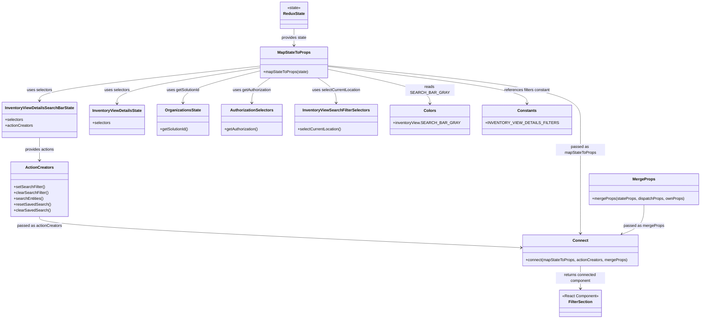

# Diagram: web/portal/src/pages/inventoryview/details/search/InventoryView.Details.FilterSectionContainer.js


> Auto-generated by Obscura crawlers

## Diagram 1



### SVG

<svg id="container" width="2739.4140625" xmlns="http://www.w3.org/2000/svg" class="classDiagram" height="1268" viewBox="0 0 2739.4140625 1268" role="graphics-document document" aria-roledescription="class"><style>#container{font-family:"trebuchet ms",verdana,arial,sans-serif;font-size:16px;fill:#333;}@keyframes edge-animation-frame{from{stroke-dashoffset:0;}}@keyframes dash{to{stroke-dashoffset:0;}}#container .edge-animation-slow{stroke-dasharray:9,5!important;stroke-dashoffset:900;animation:dash 50s linear infinite;stroke-linecap:round;}#container .edge-animation-fast{stroke-dasharray:9,5!important;stroke-dashoffset:900;animation:dash 20s linear infinite;stroke-linecap:round;}#container .error-icon{fill:#552222;}#container .error-text{fill:#552222;stroke:#552222;}#container .edge-thickness-normal{stroke-width:1px;}#container .edge-thickness-thick{stroke-width:3.5px;}#container .edge-pattern-solid{stroke-dasharray:0;}#container .edge-thickness-invisible{stroke-width:0;fill:none;}#container .edge-pattern-dashed{stroke-dasharray:3;}#container .edge-pattern-dotted{stroke-dasharray:2;}#container .marker{fill:#333333;stroke:#333333;}#container .marker.cross{stroke:#333333;}#container svg{font-family:"trebuchet ms",verdana,arial,sans-serif;font-size:16px;}#container p{margin:0;}#container g.classGroup text{fill:#9370DB;stroke:none;font-family:"trebuchet ms",verdana,arial,sans-serif;font-size:10px;}#container g.classGroup text .title{font-weight:bolder;}#container .nodeLabel,#container .edgeLabel{color:#131300;}#container .edgeLabel .label rect{fill:#ECECFF;}#container .label text{fill:#131300;}#container .labelBkg{background:#ECECFF;}#container .edgeLabel .label span{background:#ECECFF;}#container .classTitle{font-weight:bolder;}#container .node rect,#container .node circle,#container .node ellipse,#container .node polygon,#container .node path{fill:#ECECFF;stroke:#9370DB;stroke-width:1px;}#container .divider{stroke:#9370DB;stroke-width:1;}#container g.clickable{cursor:pointer;}#container g.classGroup rect{fill:#ECECFF;stroke:#9370DB;}#container g.classGroup line{stroke:#9370DB;stroke-width:1;}#container .classLabel .box{stroke:none;stroke-width:0;fill:#ECECFF;opacity:0.5;}#container .classLabel .label{fill:#9370DB;font-size:10px;}#container .relation{stroke:#333333;stroke-width:1;fill:none;}#container .dashed-line{stroke-dasharray:3;}#container .dotted-line{stroke-dasharray:1 2;}#container #compositionStart,#container .composition{fill:#333333!important;stroke:#333333!important;stroke-width:1;}#container #compositionEnd,#container .composition{fill:#333333!important;stroke:#333333!important;stroke-width:1;}#container #dependencyStart,#container .dependency{fill:#333333!important;stroke:#333333!important;stroke-width:1;}#container #dependencyStart,#container .dependency{fill:#333333!important;stroke:#333333!important;stroke-width:1;}#container #extensionStart,#container .extension{fill:transparent!important;stroke:#333333!important;stroke-width:1;}#container #extensionEnd,#container .extension{fill:transparent!important;stroke:#333333!important;stroke-width:1;}#container #aggregationStart,#container .aggregation{fill:transparent!important;stroke:#333333!important;stroke-width:1;}#container #aggregationEnd,#container .aggregation{fill:transparent!important;stroke:#333333!important;stroke-width:1;}#container #lollipopStart,#container .lollipop{fill:#ECECFF!important;stroke:#333333!important;stroke-width:1;}#container #lollipopEnd,#container .lollipop{fill:#ECECFF!important;stroke:#333333!important;stroke-width:1;}#container .edgeTerminals{font-size:11px;line-height:initial;}#container .classTitleText{text-anchor:middle;font-size:18px;fill:#333;}#container .label-icon{display:inline-block;height:1em;overflow:visible;vertical-align:-0.125em;}#container .node .label-icon path{fill:currentColor;stroke:revert;stroke-width:revert;}#container :root{--mermaid-font-family:"trebuchet ms",verdana,arial,sans-serif;}</style><g><defs><marker id="container_class-aggregationStart" class="marker aggregation class" refX="18" refY="7" markerWidth="190" markerHeight="240" orient="auto"><path d="M 18,7 L9,13 L1,7 L9,1 Z"></path></marker></defs><defs><marker id="container_class-aggregationEnd" class="marker aggregation class" refX="1" refY="7" markerWidth="20" markerHeight="28" orient="auto"><path d="M 18,7 L9,13 L1,7 L9,1 Z"></path></marker></defs><defs><marker id="container_class-extensionStart" class="marker extension class" refX="18" refY="7" markerWidth="190" markerHeight="240" orient="auto"><path d="M 1,7 L18,13 V 1 Z"></path></marker></defs><defs><marker id="container_class-extensionEnd" class="marker extension class" refX="1" refY="7" markerWidth="20" markerHeight="28" orient="auto"><path d="M 1,1 V 13 L18,7 Z"></path></marker></defs><defs><marker id="container_class-compositionStart" class="marker composition class" refX="18" refY="7" markerWidth="190" markerHeight="240" orient="auto"><path d="M 18,7 L9,13 L1,7 L9,1 Z"></path></marker></defs><defs><marker id="container_class-compositionEnd" class="marker composition class" refX="1" refY="7" markerWidth="20" markerHeight="28" orient="auto"><path d="M 18,7 L9,13 L1,7 L9,1 Z"></path></marker></defs><defs><marker id="container_class-dependencyStart" class="marker dependency class" refX="6" refY="7" markerWidth="190" markerHeight="240" orient="auto"><path d="M 5,7 L9,13 L1,7 L9,1 Z"></path></marker></defs><defs><marker id="container_class-dependencyEnd" class="marker dependency class" refX="13" refY="7" markerWidth="20" markerHeight="28" orient="auto"><path d="M 18,7 L9,13 L14,7 L9,1 Z"></path></marker></defs><defs><marker id="container_class-lollipopStart" class="marker lollipop class" refX="13" refY="7" markerWidth="190" markerHeight="240" orient="auto"><circle stroke="black" fill="transparent" cx="7" cy="7" r="6"></circle></marker></defs><defs><marker id="container_class-lollipopEnd" class="marker lollipop class" refX="1" refY="7" markerWidth="190" markerHeight="240" orient="auto"><circle stroke="black" fill="transparent" cx="7" cy="7" r="6"></circle></marker></defs><g class="root"><g class="clusters"></g><g class="edgePaths"><path d="M1171.531,116L1171.531,122.167C1171.531,128.333,1171.531,140.667,1171.531,152C1171.531,163.333,1171.531,173.667,1171.531,178.833L1171.531,184" id="id_ReduxState_MapStateToProps_1" class="edge-thickness-normal edge-pattern-solid relation" style=";;;" data-edge="true" data-et="edge" data-id="id_ReduxState_MapStateToProps_1" data-points="W3sieCI6MTE3MS41MzEyNSwieSI6MTE2fSx7IngiOjExNzEuNTMxMjUsInkiOjE1M30seyJ4IjoxMTcxLjUzMTI1LCJ5IjoxOTB9XQ==" marker-end="url(#container_class-dependencyEnd)"></path><path d="M1036.688,266.255L889.611,280.713C742.534,295.17,448.38,324.085,301.303,343.709C154.227,363.333,154.227,373.667,154.227,378.833L154.227,384" id="id_MapStateToProps_InventoryViewDetailsSearchBarState_2" class="edge-thickness-normal edge-pattern-solid relation" style=";;;" data-edge="true" data-et="edge" data-id="id_MapStateToProps_InventoryViewDetailsSearchBarState_2" data-points="W3sieCI6MTAzNi42ODc1LCJ5IjoyNjYuMjU1MDAxMzQzOTMxMn0seyJ4IjoxNTQuMjI2NTYyNSwieSI6MzUzfSx7IngiOjE1NC4yMjY1NjI1LCJ5IjozOTB9XQ==" marker-end="url(#container_class-dependencyEnd)"></path><path d="M1036.688,271.936L940.479,285.447C844.271,298.957,651.854,325.979,555.646,346.656C459.438,367.333,459.438,381.667,459.438,388.833L459.438,396" id="id_MapStateToProps_InventoryViewDetailsState_3" class="edge-thickness-normal edge-pattern-solid relation" style=";;;" data-edge="true" data-et="edge" data-id="id_MapStateToProps_InventoryViewDetailsState_3" data-points="W3sieCI6MTAzNi42ODc1LCJ5IjoyNzEuOTM2MjM1NTcyOTE0Mzd9LHsieCI6NDU5LjQzNzUsInkiOjM1M30seyJ4Ijo0NTkuNDM3NSwieSI6NDAyfV0=" marker-end="url(#container_class-dependencyEnd)"></path><path d="M1036.688,283.097L984.489,294.747C932.29,306.398,827.893,329.699,775.695,348.016C723.496,366.333,723.496,379.667,723.496,386.333L723.496,393" id="id_MapStateToProps_OrganizationsState_4" class="edge-thickness-normal edge-pattern-solid relation" style=";;;" data-edge="true" data-et="edge" data-id="id_MapStateToProps_OrganizationsState_4" data-points="W3sieCI6MTAzNi42ODc1LCJ5IjoyODMuMDk2Njg5NTM4NTIzMjZ9LHsieCI6NzIzLjQ5NjA5Mzc1LCJ5IjozNTN9LHsieCI6NzIzLjQ5NjA5Mzc1LCJ5IjozOTl9XQ==" marker-end="url(#container_class-dependencyEnd)"></path><path d="M1064.746,316L1054.294,322.167C1043.841,328.333,1022.936,340.667,1012.484,353.5C1002.031,366.333,1002.031,379.667,1002.031,386.333L1002.031,393" id="id_MapStateToProps_AuthorizationSelectors_5" class="edge-thickness-normal edge-pattern-solid relation" style=";;;" data-edge="true" data-et="edge" data-id="id_MapStateToProps_AuthorizationSelectors_5" data-points="W3sieCI6MTA2NC43NDYyNSwieSI6MzE2fSx7IngiOjEwMDIuMDMxMjUsInkiOjM1M30seyJ4IjoxMDAyLjAzMTI1LCJ5IjozOTl9XQ==" marker-end="url(#container_class-dependencyEnd)"></path><path d="M1278.316,316L1288.769,322.167C1299.221,328.333,1320.126,340.667,1330.579,353.5C1341.031,366.333,1341.031,379.667,1341.031,386.333L1341.031,393" id="id_MapStateToProps_InventoryViewSearchFilterSelectors_6" class="edge-thickness-normal edge-pattern-solid relation" style=";;;" data-edge="true" data-et="edge" data-id="id_MapStateToProps_InventoryViewSearchFilterSelectors_6" data-points="W3sieCI6MTI3OC4zMTYyNSwieSI6MzE2fSx7IngiOjEzNDEuMDMxMjUsInkiOjM1M30seyJ4IjoxMzQxLjAzMTI1LCJ5IjozOTl9XQ==" marker-end="url(#container_class-dependencyEnd)"></path><path d="M1306.375,278.247L1372.916,290.706C1439.457,303.165,1572.539,328.082,1639.08,347.708C1705.621,367.333,1705.621,381.667,1705.621,388.833L1705.621,396" id="id_MapStateToProps_Colors_7" class="edge-thickness-normal edge-pattern-solid relation" style=";;;" data-edge="true" data-et="edge" data-id="id_MapStateToProps_Colors_7" data-points="W3sieCI6MTMwNi4zNzUsInkiOjI3OC4yNDczOTA3ODYwMTg4NX0seyJ4IjoxNzA1LjYyMTA5Mzc1LCJ5IjozNTN9LHsieCI6MTcwNS42MjEwOTM3NSwieSI6NDAyfV0=" marker-end="url(#container_class-dependencyEnd)"></path><path d="M1306.375,268.121L1432.529,282.267C1558.684,296.414,1810.992,324.707,1937.146,346.02C2063.301,367.333,2063.301,381.667,2063.301,388.833L2063.301,396" id="id_MapStateToProps_Constants_8" class="edge-thickness-normal edge-pattern-solid relation" style=";;;" data-edge="true" data-et="edge" data-id="id_MapStateToProps_Constants_8" data-points="W3sieCI6MTMwNi4zNzUsInkiOjI2OC4xMjA5MTkxNjk2NjM1fSx7IngiOjIwNjMuMzAwNzgxMjUsInkiOjM1M30seyJ4IjoyMDYzLjMwMDc4MTI1LCJ5Ijo0MDJ9XQ==" marker-end="url(#container_class-dependencyEnd)"></path><path d="M154.227,534L154.227,542.167C154.227,550.333,154.227,566.667,154.227,582C154.227,597.333,154.227,611.667,154.227,618.833L154.227,626" id="id_InventoryViewDetailsSearchBarState_ActionCreators_9" class="edge-thickness-normal edge-pattern-solid relation" style=";;;" data-edge="true" data-et="edge" data-id="id_InventoryViewDetailsSearchBarState_ActionCreators_9" data-points="W3sieCI6MTU0LjIyNjU2MjUsInkiOjUzNH0seyJ4IjoxNTQuMjI2NTYyNSwieSI6NTgzfSx7IngiOjE1NC4yMjY1NjI1LCJ5Ijo2MzJ9XQ==" marker-end="url(#container_class-dependencyEnd)"></path><path d="M154.227,854L154.227,860.167C154.227,866.333,154.227,878.667,464.992,899.613C775.757,920.559,1397.288,950.117,1708.054,964.897L2018.819,979.676" id="id_ActionCreators_Connect_10" class="edge-thickness-normal edge-pattern-solid relation" style=";;;" data-edge="true" data-et="edge" data-id="id_ActionCreators_Connect_10" data-points="W3sieCI6MTU0LjIyNjU2MjUsInkiOjg1NH0seyJ4IjoxNTQuMjI2NTYyNSwieSI6ODkxfSx7IngiOjIwMjQuODEyNSwieSI6OTc5Ljk2MTAxMDAwOTQzNzJ9XQ==" marker-end="url(#container_class-dependencyEnd)"></path><path d="M1306.375,265.423L1464.801,280.02C1623.227,294.616,1940.078,323.808,2098.504,356.571C2256.93,389.333,2256.93,425.667,2256.93,464C2256.93,502.333,2256.93,542.667,2256.93,589.5C2256.93,636.333,2256.93,689.667,2256.93,741C2256.93,792.333,2256.93,841.667,2256.93,871.5C2256.93,901.333,2256.93,911.667,2256.93,916.833L2256.93,922" id="id_MapStateToProps_Connect_11" class="edge-thickness-normal edge-pattern-solid relation" style=";;;" data-edge="true" data-et="edge" data-id="id_MapStateToProps_Connect_11" data-points="W3sieCI6MTMwNi4zNzUsInkiOjI2NS40MjM0MzMyMTUwNDkyfSx7IngiOjIyNTYuOTI5Njg3NSwieSI6MzUzfSx7IngiOjIyNTYuOTI5Njg3NSwieSI6NDYyfSx7IngiOjIyNTYuOTI5Njg3NSwieSI6NTgzfSx7IngiOjIyNTYuOTI5Njg3NSwieSI6NzQzfSx7IngiOjIyNTYuOTI5Njg3NSwieSI6ODkxfSx7IngiOjIyNTYuOTI5Njg3NSwieSI6OTI4fV0=" marker-end="url(#container_class-dependencyEnd)"></path><path d="M2511.672,806L2511.672,820.167C2511.672,834.333,2511.672,862.667,2496.894,882.635C2482.115,902.603,2452.559,914.205,2437.781,920.006L2423.002,925.808" id="id_MergeProps_Connect_12" class="edge-thickness-normal edge-pattern-solid relation" style=";;;" data-edge="true" data-et="edge" data-id="id_MergeProps_Connect_12" data-points="W3sieCI6MjUxMS42NzE4NzUsInkiOjgwNn0seyJ4IjoyNTExLjY3MTg3NSwieSI6ODkxfSx7IngiOjI0MTcuNDE3MjY1NjI1LCJ5Ijo5Mjh9XQ==" marker-end="url(#container_class-dependencyEnd)"></path><path d="M2256.93,1054L2256.93,1062.167C2256.93,1070.333,2256.93,1086.667,2256.93,1102C2256.93,1117.333,2256.93,1131.667,2256.93,1138.833L2256.93,1146" id="id_Connect_FilterSection_13" class="edge-thickness-normal edge-pattern-solid relation" style=";;;" data-edge="true" data-et="edge" data-id="id_Connect_FilterSection_13" data-points="W3sieCI6MjI1Ni45Mjk2ODc1LCJ5IjoxMDU0fSx7IngiOjIyNTYuOTI5Njg3NSwieSI6MTEwM30seyJ4IjoyMjU2LjkyOTY4NzUsInkiOjExNTJ9XQ==" marker-end="url(#container_class-dependencyEnd)"></path></g><g class="edgeLabels"><g class="edgeLabel" transform="translate(1171.53125, 153)"><g class="label" data-id="id_ReduxState_MapStateToProps_1" transform="translate(-51.484375, -12)"><foreignObject width="102.96875" height="24"><div xmlns="http://www.w3.org/1999/xhtml" class="labelBkg" style="display: table-cell; white-space: nowrap; line-height: 1.5; max-width: 200px; text-align: center;"><span class="edgeLabel"><p>provides state</p></span></div></foreignObject></g></g><g class="edgeLabel" transform="translate(154.2265625, 353)"><g class="label" data-id="id_MapStateToProps_InventoryViewDetailsSearchBarState_2" transform="translate(-51.34375, -12)"><foreignObject width="102.6875" height="24"><div xmlns="http://www.w3.org/1999/xhtml" class="labelBkg" style="display: table-cell; white-space: nowrap; line-height: 1.5; max-width: 200px; text-align: center;"><span class="edgeLabel"><p>uses selectors</p></span></div></foreignObject></g></g><g class="edgeLabel" transform="translate(459.4375, 353)"><g class="label" data-id="id_MapStateToProps_InventoryViewDetailsState_3" transform="translate(-51.34375, -12)"><foreignObject width="102.6875" height="24"><div xmlns="http://www.w3.org/1999/xhtml" class="labelBkg" style="display: table-cell; white-space: nowrap; line-height: 1.5; max-width: 200px; text-align: center;"><span class="edgeLabel"><p>uses selectors</p></span></div></foreignObject></g></g><g class="edgeLabel" transform="translate(723.49609375, 353)"><g class="label" data-id="id_MapStateToProps_OrganizationsState_4" transform="translate(-67.5703125, -12)"><foreignObject width="135.140625" height="24"><div xmlns="http://www.w3.org/1999/xhtml" class="labelBkg" style="display: table-cell; white-space: nowrap; line-height: 1.5; max-width: 200px; text-align: center;"><span class="edgeLabel"><p>uses getSolutionId</p></span></div></foreignObject></g></g><g class="edgeLabel" transform="translate(1002.03125, 353)"><g class="label" data-id="id_MapStateToProps_AuthorizationSelectors_5" transform="translate(-78.953125, -12)"><foreignObject width="157.90625" height="24"><div xmlns="http://www.w3.org/1999/xhtml" class="labelBkg" style="display: table-cell; white-space: nowrap; line-height: 1.5; max-width: 200px; text-align: center;"><span class="edgeLabel"><p>uses getAuthorization</p></span></div></foreignObject></g></g><g class="edgeLabel" transform="translate(1341.03125, 353)"><g class="label" data-id="id_MapStateToProps_InventoryViewSearchFilterSelectors_6" transform="translate(-98.015625, -12)"><foreignObject width="196.03125" height="24"><div xmlns="http://www.w3.org/1999/xhtml" class="labelBkg" style="display: table-cell; white-space: nowrap; line-height: 1.5; max-width: 200px; text-align: center;"><span class="edgeLabel"><p>uses selectCurrentLocation</p></span></div></foreignObject></g></g><g class="edgeLabel" transform="translate(1705.62109375, 353)"><g class="label" data-id="id_MapStateToProps_Colors_7" transform="translate(-90.765625, -12)"><foreignObject width="181.53125" height="24"><div xmlns="http://www.w3.org/1999/xhtml" class="labelBkg" style="display: table-cell; white-space: nowrap; line-height: 1.5; max-width: 200px; text-align: center;"><span class="edgeLabel"><p>reads SEARCH_BAR_GRAY</p></span></div></foreignObject></g></g><g class="edgeLabel" transform="translate(2063.30078125, 353)"><g class="label" data-id="id_MapStateToProps_Constants_8" transform="translate(-94.3671875, -12)"><foreignObject width="188.734375" height="24"><div xmlns="http://www.w3.org/1999/xhtml" class="labelBkg" style="display: table-cell; white-space: nowrap; line-height: 1.5; max-width: 200px; text-align: center;"><span class="edgeLabel"><p>references filters constant</p></span></div></foreignObject></g></g><g class="edgeLabel" transform="translate(154.2265625, 583)"><g class="label" data-id="id_InventoryViewDetailsSearchBarState_ActionCreators_9" transform="translate(-59.8515625, -12)"><foreignObject width="119.703125" height="24"><div xmlns="http://www.w3.org/1999/xhtml" class="labelBkg" style="display: table-cell; white-space: nowrap; line-height: 1.5; max-width: 200px; text-align: center;"><span class="edgeLabel"><p>provides actions</p></span></div></foreignObject></g></g><g class="edgeLabel" transform="translate(154.2265625, 891)"><g class="label" data-id="id_ActionCreators_Connect_10" transform="translate(-90.3984375, -12)"><foreignObject width="180.796875" height="24"><div xmlns="http://www.w3.org/1999/xhtml" class="labelBkg" style="display: table-cell; white-space: nowrap; line-height: 1.5; max-width: 200px; text-align: center;"><span class="edgeLabel"><p>passed as actionCreators</p></span></div></foreignObject></g></g><g class="edgeLabel" transform="translate(2256.9296875, 583)"><g class="label" data-id="id_MapStateToProps_Connect_11" transform="translate(-100, -24)"><foreignObject width="200" height="48"><div xmlns="http://www.w3.org/1999/xhtml" class="labelBkg" style="display: table; white-space: break-spaces; line-height: 1.5; max-width: 200px; text-align: center; width: 200px;"><span class="edgeLabel"><p>passed as mapStateToProps</p></span></div></foreignObject></g></g><g class="edgeLabel" transform="translate(2511.671875, 891)"><g class="label" data-id="id_MergeProps_Connect_12" transform="translate(-80.8046875, -12)"><foreignObject width="161.609375" height="24"><div xmlns="http://www.w3.org/1999/xhtml" class="labelBkg" style="display: table-cell; white-space: nowrap; line-height: 1.5; max-width: 200px; text-align: center;"><span class="edgeLabel"><p>passed as mergeProps</p></span></div></foreignObject></g></g><g class="edgeLabel" transform="translate(2256.9296875, 1103)"><g class="label" data-id="id_Connect_FilterSection_13" transform="translate(-100, -24)"><foreignObject width="200" height="48"><div xmlns="http://www.w3.org/1999/xhtml" class="labelBkg" style="display: table; white-space: break-spaces; line-height: 1.5; max-width: 200px; text-align: center; width: 200px;"><span class="edgeLabel"><p>returns connected component</p></span></div></foreignObject></g></g></g><g class="nodes"><g class="node default" id="classId-ReduxState-0" transform="translate(1171.53125, 62)"><g class="basic label-container"><path d="M-54.0234375 -54 L54.0234375 -54 L54.0234375 54 L-54.0234375 54" stroke="none" stroke-width="0" fill="#ECECFF" style=""></path><path d="M-54.0234375 -54 C-13.962517828325645 -54, 26.09840184334871 -54, 54.0234375 -54 M-54.0234375 -54 C-11.763426344250902 -54, 30.496584811498195 -54, 54.0234375 -54 M54.0234375 -54 C54.0234375 -12.29387913071983, 54.0234375 29.41224173856034, 54.0234375 54 M54.0234375 -54 C54.0234375 -27.770838414947416, 54.0234375 -1.5416768298948327, 54.0234375 54 M54.0234375 54 C16.149996240330445 54, -21.72344501933911 54, -54.0234375 54 M54.0234375 54 C32.22592140587604 54, 10.428405311752087 54, -54.0234375 54 M-54.0234375 54 C-54.0234375 31.53625604426963, -54.0234375 9.072512088539263, -54.0234375 -54 M-54.0234375 54 C-54.0234375 13.586908624253859, -54.0234375 -26.826182751492283, -54.0234375 -54" stroke="#9370DB" stroke-width="1.3" fill="none" stroke-dasharray="0 0" style=""></path></g><g class="annotation-group text" transform="translate(-27.0234375, -30)"><g class="label" style="" transform="translate(0,-12)"><foreignObject width="54.046875" height="24"><div xmlns="http://www.w3.org/1999/xhtml" style="display: table-cell; white-space: nowrap; line-height: 1.5; max-width: 104px; text-align: center;"><span class="nodeLabel markdown-node-label" style=""><p>«state»</p></span></div></foreignObject></g></g><g class="label-group text" transform="translate(-42.0234375, -6)"><g class="label" style="font-weight: bolder" transform="translate(0,-12)"><foreignObject width="84.046875" height="24"><div xmlns="http://www.w3.org/1999/xhtml" style="display: table-cell; white-space: nowrap; line-height: 1.5; max-width: 132px; text-align: center;"><span class="nodeLabel markdown-node-label" style=""><p>ReduxState</p></span></div></foreignObject></g></g><g class="members-group text" transform="translate(-42.0234375, 42)"></g><g class="methods-group text" transform="translate(-42.0234375, 72)"></g><g class="divider" style=""><path d="M-54.0234375 18 C-17.616898831577245 18, 18.78963983684551 18, 54.0234375 18 M-54.0234375 18 C-13.767128087776989 18, 26.489181324446022 18, 54.0234375 18" stroke="#9370DB" stroke-width="1.3" fill="none" stroke-dasharray="0 0" style=""></path></g><g class="divider" style=""><path d="M-54.0234375 36 C-12.191266955153282 36, 29.640903589693437 36, 54.0234375 36 M-54.0234375 36 C-17.776284977490015 36, 18.47086754501997 36, 54.0234375 36" stroke="#9370DB" stroke-width="1.3" fill="none" stroke-dasharray="0 0" style=""></path></g></g><g class="node default" id="classId-InventoryViewDetailsSearchBarState-1" transform="translate(154.2265625, 462)"><g class="basic label-container"><path d="M-146.2265625 -72 L146.2265625 -72 L146.2265625 72 L-146.2265625 72" stroke="none" stroke-width="0" fill="#ECECFF" style=""></path><path d="M-146.2265625 -72 C-36.447558295092065 -72, 73.33144590981587 -72, 146.2265625 -72 M-146.2265625 -72 C-78.19432698305668 -72, -10.162091466113367 -72, 146.2265625 -72 M146.2265625 -72 C146.2265625 -35.633601398494996, 146.2265625 0.7327972030100085, 146.2265625 72 M146.2265625 -72 C146.2265625 -14.77427374974333, 146.2265625 42.45145250051334, 146.2265625 72 M146.2265625 72 C84.98384364703784 72, 23.741124794075688 72, -146.2265625 72 M146.2265625 72 C48.328102280243726 72, -49.57035793951255 72, -146.2265625 72 M-146.2265625 72 C-146.2265625 39.29797722271411, -146.2265625 6.5959544454282195, -146.2265625 -72 M-146.2265625 72 C-146.2265625 38.446356297140476, -146.2265625 4.892712594280951, -146.2265625 -72" stroke="#9370DB" stroke-width="1.3" fill="none" stroke-dasharray="0 0" style=""></path></g><g class="annotation-group text" transform="translate(0, -48)"></g><g class="label-group text" transform="translate(-134.2265625, -48)"><g class="label" style="font-weight: bolder" transform="translate(0,-12)"><foreignObject width="268.453125" height="24"><div xmlns="http://www.w3.org/1999/xhtml" style="display: table-cell; white-space: nowrap; line-height: 1.5; max-width: 313px; text-align: center;"><span class="nodeLabel markdown-node-label" style=""><p>InventoryViewDetailsSearchBarState</p></span></div></foreignObject></g></g><g class="members-group text" transform="translate(-134.2265625, 0)"><g class="label" style="" transform="translate(0,-12)"><foreignObject width="73.453125" height="24"><div xmlns="http://www.w3.org/1999/xhtml" style="display: table-cell; white-space: nowrap; line-height: 1.5; max-width: 131px; text-align: center;"><span class="nodeLabel markdown-node-label" style=""><p>+selectors</p></span></div></foreignObject></g><g class="label" style="" transform="translate(0,12)"><foreignObject width="113.078125" height="24"><div xmlns="http://www.w3.org/1999/xhtml" style="display: table-cell; white-space: nowrap; line-height: 1.5; max-width: 170px; text-align: center;"><span class="nodeLabel markdown-node-label" style=""><p>+actionCreators</p></span></div></foreignObject></g></g><g class="methods-group text" transform="translate(-134.2265625, 72)"></g><g class="divider" style=""><path d="M-146.2265625 -24 C-42.183665389120264 -24, 61.85923172175947 -24, 146.2265625 -24 M-146.2265625 -24 C-70.06555346428654 -24, 6.095455571426925 -24, 146.2265625 -24" stroke="#9370DB" stroke-width="1.3" fill="none" stroke-dasharray="0 0" style=""></path></g><g class="divider" style=""><path d="M-146.2265625 48 C-54.72815781522627 48, 36.770246869547464 48, 146.2265625 48 M-146.2265625 48 C-81.37586558304716 48, -16.525168666094316 48, 146.2265625 48" stroke="#9370DB" stroke-width="1.3" fill="none" stroke-dasharray="0 0" style=""></path></g></g><g class="node default" id="classId-InventoryViewDetailsState-2" transform="translate(459.4375, 462)"><g class="basic label-container"><path d="M-108.984375 -60 L108.984375 -60 L108.984375 60 L-108.984375 60" stroke="none" stroke-width="0" fill="#ECECFF" style=""></path><path d="M-108.984375 -60 C-35.1413882811475 -60, 38.701598437705 -60, 108.984375 -60 M-108.984375 -60 C-60.136211284187475 -60, -11.28804756837495 -60, 108.984375 -60 M108.984375 -60 C108.984375 -34.5185371145295, 108.984375 -9.037074229059002, 108.984375 60 M108.984375 -60 C108.984375 -30.128570557716387, 108.984375 -0.2571411154327734, 108.984375 60 M108.984375 60 C55.33210999983183 60, 1.6798449996636577 60, -108.984375 60 M108.984375 60 C54.89242599310037 60, 0.800476986200735 60, -108.984375 60 M-108.984375 60 C-108.984375 35.863792863102645, -108.984375 11.727585726205298, -108.984375 -60 M-108.984375 60 C-108.984375 18.836711466565653, -108.984375 -22.326577066868694, -108.984375 -60" stroke="#9370DB" stroke-width="1.3" fill="none" stroke-dasharray="0 0" style=""></path></g><g class="annotation-group text" transform="translate(0, -36)"></g><g class="label-group text" transform="translate(-96.984375, -36)"><g class="label" style="font-weight: bolder" transform="translate(0,-12)"><foreignObject width="193.96875" height="24"><div xmlns="http://www.w3.org/1999/xhtml" style="display: table-cell; white-space: nowrap; line-height: 1.5; max-width: 240px; text-align: center;"><span class="nodeLabel markdown-node-label" style=""><p>InventoryViewDetailsState</p></span></div></foreignObject></g></g><g class="members-group text" transform="translate(-96.984375, 12)"><g class="label" style="" transform="translate(0,-12)"><foreignObject width="73.453125" height="24"><div xmlns="http://www.w3.org/1999/xhtml" style="display: table-cell; white-space: nowrap; line-height: 1.5; max-width: 131px; text-align: center;"><span class="nodeLabel markdown-node-label" style=""><p>+selectors</p></span></div></foreignObject></g></g><g class="methods-group text" transform="translate(-96.984375, 60)"></g><g class="divider" style=""><path d="M-108.984375 -12 C-25.70542043581517 -12, 57.57353412836966 -12, 108.984375 -12 M-108.984375 -12 C-59.51143769253045 -12, -10.0385003850609 -12, 108.984375 -12" stroke="#9370DB" stroke-width="1.3" fill="none" stroke-dasharray="0 0" style=""></path></g><g class="divider" style=""><path d="M-108.984375 36 C-55.56027278435171 36, -2.1361705687034203 36, 108.984375 36 M-108.984375 36 C-45.22708066643706 36, 18.530213667125878 36, 108.984375 36" stroke="#9370DB" stroke-width="1.3" fill="none" stroke-dasharray="0 0" style=""></path></g></g><g class="node default" id="classId-OrganizationsState-3" transform="translate(723.49609375, 462)"><g class="basic label-container"><path d="M-105.07421875 -63 L105.07421875 -63 L105.07421875 63 L-105.07421875 63" stroke="none" stroke-width="0" fill="#ECECFF" style=""></path><path d="M-105.07421875 -63 C-24.60543415817662 -63, 55.86335043364676 -63, 105.07421875 -63 M-105.07421875 -63 C-22.83557179977754 -63, 59.40307515044492 -63, 105.07421875 -63 M105.07421875 -63 C105.07421875 -22.851081138526673, 105.07421875 17.297837722946653, 105.07421875 63 M105.07421875 -63 C105.07421875 -35.166417569682054, 105.07421875 -7.3328351393641, 105.07421875 63 M105.07421875 63 C27.373679441243254 63, -50.32685986751349 63, -105.07421875 63 M105.07421875 63 C27.84852385785328 63, -49.37717103429344 63, -105.07421875 63 M-105.07421875 63 C-105.07421875 13.870873673665308, -105.07421875 -35.258252652669384, -105.07421875 -63 M-105.07421875 63 C-105.07421875 20.672652030554396, -105.07421875 -21.65469593889121, -105.07421875 -63" stroke="#9370DB" stroke-width="1.3" fill="none" stroke-dasharray="0 0" style=""></path></g><g class="annotation-group text" transform="translate(0, -39)"></g><g class="label-group text" transform="translate(-69.8671875, -39)"><g class="label" style="font-weight: bolder" transform="translate(0,-12)"><foreignObject width="139.734375" height="24"><div xmlns="http://www.w3.org/1999/xhtml" style="display: table-cell; white-space: nowrap; line-height: 1.5; max-width: 187px; text-align: center;"><span class="nodeLabel markdown-node-label" style=""><p>OrganizationsState</p></span></div></foreignObject></g></g><g class="members-group text" transform="translate(-93.07421875, 9)"></g><g class="methods-group text" transform="translate(-93.07421875, 39)"><g class="label" style="" transform="translate(0,-12)"><foreignObject width="116.28125" height="24"><div xmlns="http://www.w3.org/1999/xhtml" style="display: table-cell; white-space: nowrap; line-height: 1.5; max-width: 174px; text-align: center;"><span class="nodeLabel markdown-node-label" style=""><p>+getSolutionId()</p></span></div></foreignObject></g></g><g class="divider" style=""><path d="M-105.07421875 -15 C-26.06698485082201 -15, 52.94024904835598 -15, 105.07421875 -15 M-105.07421875 -15 C-60.65691813532877 -15, -16.239617520657546 -15, 105.07421875 -15" stroke="#9370DB" stroke-width="1.3" fill="none" stroke-dasharray="0 0" style=""></path></g><g class="divider" style=""><path d="M-105.07421875 9 C-54.34974220962717 9, -3.625265669254347 9, 105.07421875 9 M-105.07421875 9 C-38.048760635729536 9, 28.976697478540927 9, 105.07421875 9" stroke="#9370DB" stroke-width="1.3" fill="none" stroke-dasharray="0 0" style=""></path></g></g><g class="node default" id="classId-AuthorizationSelectors-4" transform="translate(1002.03125, 462)"><g class="basic label-container"><path d="M-123.4609375 -63 L123.4609375 -63 L123.4609375 63 L-123.4609375 63" stroke="none" stroke-width="0" fill="#ECECFF" style=""></path><path d="M-123.4609375 -63 C-27.815433844025364 -63, 67.83006981194927 -63, 123.4609375 -63 M-123.4609375 -63 C-51.21169498205272 -63, 21.03754753589456 -63, 123.4609375 -63 M123.4609375 -63 C123.4609375 -21.021829773888662, 123.4609375 20.956340452222676, 123.4609375 63 M123.4609375 -63 C123.4609375 -22.355279972814948, 123.4609375 18.289440054370104, 123.4609375 63 M123.4609375 63 C55.15700424566327 63, -13.146929008673453 63, -123.4609375 63 M123.4609375 63 C40.67016462566376 63, -42.12060824867248 63, -123.4609375 63 M-123.4609375 63 C-123.4609375 26.197389251404232, -123.4609375 -10.605221497191536, -123.4609375 -63 M-123.4609375 63 C-123.4609375 33.173460846404254, -123.4609375 3.3469216928085004, -123.4609375 -63" stroke="#9370DB" stroke-width="1.3" fill="none" stroke-dasharray="0 0" style=""></path></g><g class="annotation-group text" transform="translate(0, -39)"></g><g class="label-group text" transform="translate(-83.875, -39)"><g class="label" style="font-weight: bolder" transform="translate(0,-12)"><foreignObject width="167.75" height="24"><div xmlns="http://www.w3.org/1999/xhtml" style="display: table-cell; white-space: nowrap; line-height: 1.5; max-width: 215px; text-align: center;"><span class="nodeLabel markdown-node-label" style=""><p>AuthorizationSelectors</p></span></div></foreignObject></g></g><g class="members-group text" transform="translate(-111.4609375, 9)"></g><g class="methods-group text" transform="translate(-111.4609375, 39)"><g class="label" style="" transform="translate(0,-12)"><foreignObject width="139.046875" height="24"><div xmlns="http://www.w3.org/1999/xhtml" style="display: table-cell; white-space: nowrap; line-height: 1.5; max-width: 196px; text-align: center;"><span class="nodeLabel markdown-node-label" style=""><p>+getAuthorization()</p></span></div></foreignObject></g></g><g class="divider" style=""><path d="M-123.4609375 -15 C-26.863185204196014 -15, 69.73456709160797 -15, 123.4609375 -15 M-123.4609375 -15 C-62.99642834025503 -15, -2.5319191805100587 -15, 123.4609375 -15" stroke="#9370DB" stroke-width="1.3" fill="none" stroke-dasharray="0 0" style=""></path></g><g class="divider" style=""><path d="M-123.4609375 9 C-45.57566679718322 9, 32.309603905633566 9, 123.4609375 9 M-123.4609375 9 C-72.09801978832425 9, -20.735102076648488 9, 123.4609375 9" stroke="#9370DB" stroke-width="1.3" fill="none" stroke-dasharray="0 0" style=""></path></g></g><g class="node default" id="classId-InventoryViewSearchFilterSelectors-5" transform="translate(1341.03125, 462)"><g class="basic label-container"><path d="M-165.5390625 -63 L165.5390625 -63 L165.5390625 63 L-165.5390625 63" stroke="none" stroke-width="0" fill="#ECECFF" style=""></path><path d="M-165.5390625 -63 C-59.59967123699752 -63, 46.339720026004954 -63, 165.5390625 -63 M-165.5390625 -63 C-54.147828640433715 -63, 57.24340521913257 -63, 165.5390625 -63 M165.5390625 -63 C165.5390625 -30.807040439457168, 165.5390625 1.3859191210856636, 165.5390625 63 M165.5390625 -63 C165.5390625 -29.048061829137787, 165.5390625 4.903876341724427, 165.5390625 63 M165.5390625 63 C92.15179277685591 63, 18.764523053711827 63, -165.5390625 63 M165.5390625 63 C48.28636293730699 63, -68.96633662538602 63, -165.5390625 63 M-165.5390625 63 C-165.5390625 27.168249492688837, -165.5390625 -8.663501014622327, -165.5390625 -63 M-165.5390625 63 C-165.5390625 28.11181874552117, -165.5390625 -6.776362508957661, -165.5390625 -63" stroke="#9370DB" stroke-width="1.3" fill="none" stroke-dasharray="0 0" style=""></path></g><g class="annotation-group text" transform="translate(0, -39)"></g><g class="label-group text" transform="translate(-129.921875, -39)"><g class="label" style="font-weight: bolder" transform="translate(0,-12)"><foreignObject width="259.84375" height="24"><div xmlns="http://www.w3.org/1999/xhtml" style="display: table-cell; white-space: nowrap; line-height: 1.5; max-width: 305px; text-align: center;"><span class="nodeLabel markdown-node-label" style=""><p>InventoryViewSearchFilterSelectors</p></span></div></foreignObject></g></g><g class="members-group text" transform="translate(-153.5390625, 9)"></g><g class="methods-group text" transform="translate(-153.5390625, 39)"><g class="label" style="" transform="translate(0,-12)"><foreignObject width="177.15625" height="24"><div xmlns="http://www.w3.org/1999/xhtml" style="display: table-cell; white-space: nowrap; line-height: 1.5; max-width: 235px; text-align: center;"><span class="nodeLabel markdown-node-label" style=""><p>+selectCurrentLocation()</p></span></div></foreignObject></g></g><g class="divider" style=""><path d="M-165.5390625 -15 C-56.3130199150481 -15, 52.913022669903796 -15, 165.5390625 -15 M-165.5390625 -15 C-80.4109052573262 -15, 4.717251985347588 -15, 165.5390625 -15" stroke="#9370DB" stroke-width="1.3" fill="none" stroke-dasharray="0 0" style=""></path></g><g class="divider" style=""><path d="M-165.5390625 9 C-45.47769620255626 9, 74.58367009488748 9, 165.5390625 9 M-165.5390625 9 C-85.43031964651045 9, -5.32157679302091 9, 165.5390625 9" stroke="#9370DB" stroke-width="1.3" fill="none" stroke-dasharray="0 0" style=""></path></g></g><g class="node default" id="classId-Colors-6" transform="translate(1705.62109375, 462)"><g class="basic label-container"><path d="M-149.05078125 -60 L149.05078125 -60 L149.05078125 60 L-149.05078125 60" stroke="none" stroke-width="0" fill="#ECECFF" style=""></path><path d="M-149.05078125 -60 C-84.05542643896878 -60, -19.06007162793756 -60, 149.05078125 -60 M-149.05078125 -60 C-84.1905014408705 -60, -19.33022163174101 -60, 149.05078125 -60 M149.05078125 -60 C149.05078125 -25.525037538280976, 149.05078125 8.949924923438047, 149.05078125 60 M149.05078125 -60 C149.05078125 -14.543022426649706, 149.05078125 30.913955146700587, 149.05078125 60 M149.05078125 60 C42.83482270021271 60, -63.38113584957458 60, -149.05078125 60 M149.05078125 60 C42.62919297132984 60, -63.792395307340314 60, -149.05078125 60 M-149.05078125 60 C-149.05078125 33.460056209861264, -149.05078125 6.920112419722528, -149.05078125 -60 M-149.05078125 60 C-149.05078125 22.519076470233777, -149.05078125 -14.961847059532445, -149.05078125 -60" stroke="#9370DB" stroke-width="1.3" fill="none" stroke-dasharray="0 0" style=""></path></g><g class="annotation-group text" transform="translate(0, -36)"></g><g class="label-group text" transform="translate(-23.1015625, -36)"><g class="label" style="font-weight: bolder" transform="translate(0,-12)"><foreignObject width="46.203125" height="24"><div xmlns="http://www.w3.org/1999/xhtml" style="display: table-cell; white-space: nowrap; line-height: 1.5; max-width: 95px; text-align: center;"><span class="nodeLabel markdown-node-label" style=""><p>Colors</p></span></div></foreignObject></g></g><g class="members-group text" transform="translate(-137.05078125, 12)"><g class="label" style="" transform="translate(0,-12)"><foreignObject width="251" height="24"><div xmlns="http://www.w3.org/1999/xhtml" style="display: table-cell; white-space: nowrap; line-height: 1.5; max-width: 309px; text-align: center;"><span class="nodeLabel markdown-node-label" style=""><p>+inventoryView.SEARCH_BAR_GRAY</p></span></div></foreignObject></g></g><g class="methods-group text" transform="translate(-137.05078125, 60)"></g><g class="divider" style=""><path d="M-149.05078125 -12 C-33.21642909023892 -12, 82.61792306952216 -12, 149.05078125 -12 M-149.05078125 -12 C-52.14012870142075 -12, 44.7705238471585 -12, 149.05078125 -12" stroke="#9370DB" stroke-width="1.3" fill="none" stroke-dasharray="0 0" style=""></path></g><g class="divider" style=""><path d="M-149.05078125 36 C-54.49808043730796 36, 40.054620375384076 36, 149.05078125 36 M-149.05078125 36 C-77.09381411629998 36, -5.1368469825999625 36, 149.05078125 36" stroke="#9370DB" stroke-width="1.3" fill="none" stroke-dasharray="0 0" style=""></path></g></g><g class="node default" id="classId-Constants-7" transform="translate(2063.30078125, 462)"><g class="basic label-container"><path d="M-158.62890625 -60 L158.62890625 -60 L158.62890625 60 L-158.62890625 60" stroke="none" stroke-width="0" fill="#ECECFF" style=""></path><path d="M-158.62890625 -60 C-74.23668353629014 -60, 10.155539177419712 -60, 158.62890625 -60 M-158.62890625 -60 C-77.64262229037092 -60, 3.343661669258154 -60, 158.62890625 -60 M158.62890625 -60 C158.62890625 -35.853637986726824, 158.62890625 -11.70727597345364, 158.62890625 60 M158.62890625 -60 C158.62890625 -22.150956755774608, 158.62890625 15.698086488450784, 158.62890625 60 M158.62890625 60 C53.02619537213951 60, -52.57651550572098 60, -158.62890625 60 M158.62890625 60 C91.41501519594703 60, 24.20112414189407 60, -158.62890625 60 M-158.62890625 60 C-158.62890625 25.02714214718921, -158.62890625 -9.94571570562158, -158.62890625 -60 M-158.62890625 60 C-158.62890625 27.940739174281582, -158.62890625 -4.118521651436836, -158.62890625 -60" stroke="#9370DB" stroke-width="1.3" fill="none" stroke-dasharray="0 0" style=""></path></g><g class="annotation-group text" transform="translate(0, -36)"></g><g class="label-group text" transform="translate(-36.5390625, -36)"><g class="label" style="font-weight: bolder" transform="translate(0,-12)"><foreignObject width="73.078125" height="24"><div xmlns="http://www.w3.org/1999/xhtml" style="display: table-cell; white-space: nowrap; line-height: 1.5; max-width: 122px; text-align: center;"><span class="nodeLabel markdown-node-label" style=""><p>Constants</p></span></div></foreignObject></g></g><g class="members-group text" transform="translate(-146.62890625, 12)"><g class="label" style="" transform="translate(0,-12)"><foreignObject width="256.71875" height="24"><div xmlns="http://www.w3.org/1999/xhtml" style="display: table-cell; white-space: nowrap; line-height: 1.5; max-width: 314px; text-align: center;"><span class="nodeLabel markdown-node-label" style=""><p>+INVENTORY_VIEW_DETAILS_FILTERS</p></span></div></foreignObject></g></g><g class="methods-group text" transform="translate(-146.62890625, 60)"></g><g class="divider" style=""><path d="M-158.62890625 -12 C-54.94774531428946 -12, 48.733415621421074 -12, 158.62890625 -12 M-158.62890625 -12 C-80.96369752813625 -12, -3.298488806272502 -12, 158.62890625 -12" stroke="#9370DB" stroke-width="1.3" fill="none" stroke-dasharray="0 0" style=""></path></g><g class="divider" style=""><path d="M-158.62890625 36 C-56.089001549435835 36, 46.45090315112833 36, 158.62890625 36 M-158.62890625 36 C-55.424614468201725 36, 47.77967731359655 36, 158.62890625 36" stroke="#9370DB" stroke-width="1.3" fill="none" stroke-dasharray="0 0" style=""></path></g></g><g class="node default" id="classId-MapStateToProps-8" transform="translate(1171.53125, 253)"><g class="basic label-container"><path d="M-134.84375 -63 L134.84375 -63 L134.84375 63 L-134.84375 63" stroke="none" stroke-width="0" fill="#ECECFF" style=""></path><path d="M-134.84375 -63 C-30.850023927880244 -63, 73.14370214423951 -63, 134.84375 -63 M-134.84375 -63 C-54.46663917918062 -63, 25.910471641638765 -63, 134.84375 -63 M134.84375 -63 C134.84375 -17.276185499586184, 134.84375 28.447629000827632, 134.84375 63 M134.84375 -63 C134.84375 -15.091471556856192, 134.84375 32.81705688628762, 134.84375 63 M134.84375 63 C41.17571253921149 63, -52.49232492157702 63, -134.84375 63 M134.84375 63 C79.24765673424064 63, 23.65156346848127 63, -134.84375 63 M-134.84375 63 C-134.84375 16.606468519658073, -134.84375 -29.787062960683855, -134.84375 -63 M-134.84375 63 C-134.84375 33.66854874272724, -134.84375 4.3370974854544855, -134.84375 -63" stroke="#9370DB" stroke-width="1.3" fill="none" stroke-dasharray="0 0" style=""></path></g><g class="annotation-group text" transform="translate(0, -39)"></g><g class="label-group text" transform="translate(-64.234375, -39)"><g class="label" style="font-weight: bolder" transform="translate(0,-12)"><foreignObject width="128.46875" height="24"><div xmlns="http://www.w3.org/1999/xhtml" style="display: table-cell; white-space: nowrap; line-height: 1.5; max-width: 176px; text-align: center;"><span class="nodeLabel markdown-node-label" style=""><p>MapStateToProps</p></span></div></foreignObject></g></g><g class="members-group text" transform="translate(-122.84375, 9)"></g><g class="methods-group text" transform="translate(-122.84375, 39)"><g class="label" style="" transform="translate(0,-12)"><foreignObject width="181.453125" height="24"><div xmlns="http://www.w3.org/1999/xhtml" style="display: table-cell; white-space: nowrap; line-height: 1.5; max-width: 239px; text-align: center;"><span class="nodeLabel markdown-node-label" style=""><p>+mapStateToProps(state)</p></span></div></foreignObject></g></g><g class="divider" style=""><path d="M-134.84375 -15 C-49.63976313457049 -15, 35.56422373085903 -15, 134.84375 -15 M-134.84375 -15 C-40.58783602194376 -15, 53.668077956112484 -15, 134.84375 -15" stroke="#9370DB" stroke-width="1.3" fill="none" stroke-dasharray="0 0" style=""></path></g><g class="divider" style=""><path d="M-134.84375 9 C-51.095220104964554 9, 32.65330979007089 9, 134.84375 9 M-134.84375 9 C-44.78262544720231 9, 45.27849910559539 9, 134.84375 9" stroke="#9370DB" stroke-width="1.3" fill="none" stroke-dasharray="0 0" style=""></path></g></g><g class="node default" id="classId-ActionCreators-9" transform="translate(154.2265625, 743)"><g class="basic label-container"><path d="M-112.3515625 -111 L112.3515625 -111 L112.3515625 111 L-112.3515625 111" stroke="none" stroke-width="0" fill="#ECECFF" style=""></path><path d="M-112.3515625 -111 C-26.35846179829079 -111, 59.63463890341842 -111, 112.3515625 -111 M-112.3515625 -111 C-32.57148476432096 -111, 47.20859297135809 -111, 112.3515625 -111 M112.3515625 -111 C112.3515625 -56.25778972950632, 112.3515625 -1.515579459012642, 112.3515625 111 M112.3515625 -111 C112.3515625 -55.080818246171454, 112.3515625 0.8383635076570926, 112.3515625 111 M112.3515625 111 C40.72532027341805 111, -30.900921953163902 111, -112.3515625 111 M112.3515625 111 C37.99224238458359 111, -36.36707773083282 111, -112.3515625 111 M-112.3515625 111 C-112.3515625 60.166940464327375, -112.3515625 9.33388092865475, -112.3515625 -111 M-112.3515625 111 C-112.3515625 22.265725435080455, -112.3515625 -66.46854912983909, -112.3515625 -111" stroke="#9370DB" stroke-width="1.3" fill="none" stroke-dasharray="0 0" style=""></path></g><g class="annotation-group text" transform="translate(0, -87)"></g><g class="label-group text" transform="translate(-53.96875, -87)"><g class="label" style="font-weight: bolder" transform="translate(0,-12)"><foreignObject width="107.9375" height="24"><div xmlns="http://www.w3.org/1999/xhtml" style="display: table-cell; white-space: nowrap; line-height: 1.5; max-width: 156px; text-align: center;"><span class="nodeLabel markdown-node-label" style=""><p>ActionCreators</p></span></div></foreignObject></g></g><g class="members-group text" transform="translate(-100.3515625, -39)"></g><g class="methods-group text" transform="translate(-100.3515625, -9)"><g class="label" style="" transform="translate(0,-12)"><foreignObject width="125.953125" height="24"><div xmlns="http://www.w3.org/1999/xhtml" style="display: table-cell; white-space: nowrap; line-height: 1.5; max-width: 183px; text-align: center;"><span class="nodeLabel markdown-node-label" style=""><p>+setSearchFilter()</p></span></div></foreignObject></g><g class="label" style="" transform="translate(0,12)"><foreignObject width="139.6875" height="24"><div xmlns="http://www.w3.org/1999/xhtml" style="display: table-cell; white-space: nowrap; line-height: 1.5; max-width: 197px; text-align: center;"><span class="nodeLabel markdown-node-label" style=""><p>+clearSearchFilter()</p></span></div></foreignObject></g><g class="label" style="" transform="translate(0,36)"><foreignObject width="120.359375" height="24"><div xmlns="http://www.w3.org/1999/xhtml" style="display: table-cell; white-space: nowrap; line-height: 1.5; max-width: 178px; text-align: center;"><span class="nodeLabel markdown-node-label" style=""><p>+searchEntities()</p></span></div></foreignObject></g><g class="label" style="" transform="translate(0,60)"><foreignObject width="146.734375" height="24"><div xmlns="http://www.w3.org/1999/xhtml" style="display: table-cell; white-space: nowrap; line-height: 1.5; max-width: 204px; text-align: center;"><span class="nodeLabel markdown-node-label" style=""><p>+resetSavedSearch()</p></span></div></foreignObject></g><g class="label" style="" transform="translate(0,84)"><foreignObject width="146.046875" height="24"><div xmlns="http://www.w3.org/1999/xhtml" style="display: table-cell; white-space: nowrap; line-height: 1.5; max-width: 203px; text-align: center;"><span class="nodeLabel markdown-node-label" style=""><p>+clearSavedSearch()</p></span></div></foreignObject></g></g><g class="divider" style=""><path d="M-112.3515625 -63 C-53.85318325782991 -63, 4.645195984340177 -63, 112.3515625 -63 M-112.3515625 -63 C-23.45704065328634 -63, 65.43748119342732 -63, 112.3515625 -63" stroke="#9370DB" stroke-width="1.3" fill="none" stroke-dasharray="0 0" style=""></path></g><g class="divider" style=""><path d="M-112.3515625 -39 C-50.028245338822195 -39, 12.29507182235561 -39, 112.3515625 -39 M-112.3515625 -39 C-57.390649857556674 -39, -2.4297372151133487 -39, 112.3515625 -39" stroke="#9370DB" stroke-width="1.3" fill="none" stroke-dasharray="0 0" style=""></path></g></g><g class="node default" id="classId-MergeProps-10" transform="translate(2511.671875, 743)"><g class="basic label-container"><path d="M-219.7421875 -63 L219.7421875 -63 L219.7421875 63 L-219.7421875 63" stroke="none" stroke-width="0" fill="#ECECFF" style=""></path><path d="M-219.7421875 -63 C-106.8954653688153 -63, 5.951256762369411 -63, 219.7421875 -63 M-219.7421875 -63 C-45.184096316620725 -63, 129.37399486675855 -63, 219.7421875 -63 M219.7421875 -63 C219.7421875 -19.573625093762644, 219.7421875 23.852749812474713, 219.7421875 63 M219.7421875 -63 C219.7421875 -32.77360213532958, 219.7421875 -2.547204270659158, 219.7421875 63 M219.7421875 63 C51.59633794740256 63, -116.54951160519488 63, -219.7421875 63 M219.7421875 63 C118.26533404677639 63, 16.788480593552777 63, -219.7421875 63 M-219.7421875 63 C-219.7421875 15.73710735280244, -219.7421875 -31.52578529439512, -219.7421875 -63 M-219.7421875 63 C-219.7421875 33.940471030340824, -219.7421875 4.880942060681647, -219.7421875 -63" stroke="#9370DB" stroke-width="1.3" fill="none" stroke-dasharray="0 0" style=""></path></g><g class="annotation-group text" transform="translate(0, -39)"></g><g class="label-group text" transform="translate(-43.390625, -39)"><g class="label" style="font-weight: bolder" transform="translate(0,-12)"><foreignObject width="86.78125" height="24"><div xmlns="http://www.w3.org/1999/xhtml" style="display: table-cell; white-space: nowrap; line-height: 1.5; max-width: 135px; text-align: center;"><span class="nodeLabel markdown-node-label" style=""><p>MergeProps</p></span></div></foreignObject></g></g><g class="members-group text" transform="translate(-207.7421875, 9)"></g><g class="methods-group text" transform="translate(-207.7421875, 39)"><g class="label" style="" transform="translate(0,-12)"><foreignObject width="372.09375" height="24"><div xmlns="http://www.w3.org/1999/xhtml" style="display: table-cell; white-space: nowrap; line-height: 1.5; max-width: 429px; text-align: center;"><span class="nodeLabel markdown-node-label" style=""><p>+mergeProps(stateProps, dispatchProps, ownProps)</p></span></div></foreignObject></g></g><g class="divider" style=""><path d="M-219.7421875 -15 C-107.94141911887249 -15, 3.859349262255023 -15, 219.7421875 -15 M-219.7421875 -15 C-109.65672762597234 -15, 0.4287322480553257 -15, 219.7421875 -15" stroke="#9370DB" stroke-width="1.3" fill="none" stroke-dasharray="0 0" style=""></path></g><g class="divider" style=""><path d="M-219.7421875 9 C-128.51624206792542 9, -37.290296635850865 9, 219.7421875 9 M-219.7421875 9 C-95.56485650083128 9, 28.612474498337434 9, 219.7421875 9" stroke="#9370DB" stroke-width="1.3" fill="none" stroke-dasharray="0 0" style=""></path></g></g><g class="node default" id="classId-Connect-11" transform="translate(2256.9296875, 991)"><g class="basic label-container"><path d="M-232.1171875 -63 L232.1171875 -63 L232.1171875 63 L-232.1171875 63" stroke="none" stroke-width="0" fill="#ECECFF" style=""></path><path d="M-232.1171875 -63 C-102.46684569094634 -63, 27.183496118107314 -63, 232.1171875 -63 M-232.1171875 -63 C-66.4978547105292 -63, 99.1214780789416 -63, 232.1171875 -63 M232.1171875 -63 C232.1171875 -31.247623515631105, 232.1171875 0.5047529687377903, 232.1171875 63 M232.1171875 -63 C232.1171875 -22.149475510359842, 232.1171875 18.701048979280316, 232.1171875 63 M232.1171875 63 C51.766064890354386 63, -128.58505771929123 63, -232.1171875 63 M232.1171875 63 C50.501337691268105 63, -131.1145121174638 63, -232.1171875 63 M-232.1171875 63 C-232.1171875 37.58198449485073, -232.1171875 12.163968989701452, -232.1171875 -63 M-232.1171875 63 C-232.1171875 18.52315636516873, -232.1171875 -25.953687269662538, -232.1171875 -63" stroke="#9370DB" stroke-width="1.3" fill="none" stroke-dasharray="0 0" style=""></path></g><g class="annotation-group text" transform="translate(0, -39)"></g><g class="label-group text" transform="translate(-29.6875, -39)"><g class="label" style="font-weight: bolder" transform="translate(0,-12)"><foreignObject width="59.375" height="24"><div xmlns="http://www.w3.org/1999/xhtml" style="display: table-cell; white-space: nowrap; line-height: 1.5; max-width: 109px; text-align: center;"><span class="nodeLabel markdown-node-label" style=""><p>Connect</p></span></div></foreignObject></g></g><g class="members-group text" transform="translate(-220.1171875, 9)"></g><g class="methods-group text" transform="translate(-220.1171875, 39)"><g class="label" style="" transform="translate(0,-12)"><foreignObject width="410.546875" height="24"><div xmlns="http://www.w3.org/1999/xhtml" style="display: table-cell; white-space: nowrap; line-height: 1.5; max-width: 468px; text-align: center;"><span class="nodeLabel markdown-node-label" style=""><p>+connect(mapStateToProps, actionCreators, mergeProps)</p></span></div></foreignObject></g></g><g class="divider" style=""><path d="M-232.1171875 -15 C-115.48449924058797 -15, 1.1481890188240698 -15, 232.1171875 -15 M-232.1171875 -15 C-89.6688501425094 -15, 52.7794872149812 -15, 232.1171875 -15" stroke="#9370DB" stroke-width="1.3" fill="none" stroke-dasharray="0 0" style=""></path></g><g class="divider" style=""><path d="M-232.1171875 9 C-122.14161101560823 9, -12.166034531216468 9, 232.1171875 9 M-232.1171875 9 C-118.16963782283825 9, -4.2220881456765085 9, 232.1171875 9" stroke="#9370DB" stroke-width="1.3" fill="none" stroke-dasharray="0 0" style=""></path></g></g><g class="node default" id="classId-FilterSection-12" transform="translate(2256.9296875, 1206)"><g class="basic label-container"><path d="M-85.2109375 -54 L85.2109375 -54 L85.2109375 54 L-85.2109375 54" stroke="none" stroke-width="0" fill="#ECECFF" style=""></path><path d="M-85.2109375 -54 C-50.08335611616402 -54, -14.955774732328038 -54, 85.2109375 -54 M-85.2109375 -54 C-22.910447713930814 -54, 39.39004207213837 -54, 85.2109375 -54 M85.2109375 -54 C85.2109375 -20.02292388138156, 85.2109375 13.954152237236883, 85.2109375 54 M85.2109375 -54 C85.2109375 -22.890517592922176, 85.2109375 8.218964814155648, 85.2109375 54 M85.2109375 54 C46.52851320273624 54, 7.8460889054724845 54, -85.2109375 54 M85.2109375 54 C26.534318119977407 54, -32.14230126004519 54, -85.2109375 54 M-85.2109375 54 C-85.2109375 20.242167426507883, -85.2109375 -13.515665146984233, -85.2109375 -54 M-85.2109375 54 C-85.2109375 11.047145919781002, -85.2109375 -31.905708160437996, -85.2109375 -54" stroke="#9370DB" stroke-width="1.3" fill="none" stroke-dasharray="0 0" style=""></path></g><g class="annotation-group text" transform="translate(-73.2109375, -30)"><g class="label" style="" transform="translate(0,-12)"><foreignObject width="146.421875" height="24"><div xmlns="http://www.w3.org/1999/xhtml" style="display: table-cell; white-space: nowrap; line-height: 1.5; max-width: 196px; text-align: center;"><span class="nodeLabel markdown-node-label" style=""><p>«React Component»</p></span></div></foreignObject></g></g><g class="label-group text" transform="translate(-46.3203125, -6)"><g class="label" style="font-weight: bolder" transform="translate(0,-12)"><foreignObject width="92.640625" height="24"><div xmlns="http://www.w3.org/1999/xhtml" style="display: table-cell; white-space: nowrap; line-height: 1.5; max-width: 141px; text-align: center;"><span class="nodeLabel markdown-node-label" style=""><p>FilterSection</p></span></div></foreignObject></g></g><g class="members-group text" transform="translate(-73.2109375, 42)"></g><g class="methods-group text" transform="translate(-73.2109375, 72)"></g><g class="divider" style=""><path d="M-85.2109375 18 C-36.30992687074414 18, 12.591083758511715 18, 85.2109375 18 M-85.2109375 18 C-50.64673355183876 18, -16.082529603677514 18, 85.2109375 18" stroke="#9370DB" stroke-width="1.3" fill="none" stroke-dasharray="0 0" style=""></path></g><g class="divider" style=""><path d="M-85.2109375 36 C-39.49563212025959 36, 6.219673259480814 36, 85.2109375 36 M-85.2109375 36 C-41.11074975616241 36, 2.989437987675174 36, 85.2109375 36" stroke="#9370DB" stroke-width="1.3" fill="none" stroke-dasharray="0 0" style=""></path></g></g></g></g></g></svg>

## Diagram 2

```mermaid
graph LR
    subgraph State
        State[Application State]
    end
    subgraph Selectors
        S1[getAuthorization(state)]
        S2[getSolutionId(state)]
        S3[InventoryViewDetailsSearchBarState.selectors.getSearchFilters(state)]
        S4[getHasSearchCriteriaChanged(state)]
        S5[getCanUserSearch(state)]
        S6[InventoryViewDetailsState.selectors.getLocationTimezone(state)]
        S7[selectCurrentLocation(state)]
    end
    subgraph Actions
        A1[setSearchFilter]
        A2[clearSearchFilter]
        A3[searchEntities]
        A4[resetSavedSearch]
        A5[clearSavedSearch]
    end
    State --> S1
    State --> S2
    State --> S3
    State --> S4
    State --> S5
    State --> S6
    State --> S7
    S1 --> MapState[mapStateToProps]
    S2 --> MapState
    S3 --> MapState
    S4 --> MapState
    S5 --> MapState
    S6 --> MapState
    S7 --> MapState
    A1 --> ActionsBundle[actionCreators object]
    A2 --> ActionsBundle
    A3 --> ActionsBundle
    A4 --> ActionsBundle
    A5 --> ActionsBundle
    MapState --> ConnectCall[connect(mapStateToProps, actionCreators, mergeProps)]
    ActionsBundle --> ConnectCall
    ConnectCall --> ConnectedComponent[FilterSection (connected)]
    Constants[INVENTORY_VIEW_DETAILS_FILTERS] --> MergeProps[mergeProps adds filtersMetadata]
    Colors[SEARCH_BAR_GRAY] --> MapState
```

> SVG rendering failed for this diagram.
