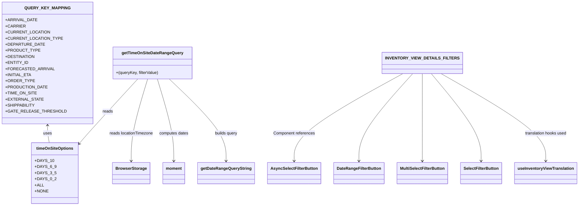

# Diagram: web/portal/src/pages/inventoryview/details/search/InventoryView.Details.Search.Options.js


> Auto-generated by Obscura crawlers

## Diagram 1



### SVG

<svg id="container" width="2176.908203125" xmlns="http://www.w3.org/2000/svg" class="classDiagram" height="810" viewBox="0 0 2176.908203125 810" role="graphics-document document" aria-roledescription="class"><style>#container{font-family:"trebuchet ms",verdana,arial,sans-serif;font-size:16px;fill:#333;}@keyframes edge-animation-frame{from{stroke-dashoffset:0;}}@keyframes dash{to{stroke-dashoffset:0;}}#container .edge-animation-slow{stroke-dasharray:9,5!important;stroke-dashoffset:900;animation:dash 50s linear infinite;stroke-linecap:round;}#container .edge-animation-fast{stroke-dasharray:9,5!important;stroke-dashoffset:900;animation:dash 20s linear infinite;stroke-linecap:round;}#container .error-icon{fill:#552222;}#container .error-text{fill:#552222;stroke:#552222;}#container .edge-thickness-normal{stroke-width:1px;}#container .edge-thickness-thick{stroke-width:3.5px;}#container .edge-pattern-solid{stroke-dasharray:0;}#container .edge-thickness-invisible{stroke-width:0;fill:none;}#container .edge-pattern-dashed{stroke-dasharray:3;}#container .edge-pattern-dotted{stroke-dasharray:2;}#container .marker{fill:#333333;stroke:#333333;}#container .marker.cross{stroke:#333333;}#container svg{font-family:"trebuchet ms",verdana,arial,sans-serif;font-size:16px;}#container p{margin:0;}#container g.classGroup text{fill:#9370DB;stroke:none;font-family:"trebuchet ms",verdana,arial,sans-serif;font-size:10px;}#container g.classGroup text .title{font-weight:bolder;}#container .nodeLabel,#container .edgeLabel{color:#131300;}#container .edgeLabel .label rect{fill:#ECECFF;}#container .label text{fill:#131300;}#container .labelBkg{background:#ECECFF;}#container .edgeLabel .label span{background:#ECECFF;}#container .classTitle{font-weight:bolder;}#container .node rect,#container .node circle,#container .node ellipse,#container .node polygon,#container .node path{fill:#ECECFF;stroke:#9370DB;stroke-width:1px;}#container .divider{stroke:#9370DB;stroke-width:1;}#container g.clickable{cursor:pointer;}#container g.classGroup rect{fill:#ECECFF;stroke:#9370DB;}#container g.classGroup line{stroke:#9370DB;stroke-width:1;}#container .classLabel .box{stroke:none;stroke-width:0;fill:#ECECFF;opacity:0.5;}#container .classLabel .label{fill:#9370DB;font-size:10px;}#container .relation{stroke:#333333;stroke-width:1;fill:none;}#container .dashed-line{stroke-dasharray:3;}#container .dotted-line{stroke-dasharray:1 2;}#container #compositionStart,#container .composition{fill:#333333!important;stroke:#333333!important;stroke-width:1;}#container #compositionEnd,#container .composition{fill:#333333!important;stroke:#333333!important;stroke-width:1;}#container #dependencyStart,#container .dependency{fill:#333333!important;stroke:#333333!important;stroke-width:1;}#container #dependencyStart,#container .dependency{fill:#333333!important;stroke:#333333!important;stroke-width:1;}#container #extensionStart,#container .extension{fill:transparent!important;stroke:#333333!important;stroke-width:1;}#container #extensionEnd,#container .extension{fill:transparent!important;stroke:#333333!important;stroke-width:1;}#container #aggregationStart,#container .aggregation{fill:transparent!important;stroke:#333333!important;stroke-width:1;}#container #aggregationEnd,#container .aggregation{fill:transparent!important;stroke:#333333!important;stroke-width:1;}#container #lollipopStart,#container .lollipop{fill:#ECECFF!important;stroke:#333333!important;stroke-width:1;}#container #lollipopEnd,#container .lollipop{fill:#ECECFF!important;stroke:#333333!important;stroke-width:1;}#container .edgeTerminals{font-size:11px;line-height:initial;}#container .classTitleText{text-anchor:middle;font-size:18px;fill:#333;}#container .label-icon{display:inline-block;height:1em;overflow:visible;vertical-align:-0.125em;}#container .node .label-icon path{fill:currentColor;stroke:revert;stroke-width:revert;}#container :root{--mermaid-font-family:"trebuchet ms",verdana,arial,sans-serif;}</style><g><defs><marker id="container_class-aggregationStart" class="marker aggregation class" refX="18" refY="7" markerWidth="190" markerHeight="240" orient="auto"><path d="M 18,7 L9,13 L1,7 L9,1 Z"></path></marker></defs><defs><marker id="container_class-aggregationEnd" class="marker aggregation class" refX="1" refY="7" markerWidth="20" markerHeight="28" orient="auto"><path d="M 18,7 L9,13 L1,7 L9,1 Z"></path></marker></defs><defs><marker id="container_class-extensionStart" class="marker extension class" refX="18" refY="7" markerWidth="190" markerHeight="240" orient="auto"><path d="M 1,7 L18,13 V 1 Z"></path></marker></defs><defs><marker id="container_class-extensionEnd" class="marker extension class" refX="1" refY="7" markerWidth="20" markerHeight="28" orient="auto"><path d="M 1,1 V 13 L18,7 Z"></path></marker></defs><defs><marker id="container_class-compositionStart" class="marker composition class" refX="18" refY="7" markerWidth="190" markerHeight="240" orient="auto"><path d="M 18,7 L9,13 L1,7 L9,1 Z"></path></marker></defs><defs><marker id="container_class-compositionEnd" class="marker composition class" refX="1" refY="7" markerWidth="20" markerHeight="28" orient="auto"><path d="M 18,7 L9,13 L1,7 L9,1 Z"></path></marker></defs><defs><marker id="container_class-dependencyStart" class="marker dependency class" refX="6" refY="7" markerWidth="190" markerHeight="240" orient="auto"><path d="M 5,7 L9,13 L1,7 L9,1 Z"></path></marker></defs><defs><marker id="container_class-dependencyEnd" class="marker dependency class" refX="13" refY="7" markerWidth="20" markerHeight="28" orient="auto"><path d="M 18,7 L9,13 L14,7 L9,1 Z"></path></marker></defs><defs><marker id="container_class-lollipopStart" class="marker lollipop class" refX="13" refY="7" markerWidth="190" markerHeight="240" orient="auto"><circle stroke="black" fill="transparent" cx="7" cy="7" r="6"></circle></marker></defs><defs><marker id="container_class-lollipopEnd" class="marker lollipop class" refX="1" refY="7" markerWidth="190" markerHeight="240" orient="auto"><circle stroke="black" fill="transparent" cx="7" cy="7" r="6"></circle></marker></defs><g class="root"><g class="clusters"></g><g class="edgePaths"><path d="M162.664,494L162.664,499.167C162.664,504.333,162.664,514.667,163.774,526C164.883,537.333,167.102,549.667,168.212,555.833L169.322,562" id="id_QUERY_KEY_MAPPING_timeOnSiteOptions_1" class="edge-thickness-normal edge-pattern-solid relation" style=";;;" data-edge="true" data-et="edge" data-id="id_QUERY_KEY_MAPPING_timeOnSiteOptions_1" data-points="W3sieCI6MTYyLjY2NDA2MjUsInkiOjQ4OH0seyJ4IjoxNjIuNjY0MDYyNSwieSI6NTI1fSx7IngiOjE2OS4zMjE3MDU4MTIxMDE5MiwieSI6NTYyfV0=" marker-start="url(#container_class-dependencyStart)"></path><path d="M497.917,311L466.024,346.667C434.13,382.333,370.343,453.667,333.909,495.499C297.474,537.331,288.391,549.662,283.85,555.828L279.308,561.993" id="id_getTimeOnSiteDateRangeQuery_timeOnSiteOptions_2" class="edge-thickness-normal edge-pattern-solid relation" style=";;;" data-edge="true" data-et="edge" data-id="id_getTimeOnSiteDateRangeQuery_timeOnSiteOptions_2" data-points="W3sieCI6NDk3LjkxNjkxODE1MjA3NTgsInkiOjMxMX0seyJ4IjozMDYuNTU2NjQwNjI1LCJ5Ijo1MjV9LHsieCI6Mjc1Ljc1LCJ5Ijo1NjYuODI0MDYzOTA5MjAzfV0=" marker-end="url(#container_class-dependencyEnd)"></path><path d="M535.602,311L525.044,346.667C514.485,382.333,493.369,453.667,482.81,507.5C472.252,561.333,472.252,597.667,472.252,615.833L472.252,634" id="id_getTimeOnSiteDateRangeQuery_BrowserStorage_3" class="edge-thickness-normal edge-pattern-solid relation" style=";;;" data-edge="true" data-et="edge" data-id="id_getTimeOnSiteDateRangeQuery_BrowserStorage_3" data-points="W3sieCI6NTM1LjYwMjEzMzYzMDQxNTIsInkiOjMxMX0seyJ4Ijo0NzIuMjUxOTUzMTI1LCJ5Ijo1MjV9LHsieCI6NDcyLjI1MTk1MzEyNSwieSI6NjQwfV0=" marker-end="url(#container_class-dependencyEnd)"></path><path d="M572.902,311L583.46,346.667C594.018,382.333,615.135,453.667,625.694,507.5C636.252,561.333,636.252,597.667,636.252,615.833L636.252,634" id="id_getTimeOnSiteDateRangeQuery_moment_4" class="edge-thickness-normal edge-pattern-solid relation" style=";;;" data-edge="true" data-et="edge" data-id="id_getTimeOnSiteDateRangeQuery_moment_4" data-points="W3sieCI6NTcyLjkwMTc3MjYxOTU4NDgsInkiOjMxMX0seyJ4Ijo2MzYuMjUxOTUzMTI1LCJ5Ijo1MjV9LHsieCI6NjM2LjI1MTk1MzEyNSwieSI6NjQwfV0=" marker-end="url(#container_class-dependencyEnd)"></path><path d="M618.263,311L654.502,346.667C690.741,382.333,763.219,453.667,799.458,507.5C835.697,561.333,835.697,597.667,835.697,615.833L835.697,634" id="id_getTimeOnSiteDateRangeQuery_getDateRangeQueryString_5" class="edge-thickness-normal edge-pattern-solid relation" style=";;;" data-edge="true" data-et="edge" data-id="id_getTimeOnSiteDateRangeQuery_getDateRangeQueryString_5" data-points="W3sieCI6NjE4LjI2Mjk4MDg3NzcwNzYsInkiOjMxMX0seyJ4Ijo4MzUuNjk3MjY1NjI1LCJ5Ijo1MjV9LHsieCI6ODM1LjY5NzI2NTYyNSwieSI6NjQwfV0=" marker-end="url(#container_class-dependencyEnd)"></path><path d="M1504.949,290L1436.161,329.167C1367.373,368.333,1229.797,446.667,1161.009,504C1092.221,561.333,1092.221,597.667,1092.221,615.833L1092.221,634" id="id_INVENTORY_VIEW_DETAILS_FILTERS_AsyncSelectFilterButton_6" class="edge-thickness-normal edge-pattern-solid relation" style=";;;" data-edge="true" data-et="edge" data-id="id_INVENTORY_VIEW_DETAILS_FILTERS_AsyncSelectFilterButton_6" data-points="W3sieCI6MTUwNC45NDg3MzIyMzE0OTgzLCJ5IjoyOTB9LHsieCI6MTA5Mi4yMjA3MDMxMjUsInkiOjUyNX0seyJ4IjoxMDkyLjIyMDcwMzEyNSwieSI6NjQwfV0=" marker-end="url(#container_class-dependencyEnd)"></path><path d="M1542.016,290L1507.795,329.167C1473.574,368.333,1405.132,446.667,1370.911,504C1336.689,561.333,1336.689,597.667,1336.689,615.833L1336.689,634" id="id_INVENTORY_VIEW_DETAILS_FILTERS_DateRangeFilterButton_7" class="edge-thickness-normal edge-pattern-solid relation" style=";;;" data-edge="true" data-et="edge" data-id="id_INVENTORY_VIEW_DETAILS_FILTERS_DateRangeFilterButton_7" data-points="W3sieCI6MTU0Mi4wMTYxOTYxMzA0MTUyLCJ5IjoyOTB9LHsieCI6MTMzNi42ODk0NTMxMjUsInkiOjUyNX0seyJ4IjoxMzM2LjY4OTQ1MzEyNSwieSI6NjQwfV0=" marker-end="url(#container_class-dependencyEnd)"></path><path d="M1578.713,290L1578.713,329.167C1578.713,368.333,1578.713,446.667,1578.713,504C1578.713,561.333,1578.713,597.667,1578.713,615.833L1578.713,634" id="id_INVENTORY_VIEW_DETAILS_FILTERS_MultiSelectFilterButton_8" class="edge-thickness-normal edge-pattern-solid relation" style=";;;" data-edge="true" data-et="edge" data-id="id_INVENTORY_VIEW_DETAILS_FILTERS_MultiSelectFilterButton_8" data-points="W3sieCI6MTU3OC43MTI4OTA2MjUsInkiOjI5MH0seyJ4IjoxNTc4LjcxMjg5MDYyNSwieSI6NTI1fSx7IngiOjE1NzguNzEyODkwNjI1LCJ5Ijo2NDB9XQ==" marker-end="url(#container_class-dependencyEnd)"></path><path d="M1612.876,290L1644.734,329.167C1676.592,368.333,1740.309,446.667,1772.167,504C1804.025,561.333,1804.025,597.667,1804.025,615.833L1804.025,634" id="id_INVENTORY_VIEW_DETAILS_FILTERS_SelectFilterButton_9" class="edge-thickness-normal edge-pattern-solid relation" style=";;;" data-edge="true" data-et="edge" data-id="id_INVENTORY_VIEW_DETAILS_FILTERS_SelectFilterButton_9" data-points="W3sieCI6MTYxMi44NzU3OTY3NjIxODQsInkiOjI5MH0seyJ4IjoxODA0LjAyNTM5MDYyNSwieSI6NTI1fSx7IngiOjE4MDQuMDI1MzkwNjI1LCJ5Ijo2NDB9XQ==" marker-end="url(#container_class-dependencyEnd)"></path><path d="M1650.27,290L1717,329.167C1783.73,368.333,1917.19,446.667,1983.92,504C2050.65,561.333,2050.65,597.667,2050.65,615.833L2050.65,634" id="id_INVENTORY_VIEW_DETAILS_FILTERS_useInventoryViewTranslation_10" class="edge-thickness-normal edge-pattern-solid relation" style=";;;" data-edge="true" data-et="edge" data-id="id_INVENTORY_VIEW_DETAILS_FILTERS_useInventoryViewTranslation_10" data-points="W3sieCI6MTY1MC4yNzAyMDEwOTQzMTQsInkiOjI5MH0seyJ4IjoyMDUwLjY1MDM5MDYyNSwieSI6NTI1fSx7IngiOjIwNTAuNjUwMzkwNjI1LCJ5Ijo2NDB9XQ==" marker-end="url(#container_class-dependencyEnd)"></path></g><g class="edgeLabels"><g class="edgeLabel" transform="translate(162.6640625, 525)"><g class="label" data-id="id_QUERY_KEY_MAPPING_timeOnSiteOptions_1" transform="translate(-16.4921875, -12)"><foreignObject width="32.984375" height="24"><div xmlns="http://www.w3.org/1999/xhtml" class="labelBkg" style="display: table-cell; white-space: nowrap; line-height: 1.5; max-width: 200px; text-align: center;"><span class="edgeLabel"><p>uses</p></span></div></foreignObject></g></g><g class="edgeLabel" transform="translate(384.92409, 437.36094)"><g class="label" data-id="id_getTimeOnSiteDateRangeQuery_timeOnSiteOptions_2" transform="translate(-20.0078125, -12)"><foreignObject width="40.015625" height="24"><div xmlns="http://www.w3.org/1999/xhtml" class="labelBkg" style="display: table-cell; white-space: nowrap; line-height: 1.5; max-width: 200px; text-align: center;"><span class="edgeLabel"><p>reads</p></span></div></foreignObject></g></g><g class="edgeLabel" transform="translate(472.251953125, 525)"><g class="label" data-id="id_getTimeOnSiteDateRangeQuery_BrowserStorage_3" transform="translate(-86.4140625, -12)"><foreignObject width="172.828125" height="24"><div xmlns="http://www.w3.org/1999/xhtml" class="labelBkg" style="display: table-cell; white-space: nowrap; line-height: 1.5; max-width: 200px; text-align: center;"><span class="edgeLabel"><p>reads locationTimezone</p></span></div></foreignObject></g></g><g class="edgeLabel" transform="translate(636.251953125, 525)"><g class="label" data-id="id_getTimeOnSiteDateRangeQuery_moment_4" transform="translate(-57.5859375, -12)"><foreignObject width="115.171875" height="24"><div xmlns="http://www.w3.org/1999/xhtml" class="labelBkg" style="display: table-cell; white-space: nowrap; line-height: 1.5; max-width: 200px; text-align: center;"><span class="edgeLabel"><p>computes dates</p></span></div></foreignObject></g></g><g class="edgeLabel" transform="translate(835.697265625, 525)"><g class="label" data-id="id_getTimeOnSiteDateRangeQuery_getDateRangeQueryString_5" transform="translate(-45.4375, -12)"><foreignObject width="90.875" height="24"><div xmlns="http://www.w3.org/1999/xhtml" class="labelBkg" style="display: table-cell; white-space: nowrap; line-height: 1.5; max-width: 200px; text-align: center;"><span class="edgeLabel"><p>builds query</p></span></div></foreignObject></g></g><g class="edgeLabel" transform="translate(1092.220703125, 525)"><g class="label" data-id="id_INVENTORY_VIEW_DETAILS_FILTERS_AsyncSelectFilterButton_6" transform="translate(-81.84375, -12)"><foreignObject width="163.6875" height="24"><div xmlns="http://www.w3.org/1999/xhtml" class="labelBkg" style="display: table-cell; white-space: nowrap; line-height: 1.5; max-width: 200px; text-align: center;"><span class="edgeLabel"><p>Component references</p></span></div></foreignObject></g></g><g class="edgeLabel"><g class="label" data-id="id_INVENTORY_VIEW_DETAILS_FILTERS_DateRangeFilterButton_7" transform="translate(0, 0)"><foreignObject width="0" height="0"><div xmlns="http://www.w3.org/1999/xhtml" class="labelBkg" style="display: table-cell; white-space: nowrap; line-height: 1.5; max-width: 200px; text-align: center;"><span class="edgeLabel"></span></div></foreignObject></g></g><g class="edgeLabel"><g class="label" data-id="id_INVENTORY_VIEW_DETAILS_FILTERS_MultiSelectFilterButton_8" transform="translate(0, 0)"><foreignObject width="0" height="0"><div xmlns="http://www.w3.org/1999/xhtml" class="labelBkg" style="display: table-cell; white-space: nowrap; line-height: 1.5; max-width: 200px; text-align: center;"><span class="edgeLabel"></span></div></foreignObject></g></g><g class="edgeLabel"><g class="label" data-id="id_INVENTORY_VIEW_DETAILS_FILTERS_SelectFilterButton_9" transform="translate(0, 0)"><foreignObject width="0" height="0"><div xmlns="http://www.w3.org/1999/xhtml" class="labelBkg" style="display: table-cell; white-space: nowrap; line-height: 1.5; max-width: 200px; text-align: center;"><span class="edgeLabel"></span></div></foreignObject></g></g><g class="edgeLabel" transform="translate(2050.650390625, 525)"><g class="label" data-id="id_INVENTORY_VIEW_DETAILS_FILTERS_useInventoryViewTranslation_10" transform="translate(-83.234375, -12)"><foreignObject width="166.46875" height="24"><div xmlns="http://www.w3.org/1999/xhtml" class="labelBkg" style="display: table-cell; white-space: nowrap; line-height: 1.5; max-width: 200px; text-align: center;"><span class="edgeLabel"><p>translation hooks used</p></span></div></foreignObject></g></g></g><g class="nodes"><g class="node default" id="classId-QUERY_KEY_MAPPING-0" transform="translate(162.6640625, 248)"><g class="basic label-container"><path d="M-154.6640625 -240 L154.6640625 -240 L154.6640625 240 L-154.6640625 240" stroke="none" stroke-width="0" fill="#ECECFF" style=""></path><path d="M-154.6640625 -240 C-91.68651280830126 -240, -28.70896311660252 -240, 154.6640625 -240 M-154.6640625 -240 C-92.32488581033356 -240, -29.98570912066711 -240, 154.6640625 -240 M154.6640625 -240 C154.6640625 -52.29065419406135, 154.6640625 135.4186916118773, 154.6640625 240 M154.6640625 -240 C154.6640625 -126.26390624461537, 154.6640625 -12.52781248923074, 154.6640625 240 M154.6640625 240 C53.22888879019568 240, -48.206284919608635 240, -154.6640625 240 M154.6640625 240 C70.39911868304874 240, -13.865825133902518 240, -154.6640625 240 M-154.6640625 240 C-154.6640625 74.69243247887215, -154.6640625 -90.6151350422557, -154.6640625 -240 M-154.6640625 240 C-154.6640625 86.96403556582754, -154.6640625 -66.07192886834491, -154.6640625 -240" stroke="#9370DB" stroke-width="1.3" fill="none" stroke-dasharray="0 0" style=""></path></g><g class="annotation-group text" transform="translate(0, -216)"></g><g class="label-group text" transform="translate(-78.8125, -216)"><g class="label" style="font-weight: bolder" transform="translate(0,-12)"><foreignObject width="157.625" height="24"><div xmlns="http://www.w3.org/1999/xhtml" style="display: table-cell; white-space: nowrap; line-height: 1.5; max-width: 205px; text-align: center;"><span class="nodeLabel markdown-node-label" style=""><p>QUERY_KEY_MAPPING</p></span></div></foreignObject></g></g><g class="members-group text" transform="translate(-142.6640625, -168)"><g class="label" style="" transform="translate(0,-12)"><foreignObject width="110.546875" height="24"><div xmlns="http://www.w3.org/1999/xhtml" style="display: table-cell; white-space: nowrap; line-height: 1.5; max-width: 168px; text-align: center;"><span class="nodeLabel markdown-node-label" style=""><p>+ARRIVAL_DATE</p></span></div></foreignObject></g><g class="label" style="" transform="translate(0,12)"><foreignObject width="68.4375" height="24"><div xmlns="http://www.w3.org/1999/xhtml" style="display: table-cell; white-space: nowrap; line-height: 1.5; max-width: 126px; text-align: center;"><span class="nodeLabel markdown-node-label" style=""><p>+CARRIER</p></span></div></foreignObject></g><g class="label" style="" transform="translate(0,36)"><foreignObject width="152.671875" height="24"><div xmlns="http://www.w3.org/1999/xhtml" style="display: table-cell; white-space: nowrap; line-height: 1.5; max-width: 210px; text-align: center;"><span class="nodeLabel markdown-node-label" style=""><p>+CURRENT_LOCATION</p></span></div></foreignObject></g><g class="label" style="" transform="translate(0,60)"><foreignObject width="195.109375" height="24"><div xmlns="http://www.w3.org/1999/xhtml" style="display: table-cell; white-space: nowrap; line-height: 1.5; max-width: 252px; text-align: center;"><span class="nodeLabel markdown-node-label" style=""><p>+CURRENT_LOCATION_TYPE</p></span></div></foreignObject></g><g class="label" style="" transform="translate(0,84)"><foreignObject width="134.484375" height="24"><div xmlns="http://www.w3.org/1999/xhtml" style="display: table-cell; white-space: nowrap; line-height: 1.5; max-width: 192px; text-align: center;"><span class="nodeLabel markdown-node-label" style=""><p>+DEPARTURE_DATE</p></span></div></foreignObject></g><g class="label" style="" transform="translate(0,108)"><foreignObject width="117.515625" height="24"><div xmlns="http://www.w3.org/1999/xhtml" style="display: table-cell; white-space: nowrap; line-height: 1.5; max-width: 175px; text-align: center;"><span class="nodeLabel markdown-node-label" style=""><p>+PRODUCT_TYPE</p></span></div></foreignObject></g><g class="label" style="" transform="translate(0,132)"><foreignObject width="102.34375" height="24"><div xmlns="http://www.w3.org/1999/xhtml" style="display: table-cell; white-space: nowrap; line-height: 1.5; max-width: 160px; text-align: center;"><span class="nodeLabel markdown-node-label" style=""><p>+DESTINATION</p></span></div></foreignObject></g><g class="label" style="" transform="translate(0,156)"><foreignObject width="79.609375" height="24"><div xmlns="http://www.w3.org/1999/xhtml" style="display: table-cell; white-space: nowrap; line-height: 1.5; max-width: 137px; text-align: center;"><span class="nodeLabel markdown-node-label" style=""><p>+ENTITY_ID</p></span></div></foreignObject></g><g class="label" style="" transform="translate(0,180)"><foreignObject width="165.0625" height="24"><div xmlns="http://www.w3.org/1999/xhtml" style="display: table-cell; white-space: nowrap; line-height: 1.5; max-width: 222px; text-align: center;"><span class="nodeLabel markdown-node-label" style=""><p>+FORECASTED_ARRIVAL</p></span></div></foreignObject></g><g class="label" style="" transform="translate(0,204)"><foreignObject width="92.015625" height="24"><div xmlns="http://www.w3.org/1999/xhtml" style="display: table-cell; white-space: nowrap; line-height: 1.5; max-width: 150px; text-align: center;"><span class="nodeLabel markdown-node-label" style=""><p>+INITIAL_ETA</p></span></div></foreignObject></g><g class="label" style="" transform="translate(0,228)"><foreignObject width="99.734375" height="24"><div xmlns="http://www.w3.org/1999/xhtml" style="display: table-cell; white-space: nowrap; line-height: 1.5; max-width: 157px; text-align: center;"><span class="nodeLabel markdown-node-label" style=""><p>+ORDER_TYPE</p></span></div></foreignObject></g><g class="label" style="" transform="translate(0,252)"><foreignObject width="146.25" height="24"><div xmlns="http://www.w3.org/1999/xhtml" style="display: table-cell; white-space: nowrap; line-height: 1.5; max-width: 204px; text-align: center;"><span class="nodeLabel markdown-node-label" style=""><p>+PRODUCTION_DATE</p></span></div></foreignObject></g><g class="label" style="" transform="translate(0,276)"><foreignObject width="109.140625" height="24"><div xmlns="http://www.w3.org/1999/xhtml" style="display: table-cell; white-space: nowrap; line-height: 1.5; max-width: 167px; text-align: center;"><span class="nodeLabel markdown-node-label" style=""><p>+TIME_ON_SITE</p></span></div></foreignObject></g><g class="label" style="" transform="translate(0,300)"><foreignObject width="128.8125" height="24"><div xmlns="http://www.w3.org/1999/xhtml" style="display: table-cell; white-space: nowrap; line-height: 1.5; max-width: 186px; text-align: center;"><span class="nodeLabel markdown-node-label" style=""><p>+EXTERNAL_STATE</p></span></div></foreignObject></g><g class="label" style="" transform="translate(0,324)"><foreignObject width="102.6875" height="24"><div xmlns="http://www.w3.org/1999/xhtml" style="display: table-cell; white-space: nowrap; line-height: 1.5; max-width: 160px; text-align: center;"><span class="nodeLabel markdown-node-label" style=""><p>+SHIPPABILITY</p></span></div></foreignObject></g><g class="label" style="" transform="translate(0,348)"><foreignObject width="206.515625" height="24"><div xmlns="http://www.w3.org/1999/xhtml" style="display: table-cell; white-space: nowrap; line-height: 1.5; max-width: 264px; text-align: center;"><span class="nodeLabel markdown-node-label" style=""><p>+GATE_RELEASE_THRESHOLD</p></span></div></foreignObject></g></g><g class="methods-group text" transform="translate(-142.6640625, 240)"></g><g class="divider" style=""><path d="M-154.6640625 -192 C-54.51158116484835 -192, 45.6409001703033 -192, 154.6640625 -192 M-154.6640625 -192 C-59.03801491368294 -192, 36.588032672634114 -192, 154.6640625 -192" stroke="#9370DB" stroke-width="1.3" fill="none" stroke-dasharray="0 0" style=""></path></g><g class="divider" style=""><path d="M-154.6640625 216 C-73.47512374546453 216, 7.713815009070942 216, 154.6640625 216 M-154.6640625 216 C-31.880641041808516 216, 90.90278041638297 216, 154.6640625 216" stroke="#9370DB" stroke-width="1.3" fill="none" stroke-dasharray="0 0" style=""></path></g></g><g class="node default" id="classId-timeOnSiteOptions-1" transform="translate(190.9140625, 682)"><g class="basic label-container"><path d="M-84.8359375 -120 L84.8359375 -120 L84.8359375 120 L-84.8359375 120" stroke="none" stroke-width="0" fill="#ECECFF" style=""></path><path d="M-84.8359375 -120 C-39.18038910391234 -120, 6.47515929217532 -120, 84.8359375 -120 M-84.8359375 -120 C-49.24073371304408 -120, -13.645529926088159 -120, 84.8359375 -120 M84.8359375 -120 C84.8359375 -69.324170810126, 84.8359375 -18.648341620252012, 84.8359375 120 M84.8359375 -120 C84.8359375 -59.219627628911134, 84.8359375 1.5607447421777323, 84.8359375 120 M84.8359375 120 C41.28953103277839 120, -2.2568754344432165 120, -84.8359375 120 M84.8359375 120 C23.030013247501856 120, -38.77591100499629 120, -84.8359375 120 M-84.8359375 120 C-84.8359375 27.43768341955021, -84.8359375 -65.12463316089958, -84.8359375 -120 M-84.8359375 120 C-84.8359375 68.63673454329549, -84.8359375 17.273469086590993, -84.8359375 -120" stroke="#9370DB" stroke-width="1.3" fill="none" stroke-dasharray="0 0" style=""></path></g><g class="annotation-group text" transform="translate(0, -96)"></g><g class="label-group text" transform="translate(-69.65625, -96)"><g class="label" style="font-weight: bolder" transform="translate(0,-12)"><foreignObject width="139.3125" height="24"><div xmlns="http://www.w3.org/1999/xhtml" style="display: table-cell; white-space: nowrap; line-height: 1.5; max-width: 188px; text-align: center;"><span class="nodeLabel markdown-node-label" style=""><p>timeOnSiteOptions</p></span></div></foreignObject></g></g><g class="members-group text" transform="translate(-72.8359375, -48)"><g class="label" style="" transform="translate(0,-12)"><foreignObject width="65.8125" height="24"><div xmlns="http://www.w3.org/1999/xhtml" style="display: table-cell; white-space: nowrap; line-height: 1.5; max-width: 123px; text-align: center;"><span class="nodeLabel markdown-node-label" style=""><p>+DAYS_10</p></span></div></foreignObject></g><g class="label" style="" transform="translate(0,12)"><foreignObject width="76.015625" height="24"><div xmlns="http://www.w3.org/1999/xhtml" style="display: table-cell; white-space: nowrap; line-height: 1.5; max-width: 133px; text-align: center;"><span class="nodeLabel markdown-node-label" style=""><p>+DAYS_6_9</p></span></div></foreignObject></g><g class="label" style="" transform="translate(0,36)"><foreignObject width="75.5625" height="24"><div xmlns="http://www.w3.org/1999/xhtml" style="display: table-cell; white-space: nowrap; line-height: 1.5; max-width: 133px; text-align: center;"><span class="nodeLabel markdown-node-label" style=""><p>+DAYS_3_5</p></span></div></foreignObject></g><g class="label" style="" transform="translate(0,60)"><foreignObject width="75.765625" height="24"><div xmlns="http://www.w3.org/1999/xhtml" style="display: table-cell; white-space: nowrap; line-height: 1.5; max-width: 133px; text-align: center;"><span class="nodeLabel markdown-node-label" style=""><p>+DAYS_0_2</p></span></div></foreignObject></g><g class="label" style="" transform="translate(0,84)"><foreignObject width="32.9375" height="24"><div xmlns="http://www.w3.org/1999/xhtml" style="display: table-cell; white-space: nowrap; line-height: 1.5; max-width: 90px; text-align: center;"><span class="nodeLabel markdown-node-label" style=""><p>+ALL</p></span></div></foreignObject></g><g class="label" style="" transform="translate(0,108)"><foreignObject width="49.484375" height="24"><div xmlns="http://www.w3.org/1999/xhtml" style="display: table-cell; white-space: nowrap; line-height: 1.5; max-width: 107px; text-align: center;"><span class="nodeLabel markdown-node-label" style=""><p>+NONE</p></span></div></foreignObject></g></g><g class="methods-group text" transform="translate(-72.8359375, 120)"></g><g class="divider" style=""><path d="M-84.8359375 -72 C-50.668528224009705 -72, -16.50111894801941 -72, 84.8359375 -72 M-84.8359375 -72 C-17.075150850659455 -72, 50.68563579868109 -72, 84.8359375 -72" stroke="#9370DB" stroke-width="1.3" fill="none" stroke-dasharray="0 0" style=""></path></g><g class="divider" style=""><path d="M-84.8359375 96 C-36.59690911923721 96, 11.642119261525579 96, 84.8359375 96 M-84.8359375 96 C-22.125007657886577 96, 40.585922184226845 96, 84.8359375 96" stroke="#9370DB" stroke-width="1.3" fill="none" stroke-dasharray="0 0" style=""></path></g></g><g class="node default" id="classId-getTimeOnSiteDateRangeQuery-2" transform="translate(554.251953125, 248)"><g class="basic label-container"><path d="M-153.04296875 -63 L153.04296875 -63 L153.04296875 63 L-153.04296875 63" stroke="none" stroke-width="0" fill="#ECECFF" style=""></path><path d="M-153.04296875 -63 C-31.73957940804226 -63, 89.56380993391548 -63, 153.04296875 -63 M-153.04296875 -63 C-79.69057556241977 -63, -6.338182374839533 -63, 153.04296875 -63 M153.04296875 -63 C153.04296875 -27.184588829247588, 153.04296875 8.630822341504825, 153.04296875 63 M153.04296875 -63 C153.04296875 -26.8792209936326, 153.04296875 9.2415580127348, 153.04296875 63 M153.04296875 63 C66.26357770378063 63, -20.515813342438747 63, -153.04296875 63 M153.04296875 63 C32.34762928947207 63, -88.34771017105587 63, -153.04296875 63 M-153.04296875 63 C-153.04296875 18.715539954800526, -153.04296875 -25.568920090398947, -153.04296875 -63 M-153.04296875 63 C-153.04296875 34.750784189020514, -153.04296875 6.5015683780410285, -153.04296875 -63" stroke="#9370DB" stroke-width="1.3" fill="none" stroke-dasharray="0 0" style=""></path></g><g class="annotation-group text" transform="translate(0, -39)"></g><g class="label-group text" transform="translate(-115.0703125, -39)"><g class="label" style="font-weight: bolder" transform="translate(0,-12)"><foreignObject width="230.140625" height="24"><div xmlns="http://www.w3.org/1999/xhtml" style="display: table-cell; white-space: nowrap; line-height: 1.5; max-width: 276px; text-align: center;"><span class="nodeLabel markdown-node-label" style=""><p>getTimeOnSiteDateRangeQuery</p></span></div></foreignObject></g></g><g class="members-group text" transform="translate(-141.04296875, 9)"></g><g class="methods-group text" transform="translate(-141.04296875, 39)"><g class="label" style="" transform="translate(0,-12)"><foreignObject width="167.015625" height="24"><div xmlns="http://www.w3.org/1999/xhtml" style="display: table-cell; white-space: nowrap; line-height: 1.5; max-width: 217px; text-align: center;"><span class="nodeLabel markdown-node-label" style=""><p>+(queryKey, filterValue)</p></span></div></foreignObject></g></g><g class="divider" style=""><path d="M-153.04296875 -15 C-78.80476192750177 -15, -4.566555105003545 -15, 153.04296875 -15 M-153.04296875 -15 C-36.60356817501419 -15, 79.83583239997162 -15, 153.04296875 -15" stroke="#9370DB" stroke-width="1.3" fill="none" stroke-dasharray="0 0" style=""></path></g><g class="divider" style=""><path d="M-153.04296875 9 C-35.66867302806905 9, 81.7056226938619 9, 153.04296875 9 M-153.04296875 9 C-46.5024870551774 9, 60.037994639645206 9, 153.04296875 9" stroke="#9370DB" stroke-width="1.3" fill="none" stroke-dasharray="0 0" style=""></path></g></g><g class="node default" id="classId-BrowserStorage-3" transform="translate(472.251953125, 682)"><g class="basic label-container"><path d="M-70.1328125 -42 L70.1328125 -42 L70.1328125 42 L-70.1328125 42" stroke="none" stroke-width="0" fill="#ECECFF" style=""></path><path d="M-70.1328125 -42 C-20.19293151328945 -42, 29.746949473421097 -42, 70.1328125 -42 M-70.1328125 -42 C-25.48559131429129 -42, 19.161629871417418 -42, 70.1328125 -42 M70.1328125 -42 C70.1328125 -16.67855784388315, 70.1328125 8.642884312233697, 70.1328125 42 M70.1328125 -42 C70.1328125 -20.96782074545586, 70.1328125 0.06435850908827945, 70.1328125 42 M70.1328125 42 C21.909960053498565 42, -26.31289239300287 42, -70.1328125 42 M70.1328125 42 C25.218088811768673 42, -19.696634876462653 42, -70.1328125 42 M-70.1328125 42 C-70.1328125 19.828931233712943, -70.1328125 -2.342137532574114, -70.1328125 -42 M-70.1328125 42 C-70.1328125 12.41256455865215, -70.1328125 -17.1748708826957, -70.1328125 -42" stroke="#9370DB" stroke-width="1.3" fill="none" stroke-dasharray="0 0" style=""></path></g><g class="annotation-group text" transform="translate(0, -18)"></g><g class="label-group text" transform="translate(-58.1328125, -18)"><g class="label" style="font-weight: bolder" transform="translate(0,-12)"><foreignObject width="116.265625" height="24"><div xmlns="http://www.w3.org/1999/xhtml" style="display: table-cell; white-space: nowrap; line-height: 1.5; max-width: 163px; text-align: center;"><span class="nodeLabel markdown-node-label" style=""><p>BrowserStorage</p></span></div></foreignObject></g></g><g class="members-group text" transform="translate(-58.1328125, 30)"></g><g class="methods-group text" transform="translate(-58.1328125, 60)"></g><g class="divider" style=""><path d="M-70.1328125 6 C-20.751903892106746 6, 28.629004715786508 6, 70.1328125 6 M-70.1328125 6 C-29.596915661026948 6, 10.938981177946104 6, 70.1328125 6" stroke="#9370DB" stroke-width="1.3" fill="none" stroke-dasharray="0 0" style=""></path></g><g class="divider" style=""><path d="M-70.1328125 24 C-20.08088245626797 24, 29.971047587464057 24, 70.1328125 24 M-70.1328125 24 C-31.24909198484022 24, 7.63462853031956 24, 70.1328125 24" stroke="#9370DB" stroke-width="1.3" fill="none" stroke-dasharray="0 0" style=""></path></g></g><g class="node default" id="classId-moment-4" transform="translate(636.251953125, 682)"><g class="basic label-container"><path d="M-42.3125 -42 L42.3125 -42 L42.3125 42 L-42.3125 42" stroke="none" stroke-width="0" fill="#ECECFF" style=""></path><path d="M-42.3125 -42 C-25.329931174566205 -42, -8.34736234913241 -42, 42.3125 -42 M-42.3125 -42 C-19.395851193081366 -42, 3.520797613837267 -42, 42.3125 -42 M42.3125 -42 C42.3125 -9.168190256715818, 42.3125 23.663619486568365, 42.3125 42 M42.3125 -42 C42.3125 -15.21771770213763, 42.3125 11.56456459572474, 42.3125 42 M42.3125 42 C23.326507434065633 42, 4.340514868131265 42, -42.3125 42 M42.3125 42 C21.460682737290046 42, 0.6088654745800923 42, -42.3125 42 M-42.3125 42 C-42.3125 19.912293014055628, -42.3125 -2.1754139718887444, -42.3125 -42 M-42.3125 42 C-42.3125 15.317028856556405, -42.3125 -11.36594228688719, -42.3125 -42" stroke="#9370DB" stroke-width="1.3" fill="none" stroke-dasharray="0 0" style=""></path></g><g class="annotation-group text" transform="translate(0, -18)"></g><g class="label-group text" transform="translate(-30.3125, -18)"><g class="label" style="font-weight: bolder" transform="translate(0,-12)"><foreignObject width="60.625" height="24"><div xmlns="http://www.w3.org/1999/xhtml" style="display: table-cell; white-space: nowrap; line-height: 1.5; max-width: 111px; text-align: center;"><span class="nodeLabel markdown-node-label" style=""><p>moment</p></span></div></foreignObject></g></g><g class="members-group text" transform="translate(-30.3125, 30)"></g><g class="methods-group text" transform="translate(-30.3125, 60)"></g><g class="divider" style=""><path d="M-42.3125 6 C-21.414520302334072 6, -0.516540604668144 6, 42.3125 6 M-42.3125 6 C-8.66771593681591 6, 24.97706812636818 6, 42.3125 6" stroke="#9370DB" stroke-width="1.3" fill="none" stroke-dasharray="0 0" style=""></path></g><g class="divider" style=""><path d="M-42.3125 24 C-22.632654192582233 24, -2.9528083851644666 24, 42.3125 24 M-42.3125 24 C-25.353412292354975 24, -8.394324584709949 24, 42.3125 24" stroke="#9370DB" stroke-width="1.3" fill="none" stroke-dasharray="0 0" style=""></path></g></g><g class="node default" id="classId-getDateRangeQueryString-5" transform="translate(835.697265625, 682)"><g class="basic label-container"><path d="M-107.1328125 -42 L107.1328125 -42 L107.1328125 42 L-107.1328125 42" stroke="none" stroke-width="0" fill="#ECECFF" style=""></path><path d="M-107.1328125 -42 C-60.11686686542912 -42, -13.100921230858233 -42, 107.1328125 -42 M-107.1328125 -42 C-28.073433203155233 -42, 50.985946093689535 -42, 107.1328125 -42 M107.1328125 -42 C107.1328125 -20.79950842811937, 107.1328125 0.400983143761259, 107.1328125 42 M107.1328125 -42 C107.1328125 -18.690922757853514, 107.1328125 4.6181544842929725, 107.1328125 42 M107.1328125 42 C26.954905798050675 42, -53.22300090389865 42, -107.1328125 42 M107.1328125 42 C29.835252567849366 42, -47.46230736430127 42, -107.1328125 42 M-107.1328125 42 C-107.1328125 21.508650570453163, -107.1328125 1.0173011409063264, -107.1328125 -42 M-107.1328125 42 C-107.1328125 17.739746972922582, -107.1328125 -6.520506054154836, -107.1328125 -42" stroke="#9370DB" stroke-width="1.3" fill="none" stroke-dasharray="0 0" style=""></path></g><g class="annotation-group text" transform="translate(0, -18)"></g><g class="label-group text" transform="translate(-95.1328125, -18)"><g class="label" style="font-weight: bolder" transform="translate(0,-12)"><foreignObject width="190.265625" height="24"><div xmlns="http://www.w3.org/1999/xhtml" style="display: table-cell; white-space: nowrap; line-height: 1.5; max-width: 237px; text-align: center;"><span class="nodeLabel markdown-node-label" style=""><p>getDateRangeQueryString</p></span></div></foreignObject></g></g><g class="members-group text" transform="translate(-95.1328125, 30)"></g><g class="methods-group text" transform="translate(-95.1328125, 60)"></g><g class="divider" style=""><path d="M-107.1328125 6 C-64.00844433482547 6, -20.884076169650953 6, 107.1328125 6 M-107.1328125 6 C-47.599197569512256 6, 11.934417360975488 6, 107.1328125 6" stroke="#9370DB" stroke-width="1.3" fill="none" stroke-dasharray="0 0" style=""></path></g><g class="divider" style=""><path d="M-107.1328125 24 C-62.570059299289085 24, -18.00730609857817 24, 107.1328125 24 M-107.1328125 24 C-48.94053124478817 24, 9.251750010423663 24, 107.1328125 24" stroke="#9370DB" stroke-width="1.3" fill="none" stroke-dasharray="0 0" style=""></path></g></g><g class="node default" id="classId-DateRangeFilterButton-6" transform="translate(1336.689453125, 682)"><g class="basic label-container"><path d="M-95.078125 -42 L95.078125 -42 L95.078125 42 L-95.078125 42" stroke="none" stroke-width="0" fill="#ECECFF" style=""></path><path d="M-95.078125 -42 C-29.958988850984824 -42, 35.16014729803035 -42, 95.078125 -42 M-95.078125 -42 C-38.04738559822425 -42, 18.983353803551495 -42, 95.078125 -42 M95.078125 -42 C95.078125 -25.07234359691006, 95.078125 -8.144687193820118, 95.078125 42 M95.078125 -42 C95.078125 -15.972785156141246, 95.078125 10.054429687717509, 95.078125 42 M95.078125 42 C27.841602326952895 42, -39.39492034609421 42, -95.078125 42 M95.078125 42 C45.263969974275696 42, -4.550185051448608 42, -95.078125 42 M-95.078125 42 C-95.078125 24.65855236672958, -95.078125 7.317104733459161, -95.078125 -42 M-95.078125 42 C-95.078125 17.493288086321666, -95.078125 -7.013423827356668, -95.078125 -42" stroke="#9370DB" stroke-width="1.3" fill="none" stroke-dasharray="0 0" style=""></path></g><g class="annotation-group text" transform="translate(0, -18)"></g><g class="label-group text" transform="translate(-83.078125, -18)"><g class="label" style="font-weight: bolder" transform="translate(0,-12)"><foreignObject width="166.15625" height="24"><div xmlns="http://www.w3.org/1999/xhtml" style="display: table-cell; white-space: nowrap; line-height: 1.5; max-width: 214px; text-align: center;"><span class="nodeLabel markdown-node-label" style=""><p>DateRangeFilterButton</p></span></div></foreignObject></g></g><g class="members-group text" transform="translate(-83.078125, 30)"></g><g class="methods-group text" transform="translate(-83.078125, 60)"></g><g class="divider" style=""><path d="M-95.078125 6 C-32.1133875467539 6, 30.851349906492203 6, 95.078125 6 M-95.078125 6 C-20.565407573041213 6, 53.947309853917574 6, 95.078125 6" stroke="#9370DB" stroke-width="1.3" fill="none" stroke-dasharray="0 0" style=""></path></g><g class="divider" style=""><path d="M-95.078125 24 C-24.280847191184364 24, 46.51643061763127 24, 95.078125 24 M-95.078125 24 C-32.09425028429672 24, 30.88962443140656 24, 95.078125 24" stroke="#9370DB" stroke-width="1.3" fill="none" stroke-dasharray="0 0" style=""></path></g></g><g class="node default" id="classId-AsyncSelectFilterButton-7" transform="translate(1092.220703125, 682)"><g class="basic label-container"><path d="M-99.390625 -42 L99.390625 -42 L99.390625 42 L-99.390625 42" stroke="none" stroke-width="0" fill="#ECECFF" style=""></path><path d="M-99.390625 -42 C-44.74166881676416 -42, 9.907287366471678 -42, 99.390625 -42 M-99.390625 -42 C-33.53640355410323 -42, 32.31781789179354 -42, 99.390625 -42 M99.390625 -42 C99.390625 -14.667767555072405, 99.390625 12.66446488985519, 99.390625 42 M99.390625 -42 C99.390625 -11.362246256268119, 99.390625 19.275507487463763, 99.390625 42 M99.390625 42 C25.845937388505618 42, -47.698750222988764 42, -99.390625 42 M99.390625 42 C24.632027285898587 42, -50.126570428202825 42, -99.390625 42 M-99.390625 42 C-99.390625 12.632531959877241, -99.390625 -16.734936080245518, -99.390625 -42 M-99.390625 42 C-99.390625 13.18358062740569, -99.390625 -15.632838745188621, -99.390625 -42" stroke="#9370DB" stroke-width="1.3" fill="none" stroke-dasharray="0 0" style=""></path></g><g class="annotation-group text" transform="translate(0, -18)"></g><g class="label-group text" transform="translate(-87.390625, -18)"><g class="label" style="font-weight: bolder" transform="translate(0,-12)"><foreignObject width="174.78125" height="24"><div xmlns="http://www.w3.org/1999/xhtml" style="display: table-cell; white-space: nowrap; line-height: 1.5; max-width: 221px; text-align: center;"><span class="nodeLabel markdown-node-label" style=""><p>AsyncSelectFilterButton</p></span></div></foreignObject></g></g><g class="members-group text" transform="translate(-87.390625, 30)"></g><g class="methods-group text" transform="translate(-87.390625, 60)"></g><g class="divider" style=""><path d="M-99.390625 6 C-45.29392561196652 6, 8.802773776066957 6, 99.390625 6 M-99.390625 6 C-47.029281643872615 6, 5.33206171225477 6, 99.390625 6" stroke="#9370DB" stroke-width="1.3" fill="none" stroke-dasharray="0 0" style=""></path></g><g class="divider" style=""><path d="M-99.390625 24 C-22.856982525491418 24, 53.676659949017164 24, 99.390625 24 M-99.390625 24 C-38.872997156207234 24, 21.644630687585533 24, 99.390625 24" stroke="#9370DB" stroke-width="1.3" fill="none" stroke-dasharray="0 0" style=""></path></g></g><g class="node default" id="classId-MultiSelectFilterButton-8" transform="translate(1578.712890625, 682)"><g class="basic label-container"><path d="M-96.9453125 -42 L96.9453125 -42 L96.9453125 42 L-96.9453125 42" stroke="none" stroke-width="0" fill="#ECECFF" style=""></path><path d="M-96.9453125 -42 C-28.687236346767392 -42, 39.570839806465216 -42, 96.9453125 -42 M-96.9453125 -42 C-47.09559921676429 -42, 2.7541140664714163 -42, 96.9453125 -42 M96.9453125 -42 C96.9453125 -17.05193347177691, 96.9453125 7.896133056446182, 96.9453125 42 M96.9453125 -42 C96.9453125 -23.72331869321328, 96.9453125 -5.446637386426559, 96.9453125 42 M96.9453125 42 C24.959673743362643 42, -47.025965013274714 42, -96.9453125 42 M96.9453125 42 C31.190274059916746 42, -34.56476438016651 42, -96.9453125 42 M-96.9453125 42 C-96.9453125 15.058361130195795, -96.9453125 -11.88327773960841, -96.9453125 -42 M-96.9453125 42 C-96.9453125 25.059580729083013, -96.9453125 8.119161458166026, -96.9453125 -42" stroke="#9370DB" stroke-width="1.3" fill="none" stroke-dasharray="0 0" style=""></path></g><g class="annotation-group text" transform="translate(0, -18)"></g><g class="label-group text" transform="translate(-84.9453125, -18)"><g class="label" style="font-weight: bolder" transform="translate(0,-12)"><foreignObject width="169.890625" height="24"><div xmlns="http://www.w3.org/1999/xhtml" style="display: table-cell; white-space: nowrap; line-height: 1.5; max-width: 217px; text-align: center;"><span class="nodeLabel markdown-node-label" style=""><p>MultiSelectFilterButton</p></span></div></foreignObject></g></g><g class="members-group text" transform="translate(-84.9453125, 30)"></g><g class="methods-group text" transform="translate(-84.9453125, 60)"></g><g class="divider" style=""><path d="M-96.9453125 6 C-57.308242055857086 6, -17.671171611714172 6, 96.9453125 6 M-96.9453125 6 C-36.01972821839627 6, 24.905856063207466 6, 96.9453125 6" stroke="#9370DB" stroke-width="1.3" fill="none" stroke-dasharray="0 0" style=""></path></g><g class="divider" style=""><path d="M-96.9453125 24 C-24.65224248971826 24, 47.64082752056348 24, 96.9453125 24 M-96.9453125 24 C-52.19902992372755 24, -7.452747347455102 24, 96.9453125 24" stroke="#9370DB" stroke-width="1.3" fill="none" stroke-dasharray="0 0" style=""></path></g></g><g class="node default" id="classId-SelectFilterButton-9" transform="translate(1804.025390625, 682)"><g class="basic label-container"><path d="M-78.3671875 -42 L78.3671875 -42 L78.3671875 42 L-78.3671875 42" stroke="none" stroke-width="0" fill="#ECECFF" style=""></path><path d="M-78.3671875 -42 C-29.930528780184552 -42, 18.506129939630895 -42, 78.3671875 -42 M-78.3671875 -42 C-20.235566381281345 -42, 37.89605473743731 -42, 78.3671875 -42 M78.3671875 -42 C78.3671875 -22.946799407612193, 78.3671875 -3.8935988152243866, 78.3671875 42 M78.3671875 -42 C78.3671875 -23.771825202424587, 78.3671875 -5.543650404849174, 78.3671875 42 M78.3671875 42 C41.61283985626902 42, 4.858492212538039 42, -78.3671875 42 M78.3671875 42 C41.66636512967773 42, 4.965542759355458 42, -78.3671875 42 M-78.3671875 42 C-78.3671875 19.158471646502562, -78.3671875 -3.6830567069948756, -78.3671875 -42 M-78.3671875 42 C-78.3671875 21.355301949479617, -78.3671875 0.7106038989592349, -78.3671875 -42" stroke="#9370DB" stroke-width="1.3" fill="none" stroke-dasharray="0 0" style=""></path></g><g class="annotation-group text" transform="translate(0, -18)"></g><g class="label-group text" transform="translate(-66.3671875, -18)"><g class="label" style="font-weight: bolder" transform="translate(0,-12)"><foreignObject width="132.734375" height="24"><div xmlns="http://www.w3.org/1999/xhtml" style="display: table-cell; white-space: nowrap; line-height: 1.5; max-width: 180px; text-align: center;"><span class="nodeLabel markdown-node-label" style=""><p>SelectFilterButton</p></span></div></foreignObject></g></g><g class="members-group text" transform="translate(-66.3671875, 30)"></g><g class="methods-group text" transform="translate(-66.3671875, 60)"></g><g class="divider" style=""><path d="M-78.3671875 6 C-24.40479227832043 6, 29.557602943359143 6, 78.3671875 6 M-78.3671875 6 C-15.700106163011426 6, 46.96697517397715 6, 78.3671875 6" stroke="#9370DB" stroke-width="1.3" fill="none" stroke-dasharray="0 0" style=""></path></g><g class="divider" style=""><path d="M-78.3671875 24 C-18.102317654883045 24, 42.16255219023391 24, 78.3671875 24 M-78.3671875 24 C-31.64945203346273 24, 15.06828343307454 24, 78.3671875 24" stroke="#9370DB" stroke-width="1.3" fill="none" stroke-dasharray="0 0" style=""></path></g></g><g class="node default" id="classId-useInventoryViewTranslation-10" transform="translate(2050.650390625, 682)"><g class="basic label-container"><path d="M-118.2578125 -42 L118.2578125 -42 L118.2578125 42 L-118.2578125 42" stroke="none" stroke-width="0" fill="#ECECFF" style=""></path><path d="M-118.2578125 -42 C-39.51433184147176 -42, 39.22914881705648 -42, 118.2578125 -42 M-118.2578125 -42 C-54.76141905095049 -42, 8.734974398099027 -42, 118.2578125 -42 M118.2578125 -42 C118.2578125 -22.908570600172407, 118.2578125 -3.817141200344814, 118.2578125 42 M118.2578125 -42 C118.2578125 -25.04194578430912, 118.2578125 -8.083891568618242, 118.2578125 42 M118.2578125 42 C56.604746744153 42, -5.048319011694005 42, -118.2578125 42 M118.2578125 42 C33.15834206559725 42, -51.941128368805494 42, -118.2578125 42 M-118.2578125 42 C-118.2578125 17.154211766633935, -118.2578125 -7.69157646673213, -118.2578125 -42 M-118.2578125 42 C-118.2578125 25.05886911554435, -118.2578125 8.117738231088701, -118.2578125 -42" stroke="#9370DB" stroke-width="1.3" fill="none" stroke-dasharray="0 0" style=""></path></g><g class="annotation-group text" transform="translate(0, -18)"></g><g class="label-group text" transform="translate(-106.2578125, -18)"><g class="label" style="font-weight: bolder" transform="translate(0,-12)"><foreignObject width="212.515625" height="24"><div xmlns="http://www.w3.org/1999/xhtml" style="display: table-cell; white-space: nowrap; line-height: 1.5; max-width: 259px; text-align: center;"><span class="nodeLabel markdown-node-label" style=""><p>useInventoryViewTranslation</p></span></div></foreignObject></g></g><g class="members-group text" transform="translate(-106.2578125, 30)"></g><g class="methods-group text" transform="translate(-106.2578125, 60)"></g><g class="divider" style=""><path d="M-118.2578125 6 C-43.45060396691095 6, 31.356604566178106 6, 118.2578125 6 M-118.2578125 6 C-55.581098829133346 6, 7.095614841733308 6, 118.2578125 6" stroke="#9370DB" stroke-width="1.3" fill="none" stroke-dasharray="0 0" style=""></path></g><g class="divider" style=""><path d="M-118.2578125 24 C-28.4625633564159 24, 61.3326857871682 24, 118.2578125 24 M-118.2578125 24 C-26.377744303106056 24, 65.50232389378789 24, 118.2578125 24" stroke="#9370DB" stroke-width="1.3" fill="none" stroke-dasharray="0 0" style=""></path></g></g><g class="node default" id="classId-INVENTORY_VIEW_DETAILS_FILTERS-11" transform="translate(1578.712890625, 248)"><g class="basic label-container"><path d="M-137.875 -42 L137.875 -42 L137.875 42 L-137.875 42" stroke="none" stroke-width="0" fill="#ECECFF" style=""></path><path d="M-137.875 -42 C-58.2778680030282 -42, 21.319263993943594 -42, 137.875 -42 M-137.875 -42 C-63.97969739096777 -42, 9.915605218064456 -42, 137.875 -42 M137.875 -42 C137.875 -10.013340552441527, 137.875 21.973318895116947, 137.875 42 M137.875 -42 C137.875 -13.559019072263734, 137.875 14.881961855472532, 137.875 42 M137.875 42 C55.171296809929146 42, -27.53240638014171 42, -137.875 42 M137.875 42 C55.75965279725614 42, -26.355694405487725 42, -137.875 42 M-137.875 42 C-137.875 15.590963916740492, -137.875 -10.818072166519016, -137.875 -42 M-137.875 42 C-137.875 18.522785905867735, -137.875 -4.954428188264529, -137.875 -42" stroke="#9370DB" stroke-width="1.3" fill="none" stroke-dasharray="0 0" style=""></path></g><g class="annotation-group text" transform="translate(0, -18)"></g><g class="label-group text" transform="translate(-125.875, -18)"><g class="label" style="font-weight: bolder" transform="translate(0,-12)"><foreignObject width="251.75" height="24"><div xmlns="http://www.w3.org/1999/xhtml" style="display: table-cell; white-space: nowrap; line-height: 1.5; max-width: 299px; text-align: center;"><span class="nodeLabel markdown-node-label" style=""><p>INVENTORY_VIEW_DETAILS_FILTERS</p></span></div></foreignObject></g></g><g class="members-group text" transform="translate(-125.875, 30)"></g><g class="methods-group text" transform="translate(-125.875, 60)"></g><g class="divider" style=""><path d="M-137.875 6 C-80.88600440130273 6, -23.897008802605455 6, 137.875 6 M-137.875 6 C-82.1627329218613 6, -26.45046584372261 6, 137.875 6" stroke="#9370DB" stroke-width="1.3" fill="none" stroke-dasharray="0 0" style=""></path></g><g class="divider" style=""><path d="M-137.875 24 C-57.73417333714451 24, 22.406653325710977 24, 137.875 24 M-137.875 24 C-44.01669811420854 24, 49.841603771582925 24, 137.875 24" stroke="#9370DB" stroke-width="1.3" fill="none" stroke-dasharray="0 0" style=""></path></g></g></g></g></g></svg>

## Diagram 2

```mermaid
flowchart TD
    A[Filter selection starts] --> B{filterValue in timeOnSiteOptions?}
    B -- No --> C[Return empty string ""]
    B -- Yes --> D{option has "all" property?}
    D -- Yes --> E[Create URLSearchParams set onSite=<all>]
    E --> F[Return "&" + urlParams.toString()]
    D -- No --> G[Resolve locationTimezone: BrowserStorage.locationTimezone or moment.tz.guess()]
    G --> H[Compute toParam: if to exists -> tz.startOf(day).subtract(to, days).utc() else -> moment.utc()]
    H --> I[Compute fromParam: if from exists -> tz.startOf(day).subtract(from, days).utc() else -> null]
    I --> J[dateParams = { to: toParam or null, from: fromParam or null }]
    J --> K[getDateRangeQueryString(queryKey, dateParams, {convertToUtc:true})]
    K --> L[Return date range query string]
```

> SVG rendering failed for this diagram.
