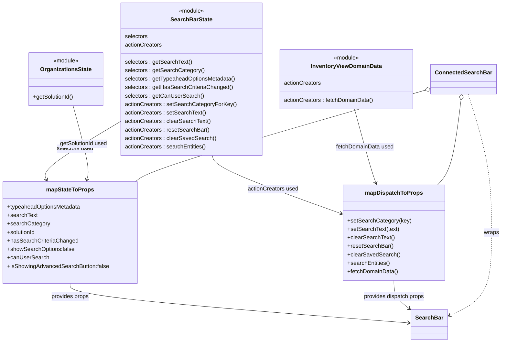

# Diagram: web/portal/src/pages/inventoryview/details/search/InventoryView.Details.SearchBarContainer.js

> Auto-generated by Obscura crawlers

## Mermaid

### SVG

<svg id="container" width="1401.439453125" xmlns="http://www.w3.org/2000/svg" class="classDiagram" height="968" viewBox="0 0 1401.439453125 968" role="graphics-document document" aria-roledescription="class"><g><defs><marker id="container_class-aggregationStart" class="marker aggregation class" refX="18" refY="7" markerWidth="190" markerHeight="240" orient="auto"><path d="M 18,7 L9,13 L1,7 L9,1 Z"></path></marker></defs><defs><marker id="container_class-aggregationEnd" class="marker aggregation class" refX="1" refY="7" markerWidth="20" markerHeight="28" orient="auto"><path d="M 18,7 L9,13 L1,7 L9,1 Z"></path></marker></defs><defs><marker id="container_class-extensionStart" class="marker extension class" refX="18" refY="7" markerWidth="190" markerHeight="240" orient="auto"><path d="M 1,7 L18,13 V 1 Z"></path></marker></defs><defs><marker id="container_class-extensionEnd" class="marker extension class" refX="1" refY="7" markerWidth="20" markerHeight="28" orient="auto"><path d="M 1,1 V 13 L18,7 Z"></path></marker></defs><defs><marker id="container_class-compositionStart" class="marker composition class" refX="18" refY="7" markerWidth="190" markerHeight="240" orient="auto"><path d="M 18,7 L9,13 L1,7 L9,1 Z"></path></marker></defs><defs><marker id="container_class-compositionEnd" class="marker composition class" refX="1" refY="7" markerWidth="20" markerHeight="28" orient="auto"><path d="M 18,7 L9,13 L1,7 L9,1 Z"></path></marker></defs><defs><marker id="container_class-dependencyStart" class="marker dependency class" refX="6" refY="7" markerWidth="190" markerHeight="240" orient="auto"><path d="M 5,7 L9,13 L1,7 L9,1 Z"></path></marker></defs><defs><marker id="container_class-dependencyEnd" class="marker dependency class" refX="13" refY="7" markerWidth="20" markerHeight="28" orient="auto"><path d="M 18,7 L9,13 L14,7 L9,1 Z"></path></marker></defs><defs><marker id="container_class-lollipopStart" class="marker lollipop class" refX="13" refY="7" markerWidth="190" markerHeight="240" orient="auto"><circle stroke="black" fill="transparent" cx="7" cy="7" r="6"></circle></marker></defs><defs><marker id="container_class-lollipopEnd" class="marker lollipop class" refX="1" refY="7" markerWidth="190" markerHeight="240" orient="auto"><circle stroke="black" fill="transparent" cx="7" cy="7" r="6"></circle></marker></defs><g class="root"><g class="clusters"></g><g class="edgePaths"><path d="M333.943,342.101L296.347,364.584C258.751,387.067,183.558,432.034,148.511,459.783C113.464,487.533,118.563,498.066,121.112,503.333L123.661,508.599" id="id_SearchBarState_mapStateToProps_1" class="edge-thickness-normal edge-pattern-solid relation" style=";;;" data-edge="true" data-et="edge" data-id="id_SearchBarState_mapStateToProps_1" data-points="W3sieCI6MzMzLjk0MzM1OTM3NSwieSI6MzQyLjEwMDkyNzkzNDk5ODM3fSx7IngiOjEwOC4zNjUyMzQzNzUsInkiOjQ3N30seyJ4IjoxMjYuMjc1NTMwOTA0Njk2MTMsInkiOjUxNH1d" marker-end="url(#container_class-dependencyEnd)"></path><path d="M199.77,299L208.037,328.667C216.304,358.333,232.839,417.667,239.57,452.541C246.301,487.415,243.228,497.83,241.692,503.038L240.156,508.245" id="id_OrganizationsState_mapStateToProps_2" class="edge-thickness-normal edge-pattern-solid relation" style=";;;" data-edge="true" data-et="edge" data-id="id_OrganizationsState_mapStateToProps_2" data-points="W3sieCI6MTk5Ljc2OTUwODA5MDQxNTAzLCJ5IjoyOTl9LHsieCI6MjQ5LjM3MzA0Njg3NSwieSI6NDc3fSx7IngiOjIzOC40NTg1NDE5NTQ0MTk5LCJ5Ijo1MTR9XQ==" marker-end="url(#container_class-dependencyEnd)"></path><path d="M195.98,802L195.98,808.167C195.98,814.333,195.98,826.667,354.012,845.275C512.044,863.884,828.107,888.768,986.139,901.21L1144.171,913.652" id="id_mapStateToProps_SearchBar_3" class="edge-thickness-normal edge-pattern-solid relation" style=";;;" data-edge="true" data-et="edge" data-id="id_mapStateToProps_SearchBar_3" data-points="W3sieCI6MTk1Ljk4MDQ2ODc1LCJ5Ijo4MDJ9LHsieCI6MTk1Ljk4MDQ2ODc1LCJ5Ijo4Mzl9LHsieCI6MTE1MC4xNTIzNDM3NSwieSI6OTE0LjEyMzEwMzE1NTYzMjd9XQ==" marker-end="url(#container_class-dependencyEnd)"></path><path d="M591.625,440L593.343,446.167C595.062,452.333,598.499,464.667,659.401,492.268C720.304,519.87,838.672,562.74,897.856,584.175L957.04,605.61" id="id_SearchBarState_mapDispatchToProps_4" class="edge-thickness-normal edge-pattern-solid relation" style=";;;" data-edge="true" data-et="edge" data-id="id_SearchBarState_mapDispatchToProps_4" data-points="W3sieCI6NTkxLjYyNDY5ODkyNTM5NTMsInkiOjQ0MH0seyJ4Ijo2MDEuOTM1NTQ2ODc1LCJ5Ijo0Nzd9LHsieCI6OTYyLjY4MTY0MDYyNSwieSI6NjA3LjY1MzM3MTE2NDE1NzZ9XQ==" marker-end="url(#container_class-dependencyEnd)"></path><path d="M989.645,308L997.494,336.167C1005.343,364.333,1021.042,420.667,1031.304,455.559C1041.567,490.451,1046.394,503.902,1048.808,510.627L1051.221,517.353" id="id_InventoryViewDomainData_mapDispatchToProps_5" class="edge-thickness-normal edge-pattern-solid relation" style=";;;" data-edge="true" data-et="edge" data-id="id_InventoryViewDomainData_mapDispatchToProps_5" data-points="W3sieCI6OTg5LjY0NDczOTY4NjI2NDksInkiOjMwOH0seyJ4IjoxMDM2Ljc0MDIzNDM3NSwieSI6NDc3fSx7IngiOjEwNTMuMjQ3NjU4NDA4MTQ5MiwieSI6NTIzfV0=" marker-end="url(#container_class-dependencyEnd)"></path><path d="M1101.693,793L1101.693,800.667C1101.693,808.333,1101.693,823.667,1108.992,837.235C1116.291,850.804,1130.889,862.607,1138.188,868.509L1145.487,874.411" id="id_mapDispatchToProps_SearchBar_6" class="edge-thickness-normal edge-pattern-solid relation" style=";;;" data-edge="true" data-et="edge" data-id="id_mapDispatchToProps_SearchBar_6" data-points="W3sieCI6MTEwMS42OTMzNTkzNzUsInkiOjc5M30seyJ4IjoxMTAxLjY5MzM1OTM3NSwieSI6ODM5fSx7IngiOjExNTAuMTUyMzQzNzUsInkiOjg3OC4xODMzNTU2NTYzOTh9XQ==" marker-end="url(#container_class-dependencyEnd)"></path><path d="M1304.909,266L1316.099,301.167C1327.289,336.333,1349.669,406.667,1360.859,472C1372.049,537.333,1372.049,597.667,1372.049,658C1372.049,718.333,1372.049,778.667,1352.389,817.829C1332.73,856.991,1293.411,874.981,1273.752,883.977L1254.093,892.972" id="id_ConnectedSearchBar_SearchBar_7" class="edge-thickness-normal edge-pattern-dashed relation" style=";;;" data-edge="true" data-et="edge" data-id="id_ConnectedSearchBar_SearchBar_7" data-points="W3sieCI6MTMwNC45MDkyMDY3MDcwMTU4LCJ5IjoyNjZ9LHsieCI6MTM3Mi4wNDg4MjgxMjUsInkiOjQ3N30seyJ4IjoxMzcyLjA0ODgyODEyNSwieSI6NjU4fSx7IngiOjEzNzIuMDQ4ODI4MTI1LCJ5Ijo4Mzl9LHsieCI6MTI0OC42MzY3MTg3NSwieSI6ODk1LjQ2ODY1OTE0NzcyNzl9XQ==" marker-end="url(#container_class-dependencyEnd)"></path><path d="M1186.992,254.484L1059.794,291.57C932.596,328.656,678.199,402.828,543.239,446.081C408.279,489.333,392.755,501.667,384.993,507.833L377.231,514" id="id_ConnectedSearchBar_mapStateToProps_8" class="edge-thickness-normal edge-pattern-solid relation" style=";;;" data-edge="true" data-et="edge" data-id="id_ConnectedSearchBar_mapStateToProps_8" data-points="W3sieCI6MTIwMy41NTI3MzQzNzUsInkiOjI0OS42NTUxMTI0OTU2MTA5Mn0seyJ4Ijo0MjMuODAyNzM0Mzc1LCJ5Ijo0Nzd9LHsieCI6Mzc3LjIzMTMzMjAwOTY2ODUsInkiOjUxNH1d" marker-start="url(#container_class-aggregationStart)"></path><path d="M1285.186,283.151L1281.713,315.459C1278.24,347.767,1271.294,412.384,1260.931,452.359C1250.568,492.333,1236.789,507.667,1229.9,515.333L1223.01,523" id="id_ConnectedSearchBar_mapDispatchToProps_9" class="edge-thickness-normal edge-pattern-solid relation" style=";;;" data-edge="true" data-et="edge" data-id="id_ConnectedSearchBar_mapDispatchToProps_9" data-points="W3sieCI6MTI4Ny4wMjk5NjA3ODMxMDI4LCJ5IjoyNjZ9LHsieCI6MTI2NC4zNDc2NTYyNSwieSI6NDc3fSx7IngiOjEyMjMuMDEwMTAwMTM4MTIxNSwieSI6NTIzfV0=" marker-start="url(#container_class-aggregationStart)"></path></g><g class="edgeLabels"><g class="edgeLabel" transform="translate(203.51442, 420.09937)"><g class="label" data-id="id_SearchBarState_mapStateToProps_1" transform="translate(-52.390625, -12)"><foreignObject width="104.78125" height="24">

selectors used

</foreignObject></g></g><g class="edgeLabel" transform="translate(229.74904, 406.58016)"><g class="label" data-id="id_OrganizationsState_mapStateToProps_2" transform="translate(-68.6171875, -12)"><foreignObject width="137.234375" height="24">

getSolutionId used

</foreignObject></g></g><g class="edgeLabel" transform="translate(195.98046875, 839)"><g class="label" data-id="id_mapStateToProps_SearchBar_3" transform="translate(-54.1953125, -12)"><foreignObject width="108.390625" height="24">

provides props

</foreignObject></g></g><g class="edgeLabel" transform="translate(764.25149, 535.78685)"><g class="label" data-id="id_SearchBarState_mapDispatchToProps_4" transform="translate(-72.3203125, -12)"><foreignObject width="144.640625" height="24">

actionCreators used

</foreignObject></g></g><g class="edgeLabel" transform="translate(1019.75219, 416.0392)"><g class="label" data-id="id_InventoryViewDomainData_mapDispatchToProps_5" transform="translate(-82.484375, -12)"><foreignObject width="164.96875" height="24">

fetchDomainData used

</foreignObject></g></g><g class="edgeLabel" transform="translate(1101.693359375, 839)"><g class="label" data-id="id_mapDispatchToProps_SearchBar_6" transform="translate(-87.3984375, -12)"><foreignObject width="174.796875" height="24">

provides dispatch props

</foreignObject></g></g><g class="edgeLabel" transform="translate(1372.048828125, 658)"><g class="label" data-id="id_ConnectedSearchBar_SearchBar_7" transform="translate(-21.390625, -12)"><foreignObject width="42.78125" height="24">

wraps

</foreignObject></g></g><g class="edgeLabel"><g class="label" data-id="id_ConnectedSearchBar_mapStateToProps_8" transform="translate(0, 0)"><foreignObject width="0" height="0">

</foreignObject></g></g><g class="edgeLabel"><g class="label" data-id="id_ConnectedSearchBar_mapDispatchToProps_9" transform="translate(0, 0)"><foreignObject width="0" height="0">

</foreignObject></g></g></g><g class="nodes"><g class="node default" id="classId-SearchBar-0" transform="translate(1199.39453125, 918)"><g class="basic label-container"><path d="M-49.2421875 -42 L49.2421875 -42 L49.2421875 42 L-49.2421875 42" stroke="none" stroke-width="0" fill="#ECECFF" style=""></path><path d="M-49.2421875 -42 C-12.50298640528623 -42, 24.23621468942754 -42, 49.2421875 -42 M-49.2421875 -42 C-27.90438471029491 -42, -6.566581920589819 -42, 49.2421875 -42 M49.2421875 -42 C49.2421875 -8.43184166307843, 49.2421875 25.13631667384314, 49.2421875 42 M49.2421875 -42 C49.2421875 -22.84688612415499, 49.2421875 -3.6937722483099833, 49.2421875 42 M49.2421875 42 C21.93053304212921 42, -5.381121415741582 42, -49.2421875 42 M49.2421875 42 C15.813180572948049 42, -17.615826354103902 42, -49.2421875 42 M-49.2421875 42 C-49.2421875 23.0704607750518, -49.2421875 4.140921550103599, -49.2421875 -42 M-49.2421875 42 C-49.2421875 13.604932716081212, -49.2421875 -14.790134567837576, -49.2421875 -42" stroke="#9370DB" stroke-width="1.3" fill="none" stroke-dasharray="0 0" style=""></path></g><g class="annotation-group text" transform="translate(0, -18)"></g><g class="label-group text" transform="translate(-37.2421875, -18)"><g class="label" style="font-weight: bolder" transform="translate(0,-12)"><foreignObject width="74.484375" height="24">

SearchBar

</foreignObject></g></g><g class="members-group text" transform="translate(-37.2421875, 30)"></g><g class="methods-group text" transform="translate(-37.2421875, 60)"></g><g class="divider" style=""><path d="M-49.2421875 6 C-12.340464627722803 6, 24.561258244554395 6, 49.2421875 6 M-49.2421875 6 C-12.526435479694939 6, 24.189316540610122 6, 49.2421875 6" stroke="#9370DB" stroke-width="1.3" fill="none" stroke-dasharray="0 0" style=""></path></g><g class="divider" style=""><path d="M-49.2421875 24 C-27.614788872096774 24, -5.9873902441935485 24, 49.2421875 24 M-49.2421875 24 C-15.968902850983483 24, 17.304381798033035 24, 49.2421875 24" stroke="#9370DB" stroke-width="1.3" fill="none" stroke-dasharray="0 0" style=""></path></g></g><g class="node default" id="classId-ConnectedSearchBar-1" transform="translate(1291.544921875, 224)"><g class="basic label-container"><path d="M-87.9921875 -42 L87.9921875 -42 L87.9921875 42 L-87.9921875 42" stroke="none" stroke-width="0" fill="#ECECFF" style=""></path><path d="M-87.9921875 -42 C-46.439372109937906 -42, -4.886556719875813 -42, 87.9921875 -42 M-87.9921875 -42 C-50.65141488293922 -42, -13.310642265878442 -42, 87.9921875 -42 M87.9921875 -42 C87.9921875 -11.532383144099771, 87.9921875 18.935233711800457, 87.9921875 42 M87.9921875 -42 C87.9921875 -20.30616569174182, 87.9921875 1.3876686165163576, 87.9921875 42 M87.9921875 42 C43.47926589201742 42, -1.0336557159651534 42, -87.9921875 42 M87.9921875 42 C47.500557852342624 42, 7.0089282046852475 42, -87.9921875 42 M-87.9921875 42 C-87.9921875 17.085998506217557, -87.9921875 -7.828002987564886, -87.9921875 -42 M-87.9921875 42 C-87.9921875 20.377294733364348, -87.9921875 -1.2454105332713041, -87.9921875 -42" stroke="#9370DB" stroke-width="1.3" fill="none" stroke-dasharray="0 0" style=""></path></g><g class="annotation-group text" transform="translate(0, -18)"></g><g class="label-group text" transform="translate(-75.9921875, -18)"><g class="label" style="font-weight: bolder" transform="translate(0,-12)"><foreignObject width="151.984375" height="24">

ConnectedSearchBar

</foreignObject></g></g><g class="members-group text" transform="translate(-75.9921875, 30)"></g><g class="methods-group text" transform="translate(-75.9921875, 60)"></g><g class="divider" style=""><path d="M-87.9921875 6 C-21.14130175853751 6, 45.70958398292498 6, 87.9921875 6 M-87.9921875 6 C-25.6965062179939 6, 36.5991750640122 6, 87.9921875 6" stroke="#9370DB" stroke-width="1.3" fill="none" stroke-dasharray="0 0" style=""></path></g><g class="divider" style=""><path d="M-87.9921875 24 C-29.482866335629573 24, 29.026454828740853 24, 87.9921875 24 M-87.9921875 24 C-48.56196984424299 24, -9.131752188485976 24, 87.9921875 24" stroke="#9370DB" stroke-width="1.3" fill="none" stroke-dasharray="0 0" style=""></path></g></g><g class="node default" id="classId-mapStateToProps-2" transform="translate(195.98046875, 658)"><g class="basic label-container"><path d="M-187.98046875 -144 L187.98046875 -144 L187.98046875 144 L-187.98046875 144" stroke="none" stroke-width="0" fill="#ECECFF" style=""></path><path d="M-187.98046875 -144 C-81.48597795085264 -144, 25.008512848294714 -144, 187.98046875 -144 M-187.98046875 -144 C-103.3998118871691 -144, -18.819155024338187 -144, 187.98046875 -144 M187.98046875 -144 C187.98046875 -43.91614419471085, 187.98046875 56.167711610578294, 187.98046875 144 M187.98046875 -144 C187.98046875 -49.84911827946463, 187.98046875 44.30176344107073, 187.98046875 144 M187.98046875 144 C72.55872960600037 144, -42.86300953799926 144, -187.98046875 144 M187.98046875 144 C105.06844353288726 144, 22.156418315774516 144, -187.98046875 144 M-187.98046875 144 C-187.98046875 67.82758838892113, -187.98046875 -8.344823222157743, -187.98046875 -144 M-187.98046875 144 C-187.98046875 73.88619941160114, -187.98046875 3.7723988232022805, -187.98046875 -144" stroke="#9370DB" stroke-width="1.3" fill="none" stroke-dasharray="0 0" style=""></path></g><g class="annotation-group text" transform="translate(0, -120)"></g><g class="label-group text" transform="translate(-64.7109375, -120)"><g class="label" style="font-weight: bolder" transform="translate(0,-12)"><foreignObject width="129.421875" height="24">

mapStateToProps

</foreignObject></g></g><g class="members-group text" transform="translate(-175.98046875, -72)"><g class="label" style="" transform="translate(0,-12)"><foreignObject width="209.6875" height="24">

+typeaheadOptionsMetadata

</foreignObject></g><g class="label" style="" transform="translate(0,12)"><foreignObject width="84.953125" height="24">

+searchText

</foreignObject></g><g class="label" style="" transform="translate(0,36)"><foreignObject width="118.65625" height="24">

+searchCategory

</foreignObject></g><g class="label" style="" transform="translate(0,60)"><foreignObject width="82.109375" height="24">

+solutionId

</foreignObject></g><g class="label" style="" transform="translate(0,84)"><foreignObject width="197.75" height="24">

+hasSearchCriteriaChanged

</foreignObject></g><g class="label" style="" transform="translate(0,108)"><foreignObject width="189.75" height="24">

+showSearchOptions:false

</foreignObject></g><g class="label" style="" transform="translate(0,132)"><foreignObject width="115.140625" height="24">

+canUserSearch

</foreignObject></g><g class="label" style="" transform="translate(0,156)"><foreignObject width="287.25" height="24">

+isShowingAdvancedSearchButton:false

</foreignObject></g></g><g class="methods-group text" transform="translate(-175.98046875, 144)"></g><g class="divider" style=""><path d="M-187.98046875 -96 C-102.54736141639292 -96, -17.114254082785834 -96, 187.98046875 -96 M-187.98046875 -96 C-71.23975366650595 -96, 45.500961416988105 -96, 187.98046875 -96" stroke="#9370DB" stroke-width="1.3" fill="none" stroke-dasharray="0 0" style=""></path></g><g class="divider" style=""><path d="M-187.98046875 120 C-59.21043410026371 120, 69.55960054947258 120, 187.98046875 120 M-187.98046875 120 C-88.62874775149466 120, 10.722973247010685 120, 187.98046875 120" stroke="#9370DB" stroke-width="1.3" fill="none" stroke-dasharray="0 0" style=""></path></g></g><g class="node default" id="classId-mapDispatchToProps-3" transform="translate(1101.693359375, 658)"><g class="basic label-container"><path d="M-139.01171875 -135 L139.01171875 -135 L139.01171875 135 L-139.01171875 135" stroke="none" stroke-width="0" fill="#ECECFF" style=""></path><path d="M-139.01171875 -135 C-64.5949058698018 -135, 9.821907010396387 -135, 139.01171875 -135 M-139.01171875 -135 C-81.08263504530134 -135, -23.153551340602704 -135, 139.01171875 -135 M139.01171875 -135 C139.01171875 -66.52315969992962, 139.01171875 1.953680600140757, 139.01171875 135 M139.01171875 -135 C139.01171875 -38.067503948428794, 139.01171875 58.86499210314241, 139.01171875 135 M139.01171875 135 C60.80712966507107 135, -17.397459419857853 135, -139.01171875 135 M139.01171875 135 C34.149090057673476 135, -70.71353863465305 135, -139.01171875 135 M-139.01171875 135 C-139.01171875 74.77006242648325, -139.01171875 14.5401248529665, -139.01171875 -135 M-139.01171875 135 C-139.01171875 32.26963457706668, -139.01171875 -70.46073084586664, -139.01171875 -135" stroke="#9370DB" stroke-width="1.3" fill="none" stroke-dasharray="0 0" style=""></path></g><g class="annotation-group text" transform="translate(0, -111)"></g><g class="label-group text" transform="translate(-77.1953125, -111)"><g class="label" style="font-weight: bolder" transform="translate(0,-12)"><foreignObject width="154.390625" height="24">

mapDispatchToProps

</foreignObject></g></g><g class="members-group text" transform="translate(-127.01171875, -63)"></g><g class="methods-group text" transform="translate(-127.01171875, -33)"><g class="label" style="" transform="translate(0,-12)"><foreignObject width="176.828125" height="24">

+setSearchCategory(key)

</foreignObject></g><g class="label" style="" transform="translate(0,12)"><foreignObject width="146.1875" height="24">

+setSearchText(text)

</foreignObject></g><g class="label" style="" transform="translate(0,36)"><foreignObject width="132.265625" height="24">

+clearSearchText()

</foreignObject></g><g class="label" style="" transform="translate(0,60)"><foreignObject width="128.0625" height="24">

+resetSearchBar()

</foreignObject></g><g class="label" style="" transform="translate(0,84)"><foreignObject width="146.046875" height="24">

+clearSavedSearch()

</foreignObject></g><g class="label" style="" transform="translate(0,108)"><foreignObject width="120.359375" height="24">

+searchEntities()

</foreignObject></g><g class="label" style="" transform="translate(0,132)"><foreignObject width="143.765625" height="24">

+fetchDomainData()

</foreignObject></g></g><g class="divider" style=""><path d="M-139.01171875 -87 C-65.49332085612166 -87, 8.025077037756688 -87, 139.01171875 -87 M-139.01171875 -87 C-34.86804969989139 -87, 69.27561935021723 -87, 139.01171875 -87" stroke="#9370DB" stroke-width="1.3" fill="none" stroke-dasharray="0 0" style=""></path></g><g class="divider" style=""><path d="M-139.01171875 -63 C-67.37862720391387 -63, 4.25446434217227 -63, 139.01171875 -63 M-139.01171875 -63 C-47.29309132441003 -63, 44.425536101179944 -63, 139.01171875 -63" stroke="#9370DB" stroke-width="1.3" fill="none" stroke-dasharray="0 0" style=""></path></g></g><g class="node default" id="classId-SearchBarState-4" transform="translate(531.431640625, 224)"><g class="basic label-container"><path d="M-197.48828125 -216 L197.48828125 -216 L197.48828125 216 L-197.48828125 216" stroke="none" stroke-width="0" fill="#ECECFF" style=""></path><path d="M-197.48828125 -216 C-84.21690025452739 -216, 29.054480740945223 -216, 197.48828125 -216 M-197.48828125 -216 C-57.8909123801412 -216, 81.7064564897176 -216, 197.48828125 -216 M197.48828125 -216 C197.48828125 -111.04772862017137, 197.48828125 -6.095457240342739, 197.48828125 216 M197.48828125 -216 C197.48828125 -63.49762152034327, 197.48828125 89.00475695931345, 197.48828125 216 M197.48828125 216 C94.0856831374483 216, -9.316914975103401 216, -197.48828125 216 M197.48828125 216 C83.55166859012631 216, -30.384944069747377 216, -197.48828125 216 M-197.48828125 216 C-197.48828125 70.03420627184542, -197.48828125 -75.93158745630916, -197.48828125 -216 M-197.48828125 216 C-197.48828125 98.14733637298856, -197.48828125 -19.705327254022876, -197.48828125 -216" stroke="#9370DB" stroke-width="1.3" fill="none" stroke-dasharray="0 0" style=""></path></g><g class="annotation-group text" transform="translate(-36.6015625, -192)"><g class="label" style="" transform="translate(0,-12)"><foreignObject width="73.203125" height="24">

«module»

</foreignObject></g></g><g class="label-group text" transform="translate(-56.5546875, -168)"><g class="label" style="font-weight: bolder" transform="translate(0,-12)"><foreignObject width="113.109375" height="24">

SearchBarState

</foreignObject></g></g><g class="members-group text" transform="translate(-185.48828125, -120)"><g class="label" style="" transform="translate(0,-12)"><foreignObject width="65.46875" height="24">

selectors

</foreignObject></g><g class="label" style="" transform="translate(0,12)"><foreignObject width="105.34375" height="24">

actionCreators

</foreignObject></g></g><g class="methods-group text" transform="translate(-185.48828125, -48)"><g class="label" style="" transform="translate(0,-12)"><foreignObject width="188.921875" height="24">

selectors : getSearchText()

</foreignObject></g><g class="label" style="" transform="translate(0,12)"><foreignObject width="222.625" height="24">

selectors : getSearchCategory()

</foreignObject></g><g class="label" style="" transform="translate(0,36)"><foreignObject width="314.421875" height="24">

selectors : getTypeaheadOptionsMetadata()

</foreignObject></g><g class="label" style="" transform="translate(0,60)"><foreignObject width="301.96875" height="24">

selectors : getHasSearchCriteriaChanged()

</foreignObject></g><g class="label" style="" transform="translate(0,84)"><foreignObject width="219.171875" height="24">

selectors : getCanUserSearch()

</foreignObject></g><g class="label" style="" transform="translate(0,108)"><foreignObject width="310.453125" height="24">

actionCreators : setSearchCategoryForKey()

</foreignObject></g><g class="label" style="" transform="translate(0,132)"><foreignObject width="228.203125" height="24">

actionCreators : setSearchText()

</foreignObject></g><g class="label" style="" transform="translate(0,156)"><foreignObject width="241.921875" height="24">

actionCreators : clearSearchText()

</foreignObject></g><g class="label" style="" transform="translate(0,180)"><foreignObject width="237.71875" height="24">

actionCreators : resetSearchBar()

</foreignObject></g><g class="label" style="" transform="translate(0,204)"><foreignObject width="255.703125" height="24">

actionCreators : clearSavedSearch()

</foreignObject></g><g class="label" style="" transform="translate(0,228)"><foreignObject width="230.03125" height="24">

actionCreators : searchEntities()

</foreignObject></g></g><g class="divider" style=""><path d="M-197.48828125 -144 C-84.29423582267711 -144, 28.89980960464578 -144, 197.48828125 -144 M-197.48828125 -144 C-95.05198043230332 -144, 7.384320385393352 -144, 197.48828125 -144" stroke="#9370DB" stroke-width="1.3" fill="none" stroke-dasharray="0 0" style=""></path></g><g class="divider" style=""><path d="M-197.48828125 -72 C-64.33733150820967 -72, 68.81361823358066 -72, 197.48828125 -72 M-197.48828125 -72 C-73.61685871288289 -72, 50.254563824234225 -72, 197.48828125 -72" stroke="#9370DB" stroke-width="1.3" fill="none" stroke-dasharray="0 0" style=""></path></g></g><g class="node default" id="classId-InventoryViewDomainData-5" transform="translate(966.236328125, 224)"><g class="basic label-container"><path d="M-187.31640625 -84 L187.31640625 -84 L187.31640625 84 L-187.31640625 84" stroke="none" stroke-width="0" fill="#ECECFF" style=""></path><path d="M-187.31640625 -84 C-91.4032931374592 -84, 4.509819975081598 -84, 187.31640625 -84 M-187.31640625 -84 C-105.75762542430375 -84, -24.198844598607508 -84, 187.31640625 -84 M187.31640625 -84 C187.31640625 -46.70576157345203, 187.31640625 -9.41152314690406, 187.31640625 84 M187.31640625 -84 C187.31640625 -41.95176009389645, 187.31640625 0.09647981220709312, 187.31640625 84 M187.31640625 84 C84.46646490595417 84, -18.383476438091662 84, -187.31640625 84 M187.31640625 84 C50.345158605718694 84, -86.62608903856261 84, -187.31640625 84 M-187.31640625 84 C-187.31640625 43.74494723942129, -187.31640625 3.4898944788425865, -187.31640625 -84 M-187.31640625 84 C-187.31640625 33.786726886672085, -187.31640625 -16.42654622665583, -187.31640625 -84" stroke="#9370DB" stroke-width="1.3" fill="none" stroke-dasharray="0 0" style=""></path></g><g class="annotation-group text" transform="translate(-36.6015625, -60)"><g class="label" style="" transform="translate(0,-12)"><foreignObject width="73.203125" height="24">

«module»

</foreignObject></g></g><g class="label-group text" transform="translate(-96.9609375, -36)"><g class="label" style="font-weight: bolder" transform="translate(0,-12)"><foreignObject width="193.921875" height="24">

InventoryViewDomainData

</foreignObject></g></g><g class="members-group text" transform="translate(-175.31640625, 12)"><g class="label" style="" transform="translate(0,-12)"><foreignObject width="105.34375" height="24">

actionCreators

</foreignObject></g></g><g class="methods-group text" transform="translate(-175.31640625, 60)"><g class="label" style="" transform="translate(0,-12)"><foreignObject width="253.671875" height="24">

actionCreators : fetchDomainData()

</foreignObject></g></g><g class="divider" style=""><path d="M-187.31640625 -12 C-89.46478866800767 -12, 8.386828913984658 -12, 187.31640625 -12 M-187.31640625 -12 C-64.73464718873107 -12, 57.84711187253785 -12, 187.31640625 -12" stroke="#9370DB" stroke-width="1.3" fill="none" stroke-dasharray="0 0" style=""></path></g><g class="divider" style=""><path d="M-187.31640625 36 C-74.39065425457471 36, 38.535097740850574 36, 187.31640625 36 M-187.31640625 36 C-66.6860103527949 36, 53.94438554441021 36, 187.31640625 36" stroke="#9370DB" stroke-width="1.3" fill="none" stroke-dasharray="0 0" style=""></path></g></g><g class="node default" id="classId-OrganizationsState-6" transform="translate(178.869140625, 224)"><g class="basic label-container"><path d="M-105.07421875 -75 L105.07421875 -75 L105.07421875 75 L-105.07421875 75" stroke="none" stroke-width="0" fill="#ECECFF" style=""></path><path d="M-105.07421875 -75 C-45.21825386929009 -75, 14.637711011419825 -75, 105.07421875 -75 M-105.07421875 -75 C-44.44653938979368 -75, 16.181139970412644 -75, 105.07421875 -75 M105.07421875 -75 C105.07421875 -34.2083674130266, 105.07421875 6.583265173946799, 105.07421875 75 M105.07421875 -75 C105.07421875 -23.0989905212059, 105.07421875 28.802018957588203, 105.07421875 75 M105.07421875 75 C42.08601463201986 75, -20.902189485960278 75, -105.07421875 75 M105.07421875 75 C33.388390841574335 75, -38.29743706685133 75, -105.07421875 75 M-105.07421875 75 C-105.07421875 41.121689058898966, -105.07421875 7.243378117797931, -105.07421875 -75 M-105.07421875 75 C-105.07421875 15.571379155422875, -105.07421875 -43.85724168915425, -105.07421875 -75" stroke="#9370DB" stroke-width="1.3" fill="none" stroke-dasharray="0 0" style=""></path></g><g class="annotation-group text" transform="translate(-36.6015625, -51)"><g class="label" style="" transform="translate(0,-12)"><foreignObject width="73.203125" height="24">

«module»

</foreignObject></g></g><g class="label-group text" transform="translate(-69.8671875, -27)"><g class="label" style="font-weight: bolder" transform="translate(0,-12)"><foreignObject width="139.734375" height="24">

OrganizationsState

</foreignObject></g></g><g class="members-group text" transform="translate(-93.07421875, 21)"></g><g class="methods-group text" transform="translate(-93.07421875, 51)"><g class="label" style="" transform="translate(0,-12)"><foreignObject width="116.28125" height="24">

+getSolutionId()

</foreignObject></g></g><g class="divider" style=""><path d="M-105.07421875 -3 C-45.242601935472216 -3, 14.589014879055568 -3, 105.07421875 -3 M-105.07421875 -3 C-48.20709661422442 -3, 8.660025521551162 -3, 105.07421875 -3" stroke="#9370DB" stroke-width="1.3" fill="none" stroke-dasharray="0 0" style=""></path></g><g class="divider" style=""><path d="M-105.07421875 21 C-51.27862005512966 21, 2.5169786397406853 21, 105.07421875 21 M-105.07421875 21 C-31.617353908047505 21, 41.83951093390499 21, 105.07421875 21" stroke="#9370DB" stroke-width="1.3" fill="none" stroke-dasharray="0 0" style=""></path></g></g></g></g></g></svg>
