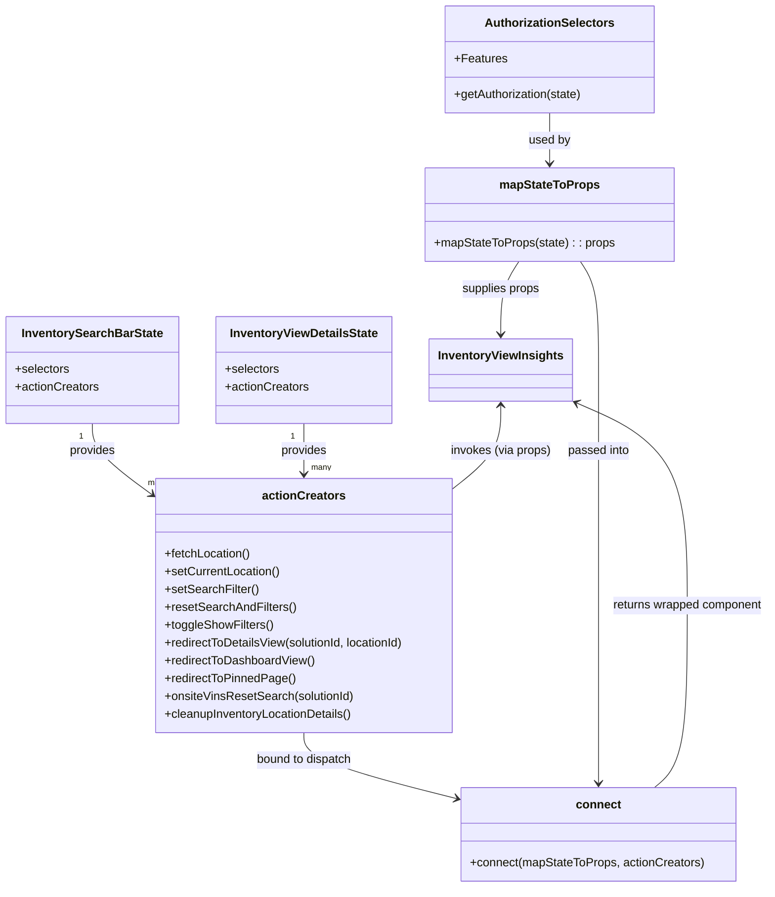

# Diagram: web/portal/src/pages/inventoryview/insights/InventoryView.Insights.page.container.js


> Auto-generated by Obscura crawlers

## Diagram 1

```mermaid
flowchart LR
  subgraph ReduxState["Redux State"]
    state[(state)]
  end

  subgraph Selectors["Selectors / Helpers"]
    s_solutionId[getSolutionId(state)]
    s_activeOrg[getActiveOrganization(state)]
    s_auth[getAuthorization(state)]
    s_getLocation[getLocation(state)]
    s_getLocationTimezone[getLocationTimezone(state)]
    s_getIsLoading[getIsLoading(state)]
  end

  state --> s_solutionId
  state --> s_activeOrg
  state --> s_auth
  state --> s_getLocation
  state --> s_getLocationTimezone
  state --> s_getIsLoading

  s_solutionId --> mapState[mapStateToProps]
  s_activeOrg --> mapState
  s_auth --> mapState
  s_getLocation --> mapState
  s_getLocationTimezone --> mapState
  s_getIsLoading --> mapState

  subgraph Actions["Inventory Action Creators"]
    a_searchEntities[searchEntities(solutionId)]
    a_setSearchFilter[setSearchFilter(filter)]
    a_resetSearchAndFilters[resetSearchAndFilters()]
    a_toggleShowFilters[toggleShowFilters()]
    a_setCurrentLocation[setCurrentLocation(locationId)]
    a_fetchLocation[fetchLocation(locationId)]
    a_redirectToDetailsView[redirectToDetailsView(locationId)]
    a_redirectToDashboardView[redirectToDashboardView()]
    a_redirectToPinnedPage[redirectToPinnedPage()]
    a_cleanup[cleanupInventoryLocationDetails()]
    a_redirectComposite[redirectToDetailsView(composite)]
    a_onsiteReset[onsiteVinsResetSearch(composite)]
  end

  a_searchEntities -->|used by| a_redirectComposite
  a_redirectToDetailsView -->|used by| a_redirectComposite
  a_resetSearchAndFilters -->|used by| a_onsiteReset
  a_searchEntities -->|used by| a_onsiteReset

  mapState --> connected[connect(mapStateToProps, actionCreators)]
  a_fetchLocation --> connected
  a_setCurrentLocation --> connected
  a_setSearchFilter --> connected
  a_resetSearchAndFilters --> connected
  a_toggleShowFilters --> connected
  a_redirectToDetailsView --> connected
  a_redirectToDashboardView --> connected
  a_redirectToPinnedPage --> connected
  a_cleanup --> connected
  a_redirectComposite --> connected
  a_onsiteReset --> connected

  connected --> InventoryViewInsightsComponent[InventoryViewInsights]
  mapState --> InventoryViewInsightsComponent

  classDef statefill fill:#f9f,stroke:#333,stroke-width:1px
  class state statefill
```

> SVG rendering failed for this diagram.

## Diagram 2



### SVG

<svg id="container" width="1022.1796875" xmlns="http://www.w3.org/2000/svg" class="classDiagram" height="1194" viewBox="0 0 1022.1796875 1194" role="graphics-document document" aria-roledescription="class"><style>#container{font-family:"trebuchet ms",verdana,arial,sans-serif;font-size:16px;fill:#333;}@keyframes edge-animation-frame{from{stroke-dashoffset:0;}}@keyframes dash{to{stroke-dashoffset:0;}}#container .edge-animation-slow{stroke-dasharray:9,5!important;stroke-dashoffset:900;animation:dash 50s linear infinite;stroke-linecap:round;}#container .edge-animation-fast{stroke-dasharray:9,5!important;stroke-dashoffset:900;animation:dash 20s linear infinite;stroke-linecap:round;}#container .error-icon{fill:#552222;}#container .error-text{fill:#552222;stroke:#552222;}#container .edge-thickness-normal{stroke-width:1px;}#container .edge-thickness-thick{stroke-width:3.5px;}#container .edge-pattern-solid{stroke-dasharray:0;}#container .edge-thickness-invisible{stroke-width:0;fill:none;}#container .edge-pattern-dashed{stroke-dasharray:3;}#container .edge-pattern-dotted{stroke-dasharray:2;}#container .marker{fill:#333333;stroke:#333333;}#container .marker.cross{stroke:#333333;}#container svg{font-family:"trebuchet ms",verdana,arial,sans-serif;font-size:16px;}#container p{margin:0;}#container g.classGroup text{fill:#9370DB;stroke:none;font-family:"trebuchet ms",verdana,arial,sans-serif;font-size:10px;}#container g.classGroup text .title{font-weight:bolder;}#container .nodeLabel,#container .edgeLabel{color:#131300;}#container .edgeLabel .label rect{fill:#ECECFF;}#container .label text{fill:#131300;}#container .labelBkg{background:#ECECFF;}#container .edgeLabel .label span{background:#ECECFF;}#container .classTitle{font-weight:bolder;}#container .node rect,#container .node circle,#container .node ellipse,#container .node polygon,#container .node path{fill:#ECECFF;stroke:#9370DB;stroke-width:1px;}#container .divider{stroke:#9370DB;stroke-width:1;}#container g.clickable{cursor:pointer;}#container g.classGroup rect{fill:#ECECFF;stroke:#9370DB;}#container g.classGroup line{stroke:#9370DB;stroke-width:1;}#container .classLabel .box{stroke:none;stroke-width:0;fill:#ECECFF;opacity:0.5;}#container .classLabel .label{fill:#9370DB;font-size:10px;}#container .relation{stroke:#333333;stroke-width:1;fill:none;}#container .dashed-line{stroke-dasharray:3;}#container .dotted-line{stroke-dasharray:1 2;}#container #compositionStart,#container .composition{fill:#333333!important;stroke:#333333!important;stroke-width:1;}#container #compositionEnd,#container .composition{fill:#333333!important;stroke:#333333!important;stroke-width:1;}#container #dependencyStart,#container .dependency{fill:#333333!important;stroke:#333333!important;stroke-width:1;}#container #dependencyStart,#container .dependency{fill:#333333!important;stroke:#333333!important;stroke-width:1;}#container #extensionStart,#container .extension{fill:transparent!important;stroke:#333333!important;stroke-width:1;}#container #extensionEnd,#container .extension{fill:transparent!important;stroke:#333333!important;stroke-width:1;}#container #aggregationStart,#container .aggregation{fill:transparent!important;stroke:#333333!important;stroke-width:1;}#container #aggregationEnd,#container .aggregation{fill:transparent!important;stroke:#333333!important;stroke-width:1;}#container #lollipopStart,#container .lollipop{fill:#ECECFF!important;stroke:#333333!important;stroke-width:1;}#container #lollipopEnd,#container .lollipop{fill:#ECECFF!important;stroke:#333333!important;stroke-width:1;}#container .edgeTerminals{font-size:11px;line-height:initial;}#container .classTitleText{text-anchor:middle;font-size:18px;fill:#333;}#container .label-icon{display:inline-block;height:1em;overflow:visible;vertical-align:-0.125em;}#container .node .label-icon path{fill:currentColor;stroke:revert;stroke-width:revert;}#container :root{--mermaid-font-family:"trebuchet ms",verdana,arial,sans-serif;}</style><g><defs><marker id="container_class-aggregationStart" class="marker aggregation class" refX="18" refY="7" markerWidth="190" markerHeight="240" orient="auto"><path d="M 18,7 L9,13 L1,7 L9,1 Z"></path></marker></defs><defs><marker id="container_class-aggregationEnd" class="marker aggregation class" refX="1" refY="7" markerWidth="20" markerHeight="28" orient="auto"><path d="M 18,7 L9,13 L1,7 L9,1 Z"></path></marker></defs><defs><marker id="container_class-extensionStart" class="marker extension class" refX="18" refY="7" markerWidth="190" markerHeight="240" orient="auto"><path d="M 1,7 L18,13 V 1 Z"></path></marker></defs><defs><marker id="container_class-extensionEnd" class="marker extension class" refX="1" refY="7" markerWidth="20" markerHeight="28" orient="auto"><path d="M 1,1 V 13 L18,7 Z"></path></marker></defs><defs><marker id="container_class-compositionStart" class="marker composition class" refX="18" refY="7" markerWidth="190" markerHeight="240" orient="auto"><path d="M 18,7 L9,13 L1,7 L9,1 Z"></path></marker></defs><defs><marker id="container_class-compositionEnd" class="marker composition class" refX="1" refY="7" markerWidth="20" markerHeight="28" orient="auto"><path d="M 18,7 L9,13 L1,7 L9,1 Z"></path></marker></defs><defs><marker id="container_class-dependencyStart" class="marker dependency class" refX="6" refY="7" markerWidth="190" markerHeight="240" orient="auto"><path d="M 5,7 L9,13 L1,7 L9,1 Z"></path></marker></defs><defs><marker id="container_class-dependencyEnd" class="marker dependency class" refX="13" refY="7" markerWidth="20" markerHeight="28" orient="auto"><path d="M 18,7 L9,13 L14,7 L9,1 Z"></path></marker></defs><defs><marker id="container_class-lollipopStart" class="marker lollipop class" refX="13" refY="7" markerWidth="190" markerHeight="240" orient="auto"><circle stroke="black" fill="transparent" cx="7" cy="7" r="6"></circle></marker></defs><defs><marker id="container_class-lollipopEnd" class="marker lollipop class" refX="1" refY="7" markerWidth="190" markerHeight="240" orient="auto"><circle stroke="black" fill="transparent" cx="7" cy="7" r="6"></circle></marker></defs><g class="root"><g class="clusters"></g><g class="edgePaths"><path d="M122.293,570L122.293,576.167C122.293,582.333,122.293,594.667,134.346,609.745C146.398,624.823,170.504,642.645,182.556,651.556L194.609,660.468" id="id_InventorySearchBarState_actionCreators_1" class="edge-thickness-normal edge-pattern-solid relation" style=";;;" data-edge="true" data-et="edge" data-id="id_InventorySearchBarState_actionCreators_1" data-points="W3sieCI6MTIyLjI5Mjk2ODc1LCJ5Ijo1NzB9LHsieCI6MTIyLjI5Mjk2ODc1LCJ5Ijo2MDd9LHsieCI6MTk5LjQzMzU5Mzc1LCJ5Ijo2NjQuMDM0NzI2OTQ3MDU1N31d" marker-end="url(#container_class-dependencyEnd)"></path><path d="M403.617,570L403.617,576.167C403.617,582.333,403.617,594.667,403.617,606C403.617,617.333,403.617,627.667,403.617,632.833L403.617,638" id="id_InventoryViewDetailsState_actionCreators_2" class="edge-thickness-normal edge-pattern-solid relation" style=";;;" data-edge="true" data-et="edge" data-id="id_InventoryViewDetailsState_actionCreators_2" data-points="W3sieCI6NDAzLjYxNzE4NzUsInkiOjU3MH0seyJ4Ijo0MDMuNjE3MTg3NSwieSI6NjA3fSx7IngiOjQwMy42MTcxODc1LCJ5Ijo2NDR9XQ==" marker-end="url(#container_class-dependencyEnd)"></path><path d="M729.031,152L729.031,158.167C729.031,164.333,729.031,176.667,729.031,188C729.031,199.333,729.031,209.667,729.031,214.833L729.031,220" id="id_AuthorizationSelectors_mapStateToProps_3" class="edge-thickness-normal edge-pattern-solid relation" style=";;;" data-edge="true" data-et="edge" data-id="id_AuthorizationSelectors_mapStateToProps_3" data-points="W3sieCI6NzI5LjAzMTI1LCJ5IjoxNTJ9LHsieCI6NzI5LjAzMTI1LCJ5IjoxODl9LHsieCI6NzI5LjAzMTI1LCJ5IjoyMjZ9XQ==" marker-end="url(#container_class-dependencyEnd)"></path><path d="M687.988,352L683.97,358.167C679.953,364.333,671.918,376.667,667.9,393C663.883,409.333,663.883,429.667,663.883,439.833L663.883,450" id="id_mapStateToProps_InventoryViewInsights_4" class="edge-thickness-normal edge-pattern-solid relation" style=";;;" data-edge="true" data-et="edge" data-id="id_mapStateToProps_InventoryViewInsights_4" data-points="W3sieCI6Njg3Ljk4NzczNDM3NSwieSI6MzUyfSx7IngiOjY2My44ODI4MTI1LCJ5IjozODl9LHsieCI6NjYzLjg4MjgxMjUsInkiOjQ1Nn1d" marker-end="url(#container_class-dependencyEnd)"></path><path d="M869.78,1060L877.18,1053.833C884.58,1047.667,899.38,1035.333,906.78,994.5C914.18,953.667,914.18,884.333,914.18,815C914.18,745.667,914.18,676.333,888.919,630.666C863.659,584.999,813.139,562.998,787.878,551.998L762.618,540.998" id="id_connect_InventoryViewInsights_5" class="edge-thickness-normal edge-pattern-solid relation" style=";;;" data-edge="true" data-et="edge" data-id="id_connect_InventoryViewInsights_5" data-points="W3sieCI6ODY5Ljc3OTY4NzUsInkiOjEwNjB9LHsieCI6OTE0LjE3OTY4NzUsInkiOjEwMjN9LHsieCI6OTE0LjE3OTY4NzUsInkiOjgxNX0seyJ4Ijo5MTQuMTc5Njg3NSwieSI6NjA3fSx7IngiOjc1Ny4xMTcxODc1LCJ5Ijo1MzguNjAxOTcyNjU3NDY5Mn1d" marker-end="url(#container_class-dependencyEnd)"></path><path d="M403.617,986L403.617,992.167C403.617,998.333,403.617,1010.667,436.972,1025.374C470.327,1040.08,537.036,1057.161,570.391,1065.701L603.746,1074.241" id="id_actionCreators_connect_6" class="edge-thickness-normal edge-pattern-solid relation" style=";;;" data-edge="true" data-et="edge" data-id="id_actionCreators_connect_6" data-points="W3sieCI6NDAzLjYxNzE4NzUsInkiOjk4Nn0seyJ4Ijo0MDMuNjE3MTg3NSwieSI6MTAyM30seyJ4Ijo2MDkuNTU4NTkzNzUsInkiOjEwNzUuNzI5NDM2NzA5ODczN31d" marker-end="url(#container_class-dependencyEnd)"></path><path d="M770.075,352L774.092,358.167C778.11,364.333,786.145,376.667,790.162,401C794.18,425.333,794.18,461.667,794.18,498C794.18,534.333,794.18,570.667,794.18,623.5C794.18,676.333,794.18,745.667,794.18,815C794.18,884.333,794.18,953.667,794.18,993.5C794.18,1033.333,794.18,1043.667,794.18,1048.833L794.18,1054" id="id_mapStateToProps_connect_7" class="edge-thickness-normal edge-pattern-solid relation" style=";;;" data-edge="true" data-et="edge" data-id="id_mapStateToProps_connect_7" data-points="W3sieCI6NzcwLjA3NDc2NTYyNSwieSI6MzUyfSx7IngiOjc5NC4xNzk2ODc1LCJ5IjozODl9LHsieCI6Nzk0LjE3OTY4NzUsInkiOjQ5OH0seyJ4Ijo3OTQuMTc5Njg3NSwieSI6NjA3fSx7IngiOjc5NC4xNzk2ODc1LCJ5Ijo4MTV9LHsieCI6Nzk0LjE3OTY4NzUsInkiOjEwMjN9LHsieCI6Nzk0LjE3OTY4NzUsInkiOjEwNjB9XQ==" marker-end="url(#container_class-dependencyEnd)"></path><path d="M663.883,546L663.883,556.167C663.883,566.333,663.883,586.667,654.536,604.303C645.189,621.94,626.495,636.88,617.148,644.35L607.801,651.82" id="id_InventoryViewInsights_actionCreators_8" class="edge-thickness-normal edge-pattern-solid relation" style=";;;" data-edge="true" data-et="edge" data-id="id_InventoryViewInsights_actionCreators_8" data-points="W3sieCI6NjYzLjg4MjgxMjUsInkiOjU0MH0seyJ4Ijo2NjMuODgyODEyNSwieSI6NjA3fSx7IngiOjYwNy44MDA3ODEyNSwieSI6NjUxLjgxOTgzNTUwNDU5Mjd9XQ==" marker-start="url(#container_class-dependencyStart)"></path></g><g class="edgeLabels"><g class="edgeLabel" transform="translate(122.29296875, 607)"><g class="label" data-id="id_InventorySearchBarState_actionCreators_1" transform="translate(-31.3125, -12)"><foreignObject width="62.625" height="24"><div xmlns="http://www.w3.org/1999/xhtml" class="labelBkg" style="display: table-cell; white-space: nowrap; line-height: 1.5; max-width: 200px; text-align: center;"><span class="edgeLabel"><p>provides</p></span></div></foreignObject></g></g><g class="edgeLabel" transform="translate(403.6171875, 607)"><g class="label" data-id="id_InventoryViewDetailsState_actionCreators_2" transform="translate(-31.3125, -12)"><foreignObject width="62.625" height="24"><div xmlns="http://www.w3.org/1999/xhtml" class="labelBkg" style="display: table-cell; white-space: nowrap; line-height: 1.5; max-width: 200px; text-align: center;"><span class="edgeLabel"><p>provides</p></span></div></foreignObject></g></g><g class="edgeLabel" transform="translate(729.03125, 189)"><g class="label" data-id="id_AuthorizationSelectors_mapStateToProps_3" transform="translate(-28.3125, -12)"><foreignObject width="56.625" height="24"><div xmlns="http://www.w3.org/1999/xhtml" class="labelBkg" style="display: table-cell; white-space: nowrap; line-height: 1.5; max-width: 200px; text-align: center;"><span class="edgeLabel"><p>used by</p></span></div></foreignObject></g></g><g class="edgeLabel" transform="translate(663.8828125, 389)"><g class="label" data-id="id_mapStateToProps_InventoryViewInsights_4" transform="translate(-53.4765625, -12)"><foreignObject width="106.953125" height="24"><div xmlns="http://www.w3.org/1999/xhtml" class="labelBkg" style="display: table-cell; white-space: nowrap; line-height: 1.5; max-width: 200px; text-align: center;"><span class="edgeLabel"><p>supplies props</p></span></div></foreignObject></g></g><g class="edgeLabel" transform="translate(914.1796875, 815)"><g class="label" data-id="id_connect_InventoryViewInsights_5" transform="translate(-100, -24)"><foreignObject width="200" height="48"><div xmlns="http://www.w3.org/1999/xhtml" class="labelBkg" style="display: table; white-space: break-spaces; line-height: 1.5; max-width: 200px; text-align: center; width: 200px;"><span class="edgeLabel"><p>returns wrapped component</p></span></div></foreignObject></g></g><g class="edgeLabel" transform="translate(403.6171875, 1023)"><g class="label" data-id="id_actionCreators_connect_6" transform="translate(-66.3125, -12)"><foreignObject width="132.625" height="24"><div xmlns="http://www.w3.org/1999/xhtml" class="labelBkg" style="display: table-cell; white-space: nowrap; line-height: 1.5; max-width: 200px; text-align: center;"><span class="edgeLabel"><p>bound to dispatch</p></span></div></foreignObject></g></g><g class="edgeLabel" transform="translate(794.1796875, 607)"><g class="label" data-id="id_mapStateToProps_connect_7" transform="translate(-41.984375, -12)"><foreignObject width="83.96875" height="24"><div xmlns="http://www.w3.org/1999/xhtml" class="labelBkg" style="display: table-cell; white-space: nowrap; line-height: 1.5; max-width: 200px; text-align: center;"><span class="edgeLabel"><p>passed into</p></span></div></foreignObject></g></g><g class="edgeLabel" transform="translate(663.8828125, 607)"><g class="label" data-id="id_InventoryViewInsights_actionCreators_8" transform="translate(-68.3125, -12)"><foreignObject width="136.625" height="24"><div xmlns="http://www.w3.org/1999/xhtml" class="labelBkg" style="display: table-cell; white-space: nowrap; line-height: 1.5; max-width: 200px; text-align: center;"><span class="edgeLabel"><p>invokes (via props)</p></span></div></foreignObject></g></g><g class="edgeTerminals" transform="translate(107.29296937500001, 587.5000005357143)"><g class="inner" transform="translate(0, 0)"><foreignObject style="width: 9px; height: 12px;"><div xmlns="http://www.w3.org/1999/xhtml" style="display: inline-block; padding-right: 1px; white-space: nowrap;"><span class="edgeLabel">1</span></div></foreignObject></g></g><g class="edgeTerminals" transform="translate(388.61718875, 587.5000010714285)"><g class="inner" transform="translate(0, 0)"><foreignObject style="width: 9px; height: 12px;"><div xmlns="http://www.w3.org/1999/xhtml" style="display: inline-block; padding-right: 1px; white-space: nowrap;"><span class="edgeLabel">1</span></div></foreignObject></g></g><g class="edgeTerminals" transform="translate(189.27971717474983, 636.5694728413812)"><g class="inner" transform="translate(0, 0)"></g><foreignObject style="width: 36px; height: 12px;"><div xmlns="http://www.w3.org/1999/xhtml" style="display: inline-block; padding-right: 1px; white-space: nowrap;"><span class="edgeLabel">many</span></div></foreignObject></g><g class="edgeTerminals" transform="translate(413.6171887499999, 621.5000010714285)"><g class="inner" transform="translate(0, 0)"></g><foreignObject style="width: 36px; height: 12px;"><div xmlns="http://www.w3.org/1999/xhtml" style="display: inline-block; padding-right: 1px; white-space: nowrap;"><span class="edgeLabel">many</span></div></foreignObject></g></g><g class="nodes"><g class="node default" id="classId-InventoryViewInsights-0" transform="translate(663.8828125, 498)"><g class="basic label-container"><path d="M-93.234375 -42 L93.234375 -42 L93.234375 42 L-93.234375 42" stroke="none" stroke-width="0" fill="#ECECFF" style=""></path><path d="M-93.234375 -42 C-29.680289905239263 -42, 33.87379518952147 -42, 93.234375 -42 M-93.234375 -42 C-30.943693112743894 -42, 31.346988774512212 -42, 93.234375 -42 M93.234375 -42 C93.234375 -8.765027000088487, 93.234375 24.469945999823025, 93.234375 42 M93.234375 -42 C93.234375 -13.350452136661822, 93.234375 15.299095726676356, 93.234375 42 M93.234375 42 C47.05572075681313 42, 0.8770665136262608 42, -93.234375 42 M93.234375 42 C38.12783459477975 42, -16.978705810440502 42, -93.234375 42 M-93.234375 42 C-93.234375 24.6032569493151, -93.234375 7.206513898630199, -93.234375 -42 M-93.234375 42 C-93.234375 20.081558455359243, -93.234375 -1.836883089281514, -93.234375 -42" stroke="#9370DB" stroke-width="1.3" fill="none" stroke-dasharray="0 0" style=""></path></g><g class="annotation-group text" transform="translate(0, -18)"></g><g class="label-group text" transform="translate(-81.234375, -18)"><g class="label" style="font-weight: bolder" transform="translate(0,-12)"><foreignObject width="162.46875" height="24"><div xmlns="http://www.w3.org/1999/xhtml" style="display: table-cell; white-space: nowrap; line-height: 1.5; max-width: 209px; text-align: center;"><span class="nodeLabel markdown-node-label" style=""><p>InventoryViewInsights</p></span></div></foreignObject></g></g><g class="members-group text" transform="translate(-81.234375, 30)"></g><g class="methods-group text" transform="translate(-81.234375, 60)"></g><g class="divider" style=""><path d="M-93.234375 6 C-35.45767810017634 6, 22.319018799647324 6, 93.234375 6 M-93.234375 6 C-19.41901049362042 6, 54.39635401275916 6, 93.234375 6" stroke="#9370DB" stroke-width="1.3" fill="none" stroke-dasharray="0 0" style=""></path></g><g class="divider" style=""><path d="M-93.234375 24 C-42.970024296337726 24, 7.294326407324547 24, 93.234375 24 M-93.234375 24 C-32.76653009377655 24, 27.701314812446896 24, 93.234375 24" stroke="#9370DB" stroke-width="1.3" fill="none" stroke-dasharray="0 0" style=""></path></g></g><g class="node default" id="classId-mapStateToProps-1" transform="translate(729.03125, 289)"><g class="basic label-container"><path d="M-166.04296875 -63 L166.04296875 -63 L166.04296875 63 L-166.04296875 63" stroke="none" stroke-width="0" fill="#ECECFF" style=""></path><path d="M-166.04296875 -63 C-57.61904885087087 -63, 50.80487104825826 -63, 166.04296875 -63 M-166.04296875 -63 C-61.857664937600845 -63, 42.32763887479831 -63, 166.04296875 -63 M166.04296875 -63 C166.04296875 -25.36593473302225, 166.04296875 12.2681305339555, 166.04296875 63 M166.04296875 -63 C166.04296875 -26.022471785728435, 166.04296875 10.95505642854313, 166.04296875 63 M166.04296875 63 C65.36930347891146 63, -35.304361792177076 63, -166.04296875 63 M166.04296875 63 C48.35764561256818 63, -69.32767752486365 63, -166.04296875 63 M-166.04296875 63 C-166.04296875 14.771926506528246, -166.04296875 -33.45614698694351, -166.04296875 -63 M-166.04296875 63 C-166.04296875 15.466441092913733, -166.04296875 -32.06711781417253, -166.04296875 -63" stroke="#9370DB" stroke-width="1.3" fill="none" stroke-dasharray="0 0" style=""></path></g><g class="annotation-group text" transform="translate(0, -39)"></g><g class="label-group text" transform="translate(-64.7109375, -39)"><g class="label" style="font-weight: bolder" transform="translate(0,-12)"><foreignObject width="129.421875" height="24"><div xmlns="http://www.w3.org/1999/xhtml" style="display: table-cell; white-space: nowrap; line-height: 1.5; max-width: 177px; text-align: center;"><span class="nodeLabel markdown-node-label" style=""><p>mapStateToProps</p></span></div></foreignObject></g></g><g class="members-group text" transform="translate(-154.04296875, 9)"></g><g class="methods-group text" transform="translate(-154.04296875, 39)"><g class="label" style="" transform="translate(0,-12)"><foreignObject width="243.375" height="24"><div xmlns="http://www.w3.org/1999/xhtml" style="display: table-cell; white-space: nowrap; line-height: 1.5; max-width: 301px; text-align: center;"><span class="nodeLabel markdown-node-label" style=""><p>+mapStateToProps(state) : : props</p></span></div></foreignObject></g></g><g class="divider" style=""><path d="M-166.04296875 -15 C-95.53832593441254 -15, -25.03368311882508 -15, 166.04296875 -15 M-166.04296875 -15 C-39.47342330057991 -15, 87.09612214884018 -15, 166.04296875 -15" stroke="#9370DB" stroke-width="1.3" fill="none" stroke-dasharray="0 0" style=""></path></g><g class="divider" style=""><path d="M-166.04296875 9 C-82.9101469779624 9, 0.2226747940752034 9, 166.04296875 9 M-166.04296875 9 C-72.42987302312063 9, 21.18322270375873 9, 166.04296875 9" stroke="#9370DB" stroke-width="1.3" fill="none" stroke-dasharray="0 0" style=""></path></g></g><g class="node default" id="classId-InventorySearchBarState-2" transform="translate(122.29296875, 498)"><g class="basic label-container"><path d="M-114.29296875 -72 L114.29296875 -72 L114.29296875 72 L-114.29296875 72" stroke="none" stroke-width="0" fill="#ECECFF" style=""></path><path d="M-114.29296875 -72 C-62.223686576902224 -72, -10.154404403804449 -72, 114.29296875 -72 M-114.29296875 -72 C-58.52629011085539 -72, -2.759611471710784 -72, 114.29296875 -72 M114.29296875 -72 C114.29296875 -25.509376477261625, 114.29296875 20.98124704547675, 114.29296875 72 M114.29296875 -72 C114.29296875 -19.757162133791752, 114.29296875 32.485675732416496, 114.29296875 72 M114.29296875 72 C50.837038947788926 72, -12.618890854422148 72, -114.29296875 72 M114.29296875 72 C32.48529157855391 72, -49.322385592892175 72, -114.29296875 72 M-114.29296875 72 C-114.29296875 17.349340706596195, -114.29296875 -37.30131858680761, -114.29296875 -72 M-114.29296875 72 C-114.29296875 18.537713669681544, -114.29296875 -34.92457266063691, -114.29296875 -72" stroke="#9370DB" stroke-width="1.3" fill="none" stroke-dasharray="0 0" style=""></path></g><g class="annotation-group text" transform="translate(0, -48)"></g><g class="label-group text" transform="translate(-91.5078125, -48)"><g class="label" style="font-weight: bolder" transform="translate(0,-12)"><foreignObject width="183.015625" height="24"><div xmlns="http://www.w3.org/1999/xhtml" style="display: table-cell; white-space: nowrap; line-height: 1.5; max-width: 229px; text-align: center;"><span class="nodeLabel markdown-node-label" style=""><p>InventorySearchBarState</p></span></div></foreignObject></g></g><g class="members-group text" transform="translate(-102.29296875, 0)"><g class="label" style="" transform="translate(0,-12)"><foreignObject width="73.453125" height="24"><div xmlns="http://www.w3.org/1999/xhtml" style="display: table-cell; white-space: nowrap; line-height: 1.5; max-width: 131px; text-align: center;"><span class="nodeLabel markdown-node-label" style=""><p>+selectors</p></span></div></foreignObject></g><g class="label" style="" transform="translate(0,12)"><foreignObject width="113.078125" height="24"><div xmlns="http://www.w3.org/1999/xhtml" style="display: table-cell; white-space: nowrap; line-height: 1.5; max-width: 170px; text-align: center;"><span class="nodeLabel markdown-node-label" style=""><p>+actionCreators</p></span></div></foreignObject></g></g><g class="methods-group text" transform="translate(-102.29296875, 72)"></g><g class="divider" style=""><path d="M-114.29296875 -24 C-44.49410769482907 -24, 25.304753360341863 -24, 114.29296875 -24 M-114.29296875 -24 C-37.2890854556871 -24, 39.7147978386258 -24, 114.29296875 -24" stroke="#9370DB" stroke-width="1.3" fill="none" stroke-dasharray="0 0" style=""></path></g><g class="divider" style=""><path d="M-114.29296875 48 C-64.93759042482658 48, -15.582212099653162 48, 114.29296875 48 M-114.29296875 48 C-47.980619185628555 48, 18.33173037874289 48, 114.29296875 48" stroke="#9370DB" stroke-width="1.3" fill="none" stroke-dasharray="0 0" style=""></path></g></g><g class="node default" id="classId-InventoryViewDetailsState-3" transform="translate(403.6171875, 498)"><g class="basic label-container"><path d="M-117.03125 -72 L117.03125 -72 L117.03125 72 L-117.03125 72" stroke="none" stroke-width="0" fill="#ECECFF" style=""></path><path d="M-117.03125 -72 C-33.84125004085941 -72, 49.348749918281186 -72, 117.03125 -72 M-117.03125 -72 C-66.90451859601954 -72, -16.777787192039085 -72, 117.03125 -72 M117.03125 -72 C117.03125 -23.57923405655096, 117.03125 24.841531886898082, 117.03125 72 M117.03125 -72 C117.03125 -41.62682218934974, 117.03125 -11.253644378699477, 117.03125 72 M117.03125 72 C34.07641561786279 72, -48.878418764274414 72, -117.03125 72 M117.03125 72 C50.89954049397281 72, -15.232169012054385 72, -117.03125 72 M-117.03125 72 C-117.03125 19.26200027944074, -117.03125 -33.47599944111852, -117.03125 -72 M-117.03125 72 C-117.03125 17.576526069608065, -117.03125 -36.84694786078387, -117.03125 -72" stroke="#9370DB" stroke-width="1.3" fill="none" stroke-dasharray="0 0" style=""></path></g><g class="annotation-group text" transform="translate(0, -48)"></g><g class="label-group text" transform="translate(-96.984375, -48)"><g class="label" style="font-weight: bolder" transform="translate(0,-12)"><foreignObject width="193.96875" height="24"><div xmlns="http://www.w3.org/1999/xhtml" style="display: table-cell; white-space: nowrap; line-height: 1.5; max-width: 240px; text-align: center;"><span class="nodeLabel markdown-node-label" style=""><p>InventoryViewDetailsState</p></span></div></foreignObject></g></g><g class="members-group text" transform="translate(-105.03125, 0)"><g class="label" style="" transform="translate(0,-12)"><foreignObject width="73.453125" height="24"><div xmlns="http://www.w3.org/1999/xhtml" style="display: table-cell; white-space: nowrap; line-height: 1.5; max-width: 131px; text-align: center;"><span class="nodeLabel markdown-node-label" style=""><p>+selectors</p></span></div></foreignObject></g><g class="label" style="" transform="translate(0,12)"><foreignObject width="113.078125" height="24"><div xmlns="http://www.w3.org/1999/xhtml" style="display: table-cell; white-space: nowrap; line-height: 1.5; max-width: 170px; text-align: center;"><span class="nodeLabel markdown-node-label" style=""><p>+actionCreators</p></span></div></foreignObject></g></g><g class="methods-group text" transform="translate(-105.03125, 72)"></g><g class="divider" style=""><path d="M-117.03125 -24 C-46.85938366228781 -24, 23.312482675424377 -24, 117.03125 -24 M-117.03125 -24 C-58.61670136584956 -24, -0.2021527316991154 -24, 117.03125 -24" stroke="#9370DB" stroke-width="1.3" fill="none" stroke-dasharray="0 0" style=""></path></g><g class="divider" style=""><path d="M-117.03125 48 C-28.259081190246064 48, 60.51308761950787 48, 117.03125 48 M-117.03125 48 C-50.36185093892422 48, 16.30754812215156 48, 117.03125 48" stroke="#9370DB" stroke-width="1.3" fill="none" stroke-dasharray="0 0" style=""></path></g></g><g class="node default" id="classId-AuthorizationSelectors-4" transform="translate(729.03125, 80)"><g class="basic label-container"><path d="M-141.5078125 -72 L141.5078125 -72 L141.5078125 72 L-141.5078125 72" stroke="none" stroke-width="0" fill="#ECECFF" style=""></path><path d="M-141.5078125 -72 C-33.06812328388165 -72, 75.3715659322367 -72, 141.5078125 -72 M-141.5078125 -72 C-59.15745870206935 -72, 23.192895095861303 -72, 141.5078125 -72 M141.5078125 -72 C141.5078125 -34.60282173931083, 141.5078125 2.794356521378333, 141.5078125 72 M141.5078125 -72 C141.5078125 -37.52508095753311, 141.5078125 -3.0501619150662265, 141.5078125 72 M141.5078125 72 C48.042905957531545 72, -45.42200058493691 72, -141.5078125 72 M141.5078125 72 C65.84187706339841 72, -9.824058373203172 72, -141.5078125 72 M-141.5078125 72 C-141.5078125 32.681750269413435, -141.5078125 -6.6364994611731305, -141.5078125 -72 M-141.5078125 72 C-141.5078125 39.81576318038616, -141.5078125 7.631526360772327, -141.5078125 -72" stroke="#9370DB" stroke-width="1.3" fill="none" stroke-dasharray="0 0" style=""></path></g><g class="annotation-group text" transform="translate(0, -48)"></g><g class="label-group text" transform="translate(-83.875, -48)"><g class="label" style="font-weight: bolder" transform="translate(0,-12)"><foreignObject width="167.75" height="24"><div xmlns="http://www.w3.org/1999/xhtml" style="display: table-cell; white-space: nowrap; line-height: 1.5; max-width: 215px; text-align: center;"><span class="nodeLabel markdown-node-label" style=""><p>AuthorizationSelectors</p></span></div></foreignObject></g></g><g class="members-group text" transform="translate(-129.5078125, 0)"><g class="label" style="" transform="translate(0,-12)"><foreignObject width="69.53125" height="24"><div xmlns="http://www.w3.org/1999/xhtml" style="display: table-cell; white-space: nowrap; line-height: 1.5; max-width: 127px; text-align: center;"><span class="nodeLabel markdown-node-label" style=""><p>+Features</p></span></div></foreignObject></g></g><g class="methods-group text" transform="translate(-129.5078125, 48)"><g class="label" style="" transform="translate(0,-12)"><foreignObject width="175.140625" height="24"><div xmlns="http://www.w3.org/1999/xhtml" style="display: table-cell; white-space: nowrap; line-height: 1.5; max-width: 233px; text-align: center;"><span class="nodeLabel markdown-node-label" style=""><p>+getAuthorization(state)</p></span></div></foreignObject></g></g><g class="divider" style=""><path d="M-141.5078125 -24 C-46.092067442228526 -24, 49.32367761554295 -24, 141.5078125 -24 M-141.5078125 -24 C-32.87354177032134 -24, 75.76072895935732 -24, 141.5078125 -24" stroke="#9370DB" stroke-width="1.3" fill="none" stroke-dasharray="0 0" style=""></path></g><g class="divider" style=""><path d="M-141.5078125 24 C-68.239214661866 24, 5.029383176267999 24, 141.5078125 24 M-141.5078125 24 C-82.41725322537604 24, -23.326693950752073 24, 141.5078125 24" stroke="#9370DB" stroke-width="1.3" fill="none" stroke-dasharray="0 0" style=""></path></g></g><g class="node default" id="classId-actionCreators-5" transform="translate(403.6171875, 815)"><g class="basic label-container"><path d="M-204.18359375 -171 L204.18359375 -171 L204.18359375 171 L-204.18359375 171" stroke="none" stroke-width="0" fill="#ECECFF" style=""></path><path d="M-204.18359375 -171 C-78.22133008213596 -171, 47.74093358572807 -171, 204.18359375 -171 M-204.18359375 -171 C-49.358801689076245 -171, 105.46599037184751 -171, 204.18359375 -171 M204.18359375 -171 C204.18359375 -56.05321142564131, 204.18359375 58.893577148717384, 204.18359375 171 M204.18359375 -171 C204.18359375 -66.41662387014996, 204.18359375 38.166752259700075, 204.18359375 171 M204.18359375 171 C78.47377940063107 171, -47.23603494873785 171, -204.18359375 171 M204.18359375 171 C80.87222222372674 171, -42.439149302546525 171, -204.18359375 171 M-204.18359375 171 C-204.18359375 70.3110555004972, -204.18359375 -30.37788899900559, -204.18359375 -171 M-204.18359375 171 C-204.18359375 89.76072647595605, -204.18359375 8.521452951912096, -204.18359375 -171" stroke="#9370DB" stroke-width="1.3" fill="none" stroke-dasharray="0 0" style=""></path></g><g class="annotation-group text" transform="translate(0, -147)"></g><g class="label-group text" transform="translate(-53.6328125, -147)"><g class="label" style="font-weight: bolder" transform="translate(0,-12)"><foreignObject width="107.265625" height="24"><div xmlns="http://www.w3.org/1999/xhtml" style="display: table-cell; white-space: nowrap; line-height: 1.5; max-width: 155px; text-align: center;"><span class="nodeLabel markdown-node-label" style=""><p>actionCreators</p></span></div></foreignObject></g></g><g class="members-group text" transform="translate(-192.18359375, -99)"></g><g class="methods-group text" transform="translate(-192.18359375, -69)"><g class="label" style="" transform="translate(0,-12)"><foreignObject width="116.71875" height="24"><div xmlns="http://www.w3.org/1999/xhtml" style="display: table-cell; white-space: nowrap; line-height: 1.5; max-width: 174px; text-align: center;"><span class="nodeLabel markdown-node-label" style=""><p>+fetchLocation()</p></span></div></foreignObject></g><g class="label" style="" transform="translate(0,12)"><foreignObject width="156.1875" height="24"><div xmlns="http://www.w3.org/1999/xhtml" style="display: table-cell; white-space: nowrap; line-height: 1.5; max-width: 214px; text-align: center;"><span class="nodeLabel markdown-node-label" style=""><p>+setCurrentLocation()</p></span></div></foreignObject></g><g class="label" style="" transform="translate(0,36)"><foreignObject width="125.953125" height="24"><div xmlns="http://www.w3.org/1999/xhtml" style="display: table-cell; white-space: nowrap; line-height: 1.5; max-width: 183px; text-align: center;"><span class="nodeLabel markdown-node-label" style=""><p>+setSearchFilter()</p></span></div></foreignObject></g><g class="label" style="" transform="translate(0,60)"><foreignObject width="175.71875" height="24"><div xmlns="http://www.w3.org/1999/xhtml" style="display: table-cell; white-space: nowrap; line-height: 1.5; max-width: 233px; text-align: center;"><span class="nodeLabel markdown-node-label" style=""><p>+resetSearchAndFilters()</p></span></div></foreignObject></g><g class="label" style="" transform="translate(0,84)"><foreignObject width="146.203125" height="24"><div xmlns="http://www.w3.org/1999/xhtml" style="display: table-cell; white-space: nowrap; line-height: 1.5; max-width: 204px; text-align: center;"><span class="nodeLabel markdown-node-label" style=""><p>+toggleShowFilters()</p></span></div></foreignObject></g><g class="label" style="" transform="translate(0,108)"><foreignObject width="330.734375" height="24"><div xmlns="http://www.w3.org/1999/xhtml" style="display: table-cell; white-space: nowrap; line-height: 1.5; max-width: 388px; text-align: center;"><span class="nodeLabel markdown-node-label" style=""><p>+redirectToDetailsView(solutionId, locationId)</p></span></div></foreignObject></g><g class="label" style="" transform="translate(0,132)"><foreignObject width="203.21875" height="24"><div xmlns="http://www.w3.org/1999/xhtml" style="display: table-cell; white-space: nowrap; line-height: 1.5; max-width: 261px; text-align: center;"><span class="nodeLabel markdown-node-label" style=""><p>+redirectToDashboardView()</p></span></div></foreignObject></g><g class="label" style="" transform="translate(0,156)"><foreignObject width="176.03125" height="24"><div xmlns="http://www.w3.org/1999/xhtml" style="display: table-cell; white-space: nowrap; line-height: 1.5; max-width: 233px; text-align: center;"><span class="nodeLabel markdown-node-label" style=""><p>+redirectToPinnedPage()</p></span></div></foreignObject></g><g class="label" style="" transform="translate(0,180)"><foreignObject width="256.515625" height="24"><div xmlns="http://www.w3.org/1999/xhtml" style="display: table-cell; white-space: nowrap; line-height: 1.5; max-width: 314px; text-align: center;"><span class="nodeLabel markdown-node-label" style=""><p>+onsiteVinsResetSearch(solutionId)</p></span></div></foreignObject></g><g class="label" style="" transform="translate(0,204)"><foreignObject width="257.0625" height="24"><div xmlns="http://www.w3.org/1999/xhtml" style="display: table-cell; white-space: nowrap; line-height: 1.5; max-width: 314px; text-align: center;"><span class="nodeLabel markdown-node-label" style=""><p>+cleanupInventoryLocationDetails()</p></span></div></foreignObject></g></g><g class="divider" style=""><path d="M-204.18359375 -123 C-118.03120744963965 -123, -31.878821149279304 -123, 204.18359375 -123 M-204.18359375 -123 C-116.31502964008024 -123, -28.44646553016048 -123, 204.18359375 -123" stroke="#9370DB" stroke-width="1.3" fill="none" stroke-dasharray="0 0" style=""></path></g><g class="divider" style=""><path d="M-204.18359375 -99 C-117.33894607988097 -99, -30.49429840976194 -99, 204.18359375 -99 M-204.18359375 -99 C-52.36023353716362 -99, 99.46312667567275 -99, 204.18359375 -99" stroke="#9370DB" stroke-width="1.3" fill="none" stroke-dasharray="0 0" style=""></path></g></g><g class="node default" id="classId-connect-6" transform="translate(794.1796875, 1123)"><g class="basic label-container"><path d="M-184.62109375 -63 L184.62109375 -63 L184.62109375 63 L-184.62109375 63" stroke="none" stroke-width="0" fill="#ECECFF" style=""></path><path d="M-184.62109375 -63 C-57.91504918627102 -63, 68.79099537745796 -63, 184.62109375 -63 M-184.62109375 -63 C-72.57197064169162 -63, 39.47715246661676 -63, 184.62109375 -63 M184.62109375 -63 C184.62109375 -14.234364874658432, 184.62109375 34.531270250683136, 184.62109375 63 M184.62109375 -63 C184.62109375 -27.977686413420543, 184.62109375 7.044627173158915, 184.62109375 63 M184.62109375 63 C63.9747342691215 63, -56.671625211757004 63, -184.62109375 63 M184.62109375 63 C49.640894493547904 63, -85.33930476290419 63, -184.62109375 63 M-184.62109375 63 C-184.62109375 33.71649656142444, -184.62109375 4.432993122848885, -184.62109375 -63 M-184.62109375 63 C-184.62109375 23.74520290705499, -184.62109375 -15.509594185890023, -184.62109375 -63" stroke="#9370DB" stroke-width="1.3" fill="none" stroke-dasharray="0 0" style=""></path></g><g class="annotation-group text" transform="translate(0, -39)"></g><g class="label-group text" transform="translate(-28.9140625, -39)"><g class="label" style="font-weight: bolder" transform="translate(0,-12)"><foreignObject width="57.828125" height="24"><div xmlns="http://www.w3.org/1999/xhtml" style="display: table-cell; white-space: nowrap; line-height: 1.5; max-width: 108px; text-align: center;"><span class="nodeLabel markdown-node-label" style=""><p>connect</p></span></div></foreignObject></g></g><g class="members-group text" transform="translate(-172.62109375, 9)"></g><g class="methods-group text" transform="translate(-172.62109375, 39)"><g class="label" style="" transform="translate(0,-12)"><foreignObject width="316.328125" height="24"><div xmlns="http://www.w3.org/1999/xhtml" style="display: table-cell; white-space: nowrap; line-height: 1.5; max-width: 374px; text-align: center;"><span class="nodeLabel markdown-node-label" style=""><p>+connect(mapStateToProps, actionCreators)</p></span></div></foreignObject></g></g><g class="divider" style=""><path d="M-184.62109375 -15 C-103.08228044625452 -15, -21.54346714250903 -15, 184.62109375 -15 M-184.62109375 -15 C-45.56842522238628 -15, 93.48424330522744 -15, 184.62109375 -15" stroke="#9370DB" stroke-width="1.3" fill="none" stroke-dasharray="0 0" style=""></path></g><g class="divider" style=""><path d="M-184.62109375 9 C-92.77438514295541 9, -0.9276765359108197 9, 184.62109375 9 M-184.62109375 9 C-102.56437964410908 9, -20.507665538218163 9, 184.62109375 9" stroke="#9370DB" stroke-width="1.3" fill="none" stroke-dasharray="0 0" style=""></path></g></g></g></g></g></svg>
