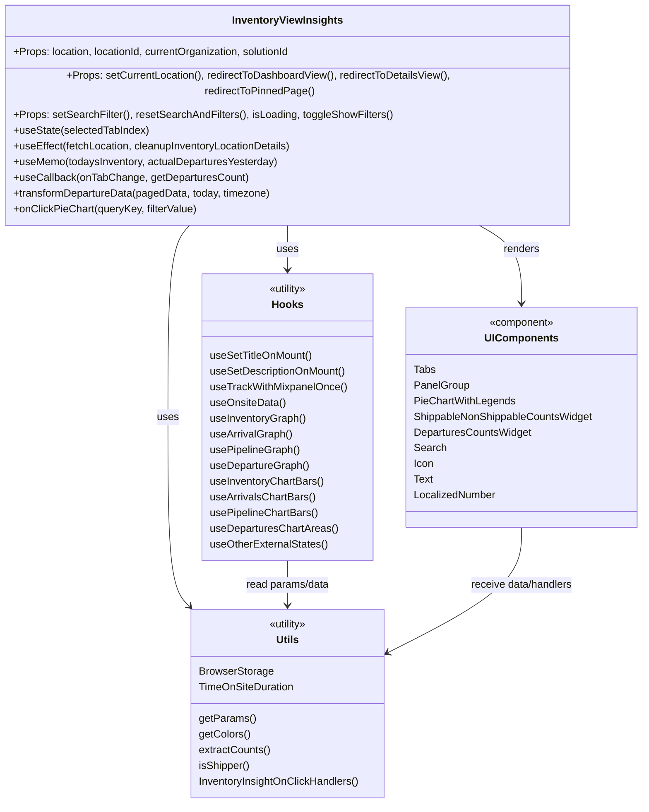

# Diagram: web/portal/src/pages/inventoryview/insights/InventoryView.Insights.page.js


> Auto-generated by Obscura crawlers

## Diagram 1



### SVG

<svg id="container" width="983.171875" xmlns="http://www.w3.org/2000/svg" class="classDiagram" height="1202" viewBox="0 0 983.171875 1202" role="graphics-document document" aria-roledescription="class"><style>#container{font-family:"trebuchet ms",verdana,arial,sans-serif;font-size:16px;fill:#333;}@keyframes edge-animation-frame{from{stroke-dashoffset:0;}}@keyframes dash{to{stroke-dashoffset:0;}}#container .edge-animation-slow{stroke-dasharray:9,5!important;stroke-dashoffset:900;animation:dash 50s linear infinite;stroke-linecap:round;}#container .edge-animation-fast{stroke-dasharray:9,5!important;stroke-dashoffset:900;animation:dash 20s linear infinite;stroke-linecap:round;}#container .error-icon{fill:#552222;}#container .error-text{fill:#552222;stroke:#552222;}#container .edge-thickness-normal{stroke-width:1px;}#container .edge-thickness-thick{stroke-width:3.5px;}#container .edge-pattern-solid{stroke-dasharray:0;}#container .edge-thickness-invisible{stroke-width:0;fill:none;}#container .edge-pattern-dashed{stroke-dasharray:3;}#container .edge-pattern-dotted{stroke-dasharray:2;}#container .marker{fill:#333333;stroke:#333333;}#container .marker.cross{stroke:#333333;}#container svg{font-family:"trebuchet ms",verdana,arial,sans-serif;font-size:16px;}#container p{margin:0;}#container g.classGroup text{fill:#9370DB;stroke:none;font-family:"trebuchet ms",verdana,arial,sans-serif;font-size:10px;}#container g.classGroup text .title{font-weight:bolder;}#container .nodeLabel,#container .edgeLabel{color:#131300;}#container .edgeLabel .label rect{fill:#ECECFF;}#container .label text{fill:#131300;}#container .labelBkg{background:#ECECFF;}#container .edgeLabel .label span{background:#ECECFF;}#container .classTitle{font-weight:bolder;}#container .node rect,#container .node circle,#container .node ellipse,#container .node polygon,#container .node path{fill:#ECECFF;stroke:#9370DB;stroke-width:1px;}#container .divider{stroke:#9370DB;stroke-width:1;}#container g.clickable{cursor:pointer;}#container g.classGroup rect{fill:#ECECFF;stroke:#9370DB;}#container g.classGroup line{stroke:#9370DB;stroke-width:1;}#container .classLabel .box{stroke:none;stroke-width:0;fill:#ECECFF;opacity:0.5;}#container .classLabel .label{fill:#9370DB;font-size:10px;}#container .relation{stroke:#333333;stroke-width:1;fill:none;}#container .dashed-line{stroke-dasharray:3;}#container .dotted-line{stroke-dasharray:1 2;}#container #compositionStart,#container .composition{fill:#333333!important;stroke:#333333!important;stroke-width:1;}#container #compositionEnd,#container .composition{fill:#333333!important;stroke:#333333!important;stroke-width:1;}#container #dependencyStart,#container .dependency{fill:#333333!important;stroke:#333333!important;stroke-width:1;}#container #dependencyStart,#container .dependency{fill:#333333!important;stroke:#333333!important;stroke-width:1;}#container #extensionStart,#container .extension{fill:transparent!important;stroke:#333333!important;stroke-width:1;}#container #extensionEnd,#container .extension{fill:transparent!important;stroke:#333333!important;stroke-width:1;}#container #aggregationStart,#container .aggregation{fill:transparent!important;stroke:#333333!important;stroke-width:1;}#container #aggregationEnd,#container .aggregation{fill:transparent!important;stroke:#333333!important;stroke-width:1;}#container #lollipopStart,#container .lollipop{fill:#ECECFF!important;stroke:#333333!important;stroke-width:1;}#container #lollipopEnd,#container .lollipop{fill:#ECECFF!important;stroke:#333333!important;stroke-width:1;}#container .edgeTerminals{font-size:11px;line-height:initial;}#container .classTitleText{text-anchor:middle;font-size:18px;fill:#333;}#container .label-icon{display:inline-block;height:1em;overflow:visible;vertical-align:-0.125em;}#container .node .label-icon path{fill:currentColor;stroke:revert;stroke-width:revert;}#container :root{--mermaid-font-family:"trebuchet ms",verdana,arial,sans-serif;}</style><g><defs><marker id="container_class-aggregationStart" class="marker aggregation class" refX="18" refY="7" markerWidth="190" markerHeight="240" orient="auto"><path d="M 18,7 L9,13 L1,7 L9,1 Z"></path></marker></defs><defs><marker id="container_class-aggregationEnd" class="marker aggregation class" refX="1" refY="7" markerWidth="20" markerHeight="28" orient="auto"><path d="M 18,7 L9,13 L1,7 L9,1 Z"></path></marker></defs><defs><marker id="container_class-extensionStart" class="marker extension class" refX="18" refY="7" markerWidth="190" markerHeight="240" orient="auto"><path d="M 1,7 L18,13 V 1 Z"></path></marker></defs><defs><marker id="container_class-extensionEnd" class="marker extension class" refX="1" refY="7" markerWidth="20" markerHeight="28" orient="auto"><path d="M 1,1 V 13 L18,7 Z"></path></marker></defs><defs><marker id="container_class-compositionStart" class="marker composition class" refX="18" refY="7" markerWidth="190" markerHeight="240" orient="auto"><path d="M 18,7 L9,13 L1,7 L9,1 Z"></path></marker></defs><defs><marker id="container_class-compositionEnd" class="marker composition class" refX="1" refY="7" markerWidth="20" markerHeight="28" orient="auto"><path d="M 18,7 L9,13 L1,7 L9,1 Z"></path></marker></defs><defs><marker id="container_class-dependencyStart" class="marker dependency class" refX="6" refY="7" markerWidth="190" markerHeight="240" orient="auto"><path d="M 5,7 L9,13 L1,7 L9,1 Z"></path></marker></defs><defs><marker id="container_class-dependencyEnd" class="marker dependency class" refX="13" refY="7" markerWidth="20" markerHeight="28" orient="auto"><path d="M 18,7 L9,13 L14,7 L9,1 Z"></path></marker></defs><defs><marker id="container_class-lollipopStart" class="marker lollipop class" refX="13" refY="7" markerWidth="190" markerHeight="240" orient="auto"><circle stroke="black" fill="transparent" cx="7" cy="7" r="6"></circle></marker></defs><defs><marker id="container_class-lollipopEnd" class="marker lollipop class" refX="1" refY="7" markerWidth="190" markerHeight="240" orient="auto"><circle stroke="black" fill="transparent" cx="7" cy="7" r="6"></circle></marker></defs><g class="root"><g class="clusters"></g><g class="edgePaths"><path d="M440.547,320L440.547,326.167C440.547,332.333,440.547,344.667,440.547,356C440.547,367.333,440.547,377.667,440.547,382.833L440.547,388" id="id_InventoryViewInsights_Hooks_1" class="edge-thickness-normal edge-pattern-solid relation" style=";;;" data-edge="true" data-et="edge" data-id="id_InventoryViewInsights_Hooks_1" data-points="W3sieCI6NDQwLjU0Njg3NSwieSI6MzIwfSx7IngiOjQ0MC41NDY4NzUsInkiOjM1N30seyJ4Ijo0NDAuNTQ2ODc1LCJ5IjozOTR9XQ==" marker-end="url(#container_class-dependencyEnd)"></path><path d="M292.453,320L286.599,326.167C280.745,332.333,269.036,344.667,263.182,393.5C257.328,442.333,257.328,527.667,257.328,613C257.328,698.333,257.328,783.667,262.859,831.797C268.39,879.928,279.452,890.856,284.982,896.319L290.513,901.783" id="id_InventoryViewInsights_Utils_2" class="edge-thickness-normal edge-pattern-solid relation" style=";;;" data-edge="true" data-et="edge" data-id="id_InventoryViewInsights_Utils_2" data-points="W3sieCI6MjkyLjQ1Mjk2MzA4MjkwMTUzLCJ5IjozMjB9LHsieCI6MjU3LjMyODEyNSwieSI6MzU3fSx7IngiOjI1Ny4zMjgxMjUsInkiOjYxM30seyJ4IjoyNTcuMzI4MTI1LCJ5Ijo4Njl9LHsieCI6Mjk0Ljc4MTY4MTYyOTgzNDIsInkiOjkwNn1d" marker-end="url(#container_class-dependencyEnd)"></path><path d="M730.057,320L741.501,326.167C752.945,332.333,775.834,344.667,787.278,364.5C798.723,384.333,798.723,411.667,798.723,425.333L798.723,439" id="id_InventoryViewInsights_UIComponents_3" class="edge-thickness-normal edge-pattern-solid relation" style=";;;" data-edge="true" data-et="edge" data-id="id_InventoryViewInsights_UIComponents_3" data-points="W3sieCI6NzMwLjA1NjgzMjkwMTU1NDMsInkiOjMyMH0seyJ4Ijo3OTguNzIyNjU2MjUsInkiOjM1N30seyJ4Ijo3OTguNzIyNjU2MjUsInkiOjQ0NX1d" marker-end="url(#container_class-dependencyEnd)"></path><path d="M440.547,832L440.547,838.167C440.547,844.333,440.547,856.667,440.547,868C440.547,879.333,440.547,889.667,440.547,894.833L440.547,900" id="id_Hooks_Utils_4" class="edge-thickness-normal edge-pattern-solid relation" style=";;;" data-edge="true" data-et="edge" data-id="id_Hooks_Utils_4" data-points="W3sieCI6NDQwLjU0Njg3NSwieSI6ODMyfSx7IngiOjQ0MC41NDY4NzUsInkiOjg2OX0seyJ4Ijo0NDAuNTQ2ODc1LCJ5Ijo5MDZ9XQ==" marker-end="url(#container_class-dependencyEnd)"></path><path d="M798.723,781L798.723,795.667C798.723,810.333,798.723,839.667,765.137,871.306C731.551,902.945,664.379,936.889,630.793,953.861L597.207,970.834" id="id_UIComponents_Utils_5" class="edge-thickness-normal edge-pattern-solid relation" style=";;;" data-edge="true" data-et="edge" data-id="id_UIComponents_Utils_5" data-points="W3sieCI6Nzk4LjcyMjY1NjI1LCJ5Ijo3ODF9LHsieCI6Nzk4LjcyMjY1NjI1LCJ5Ijo4Njl9LHsieCI6NTkxLjg1MTU2MjUsInkiOjk3My41Mzk5MjEyNTg5ODM4fV0=" marker-end="url(#container_class-dependencyEnd)"></path></g><g class="edgeLabels"><g class="edgeLabel" transform="translate(440.546875, 357)"><g class="label" data-id="id_InventoryViewInsights_Hooks_1" transform="translate(-16.4921875, -12)"><foreignObject width="32.984375" height="24"><div xmlns="http://www.w3.org/1999/xhtml" class="labelBkg" style="display: table-cell; white-space: nowrap; line-height: 1.5; max-width: 200px; text-align: center;"><span class="edgeLabel"><p>uses</p></span></div></foreignObject></g></g><g class="edgeLabel" transform="translate(257.328125, 613)"><g class="label" data-id="id_InventoryViewInsights_Utils_2" transform="translate(-16.4921875, -12)"><foreignObject width="32.984375" height="24"><div xmlns="http://www.w3.org/1999/xhtml" class="labelBkg" style="display: table-cell; white-space: nowrap; line-height: 1.5; max-width: 200px; text-align: center;"><span class="edgeLabel"><p>uses</p></span></div></foreignObject></g></g><g class="edgeLabel" transform="translate(798.72265625, 357)"><g class="label" data-id="id_InventoryViewInsights_UIComponents_3" transform="translate(-27.75, -12)"><foreignObject width="55.5" height="24"><div xmlns="http://www.w3.org/1999/xhtml" class="labelBkg" style="display: table-cell; white-space: nowrap; line-height: 1.5; max-width: 200px; text-align: center;"><span class="edgeLabel"><p>renders</p></span></div></foreignObject></g></g><g class="edgeLabel" transform="translate(440.546875, 869)"><g class="label" data-id="id_Hooks_Utils_4" transform="translate(-65.2421875, -12)"><foreignObject width="130.484375" height="24"><div xmlns="http://www.w3.org/1999/xhtml" class="labelBkg" style="display: table-cell; white-space: nowrap; line-height: 1.5; max-width: 200px; text-align: center;"><span class="edgeLabel"><p>read params/data</p></span></div></foreignObject></g></g><g class="edgeLabel" transform="translate(798.72265625, 869)"><g class="label" data-id="id_UIComponents_Utils_5" transform="translate(-80.234375, -12)"><foreignObject width="160.46875" height="24"><div xmlns="http://www.w3.org/1999/xhtml" class="labelBkg" style="display: table-cell; white-space: nowrap; line-height: 1.5; max-width: 200px; text-align: center;"><span class="edgeLabel"><p>receive data/handlers</p></span></div></foreignObject></g></g></g><g class="nodes"><g class="node default" id="classId-InventoryViewInsights-0" transform="translate(440.546875, 164)"><g class="basic label-container"><path d="M-432.546875 -156 L432.546875 -156 L432.546875 156 L-432.546875 156" stroke="none" stroke-width="0" fill="#ECECFF" style=""></path><path d="M-432.546875 -156 C-193.59668536997916 -156, 45.35350426004169 -156, 432.546875 -156 M-432.546875 -156 C-149.4286128867368 -156, 133.6896492265264 -156, 432.546875 -156 M432.546875 -156 C432.546875 -78.65240936854605, 432.546875 -1.3048187370920914, 432.546875 156 M432.546875 -156 C432.546875 -57.172529506939725, 432.546875 41.65494098612055, 432.546875 156 M432.546875 156 C256.14768186996037 156, 79.74848873992067 156, -432.546875 156 M432.546875 156 C228.43925058569104 156, 24.331626171382084 156, -432.546875 156 M-432.546875 156 C-432.546875 82.81094898890478, -432.546875 9.621897977809567, -432.546875 -156 M-432.546875 156 C-432.546875 76.03273566063113, -432.546875 -3.9345286787377347, -432.546875 -156" stroke="#9370DB" stroke-width="1.3" fill="none" stroke-dasharray="0 0" style=""></path></g><g class="annotation-group text" transform="translate(0, -132)"></g><g class="label-group text" transform="translate(-81.234375, -132)"><g class="label" style="font-weight: bolder" transform="translate(0,-12)"><foreignObject width="162.46875" height="24"><div xmlns="http://www.w3.org/1999/xhtml" style="display: table-cell; white-space: nowrap; line-height: 1.5; max-width: 209px; text-align: center;"><span class="nodeLabel markdown-node-label" style=""><p>InventoryViewInsights</p></span></div></foreignObject></g></g><g class="members-group text" transform="translate(-420.546875, -84)"><g class="label" style="" transform="translate(0,-12)"><foreignObject width="432.625" height="24"><div xmlns="http://www.w3.org/1999/xhtml" style="display: table-cell; white-space: nowrap; line-height: 1.5; max-width: 490px; text-align: center;"><span class="nodeLabel markdown-node-label" style=""><p>+Props: location, locationId, currentOrganization, solutionId</p></span></div></foreignObject></g></g><g class="methods-group text" transform="translate(-420.546875, -36)"><g class="label" style="" transform="translate(0,-12)"><foreignObject width="759.859375" height="24"><div xmlns="http://www.w3.org/1999/xhtml" style="display: table-cell; white-space: nowrap; line-height: 1.5; max-width: 817px; text-align: center;"><span class="nodeLabel markdown-node-label" style=""><p>+Props: setCurrentLocation(), redirectToDashboardView(), redirectToDetailsView(), redirectToPinnedPage()</p></span></div></foreignObject></g><g class="label" style="" transform="translate(0,12)"><foreignObject width="574.5" height="24"><div xmlns="http://www.w3.org/1999/xhtml" style="display: table-cell; white-space: nowrap; line-height: 1.5; max-width: 632px; text-align: center;"><span class="nodeLabel markdown-node-label" style=""><p>+Props: setSearchFilter(), resetSearchAndFilters(), isLoading, toggleShowFilters()</p></span></div></foreignObject></g><g class="label" style="" transform="translate(0,36)"><foreignObject width="207.875" height="24"><div xmlns="http://www.w3.org/1999/xhtml" style="display: table-cell; white-space: nowrap; line-height: 1.5; max-width: 265px; text-align: center;"><span class="nodeLabel markdown-node-label" style=""><p>+useState(selectedTabIndex)</p></span></div></foreignObject></g><g class="label" style="" transform="translate(0,60)"><foreignObject width="430.1875" height="24"><div xmlns="http://www.w3.org/1999/xhtml" style="display: table-cell; white-space: nowrap; line-height: 1.5; max-width: 488px; text-align: center;"><span class="nodeLabel markdown-node-label" style=""><p>+useEffect(fetchLocation, cleanupInventoryLocationDetails)</p></span></div></foreignObject></g><g class="label" style="" transform="translate(0,84)"><foreignObject width="407.28125" height="24"><div xmlns="http://www.w3.org/1999/xhtml" style="display: table-cell; white-space: nowrap; line-height: 1.5; max-width: 465px; text-align: center;"><span class="nodeLabel markdown-node-label" style=""><p>+useMemo(todaysInventory, actualDeparturesYesterday)</p></span></div></foreignObject></g><g class="label" style="" transform="translate(0,108)"><foreignObject width="355.0625" height="24"><div xmlns="http://www.w3.org/1999/xhtml" style="display: table-cell; white-space: nowrap; line-height: 1.5; max-width: 412px; text-align: center;"><span class="nodeLabel markdown-node-label" style=""><p>+useCallback(onTabChange, getDeparturesCount)</p></span></div></foreignObject></g><g class="label" style="" transform="translate(0,132)"><foreignObject width="396.3125" height="24"><div xmlns="http://www.w3.org/1999/xhtml" style="display: table-cell; white-space: nowrap; line-height: 1.5; max-width: 454px; text-align: center;"><span class="nodeLabel markdown-node-label" style=""><p>+transformDepartureData(pagedData, today, timezone)</p></span></div></foreignObject></g><g class="label" style="" transform="translate(0,156)"><foreignObject width="280.9375" height="24"><div xmlns="http://www.w3.org/1999/xhtml" style="display: table-cell; white-space: nowrap; line-height: 1.5; max-width: 338px; text-align: center;"><span class="nodeLabel markdown-node-label" style=""><p>+onClickPieChart(queryKey, filterValue)</p></span></div></foreignObject></g></g><g class="divider" style=""><path d="M-432.546875 -108 C-138.62547586894124 -108, 155.29592326211753 -108, 432.546875 -108 M-432.546875 -108 C-244.08124457751984 -108, -55.61561415503968 -108, 432.546875 -108" stroke="#9370DB" stroke-width="1.3" fill="none" stroke-dasharray="0 0" style=""></path></g><g class="divider" style=""><path d="M-432.546875 -60 C-138.64924381770737 -60, 155.24838736458526 -60, 432.546875 -60 M-432.546875 -60 C-200.50293321923468 -60, 31.541008561530646 -60, 432.546875 -60" stroke="#9370DB" stroke-width="1.3" fill="none" stroke-dasharray="0 0" style=""></path></g></g><g class="node default" id="classId-Hooks-1" transform="translate(440.546875, 613)"><g class="basic label-container"><path d="M-131.7265625 -219 L131.7265625 -219 L131.7265625 219 L-131.7265625 219" stroke="none" stroke-width="0" fill="#ECECFF" style=""></path><path d="M-131.7265625 -219 C-62.68837580511202 -219, 6.349810889775966 -219, 131.7265625 -219 M-131.7265625 -219 C-63.83249703486699 -219, 4.061568430266021 -219, 131.7265625 -219 M131.7265625 -219 C131.7265625 -79.58726424974287, 131.7265625 59.825471500514254, 131.7265625 219 M131.7265625 -219 C131.7265625 -108.59712253047151, 131.7265625 1.8057549390569818, 131.7265625 219 M131.7265625 219 C76.60597177761738 219, 21.485381055234782 219, -131.7265625 219 M131.7265625 219 C60.04435489511452 219, -11.637852709770954 219, -131.7265625 219 M-131.7265625 219 C-131.7265625 116.99599595814253, -131.7265625 14.991991916285059, -131.7265625 -219 M-131.7265625 219 C-131.7265625 128.80995221046126, -131.7265625 38.61990442092252, -131.7265625 -219" stroke="#9370DB" stroke-width="1.3" fill="none" stroke-dasharray="0 0" style=""></path></g><g class="annotation-group text" transform="translate(-30.3125, -195)"><g class="label" style="" transform="translate(0,-12)"><foreignObject width="60.625" height="24"><div xmlns="http://www.w3.org/1999/xhtml" style="display: table-cell; white-space: nowrap; line-height: 1.5; max-width: 111px; text-align: center;"><span class="nodeLabel markdown-node-label" style=""><p>«utility»</p></span></div></foreignObject></g></g><g class="label-group text" transform="translate(-22.9140625, -171)"><g class="label" style="font-weight: bolder" transform="translate(0,-12)"><foreignObject width="45.828125" height="24"><div xmlns="http://www.w3.org/1999/xhtml" style="display: table-cell; white-space: nowrap; line-height: 1.5; max-width: 95px; text-align: center;"><span class="nodeLabel markdown-node-label" style=""><p>Hooks</p></span></div></foreignObject></g></g><g class="members-group text" transform="translate(-119.7265625, -123)"></g><g class="methods-group text" transform="translate(-119.7265625, -93)"><g class="label" style="" transform="translate(0,-12)"><foreignObject width="157.53125" height="24"><div xmlns="http://www.w3.org/1999/xhtml" style="display: table-cell; white-space: nowrap; line-height: 1.5; max-width: 208px; text-align: center;"><span class="nodeLabel markdown-node-label" style=""><p>useSetTitleOnMount()</p></span></div></foreignObject></g><g class="label" style="" transform="translate(0,12)"><foreignObject width="209.140625" height="24"><div xmlns="http://www.w3.org/1999/xhtml" style="display: table-cell; white-space: nowrap; line-height: 1.5; max-width: 259px; text-align: center;"><span class="nodeLabel markdown-node-label" style=""><p>useSetDescriptionOnMount()</p></span></div></foreignObject></g><g class="label" style="" transform="translate(0,36)"><foreignObject width="208.765625" height="24"><div xmlns="http://www.w3.org/1999/xhtml" style="display: table-cell; white-space: nowrap; line-height: 1.5; max-width: 259px; text-align: center;"><span class="nodeLabel markdown-node-label" style=""><p>useTrackWithMixpanelOnce()</p></span></div></foreignObject></g><g class="label" style="" transform="translate(0,60)"><foreignObject width="115.78125" height="24"><div xmlns="http://www.w3.org/1999/xhtml" style="display: table-cell; white-space: nowrap; line-height: 1.5; max-width: 166px; text-align: center;"><span class="nodeLabel markdown-node-label" style=""><p>useOnsiteData()</p></span></div></foreignObject></g><g class="label" style="" transform="translate(0,84)"><foreignObject width="147.984375" height="24"><div xmlns="http://www.w3.org/1999/xhtml" style="display: table-cell; white-space: nowrap; line-height: 1.5; max-width: 198px; text-align: center;"><span class="nodeLabel markdown-node-label" style=""><p>useInventoryGraph()</p></span></div></foreignObject></g><g class="label" style="" transform="translate(0,108)"><foreignObject width="126.0625" height="24"><div xmlns="http://www.w3.org/1999/xhtml" style="display: table-cell; white-space: nowrap; line-height: 1.5; max-width: 176px; text-align: center;"><span class="nodeLabel markdown-node-label" style=""><p>useArrivalGraph()</p></span></div></foreignObject></g><g class="label" style="" transform="translate(0,132)"><foreignObject width="138.5" height="24"><div xmlns="http://www.w3.org/1999/xhtml" style="display: table-cell; white-space: nowrap; line-height: 1.5; max-width: 189px; text-align: center;"><span class="nodeLabel markdown-node-label" style=""><p>usePipelineGraph()</p></span></div></foreignObject></g><g class="label" style="" transform="translate(0,156)"><foreignObject width="151.921875" height="24"><div xmlns="http://www.w3.org/1999/xhtml" style="display: table-cell; white-space: nowrap; line-height: 1.5; max-width: 202px; text-align: center;"><span class="nodeLabel markdown-node-label" style=""><p>useDepartureGraph()</p></span></div></foreignObject></g><g class="label" style="" transform="translate(0,180)"><foreignObject width="175.375" height="24"><div xmlns="http://www.w3.org/1999/xhtml" style="display: table-cell; white-space: nowrap; line-height: 1.5; max-width: 225px; text-align: center;"><span class="nodeLabel markdown-node-label" style=""><p>useInventoryChartBars()</p></span></div></foreignObject></g><g class="label" style="" transform="translate(0,204)"><foreignObject width="160.90625" height="24"><div xmlns="http://www.w3.org/1999/xhtml" style="display: table-cell; white-space: nowrap; line-height: 1.5; max-width: 211px; text-align: center;"><span class="nodeLabel markdown-node-label" style=""><p>useArrivalsChartBars()</p></span></div></foreignObject></g><g class="label" style="" transform="translate(0,228)"><foreignObject width="165.875" height="24"><div xmlns="http://www.w3.org/1999/xhtml" style="display: table-cell; white-space: nowrap; line-height: 1.5; max-width: 216px; text-align: center;"><span class="nodeLabel markdown-node-label" style=""><p>usePipelineChartBars()</p></span></div></foreignObject></g><g class="label" style="" transform="translate(0,252)"><foreignObject width="194.375" height="24"><div xmlns="http://www.w3.org/1999/xhtml" style="display: table-cell; white-space: nowrap; line-height: 1.5; max-width: 244px; text-align: center;"><span class="nodeLabel markdown-node-label" style=""><p>useDeparturesChartAreas()</p></span></div></foreignObject></g><g class="label" style="" transform="translate(0,276)"><foreignObject width="181.171875" height="24"><div xmlns="http://www.w3.org/1999/xhtml" style="display: table-cell; white-space: nowrap; line-height: 1.5; max-width: 231px; text-align: center;"><span class="nodeLabel markdown-node-label" style=""><p>useOtherExternalStates()</p></span></div></foreignObject></g></g><g class="divider" style=""><path d="M-131.7265625 -147 C-39.772302899918586 -147, 52.18195670016283 -147, 131.7265625 -147 M-131.7265625 -147 C-55.12222541706976 -147, 21.482111665860486 -147, 131.7265625 -147" stroke="#9370DB" stroke-width="1.3" fill="none" stroke-dasharray="0 0" style=""></path></g><g class="divider" style=""><path d="M-131.7265625 -123 C-67.74743212066251 -123, -3.7683017413250184 -123, 131.7265625 -123 M-131.7265625 -123 C-72.12530968472235 -123, -12.524056869444706 -123, 131.7265625 -123" stroke="#9370DB" stroke-width="1.3" fill="none" stroke-dasharray="0 0" style=""></path></g></g><g class="node default" id="classId-Utils-2" transform="translate(440.546875, 1050)"><g class="basic label-container"><path d="M-151.3046875 -144 L151.3046875 -144 L151.3046875 144 L-151.3046875 144" stroke="none" stroke-width="0" fill="#ECECFF" style=""></path><path d="M-151.3046875 -144 C-70.88877529567696 -144, 9.52713690864607 -144, 151.3046875 -144 M-151.3046875 -144 C-53.462247572592105 -144, 44.38019235481579 -144, 151.3046875 -144 M151.3046875 -144 C151.3046875 -72.88723592877935, 151.3046875 -1.7744718575586944, 151.3046875 144 M151.3046875 -144 C151.3046875 -37.69027718168064, 151.3046875 68.61944563663872, 151.3046875 144 M151.3046875 144 C87.31759982159697 144, 23.330512143193943 144, -151.3046875 144 M151.3046875 144 C31.405533520714556 144, -88.49362045857089 144, -151.3046875 144 M-151.3046875 144 C-151.3046875 64.68581051228533, -151.3046875 -14.628378975429342, -151.3046875 -144 M-151.3046875 144 C-151.3046875 70.25506024298966, -151.3046875 -3.4898795140206857, -151.3046875 -144" stroke="#9370DB" stroke-width="1.3" fill="none" stroke-dasharray="0 0" style=""></path></g><g class="annotation-group text" transform="translate(-30.3125, -120)"><g class="label" style="" transform="translate(0,-12)"><foreignObject width="60.625" height="24"><div xmlns="http://www.w3.org/1999/xhtml" style="display: table-cell; white-space: nowrap; line-height: 1.5; max-width: 111px; text-align: center;"><span class="nodeLabel markdown-node-label" style=""><p>«utility»</p></span></div></foreignObject></g></g><g class="label-group text" transform="translate(-16.796875, -96)"><g class="label" style="font-weight: bolder" transform="translate(0,-12)"><foreignObject width="33.59375" height="24"><div xmlns="http://www.w3.org/1999/xhtml" style="display: table-cell; white-space: nowrap; line-height: 1.5; max-width: 83px; text-align: center;"><span class="nodeLabel markdown-node-label" style=""><p>Utils</p></span></div></foreignObject></g></g><g class="members-group text" transform="translate(-139.3046875, -48)"><g class="label" style="" transform="translate(0,-12)"><foreignObject width="113.15625" height="24"><div xmlns="http://www.w3.org/1999/xhtml" style="display: table-cell; white-space: nowrap; line-height: 1.5; max-width: 163px; text-align: center;"><span class="nodeLabel markdown-node-label" style=""><p>BrowserStorage</p></span></div></foreignObject></g><g class="label" style="" transform="translate(0,12)"><foreignObject width="146.109375" height="24"><div xmlns="http://www.w3.org/1999/xhtml" style="display: table-cell; white-space: nowrap; line-height: 1.5; max-width: 196px; text-align: center;"><span class="nodeLabel markdown-node-label" style=""><p>TimeOnSiteDuration</p></span></div></foreignObject></g></g><g class="methods-group text" transform="translate(-139.3046875, 24)"><g class="label" style="" transform="translate(0,-12)"><foreignObject width="85.5625" height="24"><div xmlns="http://www.w3.org/1999/xhtml" style="display: table-cell; white-space: nowrap; line-height: 1.5; max-width: 136px; text-align: center;"><span class="nodeLabel markdown-node-label" style=""><p>getParams()</p></span></div></foreignObject></g><g class="label" style="" transform="translate(0,12)"><foreignObject width="78.28125" height="24"><div xmlns="http://www.w3.org/1999/xhtml" style="display: table-cell; white-space: nowrap; line-height: 1.5; max-width: 128px; text-align: center;"><span class="nodeLabel markdown-node-label" style=""><p>getColors()</p></span></div></foreignObject></g><g class="label" style="" transform="translate(0,36)"><foreignObject width="110.15625" height="24"><div xmlns="http://www.w3.org/1999/xhtml" style="display: table-cell; white-space: nowrap; line-height: 1.5; max-width: 160px; text-align: center;"><span class="nodeLabel markdown-node-label" style=""><p>extractCounts()</p></span></div></foreignObject></g><g class="label" style="" transform="translate(0,60)"><foreignObject width="78.875" height="24"><div xmlns="http://www.w3.org/1999/xhtml" style="display: table-cell; white-space: nowrap; line-height: 1.5; max-width: 129px; text-align: center;"><span class="nodeLabel markdown-node-label" style=""><p>isShipper()</p></span></div></foreignObject></g><g class="label" style="" transform="translate(0,84)"><foreignObject width="248.296875" height="24"><div xmlns="http://www.w3.org/1999/xhtml" style="display: table-cell; white-space: nowrap; line-height: 1.5; max-width: 298px; text-align: center;"><span class="nodeLabel markdown-node-label" style=""><p>InventoryInsightOnClickHandlers()</p></span></div></foreignObject></g></g><g class="divider" style=""><path d="M-151.3046875 -72 C-53.91876898424792 -72, 43.46714953150416 -72, 151.3046875 -72 M-151.3046875 -72 C-75.04356572331866 -72, 1.2175560533626708 -72, 151.3046875 -72" stroke="#9370DB" stroke-width="1.3" fill="none" stroke-dasharray="0 0" style=""></path></g><g class="divider" style=""><path d="M-151.3046875 0 C-84.49310003813301 0, -17.681512576266016 0, 151.3046875 0 M-151.3046875 0 C-40.97508576051763 0, 69.35451597896474 0, 151.3046875 0" stroke="#9370DB" stroke-width="1.3" fill="none" stroke-dasharray="0 0" style=""></path></g></g><g class="node default" id="classId-UIComponents-3" transform="translate(798.72265625, 613)"><g class="basic label-container"><path d="M-176.44921875 -168 L176.44921875 -168 L176.44921875 168 L-176.44921875 168" stroke="none" stroke-width="0" fill="#ECECFF" style=""></path><path d="M-176.44921875 -168 C-94.5626793369292 -168, -12.676139923858386 -168, 176.44921875 -168 M-176.44921875 -168 C-70.71170867684165 -168, 35.025801396316695 -168, 176.44921875 -168 M176.44921875 -168 C176.44921875 -90.94730568912068, 176.44921875 -13.894611378241365, 176.44921875 168 M176.44921875 -168 C176.44921875 -84.32242002928584, 176.44921875 -0.644840058571674, 176.44921875 168 M176.44921875 168 C57.04130934488039 168, -62.36660006023922 168, -176.44921875 168 M176.44921875 168 C77.99869684947554 168, -20.451825051048928 168, -176.44921875 168 M-176.44921875 168 C-176.44921875 82.80957115843917, -176.44921875 -2.3808576831216612, -176.44921875 -168 M-176.44921875 168 C-176.44921875 65.28596331214513, -176.44921875 -37.428073375709744, -176.44921875 -168" stroke="#9370DB" stroke-width="1.3" fill="none" stroke-dasharray="0 0" style=""></path></g><g class="annotation-group text" transform="translate(-50.2109375, -144)"><g class="label" style="" transform="translate(0,-12)"><foreignObject width="100.421875" height="24"><div xmlns="http://www.w3.org/1999/xhtml" style="display: table-cell; white-space: nowrap; line-height: 1.5; max-width: 150px; text-align: center;"><span class="nodeLabel markdown-node-label" style=""><p>«component»</p></span></div></foreignObject></g></g><g class="label-group text" transform="translate(-53.4765625, -120)"><g class="label" style="font-weight: bolder" transform="translate(0,-12)"><foreignObject width="106.953125" height="24"><div xmlns="http://www.w3.org/1999/xhtml" style="display: table-cell; white-space: nowrap; line-height: 1.5; max-width: 157px; text-align: center;"><span class="nodeLabel markdown-node-label" style=""><p>UIComponents</p></span></div></foreignObject></g></g><g class="members-group text" transform="translate(-164.44921875, -72)"><g class="label" style="" transform="translate(0,-12)"><foreignObject width="33.15625" height="24"><div xmlns="http://www.w3.org/1999/xhtml" style="display: table-cell; white-space: nowrap; line-height: 1.5; max-width: 83px; text-align: center;"><span class="nodeLabel markdown-node-label" style=""><p>Tabs</p></span></div></foreignObject></g><g class="label" style="" transform="translate(0,12)"><foreignObject width="83.859375" height="24"><div xmlns="http://www.w3.org/1999/xhtml" style="display: table-cell; white-space: nowrap; line-height: 1.5; max-width: 134px; text-align: center;"><span class="nodeLabel markdown-node-label" style=""><p>PanelGroup</p></span></div></foreignObject></g><g class="label" style="" transform="translate(0,36)"><foreignObject width="153.734375" height="24"><div xmlns="http://www.w3.org/1999/xhtml" style="display: table-cell; white-space: nowrap; line-height: 1.5; max-width: 204px; text-align: center;"><span class="nodeLabel markdown-node-label" style=""><p>PieChartWithLegends</p></span></div></foreignObject></g><g class="label" style="" transform="translate(0,60)"><foreignObject width="275.421875" height="24"><div xmlns="http://www.w3.org/1999/xhtml" style="display: table-cell; white-space: nowrap; line-height: 1.5; max-width: 326px; text-align: center;"><span class="nodeLabel markdown-node-label" style=""><p>ShippableNonShippableCountsWidget</p></span></div></foreignObject></g><g class="label" style="" transform="translate(0,84)"><foreignObject width="180.015625" height="24"><div xmlns="http://www.w3.org/1999/xhtml" style="display: table-cell; white-space: nowrap; line-height: 1.5; max-width: 230px; text-align: center;"><span class="nodeLabel markdown-node-label" style=""><p>DeparturesCountsWidget</p></span></div></foreignObject></g><g class="label" style="" transform="translate(0,108)"><foreignObject width="48.71875" height="24"><div xmlns="http://www.w3.org/1999/xhtml" style="display: table-cell; white-space: nowrap; line-height: 1.5; max-width: 99px; text-align: center;"><span class="nodeLabel markdown-node-label" style=""><p>Search</p></span></div></foreignObject></g><g class="label" style="" transform="translate(0,132)"><foreignObject width="30.78125" height="24"><div xmlns="http://www.w3.org/1999/xhtml" style="display: table-cell; white-space: nowrap; line-height: 1.5; max-width: 81px; text-align: center;"><span class="nodeLabel markdown-node-label" style=""><p>Icon</p></span></div></foreignObject></g><g class="label" style="" transform="translate(0,156)"><foreignObject width="29.515625" height="24"><div xmlns="http://www.w3.org/1999/xhtml" style="display: table-cell; white-space: nowrap; line-height: 1.5; max-width: 80px; text-align: center;"><span class="nodeLabel markdown-node-label" style=""><p>Text</p></span></div></foreignObject></g><g class="label" style="" transform="translate(0,180)"><foreignObject width="125.671875" height="24"><div xmlns="http://www.w3.org/1999/xhtml" style="display: table-cell; white-space: nowrap; line-height: 1.5; max-width: 176px; text-align: center;"><span class="nodeLabel markdown-node-label" style=""><p>LocalizedNumber</p></span></div></foreignObject></g></g><g class="methods-group text" transform="translate(-164.44921875, 168)"></g><g class="divider" style=""><path d="M-176.44921875 -96 C-47.261975209309185 -96, 81.92526833138163 -96, 176.44921875 -96 M-176.44921875 -96 C-53.40288966822989 -96, 69.64343941354022 -96, 176.44921875 -96" stroke="#9370DB" stroke-width="1.3" fill="none" stroke-dasharray="0 0" style=""></path></g><g class="divider" style=""><path d="M-176.44921875 144 C-46.80120631517633 144, 82.84680611964734 144, 176.44921875 144 M-176.44921875 144 C-38.556140458519025 144, 99.33693783296195 144, 176.44921875 144" stroke="#9370DB" stroke-width="1.3" fill="none" stroke-dasharray="0 0" style=""></path></g></g></g></g></g></svg>

## Diagram 2

```mermaid
flowchart TD
    A[Props & Initial State] -->|mount| B[useEffect: fetchLocation & setCurrentLocation]
    B --> C[getParams(locationId, timezone, fvId)]
    C --> D{Data Queries}
    D --> D1[useInventoryGraph -> inventoryChartData]
    D --> D2[useArrivalGraph -> arrivalGraphData]
    D --> D3[usePipelineGraph -> pipelineChartData]
    D --> D4[useDepartureGraph -> departuresChartData]
    D --> D5[useOnsiteData -> donutChartsData, allData]
    D1 --> E[compute todaysInventory, maxInventoryValue]
    D2 --> F[compute totalSumArrivals, maxArrivalValue]
    D3 --> G[filter pipelineChartData -> totalSumPipeline, maxPipelineValue]
    D4 --> H[transformDepartureData -> actualsDeparturesData, projectedTrendDeparturesData]
    D5 --> I[tenDaysOnSite, initialEta, topOrderTypes, topCarriers]
    E --> J[ShippableNonShippableCountsWidget (Inventory)]
    G --> K[ShippableNonShippableCountsWidget (Pipeline)]
    F --> L[ShippableNonShippableCountsWidget (Arrivals)]
    H --> M[DeparturesCountsWidget]
    I --> N[PieChartWithLegends x4]
    N -->|onClick| O[onClickPieChart -> setSearchFilter + redirectToDetailsView]
    J & K & L & M --> P[Dashboard UI: Tabs / Panels / Insights display]
    P --> Q[User interactions: Tabs, Search, Panel clicks]
```

> SVG rendering failed for this diagram.
