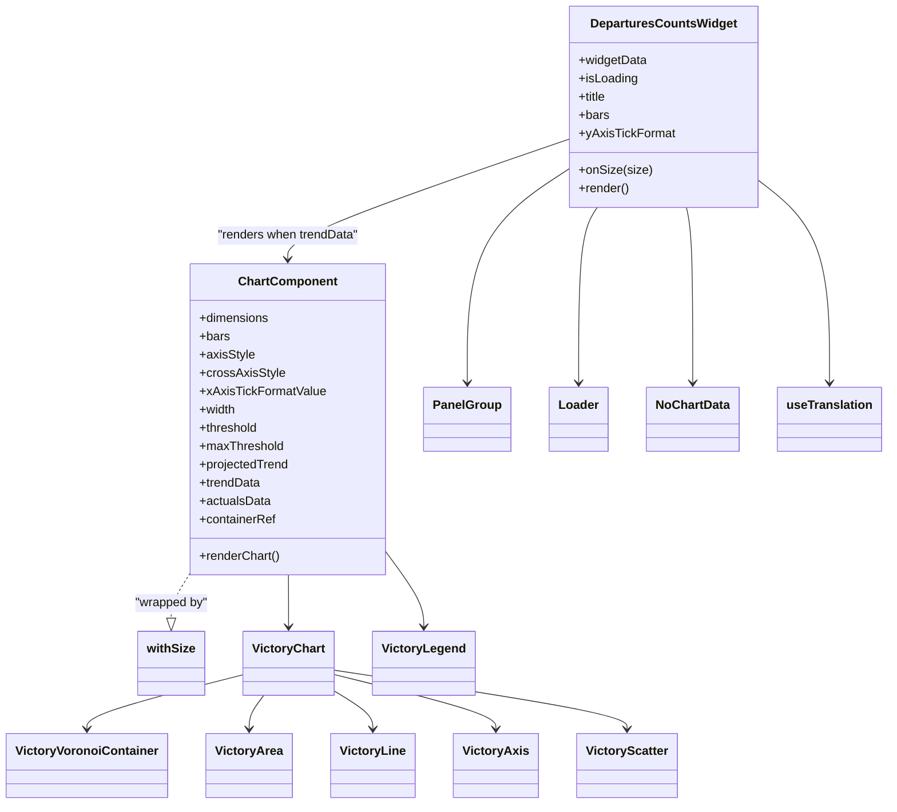

# Diagram: web/portal/src/pages/inventoryview/insights/components/DeparturesCountsWidget.js


> Auto-generated by Obscura crawlers

## Diagram 1



### SVG

<svg id="container" width="1127.859375" xmlns="http://www.w3.org/2000/svg" class="classDiagram" height="1054" viewBox="0 0 1127.859375 1054" role="graphics-document document" aria-roledescription="class"><style>#container{font-family:"trebuchet ms",verdana,arial,sans-serif;font-size:16px;fill:#333;}@keyframes edge-animation-frame{from{stroke-dashoffset:0;}}@keyframes dash{to{stroke-dashoffset:0;}}#container .edge-animation-slow{stroke-dasharray:9,5!important;stroke-dashoffset:900;animation:dash 50s linear infinite;stroke-linecap:round;}#container .edge-animation-fast{stroke-dasharray:9,5!important;stroke-dashoffset:900;animation:dash 20s linear infinite;stroke-linecap:round;}#container .error-icon{fill:#552222;}#container .error-text{fill:#552222;stroke:#552222;}#container .edge-thickness-normal{stroke-width:1px;}#container .edge-thickness-thick{stroke-width:3.5px;}#container .edge-pattern-solid{stroke-dasharray:0;}#container .edge-thickness-invisible{stroke-width:0;fill:none;}#container .edge-pattern-dashed{stroke-dasharray:3;}#container .edge-pattern-dotted{stroke-dasharray:2;}#container .marker{fill:#333333;stroke:#333333;}#container .marker.cross{stroke:#333333;}#container svg{font-family:"trebuchet ms",verdana,arial,sans-serif;font-size:16px;}#container p{margin:0;}#container g.classGroup text{fill:#9370DB;stroke:none;font-family:"trebuchet ms",verdana,arial,sans-serif;font-size:10px;}#container g.classGroup text .title{font-weight:bolder;}#container .nodeLabel,#container .edgeLabel{color:#131300;}#container .edgeLabel .label rect{fill:#ECECFF;}#container .label text{fill:#131300;}#container .labelBkg{background:#ECECFF;}#container .edgeLabel .label span{background:#ECECFF;}#container .classTitle{font-weight:bolder;}#container .node rect,#container .node circle,#container .node ellipse,#container .node polygon,#container .node path{fill:#ECECFF;stroke:#9370DB;stroke-width:1px;}#container .divider{stroke:#9370DB;stroke-width:1;}#container g.clickable{cursor:pointer;}#container g.classGroup rect{fill:#ECECFF;stroke:#9370DB;}#container g.classGroup line{stroke:#9370DB;stroke-width:1;}#container .classLabel .box{stroke:none;stroke-width:0;fill:#ECECFF;opacity:0.5;}#container .classLabel .label{fill:#9370DB;font-size:10px;}#container .relation{stroke:#333333;stroke-width:1;fill:none;}#container .dashed-line{stroke-dasharray:3;}#container .dotted-line{stroke-dasharray:1 2;}#container #compositionStart,#container .composition{fill:#333333!important;stroke:#333333!important;stroke-width:1;}#container #compositionEnd,#container .composition{fill:#333333!important;stroke:#333333!important;stroke-width:1;}#container #dependencyStart,#container .dependency{fill:#333333!important;stroke:#333333!important;stroke-width:1;}#container #dependencyStart,#container .dependency{fill:#333333!important;stroke:#333333!important;stroke-width:1;}#container #extensionStart,#container .extension{fill:transparent!important;stroke:#333333!important;stroke-width:1;}#container #extensionEnd,#container .extension{fill:transparent!important;stroke:#333333!important;stroke-width:1;}#container #aggregationStart,#container .aggregation{fill:transparent!important;stroke:#333333!important;stroke-width:1;}#container #aggregationEnd,#container .aggregation{fill:transparent!important;stroke:#333333!important;stroke-width:1;}#container #lollipopStart,#container .lollipop{fill:#ECECFF!important;stroke:#333333!important;stroke-width:1;}#container #lollipopEnd,#container .lollipop{fill:#ECECFF!important;stroke:#333333!important;stroke-width:1;}#container .edgeTerminals{font-size:11px;line-height:initial;}#container .classTitleText{text-anchor:middle;font-size:18px;fill:#333;}#container .label-icon{display:inline-block;height:1em;overflow:visible;vertical-align:-0.125em;}#container .node .label-icon path{fill:currentColor;stroke:revert;stroke-width:revert;}#container :root{--mermaid-font-family:"trebuchet ms",verdana,arial,sans-serif;}</style><g><defs><marker id="container_class-aggregationStart" class="marker aggregation class" refX="18" refY="7" markerWidth="190" markerHeight="240" orient="auto"><path d="M 18,7 L9,13 L1,7 L9,1 Z"></path></marker></defs><defs><marker id="container_class-aggregationEnd" class="marker aggregation class" refX="1" refY="7" markerWidth="20" markerHeight="28" orient="auto"><path d="M 18,7 L9,13 L1,7 L9,1 Z"></path></marker></defs><defs><marker id="container_class-extensionStart" class="marker extension class" refX="18" refY="7" markerWidth="190" markerHeight="240" orient="auto"><path d="M 1,7 L18,13 V 1 Z"></path></marker></defs><defs><marker id="container_class-extensionEnd" class="marker extension class" refX="1" refY="7" markerWidth="20" markerHeight="28" orient="auto"><path d="M 1,1 V 13 L18,7 Z"></path></marker></defs><defs><marker id="container_class-compositionStart" class="marker composition class" refX="18" refY="7" markerWidth="190" markerHeight="240" orient="auto"><path d="M 18,7 L9,13 L1,7 L9,1 Z"></path></marker></defs><defs><marker id="container_class-compositionEnd" class="marker composition class" refX="1" refY="7" markerWidth="20" markerHeight="28" orient="auto"><path d="M 18,7 L9,13 L1,7 L9,1 Z"></path></marker></defs><defs><marker id="container_class-dependencyStart" class="marker dependency class" refX="6" refY="7" markerWidth="190" markerHeight="240" orient="auto"><path d="M 5,7 L9,13 L1,7 L9,1 Z"></path></marker></defs><defs><marker id="container_class-dependencyEnd" class="marker dependency class" refX="13" refY="7" markerWidth="20" markerHeight="28" orient="auto"><path d="M 18,7 L9,13 L14,7 L9,1 Z"></path></marker></defs><defs><marker id="container_class-lollipopStart" class="marker lollipop class" refX="13" refY="7" markerWidth="190" markerHeight="240" orient="auto"><circle stroke="black" fill="transparent" cx="7" cy="7" r="6"></circle></marker></defs><defs><marker id="container_class-lollipopEnd" class="marker lollipop class" refX="1" refY="7" markerWidth="190" markerHeight="240" orient="auto"><circle stroke="black" fill="transparent" cx="7" cy="7" r="6"></circle></marker></defs><g class="root"><g class="clusters"></g><g class="edgePaths"><path d="M722.527,220.73L700.669,235.442C678.81,250.153,635.092,279.577,613.234,326.455C591.375,373.333,591.375,437.667,591.375,469.833L591.375,502" id="id_DeparturesCountsWidget_PanelGroup_1" class="edge-thickness-normal edge-pattern-solid relation" style=";;;" data-edge="true" data-et="edge" data-id="id_DeparturesCountsWidget_PanelGroup_1" data-points="W3sieCI6NzIyLjUyNzM0Mzc1LCJ5IjoyMjAuNzI5OTU1NTA4NTQwNX0seyJ4Ijo1OTEuMzc1LCJ5IjozMDl9LHsieCI6NTkxLjM3NSwieSI6NTA4fV0=" marker-end="url(#container_class-dependencyEnd)"></path><path d="M756.974,272L752.98,278.167C748.985,284.333,740.997,296.667,737.002,335C733.008,373.333,733.008,437.667,733.008,469.833L733.008,502" id="id_DeparturesCountsWidget_Loader_2" class="edge-thickness-normal edge-pattern-solid relation" style=";;;" data-edge="true" data-et="edge" data-id="id_DeparturesCountsWidget_Loader_2" data-points="W3sieCI6NzU2Ljk3NDM0MzU2NTA4ODcsInkiOjI3Mn0seyJ4Ijo3MzMuMDA3ODEyNSwieSI6MzA5fSx7IngiOjczMy4wMDc4MTI1LCJ5Ijo1MDh9XQ==" marker-end="url(#container_class-dependencyEnd)"></path><path d="M871.004,272L872.336,278.167C873.669,284.333,876.335,296.667,877.667,335C879,373.333,879,437.667,879,469.833L879,502" id="id_DeparturesCountsWidget_NoChartData_3" class="edge-thickness-normal edge-pattern-solid relation" style=";;;" data-edge="true" data-et="edge" data-id="id_DeparturesCountsWidget_NoChartData_3" data-points="W3sieCI6ODcxLjAwMzc0NDQ1MjY2MjgsInkiOjI3Mn0seyJ4Ijo4NzksInkiOjMwOX0seyJ4Ijo4NzksInkiOjUwOH1d" marker-end="url(#container_class-dependencyEnd)"></path><path d="M962.426,235.938L977.65,248.115C992.875,260.292,1023.324,284.646,1038.549,328.99C1053.773,373.333,1053.773,437.667,1053.773,469.833L1053.773,502" id="id_DeparturesCountsWidget_useTranslation_4" class="edge-thickness-normal edge-pattern-solid relation" style=";;;" data-edge="true" data-et="edge" data-id="id_DeparturesCountsWidget_useTranslation_4" data-points="W3sieCI6OTYyLjQyNTc4MTI1LCJ5IjoyMzUuOTM4MDg2OTYyOTUyfSx7IngiOjEwNTMuNzczNDM3NSwieSI6MzA5fSx7IngiOjEwNTMuNzczNDM3NSwieSI6NTA4fV0=" marker-end="url(#container_class-dependencyEnd)"></path><path d="M722.527,182.233L662.52,203.361C602.513,224.489,482.499,266.744,422.492,293.039C362.484,319.333,362.484,329.667,362.484,334.833L362.484,340" id="id_DeparturesCountsWidget_ChartComponent_5" class="edge-thickness-normal edge-pattern-solid relation" style=";;;" data-edge="true" data-et="edge" data-id="id_DeparturesCountsWidget_ChartComponent_5" data-points="W3sieCI6NzIyLjUyNzM0Mzc1LCJ5IjoxODIuMjMyODA4MTUxMTc0MzR9LHsieCI6MzYyLjQ4NDM3NSwieSI6MzA5fSx7IngiOjM2Mi40ODQzNzUsInkiOjM0Nn1d" marker-end="url(#container_class-dependencyEnd)"></path><path d="M238.129,754L234.37,760.167C230.611,766.333,223.092,778.667,219.333,788.125C215.574,797.583,215.574,804.167,215.574,807.458L215.574,810.75" id="id_ChartComponent_withSize_6" class="edge-thickness-normal edge-pattern-dashed relation" style=";;;" data-edge="true" data-et="edge" data-id="id_ChartComponent_withSize_6" data-points="W3sieCI6MjM4LjEyODg5MDA0MTQ5Mzc4LCJ5Ijo3NTR9LHsieCI6MjE1LjU3NDIxODc1LCJ5Ijo3OTF9LHsieCI6MjE1LjU3NDIxODc1LCJ5Ijo4Mjh9XQ==" marker-end="url(#container_class-extensionEnd)"></path><path d="M365.305,754L365.39,760.167C365.475,766.333,365.646,778.667,365.731,790C365.816,801.333,365.816,811.667,365.816,816.833L365.816,822" id="id_ChartComponent_VictoryChart_7" class="edge-thickness-normal edge-pattern-solid relation" style=";;;" data-edge="true" data-et="edge" data-id="id_ChartComponent_VictoryChart_7" data-points="W3sieCI6MzY1LjMwNDg0OTU4NTA2MjI0LCJ5Ijo3NTR9LHsieCI6MzY1LjgxNjQwNjI1LCJ5Ijo3OTF9LHsieCI6MzY1LjgxNjQwNjI1LCJ5Ijo4Mjh9XQ==" marker-end="url(#container_class-dependencyEnd)"></path><path d="M308.379,885.01L275.222,893.675C242.065,902.34,175.751,919.67,142.594,931.502C109.438,943.333,109.438,949.667,109.438,952.833L109.438,956" id="id_VictoryChart_VictoryVoronoiContainer_8" class="edge-thickness-normal edge-pattern-solid relation" style=";;;" data-edge="true" data-et="edge" data-id="id_VictoryChart_VictoryVoronoiContainer_8" data-points="W3sieCI6MzA4LjM3ODkwNjI1LCJ5Ijo4ODUuMDEwMjUzOTg4MDg1M30seyJ4IjoxMDkuNDM3NSwieSI6OTM3fSx7IngiOjEwOS40Mzc1LCJ5Ijo5NjJ9XQ==" marker-end="url(#container_class-dependencyEnd)"></path><path d="M333.903,912L330.737,916.167C327.57,920.333,321.238,928.667,318.072,936C314.906,943.333,314.906,949.667,314.906,952.833L314.906,956" id="id_VictoryChart_VictoryArea_9" class="edge-thickness-normal edge-pattern-solid relation" style=";;;" data-edge="true" data-et="edge" data-id="id_VictoryChart_VictoryArea_9" data-points="W3sieCI6MzMzLjkwMjU3Njk1ODk1NTI1LCJ5Ijo5MTJ9LHsieCI6MzE0LjkwNjI1LCJ5Ijo5Mzd9LHsieCI6MzE0LjkwNjI1LCJ5Ijo5NjJ9XQ==" marker-end="url(#container_class-dependencyEnd)"></path><path d="M423.254,906.258L431.37,911.382C439.487,916.505,455.72,926.753,463.837,935.043C471.953,943.333,471.953,949.667,471.953,952.833L471.953,956" id="id_VictoryChart_VictoryLine_10" class="edge-thickness-normal edge-pattern-solid relation" style=";;;" data-edge="true" data-et="edge" data-id="id_VictoryChart_VictoryLine_10" data-points="W3sieCI6NDIzLjI1MzkwNjI1LCJ5Ijo5MDYuMjU4MDY5MjY1MDI1M30seyJ4Ijo0NzEuOTUzMTI1LCJ5Ijo5Mzd9LHsieCI6NDcxLjk1MzEyNSwieSI6OTYyfV0=" marker-end="url(#container_class-dependencyEnd)"></path><path d="M423.254,884.705L457.299,893.421C491.344,902.136,559.434,919.568,593.479,931.451C627.523,943.333,627.523,949.667,627.523,952.833L627.523,956" id="id_VictoryChart_VictoryAxis_11" class="edge-thickness-normal edge-pattern-solid relation" style=";;;" data-edge="true" data-et="edge" data-id="id_VictoryChart_VictoryAxis_11" data-points="W3sieCI6NDIzLjI1MzkwNjI1LCJ5Ijo4ODQuNzA0NjU4NDE3NTQxfSx7IngiOjYyNy41MjM0Mzc1LCJ5Ijo5Mzd9LHsieCI6NjI3LjUyMzQzNzUsInkiOjk2Mn1d" marker-end="url(#container_class-dependencyEnd)"></path><path d="M423.254,878.986L485.055,888.655C546.857,898.324,670.46,917.662,732.261,930.498C794.063,943.333,794.063,949.667,794.063,952.833L794.063,956" id="id_VictoryChart_VictoryScatter_12" class="edge-thickness-normal edge-pattern-solid relation" style=";;;" data-edge="true" data-et="edge" data-id="id_VictoryChart_VictoryScatter_12" data-points="W3sieCI6NDIzLjI1MzkwNjI1LCJ5Ijo4NzguOTg2MjE3NDAyMDEyMn0seyJ4Ijo3OTQuMDYyNSwieSI6OTM3fSx7IngiOjc5NC4wNjI1LCJ5Ijo5NjJ9XQ==" marker-end="url(#container_class-dependencyEnd)"></path><path d="M487.047,721.759L495.416,733.299C503.785,744.839,520.523,767.92,528.893,784.626C537.262,801.333,537.262,811.667,537.262,816.833L537.262,822" id="id_ChartComponent_VictoryLegend_13" class="edge-thickness-normal edge-pattern-solid relation" style=";;;" data-edge="true" data-et="edge" data-id="id_ChartComponent_VictoryLegend_13" data-points="W3sieCI6NDg3LjA0Njg3NSwieSI6NzIxLjc1ODg4OTY1ODcxNzZ9LHsieCI6NTM3LjI2MTcxODc1LCJ5Ijo3OTF9LHsieCI6NTM3LjI2MTcxODc1LCJ5Ijo4Mjh9XQ==" marker-end="url(#container_class-dependencyEnd)"></path></g><g class="edgeLabels"><g class="edgeLabel"><g class="label" data-id="id_DeparturesCountsWidget_PanelGroup_1" transform="translate(0, 0)"><foreignObject width="0" height="0"><div xmlns="http://www.w3.org/1999/xhtml" class="labelBkg" style="display: table-cell; white-space: nowrap; line-height: 1.5; max-width: 200px; text-align: center;"><span class="edgeLabel"></span></div></foreignObject></g></g><g class="edgeLabel"><g class="label" data-id="id_DeparturesCountsWidget_Loader_2" transform="translate(0, 0)"><foreignObject width="0" height="0"><div xmlns="http://www.w3.org/1999/xhtml" class="labelBkg" style="display: table-cell; white-space: nowrap; line-height: 1.5; max-width: 200px; text-align: center;"><span class="edgeLabel"></span></div></foreignObject></g></g><g class="edgeLabel"><g class="label" data-id="id_DeparturesCountsWidget_NoChartData_3" transform="translate(0, 0)"><foreignObject width="0" height="0"><div xmlns="http://www.w3.org/1999/xhtml" class="labelBkg" style="display: table-cell; white-space: nowrap; line-height: 1.5; max-width: 200px; text-align: center;"><span class="edgeLabel"></span></div></foreignObject></g></g><g class="edgeLabel"><g class="label" data-id="id_DeparturesCountsWidget_useTranslation_4" transform="translate(0, 0)"><foreignObject width="0" height="0"><div xmlns="http://www.w3.org/1999/xhtml" class="labelBkg" style="display: table-cell; white-space: nowrap; line-height: 1.5; max-width: 200px; text-align: center;"><span class="edgeLabel"></span></div></foreignObject></g></g><g class="edgeLabel" transform="translate(362.484375, 309)"><g class="label" data-id="id_DeparturesCountsWidget_ChartComponent_5" transform="translate(-93.9375, -12)"><foreignObject width="187.875" height="24"><div xmlns="http://www.w3.org/1999/xhtml" class="labelBkg" style="display: table-cell; white-space: nowrap; line-height: 1.5; max-width: 200px; text-align: center;"><span class="edgeLabel"><p>"renders when trendData"</p></span></div></foreignObject></g></g><g class="edgeLabel" transform="translate(215.57421875, 791)"><g class="label" data-id="id_ChartComponent_withSize_6" transform="translate(-48.7109375, -12)"><foreignObject width="97.421875" height="24"><div xmlns="http://www.w3.org/1999/xhtml" class="labelBkg" style="display: table-cell; white-space: nowrap; line-height: 1.5; max-width: 200px; text-align: center;"><span class="edgeLabel"><p>"wrapped by"</p></span></div></foreignObject></g></g><g class="edgeLabel"><g class="label" data-id="id_ChartComponent_VictoryChart_7" transform="translate(0, 0)"><foreignObject width="0" height="0"><div xmlns="http://www.w3.org/1999/xhtml" class="labelBkg" style="display: table-cell; white-space: nowrap; line-height: 1.5; max-width: 200px; text-align: center;"><span class="edgeLabel"></span></div></foreignObject></g></g><g class="edgeLabel"><g class="label" data-id="id_VictoryChart_VictoryVoronoiContainer_8" transform="translate(0, 0)"><foreignObject width="0" height="0"><div xmlns="http://www.w3.org/1999/xhtml" class="labelBkg" style="display: table-cell; white-space: nowrap; line-height: 1.5; max-width: 200px; text-align: center;"><span class="edgeLabel"></span></div></foreignObject></g></g><g class="edgeLabel"><g class="label" data-id="id_VictoryChart_VictoryArea_9" transform="translate(0, 0)"><foreignObject width="0" height="0"><div xmlns="http://www.w3.org/1999/xhtml" class="labelBkg" style="display: table-cell; white-space: nowrap; line-height: 1.5; max-width: 200px; text-align: center;"><span class="edgeLabel"></span></div></foreignObject></g></g><g class="edgeLabel"><g class="label" data-id="id_VictoryChart_VictoryLine_10" transform="translate(0, 0)"><foreignObject width="0" height="0"><div xmlns="http://www.w3.org/1999/xhtml" class="labelBkg" style="display: table-cell; white-space: nowrap; line-height: 1.5; max-width: 200px; text-align: center;"><span class="edgeLabel"></span></div></foreignObject></g></g><g class="edgeLabel"><g class="label" data-id="id_VictoryChart_VictoryAxis_11" transform="translate(0, 0)"><foreignObject width="0" height="0"><div xmlns="http://www.w3.org/1999/xhtml" class="labelBkg" style="display: table-cell; white-space: nowrap; line-height: 1.5; max-width: 200px; text-align: center;"><span class="edgeLabel"></span></div></foreignObject></g></g><g class="edgeLabel"><g class="label" data-id="id_VictoryChart_VictoryScatter_12" transform="translate(0, 0)"><foreignObject width="0" height="0"><div xmlns="http://www.w3.org/1999/xhtml" class="labelBkg" style="display: table-cell; white-space: nowrap; line-height: 1.5; max-width: 200px; text-align: center;"><span class="edgeLabel"></span></div></foreignObject></g></g><g class="edgeLabel"><g class="label" data-id="id_ChartComponent_VictoryLegend_13" transform="translate(0, 0)"><foreignObject width="0" height="0"><div xmlns="http://www.w3.org/1999/xhtml" class="labelBkg" style="display: table-cell; white-space: nowrap; line-height: 1.5; max-width: 200px; text-align: center;"><span class="edgeLabel"></span></div></foreignObject></g></g></g><g class="nodes"><g class="node default" id="classId-DeparturesCountsWidget-0" transform="translate(842.4765625, 140)"><g class="basic label-container"><path d="M-119.94921875 -132 L119.94921875 -132 L119.94921875 132 L-119.94921875 132" stroke="none" stroke-width="0" fill="#ECECFF" style=""></path><path d="M-119.94921875 -132 C-37.712519580345756 -132, 44.52417958930849 -132, 119.94921875 -132 M-119.94921875 -132 C-65.80299634779243 -132, -11.65677394558486 -132, 119.94921875 -132 M119.94921875 -132 C119.94921875 -27.477014787287928, 119.94921875 77.04597042542414, 119.94921875 132 M119.94921875 -132 C119.94921875 -77.75094843178799, 119.94921875 -23.50189686357598, 119.94921875 132 M119.94921875 132 C37.02661270493395 132, -45.895993340132094 132, -119.94921875 132 M119.94921875 132 C38.874634842632744 132, -42.19994906473451 132, -119.94921875 132 M-119.94921875 132 C-119.94921875 58.14721928318953, -119.94921875 -15.705561433620943, -119.94921875 -132 M-119.94921875 132 C-119.94921875 29.115065665154546, -119.94921875 -73.76986866969091, -119.94921875 -132" stroke="#9370DB" stroke-width="1.3" fill="none" stroke-dasharray="0 0" style=""></path></g><g class="annotation-group text" transform="translate(0, -108)"></g><g class="label-group text" transform="translate(-91.6484375, -108)"><g class="label" style="font-weight: bolder" transform="translate(0,-12)"><foreignObject width="183.296875" height="24"><div xmlns="http://www.w3.org/1999/xhtml" style="display: table-cell; white-space: nowrap; line-height: 1.5; max-width: 230px; text-align: center;"><span class="nodeLabel markdown-node-label" style=""><p>DeparturesCountsWidget</p></span></div></foreignObject></g></g><g class="members-group text" transform="translate(-107.94921875, -60)"><g class="label" style="" transform="translate(0,-12)"><foreignObject width="89.3125" height="24"><div xmlns="http://www.w3.org/1999/xhtml" style="display: table-cell; white-space: nowrap; line-height: 1.5; max-width: 147px; text-align: center;"><span class="nodeLabel markdown-node-label" style=""><p>+widgetData</p></span></div></foreignObject></g><g class="label" style="" transform="translate(0,12)"><foreignObject width="77.203125" height="24"><div xmlns="http://www.w3.org/1999/xhtml" style="display: table-cell; white-space: nowrap; line-height: 1.5; max-width: 135px; text-align: center;"><span class="nodeLabel markdown-node-label" style=""><p>+isLoading</p></span></div></foreignObject></g><g class="label" style="" transform="translate(0,36)"><foreignObject width="37.140625" height="24"><div xmlns="http://www.w3.org/1999/xhtml" style="display: table-cell; white-space: nowrap; line-height: 1.5; max-width: 95px; text-align: center;"><span class="nodeLabel markdown-node-label" style=""><p>+title</p></span></div></foreignObject></g><g class="label" style="" transform="translate(0,60)"><foreignObject width="39.453125" height="24"><div xmlns="http://www.w3.org/1999/xhtml" style="display: table-cell; white-space: nowrap; line-height: 1.5; max-width: 97px; text-align: center;"><span class="nodeLabel markdown-node-label" style=""><p>+bars</p></span></div></foreignObject></g><g class="label" style="" transform="translate(0,84)"><foreignObject width="124.25" height="24"><div xmlns="http://www.w3.org/1999/xhtml" style="display: table-cell; white-space: nowrap; line-height: 1.5; max-width: 182px; text-align: center;"><span class="nodeLabel markdown-node-label" style=""><p>+yAxisTickFormat</p></span></div></foreignObject></g></g><g class="methods-group text" transform="translate(-107.94921875, 84)"><g class="label" style="" transform="translate(0,-12)"><foreignObject width="93.5" height="24"><div xmlns="http://www.w3.org/1999/xhtml" style="display: table-cell; white-space: nowrap; line-height: 1.5; max-width: 151px; text-align: center;"><span class="nodeLabel markdown-node-label" style=""><p>+onSize(size)</p></span></div></foreignObject></g><g class="label" style="" transform="translate(0,12)"><foreignObject width="66.609375" height="24"><div xmlns="http://www.w3.org/1999/xhtml" style="display: table-cell; white-space: nowrap; line-height: 1.5; max-width: 124px; text-align: center;"><span class="nodeLabel markdown-node-label" style=""><p>+render()</p></span></div></foreignObject></g></g><g class="divider" style=""><path d="M-119.94921875 -84 C-49.25189653148982 -84, 21.44542568702036 -84, 119.94921875 -84 M-119.94921875 -84 C-49.753596504115066 -84, 20.442025741769868 -84, 119.94921875 -84" stroke="#9370DB" stroke-width="1.3" fill="none" stroke-dasharray="0 0" style=""></path></g><g class="divider" style=""><path d="M-119.94921875 60 C-57.22227563148775 60, 5.504667487024506 60, 119.94921875 60 M-119.94921875 60 C-52.83370063467149 60, 14.281817480657025 60, 119.94921875 60" stroke="#9370DB" stroke-width="1.3" fill="none" stroke-dasharray="0 0" style=""></path></g></g><g class="node default" id="classId-ChartComponent-1" transform="translate(362.484375, 550)"><g class="basic label-container"><path d="M-124.5625 -204 L124.5625 -204 L124.5625 204 L-124.5625 204" stroke="none" stroke-width="0" fill="#ECECFF" style=""></path><path d="M-124.5625 -204 C-32.69189954997796 -204, 59.17870090004408 -204, 124.5625 -204 M-124.5625 -204 C-39.13150791949347 -204, 46.299484161013055 -204, 124.5625 -204 M124.5625 -204 C124.5625 -48.05179828953885, 124.5625 107.8964034209223, 124.5625 204 M124.5625 -204 C124.5625 -54.003626446332504, 124.5625 95.99274710733499, 124.5625 204 M124.5625 204 C71.66827854871512 204, 18.774057097430244 204, -124.5625 204 M124.5625 204 C68.92185704907988 204, 13.281214098159765 204, -124.5625 204 M-124.5625 204 C-124.5625 104.62524146672354, -124.5625 5.250482933447074, -124.5625 -204 M-124.5625 204 C-124.5625 61.65542435550438, -124.5625 -80.68915128899124, -124.5625 -204" stroke="#9370DB" stroke-width="1.3" fill="none" stroke-dasharray="0 0" style=""></path></g><g class="annotation-group text" transform="translate(0, -180)"></g><g class="label-group text" transform="translate(-61.875, -180)"><g class="label" style="font-weight: bolder" transform="translate(0,-12)"><foreignObject width="123.75" height="24"><div xmlns="http://www.w3.org/1999/xhtml" style="display: table-cell; white-space: nowrap; line-height: 1.5; max-width: 173px; text-align: center;"><span class="nodeLabel markdown-node-label" style=""><p>ChartComponent</p></span></div></foreignObject></g></g><g class="members-group text" transform="translate(-112.5625, -132)"><g class="label" style="" transform="translate(0,-12)"><foreignObject width="92.0625" height="24"><div xmlns="http://www.w3.org/1999/xhtml" style="display: table-cell; white-space: nowrap; line-height: 1.5; max-width: 149px; text-align: center;"><span class="nodeLabel markdown-node-label" style=""><p>+dimensions</p></span></div></foreignObject></g><g class="label" style="" transform="translate(0,12)"><foreignObject width="39.453125" height="24"><div xmlns="http://www.w3.org/1999/xhtml" style="display: table-cell; white-space: nowrap; line-height: 1.5; max-width: 97px; text-align: center;"><span class="nodeLabel markdown-node-label" style=""><p>+bars</p></span></div></foreignObject></g><g class="label" style="" transform="translate(0,36)"><foreignObject width="71.8125" height="24"><div xmlns="http://www.w3.org/1999/xhtml" style="display: table-cell; white-space: nowrap; line-height: 1.5; max-width: 129px; text-align: center;"><span class="nodeLabel markdown-node-label" style=""><p>+axisStyle</p></span></div></foreignObject></g><g class="label" style="" transform="translate(0,60)"><foreignObject width="109.984375" height="24"><div xmlns="http://www.w3.org/1999/xhtml" style="display: table-cell; white-space: nowrap; line-height: 1.5; max-width: 167px; text-align: center;"><span class="nodeLabel markdown-node-label" style=""><p>+crossAxisStyle</p></span></div></foreignObject></g><g class="label" style="" transform="translate(0,84)"><foreignObject width="163.25" height="24"><div xmlns="http://www.w3.org/1999/xhtml" style="display: table-cell; white-space: nowrap; line-height: 1.5; max-width: 221px; text-align: center;"><span class="nodeLabel markdown-node-label" style=""><p>+xAxisTickFormatValue</p></span></div></foreignObject></g><g class="label" style="" transform="translate(0,108)"><foreignObject width="48.703125" height="24"><div xmlns="http://www.w3.org/1999/xhtml" style="display: table-cell; white-space: nowrap; line-height: 1.5; max-width: 106px; text-align: center;"><span class="nodeLabel markdown-node-label" style=""><p>+width</p></span></div></foreignObject></g><g class="label" style="" transform="translate(0,132)"><foreignObject width="77.84375" height="24"><div xmlns="http://www.w3.org/1999/xhtml" style="display: table-cell; white-space: nowrap; line-height: 1.5; max-width: 135px; text-align: center;"><span class="nodeLabel markdown-node-label" style=""><p>+threshold</p></span></div></foreignObject></g><g class="label" style="" transform="translate(0,156)"><foreignObject width="110.59375" height="24"><div xmlns="http://www.w3.org/1999/xhtml" style="display: table-cell; white-space: nowrap; line-height: 1.5; max-width: 168px; text-align: center;"><span class="nodeLabel markdown-node-label" style=""><p>+maxThreshold</p></span></div></foreignObject></g><g class="label" style="" transform="translate(0,180)"><foreignObject width="118.359375" height="24"><div xmlns="http://www.w3.org/1999/xhtml" style="display: table-cell; white-space: nowrap; line-height: 1.5; max-width: 176px; text-align: center;"><span class="nodeLabel markdown-node-label" style=""><p>+projectedTrend</p></span></div></foreignObject></g><g class="label" style="" transform="translate(0,204)"><foreignObject width="80.265625" height="24"><div xmlns="http://www.w3.org/1999/xhtml" style="display: table-cell; white-space: nowrap; line-height: 1.5; max-width: 138px; text-align: center;"><span class="nodeLabel markdown-node-label" style=""><p>+trendData</p></span></div></foreignObject></g><g class="label" style="" transform="translate(0,228)"><foreignObject width="93.109375" height="24"><div xmlns="http://www.w3.org/1999/xhtml" style="display: table-cell; white-space: nowrap; line-height: 1.5; max-width: 150px; text-align: center;"><span class="nodeLabel markdown-node-label" style=""><p>+actualsData</p></span></div></foreignObject></g><g class="label" style="" transform="translate(0,252)"><foreignObject width="100.71875" height="24"><div xmlns="http://www.w3.org/1999/xhtml" style="display: table-cell; white-space: nowrap; line-height: 1.5; max-width: 160px; text-align: center;"><span class="nodeLabel markdown-node-label" style=""><p>+containerRef</p></span></div></foreignObject></g></g><g class="methods-group text" transform="translate(-112.5625, 180)"><g class="label" style="" transform="translate(0,-12)"><foreignObject width="105.453125" height="24"><div xmlns="http://www.w3.org/1999/xhtml" style="display: table-cell; white-space: nowrap; line-height: 1.5; max-width: 163px; text-align: center;"><span class="nodeLabel markdown-node-label" style=""><p>+renderChart()</p></span></div></foreignObject></g></g><g class="divider" style=""><path d="M-124.5625 -156 C-68.95300740237306 -156, -13.343514804746107 -156, 124.5625 -156 M-124.5625 -156 C-26.955399461943188 -156, 70.65170107611362 -156, 124.5625 -156" stroke="#9370DB" stroke-width="1.3" fill="none" stroke-dasharray="0 0" style=""></path></g><g class="divider" style=""><path d="M-124.5625 156 C-53.46535231874992 156, 17.631795362500156 156, 124.5625 156 M-124.5625 156 C-32.83385106424947 156, 58.894797871501055 156, 124.5625 156" stroke="#9370DB" stroke-width="1.3" fill="none" stroke-dasharray="0 0" style=""></path></g></g><g class="node default" id="classId-PanelGroup-2" transform="translate(591.375, 550)"><g class="basic label-container"><path d="M-54.328125 -42 L54.328125 -42 L54.328125 42 L-54.328125 42" stroke="none" stroke-width="0" fill="#ECECFF" style=""></path><path d="M-54.328125 -42 C-16.614165181004765 -42, 21.09979463799047 -42, 54.328125 -42 M-54.328125 -42 C-11.782169950123752 -42, 30.763785099752496 -42, 54.328125 -42 M54.328125 -42 C54.328125 -15.167751524038916, 54.328125 11.664496951922168, 54.328125 42 M54.328125 -42 C54.328125 -17.39942230575421, 54.328125 7.201155388491578, 54.328125 42 M54.328125 42 C14.611799098987277 42, -25.104526802025447 42, -54.328125 42 M54.328125 42 C18.687834826506545 42, -16.95245534698691 42, -54.328125 42 M-54.328125 42 C-54.328125 15.594059698717427, -54.328125 -10.811880602565147, -54.328125 -42 M-54.328125 42 C-54.328125 23.189364159615184, -54.328125 4.378728319230369, -54.328125 -42" stroke="#9370DB" stroke-width="1.3" fill="none" stroke-dasharray="0 0" style=""></path></g><g class="annotation-group text" transform="translate(0, -18)"></g><g class="label-group text" transform="translate(-42.328125, -18)"><g class="label" style="font-weight: bolder" transform="translate(0,-12)"><foreignObject width="84.65625" height="24"><div xmlns="http://www.w3.org/1999/xhtml" style="display: table-cell; white-space: nowrap; line-height: 1.5; max-width: 134px; text-align: center;"><span class="nodeLabel markdown-node-label" style=""><p>PanelGroup</p></span></div></foreignObject></g></g><g class="members-group text" transform="translate(-42.328125, 30)"></g><g class="methods-group text" transform="translate(-42.328125, 60)"></g><g class="divider" style=""><path d="M-54.328125 6 C-31.152994478368093 6, -7.977863956736186 6, 54.328125 6 M-54.328125 6 C-30.98522140532406 6, -7.642317810648123 6, 54.328125 6" stroke="#9370DB" stroke-width="1.3" fill="none" stroke-dasharray="0 0" style=""></path></g><g class="divider" style=""><path d="M-54.328125 24 C-16.48393168536208 24, 21.36026162927584 24, 54.328125 24 M-54.328125 24 C-21.39888625220886 24, 11.530352495582278 24, 54.328125 24" stroke="#9370DB" stroke-width="1.3" fill="none" stroke-dasharray="0 0" style=""></path></g></g><g class="node default" id="classId-Loader-3" transform="translate(733.0078125, 550)"><g class="basic label-container"><path d="M-37.3046875 -42 L37.3046875 -42 L37.3046875 42 L-37.3046875 42" stroke="none" stroke-width="0" fill="#ECECFF" style=""></path><path d="M-37.3046875 -42 C-20.112916421441895 -42, -2.92114534288379 -42, 37.3046875 -42 M-37.3046875 -42 C-10.90036447015779 -42, 15.50395855968442 -42, 37.3046875 -42 M37.3046875 -42 C37.3046875 -18.59551858184981, 37.3046875 4.808962836300381, 37.3046875 42 M37.3046875 -42 C37.3046875 -24.319338565770018, 37.3046875 -6.638677131540035, 37.3046875 42 M37.3046875 42 C18.2613693299474 42, -0.7819488401052013 42, -37.3046875 42 M37.3046875 42 C8.541020961259658 42, -20.222645577480684 42, -37.3046875 42 M-37.3046875 42 C-37.3046875 8.592360671345503, -37.3046875 -24.815278657308994, -37.3046875 -42 M-37.3046875 42 C-37.3046875 21.21130870711029, -37.3046875 0.4226174142205821, -37.3046875 -42" stroke="#9370DB" stroke-width="1.3" fill="none" stroke-dasharray="0 0" style=""></path></g><g class="annotation-group text" transform="translate(0, -18)"></g><g class="label-group text" transform="translate(-25.3046875, -18)"><g class="label" style="font-weight: bolder" transform="translate(0,-12)"><foreignObject width="50.609375" height="24"><div xmlns="http://www.w3.org/1999/xhtml" style="display: table-cell; white-space: nowrap; line-height: 1.5; max-width: 101px; text-align: center;"><span class="nodeLabel markdown-node-label" style=""><p>Loader</p></span></div></foreignObject></g></g><g class="members-group text" transform="translate(-25.3046875, 30)"></g><g class="methods-group text" transform="translate(-25.3046875, 60)"></g><g class="divider" style=""><path d="M-37.3046875 6 C-15.675029092204387 6, 5.954629315591227 6, 37.3046875 6 M-37.3046875 6 C-10.818598105267583 6, 15.667491289464834 6, 37.3046875 6" stroke="#9370DB" stroke-width="1.3" fill="none" stroke-dasharray="0 0" style=""></path></g><g class="divider" style=""><path d="M-37.3046875 24 C-21.497696311982544 24, -5.690705123965088 24, 37.3046875 24 M-37.3046875 24 C-14.427679261429372 24, 8.449328977141256 24, 37.3046875 24" stroke="#9370DB" stroke-width="1.3" fill="none" stroke-dasharray="0 0" style=""></path></g></g><g class="node default" id="classId-NoChartData-4" transform="translate(879, 550)"><g class="basic label-container"><path d="M-58.6875 -42 L58.6875 -42 L58.6875 42 L-58.6875 42" stroke="none" stroke-width="0" fill="#ECECFF" style=""></path><path d="M-58.6875 -42 C-17.1278843030816 -42, 24.4317313938368 -42, 58.6875 -42 M-58.6875 -42 C-14.806108037806986 -42, 29.075283924386028 -42, 58.6875 -42 M58.6875 -42 C58.6875 -17.165539904867277, 58.6875 7.668920190265446, 58.6875 42 M58.6875 -42 C58.6875 -17.392207127465596, 58.6875 7.2155857450688075, 58.6875 42 M58.6875 42 C12.319392630826599 42, -34.0487147383468 42, -58.6875 42 M58.6875 42 C32.984528758836476 42, 7.281557517672951 42, -58.6875 42 M-58.6875 42 C-58.6875 13.041479091866261, -58.6875 -15.917041816267478, -58.6875 -42 M-58.6875 42 C-58.6875 22.044576885171686, -58.6875 2.0891537703433727, -58.6875 -42" stroke="#9370DB" stroke-width="1.3" fill="none" stroke-dasharray="0 0" style=""></path></g><g class="annotation-group text" transform="translate(0, -18)"></g><g class="label-group text" transform="translate(-46.6875, -18)"><g class="label" style="font-weight: bolder" transform="translate(0,-12)"><foreignObject width="93.375" height="24"><div xmlns="http://www.w3.org/1999/xhtml" style="display: table-cell; white-space: nowrap; line-height: 1.5; max-width: 142px; text-align: center;"><span class="nodeLabel markdown-node-label" style=""><p>NoChartData</p></span></div></foreignObject></g></g><g class="members-group text" transform="translate(-46.6875, 30)"></g><g class="methods-group text" transform="translate(-46.6875, 60)"></g><g class="divider" style=""><path d="M-58.6875 6 C-34.66243109306841 6, -10.637362186136826 6, 58.6875 6 M-58.6875 6 C-19.12639817064897 6, 20.434703658702063 6, 58.6875 6" stroke="#9370DB" stroke-width="1.3" fill="none" stroke-dasharray="0 0" style=""></path></g><g class="divider" style=""><path d="M-58.6875 24 C-13.56139222013649 24, 31.56471555972702 24, 58.6875 24 M-58.6875 24 C-17.000432245388957 24, 24.686635509222086 24, 58.6875 24" stroke="#9370DB" stroke-width="1.3" fill="none" stroke-dasharray="0 0" style=""></path></g></g><g class="node default" id="classId-withSize-5" transform="translate(215.57421875, 870)"><g class="basic label-container"><path d="M-42.8046875 -42 L42.8046875 -42 L42.8046875 42 L-42.8046875 42" stroke="none" stroke-width="0" fill="#ECECFF" style=""></path><path d="M-42.8046875 -42 C-8.630232712894632 -42, 25.544222074210737 -42, 42.8046875 -42 M-42.8046875 -42 C-24.50132267751042 -42, -6.197957855020839 -42, 42.8046875 -42 M42.8046875 -42 C42.8046875 -17.044204792182946, 42.8046875 7.911590415634109, 42.8046875 42 M42.8046875 -42 C42.8046875 -23.676710842877622, 42.8046875 -5.353421685755244, 42.8046875 42 M42.8046875 42 C22.13832992731092 42, 1.4719723546218404 42, -42.8046875 42 M42.8046875 42 C16.434427880003202 42, -9.935831739993596 42, -42.8046875 42 M-42.8046875 42 C-42.8046875 20.839124659124447, -42.8046875 -0.3217506817511051, -42.8046875 -42 M-42.8046875 42 C-42.8046875 15.403227402006564, -42.8046875 -11.193545195986871, -42.8046875 -42" stroke="#9370DB" stroke-width="1.3" fill="none" stroke-dasharray="0 0" style=""></path></g><g class="annotation-group text" transform="translate(0, -18)"></g><g class="label-group text" transform="translate(-30.8046875, -18)"><g class="label" style="font-weight: bolder" transform="translate(0,-12)"><foreignObject width="61.609375" height="24"><div xmlns="http://www.w3.org/1999/xhtml" style="display: table-cell; white-space: nowrap; line-height: 1.5; max-width: 110px; text-align: center;"><span class="nodeLabel markdown-node-label" style=""><p>withSize</p></span></div></foreignObject></g></g><g class="members-group text" transform="translate(-30.8046875, 30)"></g><g class="methods-group text" transform="translate(-30.8046875, 60)"></g><g class="divider" style=""><path d="M-42.8046875 6 C-21.64034246539409 6, -0.47599743078818335 6, 42.8046875 6 M-42.8046875 6 C-17.87751648874356 6, 7.049654522512881 6, 42.8046875 6" stroke="#9370DB" stroke-width="1.3" fill="none" stroke-dasharray="0 0" style=""></path></g><g class="divider" style=""><path d="M-42.8046875 24 C-21.621303341028618 24, -0.4379191820572359 24, 42.8046875 24 M-42.8046875 24 C-12.043748263531835 24, 18.71719097293633 24, 42.8046875 24" stroke="#9370DB" stroke-width="1.3" fill="none" stroke-dasharray="0 0" style=""></path></g></g><g class="node default" id="classId-VictoryChart-6" transform="translate(365.81640625, 870)"><g class="basic label-container"><path d="M-57.4375 -42 L57.4375 -42 L57.4375 42 L-57.4375 42" stroke="none" stroke-width="0" fill="#ECECFF" style=""></path><path d="M-57.4375 -42 C-33.04172910882182 -42, -8.645958217643638 -42, 57.4375 -42 M-57.4375 -42 C-25.096651648709816 -42, 7.244196702580368 -42, 57.4375 -42 M57.4375 -42 C57.4375 -22.63912798385929, 57.4375 -3.2782559677185787, 57.4375 42 M57.4375 -42 C57.4375 -10.559890306021174, 57.4375 20.880219387957652, 57.4375 42 M57.4375 42 C13.777474668248438 42, -29.882550663503125 42, -57.4375 42 M57.4375 42 C27.10213545899319 42, -3.2332290820136222 42, -57.4375 42 M-57.4375 42 C-57.4375 21.27640223174751, -57.4375 0.552804463495022, -57.4375 -42 M-57.4375 42 C-57.4375 15.060168544379767, -57.4375 -11.879662911240466, -57.4375 -42" stroke="#9370DB" stroke-width="1.3" fill="none" stroke-dasharray="0 0" style=""></path></g><g class="annotation-group text" transform="translate(0, -18)"></g><g class="label-group text" transform="translate(-45.4375, -18)"><g class="label" style="font-weight: bolder" transform="translate(0,-12)"><foreignObject width="90.875" height="24"><div xmlns="http://www.w3.org/1999/xhtml" style="display: table-cell; white-space: nowrap; line-height: 1.5; max-width: 139px; text-align: center;"><span class="nodeLabel markdown-node-label" style=""><p>VictoryChart</p></span></div></foreignObject></g></g><g class="members-group text" transform="translate(-45.4375, 30)"></g><g class="methods-group text" transform="translate(-45.4375, 60)"></g><g class="divider" style=""><path d="M-57.4375 6 C-13.913170784430044 6, 29.611158431139913 6, 57.4375 6 M-57.4375 6 C-25.62718958434677 6, 6.183120831306461 6, 57.4375 6" stroke="#9370DB" stroke-width="1.3" fill="none" stroke-dasharray="0 0" style=""></path></g><g class="divider" style=""><path d="M-57.4375 24 C-32.07431124429533 24, -6.711122488590661 24, 57.4375 24 M-57.4375 24 C-30.400380685086656 24, -3.363261370173312 24, 57.4375 24" stroke="#9370DB" stroke-width="1.3" fill="none" stroke-dasharray="0 0" style=""></path></g></g><g class="node default" id="classId-VictoryArea-7" transform="translate(314.90625, 1004)"><g class="basic label-container"><path d="M-54.03125 -42 L54.03125 -42 L54.03125 42 L-54.03125 42" stroke="none" stroke-width="0" fill="#ECECFF" style=""></path><path d="M-54.03125 -42 C-24.564448465785784 -42, 4.902353068428432 -42, 54.03125 -42 M-54.03125 -42 C-11.636785844028083 -42, 30.757678311943835 -42, 54.03125 -42 M54.03125 -42 C54.03125 -12.923060102701942, 54.03125 16.153879794596115, 54.03125 42 M54.03125 -42 C54.03125 -19.09937112508118, 54.03125 3.8012577498376388, 54.03125 42 M54.03125 42 C19.84957711305568 42, -14.33209577388864 42, -54.03125 42 M54.03125 42 C23.738743576789116 42, -6.553762846421769 42, -54.03125 42 M-54.03125 42 C-54.03125 16.033284082973115, -54.03125 -9.93343183405377, -54.03125 -42 M-54.03125 42 C-54.03125 16.204880961545367, -54.03125 -9.590238076909266, -54.03125 -42" stroke="#9370DB" stroke-width="1.3" fill="none" stroke-dasharray="0 0" style=""></path></g><g class="annotation-group text" transform="translate(0, -18)"></g><g class="label-group text" transform="translate(-42.03125, -18)"><g class="label" style="font-weight: bolder" transform="translate(0,-12)"><foreignObject width="84.0625" height="24"><div xmlns="http://www.w3.org/1999/xhtml" style="display: table-cell; white-space: nowrap; line-height: 1.5; max-width: 132px; text-align: center;"><span class="nodeLabel markdown-node-label" style=""><p>VictoryArea</p></span></div></foreignObject></g></g><g class="members-group text" transform="translate(-42.03125, 30)"></g><g class="methods-group text" transform="translate(-42.03125, 60)"></g><g class="divider" style=""><path d="M-54.03125 6 C-26.869968568319894 6, 0.29131286336021134 6, 54.03125 6 M-54.03125 6 C-29.82864197551994 6, -5.626033951039879 6, 54.03125 6" stroke="#9370DB" stroke-width="1.3" fill="none" stroke-dasharray="0 0" style=""></path></g><g class="divider" style=""><path d="M-54.03125 24 C-17.63610845445003 24, 18.759033091099937 24, 54.03125 24 M-54.03125 24 C-19.97485389986619 24, 14.08154220026762 24, 54.03125 24" stroke="#9370DB" stroke-width="1.3" fill="none" stroke-dasharray="0 0" style=""></path></g></g><g class="node default" id="classId-VictoryLine-8" transform="translate(471.953125, 1004)"><g class="basic label-container"><path d="M-53.015625 -42 L53.015625 -42 L53.015625 42 L-53.015625 42" stroke="none" stroke-width="0" fill="#ECECFF" style=""></path><path d="M-53.015625 -42 C-11.807934440802114 -42, 29.39975611839577 -42, 53.015625 -42 M-53.015625 -42 C-22.564724181903753 -42, 7.886176636192495 -42, 53.015625 -42 M53.015625 -42 C53.015625 -21.506720472225172, 53.015625 -1.0134409444503447, 53.015625 42 M53.015625 -42 C53.015625 -20.321119298699493, 53.015625 1.3577614026010139, 53.015625 42 M53.015625 42 C27.27453923337462 42, 1.5334534667492434 42, -53.015625 42 M53.015625 42 C17.86830816947628 42, -17.279008661047442 42, -53.015625 42 M-53.015625 42 C-53.015625 17.482361596238235, -53.015625 -7.03527680752353, -53.015625 -42 M-53.015625 42 C-53.015625 14.587249512871555, -53.015625 -12.82550097425689, -53.015625 -42" stroke="#9370DB" stroke-width="1.3" fill="none" stroke-dasharray="0 0" style=""></path></g><g class="annotation-group text" transform="translate(0, -18)"></g><g class="label-group text" transform="translate(-41.015625, -18)"><g class="label" style="font-weight: bolder" transform="translate(0,-12)"><foreignObject width="82.03125" height="24"><div xmlns="http://www.w3.org/1999/xhtml" style="display: table-cell; white-space: nowrap; line-height: 1.5; max-width: 131px; text-align: center;"><span class="nodeLabel markdown-node-label" style=""><p>VictoryLine</p></span></div></foreignObject></g></g><g class="members-group text" transform="translate(-41.015625, 30)"></g><g class="methods-group text" transform="translate(-41.015625, 60)"></g><g class="divider" style=""><path d="M-53.015625 6 C-13.591062141709514 6, 25.83350071658097 6, 53.015625 6 M-53.015625 6 C-11.898198920707678 6, 29.219227158584644 6, 53.015625 6" stroke="#9370DB" stroke-width="1.3" fill="none" stroke-dasharray="0 0" style=""></path></g><g class="divider" style=""><path d="M-53.015625 24 C-18.177087341655913 24, 16.661450316688175 24, 53.015625 24 M-53.015625 24 C-21.56399865765005 24, 9.8876276846999 24, 53.015625 24" stroke="#9370DB" stroke-width="1.3" fill="none" stroke-dasharray="0 0" style=""></path></g></g><g class="node default" id="classId-VictoryAxis-9" transform="translate(627.5234375, 1004)"><g class="basic label-container"><path d="M-52.5546875 -42 L52.5546875 -42 L52.5546875 42 L-52.5546875 42" stroke="none" stroke-width="0" fill="#ECECFF" style=""></path><path d="M-52.5546875 -42 C-28.062937003006795 -42, -3.5711865060135892 -42, 52.5546875 -42 M-52.5546875 -42 C-20.435514640189872 -42, 11.683658219620256 -42, 52.5546875 -42 M52.5546875 -42 C52.5546875 -13.755096157110266, 52.5546875 14.489807685779468, 52.5546875 42 M52.5546875 -42 C52.5546875 -16.532160424374943, 52.5546875 8.935679151250113, 52.5546875 42 M52.5546875 42 C20.302357986627534 42, -11.949971526744932 42, -52.5546875 42 M52.5546875 42 C15.468830132670277 42, -21.617027234659446 42, -52.5546875 42 M-52.5546875 42 C-52.5546875 16.655018440122596, -52.5546875 -8.689963119754808, -52.5546875 -42 M-52.5546875 42 C-52.5546875 11.406154539406412, -52.5546875 -19.187690921187176, -52.5546875 -42" stroke="#9370DB" stroke-width="1.3" fill="none" stroke-dasharray="0 0" style=""></path></g><g class="annotation-group text" transform="translate(0, -18)"></g><g class="label-group text" transform="translate(-40.5546875, -18)"><g class="label" style="font-weight: bolder" transform="translate(0,-12)"><foreignObject width="81.109375" height="24"><div xmlns="http://www.w3.org/1999/xhtml" style="display: table-cell; white-space: nowrap; line-height: 1.5; max-width: 129px; text-align: center;"><span class="nodeLabel markdown-node-label" style=""><p>VictoryAxis</p></span></div></foreignObject></g></g><g class="members-group text" transform="translate(-40.5546875, 30)"></g><g class="methods-group text" transform="translate(-40.5546875, 60)"></g><g class="divider" style=""><path d="M-52.5546875 6 C-26.774363128481422 6, -0.9940387569628442 6, 52.5546875 6 M-52.5546875 6 C-26.884172206692387 6, -1.2136569133847743 6, 52.5546875 6" stroke="#9370DB" stroke-width="1.3" fill="none" stroke-dasharray="0 0" style=""></path></g><g class="divider" style=""><path d="M-52.5546875 24 C-16.373467132840894 24, 19.807753234318213 24, 52.5546875 24 M-52.5546875 24 C-12.165136381837833 24, 28.224414736324334 24, 52.5546875 24" stroke="#9370DB" stroke-width="1.3" fill="none" stroke-dasharray="0 0" style=""></path></g></g><g class="node default" id="classId-VictoryScatter-10" transform="translate(794.0625, 1004)"><g class="basic label-container"><path d="M-63.984375 -42 L63.984375 -42 L63.984375 42 L-63.984375 42" stroke="none" stroke-width="0" fill="#ECECFF" style=""></path><path d="M-63.984375 -42 C-21.221161466556197 -42, 21.542052066887607 -42, 63.984375 -42 M-63.984375 -42 C-15.470256357123269 -42, 33.04386228575346 -42, 63.984375 -42 M63.984375 -42 C63.984375 -19.804116470849987, 63.984375 2.391767058300026, 63.984375 42 M63.984375 -42 C63.984375 -21.615939847943707, 63.984375 -1.2318796958874145, 63.984375 42 M63.984375 42 C31.24822074867393 42, -1.4879335026521403 42, -63.984375 42 M63.984375 42 C15.055004853991818 42, -33.874365292016364 42, -63.984375 42 M-63.984375 42 C-63.984375 20.05491680929962, -63.984375 -1.8901663814007605, -63.984375 -42 M-63.984375 42 C-63.984375 25.039208756817715, -63.984375 8.07841751363543, -63.984375 -42" stroke="#9370DB" stroke-width="1.3" fill="none" stroke-dasharray="0 0" style=""></path></g><g class="annotation-group text" transform="translate(0, -18)"></g><g class="label-group text" transform="translate(-51.984375, -18)"><g class="label" style="font-weight: bolder" transform="translate(0,-12)"><foreignObject width="103.96875" height="24"><div xmlns="http://www.w3.org/1999/xhtml" style="display: table-cell; white-space: nowrap; line-height: 1.5; max-width: 152px; text-align: center;"><span class="nodeLabel markdown-node-label" style=""><p>VictoryScatter</p></span></div></foreignObject></g></g><g class="members-group text" transform="translate(-51.984375, 30)"></g><g class="methods-group text" transform="translate(-51.984375, 60)"></g><g class="divider" style=""><path d="M-63.984375 6 C-26.640901574712387 6, 10.702571850575225 6, 63.984375 6 M-63.984375 6 C-28.536810671381815 6, 6.91075365723637 6, 63.984375 6" stroke="#9370DB" stroke-width="1.3" fill="none" stroke-dasharray="0 0" style=""></path></g><g class="divider" style=""><path d="M-63.984375 24 C-36.10738135942521 24, -8.230387718850423 24, 63.984375 24 M-63.984375 24 C-35.117909437039344 24, -6.251443874078696 24, 63.984375 24" stroke="#9370DB" stroke-width="1.3" fill="none" stroke-dasharray="0 0" style=""></path></g></g><g class="node default" id="classId-VictoryLegend-11" transform="translate(537.26171875, 870)"><g class="basic label-container"><path d="M-64.0078125 -42 L64.0078125 -42 L64.0078125 42 L-64.0078125 42" stroke="none" stroke-width="0" fill="#ECECFF" style=""></path><path d="M-64.0078125 -42 C-35.21245020215697 -42, -6.417087904313952 -42, 64.0078125 -42 M-64.0078125 -42 C-22.91304213624688 -42, 18.18172822750624 -42, 64.0078125 -42 M64.0078125 -42 C64.0078125 -22.71782679193856, 64.0078125 -3.4356535838771194, 64.0078125 42 M64.0078125 -42 C64.0078125 -17.1885826632194, 64.0078125 7.622834673561201, 64.0078125 42 M64.0078125 42 C19.211312021765245 42, -25.58518845646951 42, -64.0078125 42 M64.0078125 42 C15.06672690042302 42, -33.87435869915396 42, -64.0078125 42 M-64.0078125 42 C-64.0078125 22.332874910421147, -64.0078125 2.6657498208422936, -64.0078125 -42 M-64.0078125 42 C-64.0078125 8.75437388492626, -64.0078125 -24.49125223014748, -64.0078125 -42" stroke="#9370DB" stroke-width="1.3" fill="none" stroke-dasharray="0 0" style=""></path></g><g class="annotation-group text" transform="translate(0, -18)"></g><g class="label-group text" transform="translate(-52.0078125, -18)"><g class="label" style="font-weight: bolder" transform="translate(0,-12)"><foreignObject width="104.015625" height="24"><div xmlns="http://www.w3.org/1999/xhtml" style="display: table-cell; white-space: nowrap; line-height: 1.5; max-width: 152px; text-align: center;"><span class="nodeLabel markdown-node-label" style=""><p>VictoryLegend</p></span></div></foreignObject></g></g><g class="members-group text" transform="translate(-52.0078125, 30)"></g><g class="methods-group text" transform="translate(-52.0078125, 60)"></g><g class="divider" style=""><path d="M-64.0078125 6 C-13.718821818401715 6, 36.57016886319657 6, 64.0078125 6 M-64.0078125 6 C-31.08147745992374 6, 1.8448575801525209 6, 64.0078125 6" stroke="#9370DB" stroke-width="1.3" fill="none" stroke-dasharray="0 0" style=""></path></g><g class="divider" style=""><path d="M-64.0078125 24 C-25.400359971915464 24, 13.207092556169073 24, 64.0078125 24 M-64.0078125 24 C-25.39286588434507 24, 13.222080731309859 24, 64.0078125 24" stroke="#9370DB" stroke-width="1.3" fill="none" stroke-dasharray="0 0" style=""></path></g></g><g class="node default" id="classId-VictoryVoronoiContainer-12" transform="translate(109.4375, 1004)"><g class="basic label-container"><path d="M-101.4375 -42 L101.4375 -42 L101.4375 42 L-101.4375 42" stroke="none" stroke-width="0" fill="#ECECFF" style=""></path><path d="M-101.4375 -42 C-27.92019401715534 -42, 45.59711196568932 -42, 101.4375 -42 M-101.4375 -42 C-22.243575476091593 -42, 56.950349047816815 -42, 101.4375 -42 M101.4375 -42 C101.4375 -22.73659007739719, 101.4375 -3.4731801547943775, 101.4375 42 M101.4375 -42 C101.4375 -8.720013671559848, 101.4375 24.559972656880305, 101.4375 42 M101.4375 42 C39.129046275865164 42, -23.17940744826967 42, -101.4375 42 M101.4375 42 C60.223331570714 42, 19.009163141428004 42, -101.4375 42 M-101.4375 42 C-101.4375 11.885205930936731, -101.4375 -18.229588138126537, -101.4375 -42 M-101.4375 42 C-101.4375 22.567189641044415, -101.4375 3.1343792820888297, -101.4375 -42" stroke="#9370DB" stroke-width="1.3" fill="none" stroke-dasharray="0 0" style=""></path></g><g class="annotation-group text" transform="translate(0, -18)"></g><g class="label-group text" transform="translate(-89.4375, -18)"><g class="label" style="font-weight: bolder" transform="translate(0,-12)"><foreignObject width="178.875" height="24"><div xmlns="http://www.w3.org/1999/xhtml" style="display: table-cell; white-space: nowrap; line-height: 1.5; max-width: 227px; text-align: center;"><span class="nodeLabel markdown-node-label" style=""><p>VictoryVoronoiContainer</p></span></div></foreignObject></g></g><g class="members-group text" transform="translate(-89.4375, 30)"></g><g class="methods-group text" transform="translate(-89.4375, 60)"></g><g class="divider" style=""><path d="M-101.4375 6 C-33.82574224912101 6, 33.78601550175799 6, 101.4375 6 M-101.4375 6 C-31.541645050119484 6, 38.35420989976103 6, 101.4375 6" stroke="#9370DB" stroke-width="1.3" fill="none" stroke-dasharray="0 0" style=""></path></g><g class="divider" style=""><path d="M-101.4375 24 C-59.96802559834322 24, -18.498551196686435 24, 101.4375 24 M-101.4375 24 C-27.527356296794167 24, 46.382787406411666 24, 101.4375 24" stroke="#9370DB" stroke-width="1.3" fill="none" stroke-dasharray="0 0" style=""></path></g></g><g class="node default" id="classId-useTranslation-13" transform="translate(1053.7734375, 550)"><g class="basic label-container"><path d="M-66.0859375 -42 L66.0859375 -42 L66.0859375 42 L-66.0859375 42" stroke="none" stroke-width="0" fill="#ECECFF" style=""></path><path d="M-66.0859375 -42 C-29.476986791135047 -42, 7.131963917729905 -42, 66.0859375 -42 M-66.0859375 -42 C-20.45682242254682 -42, 25.172292654906357 -42, 66.0859375 -42 M66.0859375 -42 C66.0859375 -21.923290737451573, 66.0859375 -1.8465814749031466, 66.0859375 42 M66.0859375 -42 C66.0859375 -12.009629938564018, 66.0859375 17.980740122871964, 66.0859375 42 M66.0859375 42 C16.791849560338164 42, -32.50223837932367 42, -66.0859375 42 M66.0859375 42 C19.72312719667307 42, -26.639683106653862 42, -66.0859375 42 M-66.0859375 42 C-66.0859375 14.805684643537383, -66.0859375 -12.388630712925234, -66.0859375 -42 M-66.0859375 42 C-66.0859375 21.976130043532233, -66.0859375 1.9522600870644666, -66.0859375 -42" stroke="#9370DB" stroke-width="1.3" fill="none" stroke-dasharray="0 0" style=""></path></g><g class="annotation-group text" transform="translate(0, -18)"></g><g class="label-group text" transform="translate(-54.0859375, -18)"><g class="label" style="font-weight: bolder" transform="translate(0,-12)"><foreignObject width="108.171875" height="24"><div xmlns="http://www.w3.org/1999/xhtml" style="display: table-cell; white-space: nowrap; line-height: 1.5; max-width: 157px; text-align: center;"><span class="nodeLabel markdown-node-label" style=""><p>useTranslation</p></span></div></foreignObject></g></g><g class="members-group text" transform="translate(-54.0859375, 30)"></g><g class="methods-group text" transform="translate(-54.0859375, 60)"></g><g class="divider" style=""><path d="M-66.0859375 6 C-37.55851814050424 6, -9.031098781008481 6, 66.0859375 6 M-66.0859375 6 C-20.086676877936803 6, 25.912583744126394 6, 66.0859375 6" stroke="#9370DB" stroke-width="1.3" fill="none" stroke-dasharray="0 0" style=""></path></g><g class="divider" style=""><path d="M-66.0859375 24 C-21.135919444275245 24, 23.81409861144951 24, 66.0859375 24 M-66.0859375 24 C-15.476173183737558 24, 35.133591132524884 24, 66.0859375 24" stroke="#9370DB" stroke-width="1.3" fill="none" stroke-dasharray="0 0" style=""></path></g></g></g></g></g></svg>

## Diagram 2

```mermaid
flowchart LR
  A[widgetData] --> B{has trendData?}
  B -- yes --> C[DeparturesCountsWidget]
  C --> D[ChartComponent (withSize HOC)]
  D --> E[VictoryChart]
  E --> F[VictoryArea: actualsData]
  E --> G[VictoryLine: trendData]
  E --> H[VictoryAxis: xAxis, yAxis, targets]
  E --> I[VictoryScatter: actualsData points]
  D --> J[VictoryLegend]
  B -- no --> K[NoChartData]
  C --> L[Loader] --> M[shows/hides chart or NoChartData based on isLoading]
```

> SVG rendering failed for this diagram.
