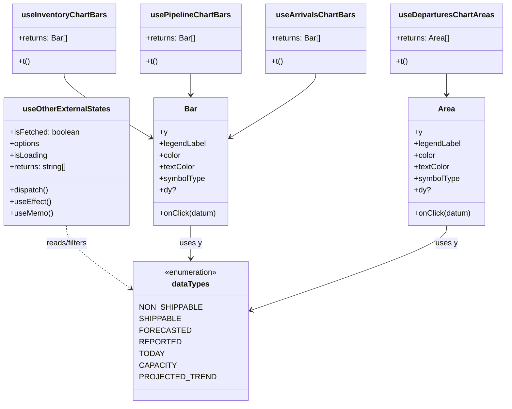

# Diagram: web/portal/src/pages/inventoryview/insights/components/InventoryCharts.Columns.js


> Auto-generated by Obscura crawlers

## Diagram 1



> SVG rendering failed for this diagram.

## Diagram 2

```mermaid
flowchart LR
    subgraph Inventory_OnClick["Inventory Chart onClick flows"]
        direction LR
        S_SHIP[Shippable (datum.isTodaysDate?)] -->|true| INV_RESET1[resetSearchAndFilters()]
        INV_RESET1 --> INV_SET_SHIP1[setSearchFilter(EXTERNAL_STATE -> Shippable)]
        INV_SET_SHIP1 --> INV_SET_TOS1[setSearchFilter(TIME_ON_SITE -> ALL)]
        INV_SET_TOS1 --> INV_REDIRECT1[redirectToDetailsView(solutionId, locationId)]
        S_OTHER[NonShippable (datum.isTodaysDate?)] -->|true| INV_RESET2[resetSearchAndFilters()]
        INV_RESET2 --> INV_SET_OTHER2[setSearchFilter(EXTERNAL_STATE -> otherExternalStates)]
        INV_SET_OTHER2 --> INV_SET_TOS2[setSearchFilter(TIME_ON_SITE -> ALL)]
        INV_SET_TOS2 --> INV_REDIRECT2[redirectToDetailsView(solutionId, locationId)]
        S_FORE[Forecasted (click)] --> F_QUERY[queryKey = FORECASTED_ARRIVAL]
        F_QUERY --> F_RANGE[setSearchFilter(queryKey, {from: datum.name, to: +1 day})]
        F_RANGE --> F_REDIRECT[redirectToDetailsView(solutionId, locationId)]
    end
    subgraph Pipeline_OnClick["Pipeline Chart onClick flows"]
        direction LR
        P_SHIP[Shippable click] --> P_RESET1[resetSearchAndFilters()]
        P_RESET1 --> P_SET_STATE1[setSearchFilter(EXTERNAL_STATE -> Shippable)]
        P_SET_STATE1 --> P_SET_TOS1[setSearchFilter(TIME_ON_SITE -> NONE)]
        P_SET_TOS1 --> P_SET_LOC1[setSearchFilter(CURRENT_LOCATION_TYPE -> datum.value)]
        P_SET_LOC1 --> P_REDIRECT1[redirectToDetailsView(solutionId, locationId)]
        P_OTHER[NonShippable click] --> P_RESET2[resetSearchAndFilters()]
        P_RESET2 --> P_SET_STATE2[setSearchFilter(EXTERNAL_STATE -> otherExternalStates)]
        P_SET_STATE2 --> P_SET_TOS2[setSearchFilter(TIME_ON_SITE -> NONE)]
        P_SET_TOS2 --> P_SET_LOC2[setSearchFilter(CURRENT_LOCATION_TYPE -> datum.value)]
        P_SET_LOC2 --> P_REDIRECT2[redirectToDetailsView(solutionId, locationId)]
    end
    subgraph Arrivals_OnClick["Arrivals Chart onClick flows"]
        direction LR
        A_REP[Reported click] --> A_RANGE[setSearchFilter(queryKey, {from: datum.name, to: +1 day})]
        A_RANGE --> A_REDIRECT[redirectToDetailsView(solutionId, locationId)]
        A_FORE[Forecasted click] --> AF_QUERY[queryKey = FORECASTED_ARRIVAL]
        AF_QUERY --> AF_RANGE[setSearchFilter(queryKey, {from: datum.name, to: +1 day})]
        AF_RANGE --> AF_REDIRECT[redirectToDetailsView(solutionId, locationId)]
    end
    subgraph Departures_OnClick["Departures Areas onClick flows"]
        direction LR
        D_REP[Actual (Reported) click] --> D_RANGE[setSearchFilter(queryKey, {from: datum.x, to: +1 day})]
        D_RANGE --> D_REDIRECT[redirectToDetailsView(solutionId, locationId)]
    end
```

> SVG rendering failed for this diagram.
