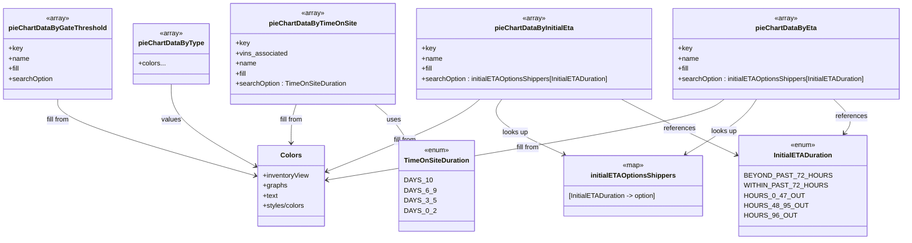

# Diagram: web/portal/src/pages/inventoryview/insights/components/InventoryDonutCharts.Config.js

> Auto-generated by Obscura crawlers

## Mermaid

### SVG

<svg id="container" width="2119.3828125" xmlns="http://www.w3.org/2000/svg" class="classDiagram" height="570" viewBox="0 0 2119.3828125 570" role="graphics-document document" aria-roledescription="class"><g><defs><marker id="container_class-aggregationStart" class="marker aggregation class" refX="18" refY="7" markerWidth="190" markerHeight="240" orient="auto"><path d="M 18,7 L9,13 L1,7 L9,1 Z"></path></marker></defs><defs><marker id="container_class-aggregationEnd" class="marker aggregation class" refX="1" refY="7" markerWidth="20" markerHeight="28" orient="auto"><path d="M 18,7 L9,13 L1,7 L9,1 Z"></path></marker></defs><defs><marker id="container_class-extensionStart" class="marker extension class" refX="18" refY="7" markerWidth="190" markerHeight="240" orient="auto"><path d="M 1,7 L18,13 V 1 Z"></path></marker></defs><defs><marker id="container_class-extensionEnd" class="marker extension class" refX="1" refY="7" markerWidth="20" markerHeight="28" orient="auto"><path d="M 1,1 V 13 L18,7 Z"></path></marker></defs><defs><marker id="container_class-compositionStart" class="marker composition class" refX="18" refY="7" markerWidth="190" markerHeight="240" orient="auto"><path d="M 18,7 L9,13 L1,7 L9,1 Z"></path></marker></defs><defs><marker id="container_class-compositionEnd" class="marker composition class" refX="1" refY="7" markerWidth="20" markerHeight="28" orient="auto"><path d="M 18,7 L9,13 L1,7 L9,1 Z"></path></marker></defs><defs><marker id="container_class-dependencyStart" class="marker dependency class" refX="6" refY="7" markerWidth="190" markerHeight="240" orient="auto"><path d="M 5,7 L9,13 L1,7 L9,1 Z"></path></marker></defs><defs><marker id="container_class-dependencyEnd" class="marker dependency class" refX="13" refY="7" markerWidth="20" markerHeight="28" orient="auto"><path d="M 18,7 L9,13 L14,7 L9,1 Z"></path></marker></defs><defs><marker id="container_class-lollipopStart" class="marker lollipop class" refX="13" refY="7" markerWidth="190" markerHeight="240" orient="auto"><circle stroke="black" fill="transparent" cx="7" cy="7" r="6"></circle></marker></defs><defs><marker id="container_class-lollipopEnd" class="marker lollipop class" refX="1" refY="7" markerWidth="190" markerHeight="240" orient="auto"><circle stroke="black" fill="transparent" cx="7" cy="7" r="6"></circle></marker></defs><g class="root"><g class="clusters"></g><g class="edgePaths"><path d="M869.208,248L876.874,254.167C884.54,260.333,899.873,272.667,912.575,286.175C925.276,299.684,935.348,314.368,940.383,321.71L945.419,329.052" id="id_pieChartDataByTimeOnSite_TimeOnSiteDuration_1" class="edge-thickness-normal edge-pattern-solid relation" style=";;;" data-edge="true" data-et="edge" data-id="id_pieChartDataByTimeOnSite_TimeOnSiteDuration_1" data-points="W3sieCI6ODY5LjIwNzc3NzY2NzE5NzQsInkiOjI0OH0seyJ4Ijo5MTUuMjA1MDc4MTI1LCJ5IjoyODV9LHsieCI6OTQ4LjgxMjcyMzkyNTE1OTMsInkiOjMzNH1d" marker-end="url(#container_class-dependencyEnd)"></path><path d="M1957.927,236L1966.678,244.167C1975.429,252.333,1992.932,268.667,1997.314,282.223C2001.695,295.78,1992.957,306.559,1988.588,311.949L1984.219,317.339" id="id_pieChartDataByEta_InitialETADuration_2" class="edge-thickness-normal edge-pattern-solid relation" style=";;;" data-edge="true" data-et="edge" data-id="id_pieChartDataByEta_InitialETADuration_2" data-points="W3sieCI6MTk1Ny45MjczMjM4NDU1NDE0LCJ5IjoyMzZ9LHsieCI6MjAxMC40MzM1OTM3NSwieSI6Mjg1fSx7IngiOjE5ODAuNDQxMDU3OTIxOTc0NiwieSI6MzIyfV0=" marker-end="url(#container_class-dependencyEnd)"></path><path d="M1779.265,236L1774.506,244.167C1769.747,252.333,1760.229,268.667,1732.885,290.483C1705.542,312.299,1660.373,339.598,1637.789,353.247L1615.204,366.897" id="id_pieChartDataByEta_initialETAOptionsShippers_3" class="edge-thickness-normal edge-pattern-solid relation" style=";;;" data-edge="true" data-et="edge" data-id="id_pieChartDataByEta_initialETAOptionsShippers_3" data-points="W3sieCI6MTc3OS4yNjQ2MDQ4OTY0OTY4LCJ5IjoyMzZ9LHsieCI6MTc1MC43MTA5Mzc1LCJ5IjoyODV9LHsieCI6MTYxMC4wNjkyNjc1MTU5MjM1LCJ5IjozNzB9XQ==" marker-end="url(#container_class-dependencyEnd)"></path><path d="M1450.095,236L1465.739,244.167C1481.382,252.333,1512.67,268.667,1561.28,292.092C1609.891,315.517,1675.824,346.033,1708.791,361.292L1741.758,376.55" id="id_pieChartDataByInitialEta_InitialETADuration_4" class="edge-thickness-normal edge-pattern-solid relation" style=";;;" data-edge="true" data-et="edge" data-id="id_pieChartDataByInitialEta_InitialETADuration_4" data-points="W3sieCI6MTQ1MC4wOTQ4MTk4NjQ2NDk3LCJ5IjoyMzZ9LHsieCI6MTU0My45NTcwMzEyNSwieSI6Mjg1fSx7IngiOjE3NDcuMjAzMTI1LCJ5IjozNzkuMDcwMTg4MTY2NDcwODd9XQ==" marker-end="url(#container_class-dependencyEnd)"></path><path d="M1170.795,236L1165.319,244.167C1159.842,252.333,1148.89,268.667,1174.352,290.594C1199.815,312.521,1261.692,340.041,1292.631,353.801L1323.57,367.562" id="id_pieChartDataByInitialEta_initialETAOptionsShippers_5" class="edge-thickness-normal edge-pattern-solid relation" style=";;;" data-edge="true" data-et="edge" data-id="id_pieChartDataByInitialEta_initialETAOptionsShippers_5" data-points="W3sieCI6MTE3MC43OTQ3NjAxNTEyNzQsInkiOjIzNn0seyJ4IjoxMTM3LjkzNzUsInkiOjI4NX0seyJ4IjoxMzI5LjA1MjE0OTY4MTUyODYsInkiOjM3MH1d" marker-end="url(#container_class-dependencyEnd)"></path><path d="M685.604,248L683.835,254.167C682.066,260.333,678.528,272.667,676.759,288C674.99,303.333,674.99,321.667,674.99,330.833L674.99,340" id="id_pieChartDataByTimeOnSite_Colors_6" class="edge-thickness-normal edge-pattern-solid relation" style=";;;" data-edge="true" data-et="edge" data-id="id_pieChartDataByTimeOnSite_Colors_6" data-points="W3sieCI6Njg1LjYwNDA3NTQzNzg5ODEsInkiOjI0OH0seyJ4Ijo2NzQuOTkwMjM0Mzc1LCJ5IjoyODV9LHsieCI6Njc0Ljk5MDIzNDM3NSwieSI6MzQ2fV0=" marker-end="url(#container_class-dependencyEnd)"></path><path d="M1696.402,236L1685.378,244.167C1674.353,252.333,1652.303,268.667,1496.164,300.683C1340.024,332.7,1049.793,380.4,904.678,404.25L759.563,428.1" id="id_pieChartDataByEta_Colors_7" class="edge-thickness-normal edge-pattern-solid relation" style=";;;" data-edge="true" data-et="edge" data-id="id_pieChartDataByEta_Colors_7" data-points="W3sieCI6MTY5Ni40MDI0NDMyNzIyOTMsInkiOjIzNn0seyJ4IjoxNjMwLjI1MzkwNjI1LCJ5IjoyODV9LHsieCI6NzUzLjY0MjU3ODEyNSwieSI6NDI5LjA3MzI4ODQyMDQ1fV0=" marker-end="url(#container_class-dependencyEnd)"></path><path d="M1116.15,236L1106.542,244.167C1096.933,252.333,1077.717,268.667,1018.224,297.255C958.732,325.843,858.964,366.686,809.079,387.107L759.195,407.528" id="id_pieChartDataByInitialEta_Colors_8" class="edge-thickness-normal edge-pattern-solid relation" style=";;;" data-edge="true" data-et="edge" data-id="id_pieChartDataByInitialEta_Colors_8" data-points="W3sieCI6MTExNi4xNDk4NTU2OTI2NzUxLCJ5IjoyMzZ9LHsieCI6MTA1OC41LCJ5IjoyODV9LHsieCI6NzUzLjY0MjU3ODEyNSwieSI6NDA5LjgwMTU1NTMzMDM0MjJ9XQ==" marker-end="url(#container_class-dependencyEnd)"></path><path d="M390.07,200L390.07,214.167C390.07,228.333,390.07,256.667,423.572,289.294C457.075,321.921,524.079,358.843,557.581,377.304L591.083,395.764" id="id_pieChartDataByType_Colors_9" class="edge-thickness-normal edge-pattern-solid relation" style=";;;" data-edge="true" data-et="edge" data-id="id_pieChartDataByType_Colors_9" data-points="W3sieCI6MzkwLjA3MDMxMjUsInkiOjIwMH0seyJ4IjozOTAuMDcwMzEyNSwieSI6Mjg1fSx7IngiOjU5Ni4zMzc4OTA2MjUsInkiOjM5OC42NjAwNDAxNzAyNzgxfV0=" marker-end="url(#container_class-dependencyEnd)"></path><path d="M130.75,236L130.75,244.167C130.75,252.333,130.75,268.667,207.387,298.941C284.024,329.216,437.299,373.432,513.936,395.54L590.573,417.648" id="id_pieChartDataByGateThreshold_Colors_10" class="edge-thickness-normal edge-pattern-solid relation" style=";;;" data-edge="true" data-et="edge" data-id="id_pieChartDataByGateThreshold_Colors_10" data-points="W3sieCI6MTMwLjc1LCJ5IjoyMzZ9LHsieCI6MTMwLjc1LCJ5IjoyODV9LHsieCI6NTk2LjMzNzg5MDYyNSwieSI6NDE5LjMxMDcyMjAxNDI3NTk0fV0=" marker-end="url(#container_class-dependencyEnd)"></path></g><g class="edgeLabels"><g class="edgeLabel" transform="translate(915.31424, 285.15916)"><g class="label" data-id="id_pieChartDataByTimeOnSite_TimeOnSiteDuration_1" transform="translate(-16.4921875, -12)"><foreignObject width="32.984375" height="24">

uses

</foreignObject></g></g><g class="edgeLabel" transform="translate(2001.59126, 276.74814)"><g class="label" data-id="id_pieChartDataByEta_InitialETADuration_2" transform="translate(-37.828125, -12)"><foreignObject width="75.65625" height="24">

references

</foreignObject></g></g><g class="edgeLabel" transform="translate(1704.65846, 312.83287)"><g class="label" data-id="id_pieChartDataByEta_initialETAOptionsShippers_3" transform="translate(-30.96875, -12)"><foreignObject width="61.9375" height="24">

looks up

</foreignObject></g></g><g class="edgeLabel" transform="translate(1597.53535, 309.79813)"><g class="label" data-id="id_pieChartDataByInitialEta_InitialETADuration_4" transform="translate(-37.828125, -12)"><foreignObject width="75.65625" height="24">

references

</foreignObject></g></g><g class="edgeLabel" transform="translate(1206.54208, 315.51252)"><g class="label" data-id="id_pieChartDataByInitialEta_initialETAOptionsShippers_5" transform="translate(-30.96875, -12)"><foreignObject width="61.9375" height="24">

looks up

</foreignObject></g></g><g class="edgeLabel" transform="translate(674.990234375, 285)"><g class="label" data-id="id_pieChartDataByTimeOnSite_Colors_6" transform="translate(-28.46875, -12)"><foreignObject width="56.9375" height="24">

fill from

</foreignObject></g></g><g class="edgeLabel" transform="translate(1232.56349, 350.36142)"><g class="label" data-id="id_pieChartDataByEta_Colors_7" transform="translate(-28.46875, -12)"><foreignObject width="56.9375" height="24">

fill from

</foreignObject></g></g><g class="edgeLabel" transform="translate(941.08144, 333.06844)"><g class="label" data-id="id_pieChartDataByInitialEta_Colors_8" transform="translate(-28.46875, -12)"><foreignObject width="56.9375" height="24">

fill from

</foreignObject></g></g><g class="edgeLabel" transform="translate(390.0703125, 285)"><g class="label" data-id="id_pieChartDataByType_Colors_9" transform="translate(-23.1796875, -12)"><foreignObject width="46.359375" height="24">

values

</foreignObject></g></g><g class="edgeLabel" transform="translate(130.75, 285)"><g class="label" data-id="id_pieChartDataByGateThreshold_Colors_10" transform="translate(-28.46875, -12)"><foreignObject width="56.9375" height="24">

fill from

</foreignObject></g></g></g><g class="nodes"><g class="node default" id="classId-TimeOnSiteDuration-0" transform="translate(1022.88671875, 442)"><g class="basic label-container"><path d="M-85.8203125 -108 L85.8203125 -108 L85.8203125 108 L-85.8203125 108" stroke="none" stroke-width="0" fill="#ECECFF" style=""></path><path d="M-85.8203125 -108 C-26.622446835574642 -108, 32.575418828850715 -108, 85.8203125 -108 M-85.8203125 -108 C-32.85740166057174 -108, 20.105509178856522 -108, 85.8203125 -108 M85.8203125 -108 C85.8203125 -34.63177089981083, 85.8203125 38.73645820037834, 85.8203125 108 M85.8203125 -108 C85.8203125 -38.91659878635444, 85.8203125 30.166802427291117, 85.8203125 108 M85.8203125 108 C41.84673574926399 108, -2.126841001472016 108, -85.8203125 108 M85.8203125 108 C49.58019669216645 108, 13.340080884332906 108, -85.8203125 108 M-85.8203125 108 C-85.8203125 40.666882166606314, -85.8203125 -26.666235666787372, -85.8203125 -108 M-85.8203125 108 C-85.8203125 48.82064114813488, -85.8203125 -10.358717703730235, -85.8203125 -108" stroke="#9370DB" stroke-width="1.3" fill="none" stroke-dasharray="0 0" style=""></path></g><g class="annotation-group text" transform="translate(-29.53125, -84)"><g class="label" style="" transform="translate(0,-12)"><foreignObject width="59.0625" height="24">

«enum»

</foreignObject></g></g><g class="label-group text" transform="translate(-73.8203125, -60)"><g class="label" style="font-weight: bolder" transform="translate(0,-12)"><foreignObject width="147.640625" height="24">

TimeOnSiteDuration

</foreignObject></g></g><g class="members-group text" transform="translate(-73.8203125, -12)"><g class="label" style="" transform="translate(0,-12)"><foreignObject width="57.828125" height="24">

DAYS_10

</foreignObject></g><g class="label" style="" transform="translate(0,12)"><foreignObject width="68.03125" height="24">

DAYS_6_9

</foreignObject></g><g class="label" style="" transform="translate(0,36)"><foreignObject width="67.578125" height="24">

DAYS_3_5

</foreignObject></g><g class="label" style="" transform="translate(0,60)"><foreignObject width="67.78125" height="24">

DAYS_0_2

</foreignObject></g></g><g class="methods-group text" transform="translate(-73.8203125, 108)"></g><g class="divider" style=""><path d="M-85.8203125 -36 C-49.93879025503268 -36, -14.057268010065357 -36, 85.8203125 -36 M-85.8203125 -36 C-40.867194478082276 -36, 4.085923543835449 -36, 85.8203125 -36" stroke="#9370DB" stroke-width="1.3" fill="none" stroke-dasharray="0 0" style=""></path></g><g class="divider" style=""><path d="M-85.8203125 84 C-37.09147588632448 84, 11.637360727351037 84, 85.8203125 84 M-85.8203125 84 C-26.113419641266788 84, 33.593473217466425 84, 85.8203125 84" stroke="#9370DB" stroke-width="1.3" fill="none" stroke-dasharray="0 0" style=""></path></g></g><g class="node default" id="classId-InitialETADuration-1" transform="translate(1883.16796875, 442)"><g class="basic label-container"><path d="M-135.96484375 -120 L135.96484375 -120 L135.96484375 120 L-135.96484375 120" stroke="none" stroke-width="0" fill="#ECECFF" style=""></path><path d="M-135.96484375 -120 C-66.9865366160863 -120, 1.9917705178274048 -120, 135.96484375 -120 M-135.96484375 -120 C-50.922151987483005 -120, 34.12053977503399 -120, 135.96484375 -120 M135.96484375 -120 C135.96484375 -55.316147340190696, 135.96484375 9.367705319618608, 135.96484375 120 M135.96484375 -120 C135.96484375 -51.75452027433174, 135.96484375 16.490959451336522, 135.96484375 120 M135.96484375 120 C62.83624556155233 120, -10.292352626895337 120, -135.96484375 120 M135.96484375 120 C65.71013655030403 120, -4.544570649391943 120, -135.96484375 120 M-135.96484375 120 C-135.96484375 61.11966671710889, -135.96484375 2.2393334342177837, -135.96484375 -120 M-135.96484375 120 C-135.96484375 25.676663027484537, -135.96484375 -68.64667394503093, -135.96484375 -120" stroke="#9370DB" stroke-width="1.3" fill="none" stroke-dasharray="0 0" style=""></path></g><g class="annotation-group text" transform="translate(-29.53125, -96)"><g class="label" style="" transform="translate(0,-12)"><foreignObject width="59.0625" height="24">

«enum»

</foreignObject></g></g><g class="label-group text" transform="translate(-65.8203125, -72)"><g class="label" style="font-weight: bolder" transform="translate(0,-12)"><foreignObject width="131.640625" height="24">

InitialETADuration

</foreignObject></g></g><g class="members-group text" transform="translate(-123.96484375, -24)"><g class="label" style="" transform="translate(0,-12)"><foreignObject width="182.109375" height="24">

BEYOND_PAST_72_HOURS

</foreignObject></g><g class="label" style="" transform="translate(0,12)"><foreignObject width="176.671875" height="24">

WITHIN_PAST_72_HOURS

</foreignObject></g><g class="label" style="" transform="translate(0,36)"><foreignObject width="124.296875" height="24">

HOURS_0_47_OUT

</foreignObject></g><g class="label" style="" transform="translate(0,60)"><foreignObject width="135.796875" height="24">

HOURS_48_95_OUT

</foreignObject></g><g class="label" style="" transform="translate(0,84)"><foreignObject width="112.90625" height="24">

HOURS_96_OUT

</foreignObject></g></g><g class="methods-group text" transform="translate(-123.96484375, 120)"></g><g class="divider" style=""><path d="M-135.96484375 -48 C-27.264821653501016 -48, 81.43520044299797 -48, 135.96484375 -48 M-135.96484375 -48 C-28.6592853425108 -48, 78.6462730649784 -48, 135.96484375 -48" stroke="#9370DB" stroke-width="1.3" fill="none" stroke-dasharray="0 0" style=""></path></g><g class="divider" style=""><path d="M-135.96484375 96 C-35.65193711859462 96, 64.66096951281077 96, 135.96484375 96 M-135.96484375 96 C-76.51035242390172 96, -17.055861097803444 96, 135.96484375 96" stroke="#9370DB" stroke-width="1.3" fill="none" stroke-dasharray="0 0" style=""></path></g></g><g class="node default" id="classId-initialETAOptionsShippers-2" transform="translate(1490.9375, 442)"><g class="basic label-container"><path d="M-165.24609375 -72 L165.24609375 -72 L165.24609375 72 L-165.24609375 72" stroke="none" stroke-width="0" fill="#ECECFF" style=""></path><path d="M-165.24609375 -72 C-74.62185557121182 -72, 16.00238260757635 -72, 165.24609375 -72 M-165.24609375 -72 C-72.97111239712324 -72, 19.30386895575353 -72, 165.24609375 -72 M165.24609375 -72 C165.24609375 -33.40146793695019, 165.24609375 5.197064126099619, 165.24609375 72 M165.24609375 -72 C165.24609375 -21.854718744754706, 165.24609375 28.290562510490588, 165.24609375 72 M165.24609375 72 C41.97523869377743 72, -81.29561636244514 72, -165.24609375 72 M165.24609375 72 C70.08373151259065 72, -25.07863072481871 72, -165.24609375 72 M-165.24609375 72 C-165.24609375 26.8240226047907, -165.24609375 -18.351954790418603, -165.24609375 -72 M-165.24609375 72 C-165.24609375 26.860576802160146, -165.24609375 -18.278846395679707, -165.24609375 -72" stroke="#9370DB" stroke-width="1.3" fill="none" stroke-dasharray="0 0" style=""></path></g><g class="annotation-group text" transform="translate(-24.9296875, -48)"><g class="label" style="" transform="translate(0,-12)"><foreignObject width="49.859375" height="24">

«map»

</foreignObject></g></g><g class="label-group text" transform="translate(-95.1171875, -24)"><g class="label" style="font-weight: bolder" transform="translate(0,-12)"><foreignObject width="190.234375" height="24">

initialETAOptionsShippers

</foreignObject></g></g><g class="members-group text" transform="translate(-153.24609375, 24)"><g class="label" style="" transform="translate(0,-12)"><foreignObject width="211.375" height="24">

[InitialETADuration -&gt; option]

</foreignObject></g></g><g class="methods-group text" transform="translate(-153.24609375, 72)"></g><g class="divider" style=""><path d="M-165.24609375 0 C-54.931779342236396 0, 55.38253506552721 0, 165.24609375 0 M-165.24609375 0 C-43.97775873595414 0, 77.29057627809172 0, 165.24609375 0" stroke="#9370DB" stroke-width="1.3" fill="none" stroke-dasharray="0 0" style=""></path></g><g class="divider" style=""><path d="M-165.24609375 48 C-65.7926889386664 48, 33.6607158726672 48, 165.24609375 48 M-165.24609375 48 C-73.61454701361068 48, 18.01699972277865 48, 165.24609375 48" stroke="#9370DB" stroke-width="1.3" fill="none" stroke-dasharray="0 0" style=""></path></g></g><g class="node default" id="classId-Colors-3" transform="translate(674.990234375, 442)"><g class="basic label-container"><path d="M-78.65234375 -96 L78.65234375 -96 L78.65234375 96 L-78.65234375 96" stroke="none" stroke-width="0" fill="#ECECFF" style=""></path><path d="M-78.65234375 -96 C-25.62848218493599 -96, 27.39537938012802 -96, 78.65234375 -96 M-78.65234375 -96 C-35.573316239296034 -96, 7.505711271407932 -96, 78.65234375 -96 M78.65234375 -96 C78.65234375 -40.0784777322565, 78.65234375 15.843044535486996, 78.65234375 96 M78.65234375 -96 C78.65234375 -29.514782919407736, 78.65234375 36.97043416118453, 78.65234375 96 M78.65234375 96 C39.05876168794781 96, -0.5348203741043847 96, -78.65234375 96 M78.65234375 96 C29.643529655390537 96, -19.365284439218925 96, -78.65234375 96 M-78.65234375 96 C-78.65234375 51.217892885793574, -78.65234375 6.435785771587149, -78.65234375 -96 M-78.65234375 96 C-78.65234375 32.31309348454238, -78.65234375 -31.373813030915244, -78.65234375 -96" stroke="#9370DB" stroke-width="1.3" fill="none" stroke-dasharray="0 0" style=""></path></g><g class="annotation-group text" transform="translate(0, -72)"></g><g class="label-group text" transform="translate(-23.1015625, -72)"><g class="label" style="font-weight: bolder" transform="translate(0,-12)"><foreignObject width="46.203125" height="24">

Colors

</foreignObject></g></g><g class="members-group text" transform="translate(-66.65234375, -24)"><g class="label" style="" transform="translate(0,-12)"><foreignObject width="110.203125" height="24">

+inventoryView

</foreignObject></g><g class="label" style="" transform="translate(0,12)"><foreignObject width="56.984375" height="24">

+graphs

</foreignObject></g><g class="label" style="" transform="translate(0,36)"><foreignObject width="35.5625" height="24">

+text

</foreignObject></g><g class="label" style="" transform="translate(0,60)"><foreignObject width="101.390625" height="24">

+styles/colors

</foreignObject></g></g><g class="methods-group text" transform="translate(-66.65234375, 96)"></g><g class="divider" style=""><path d="M-78.65234375 -48 C-40.556574528707316 -48, -2.460805307414631 -48, 78.65234375 -48 M-78.65234375 -48 C-46.46176016046448 -48, -14.271176570928958 -48, 78.65234375 -48" stroke="#9370DB" stroke-width="1.3" fill="none" stroke-dasharray="0 0" style=""></path></g><g class="divider" style=""><path d="M-78.65234375 72 C-15.959889910244904 72, 46.73256392951019 72, 78.65234375 72 M-78.65234375 72 C-42.30024067741052 72, -5.948137604821042 72, 78.65234375 72" stroke="#9370DB" stroke-width="1.3" fill="none" stroke-dasharray="0 0" style=""></path></g></g><g class="node default" id="classId-pieChartDataByTimeOnSite-4" transform="translate(720.02734375, 128)"><g class="basic label-container"><path d="M-193.38671875 -120 L193.38671875 -120 L193.38671875 120 L-193.38671875 120" stroke="none" stroke-width="0" fill="#ECECFF" style=""></path><path d="M-193.38671875 -120 C-51.001534742872565 -120, 91.38364926425487 -120, 193.38671875 -120 M-193.38671875 -120 C-83.57092016410404 -120, 26.244878421791924 -120, 193.38671875 -120 M193.38671875 -120 C193.38671875 -60.43708535648678, 193.38671875 -0.8741707129735659, 193.38671875 120 M193.38671875 -120 C193.38671875 -54.44168851882917, 193.38671875 11.116622962341665, 193.38671875 120 M193.38671875 120 C75.839923395633 120, -41.70687195873401 120, -193.38671875 120 M193.38671875 120 C47.29701689283638 120, -98.79268496432724 120, -193.38671875 120 M-193.38671875 120 C-193.38671875 32.505884265951835, -193.38671875 -54.98823146809633, -193.38671875 -120 M-193.38671875 120 C-193.38671875 44.99125660821866, -193.38671875 -30.017486783562674, -193.38671875 -120" stroke="#9370DB" stroke-width="1.3" fill="none" stroke-dasharray="0 0" style=""></path></g><g class="annotation-group text" transform="translate(-27.4296875, -96)"><g class="label" style="" transform="translate(0,-12)"><foreignObject width="54.859375" height="24">

«array»

</foreignObject></g></g><g class="label-group text" transform="translate(-99.3203125, -72)"><g class="label" style="font-weight: bolder" transform="translate(0,-12)"><foreignObject width="198.640625" height="24">

pieChartDataByTimeOnSite

</foreignObject></g></g><g class="members-group text" transform="translate(-181.38671875, -24)"><g class="label" style="" transform="translate(0,-12)"><foreignObject width="32.5625" height="24">

+key

</foreignObject></g><g class="label" style="" transform="translate(0,12)"><foreignObject width="122.109375" height="24">

+vins_associated

</foreignObject></g><g class="label" style="" transform="translate(0,36)"><foreignObject width="48.5" height="24">

+name

</foreignObject></g><g class="label" style="" transform="translate(0,60)"><foreignObject width="26.328125" height="24">

+fill

</foreignObject></g><g class="label" style="" transform="translate(0,84)"><foreignObject width="263.453125" height="24">

+searchOption : TimeOnSiteDuration

</foreignObject></g></g><g class="methods-group text" transform="translate(-181.38671875, 120)"></g><g class="divider" style=""><path d="M-193.38671875 -48 C-101.7364405611695 -48, -10.086162372339004 -48, 193.38671875 -48 M-193.38671875 -48 C-115.62272613113097 -48, -37.85873351226195 -48, 193.38671875 -48" stroke="#9370DB" stroke-width="1.3" fill="none" stroke-dasharray="0 0" style=""></path></g><g class="divider" style=""><path d="M-193.38671875 96 C-76.90840847933438 96, 39.56990179133123 96, 193.38671875 96 M-193.38671875 96 C-95.00119885941547 96, 3.3843210311690655 96, 193.38671875 96" stroke="#9370DB" stroke-width="1.3" fill="none" stroke-dasharray="0 0" style=""></path></g></g><g class="node default" id="classId-pieChartDataByEta-5" transform="translate(1842.19921875, 128)"><g class="basic label-container"><path d="M-269.18359375 -108 L269.18359375 -108 L269.18359375 108 L-269.18359375 108" stroke="none" stroke-width="0" fill="#ECECFF" style=""></path><path d="M-269.18359375 -108 C-66.30348805562411 -108, 136.57661763875177 -108, 269.18359375 -108 M-269.18359375 -108 C-106.99910281787655 -108, 55.185388114246905 -108, 269.18359375 -108 M269.18359375 -108 C269.18359375 -31.831342857763218, 269.18359375 44.337314284473564, 269.18359375 108 M269.18359375 -108 C269.18359375 -60.482026314728465, 269.18359375 -12.96405262945693, 269.18359375 108 M269.18359375 108 C94.88927221518958 108, -79.40504931962084 108, -269.18359375 108 M269.18359375 108 C54.93824558724157 108, -159.30710257551686 108, -269.18359375 108 M-269.18359375 108 C-269.18359375 28.10908186962486, -269.18359375 -51.78183626075028, -269.18359375 -108 M-269.18359375 108 C-269.18359375 43.76271129747492, -269.18359375 -20.474577405050155, -269.18359375 -108" stroke="#9370DB" stroke-width="1.3" fill="none" stroke-dasharray="0 0" style=""></path></g><g class="annotation-group text" transform="translate(-27.4296875, -84)"><g class="label" style="" transform="translate(0,-12)"><foreignObject width="54.859375" height="24">

«array»

</foreignObject></g></g><g class="label-group text" transform="translate(-68.6796875, -60)"><g class="label" style="font-weight: bolder" transform="translate(0,-12)"><foreignObject width="137.359375" height="24">

pieChartDataByEta

</foreignObject></g></g><g class="members-group text" transform="translate(-257.18359375, -12)"><g class="label" style="" transform="translate(0,-12)"><foreignObject width="32.5625" height="24">

+key

</foreignObject></g><g class="label" style="" transform="translate(0,12)"><foreignObject width="48.5" height="24">

+name

</foreignObject></g><g class="label" style="" transform="translate(0,36)"><foreignObject width="26.328125" height="24">

+fill

</foreignObject></g><g class="label" style="" transform="translate(0,60)"><foreignObject width="445.6875" height="24">

+searchOption : initialETAOptionsShippers[InitialETADuration]

</foreignObject></g></g><g class="methods-group text" transform="translate(-257.18359375, 108)"></g><g class="divider" style=""><path d="M-269.18359375 -36 C-107.4080475525401 -36, 54.367498644919806 -36, 269.18359375 -36 M-269.18359375 -36 C-70.90276240755753 -36, 127.37806893488494 -36, 269.18359375 -36" stroke="#9370DB" stroke-width="1.3" fill="none" stroke-dasharray="0 0" style=""></path></g><g class="divider" style=""><path d="M-269.18359375 84 C-138.64248011222887 84, -8.101366474457734 84, 269.18359375 84 M-269.18359375 84 C-142.12905463491575 84, -15.074515519831493 84, 269.18359375 84" stroke="#9370DB" stroke-width="1.3" fill="none" stroke-dasharray="0 0" style=""></path></g></g><g class="node default" id="classId-pieChartDataByInitialEta-6" transform="translate(1243.21484375, 128)"><g class="basic label-container"><path d="M-279.80078125 -108 L279.80078125 -108 L279.80078125 108 L-279.80078125 108" stroke="none" stroke-width="0" fill="#ECECFF" style=""></path><path d="M-279.80078125 -108 C-159.57687832128477 -108, -39.35297539256953 -108, 279.80078125 -108 M-279.80078125 -108 C-113.14612553664179 -108, 53.50853017671642 -108, 279.80078125 -108 M279.80078125 -108 C279.80078125 -43.76704438206687, 279.80078125 20.46591123586626, 279.80078125 108 M279.80078125 -108 C279.80078125 -33.85203875881193, 279.80078125 40.29592248237614, 279.80078125 108 M279.80078125 108 C77.17116353452775 108, -125.4584541809445 108, -279.80078125 108 M279.80078125 108 C69.68194215525332 108, -140.43689693949335 108, -279.80078125 108 M-279.80078125 108 C-279.80078125 38.690607388253554, -279.80078125 -30.618785223492893, -279.80078125 -108 M-279.80078125 108 C-279.80078125 58.23034539272315, -279.80078125 8.460690785446303, -279.80078125 -108" stroke="#9370DB" stroke-width="1.3" fill="none" stroke-dasharray="0 0" style=""></path></g><g class="annotation-group text" transform="translate(-27.4296875, -84)"><g class="label" style="" transform="translate(0,-12)"><foreignObject width="54.859375" height="24">

«array»

</foreignObject></g></g><g class="label-group text" transform="translate(-89.9140625, -60)"><g class="label" style="font-weight: bolder" transform="translate(0,-12)"><foreignObject width="179.828125" height="24">

pieChartDataByInitialEta

</foreignObject></g></g><g class="members-group text" transform="translate(-267.80078125, -12)"><g class="label" style="" transform="translate(0,-12)"><foreignObject width="32.5625" height="24">

+key

</foreignObject></g><g class="label" style="" transform="translate(0,12)"><foreignObject width="48.5" height="24">

+name

</foreignObject></g><g class="label" style="" transform="translate(0,36)"><foreignObject width="26.328125" height="24">

+fill

</foreignObject></g><g class="label" style="" transform="translate(0,60)"><foreignObject width="445.6875" height="24">

+searchOption : initialETAOptionsShippers[InitialETADuration]

</foreignObject></g></g><g class="methods-group text" transform="translate(-267.80078125, 108)"></g><g class="divider" style=""><path d="M-279.80078125 -36 C-125.41875899594618 -36, 28.963263258107645 -36, 279.80078125 -36 M-279.80078125 -36 C-58.645663814612874 -36, 162.50945362077425 -36, 279.80078125 -36" stroke="#9370DB" stroke-width="1.3" fill="none" stroke-dasharray="0 0" style=""></path></g><g class="divider" style=""><path d="M-279.80078125 84 C-105.59216024965 84, 68.61646075070001 84, 279.80078125 84 M-279.80078125 84 C-123.66294925712856 84, 32.47488273574288 84, 279.80078125 84" stroke="#9370DB" stroke-width="1.3" fill="none" stroke-dasharray="0 0" style=""></path></g></g><g class="node default" id="classId-pieChartDataByType-7" transform="translate(390.0703125, 128)"><g class="basic label-container"><path d="M-86.5703125 -72 L86.5703125 -72 L86.5703125 72 L-86.5703125 72" stroke="none" stroke-width="0" fill="#ECECFF" style=""></path><path d="M-86.5703125 -72 C-30.140242963032996 -72, 26.289826573934008 -72, 86.5703125 -72 M-86.5703125 -72 C-47.88862662580023 -72, -9.206940751600456 -72, 86.5703125 -72 M86.5703125 -72 C86.5703125 -16.707479216234475, 86.5703125 38.58504156753105, 86.5703125 72 M86.5703125 -72 C86.5703125 -31.091299854876254, 86.5703125 9.817400290247491, 86.5703125 72 M86.5703125 72 C50.49861957216695 72, 14.426926644333903 72, -86.5703125 72 M86.5703125 72 C26.59467116691045 72, -33.3809701661791 72, -86.5703125 72 M-86.5703125 72 C-86.5703125 16.531508880314014, -86.5703125 -38.93698223937197, -86.5703125 -72 M-86.5703125 72 C-86.5703125 24.827070168462136, -86.5703125 -22.34585966307573, -86.5703125 -72" stroke="#9370DB" stroke-width="1.3" fill="none" stroke-dasharray="0 0" style=""></path></g><g class="annotation-group text" transform="translate(-27.4296875, -48)"><g class="label" style="" transform="translate(0,-12)"><foreignObject width="54.859375" height="24">

«array»

</foreignObject></g></g><g class="label-group text" transform="translate(-74.5703125, -24)"><g class="label" style="font-weight: bolder" transform="translate(0,-12)"><foreignObject width="149.140625" height="24">

pieChartDataByType

</foreignObject></g></g><g class="members-group text" transform="translate(-74.5703125, 24)"><g class="label" style="" transform="translate(0,-12)"><foreignObject width="63.546875" height="24">

+colors...

</foreignObject></g></g><g class="methods-group text" transform="translate(-74.5703125, 72)"></g><g class="divider" style=""><path d="M-86.5703125 0 C-49.202760201213124 0, -11.835207902426248 0, 86.5703125 0 M-86.5703125 0 C-50.66789903913923 0, -14.765485578278458 0, 86.5703125 0" stroke="#9370DB" stroke-width="1.3" fill="none" stroke-dasharray="0 0" style=""></path></g><g class="divider" style=""><path d="M-86.5703125 48 C-36.5146893084665 48, 13.540933883066998 48, 86.5703125 48 M-86.5703125 48 C-34.52356466953045 48, 17.523183160939098 48, 86.5703125 48" stroke="#9370DB" stroke-width="1.3" fill="none" stroke-dasharray="0 0" style=""></path></g></g><g class="node default" id="classId-pieChartDataByGateThreshold-8" transform="translate(130.75, 128)"><g class="basic label-container"><path d="M-122.75 -108 L122.75 -108 L122.75 108 L-122.75 108" stroke="none" stroke-width="0" fill="#ECECFF" style=""></path><path d="M-122.75 -108 C-68.6063830148063 -108, -14.462766029612595 -108, 122.75 -108 M-122.75 -108 C-70.9914705390307 -108, -19.232941078061415 -108, 122.75 -108 M122.75 -108 C122.75 -49.25691615412778, 122.75 9.486167691744441, 122.75 108 M122.75 -108 C122.75 -21.670539258469944, 122.75 64.65892148306011, 122.75 108 M122.75 108 C50.954745072567846 108, -20.840509854864308 108, -122.75 108 M122.75 108 C51.28891242336957 108, -20.172175153260866 108, -122.75 108 M-122.75 108 C-122.75 59.11499164103838, -122.75 10.229983282076759, -122.75 -108 M-122.75 108 C-122.75 38.74402903200452, -122.75 -30.51194193599096, -122.75 -108" stroke="#9370DB" stroke-width="1.3" fill="none" stroke-dasharray="0 0" style=""></path></g><g class="annotation-group text" transform="translate(-27.4296875, -84)"><g class="label" style="" transform="translate(0,-12)"><foreignObject width="54.859375" height="24">

«array»

</foreignObject></g></g><g class="label-group text" transform="translate(-110.75, -60)"><g class="label" style="font-weight: bolder" transform="translate(0,-12)"><foreignObject width="221.5" height="24">

pieChartDataByGateThreshold

</foreignObject></g></g><g class="members-group text" transform="translate(-110.75, -12)"><g class="label" style="" transform="translate(0,-12)"><foreignObject width="32.5625" height="24">

+key

</foreignObject></g><g class="label" style="" transform="translate(0,12)"><foreignObject width="48.5" height="24">

+name

</foreignObject></g><g class="label" style="" transform="translate(0,36)"><foreignObject width="26.328125" height="24">

+fill

</foreignObject></g><g class="label" style="" transform="translate(0,60)"><foreignObject width="105.03125" height="24">

+searchOption

</foreignObject></g></g><g class="methods-group text" transform="translate(-110.75, 108)"></g><g class="divider" style=""><path d="M-122.75 -36 C-50.220589753865056 -36, 22.308820492269888 -36, 122.75 -36 M-122.75 -36 C-26.985590824120393 -36, 68.77881835175921 -36, 122.75 -36" stroke="#9370DB" stroke-width="1.3" fill="none" stroke-dasharray="0 0" style=""></path></g><g class="divider" style=""><path d="M-122.75 84 C-53.01406705425974 84, 16.72186589148052 84, 122.75 84 M-122.75 84 C-24.998760290908038 84, 72.75247941818392 84, 122.75 84" stroke="#9370DB" stroke-width="1.3" fill="none" stroke-dasharray="0 0" style=""></path></g></g></g></g></g></svg>
