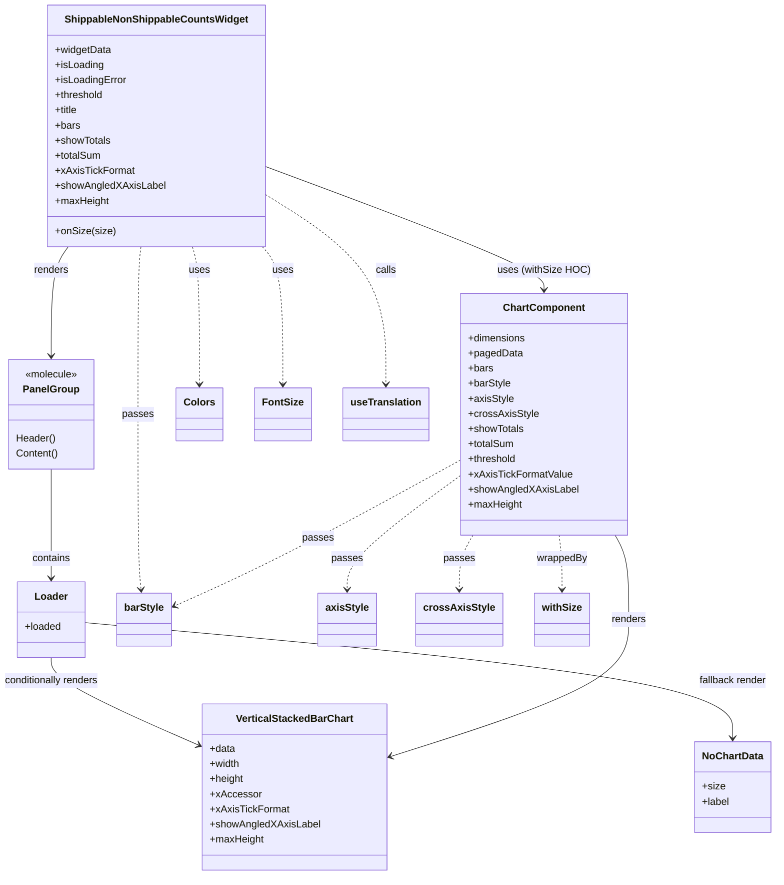

# Diagram: web/portal/src/pages/inventoryview/insights/components/ShippableNonShippableCountsWidget.js

> Auto-generated by Obscura crawlers

## Mermaid

### SVG

<svg id="container" width="1209.580078125" xmlns="http://www.w3.org/2000/svg" class="classDiagram" height="1390" viewBox="0 0 1209.580078125 1390" role="graphics-document document" aria-roledescription="class"><g><defs><marker id="container_class-aggregationStart" class="marker aggregation class" refX="18" refY="7" markerWidth="190" markerHeight="240" orient="auto"><path d="M 18,7 L9,13 L1,7 L9,1 Z"></path></marker></defs><defs><marker id="container_class-aggregationEnd" class="marker aggregation class" refX="1" refY="7" markerWidth="20" markerHeight="28" orient="auto"><path d="M 18,7 L9,13 L1,7 L9,1 Z"></path></marker></defs><defs><marker id="container_class-extensionStart" class="marker extension class" refX="18" refY="7" markerWidth="190" markerHeight="240" orient="auto"><path d="M 1,7 L18,13 V 1 Z"></path></marker></defs><defs><marker id="container_class-extensionEnd" class="marker extension class" refX="1" refY="7" markerWidth="20" markerHeight="28" orient="auto"><path d="M 1,1 V 13 L18,7 Z"></path></marker></defs><defs><marker id="container_class-compositionStart" class="marker composition class" refX="18" refY="7" markerWidth="190" markerHeight="240" orient="auto"><path d="M 18,7 L9,13 L1,7 L9,1 Z"></path></marker></defs><defs><marker id="container_class-compositionEnd" class="marker composition class" refX="1" refY="7" markerWidth="20" markerHeight="28" orient="auto"><path d="M 18,7 L9,13 L1,7 L9,1 Z"></path></marker></defs><defs><marker id="container_class-dependencyStart" class="marker dependency class" refX="6" refY="7" markerWidth="190" markerHeight="240" orient="auto"><path d="M 5,7 L9,13 L1,7 L9,1 Z"></path></marker></defs><defs><marker id="container_class-dependencyEnd" class="marker dependency class" refX="13" refY="7" markerWidth="20" markerHeight="28" orient="auto"><path d="M 18,7 L9,13 L14,7 L9,1 Z"></path></marker></defs><defs><marker id="container_class-lollipopStart" class="marker lollipop class" refX="13" refY="7" markerWidth="190" markerHeight="240" orient="auto"><circle stroke="black" fill="transparent" cx="7" cy="7" r="6"></circle></marker></defs><defs><marker id="container_class-lollipopEnd" class="marker lollipop class" refX="1" refY="7" markerWidth="190" markerHeight="240" orient="auto"><circle stroke="black" fill="transparent" cx="7" cy="7" r="6"></circle></marker></defs><g class="root"><g class="clusters"></g><g class="edgePaths"><path d="M111.657,392L107.256,398.167C102.854,404.333,94.052,416.667,89.651,445.5C85.25,474.333,85.25,519.667,85.25,542.333L85.25,565" id="id_ShippableNonShippableCountsWidget_PanelGroup_1" class="edge-thickness-normal edge-pattern-solid relation" style=";;;" data-edge="true" data-et="edge" data-id="id_ShippableNonShippableCountsWidget_PanelGroup_1" data-points="W3sieCI6MTExLjY1NjYxNjc0Mzk5NTY0LCJ5IjozOTJ9LHsieCI6ODUuMjUsInkiOjQyOX0seyJ4Ijo4NS4yNSwieSI6NTcxfV0=" marker-end="url(#container_class-dependencyEnd)"></path><path d="M85.25,745L85.25,768.667C85.25,792.333,85.25,839.667,85.25,868.5C85.25,897.333,85.25,907.667,85.25,912.833L85.25,918" id="id_PanelGroup_Loader_2" class="edge-thickness-normal edge-pattern-solid relation" style=";;;" data-edge="true" data-et="edge" data-id="id_PanelGroup_Loader_2" data-points="W3sieCI6ODUuMjUsInkiOjc0NX0seyJ4Ijo4NS4yNSwieSI6ODg3fSx7IngiOjg1LjI1LCJ5Ijo5MjR9XQ==" marker-end="url(#container_class-dependencyEnd)"></path><path d="M85.25,1044L85.25,1050.167C85.25,1056.333,85.25,1068.667,123.254,1091.897C161.257,1115.126,237.265,1149.253,275.269,1166.316L313.272,1183.379" id="id_Loader_VerticalStackedBarChart_3" class="edge-thickness-normal edge-pattern-solid relation" style=";;;" data-edge="true" data-et="edge" data-id="id_Loader_VerticalStackedBarChart_3" data-points="W3sieCI6ODUuMjUsInkiOjEwNDR9LHsieCI6ODUuMjUsInkiOjEwODF9LHsieCI6MzE4Ljc0NjA5Mzc1LCJ5IjoxMTg1LjgzNjg2MDA3NTM0MzN9XQ==" marker-end="url(#container_class-dependencyEnd)"></path><path d="M139.074,988.936L306.377,1004.28C473.68,1019.624,808.286,1050.312,975.59,1080.823C1142.893,1111.333,1142.893,1141.667,1142.893,1156.833L1142.893,1172" id="id_Loader_NoChartData_4" class="edge-thickness-normal edge-pattern-solid relation" style=";;;" data-edge="true" data-et="edge" data-id="id_Loader_NoChartData_4" data-points="W3sieCI6MTM5LjA3NDIxODc1LCJ5Ijo5ODguOTM2NDAyMjY1NTA0M30seyJ4IjoxMTQyLjg5MjU3ODEyNSwieSI6MTA4MX0seyJ4IjoxMTQyLjg5MjU3ODEyNSwieSI6MTE3OH1d" marker-end="url(#container_class-dependencyEnd)"></path><path d="M416.424,264.063L488.401,291.552C560.378,319.042,704.333,374.021,776.31,406.677C848.287,439.333,848.287,449.667,848.287,454.833L848.287,460" id="id_ShippableNonShippableCountsWidget_ChartComponent_5" class="edge-thickness-normal edge-pattern-solid relation" style=";;;" data-edge="true" data-et="edge" data-id="id_ShippableNonShippableCountsWidget_ChartComponent_5" data-points="W3sieCI6NDE2LjQyMzgyODEyNSwieSI6MjY0LjA2MjY1MjI4MjExNDR9LHsieCI6ODQ4LjI4NzEwOTM3NSwieSI6NDI5fSx7IngiOjg0OC4yODcxMDkzNzUsInkiOjQ2Nn1d" marker-end="url(#container_class-dependencyEnd)"></path><path d="M958.524,850L962.065,856.167C965.605,862.333,972.686,874.667,976.227,897C979.768,919.333,979.768,951.667,979.768,984C979.768,1016.333,979.768,1048.667,918.183,1084.921C856.599,1121.175,733.431,1161.351,671.847,1181.438L610.263,1201.526" id="id_ChartComponent_VerticalStackedBarChart_6" class="edge-thickness-normal edge-pattern-solid relation" style=";;;" data-edge="true" data-et="edge" data-id="id_ChartComponent_VerticalStackedBarChart_6" data-points="W3sieCI6OTU4LjUyNDAwODkzODMxODcsInkiOjg1MH0seyJ4Ijo5NzkuNzY3NTc4MTI1LCJ5Ijo4ODd9LHsieCI6OTc5Ljc2NzU3ODEyNSwieSI6OTg0fSx7IngiOjk3OS43Njc1NzgxMjUsInkiOjEwODF9LHsieCI6NjA0LjU1ODU5Mzc1LCJ5IjoxMjAzLjM4NjUxNTg3OTc0NzV9XQ==" marker-end="url(#container_class-dependencyEnd)"></path><path d="M305.286,392L307.104,398.167C308.922,404.333,312.558,416.667,314.375,453C316.193,489.333,316.193,549.667,316.193,579.833L316.193,610" id="id_ShippableNonShippableCountsWidget_Colors_7" class="edge-thickness-normal edge-pattern-dashed relation" style=";;;" data-edge="true" data-et="edge" data-id="id_ShippableNonShippableCountsWidget_Colors_7" data-points="W3sieCI6MzA1LjI4NTk4MzU1NjIyMjczLCJ5IjozOTJ9LHsieCI6MzE2LjE5MzM1OTM3NSwieSI6NDI5fSx7IngiOjMxNi4xOTMzNTkzNzUsInkiOjYxNn1d" marker-end="url(#container_class-dependencyEnd)"></path><path d="M412.559,392L417.822,398.167C423.085,404.333,433.612,416.667,438.875,453C444.139,489.333,444.139,549.667,444.139,579.833L444.139,610" id="id_ShippableNonShippableCountsWidget_FontSize_8" class="edge-thickness-normal edge-pattern-dashed relation" style=";;;" data-edge="true" data-et="edge" data-id="id_ShippableNonShippableCountsWidget_FontSize_8" data-points="W3sieCI6NDEyLjU1ODkwOTMyMDQxNDg0LCJ5IjozOTJ9LHsieCI6NDQ0LjEzODY3MTg3NSwieSI6NDI5fSx7IngiOjQ0NC4xMzg2NzE4NzUsInkiOjYxNn1d" marker-end="url(#container_class-dependencyEnd)"></path><path d="M226.022,392L225.294,398.167C224.566,404.333,223.11,416.667,222.382,461C221.654,505.333,221.654,581.667,221.654,658C221.654,734.333,221.654,810.667,222.516,857.006C223.378,903.344,225.103,919.689,225.965,927.861L226.827,936.033" id="id_ShippableNonShippableCountsWidget_barStyle_9" class="edge-thickness-normal edge-pattern-dashed relation" style=";;;" data-edge="true" data-et="edge" data-id="id_ShippableNonShippableCountsWidget_barStyle_9" data-points="W3sieCI6MjI2LjAyMTc5MTQxNjQ4NDcyLCJ5IjozOTJ9LHsieCI6MjIxLjY1NDI5Njg3NSwieSI6NDI5fSx7IngiOjIyMS42NTQyOTY4NzUsInkiOjY1OH0seyJ4IjoyMjEuNjU0Mjk2ODc1LCJ5Ijo4ODd9LHsieCI6MjI3LjQ1NjE4NTU2NzAxMDMyLCJ5Ijo5NDJ9XQ==" marker-end="url(#container_class-dependencyEnd)"></path><path d="M719.154,755.921L690.344,777.768C661.535,799.614,603.915,843.307,575.105,873.32C546.295,903.333,546.295,919.667,546.295,927.833L546.295,936" id="id_ChartComponent_axisStyle_10" class="edge-thickness-normal edge-pattern-dashed relation" style=";;;" data-edge="true" data-et="edge" data-id="id_ChartComponent_axisStyle_10" data-points="W3sieCI6NzE5LjE1NDI5Njg3NSwieSI6NzU1LjkyMTEyMjc1MjU1NDd9LHsieCI6NTQ2LjI5NDkyMTg3NSwieSI6ODg3fSx7IngiOjU0Ni4yOTQ5MjE4NzUsInkiOjk0Mn1d" marker-end="url(#container_class-dependencyEnd)"></path><path d="M738.05,850L734.51,856.167C730.969,862.333,723.888,874.667,720.347,889C716.807,903.333,716.807,919.667,716.807,927.833L716.807,936" id="id_ChartComponent_crossAxisStyle_11" class="edge-thickness-normal edge-pattern-dashed relation" style=";;;" data-edge="true" data-et="edge" data-id="id_ChartComponent_crossAxisStyle_11" data-points="W3sieCI6NzM4LjA1MDIwOTgxMTY4MTMsInkiOjg1MH0seyJ4Ijo3MTYuODA2NjQwNjI1LCJ5Ijo4ODd9LHsieCI6NzE2LjgwNjY0MDYyNSwieSI6OTQyfV0=" marker-end="url(#container_class-dependencyEnd)"></path><path d="M719.154,730.944L673.11,756.953C627.066,782.963,534.977,834.981,461.81,873.459C388.643,911.937,334.397,936.875,307.274,949.344L280.151,961.812" id="id_ChartComponent_barStyle_12" class="edge-thickness-normal edge-pattern-dashed relation" style=";;;" data-edge="true" data-et="edge" data-id="id_ChartComponent_barStyle_12" data-points="W3sieCI6NzE5LjE1NDI5Njg3NSwieSI6NzMwLjk0NDA3NTA4MDQ1NzF9LHsieCI6NDQyLjg4ODY3MTg3NSwieSI6ODg3fSx7IngiOjI3NC42OTkyMTg3NSwieSI6OTY0LjMxODYwNjM1MTc2Mjl9XQ==" marker-end="url(#container_class-dependencyEnd)"></path><path d="M416.424,308.391L447.531,328.493C478.639,348.594,540.854,388.797,571.961,439.065C603.068,489.333,603.068,549.667,603.068,579.833L603.068,610" id="id_ShippableNonShippableCountsWidget_useTranslation_13" class="edge-thickness-normal edge-pattern-dashed relation" style=";;;" data-edge="true" data-et="edge" data-id="id_ShippableNonShippableCountsWidget_useTranslation_13" data-points="W3sieCI6NDE2LjQyMzgyODEyNSwieSI6MzA4LjM5MTQ0ODYwMTIyMTN9LHsieCI6NjAzLjA2ODM1OTM3NSwieSI6NDI5fSx7IngiOjYwMy4wNjgzNTkzNzUsInkiOjYxNn1d" marker-end="url(#container_class-dependencyEnd)"></path><path d="M870.024,850L870.722,856.167C871.42,862.333,872.817,874.667,873.515,889C874.213,903.333,874.213,919.667,874.213,927.833L874.213,936" id="id_ChartComponent_withSize_14" class="edge-thickness-normal edge-pattern-dashed relation" style=";;;" data-edge="true" data-et="edge" data-id="id_ChartComponent_withSize_14" data-points="W3sieCI6ODcwLjAyNDAwODkzODMxODcsInkiOjg1MH0seyJ4Ijo4NzQuMjEyODkwNjI1LCJ5Ijo4ODd9LHsieCI6ODc0LjIxMjg5MDYyNSwieSI6OTQyfV0=" marker-end="url(#container_class-dependencyEnd)"></path></g><g class="edgeLabels"><g class="edgeLabel" transform="translate(85.25, 429)"><g class="label" data-id="id_ShippableNonShippableCountsWidget_PanelGroup_1" transform="translate(-27.75, -12)"><foreignObject width="55.5" height="24">

renders

</foreignObject></g></g><g class="edgeLabel" transform="translate(85.25, 887)"><g class="label" data-id="id_PanelGroup_Loader_2" transform="translate(-30.890625, -12)"><foreignObject width="61.78125" height="24">

contains

</foreignObject></g></g><g class="edgeLabel" transform="translate(85.25, 1081)"><g class="label" data-id="id_Loader_VerticalStackedBarChart_3" transform="translate(-77.25, -12)"><foreignObject width="154.5" height="24">

conditionally renders

</foreignObject></g></g><g class="edgeLabel" transform="translate(1142.892578125, 1081)"><g class="label" data-id="id_Loader_NoChartData_4" transform="translate(-54.65625, -12)"><foreignObject width="109.3125" height="24">

fallback render

</foreignObject></g></g><g class="edgeLabel" transform="translate(848.287109375, 429)"><g class="label" data-id="id_ShippableNonShippableCountsWidget_ChartComponent_5" transform="translate(-71.359375, -12)"><foreignObject width="142.71875" height="24">

uses (withSize HOC)

</foreignObject></g></g><g class="edgeLabel" transform="translate(979.767578125, 984)"><g class="label" data-id="id_ChartComponent_VerticalStackedBarChart_6" transform="translate(-27.75, -12)"><foreignObject width="55.5" height="24">

renders

</foreignObject></g></g><g class="edgeLabel" transform="translate(316.193359375, 429)"><g class="label" data-id="id_ShippableNonShippableCountsWidget_Colors_7" transform="translate(-16.4921875, -12)"><foreignObject width="32.984375" height="24">

uses

</foreignObject></g></g><g class="edgeLabel" transform="translate(444.138671875, 429)"><g class="label" data-id="id_ShippableNonShippableCountsWidget_FontSize_8" transform="translate(-16.4921875, -12)"><foreignObject width="32.984375" height="24">

uses

</foreignObject></g></g><g class="edgeLabel" transform="translate(221.654296875, 658)"><g class="label" data-id="id_ShippableNonShippableCountsWidget_barStyle_9" transform="translate(-24.4375, -12)"><foreignObject width="48.875" height="24">

passes

</foreignObject></g></g><g class="edgeLabel" transform="translate(546.294921875, 887)"><g class="label" data-id="id_ChartComponent_axisStyle_10" transform="translate(-24.4375, -12)"><foreignObject width="48.875" height="24">

passes

</foreignObject></g></g><g class="edgeLabel" transform="translate(716.806640625, 887)"><g class="label" data-id="id_ChartComponent_crossAxisStyle_11" transform="translate(-24.4375, -12)"><foreignObject width="48.875" height="24">

passes

</foreignObject></g></g><g class="edgeLabel" transform="translate(500.4346, 854.49367)"><g class="label" data-id="id_ChartComponent_barStyle_12" transform="translate(-24.4375, -12)"><foreignObject width="48.875" height="24">

passes

</foreignObject></g></g><g class="edgeLabel" transform="translate(603.068359375, 429)"><g class="label" data-id="id_ShippableNonShippableCountsWidget_useTranslation_13" transform="translate(-16.4453125, -12)"><foreignObject width="32.890625" height="24">

calls

</foreignObject></g></g><g class="edgeLabel" transform="translate(874.212890625, 887)"><g class="label" data-id="id_ChartComponent_withSize_14" transform="translate(-40.3515625, -12)"><foreignObject width="80.703125" height="24">

wrappedBy

</foreignObject></g></g></g><g class="nodes"><g class="node default" id="classId-ShippableNonShippableCountsWidget-0" transform="translate(248.685546875, 200)"><g class="basic label-container"><path d="M-167.73828125 -192 L167.73828125 -192 L167.73828125 192 L-167.73828125 192" stroke="none" stroke-width="0" fill="#ECECFF" style=""></path><path d="M-167.73828125 -192 C-36.935558330730856 -192, 93.86716458853829 -192, 167.73828125 -192 M-167.73828125 -192 C-37.47709626724844 -192, 92.78408871550312 -192, 167.73828125 -192 M167.73828125 -192 C167.73828125 -109.56370041407575, 167.73828125 -27.127400828151508, 167.73828125 192 M167.73828125 -192 C167.73828125 -110.22758211314105, 167.73828125 -28.455164226282108, 167.73828125 192 M167.73828125 192 C81.6721235346079 192, -4.394034180784189 192, -167.73828125 192 M167.73828125 192 C96.06883830848982 192, 24.399395366979633 192, -167.73828125 192 M-167.73828125 192 C-167.73828125 46.72247039842307, -167.73828125 -98.55505920315386, -167.73828125 -192 M-167.73828125 192 C-167.73828125 101.55425210485006, -167.73828125 11.10850420970013, -167.73828125 -192" stroke="#9370DB" stroke-width="1.3" fill="none" stroke-dasharray="0 0" style=""></path></g><g class="annotation-group text" transform="translate(0, -168)"></g><g class="label-group text" transform="translate(-139.0859375, -168)"><g class="label" style="font-weight: bolder" transform="translate(0,-12)"><foreignObject width="278.171875" height="24">

ShippableNonShippableCountsWidget

</foreignObject></g></g><g class="members-group text" transform="translate(-155.73828125, -120)"><g class="label" style="" transform="translate(0,-12)"><foreignObject width="89.3125" height="24">

+widgetData

</foreignObject></g><g class="label" style="" transform="translate(0,12)"><foreignObject width="77.203125" height="24">

+isLoading

</foreignObject></g><g class="label" style="" transform="translate(0,36)"><foreignObject width="113" height="24">

+isLoadingError

</foreignObject></g><g class="label" style="" transform="translate(0,60)"><foreignObject width="77.84375" height="24">

+threshold

</foreignObject></g><g class="label" style="" transform="translate(0,84)"><foreignObject width="37.140625" height="24">

+title

</foreignObject></g><g class="label" style="" transform="translate(0,108)"><foreignObject width="39.453125" height="24">

+bars

</foreignObject></g><g class="label" style="" transform="translate(0,132)"><foreignObject width="88.765625" height="24">

+showTotals

</foreignObject></g><g class="label" style="" transform="translate(0,156)"><foreignObject width="73.4375" height="24">

+totalSum

</foreignObject></g><g class="label" style="" transform="translate(0,180)"><foreignObject width="123.734375" height="24">

+xAxisTickFormat

</foreignObject></g><g class="label" style="" transform="translate(0,204)"><foreignObject width="172.390625" height="24">

+showAngledXAxisLabel

</foreignObject></g><g class="label" style="" transform="translate(0,228)"><foreignObject width="85.75" height="24">

+maxHeight

</foreignObject></g></g><g class="methods-group text" transform="translate(-155.73828125, 168)"><g class="label" style="" transform="translate(0,-12)"><foreignObject width="93.5" height="24">

+onSize(size)

</foreignObject></g></g><g class="divider" style=""><path d="M-167.73828125 -144 C-84.56259805457582 -144, -1.3869148591516307 -144, 167.73828125 -144 M-167.73828125 -144 C-88.73535577055398 -144, -9.73243029110796 -144, 167.73828125 -144" stroke="#9370DB" stroke-width="1.3" fill="none" stroke-dasharray="0 0" style=""></path></g><g class="divider" style=""><path d="M-167.73828125 144 C-95.00634193389475 144, -22.27440261778949 144, 167.73828125 144 M-167.73828125 144 C-97.29932447006308 144, -26.860367690126168 144, 167.73828125 144" stroke="#9370DB" stroke-width="1.3" fill="none" stroke-dasharray="0 0" style=""></path></g></g><g class="node default" id="classId-ChartComponent-1" transform="translate(848.287109375, 658)"><g class="basic label-container"><path d="M-129.1328125 -192 L129.1328125 -192 L129.1328125 192 L-129.1328125 192" stroke="none" stroke-width="0" fill="#ECECFF" style=""></path><path d="M-129.1328125 -192 C-37.64630614158317 -192, 53.840200216833665 -192, 129.1328125 -192 M-129.1328125 -192 C-53.53986737777008 -192, 22.05307774445984 -192, 129.1328125 -192 M129.1328125 -192 C129.1328125 -81.5142867558683, 129.1328125 28.971426488263404, 129.1328125 192 M129.1328125 -192 C129.1328125 -111.90415983287427, 129.1328125 -31.80831966574854, 129.1328125 192 M129.1328125 192 C74.07637154588211 192, 19.019930591764222 192, -129.1328125 192 M129.1328125 192 C61.1007090109221 192, -6.931394478155795 192, -129.1328125 192 M-129.1328125 192 C-129.1328125 78.3135544420053, -129.1328125 -35.372891115989404, -129.1328125 -192 M-129.1328125 192 C-129.1328125 88.32532731848289, -129.1328125 -15.349345363034217, -129.1328125 -192" stroke="#9370DB" stroke-width="1.3" fill="none" stroke-dasharray="0 0" style=""></path></g><g class="annotation-group text" transform="translate(0, -168)"></g><g class="label-group text" transform="translate(-61.875, -168)"><g class="label" style="font-weight: bolder" transform="translate(0,-12)"><foreignObject width="123.75" height="24">

ChartComponent

</foreignObject></g></g><g class="members-group text" transform="translate(-117.1328125, -120)"><g class="label" style="" transform="translate(0,-12)"><foreignObject width="92.0625" height="24">

+dimensions

</foreignObject></g><g class="label" style="" transform="translate(0,12)"><foreignObject width="85.453125" height="24">

+pagedData

</foreignObject></g><g class="label" style="" transform="translate(0,36)"><foreignObject width="39.453125" height="24">

+bars

</foreignObject></g><g class="label" style="" transform="translate(0,60)"><foreignObject width="67.828125" height="24">

+barStyle

</foreignObject></g><g class="label" style="" transform="translate(0,84)"><foreignObject width="71.8125" height="24">

+axisStyle

</foreignObject></g><g class="label" style="" transform="translate(0,108)"><foreignObject width="109.984375" height="24">

+crossAxisStyle

</foreignObject></g><g class="label" style="" transform="translate(0,132)"><foreignObject width="88.765625" height="24">

+showTotals

</foreignObject></g><g class="label" style="" transform="translate(0,156)"><foreignObject width="73.4375" height="24">

+totalSum

</foreignObject></g><g class="label" style="" transform="translate(0,180)"><foreignObject width="77.84375" height="24">

+threshold

</foreignObject></g><g class="label" style="" transform="translate(0,204)"><foreignObject width="163.25" height="24">

+xAxisTickFormatValue

</foreignObject></g><g class="label" style="" transform="translate(0,228)"><foreignObject width="172.390625" height="24">

+showAngledXAxisLabel

</foreignObject></g><g class="label" style="" transform="translate(0,252)"><foreignObject width="85.75" height="24">

+maxHeight

</foreignObject></g></g><g class="methods-group text" transform="translate(-117.1328125, 192)"></g><g class="divider" style=""><path d="M-129.1328125 -144 C-59.09457842439754 -144, 10.94365565120492 -144, 129.1328125 -144 M-129.1328125 -144 C-42.211625644008464 -144, 44.70956121198307 -144, 129.1328125 -144" stroke="#9370DB" stroke-width="1.3" fill="none" stroke-dasharray="0 0" style=""></path></g><g class="divider" style=""><path d="M-129.1328125 168 C-64.37718672660667 168, 0.3784390467866672 168, 129.1328125 168 M-129.1328125 168 C-58.10113497441006 168, 12.930542551179883 168, 129.1328125 168" stroke="#9370DB" stroke-width="1.3" fill="none" stroke-dasharray="0 0" style=""></path></g></g><g class="node default" id="classId-PanelGroup-2" transform="translate(85.25, 658)"><g class="basic label-container"><path d="M-66.734375 -87 L66.734375 -87 L66.734375 87 L-66.734375 87" stroke="none" stroke-width="0" fill="#ECECFF" style=""></path><path d="M-66.734375 -87 C-31.598728369746652 -87, 3.5369182605066953 -87, 66.734375 -87 M-66.734375 -87 C-20.32249979233672 -87, 26.089375415326558 -87, 66.734375 -87 M66.734375 -87 C66.734375 -32.14943055672088, 66.734375 22.70113888655824, 66.734375 87 M66.734375 -87 C66.734375 -20.279463724900168, 66.734375 46.441072550199664, 66.734375 87 M66.734375 87 C17.710319616342467 87, -31.313735767315066 87, -66.734375 87 M66.734375 87 C19.772211245457065 87, -27.18995250908587 87, -66.734375 87 M-66.734375 87 C-66.734375 30.67777320671175, -66.734375 -25.644453586576503, -66.734375 -87 M-66.734375 87 C-66.734375 18.51861725423197, -66.734375 -49.96276549153606, -66.734375 -87" stroke="#9370DB" stroke-width="1.3" fill="none" stroke-dasharray="0 0" style=""></path></g><g class="annotation-group text" transform="translate(-42.2265625, -63)"><g class="label" style="" transform="translate(0,-12)"><foreignObject width="84.453125" height="24">

«molecule»

</foreignObject></g></g><g class="label-group text" transform="translate(-42.328125, -39)"><g class="label" style="font-weight: bolder" transform="translate(0,-12)"><foreignObject width="84.65625" height="24">

PanelGroup

</foreignObject></g></g><g class="members-group text" transform="translate(-54.734375, 9)"></g><g class="methods-group text" transform="translate(-54.734375, 39)"><g class="label" style="" transform="translate(0,-12)"><foreignObject width="62.984375" height="24">

Header()

</foreignObject></g><g class="label" style="" transform="translate(0,12)"><foreignObject width="67.140625" height="24">

Content()

</foreignObject></g></g><g class="divider" style=""><path d="M-66.734375 -15 C-21.596182732747188 -15, 23.542009534505624 -15, 66.734375 -15 M-66.734375 -15 C-30.24280559282846 -15, 6.248763814343079 -15, 66.734375 -15" stroke="#9370DB" stroke-width="1.3" fill="none" stroke-dasharray="0 0" style=""></path></g><g class="divider" style=""><path d="M-66.734375 9 C-15.753860402064163 9, 35.226654195871674 9, 66.734375 9 M-66.734375 9 C-30.748657240889784 9, 5.2370605182204315 9, 66.734375 9" stroke="#9370DB" stroke-width="1.3" fill="none" stroke-dasharray="0 0" style=""></path></g></g><g class="node default" id="classId-Loader-3" transform="translate(85.25, 984)"><g class="basic label-container"><path d="M-53.82421875 -60 L53.82421875 -60 L53.82421875 60 L-53.82421875 60" stroke="none" stroke-width="0" fill="#ECECFF" style=""></path><path d="M-53.82421875 -60 C-10.910311416381624 -60, 32.00359591723675 -60, 53.82421875 -60 M-53.82421875 -60 C-13.456829236416105 -60, 26.91056027716779 -60, 53.82421875 -60 M53.82421875 -60 C53.82421875 -19.4450504128018, 53.82421875 21.109899174396404, 53.82421875 60 M53.82421875 -60 C53.82421875 -30.949263539426536, 53.82421875 -1.8985270788530713, 53.82421875 60 M53.82421875 60 C20.24744387250996 60, -13.329331004980077 60, -53.82421875 60 M53.82421875 60 C11.094543216472573 60, -31.635132317054854 60, -53.82421875 60 M-53.82421875 60 C-53.82421875 24.700949769475983, -53.82421875 -10.598100461048034, -53.82421875 -60 M-53.82421875 60 C-53.82421875 17.943681979594096, -53.82421875 -24.112636040811807, -53.82421875 -60" stroke="#9370DB" stroke-width="1.3" fill="none" stroke-dasharray="0 0" style=""></path></g><g class="annotation-group text" transform="translate(0, -36)"></g><g class="label-group text" transform="translate(-25.3046875, -36)"><g class="label" style="font-weight: bolder" transform="translate(0,-12)"><foreignObject width="50.609375" height="24">

Loader

</foreignObject></g></g><g class="members-group text" transform="translate(-41.82421875, 12)"><g class="label" style="" transform="translate(0,-12)"><foreignObject width="58.34375" height="24">

+loaded

</foreignObject></g></g><g class="methods-group text" transform="translate(-41.82421875, 60)"></g><g class="divider" style=""><path d="M-53.82421875 -12 C-12.061348310215322 -12, 29.701522129569355 -12, 53.82421875 -12 M-53.82421875 -12 C-11.781071103704065 -12, 30.26207654259187 -12, 53.82421875 -12" stroke="#9370DB" stroke-width="1.3" fill="none" stroke-dasharray="0 0" style=""></path></g><g class="divider" style=""><path d="M-53.82421875 36 C-24.151076376523267 36, 5.522065996953465 36, 53.82421875 36 M-53.82421875 36 C-20.533856946756515 36, 12.75650485648697 36, 53.82421875 36" stroke="#9370DB" stroke-width="1.3" fill="none" stroke-dasharray="0 0" style=""></path></g></g><g class="node default" id="classId-VerticalStackedBarChart-4" transform="translate(461.65234375, 1250)"><g class="basic label-container"><path d="M-142.90625 -132 L142.90625 -132 L142.90625 132 L-142.90625 132" stroke="none" stroke-width="0" fill="#ECECFF" style=""></path><path d="M-142.90625 -132 C-32.51844266451539 -132, 77.86936467096922 -132, 142.90625 -132 M-142.90625 -132 C-33.30575094882575 -132, 76.2947481023485 -132, 142.90625 -132 M142.90625 -132 C142.90625 -52.26769297808461, 142.90625 27.464614043830778, 142.90625 132 M142.90625 -132 C142.90625 -33.19291642060587, 142.90625 65.61416715878826, 142.90625 132 M142.90625 132 C35.979244417622965 132, -70.94776116475407 132, -142.90625 132 M142.90625 132 C75.52069418273764 132, 8.135138365475285 132, -142.90625 132 M-142.90625 132 C-142.90625 31.317087021036528, -142.90625 -69.36582595792694, -142.90625 -132 M-142.90625 132 C-142.90625 40.70449194299897, -142.90625 -50.59101611400206, -142.90625 -132" stroke="#9370DB" stroke-width="1.3" fill="none" stroke-dasharray="0 0" style=""></path></g><g class="annotation-group text" transform="translate(0, -108)"></g><g class="label-group text" transform="translate(-89.421875, -108)"><g class="label" style="font-weight: bolder" transform="translate(0,-12)"><foreignObject width="178.84375" height="24">

VerticalStackedBarChart

</foreignObject></g></g><g class="members-group text" transform="translate(-130.90625, -60)"><g class="label" style="" transform="translate(0,-12)"><foreignObject width="40.625" height="24">

+data

</foreignObject></g><g class="label" style="" transform="translate(0,12)"><foreignObject width="48.703125" height="24">

+width

</foreignObject></g><g class="label" style="" transform="translate(0,36)"><foreignObject width="54.078125" height="24">

+height

</foreignObject></g><g class="label" style="" transform="translate(0,60)"><foreignObject width="78.046875" height="24">

+xAccessor

</foreignObject></g><g class="label" style="" transform="translate(0,84)"><foreignObject width="123.734375" height="24">

+xAxisTickFormat

</foreignObject></g><g class="label" style="" transform="translate(0,108)"><foreignObject width="172.390625" height="24">

+showAngledXAxisLabel

</foreignObject></g><g class="label" style="" transform="translate(0,132)"><foreignObject width="85.75" height="24">

+maxHeight

</foreignObject></g></g><g class="methods-group text" transform="translate(-130.90625, 132)"></g><g class="divider" style=""><path d="M-142.90625 -84 C-31.89669225023843 -84, 79.11286549952314 -84, 142.90625 -84 M-142.90625 -84 C-35.33441142529625 -84, 72.2374271494075 -84, 142.90625 -84" stroke="#9370DB" stroke-width="1.3" fill="none" stroke-dasharray="0 0" style=""></path></g><g class="divider" style=""><path d="M-142.90625 108 C-64.035521211351 108, 14.835207577298007 108, 142.90625 108 M-142.90625 108 C-59.149179318746235 108, 24.60789136250753 108, 142.90625 108" stroke="#9370DB" stroke-width="1.3" fill="none" stroke-dasharray="0 0" style=""></path></g></g><g class="node default" id="classId-NoChartData-5" transform="translate(1142.892578125, 1250)"><g class="basic label-container"><path d="M-58.6875 -72 L58.6875 -72 L58.6875 72 L-58.6875 72" stroke="none" stroke-width="0" fill="#ECECFF" style=""></path><path d="M-58.6875 -72 C-31.726341303988306 -72, -4.765182607976612 -72, 58.6875 -72 M-58.6875 -72 C-29.134085608371265 -72, 0.4193287832574697 -72, 58.6875 -72 M58.6875 -72 C58.6875 -40.69481729187107, 58.6875 -9.389634583742136, 58.6875 72 M58.6875 -72 C58.6875 -36.822224923181814, 58.6875 -1.644449846363628, 58.6875 72 M58.6875 72 C18.45509411970889 72, -21.777311760582222 72, -58.6875 72 M58.6875 72 C16.688526329596577 72, -25.310447340806846 72, -58.6875 72 M-58.6875 72 C-58.6875 35.45320823422809, -58.6875 -1.093583531543814, -58.6875 -72 M-58.6875 72 C-58.6875 35.11342649276695, -58.6875 -1.7731470144661046, -58.6875 -72" stroke="#9370DB" stroke-width="1.3" fill="none" stroke-dasharray="0 0" style=""></path></g><g class="annotation-group text" transform="translate(0, -48)"></g><g class="label-group text" transform="translate(-46.6875, -48)"><g class="label" style="font-weight: bolder" transform="translate(0,-12)"><foreignObject width="93.375" height="24">

NoChartData

</foreignObject></g></g><g class="members-group text" transform="translate(-46.6875, 0)"><g class="label" style="" transform="translate(0,-12)"><foreignObject width="35.578125" height="24">

+size

</foreignObject></g><g class="label" style="" transform="translate(0,12)"><foreignObject width="44.21875" height="24">

+label

</foreignObject></g></g><g class="methods-group text" transform="translate(-46.6875, 72)"></g><g class="divider" style=""><path d="M-58.6875 -24 C-27.55681000576398 -24, 3.5738799884720365 -24, 58.6875 -24 M-58.6875 -24 C-27.934351185703648 -24, 2.818797628592705 -24, 58.6875 -24" stroke="#9370DB" stroke-width="1.3" fill="none" stroke-dasharray="0 0" style=""></path></g><g class="divider" style=""><path d="M-58.6875 48 C-30.347052983588924 48, -2.0066059671778476 48, 58.6875 48 M-58.6875 48 C-34.788917851527046 48, -10.890335703054092 48, 58.6875 48" stroke="#9370DB" stroke-width="1.3" fill="none" stroke-dasharray="0 0" style=""></path></g></g><g class="node default" id="classId-Colors-6" transform="translate(316.193359375, 658)"><g class="basic label-container"><path d="M-35.1015625 -42 L35.1015625 -42 L35.1015625 42 L-35.1015625 42" stroke="none" stroke-width="0" fill="#ECECFF" style=""></path><path d="M-35.1015625 -42 C-10.14488583386893 -42, 14.81179083226214 -42, 35.1015625 -42 M-35.1015625 -42 C-13.718144110714832 -42, 7.665274278570337 -42, 35.1015625 -42 M35.1015625 -42 C35.1015625 -8.616659312763922, 35.1015625 24.766681374472157, 35.1015625 42 M35.1015625 -42 C35.1015625 -12.285911172701649, 35.1015625 17.428177654596702, 35.1015625 42 M35.1015625 42 C10.37881298301317 42, -14.343936533973661 42, -35.1015625 42 M35.1015625 42 C20.7856949859234 42, 6.4698274718467985 42, -35.1015625 42 M-35.1015625 42 C-35.1015625 21.6351940395367, -35.1015625 1.270388079073399, -35.1015625 -42 M-35.1015625 42 C-35.1015625 24.437096956211988, -35.1015625 6.874193912423976, -35.1015625 -42" stroke="#9370DB" stroke-width="1.3" fill="none" stroke-dasharray="0 0" style=""></path></g><g class="annotation-group text" transform="translate(0, -18)"></g><g class="label-group text" transform="translate(-23.1015625, -18)"><g class="label" style="font-weight: bolder" transform="translate(0,-12)"><foreignObject width="46.203125" height="24">

Colors

</foreignObject></g></g><g class="members-group text" transform="translate(-23.1015625, 30)"></g><g class="methods-group text" transform="translate(-23.1015625, 60)"></g><g class="divider" style=""><path d="M-35.1015625 6 C-12.761571524226877 6, 9.578419451546246 6, 35.1015625 6 M-35.1015625 6 C-18.131973533707416 6, -1.1623845674148328 6, 35.1015625 6" stroke="#9370DB" stroke-width="1.3" fill="none" stroke-dasharray="0 0" style=""></path></g><g class="divider" style=""><path d="M-35.1015625 24 C-20.997896913879764 24, -6.894231327759524 24, 35.1015625 24 M-35.1015625 24 C-17.291217309902663 24, 0.5191278801946737 24, 35.1015625 24" stroke="#9370DB" stroke-width="1.3" fill="none" stroke-dasharray="0 0" style=""></path></g></g><g class="node default" id="classId-FontSize-7" transform="translate(444.138671875, 658)"><g class="basic label-container"><path d="M-42.84375 -42 L42.84375 -42 L42.84375 42 L-42.84375 42" stroke="none" stroke-width="0" fill="#ECECFF" style=""></path><path d="M-42.84375 -42 C-25.378750394195478 -42, -7.913750788390956 -42, 42.84375 -42 M-42.84375 -42 C-23.599303798330197 -42, -4.354857596660395 -42, 42.84375 -42 M42.84375 -42 C42.84375 -9.188664374989102, 42.84375 23.622671250021796, 42.84375 42 M42.84375 -42 C42.84375 -14.025139473111011, 42.84375 13.949721053777978, 42.84375 42 M42.84375 42 C18.50736993858184 42, -5.829010122836323 42, -42.84375 42 M42.84375 42 C17.940683506560287 42, -6.962382986879426 42, -42.84375 42 M-42.84375 42 C-42.84375 23.316061870564752, -42.84375 4.632123741129504, -42.84375 -42 M-42.84375 42 C-42.84375 11.88899343410161, -42.84375 -18.22201313179678, -42.84375 -42" stroke="#9370DB" stroke-width="1.3" fill="none" stroke-dasharray="0 0" style=""></path></g><g class="annotation-group text" transform="translate(0, -18)"></g><g class="label-group text" transform="translate(-30.84375, -18)"><g class="label" style="font-weight: bolder" transform="translate(0,-12)"><foreignObject width="61.6875" height="24">

FontSize

</foreignObject></g></g><g class="members-group text" transform="translate(-30.84375, 30)"></g><g class="methods-group text" transform="translate(-30.84375, 60)"></g><g class="divider" style=""><path d="M-42.84375 6 C-25.078373996190372 6, -7.312997992380744 6, 42.84375 6 M-42.84375 6 C-10.178616206643518 6, 22.486517586712964 6, 42.84375 6" stroke="#9370DB" stroke-width="1.3" fill="none" stroke-dasharray="0 0" style=""></path></g><g class="divider" style=""><path d="M-42.84375 24 C-11.180849515049676 24, 20.482050969900648 24, 42.84375 24 M-42.84375 24 C-15.050050514370884 24, 12.743648971258231 24, 42.84375 24" stroke="#9370DB" stroke-width="1.3" fill="none" stroke-dasharray="0 0" style=""></path></g></g><g class="node default" id="classId-barStyle-8" transform="translate(231.88671875, 984)"><g class="basic label-container"><path d="M-42.8125 -42 L42.8125 -42 L42.8125 42 L-42.8125 42" stroke="none" stroke-width="0" fill="#ECECFF" style=""></path><path d="M-42.8125 -42 C-14.723338599450852 -42, 13.365822801098297 -42, 42.8125 -42 M-42.8125 -42 C-16.022557232732478 -42, 10.767385534535045 -42, 42.8125 -42 M42.8125 -42 C42.8125 -20.34693793341333, 42.8125 1.3061241331733413, 42.8125 42 M42.8125 -42 C42.8125 -18.756991637988833, 42.8125 4.486016724022335, 42.8125 42 M42.8125 42 C25.197502092880047 42, 7.582504185760094 42, -42.8125 42 M42.8125 42 C21.925081479798862 42, 1.037662959597725 42, -42.8125 42 M-42.8125 42 C-42.8125 14.909910037571397, -42.8125 -12.180179924857207, -42.8125 -42 M-42.8125 42 C-42.8125 22.054092788374724, -42.8125 2.108185576749449, -42.8125 -42" stroke="#9370DB" stroke-width="1.3" fill="none" stroke-dasharray="0 0" style=""></path></g><g class="annotation-group text" transform="translate(0, -18)"></g><g class="label-group text" transform="translate(-30.8125, -18)"><g class="label" style="font-weight: bolder" transform="translate(0,-12)"><foreignObject width="61.625" height="24">

barStyle

</foreignObject></g></g><g class="members-group text" transform="translate(-30.8125, 30)"></g><g class="methods-group text" transform="translate(-30.8125, 60)"></g><g class="divider" style=""><path d="M-42.8125 6 C-8.790435877187292 6, 25.231628245625416 6, 42.8125 6 M-42.8125 6 C-14.162782075234919 6, 14.486935849530163 6, 42.8125 6" stroke="#9370DB" stroke-width="1.3" fill="none" stroke-dasharray="0 0" style=""></path></g><g class="divider" style=""><path d="M-42.8125 24 C-24.19846287165751 24, -5.584425743315023 24, 42.8125 24 M-42.8125 24 C-24.471880487136318 24, -6.131260974272635 24, 42.8125 24" stroke="#9370DB" stroke-width="1.3" fill="none" stroke-dasharray="0 0" style=""></path></g></g><g class="node default" id="classId-axisStyle-9" transform="translate(546.294921875, 984)"><g class="basic label-container"><path d="M-45.125 -42 L45.125 -42 L45.125 42 L-45.125 42" stroke="none" stroke-width="0" fill="#ECECFF" style=""></path><path d="M-45.125 -42 C-11.58540799737439 -42, 21.95418400525122 -42, 45.125 -42 M-45.125 -42 C-20.375704528082817 -42, 4.373590943834365 -42, 45.125 -42 M45.125 -42 C45.125 -14.939898140420635, 45.125 12.12020371915873, 45.125 42 M45.125 -42 C45.125 -19.28571807289388, 45.125 3.4285638542122427, 45.125 42 M45.125 42 C24.98893916626623 42, 4.8528783325324625 42, -45.125 42 M45.125 42 C11.781008243226651 42, -21.562983513546698 42, -45.125 42 M-45.125 42 C-45.125 21.516606464857784, -45.125 1.0332129297155674, -45.125 -42 M-45.125 42 C-45.125 20.304050425308635, -45.125 -1.3918991493827306, -45.125 -42" stroke="#9370DB" stroke-width="1.3" fill="none" stroke-dasharray="0 0" style=""></path></g><g class="annotation-group text" transform="translate(0, -18)"></g><g class="label-group text" transform="translate(-33.125, -18)"><g class="label" style="font-weight: bolder" transform="translate(0,-12)"><foreignObject width="66.25" height="24">

axisStyle

</foreignObject></g></g><g class="members-group text" transform="translate(-33.125, 30)"></g><g class="methods-group text" transform="translate(-33.125, 60)"></g><g class="divider" style=""><path d="M-45.125 6 C-15.993390338772475 6, 13.13821932245505 6, 45.125 6 M-45.125 6 C-13.635488504645839 6, 17.854022990708323 6, 45.125 6" stroke="#9370DB" stroke-width="1.3" fill="none" stroke-dasharray="0 0" style=""></path></g><g class="divider" style=""><path d="M-45.125 24 C-16.149661051262065 24, 12.82567789747587 24, 45.125 24 M-45.125 24 C-17.80657576357978 24, 9.511848472840441 24, 45.125 24" stroke="#9370DB" stroke-width="1.3" fill="none" stroke-dasharray="0 0" style=""></path></g></g><g class="node default" id="classId-crossAxisStyle-10" transform="translate(716.806640625, 984)"><g class="basic label-container"><path d="M-64.6015625 -42 L64.6015625 -42 L64.6015625 42 L-64.6015625 42" stroke="none" stroke-width="0" fill="#ECECFF" style=""></path><path d="M-64.6015625 -42 C-24.043665548498844 -42, 16.514231403002313 -42, 64.6015625 -42 M-64.6015625 -42 C-33.224318835770845 -42, -1.8470751715416824 -42, 64.6015625 -42 M64.6015625 -42 C64.6015625 -12.318199639388471, 64.6015625 17.363600721223058, 64.6015625 42 M64.6015625 -42 C64.6015625 -11.930887593597799, 64.6015625 18.138224812804403, 64.6015625 42 M64.6015625 42 C19.538532225808417 42, -25.524498048383165 42, -64.6015625 42 M64.6015625 42 C14.822407926282004 42, -34.95674664743599 42, -64.6015625 42 M-64.6015625 42 C-64.6015625 8.501752481251316, -64.6015625 -24.99649503749737, -64.6015625 -42 M-64.6015625 42 C-64.6015625 24.94308763948466, -64.6015625 7.8861752789693185, -64.6015625 -42" stroke="#9370DB" stroke-width="1.3" fill="none" stroke-dasharray="0 0" style=""></path></g><g class="annotation-group text" transform="translate(0, -18)"></g><g class="label-group text" transform="translate(-52.6015625, -18)"><g class="label" style="font-weight: bolder" transform="translate(0,-12)"><foreignObject width="105.203125" height="24">

crossAxisStyle

</foreignObject></g></g><g class="members-group text" transform="translate(-52.6015625, 30)"></g><g class="methods-group text" transform="translate(-52.6015625, 60)"></g><g class="divider" style=""><path d="M-64.6015625 6 C-26.597893162200165 6, 11.40577617559967 6, 64.6015625 6 M-64.6015625 6 C-38.02279750510213 6, -11.444032510204266 6, 64.6015625 6" stroke="#9370DB" stroke-width="1.3" fill="none" stroke-dasharray="0 0" style=""></path></g><g class="divider" style=""><path d="M-64.6015625 24 C-19.24065376349222 24, 26.120254973015562 24, 64.6015625 24 M-64.6015625 24 C-32.66821421299994 24, -0.7348659259998911 24, 64.6015625 24" stroke="#9370DB" stroke-width="1.3" fill="none" stroke-dasharray="0 0" style=""></path></g></g><g class="node default" id="classId-useTranslation-11" transform="translate(603.068359375, 658)"><g class="basic label-container"><path d="M-66.0859375 -42 L66.0859375 -42 L66.0859375 42 L-66.0859375 42" stroke="none" stroke-width="0" fill="#ECECFF" style=""></path><path d="M-66.0859375 -42 C-27.967193014821156 -42, 10.151551470357688 -42, 66.0859375 -42 M-66.0859375 -42 C-30.572337245909132 -42, 4.9412630081817355 -42, 66.0859375 -42 M66.0859375 -42 C66.0859375 -19.905402378726905, 66.0859375 2.189195242546191, 66.0859375 42 M66.0859375 -42 C66.0859375 -22.295315649489176, 66.0859375 -2.5906312989783515, 66.0859375 42 M66.0859375 42 C39.097433567449286 42, 12.10892963489858 42, -66.0859375 42 M66.0859375 42 C20.34331174873671 42, -25.39931400252658 42, -66.0859375 42 M-66.0859375 42 C-66.0859375 11.1981177713898, -66.0859375 -19.6037644572204, -66.0859375 -42 M-66.0859375 42 C-66.0859375 15.084861425759229, -66.0859375 -11.830277148481542, -66.0859375 -42" stroke="#9370DB" stroke-width="1.3" fill="none" stroke-dasharray="0 0" style=""></path></g><g class="annotation-group text" transform="translate(0, -18)"></g><g class="label-group text" transform="translate(-54.0859375, -18)"><g class="label" style="font-weight: bolder" transform="translate(0,-12)"><foreignObject width="108.171875" height="24">

useTranslation

</foreignObject></g></g><g class="members-group text" transform="translate(-54.0859375, 30)"></g><g class="methods-group text" transform="translate(-54.0859375, 60)"></g><g class="divider" style=""><path d="M-66.0859375 6 C-27.240764628996935 6, 11.60440824200613 6, 66.0859375 6 M-66.0859375 6 C-21.534949896238857 6, 23.016037707522287 6, 66.0859375 6" stroke="#9370DB" stroke-width="1.3" fill="none" stroke-dasharray="0 0" style=""></path></g><g class="divider" style=""><path d="M-66.0859375 24 C-21.17130572301182 24, 23.74332605397636 24, 66.0859375 24 M-66.0859375 24 C-35.518637393899354 24, -4.951337287798715 24, 66.0859375 24" stroke="#9370DB" stroke-width="1.3" fill="none" stroke-dasharray="0 0" style=""></path></g></g><g class="node default" id="classId-withSize-12" transform="translate(874.212890625, 984)"><g class="basic label-container"><path d="M-42.8046875 -42 L42.8046875 -42 L42.8046875 42 L-42.8046875 42" stroke="none" stroke-width="0" fill="#ECECFF" style=""></path><path d="M-42.8046875 -42 C-20.338364017351672 -42, 2.127959465296655 -42, 42.8046875 -42 M-42.8046875 -42 C-9.465912582950665 -42, 23.87286233409867 -42, 42.8046875 -42 M42.8046875 -42 C42.8046875 -18.586896100370243, 42.8046875 4.826207799259514, 42.8046875 42 M42.8046875 -42 C42.8046875 -13.617540754052584, 42.8046875 14.764918491894832, 42.8046875 42 M42.8046875 42 C24.03476397877633 42, 5.264840457552658 42, -42.8046875 42 M42.8046875 42 C17.018835974222068 42, -8.767015551555865 42, -42.8046875 42 M-42.8046875 42 C-42.8046875 15.498668671721145, -42.8046875 -11.00266265655771, -42.8046875 -42 M-42.8046875 42 C-42.8046875 8.681159268177026, -42.8046875 -24.637681463645947, -42.8046875 -42" stroke="#9370DB" stroke-width="1.3" fill="none" stroke-dasharray="0 0" style=""></path></g><g class="annotation-group text" transform="translate(0, -18)"></g><g class="label-group text" transform="translate(-30.8046875, -18)"><g class="label" style="font-weight: bolder" transform="translate(0,-12)"><foreignObject width="61.609375" height="24">

withSize

</foreignObject></g></g><g class="members-group text" transform="translate(-30.8046875, 30)"></g><g class="methods-group text" transform="translate(-30.8046875, 60)"></g><g class="divider" style=""><path d="M-42.8046875 6 C-12.057725882037413 6, 18.689235735925173 6, 42.8046875 6 M-42.8046875 6 C-23.25718698269102 6, -3.709686465382042 6, 42.8046875 6" stroke="#9370DB" stroke-width="1.3" fill="none" stroke-dasharray="0 0" style=""></path></g><g class="divider" style=""><path d="M-42.8046875 24 C-25.146864834519445 24, -7.489042169038889 24, 42.8046875 24 M-42.8046875 24 C-24.712662645213197 24, -6.620637790426393 24, 42.8046875 24" stroke="#9370DB" stroke-width="1.3" fill="none" stroke-dasharray="0 0" style=""></path></g></g></g></g></g></svg>
