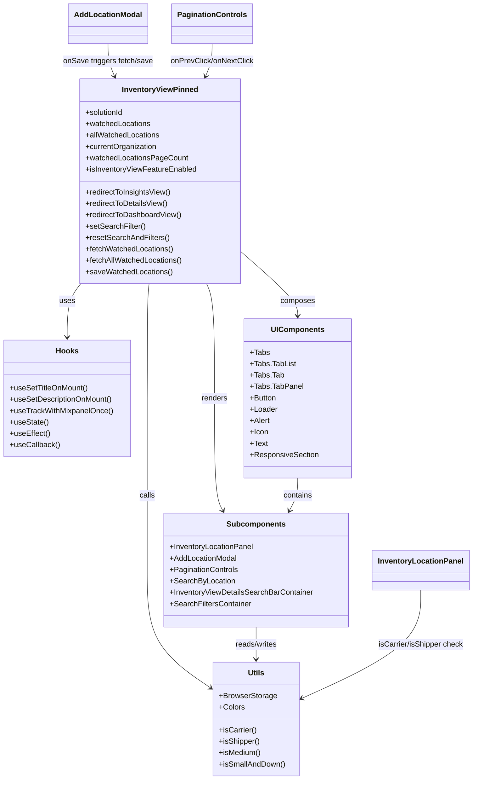

# Diagram: web/portal/src/pages/inventoryview/pinned/InventoryView.Pinned.page.js


> Auto-generated by Obscura crawlers

## Diagram 1



### SVG

<svg id="container" width="984.375" xmlns="http://www.w3.org/2000/svg" class="classDiagram" height="1644" viewBox="0 0 984.375 1644" role="graphics-document document" aria-roledescription="class"><style>#container{font-family:"trebuchet ms",verdana,arial,sans-serif;font-size:16px;fill:#333;}@keyframes edge-animation-frame{from{stroke-dashoffset:0;}}@keyframes dash{to{stroke-dashoffset:0;}}#container .edge-animation-slow{stroke-dasharray:9,5!important;stroke-dashoffset:900;animation:dash 50s linear infinite;stroke-linecap:round;}#container .edge-animation-fast{stroke-dasharray:9,5!important;stroke-dashoffset:900;animation:dash 20s linear infinite;stroke-linecap:round;}#container .error-icon{fill:#552222;}#container .error-text{fill:#552222;stroke:#552222;}#container .edge-thickness-normal{stroke-width:1px;}#container .edge-thickness-thick{stroke-width:3.5px;}#container .edge-pattern-solid{stroke-dasharray:0;}#container .edge-thickness-invisible{stroke-width:0;fill:none;}#container .edge-pattern-dashed{stroke-dasharray:3;}#container .edge-pattern-dotted{stroke-dasharray:2;}#container .marker{fill:#333333;stroke:#333333;}#container .marker.cross{stroke:#333333;}#container svg{font-family:"trebuchet ms",verdana,arial,sans-serif;font-size:16px;}#container p{margin:0;}#container g.classGroup text{fill:#9370DB;stroke:none;font-family:"trebuchet ms",verdana,arial,sans-serif;font-size:10px;}#container g.classGroup text .title{font-weight:bolder;}#container .nodeLabel,#container .edgeLabel{color:#131300;}#container .edgeLabel .label rect{fill:#ECECFF;}#container .label text{fill:#131300;}#container .labelBkg{background:#ECECFF;}#container .edgeLabel .label span{background:#ECECFF;}#container .classTitle{font-weight:bolder;}#container .node rect,#container .node circle,#container .node ellipse,#container .node polygon,#container .node path{fill:#ECECFF;stroke:#9370DB;stroke-width:1px;}#container .divider{stroke:#9370DB;stroke-width:1;}#container g.clickable{cursor:pointer;}#container g.classGroup rect{fill:#ECECFF;stroke:#9370DB;}#container g.classGroup line{stroke:#9370DB;stroke-width:1;}#container .classLabel .box{stroke:none;stroke-width:0;fill:#ECECFF;opacity:0.5;}#container .classLabel .label{fill:#9370DB;font-size:10px;}#container .relation{stroke:#333333;stroke-width:1;fill:none;}#container .dashed-line{stroke-dasharray:3;}#container .dotted-line{stroke-dasharray:1 2;}#container #compositionStart,#container .composition{fill:#333333!important;stroke:#333333!important;stroke-width:1;}#container #compositionEnd,#container .composition{fill:#333333!important;stroke:#333333!important;stroke-width:1;}#container #dependencyStart,#container .dependency{fill:#333333!important;stroke:#333333!important;stroke-width:1;}#container #dependencyStart,#container .dependency{fill:#333333!important;stroke:#333333!important;stroke-width:1;}#container #extensionStart,#container .extension{fill:transparent!important;stroke:#333333!important;stroke-width:1;}#container #extensionEnd,#container .extension{fill:transparent!important;stroke:#333333!important;stroke-width:1;}#container #aggregationStart,#container .aggregation{fill:transparent!important;stroke:#333333!important;stroke-width:1;}#container #aggregationEnd,#container .aggregation{fill:transparent!important;stroke:#333333!important;stroke-width:1;}#container #lollipopStart,#container .lollipop{fill:#ECECFF!important;stroke:#333333!important;stroke-width:1;}#container #lollipopEnd,#container .lollipop{fill:#ECECFF!important;stroke:#333333!important;stroke-width:1;}#container .edgeTerminals{font-size:11px;line-height:initial;}#container .classTitleText{text-anchor:middle;font-size:18px;fill:#333;}#container .label-icon{display:inline-block;height:1em;overflow:visible;vertical-align:-0.125em;}#container .node .label-icon path{fill:currentColor;stroke:revert;stroke-width:revert;}#container :root{--mermaid-font-family:"trebuchet ms",verdana,arial,sans-serif;}</style><g><defs><marker id="container_class-aggregationStart" class="marker aggregation class" refX="18" refY="7" markerWidth="190" markerHeight="240" orient="auto"><path d="M 18,7 L9,13 L1,7 L9,1 Z"></path></marker></defs><defs><marker id="container_class-aggregationEnd" class="marker aggregation class" refX="1" refY="7" markerWidth="20" markerHeight="28" orient="auto"><path d="M 18,7 L9,13 L1,7 L9,1 Z"></path></marker></defs><defs><marker id="container_class-extensionStart" class="marker extension class" refX="18" refY="7" markerWidth="190" markerHeight="240" orient="auto"><path d="M 1,7 L18,13 V 1 Z"></path></marker></defs><defs><marker id="container_class-extensionEnd" class="marker extension class" refX="1" refY="7" markerWidth="20" markerHeight="28" orient="auto"><path d="M 1,1 V 13 L18,7 Z"></path></marker></defs><defs><marker id="container_class-compositionStart" class="marker composition class" refX="18" refY="7" markerWidth="190" markerHeight="240" orient="auto"><path d="M 18,7 L9,13 L1,7 L9,1 Z"></path></marker></defs><defs><marker id="container_class-compositionEnd" class="marker composition class" refX="1" refY="7" markerWidth="20" markerHeight="28" orient="auto"><path d="M 18,7 L9,13 L1,7 L9,1 Z"></path></marker></defs><defs><marker id="container_class-dependencyStart" class="marker dependency class" refX="6" refY="7" markerWidth="190" markerHeight="240" orient="auto"><path d="M 5,7 L9,13 L1,7 L9,1 Z"></path></marker></defs><defs><marker id="container_class-dependencyEnd" class="marker dependency class" refX="13" refY="7" markerWidth="20" markerHeight="28" orient="auto"><path d="M 18,7 L9,13 L14,7 L9,1 Z"></path></marker></defs><defs><marker id="container_class-lollipopStart" class="marker lollipop class" refX="13" refY="7" markerWidth="190" markerHeight="240" orient="auto"><circle stroke="black" fill="transparent" cx="7" cy="7" r="6"></circle></marker></defs><defs><marker id="container_class-lollipopEnd" class="marker lollipop class" refX="1" refY="7" markerWidth="190" markerHeight="240" orient="auto"><circle stroke="black" fill="transparent" cx="7" cy="7" r="6"></circle></marker></defs><g class="root"><g class="clusters"></g><g class="edgePaths"><path d="M168.465,598L163.724,604.167C158.983,610.333,149.501,622.667,144.76,641.5C140.02,660.333,140.02,685.667,140.02,698.333L140.02,711" id="id_InventoryViewPinned_Hooks_1" class="edge-thickness-normal edge-pattern-solid relation" style=";;;" data-edge="true" data-et="edge" data-id="id_InventoryViewPinned_Hooks_1" data-points="W3sieCI6MTY4LjQ2NTMzNzgyMTE0NjI1LCJ5Ijo1OTh9LHsieCI6MTQwLjAxOTUzMTI1LCJ5Ijo2MzV9LHsieCI6MTQwLjAxOTUzMTI1LCJ5Ijo3MTd9XQ==" marker-end="url(#container_class-dependencyEnd)"></path><path d="M503.043,530.005L522.967,547.504C542.891,565.003,582.74,600.002,602.664,622.668C622.588,645.333,622.588,655.667,622.588,660.833L622.588,666" id="id_InventoryViewPinned_UIComponents_2" class="edge-thickness-normal edge-pattern-solid relation" style=";;;" data-edge="true" data-et="edge" data-id="id_InventoryViewPinned_UIComponents_2" data-points="W3sieCI6NTAzLjA0Mjk2ODc1LCJ5Ijo1MzAuMDA1MTgwMTE3NTY5N30seyJ4Ijo2MjIuNTg3ODkwNjI1LCJ5Ijo2MzV9LHsieCI6NjIyLjU4Nzg5MDYyNSwieSI6NjcyfV0=" marker-end="url(#container_class-dependencyEnd)"></path><path d="M432.151,598L434.938,604.167C437.725,610.333,443.299,622.667,446.086,663C448.873,703.333,448.873,771.667,448.873,840C448.873,908.333,448.873,976.667,451.801,1016.125C454.728,1055.583,460.583,1066.167,463.511,1071.458L466.438,1076.75" id="id_InventoryViewPinned_Subcomponents_3" class="edge-thickness-normal edge-pattern-solid relation" style=";;;" data-edge="true" data-et="edge" data-id="id_InventoryViewPinned_Subcomponents_3" data-points="W3sieCI6NDMyLjE1MDU1Mjc0MjA5NDksInkiOjU5OH0seyJ4Ijo0NDguODczMDQ2ODc1LCJ5Ijo2MzV9LHsieCI6NDQ4Ljg3MzA0Njg3NSwieSI6ODQwfSx7IngiOjQ0OC44NzMwNDY4NzUsInkiOjEwNDV9LHsieCI6NDY5LjM0MjYzMDM3NDIwMzg1LCJ5IjoxMDgyfV0=" marker-end="url(#container_class-dependencyEnd)"></path><path d="M311.059,598L310.389,604.167C309.719,610.333,308.379,622.667,307.709,663C307.039,703.333,307.039,771.667,307.039,840C307.039,908.333,307.039,976.667,307.039,1037C307.039,1097.333,307.039,1149.667,307.039,1202C307.039,1254.333,307.039,1306.667,329.322,1348.131C351.605,1389.595,396.171,1420.19,418.454,1435.488L440.737,1450.786" id="id_InventoryViewPinned_Utils_4" class="edge-thickness-normal edge-pattern-solid relation" style=";;;" data-edge="true" data-et="edge" data-id="id_InventoryViewPinned_Utils_4" data-points="W3sieCI6MzExLjA1OTA4NzgyMTE0NjI1LCJ5Ijo1OTh9LHsieCI6MzA3LjAzOTA2MjUsInkiOjYzNX0seyJ4IjozMDcuMDM5MDYyNSwieSI6ODQwfSx7IngiOjMwNy4wMzkwNjI1LCJ5IjoxMDQ1fSx7IngiOjMwNy4wMzkwNjI1LCJ5IjoxMjAyfSx7IngiOjMwNy4wMzkwNjI1LCJ5IjoxMzU5fSx7IngiOjQ0NS42ODM1OTM3NSwieSI6MTQ1NC4xODE1MDE0MDkxNzI0fV0=" marker-end="url(#container_class-dependencyEnd)"></path><path d="M622.588,1008L622.588,1014.167C622.588,1020.333,622.588,1032.667,619.66,1044.125C616.733,1055.583,610.878,1066.167,607.95,1071.458L605.023,1076.75" id="id_UIComponents_Subcomponents_5" class="edge-thickness-normal edge-pattern-solid relation" style=";;;" data-edge="true" data-et="edge" data-id="id_UIComponents_Subcomponents_5" data-points="W3sieCI6NjIyLjU4Nzg5MDYyNSwieSI6MTAwOH0seyJ4Ijo2MjIuNTg3ODkwNjI1LCJ5IjoxMDQ1fSx7IngiOjYwMi4xMTgzMDcxMjU3OTYyLCJ5IjoxMDgyfV0=" marker-end="url(#container_class-dependencyEnd)"></path><path d="M535.73,1322L535.73,1328.167C535.73,1334.333,535.73,1346.667,535.73,1358C535.73,1369.333,535.73,1379.667,535.73,1384.833L535.73,1390" id="id_Subcomponents_Utils_6" class="edge-thickness-normal edge-pattern-solid relation" style=";;;" data-edge="true" data-et="edge" data-id="id_Subcomponents_Utils_6" data-points="W3sieCI6NTM1LjczMDQ2ODc1LCJ5IjoxMzIyfSx7IngiOjUzNS43MzA0Njg3NSwieSI6MTM1OX0seyJ4Ijo1MzUuNzMwNDY4NzUsInkiOjEzOTZ9XQ==" marker-end="url(#container_class-dependencyEnd)"></path><path d="M877.898,1244L877.898,1263.167C877.898,1282.333,877.898,1320.667,836.787,1358.697C795.676,1396.727,713.453,1434.454,672.342,1453.317L631.231,1472.181" id="id_InventoryLocationPanel_Utils_7" class="edge-thickness-normal edge-pattern-solid relation" style=";;;" data-edge="true" data-et="edge" data-id="id_InventoryLocationPanel_Utils_7" data-points="W3sieCI6ODc3Ljg5ODQzNzUsInkiOjEyNDR9LHsieCI6ODc3Ljg5ODQzNzUsInkiOjEzNTl9LHsieCI6NjI1Ljc3NzM0Mzc1LCJ5IjoxNDc0LjY4Mjk4NDE4ODU5NTF9XQ==" marker-end="url(#container_class-dependencyEnd)"></path><path d="M228.629,92L228.629,98.167C228.629,104.333,228.629,116.667,230.824,128.078C233.019,139.488,237.409,149.977,239.604,155.221L241.799,160.465" id="id_AddLocationModal_InventoryViewPinned_8" class="edge-thickness-normal edge-pattern-solid relation" style=";;;" data-edge="true" data-et="edge" data-id="id_AddLocationModal_InventoryViewPinned_8" data-points="W3sieCI6MjI4LjYyODkwNjI1LCJ5Ijo5Mn0seyJ4IjoyMjguNjI4OTA2MjUsInkiOjEyOX0seyJ4IjoyNDQuMTE2MDI5NTIwNzUxLCJ5IjoxNjZ9XQ==" marker-end="url(#container_class-dependencyEnd)"></path><path d="M440.426,92L440.426,98.167C440.426,104.333,440.426,116.667,438.231,128.078C436.036,139.488,431.645,149.977,429.45,155.221L427.255,160.465" id="id_PaginationControls_InventoryViewPinned_9" class="edge-thickness-normal edge-pattern-solid relation" style=";;;" data-edge="true" data-et="edge" data-id="id_PaginationControls_InventoryViewPinned_9" data-points="W3sieCI6NDQwLjQyNTc4MTI1LCJ5Ijo5Mn0seyJ4Ijo0NDAuNDI1NzgxMjUsInkiOjEyOX0seyJ4Ijo0MjQuOTM4NjU3OTc5MjQ5LCJ5IjoxNjZ9XQ==" marker-end="url(#container_class-dependencyEnd)"></path></g><g class="edgeLabels"><g class="edgeLabel" transform="translate(140.01953125, 635)"><g class="label" data-id="id_InventoryViewPinned_Hooks_1" transform="translate(-16.4921875, -12)"><foreignObject width="32.984375" height="24"><div xmlns="http://www.w3.org/1999/xhtml" class="labelBkg" style="display: table-cell; white-space: nowrap; line-height: 1.5; max-width: 200px; text-align: center;"><span class="edgeLabel"><p>uses</p></span></div></foreignObject></g></g><g class="edgeLabel" transform="translate(622.587890625, 635)"><g class="label" data-id="id_InventoryViewPinned_UIComponents_2" transform="translate(-36.453125, -12)"><foreignObject width="72.90625" height="24"><div xmlns="http://www.w3.org/1999/xhtml" class="labelBkg" style="display: table-cell; white-space: nowrap; line-height: 1.5; max-width: 200px; text-align: center;"><span class="edgeLabel"><p>composes</p></span></div></foreignObject></g></g><g class="edgeLabel" transform="translate(448.873046875, 840)"><g class="label" data-id="id_InventoryViewPinned_Subcomponents_3" transform="translate(-27.75, -12)"><foreignObject width="55.5" height="24"><div xmlns="http://www.w3.org/1999/xhtml" class="labelBkg" style="display: table-cell; white-space: nowrap; line-height: 1.5; max-width: 200px; text-align: center;"><span class="edgeLabel"><p>renders</p></span></div></foreignObject></g></g><g class="edgeLabel" transform="translate(307.0390625, 1045)"><g class="label" data-id="id_InventoryViewPinned_Utils_4" transform="translate(-16.4453125, -12)"><foreignObject width="32.890625" height="24"><div xmlns="http://www.w3.org/1999/xhtml" class="labelBkg" style="display: table-cell; white-space: nowrap; line-height: 1.5; max-width: 200px; text-align: center;"><span class="edgeLabel"><p>calls</p></span></div></foreignObject></g></g><g class="edgeLabel" transform="translate(622.587890625, 1045)"><g class="label" data-id="id_UIComponents_Subcomponents_5" transform="translate(-30.890625, -12)"><foreignObject width="61.78125" height="24"><div xmlns="http://www.w3.org/1999/xhtml" class="labelBkg" style="display: table-cell; white-space: nowrap; line-height: 1.5; max-width: 200px; text-align: center;"><span class="edgeLabel"><p>contains</p></span></div></foreignObject></g></g><g class="edgeLabel" transform="translate(535.73046875, 1359)"><g class="label" data-id="id_Subcomponents_Utils_6" transform="translate(-45.9453125, -12)"><foreignObject width="91.890625" height="24"><div xmlns="http://www.w3.org/1999/xhtml" class="labelBkg" style="display: table-cell; white-space: nowrap; line-height: 1.5; max-width: 200px; text-align: center;"><span class="edgeLabel"><p>reads/writes</p></span></div></foreignObject></g></g><g class="edgeLabel" transform="translate(877.8984375, 1359)"><g class="label" data-id="id_InventoryLocationPanel_Utils_7" transform="translate(-91.46875, -12)"><foreignObject width="182.9375" height="24"><div xmlns="http://www.w3.org/1999/xhtml" class="labelBkg" style="display: table-cell; white-space: nowrap; line-height: 1.5; max-width: 200px; text-align: center;"><span class="edgeLabel"><p>isCarrier/isShipper check</p></span></div></foreignObject></g></g><g class="edgeLabel" transform="translate(228.62890625, 129)"><g class="label" data-id="id_AddLocationModal_InventoryViewPinned_8" transform="translate(-96.2578125, -12)"><foreignObject width="192.515625" height="24"><div xmlns="http://www.w3.org/1999/xhtml" class="labelBkg" style="display: table-cell; white-space: nowrap; line-height: 1.5; max-width: 200px; text-align: center;"><span class="edgeLabel"><p>onSave triggers fetch/save</p></span></div></foreignObject></g></g><g class="edgeLabel" transform="translate(440.42578125, 129)"><g class="label" data-id="id_PaginationControls_InventoryViewPinned_9" transform="translate(-88.4453125, -12)"><foreignObject width="176.890625" height="24"><div xmlns="http://www.w3.org/1999/xhtml" class="labelBkg" style="display: table-cell; white-space: nowrap; line-height: 1.5; max-width: 200px; text-align: center;"><span class="edgeLabel"><p>onPrevClick/onNextClick</p></span></div></foreignObject></g></g></g><g class="nodes"><g class="node default" id="classId-InventoryViewPinned-0" transform="translate(334.52734375, 382)"><g class="basic label-container"><path d="M-168.515625 -216 L168.515625 -216 L168.515625 216 L-168.515625 216" stroke="none" stroke-width="0" fill="#ECECFF" style=""></path><path d="M-168.515625 -216 C-67.17695516575037 -216, 34.16171466849926 -216, 168.515625 -216 M-168.515625 -216 C-63.02543006327119 -216, 42.464764873457625 -216, 168.515625 -216 M168.515625 -216 C168.515625 -64.77492271703912, 168.515625 86.45015456592176, 168.515625 216 M168.515625 -216 C168.515625 -106.64423862186666, 168.515625 2.7115227562666746, 168.515625 216 M168.515625 216 C63.888831309425186 216, -40.73796238114963 216, -168.515625 216 M168.515625 216 C82.7381966744202 216, -3.0392316511596107 216, -168.515625 216 M-168.515625 216 C-168.515625 51.0540812878053, -168.515625 -113.8918374243894, -168.515625 -216 M-168.515625 216 C-168.515625 61.55545258139921, -168.515625 -92.88909483720158, -168.515625 -216" stroke="#9370DB" stroke-width="1.3" fill="none" stroke-dasharray="0 0" style=""></path></g><g class="annotation-group text" transform="translate(0, -192)"></g><g class="label-group text" transform="translate(-77.6875, -192)"><g class="label" style="font-weight: bolder" transform="translate(0,-12)"><foreignObject width="155.375" height="24"><div xmlns="http://www.w3.org/1999/xhtml" style="display: table-cell; white-space: nowrap; line-height: 1.5; max-width: 203px; text-align: center;"><span class="nodeLabel markdown-node-label" style=""><p>InventoryViewPinned</p></span></div></foreignObject></g></g><g class="members-group text" transform="translate(-156.515625, -144)"><g class="label" style="" transform="translate(0,-12)"><foreignObject width="82.109375" height="24"><div xmlns="http://www.w3.org/1999/xhtml" style="display: table-cell; white-space: nowrap; line-height: 1.5; max-width: 139px; text-align: center;"><span class="nodeLabel markdown-node-label" style=""><p>+solutionId</p></span></div></foreignObject></g><g class="label" style="" transform="translate(0,12)"><foreignObject width="138.40625" height="24"><div xmlns="http://www.w3.org/1999/xhtml" style="display: table-cell; white-space: nowrap; line-height: 1.5; max-width: 196px; text-align: center;"><span class="nodeLabel markdown-node-label" style=""><p>+watchedLocations</p></span></div></foreignObject></g><g class="label" style="" transform="translate(0,36)"><foreignObject width="157.546875" height="24"><div xmlns="http://www.w3.org/1999/xhtml" style="display: table-cell; white-space: nowrap; line-height: 1.5; max-width: 215px; text-align: center;"><span class="nodeLabel markdown-node-label" style=""><p>+allWatchedLocations</p></span></div></foreignObject></g><g class="label" style="" transform="translate(0,60)"><foreignObject width="152.609375" height="24"><div xmlns="http://www.w3.org/1999/xhtml" style="display: table-cell; white-space: nowrap; line-height: 1.5; max-width: 210px; text-align: center;"><span class="nodeLabel markdown-node-label" style=""><p>+currentOrganization</p></span></div></foreignObject></g><g class="label" style="" transform="translate(0,84)"><foreignObject width="214.59375" height="24"><div xmlns="http://www.w3.org/1999/xhtml" style="display: table-cell; white-space: nowrap; line-height: 1.5; max-width: 272px; text-align: center;"><span class="nodeLabel markdown-node-label" style=""><p>+watchedLocationsPageCount</p></span></div></foreignObject></g><g class="label" style="" transform="translate(0,108)"><foreignObject width="235.34375" height="24"><div xmlns="http://www.w3.org/1999/xhtml" style="display: table-cell; white-space: nowrap; line-height: 1.5; max-width: 293px; text-align: center;"><span class="nodeLabel markdown-node-label" style=""><p>+isInventoryViewFeatureEnabled</p></span></div></foreignObject></g></g><g class="methods-group text" transform="translate(-156.515625, 24)"><g class="label" style="" transform="translate(0,-12)"><foreignObject width="182.0625" height="24"><div xmlns="http://www.w3.org/1999/xhtml" style="display: table-cell; white-space: nowrap; line-height: 1.5; max-width: 239px; text-align: center;"><span class="nodeLabel markdown-node-label" style=""><p>+redirectToInsightsView()</p></span></div></foreignObject></g><g class="label" style="" transform="translate(0,12)"><foreignObject width="175.09375" height="24"><div xmlns="http://www.w3.org/1999/xhtml" style="display: table-cell; white-space: nowrap; line-height: 1.5; max-width: 232px; text-align: center;"><span class="nodeLabel markdown-node-label" style=""><p>+redirectToDetailsView()</p></span></div></foreignObject></g><g class="label" style="" transform="translate(0,36)"><foreignObject width="203.21875" height="24"><div xmlns="http://www.w3.org/1999/xhtml" style="display: table-cell; white-space: nowrap; line-height: 1.5; max-width: 261px; text-align: center;"><span class="nodeLabel markdown-node-label" style=""><p>+redirectToDashboardView()</p></span></div></foreignObject></g><g class="label" style="" transform="translate(0,60)"><foreignObject width="125.953125" height="24"><div xmlns="http://www.w3.org/1999/xhtml" style="display: table-cell; white-space: nowrap; line-height: 1.5; max-width: 183px; text-align: center;"><span class="nodeLabel markdown-node-label" style=""><p>+setSearchFilter()</p></span></div></foreignObject></g><g class="label" style="" transform="translate(0,84)"><foreignObject width="175.71875" height="24"><div xmlns="http://www.w3.org/1999/xhtml" style="display: table-cell; white-space: nowrap; line-height: 1.5; max-width: 233px; text-align: center;"><span class="nodeLabel markdown-node-label" style=""><p>+resetSearchAndFilters()</p></span></div></foreignObject></g><g class="label" style="" transform="translate(0,108)"><foreignObject width="186.46875" height="24"><div xmlns="http://www.w3.org/1999/xhtml" style="display: table-cell; white-space: nowrap; line-height: 1.5; max-width: 244px; text-align: center;"><span class="nodeLabel markdown-node-label" style=""><p>+fetchWatchedLocations()</p></span></div></foreignObject></g><g class="label" style="" transform="translate(0,132)"><foreignObject width="205.015625" height="24"><div xmlns="http://www.w3.org/1999/xhtml" style="display: table-cell; white-space: nowrap; line-height: 1.5; max-width: 262px; text-align: center;"><span class="nodeLabel markdown-node-label" style=""><p>+fetchAllWatchedLocations()</p></span></div></foreignObject></g><g class="label" style="" transform="translate(0,156)"><foreignObject width="182.53125" height="24"><div xmlns="http://www.w3.org/1999/xhtml" style="display: table-cell; white-space: nowrap; line-height: 1.5; max-width: 240px; text-align: center;"><span class="nodeLabel markdown-node-label" style=""><p>+saveWatchedLocations()</p></span></div></foreignObject></g></g><g class="divider" style=""><path d="M-168.515625 -168 C-101.09024796377645 -168, -33.6648709275529 -168, 168.515625 -168 M-168.515625 -168 C-99.97655576319895 -168, -31.43748652639789 -168, 168.515625 -168" stroke="#9370DB" stroke-width="1.3" fill="none" stroke-dasharray="0 0" style=""></path></g><g class="divider" style=""><path d="M-168.515625 0 C-53.16497231304152 0, 62.185680373916966 0, 168.515625 0 M-168.515625 0 C-48.84410828411072 0, 70.82740843177857 0, 168.515625 0" stroke="#9370DB" stroke-width="1.3" fill="none" stroke-dasharray="0 0" style=""></path></g></g><g class="node default" id="classId-Hooks-1" transform="translate(140.01953125, 840)"><g class="basic label-container"><path d="M-132.01953125 -123 L132.01953125 -123 L132.01953125 123 L-132.01953125 123" stroke="none" stroke-width="0" fill="#ECECFF" style=""></path><path d="M-132.01953125 -123 C-55.145632625251224 -123, 21.72826599949755 -123, 132.01953125 -123 M-132.01953125 -123 C-62.92183580891427 -123, 6.175859632171466 -123, 132.01953125 -123 M132.01953125 -123 C132.01953125 -52.74983118708839, 132.01953125 17.50033762582322, 132.01953125 123 M132.01953125 -123 C132.01953125 -60.87721435525183, 132.01953125 1.2455712894963398, 132.01953125 123 M132.01953125 123 C34.019770682141285 123, -63.97998988571743 123, -132.01953125 123 M132.01953125 123 C36.064391211883986 123, -59.89074882623203 123, -132.01953125 123 M-132.01953125 123 C-132.01953125 42.023101702068885, -132.01953125 -38.95379659586223, -132.01953125 -123 M-132.01953125 123 C-132.01953125 60.129905981206846, -132.01953125 -2.7401880375863072, -132.01953125 -123" stroke="#9370DB" stroke-width="1.3" fill="none" stroke-dasharray="0 0" style=""></path></g><g class="annotation-group text" transform="translate(0, -99)"></g><g class="label-group text" transform="translate(-22.9140625, -99)"><g class="label" style="font-weight: bolder" transform="translate(0,-12)"><foreignObject width="45.828125" height="24"><div xmlns="http://www.w3.org/1999/xhtml" style="display: table-cell; white-space: nowrap; line-height: 1.5; max-width: 95px; text-align: center;"><span class="nodeLabel markdown-node-label" style=""><p>Hooks</p></span></div></foreignObject></g></g><g class="members-group text" transform="translate(-120.01953125, -51)"></g><g class="methods-group text" transform="translate(-120.01953125, -21)"><g class="label" style="" transform="translate(0,-12)"><foreignObject width="165.515625" height="24"><div xmlns="http://www.w3.org/1999/xhtml" style="display: table-cell; white-space: nowrap; line-height: 1.5; max-width: 223px; text-align: center;"><span class="nodeLabel markdown-node-label" style=""><p>+useSetTitleOnMount()</p></span></div></foreignObject></g><g class="label" style="" transform="translate(0,12)"><foreignObject width="217.125" height="24"><div xmlns="http://www.w3.org/1999/xhtml" style="display: table-cell; white-space: nowrap; line-height: 1.5; max-width: 274px; text-align: center;"><span class="nodeLabel markdown-node-label" style=""><p>+useSetDescriptionOnMount()</p></span></div></foreignObject></g><g class="label" style="" transform="translate(0,36)"><foreignObject width="216.75" height="24"><div xmlns="http://www.w3.org/1999/xhtml" style="display: table-cell; white-space: nowrap; line-height: 1.5; max-width: 274px; text-align: center;"><span class="nodeLabel markdown-node-label" style=""><p>+useTrackWithMixpanelOnce()</p></span></div></foreignObject></g><g class="label" style="" transform="translate(0,60)"><foreignObject width="81.203125" height="24"><div xmlns="http://www.w3.org/1999/xhtml" style="display: table-cell; white-space: nowrap; line-height: 1.5; max-width: 139px; text-align: center;"><span class="nodeLabel markdown-node-label" style=""><p>+useState()</p></span></div></foreignObject></g><g class="label" style="" transform="translate(0,84)"><foreignObject width="84.8125" height="24"><div xmlns="http://www.w3.org/1999/xhtml" style="display: table-cell; white-space: nowrap; line-height: 1.5; max-width: 142px; text-align: center;"><span class="nodeLabel markdown-node-label" style=""><p>+useEffect()</p></span></div></foreignObject></g><g class="label" style="" transform="translate(0,108)"><foreignObject width="104.46875" height="24"><div xmlns="http://www.w3.org/1999/xhtml" style="display: table-cell; white-space: nowrap; line-height: 1.5; max-width: 162px; text-align: center;"><span class="nodeLabel markdown-node-label" style=""><p>+useCallback()</p></span></div></foreignObject></g></g><g class="divider" style=""><path d="M-132.01953125 -75 C-47.582048582379386 -75, 36.85543408524123 -75, 132.01953125 -75 M-132.01953125 -75 C-62.102224042225586 -75, 7.8150831655488275 -75, 132.01953125 -75" stroke="#9370DB" stroke-width="1.3" fill="none" stroke-dasharray="0 0" style=""></path></g><g class="divider" style=""><path d="M-132.01953125 -51 C-49.39017598358332 -51, 33.23917928283336 -51, 132.01953125 -51 M-132.01953125 -51 C-45.39598399459028 -51, 41.22756326081944 -51, 132.01953125 -51" stroke="#9370DB" stroke-width="1.3" fill="none" stroke-dasharray="0 0" style=""></path></g></g><g class="node default" id="classId-UIComponents-2" transform="translate(622.587890625, 840)"><g class="basic label-container"><path d="M-110.96484375 -168 L110.96484375 -168 L110.96484375 168 L-110.96484375 168" stroke="none" stroke-width="0" fill="#ECECFF" style=""></path><path d="M-110.96484375 -168 C-41.3386990956525 -168, 28.287445558694998 -168, 110.96484375 -168 M-110.96484375 -168 C-60.341856330675846 -168, -9.718868911351692 -168, 110.96484375 -168 M110.96484375 -168 C110.96484375 -87.30516455996052, 110.96484375 -6.610329119921033, 110.96484375 168 M110.96484375 -168 C110.96484375 -56.7287088584317, 110.96484375 54.542582283136596, 110.96484375 168 M110.96484375 168 C57.819888511879284 168, 4.674933273758569 168, -110.96484375 168 M110.96484375 168 C61.15151558483023 168, 11.338187419660457 168, -110.96484375 168 M-110.96484375 168 C-110.96484375 90.84044643162346, -110.96484375 13.680892863246925, -110.96484375 -168 M-110.96484375 168 C-110.96484375 41.30660804374723, -110.96484375 -85.38678391250554, -110.96484375 -168" stroke="#9370DB" stroke-width="1.3" fill="none" stroke-dasharray="0 0" style=""></path></g><g class="annotation-group text" transform="translate(0, -144)"></g><g class="label-group text" transform="translate(-53.4765625, -144)"><g class="label" style="font-weight: bolder" transform="translate(0,-12)"><foreignObject width="106.953125" height="24"><div xmlns="http://www.w3.org/1999/xhtml" style="display: table-cell; white-space: nowrap; line-height: 1.5; max-width: 157px; text-align: center;"><span class="nodeLabel markdown-node-label" style=""><p>UIComponents</p></span></div></foreignObject></g></g><g class="members-group text" transform="translate(-98.96484375, -96)"><g class="label" style="" transform="translate(0,-12)"><foreignObject width="40.34375" height="24"><div xmlns="http://www.w3.org/1999/xhtml" style="display: table-cell; white-space: nowrap; line-height: 1.5; max-width: 98px; text-align: center;"><span class="nodeLabel markdown-node-label" style=""><p>+Tabs</p></span></div></foreignObject></g><g class="label" style="" transform="translate(0,12)"><foreignObject width="94.625" height="24"><div xmlns="http://www.w3.org/1999/xhtml" style="display: table-cell; white-space: nowrap; line-height: 1.5; max-width: 152px; text-align: center;"><span class="nodeLabel markdown-node-label" style=""><p>+Tabs.TabList</p></span></div></foreignObject></g><g class="label" style="" transform="translate(0,36)"><foreignObject width="68.90625" height="24"><div xmlns="http://www.w3.org/1999/xhtml" style="display: table-cell; white-space: nowrap; line-height: 1.5; max-width: 126px; text-align: center;"><span class="nodeLabel markdown-node-label" style=""><p>+Tabs.Tab</p></span></div></foreignObject></g><g class="label" style="" transform="translate(0,60)"><foreignObject width="108.8125" height="24"><div xmlns="http://www.w3.org/1999/xhtml" style="display: table-cell; white-space: nowrap; line-height: 1.5; max-width: 166px; text-align: center;"><span class="nodeLabel markdown-node-label" style=""><p>+Tabs.TabPanel</p></span></div></foreignObject></g><g class="label" style="" transform="translate(0,84)"><foreignObject width="57.0625" height="24"><div xmlns="http://www.w3.org/1999/xhtml" style="display: table-cell; white-space: nowrap; line-height: 1.5; max-width: 114px; text-align: center;"><span class="nodeLabel markdown-node-label" style=""><p>+Button</p></span></div></foreignObject></g><g class="label" style="" transform="translate(0,108)"><foreignObject width="57.90625" height="24"><div xmlns="http://www.w3.org/1999/xhtml" style="display: table-cell; white-space: nowrap; line-height: 1.5; max-width: 116px; text-align: center;"><span class="nodeLabel markdown-node-label" style=""><p>+Loader</p></span></div></foreignObject></g><g class="label" style="" transform="translate(0,132)"><foreignObject width="42.28125" height="24"><div xmlns="http://www.w3.org/1999/xhtml" style="display: table-cell; white-space: nowrap; line-height: 1.5; max-width: 100px; text-align: center;"><span class="nodeLabel markdown-node-label" style=""><p>+Alert</p></span></div></foreignObject></g><g class="label" style="" transform="translate(0,156)"><foreignObject width="38.765625" height="24"><div xmlns="http://www.w3.org/1999/xhtml" style="display: table-cell; white-space: nowrap; line-height: 1.5; max-width: 96px; text-align: center;"><span class="nodeLabel markdown-node-label" style=""><p>+Icon</p></span></div></foreignObject></g><g class="label" style="" transform="translate(0,180)"><foreignObject width="36.703125" height="24"><div xmlns="http://www.w3.org/1999/xhtml" style="display: table-cell; white-space: nowrap; line-height: 1.5; max-width: 94px; text-align: center;"><span class="nodeLabel markdown-node-label" style=""><p>+Text</p></span></div></foreignObject></g><g class="label" style="" transform="translate(0,204)"><foreignObject width="144.453125" height="24"><div xmlns="http://www.w3.org/1999/xhtml" style="display: table-cell; white-space: nowrap; line-height: 1.5; max-width: 202px; text-align: center;"><span class="nodeLabel markdown-node-label" style=""><p>+ResponsiveSection</p></span></div></foreignObject></g></g><g class="methods-group text" transform="translate(-98.96484375, 168)"></g><g class="divider" style=""><path d="M-110.96484375 -120 C-55.989618936303245 -120, -1.0143941226064896 -120, 110.96484375 -120 M-110.96484375 -120 C-46.86232365529668 -120, 17.240196439406645 -120, 110.96484375 -120" stroke="#9370DB" stroke-width="1.3" fill="none" stroke-dasharray="0 0" style=""></path></g><g class="divider" style=""><path d="M-110.96484375 144 C-49.08686132566755 144, 12.791121098664902 144, 110.96484375 144 M-110.96484375 144 C-48.53979726464349 144, 13.885249220713021 144, 110.96484375 144" stroke="#9370DB" stroke-width="1.3" fill="none" stroke-dasharray="0 0" style=""></path></g></g><g class="node default" id="classId-Subcomponents-3" transform="translate(535.73046875, 1202)"><g class="basic label-container"><path d="M-193.69140625 -120 L193.69140625 -120 L193.69140625 120 L-193.69140625 120" stroke="none" stroke-width="0" fill="#ECECFF" style=""></path><path d="M-193.69140625 -120 C-69.68024802485331 -120, 54.330910200293374 -120, 193.69140625 -120 M-193.69140625 -120 C-49.359664565449265 -120, 94.97207711910147 -120, 193.69140625 -120 M193.69140625 -120 C193.69140625 -25.475071368105972, 193.69140625 69.04985726378806, 193.69140625 120 M193.69140625 -120 C193.69140625 -39.51466752573357, 193.69140625 40.97066494853286, 193.69140625 120 M193.69140625 120 C111.54841038767819 120, 29.405414525356377 120, -193.69140625 120 M193.69140625 120 C111.1405913141468 120, 28.589776378293607 120, -193.69140625 120 M-193.69140625 120 C-193.69140625 54.99630633428298, -193.69140625 -10.007387331434046, -193.69140625 -120 M-193.69140625 120 C-193.69140625 58.7198204337748, -193.69140625 -2.560359132450401, -193.69140625 -120" stroke="#9370DB" stroke-width="1.3" fill="none" stroke-dasharray="0 0" style=""></path></g><g class="annotation-group text" transform="translate(0, -96)"></g><g class="label-group text" transform="translate(-59.0859375, -96)"><g class="label" style="font-weight: bolder" transform="translate(0,-12)"><foreignObject width="118.171875" height="24"><div xmlns="http://www.w3.org/1999/xhtml" style="display: table-cell; white-space: nowrap; line-height: 1.5; max-width: 168px; text-align: center;"><span class="nodeLabel markdown-node-label" style=""><p>Subcomponents</p></span></div></foreignObject></g></g><g class="members-group text" transform="translate(-181.69140625, -48)"><g class="label" style="" transform="translate(0,-12)"><foreignObject width="178.828125" height="24"><div xmlns="http://www.w3.org/1999/xhtml" style="display: table-cell; white-space: nowrap; line-height: 1.5; max-width: 236px; text-align: center;"><span class="nodeLabel markdown-node-label" style=""><p>+InventoryLocationPanel</p></span></div></foreignObject></g><g class="label" style="" transform="translate(0,12)"><foreignObject width="142.84375" height="24"><div xmlns="http://www.w3.org/1999/xhtml" style="display: table-cell; white-space: nowrap; line-height: 1.5; max-width: 201px; text-align: center;"><span class="nodeLabel markdown-node-label" style=""><p>+AddLocationModal</p></span></div></foreignObject></g><g class="label" style="" transform="translate(0,36)"><foreignObject width="145.203125" height="24"><div xmlns="http://www.w3.org/1999/xhtml" style="display: table-cell; white-space: nowrap; line-height: 1.5; max-width: 203px; text-align: center;"><span class="nodeLabel markdown-node-label" style=""><p>+PaginationControls</p></span></div></foreignObject></g><g class="label" style="" transform="translate(0,60)"><foreignObject width="135.765625" height="24"><div xmlns="http://www.w3.org/1999/xhtml" style="display: table-cell; white-space: nowrap; line-height: 1.5; max-width: 193px; text-align: center;"><span class="nodeLabel markdown-node-label" style=""><p>+SearchByLocation</p></span></div></foreignObject></g><g class="label" style="" transform="translate(0,84)"><foreignObject width="304.296875" height="24"><div xmlns="http://www.w3.org/1999/xhtml" style="display: table-cell; white-space: nowrap; line-height: 1.5; max-width: 362px; text-align: center;"><span class="nodeLabel markdown-node-label" style=""><p>+InventoryViewDetailsSearchBarContainer</p></span></div></foreignObject></g><g class="label" style="" transform="translate(0,108)"><foreignObject width="170.734375" height="24"><div xmlns="http://www.w3.org/1999/xhtml" style="display: table-cell; white-space: nowrap; line-height: 1.5; max-width: 229px; text-align: center;"><span class="nodeLabel markdown-node-label" style=""><p>+SearchFiltersContainer</p></span></div></foreignObject></g></g><g class="methods-group text" transform="translate(-181.69140625, 120)"></g><g class="divider" style=""><path d="M-193.69140625 -72 C-90.4292383727417 -72, 12.832929504516613 -72, 193.69140625 -72 M-193.69140625 -72 C-65.6167553115861 -72, 62.45789562682779 -72, 193.69140625 -72" stroke="#9370DB" stroke-width="1.3" fill="none" stroke-dasharray="0 0" style=""></path></g><g class="divider" style=""><path d="M-193.69140625 96 C-73.9019401841536 96, 45.887525881692795 96, 193.69140625 96 M-193.69140625 96 C-108.28821462569564 96, -22.88502300139129 96, 193.69140625 96" stroke="#9370DB" stroke-width="1.3" fill="none" stroke-dasharray="0 0" style=""></path></g></g><g class="node default" id="classId-Utils-4" transform="translate(535.73046875, 1516)"><g class="basic label-container"><path d="M-90.046875 -120 L90.046875 -120 L90.046875 120 L-90.046875 120" stroke="none" stroke-width="0" fill="#ECECFF" style=""></path><path d="M-90.046875 -120 C-39.787347613080584 -120, 10.472179773838832 -120, 90.046875 -120 M-90.046875 -120 C-30.58837579938767 -120, 28.87012340122466 -120, 90.046875 -120 M90.046875 -120 C90.046875 -32.2600698936476, 90.046875 55.47986021270481, 90.046875 120 M90.046875 -120 C90.046875 -55.32634639583077, 90.046875 9.347307208338464, 90.046875 120 M90.046875 120 C28.3362089218351 120, -33.3744571563298 120, -90.046875 120 M90.046875 120 C51.10906165150214 120, 12.171248303004276 120, -90.046875 120 M-90.046875 120 C-90.046875 49.66342271184887, -90.046875 -20.673154576302267, -90.046875 -120 M-90.046875 120 C-90.046875 60.50638871987635, -90.046875 1.0127774397526963, -90.046875 -120" stroke="#9370DB" stroke-width="1.3" fill="none" stroke-dasharray="0 0" style=""></path></g><g class="annotation-group text" transform="translate(0, -96)"></g><g class="label-group text" transform="translate(-16.796875, -96)"><g class="label" style="font-weight: bolder" transform="translate(0,-12)"><foreignObject width="33.59375" height="24"><div xmlns="http://www.w3.org/1999/xhtml" style="display: table-cell; white-space: nowrap; line-height: 1.5; max-width: 83px; text-align: center;"><span class="nodeLabel markdown-node-label" style=""><p>Utils</p></span></div></foreignObject></g></g><g class="members-group text" transform="translate(-78.046875, -48)"><g class="label" style="" transform="translate(0,-12)"><foreignObject width="121.140625" height="24"><div xmlns="http://www.w3.org/1999/xhtml" style="display: table-cell; white-space: nowrap; line-height: 1.5; max-width: 179px; text-align: center;"><span class="nodeLabel markdown-node-label" style=""><p>+BrowserStorage</p></span></div></foreignObject></g><g class="label" style="" transform="translate(0,12)"><foreignObject width="53.328125" height="24"><div xmlns="http://www.w3.org/1999/xhtml" style="display: table-cell; white-space: nowrap; line-height: 1.5; max-width: 111px; text-align: center;"><span class="nodeLabel markdown-node-label" style=""><p>+Colors</p></span></div></foreignObject></g></g><g class="methods-group text" transform="translate(-78.046875, 24)"><g class="label" style="" transform="translate(0,-12)"><foreignObject width="79.609375" height="24"><div xmlns="http://www.w3.org/1999/xhtml" style="display: table-cell; white-space: nowrap; line-height: 1.5; max-width: 137px; text-align: center;"><span class="nodeLabel markdown-node-label" style=""><p>+isCarrier()</p></span></div></foreignObject></g><g class="label" style="" transform="translate(0,12)"><foreignObject width="86.859375" height="24"><div xmlns="http://www.w3.org/1999/xhtml" style="display: table-cell; white-space: nowrap; line-height: 1.5; max-width: 144px; text-align: center;"><span class="nodeLabel markdown-node-label" style=""><p>+isShipper()</p></span></div></foreignObject></g><g class="label" style="" transform="translate(0,36)"><foreignObject width="88.609375" height="24"><div xmlns="http://www.w3.org/1999/xhtml" style="display: table-cell; white-space: nowrap; line-height: 1.5; max-width: 146px; text-align: center;"><span class="nodeLabel markdown-node-label" style=""><p>+isMedium()</p></span></div></foreignObject></g><g class="label" style="" transform="translate(0,60)"><foreignObject width="139.296875" height="24"><div xmlns="http://www.w3.org/1999/xhtml" style="display: table-cell; white-space: nowrap; line-height: 1.5; max-width: 197px; text-align: center;"><span class="nodeLabel markdown-node-label" style=""><p>+isSmallAndDown()</p></span></div></foreignObject></g></g><g class="divider" style=""><path d="M-90.046875 -72 C-33.34992179595442 -72, 23.347031408091155 -72, 90.046875 -72 M-90.046875 -72 C-47.890079518038654 -72, -5.733284036077308 -72, 90.046875 -72" stroke="#9370DB" stroke-width="1.3" fill="none" stroke-dasharray="0 0" style=""></path></g><g class="divider" style=""><path d="M-90.046875 0 C-37.02686005062099 0, 15.993154898758021 0, 90.046875 0 M-90.046875 0 C-26.35628614625189 0, 37.33430270749622 0, 90.046875 0" stroke="#9370DB" stroke-width="1.3" fill="none" stroke-dasharray="0 0" style=""></path></g></g><g class="node default" id="classId-InventoryLocationPanel-5" transform="translate(877.8984375, 1202)"><g class="basic label-container"><path d="M-98.4765625 -42 L98.4765625 -42 L98.4765625 42 L-98.4765625 42" stroke="none" stroke-width="0" fill="#ECECFF" style=""></path><path d="M-98.4765625 -42 C-53.93668807437541 -42, -9.396813648750822 -42, 98.4765625 -42 M-98.4765625 -42 C-23.205214666780634 -42, 52.06613316643873 -42, 98.4765625 -42 M98.4765625 -42 C98.4765625 -13.127678579726453, 98.4765625 15.744642840547094, 98.4765625 42 M98.4765625 -42 C98.4765625 -16.686451733839828, 98.4765625 8.627096532320344, 98.4765625 42 M98.4765625 42 C38.13737087393139 42, -22.201820752137223 42, -98.4765625 42 M98.4765625 42 C57.48437938507178 42, 16.492196270143566 42, -98.4765625 42 M-98.4765625 42 C-98.4765625 21.694064296772748, -98.4765625 1.3881285935454954, -98.4765625 -42 M-98.4765625 42 C-98.4765625 24.96203317644433, -98.4765625 7.924066352888659, -98.4765625 -42" stroke="#9370DB" stroke-width="1.3" fill="none" stroke-dasharray="0 0" style=""></path></g><g class="annotation-group text" transform="translate(0, -18)"></g><g class="label-group text" transform="translate(-86.4765625, -18)"><g class="label" style="font-weight: bolder" transform="translate(0,-12)"><foreignObject width="172.953125" height="24"><div xmlns="http://www.w3.org/1999/xhtml" style="display: table-cell; white-space: nowrap; line-height: 1.5; max-width: 221px; text-align: center;"><span class="nodeLabel markdown-node-label" style=""><p>InventoryLocationPanel</p></span></div></foreignObject></g></g><g class="members-group text" transform="translate(-86.4765625, 30)"></g><g class="methods-group text" transform="translate(-86.4765625, 60)"></g><g class="divider" style=""><path d="M-98.4765625 6 C-43.38725878283371 6, 11.702044934332577 6, 98.4765625 6 M-98.4765625 6 C-24.849912638210142 6, 48.776737223579715 6, 98.4765625 6" stroke="#9370DB" stroke-width="1.3" fill="none" stroke-dasharray="0 0" style=""></path></g><g class="divider" style=""><path d="M-98.4765625 24 C-45.50045083235262 24, 7.475660835294761 24, 98.4765625 24 M-98.4765625 24 C-58.70253720014538 24, -18.928511900290758 24, 98.4765625 24" stroke="#9370DB" stroke-width="1.3" fill="none" stroke-dasharray="0 0" style=""></path></g></g><g class="node default" id="classId-AddLocationModal-6" transform="translate(228.62890625, 50)"><g class="basic label-container"><path d="M-80.109375 -42 L80.109375 -42 L80.109375 42 L-80.109375 42" stroke="none" stroke-width="0" fill="#ECECFF" style=""></path><path d="M-80.109375 -42 C-42.034183814404024 -42, -3.9589926288080477 -42, 80.109375 -42 M-80.109375 -42 C-35.021757883955814 -42, 10.065859232088371 -42, 80.109375 -42 M80.109375 -42 C80.109375 -9.839897575855616, 80.109375 22.320204848288768, 80.109375 42 M80.109375 -42 C80.109375 -18.98898980027337, 80.109375 4.022020399453261, 80.109375 42 M80.109375 42 C44.281761678753206 42, 8.454148357506412 42, -80.109375 42 M80.109375 42 C28.56829067710492 42, -22.972793645790162 42, -80.109375 42 M-80.109375 42 C-80.109375 22.151315466349992, -80.109375 2.3026309326999836, -80.109375 -42 M-80.109375 42 C-80.109375 25.059810161612663, -80.109375 8.119620323225327, -80.109375 -42" stroke="#9370DB" stroke-width="1.3" fill="none" stroke-dasharray="0 0" style=""></path></g><g class="annotation-group text" transform="translate(0, -18)"></g><g class="label-group text" transform="translate(-68.109375, -18)"><g class="label" style="font-weight: bolder" transform="translate(0,-12)"><foreignObject width="136.21875" height="24"><div xmlns="http://www.w3.org/1999/xhtml" style="display: table-cell; white-space: nowrap; line-height: 1.5; max-width: 185px; text-align: center;"><span class="nodeLabel markdown-node-label" style=""><p>AddLocationModal</p></span></div></foreignObject></g></g><g class="members-group text" transform="translate(-68.109375, 30)"></g><g class="methods-group text" transform="translate(-68.109375, 60)"></g><g class="divider" style=""><path d="M-80.109375 6 C-43.61296519106787 6, -7.1165553821357435 6, 80.109375 6 M-80.109375 6 C-39.05638568625418 6, 1.9966036274916377 6, 80.109375 6" stroke="#9370DB" stroke-width="1.3" fill="none" stroke-dasharray="0 0" style=""></path></g><g class="divider" style=""><path d="M-80.109375 24 C-18.284414623319677 24, 43.54054575336065 24, 80.109375 24 M-80.109375 24 C-44.60414278983722 24, -9.098910579674438 24, 80.109375 24" stroke="#9370DB" stroke-width="1.3" fill="none" stroke-dasharray="0 0" style=""></path></g></g><g class="node default" id="classId-PaginationControls-7" transform="translate(440.42578125, 50)"><g class="basic label-container"><path d="M-81.6875 -42 L81.6875 -42 L81.6875 42 L-81.6875 42" stroke="none" stroke-width="0" fill="#ECECFF" style=""></path><path d="M-81.6875 -42 C-41.24789606028721 -42, -0.8082921205744213 -42, 81.6875 -42 M-81.6875 -42 C-26.693671346373883 -42, 28.300157307252235 -42, 81.6875 -42 M81.6875 -42 C81.6875 -24.142938141513465, 81.6875 -6.28587628302693, 81.6875 42 M81.6875 -42 C81.6875 -11.724405605318658, 81.6875 18.551188789362683, 81.6875 42 M81.6875 42 C42.70440913280155 42, 3.7213182656031023 42, -81.6875 42 M81.6875 42 C26.712882495235654 42, -28.261735009528692 42, -81.6875 42 M-81.6875 42 C-81.6875 20.159265009855275, -81.6875 -1.6814699802894495, -81.6875 -42 M-81.6875 42 C-81.6875 8.868262858169473, -81.6875 -24.263474283661054, -81.6875 -42" stroke="#9370DB" stroke-width="1.3" fill="none" stroke-dasharray="0 0" style=""></path></g><g class="annotation-group text" transform="translate(0, -18)"></g><g class="label-group text" transform="translate(-69.6875, -18)"><g class="label" style="font-weight: bolder" transform="translate(0,-12)"><foreignObject width="139.375" height="24"><div xmlns="http://www.w3.org/1999/xhtml" style="display: table-cell; white-space: nowrap; line-height: 1.5; max-width: 187px; text-align: center;"><span class="nodeLabel markdown-node-label" style=""><p>PaginationControls</p></span></div></foreignObject></g></g><g class="members-group text" transform="translate(-69.6875, 30)"></g><g class="methods-group text" transform="translate(-69.6875, 60)"></g><g class="divider" style=""><path d="M-81.6875 6 C-21.917891584524348 6, 37.851716830951304 6, 81.6875 6 M-81.6875 6 C-21.561637201025448 6, 38.564225597949104 6, 81.6875 6" stroke="#9370DB" stroke-width="1.3" fill="none" stroke-dasharray="0 0" style=""></path></g><g class="divider" style=""><path d="M-81.6875 24 C-48.27067623044502 24, -14.853852460890039 24, 81.6875 24 M-81.6875 24 C-33.636067271841654 24, 14.415365456316692 24, 81.6875 24" stroke="#9370DB" stroke-width="1.3" fill="none" stroke-dasharray="0 0" style=""></path></g></g></g></g></g></svg>

## Diagram 2

```mermaid
flowchart TD
    A[Component Mount] --> B[useSetTitleOnMount / useSetDescriptionOnMount]
    B --> C[useTrackWithMixpanelOnce]
    C --> D[Initialize state: page, selectedTabIndex, showAddLocationModal]
    D --> E[Effect -> fetchWatchedLocations(page-1) & fetchAllWatchedLocations()]
    E --> F{isWatchedLocationsLoading?}
    F -- true --> G[Loader shows spinner]
    F -- false --> H{watchedLocations.length > 0}
    H -- yes --> I[Render grid of InventoryLocationPanel components]
    H -- no --> J[Render Alert: "Please select your locations..."]
    I --> K[PaginationControls displayed]
    J --> K
    K --> L[User clicks Prev/Next -> update page -> Effect refetches]
    D --> M[User opens AddLocationModal via Button]
    M --> N[AddLocationModal.onSave -> saveWatchedLocations()]
    N --> O[setPage(1) && fetchWatchedLocations(0) && fetchAllWatchedLocations()]
    O --> I
```

> SVG rendering failed for this diagram.
