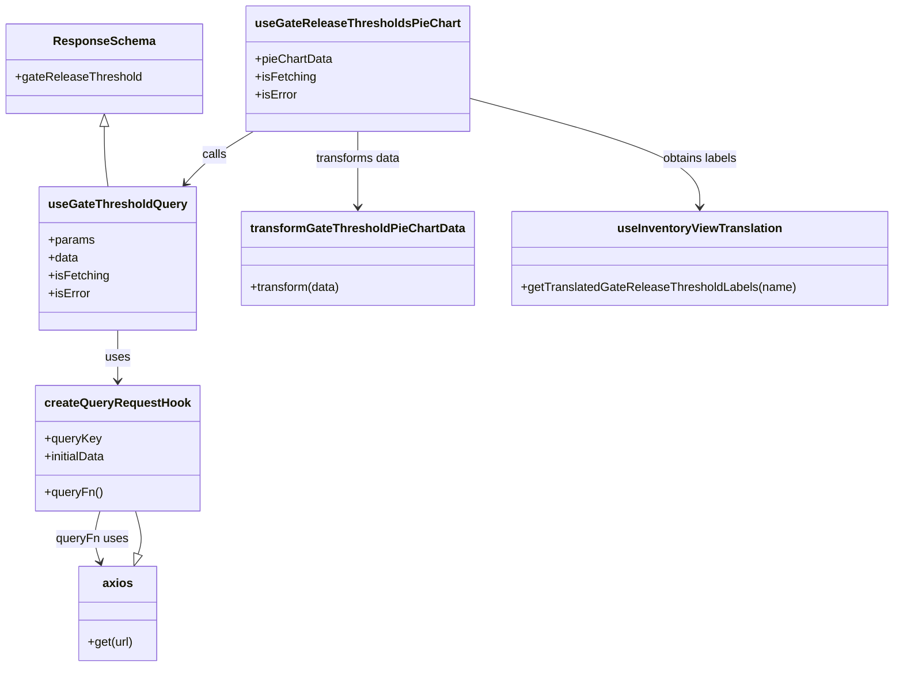

# Diagram: web/portal/src/pages/inventoryview/react-queries/GateReleaseThresholdHooks.ts


> Auto-generated by Obscura crawlers

## Diagram 1



### SVG

<svg id="container" width="1168.1640625" xmlns="http://www.w3.org/2000/svg" class="classDiagram" height="892" viewBox="0 0 1168.1640625 892" role="graphics-document document" aria-roledescription="class"><style>#container{font-family:"trebuchet ms",verdana,arial,sans-serif;font-size:16px;fill:#333;}@keyframes edge-animation-frame{from{stroke-dashoffset:0;}}@keyframes dash{to{stroke-dashoffset:0;}}#container .edge-animation-slow{stroke-dasharray:9,5!important;stroke-dashoffset:900;animation:dash 50s linear infinite;stroke-linecap:round;}#container .edge-animation-fast{stroke-dasharray:9,5!important;stroke-dashoffset:900;animation:dash 20s linear infinite;stroke-linecap:round;}#container .error-icon{fill:#552222;}#container .error-text{fill:#552222;stroke:#552222;}#container .edge-thickness-normal{stroke-width:1px;}#container .edge-thickness-thick{stroke-width:3.5px;}#container .edge-pattern-solid{stroke-dasharray:0;}#container .edge-thickness-invisible{stroke-width:0;fill:none;}#container .edge-pattern-dashed{stroke-dasharray:3;}#container .edge-pattern-dotted{stroke-dasharray:2;}#container .marker{fill:#333333;stroke:#333333;}#container .marker.cross{stroke:#333333;}#container svg{font-family:"trebuchet ms",verdana,arial,sans-serif;font-size:16px;}#container p{margin:0;}#container g.classGroup text{fill:#9370DB;stroke:none;font-family:"trebuchet ms",verdana,arial,sans-serif;font-size:10px;}#container g.classGroup text .title{font-weight:bolder;}#container .nodeLabel,#container .edgeLabel{color:#131300;}#container .edgeLabel .label rect{fill:#ECECFF;}#container .label text{fill:#131300;}#container .labelBkg{background:#ECECFF;}#container .edgeLabel .label span{background:#ECECFF;}#container .classTitle{font-weight:bolder;}#container .node rect,#container .node circle,#container .node ellipse,#container .node polygon,#container .node path{fill:#ECECFF;stroke:#9370DB;stroke-width:1px;}#container .divider{stroke:#9370DB;stroke-width:1;}#container g.clickable{cursor:pointer;}#container g.classGroup rect{fill:#ECECFF;stroke:#9370DB;}#container g.classGroup line{stroke:#9370DB;stroke-width:1;}#container .classLabel .box{stroke:none;stroke-width:0;fill:#ECECFF;opacity:0.5;}#container .classLabel .label{fill:#9370DB;font-size:10px;}#container .relation{stroke:#333333;stroke-width:1;fill:none;}#container .dashed-line{stroke-dasharray:3;}#container .dotted-line{stroke-dasharray:1 2;}#container #compositionStart,#container .composition{fill:#333333!important;stroke:#333333!important;stroke-width:1;}#container #compositionEnd,#container .composition{fill:#333333!important;stroke:#333333!important;stroke-width:1;}#container #dependencyStart,#container .dependency{fill:#333333!important;stroke:#333333!important;stroke-width:1;}#container #dependencyStart,#container .dependency{fill:#333333!important;stroke:#333333!important;stroke-width:1;}#container #extensionStart,#container .extension{fill:transparent!important;stroke:#333333!important;stroke-width:1;}#container #extensionEnd,#container .extension{fill:transparent!important;stroke:#333333!important;stroke-width:1;}#container #aggregationStart,#container .aggregation{fill:transparent!important;stroke:#333333!important;stroke-width:1;}#container #aggregationEnd,#container .aggregation{fill:transparent!important;stroke:#333333!important;stroke-width:1;}#container #lollipopStart,#container .lollipop{fill:#ECECFF!important;stroke:#333333!important;stroke-width:1;}#container #lollipopEnd,#container .lollipop{fill:#ECECFF!important;stroke:#333333!important;stroke-width:1;}#container .edgeTerminals{font-size:11px;line-height:initial;}#container .classTitleText{text-anchor:middle;font-size:18px;fill:#333;}#container .label-icon{display:inline-block;height:1em;overflow:visible;vertical-align:-0.125em;}#container .node .label-icon path{fill:currentColor;stroke:revert;stroke-width:revert;}#container :root{--mermaid-font-family:"trebuchet ms",verdana,arial,sans-serif;}</style><g><defs><marker id="container_class-aggregationStart" class="marker aggregation class" refX="18" refY="7" markerWidth="190" markerHeight="240" orient="auto"><path d="M 18,7 L9,13 L1,7 L9,1 Z"></path></marker></defs><defs><marker id="container_class-aggregationEnd" class="marker aggregation class" refX="1" refY="7" markerWidth="20" markerHeight="28" orient="auto"><path d="M 18,7 L9,13 L1,7 L9,1 Z"></path></marker></defs><defs><marker id="container_class-extensionStart" class="marker extension class" refX="18" refY="7" markerWidth="190" markerHeight="240" orient="auto"><path d="M 1,7 L18,13 V 1 Z"></path></marker></defs><defs><marker id="container_class-extensionEnd" class="marker extension class" refX="1" refY="7" markerWidth="20" markerHeight="28" orient="auto"><path d="M 1,1 V 13 L18,7 Z"></path></marker></defs><defs><marker id="container_class-compositionStart" class="marker composition class" refX="18" refY="7" markerWidth="190" markerHeight="240" orient="auto"><path d="M 18,7 L9,13 L1,7 L9,1 Z"></path></marker></defs><defs><marker id="container_class-compositionEnd" class="marker composition class" refX="1" refY="7" markerWidth="20" markerHeight="28" orient="auto"><path d="M 18,7 L9,13 L1,7 L9,1 Z"></path></marker></defs><defs><marker id="container_class-dependencyStart" class="marker dependency class" refX="6" refY="7" markerWidth="190" markerHeight="240" orient="auto"><path d="M 5,7 L9,13 L1,7 L9,1 Z"></path></marker></defs><defs><marker id="container_class-dependencyEnd" class="marker dependency class" refX="13" refY="7" markerWidth="20" markerHeight="28" orient="auto"><path d="M 18,7 L9,13 L14,7 L9,1 Z"></path></marker></defs><defs><marker id="container_class-lollipopStart" class="marker lollipop class" refX="13" refY="7" markerWidth="190" markerHeight="240" orient="auto"><circle stroke="black" fill="transparent" cx="7" cy="7" r="6"></circle></marker></defs><defs><marker id="container_class-lollipopEnd" class="marker lollipop class" refX="1" refY="7" markerWidth="190" markerHeight="240" orient="auto"><circle stroke="black" fill="transparent" cx="7" cy="7" r="6"></circle></marker></defs><g class="root"><g class="clusters"></g><g class="edgePaths"><path d="M327.019,176L316.966,182.167C306.912,188.333,286.806,200.667,272.172,212.237C257.539,223.808,248.379,234.615,243.799,240.019L239.219,245.423" id="id_useGateReleaseThresholdsPieChart_useGateThresholdQuery_1" class="edge-thickness-normal edge-pattern-solid relation" style=";;;" data-edge="true" data-et="edge" data-id="id_useGateReleaseThresholdsPieChart_useGateThresholdQuery_1" data-points="W3sieCI6MzI3LjAxODkxNzg3MTkwMDg0LCJ5IjoxNzZ9LHsieCI6MjY2LjY5OTIxODc1LCJ5IjoyMTN9LHsieCI6MjM1LjMzOTE5NzYwMzM4MzQ3LCJ5IjoyNTB9XQ==" marker-end="url(#container_class-dependencyEnd)"></path><path d="M153.973,442L153.973,448.167C153.973,454.333,153.973,466.667,153.973,478C153.973,489.333,153.973,499.667,153.973,504.833L153.973,510" id="id_useGateThresholdQuery_createQueryRequestHook_2" class="edge-thickness-normal edge-pattern-solid relation" style=";;;" data-edge="true" data-et="edge" data-id="id_useGateThresholdQuery_createQueryRequestHook_2" data-points="W3sieCI6MTUzLjk3MjY1NjI1LCJ5Ijo0NDJ9LHsieCI6MTUzLjk3MjY1NjI1LCJ5Ijo0Nzl9LHsieCI6MTUzLjk3MjY1NjI1LCJ5Ijo1MTZ9XQ==" marker-end="url(#container_class-dependencyEnd)"></path><path d="M130.448,684L128.721,690.167C126.994,696.333,123.54,708.667,123.582,720.053C123.623,731.439,127.161,741.878,128.93,747.098L130.698,752.317" id="id_createQueryRequestHook_axios_3" class="edge-thickness-normal edge-pattern-solid relation" style=";;;" data-edge="true" data-et="edge" data-id="id_createQueryRequestHook_axios_3" data-points="W3sieCI6MTMwLjQ0Nzk5MTk5MzgwMTY1LCJ5Ijo2ODR9LHsieCI6MTIwLjA4NTkzNzUsInkiOjcyMX0seyJ4IjoxMzIuNjI0MDIzNDM3NSwieSI6NzU4fV0=" marker-end="url(#container_class-dependencyEnd)"></path><path d="M463.961,176L463.961,182.167C463.961,188.333,463.961,200.667,463.961,217.5C463.961,234.333,463.961,255.667,463.961,266.333L463.961,277" id="id_useGateReleaseThresholdsPieChart_transformGateThresholdPieChartData_4" class="edge-thickness-normal edge-pattern-solid relation" style=";;;" data-edge="true" data-et="edge" data-id="id_useGateReleaseThresholdsPieChart_transformGateThresholdPieChartData_4" data-points="W3sieCI6NDYzLjk2MDkzNzUsInkiOjE3Nn0seyJ4Ijo0NjMuOTYwOTM3NSwieSI6MjEzfSx7IngiOjQ2My45NjA5Mzc1LCJ5IjoyODN9XQ==" marker-end="url(#container_class-dependencyEnd)"></path><path d="M605.977,130.349L656.989,144.124C708.001,157.899,810.026,185.45,861.038,209.892C912.051,234.333,912.051,255.667,912.051,266.333L912.051,277" id="id_useGateReleaseThresholdsPieChart_useInventoryViewTranslation_5" class="edge-thickness-normal edge-pattern-solid relation" style=";;;" data-edge="true" data-et="edge" data-id="id_useGateReleaseThresholdsPieChart_useInventoryViewTranslation_5" data-points="W3sieCI6NjA1Ljk3NjU2MjUsInkiOjEzMC4zNDkyMDgwMDk2OTM5NH0seyJ4Ijo5MTIuMDUwNzgxMjUsInkiOjIxM30seyJ4Ijo5MTIuMDUwNzgxMjUsInkiOjI4M31d" marker-end="url(#container_class-dependencyEnd)"></path><path d="M135.75,169.25L135.75,176.542C135.75,183.833,135.75,198.417,136.595,211.875C137.44,225.333,139.13,237.667,139.975,243.833L140.819,250" id="id_ResponseSchema_useGateThresholdQuery_6" class="edge-thickness-normal edge-pattern-solid relation" style=";;;" data-edge="true" data-et="edge" data-id="id_ResponseSchema_useGateThresholdQuery_6" data-points="W3sieCI6MTM1Ljc1LCJ5IjoxNTJ9LHsieCI6MTM1Ljc1LCJ5IjoyMTN9LHsieCI6MTQwLjgxOTQ2MDc2MTI3ODIsInkiOjI1MH1d" marker-start="url(#container_class-extensionStart)"></path><path d="M180.858,741.663L182.024,738.219C183.191,734.775,185.525,727.888,184.965,718.277C184.405,708.667,180.951,696.333,179.224,690.167L177.497,684" id="id_axios_createQueryRequestHook_7" class="edge-thickness-normal edge-pattern-solid relation" style=";;;" data-edge="true" data-et="edge" data-id="id_axios_createQueryRequestHook_7" data-points="W3sieCI6MTc1LjMyMTI4OTA2MjUsInkiOjc1OH0seyJ4IjoxODcuODU5Mzc1LCJ5Ijo3MjF9LHsieCI6MTc3LjQ5NzMyMDUwNjE5ODM1LCJ5Ijo2ODR9XQ==" marker-start="url(#container_class-extensionStart)"></path></g><g class="edgeLabels"><g class="edgeLabel" transform="translate(276.18717, 207.18011)"><g class="label" data-id="id_useGateReleaseThresholdsPieChart_useGateThresholdQuery_1" transform="translate(-16.4453125, -12)"><foreignObject width="32.890625" height="24"><div xmlns="http://www.w3.org/1999/xhtml" class="labelBkg" style="display: table-cell; white-space: nowrap; line-height: 1.5; max-width: 200px; text-align: center;"><span class="edgeLabel"><p>calls</p></span></div></foreignObject></g></g><g class="edgeLabel" transform="translate(153.97265625, 479)"><g class="label" data-id="id_useGateThresholdQuery_createQueryRequestHook_2" transform="translate(-16.4921875, -12)"><foreignObject width="32.984375" height="24"><div xmlns="http://www.w3.org/1999/xhtml" class="labelBkg" style="display: table-cell; white-space: nowrap; line-height: 1.5; max-width: 200px; text-align: center;"><span class="edgeLabel"><p>uses</p></span></div></foreignObject></g></g><g class="edgeLabel" transform="translate(120.18913, 721.30452)"><g class="label" data-id="id_createQueryRequestHook_axios_3" transform="translate(-47.7734375, -12)"><foreignObject width="95.546875" height="24"><div xmlns="http://www.w3.org/1999/xhtml" class="labelBkg" style="display: table-cell; white-space: nowrap; line-height: 1.5; max-width: 200px; text-align: center;"><span class="edgeLabel"><p>queryFn uses</p></span></div></foreignObject></g></g><g class="edgeLabel" transform="translate(463.9609375, 213)"><g class="label" data-id="id_useGateReleaseThresholdsPieChart_transformGateThresholdPieChartData_4" transform="translate(-57.8671875, -12)"><foreignObject width="115.734375" height="24"><div xmlns="http://www.w3.org/1999/xhtml" class="labelBkg" style="display: table-cell; white-space: nowrap; line-height: 1.5; max-width: 200px; text-align: center;"><span class="edgeLabel"><p>transforms data</p></span></div></foreignObject></g></g><g class="edgeLabel" transform="translate(912.05078125, 213)"><g class="label" data-id="id_useGateReleaseThresholdsPieChart_useInventoryViewTranslation_5" transform="translate(-51.2578125, -12)"><foreignObject width="102.515625" height="24"><div xmlns="http://www.w3.org/1999/xhtml" class="labelBkg" style="display: table-cell; white-space: nowrap; line-height: 1.5; max-width: 200px; text-align: center;"><span class="edgeLabel"><p>obtains labels</p></span></div></foreignObject></g></g><g class="edgeLabel"><g class="label" data-id="id_ResponseSchema_useGateThresholdQuery_6" transform="translate(0, 0)"><foreignObject width="0" height="0"><div xmlns="http://www.w3.org/1999/xhtml" class="labelBkg" style="display: table-cell; white-space: nowrap; line-height: 1.5; max-width: 200px; text-align: center;"><span class="edgeLabel"></span></div></foreignObject></g></g><g class="edgeLabel"><g class="label" data-id="id_axios_createQueryRequestHook_7" transform="translate(0, 0)"><foreignObject width="0" height="0"><div xmlns="http://www.w3.org/1999/xhtml" class="labelBkg" style="display: table-cell; white-space: nowrap; line-height: 1.5; max-width: 200px; text-align: center;"><span class="edgeLabel"></span></div></foreignObject></g></g></g><g class="nodes"><g class="node default" id="classId-useGateReleaseThresholdsPieChart-0" transform="translate(463.9609375, 92)"><g class="basic label-container"><path d="M-142.015625 -84 L142.015625 -84 L142.015625 84 L-142.015625 84" stroke="none" stroke-width="0" fill="#ECECFF" style=""></path><path d="M-142.015625 -84 C-67.901247419718 -84, 6.213130160563992 -84, 142.015625 -84 M-142.015625 -84 C-55.51282943573844 -84, 30.989966128523122 -84, 142.015625 -84 M142.015625 -84 C142.015625 -35.278632336428444, 142.015625 13.442735327143112, 142.015625 84 M142.015625 -84 C142.015625 -43.281958210221184, 142.015625 -2.563916420442368, 142.015625 84 M142.015625 84 C60.45938362140882 84, -21.096857757182363 84, -142.015625 84 M142.015625 84 C29.884253251794092 84, -82.24711849641182 84, -142.015625 84 M-142.015625 84 C-142.015625 22.76540521766787, -142.015625 -38.46918956466426, -142.015625 -84 M-142.015625 84 C-142.015625 41.31343756966902, -142.015625 -1.3731248606619602, -142.015625 -84" stroke="#9370DB" stroke-width="1.3" fill="none" stroke-dasharray="0 0" style=""></path></g><g class="annotation-group text" transform="translate(0, -60)"></g><g class="label-group text" transform="translate(-130.015625, -60)"><g class="label" style="font-weight: bolder" transform="translate(0,-12)"><foreignObject width="260.03125" height="24"><div xmlns="http://www.w3.org/1999/xhtml" style="display: table-cell; white-space: nowrap; line-height: 1.5; max-width: 306px; text-align: center;"><span class="nodeLabel markdown-node-label" style=""><p>useGateReleaseThresholdsPieChart</p></span></div></foreignObject></g></g><g class="members-group text" transform="translate(-130.015625, -12)"><g class="label" style="" transform="translate(0,-12)"><foreignObject width="102.78125" height="24"><div xmlns="http://www.w3.org/1999/xhtml" style="display: table-cell; white-space: nowrap; line-height: 1.5; max-width: 160px; text-align: center;"><span class="nodeLabel markdown-node-label" style=""><p>+pieChartData</p></span></div></foreignObject></g><g class="label" style="" transform="translate(0,12)"><foreignObject width="80.765625" height="24"><div xmlns="http://www.w3.org/1999/xhtml" style="display: table-cell; white-space: nowrap; line-height: 1.5; max-width: 139px; text-align: center;"><span class="nodeLabel markdown-node-label" style=""><p>+isFetching</p></span></div></foreignObject></g><g class="label" style="" transform="translate(0,36)"><foreignObject width="55.765625" height="24"><div xmlns="http://www.w3.org/1999/xhtml" style="display: table-cell; white-space: nowrap; line-height: 1.5; max-width: 114px; text-align: center;"><span class="nodeLabel markdown-node-label" style=""><p>+isError</p></span></div></foreignObject></g></g><g class="methods-group text" transform="translate(-130.015625, 84)"></g><g class="divider" style=""><path d="M-142.015625 -36 C-42.40441509698957 -36, 57.206794806020866 -36, 142.015625 -36 M-142.015625 -36 C-48.559155305297836 -36, 44.89731438940433 -36, 142.015625 -36" stroke="#9370DB" stroke-width="1.3" fill="none" stroke-dasharray="0 0" style=""></path></g><g class="divider" style=""><path d="M-142.015625 60 C-61.861471112148806 60, 18.29268277570239 60, 142.015625 60 M-142.015625 60 C-55.26808562546009 60, 31.479453749079823 60, 142.015625 60" stroke="#9370DB" stroke-width="1.3" fill="none" stroke-dasharray="0 0" style=""></path></g></g><g class="node default" id="classId-useGateThresholdQuery-1" transform="translate(153.97265625, 346)"><g class="basic label-container"><path d="M-100.234375 -96 L100.234375 -96 L100.234375 96 L-100.234375 96" stroke="none" stroke-width="0" fill="#ECECFF" style=""></path><path d="M-100.234375 -96 C-32.485773012013894 -96, 35.26282897597221 -96, 100.234375 -96 M-100.234375 -96 C-30.132478635895467 -96, 39.969417728209066 -96, 100.234375 -96 M100.234375 -96 C100.234375 -50.71534562671059, 100.234375 -5.430691253421173, 100.234375 96 M100.234375 -96 C100.234375 -55.208283053254064, 100.234375 -14.416566106508128, 100.234375 96 M100.234375 96 C55.39930771019866 96, 10.564240420397326 96, -100.234375 96 M100.234375 96 C22.66185181570708 96, -54.91067136858584 96, -100.234375 96 M-100.234375 96 C-100.234375 50.40606134345758, -100.234375 4.81212268691516, -100.234375 -96 M-100.234375 96 C-100.234375 24.804742655347127, -100.234375 -46.390514689305746, -100.234375 -96" stroke="#9370DB" stroke-width="1.3" fill="none" stroke-dasharray="0 0" style=""></path></g><g class="annotation-group text" transform="translate(0, -72)"></g><g class="label-group text" transform="translate(-88.234375, -72)"><g class="label" style="font-weight: bolder" transform="translate(0,-12)"><foreignObject width="176.46875" height="24"><div xmlns="http://www.w3.org/1999/xhtml" style="display: table-cell; white-space: nowrap; line-height: 1.5; max-width: 224px; text-align: center;"><span class="nodeLabel markdown-node-label" style=""><p>useGateThresholdQuery</p></span></div></foreignObject></g></g><g class="members-group text" transform="translate(-88.234375, -24)"><g class="label" style="" transform="translate(0,-12)"><foreignObject width="61.546875" height="24"><div xmlns="http://www.w3.org/1999/xhtml" style="display: table-cell; white-space: nowrap; line-height: 1.5; max-width: 119px; text-align: center;"><span class="nodeLabel markdown-node-label" style=""><p>+params</p></span></div></foreignObject></g><g class="label" style="" transform="translate(0,12)"><foreignObject width="40.625" height="24"><div xmlns="http://www.w3.org/1999/xhtml" style="display: table-cell; white-space: nowrap; line-height: 1.5; max-width: 98px; text-align: center;"><span class="nodeLabel markdown-node-label" style=""><p>+data</p></span></div></foreignObject></g><g class="label" style="" transform="translate(0,36)"><foreignObject width="80.765625" height="24"><div xmlns="http://www.w3.org/1999/xhtml" style="display: table-cell; white-space: nowrap; line-height: 1.5; max-width: 139px; text-align: center;"><span class="nodeLabel markdown-node-label" style=""><p>+isFetching</p></span></div></foreignObject></g><g class="label" style="" transform="translate(0,60)"><foreignObject width="55.765625" height="24"><div xmlns="http://www.w3.org/1999/xhtml" style="display: table-cell; white-space: nowrap; line-height: 1.5; max-width: 114px; text-align: center;"><span class="nodeLabel markdown-node-label" style=""><p>+isError</p></span></div></foreignObject></g></g><g class="methods-group text" transform="translate(-88.234375, 96)"></g><g class="divider" style=""><path d="M-100.234375 -48 C-59.641460954606046 -48, -19.048546909212092 -48, 100.234375 -48 M-100.234375 -48 C-44.25518809759717 -48, 11.72399880480566 -48, 100.234375 -48" stroke="#9370DB" stroke-width="1.3" fill="none" stroke-dasharray="0 0" style=""></path></g><g class="divider" style=""><path d="M-100.234375 72 C-41.207157242743435 72, 17.82006051451313 72, 100.234375 72 M-100.234375 72 C-32.91172986082944 72, 34.41091527834112 72, 100.234375 72" stroke="#9370DB" stroke-width="1.3" fill="none" stroke-dasharray="0 0" style=""></path></g></g><g class="node default" id="classId-createQueryRequestHook-2" transform="translate(153.97265625, 600)"><g class="basic label-container"><path d="M-105.8125 -84 L105.8125 -84 L105.8125 84 L-105.8125 84" stroke="none" stroke-width="0" fill="#ECECFF" style=""></path><path d="M-105.8125 -84 C-38.712409335963216 -84, 28.38768132807357 -84, 105.8125 -84 M-105.8125 -84 C-45.93082307153045 -84, 13.950853856939105 -84, 105.8125 -84 M105.8125 -84 C105.8125 -27.43254729949495, 105.8125 29.1349054010101, 105.8125 84 M105.8125 -84 C105.8125 -26.345616806632222, 105.8125 31.308766386735556, 105.8125 84 M105.8125 84 C60.18987184699294 84, 14.567243693985887 84, -105.8125 84 M105.8125 84 C47.908409990090654 84, -9.995680019818693 84, -105.8125 84 M-105.8125 84 C-105.8125 36.743950533900495, -105.8125 -10.51209893219901, -105.8125 -84 M-105.8125 84 C-105.8125 42.48114966099452, -105.8125 0.9622993219890361, -105.8125 -84" stroke="#9370DB" stroke-width="1.3" fill="none" stroke-dasharray="0 0" style=""></path></g><g class="annotation-group text" transform="translate(0, -60)"></g><g class="label-group text" transform="translate(-93.8125, -60)"><g class="label" style="font-weight: bolder" transform="translate(0,-12)"><foreignObject width="187.625" height="24"><div xmlns="http://www.w3.org/1999/xhtml" style="display: table-cell; white-space: nowrap; line-height: 1.5; max-width: 236px; text-align: center;"><span class="nodeLabel markdown-node-label" style=""><p>createQueryRequestHook</p></span></div></foreignObject></g></g><g class="members-group text" transform="translate(-93.8125, -12)"><g class="label" style="" transform="translate(0,-12)"><foreignObject width="75.375" height="24"><div xmlns="http://www.w3.org/1999/xhtml" style="display: table-cell; white-space: nowrap; line-height: 1.5; max-width: 133px; text-align: center;"><span class="nodeLabel markdown-node-label" style=""><p>+queryKey</p></span></div></foreignObject></g><g class="label" style="" transform="translate(0,12)"><foreignObject width="83.125" height="24"><div xmlns="http://www.w3.org/1999/xhtml" style="display: table-cell; white-space: nowrap; line-height: 1.5; max-width: 140px; text-align: center;"><span class="nodeLabel markdown-node-label" style=""><p>+initialData</p></span></div></foreignObject></g></g><g class="methods-group text" transform="translate(-93.8125, 60)"><g class="label" style="" transform="translate(0,-12)"><foreignObject width="76.6875" height="24"><div xmlns="http://www.w3.org/1999/xhtml" style="display: table-cell; white-space: nowrap; line-height: 1.5; max-width: 134px; text-align: center;"><span class="nodeLabel markdown-node-label" style=""><p>+queryFn()</p></span></div></foreignObject></g></g><g class="divider" style=""><path d="M-105.8125 -36 C-49.901426828751674 -36, 6.0096463424966515 -36, 105.8125 -36 M-105.8125 -36 C-21.942362844524197 -36, 61.927774310951605 -36, 105.8125 -36" stroke="#9370DB" stroke-width="1.3" fill="none" stroke-dasharray="0 0" style=""></path></g><g class="divider" style=""><path d="M-105.8125 36 C-31.319504194669037 36, 43.17349161066193 36, 105.8125 36 M-105.8125 36 C-56.6942119988322 36, -7.575923997664404 36, 105.8125 36" stroke="#9370DB" stroke-width="1.3" fill="none" stroke-dasharray="0 0" style=""></path></g></g><g class="node default" id="classId-transformGateThresholdPieChartData-3" transform="translate(463.9609375, 346)"><g class="basic label-container"><path d="M-149.9765625 -63 L149.9765625 -63 L149.9765625 63 L-149.9765625 63" stroke="none" stroke-width="0" fill="#ECECFF" style=""></path><path d="M-149.9765625 -63 C-77.8145859141799 -63, -5.652609328359802 -63, 149.9765625 -63 M-149.9765625 -63 C-60.973404016318156 -63, 28.029754467363688 -63, 149.9765625 -63 M149.9765625 -63 C149.9765625 -20.74843675257683, 149.9765625 21.50312649484634, 149.9765625 63 M149.9765625 -63 C149.9765625 -19.776125567206726, 149.9765625 23.447748865586547, 149.9765625 63 M149.9765625 63 C35.29484269923648 63, -79.38687710152703 63, -149.9765625 63 M149.9765625 63 C43.20145555979863 63, -63.57365138040274 63, -149.9765625 63 M-149.9765625 63 C-149.9765625 30.107543887825898, -149.9765625 -2.7849122243482043, -149.9765625 -63 M-149.9765625 63 C-149.9765625 13.419653900578929, -149.9765625 -36.16069219884214, -149.9765625 -63" stroke="#9370DB" stroke-width="1.3" fill="none" stroke-dasharray="0 0" style=""></path></g><g class="annotation-group text" transform="translate(0, -39)"></g><g class="label-group text" transform="translate(-137.9765625, -39)"><g class="label" style="font-weight: bolder" transform="translate(0,-12)"><foreignObject width="275.953125" height="24"><div xmlns="http://www.w3.org/1999/xhtml" style="display: table-cell; white-space: nowrap; line-height: 1.5; max-width: 321px; text-align: center;"><span class="nodeLabel markdown-node-label" style=""><p>transformGateThresholdPieChartData</p></span></div></foreignObject></g></g><g class="members-group text" transform="translate(-137.9765625, 9)"></g><g class="methods-group text" transform="translate(-137.9765625, 39)"><g class="label" style="" transform="translate(0,-12)"><foreignObject width="122.296875" height="24"><div xmlns="http://www.w3.org/1999/xhtml" style="display: table-cell; white-space: nowrap; line-height: 1.5; max-width: 180px; text-align: center;"><span class="nodeLabel markdown-node-label" style=""><p>+transform(data)</p></span></div></foreignObject></g></g><g class="divider" style=""><path d="M-149.9765625 -15 C-43.44427630211986 -15, 63.08800989576028 -15, 149.9765625 -15 M-149.9765625 -15 C-68.64871088612523 -15, 12.679140727749541 -15, 149.9765625 -15" stroke="#9370DB" stroke-width="1.3" fill="none" stroke-dasharray="0 0" style=""></path></g><g class="divider" style=""><path d="M-149.9765625 9 C-43.427929230434174 9, 63.12070403913165 9, 149.9765625 9 M-149.9765625 9 C-74.46721469472803 9, 1.0421331105439435 9, 149.9765625 9" stroke="#9370DB" stroke-width="1.3" fill="none" stroke-dasharray="0 0" style=""></path></g></g><g class="node default" id="classId-useInventoryViewTranslation-4" transform="translate(912.05078125, 346)"><g class="basic label-container"><path d="M-248.11328125 -63 L248.11328125 -63 L248.11328125 63 L-248.11328125 63" stroke="none" stroke-width="0" fill="#ECECFF" style=""></path><path d="M-248.11328125 -63 C-138.48823802968002 -63, -28.863194809360067 -63, 248.11328125 -63 M-248.11328125 -63 C-119.64490877900693 -63, 8.823463691986149 -63, 248.11328125 -63 M248.11328125 -63 C248.11328125 -33.23410059659349, 248.11328125 -3.468201193186978, 248.11328125 63 M248.11328125 -63 C248.11328125 -29.903590908053772, 248.11328125 3.192818183892456, 248.11328125 63 M248.11328125 63 C112.91072406051197 63, -22.291833128976066 63, -248.11328125 63 M248.11328125 63 C63.786999444254946 63, -120.53928236149011 63, -248.11328125 63 M-248.11328125 63 C-248.11328125 26.25733271365312, -248.11328125 -10.485334572693759, -248.11328125 -63 M-248.11328125 63 C-248.11328125 21.802777833743285, -248.11328125 -19.39444433251343, -248.11328125 -63" stroke="#9370DB" stroke-width="1.3" fill="none" stroke-dasharray="0 0" style=""></path></g><g class="annotation-group text" transform="translate(0, -39)"></g><g class="label-group text" transform="translate(-106.2578125, -39)"><g class="label" style="font-weight: bolder" transform="translate(0,-12)"><foreignObject width="212.515625" height="24"><div xmlns="http://www.w3.org/1999/xhtml" style="display: table-cell; white-space: nowrap; line-height: 1.5; max-width: 259px; text-align: center;"><span class="nodeLabel markdown-node-label" style=""><p>useInventoryViewTranslation</p></span></div></foreignObject></g></g><g class="members-group text" transform="translate(-236.11328125, 9)"></g><g class="methods-group text" transform="translate(-236.11328125, 39)"><g class="label" style="" transform="translate(0,-12)"><foreignObject width="365.96875" height="24"><div xmlns="http://www.w3.org/1999/xhtml" style="display: table-cell; white-space: nowrap; line-height: 1.5; max-width: 423px; text-align: center;"><span class="nodeLabel markdown-node-label" style=""><p>+getTranslatedGateReleaseThresholdLabels(name)</p></span></div></foreignObject></g></g><g class="divider" style=""><path d="M-248.11328125 -15 C-115.62215468930242 -15, 16.86897187139516 -15, 248.11328125 -15 M-248.11328125 -15 C-143.65716197754983 -15, -39.20104270509964 -15, 248.11328125 -15" stroke="#9370DB" stroke-width="1.3" fill="none" stroke-dasharray="0 0" style=""></path></g><g class="divider" style=""><path d="M-248.11328125 9 C-81.50897894570198 9, 85.09532335859603 9, 248.11328125 9 M-248.11328125 9 C-125.30844358359727 9, -2.503605917194534 9, 248.11328125 9" stroke="#9370DB" stroke-width="1.3" fill="none" stroke-dasharray="0 0" style=""></path></g></g><g class="node default" id="classId-axios-5" transform="translate(153.97265625, 821)"><g class="basic label-container"><path d="M-52.18359375 -63 L52.18359375 -63 L52.18359375 63 L-52.18359375 63" stroke="none" stroke-width="0" fill="#ECECFF" style=""></path><path d="M-52.18359375 -63 C-31.023253805147373 -63, -9.862913860294746 -63, 52.18359375 -63 M-52.18359375 -63 C-21.107391598091557 -63, 9.968810553816887 -63, 52.18359375 -63 M52.18359375 -63 C52.18359375 -15.807594308262736, 52.18359375 31.384811383474528, 52.18359375 63 M52.18359375 -63 C52.18359375 -15.35229289617552, 52.18359375 32.29541420764896, 52.18359375 63 M52.18359375 63 C26.072363721301826 63, -0.03886630739634711 63, -52.18359375 63 M52.18359375 63 C11.523367165013752 63, -29.136859419972495 63, -52.18359375 63 M-52.18359375 63 C-52.18359375 25.314566184650396, -52.18359375 -12.370867630699209, -52.18359375 -63 M-52.18359375 63 C-52.18359375 21.500690286657715, -52.18359375 -19.99861942668457, -52.18359375 -63" stroke="#9370DB" stroke-width="1.3" fill="none" stroke-dasharray="0 0" style=""></path></g><g class="annotation-group text" transform="translate(0, -39)"></g><g class="label-group text" transform="translate(-19.2734375, -39)"><g class="label" style="font-weight: bolder" transform="translate(0,-12)"><foreignObject width="38.546875" height="24"><div xmlns="http://www.w3.org/1999/xhtml" style="display: table-cell; white-space: nowrap; line-height: 1.5; max-width: 88px; text-align: center;"><span class="nodeLabel markdown-node-label" style=""><p>axios</p></span></div></foreignObject></g></g><g class="members-group text" transform="translate(-40.18359375, 9)"></g><g class="methods-group text" transform="translate(-40.18359375, 39)"><g class="label" style="" transform="translate(0,-12)"><foreignObject width="61.09375" height="24"><div xmlns="http://www.w3.org/1999/xhtml" style="display: table-cell; white-space: nowrap; line-height: 1.5; max-width: 118px; text-align: center;"><span class="nodeLabel markdown-node-label" style=""><p>+get(url)</p></span></div></foreignObject></g></g><g class="divider" style=""><path d="M-52.18359375 -15 C-26.866177468811507 -15, -1.5487611876230147 -15, 52.18359375 -15 M-52.18359375 -15 C-18.005460232546135 -15, 16.17267328490773 -15, 52.18359375 -15" stroke="#9370DB" stroke-width="1.3" fill="none" stroke-dasharray="0 0" style=""></path></g><g class="divider" style=""><path d="M-52.18359375 9 C-19.622638765967544 9, 12.938316218064912 9, 52.18359375 9 M-52.18359375 9 C-24.043197443764072 9, 4.097198862471856 9, 52.18359375 9" stroke="#9370DB" stroke-width="1.3" fill="none" stroke-dasharray="0 0" style=""></path></g></g><g class="node default" id="classId-ResponseSchema-6" transform="translate(135.75, 92)"><g class="basic label-container"><path d="M-127.75 -60 L127.75 -60 L127.75 60 L-127.75 60" stroke="none" stroke-width="0" fill="#ECECFF" style=""></path><path d="M-127.75 -60 C-38.7678507906254 -60, 50.214298418749195 -60, 127.75 -60 M-127.75 -60 C-71.98918197682815 -60, -16.228363953656284 -60, 127.75 -60 M127.75 -60 C127.75 -35.472512114098485, 127.75 -10.94502422819697, 127.75 60 M127.75 -60 C127.75 -18.374316286216953, 127.75 23.251367427566095, 127.75 60 M127.75 60 C48.481104876603766 60, -30.78779024679247 60, -127.75 60 M127.75 60 C48.248551605034564 60, -31.252896789930873 60, -127.75 60 M-127.75 60 C-127.75 24.15716105051326, -127.75 -11.68567789897348, -127.75 -60 M-127.75 60 C-127.75 22.512111539343188, -127.75 -14.975776921313624, -127.75 -60" stroke="#9370DB" stroke-width="1.3" fill="none" stroke-dasharray="0 0" style=""></path></g><g class="annotation-group text" transform="translate(0, -36)"></g><g class="label-group text" transform="translate(-64.03125, -36)"><g class="label" style="font-weight: bolder" transform="translate(0,-12)"><foreignObject width="128.0625" height="24"><div xmlns="http://www.w3.org/1999/xhtml" style="display: table-cell; white-space: nowrap; line-height: 1.5; max-width: 177px; text-align: center;"><span class="nodeLabel markdown-node-label" style=""><p>ResponseSchema</p></span></div></foreignObject></g></g><g class="members-group text" transform="translate(-115.75, 12)"><g class="label" style="" transform="translate(0,-12)"><foreignObject width="167.46875" height="24"><div xmlns="http://www.w3.org/1999/xhtml" style="display: table-cell; white-space: nowrap; line-height: 1.5; max-width: 225px; text-align: center;"><span class="nodeLabel markdown-node-label" style=""><p>+gateReleaseThreshold</p></span></div></foreignObject></g></g><g class="methods-group text" transform="translate(-115.75, 60)"></g><g class="divider" style=""><path d="M-127.75 -12 C-28.204495425041728 -12, 71.34100914991654 -12, 127.75 -12 M-127.75 -12 C-70.2416376220821 -12, -12.733275244164204 -12, 127.75 -12" stroke="#9370DB" stroke-width="1.3" fill="none" stroke-dasharray="0 0" style=""></path></g><g class="divider" style=""><path d="M-127.75 36 C-75.2363032675494 36, -22.722606535098805 36, 127.75 36 M-127.75 36 C-52.50049598937203 36, 22.749008021255946 36, 127.75 36" stroke="#9370DB" stroke-width="1.3" fill="none" stroke-dasharray="0 0" style=""></path></g></g></g></g></g></svg>

## Diagram 2

```mermaid
flowchart LR
    Params[params:string] --> QHook[useGateThresholdQuery(params)]
    QHook --> BuildURL[customerApiUrl("/entity-inventory/.../gate-release-threshold")]
    BuildURL --> AxiosGet[axios.get(url)]
    AxiosGet --> Response[response.data]
    Response --> Transform[transformGateThresholdPieChartData(data)]
    Transform --> Translated[map items -> { name: getTranslatedGateReleaseThresholdLabels(item.name), value: item.name }]
    useInventory[getTranslatedGateReleaseThresholdLabels] --> Translated
    Translated --> Result{Return}
    Result --> PieChart[pieChartData, isFetching, isError]
```

> SVG rendering failed for this diagram.
