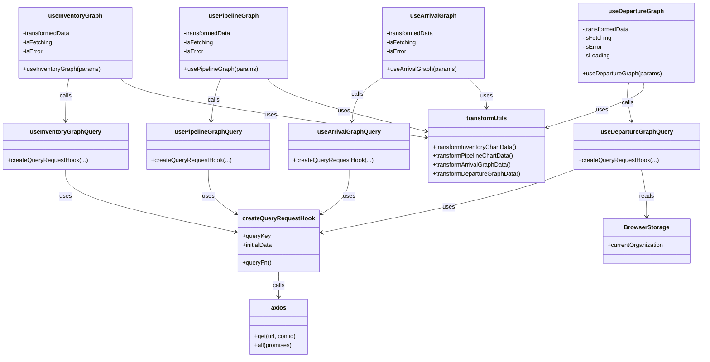

# Diagram: web/portal/src/pages/inventoryview/react-queries/InventoryViewHooks.ts


> Auto-generated by Obscura crawlers

## Diagram 1



### SVG

<svg id="container" width="1866.9921875" xmlns="http://www.w3.org/2000/svg" class="classDiagram" height="970" viewBox="0 0 1866.9921875 970" role="graphics-document document" aria-roledescription="class"><style>#container{font-family:"trebuchet ms",verdana,arial,sans-serif;font-size:16px;fill:#333;}@keyframes edge-animation-frame{from{stroke-dashoffset:0;}}@keyframes dash{to{stroke-dashoffset:0;}}#container .edge-animation-slow{stroke-dasharray:9,5!important;stroke-dashoffset:900;animation:dash 50s linear infinite;stroke-linecap:round;}#container .edge-animation-fast{stroke-dasharray:9,5!important;stroke-dashoffset:900;animation:dash 20s linear infinite;stroke-linecap:round;}#container .error-icon{fill:#552222;}#container .error-text{fill:#552222;stroke:#552222;}#container .edge-thickness-normal{stroke-width:1px;}#container .edge-thickness-thick{stroke-width:3.5px;}#container .edge-pattern-solid{stroke-dasharray:0;}#container .edge-thickness-invisible{stroke-width:0;fill:none;}#container .edge-pattern-dashed{stroke-dasharray:3;}#container .edge-pattern-dotted{stroke-dasharray:2;}#container .marker{fill:#333333;stroke:#333333;}#container .marker.cross{stroke:#333333;}#container svg{font-family:"trebuchet ms",verdana,arial,sans-serif;font-size:16px;}#container p{margin:0;}#container g.classGroup text{fill:#9370DB;stroke:none;font-family:"trebuchet ms",verdana,arial,sans-serif;font-size:10px;}#container g.classGroup text .title{font-weight:bolder;}#container .nodeLabel,#container .edgeLabel{color:#131300;}#container .edgeLabel .label rect{fill:#ECECFF;}#container .label text{fill:#131300;}#container .labelBkg{background:#ECECFF;}#container .edgeLabel .label span{background:#ECECFF;}#container .classTitle{font-weight:bolder;}#container .node rect,#container .node circle,#container .node ellipse,#container .node polygon,#container .node path{fill:#ECECFF;stroke:#9370DB;stroke-width:1px;}#container .divider{stroke:#9370DB;stroke-width:1;}#container g.clickable{cursor:pointer;}#container g.classGroup rect{fill:#ECECFF;stroke:#9370DB;}#container g.classGroup line{stroke:#9370DB;stroke-width:1;}#container .classLabel .box{stroke:none;stroke-width:0;fill:#ECECFF;opacity:0.5;}#container .classLabel .label{fill:#9370DB;font-size:10px;}#container .relation{stroke:#333333;stroke-width:1;fill:none;}#container .dashed-line{stroke-dasharray:3;}#container .dotted-line{stroke-dasharray:1 2;}#container #compositionStart,#container .composition{fill:#333333!important;stroke:#333333!important;stroke-width:1;}#container #compositionEnd,#container .composition{fill:#333333!important;stroke:#333333!important;stroke-width:1;}#container #dependencyStart,#container .dependency{fill:#333333!important;stroke:#333333!important;stroke-width:1;}#container #dependencyStart,#container .dependency{fill:#333333!important;stroke:#333333!important;stroke-width:1;}#container #extensionStart,#container .extension{fill:transparent!important;stroke:#333333!important;stroke-width:1;}#container #extensionEnd,#container .extension{fill:transparent!important;stroke:#333333!important;stroke-width:1;}#container #aggregationStart,#container .aggregation{fill:transparent!important;stroke:#333333!important;stroke-width:1;}#container #aggregationEnd,#container .aggregation{fill:transparent!important;stroke:#333333!important;stroke-width:1;}#container #lollipopStart,#container .lollipop{fill:#ECECFF!important;stroke:#333333!important;stroke-width:1;}#container #lollipopEnd,#container .lollipop{fill:#ECECFF!important;stroke:#333333!important;stroke-width:1;}#container .edgeTerminals{font-size:11px;line-height:initial;}#container .classTitleText{text-anchor:middle;font-size:18px;fill:#333;}#container .label-icon{display:inline-block;height:1em;overflow:visible;vertical-align:-0.125em;}#container .node .label-icon path{fill:currentColor;stroke:revert;stroke-width:revert;}#container :root{--mermaid-font-family:"trebuchet ms",verdana,arial,sans-serif;}</style><g><defs><marker id="container_class-aggregationStart" class="marker aggregation class" refX="18" refY="7" markerWidth="190" markerHeight="240" orient="auto"><path d="M 18,7 L9,13 L1,7 L9,1 Z"></path></marker></defs><defs><marker id="container_class-aggregationEnd" class="marker aggregation class" refX="1" refY="7" markerWidth="20" markerHeight="28" orient="auto"><path d="M 18,7 L9,13 L1,7 L9,1 Z"></path></marker></defs><defs><marker id="container_class-extensionStart" class="marker extension class" refX="18" refY="7" markerWidth="190" markerHeight="240" orient="auto"><path d="M 1,7 L18,13 V 1 Z"></path></marker></defs><defs><marker id="container_class-extensionEnd" class="marker extension class" refX="1" refY="7" markerWidth="20" markerHeight="28" orient="auto"><path d="M 1,1 V 13 L18,7 Z"></path></marker></defs><defs><marker id="container_class-compositionStart" class="marker composition class" refX="18" refY="7" markerWidth="190" markerHeight="240" orient="auto"><path d="M 18,7 L9,13 L1,7 L9,1 Z"></path></marker></defs><defs><marker id="container_class-compositionEnd" class="marker composition class" refX="1" refY="7" markerWidth="20" markerHeight="28" orient="auto"><path d="M 18,7 L9,13 L1,7 L9,1 Z"></path></marker></defs><defs><marker id="container_class-dependencyStart" class="marker dependency class" refX="6" refY="7" markerWidth="190" markerHeight="240" orient="auto"><path d="M 5,7 L9,13 L1,7 L9,1 Z"></path></marker></defs><defs><marker id="container_class-dependencyEnd" class="marker dependency class" refX="13" refY="7" markerWidth="20" markerHeight="28" orient="auto"><path d="M 18,7 L9,13 L14,7 L9,1 Z"></path></marker></defs><defs><marker id="container_class-lollipopStart" class="marker lollipop class" refX="13" refY="7" markerWidth="190" markerHeight="240" orient="auto"><circle stroke="black" fill="transparent" cx="7" cy="7" r="6"></circle></marker></defs><defs><marker id="container_class-lollipopEnd" class="marker lollipop class" refX="1" refY="7" markerWidth="190" markerHeight="240" orient="auto"><circle stroke="black" fill="transparent" cx="7" cy="7" r="6"></circle></marker></defs><g class="root"><g class="clusters"></g><g class="edgePaths"><path d="M182.034,212L180.544,220.167C179.053,228.333,176.071,244.667,174.581,264C173.09,283.333,173.09,305.667,173.09,316.833L173.09,328" id="id_useInventoryGraph_useInventoryGraphQuery_1" class="edge-thickness-normal edge-pattern-solid relation" style=";;;" data-edge="true" data-et="edge" data-id="id_useInventoryGraph_useInventoryGraphQuery_1" data-points="W3sieCI6MTgyLjAzNDQ1NTgxODk2NTUsInkiOjIxMn0seyJ4IjoxNzMuMDg5ODQzNzUsInkiOjI2MX0seyJ4IjoxNzMuMDg5ODQzNzUsInkiOjMzNH1d" marker-end="url(#container_class-dependencyEnd)"></path><path d="M173.09,460L173.09,472.167C173.09,484.333,173.09,508.667,248.435,537.005C323.781,565.343,474.472,597.687,549.817,613.858L625.163,630.03" id="id_useInventoryGraphQuery_createQueryRequestHook_2" class="edge-thickness-normal edge-pattern-solid relation" style=";;;" data-edge="true" data-et="edge" data-id="id_useInventoryGraphQuery_createQueryRequestHook_2" data-points="W3sieCI6MTczLjA4OTg0Mzc1LCJ5Ijo0NjB9LHsieCI6MTczLjA4OTg0Mzc1LCJ5Ijo1MzN9LHsieCI6NjMxLjAyOTI5Njg3NSwieSI6NjMxLjI4OTEwMzA3MjY3NTF9XQ==" marker-end="url(#container_class-dependencyEnd)"></path><path d="M584.36,212L581.378,220.167C578.397,228.333,572.434,244.667,568.161,264.007C563.888,283.347,561.304,305.693,560.013,316.866L558.721,328.04" id="id_usePipelineGraph_usePipelineGraphQuery_3" class="edge-thickness-normal edge-pattern-solid relation" style=";;;" data-edge="true" data-et="edge" data-id="id_usePipelineGraph_usePipelineGraphQuery_3" data-points="W3sieCI6NTg0LjM1OTkyNzI2MjkzMSwieSI6MjEyfSx7IngiOjU2Ni40NzA3MDMxMjUsInkiOjI2MX0seyJ4Ijo1NTguMDMyMzg0NTM1ODQ1NiwieSI6MzM0fV0=" marker-end="url(#container_class-dependencyEnd)"></path><path d="M550.75,460L550.75,472.167C550.75,484.333,550.75,508.667,563.292,528.988C575.833,549.309,600.916,565.619,613.458,573.774L625.999,581.928" id="id_usePipelineGraphQuery_createQueryRequestHook_4" class="edge-thickness-normal edge-pattern-solid relation" style=";;;" data-edge="true" data-et="edge" data-id="id_usePipelineGraphQuery_createQueryRequestHook_4" data-points="W3sieCI6NTUwLjc1LCJ5Ijo0NjB9LHsieCI6NTUwLjc1LCJ5Ijo1MzN9LHsieCI6NjMxLjAyOTI5Njg3NSwieSI6NTg1LjE5ODk0MjA1NDM4Nzd9XQ==" marker-end="url(#container_class-dependencyEnd)"></path><path d="M1013.771,209.202L1001.252,217.835C988.732,226.468,963.693,243.734,949.882,263.54C936.071,283.347,933.488,305.693,932.197,316.866L930.905,328.04" id="id_useArrivalGraph_useArrivalGraphQuery_5" class="edge-thickness-normal edge-pattern-solid relation" style=";;;" data-edge="true" data-et="edge" data-id="id_useArrivalGraph_useArrivalGraphQuery_5" data-points="W3sieCI6MTAxMy43NzE0ODQzNzUsInkiOjIwOS4yMDE3Nzk2NDM2OTk3Mn0seyJ4Ijo5MzguNjU0Mjk2ODc1LCJ5IjoyNjF9LHsieCI6OTMwLjIxNTk3ODI4NTg0NTYsInkiOjMzNH1d" marker-end="url(#container_class-dependencyEnd)"></path><path d="M922.934,460L922.934,472.167C922.934,484.333,922.934,508.667,910.392,528.988C897.851,549.309,872.768,565.619,860.226,573.774L847.684,581.928" id="id_useArrivalGraphQuery_createQueryRequestHook_6" class="edge-thickness-normal edge-pattern-solid relation" style=";;;" data-edge="true" data-et="edge" data-id="id_useArrivalGraphQuery_createQueryRequestHook_6" data-points="W3sieCI6OTIyLjkzMzU5Mzc1LCJ5Ijo0NjB9LHsieCI6OTIyLjkzMzU5Mzc1LCJ5Ijo1MzN9LHsieCI6ODQyLjY1NDI5Njg3NSwieSI6NTg1LjE5ODk0MjA1NDM4Nzd9XQ==" marker-end="url(#container_class-dependencyEnd)"></path><path d="M1671.403,224L1670.277,230.167C1669.151,236.333,1666.9,248.667,1668.098,266.021C1669.296,283.375,1673.944,305.75,1676.268,316.938L1678.592,328.125" id="id_useDepartureGraph_useDepartureGraphQuery_7" class="edge-thickness-normal edge-pattern-solid relation" style=";;;" data-edge="true" data-et="edge" data-id="id_useDepartureGraph_useDepartureGraphQuery_7" data-points="W3sieCI6MTY3MS40MDI1MzIzMjc1ODYyLCJ5IjoyMjR9LHsieCI6MTY2NC42NDg0Mzc1LCJ5IjoyNjF9LHsieCI6MTY3OS44MTIwNDA0NDExNzY2LCJ5IjozMzR9XQ==" marker-end="url(#container_class-dependencyEnd)"></path><path d="M1526.805,459.978L1494.708,472.148C1462.611,484.319,1398.417,508.659,1285.372,537.226C1172.327,565.792,1010.431,598.584,929.483,614.98L848.535,631.376" id="id_useDepartureGraphQuery_createQueryRequestHook_8" class="edge-thickness-normal edge-pattern-solid relation" style=";;;" data-edge="true" data-et="edge" data-id="id_useDepartureGraphQuery_createQueryRequestHook_8" data-points="W3sieCI6MTUyNi44MDQ2ODc1LCJ5Ijo0NTkuOTc4MTg1ODE4MDU5MDV9LHsieCI6MTMzNC4yMjI2NTYyNSwieSI6NTMzfSx7IngiOjg0Mi42NTQyOTY4NzUsInkiOjYzMi41Njc1ODgzMzMxODYyfV0=" marker-end="url(#container_class-dependencyEnd)"></path><path d="M736.842,738L736.842,744.167C736.842,750.333,736.842,762.667,736.842,774C736.842,785.333,736.842,795.667,736.842,800.833L736.842,806" id="id_createQueryRequestHook_axios_9" class="edge-thickness-normal edge-pattern-solid relation" style=";;;" data-edge="true" data-et="edge" data-id="id_createQueryRequestHook_axios_9" data-points="W3sieCI6NzM2Ljg0MTc5Njg3NSwieSI6NzM4fSx7IngiOjczNi44NDE3OTY4NzUsInkiOjc3NX0seyJ4Ijo3MzYuODQxNzk2ODc1LCJ5Ijo4MTJ9XQ==" marker-end="url(#container_class-dependencyEnd)"></path><path d="M316.282,212L326.211,220.167C336.141,228.333,356,244.667,491.055,271.437C626.11,298.208,876.361,335.417,1001.487,354.021L1126.612,372.625" id="id_useInventoryGraph_transformUtils_10" class="edge-thickness-normal edge-pattern-solid relation" style=";;;" data-edge="true" data-et="edge" data-id="id_useInventoryGraph_transformUtils_10" data-points="W3sieCI6MzE2LjI4MTg2OTYxMjA2ODkzLCJ5IjoyMTJ9LHsieCI6Mzc1Ljg1OTM3NSwieSI6MjYxfSx7IngiOjExMzIuNTQ2ODc1LCJ5IjozNzMuNTA3MzQzMjM4MTk5NH1d" marker-end="url(#container_class-dependencyEnd)"></path><path d="M706.386,212L713.785,220.167C721.185,228.333,735.983,244.667,806.04,268.621C876.097,292.574,1001.413,324.149,1064.071,339.936L1126.729,355.723" id="id_usePipelineGraph_transformUtils_11" class="edge-thickness-normal edge-pattern-solid relation" style=";;;" data-edge="true" data-et="edge" data-id="id_usePipelineGraph_transformUtils_11" data-points="W3sieCI6NzA2LjM4NjIyMDM2NjM3OTMsInkiOjIxMn0seyJ4Ijo3NTAuNzgxMjUsInkiOjI2MX0seyJ4IjoxMTMyLjU0Njg3NSwieSI6MzU3LjE4OTQzMjcwMDU4ODN9XQ==" marker-end="url(#container_class-dependencyEnd)"></path><path d="M1242.693,212L1250.67,220.167C1258.646,228.333,1274.598,244.667,1282.575,258C1290.551,271.333,1290.551,281.667,1290.551,286.833L1290.551,292" id="id_useArrivalGraph_transformUtils_12" class="edge-thickness-normal edge-pattern-solid relation" style=";;;" data-edge="true" data-et="edge" data-id="id_useArrivalGraph_transformUtils_12" data-points="W3sieCI6MTI0Mi42OTMyNzg1NTYwMzQ2LCJ5IjoyMTJ9LHsieCI6MTI5MC41NTA3ODEyNSwieSI6MjYxfSx7IngiOjEyOTAuNTUwNzgxMjUsInkiOjI5OH1d" marker-end="url(#container_class-dependencyEnd)"></path><path d="M1710.832,224L1711.958,230.167C1713.083,236.333,1715.335,248.667,1672.575,268.81C1629.815,288.953,1542.043,316.906,1498.157,330.882L1454.272,344.859" id="id_useDepartureGraph_transformUtils_13" class="edge-thickness-normal edge-pattern-solid relation" style=";;;" data-edge="true" data-et="edge" data-id="id_useDepartureGraph_transformUtils_13" data-points="W3sieCI6MTcxMC44MzE4NDI2NzI0MTM4LCJ5IjoyMjR9LHsieCI6MTcxNy41ODU5Mzc1LCJ5IjoyNjF9LHsieCI6MTQ0OC41NTQ2ODc1LCJ5IjozNDYuNjc5NzEzODcwMTYyMn1d" marker-end="url(#container_class-dependencyEnd)"></path><path d="M1705.16,460L1707.528,472.167C1709.896,484.333,1714.631,508.667,1716.999,530C1719.367,551.333,1719.367,569.667,1719.367,578.833L1719.367,588" id="id_useDepartureGraphQuery_BrowserStorage_14" class="edge-thickness-normal edge-pattern-solid relation" style=";;;" data-edge="true" data-et="edge" data-id="id_useDepartureGraphQuery_BrowserStorage_14" data-points="W3sieCI6MTcwNS4xNTk2OTY2OTExNzY2LCJ5Ijo0NjB9LHsieCI6MTcxOS4zNjcxODc1LCJ5Ijo1MzN9LHsieCI6MTcxOS4zNjcxODc1LCJ5Ijo1OTR9XQ==" marker-end="url(#container_class-dependencyEnd)"></path></g><g class="edgeLabels"><g class="edgeLabel" transform="translate(173.08984375, 261)"><g class="label" data-id="id_useInventoryGraph_useInventoryGraphQuery_1" transform="translate(-16.4453125, -12)"><foreignObject width="32.890625" height="24"><div xmlns="http://www.w3.org/1999/xhtml" class="labelBkg" style="display: table-cell; white-space: nowrap; line-height: 1.5; max-width: 200px; text-align: center;"><span class="edgeLabel"><p>calls</p></span></div></foreignObject></g></g><g class="edgeLabel" transform="translate(173.08984375, 533)"><g class="label" data-id="id_useInventoryGraphQuery_createQueryRequestHook_2" transform="translate(-16.4921875, -12)"><foreignObject width="32.984375" height="24"><div xmlns="http://www.w3.org/1999/xhtml" class="labelBkg" style="display: table-cell; white-space: nowrap; line-height: 1.5; max-width: 200px; text-align: center;"><span class="edgeLabel"><p>uses</p></span></div></foreignObject></g></g><g class="edgeLabel" transform="translate(565.24648, 271.5908)"><g class="label" data-id="id_usePipelineGraph_usePipelineGraphQuery_3" transform="translate(-16.4453125, -12)"><foreignObject width="32.890625" height="24"><div xmlns="http://www.w3.org/1999/xhtml" class="labelBkg" style="display: table-cell; white-space: nowrap; line-height: 1.5; max-width: 200px; text-align: center;"><span class="edgeLabel"><p>calls</p></span></div></foreignObject></g></g><g class="edgeLabel" transform="translate(550.75, 533)"><g class="label" data-id="id_usePipelineGraphQuery_createQueryRequestHook_4" transform="translate(-16.4921875, -12)"><foreignObject width="32.984375" height="24"><div xmlns="http://www.w3.org/1999/xhtml" class="labelBkg" style="display: table-cell; white-space: nowrap; line-height: 1.5; max-width: 200px; text-align: center;"><span class="edgeLabel"><p>uses</p></span></div></foreignObject></g></g><g class="edgeLabel" transform="translate(945.96428, 255.95929)"><g class="label" data-id="id_useArrivalGraph_useArrivalGraphQuery_5" transform="translate(-16.4453125, -12)"><foreignObject width="32.890625" height="24"><div xmlns="http://www.w3.org/1999/xhtml" class="labelBkg" style="display: table-cell; white-space: nowrap; line-height: 1.5; max-width: 200px; text-align: center;"><span class="edgeLabel"><p>calls</p></span></div></foreignObject></g></g><g class="edgeLabel" transform="translate(922.93359375, 533)"><g class="label" data-id="id_useArrivalGraphQuery_createQueryRequestHook_6" transform="translate(-16.4921875, -12)"><foreignObject width="32.984375" height="24"><div xmlns="http://www.w3.org/1999/xhtml" class="labelBkg" style="display: table-cell; white-space: nowrap; line-height: 1.5; max-width: 200px; text-align: center;"><span class="edgeLabel"><p>uses</p></span></div></foreignObject></g></g><g class="edgeLabel" transform="translate(1668.40555, 279.08734)"><g class="label" data-id="id_useDepartureGraph_useDepartureGraphQuery_7" transform="translate(-16.4453125, -12)"><foreignObject width="32.890625" height="24"><div xmlns="http://www.w3.org/1999/xhtml" class="labelBkg" style="display: table-cell; white-space: nowrap; line-height: 1.5; max-width: 200px; text-align: center;"><span class="edgeLabel"><p>calls</p></span></div></foreignObject></g></g><g class="edgeLabel" transform="translate(1189.36946, 562.34014)"><g class="label" data-id="id_useDepartureGraphQuery_createQueryRequestHook_8" transform="translate(-16.4921875, -12)"><foreignObject width="32.984375" height="24"><div xmlns="http://www.w3.org/1999/xhtml" class="labelBkg" style="display: table-cell; white-space: nowrap; line-height: 1.5; max-width: 200px; text-align: center;"><span class="edgeLabel"><p>uses</p></span></div></foreignObject></g></g><g class="edgeLabel" transform="translate(736.841796875, 775)"><g class="label" data-id="id_createQueryRequestHook_axios_9" transform="translate(-16.4453125, -12)"><foreignObject width="32.890625" height="24"><div xmlns="http://www.w3.org/1999/xhtml" class="labelBkg" style="display: table-cell; white-space: nowrap; line-height: 1.5; max-width: 200px; text-align: center;"><span class="edgeLabel"><p>calls</p></span></div></foreignObject></g></g><g class="edgeLabel" transform="translate(716.05284, 311.58133)"><g class="label" data-id="id_useInventoryGraph_transformUtils_10" transform="translate(-16.4921875, -12)"><foreignObject width="32.984375" height="24"><div xmlns="http://www.w3.org/1999/xhtml" class="labelBkg" style="display: table-cell; white-space: nowrap; line-height: 1.5; max-width: 200px; text-align: center;"><span class="edgeLabel"><p>uses</p></span></div></foreignObject></g></g><g class="edgeLabel" transform="translate(909.60575, 301.01732)"><g class="label" data-id="id_usePipelineGraph_transformUtils_11" transform="translate(-16.4921875, -12)"><foreignObject width="32.984375" height="24"><div xmlns="http://www.w3.org/1999/xhtml" class="labelBkg" style="display: table-cell; white-space: nowrap; line-height: 1.5; max-width: 200px; text-align: center;"><span class="edgeLabel"><p>uses</p></span></div></foreignObject></g></g><g class="edgeLabel" transform="translate(1290.55078125, 261)"><g class="label" data-id="id_useArrivalGraph_transformUtils_12" transform="translate(-16.4921875, -12)"><foreignObject width="32.984375" height="24"><div xmlns="http://www.w3.org/1999/xhtml" class="labelBkg" style="display: table-cell; white-space: nowrap; line-height: 1.5; max-width: 200px; text-align: center;"><span class="edgeLabel"><p>uses</p></span></div></foreignObject></g></g><g class="edgeLabel" transform="translate(1600.98923, 298.13313)"><g class="label" data-id="id_useDepartureGraph_transformUtils_13" transform="translate(-16.4921875, -12)"><foreignObject width="32.984375" height="24"><div xmlns="http://www.w3.org/1999/xhtml" class="labelBkg" style="display: table-cell; white-space: nowrap; line-height: 1.5; max-width: 200px; text-align: center;"><span class="edgeLabel"><p>uses</p></span></div></foreignObject></g></g><g class="edgeLabel" transform="translate(1719.3671875, 533)"><g class="label" data-id="id_useDepartureGraphQuery_BrowserStorage_14" transform="translate(-20.0078125, -12)"><foreignObject width="40.015625" height="24"><div xmlns="http://www.w3.org/1999/xhtml" class="labelBkg" style="display: table-cell; white-space: nowrap; line-height: 1.5; max-width: 200px; text-align: center;"><span class="edgeLabel"><p>reads</p></span></div></foreignObject></g></g></g><g class="nodes"><g class="node default" id="classId-useInventoryGraph-0" transform="translate(199.55859375, 116)"><g class="basic label-container"><path d="M-151.60546875 -96 L151.60546875 -96 L151.60546875 96 L-151.60546875 96" stroke="none" stroke-width="0" fill="#ECECFF" style=""></path><path d="M-151.60546875 -96 C-87.57498082333167 -96, -23.544492896663343 -96, 151.60546875 -96 M-151.60546875 -96 C-37.97746063513951 -96, 75.65054747972098 -96, 151.60546875 -96 M151.60546875 -96 C151.60546875 -48.23121425773636, 151.60546875 -0.46242851547272323, 151.60546875 96 M151.60546875 -96 C151.60546875 -33.41226482625959, 151.60546875 29.175470347480825, 151.60546875 96 M151.60546875 96 C56.73481240463616 96, -38.13584394072768 96, -151.60546875 96 M151.60546875 96 C81.37534069174363 96, 11.145212633487262 96, -151.60546875 96 M-151.60546875 96 C-151.60546875 35.13680092659459, -151.60546875 -25.726398146810823, -151.60546875 -96 M-151.60546875 96 C-151.60546875 53.25522845589661, -151.60546875 10.510456911793213, -151.60546875 -96" stroke="#9370DB" stroke-width="1.3" fill="none" stroke-dasharray="0 0" style=""></path></g><g class="annotation-group text" transform="translate(0, -72)"></g><g class="label-group text" transform="translate(-69.6796875, -72)"><g class="label" style="font-weight: bolder" transform="translate(0,-12)"><foreignObject width="139.359375" height="24"><div xmlns="http://www.w3.org/1999/xhtml" style="display: table-cell; white-space: nowrap; line-height: 1.5; max-width: 188px; text-align: center;"><span class="nodeLabel markdown-node-label" style=""><p>useInventoryGraph</p></span></div></foreignObject></g></g><g class="members-group text" transform="translate(-139.60546875, -24)"><g class="label" style="" transform="translate(0,-12)"><foreignObject width="129.25" height="24"><div xmlns="http://www.w3.org/1999/xhtml" style="display: table-cell; white-space: nowrap; line-height: 1.5; max-width: 187px; text-align: center;"><span class="nodeLabel markdown-node-label" style=""><p>-transformedData</p></span></div></foreignObject></g><g class="label" style="" transform="translate(0,12)"><foreignObject width="79.21875" height="24"><div xmlns="http://www.w3.org/1999/xhtml" style="display: table-cell; white-space: nowrap; line-height: 1.5; max-width: 137px; text-align: center;"><span class="nodeLabel markdown-node-label" style=""><p>-isFetching</p></span></div></foreignObject></g><g class="label" style="" transform="translate(0,36)"><foreignObject width="54.234375" height="24"><div xmlns="http://www.w3.org/1999/xhtml" style="display: table-cell; white-space: nowrap; line-height: 1.5; max-width: 112px; text-align: center;"><span class="nodeLabel markdown-node-label" style=""><p>-isError</p></span></div></foreignObject></g></g><g class="methods-group text" transform="translate(-139.60546875, 72)"><g class="label" style="" transform="translate(0,-12)"><foreignObject width="209.53125" height="24"><div xmlns="http://www.w3.org/1999/xhtml" style="display: table-cell; white-space: nowrap; line-height: 1.5; max-width: 267px; text-align: center;"><span class="nodeLabel markdown-node-label" style=""><p>+useInventoryGraph(params)</p></span></div></foreignObject></g></g><g class="divider" style=""><path d="M-151.60546875 -48 C-65.65988725619985 -48, 20.285694237600296 -48, 151.60546875 -48 M-151.60546875 -48 C-76.11324442994531 -48, -0.6210201098906225 -48, 151.60546875 -48" stroke="#9370DB" stroke-width="1.3" fill="none" stroke-dasharray="0 0" style=""></path></g><g class="divider" style=""><path d="M-151.60546875 48 C-40.57799784795715 48, 70.4494730540857 48, 151.60546875 48 M-151.60546875 48 C-47.137696454992835 48, 57.33007584001433 48, 151.60546875 48" stroke="#9370DB" stroke-width="1.3" fill="none" stroke-dasharray="0 0" style=""></path></g></g><g class="node default" id="classId-useInventoryGraphQuery-1" transform="translate(173.08984375, 397)"><g class="basic label-container"><path d="M-165.08984375 -63 L165.08984375 -63 L165.08984375 63 L-165.08984375 63" stroke="none" stroke-width="0" fill="#ECECFF" style=""></path><path d="M-165.08984375 -63 C-42.09162172566455 -63, 80.9066002986709 -63, 165.08984375 -63 M-165.08984375 -63 C-37.81763326114036 -63, 89.45457722771928 -63, 165.08984375 -63 M165.08984375 -63 C165.08984375 -31.23040298675044, 165.08984375 0.5391940264991177, 165.08984375 63 M165.08984375 -63 C165.08984375 -31.999248418778162, 165.08984375 -0.9984968375563241, 165.08984375 63 M165.08984375 63 C33.28499248466534 63, -98.51985878066932 63, -165.08984375 63 M165.08984375 63 C62.05617374394299 63, -40.977496262114016 63, -165.08984375 63 M-165.08984375 63 C-165.08984375 17.0680955970562, -165.08984375 -28.8638088058876, -165.08984375 -63 M-165.08984375 63 C-165.08984375 25.16388404924289, -165.08984375 -12.672231901514223, -165.08984375 -63" stroke="#9370DB" stroke-width="1.3" fill="none" stroke-dasharray="0 0" style=""></path></g><g class="annotation-group text" transform="translate(0, -39)"></g><g class="label-group text" transform="translate(-91.5390625, -39)"><g class="label" style="font-weight: bolder" transform="translate(0,-12)"><foreignObject width="183.078125" height="24"><div xmlns="http://www.w3.org/1999/xhtml" style="display: table-cell; white-space: nowrap; line-height: 1.5; max-width: 231px; text-align: center;"><span class="nodeLabel markdown-node-label" style=""><p>useInventoryGraphQuery</p></span></div></foreignObject></g></g><g class="members-group text" transform="translate(-153.08984375, 9)"></g><g class="methods-group text" transform="translate(-153.08984375, 39)"><g class="label" style="" transform="translate(0,-12)"><foreignObject width="214.640625" height="24"><div xmlns="http://www.w3.org/1999/xhtml" style="display: table-cell; white-space: nowrap; line-height: 1.5; max-width: 272px; text-align: center;"><span class="nodeLabel markdown-node-label" style=""><p>+createQueryRequestHook(...)</p></span></div></foreignObject></g></g><g class="divider" style=""><path d="M-165.08984375 -15 C-65.3314969836123 -15, 34.426849782775406 -15, 165.08984375 -15 M-165.08984375 -15 C-48.48915236310974 -15, 68.11153902378052 -15, 165.08984375 -15" stroke="#9370DB" stroke-width="1.3" fill="none" stroke-dasharray="0 0" style=""></path></g><g class="divider" style=""><path d="M-165.08984375 9 C-51.44086598838578 9, 62.20811177322844 9, 165.08984375 9 M-165.08984375 9 C-65.93530301587604 9, 33.21923771824791 9, 165.08984375 9" stroke="#9370DB" stroke-width="1.3" fill="none" stroke-dasharray="0 0" style=""></path></g></g><g class="node default" id="classId-usePipelineGraph-2" transform="translate(619.408203125, 116)"><g class="basic label-container"><path d="M-144.33984375 -96 L144.33984375 -96 L144.33984375 96 L-144.33984375 96" stroke="none" stroke-width="0" fill="#ECECFF" style=""></path><path d="M-144.33984375 -96 C-65.7344019688505 -96, 12.871039812298989 -96, 144.33984375 -96 M-144.33984375 -96 C-71.77994887893234 -96, 0.7799459921353105 -96, 144.33984375 -96 M144.33984375 -96 C144.33984375 -33.30595724465634, 144.33984375 29.38808551068732, 144.33984375 96 M144.33984375 -96 C144.33984375 -38.855060388886656, 144.33984375 18.289879222226688, 144.33984375 96 M144.33984375 96 C83.17588083031393 96, 22.011917910627844 96, -144.33984375 96 M144.33984375 96 C66.65407523482008 96, -11.031693280359832 96, -144.33984375 96 M-144.33984375 96 C-144.33984375 37.16658197984751, -144.33984375 -21.666836040304986, -144.33984375 -96 M-144.33984375 96 C-144.33984375 39.18229190833412, -144.33984375 -17.635416183331756, -144.33984375 -96" stroke="#9370DB" stroke-width="1.3" fill="none" stroke-dasharray="0 0" style=""></path></g><g class="annotation-group text" transform="translate(0, -72)"></g><g class="label-group text" transform="translate(-64.6328125, -72)"><g class="label" style="font-weight: bolder" transform="translate(0,-12)"><foreignObject width="129.265625" height="24"><div xmlns="http://www.w3.org/1999/xhtml" style="display: table-cell; white-space: nowrap; line-height: 1.5; max-width: 178px; text-align: center;"><span class="nodeLabel markdown-node-label" style=""><p>usePipelineGraph</p></span></div></foreignObject></g></g><g class="members-group text" transform="translate(-132.33984375, -24)"><g class="label" style="" transform="translate(0,-12)"><foreignObject width="129.25" height="24"><div xmlns="http://www.w3.org/1999/xhtml" style="display: table-cell; white-space: nowrap; line-height: 1.5; max-width: 187px; text-align: center;"><span class="nodeLabel markdown-node-label" style=""><p>-transformedData</p></span></div></foreignObject></g><g class="label" style="" transform="translate(0,12)"><foreignObject width="79.21875" height="24"><div xmlns="http://www.w3.org/1999/xhtml" style="display: table-cell; white-space: nowrap; line-height: 1.5; max-width: 137px; text-align: center;"><span class="nodeLabel markdown-node-label" style=""><p>-isFetching</p></span></div></foreignObject></g><g class="label" style="" transform="translate(0,36)"><foreignObject width="54.234375" height="24"><div xmlns="http://www.w3.org/1999/xhtml" style="display: table-cell; white-space: nowrap; line-height: 1.5; max-width: 112px; text-align: center;"><span class="nodeLabel markdown-node-label" style=""><p>-isError</p></span></div></foreignObject></g></g><g class="methods-group text" transform="translate(-132.33984375, 72)"><g class="label" style="" transform="translate(0,-12)"><foreignObject width="200.046875" height="24"><div xmlns="http://www.w3.org/1999/xhtml" style="display: table-cell; white-space: nowrap; line-height: 1.5; max-width: 257px; text-align: center;"><span class="nodeLabel markdown-node-label" style=""><p>+usePipelineGraph(params)</p></span></div></foreignObject></g></g><g class="divider" style=""><path d="M-144.33984375 -48 C-45.21395996856947 -48, 53.91192381286106 -48, 144.33984375 -48 M-144.33984375 -48 C-65.38085468289776 -48, 13.578134384204475 -48, 144.33984375 -48" stroke="#9370DB" stroke-width="1.3" fill="none" stroke-dasharray="0 0" style=""></path></g><g class="divider" style=""><path d="M-144.33984375 48 C-32.72675094919053 48, 78.88634185161894 48, 144.33984375 48 M-144.33984375 48 C-59.30740323279093 48, 25.725037284418136 48, 144.33984375 48" stroke="#9370DB" stroke-width="1.3" fill="none" stroke-dasharray="0 0" style=""></path></g></g><g class="node default" id="classId-usePipelineGraphQuery-3" transform="translate(550.75, 397)"><g class="basic label-container"><path d="M-162.5703125 -63 L162.5703125 -63 L162.5703125 63 L-162.5703125 63" stroke="none" stroke-width="0" fill="#ECECFF" style=""></path><path d="M-162.5703125 -63 C-34.85588704061088 -63, 92.85853841877824 -63, 162.5703125 -63 M-162.5703125 -63 C-49.47186706782166 -63, 63.626578364356675 -63, 162.5703125 -63 M162.5703125 -63 C162.5703125 -35.934649117425536, 162.5703125 -8.86929823485108, 162.5703125 63 M162.5703125 -63 C162.5703125 -16.259119536064013, 162.5703125 30.481760927871974, 162.5703125 63 M162.5703125 63 C45.04942088822469 63, -72.47147072355062 63, -162.5703125 63 M162.5703125 63 C46.68513660658276 63, -69.20003928683448 63, -162.5703125 63 M-162.5703125 63 C-162.5703125 35.96325056615261, -162.5703125 8.926501132305226, -162.5703125 -63 M-162.5703125 63 C-162.5703125 19.398308723950883, -162.5703125 -24.203382552098233, -162.5703125 -63" stroke="#9370DB" stroke-width="1.3" fill="none" stroke-dasharray="0 0" style=""></path></g><g class="annotation-group text" transform="translate(0, -39)"></g><g class="label-group text" transform="translate(-86.5, -39)"><g class="label" style="font-weight: bolder" transform="translate(0,-12)"><foreignObject width="173" height="24"><div xmlns="http://www.w3.org/1999/xhtml" style="display: table-cell; white-space: nowrap; line-height: 1.5; max-width: 221px; text-align: center;"><span class="nodeLabel markdown-node-label" style=""><p>usePipelineGraphQuery</p></span></div></foreignObject></g></g><g class="members-group text" transform="translate(-150.5703125, 9)"></g><g class="methods-group text" transform="translate(-150.5703125, 39)"><g class="label" style="" transform="translate(0,-12)"><foreignObject width="214.640625" height="24"><div xmlns="http://www.w3.org/1999/xhtml" style="display: table-cell; white-space: nowrap; line-height: 1.5; max-width: 272px; text-align: center;"><span class="nodeLabel markdown-node-label" style=""><p>+createQueryRequestHook(...)</p></span></div></foreignObject></g></g><g class="divider" style=""><path d="M-162.5703125 -15 C-51.73311547570499 -15, 59.10408154859002 -15, 162.5703125 -15 M-162.5703125 -15 C-32.544992824404574 -15, 97.48032685119085 -15, 162.5703125 -15" stroke="#9370DB" stroke-width="1.3" fill="none" stroke-dasharray="0 0" style=""></path></g><g class="divider" style=""><path d="M-162.5703125 9 C-80.10108275567224 9, 2.368146988655525 9, 162.5703125 9 M-162.5703125 9 C-60.98635949296205 9, 40.597593514075896 9, 162.5703125 9" stroke="#9370DB" stroke-width="1.3" fill="none" stroke-dasharray="0 0" style=""></path></g></g><g class="node default" id="classId-useArrivalGraph-4" transform="translate(1148.931640625, 116)"><g class="basic label-container"><path d="M-135.16015625 -96 L135.16015625 -96 L135.16015625 96 L-135.16015625 96" stroke="none" stroke-width="0" fill="#ECECFF" style=""></path><path d="M-135.16015625 -96 C-66.42995837174163 -96, 2.300239506516732 -96, 135.16015625 -96 M-135.16015625 -96 C-27.25640999957845 -96, 80.6473362508431 -96, 135.16015625 -96 M135.16015625 -96 C135.16015625 -41.656311821470936, 135.16015625 12.687376357058127, 135.16015625 96 M135.16015625 -96 C135.16015625 -38.04194802920985, 135.16015625 19.916103941580303, 135.16015625 96 M135.16015625 96 C59.61732498920843 96, -15.925506271583146 96, -135.16015625 96 M135.16015625 96 C68.56379240706981 96, 1.9674285641396239 96, -135.16015625 96 M-135.16015625 96 C-135.16015625 43.87976122430493, -135.16015625 -8.240477551390143, -135.16015625 -96 M-135.16015625 96 C-135.16015625 34.425896342871845, -135.16015625 -27.14820731425631, -135.16015625 -96" stroke="#9370DB" stroke-width="1.3" fill="none" stroke-dasharray="0 0" style=""></path></g><g class="annotation-group text" transform="translate(0, -72)"></g><g class="label-group text" transform="translate(-58.7265625, -72)"><g class="label" style="font-weight: bolder" transform="translate(0,-12)"><foreignObject width="117.453125" height="24"><div xmlns="http://www.w3.org/1999/xhtml" style="display: table-cell; white-space: nowrap; line-height: 1.5; max-width: 166px; text-align: center;"><span class="nodeLabel markdown-node-label" style=""><p>useArrivalGraph</p></span></div></foreignObject></g></g><g class="members-group text" transform="translate(-123.16015625, -24)"><g class="label" style="" transform="translate(0,-12)"><foreignObject width="129.25" height="24"><div xmlns="http://www.w3.org/1999/xhtml" style="display: table-cell; white-space: nowrap; line-height: 1.5; max-width: 187px; text-align: center;"><span class="nodeLabel markdown-node-label" style=""><p>-transformedData</p></span></div></foreignObject></g><g class="label" style="" transform="translate(0,12)"><foreignObject width="79.21875" height="24"><div xmlns="http://www.w3.org/1999/xhtml" style="display: table-cell; white-space: nowrap; line-height: 1.5; max-width: 137px; text-align: center;"><span class="nodeLabel markdown-node-label" style=""><p>-isFetching</p></span></div></foreignObject></g><g class="label" style="" transform="translate(0,36)"><foreignObject width="54.234375" height="24"><div xmlns="http://www.w3.org/1999/xhtml" style="display: table-cell; white-space: nowrap; line-height: 1.5; max-width: 112px; text-align: center;"><span class="nodeLabel markdown-node-label" style=""><p>-isError</p></span></div></foreignObject></g></g><g class="methods-group text" transform="translate(-123.16015625, 72)"><g class="label" style="" transform="translate(0,-12)"><foreignObject width="187.59375" height="24"><div xmlns="http://www.w3.org/1999/xhtml" style="display: table-cell; white-space: nowrap; line-height: 1.5; max-width: 245px; text-align: center;"><span class="nodeLabel markdown-node-label" style=""><p>+useArrivalGraph(params)</p></span></div></foreignObject></g></g><g class="divider" style=""><path d="M-135.16015625 -48 C-67.10465317135154 -48, 0.950849907296913 -48, 135.16015625 -48 M-135.16015625 -48 C-64.14994442444916 -48, 6.86026740110168 -48, 135.16015625 -48" stroke="#9370DB" stroke-width="1.3" fill="none" stroke-dasharray="0 0" style=""></path></g><g class="divider" style=""><path d="M-135.16015625 48 C-39.339520881462704 48, 56.48111448707459 48, 135.16015625 48 M-135.16015625 48 C-71.31664506094651 48, -7.47313387189304 48, 135.16015625 48" stroke="#9370DB" stroke-width="1.3" fill="none" stroke-dasharray="0 0" style=""></path></g></g><g class="node default" id="classId-useArrivalGraphQuery-5" transform="translate(922.93359375, 397)"><g class="basic label-container"><path d="M-159.61328125 -63 L159.61328125 -63 L159.61328125 63 L-159.61328125 63" stroke="none" stroke-width="0" fill="#ECECFF" style=""></path><path d="M-159.61328125 -63 C-84.13118081785028 -63, -8.649080385700557 -63, 159.61328125 -63 M-159.61328125 -63 C-85.11504207793027 -63, -10.616802905860538 -63, 159.61328125 -63 M159.61328125 -63 C159.61328125 -21.979957520400042, 159.61328125 19.040084959199916, 159.61328125 63 M159.61328125 -63 C159.61328125 -16.529304009862464, 159.61328125 29.94139198027507, 159.61328125 63 M159.61328125 63 C32.63456582850577 63, -94.34414959298846 63, -159.61328125 63 M159.61328125 63 C59.74955794419064 63, -40.11416536161872 63, -159.61328125 63 M-159.61328125 63 C-159.61328125 18.327872843354932, -159.61328125 -26.344254313290136, -159.61328125 -63 M-159.61328125 63 C-159.61328125 35.58894100031604, -159.61328125 8.177882000632081, -159.61328125 -63" stroke="#9370DB" stroke-width="1.3" fill="none" stroke-dasharray="0 0" style=""></path></g><g class="annotation-group text" transform="translate(0, -39)"></g><g class="label-group text" transform="translate(-80.5859375, -39)"><g class="label" style="font-weight: bolder" transform="translate(0,-12)"><foreignObject width="161.171875" height="24"><div xmlns="http://www.w3.org/1999/xhtml" style="display: table-cell; white-space: nowrap; line-height: 1.5; max-width: 209px; text-align: center;"><span class="nodeLabel markdown-node-label" style=""><p>useArrivalGraphQuery</p></span></div></foreignObject></g></g><g class="members-group text" transform="translate(-147.61328125, 9)"></g><g class="methods-group text" transform="translate(-147.61328125, 39)"><g class="label" style="" transform="translate(0,-12)"><foreignObject width="214.640625" height="24"><div xmlns="http://www.w3.org/1999/xhtml" style="display: table-cell; white-space: nowrap; line-height: 1.5; max-width: 272px; text-align: center;"><span class="nodeLabel markdown-node-label" style=""><p>+createQueryRequestHook(...)</p></span></div></foreignObject></g></g><g class="divider" style=""><path d="M-159.61328125 -15 C-61.05952940167428 -15, 37.494222446651435 -15, 159.61328125 -15 M-159.61328125 -15 C-62.86973937511111 -15, 33.87380249977778 -15, 159.61328125 -15" stroke="#9370DB" stroke-width="1.3" fill="none" stroke-dasharray="0 0" style=""></path></g><g class="divider" style=""><path d="M-159.61328125 9 C-36.720089622006384 9, 86.17310200598723 9, 159.61328125 9 M-159.61328125 9 C-53.03220470207981 9, 53.54887184584038 9, 159.61328125 9" stroke="#9370DB" stroke-width="1.3" fill="none" stroke-dasharray="0 0" style=""></path></g></g><g class="node default" id="classId-useDepartureGraph-6" transform="translate(1691.1171875, 116)"><g class="basic label-container"><path d="M-154.578125 -108 L154.578125 -108 L154.578125 108 L-154.578125 108" stroke="none" stroke-width="0" fill="#ECECFF" style=""></path><path d="M-154.578125 -108 C-66.74369125216654 -108, 21.090742495666916 -108, 154.578125 -108 M-154.578125 -108 C-67.65446569409424 -108, 19.269193611811517 -108, 154.578125 -108 M154.578125 -108 C154.578125 -64.77201369591477, 154.578125 -21.54402739182953, 154.578125 108 M154.578125 -108 C154.578125 -46.04173873605486, 154.578125 15.91652252789028, 154.578125 108 M154.578125 108 C74.1377169361718 108, -6.302691127656402 108, -154.578125 108 M154.578125 108 C66.23564888606805 108, -22.106827227863903 108, -154.578125 108 M-154.578125 108 C-154.578125 33.094373143847704, -154.578125 -41.81125371230459, -154.578125 -108 M-154.578125 108 C-154.578125 37.778335141747206, -154.578125 -32.44332971650559, -154.578125 -108" stroke="#9370DB" stroke-width="1.3" fill="none" stroke-dasharray="0 0" style=""></path></g><g class="annotation-group text" transform="translate(0, -84)"></g><g class="label-group text" transform="translate(-71.6875, -84)"><g class="label" style="font-weight: bolder" transform="translate(0,-12)"><foreignObject width="143.375" height="24"><div xmlns="http://www.w3.org/1999/xhtml" style="display: table-cell; white-space: nowrap; line-height: 1.5; max-width: 192px; text-align: center;"><span class="nodeLabel markdown-node-label" style=""><p>useDepartureGraph</p></span></div></foreignObject></g></g><g class="members-group text" transform="translate(-142.578125, -36)"><g class="label" style="" transform="translate(0,-12)"><foreignObject width="129.25" height="24"><div xmlns="http://www.w3.org/1999/xhtml" style="display: table-cell; white-space: nowrap; line-height: 1.5; max-width: 187px; text-align: center;"><span class="nodeLabel markdown-node-label" style=""><p>-transformedData</p></span></div></foreignObject></g><g class="label" style="" transform="translate(0,12)"><foreignObject width="79.21875" height="24"><div xmlns="http://www.w3.org/1999/xhtml" style="display: table-cell; white-space: nowrap; line-height: 1.5; max-width: 137px; text-align: center;"><span class="nodeLabel markdown-node-label" style=""><p>-isFetching</p></span></div></foreignObject></g><g class="label" style="" transform="translate(0,36)"><foreignObject width="54.234375" height="24"><div xmlns="http://www.w3.org/1999/xhtml" style="display: table-cell; white-space: nowrap; line-height: 1.5; max-width: 112px; text-align: center;"><span class="nodeLabel markdown-node-label" style=""><p>-isError</p></span></div></foreignObject></g><g class="label" style="" transform="translate(0,60)"><foreignObject width="75.671875" height="24"><div xmlns="http://www.w3.org/1999/xhtml" style="display: table-cell; white-space: nowrap; line-height: 1.5; max-width: 134px; text-align: center;"><span class="nodeLabel markdown-node-label" style=""><p>-isLoading</p></span></div></foreignObject></g></g><g class="methods-group text" transform="translate(-142.578125, 84)"><g class="label" style="" transform="translate(0,-12)"><foreignObject width="213.46875" height="24"><div xmlns="http://www.w3.org/1999/xhtml" style="display: table-cell; white-space: nowrap; line-height: 1.5; max-width: 271px; text-align: center;"><span class="nodeLabel markdown-node-label" style=""><p>+useDepartureGraph(params)</p></span></div></foreignObject></g></g><g class="divider" style=""><path d="M-154.578125 -60 C-80.81783497669169 -60, -7.0575449533833705 -60, 154.578125 -60 M-154.578125 -60 C-42.1101028778058 -60, 70.3579192443884 -60, 154.578125 -60" stroke="#9370DB" stroke-width="1.3" fill="none" stroke-dasharray="0 0" style=""></path></g><g class="divider" style=""><path d="M-154.578125 60 C-60.862019802492995 60, 32.85408539501401 60, 154.578125 60 M-154.578125 60 C-39.2625182691403 60, 76.0530884617194 60, 154.578125 60" stroke="#9370DB" stroke-width="1.3" fill="none" stroke-dasharray="0 0" style=""></path></g></g><g class="node default" id="classId-useDepartureGraphQuery-7" transform="translate(1692.8984375, 397)"><g class="basic label-container"><path d="M-166.09375 -63 L166.09375 -63 L166.09375 63 L-166.09375 63" stroke="none" stroke-width="0" fill="#ECECFF" style=""></path><path d="M-166.09375 -63 C-83.62433375128059 -63, -1.154917502561176 -63, 166.09375 -63 M-166.09375 -63 C-38.06539278375524 -63, 89.96296443248951 -63, 166.09375 -63 M166.09375 -63 C166.09375 -36.369378214026796, 166.09375 -9.738756428053598, 166.09375 63 M166.09375 -63 C166.09375 -17.117234267497928, 166.09375 28.765531465004145, 166.09375 63 M166.09375 63 C77.66698168025171 63, -10.759786639496582 63, -166.09375 63 M166.09375 63 C78.71525958592683 63, -8.66323082814634 63, -166.09375 63 M-166.09375 63 C-166.09375 27.87633379141807, -166.09375 -7.247332417163861, -166.09375 -63 M-166.09375 63 C-166.09375 18.358455407056276, -166.09375 -26.283089185887448, -166.09375 -63" stroke="#9370DB" stroke-width="1.3" fill="none" stroke-dasharray="0 0" style=""></path></g><g class="annotation-group text" transform="translate(0, -39)"></g><g class="label-group text" transform="translate(-93.546875, -39)"><g class="label" style="font-weight: bolder" transform="translate(0,-12)"><foreignObject width="187.09375" height="24"><div xmlns="http://www.w3.org/1999/xhtml" style="display: table-cell; white-space: nowrap; line-height: 1.5; max-width: 235px; text-align: center;"><span class="nodeLabel markdown-node-label" style=""><p>useDepartureGraphQuery</p></span></div></foreignObject></g></g><g class="members-group text" transform="translate(-154.09375, 9)"></g><g class="methods-group text" transform="translate(-154.09375, 39)"><g class="label" style="" transform="translate(0,-12)"><foreignObject width="214.640625" height="24"><div xmlns="http://www.w3.org/1999/xhtml" style="display: table-cell; white-space: nowrap; line-height: 1.5; max-width: 272px; text-align: center;"><span class="nodeLabel markdown-node-label" style=""><p>+createQueryRequestHook(...)</p></span></div></foreignObject></g></g><g class="divider" style=""><path d="M-166.09375 -15 C-47.40196936695017 -15, 71.28981126609966 -15, 166.09375 -15 M-166.09375 -15 C-34.15282088562731 -15, 97.78810822874539 -15, 166.09375 -15" stroke="#9370DB" stroke-width="1.3" fill="none" stroke-dasharray="0 0" style=""></path></g><g class="divider" style=""><path d="M-166.09375 9 C-46.27148716841522 9, 73.55077566316956 9, 166.09375 9 M-166.09375 9 C-53.92402079431747 9, 58.24570841136506 9, 166.09375 9" stroke="#9370DB" stroke-width="1.3" fill="none" stroke-dasharray="0 0" style=""></path></g></g><g class="node default" id="classId-createQueryRequestHook-8" transform="translate(736.841796875, 654)"><g class="basic label-container"><path d="M-105.8125 -84 L105.8125 -84 L105.8125 84 L-105.8125 84" stroke="none" stroke-width="0" fill="#ECECFF" style=""></path><path d="M-105.8125 -84 C-46.679645515173235 -84, 12.45320896965353 -84, 105.8125 -84 M-105.8125 -84 C-28.89753456614551 -84, 48.01743086770898 -84, 105.8125 -84 M105.8125 -84 C105.8125 -40.39851896780737, 105.8125 3.202962064385261, 105.8125 84 M105.8125 -84 C105.8125 -19.197508004213972, 105.8125 45.604983991572055, 105.8125 84 M105.8125 84 C39.438225956871634 84, -26.936048086256733 84, -105.8125 84 M105.8125 84 C59.34238836598227 84, 12.872276731964547 84, -105.8125 84 M-105.8125 84 C-105.8125 22.662008060493378, -105.8125 -38.675983879013245, -105.8125 -84 M-105.8125 84 C-105.8125 36.40971781494286, -105.8125 -11.180564370114283, -105.8125 -84" stroke="#9370DB" stroke-width="1.3" fill="none" stroke-dasharray="0 0" style=""></path></g><g class="annotation-group text" transform="translate(0, -60)"></g><g class="label-group text" transform="translate(-93.8125, -60)"><g class="label" style="font-weight: bolder" transform="translate(0,-12)"><foreignObject width="187.625" height="24"><div xmlns="http://www.w3.org/1999/xhtml" style="display: table-cell; white-space: nowrap; line-height: 1.5; max-width: 236px; text-align: center;"><span class="nodeLabel markdown-node-label" style=""><p>createQueryRequestHook</p></span></div></foreignObject></g></g><g class="members-group text" transform="translate(-93.8125, -12)"><g class="label" style="" transform="translate(0,-12)"><foreignObject width="75.375" height="24"><div xmlns="http://www.w3.org/1999/xhtml" style="display: table-cell; white-space: nowrap; line-height: 1.5; max-width: 133px; text-align: center;"><span class="nodeLabel markdown-node-label" style=""><p>+queryKey</p></span></div></foreignObject></g><g class="label" style="" transform="translate(0,12)"><foreignObject width="83.125" height="24"><div xmlns="http://www.w3.org/1999/xhtml" style="display: table-cell; white-space: nowrap; line-height: 1.5; max-width: 140px; text-align: center;"><span class="nodeLabel markdown-node-label" style=""><p>+initialData</p></span></div></foreignObject></g></g><g class="methods-group text" transform="translate(-93.8125, 60)"><g class="label" style="" transform="translate(0,-12)"><foreignObject width="76.6875" height="24"><div xmlns="http://www.w3.org/1999/xhtml" style="display: table-cell; white-space: nowrap; line-height: 1.5; max-width: 134px; text-align: center;"><span class="nodeLabel markdown-node-label" style=""><p>+queryFn()</p></span></div></foreignObject></g></g><g class="divider" style=""><path d="M-105.8125 -36 C-50.5235472357238 -36, 4.765405528552407 -36, 105.8125 -36 M-105.8125 -36 C-58.507239077600396 -36, -11.201978155200791 -36, 105.8125 -36" stroke="#9370DB" stroke-width="1.3" fill="none" stroke-dasharray="0 0" style=""></path></g><g class="divider" style=""><path d="M-105.8125 36 C-33.864658878019654 36, 38.08318224396069 36, 105.8125 36 M-105.8125 36 C-47.2789215466047 36, 11.2546569067906 36, 105.8125 36" stroke="#9370DB" stroke-width="1.3" fill="none" stroke-dasharray="0 0" style=""></path></g></g><g class="node default" id="classId-axios-9" transform="translate(736.841796875, 887)"><g class="basic label-container"><path d="M-78.04296875 -75 L78.04296875 -75 L78.04296875 75 L-78.04296875 75" stroke="none" stroke-width="0" fill="#ECECFF" style=""></path><path d="M-78.04296875 -75 C-46.67972162483986 -75, -15.316474499679707 -75, 78.04296875 -75 M-78.04296875 -75 C-36.93127990740776 -75, 4.180408935184474 -75, 78.04296875 -75 M78.04296875 -75 C78.04296875 -32.97835050836197, 78.04296875 9.04329898327606, 78.04296875 75 M78.04296875 -75 C78.04296875 -23.13237740819101, 78.04296875 28.735245183617977, 78.04296875 75 M78.04296875 75 C22.808746339522678 75, -32.425476070954645 75, -78.04296875 75 M78.04296875 75 C45.77221621127795 75, 13.5014636725559 75, -78.04296875 75 M-78.04296875 75 C-78.04296875 24.7318397974836, -78.04296875 -25.536320405032797, -78.04296875 -75 M-78.04296875 75 C-78.04296875 43.67251569049728, -78.04296875 12.345031380994556, -78.04296875 -75" stroke="#9370DB" stroke-width="1.3" fill="none" stroke-dasharray="0 0" style=""></path></g><g class="annotation-group text" transform="translate(0, -51)"></g><g class="label-group text" transform="translate(-19.2734375, -51)"><g class="label" style="font-weight: bolder" transform="translate(0,-12)"><foreignObject width="38.546875" height="24"><div xmlns="http://www.w3.org/1999/xhtml" style="display: table-cell; white-space: nowrap; line-height: 1.5; max-width: 88px; text-align: center;"><span class="nodeLabel markdown-node-label" style=""><p>axios</p></span></div></foreignObject></g></g><g class="members-group text" transform="translate(-66.04296875, -3)"></g><g class="methods-group text" transform="translate(-66.04296875, 27)"><g class="label" style="" transform="translate(0,-12)"><foreignObject width="112.8125" height="24"><div xmlns="http://www.w3.org/1999/xhtml" style="display: table-cell; white-space: nowrap; line-height: 1.5; max-width: 170px; text-align: center;"><span class="nodeLabel markdown-node-label" style=""><p>+get(url, config)</p></span></div></foreignObject></g><g class="label" style="" transform="translate(0,12)"><foreignObject width="102.46875" height="24"><div xmlns="http://www.w3.org/1999/xhtml" style="display: table-cell; white-space: nowrap; line-height: 1.5; max-width: 160px; text-align: center;"><span class="nodeLabel markdown-node-label" style=""><p>+all(promises)</p></span></div></foreignObject></g></g><g class="divider" style=""><path d="M-78.04296875 -27 C-36.172618435133174 -27, 5.697731879733652 -27, 78.04296875 -27 M-78.04296875 -27 C-40.598598764939034 -27, -3.1542287798780677 -27, 78.04296875 -27" stroke="#9370DB" stroke-width="1.3" fill="none" stroke-dasharray="0 0" style=""></path></g><g class="divider" style=""><path d="M-78.04296875 -3 C-18.501741505558506 -3, 41.03948573888299 -3, 78.04296875 -3 M-78.04296875 -3 C-23.402048382744503 -3, 31.238871984510993 -3, 78.04296875 -3" stroke="#9370DB" stroke-width="1.3" fill="none" stroke-dasharray="0 0" style=""></path></g></g><g class="node default" id="classId-transformUtils-10" transform="translate(1290.55078125, 397)"><g class="basic label-container"><path d="M-158.00390625 -99 L158.00390625 -99 L158.00390625 99 L-158.00390625 99" stroke="none" stroke-width="0" fill="#ECECFF" style=""></path><path d="M-158.00390625 -99 C-41.77330850369138 -99, 74.45728924261724 -99, 158.00390625 -99 M-158.00390625 -99 C-52.27447675927695 -99, 53.4549527314461 -99, 158.00390625 -99 M158.00390625 -99 C158.00390625 -28.743734014354203, 158.00390625 41.512531971291594, 158.00390625 99 M158.00390625 -99 C158.00390625 -37.114402381814095, 158.00390625 24.77119523637181, 158.00390625 99 M158.00390625 99 C41.23316226842786 99, -75.53758171314428 99, -158.00390625 99 M158.00390625 99 C36.391060157918375 99, -85.22178593416325 99, -158.00390625 99 M-158.00390625 99 C-158.00390625 38.75799826436617, -158.00390625 -21.484003471267656, -158.00390625 -99 M-158.00390625 99 C-158.00390625 50.969946023874954, -158.00390625 2.9398920477499075, -158.00390625 -99" stroke="#9370DB" stroke-width="1.3" fill="none" stroke-dasharray="0 0" style=""></path></g><g class="annotation-group text" transform="translate(0, -75)"></g><g class="label-group text" transform="translate(-53.0859375, -75)"><g class="label" style="font-weight: bolder" transform="translate(0,-12)"><foreignObject width="106.171875" height="24"><div xmlns="http://www.w3.org/1999/xhtml" style="display: table-cell; white-space: nowrap; line-height: 1.5; max-width: 154px; text-align: center;"><span class="nodeLabel markdown-node-label" style=""><p>transformUtils</p></span></div></foreignObject></g></g><g class="members-group text" transform="translate(-146.00390625, -27)"></g><g class="methods-group text" transform="translate(-146.00390625, 3)"><g class="label" style="" transform="translate(0,-12)"><foreignObject width="230.515625" height="24"><div xmlns="http://www.w3.org/1999/xhtml" style="display: table-cell; white-space: nowrap; line-height: 1.5; max-width: 288px; text-align: center;"><span class="nodeLabel markdown-node-label" style=""><p>+transformInventoryChartData()</p></span></div></foreignObject></g><g class="label" style="" transform="translate(0,12)"><foreignObject width="221.03125" height="24"><div xmlns="http://www.w3.org/1999/xhtml" style="display: table-cell; white-space: nowrap; line-height: 1.5; max-width: 278px; text-align: center;"><span class="nodeLabel markdown-node-label" style=""><p>+transformPipelineChartData()</p></span></div></foreignObject></g><g class="label" style="" transform="translate(0,36)"><foreignObject width="213.046875" height="24"><div xmlns="http://www.w3.org/1999/xhtml" style="display: table-cell; white-space: nowrap; line-height: 1.5; max-width: 270px; text-align: center;"><span class="nodeLabel markdown-node-label" style=""><p>+transformArrivalGraphData()</p></span></div></foreignObject></g><g class="label" style="" transform="translate(0,60)"><foreignObject width="238.921875" height="24"><div xmlns="http://www.w3.org/1999/xhtml" style="display: table-cell; white-space: nowrap; line-height: 1.5; max-width: 296px; text-align: center;"><span class="nodeLabel markdown-node-label" style=""><p>+transformDepartureGraphData()</p></span></div></foreignObject></g></g><g class="divider" style=""><path d="M-158.00390625 -51 C-74.51429918968289 -51, 8.975307870634225 -51, 158.00390625 -51 M-158.00390625 -51 C-84.23118001554961 -51, -10.458453781099223 -51, 158.00390625 -51" stroke="#9370DB" stroke-width="1.3" fill="none" stroke-dasharray="0 0" style=""></path></g><g class="divider" style=""><path d="M-158.00390625 -27 C-55.021727737600386 -27, 47.96045077479923 -27, 158.00390625 -27 M-158.00390625 -27 C-76.7055898866609 -27, 4.592726476678195 -27, 158.00390625 -27" stroke="#9370DB" stroke-width="1.3" fill="none" stroke-dasharray="0 0" style=""></path></g></g><g class="node default" id="classId-BrowserStorage-11" transform="translate(1719.3671875, 654)"><g class="basic label-container"><path d="M-117.37109375 -60 L117.37109375 -60 L117.37109375 60 L-117.37109375 60" stroke="none" stroke-width="0" fill="#ECECFF" style=""></path><path d="M-117.37109375 -60 C-27.905816102551853 -60, 61.559461544896294 -60, 117.37109375 -60 M-117.37109375 -60 C-65.9265734372076 -60, -14.482053124415202 -60, 117.37109375 -60 M117.37109375 -60 C117.37109375 -18.26277580892024, 117.37109375 23.474448382159522, 117.37109375 60 M117.37109375 -60 C117.37109375 -34.77307877078862, 117.37109375 -9.546157541577244, 117.37109375 60 M117.37109375 60 C53.37407985001974 60, -10.62293404996052 60, -117.37109375 60 M117.37109375 60 C62.362767806826994 60, 7.354441863653989 60, -117.37109375 60 M-117.37109375 60 C-117.37109375 30.958563191285076, -117.37109375 1.917126382570153, -117.37109375 -60 M-117.37109375 60 C-117.37109375 19.943338944913513, -117.37109375 -20.113322110172973, -117.37109375 -60" stroke="#9370DB" stroke-width="1.3" fill="none" stroke-dasharray="0 0" style=""></path></g><g class="annotation-group text" transform="translate(0, -36)"></g><g class="label-group text" transform="translate(-58.1328125, -36)"><g class="label" style="font-weight: bolder" transform="translate(0,-12)"><foreignObject width="116.265625" height="24"><div xmlns="http://www.w3.org/1999/xhtml" style="display: table-cell; white-space: nowrap; line-height: 1.5; max-width: 163px; text-align: center;"><span class="nodeLabel markdown-node-label" style=""><p>BrowserStorage</p></span></div></foreignObject></g></g><g class="members-group text" transform="translate(-105.37109375, 12)"><g class="label" style="" transform="translate(0,-12)"><foreignObject width="152.609375" height="24"><div xmlns="http://www.w3.org/1999/xhtml" style="display: table-cell; white-space: nowrap; line-height: 1.5; max-width: 210px; text-align: center;"><span class="nodeLabel markdown-node-label" style=""><p>+currentOrganization</p></span></div></foreignObject></g></g><g class="methods-group text" transform="translate(-105.37109375, 60)"></g><g class="divider" style=""><path d="M-117.37109375 -12 C-41.95138946638666 -12, 33.468314817226684 -12, 117.37109375 -12 M-117.37109375 -12 C-35.14895110866503 -12, 47.07319153266994 -12, 117.37109375 -12" stroke="#9370DB" stroke-width="1.3" fill="none" stroke-dasharray="0 0" style=""></path></g><g class="divider" style=""><path d="M-117.37109375 36 C-66.36193411715786 36, -15.352774484315702 36, 117.37109375 36 M-117.37109375 36 C-62.988778473465985 36, -8.60646319693197 36, 117.37109375 36" stroke="#9370DB" stroke-width="1.3" fill="none" stroke-dasharray="0 0" style=""></path></g></g></g></g></g></svg>

## Diagram 2

```mermaid
flowchart TD
    subgraph InventoryFlow
        P1[Params: locationId,startDate,endDate] --> Q1[useInventoryGraphQuery]
        Q1 --> A1[axios.get inventory]
        Q1 --> A2[axios.get forecasted-arrival]
        A1 & A2 --> AA1[axios.all -> responses]
        AA1 --> R1[{return inventoryData, forecastedData}]
        R1 --> T1[transformInventoryChartData(data, locationId)]
        T1 --> O1[useInventoryGraph: {transformedData, isFetching, isError}]
    end

    subgraph PipelineFlow
        P2[Params: locationId] --> Q2[usePipelineGraphQuery]
        Q2 --> A3[axios.get pipeline]
        A3 --> R2[response.data]
        R2 --> T2[transformPipelineChartData(data, locationId)]
        T2 --> L2[map & translate names using getTranslatedLabelsPipelineGraph]
        L2 --> O2[usePipelineGraph: {transformedData, isFetching, isError}]
    end

    subgraph ArrivalFlow
        P3[Params: locationId,forecastedStartDateInUTC,arrivalStartDateInUTC,arrivalEndDateInUTC,forecastedEndDateInUTC] --> Q3[useArrivalGraphQuery]
        Q3 --> A4[axios.get actual-arrival with params start/end]
        Q3 --> A5[axios.get forecasted-arrival with params start/end]
        A4 & A5 --> AA2[axios.all -> responses]
        AA2 --> R3[{arrivalData, forecastedData}]
        R3 --> T3[transformArrivalGraphData(data, locationId)]
        T3 --> O3[useArrivalGraph: {transformedData, isFetching, isError}]
    end

    subgraph DepartureFlow
        P4[Params: locationId,startDate,endDate,orgFvId,isShipperOrg] --> Q4[useDepartureGraphQuery]
        Q4 --> H1[build headers with BrowserStorage.currentOrganization & moment.tz.guess()]
        Q4 --> A6[axios.get actual-departure with params start/end]
        Q4 --> A7[axios.get org level location URL (apiUrl) with headers]
        A6 & A7 --> AA3[axios.all -> responses]
        AA3 --> R4[{departureData, locationDetailsData}]
        R4 --> T4[transformDepartureGraphData(data, locationId)]
        T4 --> O4[useDepartureGraph: {transformedData, isFetching, isError, isLoading}]
    end
```

> SVG rendering failed for this diagram.
