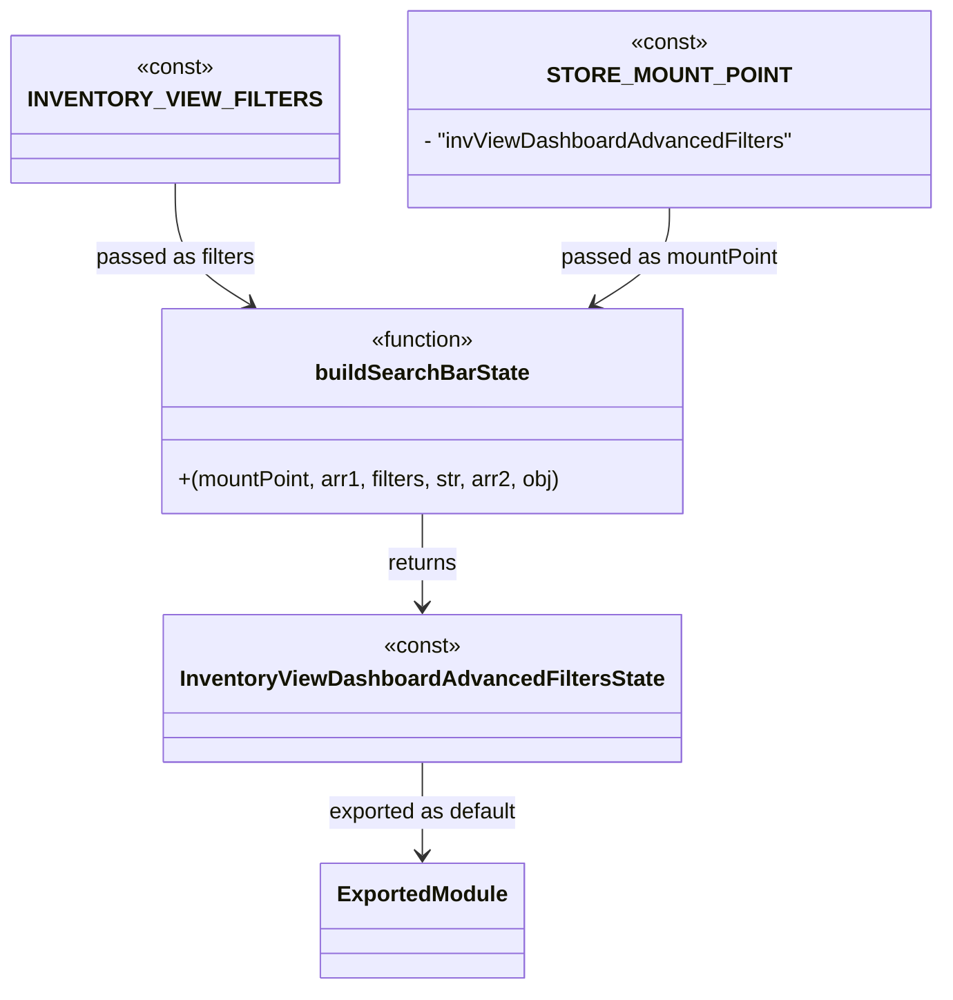

# Diagram: web/portal/src/pages/inventoryview/redux/InventoryViewDashboard.AdvancedFilters.SearchState.js


> Auto-generated by Obscura crawlers

## Diagram 1



### SVG

<svg id="container" width="650.71875" xmlns="http://www.w3.org/2000/svg" class="classDiagram" height="724" viewBox="0 0 650.71875 724" role="graphics-document document" aria-roledescription="class"><style>#container{font-family:"trebuchet ms",verdana,arial,sans-serif;font-size:16px;fill:#333;}@keyframes edge-animation-frame{from{stroke-dashoffset:0;}}@keyframes dash{to{stroke-dashoffset:0;}}#container .edge-animation-slow{stroke-dasharray:9,5!important;stroke-dashoffset:900;animation:dash 50s linear infinite;stroke-linecap:round;}#container .edge-animation-fast{stroke-dasharray:9,5!important;stroke-dashoffset:900;animation:dash 20s linear infinite;stroke-linecap:round;}#container .error-icon{fill:#552222;}#container .error-text{fill:#552222;stroke:#552222;}#container .edge-thickness-normal{stroke-width:1px;}#container .edge-thickness-thick{stroke-width:3.5px;}#container .edge-pattern-solid{stroke-dasharray:0;}#container .edge-thickness-invisible{stroke-width:0;fill:none;}#container .edge-pattern-dashed{stroke-dasharray:3;}#container .edge-pattern-dotted{stroke-dasharray:2;}#container .marker{fill:#333333;stroke:#333333;}#container .marker.cross{stroke:#333333;}#container svg{font-family:"trebuchet ms",verdana,arial,sans-serif;font-size:16px;}#container p{margin:0;}#container g.classGroup text{fill:#9370DB;stroke:none;font-family:"trebuchet ms",verdana,arial,sans-serif;font-size:10px;}#container g.classGroup text .title{font-weight:bolder;}#container .nodeLabel,#container .edgeLabel{color:#131300;}#container .edgeLabel .label rect{fill:#ECECFF;}#container .label text{fill:#131300;}#container .labelBkg{background:#ECECFF;}#container .edgeLabel .label span{background:#ECECFF;}#container .classTitle{font-weight:bolder;}#container .node rect,#container .node circle,#container .node ellipse,#container .node polygon,#container .node path{fill:#ECECFF;stroke:#9370DB;stroke-width:1px;}#container .divider{stroke:#9370DB;stroke-width:1;}#container g.clickable{cursor:pointer;}#container g.classGroup rect{fill:#ECECFF;stroke:#9370DB;}#container g.classGroup line{stroke:#9370DB;stroke-width:1;}#container .classLabel .box{stroke:none;stroke-width:0;fill:#ECECFF;opacity:0.5;}#container .classLabel .label{fill:#9370DB;font-size:10px;}#container .relation{stroke:#333333;stroke-width:1;fill:none;}#container .dashed-line{stroke-dasharray:3;}#container .dotted-line{stroke-dasharray:1 2;}#container #compositionStart,#container .composition{fill:#333333!important;stroke:#333333!important;stroke-width:1;}#container #compositionEnd,#container .composition{fill:#333333!important;stroke:#333333!important;stroke-width:1;}#container #dependencyStart,#container .dependency{fill:#333333!important;stroke:#333333!important;stroke-width:1;}#container #dependencyStart,#container .dependency{fill:#333333!important;stroke:#333333!important;stroke-width:1;}#container #extensionStart,#container .extension{fill:transparent!important;stroke:#333333!important;stroke-width:1;}#container #extensionEnd,#container .extension{fill:transparent!important;stroke:#333333!important;stroke-width:1;}#container #aggregationStart,#container .aggregation{fill:transparent!important;stroke:#333333!important;stroke-width:1;}#container #aggregationEnd,#container .aggregation{fill:transparent!important;stroke:#333333!important;stroke-width:1;}#container #lollipopStart,#container .lollipop{fill:#ECECFF!important;stroke:#333333!important;stroke-width:1;}#container #lollipopEnd,#container .lollipop{fill:#ECECFF!important;stroke:#333333!important;stroke-width:1;}#container .edgeTerminals{font-size:11px;line-height:initial;}#container .classTitleText{text-anchor:middle;font-size:18px;fill:#333;}#container .label-icon{display:inline-block;height:1em;overflow:visible;vertical-align:-0.125em;}#container .node .label-icon path{fill:currentColor;stroke:revert;stroke-width:revert;}#container :root{--mermaid-font-family:"trebuchet ms",verdana,arial,sans-serif;}</style><g><defs><marker id="container_class-aggregationStart" class="marker aggregation class" refX="18" refY="7" markerWidth="190" markerHeight="240" orient="auto"><path d="M 18,7 L9,13 L1,7 L9,1 Z"></path></marker></defs><defs><marker id="container_class-aggregationEnd" class="marker aggregation class" refX="1" refY="7" markerWidth="20" markerHeight="28" orient="auto"><path d="M 18,7 L9,13 L1,7 L9,1 Z"></path></marker></defs><defs><marker id="container_class-extensionStart" class="marker extension class" refX="18" refY="7" markerWidth="190" markerHeight="240" orient="auto"><path d="M 1,7 L18,13 V 1 Z"></path></marker></defs><defs><marker id="container_class-extensionEnd" class="marker extension class" refX="1" refY="7" markerWidth="20" markerHeight="28" orient="auto"><path d="M 1,1 V 13 L18,7 Z"></path></marker></defs><defs><marker id="container_class-compositionStart" class="marker composition class" refX="18" refY="7" markerWidth="190" markerHeight="240" orient="auto"><path d="M 18,7 L9,13 L1,7 L9,1 Z"></path></marker></defs><defs><marker id="container_class-compositionEnd" class="marker composition class" refX="1" refY="7" markerWidth="20" markerHeight="28" orient="auto"><path d="M 18,7 L9,13 L1,7 L9,1 Z"></path></marker></defs><defs><marker id="container_class-dependencyStart" class="marker dependency class" refX="6" refY="7" markerWidth="190" markerHeight="240" orient="auto"><path d="M 5,7 L9,13 L1,7 L9,1 Z"></path></marker></defs><defs><marker id="container_class-dependencyEnd" class="marker dependency class" refX="13" refY="7" markerWidth="20" markerHeight="28" orient="auto"><path d="M 18,7 L9,13 L14,7 L9,1 Z"></path></marker></defs><defs><marker id="container_class-lollipopStart" class="marker lollipop class" refX="13" refY="7" markerWidth="190" markerHeight="240" orient="auto"><circle stroke="black" fill="transparent" cx="7" cy="7" r="6"></circle></marker></defs><defs><marker id="container_class-lollipopEnd" class="marker lollipop class" refX="1" refY="7" markerWidth="190" markerHeight="240" orient="auto"><circle stroke="black" fill="transparent" cx="7" cy="7" r="6"></circle></marker></defs><g class="root"><g class="clusters"></g><g class="edgePaths"><path d="M284.148,376L284.148,382.167C284.148,388.333,284.148,400.667,284.148,412C284.148,423.333,284.148,433.667,284.148,438.833L284.148,444" id="id_buildSearchBarState_InventoryViewDashboardAdvancedFiltersState_1" class="edge-thickness-normal edge-pattern-solid relation" style=";;;" data-edge="true" data-et="edge" data-id="id_buildSearchBarState_InventoryViewDashboardAdvancedFiltersState_1" data-points="W3sieCI6Mjg0LjE0ODQzNzUsInkiOjM3Nn0seyJ4IjoyODQuMTQ4NDM3NSwieSI6NDEzfSx7IngiOjI4NC4xNDg0Mzc1LCJ5Ijo0NTB9XQ==" marker-end="url(#container_class-dependencyEnd)"></path><path d="M112.969,134L112.969,143.167C112.969,152.333,112.969,170.667,121.557,185.452C130.145,200.238,147.322,211.477,155.91,217.096L164.498,222.715" id="id_INVENTORY_VIEW_FILTERS_buildSearchBarState_2" class="edge-thickness-normal edge-pattern-solid relation" style=";;;" data-edge="true" data-et="edge" data-id="id_INVENTORY_VIEW_FILTERS_buildSearchBarState_2" data-points="W3sieCI6MTEyLjk2ODc1LCJ5IjoxMzR9LHsieCI6MTEyLjk2ODc1LCJ5IjoxODl9LHsieCI6MTY5LjUxOTE4MjQ3NzY3ODU2LCJ5IjoyMjZ9XQ==" marker-end="url(#container_class-dependencyEnd)"></path><path d="M455.328,152L455.328,158.167C455.328,164.333,455.328,176.667,446.74,188.452C438.152,200.238,420.975,211.477,412.387,217.096L403.799,222.715" id="id_STORE_MOUNT_POINT_buildSearchBarState_3" class="edge-thickness-normal edge-pattern-solid relation" style=";;;" data-edge="true" data-et="edge" data-id="id_STORE_MOUNT_POINT_buildSearchBarState_3" data-points="W3sieCI6NDU1LjMyODEyNSwieSI6MTUyfSx7IngiOjQ1NS4zMjgxMjUsInkiOjE4OX0seyJ4IjozOTguNzc3NjkyNTIyMzIxNDQsInkiOjIyNn1d" marker-end="url(#container_class-dependencyEnd)"></path><path d="M284.148,558L284.148,564.167C284.148,570.333,284.148,582.667,284.148,594C284.148,605.333,284.148,615.667,284.148,620.833L284.148,626" id="id_InventoryViewDashboardAdvancedFiltersState_ExportedModule_4" class="edge-thickness-normal edge-pattern-solid relation" style=";;;" data-edge="true" data-et="edge" data-id="id_InventoryViewDashboardAdvancedFiltersState_ExportedModule_4" data-points="W3sieCI6Mjg0LjE0ODQzNzUsInkiOjU1OH0seyJ4IjoyODQuMTQ4NDM3NSwieSI6NTk1fSx7IngiOjI4NC4xNDg0Mzc1LCJ5Ijo2MzJ9XQ==" marker-end="url(#container_class-dependencyEnd)"></path></g><g class="edgeLabels"><g class="edgeLabel" transform="translate(284.1484375, 413)"><g class="label" data-id="id_buildSearchBarState_InventoryViewDashboardAdvancedFiltersState_1" transform="translate(-26.265625, -12)"><foreignObject width="52.53125" height="24"><div xmlns="http://www.w3.org/1999/xhtml" class="labelBkg" style="display: table-cell; white-space: nowrap; line-height: 1.5; max-width: 200px; text-align: center;"><span class="edgeLabel"><p>returns</p></span></div></foreignObject></g></g><g class="edgeLabel" transform="translate(112.96875, 189)"><g class="label" data-id="id_INVENTORY_VIEW_FILTERS_buildSearchBarState_2" transform="translate(-58.5078125, -12)"><foreignObject width="117.015625" height="24"><div xmlns="http://www.w3.org/1999/xhtml" class="labelBkg" style="display: table-cell; white-space: nowrap; line-height: 1.5; max-width: 200px; text-align: center;"><span class="edgeLabel"><p>passed as filters</p></span></div></foreignObject></g></g><g class="edgeLabel" transform="translate(455.328125, 189)"><g class="label" data-id="id_STORE_MOUNT_POINT_buildSearchBarState_3" transform="translate(-80.40625, -12)"><foreignObject width="160.8125" height="24"><div xmlns="http://www.w3.org/1999/xhtml" class="labelBkg" style="display: table-cell; white-space: nowrap; line-height: 1.5; max-width: 200px; text-align: center;"><span class="edgeLabel"><p>passed as mountPoint</p></span></div></foreignObject></g></g><g class="edgeLabel" transform="translate(284.1484375, 595)"><g class="label" data-id="id_InventoryViewDashboardAdvancedFiltersState_ExportedModule_4" transform="translate(-70.734375, -12)"><foreignObject width="141.46875" height="24"><div xmlns="http://www.w3.org/1999/xhtml" class="labelBkg" style="display: table-cell; white-space: nowrap; line-height: 1.5; max-width: 200px; text-align: center;"><span class="edgeLabel"><p>exported as default</p></span></div></foreignObject></g></g></g><g class="nodes"><g class="node default" id="classId-buildSearchBarState-0" transform="translate(284.1484375, 301)"><g class="basic label-container"><path d="M-191.765625 -75 L191.765625 -75 L191.765625 75 L-191.765625 75" stroke="none" stroke-width="0" fill="#ECECFF" style=""></path><path d="M-191.765625 -75 C-83.19255454957603 -75, 25.38051590084794 -75, 191.765625 -75 M-191.765625 -75 C-103.42436993337964 -75, -15.083114866759274 -75, 191.765625 -75 M191.765625 -75 C191.765625 -19.986715060545244, 191.765625 35.02656987890951, 191.765625 75 M191.765625 -75 C191.765625 -33.96616333425369, 191.765625 7.067673331492614, 191.765625 75 M191.765625 75 C75.68517650294649 75, -40.39527199410702 75, -191.765625 75 M191.765625 75 C63.206951091305655 75, -65.35172281738869 75, -191.765625 75 M-191.765625 75 C-191.765625 43.63155869756909, -191.765625 12.263117395138181, -191.765625 -75 M-191.765625 75 C-191.765625 19.920623560856093, -191.765625 -35.158752878287814, -191.765625 -75" stroke="#9370DB" stroke-width="1.3" fill="none" stroke-dasharray="0 0" style=""></path></g><g class="annotation-group text" transform="translate(-39.484375, -51)"><g class="label" style="" transform="translate(0,-12)"><foreignObject width="78.96875" height="24"><div xmlns="http://www.w3.org/1999/xhtml" style="display: table-cell; white-space: nowrap; line-height: 1.5; max-width: 129px; text-align: center;"><span class="nodeLabel markdown-node-label" style=""><p>«function»</p></span></div></foreignObject></g></g><g class="label-group text" transform="translate(-75.296875, -27)"><g class="label" style="font-weight: bolder" transform="translate(0,-12)"><foreignObject width="150.59375" height="24"><div xmlns="http://www.w3.org/1999/xhtml" style="display: table-cell; white-space: nowrap; line-height: 1.5; max-width: 198px; text-align: center;"><span class="nodeLabel markdown-node-label" style=""><p>buildSearchBarState</p></span></div></foreignObject></g></g><g class="members-group text" transform="translate(-179.765625, 21)"></g><g class="methods-group text" transform="translate(-179.765625, 51)"><g class="label" style="" transform="translate(0,-12)"><foreignObject width="284.234375" height="24"><div xmlns="http://www.w3.org/1999/xhtml" style="display: table-cell; white-space: nowrap; line-height: 1.5; max-width: 334px; text-align: center;"><span class="nodeLabel markdown-node-label" style=""><p>+(mountPoint, arr1, filters, str, arr2, obj)</p></span></div></foreignObject></g></g><g class="divider" style=""><path d="M-191.765625 -3 C-112.27533864528033 -3, -32.78505229056066 -3, 191.765625 -3 M-191.765625 -3 C-71.21100288498667 -3, 49.34361923002666 -3, 191.765625 -3" stroke="#9370DB" stroke-width="1.3" fill="none" stroke-dasharray="0 0" style=""></path></g><g class="divider" style=""><path d="M-191.765625 21 C-84.43746268435089 21, 22.89069963129822 21, 191.765625 21 M-191.765625 21 C-41.60301812544628 21, 108.55958874910743 21, 191.765625 21" stroke="#9370DB" stroke-width="1.3" fill="none" stroke-dasharray="0 0" style=""></path></g></g><g class="node default" id="classId-INVENTORY_VIEW_FILTERS-1" transform="translate(112.96875, 80)"><g class="basic label-container"><path d="M-104.96875 -54 L104.96875 -54 L104.96875 54 L-104.96875 54" stroke="none" stroke-width="0" fill="#ECECFF" style=""></path><path d="M-104.96875 -54 C-40.773017062365625 -54, 23.42271587526875 -54, 104.96875 -54 M-104.96875 -54 C-29.230409775623826 -54, 46.50793044875235 -54, 104.96875 -54 M104.96875 -54 C104.96875 -20.8931766072087, 104.96875 12.213646785582597, 104.96875 54 M104.96875 -54 C104.96875 -24.66418415883301, 104.96875 4.671631682333981, 104.96875 54 M104.96875 54 C28.415382217282144 54, -48.13798556543571 54, -104.96875 54 M104.96875 54 C47.92717420571558 54, -9.114401588568839 54, -104.96875 54 M-104.96875 54 C-104.96875 25.90642866546619, -104.96875 -2.187142669067619, -104.96875 -54 M-104.96875 54 C-104.96875 27.9196405324938, -104.96875 1.8392810649876026, -104.96875 -54" stroke="#9370DB" stroke-width="1.3" fill="none" stroke-dasharray="0 0" style=""></path></g><g class="annotation-group text" transform="translate(-28.6171875, -30)"><g class="label" style="" transform="translate(0,-12)"><foreignObject width="57.234375" height="24"><div xmlns="http://www.w3.org/1999/xhtml" style="display: table-cell; white-space: nowrap; line-height: 1.5; max-width: 107px; text-align: center;"><span class="nodeLabel markdown-node-label" style=""><p>«const»</p></span></div></foreignObject></g></g><g class="label-group text" transform="translate(-92.96875, -6)"><g class="label" style="font-weight: bolder" transform="translate(0,-12)"><foreignObject width="185.9375" height="24"><div xmlns="http://www.w3.org/1999/xhtml" style="display: table-cell; white-space: nowrap; line-height: 1.5; max-width: 234px; text-align: center;"><span class="nodeLabel markdown-node-label" style=""><p>INVENTORY_VIEW_FILTERS</p></span></div></foreignObject></g></g><g class="members-group text" transform="translate(-92.96875, 42)"></g><g class="methods-group text" transform="translate(-92.96875, 72)"></g><g class="divider" style=""><path d="M-104.96875 18 C-39.945204640082736 18, 25.07834071983453 18, 104.96875 18 M-104.96875 18 C-46.17389083267355 18, 12.6209683346529 18, 104.96875 18" stroke="#9370DB" stroke-width="1.3" fill="none" stroke-dasharray="0 0" style=""></path></g><g class="divider" style=""><path d="M-104.96875 36 C-45.46991574902665 36, 14.028918501946706 36, 104.96875 36 M-104.96875 36 C-59.08980443362184 36, -13.210858867243687 36, 104.96875 36" stroke="#9370DB" stroke-width="1.3" fill="none" stroke-dasharray="0 0" style=""></path></g></g><g class="node default" id="classId-STORE_MOUNT_POINT-2" transform="translate(455.328125, 80)"><g class="basic label-container"><path d="M-187.390625 -72 L187.390625 -72 L187.390625 72 L-187.390625 72" stroke="none" stroke-width="0" fill="#ECECFF" style=""></path><path d="M-187.390625 -72 C-76.86951409998846 -72, 33.65159680002307 -72, 187.390625 -72 M-187.390625 -72 C-58.12390252834584 -72, 71.14281994330833 -72, 187.390625 -72 M187.390625 -72 C187.390625 -39.38097032801174, 187.390625 -6.761940656023484, 187.390625 72 M187.390625 -72 C187.390625 -14.767522421228946, 187.390625 42.46495515754211, 187.390625 72 M187.390625 72 C48.66259429148616 72, -90.06543641702768 72, -187.390625 72 M187.390625 72 C95.92979523856327 72, 4.468965477126545 72, -187.390625 72 M-187.390625 72 C-187.390625 33.86090312821373, -187.390625 -4.278193743572544, -187.390625 -72 M-187.390625 72 C-187.390625 37.617717696828024, -187.390625 3.235435393656047, -187.390625 -72" stroke="#9370DB" stroke-width="1.3" fill="none" stroke-dasharray="0 0" style=""></path></g><g class="annotation-group text" transform="translate(-28.6171875, -48)"><g class="label" style="" transform="translate(0,-12)"><foreignObject width="57.234375" height="24"><div xmlns="http://www.w3.org/1999/xhtml" style="display: table-cell; white-space: nowrap; line-height: 1.5; max-width: 107px; text-align: center;"><span class="nodeLabel markdown-node-label" style=""><p>«const»</p></span></div></foreignObject></g></g><g class="label-group text" transform="translate(-79.90625, -24)"><g class="label" style="font-weight: bolder" transform="translate(0,-12)"><foreignObject width="159.8125" height="24"><div xmlns="http://www.w3.org/1999/xhtml" style="display: table-cell; white-space: nowrap; line-height: 1.5; max-width: 209px; text-align: center;"><span class="nodeLabel markdown-node-label" style=""><p>STORE_MOUNT_POINT</p></span></div></foreignObject></g></g><g class="members-group text" transform="translate(-175.390625, 24)"><g class="label" style="" transform="translate(0,-12)"><foreignObject width="270.875" height="24"><div xmlns="http://www.w3.org/1999/xhtml" style="display: table-cell; white-space: nowrap; line-height: 1.5; max-width: 328px; text-align: center;"><span class="nodeLabel markdown-node-label" style=""><p>- "invViewDashboardAdvancedFilters"</p></span></div></foreignObject></g></g><g class="methods-group text" transform="translate(-175.390625, 72)"></g><g class="divider" style=""><path d="M-187.390625 0 C-69.65880087760404 0, 48.073023244791926 0, 187.390625 0 M-187.390625 0 C-45.571575845889555 0, 96.24747330822089 0, 187.390625 0" stroke="#9370DB" stroke-width="1.3" fill="none" stroke-dasharray="0 0" style=""></path></g><g class="divider" style=""><path d="M-187.390625 48 C-64.80443216952204 48, 57.78176066095591 48, 187.390625 48 M-187.390625 48 C-80.17404666111995 48, 27.04253167776011 48, 187.390625 48" stroke="#9370DB" stroke-width="1.3" fill="none" stroke-dasharray="0 0" style=""></path></g></g><g class="node default" id="classId-InventoryViewDashboardAdvancedFiltersState-3" transform="translate(284.1484375, 504)"><g class="basic label-container"><path d="M-180.890625 -54 L180.890625 -54 L180.890625 54 L-180.890625 54" stroke="none" stroke-width="0" fill="#ECECFF" style=""></path><path d="M-180.890625 -54 C-93.35848914043397 -54, -5.826353280867949 -54, 180.890625 -54 M-180.890625 -54 C-69.41212697585384 -54, 42.066371048292325 -54, 180.890625 -54 M180.890625 -54 C180.890625 -19.044572365497153, 180.890625 15.910855269005694, 180.890625 54 M180.890625 -54 C180.890625 -22.256354248458482, 180.890625 9.487291503083036, 180.890625 54 M180.890625 54 C78.6029141556673 54, -23.684796688665386 54, -180.890625 54 M180.890625 54 C96.62710666353249 54, 12.363588327064974 54, -180.890625 54 M-180.890625 54 C-180.890625 26.221729840581542, -180.890625 -1.556540318836916, -180.890625 -54 M-180.890625 54 C-180.890625 24.399376326712538, -180.890625 -5.201247346574924, -180.890625 -54" stroke="#9370DB" stroke-width="1.3" fill="none" stroke-dasharray="0 0" style=""></path></g><g class="annotation-group text" transform="translate(-28.6171875, -30)"><g class="label" style="" transform="translate(0,-12)"><foreignObject width="57.234375" height="24"><div xmlns="http://www.w3.org/1999/xhtml" style="display: table-cell; white-space: nowrap; line-height: 1.5; max-width: 107px; text-align: center;"><span class="nodeLabel markdown-node-label" style=""><p>«const»</p></span></div></foreignObject></g></g><g class="label-group text" transform="translate(-168.890625, -6)"><g class="label" style="font-weight: bolder" transform="translate(0,-12)"><foreignObject width="337.78125" height="24"><div xmlns="http://www.w3.org/1999/xhtml" style="display: table-cell; white-space: nowrap; line-height: 1.5; max-width: 382px; text-align: center;"><span class="nodeLabel markdown-node-label" style=""><p>InventoryViewDashboardAdvancedFiltersState</p></span></div></foreignObject></g></g><g class="members-group text" transform="translate(-168.890625, 42)"></g><g class="methods-group text" transform="translate(-168.890625, 72)"></g><g class="divider" style=""><path d="M-180.890625 18 C-42.7661608605909 18, 95.3583032788182 18, 180.890625 18 M-180.890625 18 C-81.68902382358137 18, 17.51257735283727 18, 180.890625 18" stroke="#9370DB" stroke-width="1.3" fill="none" stroke-dasharray="0 0" style=""></path></g><g class="divider" style=""><path d="M-180.890625 36 C-92.3049333240608 36, -3.7192416481215957 36, 180.890625 36 M-180.890625 36 C-48.37261878779083 36, 84.14538742441835 36, 180.890625 36" stroke="#9370DB" stroke-width="1.3" fill="none" stroke-dasharray="0 0" style=""></path></g></g><g class="node default" id="classId-ExportedModule-4" transform="translate(284.1484375, 674)"><g class="basic label-container"><path d="M-72.2109375 -42 L72.2109375 -42 L72.2109375 42 L-72.2109375 42" stroke="none" stroke-width="0" fill="#ECECFF" style=""></path><path d="M-72.2109375 -42 C-37.92726018053486 -42, -3.643582861069717 -42, 72.2109375 -42 M-72.2109375 -42 C-26.47171874226425 -42, 19.267500015471498 -42, 72.2109375 -42 M72.2109375 -42 C72.2109375 -11.456108165046587, 72.2109375 19.087783669906827, 72.2109375 42 M72.2109375 -42 C72.2109375 -21.665722272163062, 72.2109375 -1.331444544326125, 72.2109375 42 M72.2109375 42 C41.84756277256477 42, 11.48418804512955 42, -72.2109375 42 M72.2109375 42 C39.31538008324348 42, 6.419822666486965 42, -72.2109375 42 M-72.2109375 42 C-72.2109375 9.211101923132581, -72.2109375 -23.577796153734838, -72.2109375 -42 M-72.2109375 42 C-72.2109375 14.846848703678745, -72.2109375 -12.30630259264251, -72.2109375 -42" stroke="#9370DB" stroke-width="1.3" fill="none" stroke-dasharray="0 0" style=""></path></g><g class="annotation-group text" transform="translate(0, -18)"></g><g class="label-group text" transform="translate(-60.2109375, -18)"><g class="label" style="font-weight: bolder" transform="translate(0,-12)"><foreignObject width="120.421875" height="24"><div xmlns="http://www.w3.org/1999/xhtml" style="display: table-cell; white-space: nowrap; line-height: 1.5; max-width: 169px; text-align: center;"><span class="nodeLabel markdown-node-label" style=""><p>ExportedModule</p></span></div></foreignObject></g></g><g class="members-group text" transform="translate(-60.2109375, 30)"></g><g class="methods-group text" transform="translate(-60.2109375, 60)"></g><g class="divider" style=""><path d="M-72.2109375 6 C-21.125430091312573 6, 29.960077317374854 6, 72.2109375 6 M-72.2109375 6 C-22.824658059117823 6, 26.561621381764354 6, 72.2109375 6" stroke="#9370DB" stroke-width="1.3" fill="none" stroke-dasharray="0 0" style=""></path></g><g class="divider" style=""><path d="M-72.2109375 24 C-24.403725975962338 24, 23.403485548075324 24, 72.2109375 24 M-72.2109375 24 C-37.31908860261736 24, -2.427239705234726 24, 72.2109375 24" stroke="#9370DB" stroke-width="1.3" fill="none" stroke-dasharray="0 0" style=""></path></g></g></g></g></g></svg>

## Diagram 2

```mermaid
flowchart TD
    subgraph Source
        A[INVENTORY_VIEW_FILTERS] --> B[buildSearchBarState]
        C[STORE_MOUNT_POINT:"invViewDashboardAdvancedFilters"] --> B
    end
    B --> D[InventoryViewDashboardAdvancedFiltersState]
    D --> E[/export default/]
    style A fill:#f9f,stroke:#333,stroke-width:1px
    style C fill:#ff9,stroke:#333,stroke-width:1px
    style B fill:#9ff,stroke:#333,stroke-width:1px
    style D fill:#9f9,stroke:#333,stroke-width:1px
```

> SVG rendering failed for this diagram.
