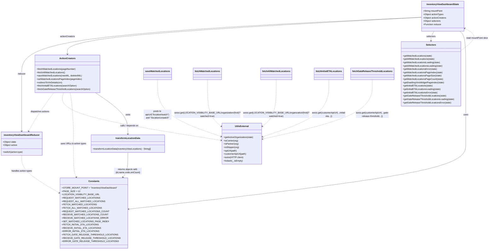

# Diagram: web/portal/src/pages/inventoryview/redux/InventoryViewDashboardState.js

> Auto-generated by Obscura crawlers

## Mermaid

### SVG

<svg id="container" width="3434.68798828125" xmlns="http://www.w3.org/2000/svg" class="classDiagram" height="1786" viewBox="0 0 3434.68798828125 1786" role="graphics-document document" aria-roledescription="class"><g><defs><marker id="container_class-aggregationStart" class="marker aggregation class" refX="18" refY="7" markerWidth="190" markerHeight="240" orient="auto"><path d="M 18,7 L9,13 L1,7 L9,1 Z"></path></marker></defs><defs><marker id="container_class-aggregationEnd" class="marker aggregation class" refX="1" refY="7" markerWidth="20" markerHeight="28" orient="auto"><path d="M 18,7 L9,13 L1,7 L9,1 Z"></path></marker></defs><defs><marker id="container_class-extensionStart" class="marker extension class" refX="18" refY="7" markerWidth="190" markerHeight="240" orient="auto"><path d="M 1,7 L18,13 V 1 Z"></path></marker></defs><defs><marker id="container_class-extensionEnd" class="marker extension class" refX="1" refY="7" markerWidth="20" markerHeight="28" orient="auto"><path d="M 1,1 V 13 L18,7 Z"></path></marker></defs><defs><marker id="container_class-compositionStart" class="marker composition class" refX="18" refY="7" markerWidth="190" markerHeight="240" orient="auto"><path d="M 18,7 L9,13 L1,7 L9,1 Z"></path></marker></defs><defs><marker id="container_class-compositionEnd" class="marker composition class" refX="1" refY="7" markerWidth="20" markerHeight="28" orient="auto"><path d="M 18,7 L9,13 L1,7 L9,1 Z"></path></marker></defs><defs><marker id="container_class-dependencyStart" class="marker dependency class" refX="6" refY="7" markerWidth="190" markerHeight="240" orient="auto"><path d="M 5,7 L9,13 L1,7 L9,1 Z"></path></marker></defs><defs><marker id="container_class-dependencyEnd" class="marker dependency class" refX="13" refY="7" markerWidth="20" markerHeight="28" orient="auto"><path d="M 18,7 L9,13 L14,7 L9,1 Z"></path></marker></defs><defs><marker id="container_class-lollipopStart" class="marker lollipop class" refX="13" refY="7" markerWidth="190" markerHeight="240" orient="auto"><circle stroke="black" fill="transparent" cx="7" cy="7" r="6"></circle></marker></defs><defs><marker id="container_class-lollipopEnd" class="marker lollipop class" refX="1" refY="7" markerWidth="190" markerHeight="240" orient="auto"><circle stroke="black" fill="transparent" cx="7" cy="7" r="6"></circle></marker></defs><g class="root"><g class="clusters"></g><g class="edgePaths"><path d="M2949.502,123.375L2483.436,146.312C2017.37,169.25,1085.238,215.125,619.172,282.729C153.105,350.333,153.105,439.667,153.105,533C153.105,626.333,153.105,723.667,153.105,792C153.105,860.333,153.105,899.667,153.105,919.333L153.105,939" id="id_InventoryViewDashboardState_inventoryViewDashboardReducer_1" class="edge-thickness-normal edge-pattern-solid relation" style=";;;" data-edge="true" data-et="edge" data-id="id_InventoryViewDashboardState_inventoryViewDashboardReducer_1" data-points="W3sieCI6Mjk0OS41MDE5NTMxMjUsInkiOjEyMy4zNzQ2MDAxNzU2NzQxfSx7IngiOjE1My4xMDU0Njg3NSwieSI6MjYxfSx7IngiOjE1My4xMDU0Njg3NSwieSI6NTI5fSx7IngiOjE1My4xMDU0Njg3NSwieSI6ODIxfSx7IngiOjE1My4xMDU0Njg3NSwieSI6OTQ1fV0=" marker-end="url(#container_class-dependencyEnd)"></path><path d="M2949.502,124.292L2537.754,147.077C2126.006,169.861,1302.51,215.431,890.762,259.382C479.014,303.333,479.014,345.667,479.014,366.833L479.014,388" id="id_InventoryViewDashboardState_ActionCreators_2" class="edge-thickness-normal edge-pattern-solid relation" style=";;;" data-edge="true" data-et="edge" data-id="id_InventoryViewDashboardState_ActionCreators_2" data-points="W3sieCI6Mjk0OS41MDE5NTMxMjUsInkiOjEyNC4yOTE4Mjg0NzQ3NDMwM30seyJ4Ijo0NzkuMDEzNjcxODc1LCJ5IjoyNjF9LHsieCI6NDc5LjAxMzY3MTg3NSwieSI6Mzk0fV0=" marker-end="url(#container_class-dependencyEnd)"></path><path d="M3037.804,224L3034.29,230.167C3030.776,236.333,3023.749,248.667,3020.235,260C3016.721,271.333,3016.721,281.667,3016.721,286.833L3016.721,292" id="id_InventoryViewDashboardState_Selectors_3" class="edge-thickness-normal edge-pattern-solid relation" style=";;;" data-edge="true" data-et="edge" data-id="id_InventoryViewDashboardState_Selectors_3" data-points="W3sieCI6MzAzNy44MDQzMjM4MTQ2NTUsInkiOjIyNH0seyJ4IjozMDE2LjcyMDcwMzEyNSwieSI6MjYxfSx7IngiOjMwMTYuNzIwNzAzMTI1LCJ5IjoyOTh9XQ==" marker-end="url(#container_class-dependencyEnd)"></path><path d="M3221.614,224L3228.595,230.167C3235.577,236.333,3249.539,248.667,3256.521,299.5C3263.502,350.333,3263.502,439.667,3263.502,533C3263.502,626.333,3263.502,723.667,3263.502,807C3263.502,890.333,3263.502,959.667,3263.502,1027C3263.502,1094.333,3263.502,1159.667,2869.717,1238.155C2475.932,1316.643,1688.362,1408.285,1294.577,1454.106L900.792,1499.928" id="id_InventoryViewDashboardState_Constants_4" class="edge-thickness-normal edge-pattern-solid relation" style=";;;" data-edge="true" data-et="edge" data-id="id_InventoryViewDashboardState_Constants_4" data-points="W3sieCI6MzIyMS42MTM4MDY1NzMyNzU3LCJ5IjoyMjR9LHsieCI6MzI2My41MDE5NTMxMjUsInkiOjI2MX0seyJ4IjozMjYzLjUwMTk1MzEyNSwieSI6NTI5fSx7IngiOjMyNjMuNTAxOTUzMTI1LCJ5Ijo4MjF9LHsieCI6MzI2My41MDE5NTMxMjUsInkiOjEwMjl9LHsieCI6MzI2My41MDE5NTMxMjUsInkiOjEyMjV9LHsieCI6ODk0LjgzMjAzMTI1LCJ5IjoxNTAwLjYyMTAxMDI2MTc4MDh9XQ==" marker-end="url(#container_class-dependencyEnd)"></path><path d="M380.43,664L361.322,690.167C342.214,716.333,303.998,768.667,274.17,814.621C244.343,860.575,222.905,900.15,212.186,919.937L201.467,939.724" id="id_ActionCreators_inventoryViewDashboardReducer_5" class="edge-thickness-normal edge-pattern-dashed relation" style=";;;" data-edge="true" data-et="edge" data-id="id_ActionCreators_inventoryViewDashboardReducer_5" data-points="W3sieCI6MzgwLjQzMDE4OTE1ODgxODUsInkiOjY2NH0seyJ4IjoyNjUuNzgxMjUsInkiOjgyMX0seyJ4IjoxOTguNjA5MTQ5NjM5NDIzMSwieSI6OTQ1fV0=" marker-end="url(#container_class-dependencyEnd)"></path><path d="M452.326,664L447.153,690.167C441.98,716.333,431.635,768.667,616.171,825.517C800.707,882.367,1180.126,943.733,1369.835,974.416L1559.544,1005.1" id="id_ActionCreators_UtilsExternal_6" class="edge-thickness-normal edge-pattern-dashed relation" style=";;;" data-edge="true" data-et="edge" data-id="id_ActionCreators_UtilsExternal_6" data-points="W3sieCI6NDUyLjMyNTkyNDM4OTk4MjksInkiOjY2NH0seyJ4Ijo0MjEuMjg5MDYyNSwieSI6ODIxfSx7IngiOjE1NjUuNDY2Nzk2ODc1LCJ5IjoxMDA2LjA1Nzc1MjczNTYxMn1d" marker-end="url(#container_class-dependencyEnd)"></path><path d="M499.307,664L503.241,690.167C507.174,716.333,515.041,768.667,518.975,829.5C522.908,890.333,522.908,959.667,522.908,1027C522.908,1094.333,522.908,1159.667,526.627,1199.61C530.345,1239.552,537.781,1254.105,541.5,1261.381L545.218,1268.657" id="id_ActionCreators_Constants_7" class="edge-thickness-normal edge-pattern-dashed relation" style=";;;" data-edge="true" data-et="edge" data-id="id_ActionCreators_Constants_7" data-points="W3sieCI6NDk5LjMwNzM3NjM5MTI2NzEsInkiOjY2NH0seyJ4Ijo1MjIuOTA4MjAzMTI1LCJ5Ijo4MjF9LHsieCI6NTIyLjkwODIwMzEyNSwieSI6MTAyOX0seyJ4Ijo1MjIuOTA4MjAzMTI1LCJ5IjoxMjI1fSx7IngiOjU0Ny45NDg0MDExNjI3OTA3LCJ5IjoxMjc0fV0=" marker-end="url(#container_class-dependencyEnd)"></path><path d="M153.105,1113L153.105,1131.667C153.105,1150.333,153.105,1187.667,203.158,1235.106C253.21,1282.544,353.315,1340.089,403.367,1368.861L453.419,1397.633" id="id_inventoryViewDashboardReducer_Constants_8" class="edge-thickness-normal edge-pattern-dashed relation" style=";;;" data-edge="true" data-et="edge" data-id="id_inventoryViewDashboardReducer_Constants_8" data-points="W3sieCI6MTUzLjEwNTQ2ODc1LCJ5IjoxMTEzfSx7IngiOjE1My4xMDU0Njg3NSwieSI6MTIyNX0seyJ4Ijo0NTguNjIxMDkzNzUsInkiOjE0MDAuNjIzNTY0ODY5MDM4NX1d" marker-end="url(#container_class-dependencyEnd)"></path><path d="M3228.502,365.113L3250.925,347.761C3273.348,330.409,3318.195,295.704,3322.519,268.4C3326.843,241.096,3290.645,221.191,3272.546,211.239L3254.447,201.287" id="id_Selectors_InventoryViewDashboardState_9" class="edge-thickness-normal edge-pattern-dashed relation" style=";;;" data-edge="true" data-et="edge" data-id="id_Selectors_InventoryViewDashboardState_9" data-points="W3sieCI6MzIyOC41MDE5NTMxMjUsInkiOjM2NS4xMTMwNjM2ODI5MTY0fSx7IngiOjMzNjMuMDQxMDE1NjI1LCJ5IjoyNjF9LHsieCI6MzI0OS4xODk0NTMxMjUsInkiOjE5OC4zOTU2Mzg5MDYxNzEzfV0=" marker-end="url(#container_class-dependencyEnd)"></path><path d="M680.195,664L719.19,690.167C758.184,716.333,836.173,768.667,875.168,818C914.162,867.333,914.162,913.667,914.162,936.833L914.162,960" id="id_ActionCreators_transformLocationData_10" class="edge-thickness-normal edge-pattern-solid relation" style=";;;" data-edge="true" data-et="edge" data-id="id_ActionCreators_transformLocationData_10" data-points="W3sieCI6NjgwLjE5NTMxMjUsInkiOjY2NH0seyJ4Ijo5MTQuMTYyMTA5Mzc1LCJ5Ijo4MjF9LHsieCI6OTE0LjE2MjEwOTM3NSwieSI6OTY2fV0=" marker-end="url(#container_class-dependencyEnd)"></path><path d="M914.162,1092L914.162,1114.167C914.162,1136.333,914.162,1180.667,908.339,1210.215C902.517,1239.763,890.871,1254.526,885.049,1261.908L879.226,1269.289" id="id_transformLocationData_Constants_11" class="edge-thickness-normal edge-pattern-solid relation" style=";;;" data-edge="true" data-et="edge" data-id="id_transformLocationData_Constants_11" data-points="W3sieCI6OTE0LjE2MjEwOTM3NSwieSI6MTA5Mn0seyJ4Ijo5MTQuMTYyMTA5Mzc1LCJ5IjoxMjI1fSx7IngiOjg3NS41MDk4MTEwNDY1MTE3LCJ5IjoxMjc0fV0=" marker-end="url(#container_class-dependencyEnd)"></path><path d="M1128.408,571L1128.408,612.667C1128.408,654.333,1128.408,737.667,1200.31,805.168C1272.212,872.669,1416.016,924.337,1487.918,950.171L1559.82,976.006" id="id_saveWatchedLocations_UtilsExternal_12" class="edge-thickness-normal edge-pattern-dashed relation" style=";;;" data-edge="true" data-et="edge" data-id="id_saveWatchedLocations_UtilsExternal_12" data-points="W3sieCI6MTEyOC40MDgyMDMxMjUsInkiOjU3MX0seyJ4IjoxMTI4LjQwODIwMzEyNSwieSI6ODIxfSx7IngiOjE1NjUuNDY2Nzk2ODc1LCJ5Ijo5NzguMDM0Mzg1OTY0OTEyM31d" marker-end="url(#container_class-dependencyEnd)"></path><path d="M1472.861,571L1472.861,612.667C1472.861,654.333,1472.861,737.667,1487.548,792.363C1502.234,847.058,1531.606,873.117,1546.292,886.146L1560.979,899.175" id="id_fetchWatchedLocations_UtilsExternal_13" class="edge-thickness-normal edge-pattern-dashed relation" style=";;;" data-edge="true" data-et="edge" data-id="id_fetchWatchedLocations_UtilsExternal_13" data-points="W3sieCI6MTQ3Mi44NjEzMjgxMjUsInkiOjU3MX0seyJ4IjoxNDcyLjg2MTMyODEyNSwieSI6ODIxfSx7IngiOjE1NjUuNDY2Nzk2ODc1LCJ5Ijo5MDMuMTU2ODgxMDM5NjUzNH1d" marker-end="url(#container_class-dependencyEnd)"></path><path d="M1941.768,571L1941.768,612.667C1941.768,654.333,1941.768,737.667,1927.081,792.363C1912.395,847.058,1883.023,873.117,1868.337,886.146L1853.65,899.175" id="id_fetchAllWatchedLocations_UtilsExternal_14" class="edge-thickness-normal edge-pattern-dashed relation" style=";;;" data-edge="true" data-et="edge" data-id="id_fetchAllWatchedLocations_UtilsExternal_14" data-points="W3sieCI6MTk0MS43Njc1NzgxMjUsInkiOjU3MX0seyJ4IjoxOTQxLjc2NzU3ODEyNSwieSI6ODIxfSx7IngiOjE4NDkuMTYyMTA5Mzc1LCJ5Ijo5MDMuMTU2ODgxMDM5NjUzNH1d" marker-end="url(#container_class-dependencyEnd)"></path><path d="M2309.486,571L2309.486,612.667C2309.486,654.333,2309.486,737.667,2233.711,805.507C2157.935,873.348,2006.384,925.696,1930.609,951.87L1854.833,978.045" id="id_fetchInitialETALocations_UtilsExternal_15" class="edge-thickness-normal edge-pattern-dashed relation" style=";;;" data-edge="true" data-et="edge" data-id="id_fetchInitialETALocations_UtilsExternal_15" data-points="W3sieCI6MjMwOS40ODYzMjgxMjUsInkiOjU3MX0seyJ4IjoyMzA5LjQ4NjMyODEyNSwieSI6ODIxfSx7IngiOjE4NDkuMTYyMTA5Mzc1LCJ5Ijo5ODAuMDAzNTAyOTQ1MDY4Nn1d" marker-end="url(#container_class-dependencyEnd)"></path><path d="M2607.15,571L2607.15,612.667C2607.15,654.333,2607.15,737.667,2481.793,808.31C2356.436,878.953,2105.722,936.907,1980.365,965.883L1855.008,994.86" id="id_fetchGateReleaseThresholdLocations_UtilsExternal_16" class="edge-thickness-normal edge-pattern-dashed relation" style=";;;" data-edge="true" data-et="edge" data-id="id_fetchGateReleaseThresholdLocations_UtilsExternal_16" data-points="W3sieCI6MjYwNy4xNTAzOTA2MjUsInkiOjU3MX0seyJ4IjoyNjA3LjE1MDM5MDYyNSwieSI6ODIxfSx7IngiOjE4NDkuMTYyMTA5Mzc1LCJ5Ijo5OTYuMjExNDUzNDc2NzYyMn1d" marker-end="url(#container_class-dependencyEnd)"></path></g><g class="edgeLabels"><g class="edgeLabel" transform="translate(153.10546875, 529)"><g class="label" data-id="id_InventoryViewDashboardState_inventoryViewDashboardReducer_1" transform="translate(-27.765625, -12)"><foreignObject width="55.53125" height="24">

reducer

</foreignObject></g></g><g class="edgeLabel" transform="translate(479.013671875, 261)"><g class="label" data-id="id_InventoryViewDashboardState_ActionCreators_2" transform="translate(-52.671875, -12)"><foreignObject width="105.34375" height="24">

actionCreators

</foreignObject></g></g><g class="edgeLabel" transform="translate(3016.720703125, 261)"><g class="label" data-id="id_InventoryViewDashboardState_Selectors_3" transform="translate(-32.734375, -12)"><foreignObject width="65.46875" height="24">

selectors

</foreignObject></g></g><g class="edgeLabel" transform="translate(3263.501953125, 821)"><g class="label" data-id="id_InventoryViewDashboardState_Constants_4" transform="translate(-16.4921875, -12)"><foreignObject width="32.984375" height="24">

uses

</foreignObject></g></g><g class="edgeLabel" transform="translate(281.52148, 799.44536)"><g class="label" data-id="id_ActionCreators_inventoryViewDashboardReducer_5" transform="translate(-67.71875, -12)"><foreignObject width="135.4375" height="24">

dispatches actions

</foreignObject></g></g><g class="edgeLabel" transform="translate(914.38526, 900.75271)"><g class="label" data-id="id_ActionCreators_UtilsExternal_6" transform="translate(-67.7890625, -12)"><foreignObject width="135.578125" height="24">

calls / depends on

</foreignObject></g></g><g class="edgeLabel" transform="translate(522.908203125, 1029)"><g class="label" data-id="id_ActionCreators_Constants_7" transform="translate(-90.8515625, -12)"><foreignObject width="181.703125" height="24">

uses URLs &amp; action types

</foreignObject></g></g><g class="edgeLabel" transform="translate(153.10546875, 1225)"><g class="label" data-id="id_inventoryViewDashboardReducer_Constants_8" transform="translate(-75.46875, -12)"><foreignObject width="150.9375" height="24">

handles action types

</foreignObject></g></g><g class="edgeLabel" transform="translate(3347.1489, 273.29811)"><g class="label" data-id="id_Selectors_InventoryViewDashboardState_9" transform="translate(-79.5390625, -12)"><foreignObject width="159.078125" height="24">

read mountPoint slice

</foreignObject></g></g><g class="edgeLabel" transform="translate(914.162109375, 821)"><g class="label" data-id="id_ActionCreators_transformLocationData_10" transform="translate(-16.4921875, -12)"><foreignObject width="32.984375" height="24">

uses

</foreignObject></g></g><g class="edgeLabel" transform="translate(914.162109375, 1225)"><g class="label" data-id="id_transformLocationData_Constants_11" transform="translate(-100, -24)"><foreignObject width="200" height="48">

returns objects with {id,name,code,vinCount}

</foreignObject></g></g><g class="edgeLabel" transform="translate(1128.408203125, 821)"><g class="label" data-id="id_saveWatchedLocations_UtilsExternal_12" transform="translate(-100, -36)"><foreignObject width="200" height="72">

posts to apiUrl("/location/watch") and "/location/unwatch"

</foreignObject></g></g><g class="edgeLabel" transform="translate(1472.861328125, 821)"><g class="label" data-id="id_fetchWatchedLocations_UtilsExternal_13" transform="translate(-224.453125, -24)"><foreignObject width="448.90625" height="48">

axios.get(LOCATION_VISIBILITY_BASE_URL/organization/{fvId}?watched=true)

</foreignObject></g></g><g class="edgeLabel" transform="translate(1941.767578125, 821)"><g class="label" data-id="id_fetchAllWatchedLocations_UtilsExternal_14" transform="translate(-224.453125, -24)"><foreignObject width="448.90625" height="48">

axios.get(LOCATION_VISIBILITY_BASE_URL/organization/{fvId}?watched=true)

</foreignObject></g></g><g class="edgeLabel" transform="translate(2309.486328125, 821)"><g class="label" data-id="id_fetchInitialETALocations_UtilsExternal_15" transform="translate(-123.265625, -24)"><foreignObject width="246.53125" height="48">

axios.get(customerApiUrl(...initial-eta...))

</foreignObject></g></g><g class="edgeLabel" transform="translate(2607.150390625, 821)"><g class="label" data-id="id_fetchGateReleaseThresholdLocations_UtilsExternal_16" transform="translate(-117.796875, -24)"><foreignObject width="235.59375" height="48">

axios.get(customerApiUrl(...gate-release-threshold...))

</foreignObject></g></g></g><g class="nodes"><g class="node default" id="classId-InventoryViewDashboardState-0" transform="translate(3099.345703125, 116)"><g class="basic label-container"><path d="M-149.84375 -108 L149.84375 -108 L149.84375 108 L-149.84375 108" stroke="none" stroke-width="0" fill="#ECECFF" style=""></path><path d="M-149.84375 -108 C-71.34187122452023 -108, 7.160007550959534 -108, 149.84375 -108 M-149.84375 -108 C-71.95139081068083 -108, 5.940968378638331 -108, 149.84375 -108 M149.84375 -108 C149.84375 -35.7665412699797, 149.84375 36.466917460040605, 149.84375 108 M149.84375 -108 C149.84375 -45.2774442122457, 149.84375 17.445111575508605, 149.84375 108 M149.84375 108 C81.35241480070424 108, 12.861079601408477 108, -149.84375 108 M149.84375 108 C75.29642618490688 108, 0.7491023698137553 108, -149.84375 108 M-149.84375 108 C-149.84375 30.98818112460097, -149.84375 -46.02363775079806, -149.84375 -108 M-149.84375 108 C-149.84375 38.75073288570829, -149.84375 -30.498534228583424, -149.84375 -108" stroke="#9370DB" stroke-width="1.3" fill="none" stroke-dasharray="0 0" style=""></path></g><g class="annotation-group text" transform="translate(0, -84)"></g><g class="label-group text" transform="translate(-110.921875, -84)"><g class="label" style="font-weight: bolder" transform="translate(0,-12)"><foreignObject width="221.84375" height="24">

InventoryViewDashboardState

</foreignObject></g></g><g class="members-group text" transform="translate(-137.84375, -36)"><g class="label" style="" transform="translate(0,-12)"><foreignObject width="139.8125" height="24">

+String mountPoint

</foreignObject></g><g class="label" style="" transform="translate(0,12)"><foreignObject width="145.984375" height="24">

+Object actionTypes

</foreignObject></g><g class="label" style="" transform="translate(0,36)"><foreignObject width="164.765625" height="24">

+Object actionCreators

</foreignObject></g><g class="label" style="" transform="translate(0,60)"><foreignObject width="124.890625" height="24">

+Object selectors

</foreignObject></g><g class="label" style="" transform="translate(0,84)"><foreignObject width="130.359375" height="24">

+Function reducer

</foreignObject></g></g><g class="methods-group text" transform="translate(-137.84375, 108)"></g><g class="divider" style=""><path d="M-149.84375 -60 C-84.25915374918246 -60, -18.67455749836492 -60, 149.84375 -60 M-149.84375 -60 C-47.829200121769276 -60, 54.18534975646145 -60, 149.84375 -60" stroke="#9370DB" stroke-width="1.3" fill="none" stroke-dasharray="0 0" style=""></path></g><g class="divider" style=""><path d="M-149.84375 84 C-54.20869534501229 84, 41.426359309975425 84, 149.84375 84 M-149.84375 84 C-39.908652571051405 84, 70.02644485789719 84, 149.84375 84" stroke="#9370DB" stroke-width="1.3" fill="none" stroke-dasharray="0 0" style=""></path></g></g><g class="node default" id="classId-inventoryViewDashboardReducer-1" transform="translate(153.10546875, 1029)"><g class="basic label-container"><path d="M-145.10546875 -84 L145.10546875 -84 L145.10546875 84 L-145.10546875 84" stroke="none" stroke-width="0" fill="#ECECFF" style=""></path><path d="M-145.10546875 -84 C-33.719237283334365 -84, 77.66699418333127 -84, 145.10546875 -84 M-145.10546875 -84 C-31.98744170035829 -84, 81.13058534928342 -84, 145.10546875 -84 M145.10546875 -84 C145.10546875 -18.758505203813144, 145.10546875 46.48298959237371, 145.10546875 84 M145.10546875 -84 C145.10546875 -27.297838149211813, 145.10546875 29.404323701576374, 145.10546875 84 M145.10546875 84 C79.96801720266856 84, 14.830565655337125 84, -145.10546875 84 M145.10546875 84 C61.54039200284444 84, -22.024684744311116 84, -145.10546875 84 M-145.10546875 84 C-145.10546875 47.91898849299441, -145.10546875 11.837976985988817, -145.10546875 -84 M-145.10546875 84 C-145.10546875 41.938100922993655, -145.10546875 -0.12379815401268957, -145.10546875 -84" stroke="#9370DB" stroke-width="1.3" fill="none" stroke-dasharray="0 0" style=""></path></g><g class="annotation-group text" transform="translate(0, -60)"></g><g class="label-group text" transform="translate(-121.4296875, -60)"><g class="label" style="font-weight: bolder" transform="translate(0,-12)"><foreignObject width="242.859375" height="24">

inventoryViewDashboardReducer

</foreignObject></g></g><g class="members-group text" transform="translate(-133.10546875, -12)"><g class="label" style="" transform="translate(0,-12)"><foreignObject width="95.53125" height="24">

+Object state

</foreignObject></g><g class="label" style="" transform="translate(0,12)"><foreignObject width="104.796875" height="24">

+Object action

</foreignObject></g></g><g class="methods-group text" transform="translate(-133.10546875, 60)"><g class="label" style="" transform="translate(0,-12)"><foreignObject width="144.78125" height="24">

+switch(action.type)

</foreignObject></g></g><g class="divider" style=""><path d="M-145.10546875 -36 C-55.24817231416401 -36, 34.60912412167198 -36, 145.10546875 -36 M-145.10546875 -36 C-31.771488550865442 -36, 81.56249164826912 -36, 145.10546875 -36" stroke="#9370DB" stroke-width="1.3" fill="none" stroke-dasharray="0 0" style=""></path></g><g class="divider" style=""><path d="M-145.10546875 36 C-59.062513682234936 36, 26.980441385530128 36, 145.10546875 36 M-145.10546875 36 C-82.73131084858183 36, -20.357152947163655 36, 145.10546875 36" stroke="#9370DB" stroke-width="1.3" fill="none" stroke-dasharray="0 0" style=""></path></g></g><g class="node default" id="classId-ActionCreators-2" transform="translate(479.013671875, 529)"><g class="basic label-container"><path d="M-230.375 -135 L230.375 -135 L230.375 135 L-230.375 135" stroke="none" stroke-width="0" fill="#ECECFF" style=""></path><path d="M-230.375 -135 C-72.06165296208795 -135, 86.2516940758241 -135, 230.375 -135 M-230.375 -135 C-52.82970993126179 -135, 124.71558013747642 -135, 230.375 -135 M230.375 -135 C230.375 -64.08906769466078, 230.375 6.821864610678432, 230.375 135 M230.375 -135 C230.375 -41.5250478678108, 230.375 51.949904264378404, 230.375 135 M230.375 135 C60.82415378686281 135, -108.72669242627438 135, -230.375 135 M230.375 135 C120.88577824360434 135, 11.39655648720867 135, -230.375 135 M-230.375 135 C-230.375 78.18766710663914, -230.375 21.375334213278265, -230.375 -135 M-230.375 135 C-230.375 70.244700454075, -230.375 5.489400908150003, -230.375 -135" stroke="#9370DB" stroke-width="1.3" fill="none" stroke-dasharray="0 0" style=""></path></g><g class="annotation-group text" transform="translate(0, -111)"></g><g class="label-group text" transform="translate(-53.96875, -111)"><g class="label" style="font-weight: bolder" transform="translate(0,-12)"><foreignObject width="107.9375" height="24">

ActionCreators

</foreignObject></g></g><g class="members-group text" transform="translate(-218.375, -63)"></g><g class="methods-group text" transform="translate(-218.375, -33)"><g class="label" style="" transform="translate(0,-12)"><foreignObject width="279.5" height="24">

+fetchWatchedLocations(pageNumber)

</foreignObject></g><g class="label" style="" transform="translate(0,12)"><foreignObject width="205.015625" height="24">

+fetchAllWatchedLocations()

</foreignObject></g><g class="label" style="" transform="translate(0,36)"><foreignObject width="318" height="24">

+saveWatchedLocations(newWL, deletedWL)

</foreignObject></g><g class="label" style="" transform="translate(0,60)"><foreignObject width="320.609375" height="24">

+setWatchedLocationsPageIndex(pageIndex)

</foreignObject></g><g class="label" style="" transform="translate(0,84)"><foreignObject width="186.046875" height="24">

+redirectToVinDetails(vin)

</foreignObject></g><g class="label" style="" transform="translate(0,108)"><foreignObject width="288.546875" height="24">

+fetchInitialETALocations(searchOption)

</foreignObject></g><g class="label" style="" transform="translate(0,132)"><foreignObject width="382.78125" height="24">

+fetchGateReleaseThresholdLocations(searchOption)

</foreignObject></g></g><g class="divider" style=""><path d="M-230.375 -87 C-61.65238015635481 -87, 107.07023968729038 -87, 230.375 -87 M-230.375 -87 C-92.91172263745369 -87, 44.551554725092615 -87, 230.375 -87" stroke="#9370DB" stroke-width="1.3" fill="none" stroke-dasharray="0 0" style=""></path></g><g class="divider" style=""><path d="M-230.375 -63 C-72.79220497649399 -63, 84.79059004701202 -63, 230.375 -63 M-230.375 -63 C-133.01352752386708 -63, -35.652055047734194 -63, 230.375 -63" stroke="#9370DB" stroke-width="1.3" fill="none" stroke-dasharray="0 0" style=""></path></g></g><g class="node default" id="classId-Selectors-3" transform="translate(3016.720703125, 529)"><g class="basic label-container"><path d="M-211.78125 -231 L211.78125 -231 L211.78125 231 L-211.78125 231" stroke="none" stroke-width="0" fill="#ECECFF" style=""></path><path d="M-211.78125 -231 C-66.39647926500476 -231, 78.98829146999049 -231, 211.78125 -231 M-211.78125 -231 C-56.761787785498285 -231, 98.25767442900343 -231, 211.78125 -231 M211.78125 -231 C211.78125 -58.15751819307934, 211.78125 114.68496361384132, 211.78125 231 M211.78125 -231 C211.78125 -64.94048785709984, 211.78125 101.11902428580032, 211.78125 231 M211.78125 231 C72.32395948232136 231, -67.13333103535729 231, -211.78125 231 M211.78125 231 C110.45464886267587 231, 9.128047725351735 231, -211.78125 231 M-211.78125 231 C-211.78125 52.12830696429927, -211.78125 -126.74338607140146, -211.78125 -231 M-211.78125 231 C-211.78125 55.441208299566284, -211.78125 -120.11758340086743, -211.78125 -231" stroke="#9370DB" stroke-width="1.3" fill="none" stroke-dasharray="0 0" style=""></path></g><g class="annotation-group text" transform="translate(0, -207)"></g><g class="label-group text" transform="translate(-34.171875, -207)"><g class="label" style="font-weight: bolder" transform="translate(0,-12)"><foreignObject width="68.34375" height="24">

Selectors

</foreignObject></g></g><g class="members-group text" transform="translate(-199.78125, -159)"></g><g class="methods-group text" transform="translate(-199.78125, -129)"><g class="label" style="" transform="translate(0,-12)"><foreignObject width="208.890625" height="24">

+getWatchedLocations(state)

</foreignObject></g><g class="label" style="" transform="translate(0,12)"><foreignObject width="227.4375" height="24">

+getAllWatchedLocations(state)

</foreignObject></g><g class="label" style="" transform="translate(0,36)"><foreignObject width="266.125" height="24">

+getWatchedLocationsLoading(state)

</foreignObject></g><g class="label" style="" transform="translate(0,60)"><foreignObject width="284.671875" height="24">

+getAllWatchedLocationsLoading(state)

</foreignObject></g><g class="label" style="" transform="translate(0,84)"><foreignObject width="244.6875" height="24">

+getWatchedLocationsError(state)

</foreignObject></g><g class="label" style="" transform="translate(0,108)"><foreignObject width="282.625" height="24">

+getWatchedLocationsPageIndex(state)

</foreignObject></g><g class="label" style="" transform="translate(0,132)"><foreignObject width="271.46875" height="24">

+getWatchedLocationsPageSize(state)

</foreignObject></g><g class="label" style="" transform="translate(0,156)"><foreignObject width="285.078125" height="24">

+getWatchedLocationsPageCount(state)

</foreignObject></g><g class="label" style="" transform="translate(0,180)"><foreignObject width="292.953125" height="24">

+getDwellingVinsWidgetPageIndex(state)

</foreignObject></g><g class="label" style="" transform="translate(0,204)"><foreignObject width="213.921875" height="24">

+getInitialETALocations(state)

</foreignObject></g><g class="label" style="" transform="translate(0,228)"><foreignObject width="271.15625" height="24">

+getInitialETALocationsLoading(state)

</foreignObject></g><g class="label" style="" transform="translate(0,252)"><foreignObject width="249.71875" height="24">

+getInitialETALocationsError(state)

</foreignObject></g><g class="label" style="" transform="translate(0,276)"><foreignObject width="308.15625" height="24">

+getGateReleaseThresholdLocations(state)

</foreignObject></g><g class="label" style="" transform="translate(0,300)"><foreignObject width="365.390625" height="24">

+getGateReleaseThresholdLocationsLoading(state)

</foreignObject></g><g class="label" style="" transform="translate(0,324)"><foreignObject width="343.9375" height="24">

+getGateReleaseThresholdLocationsError(state)

</foreignObject></g></g><g class="divider" style=""><path d="M-211.78125 -183 C-43.31184290158629 -183, 125.15756419682742 -183, 211.78125 -183 M-211.78125 -183 C-108.33629261812625 -183, -4.891335236252502 -183, 211.78125 -183" stroke="#9370DB" stroke-width="1.3" fill="none" stroke-dasharray="0 0" style=""></path></g><g class="divider" style=""><path d="M-211.78125 -159 C-121.78660211393627 -159, -31.791954227872537 -159, 211.78125 -159 M-211.78125 -159 C-93.18914414476585 -159, 25.402961710468304 -159, 211.78125 -159" stroke="#9370DB" stroke-width="1.3" fill="none" stroke-dasharray="0 0" style=""></path></g></g><g class="node default" id="classId-Constants-4" transform="translate(676.7265625, 1526)"><g class="basic label-container"><path d="M-218.10546875 -252 L218.10546875 -252 L218.10546875 252 L-218.10546875 252" stroke="none" stroke-width="0" fill="#ECECFF" style=""></path><path d="M-218.10546875 -252 C-93.50895980822577 -252, 31.087549133548464 -252, 218.10546875 -252 M-218.10546875 -252 C-124.27088063960369 -252, -30.43629252920738 -252, 218.10546875 -252 M218.10546875 -252 C218.10546875 -84.97843854707833, 218.10546875 82.04312290584335, 218.10546875 252 M218.10546875 -252 C218.10546875 -94.48305404113773, 218.10546875 63.03389191772453, 218.10546875 252 M218.10546875 252 C88.93421594459639 252, -40.23703686080722 252, -218.10546875 252 M218.10546875 252 C79.80300200086253 252, -58.49946474827493 252, -218.10546875 252 M-218.10546875 252 C-218.10546875 100.56044298938491, -218.10546875 -50.87911402123018, -218.10546875 -252 M-218.10546875 252 C-218.10546875 62.4352094951561, -218.10546875 -127.1295810096878, -218.10546875 -252" stroke="#9370DB" stroke-width="1.3" fill="none" stroke-dasharray="0 0" style=""></path></g><g class="annotation-group text" transform="translate(0, -228)"></g><g class="label-group text" transform="translate(-36.5390625, -228)"><g class="label" style="font-weight: bolder" transform="translate(0,-12)"><foreignObject width="73.078125" height="24">

Constants

</foreignObject></g></g><g class="members-group text" transform="translate(-206.10546875, -180)"><g class="label" style="" transform="translate(0,-12)"><foreignObject width="375.671875" height="24">

+STORE_MOUNT_POINT = "inventoryViewDashboard"

</foreignObject></g><g class="label" style="" transform="translate(0,12)"><foreignObject width="113.671875" height="24">

+PAGE_SIZE = 12

</foreignObject></g><g class="label" style="" transform="translate(0,36)"><foreignObject width="236.625" height="24">

+LOCATION_VISIBILITY_BASE_URL

</foreignObject></g><g class="label" style="" transform="translate(0,60)"><foreignObject width="234.328125" height="24">

+REQUEST_WATCHED_LOCATIONS

</foreignObject></g><g class="label" style="" transform="translate(0,84)"><foreignObject width="267.75" height="24">

+REQUEST_ALL_WATCHED_LOCATIONS

</foreignObject></g><g class="label" style="" transform="translate(0,108)"><foreignObject width="214.359375" height="24">

+FETCH_WATCHED_LOCATIONS

</foreignObject></g><g class="label" style="" transform="translate(0,132)"><foreignObject width="247.78125" height="24">

+FETCH_ALL_WATCHED_LOCATIONS

</foreignObject></g><g class="label" style="" transform="translate(0,156)"><foreignObject width="291.03125" height="24">

+REQUEST_WATCHED_LOCATIONS_COUNT

</foreignObject></g><g class="label" style="" transform="translate(0,180)"><foreignObject width="284.84375" height="24">

+RECEIVE_WATCHED_LOCATIONS_COUNT

</foreignObject></g><g class="label" style="" transform="translate(0,204)"><foreignObject width="284.5" height="24">

+RECEIVE_WATCHED_LOCATIONS_ERROR

</foreignObject></g><g class="label" style="" transform="translate(0,228)"><foreignObject width="289.8125" height="24">

+SET_WATCHED_LOCATIONS_PAGE_INDEX

</foreignObject></g><g class="label" style="" transform="translate(0,252)"><foreignObject width="231.96875" height="24">

+FETCH_INITIAL_ETA_LOCATIONS

</foreignObject></g><g class="label" style="" transform="translate(0,276)"><foreignObject width="245.75" height="24">

+RECEIVE_INITIAL_ETA_LOCATIONS

</foreignObject></g><g class="label" style="" transform="translate(0,300)"><foreignObject width="236.53125" height="24">

+ERROR_INITIAL_ETA_LOCATIONS

</foreignObject></g><g class="label" style="" transform="translate(0,324)"><foreignObject width="345.203125" height="24">

+FETCH_GATE_RELEASE_THRESHOLD_LOCATIONS

</foreignObject></g><g class="label" style="" transform="translate(0,348)"><foreignObject width="358.984375" height="24">

+RECEIVE_GATE_RELEASE_THRESHOLD_LOCATIONS

</foreignObject></g><g class="label" style="" transform="translate(0,372)"><foreignObject width="349.765625" height="24">

+ERROR_GATE_RELEASE_THRESHOLD_LOCATIONS

</foreignObject></g></g><g class="methods-group text" transform="translate(-206.10546875, 252)"></g><g class="divider" style=""><path d="M-218.10546875 -204 C-83.42644940931325 -204, 51.2525699313735 -204, 218.10546875 -204 M-218.10546875 -204 C-60.90736881992672 -204, 96.29073111014657 -204, 218.10546875 -204" stroke="#9370DB" stroke-width="1.3" fill="none" stroke-dasharray="0 0" style=""></path></g><g class="divider" style=""><path d="M-218.10546875 228 C-113.91489577151611 228, -9.72432279303223 228, 218.10546875 228 M-218.10546875 228 C-94.84287364238412 228, 28.41972146523176 228, 218.10546875 228" stroke="#9370DB" stroke-width="1.3" fill="none" stroke-dasharray="0 0" style=""></path></g></g><g class="node default" id="classId-UtilsExternal-5" transform="translate(1707.314453125, 1029)"><g class="basic label-container"><path d="M-141.84765625 -147 L141.84765625 -147 L141.84765625 147 L-141.84765625 147" stroke="none" stroke-width="0" fill="#ECECFF" style=""></path><path d="M-141.84765625 -147 C-62.450908408747765 -147, 16.94583943250447 -147, 141.84765625 -147 M-141.84765625 -147 C-35.30756268611944 -147, 71.23253087776112 -147, 141.84765625 -147 M141.84765625 -147 C141.84765625 -46.53534264159687, 141.84765625 53.92931471680626, 141.84765625 147 M141.84765625 -147 C141.84765625 -82.47728188185195, 141.84765625 -17.954563763703902, 141.84765625 147 M141.84765625 147 C50.49852019646249 147, -40.85061585707501 147, -141.84765625 147 M141.84765625 147 C34.89557751583931 147, -72.05650121832139 147, -141.84765625 147 M-141.84765625 147 C-141.84765625 31.88706567718357, -141.84765625 -83.22586864563286, -141.84765625 -147 M-141.84765625 147 C-141.84765625 67.71664254981391, -141.84765625 -11.566714900372176, -141.84765625 -147" stroke="#9370DB" stroke-width="1.3" fill="none" stroke-dasharray="0 0" style=""></path></g><g class="annotation-group text" transform="translate(0, -123)"></g><g class="label-group text" transform="translate(-46.9609375, -123)"><g class="label" style="font-weight: bolder" transform="translate(0,-12)"><foreignObject width="93.921875" height="24">

UtilsExternal

</foreignObject></g></g><g class="members-group text" transform="translate(-129.84765625, -75)"></g><g class="methods-group text" transform="translate(-129.84765625, -45)"><g class="label" style="" transform="translate(0,-12)"><foreignObject width="212.734375" height="24">

+getActiveOrganization(state)

</foreignObject></g><g class="label" style="" transform="translate(0,12)"><foreignObject width="103.203125" height="24">

+isCarrier(org)

</foreignObject></g><g class="label" style="" transform="translate(0,36)"><foreignObject width="107.28125" height="24">

+isPartner(org)

</foreignObject></g><g class="label" style="" transform="translate(0,60)"><foreignObject width="110.453125" height="24">

+isShipper(org)

</foreignObject></g><g class="label" style="" transform="translate(0,84)"><foreignObject width="95.5" height="24">

+apiUrl(path)

</foreignObject></g><g class="label" style="" transform="translate(0,108)"><foreignObject width="163.953125" height="24">

+customerApiUrl(path)

</foreignObject></g><g class="label" style="" transform="translate(0,132)"><foreignObject width="137.59375" height="24">

+axios(HTTP client)

</foreignObject></g><g class="label" style="" transform="translate(0,156)"><foreignObject width="136.75" height="24">

+lodash(_.isEmpty)

</foreignObject></g></g><g class="divider" style=""><path d="M-141.84765625 -99 C-62.977038567445206 -99, 15.893579115109588 -99, 141.84765625 -99 M-141.84765625 -99 C-28.644130944155748 -99, 84.5593943616885 -99, 141.84765625 -99" stroke="#9370DB" stroke-width="1.3" fill="none" stroke-dasharray="0 0" style=""></path></g><g class="divider" style=""><path d="M-141.84765625 -75 C-80.28249758790618 -75, -18.717338925812356 -75, 141.84765625 -75 M-141.84765625 -75 C-38.42926254106082 -75, 64.98913116787836 -75, 141.84765625 -75" stroke="#9370DB" stroke-width="1.3" fill="none" stroke-dasharray="0 0" style=""></path></g></g><g class="node default" id="classId-transformLocationData-6" transform="translate(914.162109375, 1029)"><g class="basic label-container"><path d="M-265.40234375 -63 L265.40234375 -63 L265.40234375 63 L-265.40234375 63" stroke="none" stroke-width="0" fill="#ECECFF" style=""></path><path d="M-265.40234375 -63 C-146.79968819977236 -63, -28.197032649544724 -63, 265.40234375 -63 M-265.40234375 -63 C-59.184353685534234 -63, 147.03363637893153 -63, 265.40234375 -63 M265.40234375 -63 C265.40234375 -26.94998704298041, 265.40234375 9.100025914039179, 265.40234375 63 M265.40234375 -63 C265.40234375 -36.08255581079877, 265.40234375 -9.165111621597546, 265.40234375 63 M265.40234375 63 C115.21271244453959 63, -34.97691886092082 63, -265.40234375 63 M265.40234375 63 C64.27914416296844 63, -136.84405542406313 63, -265.40234375 63 M-265.40234375 63 C-265.40234375 12.8424106800312, -265.40234375 -37.3151786399376, -265.40234375 -63 M-265.40234375 63 C-265.40234375 26.2186908687805, -265.40234375 -10.562618262439003, -265.40234375 -63" stroke="#9370DB" stroke-width="1.3" fill="none" stroke-dasharray="0 0" style=""></path></g><g class="annotation-group text" transform="translate(0, -39)"></g><g class="label-group text" transform="translate(-84.5234375, -39)"><g class="label" style="font-weight: bolder" transform="translate(0,-12)"><foreignObject width="169.046875" height="24">

transformLocationData

</foreignObject></g></g><g class="members-group text" transform="translate(-253.40234375, 9)"></g><g class="methods-group text" transform="translate(-253.40234375, 39)"><g class="label" style="" transform="translate(0,-12)"><foreignObject width="422.28125" height="24">

+transformLocationData(inventoryViewLocations) : String[]

</foreignObject></g></g><g class="divider" style=""><path d="M-265.40234375 -15 C-111.52788820996022 -15, 42.34656733007955 -15, 265.40234375 -15 M-265.40234375 -15 C-75.90238240178437 -15, 113.59757894643127 -15, 265.40234375 -15" stroke="#9370DB" stroke-width="1.3" fill="none" stroke-dasharray="0 0" style=""></path></g><g class="divider" style=""><path d="M-265.40234375 9 C-152.70680867336662 9, -40.01127359673325 9, 265.40234375 9 M-265.40234375 9 C-140.68205585571997 9, -15.96176796143996 9, 265.40234375 9" stroke="#9370DB" stroke-width="1.3" fill="none" stroke-dasharray="0 0" style=""></path></g></g><g class="node default" id="classId-saveWatchedLocations-7" transform="translate(1128.408203125, 529)"><g class="basic label-container"><path d="M-95.2421875 -42 L95.2421875 -42 L95.2421875 42 L-95.2421875 42" stroke="none" stroke-width="0" fill="#ECECFF" style=""></path><path d="M-95.2421875 -42 C-43.40315615913917 -42, 8.435875181721656 -42, 95.2421875 -42 M-95.2421875 -42 C-20.251639704469795 -42, 54.73890809106041 -42, 95.2421875 -42 M95.2421875 -42 C95.2421875 -16.579670858676074, 95.2421875 8.840658282647851, 95.2421875 42 M95.2421875 -42 C95.2421875 -20.776118788141677, 95.2421875 0.44776242371664665, 95.2421875 42 M95.2421875 42 C24.091074580182692 42, -47.060038339634616 42, -95.2421875 42 M95.2421875 42 C46.89154794590111 42, -1.459091608197781 42, -95.2421875 42 M-95.2421875 42 C-95.2421875 18.841541598005445, -95.2421875 -4.316916803989109, -95.2421875 -42 M-95.2421875 42 C-95.2421875 13.19759772839381, -95.2421875 -15.604804543212381, -95.2421875 -42" stroke="#9370DB" stroke-width="1.3" fill="none" stroke-dasharray="0 0" style=""></path></g><g class="annotation-group text" transform="translate(0, -18)"></g><g class="label-group text" transform="translate(-83.2421875, -18)"><g class="label" style="font-weight: bolder" transform="translate(0,-12)"><foreignObject width="166.484375" height="24">

saveWatchedLocations

</foreignObject></g></g><g class="members-group text" transform="translate(-83.2421875, 30)"></g><g class="methods-group text" transform="translate(-83.2421875, 60)"></g><g class="divider" style=""><path d="M-95.2421875 6 C-32.436178234422236 6, 30.369831031155528 6, 95.2421875 6 M-95.2421875 6 C-43.163686998021724 6, 8.914813503956552 6, 95.2421875 6" stroke="#9370DB" stroke-width="1.3" fill="none" stroke-dasharray="0 0" style=""></path></g><g class="divider" style=""><path d="M-95.2421875 24 C-29.46373208692276 24, 36.31472332615448 24, 95.2421875 24 M-95.2421875 24 C-36.18175122917616 24, 22.878685041647685 24, 95.2421875 24" stroke="#9370DB" stroke-width="1.3" fill="none" stroke-dasharray="0 0" style=""></path></g></g><g class="node default" id="classId-fetchWatchedLocations-8" transform="translate(1472.861328125, 529)"><g class="basic label-container"><path d="M-97.3125 -42 L97.3125 -42 L97.3125 42 L-97.3125 42" stroke="none" stroke-width="0" fill="#ECECFF" style=""></path><path d="M-97.3125 -42 C-50.88477476372816 -42, -4.45704952745632 -42, 97.3125 -42 M-97.3125 -42 C-39.179151655084624 -42, 18.954196689830752 -42, 97.3125 -42 M97.3125 -42 C97.3125 -10.204746400231954, 97.3125 21.59050719953609, 97.3125 42 M97.3125 -42 C97.3125 -13.101493480916147, 97.3125 15.797013038167705, 97.3125 42 M97.3125 42 C46.67208562212199 42, -3.968328755756019 42, -97.3125 42 M97.3125 42 C33.04622165010575 42, -31.2200566997885 42, -97.3125 42 M-97.3125 42 C-97.3125 20.095994197111292, -97.3125 -1.8080116057774163, -97.3125 -42 M-97.3125 42 C-97.3125 9.569418784330352, -97.3125 -22.861162431339295, -97.3125 -42" stroke="#9370DB" stroke-width="1.3" fill="none" stroke-dasharray="0 0" style=""></path></g><g class="annotation-group text" transform="translate(0, -18)"></g><g class="label-group text" transform="translate(-85.3125, -18)"><g class="label" style="font-weight: bolder" transform="translate(0,-12)"><foreignObject width="170.625" height="24">

fetchWatchedLocations

</foreignObject></g></g><g class="members-group text" transform="translate(-85.3125, 30)"></g><g class="methods-group text" transform="translate(-85.3125, 60)"></g><g class="divider" style=""><path d="M-97.3125 6 C-26.001568193400487 6, 45.309363613199025 6, 97.3125 6 M-97.3125 6 C-25.81356164359019 6, 45.68537671281962 6, 97.3125 6" stroke="#9370DB" stroke-width="1.3" fill="none" stroke-dasharray="0 0" style=""></path></g><g class="divider" style=""><path d="M-97.3125 24 C-46.22317796421926 24, 4.866144071561479 24, 97.3125 24 M-97.3125 24 C-20.839229153043476 24, 55.63404169391305 24, 97.3125 24" stroke="#9370DB" stroke-width="1.3" fill="none" stroke-dasharray="0 0" style=""></path></g></g><g class="node default" id="classId-fetchAllWatchedLocations-9" transform="translate(1941.767578125, 529)"><g class="basic label-container"><path d="M-106.7890625 -42 L106.7890625 -42 L106.7890625 42 L-106.7890625 42" stroke="none" stroke-width="0" fill="#ECECFF" style=""></path><path d="M-106.7890625 -42 C-55.64173577573842 -42, -4.494409051476836 -42, 106.7890625 -42 M-106.7890625 -42 C-51.95324265500181 -42, 2.8825771899963826 -42, 106.7890625 -42 M106.7890625 -42 C106.7890625 -9.299816047521716, 106.7890625 23.400367904956568, 106.7890625 42 M106.7890625 -42 C106.7890625 -16.798690931019056, 106.7890625 8.402618137961888, 106.7890625 42 M106.7890625 42 C54.18556416768596 42, 1.582065835371921 42, -106.7890625 42 M106.7890625 42 C43.244205696229265 42, -20.30065110754147 42, -106.7890625 42 M-106.7890625 42 C-106.7890625 25.00698527843706, -106.7890625 8.01397055687412, -106.7890625 -42 M-106.7890625 42 C-106.7890625 9.854979366767083, -106.7890625 -22.290041266465835, -106.7890625 -42" stroke="#9370DB" stroke-width="1.3" fill="none" stroke-dasharray="0 0" style=""></path></g><g class="annotation-group text" transform="translate(0, -18)"></g><g class="label-group text" transform="translate(-94.7890625, -18)"><g class="label" style="font-weight: bolder" transform="translate(0,-12)"><foreignObject width="189.578125" height="24">

fetchAllWatchedLocations

</foreignObject></g></g><g class="members-group text" transform="translate(-94.7890625, 30)"></g><g class="methods-group text" transform="translate(-94.7890625, 60)"></g><g class="divider" style=""><path d="M-106.7890625 6 C-44.058784874010726 6, 18.671492751978548 6, 106.7890625 6 M-106.7890625 6 C-39.88664916438783 6, 27.015764171224333 6, 106.7890625 6" stroke="#9370DB" stroke-width="1.3" fill="none" stroke-dasharray="0 0" style=""></path></g><g class="divider" style=""><path d="M-106.7890625 24 C-53.27369646551706 24, 0.24166956896587521 24, 106.7890625 24 M-106.7890625 24 C-56.932773682477624 24, -7.076484864955248 24, 106.7890625 24" stroke="#9370DB" stroke-width="1.3" fill="none" stroke-dasharray="0 0" style=""></path></g></g><g class="node default" id="classId-fetchInitialETALocations-10" transform="translate(2309.486328125, 529)"><g class="basic label-container"><path d="M-99.875 -42 L99.875 -42 L99.875 42 L-99.875 42" stroke="none" stroke-width="0" fill="#ECECFF" style=""></path><path d="M-99.875 -42 C-30.935387155912125 -42, 38.00422568817575 -42, 99.875 -42 M-99.875 -42 C-52.77653827156429 -42, -5.678076543128583 -42, 99.875 -42 M99.875 -42 C99.875 -21.759780628532763, 99.875 -1.5195612570655257, 99.875 42 M99.875 -42 C99.875 -16.144819625299586, 99.875 9.710360749400827, 99.875 42 M99.875 42 C52.01977372274552 42, 4.1645474454910385 42, -99.875 42 M99.875 42 C48.77695386688388 42, -2.3210922662322417 42, -99.875 42 M-99.875 42 C-99.875 23.882663698615108, -99.875 5.765327397230216, -99.875 -42 M-99.875 42 C-99.875 22.148763438219987, -99.875 2.2975268764399743, -99.875 -42" stroke="#9370DB" stroke-width="1.3" fill="none" stroke-dasharray="0 0" style=""></path></g><g class="annotation-group text" transform="translate(0, -18)"></g><g class="label-group text" transform="translate(-87.875, -18)"><g class="label" style="font-weight: bolder" transform="translate(0,-12)"><foreignObject width="175.75" height="24">

fetchInitialETALocations

</foreignObject></g></g><g class="members-group text" transform="translate(-87.875, 30)"></g><g class="methods-group text" transform="translate(-87.875, 60)"></g><g class="divider" style=""><path d="M-99.875 6 C-58.187459798288415 6, -16.49991959657683 6, 99.875 6 M-99.875 6 C-43.79876639632526 6, 12.277467207349474 6, 99.875 6" stroke="#9370DB" stroke-width="1.3" fill="none" stroke-dasharray="0 0" style=""></path></g><g class="divider" style=""><path d="M-99.875 24 C-24.00255145179686 24, 51.86989709640628 24, 99.875 24 M-99.875 24 C-23.327095061856767 24, 53.22080987628647 24, 99.875 24" stroke="#9370DB" stroke-width="1.3" fill="none" stroke-dasharray="0 0" style=""></path></g></g><g class="node default" id="classId-fetchGateReleaseThresholdLocations-11" transform="translate(2607.150390625, 529)"><g class="basic label-container"><path d="M-147.7890625 -42 L147.7890625 -42 L147.7890625 42 L-147.7890625 42" stroke="none" stroke-width="0" fill="#ECECFF" style=""></path><path d="M-147.7890625 -42 C-47.64950739469923 -42, 52.490047710601544 -42, 147.7890625 -42 M-147.7890625 -42 C-41.84075647317928 -42, 64.10754955364143 -42, 147.7890625 -42 M147.7890625 -42 C147.7890625 -18.65588294781898, 147.7890625 4.688234104362039, 147.7890625 42 M147.7890625 -42 C147.7890625 -15.663703255848372, 147.7890625 10.672593488303256, 147.7890625 42 M147.7890625 42 C62.474361320495206 42, -22.84033985900959 42, -147.7890625 42 M147.7890625 42 C79.88933421008136 42, 11.989605920162717 42, -147.7890625 42 M-147.7890625 42 C-147.7890625 19.36597708938564, -147.7890625 -3.268045821228718, -147.7890625 -42 M-147.7890625 42 C-147.7890625 16.854732662577526, -147.7890625 -8.290534674844949, -147.7890625 -42" stroke="#9370DB" stroke-width="1.3" fill="none" stroke-dasharray="0 0" style=""></path></g><g class="annotation-group text" transform="translate(0, -18)"></g><g class="label-group text" transform="translate(-135.7890625, -18)"><g class="label" style="font-weight: bolder" transform="translate(0,-12)"><foreignObject width="271.578125" height="24">

fetchGateReleaseThresholdLocations

</foreignObject></g></g><g class="members-group text" transform="translate(-135.7890625, 30)"></g><g class="methods-group text" transform="translate(-135.7890625, 60)"></g><g class="divider" style=""><path d="M-147.7890625 6 C-62.902628350082594 6, 21.983805799834812 6, 147.7890625 6 M-147.7890625 6 C-79.41434502249403 6, -11.039627544988065 6, 147.7890625 6" stroke="#9370DB" stroke-width="1.3" fill="none" stroke-dasharray="0 0" style=""></path></g><g class="divider" style=""><path d="M-147.7890625 24 C-49.825245074753255 24, 48.13857235049349 24, 147.7890625 24 M-147.7890625 24 C-55.217629236514995 24, 37.35380402697001 24, 147.7890625 24" stroke="#9370DB" stroke-width="1.3" fill="none" stroke-dasharray="0 0" style=""></path></g></g></g></g></g></svg>
