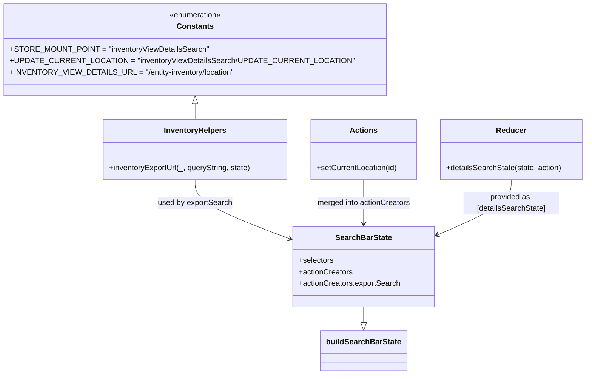

# Diagram: web/portal/src/pages/inventoryview/redux/InventoryViewDetailsSearchBarState.js


> Auto-generated by Obscura crawlers

## Diagram 1



### SVG

<svg id="container" width="1198.984375" xmlns="http://www.w3.org/2000/svg" class="classDiagram" height="784" viewBox="0 0 1198.984375 784" role="graphics-document document" aria-roledescription="class"><style>#container{font-family:"trebuchet ms",verdana,arial,sans-serif;font-size:16px;fill:#333;}@keyframes edge-animation-frame{from{stroke-dashoffset:0;}}@keyframes dash{to{stroke-dashoffset:0;}}#container .edge-animation-slow{stroke-dasharray:9,5!important;stroke-dashoffset:900;animation:dash 50s linear infinite;stroke-linecap:round;}#container .edge-animation-fast{stroke-dasharray:9,5!important;stroke-dashoffset:900;animation:dash 20s linear infinite;stroke-linecap:round;}#container .error-icon{fill:#552222;}#container .error-text{fill:#552222;stroke:#552222;}#container .edge-thickness-normal{stroke-width:1px;}#container .edge-thickness-thick{stroke-width:3.5px;}#container .edge-pattern-solid{stroke-dasharray:0;}#container .edge-thickness-invisible{stroke-width:0;fill:none;}#container .edge-pattern-dashed{stroke-dasharray:3;}#container .edge-pattern-dotted{stroke-dasharray:2;}#container .marker{fill:#333333;stroke:#333333;}#container .marker.cross{stroke:#333333;}#container svg{font-family:"trebuchet ms",verdana,arial,sans-serif;font-size:16px;}#container p{margin:0;}#container g.classGroup text{fill:#9370DB;stroke:none;font-family:"trebuchet ms",verdana,arial,sans-serif;font-size:10px;}#container g.classGroup text .title{font-weight:bolder;}#container .nodeLabel,#container .edgeLabel{color:#131300;}#container .edgeLabel .label rect{fill:#ECECFF;}#container .label text{fill:#131300;}#container .labelBkg{background:#ECECFF;}#container .edgeLabel .label span{background:#ECECFF;}#container .classTitle{font-weight:bolder;}#container .node rect,#container .node circle,#container .node ellipse,#container .node polygon,#container .node path{fill:#ECECFF;stroke:#9370DB;stroke-width:1px;}#container .divider{stroke:#9370DB;stroke-width:1;}#container g.clickable{cursor:pointer;}#container g.classGroup rect{fill:#ECECFF;stroke:#9370DB;}#container g.classGroup line{stroke:#9370DB;stroke-width:1;}#container .classLabel .box{stroke:none;stroke-width:0;fill:#ECECFF;opacity:0.5;}#container .classLabel .label{fill:#9370DB;font-size:10px;}#container .relation{stroke:#333333;stroke-width:1;fill:none;}#container .dashed-line{stroke-dasharray:3;}#container .dotted-line{stroke-dasharray:1 2;}#container #compositionStart,#container .composition{fill:#333333!important;stroke:#333333!important;stroke-width:1;}#container #compositionEnd,#container .composition{fill:#333333!important;stroke:#333333!important;stroke-width:1;}#container #dependencyStart,#container .dependency{fill:#333333!important;stroke:#333333!important;stroke-width:1;}#container #dependencyStart,#container .dependency{fill:#333333!important;stroke:#333333!important;stroke-width:1;}#container #extensionStart,#container .extension{fill:transparent!important;stroke:#333333!important;stroke-width:1;}#container #extensionEnd,#container .extension{fill:transparent!important;stroke:#333333!important;stroke-width:1;}#container #aggregationStart,#container .aggregation{fill:transparent!important;stroke:#333333!important;stroke-width:1;}#container #aggregationEnd,#container .aggregation{fill:transparent!important;stroke:#333333!important;stroke-width:1;}#container #lollipopStart,#container .lollipop{fill:#ECECFF!important;stroke:#333333!important;stroke-width:1;}#container #lollipopEnd,#container .lollipop{fill:#ECECFF!important;stroke:#333333!important;stroke-width:1;}#container .edgeTerminals{font-size:11px;line-height:initial;}#container .classTitleText{text-anchor:middle;font-size:18px;fill:#333;}#container .label-icon{display:inline-block;height:1em;overflow:visible;vertical-align:-0.125em;}#container .node .label-icon path{fill:currentColor;stroke:revert;stroke-width:revert;}#container :root{--mermaid-font-family:"trebuchet ms",verdana,arial,sans-serif;}</style><g><defs><marker id="container_class-aggregationStart" class="marker aggregation class" refX="18" refY="7" markerWidth="190" markerHeight="240" orient="auto"><path d="M 18,7 L9,13 L1,7 L9,1 Z"></path></marker></defs><defs><marker id="container_class-aggregationEnd" class="marker aggregation class" refX="1" refY="7" markerWidth="20" markerHeight="28" orient="auto"><path d="M 18,7 L9,13 L1,7 L9,1 Z"></path></marker></defs><defs><marker id="container_class-extensionStart" class="marker extension class" refX="18" refY="7" markerWidth="190" markerHeight="240" orient="auto"><path d="M 1,7 L18,13 V 1 Z"></path></marker></defs><defs><marker id="container_class-extensionEnd" class="marker extension class" refX="1" refY="7" markerWidth="20" markerHeight="28" orient="auto"><path d="M 1,1 V 13 L18,7 Z"></path></marker></defs><defs><marker id="container_class-compositionStart" class="marker composition class" refX="18" refY="7" markerWidth="190" markerHeight="240" orient="auto"><path d="M 18,7 L9,13 L1,7 L9,1 Z"></path></marker></defs><defs><marker id="container_class-compositionEnd" class="marker composition class" refX="1" refY="7" markerWidth="20" markerHeight="28" orient="auto"><path d="M 18,7 L9,13 L1,7 L9,1 Z"></path></marker></defs><defs><marker id="container_class-dependencyStart" class="marker dependency class" refX="6" refY="7" markerWidth="190" markerHeight="240" orient="auto"><path d="M 5,7 L9,13 L1,7 L9,1 Z"></path></marker></defs><defs><marker id="container_class-dependencyEnd" class="marker dependency class" refX="13" refY="7" markerWidth="20" markerHeight="28" orient="auto"><path d="M 18,7 L9,13 L14,7 L9,1 Z"></path></marker></defs><defs><marker id="container_class-lollipopStart" class="marker lollipop class" refX="13" refY="7" markerWidth="190" markerHeight="240" orient="auto"><circle stroke="black" fill="transparent" cx="7" cy="7" r="6"></circle></marker></defs><defs><marker id="container_class-lollipopEnd" class="marker lollipop class" refX="1" refY="7" markerWidth="190" markerHeight="240" orient="auto"><circle stroke="black" fill="transparent" cx="7" cy="7" r="6"></circle></marker></defs><g class="root"><g class="clusters"></g><g class="edgePaths"><path d="M378.629,217.25L378.629,218.542C378.629,219.833,378.629,222.417,378.629,227.875C378.629,233.333,378.629,241.667,378.629,245.833L378.629,250" id="id_Constants_InventoryHelpers_1" class="edge-thickness-normal edge-pattern-solid relation" style=";;;" data-edge="true" data-et="edge" data-id="id_Constants_InventoryHelpers_1" data-points="W3sieCI6Mzc4LjYyODkwNjI1LCJ5IjoyMDB9LHsieCI6Mzc4LjYyODkwNjI1LCJ5IjoyMjV9LHsieCI6Mzc4LjYyODkwNjI1LCJ5IjoyNTB9XQ==" marker-start="url(#container_class-extensionStart)"></path><path d="M378.629,376L378.629,384.167C378.629,392.333,378.629,408.667,412.377,429.488C446.125,450.31,513.621,475.62,547.368,488.275L581.116,500.93" id="id_InventoryHelpers_SearchBarState_2" class="edge-thickness-normal edge-pattern-solid relation" style=";;;" data-edge="true" data-et="edge" data-id="id_InventoryHelpers_SearchBarState_2" data-points="W3sieCI6Mzc4LjYyODkwNjI1LCJ5IjozNzZ9LHsieCI6Mzc4LjYyODkwNjI1LCJ5Ijo0MjV9LHsieCI6NTg2LjczNDM3NSwieSI6NTAzLjAzNjY4NTgzMDA4NDM3fV0=" marker-end="url(#container_class-dependencyEnd)"></path><path d="M733.309,376L733.309,384.167C733.309,392.333,733.309,408.667,733.309,424C733.309,439.333,733.309,453.667,733.309,460.833L733.309,468" id="id_Actions_SearchBarState_3" class="edge-thickness-normal edge-pattern-solid relation" style=";;;" data-edge="true" data-et="edge" data-id="id_Actions_SearchBarState_3" data-points="W3sieCI6NzMzLjMwODU5Mzc1LCJ5IjozNzZ9LHsieCI6NzMzLjMwODU5Mzc1LCJ5Ijo0MjV9LHsieCI6NzMzLjMwODU5Mzc1LCJ5Ijo0NzR9XQ==" marker-end="url(#container_class-dependencyEnd)"></path><path d="M1042.477,376L1042.477,384.167C1042.477,392.333,1042.477,408.667,1016.296,428.096C990.116,447.525,937.755,470.05,911.575,481.312L885.394,492.575" id="id_Reducer_SearchBarState_4" class="edge-thickness-normal edge-pattern-solid relation" style=";;;" data-edge="true" data-et="edge" data-id="id_Reducer_SearchBarState_4" data-points="W3sieCI6MTA0Mi40NzY1NjI1LCJ5IjozNzZ9LHsieCI6MTA0Mi40NzY1NjI1LCJ5Ijo0MjV9LHsieCI6ODc5Ljg4MjgxMjUsInkiOjQ5NC45NDU2OTU5ODM0MjMyNn1d" marker-end="url(#container_class-dependencyEnd)"></path><path d="M733.309,642L733.309,646.167C733.309,650.333,733.309,658.667,733.309,664.125C733.309,669.583,733.309,672.167,733.309,673.458L733.309,674.75" id="id_SearchBarState_buildSearchBarState_5" class="edge-thickness-normal edge-pattern-solid relation" style=";;;" data-edge="true" data-et="edge" data-id="id_SearchBarState_buildSearchBarState_5" data-points="W3sieCI6NzMzLjMwODU5Mzc1LCJ5Ijo2NDJ9LHsieCI6NzMzLjMwODU5Mzc1LCJ5Ijo2Njd9LHsieCI6NzMzLjMwODU5Mzc1LCJ5Ijo2OTJ9XQ==" marker-end="url(#container_class-extensionEnd)"></path></g><g class="edgeLabels"><g class="edgeLabel"><g class="label" data-id="id_Constants_InventoryHelpers_1" transform="translate(0, 0)"><foreignObject width="0" height="0"><div xmlns="http://www.w3.org/1999/xhtml" class="labelBkg" style="display: table-cell; white-space: nowrap; line-height: 1.5; max-width: 200px; text-align: center;"><span class="edgeLabel"></span></div></foreignObject></g></g><g class="edgeLabel" transform="translate(378.62890625, 425)"><g class="label" data-id="id_InventoryHelpers_SearchBarState_2" transform="translate(-78.359375, -12)"><foreignObject width="156.71875" height="24"><div xmlns="http://www.w3.org/1999/xhtml" class="labelBkg" style="display: table-cell; white-space: nowrap; line-height: 1.5; max-width: 200px; text-align: center;"><span class="edgeLabel"><p>used by exportSearch</p></span></div></foreignObject></g></g><g class="edgeLabel" transform="translate(733.30859375, 425)"><g class="label" data-id="id_Actions_SearchBarState_3" transform="translate(-98.6484375, -12)"><foreignObject width="197.296875" height="24"><div xmlns="http://www.w3.org/1999/xhtml" class="labelBkg" style="display: table-cell; white-space: nowrap; line-height: 1.5; max-width: 200px; text-align: center;"><span class="edgeLabel"><p>merged into actionCreators</p></span></div></foreignObject></g></g><g class="edgeLabel" transform="translate(1042.4765625, 425)"><g class="label" data-id="id_Reducer_SearchBarState_4" transform="translate(-100, -24)"><foreignObject width="200" height="48"><div xmlns="http://www.w3.org/1999/xhtml" class="labelBkg" style="display: table; white-space: break-spaces; line-height: 1.5; max-width: 200px; text-align: center; width: 200px;"><span class="edgeLabel"><p>provided as [detailsSearchState]</p></span></div></foreignObject></g></g><g class="edgeLabel"><g class="label" data-id="id_SearchBarState_buildSearchBarState_5" transform="translate(0, 0)"><foreignObject width="0" height="0"><div xmlns="http://www.w3.org/1999/xhtml" class="labelBkg" style="display: table-cell; white-space: nowrap; line-height: 1.5; max-width: 200px; text-align: center;"><span class="edgeLabel"></span></div></foreignObject></g></g></g><g class="nodes"><g class="node default" id="classId-Constants-0" transform="translate(378.62890625, 104)"><g class="basic label-container"><path d="M-370.62890625 -96 L370.62890625 -96 L370.62890625 96 L-370.62890625 96" stroke="none" stroke-width="0" fill="#ECECFF" style=""></path><path d="M-370.62890625 -96 C-199.24926458145538 -96, -27.869622912910756 -96, 370.62890625 -96 M-370.62890625 -96 C-104.90209189314464 -96, 160.8247224637107 -96, 370.62890625 -96 M370.62890625 -96 C370.62890625 -34.740311973268135, 370.62890625 26.51937605346373, 370.62890625 96 M370.62890625 -96 C370.62890625 -52.817724405472255, 370.62890625 -9.63544881094451, 370.62890625 96 M370.62890625 96 C108.02108864349594 96, -154.5867289630081 96, -370.62890625 96 M370.62890625 96 C117.12649406798946 96, -136.3759181140211 96, -370.62890625 96 M-370.62890625 96 C-370.62890625 33.96070351161515, -370.62890625 -28.0785929767697, -370.62890625 -96 M-370.62890625 96 C-370.62890625 23.46510115414091, -370.62890625 -49.06979769171818, -370.62890625 -96" stroke="#9370DB" stroke-width="1.3" fill="none" stroke-dasharray="0 0" style=""></path></g><g class="annotation-group text" transform="translate(-55.5546875, -72)"><g class="label" style="" transform="translate(0,-12)"><foreignObject width="111.109375" height="24"><div xmlns="http://www.w3.org/1999/xhtml" style="display: table-cell; white-space: nowrap; line-height: 1.5; max-width: 161px; text-align: center;"><span class="nodeLabel markdown-node-label" style=""><p>«enumeration»</p></span></div></foreignObject></g></g><g class="label-group text" transform="translate(-36.5390625, -48)"><g class="label" style="font-weight: bolder" transform="translate(0,-12)"><foreignObject width="73.078125" height="24"><div xmlns="http://www.w3.org/1999/xhtml" style="display: table-cell; white-space: nowrap; line-height: 1.5; max-width: 122px; text-align: center;"><span class="nodeLabel markdown-node-label" style=""><p>Constants</p></span></div></foreignObject></g></g><g class="members-group text" transform="translate(-358.62890625, 0)"><g class="label" style="" transform="translate(0,-12)"><foreignObject width="396.09375" height="24"><div xmlns="http://www.w3.org/1999/xhtml" style="display: table-cell; white-space: nowrap; line-height: 1.5; max-width: 453px; text-align: center;"><span class="nodeLabel markdown-node-label" style=""><p>+STORE_MOUNT_POINT = "inventoryViewDetailsSearch"</p></span></div></foreignObject></g><g class="label" style="" transform="translate(0,12)"><foreignObject width="661.703125" height="24"><div xmlns="http://www.w3.org/1999/xhtml" style="display: table-cell; white-space: nowrap; line-height: 1.5; max-width: 719px; text-align: center;"><span class="nodeLabel markdown-node-label" style=""><p>+UPDATE_CURRENT_LOCATION = "inventoryViewDetailsSearch/UPDATE_CURRENT_LOCATION"</p></span></div></foreignObject></g><g class="label" style="" transform="translate(0,36)"><foreignObject width="449.46875" height="24"><div xmlns="http://www.w3.org/1999/xhtml" style="display: table-cell; white-space: nowrap; line-height: 1.5; max-width: 507px; text-align: center;"><span class="nodeLabel markdown-node-label" style=""><p>+INVENTORY_VIEW_DETAILS_URL = "/entity-inventory/location"</p></span></div></foreignObject></g></g><g class="methods-group text" transform="translate(-358.62890625, 96)"></g><g class="divider" style=""><path d="M-370.62890625 -24 C-211.6762350448885 -24, -52.723563839777 -24, 370.62890625 -24 M-370.62890625 -24 C-176.3013071615433 -24, 18.026291926913416 -24, 370.62890625 -24" stroke="#9370DB" stroke-width="1.3" fill="none" stroke-dasharray="0 0" style=""></path></g><g class="divider" style=""><path d="M-370.62890625 72 C-208.55922190505984 72, -46.489537560119686 72, 370.62890625 72 M-370.62890625 72 C-130.15087353666672 72, 110.32715917666656 72, 370.62890625 72" stroke="#9370DB" stroke-width="1.3" fill="none" stroke-dasharray="0 0" style=""></path></g></g><g class="node default" id="classId-InventoryHelpers-1" transform="translate(378.62890625, 313)"><g class="basic label-container"><path d="M-194.01953125 -63 L194.01953125 -63 L194.01953125 63 L-194.01953125 63" stroke="none" stroke-width="0" fill="#ECECFF" style=""></path><path d="M-194.01953125 -63 C-52.33537647526367 -63, 89.34877829947266 -63, 194.01953125 -63 M-194.01953125 -63 C-97.37803294074014 -63, -0.7365346314802821 -63, 194.01953125 -63 M194.01953125 -63 C194.01953125 -37.51756773615176, 194.01953125 -12.035135472303516, 194.01953125 63 M194.01953125 -63 C194.01953125 -32.392503694611946, 194.01953125 -1.7850073892238925, 194.01953125 63 M194.01953125 63 C60.050147311221394 63, -73.91923662755721 63, -194.01953125 63 M194.01953125 63 C101.59245663665236 63, 9.165382023304716 63, -194.01953125 63 M-194.01953125 63 C-194.01953125 30.67395518446608, -194.01953125 -1.6520896310678381, -194.01953125 -63 M-194.01953125 63 C-194.01953125 18.22892274140669, -194.01953125 -26.542154517186617, -194.01953125 -63" stroke="#9370DB" stroke-width="1.3" fill="none" stroke-dasharray="0 0" style=""></path></g><g class="annotation-group text" transform="translate(0, -39)"></g><g class="label-group text" transform="translate(-63.2421875, -39)"><g class="label" style="font-weight: bolder" transform="translate(0,-12)"><foreignObject width="126.484375" height="24"><div xmlns="http://www.w3.org/1999/xhtml" style="display: table-cell; white-space: nowrap; line-height: 1.5; max-width: 175px; text-align: center;"><span class="nodeLabel markdown-node-label" style=""><p>InventoryHelpers</p></span></div></foreignObject></g></g><g class="members-group text" transform="translate(-182.01953125, 9)"></g><g class="methods-group text" transform="translate(-182.01953125, 39)"><g class="label" style="" transform="translate(0,-12)"><foreignObject width="300.796875" height="24"><div xmlns="http://www.w3.org/1999/xhtml" style="display: table-cell; white-space: nowrap; line-height: 1.5; max-width: 358px; text-align: center;"><span class="nodeLabel markdown-node-label" style=""><p>+inventoryExportUrl(_, queryString, state)</p></span></div></foreignObject></g></g><g class="divider" style=""><path d="M-194.01953125 -15 C-72.5952418498989 -15, 48.829047550202205 -15, 194.01953125 -15 M-194.01953125 -15 C-82.82407858549522 -15, 28.37137407900957 -15, 194.01953125 -15" stroke="#9370DB" stroke-width="1.3" fill="none" stroke-dasharray="0 0" style=""></path></g><g class="divider" style=""><path d="M-194.01953125 9 C-89.61176536069738 9, 14.796000528605248 9, 194.01953125 9 M-194.01953125 9 C-93.5531820837817 9, 6.913167082436587 9, 194.01953125 9" stroke="#9370DB" stroke-width="1.3" fill="none" stroke-dasharray="0 0" style=""></path></g></g><g class="node default" id="classId-Actions-2" transform="translate(733.30859375, 313)"><g class="basic label-container"><path d="M-110.66015625 -63 L110.66015625 -63 L110.66015625 63 L-110.66015625 63" stroke="none" stroke-width="0" fill="#ECECFF" style=""></path><path d="M-110.66015625 -63 C-33.59447246628545 -63, 43.471211317429095 -63, 110.66015625 -63 M-110.66015625 -63 C-33.99619345077845 -63, 42.6677693484431 -63, 110.66015625 -63 M110.66015625 -63 C110.66015625 -19.01629610222384, 110.66015625 24.96740779555232, 110.66015625 63 M110.66015625 -63 C110.66015625 -19.9566968529454, 110.66015625 23.086606294109203, 110.66015625 63 M110.66015625 63 C35.72567716705764 63, -39.20880191588472 63, -110.66015625 63 M110.66015625 63 C38.38115354240631 63, -33.89784916518738 63, -110.66015625 63 M-110.66015625 63 C-110.66015625 29.736792924903696, -110.66015625 -3.5264141501926076, -110.66015625 -63 M-110.66015625 63 C-110.66015625 23.531784478569428, -110.66015625 -15.936431042861145, -110.66015625 -63" stroke="#9370DB" stroke-width="1.3" fill="none" stroke-dasharray="0 0" style=""></path></g><g class="annotation-group text" transform="translate(0, -39)"></g><g class="label-group text" transform="translate(-27.0546875, -39)"><g class="label" style="font-weight: bolder" transform="translate(0,-12)"><foreignObject width="54.109375" height="24"><div xmlns="http://www.w3.org/1999/xhtml" style="display: table-cell; white-space: nowrap; line-height: 1.5; max-width: 103px; text-align: center;"><span class="nodeLabel markdown-node-label" style=""><p>Actions</p></span></div></foreignObject></g></g><g class="members-group text" transform="translate(-98.66015625, 9)"></g><g class="methods-group text" transform="translate(-98.66015625, 39)"><g class="label" style="" transform="translate(0,-12)"><foreignObject width="170.265625" height="24"><div xmlns="http://www.w3.org/1999/xhtml" style="display: table-cell; white-space: nowrap; line-height: 1.5; max-width: 228px; text-align: center;"><span class="nodeLabel markdown-node-label" style=""><p>+setCurrentLocation(id)</p></span></div></foreignObject></g></g><g class="divider" style=""><path d="M-110.66015625 -15 C-60.577626990938384 -15, -10.495097731876768 -15, 110.66015625 -15 M-110.66015625 -15 C-34.26385380260915 -15, 42.132448644781704 -15, 110.66015625 -15" stroke="#9370DB" stroke-width="1.3" fill="none" stroke-dasharray="0 0" style=""></path></g><g class="divider" style=""><path d="M-110.66015625 9 C-35.3067412281231 9, 40.0466737937538 9, 110.66015625 9 M-110.66015625 9 C-31.48215332865034 9, 47.69584959269932 9, 110.66015625 9" stroke="#9370DB" stroke-width="1.3" fill="none" stroke-dasharray="0 0" style=""></path></g></g><g class="node default" id="classId-Reducer-3" transform="translate(1042.4765625, 313)"><g class="basic label-container"><path d="M-148.5078125 -63 L148.5078125 -63 L148.5078125 63 L-148.5078125 63" stroke="none" stroke-width="0" fill="#ECECFF" style=""></path><path d="M-148.5078125 -63 C-53.39742142951387 -63, 41.71296964097226 -63, 148.5078125 -63 M-148.5078125 -63 C-74.826967040129 -63, -1.1461215802580114 -63, 148.5078125 -63 M148.5078125 -63 C148.5078125 -22.024349915786715, 148.5078125 18.95130016842657, 148.5078125 63 M148.5078125 -63 C148.5078125 -30.362694623249368, 148.5078125 2.274610753501264, 148.5078125 63 M148.5078125 63 C34.98479460725797 63, -78.53822328548407 63, -148.5078125 63 M148.5078125 63 C67.11150741587727 63, -14.28479766824546 63, -148.5078125 63 M-148.5078125 63 C-148.5078125 20.626545672557434, -148.5078125 -21.746908654885132, -148.5078125 -63 M-148.5078125 63 C-148.5078125 14.362111269271523, -148.5078125 -34.275777461456954, -148.5078125 -63" stroke="#9370DB" stroke-width="1.3" fill="none" stroke-dasharray="0 0" style=""></path></g><g class="annotation-group text" transform="translate(0, -39)"></g><g class="label-group text" transform="translate(-29.90625, -39)"><g class="label" style="font-weight: bolder" transform="translate(0,-12)"><foreignObject width="59.8125" height="24"><div xmlns="http://www.w3.org/1999/xhtml" style="display: table-cell; white-space: nowrap; line-height: 1.5; max-width: 110px; text-align: center;"><span class="nodeLabel markdown-node-label" style=""><p>Reducer</p></span></div></foreignObject></g></g><g class="members-group text" transform="translate(-136.5078125, 9)"></g><g class="methods-group text" transform="translate(-136.5078125, 39)"><g class="label" style="" transform="translate(0,-12)"><foreignObject width="243.109375" height="24"><div xmlns="http://www.w3.org/1999/xhtml" style="display: table-cell; white-space: nowrap; line-height: 1.5; max-width: 300px; text-align: center;"><span class="nodeLabel markdown-node-label" style=""><p>+detailsSearchState(state, action)</p></span></div></foreignObject></g></g><g class="divider" style=""><path d="M-148.5078125 -15 C-43.19438301051983 -15, 62.11904647896034 -15, 148.5078125 -15 M-148.5078125 -15 C-79.37807904748234 -15, -10.24834559496469 -15, 148.5078125 -15" stroke="#9370DB" stroke-width="1.3" fill="none" stroke-dasharray="0 0" style=""></path></g><g class="divider" style=""><path d="M-148.5078125 9 C-74.27447344579397 9, -0.04113439158794563 9, 148.5078125 9 M-148.5078125 9 C-86.7797306574149 9, -25.051648814829804 9, 148.5078125 9" stroke="#9370DB" stroke-width="1.3" fill="none" stroke-dasharray="0 0" style=""></path></g></g><g class="node default" id="classId-SearchBarState-4" transform="translate(733.30859375, 558)"><g class="basic label-container"><path d="M-146.57421875 -84 L146.57421875 -84 L146.57421875 84 L-146.57421875 84" stroke="none" stroke-width="0" fill="#ECECFF" style=""></path><path d="M-146.57421875 -84 C-50.82201460284131 -84, 44.930189544317386 -84, 146.57421875 -84 M-146.57421875 -84 C-53.96229486495986 -84, 38.64962902008028 -84, 146.57421875 -84 M146.57421875 -84 C146.57421875 -17.925904305763737, 146.57421875 48.148191388472526, 146.57421875 84 M146.57421875 -84 C146.57421875 -40.533659931130764, 146.57421875 2.9326801377384726, 146.57421875 84 M146.57421875 84 C46.941003461667705 84, -52.69221182666459 84, -146.57421875 84 M146.57421875 84 C62.708722927953986 84, -21.15677289409203 84, -146.57421875 84 M-146.57421875 84 C-146.57421875 46.35314310073176, -146.57421875 8.706286201463513, -146.57421875 -84 M-146.57421875 84 C-146.57421875 36.3546769448419, -146.57421875 -11.290646110316203, -146.57421875 -84" stroke="#9370DB" stroke-width="1.3" fill="none" stroke-dasharray="0 0" style=""></path></g><g class="annotation-group text" transform="translate(0, -60)"></g><g class="label-group text" transform="translate(-56.5546875, -60)"><g class="label" style="font-weight: bolder" transform="translate(0,-12)"><foreignObject width="113.109375" height="24"><div xmlns="http://www.w3.org/1999/xhtml" style="display: table-cell; white-space: nowrap; line-height: 1.5; max-width: 161px; text-align: center;"><span class="nodeLabel markdown-node-label" style=""><p>SearchBarState</p></span></div></foreignObject></g></g><g class="members-group text" transform="translate(-134.57421875, -12)"><g class="label" style="" transform="translate(0,-12)"><foreignObject width="73.453125" height="24"><div xmlns="http://www.w3.org/1999/xhtml" style="display: table-cell; white-space: nowrap; line-height: 1.5; max-width: 131px; text-align: center;"><span class="nodeLabel markdown-node-label" style=""><p>+selectors</p></span></div></foreignObject></g><g class="label" style="" transform="translate(0,12)"><foreignObject width="113.078125" height="24"><div xmlns="http://www.w3.org/1999/xhtml" style="display: table-cell; white-space: nowrap; line-height: 1.5; max-width: 170px; text-align: center;"><span class="nodeLabel markdown-node-label" style=""><p>+actionCreators</p></span></div></foreignObject></g><g class="label" style="" transform="translate(0,36)"><foreignObject width="212.59375" height="24"><div xmlns="http://www.w3.org/1999/xhtml" style="display: table-cell; white-space: nowrap; line-height: 1.5; max-width: 270px; text-align: center;"><span class="nodeLabel markdown-node-label" style=""><p>+actionCreators.exportSearch</p></span></div></foreignObject></g></g><g class="methods-group text" transform="translate(-134.57421875, 84)"></g><g class="divider" style=""><path d="M-146.57421875 -36 C-85.78813101008052 -36, -25.00204327016104 -36, 146.57421875 -36 M-146.57421875 -36 C-44.64495165058136 -36, 57.284315448837276 -36, 146.57421875 -36" stroke="#9370DB" stroke-width="1.3" fill="none" stroke-dasharray="0 0" style=""></path></g><g class="divider" style=""><path d="M-146.57421875 60 C-49.50740272113053 60, 47.559413307738936 60, 146.57421875 60 M-146.57421875 60 C-62.418647640752994 60, 21.736923468494012 60, 146.57421875 60" stroke="#9370DB" stroke-width="1.3" fill="none" stroke-dasharray="0 0" style=""></path></g></g><g class="node default" id="classId-buildSearchBarState-5" transform="translate(733.30859375, 734)"><g class="basic label-container"><path d="M-87.296875 -42 L87.296875 -42 L87.296875 42 L-87.296875 42" stroke="none" stroke-width="0" fill="#ECECFF" style=""></path><path d="M-87.296875 -42 C-50.043949807014265 -42, -12.79102461402853 -42, 87.296875 -42 M-87.296875 -42 C-28.7369368107543 -42, 29.823001378491398 -42, 87.296875 -42 M87.296875 -42 C87.296875 -21.38723201592315, 87.296875 -0.7744640318462999, 87.296875 42 M87.296875 -42 C87.296875 -21.067022093200915, 87.296875 -0.13404418640183025, 87.296875 42 M87.296875 42 C42.44776672936197 42, -2.4013415412760537 42, -87.296875 42 M87.296875 42 C52.07547117829545 42, 16.854067356590903 42, -87.296875 42 M-87.296875 42 C-87.296875 15.694517767589073, -87.296875 -10.610964464821855, -87.296875 -42 M-87.296875 42 C-87.296875 18.27348454213947, -87.296875 -5.453030915721058, -87.296875 -42" stroke="#9370DB" stroke-width="1.3" fill="none" stroke-dasharray="0 0" style=""></path></g><g class="annotation-group text" transform="translate(0, -18)"></g><g class="label-group text" transform="translate(-75.296875, -18)"><g class="label" style="font-weight: bolder" transform="translate(0,-12)"><foreignObject width="150.59375" height="24"><div xmlns="http://www.w3.org/1999/xhtml" style="display: table-cell; white-space: nowrap; line-height: 1.5; max-width: 198px; text-align: center;"><span class="nodeLabel markdown-node-label" style=""><p>buildSearchBarState</p></span></div></foreignObject></g></g><g class="members-group text" transform="translate(-75.296875, 30)"></g><g class="methods-group text" transform="translate(-75.296875, 60)"></g><g class="divider" style=""><path d="M-87.296875 6 C-20.66159245806125 6, 45.9736900838775 6, 87.296875 6 M-87.296875 6 C-42.081368744689 6, 3.134137510621997 6, 87.296875 6" stroke="#9370DB" stroke-width="1.3" fill="none" stroke-dasharray="0 0" style=""></path></g><g class="divider" style=""><path d="M-87.296875 24 C-37.32739090620206 24, 12.642093187595876 24, 87.296875 24 M-87.296875 24 C-24.781209607595294 24, 37.73445578480941 24, 87.296875 24" stroke="#9370DB" stroke-width="1.3" fill="none" stroke-dasharray="0 0" style=""></path></g></g></g></g></g></svg>

## Diagram 2

```mermaid
flowchart TD
    A[Start: fetchSearch(queryString, solutionId, duck, dispatch, state)] --> B{state.location.payload.locationId?}
    B -- yes --> C[locationId = state.location.payload.locationId]
    B -- no --> D[locationId = state[STORE_MOUNT_POINT].currentLocation]
    C --> E{locationId exists?}
    D --> E
    E -- no --> F[return null]
    E -- yes --> G[const url = customerApiUrl(`/entity-inventory/location/${locationId}/search?${queryString}`)]
    G --> H[config.headers: x-time-zone, Accept]
    H --> I[dispatch(duck.fetch(url, config))]
    I --> J[dispatch({ type: "INVENTORY_VIEW_DETAILS", payload: { locationId } })]
    J --> K[End]
```

> SVG rendering failed for this diagram.
