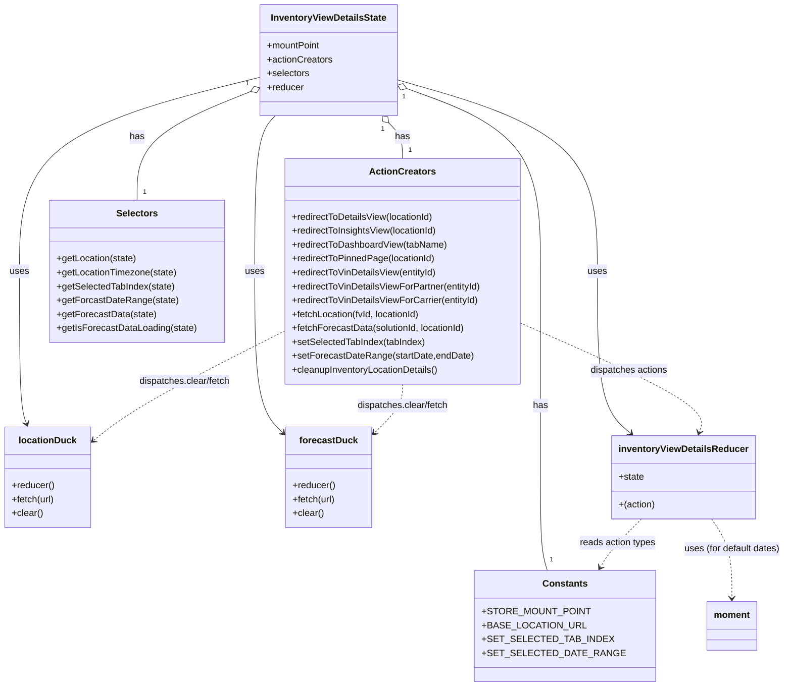

# Diagram: web/portal/src/pages/inventoryview/redux/InventoryViewDetailsState.js

> Auto-generated by Obscura crawlers

## Mermaid

### SVG

<svg id="container" width="1338.794921875" xmlns="http://www.w3.org/2000/svg" class="classDiagram" height="1186" viewBox="0 0 1338.794921875 1186" role="graphics-document document" aria-roledescription="class"><g><defs><marker id="container_class-aggregationStart" class="marker aggregation class" refX="18" refY="7" markerWidth="190" markerHeight="240" orient="auto"><path d="M 18,7 L9,13 L1,7 L9,1 Z"></path></marker></defs><defs><marker id="container_class-aggregationEnd" class="marker aggregation class" refX="1" refY="7" markerWidth="20" markerHeight="28" orient="auto"><path d="M 18,7 L9,13 L1,7 L9,1 Z"></path></marker></defs><defs><marker id="container_class-extensionStart" class="marker extension class" refX="18" refY="7" markerWidth="190" markerHeight="240" orient="auto"><path d="M 1,7 L18,13 V 1 Z"></path></marker></defs><defs><marker id="container_class-extensionEnd" class="marker extension class" refX="1" refY="7" markerWidth="20" markerHeight="28" orient="auto"><path d="M 1,1 V 13 L18,7 Z"></path></marker></defs><defs><marker id="container_class-compositionStart" class="marker composition class" refX="18" refY="7" markerWidth="190" markerHeight="240" orient="auto"><path d="M 18,7 L9,13 L1,7 L9,1 Z"></path></marker></defs><defs><marker id="container_class-compositionEnd" class="marker composition class" refX="1" refY="7" markerWidth="20" markerHeight="28" orient="auto"><path d="M 18,7 L9,13 L1,7 L9,1 Z"></path></marker></defs><defs><marker id="container_class-dependencyStart" class="marker dependency class" refX="6" refY="7" markerWidth="190" markerHeight="240" orient="auto"><path d="M 5,7 L9,13 L1,7 L9,1 Z"></path></marker></defs><defs><marker id="container_class-dependencyEnd" class="marker dependency class" refX="13" refY="7" markerWidth="20" markerHeight="28" orient="auto"><path d="M 18,7 L9,13 L14,7 L9,1 Z"></path></marker></defs><defs><marker id="container_class-lollipopStart" class="marker lollipop class" refX="13" refY="7" markerWidth="190" markerHeight="240" orient="auto"><circle stroke="black" fill="transparent" cx="7" cy="7" r="6"></circle></marker></defs><defs><marker id="container_class-lollipopEnd" class="marker lollipop class" refX="1" refY="7" markerWidth="190" markerHeight="240" orient="auto"><circle stroke="black" fill="transparent" cx="7" cy="7" r="6"></circle></marker></defs><g class="root"><g class="clusters"></g><g class="edgePaths"><path d="M664.194,212.438L668.127,216.532C672.061,220.625,679.929,228.813,683.863,239.073C687.797,249.333,687.797,261.667,687.797,267.833L687.797,274" id="id_InventoryViewDetailsState_ActionCreators_1" class="edge-thickness-normal edge-pattern-solid relation" style=";;;" data-edge="true" data-et="edge" data-id="id_InventoryViewDetailsState_ActionCreators_1" data-points="W3sieCI6NjUyLjI0MTEwMDc5ODg3MjEsInkiOjIwMH0seyJ4Ijo2ODcuNzk2ODc1LCJ5IjoyMzd9LHsieCI6Njg3Ljc5Njg3NSwieSI6Mjc0fV0=" marker-start="url(#container_class-aggregationStart)"></path><path d="M426.969,157.874L394.407,171.062C361.846,184.25,296.724,210.625,264.163,241.979C231.602,273.333,231.602,309.667,231.602,327.833L231.602,346" id="id_InventoryViewDetailsState_Selectors_2" class="edge-thickness-normal edge-pattern-solid relation" style=";;;" data-edge="true" data-et="edge" data-id="id_InventoryViewDetailsState_Selectors_2" data-points="W3sieCI6NDQyLjk1NzAzMTI1LCJ5IjoxNTEuMzk4ODYwNDMyNzUwMDd9LHsieCI6MjMxLjYwMTU2MjUsInkiOjIzN30seyJ4IjoyMzEuNjAxNTYyNSwieSI6MzQ2fV0=" marker-start="url(#container_class-aggregationStart)"></path><path d="M693.237,152.298L732.185,166.415C771.132,180.532,849.027,208.766,887.974,261.55C926.922,314.333,926.922,391.667,926.922,469C926.922,546.333,926.922,623.667,926.922,683C926.922,742.333,926.922,783.667,926.922,825C926.922,866.333,926.922,907.667,928.928,934.5C930.935,961.333,934.948,973.667,936.955,979.833L938.961,986" id="id_InventoryViewDetailsState_Constants_3" class="edge-thickness-normal edge-pattern-solid relation" style=";;;" data-edge="true" data-et="edge" data-id="id_InventoryViewDetailsState_Constants_3" data-points="W3sieCI6Njc3LjAxOTUzMTI1LCJ5IjoxNDYuNDE5NTQ1NDMwMzUwNzh9LHsieCI6OTI2LjkyMTg3NSwieSI6MjM3fSx7IngiOjkyNi45MjE4NzUsInkiOjQ2OX0seyJ4Ijo5MjYuOTIxODc1LCJ5Ijo3MDF9LHsieCI6OTI2LjkyMTg3NSwieSI6ODI1fSx7IngiOjkyNi45MjE4NzUsInkiOjk0OX0seyJ4Ijo5MzguOTYxNDM2Nzk1MTEyOCwieSI6OTg2fV0=" marker-start="url(#container_class-aggregationStart)"></path><path d="M677.02,137.66L734.585,154.216C792.151,170.773,907.283,203.887,964.848,259.11C1022.414,314.333,1022.414,391.667,1022.414,469C1022.414,546.333,1022.414,623.667,1031.361,670.333C1040.309,717,1058.203,733,1067.151,741.001L1076.098,749.001" id="id_InventoryViewDetailsState_inventoryViewDetailsReducer_4" class="edge-thickness-normal edge-pattern-solid relation" style=";;;" data-edge="true" data-et="edge" data-id="id_InventoryViewDetailsState_inventoryViewDetailsReducer_4" data-points="W3sieCI6Njc3LjAxOTUzMTI1LCJ5IjoxMzcuNjU5NzkzMzc5MDA1MDd9LHsieCI6MTAyMi40MTQwNjI1LCJ5IjoyMzd9LHsieCI6MTAyMi40MTQwNjI1LCJ5Ijo0Njl9LHsieCI6MTAyMi40MTQwNjI1LCJ5Ijo3MDF9LHsieCI6MTA4MC41NzA4Nzk1MzYyOTAyLCJ5Ijo3NTN9XQ==" marker-end="url(#container_class-dependencyEnd)"></path><path d="M442.957,133.426L374.301,150.688C305.646,167.95,168.335,202.475,99.679,258.404C31.023,314.333,31.023,391.667,31.023,469C31.023,546.333,31.023,623.667,33.148,667.573C35.272,711.48,39.521,721.96,41.646,727.2L43.77,732.44" id="id_InventoryViewDetailsState_locationDuck_5" class="edge-thickness-normal edge-pattern-solid relation" style=";;;" data-edge="true" data-et="edge" data-id="id_InventoryViewDetailsState_locationDuck_5" data-points="W3sieCI6NDQyLjk1NzAzMTI1LCJ5IjoxMzMuNDI1NjkxMzkzMTI0ODV9LHsieCI6MzEuMDIzNDM3NSwieSI6MjM3fSx7IngiOjMxLjAyMzQzNzUsInkiOjQ2OX0seyJ4IjozMS4wMjM0Mzc1LCJ5Ijo3MDF9LHsieCI6NDYuMDI0MzgyNTYwNDgzODcsInkiOjczOH1d" marker-end="url(#container_class-dependencyEnd)"></path><path d="M467.735,200L461.809,206.167C455.884,212.333,444.032,224.667,438.106,269.5C432.18,314.333,432.18,391.667,432.18,469C432.18,546.333,432.18,623.667,440.543,670.447C448.906,717.228,465.632,733.455,473.995,741.569L482.358,749.683" id="id_InventoryViewDetailsState_forecastDuck_6" class="edge-thickness-normal edge-pattern-solid relation" style=";;;" data-edge="true" data-et="edge" data-id="id_InventoryViewDetailsState_forecastDuck_6" data-points="W3sieCI6NDY3LjczNTQ2MTcwMTEyNzgsInkiOjIwMH0seyJ4Ijo0MzIuMTc5Njg3NSwieSI6MjM3fSx7IngiOjQzMi4xNzk2ODc1LCJ5Ijo0Njl9LHsieCI6NDMyLjE3OTY4NzUsInkiOjcwMX0seyJ4Ijo0ODYuNjY0MDYyNSwieSI6NzUzLjg2MDc4NDI1Mzc5NzV9XQ==" marker-end="url(#container_class-dependencyEnd)"></path><path d="M483.672,572.809L441.66,594.174C399.648,615.539,315.625,658.27,261.55,689.587C207.475,720.904,183.349,740.808,171.285,750.76L159.222,760.712" id="id_ActionCreators_locationDuck_7" class="edge-thickness-normal edge-pattern-dashed relation" style=";;;" data-edge="true" data-et="edge" data-id="id_ActionCreators_locationDuck_7" data-points="W3sieCI6NDgzLjY3MTg3NSwieSI6NTcyLjgwODYwNzE5NjA2OH0seyJ4IjoyMzEuNjAxNTYyNSwieSI6NzAxfSx7IngiOjE1NC41OTM3NSwieSI6NzY0LjUzMDc0NDg0MTIwNzl9XQ==" marker-end="url(#container_class-dependencyEnd)"></path><path d="M687.797,664L687.797,670.167C687.797,676.333,687.797,688.667,679.434,702.947C671.071,717.228,654.345,733.455,645.982,741.569L637.619,749.683" id="id_ActionCreators_forecastDuck_8" class="edge-thickness-normal edge-pattern-dashed relation" style=";;;" data-edge="true" data-et="edge" data-id="id_ActionCreators_forecastDuck_8" data-points="W3sieCI6Njg3Ljc5Njg3NSwieSI6NjY0fSx7IngiOjY4Ny43OTY4NzUsInkiOjcwMX0seyJ4Ijo2MzMuMzEyNSwieSI6NzUzLjg2MDc4NDI1Mzc5NzV9XQ==" marker-end="url(#container_class-dependencyEnd)"></path><path d="M891.922,560.572L944.094,583.976C996.266,607.381,1100.611,654.191,1150.051,685.319C1199.491,716.448,1194.027,731.896,1191.295,739.62L1188.563,747.343" id="id_ActionCreators_inventoryViewDetailsReducer_9" class="edge-thickness-normal edge-pattern-dashed relation" style=";;;" data-edge="true" data-et="edge" data-id="id_ActionCreators_inventoryViewDetailsReducer_9" data-points="W3sieCI6ODkxLjkyMTg3NSwieSI6NTYwLjU3MTU5MjA0NjM3NzJ9LHsieCI6MTIwNC45NTUwNzgxMjUsInkiOjcwMX0seyJ4IjoxMTg2LjU2MjQzNjk5NTk2NzgsInkiOjc1M31d" marker-end="url(#container_class-dependencyEnd)"></path><path d="M1095.105,897L1087.162,905.667C1079.219,914.333,1063.332,931.667,1052.309,945.635C1041.287,959.604,1035.128,970.208,1032.049,975.51L1028.969,980.812" id="id_inventoryViewDetailsReducer_Constants_10" class="edge-thickness-normal edge-pattern-dashed relation" style=";;;" data-edge="true" data-et="edge" data-id="id_inventoryViewDetailsReducer_Constants_10" data-points="W3sieCI6MTA5NS4xMDUxNTM3Mjk4Mzg4LCJ5Ijo4OTd9LHsieCI6MTA0Ny40NDUzMTI1LCJ5Ijo5NDl9LHsieCI6MTAyNS45NTU3OTc2OTczNjgzLCJ5Ijo5ODZ9XQ==" marker-end="url(#container_class-dependencyEnd)"></path><path d="M1210.693,897L1216.663,905.667C1222.633,914.333,1234.574,931.667,1240.544,954.5C1246.514,977.333,1246.514,1005.667,1246.514,1019.833L1246.514,1034" id="id_inventoryViewDetailsReducer_moment_11" class="edge-thickness-normal edge-pattern-dashed relation" style=";;;" data-edge="true" data-et="edge" data-id="id_inventoryViewDetailsReducer_moment_11" data-points="W3sieCI6MTIxMC42OTMyMzMzNjY5MzU0LCJ5Ijo4OTd9LHsieCI6MTI0Ni41MTM2NzE4NzUsInkiOjk0OX0seyJ4IjoxMjQ2LjUxMzY3MTg3NSwieSI6MTA0MH1d" marker-end="url(#container_class-dependencyEnd)"></path></g><g class="edgeLabels"><g class="edgeLabel" transform="translate(687.796875, 237)"><g class="label" data-id="id_InventoryViewDetailsState_ActionCreators_1" transform="translate(-12.703125, -12)"><foreignObject width="25.40625" height="24">

has

</foreignObject></g></g><g class="edgeLabel" transform="translate(231.6015625, 237)"><g class="label" data-id="id_InventoryViewDetailsState_Selectors_2" transform="translate(-12.703125, -12)"><foreignObject width="25.40625" height="24">

has

</foreignObject></g></g><g class="edgeLabel" transform="translate(926.921875, 701)"><g class="label" data-id="id_InventoryViewDetailsState_Constants_3" transform="translate(-12.703125, -12)"><foreignObject width="25.40625" height="24">

has

</foreignObject></g></g><g class="edgeLabel" transform="translate(1022.4140625, 469)"><g class="label" data-id="id_InventoryViewDetailsState_inventoryViewDetailsReducer_4" transform="translate(-16.4921875, -12)"><foreignObject width="32.984375" height="24">

uses

</foreignObject></g></g><g class="edgeLabel" transform="translate(31.0234375, 469)"><g class="label" data-id="id_InventoryViewDetailsState_locationDuck_5" transform="translate(-16.4921875, -12)"><foreignObject width="32.984375" height="24">

uses

</foreignObject></g></g><g class="edgeLabel" transform="translate(432.1796875, 469)"><g class="label" data-id="id_InventoryViewDetailsState_forecastDuck_6" transform="translate(-16.4921875, -12)"><foreignObject width="32.984375" height="24">

uses

</foreignObject></g></g><g class="edgeLabel" transform="translate(313.14392, 659.5313)"><g class="label" data-id="id_ActionCreators_locationDuck_7" transform="translate(-80.546875, -12)"><foreignObject width="161.09375" height="24">

dispatches.clear/fetch

</foreignObject></g></g><g class="edgeLabel" transform="translate(687.796875, 701)"><g class="label" data-id="id_ActionCreators_forecastDuck_8" transform="translate(-80.546875, -12)"><foreignObject width="161.09375" height="24">

dispatches.clear/fetch

</foreignObject></g></g><g class="edgeLabel" transform="translate(1073.601, 642.07384)"><g class="label" data-id="id_ActionCreators_inventoryViewDetailsReducer_9" transform="translate(-67.71875, -12)"><foreignObject width="135.4375" height="24">

dispatches actions

</foreignObject></g></g><g class="edgeLabel" transform="translate(1056.81996, 938.77165)"><g class="label" data-id="id_inventoryViewDetailsReducer_Constants_10" transform="translate(-66.5546875, -12)"><foreignObject width="133.109375" height="24">

reads action types

</foreignObject></g></g><g class="edgeLabel" transform="translate(1246.513671875, 949)"><g class="label" data-id="id_inventoryViewDetailsReducer_moment_11" transform="translate(-84.28125, -12)"><foreignObject width="168.5625" height="24">

uses (for default dates)

</foreignObject></g></g><g class="edgeTerminals" transform="translate(653.5511719419986, 223.01159880591794)"><g class="inner" transform="translate(0, 0)"><foreignObject style="width: 9px; height: 12px;">
1
</foreignObject></g></g><g class="edgeTerminals" transform="translate(421.10600661758906, 144.06519457483512)"><g class="inner" transform="translate(0, 0)"><foreignObject style="width: 9px; height: 12px;">
1
</foreignObject></g></g><g class="edgeTerminals" transform="translate(688.36057102936, 166.48520871557034)"><g class="inner" transform="translate(0, 0)"><foreignObject style="width: 9px; height: 12px;">
1
</foreignObject></g></g><g class="edgeTerminals" transform="translate(697.7968774999998, 251.5000021428571)"><g class="inner" transform="translate(0, 0)"></g><foreignObject style="width: 9px; height: 12px;">
1
</foreignObject></g><g class="edgeTerminals" transform="translate(241.60156124999997, 323.4999989285714)"><g class="inner" transform="translate(0, 0)"></g><foreignObject style="width: 9px; height: 12px;">
1
</foreignObject></g><g class="edgeTerminals" transform="translate(942.8103686649121, 959.7174627150987)"><g class="inner" transform="translate(0, 0)"></g><foreignObject style="width: 9px; height: 12px;">
1
</foreignObject></g></g><g class="nodes"><g class="node default" id="classId-InventoryViewDetailsState-0" transform="translate(559.98828125, 104)"><g class="basic label-container"><path d="M-117.03125 -96 L117.03125 -96 L117.03125 96 L-117.03125 96" stroke="none" stroke-width="0" fill="#ECECFF" style=""></path><path d="M-117.03125 -96 C-34.40530208882153 -96, 48.22064582235694 -96, 117.03125 -96 M-117.03125 -96 C-61.356892214475806 -96, -5.682534428951612 -96, 117.03125 -96 M117.03125 -96 C117.03125 -32.411149613525446, 117.03125 31.17770077294911, 117.03125 96 M117.03125 -96 C117.03125 -38.80273083186629, 117.03125 18.394538336267416, 117.03125 96 M117.03125 96 C36.66087531152802 96, -43.70949937694397 96, -117.03125 96 M117.03125 96 C62.3597042301696 96, 7.688158460339196 96, -117.03125 96 M-117.03125 96 C-117.03125 44.900386066855226, -117.03125 -6.199227866289547, -117.03125 -96 M-117.03125 96 C-117.03125 52.91547308785692, -117.03125 9.830946175713834, -117.03125 -96" stroke="#9370DB" stroke-width="1.3" fill="none" stroke-dasharray="0 0" style=""></path></g><g class="annotation-group text" transform="translate(0, -72)"></g><g class="label-group text" transform="translate(-96.984375, -72)"><g class="label" style="font-weight: bolder" transform="translate(0,-12)"><foreignObject width="193.96875" height="24">

InventoryViewDetailsState

</foreignObject></g></g><g class="members-group text" transform="translate(-105.03125, -24)"><g class="label" style="" transform="translate(0,-12)"><foreignObject width="93.34375" height="24">

+mountPoint

</foreignObject></g><g class="label" style="" transform="translate(0,12)"><foreignObject width="113.078125" height="24">

+actionCreators

</foreignObject></g><g class="label" style="" transform="translate(0,36)"><foreignObject width="73.453125" height="24">

+selectors

</foreignObject></g><g class="label" style="" transform="translate(0,60)"><foreignObject width="63.515625" height="24">

+reducer

</foreignObject></g></g><g class="methods-group text" transform="translate(-105.03125, 96)"></g><g class="divider" style=""><path d="M-117.03125 -48 C-34.510398755232714 -48, 48.01045248953457 -48, 117.03125 -48 M-117.03125 -48 C-42.412479417794415 -48, 32.20629116441117 -48, 117.03125 -48" stroke="#9370DB" stroke-width="1.3" fill="none" stroke-dasharray="0 0" style=""></path></g><g class="divider" style=""><path d="M-117.03125 72 C-65.57702951753285 72, -14.122809035065686 72, 117.03125 72 M-117.03125 72 C-43.87739940109208 72, 29.276451197815845 72, 117.03125 72" stroke="#9370DB" stroke-width="1.3" fill="none" stroke-dasharray="0 0" style=""></path></g></g><g class="node default" id="classId-locationDuck-1" transform="translate(81.296875, 825)"><g class="basic label-container"><path d="M-73.296875 -87 L73.296875 -87 L73.296875 87 L-73.296875 87" stroke="none" stroke-width="0" fill="#ECECFF" style=""></path><path d="M-73.296875 -87 C-41.85357373544258 -87, -10.410272470885168 -87, 73.296875 -87 M-73.296875 -87 C-41.62171259758365 -87, -9.946550195167298 -87, 73.296875 -87 M73.296875 -87 C73.296875 -25.490758605445166, 73.296875 36.01848278910967, 73.296875 87 M73.296875 -87 C73.296875 -40.335384623202984, 73.296875 6.329230753594032, 73.296875 87 M73.296875 87 C24.03261892502438 87, -25.23163714995124 87, -73.296875 87 M73.296875 87 C23.517480155754647 87, -26.261914688490705 87, -73.296875 87 M-73.296875 87 C-73.296875 51.369107661233855, -73.296875 15.73821532246771, -73.296875 -87 M-73.296875 87 C-73.296875 34.264982524050886, -73.296875 -18.470034951898228, -73.296875 -87" stroke="#9370DB" stroke-width="1.3" fill="none" stroke-dasharray="0 0" style=""></path></g><g class="annotation-group text" transform="translate(0, -63)"></g><g class="label-group text" transform="translate(-47.8125, -63)"><g class="label" style="font-weight: bolder" transform="translate(0,-12)"><foreignObject width="95.625" height="24">

locationDuck

</foreignObject></g></g><g class="members-group text" transform="translate(-61.296875, -15)"></g><g class="methods-group text" transform="translate(-61.296875, 15)"><g class="label" style="" transform="translate(0,-12)"><foreignObject width="73.875" height="24">

+reducer()

</foreignObject></g><g class="label" style="" transform="translate(0,12)"><foreignObject width="74.78125" height="24">

+fetch(url)

</foreignObject></g><g class="label" style="" transform="translate(0,36)"><foreignObject width="54.0625" height="24">

+clear()

</foreignObject></g></g><g class="divider" style=""><path d="M-73.296875 -39 C-18.98479602476177 -39, 35.32728295047646 -39, 73.296875 -39 M-73.296875 -39 C-38.45542227179262 -39, -3.6139695435852417 -39, 73.296875 -39" stroke="#9370DB" stroke-width="1.3" fill="none" stroke-dasharray="0 0" style=""></path></g><g class="divider" style=""><path d="M-73.296875 -15 C-35.14734053168558 -15, 3.002193936628842 -15, 73.296875 -15 M-73.296875 -15 C-32.58187203135362 -15, 8.133130937292762 -15, 73.296875 -15" stroke="#9370DB" stroke-width="1.3" fill="none" stroke-dasharray="0 0" style=""></path></g></g><g class="node default" id="classId-forecastDuck-2" transform="translate(559.98828125, 825)"><g class="basic label-container"><path d="M-73.32421875 -87 L73.32421875 -87 L73.32421875 87 L-73.32421875 87" stroke="none" stroke-width="0" fill="#ECECFF" style=""></path><path d="M-73.32421875 -87 C-24.638976342432564 -87, 24.046266065134873 -87, 73.32421875 -87 M-73.32421875 -87 C-25.326062275892973 -87, 22.672094198214054 -87, 73.32421875 -87 M73.32421875 -87 C73.32421875 -34.59583465338277, 73.32421875 17.808330693234467, 73.32421875 87 M73.32421875 -87 C73.32421875 -42.72931830577696, 73.32421875 1.5413633884460864, 73.32421875 87 M73.32421875 87 C41.93172536213362 87, 10.539231974267246 87, -73.32421875 87 M73.32421875 87 C33.71845419003453 87, -5.887310369930944 87, -73.32421875 87 M-73.32421875 87 C-73.32421875 24.588583637364344, -73.32421875 -37.82283272527131, -73.32421875 -87 M-73.32421875 87 C-73.32421875 36.20264293597317, -73.32421875 -14.594714128053667, -73.32421875 -87" stroke="#9370DB" stroke-width="1.3" fill="none" stroke-dasharray="0 0" style=""></path></g><g class="annotation-group text" transform="translate(0, -63)"></g><g class="label-group text" transform="translate(-47.8671875, -63)"><g class="label" style="font-weight: bolder" transform="translate(0,-12)"><foreignObject width="95.734375" height="24">

forecastDuck

</foreignObject></g></g><g class="members-group text" transform="translate(-61.32421875, -15)"></g><g class="methods-group text" transform="translate(-61.32421875, 15)"><g class="label" style="" transform="translate(0,-12)"><foreignObject width="73.875" height="24">

+reducer()

</foreignObject></g><g class="label" style="" transform="translate(0,12)"><foreignObject width="74.78125" height="24">

+fetch(url)

</foreignObject></g><g class="label" style="" transform="translate(0,36)"><foreignObject width="54.0625" height="24">

+clear()

</foreignObject></g></g><g class="divider" style=""><path d="M-73.32421875 -39 C-28.612701850850023 -39, 16.098815048299954 -39, 73.32421875 -39 M-73.32421875 -39 C-28.59884307762811 -39, 16.12653259474378 -39, 73.32421875 -39" stroke="#9370DB" stroke-width="1.3" fill="none" stroke-dasharray="0 0" style=""></path></g><g class="divider" style=""><path d="M-73.32421875 -15 C-23.20587873348859 -15, 26.91246128302282 -15, 73.32421875 -15 M-73.32421875 -15 C-37.40948144633021 -15, -1.4947441426604229 -15, 73.32421875 -15" stroke="#9370DB" stroke-width="1.3" fill="none" stroke-dasharray="0 0" style=""></path></g></g><g class="node default" id="classId-inventoryViewDetailsReducer-3" transform="translate(1161.095703125, 825)"><g class="basic label-container"><path d="M-119.4921875 -72 L119.4921875 -72 L119.4921875 72 L-119.4921875 72" stroke="none" stroke-width="0" fill="#ECECFF" style=""></path><path d="M-119.4921875 -72 C-25.211581033514946 -72, 69.06902543297011 -72, 119.4921875 -72 M-119.4921875 -72 C-33.932164374552244 -72, 51.62785875089551 -72, 119.4921875 -72 M119.4921875 -72 C119.4921875 -31.132893531343882, 119.4921875 9.734212937312236, 119.4921875 72 M119.4921875 -72 C119.4921875 -26.161097904798396, 119.4921875 19.677804190403208, 119.4921875 72 M119.4921875 72 C61.0584212497829 72, 2.6246549995658057 72, -119.4921875 72 M119.4921875 72 C62.07065067041475 72, 4.6491138408295 72, -119.4921875 72 M-119.4921875 72 C-119.4921875 23.88864059507509, -119.4921875 -24.222718809849823, -119.4921875 -72 M-119.4921875 72 C-119.4921875 18.463176813746955, -119.4921875 -35.07364637250609, -119.4921875 -72" stroke="#9370DB" stroke-width="1.3" fill="none" stroke-dasharray="0 0" style=""></path></g><g class="annotation-group text" transform="translate(0, -48)"></g><g class="label-group text" transform="translate(-107.4921875, -48)"><g class="label" style="font-weight: bolder" transform="translate(0,-12)"><foreignObject width="214.984375" height="24">

inventoryViewDetailsReducer

</foreignObject></g></g><g class="members-group text" transform="translate(-107.4921875, 0)"><g class="label" style="" transform="translate(0,-12)"><foreignObject width="44.09375" height="24">

+state

</foreignObject></g></g><g class="methods-group text" transform="translate(-107.4921875, 48)"><g class="label" style="" transform="translate(0,-12)"><foreignObject width="63.71875" height="24">

+(action)

</foreignObject></g></g><g class="divider" style=""><path d="M-119.4921875 -24 C-59.45816290481698 -24, 0.5758616903660396 -24, 119.4921875 -24 M-119.4921875 -24 C-28.195226965828695 -24, 63.10173356834261 -24, 119.4921875 -24" stroke="#9370DB" stroke-width="1.3" fill="none" stroke-dasharray="0 0" style=""></path></g><g class="divider" style=""><path d="M-119.4921875 24 C-61.867415718811124 24, -4.242643937622248 24, 119.4921875 24 M-119.4921875 24 C-56.06411612372761 24, 7.363955252544784 24, 119.4921875 24" stroke="#9370DB" stroke-width="1.3" fill="none" stroke-dasharray="0 0" style=""></path></g></g><g class="node default" id="classId-ActionCreators-4" transform="translate(687.796875, 469)"><g class="basic label-container"><path d="M-204.125 -195 L204.125 -195 L204.125 195 L-204.125 195" stroke="none" stroke-width="0" fill="#ECECFF" style=""></path><path d="M-204.125 -195 C-87.55990664388275 -195, 29.00518671223449 -195, 204.125 -195 M-204.125 -195 C-58.18845127288685 -195, 87.7480974542263 -195, 204.125 -195 M204.125 -195 C204.125 -105.40880868294073, 204.125 -15.81761736588146, 204.125 195 M204.125 -195 C204.125 -48.003867361574834, 204.125 98.99226527685033, 204.125 195 M204.125 195 C73.55292314210547 195, -57.01915371578906 195, -204.125 195 M204.125 195 C108.29006397625638 195, 12.455127952512754 195, -204.125 195 M-204.125 195 C-204.125 83.88283216769909, -204.125 -27.234335664601815, -204.125 -195 M-204.125 195 C-204.125 68.58988511460865, -204.125 -57.8202297707827, -204.125 -195" stroke="#9370DB" stroke-width="1.3" fill="none" stroke-dasharray="0 0" style=""></path></g><g class="annotation-group text" transform="translate(0, -171)"></g><g class="label-group text" transform="translate(-53.96875, -171)"><g class="label" style="font-weight: bolder" transform="translate(0,-12)"><foreignObject width="107.9375" height="24">

ActionCreators

</foreignObject></g></g><g class="members-group text" transform="translate(-192.125, -123)"></g><g class="methods-group text" transform="translate(-192.125, -93)"><g class="label" style="" transform="translate(0,-12)"><foreignObject width="248.53125" height="24">

+redirectToDetailsView(locationId)

</foreignObject></g><g class="label" style="" transform="translate(0,12)"><foreignObject width="255.5" height="24">

+redirectToInsightsView(locationId)

</foreignObject></g><g class="label" style="" transform="translate(0,36)"><foreignObject width="269.15625" height="24">

+redirectToDashboardView(tabName)

</foreignObject></g><g class="label" style="" transform="translate(0,60)"><foreignObject width="249.46875" height="24">

+redirectToPinnedPage(locationId)

</foreignObject></g><g class="label" style="" transform="translate(0,84)"><foreignObject width="254.125" height="24">

+redirectToVinDetailsView(entityId)

</foreignObject></g><g class="label" style="" transform="translate(0,108)"><foreignObject width="330.28125" height="24">

+redirectToVinDetailsViewForPartner(entityId)

</foreignObject></g><g class="label" style="" transform="translate(0,132)"><foreignObject width="326.203125" height="24">

+redirectToVinDetailsViewForCarrier(entityId)

</foreignObject></g><g class="label" style="" transform="translate(0,156)"><foreignObject width="225.75" height="24">

+fetchLocation(fvId, locationId)

</foreignObject></g><g class="label" style="" transform="translate(0,180)"><foreignObject width="303.78125" height="24">

+fetchForecastData(solutionId, locationId)

</foreignObject></g><g class="label" style="" transform="translate(0,204)"><foreignObject width="232.125" height="24">

+setSelectedTabIndex(tabIndex)

</foreignObject></g><g class="label" style="" transform="translate(0,228)"><foreignObject width="309.34375" height="24">

+setForecastDateRange(startDate,endDate)

</foreignObject></g><g class="label" style="" transform="translate(0,252)"><foreignObject width="257.0625" height="24">

+cleanupInventoryLocationDetails()

</foreignObject></g></g><g class="divider" style=""><path d="M-204.125 -147 C-52.95588203204244 -147, 98.21323593591512 -147, 204.125 -147 M-204.125 -147 C-80.19189136908152 -147, 43.741217261836965 -147, 204.125 -147" stroke="#9370DB" stroke-width="1.3" fill="none" stroke-dasharray="0 0" style=""></path></g><g class="divider" style=""><path d="M-204.125 -123 C-77.73969362277396 -123, 48.64561275445209 -123, 204.125 -123 M-204.125 -123 C-78.08084724287008 -123, 47.963305514259844 -123, 204.125 -123" stroke="#9370DB" stroke-width="1.3" fill="none" stroke-dasharray="0 0" style=""></path></g></g><g class="node default" id="classId-Selectors-5" transform="translate(231.6015625, 469)"><g class="basic label-container"><path d="M-149.0859375 -123 L149.0859375 -123 L149.0859375 123 L-149.0859375 123" stroke="none" stroke-width="0" fill="#ECECFF" style=""></path><path d="M-149.0859375 -123 C-39.42719982485448 -123, 70.23153785029103 -123, 149.0859375 -123 M-149.0859375 -123 C-60.55762286431124 -123, 27.970691771377517 -123, 149.0859375 -123 M149.0859375 -123 C149.0859375 -34.681861358643715, 149.0859375 53.63627728271257, 149.0859375 123 M149.0859375 -123 C149.0859375 -29.671719799338376, 149.0859375 63.65656040132325, 149.0859375 123 M149.0859375 123 C48.147769269178596 123, -52.79039896164281 123, -149.0859375 123 M149.0859375 123 C47.69707692462342 123, -53.691783650753166 123, -149.0859375 123 M-149.0859375 123 C-149.0859375 28.418850281809796, -149.0859375 -66.16229943638041, -149.0859375 -123 M-149.0859375 123 C-149.0859375 27.75118110728252, -149.0859375 -67.49763778543496, -149.0859375 -123" stroke="#9370DB" stroke-width="1.3" fill="none" stroke-dasharray="0 0" style=""></path></g><g class="annotation-group text" transform="translate(0, -99)"></g><g class="label-group text" transform="translate(-34.171875, -99)"><g class="label" style="font-weight: bolder" transform="translate(0,-12)"><foreignObject width="68.34375" height="24">

Selectors

</foreignObject></g></g><g class="members-group text" transform="translate(-137.0859375, -51)"></g><g class="methods-group text" transform="translate(-137.0859375, -21)"><g class="label" style="" transform="translate(0,-12)"><foreignObject width="139.125" height="24">

+getLocation(state)

</foreignObject></g><g class="label" style="" transform="translate(0,12)"><foreignObject width="208.546875" height="24">

+getLocationTimezone(state)

</foreignObject></g><g class="label" style="" transform="translate(0,36)"><foreignObject width="204.9375" height="24">

+getSelectedTabIndex(state)

</foreignObject></g><g class="label" style="" transform="translate(0,60)"><foreignObject width="206.125" height="24">

+getForcastDateRange(state)

</foreignObject></g><g class="label" style="" transform="translate(0,84)"><foreignObject width="170.5625" height="24">

+getForecastData(state)

</foreignObject></g><g class="label" style="" transform="translate(0,108)"><foreignObject width="240" height="24">

+getIsForecastDataLoading(state)

</foreignObject></g></g><g class="divider" style=""><path d="M-149.0859375 -75 C-46.62530772290707 -75, 55.835322054185866 -75, 149.0859375 -75 M-149.0859375 -75 C-54.538095310934224 -75, 40.00974687813155 -75, 149.0859375 -75" stroke="#9370DB" stroke-width="1.3" fill="none" stroke-dasharray="0 0" style=""></path></g><g class="divider" style=""><path d="M-149.0859375 -51 C-67.9107241144954 -51, 13.26448927100921 -51, 149.0859375 -51 M-149.0859375 -51 C-52.378831446996756 -51, 44.32827460600649 -51, 149.0859375 -51" stroke="#9370DB" stroke-width="1.3" fill="none" stroke-dasharray="0 0" style=""></path></g></g><g class="node default" id="classId-Constants-6" transform="translate(970.19921875, 1082)"><g class="basic label-container"><path d="M-134.98828125 -96 L134.98828125 -96 L134.98828125 96 L-134.98828125 96" stroke="none" stroke-width="0" fill="#ECECFF" style=""></path><path d="M-134.98828125 -96 C-74.92412256143021 -96, -14.859963872860405 -96, 134.98828125 -96 M-134.98828125 -96 C-39.35274924360512 -96, 56.282782762789765 -96, 134.98828125 -96 M134.98828125 -96 C134.98828125 -23.752711587639524, 134.98828125 48.49457682472095, 134.98828125 96 M134.98828125 -96 C134.98828125 -23.595384526141416, 134.98828125 48.80923094771717, 134.98828125 96 M134.98828125 96 C57.51660920359001 96, -19.955062842819984 96, -134.98828125 96 M134.98828125 96 C68.51785006224848 96, 2.0474188744969695 96, -134.98828125 96 M-134.98828125 96 C-134.98828125 22.28122305282895, -134.98828125 -51.4375538943421, -134.98828125 -96 M-134.98828125 96 C-134.98828125 23.378025063370302, -134.98828125 -49.243949873259396, -134.98828125 -96" stroke="#9370DB" stroke-width="1.3" fill="none" stroke-dasharray="0 0" style=""></path></g><g class="annotation-group text" transform="translate(0, -72)"></g><g class="label-group text" transform="translate(-36.5390625, -72)"><g class="label" style="font-weight: bolder" transform="translate(0,-12)"><foreignObject width="73.078125" height="24">

Constants

</foreignObject></g></g><g class="members-group text" transform="translate(-122.98828125, -24)"><g class="label" style="" transform="translate(0,-12)"><foreignObject width="166.03125" height="24">

+STORE_MOUNT_POINT

</foreignObject></g><g class="label" style="" transform="translate(0,12)"><foreignObject width="159.125" height="24">

+BASE_LOCATION_URL

</foreignObject></g><g class="label" style="" transform="translate(0,36)"><foreignObject width="194.0625" height="24">

+SET_SELECTED_TAB_INDEX

</foreignObject></g><g class="label" style="" transform="translate(0,60)"><foreignObject width="209.4375" height="24">

+SET_SELECTED_DATE_RANGE

</foreignObject></g></g><g class="methods-group text" transform="translate(-122.98828125, 96)"></g><g class="divider" style=""><path d="M-134.98828125 -48 C-71.46304186248084 -48, -7.937802474961671 -48, 134.98828125 -48 M-134.98828125 -48 C-37.943589828907946 -48, 59.10110159218411 -48, 134.98828125 -48" stroke="#9370DB" stroke-width="1.3" fill="none" stroke-dasharray="0 0" style=""></path></g><g class="divider" style=""><path d="M-134.98828125 72 C-77.0906811258798 72, -19.19308100175961 72, 134.98828125 72 M-134.98828125 72 C-31.815060572949875 72, 71.35816010410025 72, 134.98828125 72" stroke="#9370DB" stroke-width="1.3" fill="none" stroke-dasharray="0 0" style=""></path></g></g><g class="node default" id="classId-moment-7" transform="translate(1246.513671875, 1082)"><g class="basic label-container"><path d="M-42.3125 -42 L42.3125 -42 L42.3125 42 L-42.3125 42" stroke="none" stroke-width="0" fill="#ECECFF" style=""></path><path d="M-42.3125 -42 C-23.91532326310524 -42, -5.518146526210479 -42, 42.3125 -42 M-42.3125 -42 C-24.715548649980015 -42, -7.1185972999600295 -42, 42.3125 -42 M42.3125 -42 C42.3125 -11.333151298181448, 42.3125 19.333697403637103, 42.3125 42 M42.3125 -42 C42.3125 -12.90811658647204, 42.3125 16.18376682705592, 42.3125 42 M42.3125 42 C12.48449627989007 42, -17.34350744021986 42, -42.3125 42 M42.3125 42 C24.20223928152778 42, 6.091978563055562 42, -42.3125 42 M-42.3125 42 C-42.3125 22.7826125040752, -42.3125 3.5652250081503993, -42.3125 -42 M-42.3125 42 C-42.3125 20.25733536655439, -42.3125 -1.4853292668912204, -42.3125 -42" stroke="#9370DB" stroke-width="1.3" fill="none" stroke-dasharray="0 0" style=""></path></g><g class="annotation-group text" transform="translate(0, -18)"></g><g class="label-group text" transform="translate(-30.3125, -18)"><g class="label" style="font-weight: bolder" transform="translate(0,-12)"><foreignObject width="60.625" height="24">

moment

</foreignObject></g></g><g class="members-group text" transform="translate(-30.3125, 30)"></g><g class="methods-group text" transform="translate(-30.3125, 60)"></g><g class="divider" style=""><path d="M-42.3125 6 C-13.01064994811815 6, 16.2912001037637 6, 42.3125 6 M-42.3125 6 C-14.689367852572712 6, 12.933764294854576 6, 42.3125 6" stroke="#9370DB" stroke-width="1.3" fill="none" stroke-dasharray="0 0" style=""></path></g><g class="divider" style=""><path d="M-42.3125 24 C-23.772589510833505 24, -5.2326790216670105 24, 42.3125 24 M-42.3125 24 C-13.819981616373369 24, 14.672536767253263 24, 42.3125 24" stroke="#9370DB" stroke-width="1.3" fill="none" stroke-dasharray="0 0" style=""></path></g></g></g></g></g></svg>
