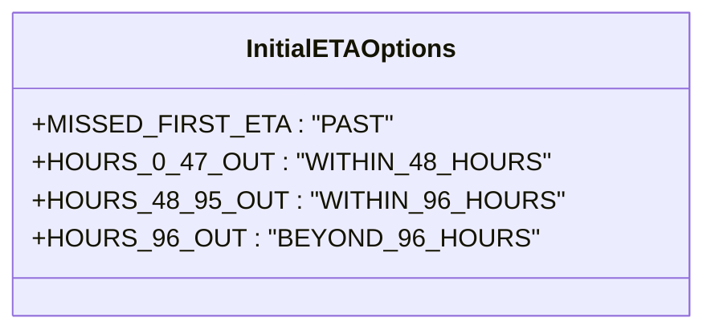
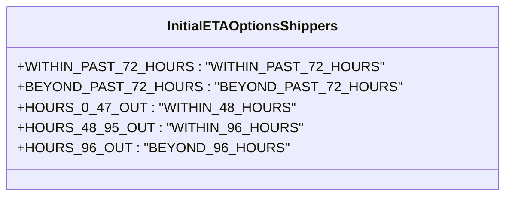
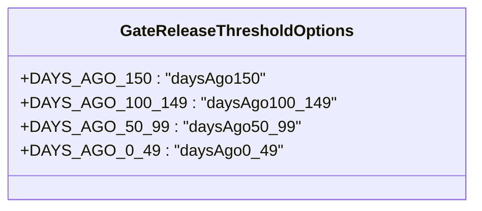

# Diagram: web/portal/src/pages/inventoryview/utils/consts.ts

> Auto-generated by Obscura crawlers

## Diagram 1

### SVG

<svg id="container" width="408.34375" xmlns="http://www.w3.org/2000/svg" class="classDiagram" height="208" viewBox="0 0 408.34375 208" role="graphics-document document" aria-roledescription="class"><g><defs><marker id="container_class-aggregationStart" class="marker aggregation class" refX="18" refY="7" markerWidth="190" markerHeight="240" orient="auto"><path d="M 18,7 L9,13 L1,7 L9,1 Z"></path></marker></defs><defs><marker id="container_class-aggregationEnd" class="marker aggregation class" refX="1" refY="7" markerWidth="20" markerHeight="28" orient="auto"><path d="M 18,7 L9,13 L1,7 L9,1 Z"></path></marker></defs><defs><marker id="container_class-extensionStart" class="marker extension class" refX="18" refY="7" markerWidth="190" markerHeight="240" orient="auto"><path d="M 1,7 L18,13 V 1 Z"></path></marker></defs><defs><marker id="container_class-extensionEnd" class="marker extension class" refX="1" refY="7" markerWidth="20" markerHeight="28" orient="auto"><path d="M 1,1 V 13 L18,7 Z"></path></marker></defs><defs><marker id="container_class-compositionStart" class="marker composition class" refX="18" refY="7" markerWidth="190" markerHeight="240" orient="auto"><path d="M 18,7 L9,13 L1,7 L9,1 Z"></path></marker></defs><defs><marker id="container_class-compositionEnd" class="marker composition class" refX="1" refY="7" markerWidth="20" markerHeight="28" orient="auto"><path d="M 18,7 L9,13 L1,7 L9,1 Z"></path></marker></defs><defs><marker id="container_class-dependencyStart" class="marker dependency class" refX="6" refY="7" markerWidth="190" markerHeight="240" orient="auto"><path d="M 5,7 L9,13 L1,7 L9,1 Z"></path></marker></defs><defs><marker id="container_class-dependencyEnd" class="marker dependency class" refX="13" refY="7" markerWidth="20" markerHeight="28" orient="auto"><path d="M 18,7 L9,13 L14,7 L9,1 Z"></path></marker></defs><defs><marker id="container_class-lollipopStart" class="marker lollipop class" refX="13" refY="7" markerWidth="190" markerHeight="240" orient="auto"><circle stroke="black" fill="transparent" cx="7" cy="7" r="6"></circle></marker></defs><defs><marker id="container_class-lollipopEnd" class="marker lollipop class" refX="1" refY="7" markerWidth="190" markerHeight="240" orient="auto"><circle stroke="black" fill="transparent" cx="7" cy="7" r="6"></circle></marker></defs><g class="root"><g class="clusters"></g><g class="edgePaths"></g><g class="edgeLabels"></g><g class="nodes"><g class="node default" id="classId-InitialETAOptions-0" transform="translate(204.171875, 104)"><g class="basic label-container"><path d="M-196.171875 -96 L196.171875 -96 L196.171875 96 L-196.171875 96" stroke="none" stroke-width="0" fill="#ECECFF" style=""></path><path d="M-196.171875 -96 C-107.62322109788111 -96, -19.074567195762228 -96, 196.171875 -96 M-196.171875 -96 C-77.32036455290769 -96, 41.53114589418462 -96, 196.171875 -96 M196.171875 -96 C196.171875 -22.28078676071179, 196.171875 51.43842647857642, 196.171875 96 M196.171875 -96 C196.171875 -23.048106470376354, 196.171875 49.90378705924729, 196.171875 96 M196.171875 96 C110.01013296943151 96, 23.84839093886302 96, -196.171875 96 M196.171875 96 C107.45632585063609 96, 18.740776701272182 96, -196.171875 96 M-196.171875 96 C-196.171875 54.962588601580485, -196.171875 13.92517720316097, -196.171875 -96 M-196.171875 96 C-196.171875 46.07885933141918, -196.171875 -3.842281337161637, -196.171875 -96" stroke="#9370DB" stroke-width="1.3" fill="none" stroke-dasharray="0 0" style=""></path></g><g class="annotation-group text" transform="translate(0, -72)"></g><g class="label-group text" transform="translate(-62.8125, -72)"><g class="label" style="font-weight: bolder" transform="translate(0,-12)"><foreignObject width="125.625" height="24">

InitialETAOptions

</foreignObject></g></g><g class="members-group text" transform="translate(-184.171875, -24)"><g class="label" style="" transform="translate(0,-12)"><foreignObject width="199.84375" height="24">

+MISSED_FIRST_ETA : "PAST"

</foreignObject></g><g class="label" style="" transform="translate(0,12)"><foreignObject width="292.5" height="24">

+HOURS_0_47_OUT : "WITHIN_48_HOURS"

</foreignObject></g><g class="label" style="" transform="translate(0,36)"><foreignObject width="305.53125" height="24">

+HOURS_48_95_OUT : "WITHIN_96_HOURS"

</foreignObject></g><g class="label" style="" transform="translate(0,60)"><foreignObject width="288.078125" height="24">

+HOURS_96_OUT : "BEYOND_96_HOURS"

</foreignObject></g></g><g class="methods-group text" transform="translate(-184.171875, 96)"></g><g class="divider" style=""><path d="M-196.171875 -48 C-109.83450479780917 -48, -23.49713459561835 -48, 196.171875 -48 M-196.171875 -48 C-98.46316126957187 -48, -0.7544475391437402 -48, 196.171875 -48" stroke="#9370DB" stroke-width="1.3" fill="none" stroke-dasharray="0 0" style=""></path></g><g class="divider" style=""><path d="M-196.171875 72 C-111.27113506090028 72, -26.370395121800556 72, 196.171875 72 M-196.171875 72 C-77.94783785606091 72, 40.27619928787817 72, 196.171875 72" stroke="#9370DB" stroke-width="1.3" fill="none" stroke-dasharray="0 0" style=""></path></g></g></g></g></g></svg>

## Diagram 2

### SVG

<svg id="container" width="532.3125" xmlns="http://www.w3.org/2000/svg" class="classDiagram" height="232" viewBox="0 0 532.3125 232" role="graphics-document document" aria-roledescription="class"><g><defs><marker id="container_class-aggregationStart" class="marker aggregation class" refX="18" refY="7" markerWidth="190" markerHeight="240" orient="auto"><path d="M 18,7 L9,13 L1,7 L9,1 Z"></path></marker></defs><defs><marker id="container_class-aggregationEnd" class="marker aggregation class" refX="1" refY="7" markerWidth="20" markerHeight="28" orient="auto"><path d="M 18,7 L9,13 L1,7 L9,1 Z"></path></marker></defs><defs><marker id="container_class-extensionStart" class="marker extension class" refX="18" refY="7" markerWidth="190" markerHeight="240" orient="auto"><path d="M 1,7 L18,13 V 1 Z"></path></marker></defs><defs><marker id="container_class-extensionEnd" class="marker extension class" refX="1" refY="7" markerWidth="20" markerHeight="28" orient="auto"><path d="M 1,1 V 13 L18,7 Z"></path></marker></defs><defs><marker id="container_class-compositionStart" class="marker composition class" refX="18" refY="7" markerWidth="190" markerHeight="240" orient="auto"><path d="M 18,7 L9,13 L1,7 L9,1 Z"></path></marker></defs><defs><marker id="container_class-compositionEnd" class="marker composition class" refX="1" refY="7" markerWidth="20" markerHeight="28" orient="auto"><path d="M 18,7 L9,13 L1,7 L9,1 Z"></path></marker></defs><defs><marker id="container_class-dependencyStart" class="marker dependency class" refX="6" refY="7" markerWidth="190" markerHeight="240" orient="auto"><path d="M 5,7 L9,13 L1,7 L9,1 Z"></path></marker></defs><defs><marker id="container_class-dependencyEnd" class="marker dependency class" refX="13" refY="7" markerWidth="20" markerHeight="28" orient="auto"><path d="M 18,7 L9,13 L14,7 L9,1 Z"></path></marker></defs><defs><marker id="container_class-lollipopStart" class="marker lollipop class" refX="13" refY="7" markerWidth="190" markerHeight="240" orient="auto"><circle stroke="black" fill="transparent" cx="7" cy="7" r="6"></circle></marker></defs><defs><marker id="container_class-lollipopEnd" class="marker lollipop class" refX="1" refY="7" markerWidth="190" markerHeight="240" orient="auto"><circle stroke="black" fill="transparent" cx="7" cy="7" r="6"></circle></marker></defs><g class="root"><g class="clusters"></g><g class="edgePaths"></g><g class="edgeLabels"></g><g class="nodes"><g class="node default" id="classId-InitialETAOptionsShippers-0" transform="translate(266.15625, 116)"><g class="basic label-container"><path d="M-258.15625 -108 L258.15625 -108 L258.15625 108 L-258.15625 108" stroke="none" stroke-width="0" fill="#ECECFF" style=""></path><path d="M-258.15625 -108 C-139.21671386751458 -108, -20.27717773502917 -108, 258.15625 -108 M-258.15625 -108 C-119.09347991030978 -108, 19.969290179380437 -108, 258.15625 -108 M258.15625 -108 C258.15625 -27.632623198720836, 258.15625 52.73475360255833, 258.15625 108 M258.15625 -108 C258.15625 -35.39186662458897, 258.15625 37.21626675082206, 258.15625 108 M258.15625 108 C99.2890699719791 108, -59.578110056041794 108, -258.15625 108 M258.15625 108 C151.25451812432584 108, 44.35278624865168 108, -258.15625 108 M-258.15625 108 C-258.15625 57.158203107132394, -258.15625 6.316406214264788, -258.15625 -108 M-258.15625 108 C-258.15625 42.517399895997684, -258.15625 -22.96520020800463, -258.15625 -108" stroke="#9370DB" stroke-width="1.3" fill="none" stroke-dasharray="0 0" style=""></path></g><g class="annotation-group text" transform="translate(0, -84)"></g><g class="label-group text" transform="translate(-95.203125, -84)"><g class="label" style="font-weight: bolder" transform="translate(0,-12)"><foreignObject width="190.40625" height="24">

InitialETAOptionsShippers

</foreignObject></g></g><g class="members-group text" transform="translate(-246.15625, -36)"><g class="label" style="" transform="translate(0,-12)"><foreignObject width="386.234375" height="24">

+WITHIN_PAST_72_HOURS : "WITHIN_PAST_72_HOURS"

</foreignObject></g><g class="label" style="" transform="translate(0,12)"><foreignObject width="397.109375" height="24">

+BEYOND_PAST_72_HOURS : "BEYOND_PAST_72_HOURS"

</foreignObject></g><g class="label" style="" transform="translate(0,36)"><foreignObject width="292.5" height="24">

+HOURS_0_47_OUT : "WITHIN_48_HOURS"

</foreignObject></g><g class="label" style="" transform="translate(0,60)"><foreignObject width="305.53125" height="24">

+HOURS_48_95_OUT : "WITHIN_96_HOURS"

</foreignObject></g><g class="label" style="" transform="translate(0,84)"><foreignObject width="288.078125" height="24">

+HOURS_96_OUT : "BEYOND_96_HOURS"

</foreignObject></g></g><g class="methods-group text" transform="translate(-246.15625, 108)"></g><g class="divider" style=""><path d="M-258.15625 -60 C-78.68855750270322 -60, 100.77913499459356 -60, 258.15625 -60 M-258.15625 -60 C-115.14884567372508 -60, 27.858558652549846 -60, 258.15625 -60" stroke="#9370DB" stroke-width="1.3" fill="none" stroke-dasharray="0 0" style=""></path></g><g class="divider" style=""><path d="M-258.15625 84 C-62.66604367859645 84, 132.8241626428071 84, 258.15625 84 M-258.15625 84 C-56.02173891783332 84, 146.11277216433336 84, 258.15625 84" stroke="#9370DB" stroke-width="1.3" fill="none" stroke-dasharray="0 0" style=""></path></g></g></g></g></g></svg>

## Diagram 3

### SVG

<svg id="container" width="431.6796875" xmlns="http://www.w3.org/2000/svg" class="classDiagram" height="208" viewBox="0 0 431.6796875 208" role="graphics-document document" aria-roledescription="class"><g><defs><marker id="container_class-aggregationStart" class="marker aggregation class" refX="18" refY="7" markerWidth="190" markerHeight="240" orient="auto"><path d="M 18,7 L9,13 L1,7 L9,1 Z"></path></marker></defs><defs><marker id="container_class-aggregationEnd" class="marker aggregation class" refX="1" refY="7" markerWidth="20" markerHeight="28" orient="auto"><path d="M 18,7 L9,13 L1,7 L9,1 Z"></path></marker></defs><defs><marker id="container_class-extensionStart" class="marker extension class" refX="18" refY="7" markerWidth="190" markerHeight="240" orient="auto"><path d="M 1,7 L18,13 V 1 Z"></path></marker></defs><defs><marker id="container_class-extensionEnd" class="marker extension class" refX="1" refY="7" markerWidth="20" markerHeight="28" orient="auto"><path d="M 1,1 V 13 L18,7 Z"></path></marker></defs><defs><marker id="container_class-compositionStart" class="marker composition class" refX="18" refY="7" markerWidth="190" markerHeight="240" orient="auto"><path d="M 18,7 L9,13 L1,7 L9,1 Z"></path></marker></defs><defs><marker id="container_class-compositionEnd" class="marker composition class" refX="1" refY="7" markerWidth="20" markerHeight="28" orient="auto"><path d="M 18,7 L9,13 L1,7 L9,1 Z"></path></marker></defs><defs><marker id="container_class-dependencyStart" class="marker dependency class" refX="6" refY="7" markerWidth="190" markerHeight="240" orient="auto"><path d="M 5,7 L9,13 L1,7 L9,1 Z"></path></marker></defs><defs><marker id="container_class-dependencyEnd" class="marker dependency class" refX="13" refY="7" markerWidth="20" markerHeight="28" orient="auto"><path d="M 18,7 L9,13 L14,7 L9,1 Z"></path></marker></defs><defs><marker id="container_class-lollipopStart" class="marker lollipop class" refX="13" refY="7" markerWidth="190" markerHeight="240" orient="auto"><circle stroke="black" fill="transparent" cx="7" cy="7" r="6"></circle></marker></defs><defs><marker id="container_class-lollipopEnd" class="marker lollipop class" refX="1" refY="7" markerWidth="190" markerHeight="240" orient="auto"><circle stroke="black" fill="transparent" cx="7" cy="7" r="6"></circle></marker></defs><g class="root"><g class="clusters"></g><g class="edgePaths"></g><g class="edgeLabels"></g><g class="nodes"><g class="node default" id="classId-GateReleaseThresholdOptions-0" transform="translate(215.83984375, 104)"><g class="basic label-container"><path d="M-207.83984375 -96 L207.83984375 -96 L207.83984375 96 L-207.83984375 96" stroke="none" stroke-width="0" fill="#ECECFF" style=""></path><path d="M-207.83984375 -96 C-47.24669988022117 -96, 113.34644398955766 -96, 207.83984375 -96 M-207.83984375 -96 C-97.9301013862092 -96, 11.979640977581596 -96, 207.83984375 -96 M207.83984375 -96 C207.83984375 -24.18351985651708, 207.83984375 47.63296028696584, 207.83984375 96 M207.83984375 -96 C207.83984375 -37.523360816229776, 207.83984375 20.95327836754045, 207.83984375 96 M207.83984375 96 C82.62825875774705 96, -42.583326234505904 96, -207.83984375 96 M207.83984375 96 C113.4652923555251 96, 19.090740961050187 96, -207.83984375 96 M-207.83984375 96 C-207.83984375 50.57124801913592, -207.83984375 5.142496038271844, -207.83984375 -96 M-207.83984375 96 C-207.83984375 53.89511777475313, -207.83984375 11.790235549506264, -207.83984375 -96" stroke="#9370DB" stroke-width="1.3" fill="none" stroke-dasharray="0 0" style=""></path></g><g class="annotation-group text" transform="translate(0, -72)"></g><g class="label-group text" transform="translate(-110.8046875, -72)"><g class="label" style="font-weight: bolder" transform="translate(0,-12)"><foreignObject width="221.609375" height="24">

GateReleaseThresholdOptions

</foreignObject></g></g><g class="members-group text" transform="translate(-195.83984375, -24)"><g class="label" style="" transform="translate(0,-12)"><foreignObject width="219.375" height="24">

+DAYS_AGO_150 : "daysAgo150"

</foreignObject></g><g class="label" style="" transform="translate(0,12)"><foreignObject width="280.875" height="24">

+DAYS_AGO_100_149 : "daysAgo100_149"

</foreignObject></g><g class="label" style="" transform="translate(0,36)"><foreignObject width="257.1875" height="24">

+DAYS_AGO_50_99 : "daysAgo50_99"

</foreignObject></g><g class="label" style="" transform="translate(0,60)"><foreignObject width="236.578125" height="24">

+DAYS_AGO_0_49 : "daysAgo0_49"

</foreignObject></g></g><g class="methods-group text" transform="translate(-195.83984375, 96)"></g><g class="divider" style=""><path d="M-207.83984375 -48 C-49.250955906764574 -48, 109.33793193647085 -48, 207.83984375 -48 M-207.83984375 -48 C-112.17127813901452 -48, -16.502712528029036 -48, 207.83984375 -48" stroke="#9370DB" stroke-width="1.3" fill="none" stroke-dasharray="0 0" style=""></path></g><g class="divider" style=""><path d="M-207.83984375 72 C-124.47249680333896 72, -41.10514985667791 72, 207.83984375 72 M-207.83984375 72 C-47.31143815078306 72, 113.21696744843388 72, 207.83984375 72" stroke="#9370DB" stroke-width="1.3" fill="none" stroke-dasharray="0 0" style=""></path></g></g></g></g></g></svg>
