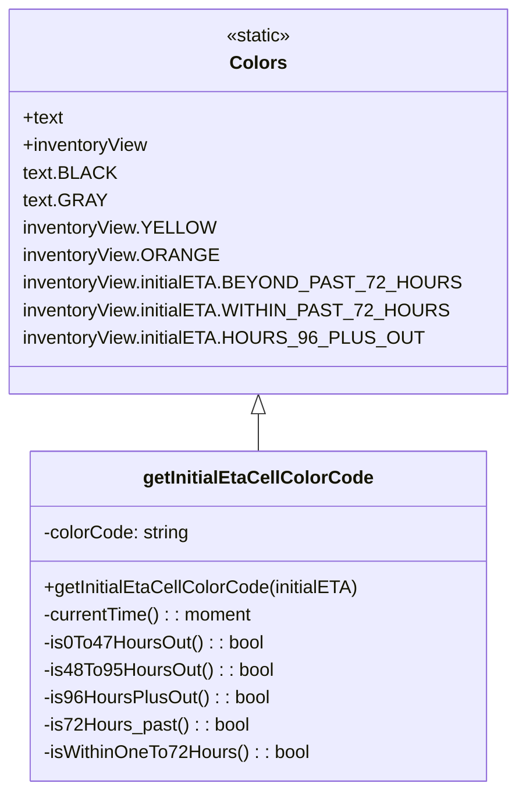

# Diagram: web/portal/src/pages/inventoryview/utils/table.utils.js


> Auto-generated by Obscura crawlers

## Diagram 1

```mermaid
flowchart TD
    Start([Start]) --> CheckETA{initialETA\npresent?}
    CheckETA -- No --> GrayColor([Colors.text.GRAY])
    CheckETA -- Yes --> ComputeTimes[Compute currentTime()\n_and time bounds_]
    ComputeTimes --> CompareNow{initialEta < currentTime()?}
    CompareNow -- Yes --> PastChecks[Check past ranges]
    PastChecks --> Past72{initialEta < _72Hours_past\nAND < _1hour?}
    Past72 -- Yes --> BeyondPast72([Colors.inventoryView.initialETA.BEYOND_PAST_72_HOURS])
    Past72 -- No --> Within1To72{initialEta < _1hour\nAND >= _72Hours_past?}
    Within1To72 -- Yes --> WithinPast72([Colors.inventoryView.initialETA.WITHIN_PAST_72_HOURS])
    Within1To72 -- No --> DefaultPast([Colors.text.GRAY])
    CompareNow -- No --> FutureChecks[Check future ranges]
    FutureChecks --> Fut0To47{initialEta >= now\nAND < upto48Hours?}
    Fut0To47 -- Yes --> Yellow([Colors.inventoryView.YELLOW])
    Fut0To47 -- No --> Fut48To95{initialEta >= _48Hours\nAND < upto96Hours?}
    Fut48To95 -- Yes --> Orange([Colors.inventoryView.ORANGE])
    Fut48To95 -- No --> Fut96Plus{initialEta >= _96Hours?}
    Fut96Plus -- Yes --> Hours96Plus([Colors.inventoryView.initialETA.HOURS_96_PLUS_OUT])
    Fut96Plus -- No --> DefaultFuture([Colors.text.GRAY])
    BeyondPast72 --> End([Return colorCode])
    WithinPast72 --> End
    DefaultPast --> End
    Yellow --> End
    Orange --> End
    Hours96Plus --> End
    DefaultFuture --> End
```

> SVG rendering failed for this diagram.

## Diagram 2



### SVG

<svg id="container" width="427.8828125" xmlns="http://www.w3.org/2000/svg" class="classDiagram" height="690" viewBox="0 0 427.8828125 690" role="graphics-document document" aria-roledescription="class"><style>#container{font-family:"trebuchet ms",verdana,arial,sans-serif;font-size:16px;fill:#333;}@keyframes edge-animation-frame{from{stroke-dashoffset:0;}}@keyframes dash{to{stroke-dashoffset:0;}}#container .edge-animation-slow{stroke-dasharray:9,5!important;stroke-dashoffset:900;animation:dash 50s linear infinite;stroke-linecap:round;}#container .edge-animation-fast{stroke-dasharray:9,5!important;stroke-dashoffset:900;animation:dash 20s linear infinite;stroke-linecap:round;}#container .error-icon{fill:#552222;}#container .error-text{fill:#552222;stroke:#552222;}#container .edge-thickness-normal{stroke-width:1px;}#container .edge-thickness-thick{stroke-width:3.5px;}#container .edge-pattern-solid{stroke-dasharray:0;}#container .edge-thickness-invisible{stroke-width:0;fill:none;}#container .edge-pattern-dashed{stroke-dasharray:3;}#container .edge-pattern-dotted{stroke-dasharray:2;}#container .marker{fill:#333333;stroke:#333333;}#container .marker.cross{stroke:#333333;}#container svg{font-family:"trebuchet ms",verdana,arial,sans-serif;font-size:16px;}#container p{margin:0;}#container g.classGroup text{fill:#9370DB;stroke:none;font-family:"trebuchet ms",verdana,arial,sans-serif;font-size:10px;}#container g.classGroup text .title{font-weight:bolder;}#container .nodeLabel,#container .edgeLabel{color:#131300;}#container .edgeLabel .label rect{fill:#ECECFF;}#container .label text{fill:#131300;}#container .labelBkg{background:#ECECFF;}#container .edgeLabel .label span{background:#ECECFF;}#container .classTitle{font-weight:bolder;}#container .node rect,#container .node circle,#container .node ellipse,#container .node polygon,#container .node path{fill:#ECECFF;stroke:#9370DB;stroke-width:1px;}#container .divider{stroke:#9370DB;stroke-width:1;}#container g.clickable{cursor:pointer;}#container g.classGroup rect{fill:#ECECFF;stroke:#9370DB;}#container g.classGroup line{stroke:#9370DB;stroke-width:1;}#container .classLabel .box{stroke:none;stroke-width:0;fill:#ECECFF;opacity:0.5;}#container .classLabel .label{fill:#9370DB;font-size:10px;}#container .relation{stroke:#333333;stroke-width:1;fill:none;}#container .dashed-line{stroke-dasharray:3;}#container .dotted-line{stroke-dasharray:1 2;}#container #compositionStart,#container .composition{fill:#333333!important;stroke:#333333!important;stroke-width:1;}#container #compositionEnd,#container .composition{fill:#333333!important;stroke:#333333!important;stroke-width:1;}#container #dependencyStart,#container .dependency{fill:#333333!important;stroke:#333333!important;stroke-width:1;}#container #dependencyStart,#container .dependency{fill:#333333!important;stroke:#333333!important;stroke-width:1;}#container #extensionStart,#container .extension{fill:transparent!important;stroke:#333333!important;stroke-width:1;}#container #extensionEnd,#container .extension{fill:transparent!important;stroke:#333333!important;stroke-width:1;}#container #aggregationStart,#container .aggregation{fill:transparent!important;stroke:#333333!important;stroke-width:1;}#container #aggregationEnd,#container .aggregation{fill:transparent!important;stroke:#333333!important;stroke-width:1;}#container #lollipopStart,#container .lollipop{fill:#ECECFF!important;stroke:#333333!important;stroke-width:1;}#container #lollipopEnd,#container .lollipop{fill:#ECECFF!important;stroke:#333333!important;stroke-width:1;}#container .edgeTerminals{font-size:11px;line-height:initial;}#container .classTitleText{text-anchor:middle;font-size:18px;fill:#333;}#container .label-icon{display:inline-block;height:1em;overflow:visible;vertical-align:-0.125em;}#container .node .label-icon path{fill:currentColor;stroke:revert;stroke-width:revert;}#container :root{--mermaid-font-family:"trebuchet ms",verdana,arial,sans-serif;}</style><g><defs><marker id="container_class-aggregationStart" class="marker aggregation class" refX="18" refY="7" markerWidth="190" markerHeight="240" orient="auto"><path d="M 18,7 L9,13 L1,7 L9,1 Z"></path></marker></defs><defs><marker id="container_class-aggregationEnd" class="marker aggregation class" refX="1" refY="7" markerWidth="20" markerHeight="28" orient="auto"><path d="M 18,7 L9,13 L1,7 L9,1 Z"></path></marker></defs><defs><marker id="container_class-extensionStart" class="marker extension class" refX="18" refY="7" markerWidth="190" markerHeight="240" orient="auto"><path d="M 1,7 L18,13 V 1 Z"></path></marker></defs><defs><marker id="container_class-extensionEnd" class="marker extension class" refX="1" refY="7" markerWidth="20" markerHeight="28" orient="auto"><path d="M 1,1 V 13 L18,7 Z"></path></marker></defs><defs><marker id="container_class-compositionStart" class="marker composition class" refX="18" refY="7" markerWidth="190" markerHeight="240" orient="auto"><path d="M 18,7 L9,13 L1,7 L9,1 Z"></path></marker></defs><defs><marker id="container_class-compositionEnd" class="marker composition class" refX="1" refY="7" markerWidth="20" markerHeight="28" orient="auto"><path d="M 18,7 L9,13 L1,7 L9,1 Z"></path></marker></defs><defs><marker id="container_class-dependencyStart" class="marker dependency class" refX="6" refY="7" markerWidth="190" markerHeight="240" orient="auto"><path d="M 5,7 L9,13 L1,7 L9,1 Z"></path></marker></defs><defs><marker id="container_class-dependencyEnd" class="marker dependency class" refX="13" refY="7" markerWidth="20" markerHeight="28" orient="auto"><path d="M 18,7 L9,13 L14,7 L9,1 Z"></path></marker></defs><defs><marker id="container_class-lollipopStart" class="marker lollipop class" refX="13" refY="7" markerWidth="190" markerHeight="240" orient="auto"><circle stroke="black" fill="transparent" cx="7" cy="7" r="6"></circle></marker></defs><defs><marker id="container_class-lollipopEnd" class="marker lollipop class" refX="1" refY="7" markerWidth="190" markerHeight="240" orient="auto"><circle stroke="black" fill="transparent" cx="7" cy="7" r="6"></circle></marker></defs><g class="root"><g class="clusters"></g><g class="edgePaths"><path d="M213.941,361.25L213.941,362.542C213.941,363.833,213.941,366.417,213.941,371.875C213.941,377.333,213.941,385.667,213.941,389.833L213.941,394" id="id_Colors_getInitialEtaCellColorCode_1" class="edge-thickness-normal edge-pattern-solid relation" style=";;;" data-edge="true" data-et="edge" data-id="id_Colors_getInitialEtaCellColorCode_1" data-points="W3sieCI6MjEzLjk0MTQwNjI1LCJ5IjozNDR9LHsieCI6MjEzLjk0MTQwNjI1LCJ5IjozNjl9LHsieCI6MjEzLjk0MTQwNjI1LCJ5IjozOTR9XQ==" marker-start="url(#container_class-extensionStart)"></path></g><g class="edgeLabels"><g class="edgeLabel"><g class="label" data-id="id_Colors_getInitialEtaCellColorCode_1" transform="translate(0, 0)"><foreignObject width="0" height="0"><div xmlns="http://www.w3.org/1999/xhtml" class="labelBkg" style="display: table-cell; white-space: nowrap; line-height: 1.5; max-width: 200px; text-align: center;"><span class="edgeLabel"></span></div></foreignObject></g></g></g><g class="nodes"><g class="node default" id="classId-getInitialEtaCellColorCode-0" transform="translate(213.94140625, 538)"><g class="basic label-container"><path d="M-196.84375 -144 L196.84375 -144 L196.84375 144 L-196.84375 144" stroke="none" stroke-width="0" fill="#ECECFF" style=""></path><path d="M-196.84375 -144 C-84.57929872432823 -144, 27.68515255134355 -144, 196.84375 -144 M-196.84375 -144 C-85.81929269715125 -144, 25.20516460569749 -144, 196.84375 -144 M196.84375 -144 C196.84375 -82.3822462135123, 196.84375 -20.764492427024607, 196.84375 144 M196.84375 -144 C196.84375 -69.01490542423524, 196.84375 5.9701891515295245, 196.84375 144 M196.84375 144 C83.16344497662058 144, -30.516860046758836 144, -196.84375 144 M196.84375 144 C105.87299062037432 144, 14.902231240748648 144, -196.84375 144 M-196.84375 144 C-196.84375 65.41946648288715, -196.84375 -13.16106703422571, -196.84375 -144 M-196.84375 144 C-196.84375 35.82826846263251, -196.84375 -72.34346307473498, -196.84375 -144" stroke="#9370DB" stroke-width="1.3" fill="none" stroke-dasharray="0 0" style=""></path></g><g class="annotation-group text" transform="translate(0, -120)"></g><g class="label-group text" transform="translate(-95.6875, -120)"><g class="label" style="font-weight: bolder" transform="translate(0,-12)"><foreignObject width="191.375" height="24"><div xmlns="http://www.w3.org/1999/xhtml" style="display: table-cell; white-space: nowrap; line-height: 1.5; max-width: 239px; text-align: center;"><span class="nodeLabel markdown-node-label" style=""><p>getInitialEtaCellColorCode</p></span></div></foreignObject></g></g><g class="members-group text" transform="translate(-184.84375, -72)"><g class="label" style="" transform="translate(0,-12)"><foreignObject width="129.234375" height="24"><div xmlns="http://www.w3.org/1999/xhtml" style="display: table-cell; white-space: nowrap; line-height: 1.5; max-width: 187px; text-align: center;"><span class="nodeLabel markdown-node-label" style=""><p>-colorCode: string</p></span></div></foreignObject></g></g><g class="methods-group text" transform="translate(-184.84375, -24)"><g class="label" style="" transform="translate(0,-12)"><foreignObject width="274" height="24"><div xmlns="http://www.w3.org/1999/xhtml" style="display: table-cell; white-space: nowrap; line-height: 1.5; max-width: 331px; text-align: center;"><span class="nodeLabel markdown-node-label" style=""><p>+getInitialEtaCellColorCode(initialETA)</p></span></div></foreignObject></g><g class="label" style="" transform="translate(0,12)"><foreignObject width="185.625" height="24"><div xmlns="http://www.w3.org/1999/xhtml" style="display: table-cell; white-space: nowrap; line-height: 1.5; max-width: 243px; text-align: center;"><span class="nodeLabel markdown-node-label" style=""><p>-currentTime() : : moment</p></span></div></foreignObject></g><g class="label" style="" transform="translate(0,36)"><foreignObject width="191.609375" height="24"><div xmlns="http://www.w3.org/1999/xhtml" style="display: table-cell; white-space: nowrap; line-height: 1.5; max-width: 249px; text-align: center;"><span class="nodeLabel markdown-node-label" style=""><p>-is0To47HoursOut() : : bool</p></span></div></foreignObject></g><g class="label" style="" transform="translate(0,60)"><foreignObject width="201.15625" height="24"><div xmlns="http://www.w3.org/1999/xhtml" style="display: table-cell; white-space: nowrap; line-height: 1.5; max-width: 259px; text-align: center;"><span class="nodeLabel markdown-node-label" style=""><p>-is48To95HoursOut() : : bool</p></span></div></foreignObject></g><g class="label" style="" transform="translate(0,84)"><foreignObject width="198.5625" height="24"><div xmlns="http://www.w3.org/1999/xhtml" style="display: table-cell; white-space: nowrap; line-height: 1.5; max-width: 256px; text-align: center;"><span class="nodeLabel markdown-node-label" style=""><p>-is96HoursPlusOut() : : bool</p></span></div></foreignObject></g><g class="label" style="" transform="translate(0,108)"><foreignObject width="178.546875" height="24"><div xmlns="http://www.w3.org/1999/xhtml" style="display: table-cell; white-space: nowrap; line-height: 1.5; max-width: 236px; text-align: center;"><span class="nodeLabel markdown-node-label" style=""><p>-is72Hours_past() : : bool</p></span></div></foreignObject></g><g class="label" style="" transform="translate(0,132)"><foreignObject width="231.84375" height="24"><div xmlns="http://www.w3.org/1999/xhtml" style="display: table-cell; white-space: nowrap; line-height: 1.5; max-width: 290px; text-align: center;"><span class="nodeLabel markdown-node-label" style=""><p>-isWithinOneTo72Hours() : : bool</p></span></div></foreignObject></g></g><g class="divider" style=""><path d="M-196.84375 -96 C-65.78291101191263 -96, 65.27792797617474 -96, 196.84375 -96 M-196.84375 -96 C-63.5348241335206 -96, 69.7741017329588 -96, 196.84375 -96" stroke="#9370DB" stroke-width="1.3" fill="none" stroke-dasharray="0 0" style=""></path></g><g class="divider" style=""><path d="M-196.84375 -48 C-105.10108344061084 -48, -13.358416881221672 -48, 196.84375 -48 M-196.84375 -48 C-72.12947563527717 -48, 52.58479872944565 -48, 196.84375 -48" stroke="#9370DB" stroke-width="1.3" fill="none" stroke-dasharray="0 0" style=""></path></g></g><g class="node default" id="classId-Colors-1" transform="translate(213.94140625, 176)"><g class="basic label-container"><path d="M-205.94140625 -168 L205.94140625 -168 L205.94140625 168 L-205.94140625 168" stroke="none" stroke-width="0" fill="#ECECFF" style=""></path><path d="M-205.94140625 -168 C-44.623890374653456 -168, 116.69362550069309 -168, 205.94140625 -168 M-205.94140625 -168 C-71.11671324783296 -168, 63.707979754334076 -168, 205.94140625 -168 M205.94140625 -168 C205.94140625 -46.635030230586366, 205.94140625 74.72993953882727, 205.94140625 168 M205.94140625 -168 C205.94140625 -42.089559766599535, 205.94140625 83.82088046680093, 205.94140625 168 M205.94140625 168 C101.67940317625643 168, -2.5825998974871425 168, -205.94140625 168 M205.94140625 168 C106.41588904441898 168, 6.89037183883795 168, -205.94140625 168 M-205.94140625 168 C-205.94140625 99.39516345791765, -205.94140625 30.790326915835294, -205.94140625 -168 M-205.94140625 168 C-205.94140625 86.11594182774805, -205.94140625 4.231883655496091, -205.94140625 -168" stroke="#9370DB" stroke-width="1.3" fill="none" stroke-dasharray="0 0" style=""></path></g><g class="annotation-group text" transform="translate(-29.0234375, -144)"><g class="label" style="" transform="translate(0,-12)"><foreignObject width="58.046875" height="24"><div xmlns="http://www.w3.org/1999/xhtml" style="display: table-cell; white-space: nowrap; line-height: 1.5; max-width: 108px; text-align: center;"><span class="nodeLabel markdown-node-label" style=""><p>«static»</p></span></div></foreignObject></g></g><g class="label-group text" transform="translate(-23.1015625, -120)"><g class="label" style="font-weight: bolder" transform="translate(0,-12)"><foreignObject width="46.203125" height="24"><div xmlns="http://www.w3.org/1999/xhtml" style="display: table-cell; white-space: nowrap; line-height: 1.5; max-width: 95px; text-align: center;"><span class="nodeLabel markdown-node-label" style=""><p>Colors</p></span></div></foreignObject></g></g><g class="members-group text" transform="translate(-193.94140625, -72)"><g class="label" style="" transform="translate(0,-12)"><foreignObject width="35.5625" height="24"><div xmlns="http://www.w3.org/1999/xhtml" style="display: table-cell; white-space: nowrap; line-height: 1.5; max-width: 93px; text-align: center;"><span class="nodeLabel markdown-node-label" style=""><p>+text</p></span></div></foreignObject></g><g class="label" style="" transform="translate(0,12)"><foreignObject width="110.203125" height="24"><div xmlns="http://www.w3.org/1999/xhtml" style="display: table-cell; white-space: nowrap; line-height: 1.5; max-width: 168px; text-align: center;"><span class="nodeLabel markdown-node-label" style=""><p>+inventoryView</p></span></div></foreignObject></g><g class="label" style="" transform="translate(0,36)"><foreignObject width="76.640625" height="24"><div xmlns="http://www.w3.org/1999/xhtml" style="display: table-cell; white-space: nowrap; line-height: 1.5; max-width: 127px; text-align: center;"><span class="nodeLabel markdown-node-label" style=""><p>text.BLACK</p></span></div></foreignObject></g><g class="label" style="" transform="translate(0,60)"><foreignObject width="68.203125" height="24"><div xmlns="http://www.w3.org/1999/xhtml" style="display: table-cell; white-space: nowrap; line-height: 1.5; max-width: 118px; text-align: center;"><span class="nodeLabel markdown-node-label" style=""><p>text.GRAY</p></span></div></foreignObject></g><g class="label" style="" transform="translate(0,84)"><foreignObject width="161.171875" height="24"><div xmlns="http://www.w3.org/1999/xhtml" style="display: table-cell; white-space: nowrap; line-height: 1.5; max-width: 211px; text-align: center;"><span class="nodeLabel markdown-node-label" style=""><p>inventoryView.YELLOW</p></span></div></foreignObject></g><g class="label" style="" transform="translate(0,108)"><foreignObject width="164.921875" height="24"><div xmlns="http://www.w3.org/1999/xhtml" style="display: table-cell; white-space: nowrap; line-height: 1.5; max-width: 215px; text-align: center;"><span class="nodeLabel markdown-node-label" style=""><p>inventoryView.ORANGE</p></span></div></foreignObject></g><g class="label" style="" transform="translate(0,132)"><foreignObject width="358.859375" height="24"><div xmlns="http://www.w3.org/1999/xhtml" style="display: table-cell; white-space: nowrap; line-height: 1.5; max-width: 409px; text-align: center;"><span class="nodeLabel markdown-node-label" style=""><p>inventoryView.initialETA.BEYOND_PAST_72_HOURS</p></span></div></foreignObject></g><g class="label" style="" transform="translate(0,156)"><foreignObject width="352.9375" height="24"><div xmlns="http://www.w3.org/1999/xhtml" style="display: table-cell; white-space: nowrap; line-height: 1.5; max-width: 403px; text-align: center;"><span class="nodeLabel markdown-node-label" style=""><p>inventoryView.initialETA.WITHIN_PAST_72_HOURS</p></span></div></foreignObject></g><g class="label" style="" transform="translate(0,180)"><foreignObject width="333.5625" height="24"><div xmlns="http://www.w3.org/1999/xhtml" style="display: table-cell; white-space: nowrap; line-height: 1.5; max-width: 384px; text-align: center;"><span class="nodeLabel markdown-node-label" style=""><p>inventoryView.initialETA.HOURS_96_PLUS_OUT</p></span></div></foreignObject></g></g><g class="methods-group text" transform="translate(-193.94140625, 168)"></g><g class="divider" style=""><path d="M-205.94140625 -96 C-65.30230916139209 -96, 75.33678792721582 -96, 205.94140625 -96 M-205.94140625 -96 C-50.5192910596229 -96, 104.9028241307542 -96, 205.94140625 -96" stroke="#9370DB" stroke-width="1.3" fill="none" stroke-dasharray="0 0" style=""></path></g><g class="divider" style=""><path d="M-205.94140625 144 C-66.39290194432064 144, 73.15560236135872 144, 205.94140625 144 M-205.94140625 144 C-98.92410154264036 144, 8.093203164719284 144, 205.94140625 144" stroke="#9370DB" stroke-width="1.3" fill="none" stroke-dasharray="0 0" style=""></path></g></g></g></g></g></svg>
