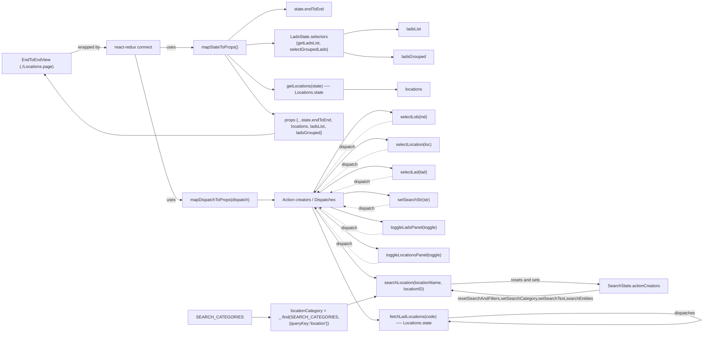

# Diagram: web/portal/src/pages/locations/Locations.page.container.js

> Auto-generated by Obscura crawlers

## Mermaid

### SVG

<svg id="container" width="2680.290771484375" xmlns="http://www.w3.org/2000/svg" class="flowchart" height="1236" viewBox="0 0 2680.290771484375 1236" role="graphics-document document" aria-roledescription="flowchart-v2"><g><marker id="container_flowchart-v2-pointEnd" class="marker flowchart-v2" viewBox="0 0 10 10" refX="5" refY="5" markerUnits="userSpaceOnUse" markerWidth="8" markerHeight="8" orient="auto"><path d="M 0 0 L 10 5 L 0 10 z" class="arrowMarkerPath" style="stroke-width: 1; stroke-dasharray: 1, 0;"></path></marker><marker id="container_flowchart-v2-pointStart" class="marker flowchart-v2" viewBox="0 0 10 10" refX="4.5" refY="5" markerUnits="userSpaceOnUse" markerWidth="8" markerHeight="8" orient="auto"><path d="M 0 5 L 10 10 L 10 0 z" class="arrowMarkerPath" style="stroke-width: 1; stroke-dasharray: 1, 0;"></path></marker><marker id="container_flowchart-v2-circleEnd" class="marker flowchart-v2" viewBox="0 0 10 10" refX="11" refY="5" markerUnits="userSpaceOnUse" markerWidth="11" markerHeight="11" orient="auto"><circle cx="5" cy="5" r="5" class="arrowMarkerPath" style="stroke-width: 1; stroke-dasharray: 1, 0;"></circle></marker><marker id="container_flowchart-v2-circleStart" class="marker flowchart-v2" viewBox="0 0 10 10" refX="-1" refY="5" markerUnits="userSpaceOnUse" markerWidth="11" markerHeight="11" orient="auto"><circle cx="5" cy="5" r="5" class="arrowMarkerPath" style="stroke-width: 1; stroke-dasharray: 1, 0;"></circle></marker><marker id="container_flowchart-v2-crossEnd" class="marker cross flowchart-v2" viewBox="0 0 11 11" refX="12" refY="5.2" markerUnits="userSpaceOnUse" markerWidth="11" markerHeight="11" orient="auto"><path d="M 1,1 l 9,9 M 10,1 l -9,9" class="arrowMarkerPath" style="stroke-width: 2; stroke-dasharray: 1, 0;"></path></marker><marker id="container_flowchart-v2-crossStart" class="marker cross flowchart-v2" viewBox="0 0 11 11" refX="-1" refY="5.2" markerUnits="userSpaceOnUse" markerWidth="11" markerHeight="11" orient="auto"><path d="M 1,1 l 9,9 M 10,1 l -9,9" class="arrowMarkerPath" style="stroke-width: 2; stroke-dasharray: 1, 0;"></path></marker><g class="root"><g class="clusters"></g><g class="edgePaths"><path d="M266.258,176L277.769,172.5C289.279,169,312.3,162,334.363,158.5C356.427,155,377.534,155,388.087,155L398.641,155" id="L_EndToEndView_Connect_0" class="edge-thickness-normal edge-pattern-solid edge-thickness-normal edge-pattern-solid flowchart-link" style=";" data-edge="true" data-et="edge" data-id="L_EndToEndView_Connect_0" data-points="W3sieCI6MjY2LjI1ODIwMzEyNSwieSI6MTc2fSx7IngiOjMzNS4zMjAzMTI1LCJ5IjoxNTV9LHsieCI6NDAyLjY0MDYyNSwieSI6MTU1fV0=" marker-end="url(#container_flowchart-v2-pointEnd)"></path><path d="M607.703,155L614.618,155C621.534,155,635.365,155,655.837,155C676.31,155,703.424,155,716.982,155L730.539,155" id="L_Connect_mapState_0" class="edge-thickness-normal edge-pattern-solid edge-thickness-normal edge-pattern-solid flowchart-link" style=";" data-edge="true" data-et="edge" data-id="L_Connect_mapState_0" data-points="W3sieCI6NjA3LjcwMzEyNSwieSI6MTU1fSx7IngiOjY0OS4xOTUzMTI1LCJ5IjoxNTV9LHsieCI6NzM0LjUzOTA2MjUsInkiOjE1NX1d" marker-end="url(#container_flowchart-v2-pointEnd)"></path><path d="M511.876,182L534.763,274.167C557.649,366.333,603.422,550.667,632.558,642.833C661.693,735,674.19,735,680.439,735L686.688,735" id="L_Connect_mapDispatch_0" class="edge-thickness-normal edge-pattern-solid edge-thickness-normal edge-pattern-solid flowchart-link" style=";" data-edge="true" data-et="edge" data-id="L_Connect_mapDispatch_0" data-points="W3sieCI6NTExLjg3NjQxNDMzMTg5NjU3LCJ5IjoxODJ9LHsieCI6NjQ5LjE5NTMxMjUsInkiOjczNX0seyJ4Ijo2OTAuNjg3NSwieSI6NzM1fV0=" marker-end="url(#container_flowchart-v2-pointEnd)"></path><path d="M870.923,128L892.563,112.5C914.204,97,957.485,66,994.371,50.5C1031.258,35,1061.75,35,1076.996,35L1092.242,35" id="L_mapState_stateEnd_0" class="edge-thickness-normal edge-pattern-solid edge-thickness-normal edge-pattern-solid flowchart-link" style=";" data-edge="true" data-et="edge" data-id="L_mapState_stateEnd_0" data-points="W3sieCI6ODcwLjkyMjg1MTU2MjUsInkiOjEyOH0seyJ4IjoxMDAwLjc2NTYyNSwieSI6MzV9LHsieCI6MTA5Ni4yNDIxODc1LCJ5IjozNX1d" marker-end="url(#container_flowchart-v2-pointEnd)"></path><path d="M860.809,182L884.135,204.833C907.461,227.667,954.113,273.333,985.3,296.167C1016.487,319,1032.208,319,1040.069,319L1047.93,319" id="L_mapState_getLocations_0" class="edge-thickness-normal edge-pattern-solid edge-thickness-normal edge-pattern-solid flowchart-link" style=";" data-edge="true" data-et="edge" data-id="L_mapState_getLocations_0" data-points="W3sieCI6ODYwLjgwOTIxMzAzMzUzNjYsInkiOjE4Mn0seyJ4IjoxMDAwLjc2NTYyNSwieSI6MzE5fSx7IngiOjEwNTEuOTI5Njg3NSwieSI6MzE5fV0=" marker-end="url(#container_flowchart-v2-pointEnd)"></path><path d="M931.914,152.644L943.389,152.37C954.865,152.096,977.815,151.548,992.79,151.274C1007.766,151,1014.766,151,1018.266,151L1021.766,151" id="L_mapState_LadsSelectors_0" class="edge-thickness-normal edge-pattern-solid edge-thickness-normal edge-pattern-solid flowchart-link" style=";" data-edge="true" data-et="edge" data-id="L_mapState_LadsSelectors_0" data-points="W3sieCI6OTMxLjkxNDA2MjUsInkiOjE1Mi42NDM4MzMwNjEzMTk2N30seyJ4IjoxMDAwLjc2NTYyNSwieSI6MTUxfSx7IngiOjEwMjUuNzY1NjI1LCJ5IjoxNTF9XQ==" marker-end="url(#container_flowchart-v2-pointEnd)"></path><path d="M1311.93,319L1325.638,319C1339.346,319,1366.763,319,1402.258,319C1437.753,319,1481.326,319,1503.112,319L1524.898,319" id="L_getLocations_locations_0" class="edge-thickness-normal edge-pattern-solid edge-thickness-normal edge-pattern-solid flowchart-link" style=";" data-edge="true" data-et="edge" data-id="L_getLocations_locations_0" data-points="W3sieCI6MTMxMS45Mjk2ODc1LCJ5IjozMTl9LHsieCI6MTM5NC4xNzk2ODc1LCJ5IjozMTl9LHsieCI6MTUyOC44OTg0Mzc1LCJ5IjozMTl9XQ==" marker-end="url(#container_flowchart-v2-pointEnd)"></path><path d="M1338.094,112.741L1347.441,110.451C1356.789,108.16,1375.484,103.58,1407.496,101.29C1439.508,99,1484.836,99,1507.5,99L1530.164,99" id="L_LadsSelectors_ladsList_0" class="edge-thickness-normal edge-pattern-solid edge-thickness-normal edge-pattern-solid flowchart-link" style=";" data-edge="true" data-et="edge" data-id="L_LadsSelectors_ladsList_0" data-points="W3sieCI6MTMzOC4wOTM3NSwieSI6MTEyLjc0MDcyNDM4MTYyNTQ0fSx7IngiOjEzOTQuMTc5Njg3NSwieSI6OTl9LHsieCI6MTUzNC4xNjQwNjI1LCJ5Ijo5OX1d" marker-end="url(#container_flowchart-v2-pointEnd)"></path><path d="M1338.094,189.259L1347.441,191.549C1356.789,193.84,1375.484,198.42,1404.454,200.71C1433.424,203,1472.669,203,1492.292,203L1511.914,203" id="L_LadsSelectors_ladsGrouped_0" class="edge-thickness-normal edge-pattern-solid edge-thickness-normal edge-pattern-solid flowchart-link" style=";" data-edge="true" data-et="edge" data-id="L_LadsSelectors_ladsGrouped_0" data-points="W3sieCI6MTMzOC4wOTM3NSwieSI6MTg5LjI1OTI3NTYxODM3NDU1fSx7IngiOjEzOTQuMTc5Njg3NSwieSI6MjAzfSx7IngiOjE1MTUuOTE0MDYyNSwieSI6MjAzfV0=" marker-end="url(#container_flowchart-v2-pointEnd)"></path><path d="M851.766,182L876.599,218.167C901.432,254.333,951.099,326.667,983.827,365.448C1016.555,404.229,1032.344,409.458,1040.238,412.073L1048.133,414.688" id="L_mapState_propsMerge_0" class="edge-thickness-normal edge-pattern-solid edge-thickness-normal edge-pattern-solid flowchart-link" style=";" data-edge="true" data-et="edge" data-id="L_mapState_propsMerge_0" data-points="W3sieCI6ODUxLjc2NTcyMTA1NTMyNzgsInkiOjE4Mn0seyJ4IjoxMDAwLjc2NTYyNSwieSI6Mzk5fSx7IngiOjEwNTEuOTI5Njg3NSwieSI6NDE1Ljk0NTEwMzI4MTcyODR9XQ==" marker-end="url(#container_flowchart-v2-pointEnd)"></path><path d="M1051.93,486.986L1043.402,488.821C1034.875,490.657,1017.82,494.329,981.37,496.164C944.919,498,889.073,498,830.478,498C771.883,498,710.539,498,655.863,498C601.188,498,553.18,498,500.867,498C448.555,498,391.938,498,335.656,457.88C279.374,417.76,223.427,337.521,195.454,297.401L167.48,257.281" id="L_propsMerge_EndToEndView_0" class="edge-thickness-normal edge-pattern-solid edge-thickness-normal edge-pattern-solid flowchart-link" style=";" data-edge="true" data-et="edge" data-id="L_propsMerge_EndToEndView_0" data-points="W3sieCI6MTA1MS45Mjk2ODc1LCJ5Ijo0ODYuOTg1NjgyODY2ODc2NX0seyJ4IjoxMDAwLjc2NTYyNSwieSI6NDk4fSx7IngiOjgzMy4yMjY1NjI1LCJ5Ijo0OTh9LHsieCI6NjQ5LjE5NTMxMjUsInkiOjQ5OH0seyJ4Ijo1MDUuMTcxODc1LCJ5Ijo0OTh9LHsieCI6MzM1LjMyMDMxMjUsInkiOjQ5OH0seyJ4IjoxNjUuMTkyNTUxODk5MjkzMjgsInkiOjI1NH1d" marker-end="url(#container_flowchart-v2-pointEnd)"></path><path d="M975.766,735L979.932,735C984.099,735,992.432,735,1004.46,735C1016.487,735,1032.208,735,1040.069,735L1047.93,735" id="L_mapDispatch_actions_0" class="edge-thickness-normal edge-pattern-solid edge-thickness-normal edge-pattern-solid flowchart-link" style=";" data-edge="true" data-et="edge" data-id="L_mapDispatch_actions_0" data-points="W3sieCI6OTc1Ljc2NTYyNSwieSI6NzM1fSx7IngiOjEwMDAuNzY1NjI1LCJ5Ijo3MzV9LHsieCI6MTA1MS45Mjk2ODc1LCJ5Ijo3MzV9XQ==" marker-end="url(#container_flowchart-v2-pointEnd)"></path><path d="M1205.313,696L1236.791,643.5C1268.269,591,1331.224,486,1381.456,437.478C1431.688,388.955,1469.196,396.91,1487.95,400.888L1506.704,404.865" id="L_actions_selectLob_0" class="edge-thickness-normal edge-pattern-solid edge-thickness-normal edge-pattern-solid flowchart-link" style=";" data-edge="true" data-et="edge" data-id="L_actions_selectLob_0" data-points="W3sieCI6MTIwNS4zMTMxNjIwNzYyNzEzLCJ5Ijo2OTZ9LHsieCI6MTM5NC4xNzk2ODc1LCJ5IjozODF9LHsieCI6MTUxMC42MTcxODc1LCJ5Ijo0MDUuNjk0OTY2MDcyMjczOX1d" marker-end="url(#container_flowchart-v2-pointEnd)"></path><path d="M1215.855,696L1245.576,661.833C1275.296,627.667,1334.738,559.333,1380.389,528.063C1426.04,496.792,1457.9,502.584,1473.83,505.48L1489.76,508.375" id="L_actions_selectLocation_0" class="edge-thickness-normal edge-pattern-solid edge-thickness-normal edge-pattern-solid flowchart-link" style=";" data-edge="true" data-et="edge" data-id="L_actions_selectLocation_0" data-points="W3sieCI6MTIxNS44NTQ4OTI0MTgwMzI3LCJ5Ijo2OTZ9LHsieCI6MTM5NC4xNzk2ODc1LCJ5Ijo0OTF9LHsieCI6MTQ5My42OTUzMTI1LCJ5Ijo1MDkuMDkwODk0NzQ1MTQ3NX1d" marker-end="url(#container_flowchart-v2-pointEnd)"></path><path d="M1241.056,696L1266.577,679.167C1292.098,662.333,1343.139,628.667,1387.485,615.256C1431.831,601.845,1469.483,608.689,1488.309,612.112L1507.135,615.534" id="L_actions_selectLad_0" class="edge-thickness-normal edge-pattern-solid edge-thickness-normal edge-pattern-solid flowchart-link" style=";" data-edge="true" data-et="edge" data-id="L_actions_selectLad_0" data-points="W3sieCI6MTI0MS4wNTY0NzMyMTQyODU3LCJ5Ijo2OTZ9LHsieCI6MTM5NC4xNzk2ODc1LCJ5Ijo1OTV9LHsieCI6MTUxMS4wNzAzMTI1LCJ5Ijo2MTYuMjQ5NDg3MTM5MDI0N31d" marker-end="url(#container_flowchart-v2-pointEnd)"></path><path d="M1311.93,712.951L1325.638,710.625C1339.346,708.3,1366.763,703.65,1397.726,704.462C1428.688,705.273,1463.197,711.547,1480.451,714.683L1497.705,717.82" id="L_actions_setSearchStr_0" class="edge-thickness-normal edge-pattern-solid edge-thickness-normal edge-pattern-solid flowchart-link" style=";" data-edge="true" data-et="edge" data-id="L_actions_setSearchStr_0" data-points="W3sieCI6MTMxMS45Mjk2ODc1LCJ5Ijo3MTIuOTUwNTMwMDM1MzM1Nn0seyJ4IjoxMzk0LjE3OTY4NzUsInkiOjY5OX0seyJ4IjoxNTAxLjY0MDYyNSwieSI6NzE4LjUzNTI2OTA1NDc1Nzh9XQ==" marker-end="url(#container_flowchart-v2-pointEnd)"></path><path d="M1303.661,774L1318.748,778.833C1333.834,783.667,1364.007,793.333,1391.982,800.51C1419.956,807.686,1445.733,812.372,1458.621,814.715L1471.51,817.058" id="L_actions_toggleLads_0" class="edge-thickness-normal edge-pattern-solid edge-thickness-normal edge-pattern-solid flowchart-link" style=";" data-edge="true" data-et="edge" data-id="L_actions_toggleLads_0" data-points="W3sieCI6MTMwMy42NjEzMDUxNDcwNTg4LCJ5Ijo3NzR9LHsieCI6MTM5NC4xNzk2ODc1LCJ5Ijo4MDN9LHsieCI6MTQ3NS40NDUzMTI1LCJ5Ijo4MTcuNzczMjM2NTQ3MjYyMX1d" marker-end="url(#container_flowchart-v2-pointEnd)"></path><path d="M1230.056,774L1257.41,796.167C1284.764,818.333,1339.472,862.667,1376.712,886.63C1413.951,910.594,1433.723,914.189,1443.608,915.986L1453.494,917.783" id="L_actions_toggleLocations_0" class="edge-thickness-normal edge-pattern-solid edge-thickness-normal edge-pattern-solid flowchart-link" style=";" data-edge="true" data-et="edge" data-id="L_actions_toggleLocations_0" data-points="W3sieCI6MTIzMC4wNTYxNDA5ODgzNzIxLCJ5Ijo3NzR9LHsieCI6MTM5NC4xNzk2ODc1LCJ5Ijo5MDd9LHsieCI6MTQ1Ny40Mjk2ODc1LCJ5Ijo5MTguNDk4MTg1MjYxMTY0Nn1d" marker-end="url(#container_flowchart-v2-pointEnd)"></path><path d="M1211.283,774L1241.766,814.5C1272.249,855,1333.214,936,1372.392,978.344C1411.571,1020.688,1428.962,1024.377,1437.657,1026.221L1446.353,1028.065" id="L_actions_searchLocationFlow_0" class="edge-thickness-normal edge-pattern-solid edge-thickness-normal edge-pattern-solid flowchart-link" style=";" data-edge="true" data-et="edge" data-id="L_actions_searchLocationFlow_0" data-points="W3sieCI6MTIxMS4yODM0MTA5MDQyNTUzLCJ5Ijo3NzR9LHsieCI6MTM5NC4xNzk2ODc1LCJ5IjoxMDE3fSx7IngiOjE0NTAuMjY1NjI1LCJ5IjoxMDI4Ljg5NTEzOTY1NTk4ODd9XQ==" marker-end="url(#container_flowchart-v2-pointEnd)"></path><path d="M1200.243,774L1232.566,842.833C1264.889,911.667,1329.534,1049.333,1372.529,1118.167C1415.523,1187,1436.867,1187,1447.539,1187L1458.211,1187" id="L_actions_fetchLadLocations_0" class="edge-thickness-normal edge-pattern-solid edge-thickness-normal edge-pattern-solid flowchart-link" style=";" data-edge="true" data-et="edge" data-id="L_actions_fetchLadLocations_0" data-points="W3sieCI6MTIwMC4yNDMyOTM2OTQ2OTAyLCJ5Ijo3NzR9LHsieCI6MTM5NC4xNzk2ODc1LCJ5IjoxMTg3fSx7IngiOjE0NjIuMjEwOTM3NSwieSI6MTE4N31d" marker-end="url(#container_flowchart-v2-pointEnd)"></path><path d="M1734.156,1051.551L1780.37,1049.126C1826.583,1046.701,1919.01,1041.85,2010.772,1041.901C2102.533,1041.951,2193.629,1046.901,2239.177,1049.377L2284.725,1051.852" id="L_searchLocationFlow_SearchState_0" class="edge-thickness-normal edge-pattern-solid edge-thickness-normal edge-pattern-solid flowchart-link" style=";" data-edge="true" data-et="edge" data-id="L_searchLocationFlow_SearchState_0" data-points="W3sieCI6MTczNC4xNTYyNSwieSI6MTA1MS41NTEwNTE5NzQ0MzJ9LHsieCI6MjAxMS40Mzc1LCJ5IjoxMDM3fSx7IngiOjIyODguNzE4NzUsInkiOjEwNTIuMDY5MTY3ODI0NjF9XQ==" marker-end="url(#container_flowchart-v2-pointEnd)"></path><path d="M2288.719,1074.122L2242.505,1079.602C2196.292,1085.081,2103.865,1096.041,2012.1,1096.305C1920.335,1096.569,1829.233,1086.138,1783.681,1080.923L1738.13,1075.707" id="L_SearchState_searchLocationFlow_0" class="edge-thickness-normal edge-pattern-solid edge-thickness-normal edge-pattern-solid flowchart-link" style=";" data-edge="true" data-et="edge" data-id="L_SearchState_searchLocationFlow_0" data-points="W3sieCI6MjI4OC43MTg3NSwieSI6MTA3NC4xMjE4MTU2NTUzOTZ9LHsieCI6MjAxMS40Mzc1LCJ5IjoxMTA3fSx7IngiOjE3MzQuMTU2MjUsInkiOjEwNzUuMjUyMjUwMjM3NjAyOH1d" marker-end="url(#container_flowchart-v2-pointEnd)"></path><path d="M938.313,1177L948.721,1177C959.13,1177,979.948,1177,998.217,1177C1016.487,1177,1032.208,1177,1040.069,1177L1047.93,1177" id="L_SEARCH_CATEGORIES_locationCategory_0" class="edge-thickness-normal edge-pattern-solid edge-thickness-normal edge-pattern-solid flowchart-link" style=";" data-edge="true" data-et="edge" data-id="L_SEARCH_CATEGORIES_locationCategory_0" data-points="W3sieCI6OTM4LjMxMjUsInkiOjExNzd9LHsieCI6MTAwMC43NjU2MjUsInkiOjExNzd9LHsieCI6MTA1MS45Mjk2ODc1LCJ5IjoxMTc3fV0=" marker-end="url(#container_flowchart-v2-pointEnd)"></path><path d="M1311.93,1137.801L1325.638,1133.667C1339.346,1129.534,1366.763,1121.267,1389.176,1114.76C1411.589,1108.253,1428.998,1103.506,1437.702,1101.132L1446.407,1098.759" id="L_locationCategory_searchLocationFlow_0" class="edge-thickness-normal edge-pattern-solid edge-thickness-normal edge-pattern-solid flowchart-link" style=";" data-edge="true" data-et="edge" data-id="L_locationCategory_searchLocationFlow_0" data-points="W3sieCI6MTMxMS45Mjk2ODc1LCJ5IjoxMTM3LjgwMDk0MjI4NTA0MTJ9LHsieCI6MTM5NC4xNzk2ODc1LCJ5IjoxMTEzfSx7IngiOjE0NTAuMjY1NjI1LCJ5IjoxMDk3LjcwNjI0OTAxMzcyOX1d" marker-end="url(#container_flowchart-v2-pointEnd)"></path><path d="M1722.211,1179.1L1770.415,1176.171C1818.62,1173.242,1915.029,1167.383,2030.693,1164.454C2146.358,1161.525,2281.279,1161.525,2348.74,1161.525L2416.2,1161.525" id="fetchLadLocations-cyclic-special-1" class="edge-thickness-normal edge-pattern-solid edge-thickness-normal edge-pattern-solid flowchart-link" style=";" data-edge="true" data-et="edge" data-id="fetchLadLocations-cyclic-special-1" data-points="W3sieCI6MTcyMi4yMTA5Mzc1LCJ5IjoxMTc5LjEwMDMzMzU3NTcxMDV9LHsieCI6MjAxMS40Mzc1LCJ5IjoxMTYxLjUyNTAwMDAwMDM3MjV9LHsieCI6MjQxNi4xOTk5OTk5OTkyNTUsInkiOjExNjEuNTI1MDAwMDAwMzcyNX1d"></path><path d="M2416.3,1161.525L2448.243,1161.525C2480.187,1161.525,2544.074,1161.525,2586.714,1165.768C2629.354,1170.01,2650.747,1178.495,2661.444,1182.738L2672.141,1186.98" id="fetchLadLocations-cyclic-special-mid" class="edge-thickness-normal edge-pattern-solid edge-thickness-normal edge-pattern-solid flowchart-link" style=";" data-edge="true" data-et="edge" data-id="fetchLadLocations-cyclic-special-mid" data-points="W3sieCI6MjQxNi4zMDAwMDAwMDA3NDUsInkiOjExNjEuNTI1MDAwMDAwMzcyNX0seyJ4IjoyNjA3Ljk2MDkzNzUsInkiOjExNjEuNTI1MDAwMDAwMzcyNX0seyJ4IjoyNjcyLjE0MDYyNSwieSI6MTE4Ni45ODAxNjg4MjczOTg1fV0="></path><path d="M2672.141,1187.014L2661.444,1189.932C2650.747,1192.851,2629.354,1198.688,2586.706,1201.606C2544.057,1204.525,2480.154,1204.525,2380.733,1204.525C2281.313,1204.525,2146.375,1204.525,2031.368,1202.538C1916.361,1200.55,1821.284,1196.576,1773.746,1194.589L1726.207,1192.601" id="fetchLadLocations-cyclic-special-2" class="edge-thickness-normal edge-pattern-solid edge-thickness-normal edge-pattern-solid flowchart-link" style=";" data-edge="true" data-et="edge" data-id="fetchLadLocations-cyclic-special-2" data-points="W3sieCI6MjY3Mi4xNDA2MjUsInkiOjExODcuMDEzNjQyNDQ1NTI5fSx7IngiOjI2MDcuOTYwOTM3NSwieSI6MTIwNC41MjUwMDAwMDAzNzI1fSx7IngiOjI0MTYuMjUsInkiOjEyMDQuNTI1MDAwMDAwMzcyNX0seyJ4IjoyMDExLjQzNzUsInkiOjEyMDQuNTI1MDAwMDAwMzcyNX0seyJ4IjoxNzIyLjIxMDkzNzUsInkiOjExOTIuNDM0NDEyMzI5MzY3N31d" marker-end="url(#container_flowchart-v2-pointEnd)"></path><path d="M1510.617,437.833L1491.211,441.361C1471.805,444.889,1432.992,451.944,1383.616,494.444C1334.24,536.943,1274.3,614.886,1244.33,653.858L1214.36,692.829" id="L_selectLob_actions_0" class="edge-thickness-normal edge-pattern-dotted edge-thickness-normal edge-pattern-solid flowchart-link" style=";" data-edge="true" data-et="edge" data-id="L_selectLob_actions_0" data-points="W3sieCI6MTUxMC42MTcxODc1LCJ5Ijo0MzcuODMyODg2MjIzNzY1Mn0seyJ4IjoxMzk0LjE3OTY4NzUsInkiOjQ1OX0seyJ4IjoxMjExLjkyMTUzNTMyNjA4NywieSI6Njk2fV0=" marker-end="url(#container_flowchart-v2-pointEnd)"></path><path d="M1493.695,544.909L1477.109,547.924C1460.523,550.939,1427.352,556.97,1383.93,581.732C1340.508,606.494,1286.836,649.988,1260,671.735L1233.164,693.482" id="L_selectLocation_actions_0" class="edge-thickness-normal edge-pattern-dotted edge-thickness-normal edge-pattern-solid flowchart-link" style=";" data-edge="true" data-et="edge" data-id="L_selectLocation_actions_0" data-points="W3sieCI6MTQ5My42OTUzMTI1LCJ5Ijo1NDQuOTA5MTA1MjU0ODUyNH0seyJ4IjoxMzk0LjE3OTY4NzUsInkiOjU2M30seyJ4IjoxMjMwLjA1NjE0MDk4ODM3MjEsInkiOjY5Nn1d" marker-end="url(#container_flowchart-v2-pointEnd)"></path><path d="M1511.07,645.751L1491.589,649.292C1472.107,652.834,1433.143,659.917,1399.21,668.088C1365.277,676.26,1336.374,685.52,1321.922,690.15L1307.471,694.78" id="L_selectLad_actions_0" class="edge-thickness-normal edge-pattern-dotted edge-thickness-normal edge-pattern-solid flowchart-link" style=";" data-edge="true" data-et="edge" data-id="L_selectLad_actions_0" data-points="W3sieCI6MTUxMS4wNzAzMTI1LCJ5Ijo2NDUuNzUwNTEyODYwOTc1M30seyJ4IjoxMzk0LjE3OTY4NzUsInkiOjY2N30seyJ4IjoxMzAzLjY2MTMwNTE0NzA1ODgsInkiOjY5Nn1d" marker-end="url(#container_flowchart-v2-pointEnd)"></path><path d="M1501.641,751.465L1483.73,754.721C1465.82,757.976,1430,764.488,1399.039,765.531C1368.078,766.573,1341.975,762.146,1328.924,759.932L1315.873,757.718" id="L_setSearchStr_actions_0" class="edge-thickness-normal edge-pattern-dotted edge-thickness-normal edge-pattern-solid flowchart-link" style=";" data-edge="true" data-et="edge" data-id="L_setSearchStr_actions_0" data-points="W3sieCI6MTUwMS42NDA2MjUsInkiOjc1MS40NjQ3MzA5NDUyNDIyfSx7IngiOjEzOTQuMTc5Njg3NSwieSI6NzcxfSx7IngiOjEzMTEuOTI5Njg3NSwieSI6NzU3LjA0OTQ2OTk2NDY2NDR9XQ==" marker-end="url(#container_flowchart-v2-pointEnd)"></path><path d="M1475.445,860.227L1461.901,862.689C1448.357,865.151,1421.268,870.076,1382.76,856.072C1344.252,842.067,1294.324,809.135,1269.36,792.669L1244.396,776.202" id="L_toggleLads_actions_0" class="edge-thickness-normal edge-pattern-dotted edge-thickness-normal edge-pattern-solid flowchart-link" style=";" data-edge="true" data-et="edge" data-id="L_toggleLads_actions_0" data-points="W3sieCI6MTQ3NS40NDUzMTI1LCJ5Ijo4NjAuMjI2NzYzNDUyNzM3OX0seyJ4IjoxMzk0LjE3OTY4NzUsInkiOjg3NX0seyJ4IjoxMjQxLjA1NjQ3MzIxNDI4NTcsInkiOjc3NH1d" marker-end="url(#container_flowchart-v2-pointEnd)"></path><path d="M1464.905,970L1453.118,972.5C1441.33,975,1417.755,980,1376.542,947.842C1335.33,915.683,1276.48,846.366,1247.055,811.708L1217.63,777.049" id="L_toggleLocations_actions_0" class="edge-thickness-normal edge-pattern-dotted edge-thickness-normal edge-pattern-solid flowchart-link" style=";" data-edge="true" data-et="edge" data-id="L_toggleLocations_actions_0" data-points="W3sieCI6MTQ2NC45MDUxMzM5Mjg1NzEzLCJ5Ijo5NzB9LHsieCI6MTM5NC4xNzk2ODc1LCJ5Ijo5ODV9LHsieCI6MTIxNS4wNDA2ODc1LCJ5Ijo3NzR9XQ==" marker-end="url(#container_flowchart-v2-pointEnd)"></path></g><g class="edgeLabels"><g class="edgeLabel" transform="translate(335.3203125, 155)"><g class="label" data-id="L_EndToEndView_Connect_0" transform="translate(-42.3203125, -12)"><foreignObject width="84.640625" height="24">

wrapped by

</foreignObject></g></g><g class="edgeLabel" transform="translate(649.1953125, 155)"><g class="label" data-id="L_Connect_mapState_0" transform="translate(-16.4921875, -12)"><foreignObject width="32.984375" height="24">

uses

</foreignObject></g></g><g class="edgeLabel" transform="translate(649.1953125, 735)"><g class="label" data-id="L_Connect_mapDispatch_0" transform="translate(-16.4921875, -12)"><foreignObject width="32.984375" height="24">

uses

</foreignObject></g></g><g class="edgeLabel"><g class="label" data-id="L_mapState_stateEnd_0" transform="translate(0, 0)"><foreignObject width="0" height="0">

</foreignObject></g></g><g class="edgeLabel"><g class="label" data-id="L_mapState_getLocations_0" transform="translate(0, 0)"><foreignObject width="0" height="0">

</foreignObject></g></g><g class="edgeLabel"><g class="label" data-id="L_mapState_LadsSelectors_0" transform="translate(0, 0)"><foreignObject width="0" height="0">

</foreignObject></g></g><g class="edgeLabel"><g class="label" data-id="L_getLocations_locations_0" transform="translate(0, 0)"><foreignObject width="0" height="0">

</foreignObject></g></g><g class="edgeLabel"><g class="label" data-id="L_LadsSelectors_ladsList_0" transform="translate(0, 0)"><foreignObject width="0" height="0">

</foreignObject></g></g><g class="edgeLabel"><g class="label" data-id="L_LadsSelectors_ladsGrouped_0" transform="translate(0, 0)"><foreignObject width="0" height="0">

</foreignObject></g></g><g class="edgeLabel"><g class="label" data-id="L_mapState_propsMerge_0" transform="translate(0, 0)"><foreignObject width="0" height="0">

</foreignObject></g></g><g class="edgeLabel"><g class="label" data-id="L_propsMerge_EndToEndView_0" transform="translate(0, 0)"><foreignObject width="0" height="0">

</foreignObject></g></g><g class="edgeLabel"><g class="label" data-id="L_mapDispatch_actions_0" transform="translate(0, 0)"><foreignObject width="0" height="0">

</foreignObject></g></g><g class="edgeLabel"><g class="label" data-id="L_actions_selectLob_0" transform="translate(0, 0)"><foreignObject width="0" height="0">

</foreignObject></g></g><g class="edgeLabel"><g class="label" data-id="L_actions_selectLocation_0" transform="translate(0, 0)"><foreignObject width="0" height="0">

</foreignObject></g></g><g class="edgeLabel"><g class="label" data-id="L_actions_selectLad_0" transform="translate(0, 0)"><foreignObject width="0" height="0">

</foreignObject></g></g><g class="edgeLabel"><g class="label" data-id="L_actions_setSearchStr_0" transform="translate(0, 0)"><foreignObject width="0" height="0">

</foreignObject></g></g><g class="edgeLabel"><g class="label" data-id="L_actions_toggleLads_0" transform="translate(0, 0)"><foreignObject width="0" height="0">

</foreignObject></g></g><g class="edgeLabel"><g class="label" data-id="L_actions_toggleLocations_0" transform="translate(0, 0)"><foreignObject width="0" height="0">

</foreignObject></g></g><g class="edgeLabel"><g class="label" data-id="L_actions_searchLocationFlow_0" transform="translate(0, 0)"><foreignObject width="0" height="0">

</foreignObject></g></g><g class="edgeLabel"><g class="label" data-id="L_actions_fetchLadLocations_0" transform="translate(0, 0)"><foreignObject width="0" height="0">

</foreignObject></g></g><g class="edgeLabel" transform="translate(2011.4375, 1037)"><g class="label" data-id="L_searchLocationFlow_SearchState_0" transform="translate(-54.71875, -12)"><foreignObject width="109.4375" height="24">

resets and sets

</foreignObject></g></g><g class="edgeLabel" transform="translate(2011.50247, 1106.9923)"><g class="label" data-id="L_SearchState_searchLocationFlow_0" transform="translate(-252.28125, -12)"><foreignObject width="504.5625" height="24">

resetSearchAndFilters,setSearchCategory,setSearchText,searchEntities

</foreignObject></g></g><g class="edgeLabel"><g class="label" data-id="L_SEARCH_CATEGORIES_locationCategory_0" transform="translate(0, 0)"><foreignObject width="0" height="0">

</foreignObject></g></g><g class="edgeLabel"><g class="label" data-id="L_locationCategory_searchLocationFlow_0" transform="translate(0, 0)"><foreignObject width="0" height="0">

</foreignObject></g></g><g class="edgeLabel"><g class="label" data-id="fetchLadLocations-cyclic-special-1" transform="translate(0, 0)"><foreignObject width="0" height="0">

</foreignObject></g></g><g class="edgeLabel" transform="translate(2607.9609375, 1161.5250000003725)"><g class="label" data-id="fetchLadLocations-cyclic-special-mid" transform="translate(-39.1796875, -12)"><foreignObject width="78.359375" height="24">

dispatches

</foreignObject></g></g><g class="edgeLabel"><g class="label" data-id="fetchLadLocations-cyclic-special-2" transform="translate(0, 0)"><foreignObject width="0" height="0">

</foreignObject></g></g><g class="edgeLabel" transform="translate(1339.12282, 530.59339)"><g class="label" data-id="L_selectLob_actions_0" transform="translate(-31.0859375, -12)"><foreignObject width="62.171875" height="24">

dispatch

</foreignObject></g></g><g class="edgeLabel" transform="translate(1351.40959, 597.65939)"><g class="label" data-id="L_selectLocation_actions_0" transform="translate(-31.0859375, -12)"><foreignObject width="62.171875" height="24">

dispatch

</foreignObject></g></g><g class="edgeLabel" transform="translate(1405.86615, 664.87552)"><g class="label" data-id="L_selectLad_actions_0" transform="translate(-31.0859375, -12)"><foreignObject width="62.171875" height="24">

dispatch

</foreignObject></g></g><g class="edgeLabel" transform="translate(1406.87043, 768.69296)"><g class="label" data-id="L_setSearchStr_actions_0" transform="translate(-31.0859375, -12)"><foreignObject width="62.171875" height="24">

dispatch

</foreignObject></g></g><g class="edgeLabel" transform="translate(1352.09276, 847.23948)"><g class="label" data-id="L_toggleLads_actions_0" transform="translate(-31.0859375, -12)"><foreignObject width="62.171875" height="24">

dispatch

</foreignObject></g></g><g class="edgeLabel" transform="translate(1328.00622, 907.05717)"><g class="label" data-id="L_toggleLocations_actions_0" transform="translate(-31.0859375, -12)"><foreignObject width="62.171875" height="24">

dispatch

</foreignObject></g></g></g><g class="nodes"><g class="node default" id="flowchart-EndToEndView-0" transform="translate(138, 215)"><rect class="basic label-container" style="" x="-130" y="-39" width="260" height="78"></rect><g class="label" style="" transform="translate(-100, -24)"><rect></rect><foreignObject width="200" height="48">

EndToEndView (./Locations.page)

</foreignObject></g></g><g class="node default" id="flowchart-Connect-1" transform="translate(505.171875, 155)"><rect class="basic label-container" style="" x="-102.53125" y="-27" width="205.0625" height="54"></rect><g class="label" style="" transform="translate(-72.53125, -12)"><rect></rect><foreignObject width="145.0625" height="24">

react-redux connect

</foreignObject></g></g><g class="node default" id="flowchart-mapState-2" transform="translate(833.2265625, 155)"><rect class="basic label-container" style="" x="-98.6875" y="-27" width="197.375" height="54"></rect><g class="label" style="" transform="translate(-68.6875, -12)"><rect></rect><foreignObject width="137.375" height="24">

mapStateToProps()

</foreignObject></g></g><g class="node default" id="flowchart-mapDispatch-3" transform="translate(833.2265625, 735)"><rect class="basic label-container" style="" x="-142.5390625" y="-27" width="285.078125" height="54"></rect><g class="label" style="" transform="translate(-112.5390625, -12)"><rect></rect><foreignObject width="225.078125" height="24">

mapDispatchToProps(dispatch)

</foreignObject></g></g><g class="node default" id="flowchart-stateEnd-4" transform="translate(1181.9296875, 35)"><rect class="basic label-container" style="" x="-85.6875" y="-27" width="171.375" height="54"></rect><g class="label" style="" transform="translate(-55.6875, -12)"><rect></rect><foreignObject width="111.375" height="24">

state.endToEnd

</foreignObject></g></g><g class="node default" id="flowchart-getLocations-5" transform="translate(1181.9296875, 319)"><rect class="basic label-container" style="" x="-130" y="-39" width="260" height="78"></rect><g class="label" style="" transform="translate(-100, -24)"><rect></rect><foreignObject width="200" height="48">

getLocations(state) ── Locations.state

</foreignObject></g></g><g class="node default" id="flowchart-LadsSelectors-6" transform="translate(1181.9296875, 151)"><rect class="basic label-container" style="" x="-156.1640625" y="-39" width="312.328125" height="78"></rect><g class="label" style="" transform="translate(-126.1640625, -24)"><rect></rect><foreignObject width="252.328125" height="48">

LadsState.selectors\n(getLadsList, selectGroupedLads)

</foreignObject></g></g><g class="node default" id="flowchart-ladsList-7" transform="translate(1592.2109375, 99)"><rect class="basic label-container" style="" x="-58.046875" y="-27" width="116.09375" height="54"></rect><g class="label" style="" transform="translate(-28.046875, -12)"><rect></rect><foreignObject width="56.09375" height="24">

ladsList

</foreignObject></g></g><g class="node default" id="flowchart-ladsGrouped-8" transform="translate(1592.2109375, 203)"><rect class="basic label-container" style="" x="-76.296875" y="-27" width="152.59375" height="54"></rect><g class="label" style="" transform="translate(-46.296875, -12)"><rect></rect><foreignObject width="92.59375" height="24">

ladsGrouped

</foreignObject></g></g><g class="node default" id="flowchart-locations-9" transform="translate(1592.2109375, 319)"><rect class="basic label-container" style="" x="-63.3125" y="-27" width="126.625" height="54"></rect><g class="label" style="" transform="translate(-33.3125, -12)"><rect></rect><foreignObject width="66.625" height="24">

locations

</foreignObject></g></g><g class="node default" id="flowchart-propsMerge-10" transform="translate(1181.9296875, 459)"><rect class="basic label-container" style="" x="-130" y="-51" width="260" height="102"></rect><g class="label" style="" transform="translate(-100, -36)"><rect></rect><foreignObject width="200" height="72">

props {...state.endToEnd, locations, ladsList, ladsGrouped}

</foreignObject></g></g><g class="node default" id="flowchart-actions-11" transform="translate(1181.9296875, 735)"><rect class="basic label-container" style="" x="-130" y="-39" width="260" height="78"></rect><g class="label" style="" transform="translate(-100, -24)"><rect></rect><foreignObject width="200" height="48">

Action creators / Dispatches

</foreignObject></g></g><g class="node default" id="flowchart-selectLob-12" transform="translate(1592.2109375, 423)"><rect class="basic label-container" style="" x="-81.59375" y="-27" width="163.1875" height="54"></rect><g class="label" style="" transform="translate(-51.59375, -12)"><rect></rect><foreignObject width="103.1875" height="24">

selectLob(ind)

</foreignObject></g></g><g class="node default" id="flowchart-selectLocation-13" transform="translate(1592.2109375, 527)"><rect class="basic label-container" style="" x="-98.515625" y="-27" width="197.03125" height="54"></rect><g class="label" style="" transform="translate(-68.515625, -12)"><rect></rect><foreignObject width="137.03125" height="24">

selectLocation(loc)

</foreignObject></g></g><g class="node default" id="flowchart-selectLad-14" transform="translate(1592.2109375, 631)"><rect class="basic label-container" style="" x="-81.140625" y="-27" width="162.28125" height="54"></rect><g class="label" style="" transform="translate(-51.140625, -12)"><rect></rect><foreignObject width="102.28125" height="24">

selectLad(lad)

</foreignObject></g></g><g class="node default" id="flowchart-setSearchStr-15" transform="translate(1592.2109375, 735)"><rect class="basic label-container" style="" x="-90.5703125" y="-27" width="181.140625" height="54"></rect><g class="label" style="" transform="translate(-60.5703125, -12)"><rect></rect><foreignObject width="121.140625" height="24">

setSearchStr(str)

</foreignObject></g></g><g class="node default" id="flowchart-toggleLads-16" transform="translate(1592.2109375, 839)"><rect class="basic label-container" style="" x="-116.765625" y="-27" width="233.53125" height="54"></rect><g class="label" style="" transform="translate(-86.765625, -12)"><rect></rect><foreignObject width="173.53125" height="24">

toggleLadsPanel(toggle)

</foreignObject></g></g><g class="node default" id="flowchart-toggleLocations-17" transform="translate(1592.2109375, 943)"><rect class="basic label-container" style="" x="-134.78125" y="-27" width="269.5625" height="54"></rect><g class="label" style="" transform="translate(-104.78125, -12)"><rect></rect><foreignObject width="209.5625" height="24">

toggleLocationsPanel(toggle)

</foreignObject></g></g><g class="node default" id="flowchart-searchLocationFlow-18" transform="translate(1592.2109375, 1059)"><rect class="basic label-container" style="" x="-141.9453125" y="-39" width="283.890625" height="78"></rect><g class="label" style="" transform="translate(-111.9453125, -24)"><rect></rect><foreignObject width="223.890625" height="48">

searchLocation(locationName, locationID)

</foreignObject></g></g><g class="node default" id="flowchart-SearchState-19" transform="translate(2416.25, 1059)"><rect class="basic label-container" style="" x="-127.53125" y="-27" width="255.0625" height="54"></rect><g class="label" style="" transform="translate(-97.53125, -12)"><rect></rect><foreignObject width="195.0625" height="24">

SearchState.actionCreators

</foreignObject></g></g><g class="node default" id="flowchart-SEARCH_CATEGORIES-20" transform="translate(833.2265625, 1177)"><rect class="basic label-container" style="" x="-105.0859375" y="-27" width="210.171875" height="54"></rect><g class="label" style="" transform="translate(-75.0859375, -12)"><rect></rect><foreignObject width="150.171875" height="24">

SEARCH_CATEGORIES

</foreignObject></g></g><g class="node default" id="flowchart-locationCategory-21" transform="translate(1181.9296875, 1177)"><rect class="basic label-container" style="" x="-130" y="-51" width="260" height="102"></rect><g class="label" style="" transform="translate(-100, -36)"><rect></rect><foreignObject width="200" height="72">

locationCategory = _.find(SEARCH_CATEGORIES,{queryKey:'location'})

</foreignObject></g></g><g class="node default" id="flowchart-fetchLadLocations-22" transform="translate(1592.2109375, 1187)"><rect class="basic label-container" style="" x="-130" y="-39" width="260" height="78"></rect><g class="label" style="" transform="translate(-100, -24)"><rect></rect><foreignObject width="200" height="48">

fetchLadLocations(code) ── Locations.state

</foreignObject></g></g><g class="label edgeLabel" id="fetchLadLocations---fetchLadLocations---1" transform="translate(2416.25, 1161.5250000003725)"><rect width="0.1" height="0.1"></rect><g class="label" style="" transform="translate(0, 0)"><rect></rect><foreignObject width="0" height="0">

</foreignObject></g></g><g class="label edgeLabel" id="fetchLadLocations---fetchLadLocations---2" transform="translate(2672.190625000745, 1187)"><rect width="0.1" height="0.1"></rect><g class="label" style="" transform="translate(0, 0)"><rect></rect><foreignObject width="0" height="0">

</foreignObject></g></g></g></g></g></svg>
