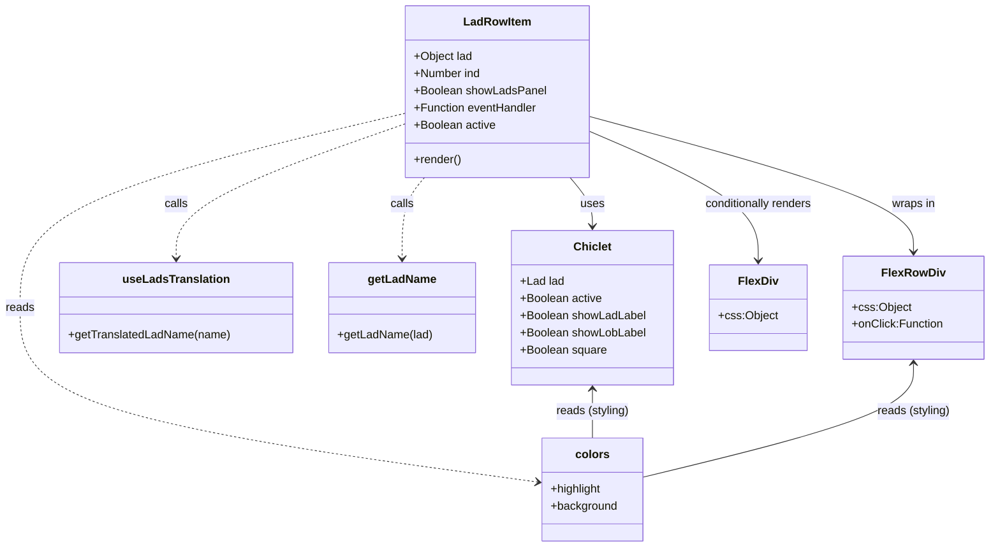

# Diagram: web/portal/src/pages/locations/components/LadRowItem.js

> Auto-generated by Obscura crawlers

## Mermaid

### SVG

<svg id="container" width="1362.34375" xmlns="http://www.w3.org/2000/svg" class="classDiagram" height="764" viewBox="0 0 1362.34375 764" role="graphics-document document" aria-roledescription="class"><g><defs><marker id="container_class-aggregationStart" class="marker aggregation class" refX="18" refY="7" markerWidth="190" markerHeight="240" orient="auto"><path d="M 18,7 L9,13 L1,7 L9,1 Z"></path></marker></defs><defs><marker id="container_class-aggregationEnd" class="marker aggregation class" refX="1" refY="7" markerWidth="20" markerHeight="28" orient="auto"><path d="M 18,7 L9,13 L1,7 L9,1 Z"></path></marker></defs><defs><marker id="container_class-extensionStart" class="marker extension class" refX="18" refY="7" markerWidth="190" markerHeight="240" orient="auto"><path d="M 1,7 L18,13 V 1 Z"></path></marker></defs><defs><marker id="container_class-extensionEnd" class="marker extension class" refX="1" refY="7" markerWidth="20" markerHeight="28" orient="auto"><path d="M 1,1 V 13 L18,7 Z"></path></marker></defs><defs><marker id="container_class-compositionStart" class="marker composition class" refX="18" refY="7" markerWidth="190" markerHeight="240" orient="auto"><path d="M 18,7 L9,13 L1,7 L9,1 Z"></path></marker></defs><defs><marker id="container_class-compositionEnd" class="marker composition class" refX="1" refY="7" markerWidth="20" markerHeight="28" orient="auto"><path d="M 18,7 L9,13 L1,7 L9,1 Z"></path></marker></defs><defs><marker id="container_class-dependencyStart" class="marker dependency class" refX="6" refY="7" markerWidth="190" markerHeight="240" orient="auto"><path d="M 5,7 L9,13 L1,7 L9,1 Z"></path></marker></defs><defs><marker id="container_class-dependencyEnd" class="marker dependency class" refX="13" refY="7" markerWidth="20" markerHeight="28" orient="auto"><path d="M 18,7 L9,13 L14,7 L9,1 Z"></path></marker></defs><defs><marker id="container_class-lollipopStart" class="marker lollipop class" refX="13" refY="7" markerWidth="190" markerHeight="240" orient="auto"><circle stroke="black" fill="transparent" cx="7" cy="7" r="6"></circle></marker></defs><defs><marker id="container_class-lollipopEnd" class="marker lollipop class" refX="1" refY="7" markerWidth="190" markerHeight="240" orient="auto"><circle stroke="black" fill="transparent" cx="7" cy="7" r="6"></circle></marker></defs><g class="root"><g class="clusters"></g><g class="edgePaths"><path d="M786.828,248L791.996,254.167C797.163,260.333,807.497,272.667,812.665,284C817.832,295.333,817.832,305.667,817.832,310.833L817.832,316" id="id_LadRowItem_Chiclet_1" class="edge-thickness-normal edge-pattern-solid relation" style=";;;" data-edge="true" data-et="edge" data-id="id_LadRowItem_Chiclet_1" data-points="W3sieCI6Nzg2LjgyODIzNjk2MjU3OTYsInkiOjI0OH0seyJ4Ijo4MTcuODMyMDMxMjUsInkiOjI4NX0seyJ4Ijo4MTcuODMyMDMxMjUsInkiOjMyMn1d" marker-end="url(#container_class-dependencyEnd)"></path><path d="M812.361,162.624L886.636,183.02C960.91,203.416,1109.459,244.208,1183.733,275.771C1258.008,307.333,1258.008,329.667,1258.008,340.833L1258.008,352" id="id_LadRowItem_FlexRowDiv_2" class="edge-thickness-normal edge-pattern-solid relation" style=";;;" data-edge="true" data-et="edge" data-id="id_LadRowItem_FlexRowDiv_2" data-points="W3sieCI6ODEyLjM2MTMyODEyNSwieSI6MTYyLjYyMzcwMDU4MTA4NzV9LHsieCI6MTI1OC4wMDc4MTI1LCJ5IjoyODV9LHsieCI6MTI1OC4wMDc4MTI1LCJ5IjozNTh9XQ==" marker-end="url(#container_class-dependencyEnd)"></path><path d="M812.361,183.049L851.28,200.041C890.198,217.033,968.035,251.016,1006.953,281.175C1045.871,311.333,1045.871,337.667,1045.871,350.833L1045.871,364" id="id_LadRowItem_FlexDiv_3" class="edge-thickness-normal edge-pattern-solid relation" style=";;;" data-edge="true" data-et="edge" data-id="id_LadRowItem_FlexDiv_3" data-points="W3sieCI6ODEyLjM2MTMyODEyNSwieSI6MTgzLjA0OTMwMTI0NDM0NDUyfSx7IngiOjEwNDUuODcxMDkzNzUsInkiOjI4NX0seyJ4IjoxMDQ1Ljg3MTA5Mzc1LCJ5IjozNzB9XQ==" marker-end="url(#container_class-dependencyEnd)"></path><path d="M560.189,172.701L507.396,191.417C454.603,210.134,349.016,247.567,296.223,278.95C243.43,310.333,243.43,335.667,243.43,348.333L243.43,361" id="id_LadRowItem_useLadsTranslation_4" class="edge-thickness-normal edge-pattern-dashed relation" style=";;;" data-edge="true" data-et="edge" data-id="id_LadRowItem_useLadsTranslation_4" data-points="W3sieCI6NTYwLjE4OTQ1MzEyNSwieSI6MTcyLjcwMDY1MzE3OTY3NTEzfSx7IngiOjI0My40Mjk2ODc1LCJ5IjoyODV9LHsieCI6MjQzLjQyOTY4NzUsInkiOjM2N31d" marker-end="url(#container_class-dependencyEnd)"></path><path d="M585.723,248L580.555,254.167C575.388,260.333,565.053,272.667,559.886,291.5C554.719,310.333,554.719,335.667,554.719,348.333L554.719,361" id="id_LadRowItem_getLadName_5" class="edge-thickness-normal edge-pattern-dashed relation" style=";;;" data-edge="true" data-et="edge" data-id="id_LadRowItem_getLadName_5" data-points="W3sieCI6NTg1LjcyMjU0NDI4NzQyMDQsInkiOjI0OH0seyJ4Ijo1NTQuNzE4NzUsInkiOjI4NX0seyJ4Ijo1NTQuNzE4NzUsInkiOjM2N31d" marker-end="url(#container_class-dependencyEnd)"></path><path d="M560.189,158.072L471.493,179.227C382.796,200.381,205.402,242.691,116.705,288.012C28.008,333.333,28.008,381.667,28.008,430C28.008,478.333,28.008,526.667,147.011,567.256C266.015,607.846,504.022,640.693,623.025,657.116L742.029,673.539" id="id_LadRowItem_colors_6" class="edge-thickness-normal edge-pattern-dashed relation" style=";;;" data-edge="true" data-et="edge" data-id="id_LadRowItem_colors_6" data-points="W3sieCI6NTYwLjE4OTQ1MzEyNSwieSI6MTU4LjA3MjEwNTY5ODg0ODQ3fSx7IngiOjI4LjAwNzgxMjUsInkiOjI4NX0seyJ4IjoyOC4wMDc4MTI1LCJ5Ijo0MzB9LHsieCI6MjguMDA3ODEyNSwieSI6NTc1fSx7IngiOjc0Ny45NzI2NTYyNSwieSI6Njc0LjM1OTAyOTY0OTU5NTZ9XQ==" marker-end="url(#container_class-dependencyEnd)"></path><path d="M817.832,544L817.832,549.167C817.832,554.333,817.832,564.667,817.832,576C817.832,587.333,817.832,599.667,817.832,605.833L817.832,612" id="id_Chiclet_colors_7" class="edge-thickness-normal edge-pattern-solid relation" style=";;;" data-edge="true" data-et="edge" data-id="id_Chiclet_colors_7" data-points="W3sieCI6ODE3LjgzMjAzMTI1LCJ5Ijo1Mzh9LHsieCI6ODE3LjgzMjAzMTI1LCJ5Ijo1NzV9LHsieCI6ODE3LjgzMjAzMTI1LCJ5Ijo2MTJ9XQ==" marker-start="url(#container_class-dependencyStart)"></path><path d="M1258.008,508L1258.008,519.167C1258.008,530.333,1258.008,552.667,1196.288,579.117C1134.569,605.567,1011.13,636.134,949.411,651.417L887.691,666.701" id="id_FlexRowDiv_colors_8" class="edge-thickness-normal edge-pattern-solid relation" style=";;;" data-edge="true" data-et="edge" data-id="id_FlexRowDiv_colors_8" data-points="W3sieCI6MTI1OC4wMDc4MTI1LCJ5Ijo1MDJ9LHsieCI6MTI1OC4wMDc4MTI1LCJ5Ijo1NzV9LHsieCI6ODg3LjY5MTQwNjI1LCJ5Ijo2NjYuNzAwODM4NjIwOTM0NX1d" marker-start="url(#container_class-dependencyStart)"></path></g><g class="edgeLabels"><g class="edgeLabel" transform="translate(817.83203125, 285)"><g class="label" data-id="id_LadRowItem_Chiclet_1" transform="translate(-16.4921875, -12)"><foreignObject width="32.984375" height="24">

uses

</foreignObject></g></g><g class="edgeLabel" transform="translate(1258.0078125, 285)"><g class="label" data-id="id_LadRowItem_FlexRowDiv_2" transform="translate(-30.453125, -12)"><foreignObject width="60.90625" height="24">

wraps in

</foreignObject></g></g><g class="edgeLabel" transform="translate(1045.87109375, 285)"><g class="label" data-id="id_LadRowItem_FlexDiv_3" transform="translate(-77.25, -12)"><foreignObject width="154.5" height="24">

conditionally renders

</foreignObject></g></g><g class="edgeLabel" transform="translate(243.4296875, 285)"><g class="label" data-id="id_LadRowItem_useLadsTranslation_4" transform="translate(-16.4453125, -12)"><foreignObject width="32.890625" height="24">

calls

</foreignObject></g></g><g class="edgeLabel" transform="translate(554.71875, 285)"><g class="label" data-id="id_LadRowItem_getLadName_5" transform="translate(-16.4453125, -12)"><foreignObject width="32.890625" height="24">

calls

</foreignObject></g></g><g class="edgeLabel" transform="translate(28.0078125, 430)"><g class="label" data-id="id_LadRowItem_colors_6" transform="translate(-20.0078125, -12)"><foreignObject width="40.015625" height="24">

reads

</foreignObject></g></g><g class="edgeLabel" transform="translate(817.83203125, 575)"><g class="label" data-id="id_Chiclet_colors_7" transform="translate(-51.2734375, -12)"><foreignObject width="102.546875" height="24">

reads (styling)

</foreignObject></g></g><g class="edgeLabel" transform="translate(1258.0078125, 575)"><g class="label" data-id="id_FlexRowDiv_colors_8" transform="translate(-51.2734375, -12)"><foreignObject width="102.546875" height="24">

reads (styling)

</foreignObject></g></g></g><g class="nodes"><g class="node default" id="classId-LadRowItem-0" transform="translate(686.275390625, 128)"><g class="basic label-container"><path d="M-126.0859375 -120 L126.0859375 -120 L126.0859375 120 L-126.0859375 120" stroke="none" stroke-width="0" fill="#ECECFF" style=""></path><path d="M-126.0859375 -120 C-44.7187894115513 -120, 36.6483586768974 -120, 126.0859375 -120 M-126.0859375 -120 C-33.289222226082586 -120, 59.50749304783483 -120, 126.0859375 -120 M126.0859375 -120 C126.0859375 -47.801348895199325, 126.0859375 24.39730220960135, 126.0859375 120 M126.0859375 -120 C126.0859375 -25.029350801363705, 126.0859375 69.94129839727259, 126.0859375 120 M126.0859375 120 C47.80288333883229 120, -30.480170822335424 120, -126.0859375 120 M126.0859375 120 C70.49973832692227 120, 14.913539153844539 120, -126.0859375 120 M-126.0859375 120 C-126.0859375 60.97022369091213, -126.0859375 1.9404473818242565, -126.0859375 -120 M-126.0859375 120 C-126.0859375 47.52910081594753, -126.0859375 -24.94179836810494, -126.0859375 -120" stroke="#9370DB" stroke-width="1.3" fill="none" stroke-dasharray="0 0" style=""></path></g><g class="annotation-group text" transform="translate(0, -96)"></g><g class="label-group text" transform="translate(-45.15625, -96)"><g class="label" style="font-weight: bolder" transform="translate(0,-12)"><foreignObject width="90.3125" height="24">

LadRowItem

</foreignObject></g></g><g class="members-group text" transform="translate(-114.0859375, -48)"><g class="label" style="" transform="translate(0,-12)"><foreignObject width="82.3125" height="24">

+Object lad

</foreignObject></g><g class="label" style="" transform="translate(0,12)"><foreignObject width="94.046875" height="24">

+Number ind

</foreignObject></g><g class="label" style="" transform="translate(0,36)"><foreignObject width="183.015625" height="24">

+Boolean showLadsPanel

</foreignObject></g><g class="label" style="" transform="translate(0,60)"><foreignObject width="173.203125" height="24">

+Function eventHandler

</foreignObject></g><g class="label" style="" transform="translate(0,84)"><foreignObject width="115.0625" height="24">

+Boolean active

</foreignObject></g></g><g class="methods-group text" transform="translate(-114.0859375, 96)"><g class="label" style="" transform="translate(0,-12)"><foreignObject width="66.609375" height="24">

+render()

</foreignObject></g></g><g class="divider" style=""><path d="M-126.0859375 -72 C-49.53386867891042 -72, 27.018200142179154 -72, 126.0859375 -72 M-126.0859375 -72 C-33.83936469757414 -72, 58.40720810485172 -72, 126.0859375 -72" stroke="#9370DB" stroke-width="1.3" fill="none" stroke-dasharray="0 0" style=""></path></g><g class="divider" style=""><path d="M-126.0859375 72 C-62.17572349747833 72, 1.7344905050433397 72, 126.0859375 72 M-126.0859375 72 C-35.79259343131504 72, 54.50075063736992 72, 126.0859375 72" stroke="#9370DB" stroke-width="1.3" fill="none" stroke-dasharray="0 0" style=""></path></g></g><g class="node default" id="classId-Chiclet-1" transform="translate(817.83203125, 430)"><g class="basic label-container"><path d="M-112.23828125 -108 L112.23828125 -108 L112.23828125 108 L-112.23828125 108" stroke="none" stroke-width="0" fill="#ECECFF" style=""></path><path d="M-112.23828125 -108 C-34.4328468783705 -108, 43.372587493259005 -108, 112.23828125 -108 M-112.23828125 -108 C-23.42418887498964 -108, 65.38990350002072 -108, 112.23828125 -108 M112.23828125 -108 C112.23828125 -55.038202693096764, 112.23828125 -2.076405386193528, 112.23828125 108 M112.23828125 -108 C112.23828125 -28.510870206105125, 112.23828125 50.97825958778975, 112.23828125 108 M112.23828125 108 C60.71862898287715 108, 9.198976715754299 108, -112.23828125 108 M112.23828125 108 C30.114497487280687 108, -52.009286275438626 108, -112.23828125 108 M-112.23828125 108 C-112.23828125 51.999352837945644, -112.23828125 -4.001294324108713, -112.23828125 -108 M-112.23828125 108 C-112.23828125 28.431406967470082, -112.23828125 -51.137186065059836, -112.23828125 -108" stroke="#9370DB" stroke-width="1.3" fill="none" stroke-dasharray="0 0" style=""></path></g><g class="annotation-group text" transform="translate(0, -84)"></g><g class="label-group text" transform="translate(-25.0703125, -84)"><g class="label" style="font-weight: bolder" transform="translate(0,-12)"><foreignObject width="50.140625" height="24">

Chiclet

</foreignObject></g></g><g class="members-group text" transform="translate(-100.23828125, -36)"><g class="label" style="" transform="translate(0,-12)"><foreignObject width="61.1875" height="24">

+Lad lad

</foreignObject></g><g class="label" style="" transform="translate(0,12)"><foreignObject width="115.0625" height="24">

+Boolean active

</foreignObject></g><g class="label" style="" transform="translate(0,36)"><foreignObject width="175.0625" height="24">

+Boolean showLadLabel

</foreignObject></g><g class="label" style="" transform="translate(0,60)"><foreignObject width="175.40625" height="24">

+Boolean showLobLabel

</foreignObject></g><g class="label" style="" transform="translate(0,84)"><foreignObject width="121.375" height="24">

+Boolean square

</foreignObject></g></g><g class="methods-group text" transform="translate(-100.23828125, 108)"></g><g class="divider" style=""><path d="M-112.23828125 -60 C-22.903499996702692 -60, 66.43128125659462 -60, 112.23828125 -60 M-112.23828125 -60 C-43.14522820991057 -60, 25.94782483017886 -60, 112.23828125 -60" stroke="#9370DB" stroke-width="1.3" fill="none" stroke-dasharray="0 0" style=""></path></g><g class="divider" style=""><path d="M-112.23828125 84 C-62.19016401940132 84, -12.142046788802645 84, 112.23828125 84 M-112.23828125 84 C-30.01977385716492 84, 52.19873353567016 84, 112.23828125 84" stroke="#9370DB" stroke-width="1.3" fill="none" stroke-dasharray="0 0" style=""></path></g></g><g class="node default" id="classId-useLadsTranslation-2" transform="translate(243.4296875, 430)"><g class="basic label-container"><path d="M-160.4140625 -63 L160.4140625 -63 L160.4140625 63 L-160.4140625 63" stroke="none" stroke-width="0" fill="#ECECFF" style=""></path><path d="M-160.4140625 -63 C-46.10221610215167 -63, 68.20963029569666 -63, 160.4140625 -63 M-160.4140625 -63 C-43.031007747875236 -63, 74.35204700424953 -63, 160.4140625 -63 M160.4140625 -63 C160.4140625 -19.33061736508931, 160.4140625 24.33876526982138, 160.4140625 63 M160.4140625 -63 C160.4140625 -18.942443386006907, 160.4140625 25.115113227986186, 160.4140625 63 M160.4140625 63 C84.42130891599537 63, 8.428555331990736 63, -160.4140625 63 M160.4140625 63 C53.09307189149422 63, -54.22791871701156 63, -160.4140625 63 M-160.4140625 63 C-160.4140625 34.23481587590268, -160.4140625 5.469631751805366, -160.4140625 -63 M-160.4140625 63 C-160.4140625 18.054261510333347, -160.4140625 -26.891476979333305, -160.4140625 -63" stroke="#9370DB" stroke-width="1.3" fill="none" stroke-dasharray="0 0" style=""></path></g><g class="annotation-group text" transform="translate(0, -39)"></g><g class="label-group text" transform="translate(-71.15625, -39)"><g class="label" style="font-weight: bolder" transform="translate(0,-12)"><foreignObject width="142.3125" height="24">

useLadsTranslation

</foreignObject></g></g><g class="members-group text" transform="translate(-148.4140625, 9)"></g><g class="methods-group text" transform="translate(-148.4140625, 39)"><g class="label" style="" transform="translate(0,-12)"><foreignObject width="225.671875" height="24">

+getTranslatedLadName(name)

</foreignObject></g></g><g class="divider" style=""><path d="M-160.4140625 -15 C-86.88019941984898 -15, -13.346336339697956 -15, 160.4140625 -15 M-160.4140625 -15 C-40.44097468505481 -15, 79.53211312989038 -15, 160.4140625 -15" stroke="#9370DB" stroke-width="1.3" fill="none" stroke-dasharray="0 0" style=""></path></g><g class="divider" style=""><path d="M-160.4140625 9 C-53.9913937258101 9, 52.4312750483798 9, 160.4140625 9 M-160.4140625 9 C-72.48946537110723 9, 15.435131757785541 9, 160.4140625 9" stroke="#9370DB" stroke-width="1.3" fill="none" stroke-dasharray="0 0" style=""></path></g></g><g class="node default" id="classId-getLadName-3" transform="translate(554.71875, 430)"><g class="basic label-container"><path d="M-100.875 -63 L100.875 -63 L100.875 63 L-100.875 63" stroke="none" stroke-width="0" fill="#ECECFF" style=""></path><path d="M-100.875 -63 C-48.5257529634787 -63, 3.823494073042596 -63, 100.875 -63 M-100.875 -63 C-44.96351010341928 -63, 10.947979793161437 -63, 100.875 -63 M100.875 -63 C100.875 -30.20180281947406, 100.875 2.5963943610518783, 100.875 63 M100.875 -63 C100.875 -20.66702408410046, 100.875 21.665951831799077, 100.875 63 M100.875 63 C20.255961537425478 63, -60.363076925149045 63, -100.875 63 M100.875 63 C26.183845938072565 63, -48.50730812385487 63, -100.875 63 M-100.875 63 C-100.875 14.629262829650273, -100.875 -33.741474340699455, -100.875 -63 M-100.875 63 C-100.875 19.317748331329803, -100.875 -24.364503337340395, -100.875 -63" stroke="#9370DB" stroke-width="1.3" fill="none" stroke-dasharray="0 0" style=""></path></g><g class="annotation-group text" transform="translate(0, -39)"></g><g class="label-group text" transform="translate(-45.8125, -39)"><g class="label" style="font-weight: bolder" transform="translate(0,-12)"><foreignObject width="91.625" height="24">

getLadName

</foreignObject></g></g><g class="members-group text" transform="translate(-88.875, 9)"></g><g class="methods-group text" transform="translate(-88.875, 39)"><g class="label" style="" transform="translate(0,-12)"><foreignObject width="131.9375" height="24">

+getLadName(lad)

</foreignObject></g></g><g class="divider" style=""><path d="M-100.875 -15 C-30.709352116871614 -15, 39.45629576625677 -15, 100.875 -15 M-100.875 -15 C-60.44287673448912 -15, -20.010753468978237 -15, 100.875 -15" stroke="#9370DB" stroke-width="1.3" fill="none" stroke-dasharray="0 0" style=""></path></g><g class="divider" style=""><path d="M-100.875 9 C-25.668640783957812 9, 49.537718432084375 9, 100.875 9 M-100.875 9 C-46.8618443295485 9, 7.151311340903007 9, 100.875 9" stroke="#9370DB" stroke-width="1.3" fill="none" stroke-dasharray="0 0" style=""></path></g></g><g class="node default" id="classId-FlexRowDiv-4" transform="translate(1258.0078125, 430)"><g class="basic label-container"><path d="M-96.3359375 -72 L96.3359375 -72 L96.3359375 72 L-96.3359375 72" stroke="none" stroke-width="0" fill="#ECECFF" style=""></path><path d="M-96.3359375 -72 C-40.07858512724754 -72, 16.178767245504915 -72, 96.3359375 -72 M-96.3359375 -72 C-44.75368223934788 -72, 6.828573021304237 -72, 96.3359375 -72 M96.3359375 -72 C96.3359375 -32.84201581271218, 96.3359375 6.315968374575647, 96.3359375 72 M96.3359375 -72 C96.3359375 -33.57858796882365, 96.3359375 4.842824062352705, 96.3359375 72 M96.3359375 72 C44.182959641042466 72, -7.970018217915069 72, -96.3359375 72 M96.3359375 72 C48.3854581699557 72, 0.43497883991139474 72, -96.3359375 72 M-96.3359375 72 C-96.3359375 18.912715255334327, -96.3359375 -34.17456948933135, -96.3359375 -72 M-96.3359375 72 C-96.3359375 22.93852245264756, -96.3359375 -26.122955094704878, -96.3359375 -72" stroke="#9370DB" stroke-width="1.3" fill="none" stroke-dasharray="0 0" style=""></path></g><g class="annotation-group text" transform="translate(0, -48)"></g><g class="label-group text" transform="translate(-41.609375, -48)"><g class="label" style="font-weight: bolder" transform="translate(0,-12)"><foreignObject width="83.21875" height="24">

FlexRowDiv

</foreignObject></g></g><g class="members-group text" transform="translate(-84.3359375, 0)"><g class="label" style="" transform="translate(0,-12)"><foreignObject width="81.46875" height="24">

+css:Object

</foreignObject></g><g class="label" style="" transform="translate(0,12)"><foreignObject width="127.0625" height="24">

+onClick:Function

</foreignObject></g></g><g class="methods-group text" transform="translate(-84.3359375, 72)"></g><g class="divider" style=""><path d="M-96.3359375 -24 C-39.290346778427214 -24, 17.755243943145572 -24, 96.3359375 -24 M-96.3359375 -24 C-37.13114064665217 -24, 22.07365620669566 -24, 96.3359375 -24" stroke="#9370DB" stroke-width="1.3" fill="none" stroke-dasharray="0 0" style=""></path></g><g class="divider" style=""><path d="M-96.3359375 48 C-32.045655965262355 48, 32.24462556947529 48, 96.3359375 48 M-96.3359375 48 C-40.782355622299406 48, 14.771226255401189 48, 96.3359375 48" stroke="#9370DB" stroke-width="1.3" fill="none" stroke-dasharray="0 0" style=""></path></g></g><g class="node default" id="classId-FlexDiv-5" transform="translate(1045.87109375, 430)"><g class="basic label-container"><path d="M-65.80078125 -60 L65.80078125 -60 L65.80078125 60 L-65.80078125 60" stroke="none" stroke-width="0" fill="#ECECFF" style=""></path><path d="M-65.80078125 -60 C-27.30219018448392 -60, 11.196400881032162 -60, 65.80078125 -60 M-65.80078125 -60 C-15.53065685220951 -60, 34.73946754558098 -60, 65.80078125 -60 M65.80078125 -60 C65.80078125 -32.02364180749684, 65.80078125 -4.047283614993674, 65.80078125 60 M65.80078125 -60 C65.80078125 -13.688374592734128, 65.80078125 32.623250814531744, 65.80078125 60 M65.80078125 60 C16.032691186724108 60, -33.735398876551784 60, -65.80078125 60 M65.80078125 60 C34.68382048843587 60, 3.5668597268717406 60, -65.80078125 60 M-65.80078125 60 C-65.80078125 20.266424357167224, -65.80078125 -19.46715128566555, -65.80078125 -60 M-65.80078125 60 C-65.80078125 30.00618784467499, -65.80078125 0.012375689349980235, -65.80078125 -60" stroke="#9370DB" stroke-width="1.3" fill="none" stroke-dasharray="0 0" style=""></path></g><g class="annotation-group text" transform="translate(0, -36)"></g><g class="label-group text" transform="translate(-26.1328125, -36)"><g class="label" style="font-weight: bolder" transform="translate(0,-12)"><foreignObject width="52.265625" height="24">

FlexDiv

</foreignObject></g></g><g class="members-group text" transform="translate(-53.80078125, 12)"><g class="label" style="" transform="translate(0,-12)"><foreignObject width="81.46875" height="24">

+css:Object

</foreignObject></g></g><g class="methods-group text" transform="translate(-53.80078125, 60)"></g><g class="divider" style=""><path d="M-65.80078125 -12 C-29.31339390292375 -12, 7.173993444152501 -12, 65.80078125 -12 M-65.80078125 -12 C-24.429227915319792 -12, 16.942325419360415 -12, 65.80078125 -12" stroke="#9370DB" stroke-width="1.3" fill="none" stroke-dasharray="0 0" style=""></path></g><g class="divider" style=""><path d="M-65.80078125 36 C-14.849938661837307 36, 36.10090392632539 36, 65.80078125 36 M-65.80078125 36 C-38.34329669284024 36, -10.885812135680482 36, 65.80078125 36" stroke="#9370DB" stroke-width="1.3" fill="none" stroke-dasharray="0 0" style=""></path></g></g><g class="node default" id="classId-colors-6" transform="translate(817.83203125, 684)"><g class="basic label-container"><path d="M-69.859375 -72 L69.859375 -72 L69.859375 72 L-69.859375 72" stroke="none" stroke-width="0" fill="#ECECFF" style=""></path><path d="M-69.859375 -72 C-26.054898515453296 -72, 17.74957796909341 -72, 69.859375 -72 M-69.859375 -72 C-27.499862704083974 -72, 14.859649591832053 -72, 69.859375 -72 M69.859375 -72 C69.859375 -43.11236395468377, 69.859375 -14.224727909367537, 69.859375 72 M69.859375 -72 C69.859375 -28.765699961321367, 69.859375 14.468600077357266, 69.859375 72 M69.859375 72 C22.792335784630197 72, -24.274703430739606 72, -69.859375 72 M69.859375 72 C26.043864060249057 72, -17.771646879501887 72, -69.859375 72 M-69.859375 72 C-69.859375 23.809716177814167, -69.859375 -24.380567644371666, -69.859375 -72 M-69.859375 72 C-69.859375 27.558278466983772, -69.859375 -16.883443066032456, -69.859375 -72" stroke="#9370DB" stroke-width="1.3" fill="none" stroke-dasharray="0 0" style=""></path></g><g class="annotation-group text" transform="translate(0, -48)"></g><g class="label-group text" transform="translate(-22.328125, -48)"><g class="label" style="font-weight: bolder" transform="translate(0,-12)"><foreignObject width="44.65625" height="24">

colors

</foreignObject></g></g><g class="members-group text" transform="translate(-57.859375, 0)"><g class="label" style="" transform="translate(0,-12)"><foreignObject width="72.25" height="24">

+highlight

</foreignObject></g><g class="label" style="" transform="translate(0,12)"><foreignObject width="93.390625" height="24">

+background

</foreignObject></g></g><g class="methods-group text" transform="translate(-57.859375, 72)"></g><g class="divider" style=""><path d="M-69.859375 -24 C-17.60378671861786 -24, 34.65180156276428 -24, 69.859375 -24 M-69.859375 -24 C-18.019930608526096 -24, 33.81951378294781 -24, 69.859375 -24" stroke="#9370DB" stroke-width="1.3" fill="none" stroke-dasharray="0 0" style=""></path></g><g class="divider" style=""><path d="M-69.859375 48 C-14.290717800563925 48, 41.27793939887215 48, 69.859375 48 M-69.859375 48 C-35.97947493884854 48, -2.09957487769708 48, 69.859375 48" stroke="#9370DB" stroke-width="1.3" fill="none" stroke-dasharray="0 0" style=""></path></g></g></g></g></g></svg>
