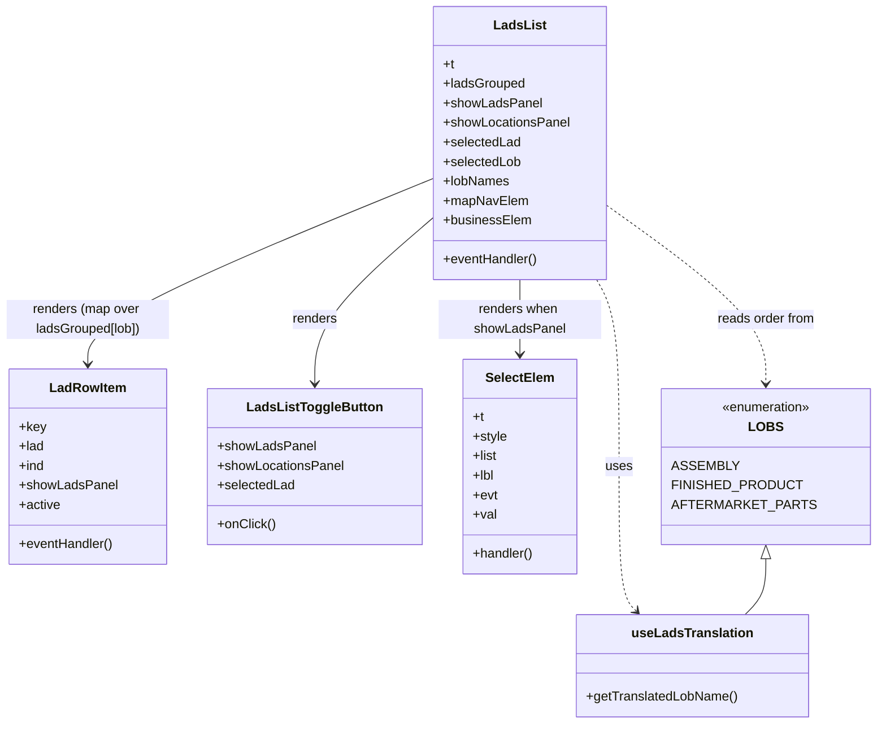
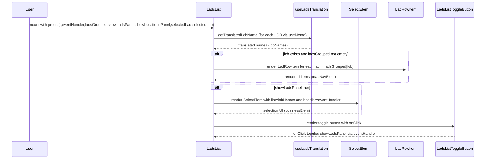

# Diagram: web/portal/src/pages/locations/components/LadsList.js

> Auto-generated by Obscura crawlers

## Diagram 1

### SVG

<svg id="container" width="1042.515625" xmlns="http://www.w3.org/2000/svg" class="classDiagram" height="890" viewBox="0 0 1042.515625 890" role="graphics-document document" aria-roledescription="class"><g><defs><marker id="container_class-aggregationStart" class="marker aggregation class" refX="18" refY="7" markerWidth="190" markerHeight="240" orient="auto"><path d="M 18,7 L9,13 L1,7 L9,1 Z"></path></marker></defs><defs><marker id="container_class-aggregationEnd" class="marker aggregation class" refX="1" refY="7" markerWidth="20" markerHeight="28" orient="auto"><path d="M 18,7 L9,13 L1,7 L9,1 Z"></path></marker></defs><defs><marker id="container_class-extensionStart" class="marker extension class" refX="18" refY="7" markerWidth="190" markerHeight="240" orient="auto"><path d="M 1,7 L18,13 V 1 Z"></path></marker></defs><defs><marker id="container_class-extensionEnd" class="marker extension class" refX="1" refY="7" markerWidth="20" markerHeight="28" orient="auto"><path d="M 1,1 V 13 L18,7 Z"></path></marker></defs><defs><marker id="container_class-compositionStart" class="marker composition class" refX="18" refY="7" markerWidth="190" markerHeight="240" orient="auto"><path d="M 18,7 L9,13 L1,7 L9,1 Z"></path></marker></defs><defs><marker id="container_class-compositionEnd" class="marker composition class" refX="1" refY="7" markerWidth="20" markerHeight="28" orient="auto"><path d="M 18,7 L9,13 L1,7 L9,1 Z"></path></marker></defs><defs><marker id="container_class-dependencyStart" class="marker dependency class" refX="6" refY="7" markerWidth="190" markerHeight="240" orient="auto"><path d="M 5,7 L9,13 L1,7 L9,1 Z"></path></marker></defs><defs><marker id="container_class-dependencyEnd" class="marker dependency class" refX="13" refY="7" markerWidth="20" markerHeight="28" orient="auto"><path d="M 18,7 L9,13 L14,7 L9,1 Z"></path></marker></defs><defs><marker id="container_class-lollipopStart" class="marker lollipop class" refX="13" refY="7" markerWidth="190" markerHeight="240" orient="auto"><circle stroke="black" fill="transparent" cx="7" cy="7" r="6"></circle></marker></defs><defs><marker id="container_class-lollipopEnd" class="marker lollipop class" refX="1" refY="7" markerWidth="190" markerHeight="240" orient="auto"><circle stroke="black" fill="transparent" cx="7" cy="7" r="6"></circle></marker></defs><g class="root"><g class="clusters"></g><g class="edgePaths"><path d="M525.453,219.534L455.878,248.445C386.302,277.356,247.151,335.178,177.576,373.256C108,411.333,108,429.667,108,438.833L108,448" id="id_LadsList_LadRowItem_1" class="edge-thickness-normal edge-pattern-solid relation" style=";;;" data-edge="true" data-et="edge" data-id="id_LadsList_LadRowItem_1" data-points="W3sieCI6NTI1LjQ1MzEyNSwieSI6MjE5LjUzMzc1MDIyNDQwMzF9LHsieCI6MTA4LCJ5IjozOTN9LHsieCI6MTA4LCJ5Ijo0NTR9XQ==" marker-end="url(#container_class-dependencyEnd)"></path><path d="M525.453,267.359L501.44,288.299C477.427,309.239,429.401,351.12,405.388,385.227C381.375,419.333,381.375,445.667,381.375,458.833L381.375,472" id="id_LadsList_LadsListToggleButton_2" class="edge-thickness-normal edge-pattern-solid relation" style=";;;" data-edge="true" data-et="edge" data-id="id_LadsList_LadsListToggleButton_2" data-points="W3sieCI6NTI1LjQ1MzEyNSwieSI6MjY3LjM1OTA5ODMyOTc3NTJ9LHsieCI6MzgxLjM3NSwieSI6MzkzfSx7IngiOjM4MS4zNzUsInkiOjQ3OH1d" marker-end="url(#container_class-dependencyEnd)"></path><path d="M630.219,344L630.219,352.167C630.219,360.333,630.219,376.667,630.219,392C630.219,407.333,630.219,421.667,630.219,428.833L630.219,436" id="id_LadsList_SelectElem_3" class="edge-thickness-normal edge-pattern-solid relation" style=";;;" data-edge="true" data-et="edge" data-id="id_LadsList_SelectElem_3" data-points="W3sieCI6NjMwLjIxODc1LCJ5IjozNDR9LHsieCI6NjMwLjIxODc1LCJ5IjozOTN9LHsieCI6NjMwLjIxODc1LCJ5Ijo0NDJ9XQ==" marker-end="url(#container_class-dependencyEnd)"></path><path d="M723.969,344L728.526,352.167C733.083,360.333,742.198,376.667,746.755,415C751.313,453.333,751.313,513.667,751.313,570C751.313,626.333,751.313,678.667,754.585,708.275C757.858,737.884,764.404,744.768,767.676,748.21L770.949,751.652" id="id_LadsList_useLadsTranslation_4" class="edge-thickness-normal edge-pattern-dashed relation" style=";;;" data-edge="true" data-et="edge" data-id="id_LadsList_useLadsTranslation_4" data-points="W3sieCI6NzIzLjk2ODc1LCJ5IjozNDR9LHsieCI6NzUxLjMxMjUsInkiOjM5M30seyJ4Ijo3NTEuMzEyNSwieSI6NTc0fSx7IngiOjc1MS4zMTI1LCJ5Ijo3MzF9LHsieCI6Nzc1LjA4MzQ3Mzg5OTE0NzcsInkiOjc1Nn1d" marker-end="url(#container_class-dependencyEnd)"></path><path d="M734.984,254.817L765.597,277.848C796.21,300.878,857.435,346.939,888.048,383.136C918.66,419.333,918.66,445.667,918.66,458.833L918.66,472" id="id_LadsList_LOBS_5" class="edge-thickness-normal edge-pattern-dashed relation" style=";;;" data-edge="true" data-et="edge" data-id="id_LadsList_LOBS_5" data-points="W3sieCI6NzM0Ljk4NDM3NSwieSI6MjU0LjgxNzE4ODI4MjkzMjI1fSx7IngiOjkxOC42NjAxNTYyNSwieSI6MzkzfSx7IngiOjkxOC42NjAxNTYyNSwieSI6NDc4fV0=" marker-end="url(#container_class-dependencyEnd)"></path><path d="M918.66,687.25L918.66,694.542C918.66,701.833,918.66,716.417,914.698,727.875C910.736,739.333,902.813,747.667,898.851,751.833L894.889,756" id="id_LOBS_useLadsTranslation_6" class="edge-thickness-normal edge-pattern-solid relation" style=";;;" data-edge="true" data-et="edge" data-id="id_LOBS_useLadsTranslation_6" data-points="W3sieCI6OTE4LjY2MDE1NjI1LCJ5Ijo2NzB9LHsieCI6OTE4LjY2MDE1NjI1LCJ5Ijo3MzF9LHsieCI6ODk0Ljg4OTE4MjM1MDg1MjMsInkiOjc1Nn1d" marker-start="url(#container_class-extensionStart)"></path></g><g class="edgeLabels"><g class="edgeLabel" transform="translate(108, 393)"><g class="label" data-id="id_LadsList_LadRowItem_1" transform="translate(-100, -24)"><foreignObject width="200" height="48">

renders (map over ladsGrouped[lob])

</foreignObject></g></g><g class="edgeLabel" transform="translate(381.375, 393)"><g class="label" data-id="id_LadsList_LadsListToggleButton_2" transform="translate(-27.75, -12)"><foreignObject width="55.5" height="24">

renders

</foreignObject></g></g><g class="edgeLabel" transform="translate(630.21875, 393)"><g class="label" data-id="id_LadsList_SelectElem_3" transform="translate(-100, -24)"><foreignObject width="200" height="48">

renders when showLadsPanel

</foreignObject></g></g><g class="edgeLabel" transform="translate(751.3125, 574)"><g class="label" data-id="id_LadsList_useLadsTranslation_4" transform="translate(-16.4921875, -12)"><foreignObject width="32.984375" height="24">

uses

</foreignObject></g></g><g class="edgeLabel" transform="translate(918.66015625, 393)"><g class="label" data-id="id_LadsList_LOBS_5" transform="translate(-61.0546875, -12)"><foreignObject width="122.109375" height="24">

reads order from

</foreignObject></g></g><g class="edgeLabel"><g class="label" data-id="id_LOBS_useLadsTranslation_6" transform="translate(0, 0)"><foreignObject width="0" height="0">

</foreignObject></g></g></g><g class="nodes"><g class="node default" id="classId-LadsList-0" transform="translate(630.21875, 176)"><g class="basic label-container"><path d="M-104.765625 -168 L104.765625 -168 L104.765625 168 L-104.765625 168" stroke="none" stroke-width="0" fill="#ECECFF" style=""></path><path d="M-104.765625 -168 C-39.262780387568256 -168, 26.240064224863488 -168, 104.765625 -168 M-104.765625 -168 C-43.794273471960246 -168, 17.17707805607951 -168, 104.765625 -168 M104.765625 -168 C104.765625 -83.51068905391894, 104.765625 0.9786218921621241, 104.765625 168 M104.765625 -168 C104.765625 -68.7871832883353, 104.765625 30.4256334233294, 104.765625 168 M104.765625 168 C43.550978242625916 168, -17.663668514748167 168, -104.765625 168 M104.765625 168 C52.48435868420387 168, 0.20309236840773792 168, -104.765625 168 M-104.765625 168 C-104.765625 45.17346389045231, -104.765625 -77.65307221909538, -104.765625 -168 M-104.765625 168 C-104.765625 94.08931310801165, -104.765625 20.178626216023304, -104.765625 -168" stroke="#9370DB" stroke-width="1.3" fill="none" stroke-dasharray="0 0" style=""></path></g><g class="annotation-group text" transform="translate(0, -144)"></g><g class="label-group text" transform="translate(-30.390625, -144)"><g class="label" style="font-weight: bolder" transform="translate(0,-12)"><foreignObject width="60.78125" height="24">

LadsList

</foreignObject></g></g><g class="members-group text" transform="translate(-92.765625, -96)"><g class="label" style="" transform="translate(0,-12)"><foreignObject width="13.6875" height="24">

+t

</foreignObject></g><g class="label" style="" transform="translate(0,12)"><foreignObject width="100.578125" height="24">

+ladsGrouped

</foreignObject></g><g class="label" style="" transform="translate(0,36)"><foreignObject width="119.109375" height="24">

+showLadsPanel

</foreignObject></g><g class="label" style="" transform="translate(0,60)"><foreignObject width="155.140625" height="24">

+showLocationsPanel

</foreignObject></g><g class="label" style="" transform="translate(0,84)"><foreignObject width="95.0625" height="24">

+selectedLad

</foreignObject></g><g class="label" style="" transform="translate(0,108)"><foreignObject width="95.40625" height="24">

+selectedLob

</foreignObject></g><g class="label" style="" transform="translate(0,132)"><foreignObject width="80.984375" height="24">

+lobNames

</foreignObject></g><g class="label" style="" transform="translate(0,156)"><foreignObject width="102.65625" height="24">

+mapNavElem

</foreignObject></g><g class="label" style="" transform="translate(0,180)"><foreignObject width="107.15625" height="24">

+businessElem

</foreignObject></g></g><g class="methods-group text" transform="translate(-92.765625, 144)"><g class="label" style="" transform="translate(0,-12)"><foreignObject width="116.734375" height="24">

+eventHandler()

</foreignObject></g></g><g class="divider" style=""><path d="M-104.765625 -120 C-54.03042889961077 -120, -3.2952327992215373 -120, 104.765625 -120 M-104.765625 -120 C-42.38259580270444 -120, 20.000433394591127 -120, 104.765625 -120" stroke="#9370DB" stroke-width="1.3" fill="none" stroke-dasharray="0 0" style=""></path></g><g class="divider" style=""><path d="M-104.765625 120 C-29.221602011183037 120, 46.322420977633925 120, 104.765625 120 M-104.765625 120 C-59.68147361116307 120, -14.597322222326142 120, 104.765625 120" stroke="#9370DB" stroke-width="1.3" fill="none" stroke-dasharray="0 0" style=""></path></g></g><g class="node default" id="classId-LadRowItem-1" transform="translate(108, 574)"><g class="basic label-container"><path d="M-94.1328125 -120 L94.1328125 -120 L94.1328125 120 L-94.1328125 120" stroke="none" stroke-width="0" fill="#ECECFF" style=""></path><path d="M-94.1328125 -120 C-47.84490858368595 -120, -1.5570046673718991 -120, 94.1328125 -120 M-94.1328125 -120 C-30.362034338877976 -120, 33.40874382224405 -120, 94.1328125 -120 M94.1328125 -120 C94.1328125 -37.31393512317058, 94.1328125 45.37212975365884, 94.1328125 120 M94.1328125 -120 C94.1328125 -60.917031063289954, 94.1328125 -1.8340621265799086, 94.1328125 120 M94.1328125 120 C52.72194738881021 120, 11.311082277620415 120, -94.1328125 120 M94.1328125 120 C44.08531358375755 120, -5.962185332484907 120, -94.1328125 120 M-94.1328125 120 C-94.1328125 68.16495629289437, -94.1328125 16.32991258578876, -94.1328125 -120 M-94.1328125 120 C-94.1328125 60.80707303697906, -94.1328125 1.6141460739581248, -94.1328125 -120" stroke="#9370DB" stroke-width="1.3" fill="none" stroke-dasharray="0 0" style=""></path></g><g class="annotation-group text" transform="translate(0, -96)"></g><g class="label-group text" transform="translate(-45.15625, -96)"><g class="label" style="font-weight: bolder" transform="translate(0,-12)"><foreignObject width="90.3125" height="24">

LadRowItem

</foreignObject></g></g><g class="members-group text" transform="translate(-82.1328125, -48)"><g class="label" style="" transform="translate(0,-12)"><foreignObject width="32.5625" height="24">

+key

</foreignObject></g><g class="label" style="" transform="translate(0,12)"><foreignObject width="30.875" height="24">

+lad

</foreignObject></g><g class="label" style="" transform="translate(0,36)"><foreignObject width="31.453125" height="24">

+ind

</foreignObject></g><g class="label" style="" transform="translate(0,60)"><foreignObject width="119.109375" height="24">

+showLadsPanel

</foreignObject></g><g class="label" style="" transform="translate(0,84)"><foreignObject width="50.921875" height="24">

+active

</foreignObject></g></g><g class="methods-group text" transform="translate(-82.1328125, 96)"><g class="label" style="" transform="translate(0,-12)"><foreignObject width="116.734375" height="24">

+eventHandler()

</foreignObject></g></g><g class="divider" style=""><path d="M-94.1328125 -72 C-48.577815526477025 -72, -3.0228185529540497 -72, 94.1328125 -72 M-94.1328125 -72 C-40.43077140768239 -72, 13.271269684635215 -72, 94.1328125 -72" stroke="#9370DB" stroke-width="1.3" fill="none" stroke-dasharray="0 0" style=""></path></g><g class="divider" style=""><path d="M-94.1328125 72 C-23.005783589619668 72, 48.121245320760664 72, 94.1328125 72 M-94.1328125 72 C-20.23532866477376 72, 53.66215517045248 72, 94.1328125 72" stroke="#9370DB" stroke-width="1.3" fill="none" stroke-dasharray="0 0" style=""></path></g></g><g class="node default" id="classId-LadsListToggleButton-2" transform="translate(381.375, 574)"><g class="basic label-container"><path d="M-129.2421875 -96 L129.2421875 -96 L129.2421875 96 L-129.2421875 96" stroke="none" stroke-width="0" fill="#ECECFF" style=""></path><path d="M-129.2421875 -96 C-49.32584570896378 -96, 30.590496082072434 -96, 129.2421875 -96 M-129.2421875 -96 C-45.44397811512853 -96, 38.35423126974294 -96, 129.2421875 -96 M129.2421875 -96 C129.2421875 -24.652427095946067, 129.2421875 46.69514580810787, 129.2421875 96 M129.2421875 -96 C129.2421875 -49.201932724091805, 129.2421875 -2.403865448183609, 129.2421875 96 M129.2421875 96 C39.84888848280046 96, -49.54441053439908 96, -129.2421875 96 M129.2421875 96 C66.53734914615339 96, 3.8325107923067634 96, -129.2421875 96 M-129.2421875 96 C-129.2421875 26.591423828460265, -129.2421875 -42.81715234307947, -129.2421875 -96 M-129.2421875 96 C-129.2421875 53.04989478437507, -129.2421875 10.09978956875014, -129.2421875 -96" stroke="#9370DB" stroke-width="1.3" fill="none" stroke-dasharray="0 0" style=""></path></g><g class="annotation-group text" transform="translate(0, -72)"></g><g class="label-group text" transform="translate(-79.34375, -72)"><g class="label" style="font-weight: bolder" transform="translate(0,-12)"><foreignObject width="158.6875" height="24">

LadsListToggleButton

</foreignObject></g></g><g class="members-group text" transform="translate(-117.2421875, -24)"><g class="label" style="" transform="translate(0,-12)"><foreignObject width="119.109375" height="24">

+showLadsPanel

</foreignObject></g><g class="label" style="" transform="translate(0,12)"><foreignObject width="155.140625" height="24">

+showLocationsPanel

</foreignObject></g><g class="label" style="" transform="translate(0,36)"><foreignObject width="95.0625" height="24">

+selectedLad

</foreignObject></g></g><g class="methods-group text" transform="translate(-117.2421875, 72)"><g class="label" style="" transform="translate(0,-12)"><foreignObject width="70.921875" height="24">

+onClick()

</foreignObject></g></g><g class="divider" style=""><path d="M-129.2421875 -48 C-44.752559188985884 -48, 39.73706912202823 -48, 129.2421875 -48 M-129.2421875 -48 C-68.56198440284217 -48, -7.881781305684356 -48, 129.2421875 -48" stroke="#9370DB" stroke-width="1.3" fill="none" stroke-dasharray="0 0" style=""></path></g><g class="divider" style=""><path d="M-129.2421875 48 C-48.034771986726255 48, 33.17264352654749 48, 129.2421875 48 M-129.2421875 48 C-77.0614816688323 48, -24.880775837664615 48, 129.2421875 48" stroke="#9370DB" stroke-width="1.3" fill="none" stroke-dasharray="0 0" style=""></path></g></g><g class="node default" id="classId-SelectElem-3" transform="translate(630.21875, 574)"><g class="basic label-container"><path d="M-69.6015625 -132 L69.6015625 -132 L69.6015625 132 L-69.6015625 132" stroke="none" stroke-width="0" fill="#ECECFF" style=""></path><path d="M-69.6015625 -132 C-21.39763080646312 -132, 26.80630088707376 -132, 69.6015625 -132 M-69.6015625 -132 C-40.40835943417467 -132, -11.215156368349348 -132, 69.6015625 -132 M69.6015625 -132 C69.6015625 -35.56984589231965, 69.6015625 60.8603082153607, 69.6015625 132 M69.6015625 -132 C69.6015625 -54.533983751441184, 69.6015625 22.932032497117632, 69.6015625 132 M69.6015625 132 C34.51347461543616 132, -0.5746132691276813 132, -69.6015625 132 M69.6015625 132 C34.051068231715924 132, -1.4994260365681527 132, -69.6015625 132 M-69.6015625 132 C-69.6015625 65.06744853357861, -69.6015625 -1.865102932842774, -69.6015625 -132 M-69.6015625 132 C-69.6015625 73.79460641480043, -69.6015625 15.589212829600868, -69.6015625 -132" stroke="#9370DB" stroke-width="1.3" fill="none" stroke-dasharray="0 0" style=""></path></g><g class="annotation-group text" transform="translate(0, -108)"></g><g class="label-group text" transform="translate(-40.3125, -108)"><g class="label" style="font-weight: bolder" transform="translate(0,-12)"><foreignObject width="80.625" height="24">

SelectElem

</foreignObject></g></g><g class="members-group text" transform="translate(-57.6015625, -60)"><g class="label" style="" transform="translate(0,-12)"><foreignObject width="13.6875" height="24">

+t

</foreignObject></g><g class="label" style="" transform="translate(0,12)"><foreignObject width="42.359375" height="24">

+style

</foreignObject></g><g class="label" style="" transform="translate(0,36)"><foreignObject width="30.4375" height="24">

+list

</foreignObject></g><g class="label" style="" transform="translate(0,60)"><foreignObject width="26.875" height="24">

+lbl

</foreignObject></g><g class="label" style="" transform="translate(0,84)"><foreignObject width="30.296875" height="24">

+evt

</foreignObject></g><g class="label" style="" transform="translate(0,108)"><foreignObject width="28.6875" height="24">

+val

</foreignObject></g></g><g class="methods-group text" transform="translate(-57.6015625, 108)"><g class="label" style="" transform="translate(0,-12)"><foreignObject width="74.890625" height="24">

+handler()

</foreignObject></g></g><g class="divider" style=""><path d="M-69.6015625 -84 C-24.889487132145987 -84, 19.822588235708025 -84, 69.6015625 -84 M-69.6015625 -84 C-17.677629426065103 -84, 34.246303647869794 -84, 69.6015625 -84" stroke="#9370DB" stroke-width="1.3" fill="none" stroke-dasharray="0 0" style=""></path></g><g class="divider" style=""><path d="M-69.6015625 84 C-22.470462346422785 84, 24.66063780715443 84, 69.6015625 84 M-69.6015625 84 C-17.457005039865926 84, 34.68755242026815 84, 69.6015625 84" stroke="#9370DB" stroke-width="1.3" fill="none" stroke-dasharray="0 0" style=""></path></g></g><g class="node default" id="classId-useLadsTranslation-4" transform="translate(834.986328125, 819)"><g class="basic label-container"><path d="M-140.328125 -63 L140.328125 -63 L140.328125 63 L-140.328125 63" stroke="none" stroke-width="0" fill="#ECECFF" style=""></path><path d="M-140.328125 -63 C-60.45608843731269 -63, 19.415948125374626 -63, 140.328125 -63 M-140.328125 -63 C-47.020225782561994 -63, 46.28767343487601 -63, 140.328125 -63 M140.328125 -63 C140.328125 -26.49206927001058, 140.328125 10.015861459978836, 140.328125 63 M140.328125 -63 C140.328125 -28.505339519859817, 140.328125 5.9893209602803665, 140.328125 63 M140.328125 63 C30.03270753203016 63, -80.26270993593968 63, -140.328125 63 M140.328125 63 C83.51701189123001 63, 26.705898782460025 63, -140.328125 63 M-140.328125 63 C-140.328125 16.30213611032363, -140.328125 -30.39572777935274, -140.328125 -63 M-140.328125 63 C-140.328125 34.624791034389915, -140.328125 6.249582068779837, -140.328125 -63" stroke="#9370DB" stroke-width="1.3" fill="none" stroke-dasharray="0 0" style=""></path></g><g class="annotation-group text" transform="translate(0, -39)"></g><g class="label-group text" transform="translate(-71.15625, -39)"><g class="label" style="font-weight: bolder" transform="translate(0,-12)"><foreignObject width="142.3125" height="24">

useLadsTranslation

</foreignObject></g></g><g class="members-group text" transform="translate(-128.328125, 9)"></g><g class="methods-group text" transform="translate(-128.328125, 39)"><g class="label" style="" transform="translate(0,-12)"><foreignObject width="185.5" height="24">

+getTranslatedLobName()

</foreignObject></g></g><g class="divider" style=""><path d="M-140.328125 -15 C-71.68433610267684 -15, -3.0405472053536755 -15, 140.328125 -15 M-140.328125 -15 C-42.472605163275546 -15, 55.38291467344891 -15, 140.328125 -15" stroke="#9370DB" stroke-width="1.3" fill="none" stroke-dasharray="0 0" style=""></path></g><g class="divider" style=""><path d="M-140.328125 9 C-65.32078617026319 9, 9.68655265947362 9, 140.328125 9 M-140.328125 9 C-33.49356810858515 9, 73.3409887828297 9, 140.328125 9" stroke="#9370DB" stroke-width="1.3" fill="none" stroke-dasharray="0 0" style=""></path></g></g><g class="node default" id="classId-LOBS-5" transform="translate(918.66015625, 574)"><g class="basic label-container"><path d="M-115.85546875 -96 L115.85546875 -96 L115.85546875 96 L-115.85546875 96" stroke="none" stroke-width="0" fill="#ECECFF" style=""></path><path d="M-115.85546875 -96 C-30.153419935542672 -96, 55.548628878914656 -96, 115.85546875 -96 M-115.85546875 -96 C-23.345237868292358 -96, 69.16499301341528 -96, 115.85546875 -96 M115.85546875 -96 C115.85546875 -24.045487667647237, 115.85546875 47.90902466470553, 115.85546875 96 M115.85546875 -96 C115.85546875 -47.985921882941355, 115.85546875 0.02815623411729007, 115.85546875 96 M115.85546875 96 C61.000019473479284 96, 6.144570196958568 96, -115.85546875 96 M115.85546875 96 C23.922445706505016 96, -68.01057733698997 96, -115.85546875 96 M-115.85546875 96 C-115.85546875 54.81666460874219, -115.85546875 13.633329217484373, -115.85546875 -96 M-115.85546875 96 C-115.85546875 51.65542246140263, -115.85546875 7.310844922805259, -115.85546875 -96" stroke="#9370DB" stroke-width="1.3" fill="none" stroke-dasharray="0 0" style=""></path></g><g class="annotation-group text" transform="translate(-55.5546875, -72)"><g class="label" style="" transform="translate(0,-12)"><foreignObject width="111.109375" height="24">

«enumeration»

</foreignObject></g></g><g class="label-group text" transform="translate(-18.6484375, -48)"><g class="label" style="font-weight: bolder" transform="translate(0,-12)"><foreignObject width="37.296875" height="24">

LOBS

</foreignObject></g></g><g class="members-group text" transform="translate(-103.85546875, 0)"><g class="label" style="" transform="translate(0,-12)"><foreignObject width="72.484375" height="24">

ASSEMBLY

</foreignObject></g><g class="label" style="" transform="translate(0,12)"><foreignObject width="142.25" height="24">

FINISHED_PRODUCT

</foreignObject></g><g class="label" style="" transform="translate(0,36)"><foreignObject width="152.15625" height="24">

AFTERMARKET_PARTS

</foreignObject></g></g><g class="methods-group text" transform="translate(-103.85546875, 96)"></g><g class="divider" style=""><path d="M-115.85546875 -24 C-39.18545414203466 -24, 37.484560465930684 -24, 115.85546875 -24 M-115.85546875 -24 C-32.13940082164956 -24, 51.57666710670088 -24, 115.85546875 -24" stroke="#9370DB" stroke-width="1.3" fill="none" stroke-dasharray="0 0" style=""></path></g><g class="divider" style=""><path d="M-115.85546875 72 C-31.276015208418343 72, 53.303438333163314 72, 115.85546875 72 M-115.85546875 72 C-60.607135444207266 72, -5.358802138414532 72, 115.85546875 72" stroke="#9370DB" stroke-width="1.3" fill="none" stroke-dasharray="0 0" style=""></path></g></g></g></g></g></svg>

## Diagram 2

### SVG

<svg id="container" width="2188" xmlns="http://www.w3.org/2000/svg" height="713" viewBox="-50 -10 2188 713" role="graphics-document document" aria-roledescription="sequence"><g><rect x="1913" y="627" fill="#eaeaea" stroke="#666" width="175" height="65" name="LadsListToggleButton" rx="3" ry="3" class="actor actor-bottom"></rect><text x="2000.5" y="659.5" dominant-baseline="central" alignment-baseline="central" class="actor actor-box" style="text-anchor: middle; font-size: 16px; font-weight: 400;"><tspan x="2000.5" dy="0">LadsListToggleButton</tspan></text></g><g><rect x="1713" y="627" fill="#eaeaea" stroke="#666" width="150" height="65" name="LadRowItem" rx="3" ry="3" class="actor actor-bottom"></rect><text x="1788" y="659.5" dominant-baseline="central" alignment-baseline="central" class="actor actor-box" style="text-anchor: middle; font-size: 16px; font-weight: 400;"><tspan x="1788" dy="0">LadRowItem</tspan></text></g><g><rect x="1513" y="627" fill="#eaeaea" stroke="#666" width="150" height="65" name="SelectElem" rx="3" ry="3" class="actor actor-bottom"></rect><text x="1588" y="659.5" dominant-baseline="central" alignment-baseline="central" class="actor actor-box" style="text-anchor: middle; font-size: 16px; font-weight: 400;"><tspan x="1588" dy="0">SelectElem</tspan></text></g><g><rect x="1303" y="627" fill="#eaeaea" stroke="#666" width="160" height="65" name="useLadsTranslation" rx="3" ry="3" class="actor actor-bottom"></rect><text x="1383" y="659.5" dominant-baseline="central" alignment-baseline="central" class="actor actor-box" style="text-anchor: middle; font-size: 16px; font-weight: 400;"><tspan x="1383" dy="0">useLadsTranslation</tspan></text></g><g><rect x="865" y="627" fill="#eaeaea" stroke="#666" width="150" height="65" name="LadsList" rx="3" ry="3" class="actor actor-bottom"></rect><text x="940" y="659.5" dominant-baseline="central" alignment-baseline="central" class="actor actor-box" style="text-anchor: middle; font-size: 16px; font-weight: 400;"><tspan x="940" dy="0">LadsList</tspan></text></g><g><rect x="0" y="627" fill="#eaeaea" stroke="#666" width="150" height="65" name="User" rx="3" ry="3" class="actor actor-bottom"></rect><text x="75" y="659.5" dominant-baseline="central" alignment-baseline="central" class="actor actor-box" style="text-anchor: middle; font-size: 16px; font-weight: 400;"><tspan x="75" dy="0">User</tspan></text></g><g><line id="actor5" x1="2000.5" y1="65" x2="2000.5" y2="627" class="actor-line 200" stroke-width="0.5px" stroke="#999" name="LadsListToggleButton"></line><g id="root-5"><rect x="1913" y="0" fill="#eaeaea" stroke="#666" width="175" height="65" name="LadsListToggleButton" rx="3" ry="3" class="actor actor-top"></rect><text x="2000.5" y="32.5" dominant-baseline="central" alignment-baseline="central" class="actor actor-box" style="text-anchor: middle; font-size: 16px; font-weight: 400;"><tspan x="2000.5" dy="0">LadsListToggleButton</tspan></text></g></g><g><line id="actor4" x1="1788" y1="65" x2="1788" y2="627" class="actor-line 200" stroke-width="0.5px" stroke="#999" name="LadRowItem"></line><g id="root-4"><rect x="1713" y="0" fill="#eaeaea" stroke="#666" width="150" height="65" name="LadRowItem" rx="3" ry="3" class="actor actor-top"></rect><text x="1788" y="32.5" dominant-baseline="central" alignment-baseline="central" class="actor actor-box" style="text-anchor: middle; font-size: 16px; font-weight: 400;"><tspan x="1788" dy="0">LadRowItem</tspan></text></g></g><g><line id="actor3" x1="1588" y1="65" x2="1588" y2="627" class="actor-line 200" stroke-width="0.5px" stroke="#999" name="SelectElem"></line><g id="root-3"><rect x="1513" y="0" fill="#eaeaea" stroke="#666" width="150" height="65" name="SelectElem" rx="3" ry="3" class="actor actor-top"></rect><text x="1588" y="32.5" dominant-baseline="central" alignment-baseline="central" class="actor actor-box" style="text-anchor: middle; font-size: 16px; font-weight: 400;"><tspan x="1588" dy="0">SelectElem</tspan></text></g></g><g><line id="actor2" x1="1383" y1="65" x2="1383" y2="627" class="actor-line 200" stroke-width="0.5px" stroke="#999" name="useLadsTranslation"></line><g id="root-2"><rect x="1303" y="0" fill="#eaeaea" stroke="#666" width="160" height="65" name="useLadsTranslation" rx="3" ry="3" class="actor actor-top"></rect><text x="1383" y="32.5" dominant-baseline="central" alignment-baseline="central" class="actor actor-box" style="text-anchor: middle; font-size: 16px; font-weight: 400;"><tspan x="1383" dy="0">useLadsTranslation</tspan></text></g></g><g><line id="actor1" x1="940" y1="65" x2="940" y2="627" class="actor-line 200" stroke-width="0.5px" stroke="#999" name="LadsList"></line><g id="root-1"><rect x="865" y="0" fill="#eaeaea" stroke="#666" width="150" height="65" name="LadsList" rx="3" ry="3" class="actor actor-top"></rect><text x="940" y="32.5" dominant-baseline="central" alignment-baseline="central" class="actor actor-box" style="text-anchor: middle; font-size: 16px; font-weight: 400;"><tspan x="940" dy="0">LadsList</tspan></text></g></g><g><line id="actor0" x1="75" y1="65" x2="75" y2="627" class="actor-line 200" stroke-width="0.5px" stroke="#999" name="User"></line><g id="root-0"><rect x="0" y="0" fill="#eaeaea" stroke="#666" width="150" height="65" name="User" rx="3" ry="3" class="actor actor-top"></rect><text x="75" y="32.5" dominant-baseline="central" alignment-baseline="central" class="actor actor-box" style="text-anchor: middle; font-size: 16px; font-weight: 400;"><tspan x="75" dy="0">User</tspan></text></g></g><g></g><defs><symbol id="computer" width="24" height="24"><path transform="scale(.5)" d="M2 2v13h20v-13h-20zm18 11h-16v-9h16v9zm-10.228 6l.466-1h3.524l.467 1h-4.457zm14.228 3h-24l2-6h2.104l-1.33 4h18.45l-1.297-4h2.073l2 6zm-5-10h-14v-7h14v7z"></path></symbol></defs><defs><symbol id="database" fill-rule="evenodd" clip-rule="evenodd"><path transform="scale(.5)" d="M12.258.001l.256.004.255.005.253.008.251.01.249.012.247.015.246.016.242.019.241.02.239.023.236.024.233.027.231.028.229.031.225.032.223.034.22.036.217.038.214.04.211.041.208.043.205.045.201.046.198.048.194.05.191.051.187.053.183.054.18.056.175.057.172.059.168.06.163.061.16.063.155.064.15.066.074.033.073.033.071.034.07.034.069.035.068.035.067.035.066.035.064.036.064.036.062.036.06.036.06.037.058.037.058.037.055.038.055.038.053.038.052.038.051.039.05.039.048.039.047.039.045.04.044.04.043.04.041.04.04.041.039.041.037.041.036.041.034.041.033.042.032.042.03.042.029.042.027.042.026.043.024.043.023.043.021.043.02.043.018.044.017.043.015.044.013.044.012.044.011.045.009.044.007.045.006.045.004.045.002.045.001.045v17l-.001.045-.002.045-.004.045-.006.045-.007.045-.009.044-.011.045-.012.044-.013.044-.015.044-.017.043-.018.044-.02.043-.021.043-.023.043-.024.043-.026.043-.027.042-.029.042-.03.042-.032.042-.033.042-.034.041-.036.041-.037.041-.039.041-.04.041-.041.04-.043.04-.044.04-.045.04-.047.039-.048.039-.05.039-.051.039-.052.038-.053.038-.055.038-.055.038-.058.037-.058.037-.06.037-.06.036-.062.036-.064.036-.064.036-.066.035-.067.035-.068.035-.069.035-.07.034-.071.034-.073.033-.074.033-.15.066-.155.064-.16.063-.163.061-.168.06-.172.059-.175.057-.18.056-.183.054-.187.053-.191.051-.194.05-.198.048-.201.046-.205.045-.208.043-.211.041-.214.04-.217.038-.22.036-.223.034-.225.032-.229.031-.231.028-.233.027-.236.024-.239.023-.241.02-.242.019-.246.016-.247.015-.249.012-.251.01-.253.008-.255.005-.256.004-.258.001-.258-.001-.256-.004-.255-.005-.253-.008-.251-.01-.249-.012-.247-.015-.245-.016-.243-.019-.241-.02-.238-.023-.236-.024-.234-.027-.231-.028-.228-.031-.226-.032-.223-.034-.22-.036-.217-.038-.214-.04-.211-.041-.208-.043-.204-.045-.201-.046-.198-.048-.195-.05-.19-.051-.187-.053-.184-.054-.179-.056-.176-.057-.172-.059-.167-.06-.164-.061-.159-.063-.155-.064-.151-.066-.074-.033-.072-.033-.072-.034-.07-.034-.069-.035-.068-.035-.067-.035-.066-.035-.064-.036-.063-.036-.062-.036-.061-.036-.06-.037-.058-.037-.057-.037-.056-.038-.055-.038-.053-.038-.052-.038-.051-.039-.049-.039-.049-.039-.046-.039-.046-.04-.044-.04-.043-.04-.041-.04-.04-.041-.039-.041-.037-.041-.036-.041-.034-.041-.033-.042-.032-.042-.03-.042-.029-.042-.027-.042-.026-.043-.024-.043-.023-.043-.021-.043-.02-.043-.018-.044-.017-.043-.015-.044-.013-.044-.012-.044-.011-.045-.009-.044-.007-.045-.006-.045-.004-.045-.002-.045-.001-.045v-17l.001-.045.002-.045.004-.045.006-.045.007-.045.009-.044.011-.045.012-.044.013-.044.015-.044.017-.043.018-.044.02-.043.021-.043.023-.043.024-.043.026-.043.027-.042.029-.042.03-.042.032-.042.033-.042.034-.041.036-.041.037-.041.039-.041.04-.041.041-.04.043-.04.044-.04.046-.04.046-.039.049-.039.049-.039.051-.039.052-.038.053-.038.055-.038.056-.038.057-.037.058-.037.06-.037.061-.036.062-.036.063-.036.064-.036.066-.035.067-.035.068-.035.069-.035.07-.034.072-.034.072-.033.074-.033.151-.066.155-.064.159-.063.164-.061.167-.06.172-.059.176-.057.179-.056.184-.054.187-.053.19-.051.195-.05.198-.048.201-.046.204-.045.208-.043.211-.041.214-.04.217-.038.22-.036.223-.034.226-.032.228-.031.231-.028.234-.027.236-.024.238-.023.241-.02.243-.019.245-.016.247-.015.249-.012.251-.01.253-.008.255-.005.256-.004.258-.001.258.001zm-9.258 20.499v.01l.001.021.003.021.004.022.005.021.006.022.007.022.009.023.01.022.011.023.012.023.013.023.015.023.016.024.017.023.018.024.019.024.021.024.022.025.023.024.024.025.052.049.056.05.061.051.066.051.07.051.075.051.079.052.084.052.088.052.092.052.097.052.102.051.105.052.11.052.114.051.119.051.123.051.127.05.131.05.135.05.139.048.144.049.147.047.152.047.155.047.16.045.163.045.167.043.171.043.176.041.178.041.183.039.187.039.19.037.194.035.197.035.202.033.204.031.209.03.212.029.216.027.219.025.222.024.226.021.23.02.233.018.236.016.24.015.243.012.246.01.249.008.253.005.256.004.259.001.26-.001.257-.004.254-.005.25-.008.247-.011.244-.012.241-.014.237-.016.233-.018.231-.021.226-.021.224-.024.22-.026.216-.027.212-.028.21-.031.205-.031.202-.034.198-.034.194-.036.191-.037.187-.039.183-.04.179-.04.175-.042.172-.043.168-.044.163-.045.16-.046.155-.046.152-.047.148-.048.143-.049.139-.049.136-.05.131-.05.126-.05.123-.051.118-.052.114-.051.11-.052.106-.052.101-.052.096-.052.092-.052.088-.053.083-.051.079-.052.074-.052.07-.051.065-.051.06-.051.056-.05.051-.05.023-.024.023-.025.021-.024.02-.024.019-.024.018-.024.017-.024.015-.023.014-.024.013-.023.012-.023.01-.023.01-.022.008-.022.006-.022.006-.022.004-.022.004-.021.001-.021.001-.021v-4.127l-.077.055-.08.053-.083.054-.085.053-.087.052-.09.052-.093.051-.095.05-.097.05-.1.049-.102.049-.105.048-.106.047-.109.047-.111.046-.114.045-.115.045-.118.044-.12.043-.122.042-.124.042-.126.041-.128.04-.13.04-.132.038-.134.038-.135.037-.138.037-.139.035-.142.035-.143.034-.144.033-.147.032-.148.031-.15.03-.151.03-.153.029-.154.027-.156.027-.158.026-.159.025-.161.024-.162.023-.163.022-.165.021-.166.02-.167.019-.169.018-.169.017-.171.016-.173.015-.173.014-.175.013-.175.012-.177.011-.178.01-.179.008-.179.008-.181.006-.182.005-.182.004-.184.003-.184.002h-.37l-.184-.002-.184-.003-.182-.004-.182-.005-.181-.006-.179-.008-.179-.008-.178-.01-.176-.011-.176-.012-.175-.013-.173-.014-.172-.015-.171-.016-.17-.017-.169-.018-.167-.019-.166-.02-.165-.021-.163-.022-.162-.023-.161-.024-.159-.025-.157-.026-.156-.027-.155-.027-.153-.029-.151-.03-.15-.03-.148-.031-.146-.032-.145-.033-.143-.034-.141-.035-.14-.035-.137-.037-.136-.037-.134-.038-.132-.038-.13-.04-.128-.04-.126-.041-.124-.042-.122-.042-.12-.044-.117-.043-.116-.045-.113-.045-.112-.046-.109-.047-.106-.047-.105-.048-.102-.049-.1-.049-.097-.05-.095-.05-.093-.052-.09-.051-.087-.052-.085-.053-.083-.054-.08-.054-.077-.054v4.127zm0-5.654v.011l.001.021.003.021.004.021.005.022.006.022.007.022.009.022.01.022.011.023.012.023.013.023.015.024.016.023.017.024.018.024.019.024.021.024.022.024.023.025.024.024.052.05.056.05.061.05.066.051.07.051.075.052.079.051.084.052.088.052.092.052.097.052.102.052.105.052.11.051.114.051.119.052.123.05.127.051.131.05.135.049.139.049.144.048.147.048.152.047.155.046.16.045.163.045.167.044.171.042.176.042.178.04.183.04.187.038.19.037.194.036.197.034.202.033.204.032.209.03.212.028.216.027.219.025.222.024.226.022.23.02.233.018.236.016.24.014.243.012.246.01.249.008.253.006.256.003.259.001.26-.001.257-.003.254-.006.25-.008.247-.01.244-.012.241-.015.237-.016.233-.018.231-.02.226-.022.224-.024.22-.025.216-.027.212-.029.21-.03.205-.032.202-.033.198-.035.194-.036.191-.037.187-.039.183-.039.179-.041.175-.042.172-.043.168-.044.163-.045.16-.045.155-.047.152-.047.148-.048.143-.048.139-.05.136-.049.131-.05.126-.051.123-.051.118-.051.114-.052.11-.052.106-.052.101-.052.096-.052.092-.052.088-.052.083-.052.079-.052.074-.051.07-.052.065-.051.06-.05.056-.051.051-.049.023-.025.023-.024.021-.025.02-.024.019-.024.018-.024.017-.024.015-.023.014-.023.013-.024.012-.022.01-.023.01-.023.008-.022.006-.022.006-.022.004-.021.004-.022.001-.021.001-.021v-4.139l-.077.054-.08.054-.083.054-.085.052-.087.053-.09.051-.093.051-.095.051-.097.05-.1.049-.102.049-.105.048-.106.047-.109.047-.111.046-.114.045-.115.044-.118.044-.12.044-.122.042-.124.042-.126.041-.128.04-.13.039-.132.039-.134.038-.135.037-.138.036-.139.036-.142.035-.143.033-.144.033-.147.033-.148.031-.15.03-.151.03-.153.028-.154.028-.156.027-.158.026-.159.025-.161.024-.162.023-.163.022-.165.021-.166.02-.167.019-.169.018-.169.017-.171.016-.173.015-.173.014-.175.013-.175.012-.177.011-.178.009-.179.009-.179.007-.181.007-.182.005-.182.004-.184.003-.184.002h-.37l-.184-.002-.184-.003-.182-.004-.182-.005-.181-.007-.179-.007-.179-.009-.178-.009-.176-.011-.176-.012-.175-.013-.173-.014-.172-.015-.171-.016-.17-.017-.169-.018-.167-.019-.166-.02-.165-.021-.163-.022-.162-.023-.161-.024-.159-.025-.157-.026-.156-.027-.155-.028-.153-.028-.151-.03-.15-.03-.148-.031-.146-.033-.145-.033-.143-.033-.141-.035-.14-.036-.137-.036-.136-.037-.134-.038-.132-.039-.13-.039-.128-.04-.126-.041-.124-.042-.122-.043-.12-.043-.117-.044-.116-.044-.113-.046-.112-.046-.109-.046-.106-.047-.105-.048-.102-.049-.1-.049-.097-.05-.095-.051-.093-.051-.09-.051-.087-.053-.085-.052-.083-.054-.08-.054-.077-.054v4.139zm0-5.666v.011l.001.02.003.022.004.021.005.022.006.021.007.022.009.023.01.022.011.023.012.023.013.023.015.023.016.024.017.024.018.023.019.024.021.025.022.024.023.024.024.025.052.05.056.05.061.05.066.051.07.051.075.052.079.051.084.052.088.052.092.052.097.052.102.052.105.051.11.052.114.051.119.051.123.051.127.05.131.05.135.05.139.049.144.048.147.048.152.047.155.046.16.045.163.045.167.043.171.043.176.042.178.04.183.04.187.038.19.037.194.036.197.034.202.033.204.032.209.03.212.028.216.027.219.025.222.024.226.021.23.02.233.018.236.017.24.014.243.012.246.01.249.008.253.006.256.003.259.001.26-.001.257-.003.254-.006.25-.008.247-.01.244-.013.241-.014.237-.016.233-.018.231-.02.226-.022.224-.024.22-.025.216-.027.212-.029.21-.03.205-.032.202-.033.198-.035.194-.036.191-.037.187-.039.183-.039.179-.041.175-.042.172-.043.168-.044.163-.045.16-.045.155-.047.152-.047.148-.048.143-.049.139-.049.136-.049.131-.051.126-.05.123-.051.118-.052.114-.051.11-.052.106-.052.101-.052.096-.052.092-.052.088-.052.083-.052.079-.052.074-.052.07-.051.065-.051.06-.051.056-.05.051-.049.023-.025.023-.025.021-.024.02-.024.019-.024.018-.024.017-.024.015-.023.014-.024.013-.023.012-.023.01-.022.01-.023.008-.022.006-.022.006-.022.004-.022.004-.021.001-.021.001-.021v-4.153l-.077.054-.08.054-.083.053-.085.053-.087.053-.09.051-.093.051-.095.051-.097.05-.1.049-.102.048-.105.048-.106.048-.109.046-.111.046-.114.046-.115.044-.118.044-.12.043-.122.043-.124.042-.126.041-.128.04-.13.039-.132.039-.134.038-.135.037-.138.036-.139.036-.142.034-.143.034-.144.033-.147.032-.148.032-.15.03-.151.03-.153.028-.154.028-.156.027-.158.026-.159.024-.161.024-.162.023-.163.023-.165.021-.166.02-.167.019-.169.018-.169.017-.171.016-.173.015-.173.014-.175.013-.175.012-.177.01-.178.01-.179.009-.179.007-.181.006-.182.006-.182.004-.184.003-.184.001-.185.001-.185-.001-.184-.001-.184-.003-.182-.004-.182-.006-.181-.006-.179-.007-.179-.009-.178-.01-.176-.01-.176-.012-.175-.013-.173-.014-.172-.015-.171-.016-.17-.017-.169-.018-.167-.019-.166-.02-.165-.021-.163-.023-.162-.023-.161-.024-.159-.024-.157-.026-.156-.027-.155-.028-.153-.028-.151-.03-.15-.03-.148-.032-.146-.032-.145-.033-.143-.034-.141-.034-.14-.036-.137-.036-.136-.037-.134-.038-.132-.039-.13-.039-.128-.041-.126-.041-.124-.041-.122-.043-.12-.043-.117-.044-.116-.044-.113-.046-.112-.046-.109-.046-.106-.048-.105-.048-.102-.048-.1-.05-.097-.049-.095-.051-.093-.051-.09-.052-.087-.052-.085-.053-.083-.053-.08-.054-.077-.054v4.153zm8.74-8.179l-.257.004-.254.005-.25.008-.247.011-.244.012-.241.014-.237.016-.233.018-.231.021-.226.022-.224.023-.22.026-.216.027-.212.028-.21.031-.205.032-.202.033-.198.034-.194.036-.191.038-.187.038-.183.04-.179.041-.175.042-.172.043-.168.043-.163.045-.16.046-.155.046-.152.048-.148.048-.143.048-.139.049-.136.05-.131.05-.126.051-.123.051-.118.051-.114.052-.11.052-.106.052-.101.052-.096.052-.092.052-.088.052-.083.052-.079.052-.074.051-.07.052-.065.051-.06.05-.056.05-.051.05-.023.025-.023.024-.021.024-.02.025-.019.024-.018.024-.017.023-.015.024-.014.023-.013.023-.012.023-.01.023-.01.022-.008.022-.006.023-.006.021-.004.022-.004.021-.001.021-.001.021.001.021.001.021.004.021.004.022.006.021.006.023.008.022.01.022.01.023.012.023.013.023.014.023.015.024.017.023.018.024.019.024.02.025.021.024.023.024.023.025.051.05.056.05.06.05.065.051.07.052.074.051.079.052.083.052.088.052.092.052.096.052.101.052.106.052.11.052.114.052.118.051.123.051.126.051.131.05.136.05.139.049.143.048.148.048.152.048.155.046.16.046.163.045.168.043.172.043.175.042.179.041.183.04.187.038.191.038.194.036.198.034.202.033.205.032.21.031.212.028.216.027.22.026.224.023.226.022.231.021.233.018.237.016.241.014.244.012.247.011.25.008.254.005.257.004.26.001.26-.001.257-.004.254-.005.25-.008.247-.011.244-.012.241-.014.237-.016.233-.018.231-.021.226-.022.224-.023.22-.026.216-.027.212-.028.21-.031.205-.032.202-.033.198-.034.194-.036.191-.038.187-.038.183-.04.179-.041.175-.042.172-.043.168-.043.163-.045.16-.046.155-.046.152-.048.148-.048.143-.048.139-.049.136-.05.131-.05.126-.051.123-.051.118-.051.114-.052.11-.052.106-.052.101-.052.096-.052.092-.052.088-.052.083-.052.079-.052.074-.051.07-.052.065-.051.06-.05.056-.05.051-.05.023-.025.023-.024.021-.024.02-.025.019-.024.018-.024.017-.023.015-.024.014-.023.013-.023.012-.023.01-.023.01-.022.008-.022.006-.023.006-.021.004-.022.004-.021.001-.021.001-.021-.001-.021-.001-.021-.004-.021-.004-.022-.006-.021-.006-.023-.008-.022-.01-.022-.01-.023-.012-.023-.013-.023-.014-.023-.015-.024-.017-.023-.018-.024-.019-.024-.02-.025-.021-.024-.023-.024-.023-.025-.051-.05-.056-.05-.06-.05-.065-.051-.07-.052-.074-.051-.079-.052-.083-.052-.088-.052-.092-.052-.096-.052-.101-.052-.106-.052-.11-.052-.114-.052-.118-.051-.123-.051-.126-.051-.131-.05-.136-.05-.139-.049-.143-.048-.148-.048-.152-.048-.155-.046-.16-.046-.163-.045-.168-.043-.172-.043-.175-.042-.179-.041-.183-.04-.187-.038-.191-.038-.194-.036-.198-.034-.202-.033-.205-.032-.21-.031-.212-.028-.216-.027-.22-.026-.224-.023-.226-.022-.231-.021-.233-.018-.237-.016-.241-.014-.244-.012-.247-.011-.25-.008-.254-.005-.257-.004-.26-.001-.26.001z"></path></symbol></defs><defs><symbol id="clock" width="24" height="24"><path transform="scale(.5)" d="M12 2c5.514 0 10 4.486 10 10s-4.486 10-10 10-10-4.486-10-10 4.486-10 10-10zm0-2c-6.627 0-12 5.373-12 12s5.373 12 12 12 12-5.373 12-12-5.373-12-12-12zm5.848 12.459c.202.038.202.333.001.372-1.907.361-6.045 1.111-6.547 1.111-.719 0-1.301-.582-1.301-1.301 0-.512.77-5.447 1.125-7.445.034-.192.312-.181.343.014l.985 6.238 5.394 1.011z"></path></symbol></defs><defs><marker id="arrowhead" refX="7.9" refY="5" markerUnits="userSpaceOnUse" markerWidth="12" markerHeight="12" orient="auto-start-reverse"><path d="M -1 0 L 10 5 L 0 10 z"></path></marker></defs><defs><marker id="crosshead" markerWidth="15" markerHeight="8" orient="auto" refX="4" refY="4.5"><path fill="none" stroke="#000000" stroke-width="1pt" d="M 1,2 L 6,7 M 6,2 L 1,7" style="stroke-dasharray: 0, 0;"></path></marker></defs><defs><marker id="filled-head" refX="15.5" refY="7" markerWidth="20" markerHeight="28" orient="auto"><path d="M 18,7 L9,13 L14,7 L9,1 Z"></path></marker></defs><defs><marker id="sequencenumber" refX="15" refY="15" markerWidth="60" markerHeight="40" orient="auto"><circle cx="15" cy="15" r="6"></circle></marker></defs><g><line x1="929" y1="219" x2="1799" y2="219" class="loopLine"></line><line x1="1799" y1="219" x2="1799" y2="360" class="loopLine"></line><line x1="929" y1="360" x2="1799" y2="360" class="loopLine"></line><line x1="929" y1="219" x2="929" y2="360" class="loopLine"></line><polygon points="929,219 979,219 979,232 970.6,239 929,239" class="labelBox"></polygon><text x="954" y="232" text-anchor="middle" dominant-baseline="middle" alignment-baseline="middle" class="labelText" style="font-size: 16px; font-weight: 400;">alt</text><text x="1389" y="237" text-anchor="middle" class="loopText" style="font-size: 16px; font-weight: 400;"><tspan x="1389">[lob exists and ladsGrouped not empty]</tspan></text></g><g><line x1="929" y1="370" x2="1599" y2="370" class="loopLine"></line><line x1="1599" y1="370" x2="1599" y2="511" class="loopLine"></line><line x1="929" y1="511" x2="1599" y2="511" class="loopLine"></line><line x1="929" y1="370" x2="929" y2="511" class="loopLine"></line><polygon points="929,370 979,370 979,383 970.6,390 929,390" class="labelBox"></polygon><text x="954" y="383" text-anchor="middle" dominant-baseline="middle" alignment-baseline="middle" class="labelText" style="font-size: 16px; font-weight: 400;">alt</text><text x="1289" y="388" text-anchor="middle" class="loopText" style="font-size: 16px; font-weight: 400;"><tspan x="1289">[showLadsPanel true]</tspan></text></g><text x="506" y="80" text-anchor="middle" dominant-baseline="middle" alignment-baseline="middle" class="messageText" dy="1em" style="font-size: 16px; font-weight: 400;">mount with props (t,eventHandler,ladsGrouped,showLadsPanel,showLocationsPanel,selectedLad,selectedLob)</text><line x1="76" y1="113" x2="936" y2="113" class="messageLine0" stroke-width="2" stroke="none" marker-end="url(#arrowhead)" style="fill: none;"></line><text x="1160" y="128" text-anchor="middle" dominant-baseline="middle" alignment-baseline="middle" class="messageText" dy="1em" style="font-size: 16px; font-weight: 400;">getTranslatedLobName (for each LOB via useMemo)</text><line x1="941" y1="161" x2="1379" y2="161" class="messageLine0" stroke-width="2" stroke="none" marker-end="url(#arrowhead)" style="fill: none;"></line><text x="1163" y="176" text-anchor="middle" dominant-baseline="middle" alignment-baseline="middle" class="messageText" dy="1em" style="font-size: 16px; font-weight: 400;">translated names (lobNames)</text><line x1="1382" y1="209" x2="944" y2="209" class="messageLine1" stroke-width="2" stroke="none" marker-end="url(#arrowhead)" style="stroke-dasharray: 3, 3; fill: none;"></line><text x="1363" y="269" text-anchor="middle" dominant-baseline="middle" alignment-baseline="middle" class="messageText" dy="1em" style="font-size: 16px; font-weight: 400;">render LadRowItem for each lad in ladsGrouped[lob]</text><line x1="941" y1="302" x2="1784" y2="302" class="messageLine0" stroke-width="2" stroke="none" marker-end="url(#arrowhead)" style="fill: none;"></line><text x="1366" y="317" text-anchor="middle" dominant-baseline="middle" alignment-baseline="middle" class="messageText" dy="1em" style="font-size: 16px; font-weight: 400;">rendered items (mapNavElem)</text><line x1="1787" y1="350" x2="944" y2="350" class="messageLine1" stroke-width="2" stroke="none" marker-end="url(#arrowhead)" style="stroke-dasharray: 3, 3; fill: none;"></line><text x="1263" y="420" text-anchor="middle" dominant-baseline="middle" alignment-baseline="middle" class="messageText" dy="1em" style="font-size: 16px; font-weight: 400;">render SelectElem with list=lobNames and handler=eventHandler</text><line x1="941" y1="453" x2="1584" y2="453" class="messageLine0" stroke-width="2" stroke="none" marker-end="url(#arrowhead)" style="fill: none;"></line><text x="1266" y="468" text-anchor="middle" dominant-baseline="middle" alignment-baseline="middle" class="messageText" dy="1em" style="font-size: 16px; font-weight: 400;">selection UI (businessElem)</text><line x1="1587" y1="501" x2="944" y2="501" class="messageLine1" stroke-width="2" stroke="none" marker-end="url(#arrowhead)" style="stroke-dasharray: 3, 3; fill: none;"></line><text x="1469" y="526" text-anchor="middle" dominant-baseline="middle" alignment-baseline="middle" class="messageText" dy="1em" style="font-size: 16px; font-weight: 400;">render toggle button with onClick</text><line x1="941" y1="559" x2="1996.5" y2="559" class="messageLine0" stroke-width="2" stroke="none" marker-end="url(#arrowhead)" style="fill: none;"></line><text x="1472" y="574" text-anchor="middle" dominant-baseline="middle" alignment-baseline="middle" class="messageText" dy="1em" style="font-size: 16px; font-weight: 400;">onClick toggles showLadsPanel via eventHandler</text><line x1="1999.5" y1="607" x2="944" y2="607" class="messageLine1" stroke-width="2" stroke="none" marker-end="url(#arrowhead)" style="stroke-dasharray: 3, 3; fill: none;"></line></svg>
