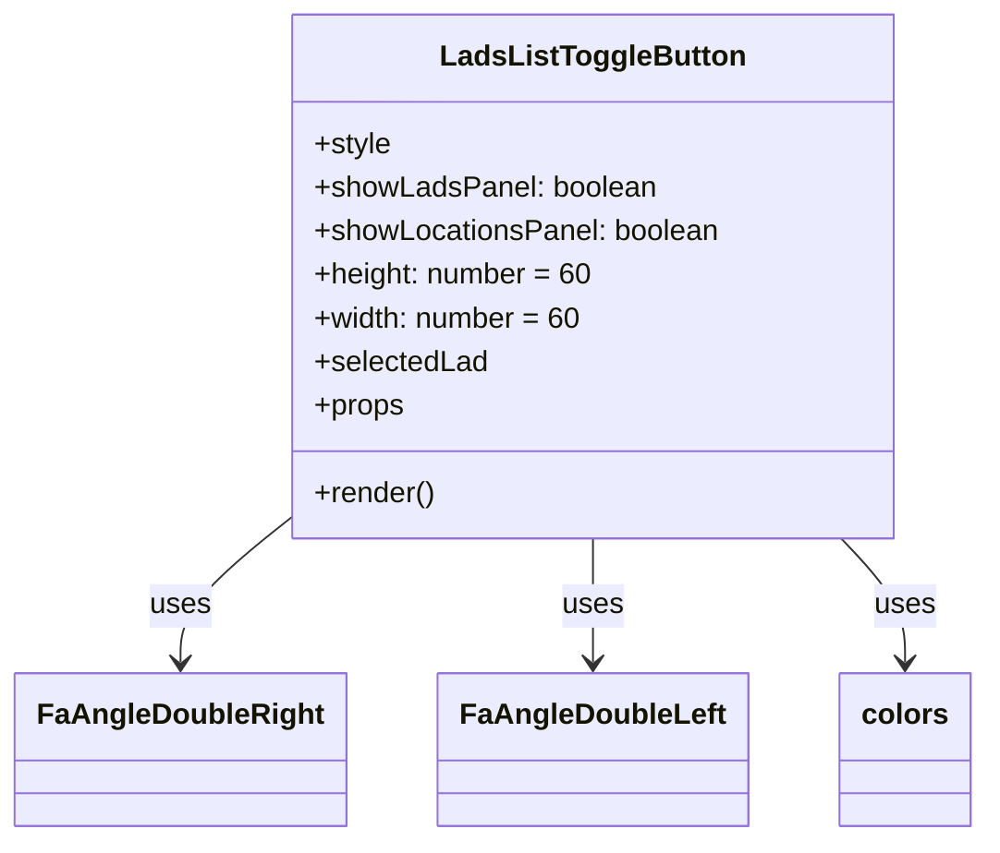

# Diagram: web/portal/src/pages/locations/components/LadsListToggleButton.js

> Auto-generated by Obscura crawlers

## Mermaid

### SVG

<svg id="container" width="516.90625" xmlns="http://www.w3.org/2000/svg" class="classDiagram" height="462" viewBox="0 0 516.90625 462" role="graphics-document document" aria-roledescription="class"><g><defs><marker id="container_class-aggregationStart" class="marker aggregation class" refX="18" refY="7" markerWidth="190" markerHeight="240" orient="auto"><path d="M 18,7 L9,13 L1,7 L9,1 Z"></path></marker></defs><defs><marker id="container_class-aggregationEnd" class="marker aggregation class" refX="1" refY="7" markerWidth="20" markerHeight="28" orient="auto"><path d="M 18,7 L9,13 L1,7 L9,1 Z"></path></marker></defs><defs><marker id="container_class-extensionStart" class="marker extension class" refX="18" refY="7" markerWidth="190" markerHeight="240" orient="auto"><path d="M 1,7 L18,13 V 1 Z"></path></marker></defs><defs><marker id="container_class-extensionEnd" class="marker extension class" refX="1" refY="7" markerWidth="20" markerHeight="28" orient="auto"><path d="M 1,1 V 13 L18,7 Z"></path></marker></defs><defs><marker id="container_class-compositionStart" class="marker composition class" refX="18" refY="7" markerWidth="190" markerHeight="240" orient="auto"><path d="M 18,7 L9,13 L1,7 L9,1 Z"></path></marker></defs><defs><marker id="container_class-compositionEnd" class="marker composition class" refX="1" refY="7" markerWidth="20" markerHeight="28" orient="auto"><path d="M 18,7 L9,13 L1,7 L9,1 Z"></path></marker></defs><defs><marker id="container_class-dependencyStart" class="marker dependency class" refX="6" refY="7" markerWidth="190" markerHeight="240" orient="auto"><path d="M 5,7 L9,13 L1,7 L9,1 Z"></path></marker></defs><defs><marker id="container_class-dependencyEnd" class="marker dependency class" refX="13" refY="7" markerWidth="20" markerHeight="28" orient="auto"><path d="M 18,7 L9,13 L14,7 L9,1 Z"></path></marker></defs><defs><marker id="container_class-lollipopStart" class="marker lollipop class" refX="13" refY="7" markerWidth="190" markerHeight="240" orient="auto"><circle stroke="black" fill="transparent" cx="7" cy="7" r="6"></circle></marker></defs><defs><marker id="container_class-lollipopEnd" class="marker lollipop class" refX="1" refY="7" markerWidth="190" markerHeight="240" orient="auto"><circle stroke="black" fill="transparent" cx="7" cy="7" r="6"></circle></marker></defs><g class="root"><g class="clusters"></g><g class="edgePaths"><path d="M146.625,288.581L137.785,295.984C128.945,303.387,111.266,318.194,102.426,330.763C93.586,343.333,93.586,353.667,93.586,358.833L93.586,364" id="id_LadsListToggleButton_FaAngleDoubleRight_1" class="edge-thickness-normal edge-pattern-solid relation" style=";;;" data-edge="true" data-et="edge" data-id="id_LadsListToggleButton_FaAngleDoubleRight_1" data-points="W3sieCI6MTQ2LjYyNSwieSI6Mjg4LjU4MDkzNTUxMTg1NjV9LHsieCI6OTMuNTg1OTM3NSwieSI6MzMzfSx7IngiOjkzLjU4NTkzNzUsInkiOjM3MH1d" marker-end="url(#container_class-dependencyEnd)"></path><path d="M309.711,296L309.711,302.167C309.711,308.333,309.711,320.667,309.711,332C309.711,343.333,309.711,353.667,309.711,358.833L309.711,364" id="id_LadsListToggleButton_FaAngleDoubleLeft_2" class="edge-thickness-normal edge-pattern-solid relation" style=";;;" data-edge="true" data-et="edge" data-id="id_LadsListToggleButton_FaAngleDoubleLeft_2" data-points="W3sieCI6MzA5LjcxMDkzNzUsInkiOjI5Nn0seyJ4IjozMDkuNzEwOTM3NSwieSI6MzMzfSx7IngiOjMwOS43MTA5Mzc1LCJ5IjozNzB9XQ==" marker-end="url(#container_class-dependencyEnd)"></path><path d="M440.876,296L446.493,302.167C452.11,308.333,463.344,320.667,468.961,332C474.578,343.333,474.578,353.667,474.578,358.833L474.578,364" id="id_LadsListToggleButton_colors_3" class="edge-thickness-normal edge-pattern-solid relation" style=";;;" data-edge="true" data-et="edge" data-id="id_LadsListToggleButton_colors_3" data-points="W3sieCI6NDQwLjg3NTk5Mjc0ODYxODgsInkiOjI5Nn0seyJ4Ijo0NzQuNTc4MTI1LCJ5IjozMzN9LHsieCI6NDc0LjU3ODEyNSwieSI6MzcwfV0=" marker-end="url(#container_class-dependencyEnd)"></path></g><g class="edgeLabels"><g class="edgeLabel" transform="translate(93.5859375, 333)"><g class="label" data-id="id_LadsListToggleButton_FaAngleDoubleRight_1" transform="translate(-16.4921875, -12)"><foreignObject width="32.984375" height="24">

uses

</foreignObject></g></g><g class="edgeLabel" transform="translate(309.7109375, 333)"><g class="label" data-id="id_LadsListToggleButton_FaAngleDoubleLeft_2" transform="translate(-16.4921875, -12)"><foreignObject width="32.984375" height="24">

uses

</foreignObject></g></g><g class="edgeLabel" transform="translate(474.578125, 333)"><g class="label" data-id="id_LadsListToggleButton_colors_3" transform="translate(-16.4921875, -12)"><foreignObject width="32.984375" height="24">

uses

</foreignObject></g></g></g><g class="nodes"><g class="node default" id="classId-LadsListToggleButton-0" transform="translate(309.7109375, 152)"><g class="basic label-container"><path d="M-163.0859375 -144 L163.0859375 -144 L163.0859375 144 L-163.0859375 144" stroke="none" stroke-width="0" fill="#ECECFF" style=""></path><path d="M-163.0859375 -144 C-85.25892560865805 -144, -7.4319137173160925 -144, 163.0859375 -144 M-163.0859375 -144 C-77.1365881625824 -144, 8.812761174835202 -144, 163.0859375 -144 M163.0859375 -144 C163.0859375 -59.12986374659417, 163.0859375 25.740272506811664, 163.0859375 144 M163.0859375 -144 C163.0859375 -53.89366057811587, 163.0859375 36.21267884376826, 163.0859375 144 M163.0859375 144 C76.84289240435639 144, -9.400152691287218 144, -163.0859375 144 M163.0859375 144 C55.987762963077344 144, -51.11041157384531 144, -163.0859375 144 M-163.0859375 144 C-163.0859375 74.44126186580672, -163.0859375 4.882523731613446, -163.0859375 -144 M-163.0859375 144 C-163.0859375 82.6260856101845, -163.0859375 21.252171220368993, -163.0859375 -144" stroke="#9370DB" stroke-width="1.3" fill="none" stroke-dasharray="0 0" style=""></path></g><g class="annotation-group text" transform="translate(0, -120)"></g><g class="label-group text" transform="translate(-79.34375, -120)"><g class="label" style="font-weight: bolder" transform="translate(0,-12)"><foreignObject width="158.6875" height="24">

LadsListToggleButton

</foreignObject></g></g><g class="members-group text" transform="translate(-151.0859375, -72)"><g class="label" style="" transform="translate(0,-12)"><foreignObject width="42.359375" height="24">

+style

</foreignObject></g><g class="label" style="" transform="translate(0,12)"><foreignObject width="186.796875" height="24">

+showLadsPanel: boolean

</foreignObject></g><g class="label" style="" transform="translate(0,36)"><foreignObject width="222.828125" height="24">

+showLocationsPanel: boolean

</foreignObject></g><g class="label" style="" transform="translate(0,60)"><foreignObject width="152.953125" height="24">

+height: number = 60

</foreignObject></g><g class="label" style="" transform="translate(0,84)"><foreignObject width="147.515625" height="24">

+width: number = 60

</foreignObject></g><g class="label" style="" transform="translate(0,108)"><foreignObject width="95.0625" height="24">

+selectedLad

</foreignObject></g><g class="label" style="" transform="translate(0,132)"><foreignObject width="49.515625" height="24">

+props

</foreignObject></g></g><g class="methods-group text" transform="translate(-151.0859375, 120)"><g class="label" style="" transform="translate(0,-12)"><foreignObject width="66.609375" height="24">

+render()

</foreignObject></g></g><g class="divider" style=""><path d="M-163.0859375 -96 C-65.12293675117986 -96, 32.84006399764027 -96, 163.0859375 -96 M-163.0859375 -96 C-66.98419287320546 -96, 29.117551753589083 -96, 163.0859375 -96" stroke="#9370DB" stroke-width="1.3" fill="none" stroke-dasharray="0 0" style=""></path></g><g class="divider" style=""><path d="M-163.0859375 96 C-61.73192466785929 96, 39.62208816428142 96, 163.0859375 96 M-163.0859375 96 C-84.46291681922447 96, -5.83989613844895 96, 163.0859375 96" stroke="#9370DB" stroke-width="1.3" fill="none" stroke-dasharray="0 0" style=""></path></g></g><g class="node default" id="classId-FaAngleDoubleRight-1" transform="translate(93.5859375, 412)"><g class="basic label-container"><path d="M-85.5859375 -42 L85.5859375 -42 L85.5859375 42 L-85.5859375 42" stroke="none" stroke-width="0" fill="#ECECFF" style=""></path><path d="M-85.5859375 -42 C-29.48245667388415 -42, 26.621024152231698 -42, 85.5859375 -42 M-85.5859375 -42 C-44.597689030859854 -42, -3.6094405617197083 -42, 85.5859375 -42 M85.5859375 -42 C85.5859375 -18.71680105882697, 85.5859375 4.56639788234606, 85.5859375 42 M85.5859375 -42 C85.5859375 -9.781624806693209, 85.5859375 22.436750386613582, 85.5859375 42 M85.5859375 42 C23.6282659767868 42, -38.3294055464264 42, -85.5859375 42 M85.5859375 42 C42.93455142781072 42, 0.28316535562143486 42, -85.5859375 42 M-85.5859375 42 C-85.5859375 16.629116440245035, -85.5859375 -8.74176711950993, -85.5859375 -42 M-85.5859375 42 C-85.5859375 21.36805108085733, -85.5859375 0.7361021617146619, -85.5859375 -42" stroke="#9370DB" stroke-width="1.3" fill="none" stroke-dasharray="0 0" style=""></path></g><g class="annotation-group text" transform="translate(0, -18)"></g><g class="label-group text" transform="translate(-73.5859375, -18)"><g class="label" style="font-weight: bolder" transform="translate(0,-12)"><foreignObject width="147.171875" height="24">

FaAngleDoubleRight

</foreignObject></g></g><g class="members-group text" transform="translate(-73.5859375, 30)"></g><g class="methods-group text" transform="translate(-73.5859375, 60)"></g><g class="divider" style=""><path d="M-85.5859375 6 C-29.317656660764015 6, 26.95062417847197 6, 85.5859375 6 M-85.5859375 6 C-38.189093357589826 6, 9.207750784820348 6, 85.5859375 6" stroke="#9370DB" stroke-width="1.3" fill="none" stroke-dasharray="0 0" style=""></path></g><g class="divider" style=""><path d="M-85.5859375 24 C-46.71554523217249 24, -7.845152964344976 24, 85.5859375 24 M-85.5859375 24 C-40.42352032789985 24, 4.738896844200298 24, 85.5859375 24" stroke="#9370DB" stroke-width="1.3" fill="none" stroke-dasharray="0 0" style=""></path></g></g><g class="node default" id="classId-FaAngleDoubleLeft-2" transform="translate(309.7109375, 412)"><g class="basic label-container"><path d="M-80.5390625 -42 L80.5390625 -42 L80.5390625 42 L-80.5390625 42" stroke="none" stroke-width="0" fill="#ECECFF" style=""></path><path d="M-80.5390625 -42 C-43.087937068885594 -42, -5.6368116377711885 -42, 80.5390625 -42 M-80.5390625 -42 C-33.21544687403373 -42, 14.108168751932538 -42, 80.5390625 -42 M80.5390625 -42 C80.5390625 -18.128146830121164, 80.5390625 5.743706339757672, 80.5390625 42 M80.5390625 -42 C80.5390625 -17.21748594169652, 80.5390625 7.56502811660696, 80.5390625 42 M80.5390625 42 C16.1256771603134 42, -48.2877081793732 42, -80.5390625 42 M80.5390625 42 C22.18152924343559 42, -36.17600401312882 42, -80.5390625 42 M-80.5390625 42 C-80.5390625 24.992153093793842, -80.5390625 7.984306187587684, -80.5390625 -42 M-80.5390625 42 C-80.5390625 10.771728439071694, -80.5390625 -20.456543121856612, -80.5390625 -42" stroke="#9370DB" stroke-width="1.3" fill="none" stroke-dasharray="0 0" style=""></path></g><g class="annotation-group text" transform="translate(0, -18)"></g><g class="label-group text" transform="translate(-68.5390625, -18)"><g class="label" style="font-weight: bolder" transform="translate(0,-12)"><foreignObject width="137.078125" height="24">

FaAngleDoubleLeft

</foreignObject></g></g><g class="members-group text" transform="translate(-68.5390625, 30)"></g><g class="methods-group text" transform="translate(-68.5390625, 60)"></g><g class="divider" style=""><path d="M-80.5390625 6 C-22.493692175371876 6, 35.55167814925625 6, 80.5390625 6 M-80.5390625 6 C-16.570616412296893 6, 47.397829675406214 6, 80.5390625 6" stroke="#9370DB" stroke-width="1.3" fill="none" stroke-dasharray="0 0" style=""></path></g><g class="divider" style=""><path d="M-80.5390625 24 C-39.159092590428465 24, 2.220877319143071 24, 80.5390625 24 M-80.5390625 24 C-19.44209125796172 24, 41.65487998407656 24, 80.5390625 24" stroke="#9370DB" stroke-width="1.3" fill="none" stroke-dasharray="0 0" style=""></path></g></g><g class="node default" id="classId-colors-3" transform="translate(474.578125, 412)"><g class="basic label-container"><path d="M-34.328125 -42 L34.328125 -42 L34.328125 42 L-34.328125 42" stroke="none" stroke-width="0" fill="#ECECFF" style=""></path><path d="M-34.328125 -42 C-7.774269037345725 -42, 18.77958692530855 -42, 34.328125 -42 M-34.328125 -42 C-17.389456247303627 -42, -0.45078749460725476 -42, 34.328125 -42 M34.328125 -42 C34.328125 -24.828162562224716, 34.328125 -7.656325124449431, 34.328125 42 M34.328125 -42 C34.328125 -17.424738173838815, 34.328125 7.15052365232237, 34.328125 42 M34.328125 42 C13.62344924064865 42, -7.0812265187026995 42, -34.328125 42 M34.328125 42 C17.80574349062326 42, 1.2833619812465216 42, -34.328125 42 M-34.328125 42 C-34.328125 15.994441362085603, -34.328125 -10.011117275828795, -34.328125 -42 M-34.328125 42 C-34.328125 8.668292127645906, -34.328125 -24.66341574470819, -34.328125 -42" stroke="#9370DB" stroke-width="1.3" fill="none" stroke-dasharray="0 0" style=""></path></g><g class="annotation-group text" transform="translate(0, -18)"></g><g class="label-group text" transform="translate(-22.328125, -18)"><g class="label" style="font-weight: bolder" transform="translate(0,-12)"><foreignObject width="44.65625" height="24">

colors

</foreignObject></g></g><g class="members-group text" transform="translate(-22.328125, 30)"></g><g class="methods-group text" transform="translate(-22.328125, 60)"></g><g class="divider" style=""><path d="M-34.328125 6 C-10.132420690531418 6, 14.063283618937163 6, 34.328125 6 M-34.328125 6 C-7.8703230096627586 6, 18.587478980674483 6, 34.328125 6" stroke="#9370DB" stroke-width="1.3" fill="none" stroke-dasharray="0 0" style=""></path></g><g class="divider" style=""><path d="M-34.328125 24 C-13.650378982484252 24, 7.027367035031496 24, 34.328125 24 M-34.328125 24 C-9.870972838156693 24, 14.586179323686615 24, 34.328125 24" stroke="#9370DB" stroke-width="1.3" fill="none" stroke-dasharray="0 0" style=""></path></g></g></g></g></g></svg>
