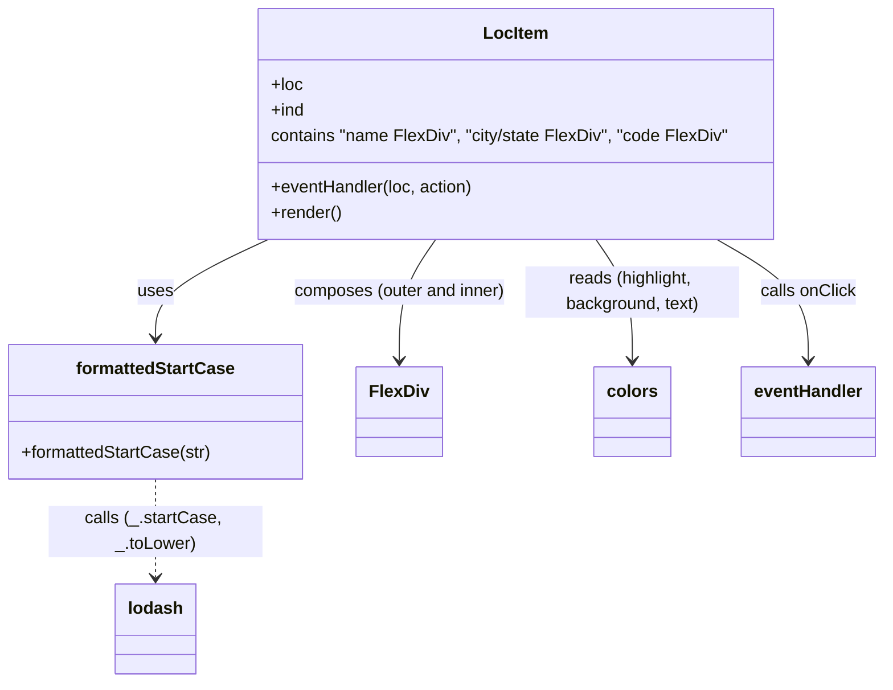

# Diagram: web/portal/src/pages/locations/components/LocItem.js


> Auto-generated by Obscura crawlers

## Diagram 1



### SVG

<svg id="container" width="825.8359375" xmlns="http://www.w3.org/2000/svg" class="classDiagram" height="638" viewBox="0 0 825.8359375 638" role="graphics-document document" aria-roledescription="class"><style>#container{font-family:"trebuchet ms",verdana,arial,sans-serif;font-size:16px;fill:#333;}@keyframes edge-animation-frame{from{stroke-dashoffset:0;}}@keyframes dash{to{stroke-dashoffset:0;}}#container .edge-animation-slow{stroke-dasharray:9,5!important;stroke-dashoffset:900;animation:dash 50s linear infinite;stroke-linecap:round;}#container .edge-animation-fast{stroke-dasharray:9,5!important;stroke-dashoffset:900;animation:dash 20s linear infinite;stroke-linecap:round;}#container .error-icon{fill:#552222;}#container .error-text{fill:#552222;stroke:#552222;}#container .edge-thickness-normal{stroke-width:1px;}#container .edge-thickness-thick{stroke-width:3.5px;}#container .edge-pattern-solid{stroke-dasharray:0;}#container .edge-thickness-invisible{stroke-width:0;fill:none;}#container .edge-pattern-dashed{stroke-dasharray:3;}#container .edge-pattern-dotted{stroke-dasharray:2;}#container .marker{fill:#333333;stroke:#333333;}#container .marker.cross{stroke:#333333;}#container svg{font-family:"trebuchet ms",verdana,arial,sans-serif;font-size:16px;}#container p{margin:0;}#container g.classGroup text{fill:#9370DB;stroke:none;font-family:"trebuchet ms",verdana,arial,sans-serif;font-size:10px;}#container g.classGroup text .title{font-weight:bolder;}#container .nodeLabel,#container .edgeLabel{color:#131300;}#container .edgeLabel .label rect{fill:#ECECFF;}#container .label text{fill:#131300;}#container .labelBkg{background:#ECECFF;}#container .edgeLabel .label span{background:#ECECFF;}#container .classTitle{font-weight:bolder;}#container .node rect,#container .node circle,#container .node ellipse,#container .node polygon,#container .node path{fill:#ECECFF;stroke:#9370DB;stroke-width:1px;}#container .divider{stroke:#9370DB;stroke-width:1;}#container g.clickable{cursor:pointer;}#container g.classGroup rect{fill:#ECECFF;stroke:#9370DB;}#container g.classGroup line{stroke:#9370DB;stroke-width:1;}#container .classLabel .box{stroke:none;stroke-width:0;fill:#ECECFF;opacity:0.5;}#container .classLabel .label{fill:#9370DB;font-size:10px;}#container .relation{stroke:#333333;stroke-width:1;fill:none;}#container .dashed-line{stroke-dasharray:3;}#container .dotted-line{stroke-dasharray:1 2;}#container #compositionStart,#container .composition{fill:#333333!important;stroke:#333333!important;stroke-width:1;}#container #compositionEnd,#container .composition{fill:#333333!important;stroke:#333333!important;stroke-width:1;}#container #dependencyStart,#container .dependency{fill:#333333!important;stroke:#333333!important;stroke-width:1;}#container #dependencyStart,#container .dependency{fill:#333333!important;stroke:#333333!important;stroke-width:1;}#container #extensionStart,#container .extension{fill:transparent!important;stroke:#333333!important;stroke-width:1;}#container #extensionEnd,#container .extension{fill:transparent!important;stroke:#333333!important;stroke-width:1;}#container #aggregationStart,#container .aggregation{fill:transparent!important;stroke:#333333!important;stroke-width:1;}#container #aggregationEnd,#container .aggregation{fill:transparent!important;stroke:#333333!important;stroke-width:1;}#container #lollipopStart,#container .lollipop{fill:#ECECFF!important;stroke:#333333!important;stroke-width:1;}#container #lollipopEnd,#container .lollipop{fill:#ECECFF!important;stroke:#333333!important;stroke-width:1;}#container .edgeTerminals{font-size:11px;line-height:initial;}#container .classTitleText{text-anchor:middle;font-size:18px;fill:#333;}#container .label-icon{display:inline-block;height:1em;overflow:visible;vertical-align:-0.125em;}#container .node .label-icon path{fill:currentColor;stroke:revert;stroke-width:revert;}#container :root{--mermaid-font-family:"trebuchet ms",verdana,arial,sans-serif;}</style><g><defs><marker id="container_class-aggregationStart" class="marker aggregation class" refX="18" refY="7" markerWidth="190" markerHeight="240" orient="auto"><path d="M 18,7 L9,13 L1,7 L9,1 Z"></path></marker></defs><defs><marker id="container_class-aggregationEnd" class="marker aggregation class" refX="1" refY="7" markerWidth="20" markerHeight="28" orient="auto"><path d="M 18,7 L9,13 L1,7 L9,1 Z"></path></marker></defs><defs><marker id="container_class-extensionStart" class="marker extension class" refX="18" refY="7" markerWidth="190" markerHeight="240" orient="auto"><path d="M 1,7 L18,13 V 1 Z"></path></marker></defs><defs><marker id="container_class-extensionEnd" class="marker extension class" refX="1" refY="7" markerWidth="20" markerHeight="28" orient="auto"><path d="M 1,1 V 13 L18,7 Z"></path></marker></defs><defs><marker id="container_class-compositionStart" class="marker composition class" refX="18" refY="7" markerWidth="190" markerHeight="240" orient="auto"><path d="M 18,7 L9,13 L1,7 L9,1 Z"></path></marker></defs><defs><marker id="container_class-compositionEnd" class="marker composition class" refX="1" refY="7" markerWidth="20" markerHeight="28" orient="auto"><path d="M 18,7 L9,13 L1,7 L9,1 Z"></path></marker></defs><defs><marker id="container_class-dependencyStart" class="marker dependency class" refX="6" refY="7" markerWidth="190" markerHeight="240" orient="auto"><path d="M 5,7 L9,13 L1,7 L9,1 Z"></path></marker></defs><defs><marker id="container_class-dependencyEnd" class="marker dependency class" refX="13" refY="7" markerWidth="20" markerHeight="28" orient="auto"><path d="M 18,7 L9,13 L14,7 L9,1 Z"></path></marker></defs><defs><marker id="container_class-lollipopStart" class="marker lollipop class" refX="13" refY="7" markerWidth="190" markerHeight="240" orient="auto"><circle stroke="black" fill="transparent" cx="7" cy="7" r="6"></circle></marker></defs><defs><marker id="container_class-lollipopEnd" class="marker lollipop class" refX="1" refY="7" markerWidth="190" markerHeight="240" orient="auto"><circle stroke="black" fill="transparent" cx="7" cy="7" r="6"></circle></marker></defs><g class="root"><g class="clusters"></g><g class="edgePaths"><path d="M250.421,224L232.955,232.167C215.49,240.333,180.56,256.667,163.094,272C145.629,287.333,145.629,301.667,145.629,308.833L145.629,316" id="id_LocItem_formattedStartCase_1" class="edge-thickness-normal edge-pattern-solid relation" style=";;;" data-edge="true" data-et="edge" data-id="id_LocItem_formattedStartCase_1" data-points="W3sieCI6MjUwLjQyMDc4MDI1NDc3NzA3LCJ5IjoyMjR9LHsieCI6MTQ1LjYyODkwNjI1LCJ5IjoyNzN9LHsieCI6MTQ1LjYyODkwNjI1LCJ5IjozMjJ9XQ==" marker-end="url(#container_class-dependencyEnd)"></path><path d="M405.722,224L400,232.167C394.278,240.333,382.834,256.667,377.112,275.5C371.391,294.333,371.391,315.667,371.391,326.333L371.391,337" id="id_LocItem_FlexDiv_2" class="edge-thickness-normal edge-pattern-solid relation" style=";;;" data-edge="true" data-et="edge" data-id="id_LocItem_FlexDiv_2" data-points="W3sieCI6NDA1LjcyMTgzNTE5MTA4MjgsInkiOjIyNH0seyJ4IjozNzEuMzkwNjI1LCJ5IjoyNzN9LHsieCI6MzcxLjM5MDYyNSwieSI6MzQzfV0=" marker-end="url(#container_class-dependencyEnd)"></path><path d="M557.059,224L562.781,232.167C568.503,240.333,579.947,256.667,585.669,275.5C591.391,294.333,591.391,315.667,591.391,326.333L591.391,337" id="id_LocItem_colors_3" class="edge-thickness-normal edge-pattern-solid relation" style=";;;" data-edge="true" data-et="edge" data-id="id_LocItem_colors_3" data-points="W3sieCI6NTU3LjA1OTQxNDgwODkxNzIsInkiOjIyNH0seyJ4Ijo1OTEuMzkwNjI1LCJ5IjoyNzN9LHsieCI6NTkxLjM5MDYyNSwieSI6MzQzfV0=" marker-end="url(#container_class-dependencyEnd)"></path><path d="M145.629,448L145.629,456.167C145.629,464.333,145.629,480.667,145.629,496C145.629,511.333,145.629,525.667,145.629,532.833L145.629,540" id="id_formattedStartCase_lodash_4" class="edge-thickness-normal edge-pattern-dashed relation" style=";;;" data-edge="true" data-et="edge" data-id="id_formattedStartCase_lodash_4" data-points="W3sieCI6MTQ1LjYyODkwNjI1LCJ5Ijo0NDh9LHsieCI6MTQ1LjYyODkwNjI1LCJ5Ijo0OTd9LHsieCI6MTQ1LjYyODkwNjI1LCJ5Ijo1NDZ9XQ==" marker-end="url(#container_class-dependencyEnd)"></path><path d="M670.455,224L684.752,232.167C699.048,240.333,727.641,256.667,741.938,275.5C756.234,294.333,756.234,315.667,756.234,326.333L756.234,337" id="id_LocItem_eventHandler_5" class="edge-thickness-normal edge-pattern-solid relation" style=";;;" data-edge="true" data-et="edge" data-id="id_LocItem_eventHandler_5" data-points="W3sieCI6NjcwLjQ1NTExNTQ0NTg1OTksInkiOjIyNH0seyJ4Ijo3NTYuMjM0Mzc1LCJ5IjoyNzN9LHsieCI6NzU2LjIzNDM3NSwieSI6MzQzfV0=" marker-end="url(#container_class-dependencyEnd)"></path></g><g class="edgeLabels"><g class="edgeLabel" transform="translate(145.62890625, 273)"><g class="label" data-id="id_LocItem_formattedStartCase_1" transform="translate(-16.4921875, -12)"><foreignObject width="32.984375" height="24"><div xmlns="http://www.w3.org/1999/xhtml" class="labelBkg" style="display: table-cell; white-space: nowrap; line-height: 1.5; max-width: 200px; text-align: center;"><span class="edgeLabel"><p>uses</p></span></div></foreignObject></g></g><g class="edgeLabel" transform="translate(371.390625, 273)"><g class="label" data-id="id_LocItem_FlexDiv_2" transform="translate(-100, -24)"><foreignObject width="200" height="48"><div xmlns="http://www.w3.org/1999/xhtml" class="labelBkg" style="display: table; white-space: break-spaces; line-height: 1.5; max-width: 200px; text-align: center; width: 200px;"><span class="edgeLabel"><p>composes (outer and inner)</p></span></div></foreignObject></g></g><g class="edgeLabel" transform="translate(591.390625, 273)"><g class="label" data-id="id_LocItem_colors_3" transform="translate(-100, -24)"><foreignObject width="200" height="48"><div xmlns="http://www.w3.org/1999/xhtml" class="labelBkg" style="display: table; white-space: break-spaces; line-height: 1.5; max-width: 200px; text-align: center; width: 200px;"><span class="edgeLabel"><p>reads (highlight, background, text)</p></span></div></foreignObject></g></g><g class="edgeLabel" transform="translate(145.62890625, 497)"><g class="label" data-id="id_formattedStartCase_lodash_4" transform="translate(-100, -24)"><foreignObject width="200" height="48"><div xmlns="http://www.w3.org/1999/xhtml" class="labelBkg" style="display: table; white-space: break-spaces; line-height: 1.5; max-width: 200px; text-align: center; width: 200px;"><span class="edgeLabel"><p>calls (_.startCase, _.toLower)</p></span></div></foreignObject></g></g><g class="edgeLabel" transform="translate(756.234375, 273)"><g class="label" data-id="id_LocItem_eventHandler_5" transform="translate(-44.84375, -12)"><foreignObject width="89.6875" height="24"><div xmlns="http://www.w3.org/1999/xhtml" class="labelBkg" style="display: table-cell; white-space: nowrap; line-height: 1.5; max-width: 200px; text-align: center;"><span class="edgeLabel"><p>calls onClick</p></span></div></foreignObject></g></g></g><g class="nodes"><g class="node default" id="classId-LocItem-0" transform="translate(481.390625, 116)"><g class="basic label-container"><path d="M-240.84375 -108 L240.84375 -108 L240.84375 108 L-240.84375 108" stroke="none" stroke-width="0" fill="#ECECFF" style=""></path><path d="M-240.84375 -108 C-57.24258194945372 -108, 126.35858610109256 -108, 240.84375 -108 M-240.84375 -108 C-62.95064767622054 -108, 114.94245464755892 -108, 240.84375 -108 M240.84375 -108 C240.84375 -62.81750979640069, 240.84375 -17.635019592801385, 240.84375 108 M240.84375 -108 C240.84375 -31.119044859291307, 240.84375 45.761910281417386, 240.84375 108 M240.84375 108 C82.01462824853908 108, -76.81449350292183 108, -240.84375 108 M240.84375 108 C133.49518394088312 108, 26.14661788176622 108, -240.84375 108 M-240.84375 108 C-240.84375 58.85514636724704, -240.84375 9.710292734494075, -240.84375 -108 M-240.84375 108 C-240.84375 22.56878301830959, -240.84375 -62.86243396338082, -240.84375 -108" stroke="#9370DB" stroke-width="1.3" fill="none" stroke-dasharray="0 0" style=""></path></g><g class="annotation-group text" transform="translate(0, -84)"></g><g class="label-group text" transform="translate(-28.875, -84)"><g class="label" style="font-weight: bolder" transform="translate(0,-12)"><foreignObject width="57.75" height="24"><div xmlns="http://www.w3.org/1999/xhtml" style="display: table-cell; white-space: nowrap; line-height: 1.5; max-width: 107px; text-align: center;"><span class="nodeLabel markdown-node-label" style=""><p>LocItem</p></span></div></foreignObject></g></g><g class="members-group text" transform="translate(-228.84375, -36)"><g class="label" style="" transform="translate(0,-12)"><foreignObject width="29.59375" height="24"><div xmlns="http://www.w3.org/1999/xhtml" style="display: table-cell; white-space: nowrap; line-height: 1.5; max-width: 87px; text-align: center;"><span class="nodeLabel markdown-node-label" style=""><p>+loc</p></span></div></foreignObject></g><g class="label" style="" transform="translate(0,12)"><foreignObject width="31.453125" height="24"><div xmlns="http://www.w3.org/1999/xhtml" style="display: table-cell; white-space: nowrap; line-height: 1.5; max-width: 89px; text-align: center;"><span class="nodeLabel markdown-node-label" style=""><p>+ind</p></span></div></foreignObject></g><g class="label" style="" transform="translate(0,36)"><foreignObject width="428.8125" height="24"><div xmlns="http://www.w3.org/1999/xhtml" style="display: table-cell; white-space: nowrap; line-height: 1.5; max-width: 479px; text-align: center;"><span class="nodeLabel markdown-node-label" style=""><p>contains "name FlexDiv", "city/state FlexDiv", "code FlexDiv"</p></span></div></foreignObject></g></g><g class="methods-group text" transform="translate(-228.84375, 60)"><g class="label" style="" transform="translate(0,-12)"><foreignObject width="191.921875" height="24"><div xmlns="http://www.w3.org/1999/xhtml" style="display: table-cell; white-space: nowrap; line-height: 1.5; max-width: 249px; text-align: center;"><span class="nodeLabel markdown-node-label" style=""><p>+eventHandler(loc, action)</p></span></div></foreignObject></g><g class="label" style="" transform="translate(0,12)"><foreignObject width="66.609375" height="24"><div xmlns="http://www.w3.org/1999/xhtml" style="display: table-cell; white-space: nowrap; line-height: 1.5; max-width: 124px; text-align: center;"><span class="nodeLabel markdown-node-label" style=""><p>+render()</p></span></div></foreignObject></g></g><g class="divider" style=""><path d="M-240.84375 -60 C-114.78794038415495 -60, 11.2678692316901 -60, 240.84375 -60 M-240.84375 -60 C-73.90338521537487 -60, 93.03697956925026 -60, 240.84375 -60" stroke="#9370DB" stroke-width="1.3" fill="none" stroke-dasharray="0 0" style=""></path></g><g class="divider" style=""><path d="M-240.84375 36 C-78.21321335273922 36, 84.41732329452157 36, 240.84375 36 M-240.84375 36 C-136.99805892242014 36, -33.152367844840285 36, 240.84375 36" stroke="#9370DB" stroke-width="1.3" fill="none" stroke-dasharray="0 0" style=""></path></g></g><g class="node default" id="classId-formattedStartCase-1" transform="translate(145.62890625, 385)"><g class="basic label-container"><path d="M-137.62890625 -63 L137.62890625 -63 L137.62890625 63 L-137.62890625 63" stroke="none" stroke-width="0" fill="#ECECFF" style=""></path><path d="M-137.62890625 -63 C-75.19321081947719 -63, -12.757515388954374 -63, 137.62890625 -63 M-137.62890625 -63 C-31.13956054506376 -63, 75.34978515987248 -63, 137.62890625 -63 M137.62890625 -63 C137.62890625 -15.731588755255018, 137.62890625 31.536822489489964, 137.62890625 63 M137.62890625 -63 C137.62890625 -19.24501211992223, 137.62890625 24.50997576015554, 137.62890625 63 M137.62890625 63 C48.904338563080486 63, -39.82022912383903 63, -137.62890625 63 M137.62890625 63 C65.28733785176371 63, -7.054230546472581 63, -137.62890625 63 M-137.62890625 63 C-137.62890625 17.850738800755344, -137.62890625 -27.29852239848931, -137.62890625 -63 M-137.62890625 63 C-137.62890625 35.21536034044976, -137.62890625 7.430720680899519, -137.62890625 -63" stroke="#9370DB" stroke-width="1.3" fill="none" stroke-dasharray="0 0" style=""></path></g><g class="annotation-group text" transform="translate(0, -39)"></g><g class="label-group text" transform="translate(-72.3984375, -39)"><g class="label" style="font-weight: bolder" transform="translate(0,-12)"><foreignObject width="144.796875" height="24"><div xmlns="http://www.w3.org/1999/xhtml" style="display: table-cell; white-space: nowrap; line-height: 1.5; max-width: 191px; text-align: center;"><span class="nodeLabel markdown-node-label" style=""><p>formattedStartCase</p></span></div></foreignObject></g></g><g class="members-group text" transform="translate(-125.62890625, 9)"></g><g class="methods-group text" transform="translate(-125.62890625, 39)"><g class="label" style="" transform="translate(0,-12)"><foreignObject width="178.859375" height="24"><div xmlns="http://www.w3.org/1999/xhtml" style="display: table-cell; white-space: nowrap; line-height: 1.5; max-width: 236px; text-align: center;"><span class="nodeLabel markdown-node-label" style=""><p>+formattedStartCase(str)</p></span></div></foreignObject></g></g><g class="divider" style=""><path d="M-137.62890625 -15 C-73.98946789918472 -15, -10.35002954836942 -15, 137.62890625 -15 M-137.62890625 -15 C-59.36958884896559 -15, 18.889728552068817 -15, 137.62890625 -15" stroke="#9370DB" stroke-width="1.3" fill="none" stroke-dasharray="0 0" style=""></path></g><g class="divider" style=""><path d="M-137.62890625 9 C-72.25347291257279 9, -6.8780395751455785 9, 137.62890625 9 M-137.62890625 9 C-72.83070497363545 9, -8.032503697270897 9, 137.62890625 9" stroke="#9370DB" stroke-width="1.3" fill="none" stroke-dasharray="0 0" style=""></path></g></g><g class="node default" id="classId-FlexDiv-2" transform="translate(371.390625, 385)"><g class="basic label-container"><path d="M-38.1328125 -42 L38.1328125 -42 L38.1328125 42 L-38.1328125 42" stroke="none" stroke-width="0" fill="#ECECFF" style=""></path><path d="M-38.1328125 -42 C-10.277177363370143 -42, 17.578457773259714 -42, 38.1328125 -42 M-38.1328125 -42 C-16.642364539014736 -42, 4.848083421970529 -42, 38.1328125 -42 M38.1328125 -42 C38.1328125 -24.274381240655845, 38.1328125 -6.548762481311691, 38.1328125 42 M38.1328125 -42 C38.1328125 -22.834996090947406, 38.1328125 -3.6699921818948127, 38.1328125 42 M38.1328125 42 C13.021511203978765 42, -12.08979009204247 42, -38.1328125 42 M38.1328125 42 C11.546022753368973 42, -15.040766993262054 42, -38.1328125 42 M-38.1328125 42 C-38.1328125 10.295233013855299, -38.1328125 -21.409533972289402, -38.1328125 -42 M-38.1328125 42 C-38.1328125 16.671935054062967, -38.1328125 -8.656129891874066, -38.1328125 -42" stroke="#9370DB" stroke-width="1.3" fill="none" stroke-dasharray="0 0" style=""></path></g><g class="annotation-group text" transform="translate(0, -18)"></g><g class="label-group text" transform="translate(-26.1328125, -18)"><g class="label" style="font-weight: bolder" transform="translate(0,-12)"><foreignObject width="52.265625" height="24"><div xmlns="http://www.w3.org/1999/xhtml" style="display: table-cell; white-space: nowrap; line-height: 1.5; max-width: 101px; text-align: center;"><span class="nodeLabel markdown-node-label" style=""><p>FlexDiv</p></span></div></foreignObject></g></g><g class="members-group text" transform="translate(-26.1328125, 30)"></g><g class="methods-group text" transform="translate(-26.1328125, 60)"></g><g class="divider" style=""><path d="M-38.1328125 6 C-14.784318996152106 6, 8.564174507695789 6, 38.1328125 6 M-38.1328125 6 C-9.184323838621733 6, 19.764164822756534 6, 38.1328125 6" stroke="#9370DB" stroke-width="1.3" fill="none" stroke-dasharray="0 0" style=""></path></g><g class="divider" style=""><path d="M-38.1328125 24 C-13.837031289044969 24, 10.458749921910062 24, 38.1328125 24 M-38.1328125 24 C-18.16980548885408 24, 1.793201522291838 24, 38.1328125 24" stroke="#9370DB" stroke-width="1.3" fill="none" stroke-dasharray="0 0" style=""></path></g></g><g class="node default" id="classId-colors-3" transform="translate(591.390625, 385)"><g class="basic label-container"><path d="M-34.328125 -42 L34.328125 -42 L34.328125 42 L-34.328125 42" stroke="none" stroke-width="0" fill="#ECECFF" style=""></path><path d="M-34.328125 -42 C-10.377669956952975 -42, 13.57278508609405 -42, 34.328125 -42 M-34.328125 -42 C-10.316235625242772 -42, 13.695653749514456 -42, 34.328125 -42 M34.328125 -42 C34.328125 -8.400774480124682, 34.328125 25.198451039750637, 34.328125 42 M34.328125 -42 C34.328125 -19.277449409562905, 34.328125 3.4451011808741896, 34.328125 42 M34.328125 42 C17.18224587252658 42, 0.036366745053157956 42, -34.328125 42 M34.328125 42 C13.706192546627591 42, -6.915739906744818 42, -34.328125 42 M-34.328125 42 C-34.328125 17.218808679109028, -34.328125 -7.562382641781944, -34.328125 -42 M-34.328125 42 C-34.328125 10.320838609250636, -34.328125 -21.358322781498728, -34.328125 -42" stroke="#9370DB" stroke-width="1.3" fill="none" stroke-dasharray="0 0" style=""></path></g><g class="annotation-group text" transform="translate(0, -18)"></g><g class="label-group text" transform="translate(-22.328125, -18)"><g class="label" style="font-weight: bolder" transform="translate(0,-12)"><foreignObject width="44.65625" height="24"><div xmlns="http://www.w3.org/1999/xhtml" style="display: table-cell; white-space: nowrap; line-height: 1.5; max-width: 94px; text-align: center;"><span class="nodeLabel markdown-node-label" style=""><p>colors</p></span></div></foreignObject></g></g><g class="members-group text" transform="translate(-22.328125, 30)"></g><g class="methods-group text" transform="translate(-22.328125, 60)"></g><g class="divider" style=""><path d="M-34.328125 6 C-13.264747364472328 6, 7.798630271055345 6, 34.328125 6 M-34.328125 6 C-17.17899222639382 6, -0.02985945278764035 6, 34.328125 6" stroke="#9370DB" stroke-width="1.3" fill="none" stroke-dasharray="0 0" style=""></path></g><g class="divider" style=""><path d="M-34.328125 24 C-12.899927912914851 24, 8.528269174170298 24, 34.328125 24 M-34.328125 24 C-11.325096255882727 24, 11.677932488234546 24, 34.328125 24" stroke="#9370DB" stroke-width="1.3" fill="none" stroke-dasharray="0 0" style=""></path></g></g><g class="node default" id="classId-lodash-4" transform="translate(145.62890625, 588)"><g class="basic label-container"><path d="M-36.59375 -42 L36.59375 -42 L36.59375 42 L-36.59375 42" stroke="none" stroke-width="0" fill="#ECECFF" style=""></path><path d="M-36.59375 -42 C-9.77543203394545 -42, 17.0428859321091 -42, 36.59375 -42 M-36.59375 -42 C-18.123452457287815 -42, 0.34684508542436987 -42, 36.59375 -42 M36.59375 -42 C36.59375 -14.574024439596396, 36.59375 12.851951120807207, 36.59375 42 M36.59375 -42 C36.59375 -24.331757307260528, 36.59375 -6.6635146145210555, 36.59375 42 M36.59375 42 C10.323062073294007 42, -15.947625853411985 42, -36.59375 42 M36.59375 42 C10.5536753195709 42, -15.4863993608582 42, -36.59375 42 M-36.59375 42 C-36.59375 12.033741088939877, -36.59375 -17.932517822120246, -36.59375 -42 M-36.59375 42 C-36.59375 19.41517606392351, -36.59375 -3.1696478721529786, -36.59375 -42" stroke="#9370DB" stroke-width="1.3" fill="none" stroke-dasharray="0 0" style=""></path></g><g class="annotation-group text" transform="translate(0, -18)"></g><g class="label-group text" transform="translate(-24.59375, -18)"><g class="label" style="font-weight: bolder" transform="translate(0,-12)"><foreignObject width="49.1875" height="24"><div xmlns="http://www.w3.org/1999/xhtml" style="display: table-cell; white-space: nowrap; line-height: 1.5; max-width: 99px; text-align: center;"><span class="nodeLabel markdown-node-label" style=""><p>lodash</p></span></div></foreignObject></g></g><g class="members-group text" transform="translate(-24.59375, 30)"></g><g class="methods-group text" transform="translate(-24.59375, 60)"></g><g class="divider" style=""><path d="M-36.59375 6 C-8.038742219399861 6, 20.516265561200278 6, 36.59375 6 M-36.59375 6 C-17.661808168406807 6, 1.2701336631863853 6, 36.59375 6" stroke="#9370DB" stroke-width="1.3" fill="none" stroke-dasharray="0 0" style=""></path></g><g class="divider" style=""><path d="M-36.59375 24 C-14.308108783342536 24, 7.977532433314927 24, 36.59375 24 M-36.59375 24 C-20.140474825764457 24, -3.687199651528914 24, 36.59375 24" stroke="#9370DB" stroke-width="1.3" fill="none" stroke-dasharray="0 0" style=""></path></g></g><g class="node default" id="classId-eventHandler-5" transform="translate(756.234375, 385)"><g class="basic label-container"><path d="M-61.6015625 -42 L61.6015625 -42 L61.6015625 42 L-61.6015625 42" stroke="none" stroke-width="0" fill="#ECECFF" style=""></path><path d="M-61.6015625 -42 C-28.719974123429402 -42, 4.161614253141195 -42, 61.6015625 -42 M-61.6015625 -42 C-13.88805736270546 -42, 33.82544777458908 -42, 61.6015625 -42 M61.6015625 -42 C61.6015625 -24.263300609685277, 61.6015625 -6.526601219370555, 61.6015625 42 M61.6015625 -42 C61.6015625 -13.39157426514723, 61.6015625 15.216851469705539, 61.6015625 42 M61.6015625 42 C19.617283202819806 42, -22.36699609436039 42, -61.6015625 42 M61.6015625 42 C18.909184701558658 42, -23.783193096882684 42, -61.6015625 42 M-61.6015625 42 C-61.6015625 9.824364345730629, -61.6015625 -22.351271308538742, -61.6015625 -42 M-61.6015625 42 C-61.6015625 9.096285229462836, -61.6015625 -23.807429541074328, -61.6015625 -42" stroke="#9370DB" stroke-width="1.3" fill="none" stroke-dasharray="0 0" style=""></path></g><g class="annotation-group text" transform="translate(0, -18)"></g><g class="label-group text" transform="translate(-49.6015625, -18)"><g class="label" style="font-weight: bolder" transform="translate(0,-12)"><foreignObject width="99.203125" height="24"><div xmlns="http://www.w3.org/1999/xhtml" style="display: table-cell; white-space: nowrap; line-height: 1.5; max-width: 149px; text-align: center;"><span class="nodeLabel markdown-node-label" style=""><p>eventHandler</p></span></div></foreignObject></g></g><g class="members-group text" transform="translate(-49.6015625, 30)"></g><g class="methods-group text" transform="translate(-49.6015625, 60)"></g><g class="divider" style=""><path d="M-61.6015625 6 C-27.804058633315847 6, 5.9934452333683055 6, 61.6015625 6 M-61.6015625 6 C-26.96052790451705 6, 7.680506690965899 6, 61.6015625 6" stroke="#9370DB" stroke-width="1.3" fill="none" stroke-dasharray="0 0" style=""></path></g><g class="divider" style=""><path d="M-61.6015625 24 C-28.728885276377092 24, 4.143791947245816 24, 61.6015625 24 M-61.6015625 24 C-35.630555051739236 24, -9.659547603478472 24, 61.6015625 24" stroke="#9370DB" stroke-width="1.3" fill="none" stroke-dasharray="0 0" style=""></path></g></g></g></g></g></svg>

## Diagram 2

```mermaid
flowchart LR
Start([Component mount / render]) --> Normalize[formattedStartCase(str) -> normalized strings]
Normalize --> RenderOuter[Render outer FlexDiv with styles]
RenderOuter --> NameDiv[Render inner FlexDiv: display formattedStartCase(loc.name)]
RenderOuter --> CityDiv[Render inner FlexDiv: display formattedStartCase(loc.city) + state]
RenderOuter --> CodeDiv[Render inner FlexDiv: display loc.code]
RenderOuter --> AttachClick[Attach onClick -> eventHandler(loc, "LOCATION_LINK")]
AttachClick --> Invoke[When clicked -> eventHandler called with (loc, "LOCATION_LINK")]
Invoke --> End([Action handled])
```

> SVG rendering failed for this diagram.
