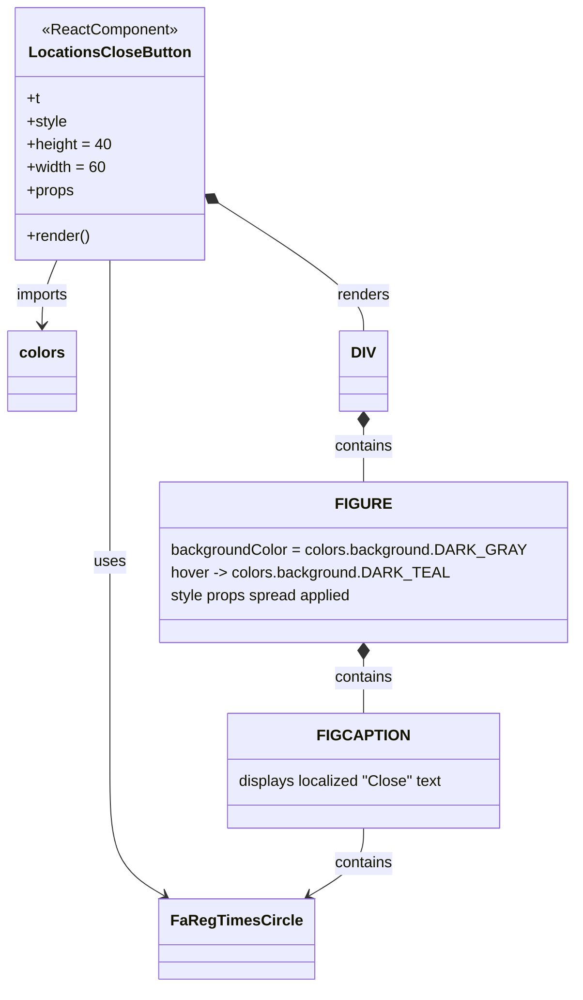

# Diagram: web/portal/src/pages/locations/components/LocationsCloseButton.js

> Auto-generated by Obscura crawlers

## Mermaid

```mermaid
classDiagram
class LocationsCloseButton <<ReactComponent>> {
  +t
  +style
  +height = 40
  +width = 60
  +props
  +render()
}
class FaRegTimesCircle
class colors
class DIV
class FIGURE
class FIGCAPTION

LocationsCloseButton --> FaRegTimesCircle : uses
LocationsCloseButton --> colors : imports
LocationsCloseButton *-- DIV : renders
DIV *-- FIGURE : contains
FIGURE *-- FIGCAPTION : contains
FIGCAPTION --> FaRegTimesCircle : contains
FIGCAPTION : displays localized "Close" text
FIGURE : backgroundColor = colors.background.DARK_GRAY
FIGURE : hover -> colors.background.DARK_TEAL
FIGURE : style props spread applied
```

> SVG rendering failed for this diagram.
