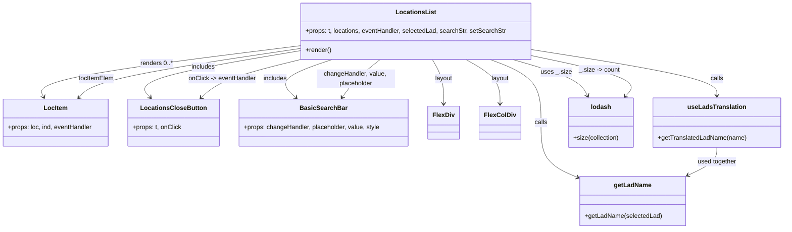

# Diagram: web/portal/src/pages/locations/components/LocationsList.js

> Auto-generated by Obscura crawlers

## Mermaid

### SVG

<svg id="container" width="1975.91015625" xmlns="http://www.w3.org/2000/svg" class="classDiagram" height="584" viewBox="0 0 1975.91015625 584" role="graphics-document document" aria-roledescription="class"><g><defs><marker id="container_class-aggregationStart" class="marker aggregation class" refX="18" refY="7" markerWidth="190" markerHeight="240" orient="auto"><path d="M 18,7 L9,13 L1,7 L9,1 Z"></path></marker></defs><defs><marker id="container_class-aggregationEnd" class="marker aggregation class" refX="1" refY="7" markerWidth="20" markerHeight="28" orient="auto"><path d="M 18,7 L9,13 L1,7 L9,1 Z"></path></marker></defs><defs><marker id="container_class-extensionStart" class="marker extension class" refX="18" refY="7" markerWidth="190" markerHeight="240" orient="auto"><path d="M 1,7 L18,13 V 1 Z"></path></marker></defs><defs><marker id="container_class-extensionEnd" class="marker extension class" refX="1" refY="7" markerWidth="20" markerHeight="28" orient="auto"><path d="M 1,1 V 13 L18,7 Z"></path></marker></defs><defs><marker id="container_class-compositionStart" class="marker composition class" refX="18" refY="7" markerWidth="190" markerHeight="240" orient="auto"><path d="M 18,7 L9,13 L1,7 L9,1 Z"></path></marker></defs><defs><marker id="container_class-compositionEnd" class="marker composition class" refX="1" refY="7" markerWidth="20" markerHeight="28" orient="auto"><path d="M 18,7 L9,13 L1,7 L9,1 Z"></path></marker></defs><defs><marker id="container_class-dependencyStart" class="marker dependency class" refX="6" refY="7" markerWidth="190" markerHeight="240" orient="auto"><path d="M 5,7 L9,13 L1,7 L9,1 Z"></path></marker></defs><defs><marker id="container_class-dependencyEnd" class="marker dependency class" refX="13" refY="7" markerWidth="20" markerHeight="28" orient="auto"><path d="M 18,7 L9,13 L14,7 L9,1 Z"></path></marker></defs><defs><marker id="container_class-lollipopStart" class="marker lollipop class" refX="13" refY="7" markerWidth="190" markerHeight="240" orient="auto"><circle stroke="black" fill="transparent" cx="7" cy="7" r="6"></circle></marker></defs><defs><marker id="container_class-lollipopEnd" class="marker lollipop class" refX="1" refY="7" markerWidth="190" markerHeight="240" orient="auto"><circle stroke="black" fill="transparent" cx="7" cy="7" r="6"></circle></marker></defs><g class="root"><g class="clusters"></g><g class="edgePaths"><path d="M759.66,116.809L648.095,130.841C536.53,144.873,313.4,172.936,205.497,194.731C97.594,216.525,104.918,232.049,108.58,239.811L112.242,247.574" id="id_LocationsList_LocItem_1" class="edge-thickness-normal edge-pattern-solid relation" style=";;;" data-edge="true" data-et="edge" data-id="id_LocationsList_LocItem_1" data-points="W3sieCI6NzU5LjY2MDE1NjI1LCJ5IjoxMTYuODA5NDI1NTg4ODQ1NTN9LHsieCI6OTAuMjY5NTMxMjUsInkiOjIwMX0seyJ4IjoxMTQuODAyMzE1ODQ4MjE0MjgsInkiOjI1M31d" marker-end="url(#container_class-dependencyEnd)"></path><path d="M759.66,129.743L689.786,141.619C619.912,153.496,480.164,177.248,417.492,197.05C354.821,216.853,369.226,232.706,376.428,240.633L383.63,248.559" id="id_LocationsList_LocationsCloseButton_2" class="edge-thickness-normal edge-pattern-solid relation" style=";;;" data-edge="true" data-et="edge" data-id="id_LocationsList_LocationsCloseButton_2" data-points="W3sieCI6NzU5LjY2MDE1NjI1LCJ5IjoxMjkuNzQzMjUzMDY3OTA5NjV9LHsieCI6MzQwLjQxNjAxNTYyNSwieSI6MjAxfSx7IngiOjM4Ny42NjUyNDgzMjU4OTI4MywieSI6MjUzfV0=" marker-end="url(#container_class-dependencyEnd)"></path><path d="M842.856,152L819.097,160.167C795.337,168.333,747.818,184.667,732.653,200.819C717.488,216.972,734.678,232.944,743.272,240.93L751.867,248.916" id="id_LocationsList_BasicSearchBar_3" class="edge-thickness-normal edge-pattern-solid relation" style=";;;" data-edge="true" data-et="edge" data-id="id_LocationsList_BasicSearchBar_3" data-points="W3sieCI6ODQyLjg1NjE0NjY5NDIxNDksInkiOjE1Mn0seyJ4Ijo3MDAuMjk4ODI4MTI1LCJ5IjoyMDF9LHsieCI6NzU2LjI2MjQ4NjA0OTEwNzEsInkiOjI1M31d" marker-end="url(#container_class-dependencyEnd)"></path><path d="M1176.738,152L1190.85,160.167C1204.961,168.333,1233.184,184.667,1247.295,203.5C1261.406,222.333,1261.406,243.667,1261.406,254.333L1261.406,265" id="id_LocationsList_FlexColDiv_4" class="edge-thickness-normal edge-pattern-solid relation" style=";;;" data-edge="true" data-et="edge" data-id="id_LocationsList_FlexColDiv_4" data-points="W3sieCI6MTE3Ni43MzgyNDg5NjY5NDIxLCJ5IjoxNTJ9LHsieCI6MTI2MS40MDYyNSwieSI6MjAxfSx7IngiOjEyNjEuNDA2MjUsInkiOjI3MX1d" marker-end="url(#container_class-dependencyEnd)"></path><path d="M1094.771,152L1099.585,160.167C1104.4,168.333,1114.028,184.667,1118.842,203.5C1123.656,222.333,1123.656,243.667,1123.656,254.333L1123.656,265" id="id_LocationsList_FlexDiv_5" class="edge-thickness-normal edge-pattern-solid relation" style=";;;" data-edge="true" data-et="edge" data-id="id_LocationsList_FlexDiv_5" data-points="W3sieCI6MTA5NC43NzEzMDY4MTgxODE4LCJ5IjoxNTJ9LHsieCI6MTEyMy42NTYyNSwieSI6MjAxfSx7IngiOjExMjMuNjU2MjUsInkiOjI3MX1d" marker-end="url(#container_class-dependencyEnd)"></path><path d="M1344.996,126.894L1422.079,139.245C1499.163,151.596,1653.329,176.298,1730.413,195.816C1807.496,215.333,1807.496,229.667,1807.496,236.833L1807.496,244" id="id_LocationsList_useLadsTranslation_6" class="edge-thickness-normal edge-pattern-solid relation" style=";;;" data-edge="true" data-et="edge" data-id="id_LocationsList_useLadsTranslation_6" data-points="W3sieCI6MTM0NC45OTYwOTM3NSwieSI6MTI2Ljg5Mzk3MDE5NDk1ODd9LHsieCI6MTgwNy40OTYwOTM3NSwieSI6MjAxfSx7IngiOjE4MDcuNDk2MDkzNzUsInkiOjI1MH1d" marker-end="url(#container_class-dependencyEnd)"></path><path d="M1236.875,152L1257.807,160.167C1278.739,168.333,1320.604,184.667,1341.536,211.5C1362.469,238.333,1362.469,275.667,1362.469,311C1362.469,346.333,1362.469,379.667,1377.915,403.015C1393.361,426.364,1424.253,439.728,1439.699,446.41L1455.146,453.092" id="id_LocationsList_getLadName_7" class="edge-thickness-normal edge-pattern-solid relation" style=";;;" data-edge="true" data-et="edge" data-id="id_LocationsList_getLadName_7" data-points="W3sieCI6MTIzNi44NzQ2MTI2MDMzMDU5LCJ5IjoxNTJ9LHsieCI6MTM2Mi40Njg3NSwieSI6MjAxfSx7IngiOjEzNjIuNDY4NzUsInkiOjMxM30seyJ4IjoxMzYyLjQ2ODc1LCJ5Ijo0MTN9LHsieCI6MTQ2MC42NTIzNDM3NSwieSI6NDU1LjQ3NDI3MjA5ODk1NzR9XQ==" marker-end="url(#container_class-dependencyEnd)"></path><path d="M1294.266,152L1321.708,160.167C1349.15,168.333,1404.034,184.667,1435.061,200.103C1466.087,215.54,1473.257,230.079,1476.841,237.349L1480.426,244.619" id="id_LocationsList_lodash_8" class="edge-thickness-normal edge-pattern-solid relation" style=";;;" data-edge="true" data-et="edge" data-id="id_LocationsList_lodash_8" data-points="W3sieCI6MTI5NC4yNjU4ODMyNjQ0NjMsInkiOjE1Mn0seyJ4IjoxNDU4LjkxNzk2ODc1LCJ5IjoyMDF9LHsieCI6MTQ4My4wNzk1ODk4NDM3NSwieSI6MjUwfV0=" marker-end="url(#container_class-dependencyEnd)"></path><path d="M201.663,248.559L208.865,240.633C216.067,232.706,230.472,216.853,323.472,196.069C416.471,175.286,588.066,149.572,673.863,136.715L759.66,123.858" id="id_LocItem_LocationsList_9" class="edge-thickness-normal edge-pattern-solid relation" style=";;;" data-edge="true" data-et="edge" data-id="id_LocItem_LocationsList_9" data-points="W3sieCI6MTk3LjYyNzcyMDQyNDEwNzE0LCJ5IjoyNTN9LHsieCI6MjQ0Ljg3Njk1MzEyNSwieSI6MjAxfSx7IngiOjc1OS42NjAxNTYyNSwieSI6MTIzLjg1NzU0MjY2Mjk0MTZ9XQ==" marker-start="url(#container_class-dependencyStart)"></path><path d="M867.227,248.119L872.842,240.266C878.457,232.413,889.688,216.706,905.522,200.687C921.356,184.667,941.795,168.333,952.014,160.167L962.233,152" id="id_BasicSearchBar_LocationsList_10" class="edge-thickness-normal edge-pattern-solid relation" style=";;;" data-edge="true" data-et="edge" data-id="id_BasicSearchBar_LocationsList_10" data-points="W3sieCI6ODYzLjczNzAyNTY2OTY0MjksInkiOjI1M30seyJ4Ijo5MDAuOTE3OTY4NzUsInkiOjIwMX0seyJ4Ijo5NjIuMjMyODI1NDEzMjIzMiwieSI6MTUyfV0=" marker-start="url(#container_class-dependencyStart)"></path><path d="M511.152,248.916L519.747,240.93C528.342,232.944,545.531,216.972,587.171,200.819C628.811,184.667,694.901,168.333,727.946,160.167L760.991,152" id="id_LocationsCloseButton_LocationsList_11" class="edge-thickness-normal edge-pattern-solid relation" style=";;;" data-edge="true" data-et="edge" data-id="id_LocationsCloseButton_LocationsList_11" data-points="W3sieCI6NTA2Ljc1NzA0NTIwMDg5MjksInkiOjI1M30seyJ4Ijo1NjIuNzIwNzAzMTI1LCJ5IjoyMDF9LHsieCI6NzYwLjk5MTQ3NzI3MjcyNzMsInkiOjE1Mn1d" marker-start="url(#container_class-dependencyStart)"></path><path d="M1807.496,376L1807.496,382.167C1807.496,388.333,1807.496,400.667,1794.92,412.714C1782.344,424.76,1757.192,436.521,1744.617,442.401L1732.041,448.281" id="id_useLadsTranslation_getLadName_12" class="edge-thickness-normal edge-pattern-solid relation" style=";;;" data-edge="true" data-et="edge" data-id="id_useLadsTranslation_getLadName_12" data-points="W3sieCI6MTgwNy40OTYwOTM3NSwieSI6Mzc2fSx7IngiOjE4MDcuNDk2MDkzNzUsInkiOjQxM30seyJ4IjoxNzI2LjYwNTQ2ODc1LCJ5Ijo0NTAuODIyODMxMDUwMjI4MzN9XQ==" marker-end="url(#container_class-dependencyEnd)"></path><path d="M1575.842,245.573L1582.64,238.145C1589.438,230.716,1603.033,215.858,1564.559,198.721C1526.085,181.585,1435.54,162.17,1390.268,152.463L1344.996,142.755" id="id_lodash_LocationsList_13" class="edge-thickness-normal edge-pattern-solid relation" style=";;;" data-edge="true" data-et="edge" data-id="id_lodash_LocationsList_13" data-points="W3sieCI6MTU3MS43OTE5OTIxODc1LCJ5IjoyNTB9LHsieCI6MTYxNi42Mjg5MDYyNSwieSI6MjAxfSx7IngiOjEzNDQuOTk2MDkzNzUsInkiOjE0Mi43NTUyMjgwNTQ2MzA2Nn1d" marker-start="url(#container_class-dependencyStart)"></path></g><g class="edgeLabels"><g class="edgeLabel" transform="translate(396.44127, 162.49218)"><g class="label" data-id="id_LocationsList_LocItem_1" transform="translate(-40.7890625, -12)"><foreignObject width="81.578125" height="24">

renders 0..*

</foreignObject></g></g><g class="edgeLabel" transform="translate(515.40469, 171.25808)"><g class="label" data-id="id_LocationsList_LocationsCloseButton_2" transform="translate(-30.6484375, -12)"><foreignObject width="61.296875" height="24">

includes

</foreignObject></g></g><g class="edgeLabel" transform="translate(700.298828125, 201)"><g class="label" data-id="id_LocationsList_BasicSearchBar_3" transform="translate(-30.6484375, -12)"><foreignObject width="61.296875" height="24">

includes

</foreignObject></g></g><g class="edgeLabel" transform="translate(1261.40625, 201)"><g class="label" data-id="id_LocationsList_FlexColDiv_4" transform="translate(-22.65625, -12)"><foreignObject width="45.3125" height="24">

layout

</foreignObject></g></g><g class="edgeLabel" transform="translate(1123.65625, 201)"><g class="label" data-id="id_LocationsList_FlexDiv_5" transform="translate(-22.65625, -12)"><foreignObject width="45.3125" height="24">

layout

</foreignObject></g></g><g class="edgeLabel" transform="translate(1807.49609375, 201)"><g class="label" data-id="id_LocationsList_useLadsTranslation_6" transform="translate(-16.4453125, -12)"><foreignObject width="32.890625" height="24">

calls

</foreignObject></g></g><g class="edgeLabel" transform="translate(1362.46875, 313)"><g class="label" data-id="id_LocationsList_getLadName_7" transform="translate(-16.4453125, -12)"><foreignObject width="32.890625" height="24">

calls

</foreignObject></g></g><g class="edgeLabel" transform="translate(1402.77372, 184.29163)"><g class="label" data-id="id_LocationsList_lodash_8" transform="translate(-38.515625, -12)"><foreignObject width="77.03125" height="24">

uses _.size

</foreignObject></g></g><g class="edgeLabel" transform="translate(467.5264, 167.63503)"><g class="label" data-id="id_LocItem_LocationsList_9" transform="translate(-44.890625, -12)"><foreignObject width="89.78125" height="24">

locItemElem

</foreignObject></g></g><g class="edgeLabel" transform="translate(900.91796875, 201)"><g class="label" data-id="id_BasicSearchBar_LocationsList_10" transform="translate(-100, -24)"><foreignObject width="200" height="48">

changeHandler, value, placeholder

</foreignObject></g></g><g class="edgeLabel" transform="translate(562.720703125, 201)"><g class="label" data-id="id_LocationsCloseButton_LocationsList_11" transform="translate(-86.9296875, -12)"><foreignObject width="173.859375" height="24">

onClick -&gt; eventHandler

</foreignObject></g></g><g class="edgeLabel" transform="translate(1807.49609375, 413)"><g class="label" data-id="id_useLadsTranslation_getLadName_12" transform="translate(-50.515625, -12)"><foreignObject width="101.03125" height="24">

used together

</foreignObject></g></g><g class="edgeLabel" transform="translate(1513.28341, 178.84018)"><g class="label" data-id="id_lodash_LocationsList_13" transform="translate(-51.9375, -12)"><foreignObject width="103.875" height="24">

_.size -&gt; count

</foreignObject></g></g></g><g class="nodes"><g class="node default" id="classId-LocationsList-0" transform="translate(1052.328125, 80)"><g class="basic label-container"><path d="M-292.66796875 -72 L292.66796875 -72 L292.66796875 72 L-292.66796875 72" stroke="none" stroke-width="0" fill="#ECECFF" style=""></path><path d="M-292.66796875 -72 C-121.82797254300036 -72, 49.01202366399929 -72, 292.66796875 -72 M-292.66796875 -72 C-124.14562947955133 -72, 44.37670979089734 -72, 292.66796875 -72 M292.66796875 -72 C292.66796875 -21.692981391248928, 292.66796875 28.614037217502144, 292.66796875 72 M292.66796875 -72 C292.66796875 -22.9130575796012, 292.66796875 26.173884840797598, 292.66796875 72 M292.66796875 72 C78.0584792595389 72, -136.5510102309222 72, -292.66796875 72 M292.66796875 72 C126.73363890671587 72, -39.200690936568265 72, -292.66796875 72 M-292.66796875 72 C-292.66796875 31.476188917975776, -292.66796875 -9.047622164048448, -292.66796875 -72 M-292.66796875 72 C-292.66796875 18.648033726847046, -292.66796875 -34.70393254630591, -292.66796875 -72" stroke="#9370DB" stroke-width="1.3" fill="none" stroke-dasharray="0 0" style=""></path></g><g class="annotation-group text" transform="translate(0, -48)"></g><g class="label-group text" transform="translate(-48.5234375, -48)"><g class="label" style="font-weight: bolder" transform="translate(0,-12)"><foreignObject width="97.046875" height="24">

LocationsList

</foreignObject></g></g><g class="members-group text" transform="translate(-280.66796875, 0)"><g class="label" style="" transform="translate(0,-12)"><foreignObject width="512.8125" height="24">

+props: t, locations, eventHandler, selectedLad, searchStr, setSearchStr

</foreignObject></g></g><g class="methods-group text" transform="translate(-280.66796875, 48)"><g class="label" style="" transform="translate(0,-12)"><foreignObject width="66.609375" height="24">

+render()

</foreignObject></g></g><g class="divider" style=""><path d="M-292.66796875 -24 C-153.86684629126515 -24, -15.065723832530296 -24, 292.66796875 -24 M-292.66796875 -24 C-103.20088171063804 -24, 86.26620532872391 -24, 292.66796875 -24" stroke="#9370DB" stroke-width="1.3" fill="none" stroke-dasharray="0 0" style=""></path></g><g class="divider" style=""><path d="M-292.66796875 24 C-87.37617639966695 24, 117.91561595066611 24, 292.66796875 24 M-292.66796875 24 C-123.82486492975806 24, 45.01823889048387 24, 292.66796875 24" stroke="#9370DB" stroke-width="1.3" fill="none" stroke-dasharray="0 0" style=""></path></g></g><g class="node default" id="classId-LocItem-1" transform="translate(143.109375, 313)"><g class="basic label-container"><path d="M-135.109375 -60 L135.109375 -60 L135.109375 60 L-135.109375 60" stroke="none" stroke-width="0" fill="#ECECFF" style=""></path><path d="M-135.109375 -60 C-50.117880208370266 -60, 34.87361458325947 -60, 135.109375 -60 M-135.109375 -60 C-76.84156779330587 -60, -18.573760586611726 -60, 135.109375 -60 M135.109375 -60 C135.109375 -21.85058516552968, 135.109375 16.29882966894064, 135.109375 60 M135.109375 -60 C135.109375 -22.105740895440277, 135.109375 15.788518209119445, 135.109375 60 M135.109375 60 C73.74575003152184 60, 12.382125063043674 60, -135.109375 60 M135.109375 60 C52.13197275619284 60, -30.845429487614325 60, -135.109375 60 M-135.109375 60 C-135.109375 35.546999134393815, -135.109375 11.093998268787622, -135.109375 -60 M-135.109375 60 C-135.109375 24.520462427413648, -135.109375 -10.959075145172704, -135.109375 -60" stroke="#9370DB" stroke-width="1.3" fill="none" stroke-dasharray="0 0" style=""></path></g><g class="annotation-group text" transform="translate(0, -36)"></g><g class="label-group text" transform="translate(-28.875, -36)"><g class="label" style="font-weight: bolder" transform="translate(0,-12)"><foreignObject width="57.75" height="24">

LocItem

</foreignObject></g></g><g class="members-group text" transform="translate(-123.109375, 12)"><g class="label" style="" transform="translate(0,-12)"><foreignObject width="217.34375" height="24">

+props: loc, ind, eventHandler

</foreignObject></g></g><g class="methods-group text" transform="translate(-123.109375, 60)"></g><g class="divider" style=""><path d="M-135.109375 -12 C-33.76837982245533 -12, 67.57261535508934 -12, 135.109375 -12 M-135.109375 -12 C-46.56083616191769 -12, 41.987702676164616 -12, 135.109375 -12" stroke="#9370DB" stroke-width="1.3" fill="none" stroke-dasharray="0 0" style=""></path></g><g class="divider" style=""><path d="M-135.109375 36 C-64.90591781029302 36, 5.297539379413962 36, 135.109375 36 M-135.109375 36 C-49.4472894088923 36, 36.214796182215395 36, 135.109375 36" stroke="#9370DB" stroke-width="1.3" fill="none" stroke-dasharray="0 0" style=""></path></g></g><g class="node default" id="classId-LocationsCloseButton-2" transform="translate(442.18359375, 313)"><g class="basic label-container"><path d="M-113.96484375 -60 L113.96484375 -60 L113.96484375 60 L-113.96484375 60" stroke="none" stroke-width="0" fill="#ECECFF" style=""></path><path d="M-113.96484375 -60 C-64.38532322394482 -60, -14.805802697889632 -60, 113.96484375 -60 M-113.96484375 -60 C-30.71740468049215 -60, 52.5300343890157 -60, 113.96484375 -60 M113.96484375 -60 C113.96484375 -35.718699539266225, 113.96484375 -11.437399078532458, 113.96484375 60 M113.96484375 -60 C113.96484375 -24.23956400035459, 113.96484375 11.520871999290819, 113.96484375 60 M113.96484375 60 C50.22553004346047 60, -13.513783663079053 60, -113.96484375 60 M113.96484375 60 C27.18519396423136 60, -59.59445582153728 60, -113.96484375 60 M-113.96484375 60 C-113.96484375 12.91564631670797, -113.96484375 -34.16870736658406, -113.96484375 -60 M-113.96484375 60 C-113.96484375 21.571601847554597, -113.96484375 -16.856796304890807, -113.96484375 -60" stroke="#9370DB" stroke-width="1.3" fill="none" stroke-dasharray="0 0" style=""></path></g><g class="annotation-group text" transform="translate(0, -36)"></g><g class="label-group text" transform="translate(-79.8515625, -36)"><g class="label" style="font-weight: bolder" transform="translate(0,-12)"><foreignObject width="159.703125" height="24">

LocationsCloseButton

</foreignObject></g></g><g class="members-group text" transform="translate(-101.96484375, 12)"><g class="label" style="" transform="translate(0,-12)"><foreignObject width="124.078125" height="24">

+props: t, onClick

</foreignObject></g></g><g class="methods-group text" transform="translate(-101.96484375, 60)"></g><g class="divider" style=""><path d="M-113.96484375 -12 C-63.36636877843239 -12, -12.767893806864777 -12, 113.96484375 -12 M-113.96484375 -12 C-59.098169561192 -12, -4.231495372384003 -12, 113.96484375 -12" stroke="#9370DB" stroke-width="1.3" fill="none" stroke-dasharray="0 0" style=""></path></g><g class="divider" style=""><path d="M-113.96484375 36 C-31.41539573362003 36, 51.13405228275994 36, 113.96484375 36 M-113.96484375 36 C-32.41717570968137 36, 49.13049233063725 36, 113.96484375 36" stroke="#9370DB" stroke-width="1.3" fill="none" stroke-dasharray="0 0" style=""></path></g></g><g class="node default" id="classId-BasicSearchBar-3" transform="translate(820.8359375, 313)"><g class="basic label-container"><path d="M-214.6875 -60 L214.6875 -60 L214.6875 60 L-214.6875 60" stroke="none" stroke-width="0" fill="#ECECFF" style=""></path><path d="M-214.6875 -60 C-88.66486287349247 -60, 37.357774253015066 -60, 214.6875 -60 M-214.6875 -60 C-121.82488276410487 -60, -28.96226552820974 -60, 214.6875 -60 M214.6875 -60 C214.6875 -15.281265602777033, 214.6875 29.437468794445934, 214.6875 60 M214.6875 -60 C214.6875 -29.188096267139382, 214.6875 1.6238074657212351, 214.6875 60 M214.6875 60 C48.09619724989335 60, -118.4951055002133 60, -214.6875 60 M214.6875 60 C48.62125489205266 60, -117.44499021589468 60, -214.6875 60 M-214.6875 60 C-214.6875 25.225178805609787, -214.6875 -9.549642388780427, -214.6875 -60 M-214.6875 60 C-214.6875 33.83523237467074, -214.6875 7.670464749341484, -214.6875 -60" stroke="#9370DB" stroke-width="1.3" fill="none" stroke-dasharray="0 0" style=""></path></g><g class="annotation-group text" transform="translate(0, -36)"></g><g class="label-group text" transform="translate(-56.4375, -36)"><g class="label" style="font-weight: bolder" transform="translate(0,-12)"><foreignObject width="112.875" height="24">

BasicSearchBar

</foreignObject></g></g><g class="members-group text" transform="translate(-202.6875, 12)"><g class="label" style="" transform="translate(0,-12)"><foreignObject width="348.9375" height="24">

+props: changeHandler, placeholder, value, style

</foreignObject></g></g><g class="methods-group text" transform="translate(-202.6875, 60)"></g><g class="divider" style=""><path d="M-214.6875 -12 C-88.36028801664088 -12, 37.96692396671824 -12, 214.6875 -12 M-214.6875 -12 C-79.96114487382675 -12, 54.76521025234649 -12, 214.6875 -12" stroke="#9370DB" stroke-width="1.3" fill="none" stroke-dasharray="0 0" style=""></path></g><g class="divider" style=""><path d="M-214.6875 36 C-77.20913663890443 36, 60.26922672219115 36, 214.6875 36 M-214.6875 36 C-113.81201639743605 36, -12.936532794872107 36, 214.6875 36" stroke="#9370DB" stroke-width="1.3" fill="none" stroke-dasharray="0 0" style=""></path></g></g><g class="node default" id="classId-FlexDiv-4" transform="translate(1123.65625, 313)"><g class="basic label-container"><path d="M-38.1328125 -42 L38.1328125 -42 L38.1328125 42 L-38.1328125 42" stroke="none" stroke-width="0" fill="#ECECFF" style=""></path><path d="M-38.1328125 -42 C-12.943985576630734 -42, 12.244841346738532 -42, 38.1328125 -42 M-38.1328125 -42 C-19.691756593305993 -42, -1.2507006866119852 -42, 38.1328125 -42 M38.1328125 -42 C38.1328125 -13.629040485314938, 38.1328125 14.741919029370123, 38.1328125 42 M38.1328125 -42 C38.1328125 -18.910901931825766, 38.1328125 4.178196136348468, 38.1328125 42 M38.1328125 42 C10.560672732734552 42, -17.011467034530895 42, -38.1328125 42 M38.1328125 42 C7.9222343414663285 42, -22.288343817067343 42, -38.1328125 42 M-38.1328125 42 C-38.1328125 12.688797924739106, -38.1328125 -16.62240415052179, -38.1328125 -42 M-38.1328125 42 C-38.1328125 11.79017901595126, -38.1328125 -18.41964196809748, -38.1328125 -42" stroke="#9370DB" stroke-width="1.3" fill="none" stroke-dasharray="0 0" style=""></path></g><g class="annotation-group text" transform="translate(0, -18)"></g><g class="label-group text" transform="translate(-26.1328125, -18)"><g class="label" style="font-weight: bolder" transform="translate(0,-12)"><foreignObject width="52.265625" height="24">

FlexDiv

</foreignObject></g></g><g class="members-group text" transform="translate(-26.1328125, 30)"></g><g class="methods-group text" transform="translate(-26.1328125, 60)"></g><g class="divider" style=""><path d="M-38.1328125 6 C-20.625080009346274 6, -3.1173475186925472 6, 38.1328125 6 M-38.1328125 6 C-18.390435447778962 6, 1.3519416044420751 6, 38.1328125 6" stroke="#9370DB" stroke-width="1.3" fill="none" stroke-dasharray="0 0" style=""></path></g><g class="divider" style=""><path d="M-38.1328125 24 C-16.672708627775027 24, 4.787395244449947 24, 38.1328125 24 M-38.1328125 24 C-14.823544974443593 24, 8.485722551112815 24, 38.1328125 24" stroke="#9370DB" stroke-width="1.3" fill="none" stroke-dasharray="0 0" style=""></path></g></g><g class="node default" id="classId-FlexColDiv-5" transform="translate(1261.40625, 313)"><g class="basic label-container"><path d="M-49.6171875 -42 L49.6171875 -42 L49.6171875 42 L-49.6171875 42" stroke="none" stroke-width="0" fill="#ECECFF" style=""></path><path d="M-49.6171875 -42 C-14.69905578483717 -42, 20.21907593032566 -42, 49.6171875 -42 M-49.6171875 -42 C-25.01961429399916 -42, -0.4220410879983234 -42, 49.6171875 -42 M49.6171875 -42 C49.6171875 -16.00400766544561, 49.6171875 9.991984669108781, 49.6171875 42 M49.6171875 -42 C49.6171875 -18.787114041675803, 49.6171875 4.425771916648394, 49.6171875 42 M49.6171875 42 C10.014067407394187 42, -29.589052685211627 42, -49.6171875 42 M49.6171875 42 C17.904086798910562 42, -13.809013902178876 42, -49.6171875 42 M-49.6171875 42 C-49.6171875 10.404797809001003, -49.6171875 -21.190404381997993, -49.6171875 -42 M-49.6171875 42 C-49.6171875 11.190272272650468, -49.6171875 -19.619455454699064, -49.6171875 -42" stroke="#9370DB" stroke-width="1.3" fill="none" stroke-dasharray="0 0" style=""></path></g><g class="annotation-group text" transform="translate(0, -18)"></g><g class="label-group text" transform="translate(-37.6171875, -18)"><g class="label" style="font-weight: bolder" transform="translate(0,-12)"><foreignObject width="75.234375" height="24">

FlexColDiv

</foreignObject></g></g><g class="members-group text" transform="translate(-37.6171875, 30)"></g><g class="methods-group text" transform="translate(-37.6171875, 60)"></g><g class="divider" style=""><path d="M-49.6171875 6 C-14.292686996547651 6, 21.031813506904697 6, 49.6171875 6 M-49.6171875 6 C-10.602562073915195 6, 28.41206335216961 6, 49.6171875 6" stroke="#9370DB" stroke-width="1.3" fill="none" stroke-dasharray="0 0" style=""></path></g><g class="divider" style=""><path d="M-49.6171875 24 C-13.115442455986376 24, 23.38630258802725 24, 49.6171875 24 M-49.6171875 24 C-23.069576599593194 24, 3.4780343008136114 24, 49.6171875 24" stroke="#9370DB" stroke-width="1.3" fill="none" stroke-dasharray="0 0" style=""></path></g></g><g class="node default" id="classId-useLadsTranslation-6" transform="translate(1807.49609375, 313)"><g class="basic label-container"><path d="M-160.4140625 -63 L160.4140625 -63 L160.4140625 63 L-160.4140625 63" stroke="none" stroke-width="0" fill="#ECECFF" style=""></path><path d="M-160.4140625 -63 C-74.1299431240951 -63, 12.154176251809787 -63, 160.4140625 -63 M-160.4140625 -63 C-78.03971352200683 -63, 4.33463545598633 -63, 160.4140625 -63 M160.4140625 -63 C160.4140625 -31.83446023353964, 160.4140625 -0.6689204670792819, 160.4140625 63 M160.4140625 -63 C160.4140625 -37.56216836242025, 160.4140625 -12.124336724840497, 160.4140625 63 M160.4140625 63 C90.46062923401145 63, 20.5071959680229 63, -160.4140625 63 M160.4140625 63 C95.93627433955585 63, 31.458486179111702 63, -160.4140625 63 M-160.4140625 63 C-160.4140625 16.937212962415956, -160.4140625 -29.12557407516809, -160.4140625 -63 M-160.4140625 63 C-160.4140625 28.474668499672717, -160.4140625 -6.050663000654566, -160.4140625 -63" stroke="#9370DB" stroke-width="1.3" fill="none" stroke-dasharray="0 0" style=""></path></g><g class="annotation-group text" transform="translate(0, -39)"></g><g class="label-group text" transform="translate(-71.15625, -39)"><g class="label" style="font-weight: bolder" transform="translate(0,-12)"><foreignObject width="142.3125" height="24">

useLadsTranslation

</foreignObject></g></g><g class="members-group text" transform="translate(-148.4140625, 9)"></g><g class="methods-group text" transform="translate(-148.4140625, 39)"><g class="label" style="" transform="translate(0,-12)"><foreignObject width="225.671875" height="24">

+getTranslatedLadName(name)

</foreignObject></g></g><g class="divider" style=""><path d="M-160.4140625 -15 C-35.79925046090108 -15, 88.81556157819784 -15, 160.4140625 -15 M-160.4140625 -15 C-46.9362772157625 -15, 66.541508068475 -15, 160.4140625 -15" stroke="#9370DB" stroke-width="1.3" fill="none" stroke-dasharray="0 0" style=""></path></g><g class="divider" style=""><path d="M-160.4140625 9 C-46.11080910244293 9, 68.19244429511414 9, 160.4140625 9 M-160.4140625 9 C-48.92576705663339 9, 62.56252838673322 9, 160.4140625 9" stroke="#9370DB" stroke-width="1.3" fill="none" stroke-dasharray="0 0" style=""></path></g></g><g class="node default" id="classId-getLadName-7" transform="translate(1593.62890625, 513)"><g class="basic label-container"><path d="M-132.9765625 -63 L132.9765625 -63 L132.9765625 63 L-132.9765625 63" stroke="none" stroke-width="0" fill="#ECECFF" style=""></path><path d="M-132.9765625 -63 C-36.13683050627833 -63, 60.70290148744334 -63, 132.9765625 -63 M-132.9765625 -63 C-53.701693795669456 -63, 25.573174908661088 -63, 132.9765625 -63 M132.9765625 -63 C132.9765625 -27.833981984330727, 132.9765625 7.332036031338546, 132.9765625 63 M132.9765625 -63 C132.9765625 -19.320589462391126, 132.9765625 24.358821075217747, 132.9765625 63 M132.9765625 63 C68.41731406074005 63, 3.858065621480108 63, -132.9765625 63 M132.9765625 63 C58.61174233394499 63, -15.753077832110023 63, -132.9765625 63 M-132.9765625 63 C-132.9765625 14.916309203365614, -132.9765625 -33.16738159326877, -132.9765625 -63 M-132.9765625 63 C-132.9765625 27.69512052804876, -132.9765625 -7.609758943902477, -132.9765625 -63" stroke="#9370DB" stroke-width="1.3" fill="none" stroke-dasharray="0 0" style=""></path></g><g class="annotation-group text" transform="translate(0, -39)"></g><g class="label-group text" transform="translate(-45.8125, -39)"><g class="label" style="font-weight: bolder" transform="translate(0,-12)"><foreignObject width="91.625" height="24">

getLadName

</foreignObject></g></g><g class="members-group text" transform="translate(-120.9765625, 9)"></g><g class="methods-group text" transform="translate(-120.9765625, 39)"><g class="label" style="" transform="translate(0,-12)"><foreignObject width="196.140625" height="24">

+getLadName(selectedLad)

</foreignObject></g></g><g class="divider" style=""><path d="M-132.9765625 -15 C-71.13364779759331 -15, -9.29073309518661 -15, 132.9765625 -15 M-132.9765625 -15 C-48.553033993407155 -15, 35.87049451318569 -15, 132.9765625 -15" stroke="#9370DB" stroke-width="1.3" fill="none" stroke-dasharray="0 0" style=""></path></g><g class="divider" style=""><path d="M-132.9765625 9 C-57.20415078462443 9, 18.568260930751137 9, 132.9765625 9 M-132.9765625 9 C-57.24948340937249 9, 18.477595681255025 9, 132.9765625 9" stroke="#9370DB" stroke-width="1.3" fill="none" stroke-dasharray="0 0" style=""></path></g></g><g class="node default" id="classId-lodash-8" transform="translate(1514.14453125, 313)"><g class="basic label-container"><path d="M-82.9375 -63 L82.9375 -63 L82.9375 63 L-82.9375 63" stroke="none" stroke-width="0" fill="#ECECFF" style=""></path><path d="M-82.9375 -63 C-30.744247180812188 -63, 21.449005638375624 -63, 82.9375 -63 M-82.9375 -63 C-29.646906112460847 -63, 23.643687775078305 -63, 82.9375 -63 M82.9375 -63 C82.9375 -34.30732475243575, 82.9375 -5.614649504871494, 82.9375 63 M82.9375 -63 C82.9375 -22.103388637265965, 82.9375 18.79322272546807, 82.9375 63 M82.9375 63 C45.28814828081216 63, 7.638796561624318 63, -82.9375 63 M82.9375 63 C16.977563377587344 63, -48.98237324482531 63, -82.9375 63 M-82.9375 63 C-82.9375 33.695707065998945, -82.9375 4.391414131997891, -82.9375 -63 M-82.9375 63 C-82.9375 26.299866134273877, -82.9375 -10.400267731452246, -82.9375 -63" stroke="#9370DB" stroke-width="1.3" fill="none" stroke-dasharray="0 0" style=""></path></g><g class="annotation-group text" transform="translate(0, -39)"></g><g class="label-group text" transform="translate(-24.59375, -39)"><g class="label" style="font-weight: bolder" transform="translate(0,-12)"><foreignObject width="49.1875" height="24">

lodash

</foreignObject></g></g><g class="members-group text" transform="translate(-70.9375, 9)"></g><g class="methods-group text" transform="translate(-70.9375, 39)"><g class="label" style="" transform="translate(0,-12)"><foreignObject width="117.28125" height="24">

+size(collection)

</foreignObject></g></g><g class="divider" style=""><path d="M-82.9375 -15 C-40.25534261412461 -15, 2.4268147717507844 -15, 82.9375 -15 M-82.9375 -15 C-23.957524323099754 -15, 35.02245135380049 -15, 82.9375 -15" stroke="#9370DB" stroke-width="1.3" fill="none" stroke-dasharray="0 0" style=""></path></g><g class="divider" style=""><path d="M-82.9375 9 C-17.6329529776217 9, 47.6715940447566 9, 82.9375 9 M-82.9375 9 C-37.082884980055674 9, 8.771730039888652 9, 82.9375 9" stroke="#9370DB" stroke-width="1.3" fill="none" stroke-dasharray="0 0" style=""></path></g></g></g></g></g></svg>
