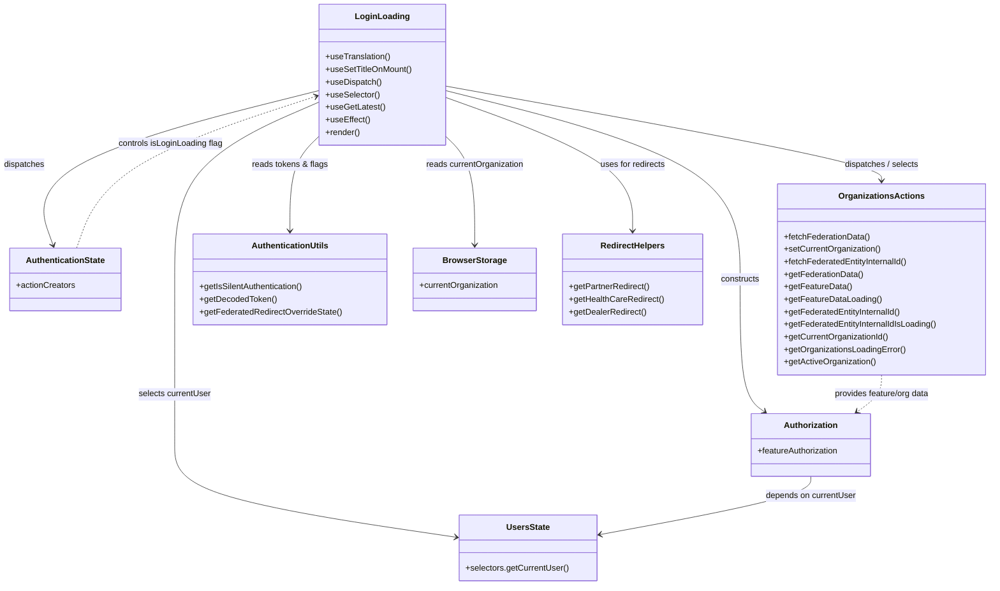

# Diagram: web/portal/src/pages/loginloading/LoginLoading.page.js


> Auto-generated by Obscura crawlers

## Diagram 1



### SVG

<svg id="container" width="1875.986328125" xmlns="http://www.w3.org/2000/svg" class="classDiagram" height="1144" viewBox="13.5 0 1875.986328125 1144" role="graphics-document document" aria-roledescription="class"><style>#container{font-family:"trebuchet ms",verdana,arial,sans-serif;font-size:16px;fill:#333;}@keyframes edge-animation-frame{from{stroke-dashoffset:0;}}@keyframes dash{to{stroke-dashoffset:0;}}#container .edge-animation-slow{stroke-dasharray:9,5!important;stroke-dashoffset:900;animation:dash 50s linear infinite;stroke-linecap:round;}#container .edge-animation-fast{stroke-dasharray:9,5!important;stroke-dashoffset:900;animation:dash 20s linear infinite;stroke-linecap:round;}#container .error-icon{fill:#552222;}#container .error-text{fill:#552222;stroke:#552222;}#container .edge-thickness-normal{stroke-width:1px;}#container .edge-thickness-thick{stroke-width:3.5px;}#container .edge-pattern-solid{stroke-dasharray:0;}#container .edge-thickness-invisible{stroke-width:0;fill:none;}#container .edge-pattern-dashed{stroke-dasharray:3;}#container .edge-pattern-dotted{stroke-dasharray:2;}#container .marker{fill:#333333;stroke:#333333;}#container .marker.cross{stroke:#333333;}#container svg{font-family:"trebuchet ms",verdana,arial,sans-serif;font-size:16px;}#container p{margin:0;}#container g.classGroup text{fill:#9370DB;stroke:none;font-family:"trebuchet ms",verdana,arial,sans-serif;font-size:10px;}#container g.classGroup text .title{font-weight:bolder;}#container .nodeLabel,#container .edgeLabel{color:#131300;}#container .edgeLabel .label rect{fill:#ECECFF;}#container .label text{fill:#131300;}#container .labelBkg{background:#ECECFF;}#container .edgeLabel .label span{background:#ECECFF;}#container .classTitle{font-weight:bolder;}#container .node rect,#container .node circle,#container .node ellipse,#container .node polygon,#container .node path{fill:#ECECFF;stroke:#9370DB;stroke-width:1px;}#container .divider{stroke:#9370DB;stroke-width:1;}#container g.clickable{cursor:pointer;}#container g.classGroup rect{fill:#ECECFF;stroke:#9370DB;}#container g.classGroup line{stroke:#9370DB;stroke-width:1;}#container .classLabel .box{stroke:none;stroke-width:0;fill:#ECECFF;opacity:0.5;}#container .classLabel .label{fill:#9370DB;font-size:10px;}#container .relation{stroke:#333333;stroke-width:1;fill:none;}#container .dashed-line{stroke-dasharray:3;}#container .dotted-line{stroke-dasharray:1 2;}#container #compositionStart,#container .composition{fill:#333333!important;stroke:#333333!important;stroke-width:1;}#container #compositionEnd,#container .composition{fill:#333333!important;stroke:#333333!important;stroke-width:1;}#container #dependencyStart,#container .dependency{fill:#333333!important;stroke:#333333!important;stroke-width:1;}#container #dependencyStart,#container .dependency{fill:#333333!important;stroke:#333333!important;stroke-width:1;}#container #extensionStart,#container .extension{fill:transparent!important;stroke:#333333!important;stroke-width:1;}#container #extensionEnd,#container .extension{fill:transparent!important;stroke:#333333!important;stroke-width:1;}#container #aggregationStart,#container .aggregation{fill:transparent!important;stroke:#333333!important;stroke-width:1;}#container #aggregationEnd,#container .aggregation{fill:transparent!important;stroke:#333333!important;stroke-width:1;}#container #lollipopStart,#container .lollipop{fill:#ECECFF!important;stroke:#333333!important;stroke-width:1;}#container #lollipopEnd,#container .lollipop{fill:#ECECFF!important;stroke:#333333!important;stroke-width:1;}#container .edgeTerminals{font-size:11px;line-height:initial;}#container .classTitleText{text-anchor:middle;font-size:18px;fill:#333;}#container .label-icon{display:inline-block;height:1em;overflow:visible;vertical-align:-0.125em;}#container .node .label-icon path{fill:currentColor;stroke:revert;stroke-width:revert;}#container :root{--mermaid-font-family:"trebuchet ms",verdana,arial,sans-serif;}</style><g><defs><marker id="container_class-aggregationStart" class="marker aggregation class" refX="18" refY="7" markerWidth="190" markerHeight="240" orient="auto"><path d="M 18,7 L9,13 L1,7 L9,1 Z"></path></marker></defs><defs><marker id="container_class-aggregationEnd" class="marker aggregation class" refX="1" refY="7" markerWidth="20" markerHeight="28" orient="auto"><path d="M 18,7 L9,13 L1,7 L9,1 Z"></path></marker></defs><defs><marker id="container_class-extensionStart" class="marker extension class" refX="18" refY="7" markerWidth="190" markerHeight="240" orient="auto"><path d="M 1,7 L18,13 V 1 Z"></path></marker></defs><defs><marker id="container_class-extensionEnd" class="marker extension class" refX="1" refY="7" markerWidth="20" markerHeight="28" orient="auto"><path d="M 1,1 V 13 L18,7 Z"></path></marker></defs><defs><marker id="container_class-compositionStart" class="marker composition class" refX="18" refY="7" markerWidth="190" markerHeight="240" orient="auto"><path d="M 18,7 L9,13 L1,7 L9,1 Z"></path></marker></defs><defs><marker id="container_class-compositionEnd" class="marker composition class" refX="1" refY="7" markerWidth="20" markerHeight="28" orient="auto"><path d="M 18,7 L9,13 L1,7 L9,1 Z"></path></marker></defs><defs><marker id="container_class-dependencyStart" class="marker dependency class" refX="6" refY="7" markerWidth="190" markerHeight="240" orient="auto"><path d="M 5,7 L9,13 L1,7 L9,1 Z"></path></marker></defs><defs><marker id="container_class-dependencyEnd" class="marker dependency class" refX="13" refY="7" markerWidth="20" markerHeight="28" orient="auto"><path d="M 18,7 L9,13 L14,7 L9,1 Z"></path></marker></defs><defs><marker id="container_class-lollipopStart" class="marker lollipop class" refX="13" refY="7" markerWidth="190" markerHeight="240" orient="auto"><circle stroke="black" fill="transparent" cx="7" cy="7" r="6"></circle></marker></defs><defs><marker id="container_class-lollipopEnd" class="marker lollipop class" refX="1" refY="7" markerWidth="190" markerHeight="240" orient="auto"><circle stroke="black" fill="transparent" cx="7" cy="7" r="6"></circle></marker></defs><g class="root"><g class="clusters"></g><g class="edgePaths"><path d="M612.375,175.04L518.176,200.367C423.977,225.693,235.578,276.347,150.889,329.394C66.199,382.442,85.219,437.883,94.729,465.604L104.239,493.325" id="id_LoginLoading_AuthenticationState_1" class="edge-thickness-normal edge-pattern-solid relation" style=";;;" data-edge="true" data-et="edge" data-id="id_LoginLoading_AuthenticationState_1" data-points="W3sieCI6NjEyLjM3NSwieSI6MTc1LjAzOTg2MzY5NjI5NjE1fSx7IngiOjQ3LjE3OTY4NzUsInkiOjMyN30seyJ4IjoxMDYuMTg1OTUwOTY5ODI3NTksInkiOjQ5OX1d" marker-end="url(#container_class-dependencyEnd)"></path><path d="M850.711,166.051L989.386,192.876C1128.062,219.701,1405.413,273.35,1544.088,307.342C1682.764,341.333,1682.764,355.667,1682.764,362.833L1682.764,370" id="id_LoginLoading_OrganizationsActions_2" class="edge-thickness-normal edge-pattern-solid relation" style=";;;" data-edge="true" data-et="edge" data-id="id_LoginLoading_OrganizationsActions_2" data-points="W3sieCI6ODUwLjcxMDkzNzUsInkiOjE2Ni4wNTEzMzQxMjA0MjUwM30seyJ4IjoxNjgyLjc2MzY3MTg3NSwieSI6MzI3fSx7IngiOjE2ODIuNzYzNjcxODc1LCJ5IjozNzZ9XQ==" marker-end="url(#container_class-dependencyEnd)"></path><path d="M612.375,198.504L566.395,219.92C520.415,241.336,428.454,284.168,382.474,344.251C336.494,404.333,336.494,481.667,336.494,557C336.494,632.333,336.494,705.667,336.494,758.5C336.494,811.333,336.494,843.667,336.494,876C336.494,908.333,336.494,940.667,425.992,970.129C515.489,999.591,694.484,1026.183,783.982,1039.478L873.479,1052.774" id="id_LoginLoading_UsersState_3" class="edge-thickness-normal edge-pattern-solid relation" style=";;;" data-edge="true" data-et="edge" data-id="id_LoginLoading_UsersState_3" data-points="W3sieCI6NjEyLjM3NSwieSI6MTk4LjUwNDI5Mzg3MTkwMDczfSx7IngiOjMzNi40OTQxNDA2MjUsInkiOjMyN30seyJ4IjozMzYuNDk0MTQwNjI1LCJ5Ijo1NTl9LHsieCI6MzM2LjQ5NDE0MDYyNSwieSI6Nzc5fSx7IngiOjMzNi40OTQxNDA2MjUsInkiOjg3Nn0seyJ4IjozMzYuNDk0MTQwNjI1LCJ5Ijo5NzN9LHsieCI6ODc5LjQxNDA2MjUsInkiOjEwNTMuNjU1NDU3MDY0NTE1OH1d" marker-end="url(#container_class-dependencyEnd)"></path><path d="M850.711,175.262L944.125,200.552C1037.54,225.841,1224.368,276.421,1317.783,340.377C1411.197,404.333,1411.197,481.667,1411.197,557C1411.197,632.333,1411.197,705.667,1419.016,747.919C1426.834,790.171,1442.472,801.342,1450.29,806.927L1458.109,812.512" id="id_LoginLoading_Authorization_4" class="edge-thickness-normal edge-pattern-solid relation" style=";;;" data-edge="true" data-et="edge" data-id="id_LoginLoading_Authorization_4" data-points="W3sieCI6ODUwLjcxMDkzNzUsInkiOjE3NS4yNjE4NTE4NzIwNzQyfSx7IngiOjE0MTEuMTk3MjY1NjI1LCJ5IjozMjd9LHsieCI6MTQxMS4xOTcyNjU2MjUsInkiOjU1OX0seyJ4IjoxNDExLjE5NzI2NTYyNSwieSI6Nzc5fSx7IngiOjE0NjIuOTkwODU4NTY5NTg3NSwieSI6ODE2fV0=" marker-end="url(#container_class-dependencyEnd)"></path><path d="M612.375,267.722L602.935,277.601C593.495,287.481,574.616,307.241,565.176,340.287C555.736,373.333,555.736,419.667,555.736,442.833L555.736,466" id="id_LoginLoading_AuthenticationUtils_5" class="edge-thickness-normal edge-pattern-solid relation" style=";;;" data-edge="true" data-et="edge" data-id="id_LoginLoading_AuthenticationUtils_5" data-points="W3sieCI6NjEyLjM3NSwieSI6MjY3LjcyMTcxNzk3NDA3MDQzfSx7IngiOjU1NS43MzYzMjgxMjUsInkiOjMyN30seyJ4Ijo1NTUuNzM2MzI4MTI1LCJ5Ijo0NzJ9XQ==" marker-end="url(#container_class-dependencyEnd)"></path><path d="M850.711,267.722L860.151,277.601C869.59,287.481,888.47,307.241,897.91,344.787C907.35,382.333,907.35,437.667,907.35,465.333L907.35,493" id="id_LoginLoading_BrowserStorage_6" class="edge-thickness-normal edge-pattern-solid relation" style=";;;" data-edge="true" data-et="edge" data-id="id_LoginLoading_BrowserStorage_6" data-points="W3sieCI6ODUwLjcxMDkzNzUsInkiOjI2Ny43MjE3MTc5NzQwNzA0M30seyJ4Ijo5MDcuMzQ5NjA5Mzc1LCJ5IjozMjd9LHsieCI6OTA3LjM0OTYwOTM3NSwieSI6NDk5fV0=" marker-end="url(#container_class-dependencyEnd)"></path><path d="M850.711,189.162L910.015,212.135C969.32,235.108,1087.928,281.054,1147.233,327.194C1206.537,373.333,1206.537,419.667,1206.537,442.833L1206.537,466" id="id_LoginLoading_RedirectHelpers_7" class="edge-thickness-normal edge-pattern-solid relation" style=";;;" data-edge="true" data-et="edge" data-id="id_LoginLoading_RedirectHelpers_7" data-points="W3sieCI6ODUwLjcxMDkzNzUsInkiOjE4OS4xNjI0NzczMzMxOTA4fSx7IngiOjEyMDYuNTM3MTA5Mzc1LCJ5IjozMjd9LHsieCI6MTIwNi41MzcxMDkzNzUsInkiOjQ3Mn1d" marker-end="url(#container_class-dependencyEnd)"></path><path d="M1546.98,936L1546.98,942.167C1546.98,948.333,1546.98,960.667,1480.107,979.278C1413.234,997.89,1279.488,1022.78,1212.615,1035.225L1145.742,1047.67" id="id_Authorization_UsersState_8" class="edge-thickness-normal edge-pattern-solid relation" style=";;;" data-edge="true" data-et="edge" data-id="id_Authorization_UsersState_8" data-points="W3sieCI6MTU0Ni45ODA0Njg3NSwieSI6OTM2fSx7IngiOjE1NDYuOTgwNDY4NzUsInkiOjk3M30seyJ4IjoxMTM5Ljg0Mzc1LCJ5IjoxMDQ4Ljc2NzI5MDM4NTQyNjF9XQ==" marker-end="url(#container_class-dependencyEnd)"></path><path d="M1682.764,742L1682.764,748.167C1682.764,754.333,1682.764,766.667,1674.945,778.419C1667.127,790.171,1651.489,801.342,1643.671,806.927L1635.852,812.512" id="id_OrganizationsActions_Authorization_9" class="edge-thickness-normal edge-pattern-dashed relation" style=";;;" data-edge="true" data-et="edge" data-id="id_OrganizationsActions_Authorization_9" data-points="W3sieCI6MTY4Mi43NjM2NzE4NzUsInkiOjc0Mn0seyJ4IjoxNjgyLjc2MzY3MTg3NSwieSI6Nzc5fSx7IngiOjE2MzAuOTcwMDc4OTMwNDEyNSwieSI6ODE2fV0=" marker-end="url(#container_class-dependencyEnd)"></path><path d="M147.353,499L157.187,470.333C167.022,441.667,186.691,384.333,263.251,332.289C339.81,280.245,473.261,233.49,539.987,210.112L606.712,186.735" id="id_AuthenticationState_LoginLoading_10" class="edge-thickness-normal edge-pattern-dashed relation" style=";;;" data-edge="true" data-et="edge" data-id="id_AuthenticationState_LoginLoading_10" data-points="W3sieCI6MTQ3LjM1MzExMTUzMDE3MjQsInkiOjQ5OX0seyJ4IjoyMDYuMzU5Mzc1LCJ5IjozMjd9LHsieCI6NjEyLjM3NSwieSI6MTg0Ljc1MDkzNTMxMjc5OTg0fV0=" marker-end="url(#container_class-dependencyEnd)"></path></g><g class="edgeLabels"><g class="edgeLabel" transform="translate(241.97552, 274.6266)"><g class="label" data-id="id_LoginLoading_AuthenticationState_1" transform="translate(-39.1796875, -12)"><foreignObject width="78.359375" height="24"><div xmlns="http://www.w3.org/1999/xhtml" class="labelBkg" style="display: table-cell; white-space: nowrap; line-height: 1.5; max-width: 200px; text-align: center;"><span class="edgeLabel"><p>dispatches</p></span></div></foreignObject></g></g><g class="edgeLabel" transform="translate(1682.763671875, 327)"><g class="label" data-id="id_LoginLoading_OrganizationsActions_2" transform="translate(-72.7890625, -12)"><foreignObject width="145.578125" height="24"><div xmlns="http://www.w3.org/1999/xhtml" class="labelBkg" style="display: table-cell; white-space: nowrap; line-height: 1.5; max-width: 200px; text-align: center;"><span class="edgeLabel"><p>dispatches / selects</p></span></div></foreignObject></g></g><g class="edgeLabel" transform="translate(336.494140625, 779)"><g class="label" data-id="id_LoginLoading_UsersState_3" transform="translate(-70.046875, -12)"><foreignObject width="140.09375" height="24"><div xmlns="http://www.w3.org/1999/xhtml" class="labelBkg" style="display: table-cell; white-space: nowrap; line-height: 1.5; max-width: 200px; text-align: center;"><span class="edgeLabel"><p>selects currentUser</p></span></div></foreignObject></g></g><g class="edgeLabel" transform="translate(1411.197265625, 559)"><g class="label" data-id="id_LoginLoading_Authorization_4" transform="translate(-37.84375, -12)"><foreignObject width="75.6875" height="24"><div xmlns="http://www.w3.org/1999/xhtml" class="labelBkg" style="display: table-cell; white-space: nowrap; line-height: 1.5; max-width: 200px; text-align: center;"><span class="edgeLabel"><p>constructs</p></span></div></foreignObject></g></g><g class="edgeLabel" transform="translate(555.736328125, 327)"><g class="label" data-id="id_LoginLoading_AuthenticationUtils_5" transform="translate(-73.25, -12)"><foreignObject width="146.5" height="24"><div xmlns="http://www.w3.org/1999/xhtml" class="labelBkg" style="display: table-cell; white-space: nowrap; line-height: 1.5; max-width: 200px; text-align: center;"><span class="edgeLabel"><p>reads tokens &amp; flags</p></span></div></foreignObject></g></g><g class="edgeLabel" transform="translate(907.349609375, 327)"><g class="label" data-id="id_LoginLoading_BrowserStorage_6" transform="translate(-94.4375, -12)"><foreignObject width="188.875" height="24"><div xmlns="http://www.w3.org/1999/xhtml" class="labelBkg" style="display: table-cell; white-space: nowrap; line-height: 1.5; max-width: 200px; text-align: center;"><span class="edgeLabel"><p>reads currentOrganization</p></span></div></foreignObject></g></g><g class="edgeLabel" transform="translate(1206.537109375, 327)"><g class="label" data-id="id_LoginLoading_RedirectHelpers_7" transform="translate(-62.9921875, -12)"><foreignObject width="125.984375" height="24"><div xmlns="http://www.w3.org/1999/xhtml" class="labelBkg" style="display: table-cell; white-space: nowrap; line-height: 1.5; max-width: 200px; text-align: center;"><span class="edgeLabel"><p>uses for redirects</p></span></div></foreignObject></g></g><g class="edgeLabel" transform="translate(1546.98046875, 973)"><g class="label" data-id="id_Authorization_UsersState_8" transform="translate(-87.78125, -12)"><foreignObject width="175.5625" height="24"><div xmlns="http://www.w3.org/1999/xhtml" class="labelBkg" style="display: table-cell; white-space: nowrap; line-height: 1.5; max-width: 200px; text-align: center;"><span class="edgeLabel"><p>depends on currentUser</p></span></div></foreignObject></g></g><g class="edgeLabel" transform="translate(1682.763671875, 779)"><g class="label" data-id="id_OrganizationsActions_Authorization_9" transform="translate(-93.421875, -12)"><foreignObject width="186.84375" height="24"><div xmlns="http://www.w3.org/1999/xhtml" class="labelBkg" style="display: table-cell; white-space: nowrap; line-height: 1.5; max-width: 200px; text-align: center;"><span class="edgeLabel"><p>provides feature/org data</p></span></div></foreignObject></g></g><g class="edgeLabel" transform="translate(323.56111, 285.93794)"><g class="label" data-id="id_AuthenticationState_LoginLoading_10" transform="translate(-100, -24)"><foreignObject width="200" height="48"><div xmlns="http://www.w3.org/1999/xhtml" class="labelBkg" style="display: table; white-space: break-spaces; line-height: 1.5; max-width: 200px; text-align: center; width: 200px;"><span class="edgeLabel"><p>controls isLoginLoading flag</p></span></div></foreignObject></g></g></g><g class="nodes"><g class="node default" id="classId-LoginLoading-0" transform="translate(731.54296875, 143)"><g class="basic label-container"><path d="M-119.16796875 -135 L119.16796875 -135 L119.16796875 135 L-119.16796875 135" stroke="none" stroke-width="0" fill="#ECECFF" style=""></path><path d="M-119.16796875 -135 C-38.02151046886965 -135, 43.1249478122607 -135, 119.16796875 -135 M-119.16796875 -135 C-37.659271325996045 -135, 43.84942609800791 -135, 119.16796875 -135 M119.16796875 -135 C119.16796875 -48.48310991307753, 119.16796875 38.033780173844946, 119.16796875 135 M119.16796875 -135 C119.16796875 -49.05684425921375, 119.16796875 36.886311481572505, 119.16796875 135 M119.16796875 135 C27.76461165614687 135, -63.63874543770626 135, -119.16796875 135 M119.16796875 135 C37.890375122453165 135, -43.38721850509367 135, -119.16796875 135 M-119.16796875 135 C-119.16796875 62.708991118918405, -119.16796875 -9.58201776216319, -119.16796875 -135 M-119.16796875 135 C-119.16796875 56.68174462223274, -119.16796875 -21.636510755534516, -119.16796875 -135" stroke="#9370DB" stroke-width="1.3" fill="none" stroke-dasharray="0 0" style=""></path></g><g class="annotation-group text" transform="translate(0, -111)"></g><g class="label-group text" transform="translate(-48.8203125, -111)"><g class="label" style="font-weight: bolder" transform="translate(0,-12)"><foreignObject width="97.640625" height="24"><div xmlns="http://www.w3.org/1999/xhtml" style="display: table-cell; white-space: nowrap; line-height: 1.5; max-width: 147px; text-align: center;"><span class="nodeLabel markdown-node-label" style=""><p>LoginLoading</p></span></div></foreignObject></g></g><g class="members-group text" transform="translate(-107.16796875, -63)"></g><g class="methods-group text" transform="translate(-107.16796875, -33)"><g class="label" style="" transform="translate(0,-12)"><foreignObject width="125.140625" height="24"><div xmlns="http://www.w3.org/1999/xhtml" style="display: table-cell; white-space: nowrap; line-height: 1.5; max-width: 183px; text-align: center;"><span class="nodeLabel markdown-node-label" style=""><p>+useTranslation()</p></span></div></foreignObject></g><g class="label" style="" transform="translate(0,12)"><foreignObject width="165.515625" height="24"><div xmlns="http://www.w3.org/1999/xhtml" style="display: table-cell; white-space: nowrap; line-height: 1.5; max-width: 223px; text-align: center;"><span class="nodeLabel markdown-node-label" style=""><p>+useSetTitleOnMount()</p></span></div></foreignObject></g><g class="label" style="" transform="translate(0,36)"><foreignObject width="106.765625" height="24"><div xmlns="http://www.w3.org/1999/xhtml" style="display: table-cell; white-space: nowrap; line-height: 1.5; max-width: 164px; text-align: center;"><span class="nodeLabel markdown-node-label" style=""><p>+useDispatch()</p></span></div></foreignObject></g><g class="label" style="" transform="translate(0,60)"><foreignObject width="103.34375" height="24"><div xmlns="http://www.w3.org/1999/xhtml" style="display: table-cell; white-space: nowrap; line-height: 1.5; max-width: 161px; text-align: center;"><span class="nodeLabel markdown-node-label" style=""><p>+useSelector()</p></span></div></foreignObject></g><g class="label" style="" transform="translate(0,84)"><foreignObject width="112.46875" height="24"><div xmlns="http://www.w3.org/1999/xhtml" style="display: table-cell; white-space: nowrap; line-height: 1.5; max-width: 170px; text-align: center;"><span class="nodeLabel markdown-node-label" style=""><p>+useGetLatest()</p></span></div></foreignObject></g><g class="label" style="" transform="translate(0,108)"><foreignObject width="84.8125" height="24"><div xmlns="http://www.w3.org/1999/xhtml" style="display: table-cell; white-space: nowrap; line-height: 1.5; max-width: 142px; text-align: center;"><span class="nodeLabel markdown-node-label" style=""><p>+useEffect()</p></span></div></foreignObject></g><g class="label" style="" transform="translate(0,132)"><foreignObject width="66.609375" height="24"><div xmlns="http://www.w3.org/1999/xhtml" style="display: table-cell; white-space: nowrap; line-height: 1.5; max-width: 124px; text-align: center;"><span class="nodeLabel markdown-node-label" style=""><p>+render()</p></span></div></foreignObject></g></g><g class="divider" style=""><path d="M-119.16796875 -87 C-25.85613297446416 -87, 67.45570280107168 -87, 119.16796875 -87 M-119.16796875 -87 C-36.47058319073791 -87, 46.226802368524176 -87, 119.16796875 -87" stroke="#9370DB" stroke-width="1.3" fill="none" stroke-dasharray="0 0" style=""></path></g><g class="divider" style=""><path d="M-119.16796875 -63 C-31.827582185769543 -63, 55.51280437846091 -63, 119.16796875 -63 M-119.16796875 -63 C-71.4167917901058 -63, -23.66561483021161 -63, 119.16796875 -63" stroke="#9370DB" stroke-width="1.3" fill="none" stroke-dasharray="0 0" style=""></path></g></g><g class="node default" id="classId-AuthenticationState-1" transform="translate(126.76953125, 559)"><g class="basic label-container"><path d="M-105.26953125 -60 L105.26953125 -60 L105.26953125 60 L-105.26953125 60" stroke="none" stroke-width="0" fill="#ECECFF" style=""></path><path d="M-105.26953125 -60 C-32.65439216417596 -60, 39.96074692164808 -60, 105.26953125 -60 M-105.26953125 -60 C-38.31412996523434 -60, 28.641271319531313 -60, 105.26953125 -60 M105.26953125 -60 C105.26953125 -26.10522522913707, 105.26953125 7.789549541725862, 105.26953125 60 M105.26953125 -60 C105.26953125 -24.57503876821432, 105.26953125 10.84992246357136, 105.26953125 60 M105.26953125 60 C30.21060738894201 60, -44.84831647211598 60, -105.26953125 60 M105.26953125 60 C59.55016526887088 60, 13.830799287741755 60, -105.26953125 60 M-105.26953125 60 C-105.26953125 29.951145228403277, -105.26953125 -0.09770954319344582, -105.26953125 -60 M-105.26953125 60 C-105.26953125 31.67593948894358, -105.26953125 3.3518789778871607, -105.26953125 -60" stroke="#9370DB" stroke-width="1.3" fill="none" stroke-dasharray="0 0" style=""></path></g><g class="annotation-group text" transform="translate(0, -36)"></g><g class="label-group text" transform="translate(-73.4609375, -36)"><g class="label" style="font-weight: bolder" transform="translate(0,-12)"><foreignObject width="146.921875" height="24"><div xmlns="http://www.w3.org/1999/xhtml" style="display: table-cell; white-space: nowrap; line-height: 1.5; max-width: 195px; text-align: center;"><span class="nodeLabel markdown-node-label" style=""><p>AuthenticationState</p></span></div></foreignObject></g></g><g class="members-group text" transform="translate(-93.26953125, 12)"><g class="label" style="" transform="translate(0,-12)"><foreignObject width="113.078125" height="24"><div xmlns="http://www.w3.org/1999/xhtml" style="display: table-cell; white-space: nowrap; line-height: 1.5; max-width: 170px; text-align: center;"><span class="nodeLabel markdown-node-label" style=""><p>+actionCreators</p></span></div></foreignObject></g></g><g class="methods-group text" transform="translate(-93.26953125, 60)"></g><g class="divider" style=""><path d="M-105.26953125 -12 C-35.36285899618349 -12, 34.54381325763302 -12, 105.26953125 -12 M-105.26953125 -12 C-60.87849627890829 -12, -16.487461307816574 -12, 105.26953125 -12" stroke="#9370DB" stroke-width="1.3" fill="none" stroke-dasharray="0 0" style=""></path></g><g class="divider" style=""><path d="M-105.26953125 36 C-60.65826535748907 36, -16.046999464978143 36, 105.26953125 36 M-105.26953125 36 C-29.149082508435896 36, 46.97136623312821 36, 105.26953125 36" stroke="#9370DB" stroke-width="1.3" fill="none" stroke-dasharray="0 0" style=""></path></g></g><g class="node default" id="classId-OrganizationsActions-2" transform="translate(1682.763671875, 559)"><g class="basic label-container"><path d="M-198.72265625 -183 L198.72265625 -183 L198.72265625 183 L-198.72265625 183" stroke="none" stroke-width="0" fill="#ECECFF" style=""></path><path d="M-198.72265625 -183 C-40.29854671154101 -183, 118.12556282691799 -183, 198.72265625 -183 M-198.72265625 -183 C-117.25688936405425 -183, -35.79112247810849 -183, 198.72265625 -183 M198.72265625 -183 C198.72265625 -108.48817563986397, 198.72265625 -33.976351279727936, 198.72265625 183 M198.72265625 -183 C198.72265625 -50.00102291699761, 198.72265625 82.99795416600477, 198.72265625 183 M198.72265625 183 C54.37853194160115 183, -89.9655923667977 183, -198.72265625 183 M198.72265625 183 C65.28798371256843 183, -68.14668882486313 183, -198.72265625 183 M-198.72265625 183 C-198.72265625 80.08288689935262, -198.72265625 -22.83422620129477, -198.72265625 -183 M-198.72265625 183 C-198.72265625 36.66830638306885, -198.72265625 -109.6633872338623, -198.72265625 -183" stroke="#9370DB" stroke-width="1.3" fill="none" stroke-dasharray="0 0" style=""></path></g><g class="annotation-group text" transform="translate(0, -159)"></g><g class="label-group text" transform="translate(-77.6015625, -159)"><g class="label" style="font-weight: bolder" transform="translate(0,-12)"><foreignObject width="155.203125" height="24"><div xmlns="http://www.w3.org/1999/xhtml" style="display: table-cell; white-space: nowrap; line-height: 1.5; max-width: 203px; text-align: center;"><span class="nodeLabel markdown-node-label" style=""><p>OrganizationsActions</p></span></div></foreignObject></g></g><g class="members-group text" transform="translate(-186.72265625, -111)"></g><g class="methods-group text" transform="translate(-186.72265625, -81)"><g class="label" style="" transform="translate(0,-12)"><foreignObject width="165.453125" height="24"><div xmlns="http://www.w3.org/1999/xhtml" style="display: table-cell; white-space: nowrap; line-height: 1.5; max-width: 223px; text-align: center;"><span class="nodeLabel markdown-node-label" style=""><p>+fetchFederationData()</p></span></div></foreignObject></g><g class="label" style="" transform="translate(0,12)"><foreignObject width="186.15625" height="24"><div xmlns="http://www.w3.org/1999/xhtml" style="display: table-cell; white-space: nowrap; line-height: 1.5; max-width: 244px; text-align: center;"><span class="nodeLabel markdown-node-label" style=""><p>+setCurrentOrganization()</p></span></div></foreignObject></g><g class="label" style="" transform="translate(0,36)"><foreignObject width="240.109375" height="24"><div xmlns="http://www.w3.org/1999/xhtml" style="display: table-cell; white-space: nowrap; line-height: 1.5; max-width: 297px; text-align: center;"><span class="nodeLabel markdown-node-label" style=""><p>+fetchFederatedEntityInternalId()</p></span></div></foreignObject></g><g class="label" style="" transform="translate(0,60)"><foreignObject width="151.765625" height="24"><div xmlns="http://www.w3.org/1999/xhtml" style="display: table-cell; white-space: nowrap; line-height: 1.5; max-width: 209px; text-align: center;"><span class="nodeLabel markdown-node-label" style=""><p>+getFederationData()</p></span></div></foreignObject></g><g class="label" style="" transform="translate(0,84)"><foreignObject width="128.203125" height="24"><div xmlns="http://www.w3.org/1999/xhtml" style="display: table-cell; white-space: nowrap; line-height: 1.5; max-width: 186px; text-align: center;"><span class="nodeLabel markdown-node-label" style=""><p>+getFeatureData()</p></span></div></foreignObject></g><g class="label" style="" transform="translate(0,108)"><foreignObject width="185.4375" height="24"><div xmlns="http://www.w3.org/1999/xhtml" style="display: table-cell; white-space: nowrap; line-height: 1.5; max-width: 243px; text-align: center;"><span class="nodeLabel markdown-node-label" style=""><p>+getFeatureDataLoading()</p></span></div></foreignObject></g><g class="label" style="" transform="translate(0,132)"><foreignObject width="226.421875" height="24"><div xmlns="http://www.w3.org/1999/xhtml" style="display: table-cell; white-space: nowrap; line-height: 1.5; max-width: 284px; text-align: center;"><span class="nodeLabel markdown-node-label" style=""><p>+getFederatedEntityInternalId()</p></span></div></foreignObject></g><g class="label" style="" transform="translate(0,156)"><foreignObject width="295.84375" height="24"><div xmlns="http://www.w3.org/1999/xhtml" style="display: table-cell; white-space: nowrap; line-height: 1.5; max-width: 353px; text-align: center;"><span class="nodeLabel markdown-node-label" style=""><p>+getFederatedEntityInternalIdIsLoading()</p></span></div></foreignObject></g><g class="label" style="" transform="translate(0,180)"><foreignObject width="201.03125" height="24"><div xmlns="http://www.w3.org/1999/xhtml" style="display: table-cell; white-space: nowrap; line-height: 1.5; max-width: 258px; text-align: center;"><span class="nodeLabel markdown-node-label" style=""><p>+getCurrentOrganizationId()</p></span></div></foreignObject></g><g class="label" style="" transform="translate(0,204)"><foreignObject width="233.5" height="24"><div xmlns="http://www.w3.org/1999/xhtml" style="display: table-cell; white-space: nowrap; line-height: 1.5; max-width: 291px; text-align: center;"><span class="nodeLabel markdown-node-label" style=""><p>+getOrganizationsLoadingError()</p></span></div></foreignObject></g><g class="label" style="" transform="translate(0,228)"><foreignObject width="176.625" height="24"><div xmlns="http://www.w3.org/1999/xhtml" style="display: table-cell; white-space: nowrap; line-height: 1.5; max-width: 234px; text-align: center;"><span class="nodeLabel markdown-node-label" style=""><p>+getActiveOrganization()</p></span></div></foreignObject></g></g><g class="divider" style=""><path d="M-198.72265625 -135 C-95.59891453059961 -135, 7.524827188800771 -135, 198.72265625 -135 M-198.72265625 -135 C-51.06857058315558 -135, 96.58551508368885 -135, 198.72265625 -135" stroke="#9370DB" stroke-width="1.3" fill="none" stroke-dasharray="0 0" style=""></path></g><g class="divider" style=""><path d="M-198.72265625 -111 C-60.678019046243236 -111, 77.36661815751353 -111, 198.72265625 -111 M-198.72265625 -111 C-49.111898488588736 -111, 100.49885927282253 -111, 198.72265625 -111" stroke="#9370DB" stroke-width="1.3" fill="none" stroke-dasharray="0 0" style=""></path></g></g><g class="node default" id="classId-UsersState-3" transform="translate(1009.62890625, 1073)"><g class="basic label-container"><path d="M-130.21484375 -63 L130.21484375 -63 L130.21484375 63 L-130.21484375 63" stroke="none" stroke-width="0" fill="#ECECFF" style=""></path><path d="M-130.21484375 -63 C-41.45772154994495 -63, 47.2994006501101 -63, 130.21484375 -63 M-130.21484375 -63 C-28.983359787737413 -63, 72.24812417452517 -63, 130.21484375 -63 M130.21484375 -63 C130.21484375 -21.213066609478908, 130.21484375 20.573866781042184, 130.21484375 63 M130.21484375 -63 C130.21484375 -26.466151675166024, 130.21484375 10.067696649667951, 130.21484375 63 M130.21484375 63 C30.023383948056264 63, -70.16807585388747 63, -130.21484375 63 M130.21484375 63 C27.97575754881376 63, -74.26332865237248 63, -130.21484375 63 M-130.21484375 63 C-130.21484375 18.70459319468828, -130.21484375 -25.590813610623442, -130.21484375 -63 M-130.21484375 63 C-130.21484375 22.510186439204276, -130.21484375 -17.97962712159145, -130.21484375 -63" stroke="#9370DB" stroke-width="1.3" fill="none" stroke-dasharray="0 0" style=""></path></g><g class="annotation-group text" transform="translate(0, -39)"></g><g class="label-group text" transform="translate(-39.7421875, -39)"><g class="label" style="font-weight: bolder" transform="translate(0,-12)"><foreignObject width="79.484375" height="24"><div xmlns="http://www.w3.org/1999/xhtml" style="display: table-cell; white-space: nowrap; line-height: 1.5; max-width: 127px; text-align: center;"><span class="nodeLabel markdown-node-label" style=""><p>UsersState</p></span></div></foreignObject></g></g><g class="members-group text" transform="translate(-118.21484375, 9)"></g><g class="methods-group text" transform="translate(-118.21484375, 39)"><g class="label" style="" transform="translate(0,-12)"><foreignObject width="196.6875" height="24"><div xmlns="http://www.w3.org/1999/xhtml" style="display: table-cell; white-space: nowrap; line-height: 1.5; max-width: 254px; text-align: center;"><span class="nodeLabel markdown-node-label" style=""><p>+selectors.getCurrentUser()</p></span></div></foreignObject></g></g><g class="divider" style=""><path d="M-130.21484375 -15 C-62.684539171730236 -15, 4.8457654065395275 -15, 130.21484375 -15 M-130.21484375 -15 C-76.36716714075642 -15, -22.519490531512844 -15, 130.21484375 -15" stroke="#9370DB" stroke-width="1.3" fill="none" stroke-dasharray="0 0" style=""></path></g><g class="divider" style=""><path d="M-130.21484375 9 C-66.61191708258397 9, -3.008990415167929 9, 130.21484375 9 M-130.21484375 9 C-71.61976256798502 9, -13.024681385970027 9, 130.21484375 9" stroke="#9370DB" stroke-width="1.3" fill="none" stroke-dasharray="0 0" style=""></path></g></g><g class="node default" id="classId-Authorization-4" transform="translate(1546.98046875, 876)"><g class="basic label-container"><path d="M-115.77734375 -60 L115.77734375 -60 L115.77734375 60 L-115.77734375 60" stroke="none" stroke-width="0" fill="#ECECFF" style=""></path><path d="M-115.77734375 -60 C-67.43476327786772 -60, -19.09218280573542 -60, 115.77734375 -60 M-115.77734375 -60 C-60.88181432662704 -60, -5.986284903254074 -60, 115.77734375 -60 M115.77734375 -60 C115.77734375 -18.42447894183777, 115.77734375 23.15104211632446, 115.77734375 60 M115.77734375 -60 C115.77734375 -12.230954195547504, 115.77734375 35.53809160890499, 115.77734375 60 M115.77734375 60 C28.620659421849197 60, -58.536024906301606 60, -115.77734375 60 M115.77734375 60 C58.353732812048406 60, 0.9301218740968125 60, -115.77734375 60 M-115.77734375 60 C-115.77734375 26.953457849198713, -115.77734375 -6.093084301602573, -115.77734375 -60 M-115.77734375 60 C-115.77734375 32.7515635970194, -115.77734375 5.503127194038797, -115.77734375 -60" stroke="#9370DB" stroke-width="1.3" fill="none" stroke-dasharray="0 0" style=""></path></g><g class="annotation-group text" transform="translate(0, -36)"></g><g class="label-group text" transform="translate(-49.7109375, -36)"><g class="label" style="font-weight: bolder" transform="translate(0,-12)"><foreignObject width="99.421875" height="24"><div xmlns="http://www.w3.org/1999/xhtml" style="display: table-cell; white-space: nowrap; line-height: 1.5; max-width: 148px; text-align: center;"><span class="nodeLabel markdown-node-label" style=""><p>Authorization</p></span></div></foreignObject></g></g><g class="members-group text" transform="translate(-103.77734375, 12)"><g class="label" style="" transform="translate(0,-12)"><foreignObject width="157.84375" height="24"><div xmlns="http://www.w3.org/1999/xhtml" style="display: table-cell; white-space: nowrap; line-height: 1.5; max-width: 215px; text-align: center;"><span class="nodeLabel markdown-node-label" style=""><p>+featureAuthorization</p></span></div></foreignObject></g></g><g class="methods-group text" transform="translate(-103.77734375, 60)"></g><g class="divider" style=""><path d="M-115.77734375 -12 C-23.185583377839976 -12, 69.40617699432005 -12, 115.77734375 -12 M-115.77734375 -12 C-55.973180746457174 -12, 3.830982257085651 -12, 115.77734375 -12" stroke="#9370DB" stroke-width="1.3" fill="none" stroke-dasharray="0 0" style=""></path></g><g class="divider" style=""><path d="M-115.77734375 36 C-64.02318137867702 36, -12.269019007354046 36, 115.77734375 36 M-115.77734375 36 C-36.51274796900822 36, 42.751847811983566 36, 115.77734375 36" stroke="#9370DB" stroke-width="1.3" fill="none" stroke-dasharray="0 0" style=""></path></g></g><g class="node default" id="classId-AuthenticationUtils-5" transform="translate(555.736328125, 559)"><g class="basic label-container"><path d="M-184.2421875 -87 L184.2421875 -87 L184.2421875 87 L-184.2421875 87" stroke="none" stroke-width="0" fill="#ECECFF" style=""></path><path d="M-184.2421875 -87 C-55.71856293628551 -87, 72.80506162742898 -87, 184.2421875 -87 M-184.2421875 -87 C-60.78986552829738 -87, 62.66245644340523 -87, 184.2421875 -87 M184.2421875 -87 C184.2421875 -20.45923045905623, 184.2421875 46.08153908188754, 184.2421875 87 M184.2421875 -87 C184.2421875 -17.569409112037405, 184.2421875 51.86118177592519, 184.2421875 87 M184.2421875 87 C50.988557148779904 87, -82.26507320244019 87, -184.2421875 87 M184.2421875 87 C92.75689110218427 87, 1.271594704368539 87, -184.2421875 87 M-184.2421875 87 C-184.2421875 29.624882737835705, -184.2421875 -27.75023452432859, -184.2421875 -87 M-184.2421875 87 C-184.2421875 24.182168030853944, -184.2421875 -38.63566393829211, -184.2421875 -87" stroke="#9370DB" stroke-width="1.3" fill="none" stroke-dasharray="0 0" style=""></path></g><g class="annotation-group text" transform="translate(0, -63)"></g><g class="label-group text" transform="translate(-70.9375, -63)"><g class="label" style="font-weight: bolder" transform="translate(0,-12)"><foreignObject width="141.875" height="24"><div xmlns="http://www.w3.org/1999/xhtml" style="display: table-cell; white-space: nowrap; line-height: 1.5; max-width: 190px; text-align: center;"><span class="nodeLabel markdown-node-label" style=""><p>AuthenticationUtils</p></span></div></foreignObject></g></g><g class="members-group text" transform="translate(-172.2421875, -15)"></g><g class="methods-group text" transform="translate(-172.2421875, 15)"><g class="label" style="" transform="translate(0,-12)"><foreignObject width="202.046875" height="24"><div xmlns="http://www.w3.org/1999/xhtml" style="display: table-cell; white-space: nowrap; line-height: 1.5; max-width: 259px; text-align: center;"><span class="nodeLabel markdown-node-label" style=""><p>+getIsSilentAuthentication()</p></span></div></foreignObject></g><g class="label" style="" transform="translate(0,12)"><foreignObject width="147.359375" height="24"><div xmlns="http://www.w3.org/1999/xhtml" style="display: table-cell; white-space: nowrap; line-height: 1.5; max-width: 205px; text-align: center;"><span class="nodeLabel markdown-node-label" style=""><p>+getDecodedToken()</p></span></div></foreignObject></g><g class="label" style="" transform="translate(0,36)"><foreignObject width="273.546875" height="24"><div xmlns="http://www.w3.org/1999/xhtml" style="display: table-cell; white-space: nowrap; line-height: 1.5; max-width: 331px; text-align: center;"><span class="nodeLabel markdown-node-label" style=""><p>+getFederatedRedirectOverrideState()</p></span></div></foreignObject></g></g><g class="divider" style=""><path d="M-184.2421875 -39 C-107.66239132063512 -39, -31.082595141270247 -39, 184.2421875 -39 M-184.2421875 -39 C-68.87088388199685 -39, 46.50041973600631 -39, 184.2421875 -39" stroke="#9370DB" stroke-width="1.3" fill="none" stroke-dasharray="0 0" style=""></path></g><g class="divider" style=""><path d="M-184.2421875 -15 C-100.19887905544122 -15, -16.15557061088245 -15, 184.2421875 -15 M-184.2421875 -15 C-72.72274315391361 -15, 38.796701192172776 -15, 184.2421875 -15" stroke="#9370DB" stroke-width="1.3" fill="none" stroke-dasharray="0 0" style=""></path></g></g><g class="node default" id="classId-BrowserStorage-6" transform="translate(907.349609375, 559)"><g class="basic label-container"><path d="M-117.37109375 -60 L117.37109375 -60 L117.37109375 60 L-117.37109375 60" stroke="none" stroke-width="0" fill="#ECECFF" style=""></path><path d="M-117.37109375 -60 C-49.240337538927704 -60, 18.89041867214459 -60, 117.37109375 -60 M-117.37109375 -60 C-70.34189084278131 -60, -23.312687935562636 -60, 117.37109375 -60 M117.37109375 -60 C117.37109375 -26.992035383289227, 117.37109375 6.015929233421545, 117.37109375 60 M117.37109375 -60 C117.37109375 -17.943598180008337, 117.37109375 24.112803639983326, 117.37109375 60 M117.37109375 60 C24.331636648032102 60, -68.7078204539358 60, -117.37109375 60 M117.37109375 60 C28.50390842711049 60, -60.36327689577902 60, -117.37109375 60 M-117.37109375 60 C-117.37109375 24.571757121598687, -117.37109375 -10.856485756802627, -117.37109375 -60 M-117.37109375 60 C-117.37109375 25.84790158636131, -117.37109375 -8.30419682727738, -117.37109375 -60" stroke="#9370DB" stroke-width="1.3" fill="none" stroke-dasharray="0 0" style=""></path></g><g class="annotation-group text" transform="translate(0, -36)"></g><g class="label-group text" transform="translate(-58.1328125, -36)"><g class="label" style="font-weight: bolder" transform="translate(0,-12)"><foreignObject width="116.265625" height="24"><div xmlns="http://www.w3.org/1999/xhtml" style="display: table-cell; white-space: nowrap; line-height: 1.5; max-width: 163px; text-align: center;"><span class="nodeLabel markdown-node-label" style=""><p>BrowserStorage</p></span></div></foreignObject></g></g><g class="members-group text" transform="translate(-105.37109375, 12)"><g class="label" style="" transform="translate(0,-12)"><foreignObject width="152.609375" height="24"><div xmlns="http://www.w3.org/1999/xhtml" style="display: table-cell; white-space: nowrap; line-height: 1.5; max-width: 210px; text-align: center;"><span class="nodeLabel markdown-node-label" style=""><p>+currentOrganization</p></span></div></foreignObject></g></g><g class="methods-group text" transform="translate(-105.37109375, 60)"></g><g class="divider" style=""><path d="M-117.37109375 -12 C-31.326894306328825 -12, 54.71730513734235 -12, 117.37109375 -12 M-117.37109375 -12 C-43.693225006130504 -12, 29.984643737738992 -12, 117.37109375 -12" stroke="#9370DB" stroke-width="1.3" fill="none" stroke-dasharray="0 0" style=""></path></g><g class="divider" style=""><path d="M-117.37109375 36 C-63.53277337033516 36, -9.694452990670314 36, 117.37109375 36 M-117.37109375 36 C-40.99560992570575 36, 35.3798738985885 36, 117.37109375 36" stroke="#9370DB" stroke-width="1.3" fill="none" stroke-dasharray="0 0" style=""></path></g></g><g class="node default" id="classId-RedirectHelpers-7" transform="translate(1206.537109375, 559)"><g class="basic label-container"><path d="M-131.81640625 -87 L131.81640625 -87 L131.81640625 87 L-131.81640625 87" stroke="none" stroke-width="0" fill="#ECECFF" style=""></path><path d="M-131.81640625 -87 C-66.41764649136938 -87, -1.018886732738764 -87, 131.81640625 -87 M-131.81640625 -87 C-47.79545461724092 -87, 36.22549701551816 -87, 131.81640625 -87 M131.81640625 -87 C131.81640625 -45.692797153313784, 131.81640625 -4.385594306627567, 131.81640625 87 M131.81640625 -87 C131.81640625 -39.001641702360075, 131.81640625 8.99671659527985, 131.81640625 87 M131.81640625 87 C27.304797074107483 87, -77.20681210178503 87, -131.81640625 87 M131.81640625 87 C66.02720108140518 87, 0.23799591281036214 87, -131.81640625 87 M-131.81640625 87 C-131.81640625 31.663576995163794, -131.81640625 -23.672846009672412, -131.81640625 -87 M-131.81640625 87 C-131.81640625 22.656320123657636, -131.81640625 -41.68735975268473, -131.81640625 -87" stroke="#9370DB" stroke-width="1.3" fill="none" stroke-dasharray="0 0" style=""></path></g><g class="annotation-group text" transform="translate(0, -63)"></g><g class="label-group text" transform="translate(-58.8828125, -63)"><g class="label" style="font-weight: bolder" transform="translate(0,-12)"><foreignObject width="117.765625" height="24"><div xmlns="http://www.w3.org/1999/xhtml" style="display: table-cell; white-space: nowrap; line-height: 1.5; max-width: 166px; text-align: center;"><span class="nodeLabel markdown-node-label" style=""><p>RedirectHelpers</p></span></div></foreignObject></g></g><g class="members-group text" transform="translate(-119.81640625, -15)"></g><g class="methods-group text" transform="translate(-119.81640625, 15)"><g class="label" style="" transform="translate(0,-12)"><foreignObject width="154.34375" height="24"><div xmlns="http://www.w3.org/1999/xhtml" style="display: table-cell; white-space: nowrap; line-height: 1.5; max-width: 212px; text-align: center;"><span class="nodeLabel markdown-node-label" style=""><p>+getPartnerRedirect()</p></span></div></foreignObject></g><g class="label" style="" transform="translate(0,12)"><foreignObject width="180.75" height="24"><div xmlns="http://www.w3.org/1999/xhtml" style="display: table-cell; white-space: nowrap; line-height: 1.5; max-width: 238px; text-align: center;"><span class="nodeLabel markdown-node-label" style=""><p>+getHealthCareRedirect()</p></span></div></foreignObject></g><g class="label" style="" transform="translate(0,36)"><foreignObject width="147.90625" height="24"><div xmlns="http://www.w3.org/1999/xhtml" style="display: table-cell; white-space: nowrap; line-height: 1.5; max-width: 205px; text-align: center;"><span class="nodeLabel markdown-node-label" style=""><p>+getDealerRedirect()</p></span></div></foreignObject></g></g><g class="divider" style=""><path d="M-131.81640625 -39 C-43.88121870534657 -39, 44.05396883930686 -39, 131.81640625 -39 M-131.81640625 -39 C-27.326137323641362 -39, 77.16413160271728 -39, 131.81640625 -39" stroke="#9370DB" stroke-width="1.3" fill="none" stroke-dasharray="0 0" style=""></path></g><g class="divider" style=""><path d="M-131.81640625 -15 C-52.54288921919847 -15, 26.730627811603057 -15, 131.81640625 -15 M-131.81640625 -15 C-61.22194529539733 -15, 9.372515659205334 -15, 131.81640625 -15" stroke="#9370DB" stroke-width="1.3" fill="none" stroke-dasharray="0 0" style=""></path></g></g></g></g></g></svg>

## Diagram 2

```mermaid
flowchart TD
    A[Start: LoginLoading mounts] --> B{isSilentAuthentication?}
    B -- yes --> C[dispatch(fetchFederationData)]
    B -- no --> D[wait for organizations then set currentOrganization]
    D --> E{location.query.orgId present?}
    E -- yes --> F{authorization.hasOrganizationAccess(parsedOrgId)?}
    F -- yes --> G[setCurrentOrganization(parsedOrgId) and remove orgId from URL]
    F -- no --> H[setIsLoginLoading(false) and redirect /accessForbiddenError]
    E -- no --> I[use token or BrowserStorage to determine orgId]
    I --> G2[dispatch(setCurrentOrganization(organizationId))]
    C --> J[when federationData available -> setCurrentOrganization(federationData.organization_id)]
    J --> K[fetchFederatedEntityInternalId if needed]
    G2 --> K
    K --> L{activeOrganization available?}
    L -- no --> M[wait]
    L -- yes --> N{featureDataLoading or federatedEntityInternalIdIsLoading?}
    N -- yes --> M
    N -- no --> O[dispatch(setIsLoginLoading(false))]
    O --> P[build Authorization(currentUser, activeOrganization, federationData, featureData)]
    P --> Q{federated redirect override present?}
    Q -- yes --> R[compute currentRedirectUrl based on override and authPartView]
    Q -- no --> S[currentRedirectUrl = redirectUrl]
    R --> T{plantAssetTrackingOnly?}
    S --> T
    T -- yes --> U[redirect /plant-asset]
    T -- no --> V{isPartner(activeOrganization)?}
    V -- yes --> W[getPartnerRedirect(currentRedirectUrl) -> redirect if present]
    V -- no --> X{isHealthcareProvider(activeOrganization)?}
    X -- yes --> Y[getHealthCareRedirect -> redirect if present]
    X -- no --> Z{isDealer(activeOrganization)?}
    Z -- yes --> AA[getDealerRedirect -> redirect if present]
    Z -- no --> AB[window.location.href = currentRedirectUrl]
    W --> AC[done]
    Y --> AC
    AA --> AC
    AB --> AC
```

> SVG rendering failed for this diagram.
