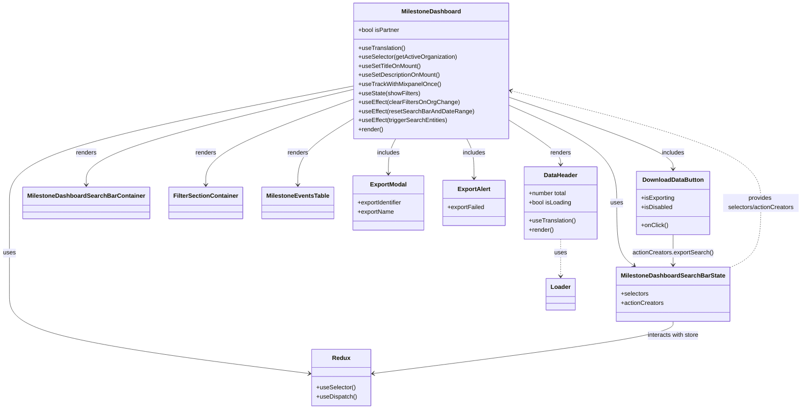

# Diagram: web/portal/src/pages/milestone/Milestone.Dashboard.page.js


> Auto-generated by Obscura crawlers

## Diagram 1



### SVG

<svg id="container" width="2087.3984375" xmlns="http://www.w3.org/2000/svg" class="classDiagram" height="1084" viewBox="0 0 2087.3984375 1084" role="graphics-document document" aria-roledescription="class"><style>#container{font-family:"trebuchet ms",verdana,arial,sans-serif;font-size:16px;fill:#333;}@keyframes edge-animation-frame{from{stroke-dashoffset:0;}}@keyframes dash{to{stroke-dashoffset:0;}}#container .edge-animation-slow{stroke-dasharray:9,5!important;stroke-dashoffset:900;animation:dash 50s linear infinite;stroke-linecap:round;}#container .edge-animation-fast{stroke-dasharray:9,5!important;stroke-dashoffset:900;animation:dash 20s linear infinite;stroke-linecap:round;}#container .error-icon{fill:#552222;}#container .error-text{fill:#552222;stroke:#552222;}#container .edge-thickness-normal{stroke-width:1px;}#container .edge-thickness-thick{stroke-width:3.5px;}#container .edge-pattern-solid{stroke-dasharray:0;}#container .edge-thickness-invisible{stroke-width:0;fill:none;}#container .edge-pattern-dashed{stroke-dasharray:3;}#container .edge-pattern-dotted{stroke-dasharray:2;}#container .marker{fill:#333333;stroke:#333333;}#container .marker.cross{stroke:#333333;}#container svg{font-family:"trebuchet ms",verdana,arial,sans-serif;font-size:16px;}#container p{margin:0;}#container g.classGroup text{fill:#9370DB;stroke:none;font-family:"trebuchet ms",verdana,arial,sans-serif;font-size:10px;}#container g.classGroup text .title{font-weight:bolder;}#container .nodeLabel,#container .edgeLabel{color:#131300;}#container .edgeLabel .label rect{fill:#ECECFF;}#container .label text{fill:#131300;}#container .labelBkg{background:#ECECFF;}#container .edgeLabel .label span{background:#ECECFF;}#container .classTitle{font-weight:bolder;}#container .node rect,#container .node circle,#container .node ellipse,#container .node polygon,#container .node path{fill:#ECECFF;stroke:#9370DB;stroke-width:1px;}#container .divider{stroke:#9370DB;stroke-width:1;}#container g.clickable{cursor:pointer;}#container g.classGroup rect{fill:#ECECFF;stroke:#9370DB;}#container g.classGroup line{stroke:#9370DB;stroke-width:1;}#container .classLabel .box{stroke:none;stroke-width:0;fill:#ECECFF;opacity:0.5;}#container .classLabel .label{fill:#9370DB;font-size:10px;}#container .relation{stroke:#333333;stroke-width:1;fill:none;}#container .dashed-line{stroke-dasharray:3;}#container .dotted-line{stroke-dasharray:1 2;}#container #compositionStart,#container .composition{fill:#333333!important;stroke:#333333!important;stroke-width:1;}#container #compositionEnd,#container .composition{fill:#333333!important;stroke:#333333!important;stroke-width:1;}#container #dependencyStart,#container .dependency{fill:#333333!important;stroke:#333333!important;stroke-width:1;}#container #dependencyStart,#container .dependency{fill:#333333!important;stroke:#333333!important;stroke-width:1;}#container #extensionStart,#container .extension{fill:transparent!important;stroke:#333333!important;stroke-width:1;}#container #extensionEnd,#container .extension{fill:transparent!important;stroke:#333333!important;stroke-width:1;}#container #aggregationStart,#container .aggregation{fill:transparent!important;stroke:#333333!important;stroke-width:1;}#container #aggregationEnd,#container .aggregation{fill:transparent!important;stroke:#333333!important;stroke-width:1;}#container #lollipopStart,#container .lollipop{fill:#ECECFF!important;stroke:#333333!important;stroke-width:1;}#container #lollipopEnd,#container .lollipop{fill:#ECECFF!important;stroke:#333333!important;stroke-width:1;}#container .edgeTerminals{font-size:11px;line-height:initial;}#container .classTitleText{text-anchor:middle;font-size:18px;fill:#333;}#container .label-icon{display:inline-block;height:1em;overflow:visible;vertical-align:-0.125em;}#container .node .label-icon path{fill:currentColor;stroke:revert;stroke-width:revert;}#container :root{--mermaid-font-family:"trebuchet ms",verdana,arial,sans-serif;}</style><g><defs><marker id="container_class-aggregationStart" class="marker aggregation class" refX="18" refY="7" markerWidth="190" markerHeight="240" orient="auto"><path d="M 18,7 L9,13 L1,7 L9,1 Z"></path></marker></defs><defs><marker id="container_class-aggregationEnd" class="marker aggregation class" refX="1" refY="7" markerWidth="20" markerHeight="28" orient="auto"><path d="M 18,7 L9,13 L1,7 L9,1 Z"></path></marker></defs><defs><marker id="container_class-extensionStart" class="marker extension class" refX="18" refY="7" markerWidth="190" markerHeight="240" orient="auto"><path d="M 1,7 L18,13 V 1 Z"></path></marker></defs><defs><marker id="container_class-extensionEnd" class="marker extension class" refX="1" refY="7" markerWidth="20" markerHeight="28" orient="auto"><path d="M 1,1 V 13 L18,7 Z"></path></marker></defs><defs><marker id="container_class-compositionStart" class="marker composition class" refX="18" refY="7" markerWidth="190" markerHeight="240" orient="auto"><path d="M 18,7 L9,13 L1,7 L9,1 Z"></path></marker></defs><defs><marker id="container_class-compositionEnd" class="marker composition class" refX="1" refY="7" markerWidth="20" markerHeight="28" orient="auto"><path d="M 18,7 L9,13 L1,7 L9,1 Z"></path></marker></defs><defs><marker id="container_class-dependencyStart" class="marker dependency class" refX="6" refY="7" markerWidth="190" markerHeight="240" orient="auto"><path d="M 5,7 L9,13 L1,7 L9,1 Z"></path></marker></defs><defs><marker id="container_class-dependencyEnd" class="marker dependency class" refX="13" refY="7" markerWidth="20" markerHeight="28" orient="auto"><path d="M 18,7 L9,13 L14,7 L9,1 Z"></path></marker></defs><defs><marker id="container_class-lollipopStart" class="marker lollipop class" refX="13" refY="7" markerWidth="190" markerHeight="240" orient="auto"><circle stroke="black" fill="transparent" cx="7" cy="7" r="6"></circle></marker></defs><defs><marker id="container_class-lollipopEnd" class="marker lollipop class" refX="1" refY="7" markerWidth="190" markerHeight="240" orient="auto"><circle stroke="black" fill="transparent" cx="7" cy="7" r="6"></circle></marker></defs><g class="root"><g class="clusters"></g><g class="edgePaths"><path d="M1310.898,314.576L1334.673,329.647C1358.447,344.718,1405.995,374.859,1429.769,395.096C1453.543,415.333,1453.543,425.667,1453.543,430.833L1453.543,436" id="id_MilestoneDashboard_DataHeader_1" class="edge-thickness-normal edge-pattern-solid relation" style=";;;" data-edge="true" data-et="edge" data-id="id_MilestoneDashboard_DataHeader_1" data-points="W3sieCI6MTMxMC44OTg0Mzc1LCJ5IjozMTQuNTc2MzE3NDExMDUwNX0seyJ4IjoxNDUzLjU0Mjk2ODc1LCJ5Ijo0MDV9LHsieCI6MTQ1My41NDI5Njg3NSwieSI6NDQyfV0=" marker-end="url(#container_class-dependencyEnd)"></path><path d="M911.547,236.595L796.219,264.663C680.891,292.73,450.234,348.865,334.906,391.099C219.578,433.333,219.578,461.667,219.578,475.833L219.578,490" id="id_MilestoneDashboard_MilestoneDashboardSearchBarContainer_2" class="edge-thickness-normal edge-pattern-solid relation" style=";;;" data-edge="true" data-et="edge" data-id="id_MilestoneDashboard_MilestoneDashboardSearchBarContainer_2" data-points="W3sieCI6OTExLjU0Njg3NSwieSI6MjM2LjU5NTIwMDIzMTMxNDE1fSx7IngiOjIxOS41NzgxMjUsInkiOjQwNX0seyJ4IjoyMTkuNTc4MTI1LCJ5Ijo0OTZ9XQ==" marker-end="url(#container_class-dependencyEnd)"></path><path d="M911.547,261.735L846.887,285.613C782.227,309.49,652.906,357.245,588.246,395.289C523.586,433.333,523.586,461.667,523.586,475.833L523.586,490" id="id_MilestoneDashboard_FilterSectionContainer_3" class="edge-thickness-normal edge-pattern-solid relation" style=";;;" data-edge="true" data-et="edge" data-id="id_MilestoneDashboard_FilterSectionContainer_3" data-points="W3sieCI6OTExLjU0Njg3NSwieSI6MjYxLjczNTQyNzI2MDk0MzI1fSx7IngiOjUyMy41ODU5Mzc1LCJ5Ijo0MDV9LHsieCI6NTIzLjU4NTkzNzUsInkiOjQ5Nn1d" marker-end="url(#container_class-dependencyEnd)"></path><path d="M911.547,311.097L886.16,326.747C860.773,342.398,810,373.699,784.613,403.516C759.227,433.333,759.227,461.667,759.227,475.833L759.227,490" id="id_MilestoneDashboard_MilestoneEventsTable_4" class="edge-thickness-normal edge-pattern-solid relation" style=";;;" data-edge="true" data-et="edge" data-id="id_MilestoneDashboard_MilestoneEventsTable_4" data-points="W3sieCI6OTExLjU0Njg3NSwieSI6MzExLjA5Njk0NzA5ODU3ODR9LHsieCI6NzU5LjIyNjU2MjUsInkiOjQwNX0seyJ4Ijo3NTkuMjI2NTYyNSwieSI6NDk2fV0=" marker-end="url(#container_class-dependencyEnd)"></path><path d="M1016.589,368L1013.347,374.167C1010.105,380.333,1003.621,392.667,1000.379,408C997.137,423.333,997.137,441.667,997.137,450.833L997.137,460" id="id_MilestoneDashboard_ExportModal_5" class="edge-thickness-normal edge-pattern-solid relation" style=";;;" data-edge="true" data-et="edge" data-id="id_MilestoneDashboard_ExportModal_5" data-points="W3sieCI6MTAxNi41ODkxNTk3MDYyMjEyLCJ5IjozNjh9LHsieCI6OTk3LjEzNjcxODc1LCJ5Ijo0MDV9LHsieCI6OTk3LjEzNjcxODc1LCJ5Ijo0NjZ9XQ==" marker-end="url(#container_class-dependencyEnd)"></path><path d="M1205.856,368L1209.098,374.167C1212.34,380.333,1218.824,392.667,1222.067,410C1225.309,427.333,1225.309,449.667,1225.309,460.833L1225.309,472" id="id_MilestoneDashboard_ExportAlert_6" class="edge-thickness-normal edge-pattern-solid relation" style=";;;" data-edge="true" data-et="edge" data-id="id_MilestoneDashboard_ExportAlert_6" data-points="W3sieCI6MTIwNS44NTYxNTI3OTM3Nzg4LCJ5IjozNjh9LHsieCI6MTIyNS4zMDg1OTM3NSwieSI6NDA1fSx7IngiOjEyMjUuMzA4NTkzNzUsInkiOjQ3OH1d" marker-end="url(#container_class-dependencyEnd)"></path><path d="M1310.898,255.982L1383.847,280.819C1456.796,305.655,1602.693,355.327,1675.641,387.33C1748.59,419.333,1748.59,433.667,1748.59,440.833L1748.59,448" id="id_MilestoneDashboard_DownloadDataButton_7" class="edge-thickness-normal edge-pattern-solid relation" style=";;;" data-edge="true" data-et="edge" data-id="id_MilestoneDashboard_DownloadDataButton_7" data-points="W3sieCI6MTMxMC44OTg0Mzc1LCJ5IjoyNTUuOTgyMjMyODE4MTExNn0seyJ4IjoxNzQ4LjU4OTg0Mzc1LCJ5Ijo0MDV9LHsieCI6MTc0OC41ODk4NDM3NSwieSI6NDU0fV0=" marker-end="url(#container_class-dependencyEnd)"></path><path d="M1310.898,276.416L1359.297,297.847C1407.695,319.277,1504.492,362.139,1552.891,405.736C1601.289,449.333,1601.289,493.667,1601.289,538C1601.289,582.333,1601.289,626.667,1608.819,654.405C1616.348,682.144,1631.408,693.287,1638.937,698.859L1646.467,704.431" id="id_MilestoneDashboard_MilestoneDashboardSearchBarState_8" class="edge-thickness-normal edge-pattern-solid relation" style=";;;" data-edge="true" data-et="edge" data-id="id_MilestoneDashboard_MilestoneDashboardSearchBarState_8" data-points="W3sieCI6MTMxMC44OTg0Mzc1LCJ5IjoyNzYuNDE1ODYzNjAyNjY4NjV9LHsieCI6MTYwMS4yODkwNjI1LCJ5Ijo0MDV9LHsieCI6MTYwMS4yODkwNjI1LCJ5Ijo1Mzh9LHsieCI6MTYwMS4yODkwNjI1LCJ5Ijo2NzF9LHsieCI6MTY1MS4yOTAyNDUxMjYxNDY4LCJ5Ijo3MDh9XQ==" marker-end="url(#container_class-dependencyEnd)"></path><path d="M1892.387,712.092L1906.889,705.243C1921.391,698.394,1950.395,684.697,1964.896,655.682C1979.398,626.667,1979.398,582.333,1979.398,538C1979.398,493.667,1979.398,449.333,1868.952,399.561C1758.505,349.788,1537.612,294.576,1427.166,266.97L1316.719,239.364" id="id_MilestoneDashboardSearchBarState_MilestoneDashboard_9" class="edge-thickness-normal edge-pattern-dashed relation" style=";;;" data-edge="true" data-et="edge" data-id="id_MilestoneDashboardSearchBarState_MilestoneDashboard_9" data-points="W3sieCI6MTg5Mi4zODY3MTg3NSwieSI6NzEyLjA5MTUyNjA1NDgwMDV9LHsieCI6MTk3OS4zOTg0Mzc1LCJ5Ijo2NzF9LHsieCI6MTk3OS4zOTg0Mzc1LCJ5Ijo1Mzh9LHsieCI6MTk3OS4zOTg0Mzc1LCJ5Ijo0MDV9LHsieCI6MTMxMC44OTg0Mzc1LCJ5IjoyMzcuOTA4ODM4MTI1OTE5NTR9XQ==" marker-end="url(#container_class-dependencyEnd)"></path><path d="M911.547,227.872L763.704,257.393C615.862,286.914,320.177,345.957,172.335,397.645C24.492,449.333,24.492,493.667,24.492,538C24.492,582.333,24.492,626.667,24.492,667C24.492,707.333,24.492,743.667,24.492,780C24.492,816.333,24.492,852.667,154.386,887.709C284.279,922.752,544.066,956.505,673.959,973.381L803.853,990.257" id="id_MilestoneDashboard_Redux_10" class="edge-thickness-normal edge-pattern-solid relation" style=";;;" data-edge="true" data-et="edge" data-id="id_MilestoneDashboard_Redux_10" data-points="W3sieCI6OTExLjU0Njg3NSwieSI6MjI3Ljg3MTU2NTAwODI4NTN9LHsieCI6MjQuNDkyMTg3NSwieSI6NDA1fSx7IngiOjI0LjQ5MjE4NzUsInkiOjUzOH0seyJ4IjoyNC40OTIxODc1LCJ5Ijo2NzF9LHsieCI6MjQuNDkyMTg3NSwieSI6NzgwfSx7IngiOjI0LjQ5MjE4NzUsInkiOjg4OX0seyJ4Ijo4MDkuODAyNzM0Mzc1LCJ5Ijo5OTEuMDI5OTI5NjA1Mzg2OX1d" marker-end="url(#container_class-dependencyEnd)"></path><path d="M1453.543,634L1453.543,640.167C1453.543,646.333,1453.543,658.667,1453.543,675C1453.543,691.333,1453.543,711.667,1453.543,721.833L1453.543,732" id="id_DataHeader_Loader_11" class="edge-thickness-normal edge-pattern-dashed relation" style=";;;" data-edge="true" data-et="edge" data-id="id_DataHeader_Loader_11" data-points="W3sieCI6MTQ1My41NDI5Njg3NSwieSI6NjM0fSx7IngiOjE0NTMuNTQyOTY4NzUsInkiOjY3MX0seyJ4IjoxNDUzLjU0Mjk2ODc1LCJ5Ijo3Mzh9XQ==" marker-end="url(#container_class-dependencyEnd)"></path><path d="M1748.59,622L1748.59,630.167C1748.59,638.333,1748.59,654.667,1748.59,668C1748.59,681.333,1748.59,691.667,1748.59,696.833L1748.59,702" id="id_DownloadDataButton_MilestoneDashboardSearchBarState_12" class="edge-thickness-normal edge-pattern-solid relation" style=";;;" data-edge="true" data-et="edge" data-id="id_DownloadDataButton_MilestoneDashboardSearchBarState_12" data-points="W3sieCI6MTc0OC41ODk4NDM3NSwieSI6NjIyfSx7IngiOjE3NDguNTg5ODQzNzUsInkiOjY3MX0seyJ4IjoxNzQ4LjU4OTg0Mzc1LCJ5Ijo3MDh9XQ==" marker-end="url(#container_class-dependencyEnd)"></path><path d="M1748.59,852L1748.59,858.167C1748.59,864.333,1748.59,876.667,1618.696,899.709C1488.803,922.752,1229.016,956.505,1099.123,973.381L969.229,990.257" id="id_MilestoneDashboardSearchBarState_Redux_13" class="edge-thickness-normal edge-pattern-solid relation" style=";;;" data-edge="true" data-et="edge" data-id="id_MilestoneDashboardSearchBarState_Redux_13" data-points="W3sieCI6MTc0OC41ODk4NDM3NSwieSI6ODUyfSx7IngiOjE3NDguNTg5ODQzNzUsInkiOjg4OX0seyJ4Ijo5NjMuMjc5Mjk2ODc1LCJ5Ijo5OTEuMDI5OTI5NjA1Mzg2OX1d" marker-end="url(#container_class-dependencyEnd)"></path></g><g class="edgeLabels"><g class="edgeLabel" transform="translate(1453.54296875, 405)"><g class="label" data-id="id_MilestoneDashboard_DataHeader_1" transform="translate(-27.75, -12)"><foreignObject width="55.5" height="24"><div xmlns="http://www.w3.org/1999/xhtml" class="labelBkg" style="display: table-cell; white-space: nowrap; line-height: 1.5; max-width: 200px; text-align: center;"><span class="edgeLabel"><p>renders</p></span></div></foreignObject></g></g><g class="edgeLabel" transform="translate(219.578125, 405)"><g class="label" data-id="id_MilestoneDashboard_MilestoneDashboardSearchBarContainer_2" transform="translate(-27.75, -12)"><foreignObject width="55.5" height="24"><div xmlns="http://www.w3.org/1999/xhtml" class="labelBkg" style="display: table-cell; white-space: nowrap; line-height: 1.5; max-width: 200px; text-align: center;"><span class="edgeLabel"><p>renders</p></span></div></foreignObject></g></g><g class="edgeLabel" transform="translate(523.5859375, 405)"><g class="label" data-id="id_MilestoneDashboard_FilterSectionContainer_3" transform="translate(-27.75, -12)"><foreignObject width="55.5" height="24"><div xmlns="http://www.w3.org/1999/xhtml" class="labelBkg" style="display: table-cell; white-space: nowrap; line-height: 1.5; max-width: 200px; text-align: center;"><span class="edgeLabel"><p>renders</p></span></div></foreignObject></g></g><g class="edgeLabel" transform="translate(759.2265625, 405)"><g class="label" data-id="id_MilestoneDashboard_MilestoneEventsTable_4" transform="translate(-27.75, -12)"><foreignObject width="55.5" height="24"><div xmlns="http://www.w3.org/1999/xhtml" class="labelBkg" style="display: table-cell; white-space: nowrap; line-height: 1.5; max-width: 200px; text-align: center;"><span class="edgeLabel"><p>renders</p></span></div></foreignObject></g></g><g class="edgeLabel" transform="translate(997.13671875, 405)"><g class="label" data-id="id_MilestoneDashboard_ExportModal_5" transform="translate(-30.6484375, -12)"><foreignObject width="61.296875" height="24"><div xmlns="http://www.w3.org/1999/xhtml" class="labelBkg" style="display: table-cell; white-space: nowrap; line-height: 1.5; max-width: 200px; text-align: center;"><span class="edgeLabel"><p>includes</p></span></div></foreignObject></g></g><g class="edgeLabel" transform="translate(1225.30859375, 405)"><g class="label" data-id="id_MilestoneDashboard_ExportAlert_6" transform="translate(-30.6484375, -12)"><foreignObject width="61.296875" height="24"><div xmlns="http://www.w3.org/1999/xhtml" class="labelBkg" style="display: table-cell; white-space: nowrap; line-height: 1.5; max-width: 200px; text-align: center;"><span class="edgeLabel"><p>includes</p></span></div></foreignObject></g></g><g class="edgeLabel" transform="translate(1748.58984375, 405)"><g class="label" data-id="id_MilestoneDashboard_DownloadDataButton_7" transform="translate(-30.6484375, -12)"><foreignObject width="61.296875" height="24"><div xmlns="http://www.w3.org/1999/xhtml" class="labelBkg" style="display: table-cell; white-space: nowrap; line-height: 1.5; max-width: 200px; text-align: center;"><span class="edgeLabel"><p>includes</p></span></div></foreignObject></g></g><g class="edgeLabel" transform="translate(1601.2890625, 538)"><g class="label" data-id="id_MilestoneDashboard_MilestoneDashboardSearchBarState_8" transform="translate(-16.4921875, -12)"><foreignObject width="32.984375" height="24"><div xmlns="http://www.w3.org/1999/xhtml" class="labelBkg" style="display: table-cell; white-space: nowrap; line-height: 1.5; max-width: 200px; text-align: center;"><span class="edgeLabel"><p>uses</p></span></div></foreignObject></g></g><g class="edgeLabel" transform="translate(1979.3984375, 538)"><g class="label" data-id="id_MilestoneDashboardSearchBarState_MilestoneDashboard_9" transform="translate(-100, -24)"><foreignObject width="200" height="48"><div xmlns="http://www.w3.org/1999/xhtml" class="labelBkg" style="display: table; white-space: break-spaces; line-height: 1.5; max-width: 200px; text-align: center; width: 200px;"><span class="edgeLabel"><p>provides selectors/actionCreators</p></span></div></foreignObject></g></g><g class="edgeLabel" transform="translate(24.4921875, 671)"><g class="label" data-id="id_MilestoneDashboard_Redux_10" transform="translate(-16.4921875, -12)"><foreignObject width="32.984375" height="24"><div xmlns="http://www.w3.org/1999/xhtml" class="labelBkg" style="display: table-cell; white-space: nowrap; line-height: 1.5; max-width: 200px; text-align: center;"><span class="edgeLabel"><p>uses</p></span></div></foreignObject></g></g><g class="edgeLabel" transform="translate(1453.54296875, 671)"><g class="label" data-id="id_DataHeader_Loader_11" transform="translate(-16.4921875, -12)"><foreignObject width="32.984375" height="24"><div xmlns="http://www.w3.org/1999/xhtml" class="labelBkg" style="display: table-cell; white-space: nowrap; line-height: 1.5; max-width: 200px; text-align: center;"><span class="edgeLabel"><p>uses</p></span></div></foreignObject></g></g><g class="edgeLabel" transform="translate(1748.58984375, 671)"><g class="label" data-id="id_DownloadDataButton_MilestoneDashboardSearchBarState_12" transform="translate(-107.609375, -12)"><foreignObject width="215.21875" height="24"><div xmlns="http://www.w3.org/1999/xhtml" class="labelBkg" style="display: table; white-space: break-spaces; line-height: 1.5; max-width: 200px; text-align: center; width: 200px;"><span class="edgeLabel"><p>actionCreators.exportSearch()</p></span></div></foreignObject></g></g><g class="edgeLabel" transform="translate(1748.58984375, 889)"><g class="label" data-id="id_MilestoneDashboardSearchBarState_Redux_13" transform="translate(-69.875, -12)"><foreignObject width="139.75" height="24"><div xmlns="http://www.w3.org/1999/xhtml" class="labelBkg" style="display: table-cell; white-space: nowrap; line-height: 1.5; max-width: 200px; text-align: center;"><span class="edgeLabel"><p>interacts with store</p></span></div></foreignObject></g></g></g><g class="nodes"><g class="node default" id="classId-MilestoneDashboard-0" transform="translate(1111.22265625, 188)"><g class="basic label-container"><path d="M-199.67578125 -180 L199.67578125 -180 L199.67578125 180 L-199.67578125 180" stroke="none" stroke-width="0" fill="#ECECFF" style=""></path><path d="M-199.67578125 -180 C-74.51423850143514 -180, 50.64730424712971 -180, 199.67578125 -180 M-199.67578125 -180 C-89.45647237558481 -180, 20.76283649883038 -180, 199.67578125 -180 M199.67578125 -180 C199.67578125 -104.23195428929705, 199.67578125 -28.4639085785941, 199.67578125 180 M199.67578125 -180 C199.67578125 -60.813878373334546, 199.67578125 58.37224325333091, 199.67578125 180 M199.67578125 180 C52.97402917300704 180, -93.72772290398592 180, -199.67578125 180 M199.67578125 180 C90.68201420244816 180, -18.311752845103683 180, -199.67578125 180 M-199.67578125 180 C-199.67578125 58.95055874958298, -199.67578125 -62.09888250083404, -199.67578125 -180 M-199.67578125 180 C-199.67578125 67.08796108712174, -199.67578125 -45.82407782575652, -199.67578125 -180" stroke="#9370DB" stroke-width="1.3" fill="none" stroke-dasharray="0 0" style=""></path></g><g class="annotation-group text" transform="translate(0, -156)"></g><g class="label-group text" transform="translate(-75.2421875, -156)"><g class="label" style="font-weight: bolder" transform="translate(0,-12)"><foreignObject width="150.484375" height="24"><div xmlns="http://www.w3.org/1999/xhtml" style="display: table-cell; white-space: nowrap; line-height: 1.5; max-width: 199px; text-align: center;"><span class="nodeLabel markdown-node-label" style=""><p>MilestoneDashboard</p></span></div></foreignObject></g></g><g class="members-group text" transform="translate(-187.67578125, -108)"><g class="label" style="" transform="translate(0,-12)"><foreignObject width="110.4375" height="24"><div xmlns="http://www.w3.org/1999/xhtml" style="display: table-cell; white-space: nowrap; line-height: 1.5; max-width: 169px; text-align: center;"><span class="nodeLabel markdown-node-label" style=""><p>+bool isPartner</p></span></div></foreignObject></g></g><g class="methods-group text" transform="translate(-187.67578125, -60)"><g class="label" style="" transform="translate(0,-12)"><foreignObject width="125.140625" height="24"><div xmlns="http://www.w3.org/1999/xhtml" style="display: table-cell; white-space: nowrap; line-height: 1.5; max-width: 183px; text-align: center;"><span class="nodeLabel markdown-node-label" style=""><p>+useTranslation()</p></span></div></foreignObject></g><g class="label" style="" transform="translate(0,12)"><foreignObject width="261.609375" height="24"><div xmlns="http://www.w3.org/1999/xhtml" style="display: table-cell; white-space: nowrap; line-height: 1.5; max-width: 319px; text-align: center;"><span class="nodeLabel markdown-node-label" style=""><p>+useSelector(getActiveOrganization)</p></span></div></foreignObject></g><g class="label" style="" transform="translate(0,36)"><foreignObject width="165.515625" height="24"><div xmlns="http://www.w3.org/1999/xhtml" style="display: table-cell; white-space: nowrap; line-height: 1.5; max-width: 223px; text-align: center;"><span class="nodeLabel markdown-node-label" style=""><p>+useSetTitleOnMount()</p></span></div></foreignObject></g><g class="label" style="" transform="translate(0,60)"><foreignObject width="217.125" height="24"><div xmlns="http://www.w3.org/1999/xhtml" style="display: table-cell; white-space: nowrap; line-height: 1.5; max-width: 274px; text-align: center;"><span class="nodeLabel markdown-node-label" style=""><p>+useSetDescriptionOnMount()</p></span></div></foreignObject></g><g class="label" style="" transform="translate(0,84)"><foreignObject width="216.75" height="24"><div xmlns="http://www.w3.org/1999/xhtml" style="display: table-cell; white-space: nowrap; line-height: 1.5; max-width: 274px; text-align: center;"><span class="nodeLabel markdown-node-label" style=""><p>+useTrackWithMixpanelOnce()</p></span></div></foreignObject></g><g class="label" style="" transform="translate(0,108)"><foreignObject width="163.03125" height="24"><div xmlns="http://www.w3.org/1999/xhtml" style="display: table-cell; white-space: nowrap; line-height: 1.5; max-width: 220px; text-align: center;"><span class="nodeLabel markdown-node-label" style=""><p>+useState(showFilters)</p></span></div></foreignObject></g><g class="label" style="" transform="translate(0,132)"><foreignObject width="263.484375" height="24"><div xmlns="http://www.w3.org/1999/xhtml" style="display: table-cell; white-space: nowrap; line-height: 1.5; max-width: 321px; text-align: center;"><span class="nodeLabel markdown-node-label" style=""><p>+useEffect(clearFiltersOnOrgChange)</p></span></div></foreignObject></g><g class="label" style="" transform="translate(0,156)"><foreignObject width="300.109375" height="24"><div xmlns="http://www.w3.org/1999/xhtml" style="display: table-cell; white-space: nowrap; line-height: 1.5; max-width: 357px; text-align: center;"><span class="nodeLabel markdown-node-label" style=""><p>+useEffect(resetSearchBarAndDateRange)</p></span></div></foreignObject></g><g class="label" style="" transform="translate(0,180)"><foreignObject width="235.796875" height="24"><div xmlns="http://www.w3.org/1999/xhtml" style="display: table-cell; white-space: nowrap; line-height: 1.5; max-width: 293px; text-align: center;"><span class="nodeLabel markdown-node-label" style=""><p>+useEffect(triggerSearchEntities)</p></span></div></foreignObject></g><g class="label" style="" transform="translate(0,204)"><foreignObject width="66.609375" height="24"><div xmlns="http://www.w3.org/1999/xhtml" style="display: table-cell; white-space: nowrap; line-height: 1.5; max-width: 124px; text-align: center;"><span class="nodeLabel markdown-node-label" style=""><p>+render()</p></span></div></foreignObject></g></g><g class="divider" style=""><path d="M-199.67578125 -132 C-108.80147593964756 -132, -17.92717062929512 -132, 199.67578125 -132 M-199.67578125 -132 C-41.40160597238665 -132, 116.8725693052267 -132, 199.67578125 -132" stroke="#9370DB" stroke-width="1.3" fill="none" stroke-dasharray="0 0" style=""></path></g><g class="divider" style=""><path d="M-199.67578125 -84 C-91.55799659253721 -84, 16.559788064925584 -84, 199.67578125 -84 M-199.67578125 -84 C-56.26998630319028 -84, 87.13580864361944 -84, 199.67578125 -84" stroke="#9370DB" stroke-width="1.3" fill="none" stroke-dasharray="0 0" style=""></path></g></g><g class="node default" id="classId-DataHeader-1" transform="translate(1453.54296875, 538)"><g class="basic label-container"><path d="M-96.25390625 -96 L96.25390625 -96 L96.25390625 96 L-96.25390625 96" stroke="none" stroke-width="0" fill="#ECECFF" style=""></path><path d="M-96.25390625 -96 C-48.46132009402917 -96, -0.6687339380583381 -96, 96.25390625 -96 M-96.25390625 -96 C-26.630371467213592 -96, 42.993163315572815 -96, 96.25390625 -96 M96.25390625 -96 C96.25390625 -53.53255198397498, 96.25390625 -11.065103967949966, 96.25390625 96 M96.25390625 -96 C96.25390625 -19.75804505218865, 96.25390625 56.4839098956227, 96.25390625 96 M96.25390625 96 C37.74358465029458 96, -20.76673694941084 96, -96.25390625 96 M96.25390625 96 C43.14421638957127 96, -9.96547347085746 96, -96.25390625 96 M-96.25390625 96 C-96.25390625 24.827052724132912, -96.25390625 -46.345894551734176, -96.25390625 -96 M-96.25390625 96 C-96.25390625 47.74975748548299, -96.25390625 -0.5004850290340244, -96.25390625 -96" stroke="#9370DB" stroke-width="1.3" fill="none" stroke-dasharray="0 0" style=""></path></g><g class="annotation-group text" transform="translate(0, -72)"></g><g class="label-group text" transform="translate(-43.3671875, -72)"><g class="label" style="font-weight: bolder" transform="translate(0,-12)"><foreignObject width="86.734375" height="24"><div xmlns="http://www.w3.org/1999/xhtml" style="display: table-cell; white-space: nowrap; line-height: 1.5; max-width: 137px; text-align: center;"><span class="nodeLabel markdown-node-label" style=""><p>DataHeader</p></span></div></foreignObject></g></g><g class="members-group text" transform="translate(-84.25390625, -24)"><g class="label" style="" transform="translate(0,-12)"><foreignObject width="102.8125" height="24"><div xmlns="http://www.w3.org/1999/xhtml" style="display: table-cell; white-space: nowrap; line-height: 1.5; max-width: 160px; text-align: center;"><span class="nodeLabel markdown-node-label" style=""><p>+number total</p></span></div></foreignObject></g><g class="label" style="" transform="translate(0,12)"><foreignObject width="114.328125" height="24"><div xmlns="http://www.w3.org/1999/xhtml" style="display: table-cell; white-space: nowrap; line-height: 1.5; max-width: 172px; text-align: center;"><span class="nodeLabel markdown-node-label" style=""><p>+bool isLoading</p></span></div></foreignObject></g></g><g class="methods-group text" transform="translate(-84.25390625, 48)"><g class="label" style="" transform="translate(0,-12)"><foreignObject width="125.140625" height="24"><div xmlns="http://www.w3.org/1999/xhtml" style="display: table-cell; white-space: nowrap; line-height: 1.5; max-width: 183px; text-align: center;"><span class="nodeLabel markdown-node-label" style=""><p>+useTranslation()</p></span></div></foreignObject></g><g class="label" style="" transform="translate(0,12)"><foreignObject width="66.609375" height="24"><div xmlns="http://www.w3.org/1999/xhtml" style="display: table-cell; white-space: nowrap; line-height: 1.5; max-width: 124px; text-align: center;"><span class="nodeLabel markdown-node-label" style=""><p>+render()</p></span></div></foreignObject></g></g><g class="divider" style=""><path d="M-96.25390625 -48 C-33.850486913216756 -48, 28.55293242356649 -48, 96.25390625 -48 M-96.25390625 -48 C-28.56854187675131 -48, 39.11682249649738 -48, 96.25390625 -48" stroke="#9370DB" stroke-width="1.3" fill="none" stroke-dasharray="0 0" style=""></path></g><g class="divider" style=""><path d="M-96.25390625 24 C-25.62955538654971 24, 44.99479547690058 24, 96.25390625 24 M-96.25390625 24 C-22.415564523453895 24, 51.42277720309221 24, 96.25390625 24" stroke="#9370DB" stroke-width="1.3" fill="none" stroke-dasharray="0 0" style=""></path></g></g><g class="node default" id="classId-MilestoneDashboardSearchBarContainer-2" transform="translate(219.578125, 538)"><g class="basic label-container"><path d="M-160.0859375 -42 L160.0859375 -42 L160.0859375 42 L-160.0859375 42" stroke="none" stroke-width="0" fill="#ECECFF" style=""></path><path d="M-160.0859375 -42 C-64.30067112913564 -42, 31.484595241728726 -42, 160.0859375 -42 M-160.0859375 -42 C-71.09208798065634 -42, 17.90176153868731 -42, 160.0859375 -42 M160.0859375 -42 C160.0859375 -19.13336097050953, 160.0859375 3.733278058980943, 160.0859375 42 M160.0859375 -42 C160.0859375 -15.884017386994408, 160.0859375 10.231965226011184, 160.0859375 42 M160.0859375 42 C32.509220132876706 42, -95.06749723424659 42, -160.0859375 42 M160.0859375 42 C32.10303220241262 42, -95.87987309517476 42, -160.0859375 42 M-160.0859375 42 C-160.0859375 24.232143936453276, -160.0859375 6.464287872906553, -160.0859375 -42 M-160.0859375 42 C-160.0859375 18.819128293367108, -160.0859375 -4.361743413265785, -160.0859375 -42" stroke="#9370DB" stroke-width="1.3" fill="none" stroke-dasharray="0 0" style=""></path></g><g class="annotation-group text" transform="translate(0, -18)"></g><g class="label-group text" transform="translate(-148.0859375, -18)"><g class="label" style="font-weight: bolder" transform="translate(0,-12)"><foreignObject width="296.171875" height="24"><div xmlns="http://www.w3.org/1999/xhtml" style="display: table-cell; white-space: nowrap; line-height: 1.5; max-width: 344px; text-align: center;"><span class="nodeLabel markdown-node-label" style=""><p>MilestoneDashboardSearchBarContainer</p></span></div></foreignObject></g></g><g class="members-group text" transform="translate(-148.0859375, 30)"></g><g class="methods-group text" transform="translate(-148.0859375, 60)"></g><g class="divider" style=""><path d="M-160.0859375 6 C-65.46569093745626 6, 29.154555625087482 6, 160.0859375 6 M-160.0859375 6 C-42.12314355821245 6, 75.8396503835751 6, 160.0859375 6" stroke="#9370DB" stroke-width="1.3" fill="none" stroke-dasharray="0 0" style=""></path></g><g class="divider" style=""><path d="M-160.0859375 24 C-69.10451490908906 24, 21.876907681821876 24, 160.0859375 24 M-160.0859375 24 C-61.521582653000365 24, 37.04277219399927 24, 160.0859375 24" stroke="#9370DB" stroke-width="1.3" fill="none" stroke-dasharray="0 0" style=""></path></g></g><g class="node default" id="classId-FilterSectionContainer-3" transform="translate(523.5859375, 538)"><g class="basic label-container"><path d="M-93.921875 -42 L93.921875 -42 L93.921875 42 L-93.921875 42" stroke="none" stroke-width="0" fill="#ECECFF" style=""></path><path d="M-93.921875 -42 C-50.751999070253554 -42, -7.5821231405071075 -42, 93.921875 -42 M-93.921875 -42 C-28.349544193315495 -42, 37.22278661336901 -42, 93.921875 -42 M93.921875 -42 C93.921875 -11.921845786264676, 93.921875 18.15630842747065, 93.921875 42 M93.921875 -42 C93.921875 -13.725388317774062, 93.921875 14.549223364451876, 93.921875 42 M93.921875 42 C49.61568526500354 42, 5.309495530007084 42, -93.921875 42 M93.921875 42 C46.10108340174971 42, -1.7197081965005765 42, -93.921875 42 M-93.921875 42 C-93.921875 24.26634675414819, -93.921875 6.532693508296383, -93.921875 -42 M-93.921875 42 C-93.921875 20.640712366217624, -93.921875 -0.7185752675647521, -93.921875 -42" stroke="#9370DB" stroke-width="1.3" fill="none" stroke-dasharray="0 0" style=""></path></g><g class="annotation-group text" transform="translate(0, -18)"></g><g class="label-group text" transform="translate(-81.921875, -18)"><g class="label" style="font-weight: bolder" transform="translate(0,-12)"><foreignObject width="163.84375" height="24"><div xmlns="http://www.w3.org/1999/xhtml" style="display: table-cell; white-space: nowrap; line-height: 1.5; max-width: 212px; text-align: center;"><span class="nodeLabel markdown-node-label" style=""><p>FilterSectionContainer</p></span></div></foreignObject></g></g><g class="members-group text" transform="translate(-81.921875, 30)"></g><g class="methods-group text" transform="translate(-81.921875, 60)"></g><g class="divider" style=""><path d="M-93.921875 6 C-23.98598419566507 6, 45.94990660866986 6, 93.921875 6 M-93.921875 6 C-38.47269426176997 6, 16.976486476460053 6, 93.921875 6" stroke="#9370DB" stroke-width="1.3" fill="none" stroke-dasharray="0 0" style=""></path></g><g class="divider" style=""><path d="M-93.921875 24 C-53.99446387990659 24, -14.06705275981318 24, 93.921875 24 M-93.921875 24 C-50.90793579050828 24, -7.893996581016566 24, 93.921875 24" stroke="#9370DB" stroke-width="1.3" fill="none" stroke-dasharray="0 0" style=""></path></g></g><g class="node default" id="classId-MilestoneEventsTable-4" transform="translate(759.2265625, 538)"><g class="basic label-container"><path d="M-91.71875 -42 L91.71875 -42 L91.71875 42 L-91.71875 42" stroke="none" stroke-width="0" fill="#ECECFF" style=""></path><path d="M-91.71875 -42 C-38.50730624735901 -42, 14.704137505281977 -42, 91.71875 -42 M-91.71875 -42 C-25.797224695918302 -42, 40.124300608163395 -42, 91.71875 -42 M91.71875 -42 C91.71875 -20.462494901138925, 91.71875 1.0750101977221505, 91.71875 42 M91.71875 -42 C91.71875 -14.784560733141706, 91.71875 12.430878533716587, 91.71875 42 M91.71875 42 C34.45146793838406 42, -22.815814123231874 42, -91.71875 42 M91.71875 42 C22.32674351280933 42, -47.06526297438134 42, -91.71875 42 M-91.71875 42 C-91.71875 19.89547852414544, -91.71875 -2.2090429517091223, -91.71875 -42 M-91.71875 42 C-91.71875 23.622749799292787, -91.71875 5.245499598585575, -91.71875 -42" stroke="#9370DB" stroke-width="1.3" fill="none" stroke-dasharray="0 0" style=""></path></g><g class="annotation-group text" transform="translate(0, -18)"></g><g class="label-group text" transform="translate(-79.71875, -18)"><g class="label" style="font-weight: bolder" transform="translate(0,-12)"><foreignObject width="159.4375" height="24"><div xmlns="http://www.w3.org/1999/xhtml" style="display: table-cell; white-space: nowrap; line-height: 1.5; max-width: 207px; text-align: center;"><span class="nodeLabel markdown-node-label" style=""><p>MilestoneEventsTable</p></span></div></foreignObject></g></g><g class="members-group text" transform="translate(-79.71875, 30)"></g><g class="methods-group text" transform="translate(-79.71875, 60)"></g><g class="divider" style=""><path d="M-91.71875 6 C-32.63828037744228 6, 26.442189245115443 6, 91.71875 6 M-91.71875 6 C-46.66031950049249 6, -1.6018890009849827 6, 91.71875 6" stroke="#9370DB" stroke-width="1.3" fill="none" stroke-dasharray="0 0" style=""></path></g><g class="divider" style=""><path d="M-91.71875 24 C-21.91792342025336 24, 47.88290315949328 24, 91.71875 24 M-91.71875 24 C-38.150859944970406 24, 15.417030110059187 24, 91.71875 24" stroke="#9370DB" stroke-width="1.3" fill="none" stroke-dasharray="0 0" style=""></path></g></g><g class="node default" id="classId-ExportModal-5" transform="translate(997.13671875, 538)"><g class="basic label-container"><path d="M-96.19140625 -72 L96.19140625 -72 L96.19140625 72 L-96.19140625 72" stroke="none" stroke-width="0" fill="#ECECFF" style=""></path><path d="M-96.19140625 -72 C-36.318380160888 -72, 23.554645928224005 -72, 96.19140625 -72 M-96.19140625 -72 C-55.37347212022874 -72, -14.55553799045748 -72, 96.19140625 -72 M96.19140625 -72 C96.19140625 -31.007502579330136, 96.19140625 9.984994841339727, 96.19140625 72 M96.19140625 -72 C96.19140625 -27.593890552377808, 96.19140625 16.812218895244385, 96.19140625 72 M96.19140625 72 C25.00027529829994 72, -46.19085565340012 72, -96.19140625 72 M96.19140625 72 C24.985723096460873 72, -46.219960057078254 72, -96.19140625 72 M-96.19140625 72 C-96.19140625 27.746863053244944, -96.19140625 -16.506273893510112, -96.19140625 -72 M-96.19140625 72 C-96.19140625 39.15954036183119, -96.19140625 6.319080723662381, -96.19140625 -72" stroke="#9370DB" stroke-width="1.3" fill="none" stroke-dasharray="0 0" style=""></path></g><g class="annotation-group text" transform="translate(0, -48)"></g><g class="label-group text" transform="translate(-46.4921875, -48)"><g class="label" style="font-weight: bolder" transform="translate(0,-12)"><foreignObject width="92.984375" height="24"><div xmlns="http://www.w3.org/1999/xhtml" style="display: table-cell; white-space: nowrap; line-height: 1.5; max-width: 142px; text-align: center;"><span class="nodeLabel markdown-node-label" style=""><p>ExportModal</p></span></div></foreignObject></g></g><g class="members-group text" transform="translate(-84.19140625, 0)"><g class="label" style="" transform="translate(0,-12)"><foreignObject width="121.890625" height="24"><div xmlns="http://www.w3.org/1999/xhtml" style="display: table-cell; white-space: nowrap; line-height: 1.5; max-width: 180px; text-align: center;"><span class="nodeLabel markdown-node-label" style=""><p>+exportIdentifier</p></span></div></foreignObject></g><g class="label" style="" transform="translate(0,12)"><foreignObject width="97.1875" height="24"><div xmlns="http://www.w3.org/1999/xhtml" style="display: table-cell; white-space: nowrap; line-height: 1.5; max-width: 155px; text-align: center;"><span class="nodeLabel markdown-node-label" style=""><p>+exportName</p></span></div></foreignObject></g></g><g class="methods-group text" transform="translate(-84.19140625, 72)"></g><g class="divider" style=""><path d="M-96.19140625 -24 C-54.30094230990621 -24, -12.410478369812424 -24, 96.19140625 -24 M-96.19140625 -24 C-37.59491808723747 -24, 21.001570075525066 -24, 96.19140625 -24" stroke="#9370DB" stroke-width="1.3" fill="none" stroke-dasharray="0 0" style=""></path></g><g class="divider" style=""><path d="M-96.19140625 48 C-21.378713122373668 48, 53.433980005252664 48, 96.19140625 48 M-96.19140625 48 C-48.7988535632267 48, -1.4063008764534004 48, 96.19140625 48" stroke="#9370DB" stroke-width="1.3" fill="none" stroke-dasharray="0 0" style=""></path></g></g><g class="node default" id="classId-ExportAlert-6" transform="translate(1225.30859375, 538)"><g class="basic label-container"><path d="M-81.98046875 -60 L81.98046875 -60 L81.98046875 60 L-81.98046875 60" stroke="none" stroke-width="0" fill="#ECECFF" style=""></path><path d="M-81.98046875 -60 C-47.42969415325343 -60, -12.878919556506858 -60, 81.98046875 -60 M-81.98046875 -60 C-19.408441088935916 -60, 43.16358657212817 -60, 81.98046875 -60 M81.98046875 -60 C81.98046875 -35.6502449755129, 81.98046875 -11.300489951025796, 81.98046875 60 M81.98046875 -60 C81.98046875 -25.993895451007965, 81.98046875 8.01220909798407, 81.98046875 60 M81.98046875 60 C18.516901510924335 60, -44.94666572815133 60, -81.98046875 60 M81.98046875 60 C31.125960306292235 60, -19.72854813741553 60, -81.98046875 60 M-81.98046875 60 C-81.98046875 25.147186148627775, -81.98046875 -9.70562770274445, -81.98046875 -60 M-81.98046875 60 C-81.98046875 29.960074223270063, -81.98046875 -0.07985155345987494, -81.98046875 -60" stroke="#9370DB" stroke-width="1.3" fill="none" stroke-dasharray="0 0" style=""></path></g><g class="annotation-group text" transform="translate(0, -36)"></g><g class="label-group text" transform="translate(-41.8203125, -36)"><g class="label" style="font-weight: bolder" transform="translate(0,-12)"><foreignObject width="83.640625" height="24"><div xmlns="http://www.w3.org/1999/xhtml" style="display: table-cell; white-space: nowrap; line-height: 1.5; max-width: 132px; text-align: center;"><span class="nodeLabel markdown-node-label" style=""><p>ExportAlert</p></span></div></foreignObject></g></g><g class="members-group text" transform="translate(-69.98046875, 12)"><g class="label" style="" transform="translate(0,-12)"><foreignObject width="98.140625" height="24"><div xmlns="http://www.w3.org/1999/xhtml" style="display: table-cell; white-space: nowrap; line-height: 1.5; max-width: 156px; text-align: center;"><span class="nodeLabel markdown-node-label" style=""><p>+exportFailed</p></span></div></foreignObject></g></g><g class="methods-group text" transform="translate(-69.98046875, 60)"></g><g class="divider" style=""><path d="M-81.98046875 -12 C-38.91357082591678 -12, 4.153327098166443 -12, 81.98046875 -12 M-81.98046875 -12 C-29.412320412217518 -12, 23.155827925564964 -12, 81.98046875 -12" stroke="#9370DB" stroke-width="1.3" fill="none" stroke-dasharray="0 0" style=""></path></g><g class="divider" style=""><path d="M-81.98046875 36 C-24.92090910066574 36, 32.13865054866852 36, 81.98046875 36 M-81.98046875 36 C-38.92799098714568 36, 4.124486775708647 36, 81.98046875 36" stroke="#9370DB" stroke-width="1.3" fill="none" stroke-dasharray="0 0" style=""></path></g></g><g class="node default" id="classId-DownloadDataButton-7" transform="translate(1748.58984375, 538)"><g class="basic label-container"><path d="M-95.80859375 -84 L95.80859375 -84 L95.80859375 84 L-95.80859375 84" stroke="none" stroke-width="0" fill="#ECECFF" style=""></path><path d="M-95.80859375 -84 C-28.567421867467203 -84, 38.67375001506559 -84, 95.80859375 -84 M-95.80859375 -84 C-32.93528942612709 -84, 29.938014897745816 -84, 95.80859375 -84 M95.80859375 -84 C95.80859375 -27.12716266875359, 95.80859375 29.745674662492817, 95.80859375 84 M95.80859375 -84 C95.80859375 -22.915357103972653, 95.80859375 38.169285792054694, 95.80859375 84 M95.80859375 84 C35.02285739806835 84, -25.762878953863293 84, -95.80859375 84 M95.80859375 84 C53.511759063018346 84, 11.214924376036691 84, -95.80859375 84 M-95.80859375 84 C-95.80859375 44.08241755417123, -95.80859375 4.164835108342459, -95.80859375 -84 M-95.80859375 84 C-95.80859375 31.56844909019295, -95.80859375 -20.8631018196141, -95.80859375 -84" stroke="#9370DB" stroke-width="1.3" fill="none" stroke-dasharray="0 0" style=""></path></g><g class="annotation-group text" transform="translate(0, -60)"></g><g class="label-group text" transform="translate(-78.3203125, -60)"><g class="label" style="font-weight: bolder" transform="translate(0,-12)"><foreignObject width="156.640625" height="24"><div xmlns="http://www.w3.org/1999/xhtml" style="display: table-cell; white-space: nowrap; line-height: 1.5; max-width: 205px; text-align: center;"><span class="nodeLabel markdown-node-label" style=""><p>DownloadDataButton</p></span></div></foreignObject></g></g><g class="members-group text" transform="translate(-83.80859375, -12)"><g class="label" style="" transform="translate(0,-12)"><foreignObject width="89.296875" height="24"><div xmlns="http://www.w3.org/1999/xhtml" style="display: table-cell; white-space: nowrap; line-height: 1.5; max-width: 147px; text-align: center;"><span class="nodeLabel markdown-node-label" style=""><p>+isExporting</p></span></div></foreignObject></g><g class="label" style="" transform="translate(0,12)"><foreignObject width="83.203125" height="24"><div xmlns="http://www.w3.org/1999/xhtml" style="display: table-cell; white-space: nowrap; line-height: 1.5; max-width: 141px; text-align: center;"><span class="nodeLabel markdown-node-label" style=""><p>+isDisabled</p></span></div></foreignObject></g></g><g class="methods-group text" transform="translate(-83.80859375, 60)"><g class="label" style="" transform="translate(0,-12)"><foreignObject width="70.921875" height="24"><div xmlns="http://www.w3.org/1999/xhtml" style="display: table-cell; white-space: nowrap; line-height: 1.5; max-width: 128px; text-align: center;"><span class="nodeLabel markdown-node-label" style=""><p>+onClick()</p></span></div></foreignObject></g></g><g class="divider" style=""><path d="M-95.80859375 -36 C-28.024578822831586 -36, 39.75943610433683 -36, 95.80859375 -36 M-95.80859375 -36 C-27.246107056242536 -36, 41.31637963751493 -36, 95.80859375 -36" stroke="#9370DB" stroke-width="1.3" fill="none" stroke-dasharray="0 0" style=""></path></g><g class="divider" style=""><path d="M-95.80859375 36 C-39.19810933859265 36, 17.412375072814697 36, 95.80859375 36 M-95.80859375 36 C-51.465627373857544 36, -7.122660997715087 36, 95.80859375 36" stroke="#9370DB" stroke-width="1.3" fill="none" stroke-dasharray="0 0" style=""></path></g></g><g class="node default" id="classId-MilestoneDashboardSearchBarState-8" transform="translate(1748.58984375, 780)"><g class="basic label-container"><path d="M-143.796875 -72 L143.796875 -72 L143.796875 72 L-143.796875 72" stroke="none" stroke-width="0" fill="#ECECFF" style=""></path><path d="M-143.796875 -72 C-53.40990918542617 -72, 36.977056629147654 -72, 143.796875 -72 M-143.796875 -72 C-73.25367334978358 -72, -2.710471699567165 -72, 143.796875 -72 M143.796875 -72 C143.796875 -19.65786896809385, 143.796875 32.6842620638123, 143.796875 72 M143.796875 -72 C143.796875 -29.35284624322658, 143.796875 13.29430751354684, 143.796875 72 M143.796875 72 C31.30178840685464 72, -81.19329818629072 72, -143.796875 72 M143.796875 72 C66.44604427734865 72, -10.904786445302705 72, -143.796875 72 M-143.796875 72 C-143.796875 38.61750771852075, -143.796875 5.235015437041497, -143.796875 -72 M-143.796875 72 C-143.796875 19.995732399906586, -143.796875 -32.00853520018683, -143.796875 -72" stroke="#9370DB" stroke-width="1.3" fill="none" stroke-dasharray="0 0" style=""></path></g><g class="annotation-group text" transform="translate(0, -48)"></g><g class="label-group text" transform="translate(-131.796875, -48)"><g class="label" style="font-weight: bolder" transform="translate(0,-12)"><foreignObject width="263.59375" height="24"><div xmlns="http://www.w3.org/1999/xhtml" style="display: table-cell; white-space: nowrap; line-height: 1.5; max-width: 310px; text-align: center;"><span class="nodeLabel markdown-node-label" style=""><p>MilestoneDashboardSearchBarState</p></span></div></foreignObject></g></g><g class="members-group text" transform="translate(-131.796875, 0)"><g class="label" style="" transform="translate(0,-12)"><foreignObject width="73.453125" height="24"><div xmlns="http://www.w3.org/1999/xhtml" style="display: table-cell; white-space: nowrap; line-height: 1.5; max-width: 131px; text-align: center;"><span class="nodeLabel markdown-node-label" style=""><p>+selectors</p></span></div></foreignObject></g><g class="label" style="" transform="translate(0,12)"><foreignObject width="113.078125" height="24"><div xmlns="http://www.w3.org/1999/xhtml" style="display: table-cell; white-space: nowrap; line-height: 1.5; max-width: 170px; text-align: center;"><span class="nodeLabel markdown-node-label" style=""><p>+actionCreators</p></span></div></foreignObject></g></g><g class="methods-group text" transform="translate(-131.796875, 72)"></g><g class="divider" style=""><path d="M-143.796875 -24 C-35.45442596355275 -24, 72.8880230728945 -24, 143.796875 -24 M-143.796875 -24 C-55.53091639524703 -24, 32.735042209505934 -24, 143.796875 -24" stroke="#9370DB" stroke-width="1.3" fill="none" stroke-dasharray="0 0" style=""></path></g><g class="divider" style=""><path d="M-143.796875 48 C-36.42028070652576 48, 70.95631358694848 48, 143.796875 48 M-143.796875 48 C-32.64146866436526 48, 78.51393767126947 48, 143.796875 48" stroke="#9370DB" stroke-width="1.3" fill="none" stroke-dasharray="0 0" style=""></path></g></g><g class="node default" id="classId-Redux-9" transform="translate(886.541015625, 1001)"><g class="basic label-container"><path d="M-76.73828125 -75 L76.73828125 -75 L76.73828125 75 L-76.73828125 75" stroke="none" stroke-width="0" fill="#ECECFF" style=""></path><path d="M-76.73828125 -75 C-33.54127942458553 -75, 9.655722400828935 -75, 76.73828125 -75 M-76.73828125 -75 C-20.492644415301072 -75, 35.752992419397856 -75, 76.73828125 -75 M76.73828125 -75 C76.73828125 -25.449075130295874, 76.73828125 24.10184973940825, 76.73828125 75 M76.73828125 -75 C76.73828125 -15.081016182846625, 76.73828125 44.83796763430675, 76.73828125 75 M76.73828125 75 C32.96944995345587 75, -10.799381343088257 75, -76.73828125 75 M76.73828125 75 C31.223077021281767 75, -14.292127207436465 75, -76.73828125 75 M-76.73828125 75 C-76.73828125 28.43978147353569, -76.73828125 -18.120437052928622, -76.73828125 -75 M-76.73828125 75 C-76.73828125 24.649462845700995, -76.73828125 -25.70107430859801, -76.73828125 -75" stroke="#9370DB" stroke-width="1.3" fill="none" stroke-dasharray="0 0" style=""></path></g><g class="annotation-group text" transform="translate(0, -51)"></g><g class="label-group text" transform="translate(-22.7109375, -51)"><g class="label" style="font-weight: bolder" transform="translate(0,-12)"><foreignObject width="45.421875" height="24"><div xmlns="http://www.w3.org/1999/xhtml" style="display: table-cell; white-space: nowrap; line-height: 1.5; max-width: 95px; text-align: center;"><span class="nodeLabel markdown-node-label" style=""><p>Redux</p></span></div></foreignObject></g></g><g class="members-group text" transform="translate(-64.73828125, -3)"></g><g class="methods-group text" transform="translate(-64.73828125, 27)"><g class="label" style="" transform="translate(0,-12)"><foreignObject width="103.34375" height="24"><div xmlns="http://www.w3.org/1999/xhtml" style="display: table-cell; white-space: nowrap; line-height: 1.5; max-width: 161px; text-align: center;"><span class="nodeLabel markdown-node-label" style=""><p>+useSelector()</p></span></div></foreignObject></g><g class="label" style="" transform="translate(0,12)"><foreignObject width="106.765625" height="24"><div xmlns="http://www.w3.org/1999/xhtml" style="display: table-cell; white-space: nowrap; line-height: 1.5; max-width: 164px; text-align: center;"><span class="nodeLabel markdown-node-label" style=""><p>+useDispatch()</p></span></div></foreignObject></g></g><g class="divider" style=""><path d="M-76.73828125 -27 C-28.930577879129125 -27, 18.87712549174175 -27, 76.73828125 -27 M-76.73828125 -27 C-16.39141105409218 -27, 43.95545914181564 -27, 76.73828125 -27" stroke="#9370DB" stroke-width="1.3" fill="none" stroke-dasharray="0 0" style=""></path></g><g class="divider" style=""><path d="M-76.73828125 -3 C-15.580582769592851 -3, 45.5771157108143 -3, 76.73828125 -3 M-76.73828125 -3 C-20.05034740432022 -3, 36.63758644135956 -3, 76.73828125 -3" stroke="#9370DB" stroke-width="1.3" fill="none" stroke-dasharray="0 0" style=""></path></g></g><g class="node default" id="classId-Loader-10" transform="translate(1453.54296875, 780)"><g class="basic label-container"><path d="M-37.3046875 -42 L37.3046875 -42 L37.3046875 42 L-37.3046875 42" stroke="none" stroke-width="0" fill="#ECECFF" style=""></path><path d="M-37.3046875 -42 C-12.846766485073935 -42, 11.61115452985213 -42, 37.3046875 -42 M-37.3046875 -42 C-14.229568812626383 -42, 8.845549874747235 -42, 37.3046875 -42 M37.3046875 -42 C37.3046875 -12.544319146234749, 37.3046875 16.911361707530503, 37.3046875 42 M37.3046875 -42 C37.3046875 -18.88545200359054, 37.3046875 4.22909599281892, 37.3046875 42 M37.3046875 42 C11.874886383012054 42, -13.554914733975892 42, -37.3046875 42 M37.3046875 42 C12.142852558437081 42, -13.018982383125838 42, -37.3046875 42 M-37.3046875 42 C-37.3046875 14.38918149740083, -37.3046875 -13.221637005198339, -37.3046875 -42 M-37.3046875 42 C-37.3046875 17.400997741913915, -37.3046875 -7.198004516172169, -37.3046875 -42" stroke="#9370DB" stroke-width="1.3" fill="none" stroke-dasharray="0 0" style=""></path></g><g class="annotation-group text" transform="translate(0, -18)"></g><g class="label-group text" transform="translate(-25.3046875, -18)"><g class="label" style="font-weight: bolder" transform="translate(0,-12)"><foreignObject width="50.609375" height="24"><div xmlns="http://www.w3.org/1999/xhtml" style="display: table-cell; white-space: nowrap; line-height: 1.5; max-width: 101px; text-align: center;"><span class="nodeLabel markdown-node-label" style=""><p>Loader</p></span></div></foreignObject></g></g><g class="members-group text" transform="translate(-25.3046875, 30)"></g><g class="methods-group text" transform="translate(-25.3046875, 60)"></g><g class="divider" style=""><path d="M-37.3046875 6 C-12.746893236538956 6, 11.810901026922089 6, 37.3046875 6 M-37.3046875 6 C-13.950767132333748 6, 9.403153235332503 6, 37.3046875 6" stroke="#9370DB" stroke-width="1.3" fill="none" stroke-dasharray="0 0" style=""></path></g><g class="divider" style=""><path d="M-37.3046875 24 C-17.243017123155187 24, 2.818653253689625 24, 37.3046875 24 M-37.3046875 24 C-12.565579940825096 24, 12.173527618349809 24, 37.3046875 24" stroke="#9370DB" stroke-width="1.3" fill="none" stroke-dasharray="0 0" style=""></path></g></g></g></g></g></svg>

## Diagram 2

```mermaid
flowchart LR
    subgraph Mounting
        A[Component Mounts] --> B[resetSearchBar action dispatched]
        B --> C[set default date range (from: now-1h, to: now)]
        C --> D[setSearchFilter('unused', newDateRange)]
        D --> E[searchEntities dispatched]
    end
    E --> R[Store updates selectors]
    R --> F[MilestoneDashboard re-renders]
    F --> G[Render DataHeader with totalCount & loading state]
    F --> H[Render MilestoneDashboardSearchBarContainer (showFilters)]
    F --> I[Render FilterSectionContainer]
    F --> J[Render MilestoneEventsTable]
    G --> K[Loader displays total if loaded]
    L[User clicks DownloadDataButton] --> M[dispatch exportSearch()]
    M --> N[isExporting state true]
    N --> O[ExportModal shows progress using exportIdentifier/exportName]
    O --> P[ExportAlert shows if exportFailed]
```

> SVG rendering failed for this diagram.
