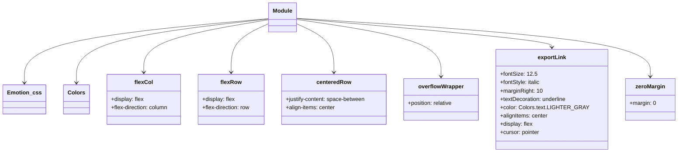

# Diagram: web/portal/src/pages/milestone/Milestone.Dashboard.styles.js

> Auto-generated by Obscura crawlers

## Mermaid

### SVG

<svg id="container" width="1923" xmlns="http://www.w3.org/2000/svg" class="classDiagram" height="438" viewBox="0 0 1923 438" role="graphics-document document" aria-roledescription="class"><g><defs><marker id="container_class-aggregationStart" class="marker aggregation class" refX="18" refY="7" markerWidth="190" markerHeight="240" orient="auto"><path d="M 18,7 L9,13 L1,7 L9,1 Z"></path></marker></defs><defs><marker id="container_class-aggregationEnd" class="marker aggregation class" refX="1" refY="7" markerWidth="20" markerHeight="28" orient="auto"><path d="M 18,7 L9,13 L1,7 L9,1 Z"></path></marker></defs><defs><marker id="container_class-extensionStart" class="marker extension class" refX="18" refY="7" markerWidth="190" markerHeight="240" orient="auto"><path d="M 1,7 L18,13 V 1 Z"></path></marker></defs><defs><marker id="container_class-extensionEnd" class="marker extension class" refX="1" refY="7" markerWidth="20" markerHeight="28" orient="auto"><path d="M 1,1 V 13 L18,7 Z"></path></marker></defs><defs><marker id="container_class-compositionStart" class="marker composition class" refX="18" refY="7" markerWidth="190" markerHeight="240" orient="auto"><path d="M 18,7 L9,13 L1,7 L9,1 Z"></path></marker></defs><defs><marker id="container_class-compositionEnd" class="marker composition class" refX="1" refY="7" markerWidth="20" markerHeight="28" orient="auto"><path d="M 18,7 L9,13 L1,7 L9,1 Z"></path></marker></defs><defs><marker id="container_class-dependencyStart" class="marker dependency class" refX="6" refY="7" markerWidth="190" markerHeight="240" orient="auto"><path d="M 5,7 L9,13 L1,7 L9,1 Z"></path></marker></defs><defs><marker id="container_class-dependencyEnd" class="marker dependency class" refX="13" refY="7" markerWidth="20" markerHeight="28" orient="auto"><path d="M 18,7 L9,13 L14,7 L9,1 Z"></path></marker></defs><defs><marker id="container_class-lollipopStart" class="marker lollipop class" refX="13" refY="7" markerWidth="190" markerHeight="240" orient="auto"><circle stroke="black" fill="transparent" cx="7" cy="7" r="6"></circle></marker></defs><defs><marker id="container_class-lollipopEnd" class="marker lollipop class" refX="1" refY="7" markerWidth="190" markerHeight="240" orient="auto"><circle stroke="black" fill="transparent" cx="7" cy="7" r="6"></circle></marker></defs><g class="root"><g class="clusters"></g><g class="edgePaths"><path d="M764.924,53.548L648.387,64.123C531.85,74.698,298.777,95.849,182.24,126.591C65.703,157.333,65.703,197.667,65.703,217.833L65.703,238" id="id_Module_Emotion_css_1" class="edge-thickness-normal edge-pattern-solid relation" style=";;;" data-edge="true" data-et="edge" data-id="id_Module_Emotion_css_1" data-points="W3sieCI6NzY0LjkyMzgyODEyNSwieSI6NTMuNTQ3NjQ5OTczNDEzOX0seyJ4Ijo2NS43MDMxMjUsInkiOjExN30seyJ4Ijo2NS43MDMxMjUsInkiOjI0NH1d" marker-end="url(#container_class-dependencyEnd)"></path><path d="M764.924,54.398L672.188,64.832C579.452,75.266,393.98,96.133,301.244,126.733C208.508,157.333,208.508,197.667,208.508,217.833L208.508,238" id="id_Module_Colors_2" class="edge-thickness-normal edge-pattern-solid relation" style=";;;" data-edge="true" data-et="edge" data-id="id_Module_Colors_2" data-points="W3sieCI6NzY0LjkyMzgyODEyNSwieSI6NTQuMzk4Mzg1MDQ5NTczNDd9LHsieCI6MjA4LjUwNzgxMjUsInkiOjExN30seyJ4IjoyMDguNTA3ODEyNSwieSI6MjQ0fV0=" marker-end="url(#container_class-dependencyEnd)"></path><path d="M764.924,56.503L704.31,66.586C643.697,76.669,522.469,96.834,461.856,122.084C401.242,147.333,401.242,177.667,401.242,192.833L401.242,208" id="id_Module_flexCol_3" class="edge-thickness-normal edge-pattern-solid relation" style=";;;" data-edge="true" data-et="edge" data-id="id_Module_flexCol_3" data-points="W3sieCI6NzY0LjkyMzgyODEyNSwieSI6NTYuNTAzMDgxNjQ1NDE5MjM2fSx7IngiOjQwMS4yNDIxODc1LCJ5IjoxMTd9LHsieCI6NDAxLjI0MjE4NzUsInkiOjIxNH1d" marker-end="url(#container_class-dependencyEnd)"></path><path d="M764.924,67.563L746.583,75.802C728.242,84.042,691.561,100.521,673.22,123.927C654.879,147.333,654.879,177.667,654.879,192.833L654.879,208" id="id_Module_flexRow_4" class="edge-thickness-normal edge-pattern-solid relation" style=";;;" data-edge="true" data-et="edge" data-id="id_Module_flexRow_4" data-points="W3sieCI6NzY0LjkyMzgyODEyNSwieSI6NjcuNTYyNzIzNDUxMDY2Njd9LHsieCI6NjU0Ljg3ODkwNjI1LCJ5IjoxMTd9LHsieCI6NjU0Ljg3ODkwNjI1LCJ5IjoyMTR9XQ==" marker-end="url(#container_class-dependencyEnd)"></path><path d="M843.111,67.563L861.452,75.802C879.793,84.042,916.475,100.521,934.815,123.927C953.156,147.333,953.156,177.667,953.156,192.833L953.156,208" id="id_Module_centeredRow_5" class="edge-thickness-normal edge-pattern-solid relation" style=";;;" data-edge="true" data-et="edge" data-id="id_Module_centeredRow_5" data-points="W3sieCI6ODQzLjExMTMyODEyNSwieSI6NjcuNTYyNzIzNDUxMDY2Njd9LHsieCI6OTUzLjE1NjI1LCJ5IjoxMTd9LHsieCI6OTUzLjE1NjI1LCJ5IjoyMTR9XQ==" marker-end="url(#container_class-dependencyEnd)"></path><path d="M843.111,55.691L913.3,65.909C983.488,76.128,1123.865,96.564,1194.054,123.949C1264.242,151.333,1264.242,185.667,1264.242,202.833L1264.242,220" id="id_Module_overflowWrapper_6" class="edge-thickness-normal edge-pattern-solid relation" style=";;;" data-edge="true" data-et="edge" data-id="id_Module_overflowWrapper_6" data-points="W3sieCI6ODQzLjExMTMyODEyNSwieSI6NTUuNjkxMzEwNzEzNjAzNjd9LHsieCI6MTI2NC4yNDIxODc1LCJ5IjoxMTd9LHsieCI6MTI2NC4yNDIxODc1LCJ5IjoyMjZ9XQ==" marker-end="url(#container_class-dependencyEnd)"></path><path d="M843.111,53.402L964.907,64.002C1086.702,74.602,1330.292,95.801,1452.088,109.567C1573.883,123.333,1573.883,129.667,1573.883,132.833L1573.883,136" id="id_Module_exportLink_7" class="edge-thickness-normal edge-pattern-solid relation" style=";;;" data-edge="true" data-et="edge" data-id="id_Module_exportLink_7" data-points="W3sieCI6ODQzLjExMTMyODEyNSwieSI6NTMuNDAyMjU5NDI1NDc3Nzd9LHsieCI6MTU3My44ODI4MTI1LCJ5IjoxMTd9LHsieCI6MTU3My44ODI4MTI1LCJ5IjoxNDJ9XQ==" marker-end="url(#container_class-dependencyEnd)"></path><path d="M843.111,52.517L1010.069,63.264C1177.026,74.011,1510.941,95.506,1677.898,123.419C1844.855,151.333,1844.855,185.667,1844.855,202.833L1844.855,220" id="id_Module_zeroMargin_8" class="edge-thickness-normal edge-pattern-solid relation" style=";;;" data-edge="true" data-et="edge" data-id="id_Module_zeroMargin_8" data-points="W3sieCI6ODQzLjExMTMyODEyNSwieSI6NTIuNTE2NTEyMjAwMDE5MTR9LHsieCI6MTg0NC44NTU0Njg3NSwieSI6MTE3fSx7IngiOjE4NDQuODU1NDY4NzUsInkiOjIyNn1d" marker-end="url(#container_class-dependencyEnd)"></path></g><g class="edgeLabels"><g class="edgeLabel"><g class="label" data-id="id_Module_Emotion_css_1" transform="translate(0, 0)"><foreignObject width="0" height="0">

</foreignObject></g></g><g class="edgeLabel"><g class="label" data-id="id_Module_Colors_2" transform="translate(0, 0)"><foreignObject width="0" height="0">

</foreignObject></g></g><g class="edgeLabel"><g class="label" data-id="id_Module_flexCol_3" transform="translate(0, 0)"><foreignObject width="0" height="0">

</foreignObject></g></g><g class="edgeLabel"><g class="label" data-id="id_Module_flexRow_4" transform="translate(0, 0)"><foreignObject width="0" height="0">

</foreignObject></g></g><g class="edgeLabel"><g class="label" data-id="id_Module_centeredRow_5" transform="translate(0, 0)"><foreignObject width="0" height="0">

</foreignObject></g></g><g class="edgeLabel"><g class="label" data-id="id_Module_overflowWrapper_6" transform="translate(0, 0)"><foreignObject width="0" height="0">

</foreignObject></g></g><g class="edgeLabel"><g class="label" data-id="id_Module_exportLink_7" transform="translate(0, 0)"><foreignObject width="0" height="0">

</foreignObject></g></g><g class="edgeLabel"><g class="label" data-id="id_Module_zeroMargin_8" transform="translate(0, 0)"><foreignObject width="0" height="0">

</foreignObject></g></g></g><g class="nodes"><g class="node default" id="classId-Module-0" transform="translate(804.017578125, 50)"><g class="basic label-container"><path d="M-39.09375 -42 L39.09375 -42 L39.09375 42 L-39.09375 42" stroke="none" stroke-width="0" fill="#ECECFF" style=""></path><path d="M-39.09375 -42 C-21.549617856642804 -42, -4.0054857132856085 -42, 39.09375 -42 M-39.09375 -42 C-20.655509316954838 -42, -2.2172686339096757 -42, 39.09375 -42 M39.09375 -42 C39.09375 -12.579351185235375, 39.09375 16.84129762952925, 39.09375 42 M39.09375 -42 C39.09375 -22.690991890348794, 39.09375 -3.3819837806975883, 39.09375 42 M39.09375 42 C11.829897253380459 42, -15.433955493239083 42, -39.09375 42 M39.09375 42 C9.803800236442996 42, -19.48614952711401 42, -39.09375 42 M-39.09375 42 C-39.09375 20.837161411155463, -39.09375 -0.325677177689073, -39.09375 -42 M-39.09375 42 C-39.09375 15.242948653058967, -39.09375 -11.514102693882066, -39.09375 -42" stroke="#9370DB" stroke-width="1.3" fill="none" stroke-dasharray="0 0" style=""></path></g><g class="annotation-group text" transform="translate(0, -18)"></g><g class="label-group text" transform="translate(-27.09375, -18)"><g class="label" style="font-weight: bolder" transform="translate(0,-12)"><foreignObject width="54.1875" height="24">

Module

</foreignObject></g></g><g class="members-group text" transform="translate(-27.09375, 30)"></g><g class="methods-group text" transform="translate(-27.09375, 60)"></g><g class="divider" style=""><path d="M-39.09375 6 C-19.274455568651046 6, 0.5448388626979082 6, 39.09375 6 M-39.09375 6 C-15.753610998185312 6, 7.586528003629375 6, 39.09375 6" stroke="#9370DB" stroke-width="1.3" fill="none" stroke-dasharray="0 0" style=""></path></g><g class="divider" style=""><path d="M-39.09375 24 C-19.433599792579514 24, 0.22655041484097183 24, 39.09375 24 M-39.09375 24 C-22.01332434182819 24, -4.932898683656383 24, 39.09375 24" stroke="#9370DB" stroke-width="1.3" fill="none" stroke-dasharray="0 0" style=""></path></g></g><g class="node default" id="classId-Emotion_css-1" transform="translate(65.703125, 286)"><g class="basic label-container"><path d="M-57.703125 -42 L57.703125 -42 L57.703125 42 L-57.703125 42" stroke="none" stroke-width="0" fill="#ECECFF" style=""></path><path d="M-57.703125 -42 C-17.176405159245014 -42, 23.35031468150997 -42, 57.703125 -42 M-57.703125 -42 C-17.085146411950006 -42, 23.532832176099987 -42, 57.703125 -42 M57.703125 -42 C57.703125 -14.991978530256574, 57.703125 12.016042939486852, 57.703125 42 M57.703125 -42 C57.703125 -9.684351594870812, 57.703125 22.631296810258377, 57.703125 42 M57.703125 42 C27.356777070836962 42, -2.9895708583260756 42, -57.703125 42 M57.703125 42 C21.1359400843631 42, -15.431244831273801 42, -57.703125 42 M-57.703125 42 C-57.703125 14.697010987437235, -57.703125 -12.60597802512553, -57.703125 -42 M-57.703125 42 C-57.703125 15.270911068716053, -57.703125 -11.458177862567894, -57.703125 -42" stroke="#9370DB" stroke-width="1.3" fill="none" stroke-dasharray="0 0" style=""></path></g><g class="annotation-group text" transform="translate(0, -18)"></g><g class="label-group text" transform="translate(-45.703125, -18)"><g class="label" style="font-weight: bolder" transform="translate(0,-12)"><foreignObject width="91.40625" height="24">

Emotion_css

</foreignObject></g></g><g class="members-group text" transform="translate(-45.703125, 30)"></g><g class="methods-group text" transform="translate(-45.703125, 60)"></g><g class="divider" style=""><path d="M-57.703125 6 C-27.500610036339424 6, 2.701904927321152 6, 57.703125 6 M-57.703125 6 C-31.547141959537946 6, -5.391158919075892 6, 57.703125 6" stroke="#9370DB" stroke-width="1.3" fill="none" stroke-dasharray="0 0" style=""></path></g><g class="divider" style=""><path d="M-57.703125 24 C-25.39067931922618 24, 6.92176636154764 24, 57.703125 24 M-57.703125 24 C-19.948011503323507 24, 17.807101993352987 24, 57.703125 24" stroke="#9370DB" stroke-width="1.3" fill="none" stroke-dasharray="0 0" style=""></path></g></g><g class="node default" id="classId-Colors-2" transform="translate(208.5078125, 286)"><g class="basic label-container"><path d="M-35.1015625 -42 L35.1015625 -42 L35.1015625 42 L-35.1015625 42" stroke="none" stroke-width="0" fill="#ECECFF" style=""></path><path d="M-35.1015625 -42 C-11.393240376766926 -42, 12.315081746466149 -42, 35.1015625 -42 M-35.1015625 -42 C-13.911545536184171 -42, 7.278471427631658 -42, 35.1015625 -42 M35.1015625 -42 C35.1015625 -14.946037109819745, 35.1015625 12.10792578036051, 35.1015625 42 M35.1015625 -42 C35.1015625 -16.297490801908076, 35.1015625 9.405018396183848, 35.1015625 42 M35.1015625 42 C11.111130878979115 42, -12.879300742041771 42, -35.1015625 42 M35.1015625 42 C17.79847512755727 42, 0.49538775511454247 42, -35.1015625 42 M-35.1015625 42 C-35.1015625 21.66568128239361, -35.1015625 1.33136256478722, -35.1015625 -42 M-35.1015625 42 C-35.1015625 20.899561036593163, -35.1015625 -0.2008779268136749, -35.1015625 -42" stroke="#9370DB" stroke-width="1.3" fill="none" stroke-dasharray="0 0" style=""></path></g><g class="annotation-group text" transform="translate(0, -18)"></g><g class="label-group text" transform="translate(-23.1015625, -18)"><g class="label" style="font-weight: bolder" transform="translate(0,-12)"><foreignObject width="46.203125" height="24">

Colors

</foreignObject></g></g><g class="members-group text" transform="translate(-23.1015625, 30)"></g><g class="methods-group text" transform="translate(-23.1015625, 60)"></g><g class="divider" style=""><path d="M-35.1015625 6 C-16.227294141897154 6, 2.6469742162056917 6, 35.1015625 6 M-35.1015625 6 C-19.901198534737947 6, -4.700834569475894 6, 35.1015625 6" stroke="#9370DB" stroke-width="1.3" fill="none" stroke-dasharray="0 0" style=""></path></g><g class="divider" style=""><path d="M-35.1015625 24 C-7.646710278171415 24, 19.80814194365717 24, 35.1015625 24 M-35.1015625 24 C-14.11339687106392 24, 6.874768757872161 24, 35.1015625 24" stroke="#9370DB" stroke-width="1.3" fill="none" stroke-dasharray="0 0" style=""></path></g></g><g class="node default" id="classId-flexCol-3" transform="translate(401.2421875, 286)"><g class="basic label-container"><path d="M-107.6328125 -72 L107.6328125 -72 L107.6328125 72 L-107.6328125 72" stroke="none" stroke-width="0" fill="#ECECFF" style=""></path><path d="M-107.6328125 -72 C-40.763063983038634 -72, 26.10668453392273 -72, 107.6328125 -72 M-107.6328125 -72 C-21.560972078966927 -72, 64.51086834206615 -72, 107.6328125 -72 M107.6328125 -72 C107.6328125 -23.68589149889224, 107.6328125 24.62821700221552, 107.6328125 72 M107.6328125 -72 C107.6328125 -25.803506373149197, 107.6328125 20.392987253701605, 107.6328125 72 M107.6328125 72 C26.83193065533625 72, -53.9689511893275 72, -107.6328125 72 M107.6328125 72 C37.15823353332324 72, -33.31634543335352 72, -107.6328125 72 M-107.6328125 72 C-107.6328125 29.6484270082614, -107.6328125 -12.7031459834772, -107.6328125 -72 M-107.6328125 72 C-107.6328125 38.37970927404636, -107.6328125 4.759418548092725, -107.6328125 -72" stroke="#9370DB" stroke-width="1.3" fill="none" stroke-dasharray="0 0" style=""></path></g><g class="annotation-group text" transform="translate(0, -48)"></g><g class="label-group text" transform="translate(-24.90625, -48)"><g class="label" style="font-weight: bolder" transform="translate(0,-12)"><foreignObject width="49.8125" height="24">

flexCol

</foreignObject></g></g><g class="members-group text" transform="translate(-95.6328125, 0)"><g class="label" style="" transform="translate(0,-12)"><foreignObject width="93.859375" height="24">

+display: flex

</foreignObject></g><g class="label" style="" transform="translate(0,12)"><foreignObject width="166.359375" height="24">

+flex-direction: column

</foreignObject></g></g><g class="methods-group text" transform="translate(-95.6328125, 72)"></g><g class="divider" style=""><path d="M-107.6328125 -24 C-25.47223627800186 -24, 56.68833994399628 -24, 107.6328125 -24 M-107.6328125 -24 C-26.356775975934838 -24, 54.919260548130325 -24, 107.6328125 -24" stroke="#9370DB" stroke-width="1.3" fill="none" stroke-dasharray="0 0" style=""></path></g><g class="divider" style=""><path d="M-107.6328125 48 C-51.70227988196061 48, 4.228252736078787 48, 107.6328125 48 M-107.6328125 48 C-56.94219435038041 48, -6.251576200760823 48, 107.6328125 48" stroke="#9370DB" stroke-width="1.3" fill="none" stroke-dasharray="0 0" style=""></path></g></g><g class="node default" id="classId-flexRow-4" transform="translate(654.87890625, 286)"><g class="basic label-container"><path d="M-96.00390625 -72 L96.00390625 -72 L96.00390625 72 L-96.00390625 72" stroke="none" stroke-width="0" fill="#ECECFF" style=""></path><path d="M-96.00390625 -72 C-44.81936735690506 -72, 6.365171536189877 -72, 96.00390625 -72 M-96.00390625 -72 C-41.94337910057458 -72, 12.117148048850837 -72, 96.00390625 -72 M96.00390625 -72 C96.00390625 -27.73561392901741, 96.00390625 16.528772141965177, 96.00390625 72 M96.00390625 -72 C96.00390625 -18.652943802970753, 96.00390625 34.69411239405849, 96.00390625 72 M96.00390625 72 C50.998085579968475 72, 5.992264909936949 72, -96.00390625 72 M96.00390625 72 C47.02637998805555 72, -1.9511462738888952 72, -96.00390625 72 M-96.00390625 72 C-96.00390625 35.05699940122597, -96.00390625 -1.8860011975480546, -96.00390625 -72 M-96.00390625 72 C-96.00390625 26.985690555848798, -96.00390625 -18.028618888302404, -96.00390625 -72" stroke="#9370DB" stroke-width="1.3" fill="none" stroke-dasharray="0 0" style=""></path></g><g class="annotation-group text" transform="translate(0, -48)"></g><g class="label-group text" transform="translate(-28.8984375, -48)"><g class="label" style="font-weight: bolder" transform="translate(0,-12)"><foreignObject width="57.796875" height="24">

flexRow

</foreignObject></g></g><g class="members-group text" transform="translate(-84.00390625, 0)"><g class="label" style="" transform="translate(0,-12)"><foreignObject width="93.859375" height="24">

+display: flex

</foreignObject></g><g class="label" style="" transform="translate(0,12)"><foreignObject width="139.109375" height="24">

+flex-direction: row

</foreignObject></g></g><g class="methods-group text" transform="translate(-84.00390625, 72)"></g><g class="divider" style=""><path d="M-96.00390625 -24 C-30.377629504864885 -24, 35.24864724027023 -24, 96.00390625 -24 M-96.00390625 -24 C-56.44699291461234 -24, -16.890079579224675 -24, 96.00390625 -24" stroke="#9370DB" stroke-width="1.3" fill="none" stroke-dasharray="0 0" style=""></path></g><g class="divider" style=""><path d="M-96.00390625 48 C-28.318303689063427 48, 39.367298871873146 48, 96.00390625 48 M-96.00390625 48 C-37.63937608094729 48, 20.725154088105427 48, 96.00390625 48" stroke="#9370DB" stroke-width="1.3" fill="none" stroke-dasharray="0 0" style=""></path></g></g><g class="node default" id="classId-centeredRow-5" transform="translate(953.15625, 286)"><g class="basic label-container"><path d="M-152.2734375 -72 L152.2734375 -72 L152.2734375 72 L-152.2734375 72" stroke="none" stroke-width="0" fill="#ECECFF" style=""></path><path d="M-152.2734375 -72 C-35.385951197515624 -72, 81.50153510496875 -72, 152.2734375 -72 M-152.2734375 -72 C-79.23829135573148 -72, -6.203145211462953 -72, 152.2734375 -72 M152.2734375 -72 C152.2734375 -30.034273953362117, 152.2734375 11.931452093275766, 152.2734375 72 M152.2734375 -72 C152.2734375 -21.846326716340847, 152.2734375 28.307346567318305, 152.2734375 72 M152.2734375 72 C36.19371792189001 72, -79.88600165621997 72, -152.2734375 72 M152.2734375 72 C71.38290054690341 72, -9.507636406193171 72, -152.2734375 72 M-152.2734375 72 C-152.2734375 20.132066589828383, -152.2734375 -31.735866820343233, -152.2734375 -72 M-152.2734375 72 C-152.2734375 26.669911508998716, -152.2734375 -18.660176982002568, -152.2734375 -72" stroke="#9370DB" stroke-width="1.3" fill="none" stroke-dasharray="0 0" style=""></path></g><g class="annotation-group text" transform="translate(0, -48)"></g><g class="label-group text" transform="translate(-47.734375, -48)"><g class="label" style="font-weight: bolder" transform="translate(0,-12)"><foreignObject width="95.46875" height="24">

centeredRow

</foreignObject></g></g><g class="members-group text" transform="translate(-140.2734375, 0)"><g class="label" style="" transform="translate(0,-12)"><foreignObject width="232.8125" height="24">

+justify-content: space-between

</foreignObject></g><g class="label" style="" transform="translate(0,12)"><foreignObject width="143.53125" height="24">

+align-items: center

</foreignObject></g></g><g class="methods-group text" transform="translate(-140.2734375, 72)"></g><g class="divider" style=""><path d="M-152.2734375 -24 C-48.69577708353951 -24, 54.88188333292098 -24, 152.2734375 -24 M-152.2734375 -24 C-48.43740361184054 -24, 55.398630276318926 -24, 152.2734375 -24" stroke="#9370DB" stroke-width="1.3" fill="none" stroke-dasharray="0 0" style=""></path></g><g class="divider" style=""><path d="M-152.2734375 48 C-62.70708711982829 48, 26.859263260343425 48, 152.2734375 48 M-152.2734375 48 C-50.83915148014495 48, 50.5951345397101 48, 152.2734375 48" stroke="#9370DB" stroke-width="1.3" fill="none" stroke-dasharray="0 0" style=""></path></g></g><g class="node default" id="classId-overflowWrapper-6" transform="translate(1264.2421875, 286)"><g class="basic label-container"><path d="M-108.8125 -60 L108.8125 -60 L108.8125 60 L-108.8125 60" stroke="none" stroke-width="0" fill="#ECECFF" style=""></path><path d="M-108.8125 -60 C-59.82389852057459 -60, -10.835297041149175 -60, 108.8125 -60 M-108.8125 -60 C-41.77427477712736 -60, 25.26395044574528 -60, 108.8125 -60 M108.8125 -60 C108.8125 -34.1743748249052, 108.8125 -8.348749649810408, 108.8125 60 M108.8125 -60 C108.8125 -13.678295169237053, 108.8125 32.643409661525894, 108.8125 60 M108.8125 60 C57.72842687172366 60, 6.644353743447326 60, -108.8125 60 M108.8125 60 C63.82445703135306 60, 18.836414062706126 60, -108.8125 60 M-108.8125 60 C-108.8125 15.20241975683718, -108.8125 -29.59516048632564, -108.8125 -60 M-108.8125 60 C-108.8125 18.0119710332565, -108.8125 -23.976057933487, -108.8125 -60" stroke="#9370DB" stroke-width="1.3" fill="none" stroke-dasharray="0 0" style=""></path></g><g class="annotation-group text" transform="translate(0, -36)"></g><g class="label-group text" transform="translate(-63.171875, -36)"><g class="label" style="font-weight: bolder" transform="translate(0,-12)"><foreignObject width="126.34375" height="24">

overflowWrapper

</foreignObject></g></g><g class="members-group text" transform="translate(-96.8125, 12)"><g class="label" style="" transform="translate(0,-12)"><foreignObject width="130.453125" height="24">

+position: relative

</foreignObject></g></g><g class="methods-group text" transform="translate(-96.8125, 60)"></g><g class="divider" style=""><path d="M-108.8125 -12 C-55.57461479762681 -12, -2.3367295952536153 -12, 108.8125 -12 M-108.8125 -12 C-28.777941376923366 -12, 51.25661724615327 -12, 108.8125 -12" stroke="#9370DB" stroke-width="1.3" fill="none" stroke-dasharray="0 0" style=""></path></g><g class="divider" style=""><path d="M-108.8125 36 C-22.261611001510474 36, 64.28927799697905 36, 108.8125 36 M-108.8125 36 C-61.724775485664495 36, -14.63705097132899 36, 108.8125 36" stroke="#9370DB" stroke-width="1.3" fill="none" stroke-dasharray="0 0" style=""></path></g></g><g class="node default" id="classId-exportLink-7" transform="translate(1573.8828125, 286)"><g class="basic label-container"><path d="M-150.828125 -144 L150.828125 -144 L150.828125 144 L-150.828125 144" stroke="none" stroke-width="0" fill="#ECECFF" style=""></path><path d="M-150.828125 -144 C-84.24772587518376 -144, -17.667326750367522 -144, 150.828125 -144 M-150.828125 -144 C-42.29469912686581 -144, 66.23872674626838 -144, 150.828125 -144 M150.828125 -144 C150.828125 -64.26528074363989, 150.828125 15.469438512720217, 150.828125 144 M150.828125 -144 C150.828125 -46.473020394512645, 150.828125 51.05395921097471, 150.828125 144 M150.828125 144 C41.97754502951608 144, -66.87303494096784 144, -150.828125 144 M150.828125 144 C36.26822975094413 144, -78.29166549811174 144, -150.828125 144 M-150.828125 144 C-150.828125 42.978307270456014, -150.828125 -58.04338545908797, -150.828125 -144 M-150.828125 144 C-150.828125 35.57052017434043, -150.828125 -72.85895965131914, -150.828125 -144" stroke="#9370DB" stroke-width="1.3" fill="none" stroke-dasharray="0 0" style=""></path></g><g class="annotation-group text" transform="translate(0, -120)"></g><g class="label-group text" transform="translate(-39.546875, -120)"><g class="label" style="font-weight: bolder" transform="translate(0,-12)"><foreignObject width="79.09375" height="24">

exportLink

</foreignObject></g></g><g class="members-group text" transform="translate(-138.828125, -72)"><g class="label" style="" transform="translate(0,-12)"><foreignObject width="101.21875" height="24">

+fontSize: 12.5

</foreignObject></g><g class="label" style="" transform="translate(0,12)"><foreignObject width="116.71875" height="24">

+fontStyle: italic

</foreignObject></g><g class="label" style="" transform="translate(0,36)"><foreignObject width="120.21875" height="24">

+marginRight: 10

</foreignObject></g><g class="label" style="" transform="translate(0,60)"><foreignObject width="193.109375" height="24">

+textDecoration: underline

</foreignObject></g><g class="label" style="" transform="translate(0,84)"><foreignObject width="238.109375" height="24">

+color: Colors.text.LIGHTER_GRAY

</foreignObject></g><g class="label" style="" transform="translate(0,108)"><foreignObject width="137.28125" height="24">

+alignItems: center

</foreignObject></g><g class="label" style="" transform="translate(0,132)"><foreignObject width="93.859375" height="24">

+display: flex

</foreignObject></g><g class="label" style="" transform="translate(0,156)"><foreignObject width="115.125" height="24">

+cursor: pointer

</foreignObject></g></g><g class="methods-group text" transform="translate(-138.828125, 144)"></g><g class="divider" style=""><path d="M-150.828125 -96 C-87.98684425792999 -96, -25.145563515859962 -96, 150.828125 -96 M-150.828125 -96 C-90.32410124402584 -96, -29.82007748805168 -96, 150.828125 -96" stroke="#9370DB" stroke-width="1.3" fill="none" stroke-dasharray="0 0" style=""></path></g><g class="divider" style=""><path d="M-150.828125 120 C-43.22902692530525 120, 64.3700711493895 120, 150.828125 120 M-150.828125 120 C-56.989318689205135 120, 36.84948762158973 120, 150.828125 120" stroke="#9370DB" stroke-width="1.3" fill="none" stroke-dasharray="0 0" style=""></path></g></g><g class="node default" id="classId-zeroMargin-8" transform="translate(1844.85546875, 286)"><g class="basic label-container"><path d="M-70.14453125 -60 L70.14453125 -60 L70.14453125 60 L-70.14453125 60" stroke="none" stroke-width="0" fill="#ECECFF" style=""></path><path d="M-70.14453125 -60 C-28.665845385486243 -60, 12.812840479027514 -60, 70.14453125 -60 M-70.14453125 -60 C-14.316511191559556 -60, 41.51150886688089 -60, 70.14453125 -60 M70.14453125 -60 C70.14453125 -23.250552259410654, 70.14453125 13.498895481178693, 70.14453125 60 M70.14453125 -60 C70.14453125 -17.250246944223598, 70.14453125 25.499506111552805, 70.14453125 60 M70.14453125 60 C23.707416159005703 60, -22.729698931988594 60, -70.14453125 60 M70.14453125 60 C33.86347997044911 60, -2.417571309101774 60, -70.14453125 60 M-70.14453125 60 C-70.14453125 13.503969055470442, -70.14453125 -32.992061889059116, -70.14453125 -60 M-70.14453125 60 C-70.14453125 34.80149415991835, -70.14453125 9.60298831983669, -70.14453125 -60" stroke="#9370DB" stroke-width="1.3" fill="none" stroke-dasharray="0 0" style=""></path></g><g class="annotation-group text" transform="translate(0, -36)"></g><g class="label-group text" transform="translate(-40.7265625, -36)"><g class="label" style="font-weight: bolder" transform="translate(0,-12)"><foreignObject width="81.453125" height="24">

zeroMargin

</foreignObject></g></g><g class="members-group text" transform="translate(-58.14453125, 12)"><g class="label" style="" transform="translate(0,-12)"><foreignObject width="75.5625" height="24">

+margin: 0

</foreignObject></g></g><g class="methods-group text" transform="translate(-58.14453125, 60)"></g><g class="divider" style=""><path d="M-70.14453125 -12 C-17.53291055849953 -12, 35.07871013300094 -12, 70.14453125 -12 M-70.14453125 -12 C-38.17856145584548 -12, -6.212591661690972 -12, 70.14453125 -12" stroke="#9370DB" stroke-width="1.3" fill="none" stroke-dasharray="0 0" style=""></path></g><g class="divider" style=""><path d="M-70.14453125 36 C-39.6262480940498 36, -9.107964938099599 36, 70.14453125 36 M-70.14453125 36 C-15.906087602751057 36, 38.332356044497885 36, 70.14453125 36" stroke="#9370DB" stroke-width="1.3" fill="none" stroke-dasharray="0 0" style=""></path></g></g></g></g></g></svg>
