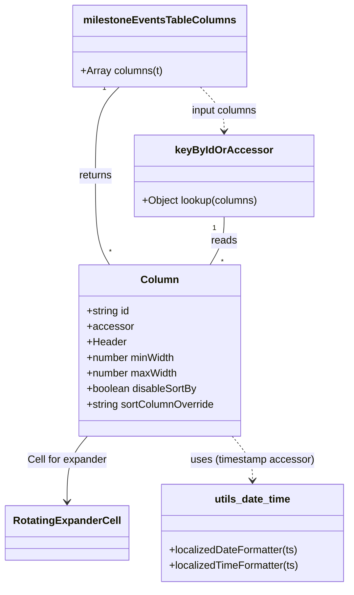

# Diagram: web/portal/src/pages/milestone/components/MilestoneEventsTable.columns.js


> Auto-generated by Obscura crawlers

## Diagram 1



### SVG

<svg id="container" width="532.046875" xmlns="http://www.w3.org/2000/svg" class="classDiagram" height="904" viewBox="0 0 532.046875 904" role="graphics-document document" aria-roledescription="class"><style>#container{font-family:"trebuchet ms",verdana,arial,sans-serif;font-size:16px;fill:#333;}@keyframes edge-animation-frame{from{stroke-dashoffset:0;}}@keyframes dash{to{stroke-dashoffset:0;}}#container .edge-animation-slow{stroke-dasharray:9,5!important;stroke-dashoffset:900;animation:dash 50s linear infinite;stroke-linecap:round;}#container .edge-animation-fast{stroke-dasharray:9,5!important;stroke-dashoffset:900;animation:dash 20s linear infinite;stroke-linecap:round;}#container .error-icon{fill:#552222;}#container .error-text{fill:#552222;stroke:#552222;}#container .edge-thickness-normal{stroke-width:1px;}#container .edge-thickness-thick{stroke-width:3.5px;}#container .edge-pattern-solid{stroke-dasharray:0;}#container .edge-thickness-invisible{stroke-width:0;fill:none;}#container .edge-pattern-dashed{stroke-dasharray:3;}#container .edge-pattern-dotted{stroke-dasharray:2;}#container .marker{fill:#333333;stroke:#333333;}#container .marker.cross{stroke:#333333;}#container svg{font-family:"trebuchet ms",verdana,arial,sans-serif;font-size:16px;}#container p{margin:0;}#container g.classGroup text{fill:#9370DB;stroke:none;font-family:"trebuchet ms",verdana,arial,sans-serif;font-size:10px;}#container g.classGroup text .title{font-weight:bolder;}#container .nodeLabel,#container .edgeLabel{color:#131300;}#container .edgeLabel .label rect{fill:#ECECFF;}#container .label text{fill:#131300;}#container .labelBkg{background:#ECECFF;}#container .edgeLabel .label span{background:#ECECFF;}#container .classTitle{font-weight:bolder;}#container .node rect,#container .node circle,#container .node ellipse,#container .node polygon,#container .node path{fill:#ECECFF;stroke:#9370DB;stroke-width:1px;}#container .divider{stroke:#9370DB;stroke-width:1;}#container g.clickable{cursor:pointer;}#container g.classGroup rect{fill:#ECECFF;stroke:#9370DB;}#container g.classGroup line{stroke:#9370DB;stroke-width:1;}#container .classLabel .box{stroke:none;stroke-width:0;fill:#ECECFF;opacity:0.5;}#container .classLabel .label{fill:#9370DB;font-size:10px;}#container .relation{stroke:#333333;stroke-width:1;fill:none;}#container .dashed-line{stroke-dasharray:3;}#container .dotted-line{stroke-dasharray:1 2;}#container #compositionStart,#container .composition{fill:#333333!important;stroke:#333333!important;stroke-width:1;}#container #compositionEnd,#container .composition{fill:#333333!important;stroke:#333333!important;stroke-width:1;}#container #dependencyStart,#container .dependency{fill:#333333!important;stroke:#333333!important;stroke-width:1;}#container #dependencyStart,#container .dependency{fill:#333333!important;stroke:#333333!important;stroke-width:1;}#container #extensionStart,#container .extension{fill:transparent!important;stroke:#333333!important;stroke-width:1;}#container #extensionEnd,#container .extension{fill:transparent!important;stroke:#333333!important;stroke-width:1;}#container #aggregationStart,#container .aggregation{fill:transparent!important;stroke:#333333!important;stroke-width:1;}#container #aggregationEnd,#container .aggregation{fill:transparent!important;stroke:#333333!important;stroke-width:1;}#container #lollipopStart,#container .lollipop{fill:#ECECFF!important;stroke:#333333!important;stroke-width:1;}#container #lollipopEnd,#container .lollipop{fill:#ECECFF!important;stroke:#333333!important;stroke-width:1;}#container .edgeTerminals{font-size:11px;line-height:initial;}#container .classTitleText{text-anchor:middle;font-size:18px;fill:#333;}#container .label-icon{display:inline-block;height:1em;overflow:visible;vertical-align:-0.125em;}#container .node .label-icon path{fill:currentColor;stroke:revert;stroke-width:revert;}#container :root{--mermaid-font-family:"trebuchet ms",verdana,arial,sans-serif;}</style><g><defs><marker id="container_class-aggregationStart" class="marker aggregation class" refX="18" refY="7" markerWidth="190" markerHeight="240" orient="auto"><path d="M 18,7 L9,13 L1,7 L9,1 Z"></path></marker></defs><defs><marker id="container_class-aggregationEnd" class="marker aggregation class" refX="1" refY="7" markerWidth="20" markerHeight="28" orient="auto"><path d="M 18,7 L9,13 L1,7 L9,1 Z"></path></marker></defs><defs><marker id="container_class-extensionStart" class="marker extension class" refX="18" refY="7" markerWidth="190" markerHeight="240" orient="auto"><path d="M 1,7 L18,13 V 1 Z"></path></marker></defs><defs><marker id="container_class-extensionEnd" class="marker extension class" refX="1" refY="7" markerWidth="20" markerHeight="28" orient="auto"><path d="M 1,1 V 13 L18,7 Z"></path></marker></defs><defs><marker id="container_class-compositionStart" class="marker composition class" refX="18" refY="7" markerWidth="190" markerHeight="240" orient="auto"><path d="M 18,7 L9,13 L1,7 L9,1 Z"></path></marker></defs><defs><marker id="container_class-compositionEnd" class="marker composition class" refX="1" refY="7" markerWidth="20" markerHeight="28" orient="auto"><path d="M 18,7 L9,13 L1,7 L9,1 Z"></path></marker></defs><defs><marker id="container_class-dependencyStart" class="marker dependency class" refX="6" refY="7" markerWidth="190" markerHeight="240" orient="auto"><path d="M 5,7 L9,13 L1,7 L9,1 Z"></path></marker></defs><defs><marker id="container_class-dependencyEnd" class="marker dependency class" refX="13" refY="7" markerWidth="20" markerHeight="28" orient="auto"><path d="M 18,7 L9,13 L14,7 L9,1 Z"></path></marker></defs><defs><marker id="container_class-lollipopStart" class="marker lollipop class" refX="13" refY="7" markerWidth="190" markerHeight="240" orient="auto"><circle stroke="black" fill="transparent" cx="7" cy="7" r="6"></circle></marker></defs><defs><marker id="container_class-lollipopEnd" class="marker lollipop class" refX="1" refY="7" markerWidth="190" markerHeight="240" orient="auto"><circle stroke="black" fill="transparent" cx="7" cy="7" r="6"></circle></marker></defs><g class="root"><g class="clusters"></g><g class="edgePaths"><path d="M178.162,134L172.034,140.167C165.905,146.333,153.647,158.667,147.518,181.5C141.389,204.333,141.389,237.667,141.389,271C141.389,304.333,141.389,337.667,145.015,360.5C148.642,383.333,155.895,395.667,159.522,401.833L163.148,408" id="id_milestoneEventsTableColumns_Column_1" class="edge-thickness-normal edge-pattern-solid relation" style=";;;" data-edge="true" data-et="edge" data-id="id_milestoneEventsTableColumns_Column_1" data-points="W3sieCI6MTc4LjE2MjQ4MDQ2ODc1LCJ5IjoxMzR9LHsieCI6MTQxLjM4ODY3MTg3NSwieSI6MTcxfSx7IngiOjE0MS4zODg2NzE4NzUsInkiOjI3MX0seyJ4IjoxNDEuMzg4NjcxODc1LCJ5IjozNzF9LHsieCI6MTYzLjE0ODMyMTkzMDQ3MzM3LCJ5Ijo0MDh9XQ=="></path><path d="M130.247,672L125.084,678.167C119.92,684.333,109.593,696.667,104.429,713.5C99.266,730.333,99.266,751.667,99.266,762.333L99.266,773" id="id_Column_RotatingExpanderCell_2" class="edge-thickness-normal edge-pattern-solid relation" style=";;;" data-edge="true" data-et="edge" data-id="id_Column_RotatingExpanderCell_2" data-points="W3sieCI6MTMwLjI0NzQ4MDU4NDMxOTUzLCJ5Ijo2NzJ9LHsieCI6OTkuMjY1NjI1LCJ5Ijo3MDl9LHsieCI6OTkuMjY1NjI1LCJ5Ijo3Nzl9XQ==" marker-end="url(#container_class-dependencyEnd)"></path><path d="M351.307,672L356.471,678.167C361.634,684.333,371.962,696.667,377.125,708C382.289,719.333,382.289,729.667,382.289,734.833L382.289,740" id="id_Column_utils_date_time_3" class="edge-thickness-normal edge-pattern-dashed relation" style=";;;" data-edge="true" data-et="edge" data-id="id_Column_utils_date_time_3" data-points="W3sieCI6MzUxLjMwNzIwNjkxNTY4MDQ3LCJ5Ijo2NzJ9LHsieCI6MzgyLjI4OTA2MjUsInkiOjcwOX0seyJ4IjozODIuMjg5MDYyNSwieSI6NzQ2fV0=" marker-end="url(#container_class-dependencyEnd)"></path><path d="M340.166,334L340.166,340.167C340.166,346.333,340.166,358.667,336.539,371C332.913,383.333,325.66,395.667,322.033,401.833L318.406,408" id="id_keyByIdOrAccessor_Column_4" class="edge-thickness-normal edge-pattern-solid relation" style=";;;" data-edge="true" data-et="edge" data-id="id_keyByIdOrAccessor_Column_4" data-points="W3sieCI6MzQwLjE2NjAxNTYyNSwieSI6MzM0fSx7IngiOjM0MC4xNjYwMTU2MjUsInkiOjM3MX0seyJ4IjozMTguNDA2MzY1NTY5NTI2NjYsInkiOjQwOH1d"></path><path d="M303.392,134L309.521,140.167C315.65,146.333,327.908,158.667,334.037,170C340.166,181.333,340.166,191.667,340.166,196.833L340.166,202" id="id_milestoneEventsTableColumns_keyByIdOrAccessor_5" class="edge-thickness-normal edge-pattern-dashed relation" style=";;;" data-edge="true" data-et="edge" data-id="id_milestoneEventsTableColumns_keyByIdOrAccessor_5" data-points="W3sieCI6MzAzLjM5MjIwNzAzMTI1LCJ5IjoxMzR9LHsieCI6MzQwLjE2NjAxNTYyNSwieSI6MTcxfSx7IngiOjM0MC4xNjYwMTU2MjUsInkiOjIwOH1d" marker-end="url(#container_class-dependencyEnd)"></path></g><g class="edgeLabels"><g class="edgeLabel" transform="translate(141.388671875, 271)"><g class="label" data-id="id_milestoneEventsTableColumns_Column_1" transform="translate(-26.265625, -12)"><foreignObject width="52.53125" height="24"><div xmlns="http://www.w3.org/1999/xhtml" class="labelBkg" style="display: table-cell; white-space: nowrap; line-height: 1.5; max-width: 200px; text-align: center;"><span class="edgeLabel"><p>returns</p></span></div></foreignObject></g></g><g class="edgeLabel" transform="translate(99.265625, 709)"><g class="label" data-id="id_Column_RotatingExpanderCell_2" transform="translate(-62.0859375, -12)"><foreignObject width="124.171875" height="24"><div xmlns="http://www.w3.org/1999/xhtml" class="labelBkg" style="display: table-cell; white-space: nowrap; line-height: 1.5; max-width: 200px; text-align: center;"><span class="edgeLabel"><p>Cell for expander</p></span></div></foreignObject></g></g><g class="edgeLabel" transform="translate(382.2890625, 709)"><g class="label" data-id="id_Column_utils_date_time_3" transform="translate(-95.9921875, -12)"><foreignObject width="191.984375" height="24"><div xmlns="http://www.w3.org/1999/xhtml" class="labelBkg" style="display: table-cell; white-space: nowrap; line-height: 1.5; max-width: 200px; text-align: center;"><span class="edgeLabel"><p>uses (timestamp accessor)</p></span></div></foreignObject></g></g><g class="edgeLabel" transform="translate(340.166015625, 371)"><g class="label" data-id="id_keyByIdOrAccessor_Column_4" transform="translate(-20.0078125, -12)"><foreignObject width="40.015625" height="24"><div xmlns="http://www.w3.org/1999/xhtml" class="labelBkg" style="display: table-cell; white-space: nowrap; line-height: 1.5; max-width: 200px; text-align: center;"><span class="edgeLabel"><p>reads</p></span></div></foreignObject></g></g><g class="edgeLabel" transform="translate(340.166015625, 171)"><g class="label" data-id="id_milestoneEventsTableColumns_keyByIdOrAccessor_5" transform="translate(-51.9765625, -12)"><foreignObject width="103.953125" height="24"><div xmlns="http://www.w3.org/1999/xhtml" class="labelBkg" style="display: table-cell; white-space: nowrap; line-height: 1.5; max-width: 200px; text-align: center;"><span class="edgeLabel"><p>input columns</p></span></div></foreignObject></g></g><g class="edgeTerminals" transform="translate(155.18703846921065, 135.8382180360005)"><g class="inner" transform="translate(0, 0)"><foreignObject style="width: 9px; height: 12px;"><div xmlns="http://www.w3.org/1999/xhtml" style="display: inline-block; padding-right: 1px; white-space: nowrap;"><span class="edgeLabel">1</span></div></foreignObject></g></g><g class="edgeTerminals" transform="translate(325.1660178125001, 351.500001875)"><g class="inner" transform="translate(0, 0)"><foreignObject style="width: 9px; height: 12px;"><div xmlns="http://www.w3.org/1999/xhtml" style="display: inline-block; padding-right: 1px; white-space: nowrap;"><span class="edgeLabel">1</span></div></foreignObject></g></g><g class="edgeTerminals" transform="translate(162.20678629467398, 380.3112608275545)"><g class="inner" transform="translate(0, 0)"></g><foreignObject style="width: 9px; height: 12px;"><div xmlns="http://www.w3.org/1999/xhtml" style="display: inline-block; padding-right: 1px; white-space: nowrap;"><span class="edgeLabel">*</span></div></foreignObject></g><g class="edgeTerminals" transform="translate(335.20747264601994, 395.51923996853753)"><g class="inner" transform="translate(0, 0)"></g><foreignObject style="width: 9px; height: 12px;"><div xmlns="http://www.w3.org/1999/xhtml" style="display: inline-block; padding-right: 1px; white-space: nowrap;"><span class="edgeLabel">*</span></div></foreignObject></g></g><g class="nodes"><g class="node default" id="classId-milestoneEventsTableColumns-0" transform="translate(240.77734375, 71)"><g class="basic label-container"><path d="M-131.12109375 -63 L131.12109375 -63 L131.12109375 63 L-131.12109375 63" stroke="none" stroke-width="0" fill="#ECECFF" style=""></path><path d="M-131.12109375 -63 C-65.40872434424237 -63, 0.3036450615152546 -63, 131.12109375 -63 M-131.12109375 -63 C-78.39242737630278 -63, -25.663761002605554 -63, 131.12109375 -63 M131.12109375 -63 C131.12109375 -21.14845308486192, 131.12109375 20.70309383027616, 131.12109375 63 M131.12109375 -63 C131.12109375 -12.764399636472312, 131.12109375 37.471200727055376, 131.12109375 63 M131.12109375 63 C33.986298755937156 63, -63.14849623812569 63, -131.12109375 63 M131.12109375 63 C67.59231319404437 63, 4.063532638088731 63, -131.12109375 63 M-131.12109375 63 C-131.12109375 33.74949832875569, -131.12109375 4.498996657511377, -131.12109375 -63 M-131.12109375 63 C-131.12109375 32.22266801895411, -131.12109375 1.4453360379082127, -131.12109375 -63" stroke="#9370DB" stroke-width="1.3" fill="none" stroke-dasharray="0 0" style=""></path></g><g class="annotation-group text" transform="translate(0, -39)"></g><g class="label-group text" transform="translate(-111.4921875, -39)"><g class="label" style="font-weight: bolder" transform="translate(0,-12)"><foreignObject width="222.984375" height="24"><div xmlns="http://www.w3.org/1999/xhtml" style="display: table-cell; white-space: nowrap; line-height: 1.5; max-width: 271px; text-align: center;"><span class="nodeLabel markdown-node-label" style=""><p>milestoneEventsTableColumns</p></span></div></foreignObject></g></g><g class="members-group text" transform="translate(-119.12109375, 9)"></g><g class="methods-group text" transform="translate(-119.12109375, 39)"><g class="label" style="" transform="translate(0,-12)"><foreignObject width="126.75" height="24"><div xmlns="http://www.w3.org/1999/xhtml" style="display: table-cell; white-space: nowrap; line-height: 1.5; max-width: 184px; text-align: center;"><span class="nodeLabel markdown-node-label" style=""><p>+Array columns(t)</p></span></div></foreignObject></g></g><g class="divider" style=""><path d="M-131.12109375 -15 C-64.8861049205823 -15, 1.348883908835404 -15, 131.12109375 -15 M-131.12109375 -15 C-71.58872085678642 -15, -12.056347963572847 -15, 131.12109375 -15" stroke="#9370DB" stroke-width="1.3" fill="none" stroke-dasharray="0 0" style=""></path></g><g class="divider" style=""><path d="M-131.12109375 9 C-67.77415917004531 9, -4.427224590090617 9, 131.12109375 9 M-131.12109375 9 C-34.193125312371706 9, 62.73484312525659 9, 131.12109375 9" stroke="#9370DB" stroke-width="1.3" fill="none" stroke-dasharray="0 0" style=""></path></g></g><g class="node default" id="classId-Column-1" transform="translate(240.77734375, 540)"><g class="basic label-container"><path d="M-125.94921875 -132 L125.94921875 -132 L125.94921875 132 L-125.94921875 132" stroke="none" stroke-width="0" fill="#ECECFF" style=""></path><path d="M-125.94921875 -132 C-65.52107906276228 -132, -5.09293937552458 -132, 125.94921875 -132 M-125.94921875 -132 C-60.01666748766418 -132, 5.9158837746716415 -132, 125.94921875 -132 M125.94921875 -132 C125.94921875 -27.664244507849375, 125.94921875 76.67151098430125, 125.94921875 132 M125.94921875 -132 C125.94921875 -39.75179727948104, 125.94921875 52.49640544103792, 125.94921875 132 M125.94921875 132 C43.98773117545794 132, -37.973756399084124 132, -125.94921875 132 M125.94921875 132 C69.25277015891722 132, 12.55632156783443 132, -125.94921875 132 M-125.94921875 132 C-125.94921875 26.621919442055315, -125.94921875 -78.75616111588937, -125.94921875 -132 M-125.94921875 132 C-125.94921875 53.438331357709274, -125.94921875 -25.123337284581453, -125.94921875 -132" stroke="#9370DB" stroke-width="1.3" fill="none" stroke-dasharray="0 0" style=""></path></g><g class="annotation-group text" transform="translate(0, -108)"></g><g class="label-group text" transform="translate(-27.4453125, -108)"><g class="label" style="font-weight: bolder" transform="translate(0,-12)"><foreignObject width="54.890625" height="24"><div xmlns="http://www.w3.org/1999/xhtml" style="display: table-cell; white-space: nowrap; line-height: 1.5; max-width: 105px; text-align: center;"><span class="nodeLabel markdown-node-label" style=""><p>Column</p></span></div></foreignObject></g></g><g class="members-group text" transform="translate(-113.94921875, -60)"><g class="label" style="" transform="translate(0,-12)"><foreignObject width="67.9375" height="24"><div xmlns="http://www.w3.org/1999/xhtml" style="display: table-cell; white-space: nowrap; line-height: 1.5; max-width: 125px; text-align: center;"><span class="nodeLabel markdown-node-label" style=""><p>+string id</p></span></div></foreignObject></g><g class="label" style="" transform="translate(0,12)"><foreignObject width="70.140625" height="24"><div xmlns="http://www.w3.org/1999/xhtml" style="display: table-cell; white-space: nowrap; line-height: 1.5; max-width: 128px; text-align: center;"><span class="nodeLabel markdown-node-label" style=""><p>+accessor</p></span></div></foreignObject></g><g class="label" style="" transform="translate(0,36)"><foreignObject width="60.59375" height="24"><div xmlns="http://www.w3.org/1999/xhtml" style="display: table-cell; white-space: nowrap; line-height: 1.5; max-width: 119px; text-align: center;"><span class="nodeLabel markdown-node-label" style=""><p>+Header</p></span></div></foreignObject></g><g class="label" style="" transform="translate(0,60)"><foreignObject width="139.078125" height="24"><div xmlns="http://www.w3.org/1999/xhtml" style="display: table-cell; white-space: nowrap; line-height: 1.5; max-width: 196px; text-align: center;"><span class="nodeLabel markdown-node-label" style=""><p>+number minWidth</p></span></div></foreignObject></g><g class="label" style="" transform="translate(0,84)"><foreignObject width="141.65625" height="24"><div xmlns="http://www.w3.org/1999/xhtml" style="display: table-cell; white-space: nowrap; line-height: 1.5; max-width: 199px; text-align: center;"><span class="nodeLabel markdown-node-label" style=""><p>+number maxWidth</p></span></div></foreignObject></g><g class="label" style="" transform="translate(0,108)"><foreignObject width="172.21875" height="24"><div xmlns="http://www.w3.org/1999/xhtml" style="display: table-cell; white-space: nowrap; line-height: 1.5; max-width: 230px; text-align: center;"><span class="nodeLabel markdown-node-label" style=""><p>+boolean disableSortBy</p></span></div></foreignObject></g><g class="label" style="" transform="translate(0,132)"><foreignObject width="200.453125" height="24"><div xmlns="http://www.w3.org/1999/xhtml" style="display: table-cell; white-space: nowrap; line-height: 1.5; max-width: 258px; text-align: center;"><span class="nodeLabel markdown-node-label" style=""><p>+string sortColumnOverride</p></span></div></foreignObject></g></g><g class="methods-group text" transform="translate(-113.94921875, 132)"></g><g class="divider" style=""><path d="M-125.94921875 -84 C-52.457822664401135 -84, 21.03357342119773 -84, 125.94921875 -84 M-125.94921875 -84 C-34.303227321026554 -84, 57.34276410794689 -84, 125.94921875 -84" stroke="#9370DB" stroke-width="1.3" fill="none" stroke-dasharray="0 0" style=""></path></g><g class="divider" style=""><path d="M-125.94921875 108 C-25.57745761338724 108, 74.79430352322552 108, 125.94921875 108 M-125.94921875 108 C-27.242684186821904 108, 71.46385037635619 108, 125.94921875 108" stroke="#9370DB" stroke-width="1.3" fill="none" stroke-dasharray="0 0" style=""></path></g></g><g class="node default" id="classId-RotatingExpanderCell-2" transform="translate(99.265625, 821)"><g class="basic label-container"><path d="M-91.265625 -42 L91.265625 -42 L91.265625 42 L-91.265625 42" stroke="none" stroke-width="0" fill="#ECECFF" style=""></path><path d="M-91.265625 -42 C-26.513066383780142 -42, 38.239492232439716 -42, 91.265625 -42 M-91.265625 -42 C-26.543993410355796 -42, 38.17763817928841 -42, 91.265625 -42 M91.265625 -42 C91.265625 -12.169078480684174, 91.265625 17.661843038631652, 91.265625 42 M91.265625 -42 C91.265625 -13.75624334633267, 91.265625 14.487513307334659, 91.265625 42 M91.265625 42 C41.74224733946542 42, -7.781130321069156 42, -91.265625 42 M91.265625 42 C46.196893101038235 42, 1.1281612020764697 42, -91.265625 42 M-91.265625 42 C-91.265625 19.21323841948542, -91.265625 -3.573523161029158, -91.265625 -42 M-91.265625 42 C-91.265625 18.492996511423286, -91.265625 -5.014006977153429, -91.265625 -42" stroke="#9370DB" stroke-width="1.3" fill="none" stroke-dasharray="0 0" style=""></path></g><g class="annotation-group text" transform="translate(0, -18)"></g><g class="label-group text" transform="translate(-79.265625, -18)"><g class="label" style="font-weight: bolder" transform="translate(0,-12)"><foreignObject width="158.53125" height="24"><div xmlns="http://www.w3.org/1999/xhtml" style="display: table-cell; white-space: nowrap; line-height: 1.5; max-width: 206px; text-align: center;"><span class="nodeLabel markdown-node-label" style=""><p>RotatingExpanderCell</p></span></div></foreignObject></g></g><g class="members-group text" transform="translate(-79.265625, 30)"></g><g class="methods-group text" transform="translate(-79.265625, 60)"></g><g class="divider" style=""><path d="M-91.265625 6 C-52.445420792679165 6, -13.62521658535833 6, 91.265625 6 M-91.265625 6 C-50.14215808184665 6, -9.018691163693305 6, 91.265625 6" stroke="#9370DB" stroke-width="1.3" fill="none" stroke-dasharray="0 0" style=""></path></g><g class="divider" style=""><path d="M-91.265625 24 C-27.973426570018304 24, 35.31877185996339 24, 91.265625 24 M-91.265625 24 C-36.69168965462563 24, 17.882245690748746 24, 91.265625 24" stroke="#9370DB" stroke-width="1.3" fill="none" stroke-dasharray="0 0" style=""></path></g></g><g class="node default" id="classId-utils_date_time-3" transform="translate(382.2890625, 821)"><g class="basic label-container"><path d="M-141.7578125 -75 L141.7578125 -75 L141.7578125 75 L-141.7578125 75" stroke="none" stroke-width="0" fill="#ECECFF" style=""></path><path d="M-141.7578125 -75 C-46.0119255718207 -75, 49.733961356358606 -75, 141.7578125 -75 M-141.7578125 -75 C-61.86608258869286 -75, 18.025647322614276 -75, 141.7578125 -75 M141.7578125 -75 C141.7578125 -43.47901117553414, 141.7578125 -11.958022351068273, 141.7578125 75 M141.7578125 -75 C141.7578125 -17.15629572490259, 141.7578125 40.68740855019482, 141.7578125 75 M141.7578125 75 C72.10754457698887 75, 2.4572766539777433 75, -141.7578125 75 M141.7578125 75 C44.10511789927742 75, -53.547576701445166 75, -141.7578125 75 M-141.7578125 75 C-141.7578125 20.179937768145457, -141.7578125 -34.640124463709085, -141.7578125 -75 M-141.7578125 75 C-141.7578125 36.89927838047166, -141.7578125 -1.2014432390566867, -141.7578125 -75" stroke="#9370DB" stroke-width="1.3" fill="none" stroke-dasharray="0 0" style=""></path></g><g class="annotation-group text" transform="translate(0, -51)"></g><g class="label-group text" transform="translate(-56.90625, -51)"><g class="label" style="font-weight: bolder" transform="translate(0,-12)"><foreignObject width="113.8125" height="24"><div xmlns="http://www.w3.org/1999/xhtml" style="display: table-cell; white-space: nowrap; line-height: 1.5; max-width: 162px; text-align: center;"><span class="nodeLabel markdown-node-label" style=""><p>utils_date_time</p></span></div></foreignObject></g></g><g class="members-group text" transform="translate(-129.7578125, -3)"></g><g class="methods-group text" transform="translate(-129.7578125, 27)"><g class="label" style="" transform="translate(0,-12)"><foreignObject width="200.5" height="24"><div xmlns="http://www.w3.org/1999/xhtml" style="display: table-cell; white-space: nowrap; line-height: 1.5; max-width: 258px; text-align: center;"><span class="nodeLabel markdown-node-label" style=""><p>+localizedDateFormatter(ts)</p></span></div></foreignObject></g><g class="label" style="" transform="translate(0,12)"><foreignObject width="202.609375" height="24"><div xmlns="http://www.w3.org/1999/xhtml" style="display: table-cell; white-space: nowrap; line-height: 1.5; max-width: 260px; text-align: center;"><span class="nodeLabel markdown-node-label" style=""><p>+localizedTimeFormatter(ts)</p></span></div></foreignObject></g></g><g class="divider" style=""><path d="M-141.7578125 -27 C-65.11861244393667 -27, 11.520587612126661 -27, 141.7578125 -27 M-141.7578125 -27 C-64.68026636990402 -27, 12.397279760191964 -27, 141.7578125 -27" stroke="#9370DB" stroke-width="1.3" fill="none" stroke-dasharray="0 0" style=""></path></g><g class="divider" style=""><path d="M-141.7578125 -3 C-35.733605659811715 -3, 70.29060118037657 -3, 141.7578125 -3 M-141.7578125 -3 C-49.908163981937506 -3, 41.94148453612499 -3, 141.7578125 -3" stroke="#9370DB" stroke-width="1.3" fill="none" stroke-dasharray="0 0" style=""></path></g></g><g class="node default" id="classId-keyByIdOrAccessor-4" transform="translate(340.166015625, 271)"><g class="basic label-container"><path d="M-137.51171875 -63 L137.51171875 -63 L137.51171875 63 L-137.51171875 63" stroke="none" stroke-width="0" fill="#ECECFF" style=""></path><path d="M-137.51171875 -63 C-42.12152658676648 -63, 53.26866557646704 -63, 137.51171875 -63 M-137.51171875 -63 C-54.211551763730554 -63, 29.08861522253889 -63, 137.51171875 -63 M137.51171875 -63 C137.51171875 -25.79266263355403, 137.51171875 11.414674732891939, 137.51171875 63 M137.51171875 -63 C137.51171875 -27.419108995726603, 137.51171875 8.161782008546794, 137.51171875 63 M137.51171875 63 C76.71146939803364 63, 15.911220046067271 63, -137.51171875 63 M137.51171875 63 C37.63093629469046 63, -62.249846160619086 63, -137.51171875 63 M-137.51171875 63 C-137.51171875 25.33867180184935, -137.51171875 -12.322656396301298, -137.51171875 -63 M-137.51171875 63 C-137.51171875 16.783243741995747, -137.51171875 -29.433512516008506, -137.51171875 -63" stroke="#9370DB" stroke-width="1.3" fill="none" stroke-dasharray="0 0" style=""></path></g><g class="annotation-group text" transform="translate(0, -39)"></g><g class="label-group text" transform="translate(-69.8046875, -39)"><g class="label" style="font-weight: bolder" transform="translate(0,-12)"><foreignObject width="139.609375" height="24"><div xmlns="http://www.w3.org/1999/xhtml" style="display: table-cell; white-space: nowrap; line-height: 1.5; max-width: 187px; text-align: center;"><span class="nodeLabel markdown-node-label" style=""><p>keyByIdOrAccessor</p></span></div></foreignObject></g></g><g class="members-group text" transform="translate(-125.51171875, 9)"></g><g class="methods-group text" transform="translate(-125.51171875, 39)"><g class="label" style="" transform="translate(0,-12)"><foreignObject width="181.21875" height="24"><div xmlns="http://www.w3.org/1999/xhtml" style="display: table-cell; white-space: nowrap; line-height: 1.5; max-width: 239px; text-align: center;"><span class="nodeLabel markdown-node-label" style=""><p>+Object lookup(columns)</p></span></div></foreignObject></g></g><g class="divider" style=""><path d="M-137.51171875 -15 C-69.20853216118282 -15, -0.9053455723656327 -15, 137.51171875 -15 M-137.51171875 -15 C-64.81583426463854 -15, 7.8800502207229215 -15, 137.51171875 -15" stroke="#9370DB" stroke-width="1.3" fill="none" stroke-dasharray="0 0" style=""></path></g><g class="divider" style=""><path d="M-137.51171875 9 C-78.1182450422087 9, -18.724771334417397 9, 137.51171875 9 M-137.51171875 9 C-42.98270158032527 9, 51.54631558934946 9, 137.51171875 9" stroke="#9370DB" stroke-width="1.3" fill="none" stroke-dasharray="0 0" style=""></path></g></g></g></g></g></svg>

## Diagram 2

```mermaid
flowchart TD
T["t (translation function)"] --> ME[milestoneEventsTableColumns(t)]
ME --> CA[Columns Array]
subgraph Columns Array
  Expander[expander column (id:expander)]
  VIN[vin column (id:vin)]
  Shipper[shipper column (id:shipper)]
  StatusDesc[statusDescription column (id:statusDescription)]
  StatusCode[statusCode column (id:statusCode)]
  Location[location column (id:location)]
  Timestamp[timestamp column (id:timestamp)]
  Comments[comments column (id:comments)]
end
CA --> Expander
CA --> VIN
CA --> Shipper
CA --> StatusDesc
CA --> StatusCode
CA --> Location
CA --> Timestamp
CA --> Comments
CA --> K[keyByIdOrAccessor(columns)]
K --> Result{result object keyed by id}
Result -->|lookup by id| Expander
Result -->|lookup by id| VIN
```

> SVG rendering failed for this diagram.
