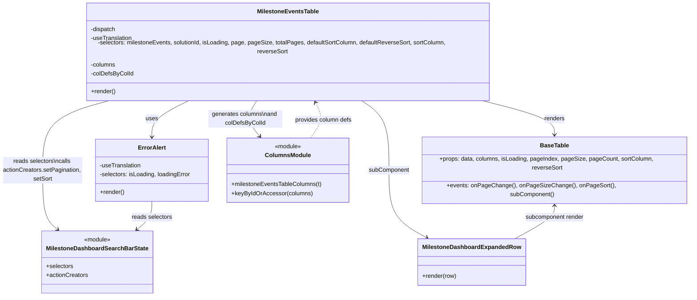

# Diagram: web/portal/src/pages/milestone/components/MilestoneEventsTable.js


> Auto-generated by Obscura crawlers

## Diagram 1



### SVG

<svg id="container" width="1873.849609375" xmlns="http://www.w3.org/2000/svg" class="classDiagram" height="770" viewBox="0 0 1873.849609375 770" role="graphics-document document" aria-roledescription="class"><style>#container{font-family:"trebuchet ms",verdana,arial,sans-serif;font-size:16px;fill:#333;}@keyframes edge-animation-frame{from{stroke-dashoffset:0;}}@keyframes dash{to{stroke-dashoffset:0;}}#container .edge-animation-slow{stroke-dasharray:9,5!important;stroke-dashoffset:900;animation:dash 50s linear infinite;stroke-linecap:round;}#container .edge-animation-fast{stroke-dasharray:9,5!important;stroke-dashoffset:900;animation:dash 20s linear infinite;stroke-linecap:round;}#container .error-icon{fill:#552222;}#container .error-text{fill:#552222;stroke:#552222;}#container .edge-thickness-normal{stroke-width:1px;}#container .edge-thickness-thick{stroke-width:3.5px;}#container .edge-pattern-solid{stroke-dasharray:0;}#container .edge-thickness-invisible{stroke-width:0;fill:none;}#container .edge-pattern-dashed{stroke-dasharray:3;}#container .edge-pattern-dotted{stroke-dasharray:2;}#container .marker{fill:#333333;stroke:#333333;}#container .marker.cross{stroke:#333333;}#container svg{font-family:"trebuchet ms",verdana,arial,sans-serif;font-size:16px;}#container p{margin:0;}#container g.classGroup text{fill:#9370DB;stroke:none;font-family:"trebuchet ms",verdana,arial,sans-serif;font-size:10px;}#container g.classGroup text .title{font-weight:bolder;}#container .nodeLabel,#container .edgeLabel{color:#131300;}#container .edgeLabel .label rect{fill:#ECECFF;}#container .label text{fill:#131300;}#container .labelBkg{background:#ECECFF;}#container .edgeLabel .label span{background:#ECECFF;}#container .classTitle{font-weight:bolder;}#container .node rect,#container .node circle,#container .node ellipse,#container .node polygon,#container .node path{fill:#ECECFF;stroke:#9370DB;stroke-width:1px;}#container .divider{stroke:#9370DB;stroke-width:1;}#container g.clickable{cursor:pointer;}#container g.classGroup rect{fill:#ECECFF;stroke:#9370DB;}#container g.classGroup line{stroke:#9370DB;stroke-width:1;}#container .classLabel .box{stroke:none;stroke-width:0;fill:#ECECFF;opacity:0.5;}#container .classLabel .label{fill:#9370DB;font-size:10px;}#container .relation{stroke:#333333;stroke-width:1;fill:none;}#container .dashed-line{stroke-dasharray:3;}#container .dotted-line{stroke-dasharray:1 2;}#container #compositionStart,#container .composition{fill:#333333!important;stroke:#333333!important;stroke-width:1;}#container #compositionEnd,#container .composition{fill:#333333!important;stroke:#333333!important;stroke-width:1;}#container #dependencyStart,#container .dependency{fill:#333333!important;stroke:#333333!important;stroke-width:1;}#container #dependencyStart,#container .dependency{fill:#333333!important;stroke:#333333!important;stroke-width:1;}#container #extensionStart,#container .extension{fill:transparent!important;stroke:#333333!important;stroke-width:1;}#container #extensionEnd,#container .extension{fill:transparent!important;stroke:#333333!important;stroke-width:1;}#container #aggregationStart,#container .aggregation{fill:transparent!important;stroke:#333333!important;stroke-width:1;}#container #aggregationEnd,#container .aggregation{fill:transparent!important;stroke:#333333!important;stroke-width:1;}#container #lollipopStart,#container .lollipop{fill:#ECECFF!important;stroke:#333333!important;stroke-width:1;}#container #lollipopEnd,#container .lollipop{fill:#ECECFF!important;stroke:#333333!important;stroke-width:1;}#container .edgeTerminals{font-size:11px;line-height:initial;}#container .classTitleText{text-anchor:middle;font-size:18px;fill:#333;}#container .label-icon{display:inline-block;height:1em;overflow:visible;vertical-align:-0.125em;}#container .node .label-icon path{fill:currentColor;stroke:revert;stroke-width:revert;}#container :root{--mermaid-font-family:"trebuchet ms",verdana,arial,sans-serif;}</style><g><defs><marker id="container_class-aggregationStart" class="marker aggregation class" refX="18" refY="7" markerWidth="190" markerHeight="240" orient="auto"><path d="M 18,7 L9,13 L1,7 L9,1 Z"></path></marker></defs><defs><marker id="container_class-aggregationEnd" class="marker aggregation class" refX="1" refY="7" markerWidth="20" markerHeight="28" orient="auto"><path d="M 18,7 L9,13 L1,7 L9,1 Z"></path></marker></defs><defs><marker id="container_class-extensionStart" class="marker extension class" refX="18" refY="7" markerWidth="190" markerHeight="240" orient="auto"><path d="M 1,7 L18,13 V 1 Z"></path></marker></defs><defs><marker id="container_class-extensionEnd" class="marker extension class" refX="1" refY="7" markerWidth="20" markerHeight="28" orient="auto"><path d="M 1,1 V 13 L18,7 Z"></path></marker></defs><defs><marker id="container_class-compositionStart" class="marker composition class" refX="18" refY="7" markerWidth="190" markerHeight="240" orient="auto"><path d="M 18,7 L9,13 L1,7 L9,1 Z"></path></marker></defs><defs><marker id="container_class-compositionEnd" class="marker composition class" refX="1" refY="7" markerWidth="20" markerHeight="28" orient="auto"><path d="M 18,7 L9,13 L1,7 L9,1 Z"></path></marker></defs><defs><marker id="container_class-dependencyStart" class="marker dependency class" refX="6" refY="7" markerWidth="190" markerHeight="240" orient="auto"><path d="M 5,7 L9,13 L1,7 L9,1 Z"></path></marker></defs><defs><marker id="container_class-dependencyEnd" class="marker dependency class" refX="13" refY="7" markerWidth="20" markerHeight="28" orient="auto"><path d="M 18,7 L9,13 L14,7 L9,1 Z"></path></marker></defs><defs><marker id="container_class-lollipopStart" class="marker lollipop class" refX="13" refY="7" markerWidth="190" markerHeight="240" orient="auto"><circle stroke="black" fill="transparent" cx="7" cy="7" r="6"></circle></marker></defs><defs><marker id="container_class-lollipopEnd" class="marker lollipop class" refX="1" refY="7" markerWidth="190" markerHeight="240" orient="auto"><circle stroke="black" fill="transparent" cx="7" cy="7" r="6"></circle></marker></defs><g class="root"><g class="clusters"></g><g class="edgePaths"><path d="M519.351,248L501.597,256.167C483.843,264.333,448.336,280.667,430.582,296.5C412.828,312.333,412.828,327.667,412.828,335.333L412.828,343" id="id_MilestoneEventsTable_ErrorAlert_1" class="edge-thickness-normal edge-pattern-solid relation" style=";;;" data-edge="true" data-et="edge" data-id="id_MilestoneEventsTable_ErrorAlert_1" data-points="W3sieCI6NTE5LjM1MDc5OTc0MTEyNDMsInkiOjI0OH0seyJ4Ijo0MTIuODI4MTI1LCJ5IjoyOTd9LHsieCI6NDEyLjgyODEyNSwieSI6MzQ5fV0=" marker-end="url(#container_class-dependencyEnd)"></path><path d="M1295.2,248L1330.247,256.167C1365.294,264.333,1435.388,280.667,1470.435,298.5C1505.482,316.333,1505.482,335.667,1505.482,345.333L1505.482,355" id="id_MilestoneEventsTable_BaseTable_2" class="edge-thickness-normal edge-pattern-solid relation" style=";;;" data-edge="true" data-et="edge" data-id="id_MilestoneEventsTable_BaseTable_2" data-points="W3sieCI6MTI5NS4yMDAwMDQ2MjI3ODEsInkiOjI0OH0seyJ4IjoxNTA1LjQ4MjQyMTg3NSwieSI6Mjk3fSx7IngiOjE1MDUuNDgyNDIxODc1LCJ5IjozNjF9XQ==" marker-end="url(#container_class-dependencyEnd)"></path><path d="M308.646,248L276.553,256.167C244.46,264.333,180.273,280.667,148.179,311.5C116.086,342.333,116.086,387.667,116.086,431C116.086,474.333,116.086,515.667,122.873,541.868C129.659,568.069,143.233,579.139,150.019,584.673L156.806,590.208" id="id_MilestoneEventsTable_MilestoneDashboardSearchBarState_3" class="edge-thickness-normal edge-pattern-solid relation" style=";;;" data-edge="true" data-et="edge" data-id="id_MilestoneEventsTable_MilestoneDashboardSearchBarState_3" data-points="W3sieCI6MzA4LjY0NjI4NzkwNjgwNDczLCJ5IjoyNDh9LHsieCI6MTE2LjA4NTkzNzUsInkiOjI5N30seyJ4IjoxMTYuMDg1OTM3NSwieSI6NDMzfSx7IngiOjExNi4wODU5Mzc1LCJ5Ijo1NTd9LHsieCI6MTYxLjQ1NTYxMDc5NTQ1NDU2LCJ5Ijo1OTR9XQ==" marker-end="url(#container_class-dependencyEnd)"></path><path d="M975.379,248L988.661,256.167C1001.942,264.333,1028.505,280.667,1041.787,311.5C1055.068,342.333,1055.068,387.667,1055.068,431C1055.068,474.333,1055.068,515.667,1072.179,545.527C1089.29,575.387,1123.512,593.773,1140.623,602.967L1157.733,612.16" id="id_MilestoneEventsTable_MilestoneDashboardExpandedRow_4" class="edge-thickness-normal edge-pattern-solid relation" style=";;;" data-edge="true" data-et="edge" data-id="id_MilestoneEventsTable_MilestoneDashboardExpandedRow_4" data-points="W3sieCI6OTc1LjM3OTM2ODUyODEwNjUsInkiOjI0OH0seyJ4IjoxMDU1LjA2ODM1OTM3NSwieSI6Mjk3fSx7IngiOjEwNTUuMDY4MzU5Mzc1LCJ5Ijo0MzN9LHsieCI6MTA1NS4wNjgzNTkzNzUsInkiOjU1N30seyJ4IjoxMTYzLjAxODgzNzE2NDI1NjIsInkiOjYxNX1d" marker-end="url(#container_class-dependencyEnd)"></path><path d="M698.245,248L692.666,256.167C687.087,264.333,675.929,280.667,676.636,296.238C677.343,311.809,689.914,326.617,696.199,334.022L702.485,341.426" id="id_MilestoneEventsTable_ColumnsModule_5" class="edge-thickness-normal edge-pattern-solid relation" style=";;;" data-edge="true" data-et="edge" data-id="id_MilestoneEventsTable_ColumnsModule_5" data-points="W3sieCI6Njk4LjI0NTQ5Mjc4ODQ2MTUsInkiOjI0OH0seyJ4Ijo2NjQuNzcxNDg0Mzc1LCJ5IjoyOTd9LHsieCI6NzA2LjM2Nzg2MjQ3NzAyMjEsInkiOjM0Nn1d" marker-end="url(#container_class-dependencyEnd)"></path><path d="M412.828,517L412.828,523.667C412.828,530.333,412.828,543.667,406.041,555.868C399.255,568.069,385.682,579.139,378.895,584.673L372.108,590.208" id="id_ErrorAlert_MilestoneDashboardSearchBarState_6" class="edge-thickness-normal edge-pattern-solid relation" style=";;;" data-edge="true" data-et="edge" data-id="id_ErrorAlert_MilestoneDashboardSearchBarState_6" data-points="W3sieCI6NDEyLjgyODEyNSwieSI6NTE3fSx7IngiOjQxMi44MjgxMjUsInkiOjU1N30seyJ4IjozNjcuNDU4NDUxNzA0NTQ1NDQsInkiOjU5NH1d" marker-end="url(#container_class-dependencyEnd)"></path><path d="M1505.482,511L1505.482,518.667C1505.482,526.333,1505.482,541.667,1487.491,559C1469.499,576.333,1433.515,595.667,1415.524,605.333L1397.532,615" id="id_BaseTable_MilestoneDashboardExpandedRow_7" class="edge-thickness-normal edge-pattern-solid relation" style=";;;" data-edge="true" data-et="edge" data-id="id_BaseTable_MilestoneDashboardExpandedRow_7" data-points="W3sieCI6MTUwNS40ODI0MjE4NzUsInkiOjUwNX0seyJ4IjoxNTA1LjQ4MjQyMTg3NSwieSI6NTU3fSx7IngiOjEzOTcuNTMxOTQ0MDg1NzQzOCwieSI6NjE1fV0=" marker-start="url(#container_class-dependencyStart)"></path><path d="M843.539,346L849.482,337.833C855.425,329.667,867.312,313.333,868.978,297.863C870.644,282.392,862.089,267.785,857.812,260.481L853.534,253.177" id="id_ColumnsModule_MilestoneEventsTable_8" class="edge-thickness-normal edge-pattern-dashed relation" style=";;;" data-edge="true" data-et="edge" data-id="id_ColumnsModule_MilestoneEventsTable_8" data-points="W3sieCI6ODQzLjUzODU0NTQ5NjMyMzUsInkiOjM0Nn0seyJ4Ijo4NzkuMTk5MjE4NzUsInkiOjI5N30seyJ4Ijo4NTAuNTAxODcyMjI2MzMxMywieSI6MjQ4fV0=" marker-end="url(#container_class-dependencyEnd)"></path></g><g class="edgeLabels"><g class="edgeLabel" transform="translate(412.828125, 297)"><g class="label" data-id="id_MilestoneEventsTable_ErrorAlert_1" transform="translate(-16.4921875, -12)"><foreignObject width="32.984375" height="24"><div xmlns="http://www.w3.org/1999/xhtml" class="labelBkg" style="display: table-cell; white-space: nowrap; line-height: 1.5; max-width: 200px; text-align: center;"><span class="edgeLabel"><p>uses</p></span></div></foreignObject></g></g><g class="edgeLabel" transform="translate(1505.482421875, 297)"><g class="label" data-id="id_MilestoneEventsTable_BaseTable_2" transform="translate(-27.75, -12)"><foreignObject width="55.5" height="24"><div xmlns="http://www.w3.org/1999/xhtml" class="labelBkg" style="display: table-cell; white-space: nowrap; line-height: 1.5; max-width: 200px; text-align: center;"><span class="edgeLabel"><p>renders</p></span></div></foreignObject></g></g><g class="edgeLabel" transform="translate(116.0859375, 433)"><g class="label" data-id="id_MilestoneEventsTable_MilestoneDashboardSearchBarState_3" transform="translate(-108.0859375, -36)"><foreignObject width="216.171875" height="72"><div xmlns="http://www.w3.org/1999/xhtml" class="labelBkg" style="display: table; white-space: break-spaces; line-height: 1.5; max-width: 200px; text-align: center; width: 200px;"><span class="edgeLabel"><p>reads selectors\ncalls actionCreators.setPagination, setSort</p></span></div></foreignObject></g></g><g class="edgeLabel" transform="translate(1055.068359375, 433)"><g class="label" data-id="id_MilestoneEventsTable_MilestoneDashboardExpandedRow_4" transform="translate(-55.046875, -12)"><foreignObject width="110.09375" height="24"><div xmlns="http://www.w3.org/1999/xhtml" class="labelBkg" style="display: table-cell; white-space: nowrap; line-height: 1.5; max-width: 200px; text-align: center;"><span class="edgeLabel"><p>subComponent</p></span></div></foreignObject></g></g><g class="edgeLabel" transform="translate(666.36757, 298.88017)"><g class="label" data-id="id_MilestoneEventsTable_ColumnsModule_5" transform="translate(-100, -24)"><foreignObject width="200" height="48"><div xmlns="http://www.w3.org/1999/xhtml" class="labelBkg" style="display: table; white-space: break-spaces; line-height: 1.5; max-width: 200px; text-align: center; width: 200px;"><span class="edgeLabel"><p>generates columns\nand colDefsByColId</p></span></div></foreignObject></g></g><g class="edgeLabel" transform="translate(412.828125, 557)"><g class="label" data-id="id_ErrorAlert_MilestoneDashboardSearchBarState_6" transform="translate(-54.8515625, -12)"><foreignObject width="109.703125" height="24"><div xmlns="http://www.w3.org/1999/xhtml" class="labelBkg" style="display: table-cell; white-space: nowrap; line-height: 1.5; max-width: 200px; text-align: center;"><span class="edgeLabel"><p>reads selectors</p></span></div></foreignObject></g></g><g class="edgeLabel" transform="translate(1505.482421875, 557)"><g class="label" data-id="id_BaseTable_MilestoneDashboardExpandedRow_7" transform="translate(-80.6328125, -12)"><foreignObject width="161.265625" height="24"><div xmlns="http://www.w3.org/1999/xhtml" class="labelBkg" style="display: table-cell; white-space: nowrap; line-height: 1.5; max-width: 200px; text-align: center;"><span class="edgeLabel"><p>subcomponent render</p></span></div></foreignObject></g></g><g class="edgeLabel" transform="translate(878.076, 298.54337)"><g class="label" data-id="id_ColumnsModule_MilestoneEventsTable_8" transform="translate(-77.953125, -12)"><foreignObject width="155.90625" height="24"><div xmlns="http://www.w3.org/1999/xhtml" class="labelBkg" style="display: table-cell; white-space: nowrap; line-height: 1.5; max-width: 200px; text-align: center;"><span class="edgeLabel"><p>provides column defs</p></span></div></foreignObject></g></g></g><g class="nodes"><g class="node default" id="classId-MilestoneEventsTable-0" transform="translate(780.22265625, 128)"><g class="basic label-container"><path d="M-567.171875 -120 L567.171875 -120 L567.171875 120 L-567.171875 120" stroke="none" stroke-width="0" fill="#ECECFF" style=""></path><path d="M-567.171875 -120 C-196.90685837519186 -120, 173.35815824961628 -120, 567.171875 -120 M-567.171875 -120 C-131.0688791271237 -120, 305.0341167457526 -120, 567.171875 -120 M567.171875 -120 C567.171875 -33.28260098377609, 567.171875 53.434798032447816, 567.171875 120 M567.171875 -120 C567.171875 -64.94654919370174, 567.171875 -9.893098387403498, 567.171875 120 M567.171875 120 C278.67573781867657 120, -9.820399362646867 120, -567.171875 120 M567.171875 120 C216.41044062855792 120, -134.35099374288416 120, -567.171875 120 M-567.171875 120 C-567.171875 34.342472713201374, -567.171875 -51.31505457359725, -567.171875 -120 M-567.171875 120 C-567.171875 25.42675357776389, -567.171875 -69.14649284447222, -567.171875 -120" stroke="#9370DB" stroke-width="1.3" fill="none" stroke-dasharray="0 0" style=""></path></g><g class="annotation-group text" transform="translate(0, -96)"></g><g class="label-group text" transform="translate(-79.71875, -96)"><g class="label" style="font-weight: bolder" transform="translate(0,-12)"><foreignObject width="159.4375" height="24"><div xmlns="http://www.w3.org/1999/xhtml" style="display: table-cell; white-space: nowrap; line-height: 1.5; max-width: 207px; text-align: center;"><span class="nodeLabel markdown-node-label" style=""><p>MilestoneEventsTable</p></span></div></foreignObject></g></g><g class="members-group text" transform="translate(-555.171875, -48)"><g class="label" style="" transform="translate(0,-12)"><foreignObject width="68.609375" height="24"><div xmlns="http://www.w3.org/1999/xhtml" style="display: table-cell; white-space: nowrap; line-height: 1.5; max-width: 126px; text-align: center;"><span class="nodeLabel markdown-node-label" style=""><p>-dispatch</p></span></div></foreignObject></g><g class="label" style="" transform="translate(0,12)"><foreignObject width="113.234375" height="24"><div xmlns="http://www.w3.org/1999/xhtml" style="display: table-cell; white-space: nowrap; line-height: 1.5; max-width: 171px; text-align: center;"><span class="nodeLabel markdown-node-label" style=""><p>-useTranslation</p></span></div></foreignObject></g><g class="label" style="" transform="translate(0,36)"><foreignObject width="1030.625" height="24"><div xmlns="http://www.w3.org/1999/xhtml" style="display: table-cell; white-space: nowrap; line-height: 1.5; max-width: 1088px; text-align: center;"><span class="nodeLabel markdown-node-label" style=""><p>-selectors: milestoneEvents, solutionId, isLoading, page, pageSize, totalPages, defaultSortColumn, defaultReverseSort, sortColumn, reverseSort</p></span></div></foreignObject></g><g class="label" style="" transform="translate(0,60)"><foreignObject width="67.6875" height="24"><div xmlns="http://www.w3.org/1999/xhtml" style="display: table-cell; white-space: nowrap; line-height: 1.5; max-width: 125px; text-align: center;"><span class="nodeLabel markdown-node-label" style=""><p>-columns</p></span></div></foreignObject></g><g class="label" style="" transform="translate(0,84)"><foreignObject width="114.15625" height="24"><div xmlns="http://www.w3.org/1999/xhtml" style="display: table-cell; white-space: nowrap; line-height: 1.5; max-width: 172px; text-align: center;"><span class="nodeLabel markdown-node-label" style=""><p>-colDefsByColId</p></span></div></foreignObject></g></g><g class="methods-group text" transform="translate(-555.171875, 96)"><g class="label" style="" transform="translate(0,-12)"><foreignObject width="66.609375" height="24"><div xmlns="http://www.w3.org/1999/xhtml" style="display: table-cell; white-space: nowrap; line-height: 1.5; max-width: 124px; text-align: center;"><span class="nodeLabel markdown-node-label" style=""><p>+render()</p></span></div></foreignObject></g></g><g class="divider" style=""><path d="M-567.171875 -72 C-207.8019325030179 -72, 151.5680099939642 -72, 567.171875 -72 M-567.171875 -72 C-290.93559008870676 -72, -14.699305177413521 -72, 567.171875 -72" stroke="#9370DB" stroke-width="1.3" fill="none" stroke-dasharray="0 0" style=""></path></g><g class="divider" style=""><path d="M-567.171875 72 C-203.16721181643425 72, 160.8374513671315 72, 567.171875 72 M-567.171875 72 C-189.38201045954077 72, 188.40785408091847 72, 567.171875 72" stroke="#9370DB" stroke-width="1.3" fill="none" stroke-dasharray="0 0" style=""></path></g></g><g class="node default" id="classId-ErrorAlert-1" transform="translate(412.828125, 433)"><g class="basic label-container"><path d="M-153.65625 -84 L153.65625 -84 L153.65625 84 L-153.65625 84" stroke="none" stroke-width="0" fill="#ECECFF" style=""></path><path d="M-153.65625 -84 C-58.99443566158507 -84, 35.667378676829856 -84, 153.65625 -84 M-153.65625 -84 C-61.211875727566365 -84, 31.23249854486727 -84, 153.65625 -84 M153.65625 -84 C153.65625 -48.6036503925069, 153.65625 -13.2073007850138, 153.65625 84 M153.65625 -84 C153.65625 -49.90193055604921, 153.65625 -15.803861112098417, 153.65625 84 M153.65625 84 C33.84888858780087 84, -85.95847282439826 84, -153.65625 84 M153.65625 84 C48.93399050761576 84, -55.78826898476848 84, -153.65625 84 M-153.65625 84 C-153.65625 50.143593097301796, -153.65625 16.287186194603592, -153.65625 -84 M-153.65625 84 C-153.65625 32.451769538186284, -153.65625 -19.096460923627433, -153.65625 -84" stroke="#9370DB" stroke-width="1.3" fill="none" stroke-dasharray="0 0" style=""></path></g><g class="annotation-group text" transform="translate(0, -60)"></g><g class="label-group text" transform="translate(-35.953125, -60)"><g class="label" style="font-weight: bolder" transform="translate(0,-12)"><foreignObject width="71.90625" height="24"><div xmlns="http://www.w3.org/1999/xhtml" style="display: table-cell; white-space: nowrap; line-height: 1.5; max-width: 120px; text-align: center;"><span class="nodeLabel markdown-node-label" style=""><p>ErrorAlert</p></span></div></foreignObject></g></g><g class="members-group text" transform="translate(-141.65625, -12)"><g class="label" style="" transform="translate(0,-12)"><foreignObject width="113.234375" height="24"><div xmlns="http://www.w3.org/1999/xhtml" style="display: table-cell; white-space: nowrap; line-height: 1.5; max-width: 171px; text-align: center;"><span class="nodeLabel markdown-node-label" style=""><p>-useTranslation</p></span></div></foreignObject></g><g class="label" style="" transform="translate(0,12)"><foreignObject width="247.359375" height="24"><div xmlns="http://www.w3.org/1999/xhtml" style="display: table-cell; white-space: nowrap; line-height: 1.5; max-width: 306px; text-align: center;"><span class="nodeLabel markdown-node-label" style=""><p>-selectors: isLoading, loadingError</p></span></div></foreignObject></g></g><g class="methods-group text" transform="translate(-141.65625, 60)"><g class="label" style="" transform="translate(0,-12)"><foreignObject width="66.609375" height="24"><div xmlns="http://www.w3.org/1999/xhtml" style="display: table-cell; white-space: nowrap; line-height: 1.5; max-width: 124px; text-align: center;"><span class="nodeLabel markdown-node-label" style=""><p>+render()</p></span></div></foreignObject></g></g><g class="divider" style=""><path d="M-153.65625 -36 C-87.33478728694423 -36, -21.013324573888468 -36, 153.65625 -36 M-153.65625 -36 C-45.80735403311844 -36, 62.04154193376311 -36, 153.65625 -36" stroke="#9370DB" stroke-width="1.3" fill="none" stroke-dasharray="0 0" style=""></path></g><g class="divider" style=""><path d="M-153.65625 36 C-39.78842756210791 36, 74.07939487578417 36, 153.65625 36 M-153.65625 36 C-56.50201196019778 36, 40.652226079604446 36, 153.65625 36" stroke="#9370DB" stroke-width="1.3" fill="none" stroke-dasharray="0 0" style=""></path></g></g><g class="node default" id="classId-BaseTable-2" transform="translate(1505.482421875, 433)"><g class="basic label-container"><path d="M-360.3671875 -72 L360.3671875 -72 L360.3671875 72 L-360.3671875 72" stroke="none" stroke-width="0" fill="#ECECFF" style=""></path><path d="M-360.3671875 -72 C-177.37751726884017 -72, 5.612152962319669 -72, 360.3671875 -72 M-360.3671875 -72 C-113.48818151918962 -72, 133.39082446162075 -72, 360.3671875 -72 M360.3671875 -72 C360.3671875 -36.395219922988666, 360.3671875 -0.7904398459773319, 360.3671875 72 M360.3671875 -72 C360.3671875 -31.77622802078872, 360.3671875 8.447543958422557, 360.3671875 72 M360.3671875 72 C112.2283951339927 72, -135.9103972320146 72, -360.3671875 72 M360.3671875 72 C210.5095873813822 72, 60.65198726276441 72, -360.3671875 72 M-360.3671875 72 C-360.3671875 32.70775986387724, -360.3671875 -6.584480272245514, -360.3671875 -72 M-360.3671875 72 C-360.3671875 26.05736214890711, -360.3671875 -19.88527570218578, -360.3671875 -72" stroke="#9370DB" stroke-width="1.3" fill="none" stroke-dasharray="0 0" style=""></path></g><g class="annotation-group text" transform="translate(0, -48)"></g><g class="label-group text" transform="translate(-37.359375, -48)"><g class="label" style="font-weight: bolder" transform="translate(0,-12)"><foreignObject width="74.71875" height="24"><div xmlns="http://www.w3.org/1999/xhtml" style="display: table-cell; white-space: nowrap; line-height: 1.5; max-width: 123px; text-align: center;"><span class="nodeLabel markdown-node-label" style=""><p>BaseTable</p></span></div></foreignObject></g></g><g class="members-group text" transform="translate(-348.3671875, 0)"><g class="label" style="" transform="translate(0,-12)"><foreignObject width="659.375" height="24"><div xmlns="http://www.w3.org/1999/xhtml" style="display: table-cell; white-space: nowrap; line-height: 1.5; max-width: 717px; text-align: center;"><span class="nodeLabel markdown-node-label" style=""><p>+props: data, columns, isLoading, pageIndex, pageSize, pageCount, sortColumn, reverseSort</p></span></div></foreignObject></g></g><g class="methods-group text" transform="translate(-348.3671875, 48)"><g class="label" style="" transform="translate(0,-12)"><foreignObject width="562" height="24"><div xmlns="http://www.w3.org/1999/xhtml" style="display: table-cell; white-space: nowrap; line-height: 1.5; max-width: 619px; text-align: center;"><span class="nodeLabel markdown-node-label" style=""><p>+events: onPageChange(), onPageSizeChange(), onPageSort(), subComponent()</p></span></div></foreignObject></g></g><g class="divider" style=""><path d="M-360.3671875 -24 C-133.92306912780012 -24, 92.52104924439976 -24, 360.3671875 -24 M-360.3671875 -24 C-186.34234026459515 -24, -12.317493029190302 -24, 360.3671875 -24" stroke="#9370DB" stroke-width="1.3" fill="none" stroke-dasharray="0 0" style=""></path></g><g class="divider" style=""><path d="M-360.3671875 24 C-108.17658103823823 24, 144.01402542352355 24, 360.3671875 24 M-360.3671875 24 C-78.59134961750942 24, 203.18448826498116 24, 360.3671875 24" stroke="#9370DB" stroke-width="1.3" fill="none" stroke-dasharray="0 0" style=""></path></g></g><g class="node default" id="classId-MilestoneDashboardSearchBarState-3" transform="translate(264.45703125, 678)"><g class="basic label-container"><path d="M-143.796875 -84 L143.796875 -84 L143.796875 84 L-143.796875 84" stroke="none" stroke-width="0" fill="#ECECFF" style=""></path><path d="M-143.796875 -84 C-84.74769257543173 -84, -25.69851015086344 -84, 143.796875 -84 M-143.796875 -84 C-46.91117611918742 -84, 49.97452276162517 -84, 143.796875 -84 M143.796875 -84 C143.796875 -38.74774955893547, 143.796875 6.504500882129065, 143.796875 84 M143.796875 -84 C143.796875 -19.835842463388914, 143.796875 44.32831507322217, 143.796875 84 M143.796875 84 C34.056553001728105 84, -75.68376899654379 84, -143.796875 84 M143.796875 84 C62.259388659234574 84, -19.278097681530852 84, -143.796875 84 M-143.796875 84 C-143.796875 45.68471210560607, -143.796875 7.369424211212134, -143.796875 -84 M-143.796875 84 C-143.796875 33.16373477535075, -143.796875 -17.672530449298506, -143.796875 -84" stroke="#9370DB" stroke-width="1.3" fill="none" stroke-dasharray="0 0" style=""></path></g><g class="annotation-group text" transform="translate(-36.6015625, -60)"><g class="label" style="" transform="translate(0,-12)"><foreignObject width="73.203125" height="24"><div xmlns="http://www.w3.org/1999/xhtml" style="display: table-cell; white-space: nowrap; line-height: 1.5; max-width: 123px; text-align: center;"><span class="nodeLabel markdown-node-label" style=""><p>«module»</p></span></div></foreignObject></g></g><g class="label-group text" transform="translate(-131.796875, -36)"><g class="label" style="font-weight: bolder" transform="translate(0,-12)"><foreignObject width="263.59375" height="24"><div xmlns="http://www.w3.org/1999/xhtml" style="display: table-cell; white-space: nowrap; line-height: 1.5; max-width: 310px; text-align: center;"><span class="nodeLabel markdown-node-label" style=""><p>MilestoneDashboardSearchBarState</p></span></div></foreignObject></g></g><g class="members-group text" transform="translate(-131.796875, 12)"><g class="label" style="" transform="translate(0,-12)"><foreignObject width="73.453125" height="24"><div xmlns="http://www.w3.org/1999/xhtml" style="display: table-cell; white-space: nowrap; line-height: 1.5; max-width: 131px; text-align: center;"><span class="nodeLabel markdown-node-label" style=""><p>+selectors</p></span></div></foreignObject></g><g class="label" style="" transform="translate(0,12)"><foreignObject width="113.078125" height="24"><div xmlns="http://www.w3.org/1999/xhtml" style="display: table-cell; white-space: nowrap; line-height: 1.5; max-width: 170px; text-align: center;"><span class="nodeLabel markdown-node-label" style=""><p>+actionCreators</p></span></div></foreignObject></g></g><g class="methods-group text" transform="translate(-131.796875, 84)"></g><g class="divider" style=""><path d="M-143.796875 -12 C-78.05993858222239 -12, -12.323002164444773 -12, 143.796875 -12 M-143.796875 -12 C-68.03124705198914 -12, 7.734380896021719 -12, 143.796875 -12" stroke="#9370DB" stroke-width="1.3" fill="none" stroke-dasharray="0 0" style=""></path></g><g class="divider" style=""><path d="M-143.796875 60 C-33.911339917380516 60, 75.97419516523897 60, 143.796875 60 M-143.796875 60 C-62.17989631749414 60, 19.43708236501172 60, 143.796875 60" stroke="#9370DB" stroke-width="1.3" fill="none" stroke-dasharray="0 0" style=""></path></g></g><g class="node default" id="classId-MilestoneDashboardExpandedRow-4" transform="translate(1280.275390625, 678)"><g class="basic label-container"><path d="M-138.7421875 -63 L138.7421875 -63 L138.7421875 63 L-138.7421875 63" stroke="none" stroke-width="0" fill="#ECECFF" style=""></path><path d="M-138.7421875 -63 C-56.935731143717504 -63, 24.87072521256499 -63, 138.7421875 -63 M-138.7421875 -63 C-63.97871389305004 -63, 10.784759713899916 -63, 138.7421875 -63 M138.7421875 -63 C138.7421875 -25.34178221166958, 138.7421875 12.316435576660837, 138.7421875 63 M138.7421875 -63 C138.7421875 -18.76094450217699, 138.7421875 25.47811099564602, 138.7421875 63 M138.7421875 63 C43.56321800533752 63, -51.615751489324964 63, -138.7421875 63 M138.7421875 63 C40.2872386912433 63, -58.167710117513394 63, -138.7421875 63 M-138.7421875 63 C-138.7421875 25.063374797620547, -138.7421875 -12.873250404758906, -138.7421875 -63 M-138.7421875 63 C-138.7421875 15.010869705161397, -138.7421875 -32.978260589677205, -138.7421875 -63" stroke="#9370DB" stroke-width="1.3" fill="none" stroke-dasharray="0 0" style=""></path></g><g class="annotation-group text" transform="translate(0, -39)"></g><g class="label-group text" transform="translate(-126.7421875, -39)"><g class="label" style="font-weight: bolder" transform="translate(0,-12)"><foreignObject width="253.484375" height="24"><div xmlns="http://www.w3.org/1999/xhtml" style="display: table-cell; white-space: nowrap; line-height: 1.5; max-width: 301px; text-align: center;"><span class="nodeLabel markdown-node-label" style=""><p>MilestoneDashboardExpandedRow</p></span></div></foreignObject></g></g><g class="members-group text" transform="translate(-126.7421875, 9)"></g><g class="methods-group text" transform="translate(-126.7421875, 39)"><g class="label" style="" transform="translate(0,-12)"><foreignObject width="93.125" height="24"><div xmlns="http://www.w3.org/1999/xhtml" style="display: table-cell; white-space: nowrap; line-height: 1.5; max-width: 150px; text-align: center;"><span class="nodeLabel markdown-node-label" style=""><p>+render(row)</p></span></div></foreignObject></g></g><g class="divider" style=""><path d="M-138.7421875 -15 C-72.10649535675721 -15, -5.470803213514415 -15, 138.7421875 -15 M-138.7421875 -15 C-39.428772560905415 -15, 59.88464237818917 -15, 138.7421875 -15" stroke="#9370DB" stroke-width="1.3" fill="none" stroke-dasharray="0 0" style=""></path></g><g class="divider" style=""><path d="M-138.7421875 9 C-63.783129686866204 9, 11.175928126267593 9, 138.7421875 9 M-138.7421875 9 C-37.980256374677026 9, 62.78167475064595 9, 138.7421875 9" stroke="#9370DB" stroke-width="1.3" fill="none" stroke-dasharray="0 0" style=""></path></g></g><g class="node default" id="classId-ColumnsModule-5" transform="translate(780.22265625, 433)"><g class="basic label-container"><path d="M-163.73828125 -87 L163.73828125 -87 L163.73828125 87 L-163.73828125 87" stroke="none" stroke-width="0" fill="#ECECFF" style=""></path><path d="M-163.73828125 -87 C-49.403143545370554 -87, 64.93199415925889 -87, 163.73828125 -87 M-163.73828125 -87 C-58.57596569313115 -87, 46.586349863737695 -87, 163.73828125 -87 M163.73828125 -87 C163.73828125 -47.01218507646332, 163.73828125 -7.024370152926636, 163.73828125 87 M163.73828125 -87 C163.73828125 -47.58499287058843, 163.73828125 -8.169985741176859, 163.73828125 87 M163.73828125 87 C49.24156054122355 87, -65.2551601675529 87, -163.73828125 87 M163.73828125 87 C52.40220607995694 87, -58.93386909008612 87, -163.73828125 87 M-163.73828125 87 C-163.73828125 46.45312716332653, -163.73828125 5.906254326653055, -163.73828125 -87 M-163.73828125 87 C-163.73828125 25.33380521212549, -163.73828125 -36.33238957574902, -163.73828125 -87" stroke="#9370DB" stroke-width="1.3" fill="none" stroke-dasharray="0 0" style=""></path></g><g class="annotation-group text" transform="translate(-36.6015625, -63)"><g class="label" style="" transform="translate(0,-12)"><foreignObject width="73.203125" height="24"><div xmlns="http://www.w3.org/1999/xhtml" style="display: table-cell; white-space: nowrap; line-height: 1.5; max-width: 123px; text-align: center;"><span class="nodeLabel markdown-node-label" style=""><p>«module»</p></span></div></foreignObject></g></g><g class="label-group text" transform="translate(-58.3984375, -39)"><g class="label" style="font-weight: bolder" transform="translate(0,-12)"><foreignObject width="116.796875" height="24"><div xmlns="http://www.w3.org/1999/xhtml" style="display: table-cell; white-space: nowrap; line-height: 1.5; max-width: 167px; text-align: center;"><span class="nodeLabel markdown-node-label" style=""><p>ColumnsModule</p></span></div></foreignObject></g></g><g class="members-group text" transform="translate(-151.73828125, 9)"></g><g class="methods-group text" transform="translate(-151.73828125, 39)"><g class="label" style="" transform="translate(0,-12)"><foreignObject width="245.078125" height="24"><div xmlns="http://www.w3.org/1999/xhtml" style="display: table-cell; white-space: nowrap; line-height: 1.5; max-width: 302px; text-align: center;"><span class="nodeLabel markdown-node-label" style=""><p>+milestoneEventsTableColumns(t)</p></span></div></foreignObject></g><g class="label" style="" transform="translate(0,12)"><foreignObject width="216.15625" height="24"><div xmlns="http://www.w3.org/1999/xhtml" style="display: table-cell; white-space: nowrap; line-height: 1.5; max-width: 274px; text-align: center;"><span class="nodeLabel markdown-node-label" style=""><p>+keyByIdOrAccessor(columns)</p></span></div></foreignObject></g></g><g class="divider" style=""><path d="M-163.73828125 -15 C-41.4536160090893 -15, 80.8310492318214 -15, 163.73828125 -15 M-163.73828125 -15 C-82.74122571351089 -15, -1.744170177021772 -15, 163.73828125 -15" stroke="#9370DB" stroke-width="1.3" fill="none" stroke-dasharray="0 0" style=""></path></g><g class="divider" style=""><path d="M-163.73828125 9 C-97.80229809011621 9, -31.86631493023242 9, 163.73828125 9 M-163.73828125 9 C-79.78097302546537 9, 4.176335199069257 9, 163.73828125 9" stroke="#9370DB" stroke-width="1.3" fill="none" stroke-dasharray="0 0" style=""></path></g></g></g></g></g></svg>

## Diagram 2

```mermaid
flowchart LR
    subgraph StateSelectors
        A[getMilestoneEvents]
        B[getIsLoading]
        C[getLoadingError]
        D[getPage]
        E[getPageSize]
        F[getTotalPages]
        G[getDefaultSortColumn]
        H[getDefaultReverseSort]
        I[getSortColumn]
        J[getReverseSort]
    end
    subgraph Actions
        K[setPagination(solutionId, page, pageSize)]
        L[setSort(solutionId, sortColumn, reverseSort, override)]
    end
    A -->|data| BaseTable[BaseTable Component]
    B -->|loading| ErrorAlert[ErrorAlert Component]
    C -->|error| ErrorAlert
    D -->|pageIndex| BaseTable
    E -->|pageSize| BaseTable
    F -->|pageCount| BaseTable
    G -->|defaultSortColumn| BaseTable
    H -->|defaultReverseSort| BaseTable
    I -->|sortColumn| BaseTable
    J -->|reverseSort| BaseTable
    BaseTable -->|onPageChange(newPage)| Dispatch[dispatch]
    BaseTable -->|onPageSizeChange(newPageSize)| Dispatch
    BaseTable -->|onPageSort(newSort, newReverse)| Dispatch
    Dispatch -->|calls| K
    Dispatch -->|calls| L
    ErrorAlert -->|renders Alert| UI[React-Bootstrap Alert]
    MilestoneDashboardExpandedRow -->|renders| BaseTable
    ColumnsModule[Columns Module] -->|columns| BaseTable
    SolutionId[getSolutionId] -->|solutionId| Dispatch
    SolutionId -->|solutionId| K
    SolutionId -->|solutionId| L
```

> SVG rendering failed for this diagram.
