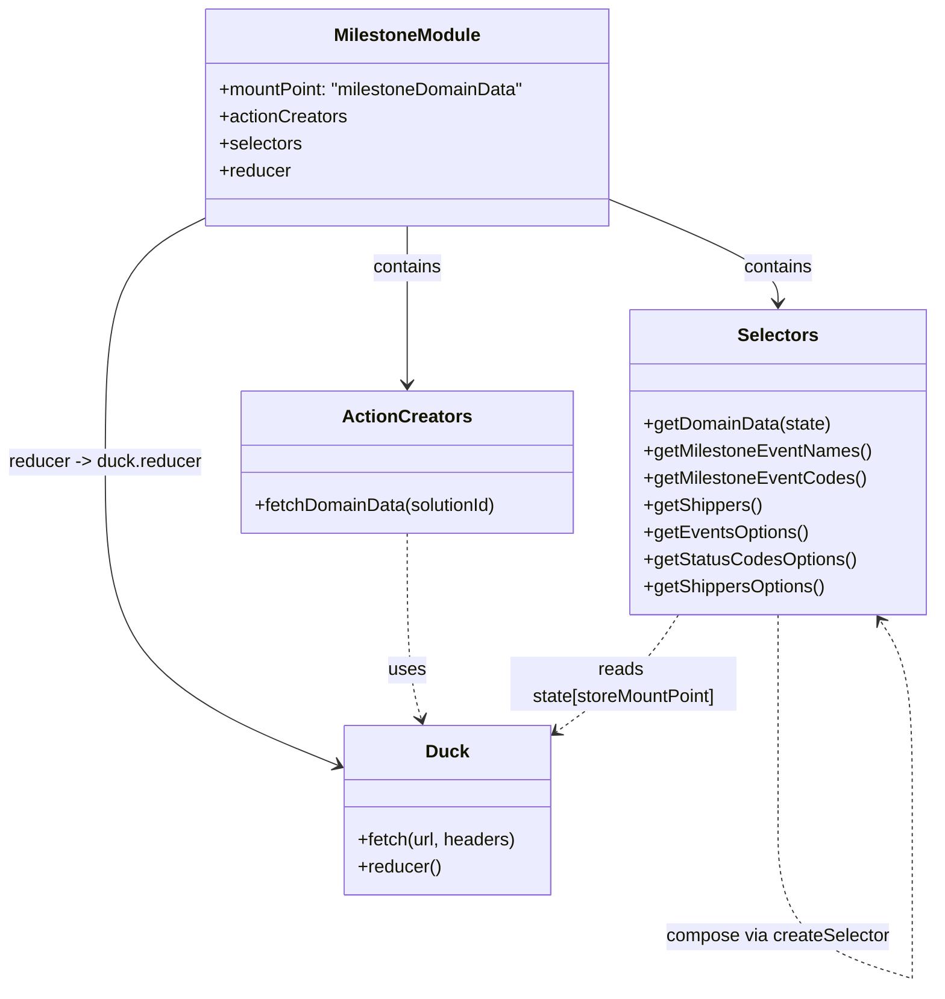

# Diagram: web/portal/src/pages/milestone/redux/MilestoneDomainDataState.js


> Auto-generated by Obscura crawlers

## Diagram 1

```mermaid
flowchart TD
    subgraph Imports
        LOD["lodash (_)\n(get)"]:::imp
        RSEL["createSelector\n(reselect)"]:::imp
        API["apiUrl\n(api-url)"]:::imp
        BUILD["buildFetchDuck\n(vendor/signal-utils)"]:::imp
        AXIOS["axiosConfigHeaders\n(utils/fetch-utils)"]:::imp
        OPTMAP["createOptionsMapper\n(utils/selectors-utils)"]:::imp
    end

    STORE["STORE_MOUNT_POINT\n\"milestoneDomainData\""]:::const
    DUCK["duck = buildFetchDuck(STORE_MOUNT_POINT)"]:::proc
    DOMAIN_QARGS["domainQueryArgs\n(customer_shipper, milestone_description, milestone_code)"]:::const
    FETCH_DOMAIN["fetchDomainData(solutionId)\n-> builds url and dispatches duck.fetch"]:::proc

    SELECTORS["Selectors"]:::group
    S_getDomain["getDomainData(state)"]:::sel
    S_eventNames["getMilestoneEventNames"]:::sel
    S_eventCodes["getMilestoneEventCodes"]:::sel
    S_shippers["getShippers"]:::sel
    S_eventsOptions["getEventsOptions"]:::sel
    S_statusCodesOptions["getStatusCodesOptions"]:::sel
    S_shippersOptions["getShippersOptions"]:::sel

    EXPORT["default export\n{mountPoint, actionCreators, selectors, reducer}"]:::export

    LOD --> S_eventNames
    RSEL --> S_eventNames
    RSEL --> S_eventCodes
    RSEL --> S_shippers
    API --> FETCH_DOMAIN
    BUILD --> DUCK
    DUCK --> FETCH_DOMAIN
    AXIOS --> FETCH_DOMAIN
    OPTMAP --> S_eventsOptions
    OPTMAP --> S_statusCodesOptions
    OPTMAP --> S_shippersOptions

    STORE --> DUCK
    DOMAIN_QARGS --> FETCH_DOMAIN
    FETCH_DOMAIN --> DUCK.fetch
    DUCK.fetch --> "dispatch":::proc_arrow
    S_getDomain --> S_eventNames
    S_getDomain --> S_eventCodes
    S_getDomain --> S_shippers

    S_eventNames --> S_eventsOptions
    S_eventCodes --> S_statusCodesOptions
    S_shippers --> S_shippersOptions

    FETCH_DOMAIN --> EXPORT
    S_eventNames --> EXPORT
    S_eventCodes --> EXPORT
    S_shippers --> EXPORT
    S_eventsOptions --> EXPORT
    S_statusCodesOptions --> EXPORT
    S_shippersOptions --> EXPORT
    DUCK.reducer --> EXPORT

    classDef imp fill:#f9f,stroke:#333,stroke-width:1px;
    classDef proc fill:#bbf,stroke:#333;
    classDef const fill:#ffd,stroke:#333;
    classDef sel fill:#dfd,stroke:#333;
    classDef export fill:#fdd,stroke:#333;
    classDef group fill:#fff,stroke:#999;
    classDef proc_arrow stroke-dasharray: 2 2;
```

> SVG rendering failed for this diagram.

## Diagram 2



### SVG

<svg id="container" width="828.71875" xmlns="http://www.w3.org/2000/svg" class="classDiagram" height="874.1499633789062" viewBox="0 0 828.71875 874.1499633789062" role="graphics-document document" aria-roledescription="class"><style>#container{font-family:"trebuchet ms",verdana,arial,sans-serif;font-size:16px;fill:#333;}@keyframes edge-animation-frame{from{stroke-dashoffset:0;}}@keyframes dash{to{stroke-dashoffset:0;}}#container .edge-animation-slow{stroke-dasharray:9,5!important;stroke-dashoffset:900;animation:dash 50s linear infinite;stroke-linecap:round;}#container .edge-animation-fast{stroke-dasharray:9,5!important;stroke-dashoffset:900;animation:dash 20s linear infinite;stroke-linecap:round;}#container .error-icon{fill:#552222;}#container .error-text{fill:#552222;stroke:#552222;}#container .edge-thickness-normal{stroke-width:1px;}#container .edge-thickness-thick{stroke-width:3.5px;}#container .edge-pattern-solid{stroke-dasharray:0;}#container .edge-thickness-invisible{stroke-width:0;fill:none;}#container .edge-pattern-dashed{stroke-dasharray:3;}#container .edge-pattern-dotted{stroke-dasharray:2;}#container .marker{fill:#333333;stroke:#333333;}#container .marker.cross{stroke:#333333;}#container svg{font-family:"trebuchet ms",verdana,arial,sans-serif;font-size:16px;}#container p{margin:0;}#container g.classGroup text{fill:#9370DB;stroke:none;font-family:"trebuchet ms",verdana,arial,sans-serif;font-size:10px;}#container g.classGroup text .title{font-weight:bolder;}#container .nodeLabel,#container .edgeLabel{color:#131300;}#container .edgeLabel .label rect{fill:#ECECFF;}#container .label text{fill:#131300;}#container .labelBkg{background:#ECECFF;}#container .edgeLabel .label span{background:#ECECFF;}#container .classTitle{font-weight:bolder;}#container .node rect,#container .node circle,#container .node ellipse,#container .node polygon,#container .node path{fill:#ECECFF;stroke:#9370DB;stroke-width:1px;}#container .divider{stroke:#9370DB;stroke-width:1;}#container g.clickable{cursor:pointer;}#container g.classGroup rect{fill:#ECECFF;stroke:#9370DB;}#container g.classGroup line{stroke:#9370DB;stroke-width:1;}#container .classLabel .box{stroke:none;stroke-width:0;fill:#ECECFF;opacity:0.5;}#container .classLabel .label{fill:#9370DB;font-size:10px;}#container .relation{stroke:#333333;stroke-width:1;fill:none;}#container .dashed-line{stroke-dasharray:3;}#container .dotted-line{stroke-dasharray:1 2;}#container #compositionStart,#container .composition{fill:#333333!important;stroke:#333333!important;stroke-width:1;}#container #compositionEnd,#container .composition{fill:#333333!important;stroke:#333333!important;stroke-width:1;}#container #dependencyStart,#container .dependency{fill:#333333!important;stroke:#333333!important;stroke-width:1;}#container #dependencyStart,#container .dependency{fill:#333333!important;stroke:#333333!important;stroke-width:1;}#container #extensionStart,#container .extension{fill:transparent!important;stroke:#333333!important;stroke-width:1;}#container #extensionEnd,#container .extension{fill:transparent!important;stroke:#333333!important;stroke-width:1;}#container #aggregationStart,#container .aggregation{fill:transparent!important;stroke:#333333!important;stroke-width:1;}#container #aggregationEnd,#container .aggregation{fill:transparent!important;stroke:#333333!important;stroke-width:1;}#container #lollipopStart,#container .lollipop{fill:#ECECFF!important;stroke:#333333!important;stroke-width:1;}#container #lollipopEnd,#container .lollipop{fill:#ECECFF!important;stroke:#333333!important;stroke-width:1;}#container .edgeTerminals{font-size:11px;line-height:initial;}#container .classTitleText{text-anchor:middle;font-size:18px;fill:#333;}#container .label-icon{display:inline-block;height:1em;overflow:visible;vertical-align:-0.125em;}#container .node .label-icon path{fill:currentColor;stroke:revert;stroke-width:revert;}#container :root{--mermaid-font-family:"trebuchet ms",verdana,arial,sans-serif;}</style><g><defs><marker id="container_class-aggregationStart" class="marker aggregation class" refX="18" refY="7" markerWidth="190" markerHeight="240" orient="auto"><path d="M 18,7 L9,13 L1,7 L9,1 Z"></path></marker></defs><defs><marker id="container_class-aggregationEnd" class="marker aggregation class" refX="1" refY="7" markerWidth="20" markerHeight="28" orient="auto"><path d="M 18,7 L9,13 L1,7 L9,1 Z"></path></marker></defs><defs><marker id="container_class-extensionStart" class="marker extension class" refX="18" refY="7" markerWidth="190" markerHeight="240" orient="auto"><path d="M 1,7 L18,13 V 1 Z"></path></marker></defs><defs><marker id="container_class-extensionEnd" class="marker extension class" refX="1" refY="7" markerWidth="20" markerHeight="28" orient="auto"><path d="M 1,1 V 13 L18,7 Z"></path></marker></defs><defs><marker id="container_class-compositionStart" class="marker composition class" refX="18" refY="7" markerWidth="190" markerHeight="240" orient="auto"><path d="M 18,7 L9,13 L1,7 L9,1 Z"></path></marker></defs><defs><marker id="container_class-compositionEnd" class="marker composition class" refX="1" refY="7" markerWidth="20" markerHeight="28" orient="auto"><path d="M 18,7 L9,13 L1,7 L9,1 Z"></path></marker></defs><defs><marker id="container_class-dependencyStart" class="marker dependency class" refX="6" refY="7" markerWidth="190" markerHeight="240" orient="auto"><path d="M 5,7 L9,13 L1,7 L9,1 Z"></path></marker></defs><defs><marker id="container_class-dependencyEnd" class="marker dependency class" refX="13" refY="7" markerWidth="20" markerHeight="28" orient="auto"><path d="M 18,7 L9,13 L14,7 L9,1 Z"></path></marker></defs><defs><marker id="container_class-lollipopStart" class="marker lollipop class" refX="13" refY="7" markerWidth="190" markerHeight="240" orient="auto"><circle stroke="black" fill="transparent" cx="7" cy="7" r="6"></circle></marker></defs><defs><marker id="container_class-lollipopEnd" class="marker lollipop class" refX="1" refY="7" markerWidth="190" markerHeight="240" orient="auto"><circle stroke="black" fill="transparent" cx="7" cy="7" r="6"></circle></marker></defs><g class="root"><g class="clusters"></g><g class="edgePaths"><path d="M363.516,200L363.516,206.167C363.516,212.333,363.516,224.667,363.516,248C363.516,271.333,363.516,305.667,363.516,322.833L363.516,340" id="id_MilestoneModule_ActionCreators_1" class="edge-thickness-normal edge-pattern-solid relation" style=";;;" data-edge="true" data-et="edge" data-id="id_MilestoneModule_ActionCreators_1" data-points="W3sieCI6MzYzLjUxNTYyNSwieSI6MjAwfSx7IngiOjM2My41MTU2MjUsInkiOjIzN30seyJ4IjozNjMuNTE1NjI1LCJ5IjozNDZ9XQ==" marker-end="url(#container_class-dependencyEnd)"></path><path d="M544.59,177.521L569.005,187.435C593.419,197.348,642.249,217.174,666.663,232.254C691.078,247.333,691.078,257.667,691.078,262.833L691.078,268" id="id_MilestoneModule_Selectors_2" class="edge-thickness-normal edge-pattern-solid relation" style=";;;" data-edge="true" data-et="edge" data-id="id_MilestoneModule_Selectors_2" data-points="W3sieCI6NTQ0LjU4OTg0Mzc1LCJ5IjoxNzcuNTIxNDUzNDQzOTk5MjN9LHsieCI6NjkxLjA3ODEyNSwieSI6MjM3fSx7IngiOjY5MS4wNzgxMjUsInkiOjI3NH1d" marker-end="url(#container_class-dependencyEnd)"></path><path d="M182.441,193.455L167.751,200.712C153.06,207.97,123.678,222.485,108.988,258.409C94.297,294.333,94.297,351.667,94.297,411C94.297,470.333,94.297,531.667,128.889,576.408C163.481,621.15,232.665,649.3,267.257,663.375L301.849,677.45" id="id_MilestoneModule_Duck_3" class="edge-thickness-normal edge-pattern-solid relation" style=";;;" data-edge="true" data-et="edge" data-id="id_MilestoneModule_Duck_3" data-points="W3sieCI6MTgyLjQ0MTQwNjI1LCJ5IjoxOTMuNDU0NjU3NTczOTk4ODR9LHsieCI6OTQuMjk2ODc1LCJ5IjoyMzd9LHsieCI6OTQuMjk2ODc1LCJ5Ijo0MDl9LHsieCI6OTQuMjk2ODc1LCJ5Ijo1OTN9LHsieCI6MzA3LjQwNjI1LCJ5Ijo2NzkuNzExMTUyNjk3NDg5fV0=" marker-end="url(#container_class-dependencyEnd)"></path><path d="M363.516,472L363.516,492.167C363.516,512.333,363.516,552.667,365.58,580.039C367.645,607.411,371.775,621.821,373.84,629.027L375.905,636.232" id="id_ActionCreators_Duck_4" class="edge-thickness-normal edge-pattern-dashed relation" style=";;;" data-edge="true" data-et="edge" data-id="id_ActionCreators_Duck_4" data-points="W3sieCI6MzYzLjUxNTYyNSwieSI6NDcyfSx7IngiOjM2My41MTU2MjUsInkiOjU5M30seyJ4IjozNzcuNTU3NzQzMTk1NTY0NSwieSI6NjQyfV0=" marker-end="url(#container_class-dependencyEnd)"></path><path d="M691.078,544L691.078,552.167C691.078,560.333,691.078,576.667,691.078,605.492C691.078,634.317,691.078,675.633,691.078,696.292L691.078,716.95" id="Selectors-cyclic-special-1" class="edge-thickness-normal edge-pattern-dashed relation" style=";;;" data-edge="true" data-et="edge" data-id="Selectors-cyclic-special-1" data-points="W3sieCI6NjkxLjA3ODEyNSwieSI6NTQ0fSx7IngiOjY5MS4wNzgxMjUsInkiOjU5M30seyJ4Ijo2OTEuMDc4MTI1LCJ5Ijo3MTYuOTQ5OTk5OTk5MjU0OX1d"></path><path d="M691.078,717.05L691.078,735.708C691.078,754.367,691.078,791.683,711.015,816.514C730.952,841.345,770.826,853.69,790.763,859.862L810.7,866.035" id="Selectors-cyclic-special-mid" class="edge-thickness-normal edge-pattern-dashed relation" style=";;;" data-edge="true" data-et="edge" data-id="Selectors-cyclic-special-mid" data-points="W3sieCI6NjkxLjA3ODEyNSwieSI6NzE3LjA1MDAwMDAwMDc0NTF9LHsieCI6NjkxLjA3ODEyNSwieSI6ODI5fSx7IngiOjgxMC42OTk5OTk5OTkyNTQ5LCJ5Ijo4NjYuMDM0NTIwMTcyODYwM31d"></path><path d="M810.75,866L810.75,859.833C810.75,853.667,810.75,841.333,810.75,816.5C810.75,791.667,810.75,754.333,810.75,715C810.75,675.667,810.75,634.333,805.984,606.338C801.217,578.343,791.685,563.687,786.918,556.358L782.152,549.03" id="Selectors-cyclic-special-2" class="edge-thickness-normal edge-pattern-dashed relation" style=";;;" data-edge="true" data-et="edge" data-id="Selectors-cyclic-special-2" data-points="W3sieCI6ODEwLjc1LCJ5Ijo4NjZ9LHsieCI6ODEwLjc1LCJ5Ijo4Mjl9LHsieCI6ODEwLjc1LCJ5Ijo3MTd9LHsieCI6ODEwLjc1LCJ5Ijo1OTN9LHsieCI6Nzc4Ljg4MDg1OTM3NSwieSI6NTQ0fV0=" marker-end="url(#container_class-dependencyEnd)"></path><path d="M603.035,544L597.709,552.167C592.382,560.333,581.73,576.667,563.818,593.905C545.906,611.144,520.734,629.288,508.149,638.361L495.563,647.433" id="id_Selectors_Duck_6" class="edge-thickness-normal edge-pattern-dashed relation" style=";;;" data-edge="true" data-et="edge" data-id="id_Selectors_Duck_6" data-points="W3sieCI6NjAzLjAzNDY0NjczOTEzMDUsInkiOjU0NH0seyJ4Ijo1NzEuMDc4MTI1LCJ5Ijo1OTN9LHsieCI6NDkwLjY5NTMxMjUsInkiOjY1MC45NDExODg0OTIwMTg1fV0=" marker-end="url(#container_class-dependencyEnd)"></path></g><g class="edgeLabels"><g class="edgeLabel" transform="translate(363.515625, 237)"><g class="label" data-id="id_MilestoneModule_ActionCreators_1" transform="translate(-30.890625, -12)"><foreignObject width="61.78125" height="24"><div xmlns="http://www.w3.org/1999/xhtml" class="labelBkg" style="display: table-cell; white-space: nowrap; line-height: 1.5; max-width: 200px; text-align: center;"><span class="edgeLabel"><p>contains</p></span></div></foreignObject></g></g><g class="edgeLabel" transform="translate(691.078125, 237)"><g class="label" data-id="id_MilestoneModule_Selectors_2" transform="translate(-30.890625, -12)"><foreignObject width="61.78125" height="24"><div xmlns="http://www.w3.org/1999/xhtml" class="labelBkg" style="display: table-cell; white-space: nowrap; line-height: 1.5; max-width: 200px; text-align: center;"><span class="edgeLabel"><p>contains</p></span></div></foreignObject></g></g><g class="edgeLabel" transform="translate(94.296875, 409)"><g class="label" data-id="id_MilestoneModule_Duck_3" transform="translate(-86.296875, -12)"><foreignObject width="172.59375" height="24"><div xmlns="http://www.w3.org/1999/xhtml" class="labelBkg" style="display: table-cell; white-space: nowrap; line-height: 1.5; max-width: 200px; text-align: center;"><span class="edgeLabel"><p>reducer -&gt; duck.reducer</p></span></div></foreignObject></g></g><g class="edgeLabel" transform="translate(363.515625, 593)"><g class="label" data-id="id_ActionCreators_Duck_4" transform="translate(-16.4921875, -12)"><foreignObject width="32.984375" height="24"><div xmlns="http://www.w3.org/1999/xhtml" class="labelBkg" style="display: table-cell; white-space: nowrap; line-height: 1.5; max-width: 200px; text-align: center;"><span class="edgeLabel"><p>uses</p></span></div></foreignObject></g></g><g class="edgeLabel"><g class="label" data-id="Selectors-cyclic-special-1" transform="translate(0, 0)"><foreignObject width="0" height="0"><div xmlns="http://www.w3.org/1999/xhtml" class="labelBkg" style="display: table-cell; white-space: nowrap; line-height: 1.5; max-width: 200px; text-align: center;"><span class="edgeLabel"></span></div></foreignObject></g></g><g class="edgeLabel" transform="translate(691.078125, 829)"><g class="label" data-id="Selectors-cyclic-special-mid" transform="translate(-99.671875, -12)"><foreignObject width="199.34375" height="24"><div xmlns="http://www.w3.org/1999/xhtml" class="labelBkg" style="display: table-cell; white-space: nowrap; line-height: 1.5; max-width: 200px; text-align: center;"><span class="edgeLabel"><p>compose via createSelector</p></span></div></foreignObject></g></g><g class="edgeLabel"><g class="label" data-id="Selectors-cyclic-special-2" transform="translate(0, 0)"><foreignObject width="0" height="0"><div xmlns="http://www.w3.org/1999/xhtml" class="labelBkg" style="display: table-cell; white-space: nowrap; line-height: 1.5; max-width: 200px; text-align: center;"><span class="edgeLabel"></span></div></foreignObject></g></g><g class="edgeLabel" transform="translate(554.61481, 604.86701)"><g class="label" data-id="id_Selectors_Duck_6" transform="translate(-100, -24)"><foreignObject width="200" height="48"><div xmlns="http://www.w3.org/1999/xhtml" class="labelBkg" style="display: table; white-space: break-spaces; line-height: 1.5; max-width: 200px; text-align: center; width: 200px;"><span class="edgeLabel"><p>reads state[storeMountPoint]</p></span></div></foreignObject></g></g></g><g class="nodes"><g class="node default" id="classId-MilestoneModule-0" transform="translate(363.515625, 104)"><g class="basic label-container"><path d="M-181.07421875 -96 L181.07421875 -96 L181.07421875 96 L-181.07421875 96" stroke="none" stroke-width="0" fill="#ECECFF" style=""></path><path d="M-181.07421875 -96 C-40.426085390396395 -96, 100.22204796920721 -96, 181.07421875 -96 M-181.07421875 -96 C-59.64645501542431 -96, 61.78130871915138 -96, 181.07421875 -96 M181.07421875 -96 C181.07421875 -22.096507593280933, 181.07421875 51.806984813438135, 181.07421875 96 M181.07421875 -96 C181.07421875 -31.782700164029862, 181.07421875 32.434599671940276, 181.07421875 96 M181.07421875 96 C95.16662082358762 96, 9.259022897175242 96, -181.07421875 96 M181.07421875 96 C59.9937211103159 96, -61.086776529368194 96, -181.07421875 96 M-181.07421875 96 C-181.07421875 39.65477931004245, -181.07421875 -16.6904413799151, -181.07421875 -96 M-181.07421875 96 C-181.07421875 40.86456106384059, -181.07421875 -14.27087787231882, -181.07421875 -96" stroke="#9370DB" stroke-width="1.3" fill="none" stroke-dasharray="0 0" style=""></path></g><g class="annotation-group text" transform="translate(0, -72)"></g><g class="label-group text" transform="translate(-62.8984375, -72)"><g class="label" style="font-weight: bolder" transform="translate(0,-12)"><foreignObject width="125.796875" height="24"><div xmlns="http://www.w3.org/1999/xhtml" style="display: table-cell; white-space: nowrap; line-height: 1.5; max-width: 175px; text-align: center;"><span class="nodeLabel markdown-node-label" style=""><p>MilestoneModule</p></span></div></foreignObject></g></g><g class="members-group text" transform="translate(-169.07421875, -24)"><g class="label" style="" transform="translate(0,-12)"><foreignObject width="275.25" height="24"><div xmlns="http://www.w3.org/1999/xhtml" style="display: table-cell; white-space: nowrap; line-height: 1.5; max-width: 333px; text-align: center;"><span class="nodeLabel markdown-node-label" style=""><p>+mountPoint: "milestoneDomainData"</p></span></div></foreignObject></g><g class="label" style="" transform="translate(0,12)"><foreignObject width="113.078125" height="24"><div xmlns="http://www.w3.org/1999/xhtml" style="display: table-cell; white-space: nowrap; line-height: 1.5; max-width: 170px; text-align: center;"><span class="nodeLabel markdown-node-label" style=""><p>+actionCreators</p></span></div></foreignObject></g><g class="label" style="" transform="translate(0,36)"><foreignObject width="73.453125" height="24"><div xmlns="http://www.w3.org/1999/xhtml" style="display: table-cell; white-space: nowrap; line-height: 1.5; max-width: 131px; text-align: center;"><span class="nodeLabel markdown-node-label" style=""><p>+selectors</p></span></div></foreignObject></g><g class="label" style="" transform="translate(0,60)"><foreignObject width="63.515625" height="24"><div xmlns="http://www.w3.org/1999/xhtml" style="display: table-cell; white-space: nowrap; line-height: 1.5; max-width: 122px; text-align: center;"><span class="nodeLabel markdown-node-label" style=""><p>+reducer</p></span></div></foreignObject></g></g><g class="methods-group text" transform="translate(-169.07421875, 96)"></g><g class="divider" style=""><path d="M-181.07421875 -48 C-49.273656163653186 -48, 82.52690642269363 -48, 181.07421875 -48 M-181.07421875 -48 C-44.81437202789826 -48, 91.44547469420348 -48, 181.07421875 -48" stroke="#9370DB" stroke-width="1.3" fill="none" stroke-dasharray="0 0" style=""></path></g><g class="divider" style=""><path d="M-181.07421875 72 C-55.65178218223261 72, 69.77065438553478 72, 181.07421875 72 M-181.07421875 72 C-56.73734702170056 72, 67.59952470659888 72, 181.07421875 72" stroke="#9370DB" stroke-width="1.3" fill="none" stroke-dasharray="0 0" style=""></path></g></g><g class="node default" id="classId-ActionCreators-1" transform="translate(363.515625, 409)"><g class="basic label-container"><path d="M-147.921875 -63 L147.921875 -63 L147.921875 63 L-147.921875 63" stroke="none" stroke-width="0" fill="#ECECFF" style=""></path><path d="M-147.921875 -63 C-66.49931081273941 -63, 14.923253374521181 -63, 147.921875 -63 M-147.921875 -63 C-86.77182010563087 -63, -25.621765211261746 -63, 147.921875 -63 M147.921875 -63 C147.921875 -16.631423980541562, 147.921875 29.737152038916875, 147.921875 63 M147.921875 -63 C147.921875 -18.24037244083479, 147.921875 26.51925511833042, 147.921875 63 M147.921875 63 C62.7682552615624 63, -22.385364476875196 63, -147.921875 63 M147.921875 63 C68.9340390390054 63, -10.053796921989203 63, -147.921875 63 M-147.921875 63 C-147.921875 33.01587513980762, -147.921875 3.031750279615231, -147.921875 -63 M-147.921875 63 C-147.921875 35.242600580147, -147.921875 7.48520116029399, -147.921875 -63" stroke="#9370DB" stroke-width="1.3" fill="none" stroke-dasharray="0 0" style=""></path></g><g class="annotation-group text" transform="translate(0, -39)"></g><g class="label-group text" transform="translate(-53.96875, -39)"><g class="label" style="font-weight: bolder" transform="translate(0,-12)"><foreignObject width="107.9375" height="24"><div xmlns="http://www.w3.org/1999/xhtml" style="display: table-cell; white-space: nowrap; line-height: 1.5; max-width: 156px; text-align: center;"><span class="nodeLabel markdown-node-label" style=""><p>ActionCreators</p></span></div></foreignObject></g></g><g class="members-group text" transform="translate(-135.921875, 9)"></g><g class="methods-group text" transform="translate(-135.921875, 39)"><g class="label" style="" transform="translate(0,-12)"><foreignObject width="217.875" height="24"><div xmlns="http://www.w3.org/1999/xhtml" style="display: table-cell; white-space: nowrap; line-height: 1.5; max-width: 275px; text-align: center;"><span class="nodeLabel markdown-node-label" style=""><p>+fetchDomainData(solutionId)</p></span></div></foreignObject></g></g><g class="divider" style=""><path d="M-147.921875 -15 C-53.05518550698902 -15, 41.81150398602196 -15, 147.921875 -15 M-147.921875 -15 C-56.64099794693284 -15, 34.639879106134316 -15, 147.921875 -15" stroke="#9370DB" stroke-width="1.3" fill="none" stroke-dasharray="0 0" style=""></path></g><g class="divider" style=""><path d="M-147.921875 9 C-73.07035333908355 9, 1.7811683218328938 9, 147.921875 9 M-147.921875 9 C-58.2960764059671 9, 31.3297221880658 9, 147.921875 9" stroke="#9370DB" stroke-width="1.3" fill="none" stroke-dasharray="0 0" style=""></path></g></g><g class="node default" id="classId-Selectors-2" transform="translate(691.078125, 409)"><g class="basic label-container"><path d="M-129.640625 -135 L129.640625 -135 L129.640625 135 L-129.640625 135" stroke="none" stroke-width="0" fill="#ECECFF" style=""></path><path d="M-129.640625 -135 C-57.75261495211575 -135, 14.135395095768502 -135, 129.640625 -135 M-129.640625 -135 C-54.513249019582304 -135, 20.614126960835392 -135, 129.640625 -135 M129.640625 -135 C129.640625 -74.34793395296855, 129.640625 -13.695867905937092, 129.640625 135 M129.640625 -135 C129.640625 -80.70099184094252, 129.640625 -26.401983681885042, 129.640625 135 M129.640625 135 C51.49223802873436 135, -26.656148942531274 135, -129.640625 135 M129.640625 135 C62.76933889998173 135, -4.101947200036534 135, -129.640625 135 M-129.640625 135 C-129.640625 27.98612279638884, -129.640625 -79.02775440722232, -129.640625 -135 M-129.640625 135 C-129.640625 56.39433685776041, -129.640625 -22.211326284479185, -129.640625 -135" stroke="#9370DB" stroke-width="1.3" fill="none" stroke-dasharray="0 0" style=""></path></g><g class="annotation-group text" transform="translate(0, -111)"></g><g class="label-group text" transform="translate(-34.171875, -111)"><g class="label" style="font-weight: bolder" transform="translate(0,-12)"><foreignObject width="68.34375" height="24"><div xmlns="http://www.w3.org/1999/xhtml" style="display: table-cell; white-space: nowrap; line-height: 1.5; max-width: 117px; text-align: center;"><span class="nodeLabel markdown-node-label" style=""><p>Selectors</p></span></div></foreignObject></g></g><g class="members-group text" transform="translate(-117.640625, -63)"></g><g class="methods-group text" transform="translate(-117.640625, -33)"><g class="label" style="" transform="translate(0,-12)"><foreignObject width="166.1875" height="24"><div xmlns="http://www.w3.org/1999/xhtml" style="display: table-cell; white-space: nowrap; line-height: 1.5; max-width: 224px; text-align: center;"><span class="nodeLabel markdown-node-label" style=""><p>+getDomainData(state)</p></span></div></foreignObject></g><g class="label" style="" transform="translate(0,12)"><foreignObject width="201.109375" height="24"><div xmlns="http://www.w3.org/1999/xhtml" style="display: table-cell; white-space: nowrap; line-height: 1.5; max-width: 258px; text-align: center;"><span class="nodeLabel markdown-node-label" style=""><p>+getMilestoneEventNames()</p></span></div></foreignObject></g><g class="label" style="" transform="translate(0,36)"><foreignObject width="195.3125" height="24"><div xmlns="http://www.w3.org/1999/xhtml" style="display: table-cell; white-space: nowrap; line-height: 1.5; max-width: 253px; text-align: center;"><span class="nodeLabel markdown-node-label" style=""><p>+getMilestoneEventCodes()</p></span></div></foreignObject></g><g class="label" style="" transform="translate(0,60)"><foreignObject width="104.65625" height="24"><div xmlns="http://www.w3.org/1999/xhtml" style="display: table-cell; white-space: nowrap; line-height: 1.5; max-width: 162px; text-align: center;"><span class="nodeLabel markdown-node-label" style=""><p>+getShippers()</p></span></div></foreignObject></g><g class="label" style="" transform="translate(0,84)"><foreignObject width="145.375" height="24"><div xmlns="http://www.w3.org/1999/xhtml" style="display: table-cell; white-space: nowrap; line-height: 1.5; max-width: 203px; text-align: center;"><span class="nodeLabel markdown-node-label" style=""><p>+getEventsOptions()</p></span></div></foreignObject></g><g class="label" style="" transform="translate(0,108)"><foreignObject width="187.375" height="24"><div xmlns="http://www.w3.org/1999/xhtml" style="display: table-cell; white-space: nowrap; line-height: 1.5; max-width: 245px; text-align: center;"><span class="nodeLabel markdown-node-label" style=""><p>+getStatusCodesOptions()</p></span></div></foreignObject></g><g class="label" style="" transform="translate(0,132)"><foreignObject width="161.71875" height="24"><div xmlns="http://www.w3.org/1999/xhtml" style="display: table-cell; white-space: nowrap; line-height: 1.5; max-width: 219px; text-align: center;"><span class="nodeLabel markdown-node-label" style=""><p>+getShippersOptions()</p></span></div></foreignObject></g></g><g class="divider" style=""><path d="M-129.640625 -87 C-48.821566678631754 -87, 31.99749164273649 -87, 129.640625 -87 M-129.640625 -87 C-42.79571788588689 -87, 44.049189228226226 -87, 129.640625 -87" stroke="#9370DB" stroke-width="1.3" fill="none" stroke-dasharray="0 0" style=""></path></g><g class="divider" style=""><path d="M-129.640625 -63 C-72.16242480232681 -63, -14.684224604653622 -63, 129.640625 -63 M-129.640625 -63 C-53.8259523610415 -63, 21.988720277916997 -63, 129.640625 -63" stroke="#9370DB" stroke-width="1.3" fill="none" stroke-dasharray="0 0" style=""></path></g></g><g class="node default" id="classId-Duck-3" transform="translate(399.05078125, 717)"><g class="basic label-container"><path d="M-91.64453125 -75 L91.64453125 -75 L91.64453125 75 L-91.64453125 75" stroke="none" stroke-width="0" fill="#ECECFF" style=""></path><path d="M-91.64453125 -75 C-23.757173092705983 -75, 44.130185064588034 -75, 91.64453125 -75 M-91.64453125 -75 C-21.08943530302905 -75, 49.4656606439419 -75, 91.64453125 -75 M91.64453125 -75 C91.64453125 -29.18021338836604, 91.64453125 16.639573223267917, 91.64453125 75 M91.64453125 -75 C91.64453125 -20.087591362604556, 91.64453125 34.82481727479089, 91.64453125 75 M91.64453125 75 C29.853302905690427 75, -31.937925438619146 75, -91.64453125 75 M91.64453125 75 C37.79823507520846 75, -16.04806109958308 75, -91.64453125 75 M-91.64453125 75 C-91.64453125 37.72530206955382, -91.64453125 0.4506041391076394, -91.64453125 -75 M-91.64453125 75 C-91.64453125 36.84408164719927, -91.64453125 -1.3118367056014648, -91.64453125 -75" stroke="#9370DB" stroke-width="1.3" fill="none" stroke-dasharray="0 0" style=""></path></g><g class="annotation-group text" transform="translate(0, -51)"></g><g class="label-group text" transform="translate(-18.0390625, -51)"><g class="label" style="font-weight: bolder" transform="translate(0,-12)"><foreignObject width="36.078125" height="24"><div xmlns="http://www.w3.org/1999/xhtml" style="display: table-cell; white-space: nowrap; line-height: 1.5; max-width: 86px; text-align: center;"><span class="nodeLabel markdown-node-label" style=""><p>Duck</p></span></div></foreignObject></g></g><g class="members-group text" transform="translate(-79.64453125, -3)"></g><g class="methods-group text" transform="translate(-79.64453125, 27)"><g class="label" style="" transform="translate(0,-12)"><foreignObject width="141.25" height="24"><div xmlns="http://www.w3.org/1999/xhtml" style="display: table-cell; white-space: nowrap; line-height: 1.5; max-width: 199px; text-align: center;"><span class="nodeLabel markdown-node-label" style=""><p>+fetch(url, headers)</p></span></div></foreignObject></g><g class="label" style="" transform="translate(0,12)"><foreignObject width="73.875" height="24"><div xmlns="http://www.w3.org/1999/xhtml" style="display: table-cell; white-space: nowrap; line-height: 1.5; max-width: 131px; text-align: center;"><span class="nodeLabel markdown-node-label" style=""><p>+reducer()</p></span></div></foreignObject></g></g><g class="divider" style=""><path d="M-91.64453125 -27 C-45.24964687964235 -27, 1.145237490715303 -27, 91.64453125 -27 M-91.64453125 -27 C-23.47680155624174 -27, 44.69092813751652 -27, 91.64453125 -27" stroke="#9370DB" stroke-width="1.3" fill="none" stroke-dasharray="0 0" style=""></path></g><g class="divider" style=""><path d="M-91.64453125 -3 C-35.88464104045597 -3, 19.875249169088065 -3, 91.64453125 -3 M-91.64453125 -3 C-46.99775036319484 -3, -2.350969476389679 -3, 91.64453125 -3" stroke="#9370DB" stroke-width="1.3" fill="none" stroke-dasharray="0 0" style=""></path></g></g><g class="label edgeLabel" id="Selectors---Selectors---1" transform="translate(691.078125, 717)"><rect width="0.1" height="0.1"></rect><g class="label" style="" transform="translate(0, 0)"><rect></rect><foreignObject width="0" height="0"><div xmlns="http://www.w3.org/1999/xhtml" style="display: table-cell; white-space: nowrap; line-height: 1.5; max-width: 10px; text-align: center;"><span class="nodeLabel"></span></div></foreignObject></g></g><g class="label edgeLabel" id="Selectors---Selectors---2" transform="translate(810.75, 866.0500000007451)"><rect width="0.1" height="0.1"></rect><g class="label" style="" transform="translate(0, 0)"><rect></rect><foreignObject width="0" height="0"><div xmlns="http://www.w3.org/1999/xhtml" style="display: table-cell; white-space: nowrap; line-height: 1.5; max-width: 10px; text-align: center;"><span class="nodeLabel"></span></div></foreignObject></g></g></g></g></g></svg>
