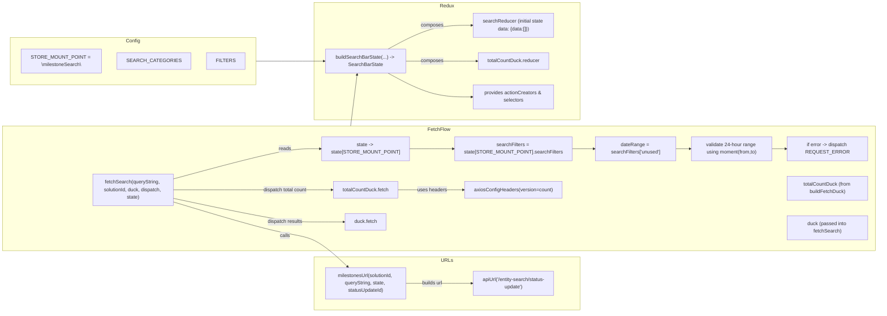
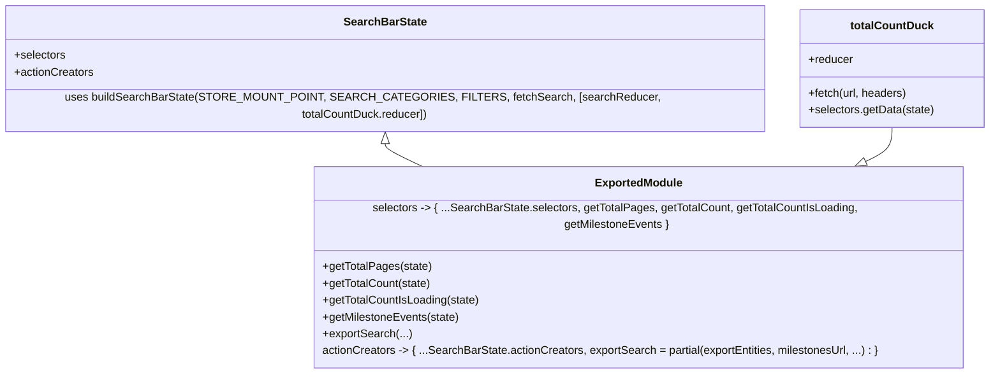

# Diagram: web/portal/src/pages/milestone/search/MilestoneDashboardSearchBarState.js

> Auto-generated by Obscura crawlers

## Diagram 1

### SVG

<svg id="container" width="2767.59375" xmlns="http://www.w3.org/2000/svg" class="flowchart" height="1012" viewBox="0 0 2767.59375 1012" role="graphics-document document" aria-roledescription="flowchart-v2"><g><marker id="container_flowchart-v2-pointEnd" class="marker flowchart-v2" viewBox="0 0 10 10" refX="5" refY="5" markerUnits="userSpaceOnUse" markerWidth="8" markerHeight="8" orient="auto"><path d="M 0 0 L 10 5 L 0 10 z" class="arrowMarkerPath" style="stroke-width: 1; stroke-dasharray: 1, 0;"></path></marker><marker id="container_flowchart-v2-pointStart" class="marker flowchart-v2" viewBox="0 0 10 10" refX="4.5" refY="5" markerUnits="userSpaceOnUse" markerWidth="8" markerHeight="8" orient="auto"><path d="M 0 5 L 10 10 L 10 0 z" class="arrowMarkerPath" style="stroke-width: 1; stroke-dasharray: 1, 0;"></path></marker><marker id="container_flowchart-v2-circleEnd" class="marker flowchart-v2" viewBox="0 0 10 10" refX="11" refY="5" markerUnits="userSpaceOnUse" markerWidth="11" markerHeight="11" orient="auto"><circle cx="5" cy="5" r="5" class="arrowMarkerPath" style="stroke-width: 1; stroke-dasharray: 1, 0;"></circle></marker><marker id="container_flowchart-v2-circleStart" class="marker flowchart-v2" viewBox="0 0 10 10" refX="-1" refY="5" markerUnits="userSpaceOnUse" markerWidth="11" markerHeight="11" orient="auto"><circle cx="5" cy="5" r="5" class="arrowMarkerPath" style="stroke-width: 1; stroke-dasharray: 1, 0;"></circle></marker><marker id="container_flowchart-v2-crossEnd" class="marker cross flowchart-v2" viewBox="0 0 11 11" refX="12" refY="5.2" markerUnits="userSpaceOnUse" markerWidth="11" markerHeight="11" orient="auto"><path d="M 1,1 l 9,9 M 10,1 l -9,9" class="arrowMarkerPath" style="stroke-width: 2; stroke-dasharray: 1, 0;"></path></marker><marker id="container_flowchart-v2-crossStart" class="marker cross flowchart-v2" viewBox="0 0 11 11" refX="-1" refY="5.2" markerUnits="userSpaceOnUse" markerWidth="11" markerHeight="11" orient="auto"><path d="M 1,1 l 9,9 M 10,1 l -9,9" class="arrowMarkerPath" style="stroke-width: 2; stroke-dasharray: 1, 0;"></path></marker><g class="root"><g class="clusters"><g class="cluster" id="Redux" data-look="classic"><rect style="" x="983.078125" y="8" width="821.515625" height="380"></rect><g class="cluster-label" transform="translate(1371.4296875, 8)"><foreignObject width="44.8125" height="24">

Redux

</foreignObject></g></g><g class="cluster" id="FetchFlow" data-look="classic"><rect style="" x="8" y="408" width="2751.59375" height="404"></rect><g class="cluster-label" transform="translate(1347.9453125, 408)"><foreignObject width="71.703125" height="24">

FetchFlow

</foreignObject></g></g><g class="cluster" id="URLs" data-look="classic"><rect style="" x="983.078125" y="832" width="821.515625" height="172"></rect><g class="cluster-label" transform="translate(1376.09375, 832)"><foreignObject width="35.484375" height="24">

URLs

</foreignObject></g></g></g><g class="edgePaths"><path d="M1270.688,918L1283.253,918C1295.818,918,1320.948,918,1353.371,918C1385.794,918,1425.51,918,1445.368,918L1465.227,918" id="L_milestonesUrl_API_0" class="edge-thickness-normal edge-pattern-solid edge-thickness-normal edge-pattern-solid flowchart-link" style=";" data-edge="true" data-et="edge" data-id="L_milestonesUrl_API_0" data-points="W3sieCI6MTI3MC42ODc1LCJ5Ijo5MTh9LHsieCI6MTM0Ni4wNzgxMjUsInkiOjkxOH0seyJ4IjoxNDY5LjIyNjU2MjUsInkiOjkxOH1d" marker-end="url(#container_flowchart-v2-pointEnd)"></path><path d="M540.258,578.603L597.764,562.502C655.271,546.402,770.284,514.201,844.087,498.1C917.891,482,950.484,482,970.281,482C990.078,482,997.078,482,1000.578,482L1004.078,482" id="L_fetchSearch_stateNode_0" class="edge-thickness-normal edge-pattern-solid edge-thickness-normal edge-pattern-solid flowchart-link" style=";" data-edge="true" data-et="edge" data-id="L_fetchSearch_stateNode_0" data-points="W3sieCI6NTQwLjI1NzgxMjUsInkiOjU3OC42MDI5OTMxNzQ5MDM0fSx7IngiOjg4NS4yOTY4NzUsInkiOjQ4Mn0seyJ4Ijo5ODMuMDc4MTI1LCJ5Ijo0ODJ9LHsieCI6MTAwOC4wNzgxMjUsInkiOjQ4Mn1d" marker-end="url(#container_flowchart-v2-pointEnd)"></path><path d="M1273.297,482L1285.427,482C1297.557,482,1321.818,482,1345.411,482C1369.005,482,1391.932,482,1403.396,482L1414.859,482" id="L_stateNode_searchFilters_0" class="edge-thickness-normal edge-pattern-solid edge-thickness-normal edge-pattern-solid flowchart-link" style=";" data-edge="true" data-et="edge" data-id="L_stateNode_searchFilters_0" data-points="W3sieCI6MTI3My4yOTY4NzUsInkiOjQ4Mn0seyJ4IjoxMzQ2LjA3ODEyNSwieSI6NDgyfSx7IngiOjE0MTguODU5Mzc1LCJ5Ijo0ODJ9XQ==" marker-end="url(#container_flowchart-v2-pointEnd)"></path><path d="M1779.594,482L1783.76,482C1787.927,482,1796.26,482,1804.594,482C1812.927,482,1821.26,482,1828.927,482C1836.594,482,1843.594,482,1847.094,482L1850.594,482" id="L_searchFilters_dateRange_0" class="edge-thickness-normal edge-pattern-solid edge-thickness-normal edge-pattern-solid flowchart-link" style=";" data-edge="true" data-et="edge" data-id="L_searchFilters_dateRange_0" data-points="W3sieCI6MTc3OS41OTM3NSwieSI6NDgyfSx7IngiOjE4MDQuNTkzNzUsInkiOjQ4Mn0seyJ4IjoxODI5LjU5Mzc1LCJ5Ijo0ODJ9LHsieCI6MTg1NC41OTM3NSwieSI6NDgyfV0=" marker-end="url(#container_flowchart-v2-pointEnd)"></path><path d="M2114.594,482L2118.76,482C2122.927,482,2131.26,482,2138.927,482C2146.594,482,2153.594,482,2157.094,482L2160.594,482" id="L_dateRange_validateDate_0" class="edge-thickness-normal edge-pattern-solid edge-thickness-normal edge-pattern-solid flowchart-link" style=";" data-edge="true" data-et="edge" data-id="L_dateRange_validateDate_0" data-points="W3sieCI6MjExNC41OTM3NSwieSI6NDgyfSx7IngiOjIxMzkuNTkzNzUsInkiOjQ4Mn0seyJ4IjoyMTY0LjU5Mzc1LCJ5Ijo0ODJ9XQ==" marker-end="url(#container_flowchart-v2-pointEnd)"></path><path d="M2424.594,482L2428.76,482C2432.927,482,2441.26,482,2448.927,482C2456.594,482,2463.594,482,2467.094,482L2470.594,482" id="L_validateDate_errorNode_0" class="edge-thickness-normal edge-pattern-solid edge-thickness-normal edge-pattern-solid flowchart-link" style=";" data-edge="true" data-et="edge" data-id="L_validateDate_errorNode_0" data-points="W3sieCI6MjQyNC41OTM3NSwieSI6NDgyfSx7IngiOjI0NDkuNTkzNzUsInkiOjQ4Mn0seyJ4IjoyNDc0LjU5Mzc1LCJ5Ijo0ODJ9XQ==" marker-end="url(#container_flowchart-v2-pointEnd)"></path><path d="M540.258,655.502L597.764,673.418C655.271,691.335,770.284,727.167,844.087,745.084C917.891,763,950.484,763,983.931,779.866C1017.378,796.732,1051.677,830.464,1068.827,847.329L1085.977,864.195" id="L_fetchSearch_milestonesUrl_0" class="edge-thickness-normal edge-pattern-solid edge-thickness-normal edge-pattern-solid flowchart-link" style=";" data-edge="true" data-et="edge" data-id="L_fetchSearch_milestonesUrl_0" data-points="W3sieCI6NTQwLjI1NzgxMjUsInkiOjY1NS41MDE5MzI0MDY4NzQ0fSx7IngiOjg4NS4yOTY4NzUsInkiOjc2M30seyJ4Ijo5ODMuMDc4MTI1LCJ5Ijo3NjN9LHsieCI6MTA4OC44Mjg5MzE0NTE2MTI4LCJ5Ijo4Njd9XQ==" marker-end="url(#container_flowchart-v2-pointEnd)"></path><path d="M540.258,615L597.764,615C655.271,615,770.284,615,844.087,615C917.891,615,950.484,615,974.729,615C998.974,615,1014.87,615,1022.818,615L1030.766,615" id="L_fetchSearch_totalCountDuck.fetch_0" class="edge-thickness-normal edge-pattern-solid edge-thickness-normal edge-pattern-solid flowchart-link" style=";" data-edge="true" data-et="edge" data-id="L_fetchSearch_totalCountDuck.fetch_0" data-points="W3sieCI6NTQwLjI1NzgxMjUsInkiOjYxNX0seyJ4Ijo4ODUuMjk2ODc1LCJ5Ijo2MTV9LHsieCI6OTgzLjA3ODEyNSwieSI6NjE1fSx7IngiOjEwMzQuNzY1NjI1LCJ5Ijo2MTV9XQ==" marker-end="url(#container_flowchart-v2-pointEnd)"></path><path d="M1246.609,615L1263.188,615C1279.766,615,1312.922,615,1344.759,615C1376.596,615,1407.115,615,1422.374,615L1437.633,615" id="L_totalCountDuck.fetch_axiosHeaders_0" class="edge-thickness-normal edge-pattern-solid edge-thickness-normal edge-pattern-solid flowchart-link" style=";" data-edge="true" data-et="edge" data-id="L_totalCountDuck.fetch_axiosHeaders_0" data-points="W3sieCI6MTI0Ni42MDkzNzUsInkiOjYxNX0seyJ4IjoxMzQ2LjA3ODEyNSwieSI6NjE1fSx7IngiOjE0NDEuNjMyODEyNSwieSI6NjE1fV0=" marker-end="url(#container_flowchart-v2-pointEnd)"></path><path d="M540.258,643.461L597.764,656.051C655.271,668.641,770.284,693.82,844.087,706.41C917.891,719,950.484,719,981.142,719C1011.799,719,1040.521,719,1054.882,719L1069.242,719" id="L_fetchSearch_duck.fetch_0" class="edge-thickness-normal edge-pattern-solid edge-thickness-normal edge-pattern-solid flowchart-link" style=";" data-edge="true" data-et="edge" data-id="L_fetchSearch_duck.fetch_0" data-points="W3sieCI6NTQwLjI1NzgxMjUsInkiOjY0My40NjA4MTczNjY5OTI4fSx7IngiOjg4NS4yOTY4NzUsInkiOjcxOX0seyJ4Ijo5ODMuMDc4MTI1LCJ5Ijo3MTl9LHsieCI6MTA3My4yNDIxODc1LCJ5Ijo3MTl9XQ==" marker-end="url(#container_flowchart-v2-pointEnd)"></path><path d="M1209.741,237L1232.464,249.833C1255.187,262.667,1300.632,288.333,1343.213,301.167C1385.794,314,1425.51,314,1445.368,314L1465.227,314" id="L_SearchBarStateBuilder_SearchBarStateBuilderNote_0" class="edge-thickness-normal edge-pattern-solid edge-thickness-normal edge-pattern-solid flowchart-link" style=";" data-edge="true" data-et="edge" data-id="L_SearchBarStateBuilder_SearchBarStateBuilderNote_0" data-points="W3sieCI6MTIwOS43NDEyNDQ2MTIwNjksInkiOjIzN30seyJ4IjoxMzQ2LjA3ODEyNSwieSI6MzE0fSx7IngiOjE0NjkuMjI2NTYyNSwieSI6MzE0fV0=" marker-end="url(#container_flowchart-v2-pointEnd)"></path><path d="M1209.741,159L1232.464,146.167C1255.187,133.333,1300.632,107.667,1343.213,94.833C1385.794,82,1425.51,82,1445.368,82L1465.227,82" id="L_SearchBarStateBuilder_searchReducer_0" class="edge-thickness-normal edge-pattern-solid edge-thickness-normal edge-pattern-solid flowchart-link" style=";" data-edge="true" data-et="edge" data-id="L_SearchBarStateBuilder_searchReducer_0" data-points="W3sieCI6MTIwOS43NDEyNDQ2MTIwNjksInkiOjE1OX0seyJ4IjoxMzQ2LjA3ODEyNSwieSI6ODJ9LHsieCI6MTQ2OS4yMjY1NjI1LCJ5Ijo4Mn1d" marker-end="url(#container_flowchart-v2-pointEnd)"></path><path d="M1270.688,198L1283.253,198C1295.818,198,1320.948,198,1355.779,198C1390.609,198,1435.141,198,1457.406,198L1479.672,198" id="L_SearchBarStateBuilder_totalCountDuckReducer_0" class="edge-thickness-normal edge-pattern-solid edge-thickness-normal edge-pattern-solid flowchart-link" style=";" data-edge="true" data-et="edge" data-id="L_SearchBarStateBuilder_totalCountDuckReducer_0" data-points="W3sieCI6MTI3MC42ODc1LCJ5IjoxOTh9LHsieCI6MTM0Ni4wNzgxMjUsInkiOjE5OH0seyJ4IjoxNDgzLjY3MTg3NSwieSI6MTk4fV0=" marker-end="url(#container_flowchart-v2-pointEnd)"></path><path d="M787.516,198L803.813,198C820.109,198,852.703,198,885.297,198C917.891,198,950.484,198,970.716,198C990.948,198,998.818,198,1002.753,198L1006.688,198" id="L_Config_SearchBarStateBuilder_0" class="edge-thickness-normal edge-pattern-solid edge-thickness-normal edge-pattern-solid flowchart-link" style=";" data-edge="true" data-et="edge" data-id="L_Config_SearchBarStateBuilder_0" data-points="W3sieCI6Nzg3LjUxNTYyNSwieSI6MTk4fSx7IngiOjg4NS4yOTY4NzUsInkiOjE5OH0seyJ4Ijo5ODMuMDc4MTI1LCJ5IjoxOTh9LHsieCI6MTAxMC42ODc1LCJ5IjoxOTh9XQ==" marker-end="url(#container_flowchart-v2-pointEnd)"></path><path d="M1094.909,408L1114.711,240.972" id="L_FetchFlow_SearchBarStateBuilder_0" class="edge-thickness-normal edge-pattern-solid edge-thickness-normal edge-pattern-solid flowchart-link" style=";" data-edge="true" data-et="edge" data-id="L_FetchFlow_SearchBarStateBuilder_0" data-points="W3sieCI6NTQwLjI1NzgxMjUsInkiOjU2Ni44MzU1Mzk4NDA0NzM2fSx7IngiOjg4NS4yOTY4NzUsInkiOjQzOX0seyJ4Ijo5ODMuMDc4MTI1LCJ5Ijo0Mzl9LHsieCI6MTExNS4xODIyNDg0NDM5ODMzLCJ5IjoyMzd9XQ==" marker-end="url(#container_flowchart-v2-pointEnd)"></path></g><g class="edgeLabels"><g class="edgeLabel" transform="translate(1346.078125, 918)"><g class="label" data-id="L_milestonesUrl_API_0" transform="translate(-34.703125, -12)"><foreignObject width="69.40625" height="24">

builds url

</foreignObject></g></g><g class="edgeLabel" transform="translate(885.296875, 482)"><g class="label" data-id="L_fetchSearch_stateNode_0" transform="translate(-20.0078125, -12)"><foreignObject width="40.015625" height="24">

reads

</foreignObject></g></g><g class="edgeLabel"><g class="label" data-id="L_stateNode_searchFilters_0" transform="translate(0, 0)"><foreignObject width="0" height="0">

</foreignObject></g></g><g class="edgeLabel"><g class="label" data-id="L_searchFilters_dateRange_0" transform="translate(0, 0)"><foreignObject width="0" height="0">

</foreignObject></g></g><g class="edgeLabel"><g class="label" data-id="L_dateRange_validateDate_0" transform="translate(0, 0)"><foreignObject width="0" height="0">

</foreignObject></g></g><g class="edgeLabel"><g class="label" data-id="L_validateDate_errorNode_0" transform="translate(0, 0)"><foreignObject width="0" height="0">

</foreignObject></g></g><g class="edgeLabel" transform="translate(885.296875, 763)"><g class="label" data-id="L_fetchSearch_milestonesUrl_0" transform="translate(-16.4453125, -12)"><foreignObject width="32.890625" height="24">

calls

</foreignObject></g></g><g class="edgeLabel" transform="translate(885.296875, 615)"><g class="label" data-id="L_fetchSearch_totalCountDuck.fetch_0" transform="translate(-72.78125, -12)"><foreignObject width="145.5625" height="24">

dispatch total count

</foreignObject></g></g><g class="edgeLabel" transform="translate(1346.078125, 615)"><g class="label" data-id="L_totalCountDuck.fetch_axiosHeaders_0" transform="translate(-47.78125, -12)"><foreignObject width="95.5625" height="24">

uses headers

</foreignObject></g></g><g class="edgeLabel" transform="translate(885.296875, 719)"><g class="label" data-id="L_fetchSearch_duck.fetch_0" transform="translate(-57.7734375, -12)"><foreignObject width="115.546875" height="24">

dispatch results

</foreignObject></g></g><g class="edgeLabel"><g class="label" data-id="L_SearchBarStateBuilder_SearchBarStateBuilderNote_0" transform="translate(0, 0)"><foreignObject width="0" height="0">

</foreignObject></g></g><g class="edgeLabel" transform="translate(1346.078125, 82)"><g class="label" data-id="L_SearchBarStateBuilder_searchReducer_0" transform="translate(-36.453125, -12)"><foreignObject width="72.90625" height="24">

composes

</foreignObject></g></g><g class="edgeLabel" transform="translate(1346.078125, 198)"><g class="label" data-id="L_SearchBarStateBuilder_totalCountDuckReducer_0" transform="translate(-36.453125, -12)"><foreignObject width="72.90625" height="24">

composes

</foreignObject></g></g><g class="edgeLabel"><g class="label" data-id="L_Config_SearchBarStateBuilder_0" transform="translate(0, 0)"><foreignObject width="0" height="0">

</foreignObject></g></g><g class="edgeLabel"><g class="label" data-id="L_FetchFlow_SearchBarStateBuilder_0" transform="translate(0, 0)"><foreignObject width="0" height="0">

</foreignObject></g></g></g><g class="nodes"><g class="root" transform="translate(25, 113.5)"><g class="clusters"><g class="cluster" id="Config" data-look="classic"><rect style="" x="8" y="8" width="754.515625" height="153"></rect><g class="cluster-label" transform="translate(362.8125, 8)"><foreignObject width="44.890625" height="24">

Config

</foreignObject></g></g></g><g class="edgePaths"></g><g class="edgeLabels"></g><g class="nodes"><g class="node default" id="flowchart-STORE_MOUNT_POINT-0" transform="translate(173, 84.5)"><rect class="basic label-container" style="" x="-130" y="-39" width="260" height="78"></rect><g class="label" style="" transform="translate(-100, -24)"><rect></rect><foreignObject width="200" height="48">

STORE_MOUNT_POINT = \milestoneSearch\

</foreignObject></g></g><g class="node default" id="flowchart-SEARCH_CATEGORIES-1" transform="translate(458.0859375, 84.5)"><rect class="basic label-container" style="" x="-105.0859375" y="-27" width="210.171875" height="54"></rect><g class="label" style="" transform="translate(-75.0859375, -12)"><rect></rect><foreignObject width="150.171875" height="24">

SEARCH_CATEGORIES

</foreignObject></g></g><g class="node default" id="flowchart-FILTERS-2" transform="translate(670.34375, 84.5)"><rect class="basic label-container" style="" x="-57.171875" y="-27" width="114.34375" height="54"></rect><g class="label" style="" transform="translate(-27.171875, -12)"><rect></rect><foreignObject width="54.34375" height="24">

FILTERS

</foreignObject></g></g></g></g><g class="node default" id="flowchart-API-3" transform="translate(1599.2265625, 918)"><rect class="basic label-container" style="" x="-130" y="-39" width="260" height="78"></rect><g class="label" style="" transform="translate(-100, -24)"><rect></rect><foreignObject width="200" height="48">

apiUrl('/entity-search/status-update')

</foreignObject></g></g><g class="node default" id="flowchart-milestonesUrl-4" transform="translate(1140.6875, 918)"><rect class="basic label-container" style="" x="-130" y="-51" width="260" height="102"></rect><g class="label" style="" transform="translate(-100, -36)"><rect></rect><foreignObject width="200" height="72">

milestonesUrl(solutionId, queryString, state, statusUpdateId)

</foreignObject></g></g><g class="node default" id="flowchart-fetchSearch-7" transform="translate(410.2578125, 615)"><rect class="basic label-container" style="" x="-130" y="-51" width="260" height="102"></rect><g class="label" style="" transform="translate(-100, -36)"><rect></rect><foreignObject width="200" height="72">

fetchSearch(queryString, solutionId, duck, dispatch, state)

</foreignObject></g></g><g class="node default" id="flowchart-stateNode-8" transform="translate(1140.6875, 482)"><rect class="basic label-container" style="" x="-132.609375" y="-39" width="265.21875" height="78"></rect><g class="label" style="" transform="translate(-102.609375, -24)"><rect></rect><foreignObject width="205.21875" height="48">

state -&gt; state[STORE_MOUNT_POINT]

</foreignObject></g></g><g class="node default" id="flowchart-searchFilters-9" transform="translate(1599.2265625, 482)"><rect class="basic label-container" style="" x="-180.3671875" y="-39" width="360.734375" height="78"></rect><g class="label" style="" transform="translate(-150.3671875, -24)"><rect></rect><foreignObject width="300.734375" height="48">

searchFilters = state[STORE_MOUNT_POINT].searchFilters

</foreignObject></g></g><g class="node default" id="flowchart-dateRange-10" transform="translate(1984.59375, 482)"><rect class="basic label-container" style="" x="-130" y="-39" width="260" height="78"></rect><g class="label" style="" transform="translate(-100, -24)"><rect></rect><foreignObject width="200" height="48">

dateRange = searchFilters['unused']

</foreignObject></g></g><g class="node default" id="flowchart-validateDate-11" transform="translate(2294.59375, 482)"><rect class="basic label-container" style="" x="-130" y="-39" width="260" height="78"></rect><g class="label" style="" transform="translate(-100, -24)"><rect></rect><foreignObject width="200" height="48">

validate 24-hour range using moment(from,to)

</foreignObject></g></g><g class="node default" id="flowchart-errorNode-12" transform="translate(2604.59375, 482)"><rect class="basic label-container" style="" x="-130" y="-39" width="260" height="78"></rect><g class="label" style="" transform="translate(-100, -24)"><rect></rect><foreignObject width="200" height="48">

if error -&gt; dispatch REQUEST_ERROR

</foreignObject></g></g><g class="node default" id="flowchart-totalCountDuck-13" transform="translate(2604.59375, 610)"><rect class="basic label-container" style="" x="-130" y="-39" width="260" height="78"></rect><g class="label" style="" transform="translate(-100, -24)"><rect></rect><foreignObject width="200" height="48">

totalCountDuck (from buildFetchDuck)

</foreignObject></g></g><g class="node default" id="flowchart-duck-14" transform="translate(2604.59375, 738)"><rect class="basic label-container" style="" x="-130" y="-39" width="260" height="78"></rect><g class="label" style="" transform="translate(-100, -24)"><rect></rect><foreignObject width="200" height="48">

duck (passed into fetchSearch)

</foreignObject></g></g><g class="node default" id="flowchart-axiosHeaders-15" transform="translate(1599.2265625, 615)"><rect class="basic label-container" style="" x="-157.59375" y="-27" width="315.1875" height="54"></rect><g class="label" style="" transform="translate(-127.59375, -12)"><rect></rect><foreignObject width="255.1875" height="24">

axiosConfigHeaders(version=count)

</foreignObject></g></g><g class="node default" id="flowchart-totalCountDuck.fetch-29" transform="translate(1140.6875, 615)"><rect class="basic label-container" style="" x="-105.921875" y="-27" width="211.84375" height="54"></rect><g class="label" style="" transform="translate(-75.921875, -12)"><rect></rect><foreignObject width="151.84375" height="24">

totalCountDuck.fetch

</foreignObject></g></g><g class="node default" id="flowchart-duck.fetch-33" transform="translate(1140.6875, 719)"><rect class="basic label-container" style="" x="-67.4453125" y="-27" width="134.890625" height="54"></rect><g class="label" style="" transform="translate(-37.4453125, -12)"><rect></rect><foreignObject width="74.890625" height="24">

duck.fetch

</foreignObject></g></g><g class="node default" id="flowchart-searchReducer-34" transform="translate(1599.2265625, 82)"><rect class="basic label-container" style="" x="-130" y="-39" width="260" height="78"></rect><g class="label" style="" transform="translate(-100, -24)"><rect></rect><foreignObject width="200" height="48">

searchReducer (initial state data: {data:[]})

</foreignObject></g></g><g class="node default" id="flowchart-totalCountDuckReducer-35" transform="translate(1599.2265625, 198)"><rect class="basic label-container" style="" x="-115.5546875" y="-27" width="231.109375" height="54"></rect><g class="label" style="" transform="translate(-85.5546875, -12)"><rect></rect><foreignObject width="171.109375" height="24">

totalCountDuck.reducer

</foreignObject></g></g><g class="node default" id="flowchart-SearchBarStateBuilder-36" transform="translate(1140.6875, 198)"><rect class="basic label-container" style="" x="-130" y="-39" width="260" height="78"></rect><g class="label" style="" transform="translate(-100, -24)"><rect></rect><foreignObject width="200" height="48">

buildSearchBarState(...) -&gt; SearchBarState

</foreignObject></g></g><g class="node default" id="flowchart-SearchBarStateBuilderNote-38" transform="translate(1599.2265625, 314)"><rect class="basic label-container" style="" x="-130" y="-39" width="260" height="78"></rect><g class="label" style="" transform="translate(-100, -24)"><rect></rect><foreignObject width="200" height="48">

provides actionCreators &amp; selectors

</foreignObject></g></g></g></g></g></svg>

## Diagram 2

### SVG

<svg id="container" width="1377.0390625" xmlns="http://www.w3.org/2000/svg" class="classDiagram" height="498" viewBox="0 0 1377.0390625 498" role="graphics-document document" aria-roledescription="class"><g><defs><marker id="container_class-aggregationStart" class="marker aggregation class" refX="18" refY="7" markerWidth="190" markerHeight="240" orient="auto"><path d="M 18,7 L9,13 L1,7 L9,1 Z"></path></marker></defs><defs><marker id="container_class-aggregationEnd" class="marker aggregation class" refX="1" refY="7" markerWidth="20" markerHeight="28" orient="auto"><path d="M 18,7 L9,13 L1,7 L9,1 Z"></path></marker></defs><defs><marker id="container_class-extensionStart" class="marker extension class" refX="18" refY="7" markerWidth="190" markerHeight="240" orient="auto"><path d="M 1,7 L18,13 V 1 Z"></path></marker></defs><defs><marker id="container_class-extensionEnd" class="marker extension class" refX="1" refY="7" markerWidth="20" markerHeight="28" orient="auto"><path d="M 1,1 V 13 L18,7 Z"></path></marker></defs><defs><marker id="container_class-compositionStart" class="marker composition class" refX="18" refY="7" markerWidth="190" markerHeight="240" orient="auto"><path d="M 18,7 L9,13 L1,7 L9,1 Z"></path></marker></defs><defs><marker id="container_class-compositionEnd" class="marker composition class" refX="1" refY="7" markerWidth="20" markerHeight="28" orient="auto"><path d="M 18,7 L9,13 L1,7 L9,1 Z"></path></marker></defs><defs><marker id="container_class-dependencyStart" class="marker dependency class" refX="6" refY="7" markerWidth="190" markerHeight="240" orient="auto"><path d="M 5,7 L9,13 L1,7 L9,1 Z"></path></marker></defs><defs><marker id="container_class-dependencyEnd" class="marker dependency class" refX="13" refY="7" markerWidth="20" markerHeight="28" orient="auto"><path d="M 18,7 L9,13 L14,7 L9,1 Z"></path></marker></defs><defs><marker id="container_class-lollipopStart" class="marker lollipop class" refX="13" refY="7" markerWidth="190" markerHeight="240" orient="auto"><circle stroke="black" fill="transparent" cx="7" cy="7" r="6"></circle></marker></defs><defs><marker id="container_class-lollipopEnd" class="marker lollipop class" refX="1" refY="7" markerWidth="190" markerHeight="240" orient="auto"><circle stroke="black" fill="transparent" cx="7" cy="7" r="6"></circle></marker></defs><g class="root"><g class="clusters"></g><g class="edgePaths"><path d="M533.473,193.25L533.473,194.542C533.473,195.833,533.473,198.417,542.835,203.875C552.197,209.333,570.921,217.667,580.283,221.833L589.645,226" id="id_SearchBarState_ExportedModule_1" class="edge-thickness-normal edge-pattern-solid relation" style=";;;" data-edge="true" data-et="edge" data-id="id_SearchBarState_ExportedModule_1" data-points="W3sieCI6NTMzLjQ3MjY1NjI1LCJ5IjoxNzZ9LHsieCI6NTMzLjQ3MjY1NjI1LCJ5IjoyMDF9LHsieCI6NTg5LjY0NDU5MzQ1MTQzMzEsInkiOjIyNn1d" marker-start="url(#container_class-extensionStart)"></path><path d="M1238.992,176L1238.992,180.167C1238.992,184.333,1238.992,192.667,1232.257,199.831C1225.521,206.995,1212.051,212.991,1205.315,215.988L1198.58,218.986" id="id_totalCountDuck_ExportedModule_2" class="edge-thickness-normal edge-pattern-solid relation" style=";;;" data-edge="true" data-et="edge" data-id="id_totalCountDuck_ExportedModule_2" data-points="W3sieCI6MTIzOC45OTIxODc1LCJ5IjoxNzZ9LHsieCI6MTIzOC45OTIxODc1LCJ5IjoyMDF9LHsieCI6MTE4Mi44MjAyNTAyOTg1NjY5LCJ5IjoyMjZ9XQ==" marker-end="url(#container_class-extensionEnd)"></path></g><g class="edgeLabels"><g class="edgeLabel"><g class="label" data-id="id_SearchBarState_ExportedModule_1" transform="translate(0, 0)"><foreignObject width="0" height="0">

</foreignObject></g></g><g class="edgeLabel"><g class="label" data-id="id_totalCountDuck_ExportedModule_2" transform="translate(0, 0)"><foreignObject width="0" height="0">

</foreignObject></g></g></g><g class="nodes"><g class="node default" id="classId-ExportedModule-0" transform="translate(886.232421875, 358)"><g class="basic label-container"><path d="M-462.97265625 -132 L462.97265625 -132 L462.97265625 132 L-462.97265625 132" stroke="none" stroke-width="0" fill="#ECECFF" style=""></path><path d="M-462.97265625 -132 C-247.65499102121473 -132, -32.33732579242945 -132, 462.97265625 -132 M-462.97265625 -132 C-131.01233515952993 -132, 200.94798593094015 -132, 462.97265625 -132 M462.97265625 -132 C462.97265625 -63.3762866851112, 462.97265625 5.247426629777607, 462.97265625 132 M462.97265625 -132 C462.97265625 -60.929585136199734, 462.97265625 10.140829727600533, 462.97265625 132 M462.97265625 132 C245.59276748193003 132, 28.21287871386005 132, -462.97265625 132 M462.97265625 132 C103.51672113322888 132, -255.93921398354223 132, -462.97265625 132 M-462.97265625 132 C-462.97265625 50.664221630722025, -462.97265625 -30.67155673855595, -462.97265625 -132 M-462.97265625 132 C-462.97265625 64.20718603120184, -462.97265625 -3.585627937596314, -462.97265625 -132" stroke="#9370DB" stroke-width="1.3" fill="none" stroke-dasharray="0 0" style=""></path></g><g class="annotation-group text" transform="translate(0, -108)"></g><g class="label-group text" transform="translate(-60.2109375, -108)"><g class="label" style="font-weight: bolder" transform="translate(0,-12)"><foreignObject width="120.421875" height="24">

ExportedModule

</foreignObject></g></g><g class="members-group text" transform="translate(-450.97265625, -60)"><g class="label" style="" transform="translate(0,-12)"><foreignObject width="841.734375" height="24">

selectors -&gt; { ...SearchBarState.selectors, getTotalPages, getTotalCount, getTotalCountIsLoading, getMilestoneEvents }

</foreignObject></g></g><g class="methods-group text" transform="translate(-450.97265625, -12)"><g class="label" style="" transform="translate(0,-12)"><foreignObject width="153.859375" height="24">

+getTotalPages(state)

</foreignObject></g><g class="label" style="" transform="translate(0,12)"><foreignObject width="155.09375" height="24">

+getTotalCount(state)

</foreignObject></g><g class="label" style="" transform="translate(0,36)"><foreignObject width="224.515625" height="24">

+getTotalCountIsLoading(state)

</foreignObject></g><g class="label" style="" transform="translate(0,60)"><foreignObject width="195.140625" height="24">

+getMilestoneEvents(state)

</foreignObject></g><g class="label" style="" transform="translate(0,84)"><foreignObject width="125.71875" height="24">

+exportSearch(...)

</foreignObject></g><g class="label" style="" transform="translate(0,108)"><foreignObject width="795.171875" height="24">

actionCreators -&gt; { ...SearchBarState.actionCreators, exportSearch = partial(exportEntities, milestonesUrl, ...) : }

</foreignObject></g></g><g class="divider" style=""><path d="M-462.97265625 -84 C-120.63182053738473 -84, 221.70901517523055 -84, 462.97265625 -84 M-462.97265625 -84 C-168.62579691690678 -84, 125.72106241618644 -84, 462.97265625 -84" stroke="#9370DB" stroke-width="1.3" fill="none" stroke-dasharray="0 0" style=""></path></g><g class="divider" style=""><path d="M-462.97265625 -36 C-105.33254673362728 -36, 252.30756278274544 -36, 462.97265625 -36 M-462.97265625 -36 C-189.27768994916954 -36, 84.41727635166092 -36, 462.97265625 -36" stroke="#9370DB" stroke-width="1.3" fill="none" stroke-dasharray="0 0" style=""></path></g></g><g class="node default" id="classId-SearchBarState-1" transform="translate(533.47265625, 92)"><g class="basic label-container"><path d="M-525.47265625 -84 L525.47265625 -84 L525.47265625 84 L-525.47265625 84" stroke="none" stroke-width="0" fill="#ECECFF" style=""></path><path d="M-525.47265625 -84 C-285.37946263174604 -84, -45.28626901349202 -84, 525.47265625 -84 M-525.47265625 -84 C-228.247287401898 -84, 68.97808144620399 -84, 525.47265625 -84 M525.47265625 -84 C525.47265625 -48.11126359447738, 525.47265625 -12.222527188954757, 525.47265625 84 M525.47265625 -84 C525.47265625 -39.282173045730154, 525.47265625 5.435653908539692, 525.47265625 84 M525.47265625 84 C209.37879915102963 84, -106.71505794794075 84, -525.47265625 84 M525.47265625 84 C281.2528801456292 84, 37.03310404125841 84, -525.47265625 84 M-525.47265625 84 C-525.47265625 49.41778354226182, -525.47265625 14.835567084523646, -525.47265625 -84 M-525.47265625 84 C-525.47265625 17.36986110030294, -525.47265625 -49.26027779939412, -525.47265625 -84" stroke="#9370DB" stroke-width="1.3" fill="none" stroke-dasharray="0 0" style=""></path></g><g class="annotation-group text" transform="translate(0, -60)"></g><g class="label-group text" transform="translate(-56.5546875, -60)"><g class="label" style="font-weight: bolder" transform="translate(0,-12)"><foreignObject width="113.109375" height="24">

SearchBarState

</foreignObject></g></g><g class="members-group text" transform="translate(-513.47265625, -12)"><g class="label" style="" transform="translate(0,-12)"><foreignObject width="73.453125" height="24">

+selectors

</foreignObject></g><g class="label" style="" transform="translate(0,12)"><foreignObject width="113.078125" height="24">

+actionCreators

</foreignObject></g></g><g class="methods-group text" transform="translate(-513.47265625, 60)"><g class="label" style="" transform="translate(0,-12)"><foreignObject width="970.390625" height="24">

uses buildSearchBarState(STORE_MOUNT_POINT, SEARCH_CATEGORIES, FILTERS, fetchSearch, [searchReducer, totalCountDuck.reducer])

</foreignObject></g></g><g class="divider" style=""><path d="M-525.47265625 -36 C-242.67114520882967 -36, 40.13036583234066 -36, 525.47265625 -36 M-525.47265625 -36 C-263.0296752093086 -36, -0.586694168617214 -36, 525.47265625 -36" stroke="#9370DB" stroke-width="1.3" fill="none" stroke-dasharray="0 0" style=""></path></g><g class="divider" style=""><path d="M-525.47265625 36 C-193.3989136177634 36, 138.67482901447318 36, 525.47265625 36 M-525.47265625 36 C-291.93852039765056 36, -58.40438454530107 36, 525.47265625 36" stroke="#9370DB" stroke-width="1.3" fill="none" stroke-dasharray="0 0" style=""></path></g></g><g class="node default" id="classId-totalCountDuck-2" transform="translate(1238.9921875, 92)"><g class="basic label-container"><path d="M-130.046875 -84 L130.046875 -84 L130.046875 84 L-130.046875 84" stroke="none" stroke-width="0" fill="#ECECFF" style=""></path><path d="M-130.046875 -84 C-31.040782045157115 -84, 67.96531090968577 -84, 130.046875 -84 M-130.046875 -84 C-38.83937799722102 -84, 52.36811900555796 -84, 130.046875 -84 M130.046875 -84 C130.046875 -17.217123621766277, 130.046875 49.56575275646745, 130.046875 84 M130.046875 -84 C130.046875 -42.366980905312985, 130.046875 -0.7339618106259707, 130.046875 84 M130.046875 84 C47.014077701375754 84, -36.01871959724849 84, -130.046875 84 M130.046875 84 C49.31618612637689 84, -31.414502747246217 84, -130.046875 84 M-130.046875 84 C-130.046875 21.52333841798621, -130.046875 -40.95332316402758, -130.046875 -84 M-130.046875 84 C-130.046875 20.927529436166118, -130.046875 -42.144941127667764, -130.046875 -84" stroke="#9370DB" stroke-width="1.3" fill="none" stroke-dasharray="0 0" style=""></path></g><g class="annotation-group text" transform="translate(0, -60)"></g><g class="label-group text" transform="translate(-56.71875, -60)"><g class="label" style="font-weight: bolder" transform="translate(0,-12)"><foreignObject width="113.4375" height="24">

totalCountDuck

</foreignObject></g></g><g class="members-group text" transform="translate(-118.046875, -12)"><g class="label" style="" transform="translate(0,-12)"><foreignObject width="63.515625" height="24">

+reducer

</foreignObject></g></g><g class="methods-group text" transform="translate(-118.046875, 36)"><g class="label" style="" transform="translate(0,-12)"><foreignObject width="141.25" height="24">

+fetch(url, headers)

</foreignObject></g><g class="label" style="" transform="translate(0,12)"><foreignObject width="179.375" height="24">

+selectors.getData(state)

</foreignObject></g></g><g class="divider" style=""><path d="M-130.046875 -36 C-69.10363064111681 -36, -8.160386282233631 -36, 130.046875 -36 M-130.046875 -36 C-64.32174741242761 -36, 1.4033801751447754 -36, 130.046875 -36" stroke="#9370DB" stroke-width="1.3" fill="none" stroke-dasharray="0 0" style=""></path></g><g class="divider" style=""><path d="M-130.046875 12 C-59.0585139049616 12, 11.9298471900768 12, 130.046875 12 M-130.046875 12 C-57.86357515756592 12, 14.319724684868163 12, 130.046875 12" stroke="#9370DB" stroke-width="1.3" fill="none" stroke-dasharray="0 0" style=""></path></g></g></g></g></g></svg>
