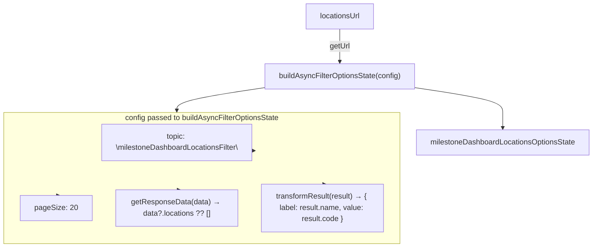

# Diagram: web/portal/src/pages/milestone/search/MilestoneEventFilterLoaders.js

> Auto-generated by Obscura crawlers

## Mermaid

### SVG

<svg id="container" width="1263.625" xmlns="http://www.w3.org/2000/svg" class="flowchart" height="528" viewBox="0 0 1263.625 528" role="graphics-document document" aria-roledescription="flowchart-v2"><g><marker id="container_flowchart-v2-pointEnd" class="marker flowchart-v2" viewBox="0 0 10 10" refX="5" refY="5" markerUnits="userSpaceOnUse" markerWidth="8" markerHeight="8" orient="auto"><path d="M 0 0 L 10 5 L 0 10 z" class="arrowMarkerPath" style="stroke-width: 1; stroke-dasharray: 1, 0;"></path></marker><marker id="container_flowchart-v2-pointStart" class="marker flowchart-v2" viewBox="0 0 10 10" refX="4.5" refY="5" markerUnits="userSpaceOnUse" markerWidth="8" markerHeight="8" orient="auto"><path d="M 0 5 L 10 10 L 10 0 z" class="arrowMarkerPath" style="stroke-width: 1; stroke-dasharray: 1, 0;"></path></marker><marker id="container_flowchart-v2-circleEnd" class="marker flowchart-v2" viewBox="0 0 10 10" refX="11" refY="5" markerUnits="userSpaceOnUse" markerWidth="11" markerHeight="11" orient="auto"><circle cx="5" cy="5" r="5" class="arrowMarkerPath" style="stroke-width: 1; stroke-dasharray: 1, 0;"></circle></marker><marker id="container_flowchart-v2-circleStart" class="marker flowchart-v2" viewBox="0 0 10 10" refX="-1" refY="5" markerUnits="userSpaceOnUse" markerWidth="11" markerHeight="11" orient="auto"><circle cx="5" cy="5" r="5" class="arrowMarkerPath" style="stroke-width: 1; stroke-dasharray: 1, 0;"></circle></marker><marker id="container_flowchart-v2-crossEnd" class="marker cross flowchart-v2" viewBox="0 0 11 11" refX="12" refY="5.2" markerUnits="userSpaceOnUse" markerWidth="11" markerHeight="11" orient="auto"><path d="M 1,1 l 9,9 M 10,1 l -9,9" class="arrowMarkerPath" style="stroke-width: 2; stroke-dasharray: 1, 0;"></path></marker><marker id="container_flowchart-v2-crossStart" class="marker cross flowchart-v2" viewBox="0 0 11 11" refX="-1" refY="5.2" markerUnits="userSpaceOnUse" markerWidth="11" markerHeight="11" orient="auto"><path d="M 1,1 l 9,9 M 10,1 l -9,9" class="arrowMarkerPath" style="stroke-width: 2; stroke-dasharray: 1, 0;"></path></marker><g class="root"><g class="clusters"><g class="cluster" id="config" data-look="classic"><rect style="" x="8" y="240" width="838.4375" height="280"></rect><g class="cluster-label" transform="translate(322.171875, 240)"><foreignObject width="210.09375" height="48">

config passed to buildAsyncFilterOptionsState

</foreignObject></g></g></g><g class="edgePaths"><path d="M719.984,62L719.984,68.167C719.984,74.333,719.984,86.667,719.984,98.333C719.984,110,719.984,121,719.984,126.5L719.984,132" id="L_locationsUrl_builder_0" class="edge-thickness-normal edge-pattern-solid edge-thickness-normal edge-pattern-solid flowchart-link" style=";" data-edge="true" data-et="edge" data-id="L_locationsUrl_builder_0" data-points="W3sieCI6NzE5Ljk4NDM3NSwieSI6NjJ9LHsieCI6NzE5Ljk4NDM3NSwieSI6OTl9LHsieCI6NzE5Ljk4NDM3NSwieSI6MTM2fV0=" marker-end="url(#container_flowchart-v2-pointEnd)"></path><path d="M882.008,187.172L913.095,191.81C944.182,196.448,1006.357,205.724,1037.444,214.529C1068.531,223.333,1068.531,231.667,1068.531,241.333C1068.531,251,1068.531,262,1068.531,267.5L1068.531,273" id="L_builder_milestone_0" class="edge-thickness-normal edge-pattern-solid edge-thickness-normal edge-pattern-solid flowchart-link" style=";" data-edge="true" data-et="edge" data-id="L_builder_milestone_0" data-points="W3sieCI6ODgyLjAwNzgxMjUsInkiOjE4Ny4xNzI0MTIyNDcyNzY2NH0seyJ4IjoxMDY4LjUzMTI1LCJ5IjoyMTV9LHsieCI6MTA2OC41MzEyNSwieSI6MjQwfSx7IngiOjEwNjguNTMxMjUsInkiOjI3N31d" marker-end="url(#container_flowchart-v2-pointEnd)"></path><path d="M557.961,187.172L526.874,191.81C495.786,196.448,433.612,205.724,402.525,213.862C371.438,222,371.438,229,371.438,232.5L371.438,236" id="L_builder_config_0" class="edge-thickness-normal edge-pattern-solid edge-thickness-normal edge-pattern-solid flowchart-link" style=";" data-edge="true" data-et="edge" data-id="L_builder_config_0" data-points="W3sieCI6NTU3Ljk2MDkzNzUsInkiOjE4Ny4xNzI0MTIyNDcyNzY2NH0seyJ4IjozNzEuNDM3NSwieSI6MjE1fSx7IngiOjM3MS40Mzc1LCJ5IjoyNDB9LHsieCI6MzcxLjQzNzUsInkiOjI2NX1d" marker-end="url(#container_flowchart-v2-pointEnd)"></path><path d="M541.703,322.075Z" id="L_config_cfg_topic_0" class="edge-thickness-normal edge-pattern-solid edge-thickness-normal edge-pattern-solid flowchart-link" style=";" data-edge="true" data-et="edge" data-id="L_config_cfg_topic_0" data-points="W3sieCI6NTM3LjcwMzEyNSwieSI6Mjg1LjkyNTM5MzA2OTIwNjM0fSx7IngiOjczMC4xOTI3MDgzMzMzMzM0LCJ5IjoyNjV9LHsieCI6Nzc4LjMxNTEwNDE2NjY2NjYsInkiOjI2NX0seyJ4Ijo4MjYuNDM3NSwieSI6MzA0fSx7IngiOjc3OC4zMTUxMDQxNjY2NjY2LCJ5IjozNDN9LHsieCI6NzMwLjE5MjcwODMzMzMzMzQsInkiOjM0M30seyJ4Ijo1MzcuNzAzMTI1LCJ5IjozMjIuMDc0NjA2OTMwNzkzNjZ9XQ==" marker-end="url(#container_flowchart-v2-pointEnd)"></path><path d="M121.219,417Z" id="L_config_cfg_pageSize_0" class="edge-thickness-normal edge-pattern-solid edge-thickness-normal edge-pattern-solid flowchart-link" style=";" data-edge="true" data-et="edge" data-id="L_config_cfg_pageSize_0" data-points="W3sieCI6MjE2LjUyMjk0OTIxODc1LCJ5IjozNDN9LHsieCI6MTE3LjIxODc1LCJ5IjozNjh9LHsieCI6MTE3LjIxODc1LCJ5Ijo0MTd9XQ==" marker-end="url(#container_flowchart-v2-pointEnd)"></path><path d="M375.438,405Z" id="L_config_cfg_getResponseData_0" class="edge-thickness-normal edge-pattern-solid edge-thickness-normal edge-pattern-solid flowchart-link" style=";" data-edge="true" data-et="edge" data-id="L_config_cfg_getResponseData_0" data-points="W3sieCI6MzcxLjQzNzUsInkiOjM0M30seyJ4IjozNzEuNDM3NSwieSI6MzY4fSx7IngiOjM3MS40Mzc1LCJ5Ijo0MDV9XQ==" marker-end="url(#container_flowchart-v2-pointEnd)"></path><path d="M685.438,393Z" id="L_config_cfg_transform_0" class="edge-thickness-normal edge-pattern-solid edge-thickness-normal edge-pattern-solid flowchart-link" style=";" data-edge="true" data-et="edge" data-id="L_config_cfg_transform_0" data-points="W3sieCI6NTM3LjcwMzEyNSwieSI6MzM4LjMyNTgwNjQ1MTYxMjl9LHsieCI6NjgxLjQzNzUsInkiOjM2OH0seyJ4Ijo2ODEuNDM3NSwieSI6MzkzfV0=" marker-end="url(#container_flowchart-v2-pointEnd)"></path></g><g class="edgeLabels"><g class="edgeLabel" transform="translate(719.984375, 99)"><g class="label" data-id="L_locationsUrl_builder_0" transform="translate(-22.015625, -12)"><foreignObject width="44.03125" height="24">

getUrl

</foreignObject></g></g><g class="edgeLabel"><g class="label" data-id="L_builder_milestone_0" transform="translate(0, 0)"><foreignObject width="0" height="0">

</foreignObject></g></g><g class="edgeLabel"><g class="label" data-id="L_builder_config_0" transform="translate(0, 0)"><foreignObject width="0" height="0">

</foreignObject></g></g><g class="edgeLabel"><g class="label" data-id="L_config_cfg_topic_0" transform="translate(0, 0)"><foreignObject width="0" height="0">

</foreignObject></g></g><g class="edgeLabel"><g class="label" data-id="L_config_cfg_pageSize_0" transform="translate(0, 0)"><foreignObject width="0" height="0">

</foreignObject></g></g><g class="edgeLabel"><g class="label" data-id="L_config_cfg_getResponseData_0" transform="translate(0, 0)"><foreignObject width="0" height="0">

</foreignObject></g></g><g class="edgeLabel"><g class="label" data-id="L_config_cfg_transform_0" transform="translate(0, 0)"><foreignObject width="0" height="0">

</foreignObject></g></g></g><g class="nodes"><g class="node default" id="flowchart-locationsUrl-0" transform="translate(719.984375, 35)"><rect class="basic label-container" style="" x="-74.046875" y="-27" width="148.09375" height="54"></rect><g class="label" style="" transform="translate(-44.046875, -12)"><rect></rect><foreignObject width="88.09375" height="24">

locationsUrl

</foreignObject></g></g><g class="node default" id="flowchart-builder-1" transform="translate(719.984375, 163)"><rect class="basic label-container" style="" x="-162.0234375" y="-27" width="324.046875" height="54"></rect><g class="label" style="" transform="translate(-132.0234375, -12)"><rect></rect><foreignObject width="264.046875" height="24">

buildAsyncFilterOptionsState(config)

</foreignObject></g></g><g class="node default" id="flowchart-milestone-3" transform="translate(1068.53125, 304)"><rect class="basic label-container" style="" x="-187.09375" y="-27" width="374.1875" height="54"></rect><g class="label" style="" transform="translate(-157.09375, -12)"><rect></rect><foreignObject width="314.1875" height="24">

milestoneDashboardLocationsOptionsState

</foreignObject></g></g><g class="node default" id="flowchart-cfg_topic-4" transform="translate(371.4375, 304)"><rect class="basic label-container" style="" x="-166.265625" y="-39" width="332.53125" height="78"></rect><g class="label" style="" transform="translate(-136.265625, -24)"><rect></rect><foreignObject width="272.53125" height="48">

topic: \milestoneDashboardLocationsFilter\

</foreignObject></g></g><g class="node default" id="flowchart-cfg_pageSize-5" transform="translate(117.21875, 444)"><rect class="basic label-container" style="" x="-74.21875" y="-27" width="148.4375" height="54"></rect><g class="label" style="" transform="translate(-44.21875, -12)"><rect></rect><foreignObject width="88.4375" height="24">

pageSize: 20

</foreignObject></g></g><g class="node default" id="flowchart-cfg_getResponseData-6" transform="translate(371.4375, 444)"><rect class="basic label-container" style="" x="-130" y="-39" width="260" height="78"></rect><g class="label" style="" transform="translate(-100, -24)"><rect></rect><foreignObject width="200" height="48">

getResponseData(data) → data?.locations ?? []

</foreignObject></g></g><g class="node default" id="flowchart-cfg_transform-7" transform="translate(681.4375, 444)"><rect class="basic label-container" style="" x="-130" y="-51" width="260" height="102"></rect><g class="label" style="" transform="translate(-100, -36)"><rect></rect><foreignObject width="200" height="72">

transformResult(result) → { label: result.name, value: result.code }

</foreignObject></g></g></g></g></g></svg>
