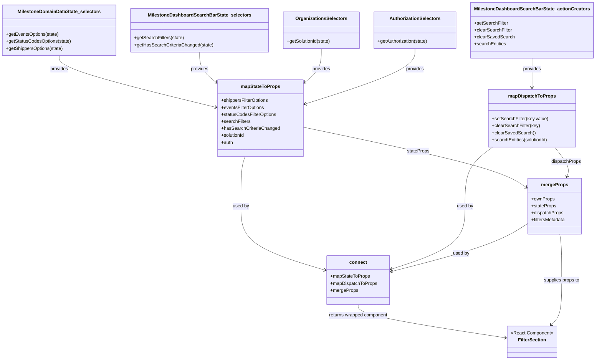

# Diagram: web/portal/src/pages/milestone/search/MilestoneEventFilterSectionContainer.js

> Auto-generated by Obscura crawlers

## Mermaid

### SVG

<svg id="container" width="2009.015625" xmlns="http://www.w3.org/2000/svg" class="classDiagram" height="1260" viewBox="0 0 2009.015625 1260" role="graphics-document document" aria-roledescription="class"><g><defs><marker id="container_class-aggregationStart" class="marker aggregation class" refX="18" refY="7" markerWidth="190" markerHeight="240" orient="auto"><path d="M 18,7 L9,13 L1,7 L9,1 Z"></path></marker></defs><defs><marker id="container_class-aggregationEnd" class="marker aggregation class" refX="1" refY="7" markerWidth="20" markerHeight="28" orient="auto"><path d="M 18,7 L9,13 L1,7 L9,1 Z"></path></marker></defs><defs><marker id="container_class-extensionStart" class="marker extension class" refX="18" refY="7" markerWidth="190" markerHeight="240" orient="auto"><path d="M 1,7 L18,13 V 1 Z"></path></marker></defs><defs><marker id="container_class-extensionEnd" class="marker extension class" refX="1" refY="7" markerWidth="20" markerHeight="28" orient="auto"><path d="M 1,1 V 13 L18,7 Z"></path></marker></defs><defs><marker id="container_class-compositionStart" class="marker composition class" refX="18" refY="7" markerWidth="190" markerHeight="240" orient="auto"><path d="M 18,7 L9,13 L1,7 L9,1 Z"></path></marker></defs><defs><marker id="container_class-compositionEnd" class="marker composition class" refX="1" refY="7" markerWidth="20" markerHeight="28" orient="auto"><path d="M 18,7 L9,13 L1,7 L9,1 Z"></path></marker></defs><defs><marker id="container_class-dependencyStart" class="marker dependency class" refX="6" refY="7" markerWidth="190" markerHeight="240" orient="auto"><path d="M 5,7 L9,13 L1,7 L9,1 Z"></path></marker></defs><defs><marker id="container_class-dependencyEnd" class="marker dependency class" refX="13" refY="7" markerWidth="20" markerHeight="28" orient="auto"><path d="M 18,7 L9,13 L14,7 L9,1 Z"></path></marker></defs><defs><marker id="container_class-lollipopStart" class="marker lollipop class" refX="13" refY="7" markerWidth="190" markerHeight="240" orient="auto"><circle stroke="black" fill="transparent" cx="7" cy="7" r="6"></circle></marker></defs><defs><marker id="container_class-lollipopEnd" class="marker lollipop class" refX="1" refY="7" markerWidth="190" markerHeight="240" orient="auto"><circle stroke="black" fill="transparent" cx="7" cy="7" r="6"></circle></marker></defs><g class="root"><g class="clusters"></g><g class="edgePaths"><path d="M200.418,191L200.418,198.667C200.418,206.333,200.418,221.667,288.716,251.315C377.014,280.964,553.611,324.929,641.909,346.911L730.207,368.893" id="id_MilestoneDomainDataState_selectors_mapStateToProps_1" class="edge-thickness-normal edge-pattern-solid relation" style=";;;" data-edge="true" data-et="edge" data-id="id_MilestoneDomainDataState_selectors_mapStateToProps_1" data-points="W3sieCI6MjAwLjQxNzk2ODc1LCJ5IjoxOTF9LHsieCI6MjAwLjQxNzk2ODc1LCJ5IjoyMzd9LHsieCI6NzM2LjAyOTI5Njg3NSwieSI6MzcwLjM0MjI4MjIwNzQ1OTN9XQ==" marker-end="url(#container_class-dependencyEnd)"></path><path d="M673.602,179L673.602,188.667C673.602,198.333,673.602,217.667,683.234,235.248C692.866,252.83,712.13,268.661,721.762,276.576L731.394,284.491" id="id_MilestoneDashboardSearchBarState_selectors_mapStateToProps_2" class="edge-thickness-normal edge-pattern-solid relation" style=";;;" data-edge="true" data-et="edge" data-id="id_MilestoneDashboardSearchBarState_selectors_mapStateToProps_2" data-points="W3sieCI6NjczLjYwMTU2MjUsInkiOjE3OX0seyJ4Ijo2NzMuNjAxNTYyNSwieSI6MjM3fSx7IngiOjczNi4wMjkyOTY4NzUsInkiOjI4OC4zMDAxMDM1MTY3MTk0fV0=" marker-end="url(#container_class-dependencyEnd)"></path><path d="M1084.918,167L1084.918,178.667C1084.918,190.333,1084.918,213.667,1075.286,233.248C1065.654,252.83,1046.39,268.661,1036.758,276.576L1027.126,284.491" id="id_OrganizationsSelectors_mapStateToProps_3" class="edge-thickness-normal edge-pattern-solid relation" style=";;;" data-edge="true" data-et="edge" data-id="id_OrganizationsSelectors_mapStateToProps_3" data-points="W3sieCI6MTA4NC45MTc5Njg3NSwieSI6MTY3fSx7IngiOjEwODQuOTE3OTY4NzUsInkiOjIzN30seyJ4IjoxMDIyLjQ5MDIzNDM3NSwieSI6Mjg4LjMwMDEwMzUxNjcxOTR9XQ==" marker-end="url(#container_class-dependencyEnd)"></path><path d="M1406.977,167L1406.977,178.667C1406.977,190.333,1406.977,213.667,1343.848,245.55C1280.719,277.434,1154.462,317.867,1091.333,338.084L1028.204,358.301" id="id_AuthorizationSelectors_mapStateToProps_4" class="edge-thickness-normal edge-pattern-solid relation" style=";;;" data-edge="true" data-et="edge" data-id="id_AuthorizationSelectors_mapStateToProps_4" data-points="W3sieCI6MTQwNi45NzY1NjI1LCJ5IjoxNjd9LHsieCI6MTQwNi45NzY1NjI1LCJ5IjoyMzd9LHsieCI6MTAyMi40OTAyMzQzNzUsInkiOjM2MC4xMzA3OTYzNjI1NzMxNn1d" marker-end="url(#container_class-dependencyEnd)"></path><path d="M1799.75,200L1799.75,206.167C1799.75,212.333,1799.75,224.667,1799.75,241.5C1799.75,258.333,1799.75,279.667,1799.75,290.333L1799.75,301" id="id_MilestoneDashboardSearchBarState_actionCreators_mapDispatchToProps_5" class="edge-thickness-normal edge-pattern-solid relation" style=";;;" data-edge="true" data-et="edge" data-id="id_MilestoneDashboardSearchBarState_actionCreators_mapDispatchToProps_5" data-points="W3sieCI6MTc5OS43NSwieSI6MjAwfSx7IngiOjE3OTkuNzUsInkiOjIzN30seyJ4IjoxNzk5Ljc1LCJ5IjozMDd9XQ==" marker-end="url(#container_class-dependencyEnd)"></path><path d="M826.471,538L824.005,544.167C821.538,550.333,816.606,562.667,814.14,591C811.674,619.333,811.674,663.667,811.674,708C811.674,752.333,811.674,796.667,859.577,833.328C907.48,869.99,1003.285,898.979,1051.188,913.474L1099.091,927.969" id="id_mapStateToProps_connect_6" class="edge-thickness-normal edge-pattern-solid relation" style=";;;" data-edge="true" data-et="edge" data-id="id_mapStateToProps_connect_6" data-points="W3sieCI6ODI2LjQ3MDc0OTM1MjgxMDcsInkiOjUzOH0seyJ4Ijo4MTEuNjczODI4MTI1LCJ5Ijo1NzV9LHsieCI6ODExLjY3MzgyODEyNSwieSI6NzA4fSx7IngiOjgxMS42NzM4MjgxMjUsInkiOjg0MX0seyJ4IjoxMTA0LjgzMzk4NDM3NSwieSI6OTI5LjcwNjkzNTYyNTY3MTZ9XQ==" marker-end="url(#container_class-dependencyEnd)"></path><path d="M1667.559,505L1651.98,516.667C1636.402,528.333,1605.246,551.667,1589.668,585.5C1574.09,619.333,1574.09,663.667,1574.09,708C1574.09,752.333,1574.09,796.667,1532.403,832.747C1490.717,868.827,1407.344,896.654,1365.657,910.567L1323.971,924.48" id="id_mapDispatchToProps_connect_7" class="edge-thickness-normal edge-pattern-solid relation" style=";;;" data-edge="true" data-et="edge" data-id="id_mapDispatchToProps_connect_7" data-points="W3sieCI6MTY2Ny41NTg1NDc1MjIxODk0LCJ5Ijo1MDV9LHsieCI6MTU3NC4wODk4NDM3NSwieSI6NTc1fSx7IngiOjE1NzQuMDg5ODQzNzUsInkiOjcwOH0seyJ4IjoxNTc0LjA4OTg0Mzc1LCJ5Ijo4NDF9LHsieCI6MTMxOC4yNzkyOTY4NzUsInkiOjkyNi4zNzk5NzU5NzIwMjg0fV0=" marker-end="url(#container_class-dependencyEnd)"></path><path d="M1785.07,769.167L1766.932,781.139C1748.793,793.111,1712.516,817.056,1635.685,844.311C1558.854,871.566,1441.47,902.132,1382.778,917.415L1324.086,932.698" id="id_mergeProps_connect_8" class="edge-thickness-normal edge-pattern-solid relation" style=";;;" data-edge="true" data-et="edge" data-id="id_mergeProps_connect_8" data-points="W3sieCI6MTc4NS4wNzAzMTI1LCJ5Ijo3NjkuMTY2ODUwODI4NzI5M30seyJ4IjoxNjc2LjIzODI4MTI1LCJ5Ijo4NDF9LHsieCI6MTMxOC4yNzkyOTY4NzUsInkiOjkzNC4yMTAxMzIxMDQ4OTM4fV0=" marker-end="url(#container_class-dependencyEnd)"></path><path d="M1211.557,1046L1211.557,1054.167C1211.557,1062.333,1211.557,1078.667,1294.402,1101.341C1377.247,1124.015,1542.938,1153.029,1625.784,1167.536L1708.629,1182.044" id="id_connect_FilterSection_9" class="edge-thickness-normal edge-pattern-solid relation" style=";;;" data-edge="true" data-et="edge" data-id="id_connect_FilterSection_9" data-points="W3sieCI6MTIxMS41NTY2NDA2MjUsInkiOjEwNDZ9LHsieCI6MTIxMS41NTY2NDA2MjUsInkiOjEwOTV9LHsieCI6MTcxNC41MzkwNjI1LCJ5IjoxMTgzLjA3ODUwMTEwNDA4MjV9XQ==" marker-end="url(#container_class-dependencyEnd)"></path><path d="M1895.178,804L1896.298,810.167C1897.418,816.333,1899.658,828.667,1900.778,855C1901.898,881.333,1901.898,921.667,1901.898,964C1901.898,1006.333,1901.898,1050.667,1894.503,1080.29C1887.108,1109.913,1872.319,1124.827,1864.924,1132.283L1857.529,1139.74" id="id_mergeProps_FilterSection_10" class="edge-thickness-normal edge-pattern-solid relation" style=";;;" data-edge="true" data-et="edge" data-id="id_mergeProps_FilterSection_10" data-points="W3sieCI6MTg5NS4xNzgyNzc3MjU1NjQsInkiOjgwNH0seyJ4IjoxOTAxLjg5ODQzNzUsInkiOjg0MX0seyJ4IjoxOTAxLjg5ODQzNzUsInkiOjk2Mn0seyJ4IjoxOTAxLjg5ODQzNzUsInkiOjEwOTV9LHsieCI6MTg1My4zMDM1NDk3NTcyODE2LCJ5IjoxMTQ0fV0=" marker-end="url(#container_class-dependencyEnd)"></path><path d="M1022.49,436.178L1132.301,459.315C1242.112,482.452,1461.734,528.726,1588.002,563.009C1714.271,597.292,1747.187,619.583,1763.645,630.729L1780.102,641.875" id="id_mapStateToProps_mergeProps_11" class="edge-thickness-normal edge-pattern-solid relation" style=";;;" data-edge="true" data-et="edge" data-id="id_mapStateToProps_mergeProps_11" data-points="W3sieCI6MTAyMi40OTAyMzQzNzUsInkiOjQzNi4xNzgzODAzNjU4ODcyfSx7IngiOjE2ODEuMzU1NDY4NzUsInkiOjU3NX0seyJ4IjoxNzg1LjA3MDMxMjUsInkiOjY0NS4yMzkzNDM2MTAxNDQzfV0=" marker-end="url(#container_class-dependencyEnd)"></path><path d="M1877.693,505L1886.879,516.667C1896.064,528.333,1914.434,551.667,1921.449,568.576C1928.464,585.485,1924.123,595.971,1921.952,601.214L1919.782,606.456" id="id_mapDispatchToProps_mergeProps_12" class="edge-thickness-normal edge-pattern-solid relation" style=";;;" data-edge="true" data-et="edge" data-id="id_mapDispatchToProps_mergeProps_12" data-points="W3sieCI6MTg3Ny42OTMyNzg0NzYzMzE0LCJ5Ijo1MDV9LHsieCI6MTkzMi44MDQ2ODc1LCJ5Ijo1NzV9LHsieCI6MTkxNy40ODY1NDg0MDIyNTU3LCJ5Ijo2MTJ9XQ==" marker-end="url(#container_class-dependencyEnd)"></path></g><g class="edgeLabels"><g class="edgeLabel" transform="translate(200.41796875, 237)"><g class="label" data-id="id_MilestoneDomainDataState_selectors_mapStateToProps_1" transform="translate(-31.3125, -12)"><foreignObject width="62.625" height="24">

provides

</foreignObject></g></g><g class="edgeLabel" transform="translate(673.6015625, 237)"><g class="label" data-id="id_MilestoneDashboardSearchBarState_selectors_mapStateToProps_2" transform="translate(-31.3125, -12)"><foreignObject width="62.625" height="24">

provides

</foreignObject></g></g><g class="edgeLabel" transform="translate(1084.91796875, 237)"><g class="label" data-id="id_OrganizationsSelectors_mapStateToProps_3" transform="translate(-31.3125, -12)"><foreignObject width="62.625" height="24">

provides

</foreignObject></g></g><g class="edgeLabel" transform="translate(1406.9765625, 237)"><g class="label" data-id="id_AuthorizationSelectors_mapStateToProps_4" transform="translate(-31.3125, -12)"><foreignObject width="62.625" height="24">

provides

</foreignObject></g></g><g class="edgeLabel" transform="translate(1799.75, 237)"><g class="label" data-id="id_MilestoneDashboardSearchBarState_actionCreators_mapDispatchToProps_5" transform="translate(-31.3125, -12)"><foreignObject width="62.625" height="24">

provides

</foreignObject></g></g><g class="edgeLabel" transform="translate(811.673828125, 708)"><g class="label" data-id="id_mapStateToProps_connect_6" transform="translate(-28.3125, -12)"><foreignObject width="56.625" height="24">

used by

</foreignObject></g></g><g class="edgeLabel" transform="translate(1574.08984375, 708)"><g class="label" data-id="id_mapDispatchToProps_connect_7" transform="translate(-28.3125, -12)"><foreignObject width="56.625" height="24">

used by

</foreignObject></g></g><g class="edgeLabel" transform="translate(1560.35524, 871.17517)"><g class="label" data-id="id_mergeProps_connect_8" transform="translate(-28.3125, -12)"><foreignObject width="56.625" height="24">

used by

</foreignObject></g></g><g class="edgeLabel" transform="translate(1211.556640625, 1095)"><g class="label" data-id="id_connect_FilterSection_9" transform="translate(-100, -24)"><foreignObject width="200" height="48">

returns wrapped component

</foreignObject></g></g><g class="edgeLabel" transform="translate(1901.8984375, 962)"><g class="label" data-id="id_mergeProps_FilterSection_10" transform="translate(-63.0390625, -12)"><foreignObject width="126.078125" height="24">

supplies props to

</foreignObject></g></g><g class="edgeLabel" transform="translate(1413.20782, 518.50181)"><g class="label" data-id="id_mapStateToProps_mergeProps_11" transform="translate(-38.546875, -12)"><foreignObject width="77.09375" height="24">

stateProps

</foreignObject></g></g><g class="edgeLabel" transform="translate(1917.63496, 555.7321)"><g class="label" data-id="id_mapDispatchToProps_mergeProps_12" transform="translate(-51.578125, -12)"><foreignObject width="103.15625" height="24">

dispatchProps

</foreignObject></g></g></g><g class="nodes"><g class="node default" id="classId-FilterSection-0" transform="translate(1799.75, 1198)"><g class="basic label-container"><path d="M-85.2109375 -54 L85.2109375 -54 L85.2109375 54 L-85.2109375 54" stroke="none" stroke-width="0" fill="#ECECFF" style=""></path><path d="M-85.2109375 -54 C-19.922200610138574 -54, 45.36653627972285 -54, 85.2109375 -54 M-85.2109375 -54 C-49.33512765722599 -54, -13.459317814451978 -54, 85.2109375 -54 M85.2109375 -54 C85.2109375 -23.807754278169693, 85.2109375 6.384491443660615, 85.2109375 54 M85.2109375 -54 C85.2109375 -28.59241210426503, 85.2109375 -3.1848242085300598, 85.2109375 54 M85.2109375 54 C35.7543296214023 54, -13.702278257195402 54, -85.2109375 54 M85.2109375 54 C17.741880370068714 54, -49.72717675986257 54, -85.2109375 54 M-85.2109375 54 C-85.2109375 28.204893635087355, -85.2109375 2.4097872701747107, -85.2109375 -54 M-85.2109375 54 C-85.2109375 19.49873746921328, -85.2109375 -15.002525061573436, -85.2109375 -54" stroke="#9370DB" stroke-width="1.3" fill="none" stroke-dasharray="0 0" style=""></path></g><g class="annotation-group text" transform="translate(-73.2109375, -30)"><g class="label" style="" transform="translate(0,-12)"><foreignObject width="146.421875" height="24">

«React Component»

</foreignObject></g></g><g class="label-group text" transform="translate(-46.3203125, -6)"><g class="label" style="font-weight: bolder" transform="translate(0,-12)"><foreignObject width="92.640625" height="24">

FilterSection

</foreignObject></g></g><g class="members-group text" transform="translate(-73.2109375, 42)"></g><g class="methods-group text" transform="translate(-73.2109375, 72)"></g><g class="divider" style=""><path d="M-85.2109375 18 C-18.37487903094285 18, 48.4611794381143 18, 85.2109375 18 M-85.2109375 18 C-32.34113970316224 18, 20.528658093675517 18, 85.2109375 18" stroke="#9370DB" stroke-width="1.3" fill="none" stroke-dasharray="0 0" style=""></path></g><g class="divider" style=""><path d="M-85.2109375 36 C-24.412997358363057 36, 36.384942783273885 36, 85.2109375 36 M-85.2109375 36 C-17.420608730084453 36, 50.369720039831094 36, 85.2109375 36" stroke="#9370DB" stroke-width="1.3" fill="none" stroke-dasharray="0 0" style=""></path></g></g><g class="node default" id="classId-connect-1" transform="translate(1211.556640625, 962)"><g class="basic label-container"><path d="M-106.72265625 -84 L106.72265625 -84 L106.72265625 84 L-106.72265625 84" stroke="none" stroke-width="0" fill="#ECECFF" style=""></path><path d="M-106.72265625 -84 C-57.35159930289628 -84, -7.980542355792565 -84, 106.72265625 -84 M-106.72265625 -84 C-38.2762139231082 -84, 30.170228403783597 -84, 106.72265625 -84 M106.72265625 -84 C106.72265625 -23.788471974925265, 106.72265625 36.42305605014947, 106.72265625 84 M106.72265625 -84 C106.72265625 -40.93409753065287, 106.72265625 2.131804938694259, 106.72265625 84 M106.72265625 84 C47.049994949086354 84, -12.622666351827291 84, -106.72265625 84 M106.72265625 84 C27.749903398944255 84, -51.22284945211149 84, -106.72265625 84 M-106.72265625 84 C-106.72265625 19.966955422837643, -106.72265625 -44.066089154324715, -106.72265625 -84 M-106.72265625 84 C-106.72265625 38.13832132296782, -106.72265625 -7.723357354064362, -106.72265625 -84" stroke="#9370DB" stroke-width="1.3" fill="none" stroke-dasharray="0 0" style=""></path></g><g class="annotation-group text" transform="translate(0, -60)"></g><g class="label-group text" transform="translate(-28.9140625, -60)"><g class="label" style="font-weight: bolder" transform="translate(0,-12)"><foreignObject width="57.828125" height="24">

connect

</foreignObject></g></g><g class="members-group text" transform="translate(-94.72265625, -12)"><g class="label" style="" transform="translate(0,-12)"><foreignObject width="134.984375" height="24">

+mapStateToProps

</foreignObject></g><g class="label" style="" transform="translate(0,12)"><foreignObject width="160.53125" height="24">

+mapDispatchToProps

</foreignObject></g><g class="label" style="" transform="translate(0,36)"><foreignObject width="94.140625" height="24">

+mergeProps

</foreignObject></g></g><g class="methods-group text" transform="translate(-94.72265625, 84)"></g><g class="divider" style=""><path d="M-106.72265625 -36 C-40.67470478899695 -36, 25.373246672006104 -36, 106.72265625 -36 M-106.72265625 -36 C-52.00748428775389 -36, 2.7076876744922203 -36, 106.72265625 -36" stroke="#9370DB" stroke-width="1.3" fill="none" stroke-dasharray="0 0" style=""></path></g><g class="divider" style=""><path d="M-106.72265625 60 C-45.370817726424555 60, 15.98102079715089 60, 106.72265625 60 M-106.72265625 60 C-40.76870389257091 60, 25.185248464858176 60, 106.72265625 60" stroke="#9370DB" stroke-width="1.3" fill="none" stroke-dasharray="0 0" style=""></path></g></g><g class="node default" id="classId-mapStateToProps-2" transform="translate(879.259765625, 406)"><g class="basic label-container"><path d="M-143.23046875 -132 L143.23046875 -132 L143.23046875 132 L-143.23046875 132" stroke="none" stroke-width="0" fill="#ECECFF" style=""></path><path d="M-143.23046875 -132 C-59.43703973018995 -132, 24.356389289620097 -132, 143.23046875 -132 M-143.23046875 -132 C-84.94006621247087 -132, -26.64966367494175 -132, 143.23046875 -132 M143.23046875 -132 C143.23046875 -41.99068146698953, 143.23046875 48.01863706602094, 143.23046875 132 M143.23046875 -132 C143.23046875 -63.4139520378624, 143.23046875 5.172095924275197, 143.23046875 132 M143.23046875 132 C41.1597242641091 132, -60.9110202217818 132, -143.23046875 132 M143.23046875 132 C73.32908708767351 132, 3.4277054253470283 132, -143.23046875 132 M-143.23046875 132 C-143.23046875 35.964139570354874, -143.23046875 -60.07172085929025, -143.23046875 -132 M-143.23046875 132 C-143.23046875 59.948099292934, -143.23046875 -12.103801414131993, -143.23046875 -132" stroke="#9370DB" stroke-width="1.3" fill="none" stroke-dasharray="0 0" style=""></path></g><g class="annotation-group text" transform="translate(0, -108)"></g><g class="label-group text" transform="translate(-64.7109375, -108)"><g class="label" style="font-weight: bolder" transform="translate(0,-12)"><foreignObject width="129.421875" height="24">

mapStateToProps

</foreignObject></g></g><g class="members-group text" transform="translate(-131.23046875, -60)"><g class="label" style="" transform="translate(0,-12)"><foreignObject width="164.46875" height="24">

+shippersFilterOptions

</foreignObject></g><g class="label" style="" transform="translate(0,12)"><foreignObject width="149.78125" height="24">

+eventsFilterOptions

</foreignObject></g><g class="label" style="" transform="translate(0,36)"><foreignObject width="190.125" height="24">

+statusCodesFilterOptions

</foreignObject></g><g class="label" style="" transform="translate(0,60)"><foreignObject width="99.609375" height="24">

+searchFilters

</foreignObject></g><g class="label" style="" transform="translate(0,84)"><foreignObject width="197.75" height="24">

+hasSearchCriteriaChanged

</foreignObject></g><g class="label" style="" transform="translate(0,108)"><foreignObject width="82.109375" height="24">

+solutionId

</foreignObject></g><g class="label" style="" transform="translate(0,132)"><foreignObject width="40.921875" height="24">

+auth

</foreignObject></g></g><g class="methods-group text" transform="translate(-131.23046875, 132)"></g><g class="divider" style=""><path d="M-143.23046875 -84 C-52.55365976509472 -84, 38.12314921981056 -84, 143.23046875 -84 M-143.23046875 -84 C-40.8005443680991 -84, 61.62938001380181 -84, 143.23046875 -84" stroke="#9370DB" stroke-width="1.3" fill="none" stroke-dasharray="0 0" style=""></path></g><g class="divider" style=""><path d="M-143.23046875 108 C-78.88777216721493 108, -14.545075584429867 108, 143.23046875 108 M-143.23046875 108 C-82.67737284548434 108, -22.124276940968684 108, 143.23046875 108" stroke="#9370DB" stroke-width="1.3" fill="none" stroke-dasharray="0 0" style=""></path></g></g><g class="node default" id="classId-mapDispatchToProps-3" transform="translate(1799.75, 406)"><g class="basic label-container"><path d="M-147.83203125 -99 L147.83203125 -99 L147.83203125 99 L-147.83203125 99" stroke="none" stroke-width="0" fill="#ECECFF" style=""></path><path d="M-147.83203125 -99 C-38.39911322062315 -99, 71.0338048087537 -99, 147.83203125 -99 M-147.83203125 -99 C-33.12408001482768 -99, 81.58387122034463 -99, 147.83203125 -99 M147.83203125 -99 C147.83203125 -31.840360693009046, 147.83203125 35.31927861398191, 147.83203125 99 M147.83203125 -99 C147.83203125 -38.85865407959547, 147.83203125 21.282691840809065, 147.83203125 99 M147.83203125 99 C69.19816079209434 99, -9.435709665811316 99, -147.83203125 99 M147.83203125 99 C66.90802285388068 99, -14.015985542238639 99, -147.83203125 99 M-147.83203125 99 C-147.83203125 41.59168829220842, -147.83203125 -15.816623415583166, -147.83203125 -99 M-147.83203125 99 C-147.83203125 45.58498616477364, -147.83203125 -7.830027670452722, -147.83203125 -99" stroke="#9370DB" stroke-width="1.3" fill="none" stroke-dasharray="0 0" style=""></path></g><g class="annotation-group text" transform="translate(0, -75)"></g><g class="label-group text" transform="translate(-77.1953125, -75)"><g class="label" style="font-weight: bolder" transform="translate(0,-12)"><foreignObject width="154.390625" height="24">

mapDispatchToProps

</foreignObject></g></g><g class="members-group text" transform="translate(-135.83203125, -27)"></g><g class="methods-group text" transform="translate(-135.83203125, 3)"><g class="label" style="" transform="translate(0,-12)"><foreignObject width="191.96875" height="24">

+setSearchFilter(key,value)

</foreignObject></g><g class="label" style="" transform="translate(0,12)"><foreignObject width="164.265625" height="24">

+clearSearchFilter(key)

</foreignObject></g><g class="label" style="" transform="translate(0,36)"><foreignObject width="146.046875" height="24">

+clearSavedSearch()

</foreignObject></g><g class="label" style="" transform="translate(0,60)"><foreignObject width="194.46875" height="24">

+searchEntities(solutionId)

</foreignObject></g></g><g class="divider" style=""><path d="M-147.83203125 -51 C-86.6968106688182 -51, -25.561590087636404 -51, 147.83203125 -51 M-147.83203125 -51 C-67.56630773094555 -51, 12.699415788108894 -51, 147.83203125 -51" stroke="#9370DB" stroke-width="1.3" fill="none" stroke-dasharray="0 0" style=""></path></g><g class="divider" style=""><path d="M-147.83203125 -27 C-74.50228024478365 -27, -1.1725292395672966 -27, 147.83203125 -27 M-147.83203125 -27 C-74.80803410244614 -27, -1.7840369548922865 -27, 147.83203125 -27" stroke="#9370DB" stroke-width="1.3" fill="none" stroke-dasharray="0 0" style=""></path></g></g><g class="node default" id="classId-mergeProps-4" transform="translate(1877.7421875, 708)"><g class="basic label-container"><path d="M-92.671875 -96 L92.671875 -96 L92.671875 96 L-92.671875 96" stroke="none" stroke-width="0" fill="#ECECFF" style=""></path><path d="M-92.671875 -96 C-54.55637156570258 -96, -16.440868131405153 -96, 92.671875 -96 M-92.671875 -96 C-32.137270028723606 -96, 28.39733494255279 -96, 92.671875 -96 M92.671875 -96 C92.671875 -45.90772771438664, 92.671875 4.1845445712267235, 92.671875 96 M92.671875 -96 C92.671875 -33.0861029663117, 92.671875 29.8277940673766, 92.671875 96 M92.671875 96 C37.85190243323072 96, -16.96807013353856 96, -92.671875 96 M92.671875 96 C36.56298258830003 96, -19.54590982339994 96, -92.671875 96 M-92.671875 96 C-92.671875 56.008613929917345, -92.671875 16.01722785983469, -92.671875 -96 M-92.671875 96 C-92.671875 32.829206448571455, -92.671875 -30.34158710285709, -92.671875 -96" stroke="#9370DB" stroke-width="1.3" fill="none" stroke-dasharray="0 0" style=""></path></g><g class="annotation-group text" transform="translate(0, -72)"></g><g class="label-group text" transform="translate(-43.859375, -72)"><g class="label" style="font-weight: bolder" transform="translate(0,-12)"><foreignObject width="87.71875" height="24">

mergeProps

</foreignObject></g></g><g class="members-group text" transform="translate(-80.671875, -24)"><g class="label" style="" transform="translate(0,-12)"><foreignObject width="79.171875" height="24">

+ownProps

</foreignObject></g><g class="label" style="" transform="translate(0,12)"><foreignObject width="85.078125" height="24">

+stateProps

</foreignObject></g><g class="label" style="" transform="translate(0,36)"><foreignObject width="111.140625" height="24">

+dispatchProps

</foreignObject></g><g class="label" style="" transform="translate(0,60)"><foreignObject width="117.484375" height="24">

+filtersMetadata

</foreignObject></g></g><g class="methods-group text" transform="translate(-80.671875, 96)"></g><g class="divider" style=""><path d="M-92.671875 -48 C-20.597485519552492 -48, 51.476903960895015 -48, 92.671875 -48 M-92.671875 -48 C-31.933120909593008 -48, 28.805633180813984 -48, 92.671875 -48" stroke="#9370DB" stroke-width="1.3" fill="none" stroke-dasharray="0 0" style=""></path></g><g class="divider" style=""><path d="M-92.671875 72 C-45.42379292125364 72, 1.8242891574927143 72, 92.671875 72 M-92.671875 72 C-22.273433372852622 72, 48.125008254294755 72, 92.671875 72" stroke="#9370DB" stroke-width="1.3" fill="none" stroke-dasharray="0 0" style=""></path></g></g><g class="node default" id="classId-MilestoneDomainDataState_selectors-5" transform="translate(200.41796875, 104)"><g class="basic label-container"><path d="M-192.41796875 -87 L192.41796875 -87 L192.41796875 87 L-192.41796875 87" stroke="none" stroke-width="0" fill="#ECECFF" style=""></path><path d="M-192.41796875 -87 C-43.95742167220368 -87, 104.50312540559264 -87, 192.41796875 -87 M-192.41796875 -87 C-83.16581105863526 -87, 26.086346632729487 -87, 192.41796875 -87 M192.41796875 -87 C192.41796875 -41.00659968239128, 192.41796875 4.986800635217435, 192.41796875 87 M192.41796875 -87 C192.41796875 -37.34565073961129, 192.41796875 12.308698520777426, 192.41796875 87 M192.41796875 87 C80.2013201418714 87, -32.01532846625719 87, -192.41796875 87 M192.41796875 87 C43.00950913515024 87, -106.39895047969952 87, -192.41796875 87 M-192.41796875 87 C-192.41796875 32.60828532916986, -192.41796875 -21.78342934166028, -192.41796875 -87 M-192.41796875 87 C-192.41796875 18.320906957591134, -192.41796875 -50.35818608481773, -192.41796875 -87" stroke="#9370DB" stroke-width="1.3" fill="none" stroke-dasharray="0 0" style=""></path></g><g class="annotation-group text" transform="translate(0, -63)"></g><g class="label-group text" transform="translate(-137.3671875, -63)"><g class="label" style="font-weight: bolder" transform="translate(0,-12)"><foreignObject width="274.734375" height="24">

MilestoneDomainDataState_selectors

</foreignObject></g></g><g class="members-group text" transform="translate(-180.41796875, -15)"></g><g class="methods-group text" transform="translate(-180.41796875, 15)"><g class="label" style="" transform="translate(0,-12)"><foreignObject width="181.46875" height="24">

+getEventsOptions(state)

</foreignObject></g><g class="label" style="" transform="translate(0,12)"><foreignObject width="223.46875" height="24">

+getStatusCodesOptions(state)

</foreignObject></g><g class="label" style="" transform="translate(0,36)"><foreignObject width="197.8125" height="24">

+getShippersOptions(state)

</foreignObject></g></g><g class="divider" style=""><path d="M-192.41796875 -39 C-81.26247148377331 -39, 29.89302578245338 -39, 192.41796875 -39 M-192.41796875 -39 C-90.65442155285207 -39, 11.109125644295858 -39, 192.41796875 -39" stroke="#9370DB" stroke-width="1.3" fill="none" stroke-dasharray="0 0" style=""></path></g><g class="divider" style=""><path d="M-192.41796875 -15 C-99.34054773175016 -15, -6.263126713500327 -15, 192.41796875 -15 M-192.41796875 -15 C-62.76556868670568 -15, 66.88683137658865 -15, 192.41796875 -15" stroke="#9370DB" stroke-width="1.3" fill="none" stroke-dasharray="0 0" style=""></path></g></g><g class="node default" id="classId-MilestoneDashboardSearchBarState_selectors-6" transform="translate(673.6015625, 104)"><g class="basic label-container"><path d="M-230.765625 -75 L230.765625 -75 L230.765625 75 L-230.765625 75" stroke="none" stroke-width="0" fill="#ECECFF" style=""></path><path d="M-230.765625 -75 C-127.67336856960529 -75, -24.581112139210575 -75, 230.765625 -75 M-230.765625 -75 C-68.38679306984096 -75, 93.99203886031808 -75, 230.765625 -75 M230.765625 -75 C230.765625 -23.22278975328861, 230.765625 28.554420493422782, 230.765625 75 M230.765625 -75 C230.765625 -19.842493502150752, 230.765625 35.315012995698496, 230.765625 75 M230.765625 75 C116.96322031183739 75, 3.160815623674779 75, -230.765625 75 M230.765625 75 C121.10003589535 75, 11.434446790700008 75, -230.765625 75 M-230.765625 75 C-230.765625 20.28851255244615, -230.765625 -34.4229748951077, -230.765625 -75 M-230.765625 75 C-230.765625 33.88246539454723, -230.765625 -7.235069210905536, -230.765625 -75" stroke="#9370DB" stroke-width="1.3" fill="none" stroke-dasharray="0 0" style=""></path></g><g class="annotation-group text" transform="translate(0, -51)"></g><g class="label-group text" transform="translate(-169.25, -51)"><g class="label" style="font-weight: bolder" transform="translate(0,-12)"><foreignObject width="338.5" height="24">

MilestoneDashboardSearchBarState_selectors

</foreignObject></g></g><g class="members-group text" transform="translate(-218.765625, -3)"></g><g class="methods-group text" transform="translate(-218.765625, 27)"><g class="label" style="" transform="translate(0,-12)"><foreignObject width="169.875" height="24">

+getSearchFilters(state)

</foreignObject></g><g class="label" style="" transform="translate(0,12)"><foreignObject width="268.28125" height="24">

+getHasSearchCriteriaChanged(state)

</foreignObject></g></g><g class="divider" style=""><path d="M-230.765625 -27 C-114.3036064794591 -27, 2.158412041081789 -27, 230.765625 -27 M-230.765625 -27 C-56.861397650035656 -27, 117.04282969992869 -27, 230.765625 -27" stroke="#9370DB" stroke-width="1.3" fill="none" stroke-dasharray="0 0" style=""></path></g><g class="divider" style=""><path d="M-230.765625 -3 C-128.93228803177283 -3, -27.098951063545684 -3, 230.765625 -3 M-230.765625 -3 C-88.48562058170498 -3, 53.79438383659004 -3, 230.765625 -3" stroke="#9370DB" stroke-width="1.3" fill="none" stroke-dasharray="0 0" style=""></path></g></g><g class="node default" id="classId-MilestoneDashboardSearchBarState_actionCreators-7" transform="translate(1799.75, 104)"><g class="basic label-container"><path d="M-201.265625 -96 L201.265625 -96 L201.265625 96 L-201.265625 96" stroke="none" stroke-width="0" fill="#ECECFF" style=""></path><path d="M-201.265625 -96 C-94.49602809491306 -96, 12.273568810173884 -96, 201.265625 -96 M-201.265625 -96 C-118.88853978514813 -96, -36.51145457029625 -96, 201.265625 -96 M201.265625 -96 C201.265625 -32.470001899362835, 201.265625 31.05999620127433, 201.265625 96 M201.265625 -96 C201.265625 -21.181962366165394, 201.265625 53.63607526766921, 201.265625 96 M201.265625 96 C71.13037063423343 96, -59.00488373153314 96, -201.265625 96 M201.265625 96 C55.199161088686964 96, -90.86730282262607 96, -201.265625 96 M-201.265625 96 C-201.265625 48.706007859839595, -201.265625 1.4120157196791894, -201.265625 -96 M-201.265625 96 C-201.265625 43.87643934056926, -201.265625 -8.247121318861474, -201.265625 -96" stroke="#9370DB" stroke-width="1.3" fill="none" stroke-dasharray="0 0" style=""></path></g><g class="annotation-group text" transform="translate(0, -72)"></g><g class="label-group text" transform="translate(-189.265625, -72)"><g class="label" style="font-weight: bolder" transform="translate(0,-12)"><foreignObject width="378.53125" height="24">

MilestoneDashboardSearchBarState_actionCreators

</foreignObject></g></g><g class="members-group text" transform="translate(-189.265625, -24)"><g class="label" style="" transform="translate(0,-12)"><foreignObject width="115.59375" height="24">

+setSearchFilter

</foreignObject></g><g class="label" style="" transform="translate(0,12)"><foreignObject width="129.3125" height="24">

+clearSearchFilter

</foreignObject></g><g class="label" style="" transform="translate(0,36)"><foreignObject width="135.671875" height="24">

+clearSavedSearch

</foreignObject></g><g class="label" style="" transform="translate(0,60)"><foreignObject width="109.984375" height="24">

+searchEntities

</foreignObject></g></g><g class="methods-group text" transform="translate(-189.265625, 96)"></g><g class="divider" style=""><path d="M-201.265625 -48 C-103.54551606648899 -48, -5.825407132977972 -48, 201.265625 -48 M-201.265625 -48 C-115.64654043059933 -48, -30.02745586119866 -48, 201.265625 -48" stroke="#9370DB" stroke-width="1.3" fill="none" stroke-dasharray="0 0" style=""></path></g><g class="divider" style=""><path d="M-201.265625 72 C-75.27027116969488 72, 50.72508266061024 72, 201.265625 72 M-201.265625 72 C-117.19162922115005 72, -33.117633442300104 72, 201.265625 72" stroke="#9370DB" stroke-width="1.3" fill="none" stroke-dasharray="0 0" style=""></path></g></g><g class="node default" id="classId-OrganizationsSelectors-8" transform="translate(1084.91796875, 104)"><g class="basic label-container"><path d="M-130.55078125 -63 L130.55078125 -63 L130.55078125 63 L-130.55078125 63" stroke="none" stroke-width="0" fill="#ECECFF" style=""></path><path d="M-130.55078125 -63 C-59.20144534754897 -63, 12.147890554902062 -63, 130.55078125 -63 M-130.55078125 -63 C-65.3933833321552 -63, -0.23598541431039166 -63, 130.55078125 -63 M130.55078125 -63 C130.55078125 -25.956587312423487, 130.55078125 11.086825375153026, 130.55078125 63 M130.55078125 -63 C130.55078125 -32.452966415006586, 130.55078125 -1.905932830013164, 130.55078125 63 M130.55078125 63 C44.299815745390845 63, -41.95114975921831 63, -130.55078125 63 M130.55078125 63 C36.21666236617362 63, -58.117456517652755 63, -130.55078125 63 M-130.55078125 63 C-130.55078125 29.7773641905251, -130.55078125 -3.4452716189498034, -130.55078125 -63 M-130.55078125 63 C-130.55078125 31.243622094953057, -130.55078125 -0.5127558100938856, -130.55078125 -63" stroke="#9370DB" stroke-width="1.3" fill="none" stroke-dasharray="0 0" style=""></path></g><g class="annotation-group text" transform="translate(0, -39)"></g><g class="label-group text" transform="translate(-84.7265625, -39)"><g class="label" style="font-weight: bolder" transform="translate(0,-12)"><foreignObject width="169.453125" height="24">

OrganizationsSelectors

</foreignObject></g></g><g class="members-group text" transform="translate(-118.55078125, 9)"></g><g class="methods-group text" transform="translate(-118.55078125, 39)"><g class="label" style="" transform="translate(0,-12)"><foreignObject width="152.375" height="24">

+getSolutionId(state)

</foreignObject></g></g><g class="divider" style=""><path d="M-130.55078125 -15 C-40.389896589210494 -15, 49.77098807157901 -15, 130.55078125 -15 M-130.55078125 -15 C-43.86944865406352 -15, 42.81188394187296 -15, 130.55078125 -15" stroke="#9370DB" stroke-width="1.3" fill="none" stroke-dasharray="0 0" style=""></path></g><g class="divider" style=""><path d="M-130.55078125 9 C-72.84917997766009 9, -15.147578705320171 9, 130.55078125 9 M-130.55078125 9 C-57.925279263926 9, 14.700222722147998 9, 130.55078125 9" stroke="#9370DB" stroke-width="1.3" fill="none" stroke-dasharray="0 0" style=""></path></g></g><g class="node default" id="classId-AuthorizationSelectors-9" transform="translate(1406.9765625, 104)"><g class="basic label-container"><path d="M-141.5078125 -63 L141.5078125 -63 L141.5078125 63 L-141.5078125 63" stroke="none" stroke-width="0" fill="#ECECFF" style=""></path><path d="M-141.5078125 -63 C-68.42888568955819 -63, 4.650041120883628 -63, 141.5078125 -63 M-141.5078125 -63 C-77.40301909855957 -63, -13.298225697119136 -63, 141.5078125 -63 M141.5078125 -63 C141.5078125 -21.925266961434588, 141.5078125 19.149466077130825, 141.5078125 63 M141.5078125 -63 C141.5078125 -35.70983905646329, 141.5078125 -8.419678112926576, 141.5078125 63 M141.5078125 63 C35.82987089001338 63, -69.84807071997324 63, -141.5078125 63 M141.5078125 63 C29.176922819465616 63, -83.15396686106877 63, -141.5078125 63 M-141.5078125 63 C-141.5078125 35.30331591910103, -141.5078125 7.606631838202063, -141.5078125 -63 M-141.5078125 63 C-141.5078125 25.431996988696454, -141.5078125 -12.136006022607091, -141.5078125 -63" stroke="#9370DB" stroke-width="1.3" fill="none" stroke-dasharray="0 0" style=""></path></g><g class="annotation-group text" transform="translate(0, -39)"></g><g class="label-group text" transform="translate(-83.875, -39)"><g class="label" style="font-weight: bolder" transform="translate(0,-12)"><foreignObject width="167.75" height="24">

AuthorizationSelectors

</foreignObject></g></g><g class="members-group text" transform="translate(-129.5078125, 9)"></g><g class="methods-group text" transform="translate(-129.5078125, 39)"><g class="label" style="" transform="translate(0,-12)"><foreignObject width="175.140625" height="24">

+getAuthorization(state)

</foreignObject></g></g><g class="divider" style=""><path d="M-141.5078125 -15 C-57.95014322748044 -15, 25.607526045039123 -15, 141.5078125 -15 M-141.5078125 -15 C-58.140422742466924 -15, 25.22696701506615 -15, 141.5078125 -15" stroke="#9370DB" stroke-width="1.3" fill="none" stroke-dasharray="0 0" style=""></path></g><g class="divider" style=""><path d="M-141.5078125 9 C-65.54856569310581 9, 10.410681113788371 9, 141.5078125 9 M-141.5078125 9 C-75.33737296335289 9, -9.166933426705782 9, 141.5078125 9" stroke="#9370DB" stroke-width="1.3" fill="none" stroke-dasharray="0 0" style=""></path></g></g></g></g></g></svg>
