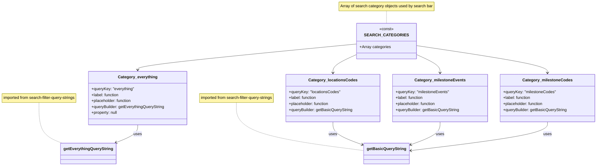

# Diagram: web/portal/src/pages/milestone/search/MilestoneEventSearchCategoryDefs.js

> Auto-generated by Obscura crawlers

## Mermaid

### SVG

<svg id="container" width="2412.5390625" xmlns="http://www.w3.org/2000/svg" class="classDiagram" height="670" viewBox="0 0 2412.5390625 670" role="graphics-document document" aria-roledescription="class"><g><defs><marker id="container_class-aggregationStart" class="marker aggregation class" refX="18" refY="7" markerWidth="190" markerHeight="240" orient="auto"><path d="M 18,7 L9,13 L1,7 L9,1 Z"></path></marker></defs><defs><marker id="container_class-aggregationEnd" class="marker aggregation class" refX="1" refY="7" markerWidth="20" markerHeight="28" orient="auto"><path d="M 18,7 L9,13 L1,7 L9,1 Z"></path></marker></defs><defs><marker id="container_class-extensionStart" class="marker extension class" refX="18" refY="7" markerWidth="190" markerHeight="240" orient="auto"><path d="M 1,7 L18,13 V 1 Z"></path></marker></defs><defs><marker id="container_class-extensionEnd" class="marker extension class" refX="1" refY="7" markerWidth="20" markerHeight="28" orient="auto"><path d="M 1,1 V 13 L18,7 Z"></path></marker></defs><defs><marker id="container_class-compositionStart" class="marker composition class" refX="18" refY="7" markerWidth="190" markerHeight="240" orient="auto"><path d="M 18,7 L9,13 L1,7 L9,1 Z"></path></marker></defs><defs><marker id="container_class-compositionEnd" class="marker composition class" refX="1" refY="7" markerWidth="20" markerHeight="28" orient="auto"><path d="M 18,7 L9,13 L1,7 L9,1 Z"></path></marker></defs><defs><marker id="container_class-dependencyStart" class="marker dependency class" refX="6" refY="7" markerWidth="190" markerHeight="240" orient="auto"><path d="M 5,7 L9,13 L1,7 L9,1 Z"></path></marker></defs><defs><marker id="container_class-dependencyEnd" class="marker dependency class" refX="13" refY="7" markerWidth="20" markerHeight="28" orient="auto"><path d="M 18,7 L9,13 L14,7 L9,1 Z"></path></marker></defs><defs><marker id="container_class-lollipopStart" class="marker lollipop class" refX="13" refY="7" markerWidth="190" markerHeight="240" orient="auto"><circle stroke="black" fill="transparent" cx="7" cy="7" r="6"></circle></marker></defs><defs><marker id="container_class-lollipopEnd" class="marker lollipop class" refX="1" refY="7" markerWidth="190" markerHeight="240" orient="auto"><circle stroke="black" fill="transparent" cx="7" cy="7" r="6"></circle></marker></defs><g class="root"><g class="clusters"></g><g class="edgePaths"><path d="M1577.01,44L1577.01,48.167C1577.01,52.333,1577.01,60.667,1577.01,69C1577.01,77.333,1577.01,85.667,1577.01,89.833L1577.01,94" id="edgeNote1" class="edge-thickness-normal edge-pattern-dotted relation" style="fill: none;;;fill: none" data-edge="true" data-et="edge" data-id="edgeNote1" data-points="W3sieCI6MTU3Ny4wMDk3NjU2MjUsInkiOjQ0fSx7IngiOjE1NzcuMDA5NzY1NjI1LCJ5Ijo2OX0seyJ4IjoxNTc3LjAwOTc2NTYyNSwieSI6OTR9XQ=="></path><path d="M971.43,414L971.43,435.167C971.43,456.333,971.43,498.667,1057.869,531.11C1144.308,563.553,1317.186,586.105,1403.625,597.381L1490.064,608.658" id="edgeNote2" class="edge-thickness-normal edge-pattern-dotted relation" style="fill: none;;;fill: none" data-edge="true" data-et="edge" data-id="edgeNote2" data-points="W3sieCI6OTcxLjQyOTY4NzUsInkiOjQxNH0seyJ4Ijo5NzEuNDI5Njg3NSwieSI6NTQxfSx7IngiOjE0OTAuMDY0NDUzMTI1LCJ5Ijo2MDguNjU3Njg1NTIyMzM5NH1d"></path><path d="M164.25,414L164.25,435.167C164.25,456.333,164.25,498.667,180.117,526.045C195.984,553.423,227.717,565.847,243.584,572.058L259.451,578.27" id="edgeNote3" class="edge-thickness-normal edge-pattern-dotted relation" style="fill: none;;;fill: none" data-edge="true" data-et="edge" data-id="edgeNote3" data-points="W3sieCI6MTY0LjI1LCJ5Ijo0MTR9LHsieCI6MTY0LjI1LCJ5Ijo1NDF9LHsieCI6MjU5LjQ1MTE3MTg3NSwieSI6NTc4LjI2OTk3OTM4NDIzNzJ9XQ=="></path><path d="M1464.896,176.776L1315.387,191.147C1165.878,205.517,866.859,234.259,717.349,251.796C567.84,269.333,567.84,275.667,567.84,278.833L567.84,282" id="id_SEARCH_CATEGORIES_Category_everything_1" class="edge-thickness-normal edge-pattern-solid relation" style=";;;" data-edge="true" data-et="edge" data-id="id_SEARCH_CATEGORIES_Category_everything_1" data-points="W3sieCI6MTQ2NC44OTY0ODQzNzUsInkiOjE3Ni43NzYxNzE2MjkyOTc3NX0seyJ4Ijo1NjcuODM5ODQzNzUsInkiOjI2M30seyJ4Ijo1NjcuODM5ODQzNzUsInkiOjI4OH1d" marker-end="url(#container_class-dependencyEnd)"></path><path d="M1464.896,217.119L1448.125,224.766C1431.354,232.412,1397.812,247.706,1381.041,260.52C1364.27,273.333,1364.27,283.667,1364.27,288.833L1364.27,294" id="id_SEARCH_CATEGORIES_Category_locationsCodes_2" class="edge-thickness-normal edge-pattern-solid relation" style=";;;" data-edge="true" data-et="edge" data-id="id_SEARCH_CATEGORIES_Category_locationsCodes_2" data-points="W3sieCI6MTQ2NC44OTY0ODQzNzUsInkiOjIxNy4xMTg2MjUwODM3NzQ3Nn0seyJ4IjoxMzY0LjI2OTUzMTI1LCJ5IjoyNjN9LHsieCI6MTM2NC4yNjk1MzEyNSwieSI6MzAwfV0=" marker-end="url(#container_class-dependencyEnd)"></path><path d="M1689.123,217.119L1705.894,224.766C1722.665,232.412,1756.208,247.706,1772.979,260.52C1789.75,273.333,1789.75,283.667,1789.75,288.833L1789.75,294" id="id_SEARCH_CATEGORIES_Category_milestoneEvents_3" class="edge-thickness-normal edge-pattern-solid relation" style=";;;" data-edge="true" data-et="edge" data-id="id_SEARCH_CATEGORIES_Category_milestoneEvents_3" data-points="W3sieCI6MTY4OS4xMjMwNDY4NzUsInkiOjIxNy4xMTg2MjUwODM3NzQ3Nn0seyJ4IjoxNzg5Ljc1LCJ5IjoyNjN9LHsieCI6MTc4OS43NSwieSI6MzAwfV0=" marker-end="url(#container_class-dependencyEnd)"></path><path d="M1689.123,183.003L1777.034,196.336C1864.945,209.669,2040.768,236.334,2128.679,254.834C2216.59,273.333,2216.59,283.667,2216.59,288.833L2216.59,294" id="id_SEARCH_CATEGORIES_Category_milestoneCodes_4" class="edge-thickness-normal edge-pattern-solid relation" style=";;;" data-edge="true" data-et="edge" data-id="id_SEARCH_CATEGORIES_Category_milestoneCodes_4" data-points="W3sieCI6MTY4OS4xMjMwNDY4NzUsInkiOjE4My4wMDMzMjU1NDYyNDE1N30seyJ4IjoyMjE2LjU4OTg0Mzc1LCJ5IjoyNjN9LHsieCI6MjIxNi41ODk4NDM3NSwieSI6MzAwfV0=" marker-end="url(#container_class-dependencyEnd)"></path><path d="M567.84,504L567.84,510.167C567.84,516.333,567.84,528.667,552.904,540.68C537.968,552.694,508.097,564.388,493.161,570.236L478.226,576.083" id="id_Category_everything_getEverythingQueryString_5" class="edge-thickness-normal edge-pattern-solid relation" style=";;;" data-edge="true" data-et="edge" data-id="id_Category_everything_getEverythingQueryString_5" data-points="W3sieCI6NTY3LjgzOTg0Mzc1LCJ5Ijo1MDR9LHsieCI6NTY3LjgzOTg0Mzc1LCJ5Ijo1NDF9LHsieCI6NDcyLjYzODY3MTg3NSwieSI6NTc4LjI2OTk3OTM4NDIzNzJ9XQ==" marker-end="url(#container_class-dependencyEnd)"></path><path d="M1364.27,492L1364.27,500.167C1364.27,508.333,1364.27,524.667,1384.298,540.271C1404.326,555.875,1444.383,570.75,1464.411,578.187L1484.44,585.625" id="id_Category_locationsCodes_getBasicQueryString_6" class="edge-thickness-normal edge-pattern-solid relation" style=";;;" data-edge="true" data-et="edge" data-id="id_Category_locationsCodes_getBasicQueryString_6" data-points="W3sieCI6MTM2NC4yNjk1MzEyNSwieSI6NDkyfSx7IngiOjEzNjQuMjY5NTMxMjUsInkiOjU0MX0seyJ4IjoxNDkwLjA2NDQ1MzEyNSwieSI6NTg3LjcxMzMwMjA1NzQxNjd9XQ==" marker-end="url(#container_class-dependencyEnd)"></path><path d="M1789.75,492L1789.75,500.167C1789.75,508.333,1789.75,524.667,1769.722,540.271C1749.693,555.875,1709.637,570.75,1689.608,578.187L1669.58,585.625" id="id_Category_milestoneEvents_getBasicQueryString_7" class="edge-thickness-normal edge-pattern-solid relation" style=";;;" data-edge="true" data-et="edge" data-id="id_Category_milestoneEvents_getBasicQueryString_7" data-points="W3sieCI6MTc4OS43NSwieSI6NDkyfSx7IngiOjE3ODkuNzUsInkiOjU0MX0seyJ4IjoxNjYzLjk1NTA3ODEyNSwieSI6NTg3LjcxMzMwMjA1NzQxNjd9XQ==" marker-end="url(#container_class-dependencyEnd)"></path><path d="M2216.59,492L2216.59,500.167C2216.59,508.333,2216.59,524.667,2125.477,544.088C2034.363,563.508,1852.136,586.017,1761.023,597.271L1669.91,608.525" id="id_Category_milestoneCodes_getBasicQueryString_8" class="edge-thickness-normal edge-pattern-solid relation" style=";;;" data-edge="true" data-et="edge" data-id="id_Category_milestoneCodes_getBasicQueryString_8" data-points="W3sieCI6MjIxNi41ODk4NDM3NSwieSI6NDkyfSx7IngiOjIyMTYuNTg5ODQzNzUsInkiOjU0MX0seyJ4IjoxNjYzLjk1NTA3ODEyNSwieSI6NjA5LjI2MDY0MTU5NTI4NDl9XQ==" marker-end="url(#container_class-dependencyEnd)"></path></g><g class="edgeLabels"><g class="edgeLabel"><g class="label" data-id="edgeNote1" transform="translate(0, 0)"><foreignObject width="0" height="0">

</foreignObject></g></g><g class="edgeLabel"><g class="label" data-id="edgeNote2" transform="translate(0, 0)"><foreignObject width="0" height="0">

</foreignObject></g></g><g class="edgeLabel"><g class="label" data-id="edgeNote3" transform="translate(0, 0)"><foreignObject width="0" height="0">

</foreignObject></g></g><g class="edgeLabel"><g class="label" data-id="id_SEARCH_CATEGORIES_Category_everything_1" transform="translate(0, 0)"><foreignObject width="0" height="0">

</foreignObject></g></g><g class="edgeLabel"><g class="label" data-id="id_SEARCH_CATEGORIES_Category_locationsCodes_2" transform="translate(0, 0)"><foreignObject width="0" height="0">

</foreignObject></g></g><g class="edgeLabel"><g class="label" data-id="id_SEARCH_CATEGORIES_Category_milestoneEvents_3" transform="translate(0, 0)"><foreignObject width="0" height="0">

</foreignObject></g></g><g class="edgeLabel"><g class="label" data-id="id_SEARCH_CATEGORIES_Category_milestoneCodes_4" transform="translate(0, 0)"><foreignObject width="0" height="0">

</foreignObject></g></g><g class="edgeLabel" transform="translate(567.83984375, 541)"><g class="label" data-id="id_Category_everything_getEverythingQueryString_5" transform="translate(-16.4921875, -12)"><foreignObject width="32.984375" height="24">

uses

</foreignObject></g></g><g class="edgeLabel" transform="translate(1364.26953125, 541)"><g class="label" data-id="id_Category_locationsCodes_getBasicQueryString_6" transform="translate(-16.4921875, -12)"><foreignObject width="32.984375" height="24">

uses

</foreignObject></g></g><g class="edgeLabel" transform="translate(1789.75, 541)"><g class="label" data-id="id_Category_milestoneEvents_getBasicQueryString_7" transform="translate(-16.4921875, -12)"><foreignObject width="32.984375" height="24">

uses

</foreignObject></g></g><g class="edgeLabel" transform="translate(2216.58984375, 541)"><g class="label" data-id="id_Category_milestoneCodes_getBasicQueryString_8" transform="translate(-16.4921875, -12)"><foreignObject width="32.984375" height="24">

uses

</foreignObject></g></g></g><g class="nodes"><g class="node default" id="classId-getBasicQueryString-0" transform="translate(1577.009765625, 620)"><g class="basic label-container"><path d="M-86.9453125 -42 L86.9453125 -42 L86.9453125 42 L-86.9453125 42" stroke="none" stroke-width="0" fill="#ECECFF" style=""></path><path d="M-86.9453125 -42 C-38.32699703690725 -42, 10.291318426185498 -42, 86.9453125 -42 M-86.9453125 -42 C-38.421015811007706 -42, 10.103280877984588 -42, 86.9453125 -42 M86.9453125 -42 C86.9453125 -24.263201227667516, 86.9453125 -6.526402455335031, 86.9453125 42 M86.9453125 -42 C86.9453125 -14.304702655886537, 86.9453125 13.390594688226926, 86.9453125 42 M86.9453125 42 C32.527961621558106 42, -21.88938925688379 42, -86.9453125 42 M86.9453125 42 C24.18158555849596 42, -38.58214138300808 42, -86.9453125 42 M-86.9453125 42 C-86.9453125 13.561885336459312, -86.9453125 -14.876229327081376, -86.9453125 -42 M-86.9453125 42 C-86.9453125 9.407596227192052, -86.9453125 -23.184807545615897, -86.9453125 -42" stroke="#9370DB" stroke-width="1.3" fill="none" stroke-dasharray="0 0" style=""></path></g><g class="annotation-group text" transform="translate(0, -18)"></g><g class="label-group text" transform="translate(-74.9453125, -18)"><g class="label" style="font-weight: bolder" transform="translate(0,-12)"><foreignObject width="149.890625" height="24">

getBasicQueryString

</foreignObject></g></g><g class="members-group text" transform="translate(-74.9453125, 30)"></g><g class="methods-group text" transform="translate(-74.9453125, 60)"></g><g class="divider" style=""><path d="M-86.9453125 6 C-43.92562687316072 6, -0.9059412463214329 6, 86.9453125 6 M-86.9453125 6 C-18.671363593528895 6, 49.60258531294221 6, 86.9453125 6" stroke="#9370DB" stroke-width="1.3" fill="none" stroke-dasharray="0 0" style=""></path></g><g class="divider" style=""><path d="M-86.9453125 24 C-27.56164222690522 24, 31.82202804618956 24, 86.9453125 24 M-86.9453125 24 C-51.471770197956864 24, -15.998227895913729 24, 86.9453125 24" stroke="#9370DB" stroke-width="1.3" fill="none" stroke-dasharray="0 0" style=""></path></g></g><g class="node default" id="classId-getEverythingQueryString-1" transform="translate(366.044921875, 620)"><g class="basic label-container"><path d="M-106.59375 -42 L106.59375 -42 L106.59375 42 L-106.59375 42" stroke="none" stroke-width="0" fill="#ECECFF" style=""></path><path d="M-106.59375 -42 C-40.40729514622906 -42, 25.77915970754188 -42, 106.59375 -42 M-106.59375 -42 C-30.658722131633112 -42, 45.276305736733775 -42, 106.59375 -42 M106.59375 -42 C106.59375 -15.908985581914934, 106.59375 10.182028836170133, 106.59375 42 M106.59375 -42 C106.59375 -23.772764997262634, 106.59375 -5.545529994525268, 106.59375 42 M106.59375 42 C47.89032838067594 42, -10.813093238648122 42, -106.59375 42 M106.59375 42 C45.55330593118814 42, -15.487138137623717 42, -106.59375 42 M-106.59375 42 C-106.59375 10.461068516417875, -106.59375 -21.07786296716425, -106.59375 -42 M-106.59375 42 C-106.59375 14.890130406886204, -106.59375 -12.219739186227592, -106.59375 -42" stroke="#9370DB" stroke-width="1.3" fill="none" stroke-dasharray="0 0" style=""></path></g><g class="annotation-group text" transform="translate(0, -18)"></g><g class="label-group text" transform="translate(-94.59375, -18)"><g class="label" style="font-weight: bolder" transform="translate(0,-12)"><foreignObject width="189.1875" height="24">

getEverythingQueryString

</foreignObject></g></g><g class="members-group text" transform="translate(-94.59375, 30)"></g><g class="methods-group text" transform="translate(-94.59375, 60)"></g><g class="divider" style=""><path d="M-106.59375 6 C-30.83319395561749 6, 44.92736208876502 6, 106.59375 6 M-106.59375 6 C-41.36353812043281 6, 23.866673759134386 6, 106.59375 6" stroke="#9370DB" stroke-width="1.3" fill="none" stroke-dasharray="0 0" style=""></path></g><g class="divider" style=""><path d="M-106.59375 24 C-53.287180533808865 24, 0.01938893238227024 24, 106.59375 24 M-106.59375 24 C-28.02108219221259 24, 50.55158561557482 24, 106.59375 24" stroke="#9370DB" stroke-width="1.3" fill="none" stroke-dasharray="0 0" style=""></path></g></g><g class="node default" id="classId-SEARCH_CATEGORIES-2" transform="translate(1577.009765625, 166)"><g class="basic label-container"><path d="M-112.11328125 -72 L112.11328125 -72 L112.11328125 72 L-112.11328125 72" stroke="none" stroke-width="0" fill="#ECECFF" style=""></path><path d="M-112.11328125 -72 C-36.291521238417474 -72, 39.53023877316505 -72, 112.11328125 -72 M-112.11328125 -72 C-51.46471545699168 -72, 9.183850336016647 -72, 112.11328125 -72 M112.11328125 -72 C112.11328125 -25.285776980283586, 112.11328125 21.428446039432828, 112.11328125 72 M112.11328125 -72 C112.11328125 -21.543958413419155, 112.11328125 28.91208317316169, 112.11328125 72 M112.11328125 72 C48.33101826083578 72, -15.451244728328433 72, -112.11328125 72 M112.11328125 72 C61.96982463497389 72, 11.826368019947779 72, -112.11328125 72 M-112.11328125 72 C-112.11328125 18.225819655521235, -112.11328125 -35.54836068895753, -112.11328125 -72 M-112.11328125 72 C-112.11328125 23.568842054724627, -112.11328125 -24.862315890550747, -112.11328125 -72" stroke="#9370DB" stroke-width="1.3" fill="none" stroke-dasharray="0 0" style=""></path></g><g class="annotation-group text" transform="translate(-28.6171875, -48)"><g class="label" style="" transform="translate(0,-12)"><foreignObject width="57.234375" height="24">

«const»

</foreignObject></g></g><g class="label-group text" transform="translate(-76.1171875, -24)"><g class="label" style="font-weight: bolder" transform="translate(0,-12)"><foreignObject width="152.234375" height="24">

SEARCH_CATEGORIES

</foreignObject></g></g><g class="members-group text" transform="translate(-100.11328125, 24)"><g class="label" style="" transform="translate(0,-12)"><foreignObject width="124.109375" height="24">

+Array categories

</foreignObject></g></g><g class="methods-group text" transform="translate(-100.11328125, 72)"></g><g class="divider" style=""><path d="M-112.11328125 0 C-47.244915220918344 0, 17.623450808163312 0, 112.11328125 0 M-112.11328125 0 C-47.34305717898992 0, 17.427166892020153 0, 112.11328125 0" stroke="#9370DB" stroke-width="1.3" fill="none" stroke-dasharray="0 0" style=""></path></g><g class="divider" style=""><path d="M-112.11328125 48 C-24.76647655551868 48, 62.58032813896264 48, 112.11328125 48 M-112.11328125 48 C-57.353422678769164 48, -2.5935641075383273 48, 112.11328125 48" stroke="#9370DB" stroke-width="1.3" fill="none" stroke-dasharray="0 0" style=""></path></g></g><g class="node default" id="classId-Category_everything-3" transform="translate(567.83984375, 396)"><g class="basic label-container"><path d="M-197.33984375 -108 L197.33984375 -108 L197.33984375 108 L-197.33984375 108" stroke="none" stroke-width="0" fill="#ECECFF" style=""></path><path d="M-197.33984375 -108 C-95.25504507832744 -108, 6.829753593345117 -108, 197.33984375 -108 M-197.33984375 -108 C-105.86420321765735 -108, -14.388562685314696 -108, 197.33984375 -108 M197.33984375 -108 C197.33984375 -57.56335478077391, 197.33984375 -7.126709561547827, 197.33984375 108 M197.33984375 -108 C197.33984375 -28.580703186048197, 197.33984375 50.838593627903606, 197.33984375 108 M197.33984375 108 C74.40030953949537 108, -48.539224671009265 108, -197.33984375 108 M197.33984375 108 C77.82455470361018 108, -41.69073434277965 108, -197.33984375 108 M-197.33984375 108 C-197.33984375 41.829750969138104, -197.33984375 -24.340498061723792, -197.33984375 -108 M-197.33984375 108 C-197.33984375 22.68434284235984, -197.33984375 -62.63131431528032, -197.33984375 -108" stroke="#9370DB" stroke-width="1.3" fill="none" stroke-dasharray="0 0" style=""></path></g><g class="annotation-group text" transform="translate(0, -84)"></g><g class="label-group text" transform="translate(-75.4296875, -84)"><g class="label" style="font-weight: bolder" transform="translate(0,-12)"><foreignObject width="150.859375" height="24">

Category_everything

</foreignObject></g></g><g class="members-group text" transform="translate(-185.33984375, -36)"><g class="label" style="" transform="translate(0,-12)"><foreignObject width="172.71875" height="24">

+queryKey: "everything"

</foreignObject></g><g class="label" style="" transform="translate(0,12)"><foreignObject width="113.15625" height="24">

+label: function

</foreignObject></g><g class="label" style="" transform="translate(0,36)"><foreignObject width="163.59375" height="24">

+placeholder: function

</foreignObject></g><g class="label" style="" transform="translate(0,60)"><foreignObject width="295.25" height="24">

+queryBuilder: getEverythingQueryString

</foreignObject></g><g class="label" style="" transform="translate(0,84)"><foreignObject width="106.71875" height="24">

+property: null

</foreignObject></g></g><g class="methods-group text" transform="translate(-185.33984375, 108)"></g><g class="divider" style=""><path d="M-197.33984375 -60 C-93.92982044084576 -60, 9.480202868308481 -60, 197.33984375 -60 M-197.33984375 -60 C-77.85125909892328 -60, 41.63732555215344 -60, 197.33984375 -60" stroke="#9370DB" stroke-width="1.3" fill="none" stroke-dasharray="0 0" style=""></path></g><g class="divider" style=""><path d="M-197.33984375 84 C-46.160250427871745 84, 105.01934289425651 84, 197.33984375 84 M-197.33984375 84 C-45.699304865769136 84, 105.94123401846173 84, 197.33984375 84" stroke="#9370DB" stroke-width="1.3" fill="none" stroke-dasharray="0 0" style=""></path></g></g><g class="node default" id="classId-Category_locationsCodes-4" transform="translate(1364.26953125, 396)"><g class="basic label-container"><path d="M-186.58984375 -96 L186.58984375 -96 L186.58984375 96 L-186.58984375 96" stroke="none" stroke-width="0" fill="#ECECFF" style=""></path><path d="M-186.58984375 -96 C-88.45437036525362 -96, 9.681103019492753 -96, 186.58984375 -96 M-186.58984375 -96 C-69.87636266203876 -96, 46.83711842592248 -96, 186.58984375 -96 M186.58984375 -96 C186.58984375 -55.75642437862003, 186.58984375 -15.512848757240064, 186.58984375 96 M186.58984375 -96 C186.58984375 -45.63870870231922, 186.58984375 4.722582595361558, 186.58984375 96 M186.58984375 96 C37.891042861070304 96, -110.80775802785939 96, -186.58984375 96 M186.58984375 96 C82.31351760589898 96, -21.96280853820204 96, -186.58984375 96 M-186.58984375 96 C-186.58984375 47.70155349064912, -186.58984375 -0.5968930187017634, -186.58984375 -96 M-186.58984375 96 C-186.58984375 26.113885493953063, -186.58984375 -43.772229012093874, -186.58984375 -96" stroke="#9370DB" stroke-width="1.3" fill="none" stroke-dasharray="0 0" style=""></path></g><g class="annotation-group text" transform="translate(0, -72)"></g><g class="label-group text" transform="translate(-92.1953125, -72)"><g class="label" style="font-weight: bolder" transform="translate(0,-12)"><foreignObject width="184.390625" height="24">

Category_locationsCodes

</foreignObject></g></g><g class="members-group text" transform="translate(-174.58984375, -24)"><g class="label" style="" transform="translate(0,-12)"><foreignObject width="206.40625" height="24">

+queryKey: "locationsCodes"

</foreignObject></g><g class="label" style="" transform="translate(0,12)"><foreignObject width="113.15625" height="24">

+label: function

</foreignObject></g><g class="label" style="" transform="translate(0,36)"><foreignObject width="163.59375" height="24">

+placeholder: function

</foreignObject></g><g class="label" style="" transform="translate(0,60)"><foreignObject width="256.984375" height="24">

+queryBuilder: getBasicQueryString

</foreignObject></g></g><g class="methods-group text" transform="translate(-174.58984375, 96)"></g><g class="divider" style=""><path d="M-186.58984375 -48 C-109.95430783409901 -48, -33.318771918198024 -48, 186.58984375 -48 M-186.58984375 -48 C-103.58056232678899 -48, -20.571280903577986 -48, 186.58984375 -48" stroke="#9370DB" stroke-width="1.3" fill="none" stroke-dasharray="0 0" style=""></path></g><g class="divider" style=""><path d="M-186.58984375 72 C-109.06919165520496 72, -31.54853956040992 72, 186.58984375 72 M-186.58984375 72 C-41.01527339785707 72, 104.55929695428586 72, 186.58984375 72" stroke="#9370DB" stroke-width="1.3" fill="none" stroke-dasharray="0 0" style=""></path></g></g><g class="node default" id="classId-Category_milestoneEvents-5" transform="translate(1789.75, 396)"><g class="basic label-container"><path d="M-188.890625 -96 L188.890625 -96 L188.890625 96 L-188.890625 96" stroke="none" stroke-width="0" fill="#ECECFF" style=""></path><path d="M-188.890625 -96 C-91.14748525929419 -96, 6.5956544814116285 -96, 188.890625 -96 M-188.890625 -96 C-111.6366789863605 -96, -34.38273297272099 -96, 188.890625 -96 M188.890625 -96 C188.890625 -35.06544490887942, 188.890625 25.869110182241158, 188.890625 96 M188.890625 -96 C188.890625 -50.37328539047902, 188.890625 -4.746570780958038, 188.890625 96 M188.890625 96 C63.35185702364021 96, -62.186910952719586 96, -188.890625 96 M188.890625 96 C93.49589093585584 96, -1.8988431282883198 96, -188.890625 96 M-188.890625 96 C-188.890625 29.851747183949215, -188.890625 -36.29650563210157, -188.890625 -96 M-188.890625 96 C-188.890625 56.0942748025956, -188.890625 16.1885496051912, -188.890625 -96" stroke="#9370DB" stroke-width="1.3" fill="none" stroke-dasharray="0 0" style=""></path></g><g class="annotation-group text" transform="translate(0, -72)"></g><g class="label-group text" transform="translate(-96.796875, -72)"><g class="label" style="font-weight: bolder" transform="translate(0,-12)"><foreignObject width="193.59375" height="24">

Category_milestoneEvents

</foreignObject></g></g><g class="members-group text" transform="translate(-176.890625, -24)"><g class="label" style="" transform="translate(0,-12)"><foreignObject width="215.4375" height="24">

+queryKey: "milestoneEvents"

</foreignObject></g><g class="label" style="" transform="translate(0,12)"><foreignObject width="113.15625" height="24">

+label: function

</foreignObject></g><g class="label" style="" transform="translate(0,36)"><foreignObject width="163.59375" height="24">

+placeholder: function

</foreignObject></g><g class="label" style="" transform="translate(0,60)"><foreignObject width="256.984375" height="24">

+queryBuilder: getBasicQueryString

</foreignObject></g></g><g class="methods-group text" transform="translate(-176.890625, 96)"></g><g class="divider" style=""><path d="M-188.890625 -48 C-108.07544954500666 -48, -27.260274090013326 -48, 188.890625 -48 M-188.890625 -48 C-96.50251380059714 -48, -4.114402601194286 -48, 188.890625 -48" stroke="#9370DB" stroke-width="1.3" fill="none" stroke-dasharray="0 0" style=""></path></g><g class="divider" style=""><path d="M-188.890625 72 C-76.99934395746817 72, 34.89193708506366 72, 188.890625 72 M-188.890625 72 C-87.52423056142071 72, 13.842163877158583 72, 188.890625 72" stroke="#9370DB" stroke-width="1.3" fill="none" stroke-dasharray="0 0" style=""></path></g></g><g class="node default" id="classId-Category_milestoneCodes-6" transform="translate(2216.58984375, 396)"><g class="basic label-container"><path d="M-187.94921875 -96 L187.94921875 -96 L187.94921875 96 L-187.94921875 96" stroke="none" stroke-width="0" fill="#ECECFF" style=""></path><path d="M-187.94921875 -96 C-101.81110882109688 -96, -15.67299889219376 -96, 187.94921875 -96 M-187.94921875 -96 C-78.78009279425035 -96, 30.3890331614993 -96, 187.94921875 -96 M187.94921875 -96 C187.94921875 -51.007262035380634, 187.94921875 -6.014524070761269, 187.94921875 96 M187.94921875 -96 C187.94921875 -38.99770840862834, 187.94921875 18.004583182743318, 187.94921875 96 M187.94921875 96 C60.21426035648554 96, -67.52069803702892 96, -187.94921875 96 M187.94921875 96 C105.5224251978147 96, 23.095631645629396 96, -187.94921875 96 M-187.94921875 96 C-187.94921875 39.12634681242547, -187.94921875 -17.747306375149066, -187.94921875 -96 M-187.94921875 96 C-187.94921875 29.181578947631266, -187.94921875 -37.63684210473747, -187.94921875 -96" stroke="#9370DB" stroke-width="1.3" fill="none" stroke-dasharray="0 0" style=""></path></g><g class="annotation-group text" transform="translate(0, -72)"></g><g class="label-group text" transform="translate(-94.9140625, -72)"><g class="label" style="font-weight: bolder" transform="translate(0,-12)"><foreignObject width="189.828125" height="24">

Category_milestoneCodes

</foreignObject></g></g><g class="members-group text" transform="translate(-175.94921875, -24)"><g class="label" style="" transform="translate(0,-12)"><foreignObject width="211.78125" height="24">

+queryKey: "milestoneCodes"

</foreignObject></g><g class="label" style="" transform="translate(0,12)"><foreignObject width="113.15625" height="24">

+label: function

</foreignObject></g><g class="label" style="" transform="translate(0,36)"><foreignObject width="163.59375" height="24">

+placeholder: function

</foreignObject></g><g class="label" style="" transform="translate(0,60)"><foreignObject width="256.984375" height="24">

+queryBuilder: getBasicQueryString

</foreignObject></g></g><g class="methods-group text" transform="translate(-175.94921875, 96)"></g><g class="divider" style=""><path d="M-187.94921875 -48 C-42.31603777907438 -48, 103.31714319185124 -48, 187.94921875 -48 M-187.94921875 -48 C-42.34038011341801 -48, 103.26845852316399 -48, 187.94921875 -48" stroke="#9370DB" stroke-width="1.3" fill="none" stroke-dasharray="0 0" style=""></path></g><g class="divider" style=""><path d="M-187.94921875 72 C-84.98495012992012 72, 17.979318490159756 72, 187.94921875 72 M-187.94921875 72 C-63.67098803471484 72, 60.60724268057032 72, 187.94921875 72" stroke="#9370DB" stroke-width="1.3" fill="none" stroke-dasharray="0 0" style=""></path></g></g><g class="node undefined" id="note0" transform="translate(1577.009765625, 26)"><g class="basic label-container"><path d="M-192.1484375 -18 L192.1484375 -18 L192.1484375 18 L-192.1484375 18" stroke="none" stroke-width="0" fill="#fff5ad" style="fill:#fff5ad !important;stroke:#aaaa33 !important"></path><path d="M-192.1484375 -18 C-59.86384155091676 -18, 72.42075439816648 -18, 192.1484375 -18 M-192.1484375 -18 C-114.0021637499914 -18, -35.85588999998279 -18, 192.1484375 -18 M192.1484375 -18 C192.1484375 -3.9347478384595433, 192.1484375 10.130504323080913, 192.1484375 18 M192.1484375 -18 C192.1484375 -4.285863948645204, 192.1484375 9.428272102709592, 192.1484375 18 M192.1484375 18 C109.10329396178847 18, 26.058150423576933 18, -192.1484375 18 M192.1484375 18 C54.62248944664847 18, -82.90345860670305 18, -192.1484375 18 M-192.1484375 18 C-192.1484375 4.419574688596576, -192.1484375 -9.160850622806848, -192.1484375 -18 M-192.1484375 18 C-192.1484375 7.9153620027050735, -192.1484375 -2.169275994589853, -192.1484375 -18" stroke="#aaaa33" stroke-width="1.3" fill="none" stroke-dasharray="0 0" style="fill:#fff5ad !important;stroke:#aaaa33 !important"></path></g><g class="label" style="text-align:left !important;white-space:nowrap !important" transform="translate(-186.1484375, -12)"><rect></rect><foreignObject width="372.296875" height="24">

Array of search category objects used by search bar

</foreignObject></g></g><g class="node undefined" id="note1" transform="translate(971.4296875, 396)"><g class="basic label-container"><path d="M-156.25 -18 L156.25 -18 L156.25 18 L-156.25 18" stroke="none" stroke-width="0" fill="#fff5ad" style="fill:#fff5ad !important;stroke:#aaaa33 !important"></path><path d="M-156.25 -18 C-63.11992222481361 -18, 30.010155550372787 -18, 156.25 -18 M-156.25 -18 C-38.31600231187063 -18, 79.61799537625873 -18, 156.25 -18 M156.25 -18 C156.25 -9.830288823206638, 156.25 -1.6605776464132767, 156.25 18 M156.25 -18 C156.25 -6.370945655197108, 156.25 5.258108689605784, 156.25 18 M156.25 18 C62.46687385220453 18, -31.316252295590942 18, -156.25 18 M156.25 18 C91.64070779430003 18, 27.031415588600055 18, -156.25 18 M-156.25 18 C-156.25 4.4766885366260745, -156.25 -9.046622926747851, -156.25 -18 M-156.25 18 C-156.25 8.761855737345261, -156.25 -0.47628852530947796, -156.25 -18" stroke="#aaaa33" stroke-width="1.3" fill="none" stroke-dasharray="0 0" style="fill:#fff5ad !important;stroke:#aaaa33 !important"></path></g><g class="label" style="text-align:left !important;white-space:nowrap !important" transform="translate(-150.25, -12)"><rect></rect><foreignObject width="300.5" height="24">

imported from search-filter-query-strings

</foreignObject></g></g><g class="node undefined" id="note2" transform="translate(164.25, 396)"><g class="basic label-container"><path d="M-156.25 -18 L156.25 -18 L156.25 18 L-156.25 18" stroke="none" stroke-width="0" fill="#fff5ad" style="fill:#fff5ad !important;stroke:#aaaa33 !important"></path><path d="M-156.25 -18 C-79.54207632934067 -18, -2.8341526586813472 -18, 156.25 -18 M-156.25 -18 C-86.404990230446 -18, -16.559980460892007 -18, 156.25 -18 M156.25 -18 C156.25 -6.297531086122769, 156.25 5.404937827754463, 156.25 18 M156.25 -18 C156.25 -4.1031880507327045, 156.25 9.793623898534591, 156.25 18 M156.25 18 C46.228987586945706 18, -63.79202482610859 18, -156.25 18 M156.25 18 C33.263633280331135 18, -89.72273343933773 18, -156.25 18 M-156.25 18 C-156.25 10.696682505009692, -156.25 3.3933650100193837, -156.25 -18 M-156.25 18 C-156.25 10.361565595569022, -156.25 2.7231311911380427, -156.25 -18" stroke="#aaaa33" stroke-width="1.3" fill="none" stroke-dasharray="0 0" style="fill:#fff5ad !important;stroke:#aaaa33 !important"></path></g><g class="label" style="text-align:left !important;white-space:nowrap !important" transform="translate(-150.25, -12)"><rect></rect><foreignObject width="300.5" height="24">

imported from search-filter-query-strings

</foreignObject></g></g></g></g></g></svg>
