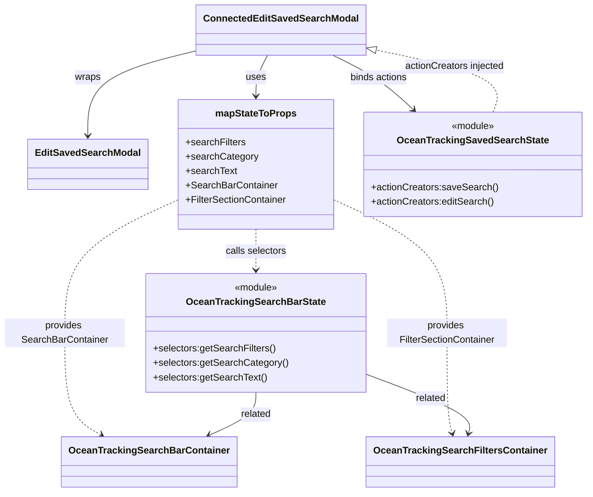

# Diagram: web/portal/src/pages/oceantracking/components/search/OceanTracking.EditSavedSearchModal.container.js

> Auto-generated by Obscura crawlers

## Mermaid

### SVG

<svg id="container" width="960.23046875" xmlns="http://www.w3.org/2000/svg" class="classDiagram" height="820" viewBox="0 0 960.23046875 820" role="graphics-document document" aria-roledescription="class"><g><defs><marker id="container_class-aggregationStart" class="marker aggregation class" refX="18" refY="7" markerWidth="190" markerHeight="240" orient="auto"><path d="M 18,7 L9,13 L1,7 L9,1 Z"></path></marker></defs><defs><marker id="container_class-aggregationEnd" class="marker aggregation class" refX="1" refY="7" markerWidth="20" markerHeight="28" orient="auto"><path d="M 18,7 L9,13 L1,7 L9,1 Z"></path></marker></defs><defs><marker id="container_class-extensionStart" class="marker extension class" refX="18" refY="7" markerWidth="190" markerHeight="240" orient="auto"><path d="M 1,7 L18,13 V 1 Z"></path></marker></defs><defs><marker id="container_class-extensionEnd" class="marker extension class" refX="1" refY="7" markerWidth="20" markerHeight="28" orient="auto"><path d="M 1,1 V 13 L18,7 Z"></path></marker></defs><defs><marker id="container_class-compositionStart" class="marker composition class" refX="18" refY="7" markerWidth="190" markerHeight="240" orient="auto"><path d="M 18,7 L9,13 L1,7 L9,1 Z"></path></marker></defs><defs><marker id="container_class-compositionEnd" class="marker composition class" refX="1" refY="7" markerWidth="20" markerHeight="28" orient="auto"><path d="M 18,7 L9,13 L1,7 L9,1 Z"></path></marker></defs><defs><marker id="container_class-dependencyStart" class="marker dependency class" refX="6" refY="7" markerWidth="190" markerHeight="240" orient="auto"><path d="M 5,7 L9,13 L1,7 L9,1 Z"></path></marker></defs><defs><marker id="container_class-dependencyEnd" class="marker dependency class" refX="13" refY="7" markerWidth="20" markerHeight="28" orient="auto"><path d="M 18,7 L9,13 L14,7 L9,1 Z"></path></marker></defs><defs><marker id="container_class-lollipopStart" class="marker lollipop class" refX="13" refY="7" markerWidth="190" markerHeight="240" orient="auto"><circle stroke="black" fill="transparent" cx="7" cy="7" r="6"></circle></marker></defs><defs><marker id="container_class-lollipopEnd" class="marker lollipop class" refX="1" refY="7" markerWidth="190" markerHeight="240" orient="auto"><circle stroke="black" fill="transparent" cx="7" cy="7" r="6"></circle></marker></defs><g class="root"><g class="clusters"></g><g class="edgePaths"><path d="M329.508,83.423L299.008,91.019C268.509,98.615,207.51,113.808,177.011,137.57C146.512,161.333,146.512,193.667,146.512,209.833L146.512,226" id="id_ConnectedEditSavedSearchModal_EditSavedSearchModal_1" class="edge-thickness-normal edge-pattern-solid relation" style=";;;" data-edge="true" data-et="edge" data-id="id_ConnectedEditSavedSearchModal_EditSavedSearchModal_1" data-points="W3sieCI6MzI5LjUwNzgxMjUsInkiOjgzLjQyMjgxNDk4OTk2MzE3fSx7IngiOjE0Ni41MTE3MTg3NSwieSI6MTI5fSx7IngiOjE0Ni41MTE3MTg3NSwieSI6MjMyfV0=" marker-end="url(#container_class-dependencyEnd)"></path><path d="M441.042,92L437.714,98.167C434.387,104.333,427.733,116.667,424.405,128C421.078,139.333,421.078,149.667,421.078,154.833L421.078,160" id="id_ConnectedEditSavedSearchModal_mapStateToProps_2" class="edge-thickness-normal edge-pattern-solid relation" style=";;;" data-edge="true" data-et="edge" data-id="id_ConnectedEditSavedSearchModal_mapStateToProps_2" data-points="W3sieCI6NDQxLjA0MTczMjU5NDkzNjcsInkiOjkyfSx7IngiOjQyMS4wNzgxMjUsInkiOjEyOX0seyJ4Ijo0MjEuMDc4MTI1LCJ5IjoxNjZ9XQ==" marker-end="url(#container_class-dependencyEnd)"></path><path d="M548.859,92L561.362,98.167C573.865,104.333,598.871,116.667,620.805,131.811C642.74,146.954,661.603,164.909,671.035,173.886L680.466,182.863" id="id_ConnectedEditSavedSearchModal_OceanTrackingSavedSearchState_3" class="edge-thickness-normal edge-pattern-solid relation" style=";;;" data-edge="true" data-et="edge" data-id="id_ConnectedEditSavedSearchModal_OceanTrackingSavedSearchState_3" data-points="W3sieCI6NTQ4Ljg1ODgzMTA5MTc3MjEsInkiOjkyfSx7IngiOjYyMy44NzY5NTMxMjUsInkiOjEyOX0seyJ4Ijo2ODQuODEyMTA5Mzc1LCJ5IjoxODd9XQ==" marker-end="url(#container_class-dependencyEnd)"></path><path d="M421.078,382L421.078,388.167C421.078,394.333,421.078,406.667,421.078,418C421.078,429.333,421.078,439.667,421.078,444.833L421.078,450" id="id_mapStateToProps_OceanTrackingSearchBarState_4" class="edge-thickness-normal edge-pattern-dashed relation" style=";;;" data-edge="true" data-et="edge" data-id="id_mapStateToProps_OceanTrackingSearchBarState_4" data-points="W3sieCI6NDIxLjA3ODEyNSwieSI6MzgyfSx7IngiOjQyMS4wNzgxMjUsInkiOjQxOX0seyJ4Ijo0MjEuMDc4MTI1LCJ5Ijo0NTZ9XQ==" marker-end="url(#container_class-dependencyEnd)"></path><path d="M291.957,333.802L261.298,348.001C230.638,362.201,169.319,390.601,138.66,427.467C108,464.333,108,509.667,108,555C108,600.333,108,645.667,117.992,674.006C127.984,702.346,147.968,713.692,157.959,719.365L167.951,725.038" id="id_mapStateToProps_OceanTrackingSearchBarContainer_5" class="edge-thickness-normal edge-pattern-dashed relation" style=";;;" data-edge="true" data-et="edge" data-id="id_mapStateToProps_OceanTrackingSearchBarContainer_5" data-points="W3sieCI6MjkxLjk1NzAzMTI1LCJ5IjozMzMuODAxNTU0NjIzOTQ1N30seyJ4IjoxMDgsInkiOjQxOX0seyJ4IjoxMDgsInkiOjU1NX0seyJ4IjoxMDgsInkiOjY5MX0seyJ4IjoxNzMuMTY4OTU3Njc0MDUwNjMsInkiOjcyOH1d" marker-end="url(#container_class-dependencyEnd)"></path><path d="M550.199,333.802L580.859,348.001C611.518,362.201,672.837,390.601,703.497,427.467C734.156,464.333,734.156,509.667,734.156,555C734.156,600.333,734.156,645.667,735.665,673.54C737.173,701.412,740.19,711.825,741.699,717.031L743.207,722.237" id="id_mapStateToProps_OceanTrackingSearchFiltersContainer_6" class="edge-thickness-normal edge-pattern-dashed relation" style=";;;" data-edge="true" data-et="edge" data-id="id_mapStateToProps_OceanTrackingSearchFiltersContainer_6" data-points="W3sieCI6NTUwLjE5OTIxODc1LCJ5IjozMzMuODAxNTU0NjIzOTQ1N30seyJ4Ijo3MzQuMTU2MjUsInkiOjQxOX0seyJ4Ijo3MzQuMTU2MjUsInkiOjU1NX0seyJ4Ijo3MzQuMTU2MjUsInkiOjY5MX0seyJ4Ijo3NDQuODc3MTc1NjMyOTExNCwieSI6NzI4fV0=" marker-end="url(#container_class-dependencyEnd)"></path><path d="M811.627,187L815.561,177.333C819.496,167.667,827.365,148.333,794.556,130.854C761.747,113.374,688.259,97.748,651.515,89.935L614.771,82.122" id="id_OceanTrackingSavedSearchState_ConnectedEditSavedSearchModal_7" class="edge-thickness-normal edge-pattern-dashed relation" style=";;;" data-edge="true" data-et="edge" data-id="id_OceanTrackingSavedSearchState_ConnectedEditSavedSearchModal_7" data-points="W3sieCI6ODExLjYyNjU2MjUsInkiOjE4N30seyJ4Ijo4MzUuMjM0Mzc1LCJ5IjoxMjl9LHsieCI6NTk3Ljg5ODQzNzUsInkiOjc4LjUzNDQyMjU3NTQ4OTk0fV0=" marker-end="url(#container_class-extensionEnd)"></path><path d="M421.078,654L421.078,660.167C421.078,666.333,421.078,678.667,408.412,690.586C395.745,702.506,370.412,714.013,357.745,719.766L345.078,725.519" id="id_OceanTrackingSearchBarState_OceanTrackingSearchBarContainer_8" class="edge-thickness-normal edge-pattern-solid relation" style=";;;" data-edge="true" data-et="edge" data-id="id_OceanTrackingSearchBarState_OceanTrackingSearchBarContainer_8" data-points="W3sieCI6NDIxLjA3ODEyNSwieSI6NjU0fSx7IngiOjQyMS4wNzgxMjUsInkiOjY5MX0seyJ4IjozMzkuNjE1NTU1Nzc1MzE2NDcsInkiOjcyOH1d" marker-end="url(#container_class-dependencyEnd)"></path><path d="M599.156,622.488L629.286,633.906C659.417,645.325,719.677,668.163,748.299,684.787C776.92,701.412,773.903,711.825,772.395,717.031L770.886,722.237" id="id_OceanTrackingSearchBarState_OceanTrackingSearchFiltersContainer_9" class="edge-thickness-normal edge-pattern-solid relation" style=";;;" data-edge="true" data-et="edge" data-id="id_OceanTrackingSearchBarState_OceanTrackingSearchFiltersContainer_9" data-points="W3sieCI6NTk5LjE1NjI1LCJ5Ijo2MjIuNDg3Nzg2ODI0NTc0NH0seyJ4Ijo3NzkuOTM3NSwieSI6NjkxfSx7IngiOjc2OS4yMTY1NzQzNjcwODg2LCJ5Ijo3Mjh9XQ==" marker-end="url(#container_class-dependencyEnd)"></path></g><g class="edgeLabels"><g class="edgeLabel" transform="translate(146.51171875, 129)"><g class="label" data-id="id_ConnectedEditSavedSearchModal_EditSavedSearchModal_1" transform="translate(-21.390625, -12)"><foreignObject width="42.78125" height="24">

wraps

</foreignObject></g></g><g class="edgeLabel" transform="translate(421.078125, 129)"><g class="label" data-id="id_ConnectedEditSavedSearchModal_mapStateToProps_2" transform="translate(-16.4921875, -12)"><foreignObject width="32.984375" height="24">

uses

</foreignObject></g></g><g class="edgeLabel" transform="translate(624.05046, 129.16515)"><g class="label" data-id="id_ConnectedEditSavedSearchModal_OceanTrackingSavedSearchState_3" transform="translate(-48.7578125, -12)"><foreignObject width="97.515625" height="24">

binds actions

</foreignObject></g></g><g class="edgeLabel" transform="translate(421.078125, 419)"><g class="label" data-id="id_mapStateToProps_OceanTrackingSearchBarState_4" transform="translate(-51.2890625, -12)"><foreignObject width="102.578125" height="24">

calls selectors

</foreignObject></g></g><g class="edgeLabel" transform="translate(108, 555)"><g class="label" data-id="id_mapStateToProps_OceanTrackingSearchBarContainer_5" transform="translate(-100, -24)"><foreignObject width="200" height="48">

provides SearchBarContainer

</foreignObject></g></g><g class="edgeLabel" transform="translate(734.15625, 555)"><g class="label" data-id="id_mapStateToProps_OceanTrackingSearchFiltersContainer_6" transform="translate(-100, -24)"><foreignObject width="200" height="48">

provides FilterSectionContainer

</foreignObject></g></g><g class="edgeLabel" transform="translate(747.19198, 110.27923)"><g class="label" data-id="id_OceanTrackingSavedSearchState_ConnectedEditSavedSearchModal_7" transform="translate(-84.0703125, -12)"><foreignObject width="168.140625" height="24">

actionCreators injected

</foreignObject></g></g><g class="edgeLabel" transform="translate(421.078125, 691)"><g class="label" data-id="id_OceanTrackingSearchBarState_OceanTrackingSearchBarContainer_8" transform="translate(-25.78125, -12)"><foreignObject width="51.5625" height="24">

related

</foreignObject></g></g><g class="edgeLabel" transform="translate(707.55781, 663.56965)"><g class="label" data-id="id_OceanTrackingSearchBarState_OceanTrackingSearchFiltersContainer_9" transform="translate(-25.78125, -12)"><foreignObject width="51.5625" height="24">

related

</foreignObject></g></g></g><g class="nodes"><g class="node default" id="classId-EditSavedSearchModal-0" transform="translate(146.51171875, 274)"><g class="basic label-container"><path d="M-95.4453125 -42 L95.4453125 -42 L95.4453125 42 L-95.4453125 42" stroke="none" stroke-width="0" fill="#ECECFF" style=""></path><path d="M-95.4453125 -42 C-24.30237149659858 -42, 46.84056950680284 -42, 95.4453125 -42 M-95.4453125 -42 C-40.837870983501126 -42, 13.769570532997747 -42, 95.4453125 -42 M95.4453125 -42 C95.4453125 -20.1105016686278, 95.4453125 1.7789966627443974, 95.4453125 42 M95.4453125 -42 C95.4453125 -17.820484531765572, 95.4453125 6.359030936468855, 95.4453125 42 M95.4453125 42 C54.848570274469985 42, 14.25182804893997 42, -95.4453125 42 M95.4453125 42 C21.585764375759652 42, -52.273783748480696 42, -95.4453125 42 M-95.4453125 42 C-95.4453125 23.81484777175516, -95.4453125 5.629695543510323, -95.4453125 -42 M-95.4453125 42 C-95.4453125 23.777518735363156, -95.4453125 5.555037470726312, -95.4453125 -42" stroke="#9370DB" stroke-width="1.3" fill="none" stroke-dasharray="0 0" style=""></path></g><g class="annotation-group text" transform="translate(0, -18)"></g><g class="label-group text" transform="translate(-83.4453125, -18)"><g class="label" style="font-weight: bolder" transform="translate(0,-12)"><foreignObject width="166.890625" height="24">

EditSavedSearchModal

</foreignObject></g></g><g class="members-group text" transform="translate(-83.4453125, 30)"></g><g class="methods-group text" transform="translate(-83.4453125, 60)"></g><g class="divider" style=""><path d="M-95.4453125 6 C-29.59281179245714 6, 36.25968891508572 6, 95.4453125 6 M-95.4453125 6 C-55.91561468521562 6, -16.385916870431245 6, 95.4453125 6" stroke="#9370DB" stroke-width="1.3" fill="none" stroke-dasharray="0 0" style=""></path></g><g class="divider" style=""><path d="M-95.4453125 24 C-47.87941699253921 24, -0.31352148507842514 24, 95.4453125 24 M-95.4453125 24 C-35.96446100042164 24, 23.516390499156714 24, 95.4453125 24" stroke="#9370DB" stroke-width="1.3" fill="none" stroke-dasharray="0 0" style=""></path></g></g><g class="node default" id="classId-ConnectedEditSavedSearchModal-1" transform="translate(463.703125, 50)"><g class="basic label-container"><path d="M-134.1953125 -42 L134.1953125 -42 L134.1953125 42 L-134.1953125 42" stroke="none" stroke-width="0" fill="#ECECFF" style=""></path><path d="M-134.1953125 -42 C-34.742845419008646 -42, 64.70962166198271 -42, 134.1953125 -42 M-134.1953125 -42 C-49.957949352343036 -42, 34.27941379531393 -42, 134.1953125 -42 M134.1953125 -42 C134.1953125 -8.796209172668178, 134.1953125 24.407581654663645, 134.1953125 42 M134.1953125 -42 C134.1953125 -13.073249244652079, 134.1953125 15.853501510695843, 134.1953125 42 M134.1953125 42 C44.27857265475728 42, -45.63816719048543 42, -134.1953125 42 M134.1953125 42 C34.5401174407978 42, -65.1150776184044 42, -134.1953125 42 M-134.1953125 42 C-134.1953125 8.583156010243698, -134.1953125 -24.833687979512604, -134.1953125 -42 M-134.1953125 42 C-134.1953125 22.94508475365363, -134.1953125 3.890169507307263, -134.1953125 -42" stroke="#9370DB" stroke-width="1.3" fill="none" stroke-dasharray="0 0" style=""></path></g><g class="annotation-group text" transform="translate(0, -18)"></g><g class="label-group text" transform="translate(-122.1953125, -18)"><g class="label" style="font-weight: bolder" transform="translate(0,-12)"><foreignObject width="244.390625" height="24">

ConnectedEditSavedSearchModal

</foreignObject></g></g><g class="members-group text" transform="translate(-122.1953125, 30)"></g><g class="methods-group text" transform="translate(-122.1953125, 60)"></g><g class="divider" style=""><path d="M-134.1953125 6 C-74.94824734867863 6, -15.70118219735727 6, 134.1953125 6 M-134.1953125 6 C-79.28920119371236 6, -24.38308988742473 6, 134.1953125 6" stroke="#9370DB" stroke-width="1.3" fill="none" stroke-dasharray="0 0" style=""></path></g><g class="divider" style=""><path d="M-134.1953125 24 C-30.236313868152862 24, 73.72268476369428 24, 134.1953125 24 M-134.1953125 24 C-68.79824002335046 24, -3.4011675467009184 24, 134.1953125 24" stroke="#9370DB" stroke-width="1.3" fill="none" stroke-dasharray="0 0" style=""></path></g></g><g class="node default" id="classId-mapStateToProps-2" transform="translate(421.078125, 274)"><g class="basic label-container"><path d="M-129.12109375 -108 L129.12109375 -108 L129.12109375 108 L-129.12109375 108" stroke="none" stroke-width="0" fill="#ECECFF" style=""></path><path d="M-129.12109375 -108 C-28.339749899963223 -108, 72.44159395007355 -108, 129.12109375 -108 M-129.12109375 -108 C-42.84819617083663 -108, 43.42470140832674 -108, 129.12109375 -108 M129.12109375 -108 C129.12109375 -42.92029307598327, 129.12109375 22.159413848033466, 129.12109375 108 M129.12109375 -108 C129.12109375 -46.97628946737893, 129.12109375 14.047421065242133, 129.12109375 108 M129.12109375 108 C70.41803741622039 108, 11.714981082440772 108, -129.12109375 108 M129.12109375 108 C46.5572081215835 108, -36.006677506833 108, -129.12109375 108 M-129.12109375 108 C-129.12109375 64.1270438959035, -129.12109375 20.254087791806995, -129.12109375 -108 M-129.12109375 108 C-129.12109375 51.20493754804497, -129.12109375 -5.590124903910066, -129.12109375 -108" stroke="#9370DB" stroke-width="1.3" fill="none" stroke-dasharray="0 0" style=""></path></g><g class="annotation-group text" transform="translate(0, -84)"></g><g class="label-group text" transform="translate(-64.7109375, -84)"><g class="label" style="font-weight: bolder" transform="translate(0,-12)"><foreignObject width="129.421875" height="24">

mapStateToProps

</foreignObject></g></g><g class="members-group text" transform="translate(-117.12109375, -36)"><g class="label" style="" transform="translate(0,-12)"><foreignObject width="99.609375" height="24">

+searchFilters

</foreignObject></g><g class="label" style="" transform="translate(0,12)"><foreignObject width="118.65625" height="24">

+searchCategory

</foreignObject></g><g class="label" style="" transform="translate(0,36)"><foreignObject width="84.953125" height="24">

+searchText

</foreignObject></g><g class="label" style="" transform="translate(0,60)"><foreignObject width="151.171875" height="24">

+SearchBarContainer

</foreignObject></g><g class="label" style="" transform="translate(0,84)"><foreignObject width="169.53125" height="24">

+FilterSectionContainer

</foreignObject></g></g><g class="methods-group text" transform="translate(-117.12109375, 108)"></g><g class="divider" style=""><path d="M-129.12109375 -60 C-45.03181584588181 -60, 39.05746205823638 -60, 129.12109375 -60 M-129.12109375 -60 C-73.96470010427615 -60, -18.80830645855231 -60, 129.12109375 -60" stroke="#9370DB" stroke-width="1.3" fill="none" stroke-dasharray="0 0" style=""></path></g><g class="divider" style=""><path d="M-129.12109375 84 C-63.478121299609455 84, 2.1648511507810895 84, 129.12109375 84 M-129.12109375 84 C-75.97915499791733 84, -22.837216245834654 84, 129.12109375 84" stroke="#9370DB" stroke-width="1.3" fill="none" stroke-dasharray="0 0" style=""></path></g></g><g class="node default" id="classId-OceanTrackingSearchBarContainer-3" transform="translate(247.14453125, 770)"><g class="basic label-container"><path d="M-138.296875 -42 L138.296875 -42 L138.296875 42 L-138.296875 42" stroke="none" stroke-width="0" fill="#ECECFF" style=""></path><path d="M-138.296875 -42 C-66.08922714028243 -42, 6.118420719435136 -42, 138.296875 -42 M-138.296875 -42 C-75.48548489254046 -42, -12.67409478508091 -42, 138.296875 -42 M138.296875 -42 C138.296875 -17.994591404729974, 138.296875 6.0108171905400525, 138.296875 42 M138.296875 -42 C138.296875 -20.173125146322203, 138.296875 1.653749707355594, 138.296875 42 M138.296875 42 C41.391257295863994 42, -55.51436040827201 42, -138.296875 42 M138.296875 42 C60.09009184474016 42, -18.116691310519684 42, -138.296875 42 M-138.296875 42 C-138.296875 11.85963415780192, -138.296875 -18.28073168439616, -138.296875 -42 M-138.296875 42 C-138.296875 10.05445047578635, -138.296875 -21.8910990484273, -138.296875 -42" stroke="#9370DB" stroke-width="1.3" fill="none" stroke-dasharray="0 0" style=""></path></g><g class="annotation-group text" transform="translate(0, -18)"></g><g class="label-group text" transform="translate(-126.296875, -18)"><g class="label" style="font-weight: bolder" transform="translate(0,-12)"><foreignObject width="252.59375" height="24">

OceanTrackingSearchBarContainer

</foreignObject></g></g><g class="members-group text" transform="translate(-126.296875, 30)"></g><g class="methods-group text" transform="translate(-126.296875, 60)"></g><g class="divider" style=""><path d="M-138.296875 6 C-52.57085393985898 6, 33.155167120282044 6, 138.296875 6 M-138.296875 6 C-61.62300745405574 6, 15.050860091888524 6, 138.296875 6" stroke="#9370DB" stroke-width="1.3" fill="none" stroke-dasharray="0 0" style=""></path></g><g class="divider" style=""><path d="M-138.296875 24 C-57.51219283185931 24, 23.27248933628138 24, 138.296875 24 M-138.296875 24 C-75.18376876196453 24, -12.070662523929073 24, 138.296875 24" stroke="#9370DB" stroke-width="1.3" fill="none" stroke-dasharray="0 0" style=""></path></g></g><g class="node default" id="classId-OceanTrackingSearchFiltersContainer-4" transform="translate(757.046875, 770)"><g class="basic label-container"><path d="M-148.40625 -42 L148.40625 -42 L148.40625 42 L-148.40625 42" stroke="none" stroke-width="0" fill="#ECECFF" style=""></path><path d="M-148.40625 -42 C-49.55546310971998 -42, 49.29532378056004 -42, 148.40625 -42 M-148.40625 -42 C-50.15428344736884 -42, 48.09768310526232 -42, 148.40625 -42 M148.40625 -42 C148.40625 -9.70937567516797, 148.40625 22.58124864966406, 148.40625 42 M148.40625 -42 C148.40625 -17.6556987870685, 148.40625 6.688602425863003, 148.40625 42 M148.40625 42 C50.585862094750226 42, -47.23452581049955 42, -148.40625 42 M148.40625 42 C78.97663458991254 42, 9.547019179825071 42, -148.40625 42 M-148.40625 42 C-148.40625 9.388073063032024, -148.40625 -23.22385387393595, -148.40625 -42 M-148.40625 42 C-148.40625 13.39105600415975, -148.40625 -15.217887991680499, -148.40625 -42" stroke="#9370DB" stroke-width="1.3" fill="none" stroke-dasharray="0 0" style=""></path></g><g class="annotation-group text" transform="translate(0, -18)"></g><g class="label-group text" transform="translate(-136.40625, -18)"><g class="label" style="font-weight: bolder" transform="translate(0,-12)"><foreignObject width="272.8125" height="24">

OceanTrackingSearchFiltersContainer

</foreignObject></g></g><g class="members-group text" transform="translate(-136.40625, 30)"></g><g class="methods-group text" transform="translate(-136.40625, 60)"></g><g class="divider" style=""><path d="M-148.40625 6 C-33.28543873354474 6, 81.83537253291053 6, 148.40625 6 M-148.40625 6 C-44.77659722318333 6, 58.85305555363334 6, 148.40625 6" stroke="#9370DB" stroke-width="1.3" fill="none" stroke-dasharray="0 0" style=""></path></g><g class="divider" style=""><path d="M-148.40625 24 C-35.12020542355927 24, 78.16583915288146 24, 148.40625 24 M-148.40625 24 C-56.64933134957606 24, 35.10758730084788 24, 148.40625 24" stroke="#9370DB" stroke-width="1.3" fill="none" stroke-dasharray="0 0" style=""></path></g></g><g class="node default" id="classId-OceanTrackingSearchBarState-5" transform="translate(421.078125, 555)"><g class="basic label-container"><path d="M-178.078125 -99 L178.078125 -99 L178.078125 99 L-178.078125 99" stroke="none" stroke-width="0" fill="#ECECFF" style=""></path><path d="M-178.078125 -99 C-76.03854310478242 -99, 26.00103879043516 -99, 178.078125 -99 M-178.078125 -99 C-85.29456845091559 -99, 7.488988098168818 -99, 178.078125 -99 M178.078125 -99 C178.078125 -40.00121489316798, 178.078125 18.997570213664034, 178.078125 99 M178.078125 -99 C178.078125 -40.161174582657196, 178.078125 18.677650834685608, 178.078125 99 M178.078125 99 C42.246301533821395 99, -93.58552193235721 99, -178.078125 99 M178.078125 99 C87.94032194609622 99, -2.197481107807562 99, -178.078125 99 M-178.078125 99 C-178.078125 56.624803060076374, -178.078125 14.249606120152748, -178.078125 -99 M-178.078125 99 C-178.078125 44.232904107755324, -178.078125 -10.534191784489352, -178.078125 -99" stroke="#9370DB" stroke-width="1.3" fill="none" stroke-dasharray="0 0" style=""></path></g><g class="annotation-group text" transform="translate(-36.6015625, -75)"><g class="label" style="" transform="translate(0,-12)"><foreignObject width="73.203125" height="24">

«module»

</foreignObject></g></g><g class="label-group text" transform="translate(-110.015625, -51)"><g class="label" style="font-weight: bolder" transform="translate(0,-12)"><foreignObject width="220.03125" height="24">

OceanTrackingSearchBarState

</foreignObject></g></g><g class="members-group text" transform="translate(-166.078125, -3)"></g><g class="methods-group text" transform="translate(-166.078125, 27)"><g class="label" style="" transform="translate(0,-12)"><foreignObject width="203.078125" height="24">

+selectors:getSearchFilters()

</foreignObject></g><g class="label" style="" transform="translate(0,12)"><foreignObject width="222.140625" height="24">

+selectors:getSearchCategory()

</foreignObject></g><g class="label" style="" transform="translate(0,36)"><foreignObject width="188.421875" height="24">

+selectors:getSearchText()

</foreignObject></g></g><g class="divider" style=""><path d="M-178.078125 -27 C-86.26261193982073 -27, 5.552901120358541 -27, 178.078125 -27 M-178.078125 -27 C-60.653639700107576 -27, 56.77084559978485 -27, 178.078125 -27" stroke="#9370DB" stroke-width="1.3" fill="none" stroke-dasharray="0 0" style=""></path></g><g class="divider" style=""><path d="M-178.078125 -3 C-102.07204698648574 -3, -26.06596897297149 -3, 178.078125 -3 M-178.078125 -3 C-48.657232849641844 -3, 80.76365930071631 -3, 178.078125 -3" stroke="#9370DB" stroke-width="1.3" fill="none" stroke-dasharray="0 0" style=""></path></g></g><g class="node default" id="classId-OceanTrackingSavedSearchState-6" transform="translate(776.21484375, 274)"><g class="basic label-container"><path d="M-176.015625 -87 L176.015625 -87 L176.015625 87 L-176.015625 87" stroke="none" stroke-width="0" fill="#ECECFF" style=""></path><path d="M-176.015625 -87 C-65.46921354736024 -87, 45.07719790527952 -87, 176.015625 -87 M-176.015625 -87 C-96.60928724682447 -87, -17.20294949364893 -87, 176.015625 -87 M176.015625 -87 C176.015625 -22.393061140947466, 176.015625 42.21387771810507, 176.015625 87 M176.015625 -87 C176.015625 -19.10577219777717, 176.015625 48.78845560444566, 176.015625 87 M176.015625 87 C77.48976341121904 87, -21.03609817756191 87, -176.015625 87 M176.015625 87 C38.078156974553906 87, -99.85931105089219 87, -176.015625 87 M-176.015625 87 C-176.015625 18.025135684761352, -176.015625 -50.949728630477296, -176.015625 -87 M-176.015625 87 C-176.015625 27.23612567394948, -176.015625 -32.52774865210104, -176.015625 -87" stroke="#9370DB" stroke-width="1.3" fill="none" stroke-dasharray="0 0" style=""></path></g><g class="annotation-group text" transform="translate(-36.6015625, -63)"><g class="label" style="" transform="translate(0,-12)"><foreignObject width="73.203125" height="24">

«module»

</foreignObject></g></g><g class="label-group text" transform="translate(-119.578125, -39)"><g class="label" style="font-weight: bolder" transform="translate(0,-12)"><foreignObject width="239.15625" height="24">

OceanTrackingSavedSearchState

</foreignObject></g></g><g class="members-group text" transform="translate(-164.015625, 9)"></g><g class="methods-group text" transform="translate(-164.015625, 39)"><g class="label" style="" transform="translate(0,-12)"><foreignObject width="208.453125" height="24">

+actionCreators:saveSearch()

</foreignObject></g><g class="label" style="" transform="translate(0,12)"><foreignObject width="204.5625" height="24">

+actionCreators:editSearch()

</foreignObject></g></g><g class="divider" style=""><path d="M-176.015625 -15 C-52.221365870514305 -15, 71.57289325897139 -15, 176.015625 -15 M-176.015625 -15 C-47.38773288941778 -15, 81.24015922116445 -15, 176.015625 -15" stroke="#9370DB" stroke-width="1.3" fill="none" stroke-dasharray="0 0" style=""></path></g><g class="divider" style=""><path d="M-176.015625 9 C-38.04801569251552 9, 99.91959361496896 9, 176.015625 9 M-176.015625 9 C-47.48140899207999 9, 81.05280701584002 9, 176.015625 9" stroke="#9370DB" stroke-width="1.3" fill="none" stroke-dasharray="0 0" style=""></path></g></g></g></g></g></svg>
