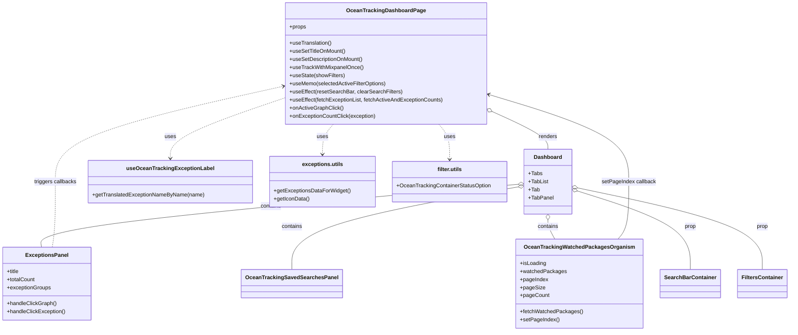

# Diagram: web/portal/src/pages/oceantracking/dashboard/OceanTracking.Dashboard.page.js


> Auto-generated by Obscura crawlers

## Diagram 1



### SVG

<svg id="container" width="2288.1796875" xmlns="http://www.w3.org/2000/svg" class="classDiagram" height="980" viewBox="0 0 2288.1796875 980" role="graphics-document document" aria-roledescription="class"><style>#container{font-family:"trebuchet ms",verdana,arial,sans-serif;font-size:16px;fill:#333;}@keyframes edge-animation-frame{from{stroke-dashoffset:0;}}@keyframes dash{to{stroke-dashoffset:0;}}#container .edge-animation-slow{stroke-dasharray:9,5!important;stroke-dashoffset:900;animation:dash 50s linear infinite;stroke-linecap:round;}#container .edge-animation-fast{stroke-dasharray:9,5!important;stroke-dashoffset:900;animation:dash 20s linear infinite;stroke-linecap:round;}#container .error-icon{fill:#552222;}#container .error-text{fill:#552222;stroke:#552222;}#container .edge-thickness-normal{stroke-width:1px;}#container .edge-thickness-thick{stroke-width:3.5px;}#container .edge-pattern-solid{stroke-dasharray:0;}#container .edge-thickness-invisible{stroke-width:0;fill:none;}#container .edge-pattern-dashed{stroke-dasharray:3;}#container .edge-pattern-dotted{stroke-dasharray:2;}#container .marker{fill:#333333;stroke:#333333;}#container .marker.cross{stroke:#333333;}#container svg{font-family:"trebuchet ms",verdana,arial,sans-serif;font-size:16px;}#container p{margin:0;}#container g.classGroup text{fill:#9370DB;stroke:none;font-family:"trebuchet ms",verdana,arial,sans-serif;font-size:10px;}#container g.classGroup text .title{font-weight:bolder;}#container .nodeLabel,#container .edgeLabel{color:#131300;}#container .edgeLabel .label rect{fill:#ECECFF;}#container .label text{fill:#131300;}#container .labelBkg{background:#ECECFF;}#container .edgeLabel .label span{background:#ECECFF;}#container .classTitle{font-weight:bolder;}#container .node rect,#container .node circle,#container .node ellipse,#container .node polygon,#container .node path{fill:#ECECFF;stroke:#9370DB;stroke-width:1px;}#container .divider{stroke:#9370DB;stroke-width:1;}#container g.clickable{cursor:pointer;}#container g.classGroup rect{fill:#ECECFF;stroke:#9370DB;}#container g.classGroup line{stroke:#9370DB;stroke-width:1;}#container .classLabel .box{stroke:none;stroke-width:0;fill:#ECECFF;opacity:0.5;}#container .classLabel .label{fill:#9370DB;font-size:10px;}#container .relation{stroke:#333333;stroke-width:1;fill:none;}#container .dashed-line{stroke-dasharray:3;}#container .dotted-line{stroke-dasharray:1 2;}#container #compositionStart,#container .composition{fill:#333333!important;stroke:#333333!important;stroke-width:1;}#container #compositionEnd,#container .composition{fill:#333333!important;stroke:#333333!important;stroke-width:1;}#container #dependencyStart,#container .dependency{fill:#333333!important;stroke:#333333!important;stroke-width:1;}#container #dependencyStart,#container .dependency{fill:#333333!important;stroke:#333333!important;stroke-width:1;}#container #extensionStart,#container .extension{fill:transparent!important;stroke:#333333!important;stroke-width:1;}#container #extensionEnd,#container .extension{fill:transparent!important;stroke:#333333!important;stroke-width:1;}#container #aggregationStart,#container .aggregation{fill:transparent!important;stroke:#333333!important;stroke-width:1;}#container #aggregationEnd,#container .aggregation{fill:transparent!important;stroke:#333333!important;stroke-width:1;}#container #lollipopStart,#container .lollipop{fill:#ECECFF!important;stroke:#333333!important;stroke-width:1;}#container #lollipopEnd,#container .lollipop{fill:#ECECFF!important;stroke:#333333!important;stroke-width:1;}#container .edgeTerminals{font-size:11px;line-height:initial;}#container .classTitleText{text-anchor:middle;font-size:18px;fill:#333;}#container .label-icon{display:inline-block;height:1em;overflow:visible;vertical-align:-0.125em;}#container .node .label-icon path{fill:currentColor;stroke:revert;stroke-width:revert;}#container :root{--mermaid-font-family:"trebuchet ms",verdana,arial,sans-serif;}</style><g><defs><marker id="container_class-aggregationStart" class="marker aggregation class" refX="18" refY="7" markerWidth="190" markerHeight="240" orient="auto"><path d="M 18,7 L9,13 L1,7 L9,1 Z"></path></marker></defs><defs><marker id="container_class-aggregationEnd" class="marker aggregation class" refX="1" refY="7" markerWidth="20" markerHeight="28" orient="auto"><path d="M 18,7 L9,13 L1,7 L9,1 Z"></path></marker></defs><defs><marker id="container_class-extensionStart" class="marker extension class" refX="18" refY="7" markerWidth="190" markerHeight="240" orient="auto"><path d="M 1,7 L18,13 V 1 Z"></path></marker></defs><defs><marker id="container_class-extensionEnd" class="marker extension class" refX="1" refY="7" markerWidth="20" markerHeight="28" orient="auto"><path d="M 1,1 V 13 L18,7 Z"></path></marker></defs><defs><marker id="container_class-compositionStart" class="marker composition class" refX="18" refY="7" markerWidth="190" markerHeight="240" orient="auto"><path d="M 18,7 L9,13 L1,7 L9,1 Z"></path></marker></defs><defs><marker id="container_class-compositionEnd" class="marker composition class" refX="1" refY="7" markerWidth="20" markerHeight="28" orient="auto"><path d="M 18,7 L9,13 L1,7 L9,1 Z"></path></marker></defs><defs><marker id="container_class-dependencyStart" class="marker dependency class" refX="6" refY="7" markerWidth="190" markerHeight="240" orient="auto"><path d="M 5,7 L9,13 L1,7 L9,1 Z"></path></marker></defs><defs><marker id="container_class-dependencyEnd" class="marker dependency class" refX="13" refY="7" markerWidth="20" markerHeight="28" orient="auto"><path d="M 18,7 L9,13 L14,7 L9,1 Z"></path></marker></defs><defs><marker id="container_class-lollipopStart" class="marker lollipop class" refX="13" refY="7" markerWidth="190" markerHeight="240" orient="auto"><circle stroke="black" fill="transparent" cx="7" cy="7" r="6"></circle></marker></defs><defs><marker id="container_class-lollipopEnd" class="marker lollipop class" refX="1" refY="7" markerWidth="190" markerHeight="240" orient="auto"><circle stroke="black" fill="transparent" cx="7" cy="7" r="6"></circle></marker></defs><g class="root"><g class="clusters"></g><g class="edgePaths"><path d="M1435.604,330.211L1462.792,342.676C1489.98,355.141,1544.355,380.07,1571.543,398.702C1598.73,417.333,1598.73,429.667,1598.73,435.833L1598.73,442" id="id_OceanTrackingDashboardPage_Dashboard_1" class="edge-thickness-normal edge-pattern-solid relation" style=";;;" data-edge="true" data-et="edge" data-id="id_OceanTrackingDashboardPage_Dashboard_1" data-points="W3sieCI6MTQxOS45MjM4MjgxMjUsInkiOjMyMy4wMjIwMjMyMzIzMDI0fSx7IngiOjE1OTguNzMwNDY4NzUsInkiOjQwNX0seyJ4IjoxNTk4LjczMDQ2ODc1LCJ5Ijo0NDJ9XQ==" marker-start="url(#container_class-aggregationStart)"></path><path d="M1513.44,545.625L1279.711,566.521C1045.982,587.417,578.524,629.208,346.326,660.271C114.128,691.333,117.189,711.667,118.72,721.833L120.251,732" id="id_Dashboard_ExceptionsPanel_2" class="edge-thickness-normal edge-pattern-solid relation" style=";;;" data-edge="true" data-et="edge" data-id="id_Dashboard_ExceptionsPanel_2" data-points="W3sieCI6MTUzMC42MjEwOTM3NSwieSI6NTQ0LjA4OTEwNzgxODk5MDZ9LHsieCI6MTExLjA2NjQwNjI1LCJ5Ijo2NzF9LHsieCI6MTIwLjI1MDgwODk4NjY4NjQsInkiOjczMn1d" marker-start="url(#container_class-aggregationStart)"></path><path d="M1513.64,553.209L1403.806,572.841C1293.972,592.473,1074.305,631.736,964.471,672.535C854.637,713.333,854.637,755.667,854.637,776.833L854.637,798" id="id_Dashboard_OceanTrackingSavedSearchesPanel_3" class="edge-thickness-normal edge-pattern-solid relation" style=";;;" data-edge="true" data-et="edge" data-id="id_Dashboard_OceanTrackingSavedSearchesPanel_3" data-points="W3sieCI6MTUzMC42MjEwOTM3NSwieSI6NTUwLjE3MzkzMjIxNjIwMjZ9LHsieCI6ODU0LjYzNjcxODc1LCJ5Ijo2NzF9LHsieCI6ODU0LjYzNjcxODc1LCJ5Ijo3OTh9XQ==" marker-start="url(#container_class-aggregationStart)"></path><path d="M1598.73,651.25L1598.73,654.542C1598.73,657.833,1598.73,664.417,1602.064,673.875C1605.398,683.333,1612.066,695.667,1615.4,701.833L1618.734,708" id="id_Dashboard_OceanTrackingWatchedPackagesOrganism_4" class="edge-thickness-normal edge-pattern-solid relation" style=";;;" data-edge="true" data-et="edge" data-id="id_Dashboard_OceanTrackingWatchedPackagesOrganism_4" data-points="W3sieCI6MTU5OC43MzA0Njg3NSwieSI6NjM0fSx7IngiOjE1OTguNzMwNDY4NzUsInkiOjY3MX0seyJ4IjoxNjE4LjczMzkzNTgzNTc5ODgsInkiOjcwOH1d" marker-start="url(#container_class-aggregationStart)"></path><path d="M1683.233,565.673L1736.839,583.227C1790.445,600.782,1897.656,635.891,1951.262,674.612C2004.867,713.333,2004.867,755.667,2004.867,776.833L2004.867,798" id="id_Dashboard_SearchBarContainer_5" class="edge-thickness-normal edge-pattern-solid relation" style=";;;" data-edge="true" data-et="edge" data-id="id_Dashboard_SearchBarContainer_5" data-points="W3sieCI6MTY2Ni44Mzk4NDM3NSwieSI6NTYwLjMwNDE4MDk3MzU0MDd9LHsieCI6MjAwNC44NjcxODc1LCJ5Ijo2NzF9LHsieCI6MjAwNC44NjcxODc1LCJ5Ijo3OTh9XQ==" marker-start="url(#container_class-aggregationStart)"></path><path d="M1683.695,556.488L1771.404,575.574C1859.112,594.659,2034.529,632.829,2122.237,673.081C2209.945,713.333,2209.945,755.667,2209.945,776.833L2209.945,798" id="id_Dashboard_FiltersContainer_6" class="edge-thickness-normal edge-pattern-solid relation" style=";;;" data-edge="true" data-et="edge" data-id="id_Dashboard_FiltersContainer_6" data-points="W3sieCI6MTY2Ni44Mzk4NDM3NSwieSI6NTUyLjgyMDU2MDk5ODUyMzd9LHsieCI6MjIwOS45NDUzMTI1LCJ5Ijo2NzF9LHsieCI6MjIwOS45NDUzMTI1LCJ5Ijo3OTh9XQ==" marker-start="url(#container_class-aggregationStart)"></path><path d="M830.916,289.842L775.414,309.035C719.911,328.228,608.907,366.614,553.405,396.474C497.902,426.333,497.902,447.667,497.902,458.333L497.902,469" id="id_OceanTrackingDashboardPage_useOceanTrackingExceptionLabel_7" class="edge-thickness-normal edge-pattern-dashed relation" style=";;;" data-edge="true" data-et="edge" data-id="id_OceanTrackingDashboardPage_useOceanTrackingExceptionLabel_7" data-points="W3sieCI6ODMwLjkxNjAxNTYyNSwieSI6Mjg5Ljg0MTUyNTg1MzY3MDd9LHsieCI6NDk3LjkwMjM0Mzc1LCJ5Ijo0MDV9LHsieCI6NDk3LjkwMjM0Mzc1LCJ5Ijo0NzV9XQ==" marker-end="url(#container_class-dependencyEnd)"></path><path d="M970.984,368L965.693,374.167C960.402,380.333,949.82,392.667,944.529,407.5C939.238,422.333,939.238,439.667,939.238,448.333L939.238,457" id="id_OceanTrackingDashboardPage_exceptions.utils_8" class="edge-thickness-normal edge-pattern-dashed relation" style=";;;" data-edge="true" data-et="edge" data-id="id_OceanTrackingDashboardPage_exceptions.utils_8" data-points="W3sieCI6OTcwLjk4MzUzNzk0NjQyODYsInkiOjM2OH0seyJ4Ijo5MzkuMjM4MjgxMjUsInkiOjQwNX0seyJ4Ijo5MzkuMjM4MjgxMjUsInkiOjQ2M31d" marker-end="url(#container_class-dependencyEnd)"></path><path d="M1279.856,368L1285.147,374.167C1290.438,380.333,1301.02,392.667,1306.311,410C1311.602,427.333,1311.602,449.667,1311.602,460.833L1311.602,472" id="id_OceanTrackingDashboardPage_filter.utils_9" class="edge-thickness-normal edge-pattern-dashed relation" style=";;;" data-edge="true" data-et="edge" data-id="id_OceanTrackingDashboardPage_filter.utils_9" data-points="W3sieCI6MTI3OS44NTYzMDU4MDM1NzEzLCJ5IjozNjh9LHsieCI6MTMxMS42MDE1NjI1LCJ5Ijo0MDV9LHsieCI6MTMxMS42MDE1NjI1LCJ5Ijo0Nzh9XQ==" marker-end="url(#container_class-dependencyEnd)"></path><path d="M152.773,732L154.303,721.833C155.834,711.667,158.896,691.333,160.426,659C161.957,626.667,161.957,582.333,161.957,538C161.957,493.667,161.957,449.333,272.475,402.275C382.992,355.216,604.027,305.433,714.545,280.541L825.063,255.649" id="id_ExceptionsPanel_OceanTrackingDashboardPage_10" class="edge-thickness-normal edge-pattern-dashed relation" style=";;;" data-edge="true" data-et="edge" data-id="id_ExceptionsPanel_OceanTrackingDashboardPage_10" data-points="W3sieCI6MTUyLjc3MjYyODUxMzMxMzYsInkiOjczMn0seyJ4IjoxNjEuOTU3MDMxMjUsInkiOjY3MX0seyJ4IjoxNjEuOTU3MDMxMjUsInkiOjUzOH0seyJ4IjoxNjEuOTU3MDMxMjUsInkiOjQwNX0seyJ4Ijo4MzAuOTE2MDE1NjI1LCJ5IjoyNTQuMzMwODg2NTExNjY3NTN9XQ==" marker-end="url(#container_class-dependencyEnd)"></path><path d="M1798.563,708L1803.631,701.833C1808.698,695.667,1818.832,683.333,1823.9,655C1828.967,626.667,1828.967,582.333,1828.967,538C1828.967,493.667,1828.967,449.333,1761.749,406.434C1694.53,363.535,1560.094,322.07,1492.876,301.337L1425.657,280.604" id="id_OceanTrackingWatchedPackagesOrganism_OceanTrackingDashboardPage_11" class="edge-thickness-normal edge-pattern-solid relation" style=";;;" data-edge="true" data-et="edge" data-id="id_OceanTrackingWatchedPackagesOrganism_OceanTrackingDashboardPage_11" data-points="W3sieCI6MTc5OC41NjM0OTM4OTc5MjksInkiOjcwOH0seyJ4IjoxODI4Ljk2Njc5Njg3NSwieSI6NjcxfSx7IngiOjE4MjguOTY2Nzk2ODc1LCJ5Ijo1Mzh9LHsieCI6MTgyOC45NjY3OTY4NzUsInkiOjQwNX0seyJ4IjoxNDE5LjkyMzgyODEyNSwieSI6Mjc4LjgzNTk0ODQzMDk0MTR9XQ==" marker-end="url(#container_class-dependencyEnd)"></path></g><g class="edgeLabels"><g class="edgeLabel" transform="translate(1598.73046875, 405)"><g class="label" data-id="id_OceanTrackingDashboardPage_Dashboard_1" transform="translate(-27.75, -12)"><foreignObject width="55.5" height="24"><div xmlns="http://www.w3.org/1999/xhtml" class="labelBkg" style="display: table-cell; white-space: nowrap; line-height: 1.5; max-width: 200px; text-align: center;"><span class="edgeLabel"><p>renders</p></span></div></foreignObject></g></g><g class="edgeLabel" transform="translate(790.12251, 610.29109)"><g class="label" data-id="id_Dashboard_ExceptionsPanel_2" transform="translate(-30.890625, -12)"><foreignObject width="61.78125" height="24"><div xmlns="http://www.w3.org/1999/xhtml" class="labelBkg" style="display: table-cell; white-space: nowrap; line-height: 1.5; max-width: 200px; text-align: center;"><span class="edgeLabel"><p>contains</p></span></div></foreignObject></g></g><g class="edgeLabel" transform="translate(854.63671875, 671)"><g class="label" data-id="id_Dashboard_OceanTrackingSavedSearchesPanel_3" transform="translate(-30.890625, -12)"><foreignObject width="61.78125" height="24"><div xmlns="http://www.w3.org/1999/xhtml" class="labelBkg" style="display: table-cell; white-space: nowrap; line-height: 1.5; max-width: 200px; text-align: center;"><span class="edgeLabel"><p>contains</p></span></div></foreignObject></g></g><g class="edgeLabel" transform="translate(1598.73046875, 671)"><g class="label" data-id="id_Dashboard_OceanTrackingWatchedPackagesOrganism_4" transform="translate(-30.890625, -12)"><foreignObject width="61.78125" height="24"><div xmlns="http://www.w3.org/1999/xhtml" class="labelBkg" style="display: table-cell; white-space: nowrap; line-height: 1.5; max-width: 200px; text-align: center;"><span class="edgeLabel"><p>contains</p></span></div></foreignObject></g></g><g class="edgeLabel" transform="translate(2004.8671875, 671)"><g class="label" data-id="id_Dashboard_SearchBarContainer_5" transform="translate(-17.03125, -12)"><foreignObject width="34.0625" height="24"><div xmlns="http://www.w3.org/1999/xhtml" class="labelBkg" style="display: table-cell; white-space: nowrap; line-height: 1.5; max-width: 200px; text-align: center;"><span class="edgeLabel"><p>prop</p></span></div></foreignObject></g></g><g class="edgeLabel" transform="translate(2209.9453125, 671)"><g class="label" data-id="id_Dashboard_FiltersContainer_6" transform="translate(-17.03125, -12)"><foreignObject width="34.0625" height="24"><div xmlns="http://www.w3.org/1999/xhtml" class="labelBkg" style="display: table-cell; white-space: nowrap; line-height: 1.5; max-width: 200px; text-align: center;"><span class="edgeLabel"><p>prop</p></span></div></foreignObject></g></g><g class="edgeLabel" transform="translate(497.90234375, 405)"><g class="label" data-id="id_OceanTrackingDashboardPage_useOceanTrackingExceptionLabel_7" transform="translate(-16.4921875, -12)"><foreignObject width="32.984375" height="24"><div xmlns="http://www.w3.org/1999/xhtml" class="labelBkg" style="display: table-cell; white-space: nowrap; line-height: 1.5; max-width: 200px; text-align: center;"><span class="edgeLabel"><p>uses</p></span></div></foreignObject></g></g><g class="edgeLabel" transform="translate(939.23828125, 405)"><g class="label" data-id="id_OceanTrackingDashboardPage_exceptions.utils_8" transform="translate(-16.4921875, -12)"><foreignObject width="32.984375" height="24"><div xmlns="http://www.w3.org/1999/xhtml" class="labelBkg" style="display: table-cell; white-space: nowrap; line-height: 1.5; max-width: 200px; text-align: center;"><span class="edgeLabel"><p>uses</p></span></div></foreignObject></g></g><g class="edgeLabel" transform="translate(1311.6015625, 405)"><g class="label" data-id="id_OceanTrackingDashboardPage_filter.utils_9" transform="translate(-16.4921875, -12)"><foreignObject width="32.984375" height="24"><div xmlns="http://www.w3.org/1999/xhtml" class="labelBkg" style="display: table-cell; white-space: nowrap; line-height: 1.5; max-width: 200px; text-align: center;"><span class="edgeLabel"><p>uses</p></span></div></foreignObject></g></g><g class="edgeLabel" transform="translate(161.95703125, 538)"><g class="label" data-id="id_ExceptionsPanel_OceanTrackingDashboardPage_10" transform="translate(-62.953125, -12)"><foreignObject width="125.90625" height="24"><div xmlns="http://www.w3.org/1999/xhtml" class="labelBkg" style="display: table-cell; white-space: nowrap; line-height: 1.5; max-width: 200px; text-align: center;"><span class="edgeLabel"><p>triggers callbacks</p></span></div></foreignObject></g></g><g class="edgeLabel" transform="translate(1828.966796875, 538)"><g class="label" data-id="id_OceanTrackingWatchedPackagesOrganism_OceanTrackingDashboardPage_11" transform="translate(-79.625, -12)"><foreignObject width="159.25" height="24"><div xmlns="http://www.w3.org/1999/xhtml" class="labelBkg" style="display: table-cell; white-space: nowrap; line-height: 1.5; max-width: 200px; text-align: center;"><span class="edgeLabel"><p>setPageIndex callback</p></span></div></foreignObject></g></g></g><g class="nodes"><g class="node default" id="classId-OceanTrackingDashboardPage-0" transform="translate(1125.419921875, 188)"><g class="basic label-container"><path d="M-294.50390625 -180 L294.50390625 -180 L294.50390625 180 L-294.50390625 180" stroke="none" stroke-width="0" fill="#ECECFF" style=""></path><path d="M-294.50390625 -180 C-134.45075293575294 -180, 25.60240037849411 -180, 294.50390625 -180 M-294.50390625 -180 C-61.465151580884736 -180, 171.57360308823053 -180, 294.50390625 -180 M294.50390625 -180 C294.50390625 -70.0687090052698, 294.50390625 39.86258198946041, 294.50390625 180 M294.50390625 -180 C294.50390625 -45.81784844105084, 294.50390625 88.36430311789832, 294.50390625 180 M294.50390625 180 C166.35157262715526 180, 38.19923900431053 180, -294.50390625 180 M294.50390625 180 C114.26955256730119 180, -65.96480111539762 180, -294.50390625 180 M-294.50390625 180 C-294.50390625 74.85627397545949, -294.50390625 -30.287452049081026, -294.50390625 -180 M-294.50390625 180 C-294.50390625 82.77150817148711, -294.50390625 -14.456983657025773, -294.50390625 -180" stroke="#9370DB" stroke-width="1.3" fill="none" stroke-dasharray="0 0" style=""></path></g><g class="annotation-group text" transform="translate(0, -156)"></g><g class="label-group text" transform="translate(-110.2265625, -156)"><g class="label" style="font-weight: bolder" transform="translate(0,-12)"><foreignObject width="220.453125" height="24"><div xmlns="http://www.w3.org/1999/xhtml" style="display: table-cell; white-space: nowrap; line-height: 1.5; max-width: 267px; text-align: center;"><span class="nodeLabel markdown-node-label" style=""><p>OceanTrackingDashboardPage</p></span></div></foreignObject></g></g><g class="members-group text" transform="translate(-282.50390625, -108)"><g class="label" style="" transform="translate(0,-12)"><foreignObject width="49.515625" height="24"><div xmlns="http://www.w3.org/1999/xhtml" style="display: table-cell; white-space: nowrap; line-height: 1.5; max-width: 107px; text-align: center;"><span class="nodeLabel markdown-node-label" style=""><p>+props</p></span></div></foreignObject></g></g><g class="methods-group text" transform="translate(-282.50390625, -60)"><g class="label" style="" transform="translate(0,-12)"><foreignObject width="125.140625" height="24"><div xmlns="http://www.w3.org/1999/xhtml" style="display: table-cell; white-space: nowrap; line-height: 1.5; max-width: 183px; text-align: center;"><span class="nodeLabel markdown-node-label" style=""><p>+useTranslation()</p></span></div></foreignObject></g><g class="label" style="" transform="translate(0,12)"><foreignObject width="165.515625" height="24"><div xmlns="http://www.w3.org/1999/xhtml" style="display: table-cell; white-space: nowrap; line-height: 1.5; max-width: 223px; text-align: center;"><span class="nodeLabel markdown-node-label" style=""><p>+useSetTitleOnMount()</p></span></div></foreignObject></g><g class="label" style="" transform="translate(0,36)"><foreignObject width="217.125" height="24"><div xmlns="http://www.w3.org/1999/xhtml" style="display: table-cell; white-space: nowrap; line-height: 1.5; max-width: 274px; text-align: center;"><span class="nodeLabel markdown-node-label" style=""><p>+useSetDescriptionOnMount()</p></span></div></foreignObject></g><g class="label" style="" transform="translate(0,60)"><foreignObject width="216.75" height="24"><div xmlns="http://www.w3.org/1999/xhtml" style="display: table-cell; white-space: nowrap; line-height: 1.5; max-width: 274px; text-align: center;"><span class="nodeLabel markdown-node-label" style=""><p>+useTrackWithMixpanelOnce()</p></span></div></foreignObject></g><g class="label" style="" transform="translate(0,84)"><foreignObject width="163.03125" height="24"><div xmlns="http://www.w3.org/1999/xhtml" style="display: table-cell; white-space: nowrap; line-height: 1.5; max-width: 220px; text-align: center;"><span class="nodeLabel markdown-node-label" style=""><p>+useState(showFilters)</p></span></div></foreignObject></g><g class="label" style="" transform="translate(0,108)"><foreignObject width="286.703125" height="24"><div xmlns="http://www.w3.org/1999/xhtml" style="display: table-cell; white-space: nowrap; line-height: 1.5; max-width: 344px; text-align: center;"><span class="nodeLabel markdown-node-label" style=""><p>+useMemo(selectedActiveFilterOptions)</p></span></div></foreignObject></g><g class="label" style="" transform="translate(0,132)"><foreignObject width="329.859375" height="24"><div xmlns="http://www.w3.org/1999/xhtml" style="display: table-cell; white-space: nowrap; line-height: 1.5; max-width: 387px; text-align: center;"><span class="nodeLabel markdown-node-label" style=""><p>+useEffect(resetSearchBar, clearSearchFilters)</p></span></div></foreignObject></g><g class="label" style="" transform="translate(0,156)"><foreignObject width="454.78125" height="24"><div xmlns="http://www.w3.org/1999/xhtml" style="display: table-cell; white-space: nowrap; line-height: 1.5; max-width: 512px; text-align: center;"><span class="nodeLabel markdown-node-label" style=""><p>+useEffect(fetchExceptionList, fetchActiveAndExceptionCounts)</p></span></div></foreignObject></g><g class="label" style="" transform="translate(0,180)"><foreignObject width="157.84375" height="24"><div xmlns="http://www.w3.org/1999/xhtml" style="display: table-cell; white-space: nowrap; line-height: 1.5; max-width: 215px; text-align: center;"><span class="nodeLabel markdown-node-label" style=""><p>+onActiveGraphClick()</p></span></div></foreignObject></g><g class="label" style="" transform="translate(0,204)"><foreignObject width="254.859375" height="24"><div xmlns="http://www.w3.org/1999/xhtml" style="display: table-cell; white-space: nowrap; line-height: 1.5; max-width: 312px; text-align: center;"><span class="nodeLabel markdown-node-label" style=""><p>+onExceptionCountClick(exception)</p></span></div></foreignObject></g></g><g class="divider" style=""><path d="M-294.50390625 -132 C-59.00958673556056 -132, 176.48473277887888 -132, 294.50390625 -132 M-294.50390625 -132 C-59.43014558120214 -132, 175.64361508759572 -132, 294.50390625 -132" stroke="#9370DB" stroke-width="1.3" fill="none" stroke-dasharray="0 0" style=""></path></g><g class="divider" style=""><path d="M-294.50390625 -84 C-75.93320002603187 -84, 142.63750619793626 -84, 294.50390625 -84 M-294.50390625 -84 C-175.72700345566142 -84, -56.950100661322864 -84, 294.50390625 -84" stroke="#9370DB" stroke-width="1.3" fill="none" stroke-dasharray="0 0" style=""></path></g></g><g class="node default" id="classId-Dashboard-1" transform="translate(1598.73046875, 538)"><g class="basic label-container"><path d="M-68.109375 -96 L68.109375 -96 L68.109375 96 L-68.109375 96" stroke="none" stroke-width="0" fill="#ECECFF" style=""></path><path d="M-68.109375 -96 C-33.16400756284883 -96, 1.781359874302339 -96, 68.109375 -96 M-68.109375 -96 C-33.71201108910419 -96, 0.6853528217916249 -96, 68.109375 -96 M68.109375 -96 C68.109375 -35.852752088810576, 68.109375 24.29449582237885, 68.109375 96 M68.109375 -96 C68.109375 -30.43047227718243, 68.109375 35.13905544563514, 68.109375 96 M68.109375 96 C24.811602609114352 96, -18.486169781771295 96, -68.109375 96 M68.109375 96 C30.206170243631007 96, -7.697034512737986 96, -68.109375 96 M-68.109375 96 C-68.109375 22.45819627746407, -68.109375 -51.08360744507186, -68.109375 -96 M-68.109375 96 C-68.109375 38.318317882587095, -68.109375 -19.36336423482581, -68.109375 -96" stroke="#9370DB" stroke-width="1.3" fill="none" stroke-dasharray="0 0" style=""></path></g><g class="annotation-group text" transform="translate(0, -72)"></g><g class="label-group text" transform="translate(-39.4375, -72)"><g class="label" style="font-weight: bolder" transform="translate(0,-12)"><foreignObject width="78.875" height="24"><div xmlns="http://www.w3.org/1999/xhtml" style="display: table-cell; white-space: nowrap; line-height: 1.5; max-width: 128px; text-align: center;"><span class="nodeLabel markdown-node-label" style=""><p>Dashboard</p></span></div></foreignObject></g></g><g class="members-group text" transform="translate(-56.109375, -24)"><g class="label" style="" transform="translate(0,-12)"><foreignObject width="40.34375" height="24"><div xmlns="http://www.w3.org/1999/xhtml" style="display: table-cell; white-space: nowrap; line-height: 1.5; max-width: 98px; text-align: center;"><span class="nodeLabel markdown-node-label" style=""><p>+Tabs</p></span></div></foreignObject></g><g class="label" style="" transform="translate(0,12)"><foreignObject width="58.59375" height="24"><div xmlns="http://www.w3.org/1999/xhtml" style="display: table-cell; white-space: nowrap; line-height: 1.5; max-width: 116px; text-align: center;"><span class="nodeLabel markdown-node-label" style=""><p>+TabList</p></span></div></foreignObject></g><g class="label" style="" transform="translate(0,36)"><foreignObject width="32.875" height="24"><div xmlns="http://www.w3.org/1999/xhtml" style="display: table-cell; white-space: nowrap; line-height: 1.5; max-width: 90px; text-align: center;"><span class="nodeLabel markdown-node-label" style=""><p>+Tab</p></span></div></foreignObject></g><g class="label" style="" transform="translate(0,60)"><foreignObject width="72.78125" height="24"><div xmlns="http://www.w3.org/1999/xhtml" style="display: table-cell; white-space: nowrap; line-height: 1.5; max-width: 130px; text-align: center;"><span class="nodeLabel markdown-node-label" style=""><p>+TabPanel</p></span></div></foreignObject></g></g><g class="methods-group text" transform="translate(-56.109375, 96)"></g><g class="divider" style=""><path d="M-68.109375 -48 C-27.236666157222942 -48, 13.636042685554116 -48, 68.109375 -48 M-68.109375 -48 C-18.32976332672284 -48, 31.44984834655432 -48, 68.109375 -48" stroke="#9370DB" stroke-width="1.3" fill="none" stroke-dasharray="0 0" style=""></path></g><g class="divider" style=""><path d="M-68.109375 72 C-26.334339551789043 72, 15.440695896421914 72, 68.109375 72 M-68.109375 72 C-19.6069182242127 72, 28.895538551574603 72, 68.109375 72" stroke="#9370DB" stroke-width="1.3" fill="none" stroke-dasharray="0 0" style=""></path></g></g><g class="node default" id="classId-ExceptionsPanel-2" transform="translate(136.51171875, 840)"><g class="basic label-container"><path d="M-128.51171875 -108 L128.51171875 -108 L128.51171875 108 L-128.51171875 108" stroke="none" stroke-width="0" fill="#ECECFF" style=""></path><path d="M-128.51171875 -108 C-57.30208329051831 -108, 13.907552168963377 -108, 128.51171875 -108 M-128.51171875 -108 C-73.540812114818 -108, -18.56990547963599 -108, 128.51171875 -108 M128.51171875 -108 C128.51171875 -52.95045053753052, 128.51171875 2.099098924938957, 128.51171875 108 M128.51171875 -108 C128.51171875 -27.56203071369272, 128.51171875 52.87593857261456, 128.51171875 108 M128.51171875 108 C43.184028350485306 108, -42.14366204902939 108, -128.51171875 108 M128.51171875 108 C34.31558982124679 108, -59.88053910750642 108, -128.51171875 108 M-128.51171875 108 C-128.51171875 63.824996174115604, -128.51171875 19.64999234823121, -128.51171875 -108 M-128.51171875 108 C-128.51171875 52.55136461262775, -128.51171875 -2.8972707747444986, -128.51171875 -108" stroke="#9370DB" stroke-width="1.3" fill="none" stroke-dasharray="0 0" style=""></path></g><g class="annotation-group text" transform="translate(0, -84)"></g><g class="label-group text" transform="translate(-59.7421875, -84)"><g class="label" style="font-weight: bolder" transform="translate(0,-12)"><foreignObject width="119.484375" height="24"><div xmlns="http://www.w3.org/1999/xhtml" style="display: table-cell; white-space: nowrap; line-height: 1.5; max-width: 168px; text-align: center;"><span class="nodeLabel markdown-node-label" style=""><p>ExceptionsPanel</p></span></div></foreignObject></g></g><g class="members-group text" transform="translate(-116.51171875, -36)"><g class="label" style="" transform="translate(0,-12)"><foreignObject width="37.140625" height="24"><div xmlns="http://www.w3.org/1999/xhtml" style="display: table-cell; white-space: nowrap; line-height: 1.5; max-width: 95px; text-align: center;"><span class="nodeLabel markdown-node-label" style=""><p>+title</p></span></div></foreignObject></g><g class="label" style="" transform="translate(0,12)"><foreignObject width="84.140625" height="24"><div xmlns="http://www.w3.org/1999/xhtml" style="display: table-cell; white-space: nowrap; line-height: 1.5; max-width: 142px; text-align: center;"><span class="nodeLabel markdown-node-label" style=""><p>+totalCount</p></span></div></foreignObject></g><g class="label" style="" transform="translate(0,36)"><foreignObject width="130.171875" height="24"><div xmlns="http://www.w3.org/1999/xhtml" style="display: table-cell; white-space: nowrap; line-height: 1.5; max-width: 188px; text-align: center;"><span class="nodeLabel markdown-node-label" style=""><p>+exceptionGroups</p></span></div></foreignObject></g></g><g class="methods-group text" transform="translate(-116.51171875, 60)"><g class="label" style="" transform="translate(0,-12)"><foreignObject width="145.84375" height="24"><div xmlns="http://www.w3.org/1999/xhtml" style="display: table-cell; white-space: nowrap; line-height: 1.5; max-width: 203px; text-align: center;"><span class="nodeLabel markdown-node-label" style=""><p>+handleClickGraph()</p></span></div></foreignObject></g><g class="label" style="" transform="translate(0,12)"><foreignObject width="173.28125" height="24"><div xmlns="http://www.w3.org/1999/xhtml" style="display: table-cell; white-space: nowrap; line-height: 1.5; max-width: 231px; text-align: center;"><span class="nodeLabel markdown-node-label" style=""><p>+handleClickException()</p></span></div></foreignObject></g></g><g class="divider" style=""><path d="M-128.51171875 -60 C-58.746876456311156 -60, 11.017965837377687 -60, 128.51171875 -60 M-128.51171875 -60 C-48.44820354063907 -60, 31.61531166872186 -60, 128.51171875 -60" stroke="#9370DB" stroke-width="1.3" fill="none" stroke-dasharray="0 0" style=""></path></g><g class="divider" style=""><path d="M-128.51171875 36 C-28.385787216070014 36, 71.74014431785997 36, 128.51171875 36 M-128.51171875 36 C-27.873276690383577 36, 72.76516536923285 36, 128.51171875 36" stroke="#9370DB" stroke-width="1.3" fill="none" stroke-dasharray="0 0" style=""></path></g></g><g class="node default" id="classId-OceanTrackingSavedSearchesPanel-3" transform="translate(854.63671875, 840)"><g class="basic label-container"><path d="M-140.7265625 -42 L140.7265625 -42 L140.7265625 42 L-140.7265625 42" stroke="none" stroke-width="0" fill="#ECECFF" style=""></path><path d="M-140.7265625 -42 C-78.76792840552199 -42, -16.809294311043985 -42, 140.7265625 -42 M-140.7265625 -42 C-54.36472070179549 -42, 31.997121096409018 -42, 140.7265625 -42 M140.7265625 -42 C140.7265625 -24.57267985619243, 140.7265625 -7.14535971238486, 140.7265625 42 M140.7265625 -42 C140.7265625 -13.982847955189232, 140.7265625 14.034304089621536, 140.7265625 42 M140.7265625 42 C33.122675553348415 42, -74.48121139330317 42, -140.7265625 42 M140.7265625 42 C38.47110150248038 42, -63.78435949503924 42, -140.7265625 42 M-140.7265625 42 C-140.7265625 11.048678377589514, -140.7265625 -19.902643244820972, -140.7265625 -42 M-140.7265625 42 C-140.7265625 9.334452263297528, -140.7265625 -23.331095473404943, -140.7265625 -42" stroke="#9370DB" stroke-width="1.3" fill="none" stroke-dasharray="0 0" style=""></path></g><g class="annotation-group text" transform="translate(0, -18)"></g><g class="label-group text" transform="translate(-128.7265625, -18)"><g class="label" style="font-weight: bolder" transform="translate(0,-12)"><foreignObject width="257.453125" height="24"><div xmlns="http://www.w3.org/1999/xhtml" style="display: table-cell; white-space: nowrap; line-height: 1.5; max-width: 304px; text-align: center;"><span class="nodeLabel markdown-node-label" style=""><p>OceanTrackingSavedSearchesPanel</p></span></div></foreignObject></g></g><g class="members-group text" transform="translate(-128.7265625, 30)"></g><g class="methods-group text" transform="translate(-128.7265625, 60)"></g><g class="divider" style=""><path d="M-140.7265625 6 C-57.76700249214201 6, 25.192557515715976 6, 140.7265625 6 M-140.7265625 6 C-67.25010138284871 6, 6.2263597343025765 6, 140.7265625 6" stroke="#9370DB" stroke-width="1.3" fill="none" stroke-dasharray="0 0" style=""></path></g><g class="divider" style=""><path d="M-140.7265625 24 C-79.32977742383578 24, -17.932992347671558 24, 140.7265625 24 M-140.7265625 24 C-36.604934249144975 24, 67.51669400171005 24, 140.7265625 24" stroke="#9370DB" stroke-width="1.3" fill="none" stroke-dasharray="0 0" style=""></path></g></g><g class="node default" id="classId-OceanTrackingWatchedPackagesOrganism-4" transform="translate(1690.09765625, 840)"><g class="basic label-container"><path d="M-179.92578125 -132 L179.92578125 -132 L179.92578125 132 L-179.92578125 132" stroke="none" stroke-width="0" fill="#ECECFF" style=""></path><path d="M-179.92578125 -132 C-53.39328470666766 -132, 73.13921183666469 -132, 179.92578125 -132 M-179.92578125 -132 C-78.91474209180369 -132, 22.096297066392623 -132, 179.92578125 -132 M179.92578125 -132 C179.92578125 -53.32856350922478, 179.92578125 25.342872981550443, 179.92578125 132 M179.92578125 -132 C179.92578125 -73.60074328737139, 179.92578125 -15.20148657474276, 179.92578125 132 M179.92578125 132 C69.97603173218201 132, -39.97371778563598 132, -179.92578125 132 M179.92578125 132 C104.04148544680093 132, 28.157189643601868 132, -179.92578125 132 M-179.92578125 132 C-179.92578125 29.7567720277508, -179.92578125 -72.4864559444984, -179.92578125 -132 M-179.92578125 132 C-179.92578125 60.50954522346686, -179.92578125 -10.980909553066283, -179.92578125 -132" stroke="#9370DB" stroke-width="1.3" fill="none" stroke-dasharray="0 0" style=""></path></g><g class="annotation-group text" transform="translate(0, -108)"></g><g class="label-group text" transform="translate(-153.4453125, -108)"><g class="label" style="font-weight: bolder" transform="translate(0,-12)"><foreignObject width="306.890625" height="24"><div xmlns="http://www.w3.org/1999/xhtml" style="display: table-cell; white-space: nowrap; line-height: 1.5; max-width: 352px; text-align: center;"><span class="nodeLabel markdown-node-label" style=""><p>OceanTrackingWatchedPackagesOrganism</p></span></div></foreignObject></g></g><g class="members-group text" transform="translate(-167.92578125, -60)"><g class="label" style="" transform="translate(0,-12)"><foreignObject width="77.203125" height="24"><div xmlns="http://www.w3.org/1999/xhtml" style="display: table-cell; white-space: nowrap; line-height: 1.5; max-width: 135px; text-align: center;"><span class="nodeLabel markdown-node-label" style=""><p>+isLoading</p></span></div></foreignObject></g><g class="label" style="" transform="translate(0,12)"><foreignObject width="134.34375" height="24"><div xmlns="http://www.w3.org/1999/xhtml" style="display: table-cell; white-space: nowrap; line-height: 1.5; max-width: 192px; text-align: center;"><span class="nodeLabel markdown-node-label" style=""><p>+watchedPackages</p></span></div></foreignObject></g><g class="label" style="" transform="translate(0,36)"><foreignObject width="82.65625" height="24"><div xmlns="http://www.w3.org/1999/xhtml" style="display: table-cell; white-space: nowrap; line-height: 1.5; max-width: 140px; text-align: center;"><span class="nodeLabel markdown-node-label" style=""><p>+pageIndex</p></span></div></foreignObject></g><g class="label" style="" transform="translate(0,60)"><foreignObject width="71.5" height="24"><div xmlns="http://www.w3.org/1999/xhtml" style="display: table-cell; white-space: nowrap; line-height: 1.5; max-width: 129px; text-align: center;"><span class="nodeLabel markdown-node-label" style=""><p>+pageSize</p></span></div></foreignObject></g><g class="label" style="" transform="translate(0,84)"><foreignObject width="85.109375" height="24"><div xmlns="http://www.w3.org/1999/xhtml" style="display: table-cell; white-space: nowrap; line-height: 1.5; max-width: 143px; text-align: center;"><span class="nodeLabel markdown-node-label" style=""><p>+pageCount</p></span></div></foreignObject></g></g><g class="methods-group text" transform="translate(-167.92578125, 84)"><g class="label" style="" transform="translate(0,-12)"><foreignObject width="182.40625" height="24"><div xmlns="http://www.w3.org/1999/xhtml" style="display: table-cell; white-space: nowrap; line-height: 1.5; max-width: 240px; text-align: center;"><span class="nodeLabel markdown-node-label" style=""><p>+fetchWatchedPackages()</p></span></div></foreignObject></g><g class="label" style="" transform="translate(0,12)"><foreignObject width="114.078125" height="24"><div xmlns="http://www.w3.org/1999/xhtml" style="display: table-cell; white-space: nowrap; line-height: 1.5; max-width: 171px; text-align: center;"><span class="nodeLabel markdown-node-label" style=""><p>+setPageIndex()</p></span></div></foreignObject></g></g><g class="divider" style=""><path d="M-179.92578125 -84 C-105.9668719444431 -84, -32.0079626388862 -84, 179.92578125 -84 M-179.92578125 -84 C-72.27158962340636 -84, 35.38260200318729 -84, 179.92578125 -84" stroke="#9370DB" stroke-width="1.3" fill="none" stroke-dasharray="0 0" style=""></path></g><g class="divider" style=""><path d="M-179.92578125 60 C-67.79527809351553 60, 44.33522506296893 60, 179.92578125 60 M-179.92578125 60 C-105.77864824097445 60, -31.631515231948896 60, 179.92578125 60" stroke="#9370DB" stroke-width="1.3" fill="none" stroke-dasharray="0 0" style=""></path></g></g><g class="node default" id="classId-SearchBarContainer-5" transform="translate(2004.8671875, 840)"><g class="basic label-container"><path d="M-84.84375 -42 L84.84375 -42 L84.84375 42 L-84.84375 42" stroke="none" stroke-width="0" fill="#ECECFF" style=""></path><path d="M-84.84375 -42 C-29.503522968412717 -42, 25.836704063174565 -42, 84.84375 -42 M-84.84375 -42 C-17.173534642923357 -42, 50.496680714153285 -42, 84.84375 -42 M84.84375 -42 C84.84375 -14.38871586905768, 84.84375 13.22256826188464, 84.84375 42 M84.84375 -42 C84.84375 -16.091719235376, 84.84375 9.816561529247998, 84.84375 42 M84.84375 42 C26.35426229453988 42, -32.13522541092024 42, -84.84375 42 M84.84375 42 C29.21103320966867 42, -26.42168358066266 42, -84.84375 42 M-84.84375 42 C-84.84375 9.169225532330927, -84.84375 -23.661548935338146, -84.84375 -42 M-84.84375 42 C-84.84375 14.430707371521102, -84.84375 -13.138585256957796, -84.84375 -42" stroke="#9370DB" stroke-width="1.3" fill="none" stroke-dasharray="0 0" style=""></path></g><g class="annotation-group text" transform="translate(0, -18)"></g><g class="label-group text" transform="translate(-72.84375, -18)"><g class="label" style="font-weight: bolder" transform="translate(0,-12)"><foreignObject width="145.6875" height="24"><div xmlns="http://www.w3.org/1999/xhtml" style="display: table-cell; white-space: nowrap; line-height: 1.5; max-width: 195px; text-align: center;"><span class="nodeLabel markdown-node-label" style=""><p>SearchBarContainer</p></span></div></foreignObject></g></g><g class="members-group text" transform="translate(-72.84375, 30)"></g><g class="methods-group text" transform="translate(-72.84375, 60)"></g><g class="divider" style=""><path d="M-84.84375 6 C-21.67431242202722 6, 41.49512515594556 6, 84.84375 6 M-84.84375 6 C-19.44635150966768 6, 45.95104698066464 6, 84.84375 6" stroke="#9370DB" stroke-width="1.3" fill="none" stroke-dasharray="0 0" style=""></path></g><g class="divider" style=""><path d="M-84.84375 24 C-23.975899653807133 24, 36.891950692385734 24, 84.84375 24 M-84.84375 24 C-20.926963339333412 24, 42.989823321333176 24, 84.84375 24" stroke="#9370DB" stroke-width="1.3" fill="none" stroke-dasharray="0 0" style=""></path></g></g><g class="node default" id="classId-FiltersContainer-6" transform="translate(2209.9453125, 840)"><g class="basic label-container"><path d="M-70.234375 -42 L70.234375 -42 L70.234375 42 L-70.234375 42" stroke="none" stroke-width="0" fill="#ECECFF" style=""></path><path d="M-70.234375 -42 C-32.82463971700232 -42, 4.58509556599536 -42, 70.234375 -42 M-70.234375 -42 C-22.471632215722167 -42, 25.291110568555666 -42, 70.234375 -42 M70.234375 -42 C70.234375 -10.96916103914845, 70.234375 20.0616779217031, 70.234375 42 M70.234375 -42 C70.234375 -23.753548409473247, 70.234375 -5.5070968189464935, 70.234375 42 M70.234375 42 C37.074450045964554 42, 3.9145250919291072 42, -70.234375 42 M70.234375 42 C15.249198053107314 42, -39.73597889378537 42, -70.234375 42 M-70.234375 42 C-70.234375 17.278652617900946, -70.234375 -7.442694764198109, -70.234375 -42 M-70.234375 42 C-70.234375 11.972621348525003, -70.234375 -18.054757302949994, -70.234375 -42" stroke="#9370DB" stroke-width="1.3" fill="none" stroke-dasharray="0 0" style=""></path></g><g class="annotation-group text" transform="translate(0, -18)"></g><g class="label-group text" transform="translate(-58.234375, -18)"><g class="label" style="font-weight: bolder" transform="translate(0,-12)"><foreignObject width="116.46875" height="24"><div xmlns="http://www.w3.org/1999/xhtml" style="display: table-cell; white-space: nowrap; line-height: 1.5; max-width: 165px; text-align: center;"><span class="nodeLabel markdown-node-label" style=""><p>FiltersContainer</p></span></div></foreignObject></g></g><g class="members-group text" transform="translate(-58.234375, 30)"></g><g class="methods-group text" transform="translate(-58.234375, 60)"></g><g class="divider" style=""><path d="M-70.234375 6 C-15.590244435904012 6, 39.05388612819198 6, 70.234375 6 M-70.234375 6 C-29.370167224621852 6, 11.494040550756296 6, 70.234375 6" stroke="#9370DB" stroke-width="1.3" fill="none" stroke-dasharray="0 0" style=""></path></g><g class="divider" style=""><path d="M-70.234375 24 C-33.0268833128565 24, 4.180608374287004 24, 70.234375 24 M-70.234375 24 C-28.623242039908185 24, 12.98789092018363 24, 70.234375 24" stroke="#9370DB" stroke-width="1.3" fill="none" stroke-dasharray="0 0" style=""></path></g></g><g class="node default" id="classId-useOceanTrackingExceptionLabel-7" transform="translate(497.90234375, 538)"><g class="basic label-container"><path d="M-237.9921875 -63 L237.9921875 -63 L237.9921875 63 L-237.9921875 63" stroke="none" stroke-width="0" fill="#ECECFF" style=""></path><path d="M-237.9921875 -63 C-135.1388418618832 -63, -32.285496223766415 -63, 237.9921875 -63 M-237.9921875 -63 C-102.51674974486983 -63, 32.958688010260346 -63, 237.9921875 -63 M237.9921875 -63 C237.9921875 -27.390371335016127, 237.9921875 8.219257329967746, 237.9921875 63 M237.9921875 -63 C237.9921875 -18.121712107971952, 237.9921875 26.756575784056096, 237.9921875 63 M237.9921875 63 C106.90699271366336 63, -24.178202072673287 63, -237.9921875 63 M237.9921875 63 C142.41144517170264 63, 46.83070284340528 63, -237.9921875 63 M-237.9921875 63 C-237.9921875 35.324228208296965, -237.9921875 7.64845641659393, -237.9921875 -63 M-237.9921875 63 C-237.9921875 28.337678212389932, -237.9921875 -6.324643575220136, -237.9921875 -63" stroke="#9370DB" stroke-width="1.3" fill="none" stroke-dasharray="0 0" style=""></path></g><g class="annotation-group text" transform="translate(0, -39)"></g><g class="label-group text" transform="translate(-121.984375, -39)"><g class="label" style="font-weight: bolder" transform="translate(0,-12)"><foreignObject width="243.96875" height="24"><div xmlns="http://www.w3.org/1999/xhtml" style="display: table-cell; white-space: nowrap; line-height: 1.5; max-width: 291px; text-align: center;"><span class="nodeLabel markdown-node-label" style=""><p>useOceanTrackingExceptionLabel</p></span></div></foreignObject></g></g><g class="members-group text" transform="translate(-225.9921875, 9)"></g><g class="methods-group text" transform="translate(-225.9921875, 39)"><g class="label" style="" transform="translate(0,-12)"><foreignObject width="330" height="24"><div xmlns="http://www.w3.org/1999/xhtml" style="display: table-cell; white-space: nowrap; line-height: 1.5; max-width: 387px; text-align: center;"><span class="nodeLabel markdown-node-label" style=""><p>+getTranslatedExceptionNameByName(name)</p></span></div></foreignObject></g></g><g class="divider" style=""><path d="M-237.9921875 -15 C-98.84292882096997 -15, 40.30632985806005 -15, 237.9921875 -15 M-237.9921875 -15 C-139.56700537008732 -15, -41.1418232401746 -15, 237.9921875 -15" stroke="#9370DB" stroke-width="1.3" fill="none" stroke-dasharray="0 0" style=""></path></g><g class="divider" style=""><path d="M-237.9921875 9 C-83.53318526664233 9, 70.92581696671533 9, 237.9921875 9 M-237.9921875 9 C-102.42691003503305 9, 33.13836742993391 9, 237.9921875 9" stroke="#9370DB" stroke-width="1.3" fill="none" stroke-dasharray="0 0" style=""></path></g></g><g class="node default" id="classId-exceptions.utils-8" transform="translate(939.23828125, 538)"><g class="basic label-container"><path d="M-153.34375 -75 L153.34375 -75 L153.34375 75 L-153.34375 75" stroke="none" stroke-width="0" fill="#ECECFF" style=""></path><path d="M-153.34375 -75 C-49.20777728583579 -75, 54.92819542832842 -75, 153.34375 -75 M-153.34375 -75 C-56.085879879177156 -75, 41.17199024164569 -75, 153.34375 -75 M153.34375 -75 C153.34375 -31.262391519000822, 153.34375 12.475216961998356, 153.34375 75 M153.34375 -75 C153.34375 -36.7864921755405, 153.34375 1.4270156489189958, 153.34375 75 M153.34375 75 C34.745915371270314 75, -83.85191925745937 75, -153.34375 75 M153.34375 75 C50.00660867423505 75, -53.33053265152989 75, -153.34375 75 M-153.34375 75 C-153.34375 38.36965419081633, -153.34375 1.7393083816326538, -153.34375 -75 M-153.34375 75 C-153.34375 41.36241065737698, -153.34375 7.724821314753953, -153.34375 -75" stroke="#9370DB" stroke-width="1.3" fill="none" stroke-dasharray="0 0" style=""></path></g><g class="annotation-group text" transform="translate(0, -51)"></g><g class="label-group text" transform="translate(-57.671875, -51)"><g class="label" style="font-weight: bolder" transform="translate(0,-12)"><foreignObject width="115.34375" height="24"><div xmlns="http://www.w3.org/1999/xhtml" style="display: table-cell; white-space: nowrap; line-height: 1.5; max-width: 164px; text-align: center;"><span class="nodeLabel markdown-node-label" style=""><p>exceptions.utils</p></span></div></foreignObject></g></g><g class="members-group text" transform="translate(-141.34375, -3)"></g><g class="methods-group text" transform="translate(-141.34375, 27)"><g class="label" style="" transform="translate(0,-12)"><foreignObject width="225.015625" height="24"><div xmlns="http://www.w3.org/1999/xhtml" style="display: table-cell; white-space: nowrap; line-height: 1.5; max-width: 282px; text-align: center;"><span class="nodeLabel markdown-node-label" style=""><p>+getExceptionsDataForWidget()</p></span></div></foreignObject></g><g class="label" style="" transform="translate(0,12)"><foreignObject width="104.90625" height="24"><div xmlns="http://www.w3.org/1999/xhtml" style="display: table-cell; white-space: nowrap; line-height: 1.5; max-width: 162px; text-align: center;"><span class="nodeLabel markdown-node-label" style=""><p>+getIconData()</p></span></div></foreignObject></g></g><g class="divider" style=""><path d="M-153.34375 -27 C-91.18854070263461 -27, -29.03333140526921 -27, 153.34375 -27 M-153.34375 -27 C-43.980815115913956 -27, 65.38211976817209 -27, 153.34375 -27" stroke="#9370DB" stroke-width="1.3" fill="none" stroke-dasharray="0 0" style=""></path></g><g class="divider" style=""><path d="M-153.34375 -3 C-84.42356365498634 -3, -15.503377309972677 -3, 153.34375 -3 M-153.34375 -3 C-43.93513458980132 -3, 65.47348082039736 -3, 153.34375 -3" stroke="#9370DB" stroke-width="1.3" fill="none" stroke-dasharray="0 0" style=""></path></g></g><g class="node default" id="classId-filter.utils-9" transform="translate(1311.6015625, 538)"><g class="basic label-container"><path d="M-169.01953125 -60 L169.01953125 -60 L169.01953125 60 L-169.01953125 60" stroke="none" stroke-width="0" fill="#ECECFF" style=""></path><path d="M-169.01953125 -60 C-38.013505031093274 -60, 92.99252118781345 -60, 169.01953125 -60 M-169.01953125 -60 C-82.86172794456331 -60, 3.296075360873374 -60, 169.01953125 -60 M169.01953125 -60 C169.01953125 -28.89525618962142, 169.01953125 2.2094876207571588, 169.01953125 60 M169.01953125 -60 C169.01953125 -19.663225176286964, 169.01953125 20.67354964742607, 169.01953125 60 M169.01953125 60 C52.986748106852275 60, -63.04603503629545 60, -169.01953125 60 M169.01953125 60 C93.60897685217303 60, 18.19842245434606 60, -169.01953125 60 M-169.01953125 60 C-169.01953125 35.683713575164234, -169.01953125 11.367427150328474, -169.01953125 -60 M-169.01953125 60 C-169.01953125 31.77774785249858, -169.01953125 3.5554957049971634, -169.01953125 -60" stroke="#9370DB" stroke-width="1.3" fill="none" stroke-dasharray="0 0" style=""></path></g><g class="annotation-group text" transform="translate(0, -36)"></g><g class="label-group text" transform="translate(-35.1015625, -36)"><g class="label" style="font-weight: bolder" transform="translate(0,-12)"><foreignObject width="70.203125" height="24"><div xmlns="http://www.w3.org/1999/xhtml" style="display: table-cell; white-space: nowrap; line-height: 1.5; max-width: 118px; text-align: center;"><span class="nodeLabel markdown-node-label" style=""><p>filter.utils</p></span></div></foreignObject></g></g><g class="members-group text" transform="translate(-157.01953125, 12)"><g class="label" style="" transform="translate(0,-12)"><foreignObject width="278.9375" height="24"><div xmlns="http://www.w3.org/1999/xhtml" style="display: table-cell; white-space: nowrap; line-height: 1.5; max-width: 336px; text-align: center;"><span class="nodeLabel markdown-node-label" style=""><p>+OceanTrackingContainerStatusOption</p></span></div></foreignObject></g></g><g class="methods-group text" transform="translate(-157.01953125, 60)"></g><g class="divider" style=""><path d="M-169.01953125 -12 C-48.290379465682236 -12, 72.43877231863553 -12, 169.01953125 -12 M-169.01953125 -12 C-83.94583690034598 -12, 1.1278574493080384 -12, 169.01953125 -12" stroke="#9370DB" stroke-width="1.3" fill="none" stroke-dasharray="0 0" style=""></path></g><g class="divider" style=""><path d="M-169.01953125 36 C-71.87533724347335 36, 25.268856763053293 36, 169.01953125 36 M-169.01953125 36 C-72.12526241427828 36, 24.769006421443436 36, 169.01953125 36" stroke="#9370DB" stroke-width="1.3" fill="none" stroke-dasharray="0 0" style=""></path></g></g></g></g></g></svg>

## Diagram 2

```mermaid
flowchart LR
  Init[Component Mount: OceanTrackingDashboardPage] --> Title["useSetTitleOnMount(t('cargo-trace:Ocean Tracking'))"]
  Init --> Description["useSetDescriptionOnMount(...)"]
  Init --> Mixpanel["useTrackWithMixpanelOnce('Viewed Page: Ocean Tracking / Dashboard')"]
  Init --> Effects
  Effects --> ResetSearch["resetSearchBar() && clearSearchFilters()"]
  Effects --> FetchCounts["fetchExceptionList() && fetchActiveAndExceptionCounts()"]
  FetchCounts --> ComputeTotalActive[/"Compute totalActiveCount from lifecycleStateCounts"/]
  ComputeTotalActive --> ExceptionsPanelNode[ExceptionsPanel: render with exceptionGroups]
  ExceptionsPanelNode --> GetExceptions["getExceptionsDataForWidget(...) -> map translated names"]
  GetExceptions --> useLabel["getTranslatedExceptionNameByName(...)"]
  ExceptionsPanelNode --> DeliveredGroup["Delivered group with getIconData('Delivered')"]
  subgraph UserInteractions
    AG[Click Active Graph] -->|onActiveGraphClick| Clear1[clearSearchFilters()]
    Clear1 --> SetActiveFilter[setSearchFilter('lifecycleState', selectedActiveFilterOptions)]
    SetActiveFilter --> Search1[searchEntities()]
    EC[Click Exception Count] -->|onExceptionCountClick(exception)| Clear2[clearSearchFilters()]
    Clear2 --> CheckDelivered{exception.reasonCode == "Delivered"?}
    CheckDelivered -- Yes --> SetDelivered[setSearchFilter('lifecycleState',[DELIVERED])]
    CheckDelivered -- No --> SetExceptionFilters[setSearchFilter('lifecycleState', selectedActiveFilterOptions) & setSearchFilter('exception',[{label,value}])]
    SetDelivered --> Search2[searchEntities()]
    SetExceptionFilters --> Search2
  end
  WatchedPackagesPanel[WatchedPackages Panel] -->|fetchWatchedPackages| FetchWatched[fetchWatchedPackages()]
  WatchedPackagesPanel -->|pagination| setPageIndex[setWatchedTablePageIndex()]
```

> SVG rendering failed for this diagram.
