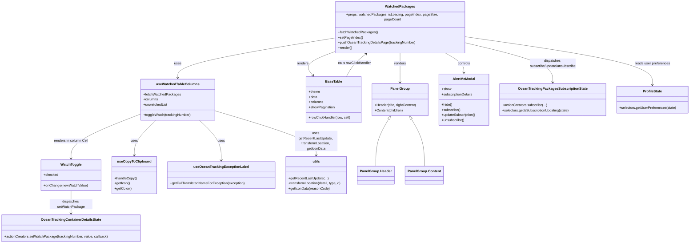

# Diagram: web/portal/src/pages/oceantracking/dashboard/components/OceanTracking.WatchedPackages.organism.js

> Auto-generated by Obscura crawlers

## Mermaid

### SVG

<svg id="container" width="3196.3671875" xmlns="http://www.w3.org/2000/svg" class="classDiagram" height="1090" viewBox="0 0 3196.3671875 1090" role="graphics-document document" aria-roledescription="class"><g><defs><marker id="container_class-aggregationStart" class="marker aggregation class" refX="18" refY="7" markerWidth="190" markerHeight="240" orient="auto"><path d="M 18,7 L9,13 L1,7 L9,1 Z"></path></marker></defs><defs><marker id="container_class-aggregationEnd" class="marker aggregation class" refX="1" refY="7" markerWidth="20" markerHeight="28" orient="auto"><path d="M 18,7 L9,13 L1,7 L9,1 Z"></path></marker></defs><defs><marker id="container_class-extensionStart" class="marker extension class" refX="18" refY="7" markerWidth="190" markerHeight="240" orient="auto"><path d="M 1,7 L18,13 V 1 Z"></path></marker></defs><defs><marker id="container_class-extensionEnd" class="marker extension class" refX="1" refY="7" markerWidth="20" markerHeight="28" orient="auto"><path d="M 1,1 V 13 L18,7 Z"></path></marker></defs><defs><marker id="container_class-compositionStart" class="marker composition class" refX="18" refY="7" markerWidth="190" markerHeight="240" orient="auto"><path d="M 18,7 L9,13 L1,7 L9,1 Z"></path></marker></defs><defs><marker id="container_class-compositionEnd" class="marker composition class" refX="1" refY="7" markerWidth="20" markerHeight="28" orient="auto"><path d="M 18,7 L9,13 L1,7 L9,1 Z"></path></marker></defs><defs><marker id="container_class-dependencyStart" class="marker dependency class" refX="6" refY="7" markerWidth="190" markerHeight="240" orient="auto"><path d="M 5,7 L9,13 L1,7 L9,1 Z"></path></marker></defs><defs><marker id="container_class-dependencyEnd" class="marker dependency class" refX="13" refY="7" markerWidth="20" markerHeight="28" orient="auto"><path d="M 18,7 L9,13 L14,7 L9,1 Z"></path></marker></defs><defs><marker id="container_class-lollipopStart" class="marker lollipop class" refX="13" refY="7" markerWidth="190" markerHeight="240" orient="auto"><circle stroke="black" fill="transparent" cx="7" cy="7" r="6"></circle></marker></defs><defs><marker id="container_class-lollipopEnd" class="marker lollipop class" refX="1" refY="7" markerWidth="190" markerHeight="240" orient="auto"><circle stroke="black" fill="transparent" cx="7" cy="7" r="6"></circle></marker></defs><g class="root"><g class="clusters"></g><g class="edgePaths"><path d="M1549.918,160.97L1427.449,179.642C1304.979,198.313,1060.04,235.657,937.571,265.495C815.102,295.333,815.102,317.667,815.102,328.833L815.102,340" id="id_WatchedPackages_useWatchedTableColumns_1" class="edge-thickness-normal edge-pattern-solid relation" style=";;;" data-edge="true" data-et="edge" data-id="id_WatchedPackages_useWatchedTableColumns_1" data-points="W3sieCI6MTU0OS45MTc5Njg3NSwieSI6MTYwLjk3MDIxMTM2MTYzNjI3fSx7IngiOjgxNS4xMDE1NjI1LCJ5IjoyNzN9LHsieCI6ODE1LjEwMTU2MjUsInkiOjM0Nn1d" marker-end="url(#container_class-dependencyEnd)"></path><path d="M1844.883,224L1844.883,232.167C1844.883,240.333,1844.883,256.667,1844.883,279.5C1844.883,302.333,1844.883,331.667,1844.883,346.333L1844.883,361" id="id_WatchedPackages_PanelGroup_2" class="edge-thickness-normal edge-pattern-solid relation" style=";;;" data-edge="true" data-et="edge" data-id="id_WatchedPackages_PanelGroup_2" data-points="W3sieCI6MTg0NC44ODI4MTI1LCJ5IjoyMjR9LHsieCI6MTg0NC44ODI4MTI1LCJ5IjoyNzN9LHsieCI6MTg0NC44ODI4MTI1LCJ5IjozNjd9XQ==" marker-end="url(#container_class-dependencyEnd)"></path><path d="M1549.918,217.846L1523.295,227.038C1496.673,236.231,1443.427,254.615,1424.768,273.211C1406.108,291.807,1422.035,310.614,1429.998,320.018L1437.961,329.421" id="id_WatchedPackages_BaseTable_3" class="edge-thickness-normal edge-pattern-solid relation" style=";;;" data-edge="true" data-et="edge" data-id="id_WatchedPackages_BaseTable_3" data-points="W3sieCI6MTU0OS45MTc5Njg3NSwieSI6MjE3Ljg0NTk2NjgzMDg5NDI3fSx7IngiOjEzOTAuMTgxNjQwNjI1LCJ5IjoyNzN9LHsieCI6MTQ0MS44Mzg2MTg3MTMwMTc3LCJ5IjozMzR9XQ==" marker-end="url(#container_class-dependencyEnd)"></path><path d="M2051.889,224L2067.542,232.167C2083.196,240.333,2114.502,256.667,2130.155,272C2145.809,287.333,2145.809,301.667,2145.809,308.833L2145.809,316" id="id_WatchedPackages_AlertMeModal_4" class="edge-thickness-normal edge-pattern-solid relation" style=";;;" data-edge="true" data-et="edge" data-id="id_WatchedPackages_AlertMeModal_4" data-points="W3sieCI6MjA1MS44ODkwODI0MDQ0NTksInkiOjIyNH0seyJ4IjoyMTQ1LjgwODU5Mzc1LCJ5IjoyNzN9LHsieCI6MjE0NS44MDg1OTM3NSwieSI6MzIyfV0=" marker-end="url(#container_class-dependencyEnd)"></path><path d="M643.527,505.665L590.826,525.221C538.124,544.777,432.72,583.888,380.018,615.111C327.316,646.333,327.316,669.667,327.316,681.333L327.316,693" id="id_useWatchedTableColumns_WatchToggle_5" class="edge-thickness-normal edge-pattern-solid relation" style=";;;" data-edge="true" data-et="edge" data-id="id_useWatchedTableColumns_WatchToggle_5" data-points="W3sieCI6NjQzLjUyNzM0Mzc1LCJ5Ijo1MDUuNjY1MTg3ODMwODM2MTV9LHsieCI6MzI3LjMxNjQwNjI1LCJ5Ijo2MjN9LHsieCI6MzI3LjMxNjQwNjI1LCJ5Ijo2OTl9XQ==" marker-end="url(#container_class-dependencyEnd)"></path><path d="M709.267,538L693.649,552.167C678.031,566.333,646.795,594.667,631.177,618C615.559,641.333,615.559,659.667,615.559,668.833L615.559,678" id="id_useWatchedTableColumns_useCopyToClipboard_6" class="edge-thickness-normal edge-pattern-solid relation" style=";;;" data-edge="true" data-et="edge" data-id="id_useWatchedTableColumns_useCopyToClipboard_6" data-points="W3sieCI6NzA5LjI2NjYxNzc0ODYxODcsInkiOjUzOH0seyJ4Ijo2MTUuNTU4NTkzNzUsInkiOjYyM30seyJ4Ijo2MTUuNTU4NTkzNzUsInkiOjY4NH1d" marker-end="url(#container_class-dependencyEnd)"></path><path d="M920.937,538L936.555,552.167C952.173,566.333,983.409,594.667,999.027,622C1014.645,649.333,1014.645,675.667,1014.645,688.833L1014.645,702" id="id_useWatchedTableColumns_useOceanTrackingExceptionLabel_7" class="edge-thickness-normal edge-pattern-solid relation" style=";;;" data-edge="true" data-et="edge" data-id="id_useWatchedTableColumns_useOceanTrackingExceptionLabel_7" data-points="W3sieCI6OTIwLjkzNjUwNzI1MTM4MTMsInkiOjUzOH0seyJ4IjoxMDE0LjY0NDUzMTI1LCJ5Ijo2MjN9LHsieCI6MTAxNC42NDQ1MzEyNSwieSI6NzA4fV0=" marker-end="url(#container_class-dependencyEnd)"></path><path d="M986.676,490.311L1065.215,512.426C1143.755,534.541,1300.835,578.77,1379.374,610.052C1457.914,641.333,1457.914,659.667,1457.914,668.833L1457.914,678" id="id_useWatchedTableColumns_utils_8" class="edge-thickness-normal edge-pattern-solid relation" style=";;;" data-edge="true" data-et="edge" data-id="id_useWatchedTableColumns_utils_8" data-points="W3sieCI6OTg2LjY3NTc4MTI1LCJ5Ijo0OTAuMzExMDI5NDExNzY0N30seyJ4IjoxNDU3LjkxNDA2MjUsInkiOjYyM30seyJ4IjoxNDU3LjkxNDA2MjUsInkiOjY4NH1d" marker-end="url(#container_class-dependencyEnd)"></path><path d="M327.316,843L327.316,853.667C327.316,864.333,327.316,885.667,327.316,903.5C327.316,921.333,327.316,935.667,327.316,942.833L327.316,950" id="id_WatchToggle_OceanTrackingContainerDetailsState_9" class="edge-thickness-normal edge-pattern-solid relation" style=";;;" data-edge="true" data-et="edge" data-id="id_WatchToggle_OceanTrackingContainerDetailsState_9" data-points="W3sieCI6MzI3LjMxNjQwNjI1LCJ5Ijo4NDN9LHsieCI6MzI3LjMxNjQwNjI1LCJ5Ijo5MDd9LHsieCI6MzI3LjMxNjQwNjI1LCJ5Ijo5NTZ9XQ==" marker-end="url(#container_class-dependencyEnd)"></path><path d="M2139.848,180.685L2210.008,196.071C2280.168,211.457,2420.488,242.228,2490.648,272.281C2560.809,302.333,2560.809,331.667,2560.809,346.333L2560.809,361" id="id_WatchedPackages_OceanTrackingPackagesSubscriptionState_10" class="edge-thickness-normal edge-pattern-solid relation" style=";;;" data-edge="true" data-et="edge" data-id="id_WatchedPackages_OceanTrackingPackagesSubscriptionState_10" data-points="W3sieCI6MjEzOS44NDc2NTYyNSwieSI6MTgwLjY4NDc1MDQwNTEyNDQ4fSx7IngiOjI1NjAuODA4NTkzNzUsInkiOjI3M30seyJ4IjoyNTYwLjgwODU5Mzc1LCJ5IjozNjd9XQ==" marker-end="url(#container_class-dependencyEnd)"></path><path d="M2139.848,155.309L2287.035,174.924C2434.221,194.539,2728.595,233.77,2875.782,270.052C3022.969,306.333,3022.969,339.667,3022.969,356.333L3022.969,373" id="id_WatchedPackages_ProfileState_11" class="edge-thickness-normal edge-pattern-solid relation" style=";;;" data-edge="true" data-et="edge" data-id="id_WatchedPackages_ProfileState_11" data-points="W3sieCI6MjEzOS44NDc2NTYyNSwieSI6MTU1LjMwOTA4NTE4MTg2OTQyfSx7IngiOjMwMjIuOTY4NzUsInkiOjI3M30seyJ4IjozMDIyLjk2ODc1LCJ5IjozNzl9XQ==" marker-end="url(#container_class-dependencyEnd)"></path><path d="M1592.754,334L1598.351,323.833C1603.948,313.667,1615.142,293.333,1631.295,275.583C1647.448,257.834,1668.56,242.667,1679.116,235.084L1689.672,227.501" id="id_BaseTable_WatchedPackages_12" class="edge-thickness-normal edge-pattern-solid relation" style=";;;" data-edge="true" data-et="edge" data-id="id_BaseTable_WatchedPackages_12" data-points="W3sieCI6MTU5Mi43NTM3OTA2ODA0NzM1LCJ5IjozMzR9LHsieCI6MTYyNi4zMzU5Mzc1LCJ5IjoyNzN9LHsieCI6MTY5NC41NDQ4MzQ3OTI5OTM3LCJ5IjoyMjR9XQ==" marker-end="url(#container_class-dependencyEnd)"></path><path d="M1790.95,531.787L1781.818,546.989C1772.686,562.192,1754.423,592.596,1745.292,625.465C1736.16,658.333,1736.16,693.667,1736.16,711.333L1736.16,729" id="id_PanelGroup_PanelGroup.Header_13" class="edge-thickness-normal edge-pattern-solid relation" style=";;;" data-edge="true" data-et="edge" data-id="id_PanelGroup_PanelGroup.Header_13" data-points="W3sieCI6MTc5OS44MzE5ODgwODcwMTY1LCJ5Ijo1MTd9LHsieCI6MTczNi4xNjAxNTYyNSwieSI6NjIzfSx7IngiOjE3MzYuMTYwMTU2MjUsInkiOjcyOX1d" marker-start="url(#container_class-extensionStart)"></path><path d="M1898.816,531.787L1907.948,546.989C1917.079,562.192,1935.342,592.596,1944.474,625.465C1953.605,658.333,1953.605,693.667,1953.605,711.333L1953.605,729" id="id_PanelGroup_PanelGroup.Content_14" class="edge-thickness-normal edge-pattern-solid relation" style=";;;" data-edge="true" data-et="edge" data-id="id_PanelGroup_PanelGroup.Content_14" data-points="W3sieCI6MTg4OS45MzM2MzY5MTI5ODM1LCJ5Ijo1MTd9LHsieCI6MTk1My42MDU0Njg3NSwieSI6NjIzfSx7IngiOjE5NTMuNjA1NDY4NzUsInkiOjcyOX1d" marker-start="url(#container_class-extensionStart)"></path></g><g class="edgeLabels"><g class="edgeLabel" transform="translate(815.1015625, 273)"><g class="label" data-id="id_WatchedPackages_useWatchedTableColumns_1" transform="translate(-16.4921875, -12)"><foreignObject width="32.984375" height="24">

uses

</foreignObject></g></g><g class="edgeLabel" transform="translate(1844.8828125, 273)"><g class="label" data-id="id_WatchedPackages_PanelGroup_2" transform="translate(-27.75, -12)"><foreignObject width="55.5" height="24">

renders

</foreignObject></g></g><g class="edgeLabel" transform="translate(1390.181640625, 273)"><g class="label" data-id="id_WatchedPackages_BaseTable_3" transform="translate(-27.75, -12)"><foreignObject width="55.5" height="24">

renders

</foreignObject></g></g><g class="edgeLabel" transform="translate(2145.80859375, 273)"><g class="label" data-id="id_WatchedPackages_AlertMeModal_4" transform="translate(-29.515625, -12)"><foreignObject width="59.03125" height="24">

controls

</foreignObject></g></g><g class="edgeLabel" transform="translate(327.31640625, 623)"><g class="label" data-id="id_useWatchedTableColumns_WatchToggle_5" transform="translate(-81.296875, -12)"><foreignObject width="162.59375" height="24">

renders in column Cell

</foreignObject></g></g><g class="edgeLabel" transform="translate(615.55859375, 623)"><g class="label" data-id="id_useWatchedTableColumns_useCopyToClipboard_6" transform="translate(-16.4921875, -12)"><foreignObject width="32.984375" height="24">

uses

</foreignObject></g></g><g class="edgeLabel" transform="translate(1014.64453125, 623)"><g class="label" data-id="id_useWatchedTableColumns_useOceanTrackingExceptionLabel_7" transform="translate(-16.4921875, -12)"><foreignObject width="32.984375" height="24">

uses

</foreignObject></g></g><g class="edgeLabel" transform="translate(1457.9140625, 623)"><g class="label" data-id="id_useWatchedTableColumns_utils_8" transform="translate(-100, -36)"><foreignObject width="200" height="72">

uses getRecentLastUpdate, transformLocation, getIconData

</foreignObject></g></g><g class="edgeLabel" transform="translate(327.31640625, 907)"><g class="label" data-id="id_WatchToggle_OceanTrackingContainerDetailsState_9" transform="translate(-100, -24)"><foreignObject width="200" height="48">

dispatches setWatchPackage

</foreignObject></g></g><g class="edgeLabel" transform="translate(2560.80859375, 273)"><g class="label" data-id="id_WatchedPackages_OceanTrackingPackagesSubscriptionState_10" transform="translate(-113.1796875, -24)"><foreignObject width="226.359375" height="48">

dispatches subscribe/update/unsubscribe

</foreignObject></g></g><g class="edgeLabel" transform="translate(3022.96875, 273)"><g class="label" data-id="id_WatchedPackages_ProfileState_11" transform="translate(-82.65625, -12)"><foreignObject width="165.3125" height="24">

reads user preferences

</foreignObject></g></g><g class="edgeLabel" transform="translate(1632.1639, 268.8133)"><g class="label" data-id="id_BaseTable_WatchedPackages_12" transform="translate(-77.7578125, -12)"><foreignObject width="155.515625" height="24">

calls rowClickHandler

</foreignObject></g></g><g class="edgeLabel"><g class="label" data-id="id_PanelGroup_PanelGroup.Header_13" transform="translate(0, 0)"><foreignObject width="0" height="0">

</foreignObject></g></g><g class="edgeLabel"><g class="label" data-id="id_PanelGroup_PanelGroup.Content_14" transform="translate(0, 0)"><foreignObject width="0" height="0">

</foreignObject></g></g></g><g class="nodes"><g class="node default" id="classId-WatchedPackages-0" transform="translate(1844.8828125, 116)"><g class="basic label-container"><path d="M-294.96484375 -108 L294.96484375 -108 L294.96484375 108 L-294.96484375 108" stroke="none" stroke-width="0" fill="#ECECFF" style=""></path><path d="M-294.96484375 -108 C-170.55365252755894 -108, -46.142461305117905 -108, 294.96484375 -108 M-294.96484375 -108 C-94.670161687058 -108, 105.624520375884 -108, 294.96484375 -108 M294.96484375 -108 C294.96484375 -43.27502517432319, 294.96484375 21.44994965135362, 294.96484375 108 M294.96484375 -108 C294.96484375 -32.3630671103743, 294.96484375 43.273865779251395, 294.96484375 108 M294.96484375 108 C148.11313486408847 108, 1.2614259781769306 108, -294.96484375 108 M294.96484375 108 C166.6194272020089 108, 38.274010654017786 108, -294.96484375 108 M-294.96484375 108 C-294.96484375 42.35917793492143, -294.96484375 -23.281644130157133, -294.96484375 -108 M-294.96484375 108 C-294.96484375 43.85524116527695, -294.96484375 -20.2895176694461, -294.96484375 -108" stroke="#9370DB" stroke-width="1.3" fill="none" stroke-dasharray="0 0" style=""></path></g><g class="annotation-group text" transform="translate(0, -84)"></g><g class="label-group text" transform="translate(-65.2421875, -84)"><g class="label" style="font-weight: bolder" transform="translate(0,-12)"><foreignObject width="130.484375" height="24">

WatchedPackages

</foreignObject></g></g><g class="members-group text" transform="translate(-282.96484375, -36)"><g class="label" style="" transform="translate(0,-12)"><foreignObject width="500.6875" height="24">

+props: watchedPackages, isLoading, pageIndex, pageSize, pageCount

</foreignObject></g></g><g class="methods-group text" transform="translate(-282.96484375, 12)"><g class="label" style="" transform="translate(0,-12)"><foreignObject width="182.40625" height="24">

+fetchWatchedPackages()

</foreignObject></g><g class="label" style="" transform="translate(0,12)"><foreignObject width="114.078125" height="24">

+setPageIndex()

</foreignObject></g><g class="label" style="" transform="translate(0,36)"><foreignObject width="359.53125" height="24">

+pushOceanTrackingDetailsPage(trackingNumber)

</foreignObject></g><g class="label" style="" transform="translate(0,60)"><foreignObject width="66.609375" height="24">

+render()

</foreignObject></g></g><g class="divider" style=""><path d="M-294.96484375 -60 C-112.22805190091364 -60, 70.50873994817272 -60, 294.96484375 -60 M-294.96484375 -60 C-65.64538435693049 -60, 163.67407503613902 -60, 294.96484375 -60" stroke="#9370DB" stroke-width="1.3" fill="none" stroke-dasharray="0 0" style=""></path></g><g class="divider" style=""><path d="M-294.96484375 -12 C-110.64767880505798 -12, 73.66948613988404 -12, 294.96484375 -12 M-294.96484375 -12 C-153.64177093718087 -12, -12.318698124361731 -12, 294.96484375 -12" stroke="#9370DB" stroke-width="1.3" fill="none" stroke-dasharray="0 0" style=""></path></g></g><g class="node default" id="classId-useWatchedTableColumns-1" transform="translate(815.1015625, 442)"><g class="basic label-container"><path d="M-171.57421875 -96 L171.57421875 -96 L171.57421875 96 L-171.57421875 96" stroke="none" stroke-width="0" fill="#ECECFF" style=""></path><path d="M-171.57421875 -96 C-80.53849256718556 -96, 10.497233615628886 -96, 171.57421875 -96 M-171.57421875 -96 C-91.00561170032074 -96, -10.437004650641484 -96, 171.57421875 -96 M171.57421875 -96 C171.57421875 -19.552529315594015, 171.57421875 56.89494136881197, 171.57421875 96 M171.57421875 -96 C171.57421875 -44.740275010870945, 171.57421875 6.519449978258109, 171.57421875 96 M171.57421875 96 C87.88676377817625 96, 4.199308806352491 96, -171.57421875 96 M171.57421875 96 C82.61284735626094 96, -6.348524037478114 96, -171.57421875 96 M-171.57421875 96 C-171.57421875 46.86903259873075, -171.57421875 -2.261934802538505, -171.57421875 -96 M-171.57421875 96 C-171.57421875 51.85134045024172, -171.57421875 7.702680900483443, -171.57421875 -96" stroke="#9370DB" stroke-width="1.3" fill="none" stroke-dasharray="0 0" style=""></path></g><g class="annotation-group text" transform="translate(0, -72)"></g><g class="label-group text" transform="translate(-95.5234375, -72)"><g class="label" style="font-weight: bolder" transform="translate(0,-12)"><foreignObject width="191.046875" height="24">

useWatchedTableColumns

</foreignObject></g></g><g class="members-group text" transform="translate(-159.57421875, -24)"><g class="label" style="" transform="translate(0,-12)"><foreignObject width="172.046875" height="24">

+fetchWatchedPackages

</foreignObject></g><g class="label" style="" transform="translate(0,12)"><foreignObject width="69.21875" height="24">

+columns

</foreignObject></g><g class="label" style="" transform="translate(0,36)"><foreignObject width="113.234375" height="24">

+unwatchedList

</foreignObject></g></g><g class="methods-group text" transform="translate(-159.57421875, 72)"><g class="label" style="" transform="translate(0,-12)"><foreignObject width="223.625" height="24">

+toggleWatch(trackingNumber)

</foreignObject></g></g><g class="divider" style=""><path d="M-171.57421875 -48 C-53.34022675741599 -48, 64.89376523516802 -48, 171.57421875 -48 M-171.57421875 -48 C-93.02244136392541 -48, -14.470663977850819 -48, 171.57421875 -48" stroke="#9370DB" stroke-width="1.3" fill="none" stroke-dasharray="0 0" style=""></path></g><g class="divider" style=""><path d="M-171.57421875 48 C-48.3037840096313 48, 74.9666507307374 48, 171.57421875 48 M-171.57421875 48 C-42.03825816022791 48, 87.49770242954418 48, 171.57421875 48" stroke="#9370DB" stroke-width="1.3" fill="none" stroke-dasharray="0 0" style=""></path></g></g><g class="node default" id="classId-BaseTable-2" transform="translate(1533.296875, 442)"><g class="basic label-container"><path d="M-128.8984375 -108 L128.8984375 -108 L128.8984375 108 L-128.8984375 108" stroke="none" stroke-width="0" fill="#ECECFF" style=""></path><path d="M-128.8984375 -108 C-40.02313908782675 -108, 48.8521593243465 -108, 128.8984375 -108 M-128.8984375 -108 C-43.44182734372886 -108, 42.01478281254228 -108, 128.8984375 -108 M128.8984375 -108 C128.8984375 -53.20459059569334, 128.8984375 1.5908188086133208, 128.8984375 108 M128.8984375 -108 C128.8984375 -30.871332208286134, 128.8984375 46.25733558342773, 128.8984375 108 M128.8984375 108 C39.40764576624453 108, -50.083145967510944 108, -128.8984375 108 M128.8984375 108 C47.0853670651927 108, -34.7277033696146 108, -128.8984375 108 M-128.8984375 108 C-128.8984375 30.55207926300747, -128.8984375 -46.89584147398506, -128.8984375 -108 M-128.8984375 108 C-128.8984375 42.54124999626188, -128.8984375 -22.917500007476235, -128.8984375 -108" stroke="#9370DB" stroke-width="1.3" fill="none" stroke-dasharray="0 0" style=""></path></g><g class="annotation-group text" transform="translate(0, -84)"></g><g class="label-group text" transform="translate(-37.359375, -84)"><g class="label" style="font-weight: bolder" transform="translate(0,-12)"><foreignObject width="74.71875" height="24">

BaseTable

</foreignObject></g></g><g class="members-group text" transform="translate(-116.8984375, -36)"><g class="label" style="" transform="translate(0,-12)"><foreignObject width="54.21875" height="24">

+theme

</foreignObject></g><g class="label" style="" transform="translate(0,12)"><foreignObject width="40.625" height="24">

+data

</foreignObject></g><g class="label" style="" transform="translate(0,36)"><foreignObject width="69.21875" height="24">

+columns

</foreignObject></g><g class="label" style="" transform="translate(0,60)"><foreignObject width="122.53125" height="24">

+showPagination

</foreignObject></g></g><g class="methods-group text" transform="translate(-116.8984375, 84)"><g class="label" style="" transform="translate(0,-12)"><foreignObject width="196.4375" height="24">

+rowClickHandler(row, cell)

</foreignObject></g></g><g class="divider" style=""><path d="M-128.8984375 -60 C-71.273349773138 -60, -13.648262046275988 -60, 128.8984375 -60 M-128.8984375 -60 C-60.082908790285 -60, 8.732619919429993 -60, 128.8984375 -60" stroke="#9370DB" stroke-width="1.3" fill="none" stroke-dasharray="0 0" style=""></path></g><g class="divider" style=""><path d="M-128.8984375 60 C-54.50063081502367 60, 19.89717586995266 60, 128.8984375 60 M-128.8984375 60 C-37.05119446108661 60, 54.79604857782678 60, 128.8984375 60" stroke="#9370DB" stroke-width="1.3" fill="none" stroke-dasharray="0 0" style=""></path></g></g><g class="node default" id="classId-PanelGroup-3" transform="translate(1844.8828125, 442)"><g class="basic label-container"><path d="M-132.6875 -75 L132.6875 -75 L132.6875 75 L-132.6875 75" stroke="none" stroke-width="0" fill="#ECECFF" style=""></path><path d="M-132.6875 -75 C-74.27201792531679 -75, -15.856535850633591 -75, 132.6875 -75 M-132.6875 -75 C-49.497580394677726 -75, 33.69233921064455 -75, 132.6875 -75 M132.6875 -75 C132.6875 -29.360374752726578, 132.6875 16.279250494546844, 132.6875 75 M132.6875 -75 C132.6875 -19.1533741179015, 132.6875 36.693251764197, 132.6875 75 M132.6875 75 C27.06996494846412 75, -78.54757010307176 75, -132.6875 75 M132.6875 75 C62.55254088834296 75, -7.582418223314079 75, -132.6875 75 M-132.6875 75 C-132.6875 31.010744384158563, -132.6875 -12.978511231682873, -132.6875 -75 M-132.6875 75 C-132.6875 35.28517258936221, -132.6875 -4.429654821275577, -132.6875 -75" stroke="#9370DB" stroke-width="1.3" fill="none" stroke-dasharray="0 0" style=""></path></g><g class="annotation-group text" transform="translate(0, -51)"></g><g class="label-group text" transform="translate(-42.328125, -51)"><g class="label" style="font-weight: bolder" transform="translate(0,-12)"><foreignObject width="84.65625" height="24">

PanelGroup

</foreignObject></g></g><g class="members-group text" transform="translate(-120.6875, -3)"></g><g class="methods-group text" transform="translate(-120.6875, 27)"><g class="label" style="" transform="translate(0,-12)"><foreignObject width="199.046875" height="24">

+Header(title, rightContent)

</foreignObject></g><g class="label" style="" transform="translate(0,12)"><foreignObject width="134.625" height="24">

+Content(children)

</foreignObject></g></g><g class="divider" style=""><path d="M-132.6875 -27 C-67.83452563361521 -27, -2.9815512672304294 -27, 132.6875 -27 M-132.6875 -27 C-37.23042232579809 -27, 58.226655348403824 -27, 132.6875 -27" stroke="#9370DB" stroke-width="1.3" fill="none" stroke-dasharray="0 0" style=""></path></g><g class="divider" style=""><path d="M-132.6875 -3 C-48.57307889213175 -3, 35.541342215736506 -3, 132.6875 -3 M-132.6875 -3 C-69.25330129678062 -3, -5.819102593561226 -3, 132.6875 -3" stroke="#9370DB" stroke-width="1.3" fill="none" stroke-dasharray="0 0" style=""></path></g></g><g class="node default" id="classId-WatchToggle-4" transform="translate(327.31640625, 771)"><g class="basic label-container"><path d="M-136.8203125 -72 L136.8203125 -72 L136.8203125 72 L-136.8203125 72" stroke="none" stroke-width="0" fill="#ECECFF" style=""></path><path d="M-136.8203125 -72 C-48.05395255771762 -72, 40.712407384564756 -72, 136.8203125 -72 M-136.8203125 -72 C-75.19276311882318 -72, -13.56521373764636 -72, 136.8203125 -72 M136.8203125 -72 C136.8203125 -31.2936041856347, 136.8203125 9.412791628730602, 136.8203125 72 M136.8203125 -72 C136.8203125 -15.992205907345081, 136.8203125 40.01558818530984, 136.8203125 72 M136.8203125 72 C35.10766700738546 72, -66.60497848522908 72, -136.8203125 72 M136.8203125 72 C30.50578462414444 72, -75.80874325171112 72, -136.8203125 72 M-136.8203125 72 C-136.8203125 42.123583909271325, -136.8203125 12.24716781854265, -136.8203125 -72 M-136.8203125 72 C-136.8203125 31.109895906015225, -136.8203125 -9.78020818796955, -136.8203125 -72" stroke="#9370DB" stroke-width="1.3" fill="none" stroke-dasharray="0 0" style=""></path></g><g class="annotation-group text" transform="translate(0, -48)"></g><g class="label-group text" transform="translate(-46.4375, -48)"><g class="label" style="font-weight: bolder" transform="translate(0,-12)"><foreignObject width="92.875" height="24">

WatchToggle

</foreignObject></g></g><g class="members-group text" transform="translate(-124.8203125, 0)"><g class="label" style="" transform="translate(0,-12)"><foreignObject width="67.71875" height="24">

+checked

</foreignObject></g></g><g class="methods-group text" transform="translate(-124.8203125, 48)"><g class="label" style="" transform="translate(0,-12)"><foreignObject width="203.203125" height="24">

+onChange(newWatchValue)

</foreignObject></g></g><g class="divider" style=""><path d="M-136.8203125 -24 C-75.21583863155905 -24, -13.611364763118104 -24, 136.8203125 -24 M-136.8203125 -24 C-32.877630490318694 -24, 71.06505151936261 -24, 136.8203125 -24" stroke="#9370DB" stroke-width="1.3" fill="none" stroke-dasharray="0 0" style=""></path></g><g class="divider" style=""><path d="M-136.8203125 24 C-55.930259286779034 24, 24.959793926441932 24, 136.8203125 24 M-136.8203125 24 C-71.0494072750134 24, -5.278502050026788 24, 136.8203125 24" stroke="#9370DB" stroke-width="1.3" fill="none" stroke-dasharray="0 0" style=""></path></g></g><g class="node default" id="classId-AlertMeModal-5" transform="translate(2145.80859375, 442)"><g class="basic label-container"><path d="M-118.23828125 -120 L118.23828125 -120 L118.23828125 120 L-118.23828125 120" stroke="none" stroke-width="0" fill="#ECECFF" style=""></path><path d="M-118.23828125 -120 C-49.75668440227095 -120, 18.724912445458102 -120, 118.23828125 -120 M-118.23828125 -120 C-37.09915742691179 -120, 44.039966396176425 -120, 118.23828125 -120 M118.23828125 -120 C118.23828125 -52.32714006433034, 118.23828125 15.345719871339327, 118.23828125 120 M118.23828125 -120 C118.23828125 -64.23356916533156, 118.23828125 -8.467138330663118, 118.23828125 120 M118.23828125 120 C47.41378083622779 120, -23.410719577544427 120, -118.23828125 120 M118.23828125 120 C30.58183777009721 120, -57.07460570980558 120, -118.23828125 120 M-118.23828125 120 C-118.23828125 39.10088509545939, -118.23828125 -41.79822980908122, -118.23828125 -120 M-118.23828125 120 C-118.23828125 51.77548178915383, -118.23828125 -16.44903642169234, -118.23828125 -120" stroke="#9370DB" stroke-width="1.3" fill="none" stroke-dasharray="0 0" style=""></path></g><g class="annotation-group text" transform="translate(0, -96)"></g><g class="label-group text" transform="translate(-50.9140625, -96)"><g class="label" style="font-weight: bolder" transform="translate(0,-12)"><foreignObject width="101.828125" height="24">

AlertMeModal

</foreignObject></g></g><g class="members-group text" transform="translate(-106.23828125, -48)"><g class="label" style="" transform="translate(0,-12)"><foreignObject width="45.65625" height="24">

+show

</foreignObject></g><g class="label" style="" transform="translate(0,12)"><foreignObject width="148.671875" height="24">

+subscriptionDetails

</foreignObject></g></g><g class="methods-group text" transform="translate(-106.23828125, 24)"><g class="label" style="" transform="translate(0,-12)"><foreignObject width="50.53125" height="24">

+hide()

</foreignObject></g><g class="label" style="" transform="translate(0,12)"><foreignObject width="88.6875" height="24">

+subscribe()

</foreignObject></g><g class="label" style="" transform="translate(0,36)"><foreignObject width="161.5625" height="24">

+updateSubscription()

</foreignObject></g><g class="label" style="" transform="translate(0,60)"><foreignObject width="107.375" height="24">

+unsubscribe()

</foreignObject></g></g><g class="divider" style=""><path d="M-118.23828125 -72 C-62.24340786612381 -72, -6.248534482247621 -72, 118.23828125 -72 M-118.23828125 -72 C-27.980306854804724 -72, 62.27766754039055 -72, 118.23828125 -72" stroke="#9370DB" stroke-width="1.3" fill="none" stroke-dasharray="0 0" style=""></path></g><g class="divider" style=""><path d="M-118.23828125 0 C-26.35032719775215 0, 65.5376268544957 0, 118.23828125 0 M-118.23828125 0 C-49.387846053410954 0, 19.462589143178093 0, 118.23828125 0" stroke="#9370DB" stroke-width="1.3" fill="none" stroke-dasharray="0 0" style=""></path></g></g><g class="node default" id="classId-OceanTrackingContainerDetailsState-6" transform="translate(327.31640625, 1019)"><g class="basic label-container"><path d="M-319.31640625 -63 L319.31640625 -63 L319.31640625 63 L-319.31640625 63" stroke="none" stroke-width="0" fill="#ECECFF" style=""></path><path d="M-319.31640625 -63 C-139.9884979759448 -63, 39.33941029811041 -63, 319.31640625 -63 M-319.31640625 -63 C-183.05075383828148 -63, -46.78510142656296 -63, 319.31640625 -63 M319.31640625 -63 C319.31640625 -25.08657714928576, 319.31640625 12.826845701428482, 319.31640625 63 M319.31640625 -63 C319.31640625 -32.40294150707383, 319.31640625 -1.8058830141476534, 319.31640625 63 M319.31640625 63 C130.9190659267783 63, -57.478274396443396 63, -319.31640625 63 M319.31640625 63 C131.2555346080126 63, -56.80533703397481 63, -319.31640625 63 M-319.31640625 63 C-319.31640625 22.954864085868927, -319.31640625 -17.090271828262146, -319.31640625 -63 M-319.31640625 63 C-319.31640625 13.7518318819263, -319.31640625 -35.4963362361474, -319.31640625 -63" stroke="#9370DB" stroke-width="1.3" fill="none" stroke-dasharray="0 0" style=""></path></g><g class="annotation-group text" transform="translate(0, -39)"></g><g class="label-group text" transform="translate(-133.8671875, -39)"><g class="label" style="font-weight: bolder" transform="translate(0,-12)"><foreignObject width="267.734375" height="24">

OceanTrackingContainerDetailsState

</foreignObject></g></g><g class="members-group text" transform="translate(-307.31640625, 9)"></g><g class="methods-group text" transform="translate(-307.31640625, 39)"><g class="label" style="" transform="translate(0,-12)"><foreignObject width="480.765625" height="24">

+actionCreators.setWatchPackage(trackingNumber, value, callback)

</foreignObject></g></g><g class="divider" style=""><path d="M-319.31640625 -15 C-133.97976129879376 -15, 51.35688365241248 -15, 319.31640625 -15 M-319.31640625 -15 C-165.92810388711914 -15, -12.539801524238271 -15, 319.31640625 -15" stroke="#9370DB" stroke-width="1.3" fill="none" stroke-dasharray="0 0" style=""></path></g><g class="divider" style=""><path d="M-319.31640625 9 C-184.3559425018263 9, -49.39547875365258 9, 319.31640625 9 M-319.31640625 9 C-154.7520283159753 9, 9.812349618049382 9, 319.31640625 9" stroke="#9370DB" stroke-width="1.3" fill="none" stroke-dasharray="0 0" style=""></path></g></g><g class="node default" id="classId-OceanTrackingPackagesSubscriptionState-7" transform="translate(2560.80859375, 442)"><g class="basic label-container"><path d="M-246.76171875 -75 L246.76171875 -75 L246.76171875 75 L-246.76171875 75" stroke="none" stroke-width="0" fill="#ECECFF" style=""></path><path d="M-246.76171875 -75 C-128.43712895287382 -75, -10.112539155747669 -75, 246.76171875 -75 M-246.76171875 -75 C-120.1140596930739 -75, 6.533599363852204 -75, 246.76171875 -75 M246.76171875 -75 C246.76171875 -27.811781465490768, 246.76171875 19.376437069018465, 246.76171875 75 M246.76171875 -75 C246.76171875 -39.57403798870568, 246.76171875 -4.1480759774113665, 246.76171875 75 M246.76171875 75 C49.41649621967056 75, -147.92872631065887 75, -246.76171875 75 M246.76171875 75 C141.50198568512684 75, 36.24225262025368 75, -246.76171875 75 M-246.76171875 75 C-246.76171875 26.4528902160542, -246.76171875 -22.0942195678916, -246.76171875 -75 M-246.76171875 75 C-246.76171875 23.8446643999551, -246.76171875 -27.3106712000898, -246.76171875 -75" stroke="#9370DB" stroke-width="1.3" fill="none" stroke-dasharray="0 0" style=""></path></g><g class="annotation-group text" transform="translate(0, -51)"></g><g class="label-group text" transform="translate(-152.9765625, -51)"><g class="label" style="font-weight: bolder" transform="translate(0,-12)"><foreignObject width="305.953125" height="24">

OceanTrackingPackagesSubscriptionState

</foreignObject></g></g><g class="members-group text" transform="translate(-234.76171875, -3)"></g><g class="methods-group text" transform="translate(-234.76171875, 27)"><g class="label" style="" transform="translate(0,-12)"><foreignObject width="209.1875" height="24">

+actionCreators.subscribe(...)

</foreignObject></g><g class="label" style="" transform="translate(0,12)"><foreignObject width="316.546875" height="24">

+selectors.getIsSubscriptionUpdating(state)

</foreignObject></g></g><g class="divider" style=""><path d="M-246.76171875 -27 C-100.6323791608664 -27, 45.49696042826719 -27, 246.76171875 -27 M-246.76171875 -27 C-107.90361986100524 -27, 30.95447902798952 -27, 246.76171875 -27" stroke="#9370DB" stroke-width="1.3" fill="none" stroke-dasharray="0 0" style=""></path></g><g class="divider" style=""><path d="M-246.76171875 -3 C-123.68262942242981 -3, -0.6035400948596248 -3, 246.76171875 -3 M-246.76171875 -3 C-113.01212877332526 -3, 20.737461203349483 -3, 246.76171875 -3" stroke="#9370DB" stroke-width="1.3" fill="none" stroke-dasharray="0 0" style=""></path></g></g><g class="node default" id="classId-ProfileState-8" transform="translate(3022.96875, 442)"><g class="basic label-container"><path d="M-165.3984375 -63 L165.3984375 -63 L165.3984375 63 L-165.3984375 63" stroke="none" stroke-width="0" fill="#ECECFF" style=""></path><path d="M-165.3984375 -63 C-97.23118763411979 -63, -29.063937768239583 -63, 165.3984375 -63 M-165.3984375 -63 C-69.23343289369822 -63, 26.931571712603557 -63, 165.3984375 -63 M165.3984375 -63 C165.3984375 -12.972592868800902, 165.3984375 37.054814262398196, 165.3984375 63 M165.3984375 -63 C165.3984375 -35.769201497679575, 165.3984375 -8.538402995359142, 165.3984375 63 M165.3984375 63 C59.53727929481583 63, -46.323878910368336 63, -165.3984375 63 M165.3984375 63 C79.03281847949121 63, -7.332800541017576 63, -165.3984375 63 M-165.3984375 63 C-165.3984375 25.02013302062226, -165.3984375 -12.959733958755479, -165.3984375 -63 M-165.3984375 63 C-165.3984375 16.310633249893634, -165.3984375 -30.378733500212732, -165.3984375 -63" stroke="#9370DB" stroke-width="1.3" fill="none" stroke-dasharray="0 0" style=""></path></g><g class="annotation-group text" transform="translate(0, -39)"></g><g class="label-group text" transform="translate(-43.140625, -39)"><g class="label" style="font-weight: bolder" transform="translate(0,-12)"><foreignObject width="86.28125" height="24">

ProfileState

</foreignObject></g></g><g class="members-group text" transform="translate(-153.3984375, 9)"></g><g class="methods-group text" transform="translate(-153.3984375, 39)"><g class="label" style="" transform="translate(0,-12)"><foreignObject width="263.65625" height="24">

+selectors.getUserPreferences(state)

</foreignObject></g></g><g class="divider" style=""><path d="M-165.3984375 -15 C-71.9168520565499 -15, 21.5647333869002 -15, 165.3984375 -15 M-165.3984375 -15 C-39.39893597820743 -15, 86.60056554358513 -15, 165.3984375 -15" stroke="#9370DB" stroke-width="1.3" fill="none" stroke-dasharray="0 0" style=""></path></g><g class="divider" style=""><path d="M-165.3984375 9 C-85.57155266705362 9, -5.744667834107247 9, 165.3984375 9 M-165.3984375 9 C-85.39903058823776 9, -5.399623676475528 9, 165.3984375 9" stroke="#9370DB" stroke-width="1.3" fill="none" stroke-dasharray="0 0" style=""></path></g></g><g class="node default" id="classId-useCopyToClipboard-9" transform="translate(615.55859375, 771)"><g class="basic label-container"><path d="M-101.421875 -87 L101.421875 -87 L101.421875 87 L-101.421875 87" stroke="none" stroke-width="0" fill="#ECECFF" style=""></path><path d="M-101.421875 -87 C-35.5898473918015 -87, 30.242180216397003 -87, 101.421875 -87 M-101.421875 -87 C-24.365903412094852 -87, 52.690068175810296 -87, 101.421875 -87 M101.421875 -87 C101.421875 -34.505840353957645, 101.421875 17.98831929208471, 101.421875 87 M101.421875 -87 C101.421875 -40.88976101787519, 101.421875 5.220477964249625, 101.421875 87 M101.421875 87 C34.20428243912846 87, -33.013310121743075 87, -101.421875 87 M101.421875 87 C33.101329351312344 87, -35.21921629737531 87, -101.421875 87 M-101.421875 87 C-101.421875 19.028533954932, -101.421875 -48.942932090136, -101.421875 -87 M-101.421875 87 C-101.421875 31.81887261366135, -101.421875 -23.362254772677304, -101.421875 -87" stroke="#9370DB" stroke-width="1.3" fill="none" stroke-dasharray="0 0" style=""></path></g><g class="annotation-group text" transform="translate(0, -63)"></g><g class="label-group text" transform="translate(-74.828125, -63)"><g class="label" style="font-weight: bolder" transform="translate(0,-12)"><foreignObject width="149.65625" height="24">

useCopyToClipboard

</foreignObject></g></g><g class="members-group text" transform="translate(-89.421875, -15)"></g><g class="methods-group text" transform="translate(-89.421875, 15)"><g class="label" style="" transform="translate(0,-12)"><foreignObject width="104.015625" height="24">

+handleCopy()

</foreignObject></g><g class="label" style="" transform="translate(0,12)"><foreignObject width="71.6875" height="24">

+getIcon()

</foreignObject></g><g class="label" style="" transform="translate(0,36)"><foreignObject width="79.03125" height="24">

+getColor()

</foreignObject></g></g><g class="divider" style=""><path d="M-101.421875 -39 C-26.80529700622928 -39, 47.81128098754144 -39, 101.421875 -39 M-101.421875 -39 C-25.233513025017515 -39, 50.95484894996497 -39, 101.421875 -39" stroke="#9370DB" stroke-width="1.3" fill="none" stroke-dasharray="0 0" style=""></path></g><g class="divider" style=""><path d="M-101.421875 -15 C-27.481154694259757 -15, 46.459565611480485 -15, 101.421875 -15 M-101.421875 -15 C-33.23667457184365 -15, 34.9485258563127 -15, 101.421875 -15" stroke="#9370DB" stroke-width="1.3" fill="none" stroke-dasharray="0 0" style=""></path></g></g><g class="node default" id="classId-useOceanTrackingExceptionLabel-10" transform="translate(1014.64453125, 771)"><g class="basic label-container"><path d="M-247.6640625 -63 L247.6640625 -63 L247.6640625 63 L-247.6640625 63" stroke="none" stroke-width="0" fill="#ECECFF" style=""></path><path d="M-247.6640625 -63 C-85.92740754891236 -63, 75.80924740217529 -63, 247.6640625 -63 M-247.6640625 -63 C-105.93514744664697 -63, 35.79376760670607 -63, 247.6640625 -63 M247.6640625 -63 C247.6640625 -15.673180078111407, 247.6640625 31.653639843777185, 247.6640625 63 M247.6640625 -63 C247.6640625 -29.044320876615934, 247.6640625 4.911358246768131, 247.6640625 63 M247.6640625 63 C97.87281529813086 63, -51.91843190373828 63, -247.6640625 63 M247.6640625 63 C75.46332829879276 63, -96.73740590241448 63, -247.6640625 63 M-247.6640625 63 C-247.6640625 28.764899145514462, -247.6640625 -5.470201708971075, -247.6640625 -63 M-247.6640625 63 C-247.6640625 22.063476952928326, -247.6640625 -18.873046094143348, -247.6640625 -63" stroke="#9370DB" stroke-width="1.3" fill="none" stroke-dasharray="0 0" style=""></path></g><g class="annotation-group text" transform="translate(0, -39)"></g><g class="label-group text" transform="translate(-121.984375, -39)"><g class="label" style="font-weight: bolder" transform="translate(0,-12)"><foreignObject width="243.96875" height="24">

useOceanTrackingExceptionLabel

</foreignObject></g></g><g class="members-group text" transform="translate(-235.6640625, 9)"></g><g class="methods-group text" transform="translate(-235.6640625, 39)"><g class="label" style="" transform="translate(0,-12)"><foreignObject width="349.34375" height="24">

+getFullTranslatedNameForException(exception)

</foreignObject></g></g><g class="divider" style=""><path d="M-247.6640625 -15 C-147.97902676579207 -15, -48.29399103158411 -15, 247.6640625 -15 M-247.6640625 -15 C-120.43960057771437 -15, 6.7848613445712544 -15, 247.6640625 -15" stroke="#9370DB" stroke-width="1.3" fill="none" stroke-dasharray="0 0" style=""></path></g><g class="divider" style=""><path d="M-247.6640625 9 C-134.8348578270035 9, -22.005653154007007 9, 247.6640625 9 M-247.6640625 9 C-106.36025714273595 9, 34.94354821452811 9, 247.6640625 9" stroke="#9370DB" stroke-width="1.3" fill="none" stroke-dasharray="0 0" style=""></path></g></g><g class="node default" id="classId-utils-11" transform="translate(1457.9140625, 771)"><g class="basic label-container"><path d="M-145.60546875 -87 L145.60546875 -87 L145.60546875 87 L-145.60546875 87" stroke="none" stroke-width="0" fill="#ECECFF" style=""></path><path d="M-145.60546875 -87 C-47.40196234281916 -87, 50.80154406436168 -87, 145.60546875 -87 M-145.60546875 -87 C-69.32230526490368 -87, 6.960858220192648 -87, 145.60546875 -87 M145.60546875 -87 C145.60546875 -35.94566608159718, 145.60546875 15.108667836805637, 145.60546875 87 M145.60546875 -87 C145.60546875 -21.79817313957524, 145.60546875 43.40365372084952, 145.60546875 87 M145.60546875 87 C43.86923935308593 87, -57.86699004382814 87, -145.60546875 87 M145.60546875 87 C44.61357022096105 87, -56.3783283080779 87, -145.60546875 87 M-145.60546875 87 C-145.60546875 18.165076987390776, -145.60546875 -50.66984602521845, -145.60546875 -87 M-145.60546875 87 C-145.60546875 51.180531878825775, -145.60546875 15.36106375765155, -145.60546875 -87" stroke="#9370DB" stroke-width="1.3" fill="none" stroke-dasharray="0 0" style=""></path></g><g class="annotation-group text" transform="translate(0, -63)"></g><g class="label-group text" transform="translate(-16.1640625, -63)"><g class="label" style="font-weight: bolder" transform="translate(0,-12)"><foreignObject width="32.328125" height="24">

utils

</foreignObject></g></g><g class="members-group text" transform="translate(-133.60546875, -15)"></g><g class="methods-group text" transform="translate(-133.60546875, 15)"><g class="label" style="" transform="translate(0,-12)"><foreignObject width="184.03125" height="24">

+getRecentLastUpdate(...)

</foreignObject></g><g class="label" style="" transform="translate(0,12)"><foreignObject width="251.046875" height="24">

+transformLocation(detail, type, d)

</foreignObject></g><g class="label" style="" transform="translate(0,36)"><foreignObject width="190.171875" height="24">

+getIconData(reasonCode)

</foreignObject></g></g><g class="divider" style=""><path d="M-145.60546875 -39 C-72.64077426380204 -39, 0.32392022239591256 -39, 145.60546875 -39 M-145.60546875 -39 C-70.64340503799829 -39, 4.318658674003416 -39, 145.60546875 -39" stroke="#9370DB" stroke-width="1.3" fill="none" stroke-dasharray="0 0" style=""></path></g><g class="divider" style=""><path d="M-145.60546875 -15 C-42.306832580429 -15, 60.991803589141995 -15, 145.60546875 -15 M-145.60546875 -15 C-81.62041154459693 -15, -17.635354339193867 -15, 145.60546875 -15" stroke="#9370DB" stroke-width="1.3" fill="none" stroke-dasharray="0 0" style=""></path></g></g><g class="node default" id="classId-PanelGroup.Header-12" transform="translate(1736.16015625, 771)"><g class="basic label-container"><path d="M-82.640625 -42 L82.640625 -42 L82.640625 42 L-82.640625 42" stroke="none" stroke-width="0" fill="#ECECFF" style=""></path><path d="M-82.640625 -42 C-29.17281208485379 -42, 24.295000830292423 -42, 82.640625 -42 M-82.640625 -42 C-33.631700869307906 -42, 15.377223261384188 -42, 82.640625 -42 M82.640625 -42 C82.640625 -19.852356783945503, 82.640625 2.2952864321089947, 82.640625 42 M82.640625 -42 C82.640625 -21.07230505375779, 82.640625 -0.14461010751558234, 82.640625 42 M82.640625 42 C38.7801455026762 42, -5.080333994647603 42, -82.640625 42 M82.640625 42 C25.512925958672618 42, -31.614773082654764 42, -82.640625 42 M-82.640625 42 C-82.640625 16.35988991840945, -82.640625 -9.280220163181099, -82.640625 -42 M-82.640625 42 C-82.640625 17.823086350845628, -82.640625 -6.353827298308744, -82.640625 -42" stroke="#9370DB" stroke-width="1.3" fill="none" stroke-dasharray="0 0" style=""></path></g><g class="annotation-group text" transform="translate(0, -18)"></g><g class="label-group text" transform="translate(-70.640625, -18)"><g class="label" style="font-weight: bolder" transform="translate(0,-12)"><foreignObject width="141.28125" height="24">

PanelGroup.Header

</foreignObject></g></g><g class="members-group text" transform="translate(-70.640625, 30)"></g><g class="methods-group text" transform="translate(-70.640625, 60)"></g><g class="divider" style=""><path d="M-82.640625 6 C-19.21955816777546 6, 44.20150866444908 6, 82.640625 6 M-82.640625 6 C-38.8940136126957 6, 4.852597774608597 6, 82.640625 6" stroke="#9370DB" stroke-width="1.3" fill="none" stroke-dasharray="0 0" style=""></path></g><g class="divider" style=""><path d="M-82.640625 24 C-42.83606295729481 24, -3.031500914589614 24, 82.640625 24 M-82.640625 24 C-27.489298657726962 24, 27.662027684546075 24, 82.640625 24" stroke="#9370DB" stroke-width="1.3" fill="none" stroke-dasharray="0 0" style=""></path></g></g><g class="node default" id="classId-PanelGroup.Content-13" transform="translate(1953.60546875, 771)"><g class="basic label-container"><path d="M-84.8046875 -42 L84.8046875 -42 L84.8046875 42 L-84.8046875 42" stroke="none" stroke-width="0" fill="#ECECFF" style=""></path><path d="M-84.8046875 -42 C-50.48273558088746 -42, -16.160783661774914 -42, 84.8046875 -42 M-84.8046875 -42 C-19.69975457347394 -42, 45.40517835305212 -42, 84.8046875 -42 M84.8046875 -42 C84.8046875 -23.640444947743667, 84.8046875 -5.280889895487334, 84.8046875 42 M84.8046875 -42 C84.8046875 -16.777125123623314, 84.8046875 8.445749752753372, 84.8046875 42 M84.8046875 42 C35.715254113286996 42, -13.374179273426009 42, -84.8046875 42 M84.8046875 42 C20.833725513949872 42, -43.137236472100255 42, -84.8046875 42 M-84.8046875 42 C-84.8046875 10.322424081841884, -84.8046875 -21.35515183631623, -84.8046875 -42 M-84.8046875 42 C-84.8046875 20.560628939686865, -84.8046875 -0.8787421206262707, -84.8046875 -42" stroke="#9370DB" stroke-width="1.3" fill="none" stroke-dasharray="0 0" style=""></path></g><g class="annotation-group text" transform="translate(0, -18)"></g><g class="label-group text" transform="translate(-72.8046875, -18)"><g class="label" style="font-weight: bolder" transform="translate(0,-12)"><foreignObject width="145.609375" height="24">

PanelGroup.Content

</foreignObject></g></g><g class="members-group text" transform="translate(-72.8046875, 30)"></g><g class="methods-group text" transform="translate(-72.8046875, 60)"></g><g class="divider" style=""><path d="M-84.8046875 6 C-35.1938910737349 6, 14.416905352530193 6, 84.8046875 6 M-84.8046875 6 C-48.07663257498897 6, -11.34857764997794 6, 84.8046875 6" stroke="#9370DB" stroke-width="1.3" fill="none" stroke-dasharray="0 0" style=""></path></g><g class="divider" style=""><path d="M-84.8046875 24 C-17.95481379468204 24, 48.89505991063592 24, 84.8046875 24 M-84.8046875 24 C-47.51963878314468 24, -10.234590066289357 24, 84.8046875 24" stroke="#9370DB" stroke-width="1.3" fill="none" stroke-dasharray="0 0" style=""></path></g></g></g></g></g></svg>
