# Diagram: web/portal/src/pages/oceantracking/details/OceanTracking.Details.page.container.js

> Auto-generated by Obscura crawlers

## Mermaid

```mermaid
classDiagram
    class OceanTrackingDetails {
        +props
        +actions
    }
    class mapStateToProps {
        +trackingNumber
        +trackingNumberUUID
        +isLoading
        +packageDetails
        +orders
        +parts
        +references
        +meta
        +partsIsLoading
        +isShipmentsLoaded
        +shipmentsForTriplegs
        +coordinates
        +comments
        +isFetchingComments
        +selectedMapCoordinate
        +currentMapCoordinate
        +subscription
        +isSubscriptionLoading
        +subscriptionRequestError
        +isSubscriptionUpdating
        +subscriptionUpdateSuccess
        +subscriptionUpdateError
        +activeOrganization
        +shipmentModes
        +shipmentComments
        +isFetchingShipmentComments
        +isBatchShipmentCommentInProgress
        +isBatchShipmentCommentSuccessful
        +isBatchShipmentCommentFailed
        +packageDeliveryEvent
        +isPackageDeliveryEventLoading
        +packageDeliveryEventRequestError
        +packageDeliveryEventRequestSuccess
        +auth
        +pageConfig
    }
    class OceanTrackingDetailsState {
        <<module>>
        +selectors
        +actionCreators
    }
    class OceanTrackingSubscriptionState {
        <<module>>
        +selectors
        +actionCreators
    }
    class ShipmentsStatusState {
        <<module>>
        +selectors
        +actionCreators
    }
    class MapState {
        <<module>>
        +selectors
        +actionCreators
    }
    class NotificationsState {
        <<module>>
        +actionCreators
    }
    class DomainDataState {
        <<module>>
        +selectors
    }
    class AppConfigurationState {
        <<module>>
        +selectors
    }
    class OceanTrackingDeliverContainerState {
        <<module>>
        +selectors
        +actionCreators
    }
    class ErrorState {
        <<module>>
        +actionCreators
    }
    class actionCreators {
        +fetchPackageDetails()
        +setWatchPackage()
        +fetchParts()
        +fetchReferences()
        +fetchShipmentsForTriplegs()
        +clearAllTriplegDetails()
        +clearPackageDetails()
        +fetchComments()
        +addComment()
        +markCommentsRead()
        +updateComment()
        +cancelUpdateComment()
        +cancelAddComment()
        +fetchNotification()
        +addCoordinate()
        +clearCoordinatesByType()
        +clearAllCoordinates()
        +fetchSubscription()
        +updateSubscription()
        +subscribe()
        +unsubscribe()
        +fetchShipmentComments()
        +addShipmentComment()
        +cancelAddShipmentComment()
        +updateShipmentComment()
        +cancelUpdateShipmentComment()
        +markShipmentCommentsRead()
        +addBatchShipmentComments()
        +clearBatchShipmentComments()
        +setPackageDeliveryEvent()
        +resetSetPackageDeliveryEvent()
        +redirectTo404()
    }

    OceanTrackingDetails --> mapStateToProps : receives
    OceanTrackingDetails --> actionCreators : bound actions
    OceanTrackingDetailsState ..> mapStateToProps : provides selectors
    OceanTrackingSubscriptionState ..> mapStateToProps : provides selectors
    ShipmentsStatusState ..> mapStateToProps : provides selectors
    MapState ..> mapStateToProps : provides selectors
    DomainDataState ..> mapStateToProps : provides selectors
    AppConfigurationState ..> mapStateToProps : provides selectors
    OceanTrackingDeliverContainerState ..> mapStateToProps : provides selectors
    NotificationsState ..> actionCreators : provides fetchNotification
    OceanTrackingDetailsState ..> actionCreators : provides many actions
    OceanTrackingSubscriptionState ..> actionCreators : provides subscription actions
    MapState ..> actionCreators : provides coordinate actions
    ShipmentsStatusState ..> actionCreators : provides shipment comment actions
    OceanTrackingDeliverContainerState ..> actionCreators : provides delivery actions
    ErrorState ..> actionCreators : provides redirectTo404
```

### SVG

<svg id="container" width="3035.005859375" xmlns="http://www.w3.org/2000/svg" class="classDiagram" height="1218" viewBox="0 0 3035.005859375 1218" role="graphics-document document" aria-roledescription="class"><g><defs><marker id="container_class-aggregationStart" class="marker aggregation class" refX="18" refY="7" markerWidth="190" markerHeight="240" orient="auto"><path d="M 18,7 L9,13 L1,7 L9,1 Z"></path></marker></defs><defs><marker id="container_class-aggregationEnd" class="marker aggregation class" refX="1" refY="7" markerWidth="20" markerHeight="28" orient="auto"><path d="M 18,7 L9,13 L1,7 L9,1 Z"></path></marker></defs><defs><marker id="container_class-extensionStart" class="marker extension class" refX="18" refY="7" markerWidth="190" markerHeight="240" orient="auto"><path d="M 1,7 L18,13 V 1 Z"></path></marker></defs><defs><marker id="container_class-extensionEnd" class="marker extension class" refX="1" refY="7" markerWidth="20" markerHeight="28" orient="auto"><path d="M 1,1 V 13 L18,7 Z"></path></marker></defs><defs><marker id="container_class-compositionStart" class="marker composition class" refX="18" refY="7" markerWidth="190" markerHeight="240" orient="auto"><path d="M 18,7 L9,13 L1,7 L9,1 Z"></path></marker></defs><defs><marker id="container_class-compositionEnd" class="marker composition class" refX="1" refY="7" markerWidth="20" markerHeight="28" orient="auto"><path d="M 18,7 L9,13 L1,7 L9,1 Z"></path></marker></defs><defs><marker id="container_class-dependencyStart" class="marker dependency class" refX="6" refY="7" markerWidth="190" markerHeight="240" orient="auto"><path d="M 5,7 L9,13 L1,7 L9,1 Z"></path></marker></defs><defs><marker id="container_class-dependencyEnd" class="marker dependency class" refX="13" refY="7" markerWidth="20" markerHeight="28" orient="auto"><path d="M 18,7 L9,13 L14,7 L9,1 Z"></path></marker></defs><defs><marker id="container_class-lollipopStart" class="marker lollipop class" refX="13" refY="7" markerWidth="190" markerHeight="240" orient="auto"><circle stroke="black" fill="transparent" cx="7" cy="7" r="6"></circle></marker></defs><defs><marker id="container_class-lollipopEnd" class="marker lollipop class" refX="1" refY="7" markerWidth="190" markerHeight="240" orient="auto"><circle stroke="black" fill="transparent" cx="7" cy="7" r="6"></circle></marker></defs><g class="root"><g class="clusters"></g><g class="edgePaths"><path d="M71.456,164L67.574,174.167C63.691,184.333,55.925,204.667,177.252,283.602C298.579,362.538,548.998,500.076,674.207,568.844L799.417,637.613" id="id_OceanTrackingDetails_mapStateToProps_1" class="edge-thickness-normal edge-pattern-solid relation" style=";;;" data-edge="true" data-et="edge" data-id="id_OceanTrackingDetails_mapStateToProps_1" data-points="W3sieCI6NzEuNDU2MTc5NTExMjc4MiwieSI6MTY0fSx7IngiOjQ4LjE2MDE1NjI1LCJ5IjoyMjV9LHsieCI6ODA0LjY3NTc4MTI1LCJ5Ijo2NDAuNTAxNzExNzgxNjIyNH1d" marker-end="url(#container_class-dependencyEnd)"></path><path d="M126.45,164L130.333,174.167C134.215,184.333,141.981,204.667,404.163,292.361C666.346,380.055,1182.946,535.111,1441.246,612.638L1699.546,690.166" id="id_OceanTrackingDetails_actionCreators_2" class="edge-thickness-normal edge-pattern-solid relation" style=";;;" data-edge="true" data-et="edge" data-id="id_OceanTrackingDetails_actionCreators_2" data-points="W3sieCI6MTI2LjQ1MDA3MDQ4ODcyMTgsInkiOjE2NH0seyJ4IjoxNDkuNzQ2MDkzNzUsInkiOjIyNX0seyJ4IjoxNzA1LjI5Mjk2ODc1LCJ5Ijo2OTEuODkwODkwMDgyNzUxNH1d" marker-end="url(#container_class-dependencyEnd)"></path><path d="M589.662,176L579.74,184.167C569.818,192.333,549.973,208.667,585.145,267.587C620.316,326.507,710.503,428.013,755.597,478.766L800.691,529.52" id="id_OceanTrackingDetailsState_mapStateToProps_3" class="edge-thickness-normal edge-pattern-dashed relation" style=";;;" data-edge="true" data-et="edge" data-id="id_OceanTrackingDetailsState_mapStateToProps_3" data-points="W3sieCI6NTg5LjY2MjAwNjU3ODk0NzQsInkiOjE3Nn0seyJ4Ijo1MzAuMTI4OTA2MjUsInkiOjIyNX0seyJ4Ijo4MDQuNjc1NzgxMjUsInkiOjUzNC4wMDUwMjU4MDkzNTk0fV0=" marker-end="url(#container_class-dependencyEnd)"></path><path d="M1188.468,176L1178.321,184.167C1168.174,192.333,1147.88,208.667,1135.809,224.034C1123.739,239.401,1119.892,253.802,1117.968,261.003L1116.045,268.203" id="id_OceanTrackingSubscriptionState_mapStateToProps_4" class="edge-thickness-normal edge-pattern-dashed relation" style=";;;" data-edge="true" data-et="edge" data-id="id_OceanTrackingSubscriptionState_mapStateToProps_4" data-points="W3sieCI6MTE4OC40Njc1MTY0NDczNjgzLCJ5IjoxNzZ9LHsieCI6MTEyNy41ODU5Mzc1LCJ5IjoyMjV9LHsieCI6MTExNC40OTYyNjc1MjkwMTM1LCJ5IjoyNzR9XQ==" marker-end="url(#container_class-dependencyEnd)"></path><path d="M1560.796,176L1550.649,184.167C1540.502,192.333,1520.208,208.667,1456.491,271.092C1392.774,333.518,1285.633,442.036,1232.063,496.295L1178.493,550.554" id="id_ShipmentsStatusState_mapStateToProps_5" class="edge-thickness-normal edge-pattern-dashed relation" style=";;;" data-edge="true" data-et="edge" data-id="id_ShipmentsStatusState_mapStateToProps_5" data-points="W3sieCI6MTU2MC43OTU2NDE0NDczNjgzLCJ5IjoxNzZ9LHsieCI6MTQ5OS45MTQwNjI1LCJ5IjoyMjV9LHsieCI6MTE3NC4yNzczNDM3NSwieSI6NTU0LjgyMzMwNTY4MTQwMDh9XQ==" marker-end="url(#container_class-dependencyEnd)"></path><path d="M1950.652,161.892L1937.584,172.41C1924.516,182.928,1898.379,203.964,1769.846,282.105C1641.313,360.246,1410.384,495.492,1294.919,563.115L1179.455,630.737" id="id_MapState_mapStateToProps_6" class="edge-thickness-normal edge-pattern-dashed relation" style=";;;" data-edge="true" data-et="edge" data-id="id_MapState_mapStateToProps_6" data-points="W3sieCI6MTk1MC42NTIzNDM3NSwieSI6MTYxLjg5MjI3OTY4OTg2Mzg0fSx7IngiOjE4NzIuMjQyMTg3NSwieSI6MjI1fSx7IngiOjExNzQuMjc3MzQzNzUsInkiOjYzMy43Njk2ODI0NjEwMTU3fV0=" marker-end="url(#container_class-dependencyEnd)"></path><path d="M371.477,164L371.477,174.167C371.477,184.333,371.477,204.667,442.909,274.592C514.342,344.517,657.208,464.034,728.641,523.793L800.074,583.551" id="id_DomainDataState_mapStateToProps_7" class="edge-thickness-normal edge-pattern-dashed relation" style=";;;" data-edge="true" data-et="edge" data-id="id_DomainDataState_mapStateToProps_7" data-points="W3sieCI6MzcxLjQ3NjU2MjUsInkiOjE2NH0seyJ4IjozNzEuNDc2NTYyNSwieSI6MjI1fSx7IngiOjgwNC42NzU3ODEyNSwieSI6NTg3LjQwMTI4ODE3NzU4OX1d" marker-end="url(#container_class-dependencyEnd)"></path><path d="M954.344,164L954.344,174.167C954.344,184.333,954.344,204.667,954.831,222.002C955.318,239.338,956.292,253.676,956.78,260.845L957.267,268.014" id="id_AppConfigurationState_mapStateToProps_8" class="edge-thickness-normal edge-pattern-dashed relation" style=";;;" data-edge="true" data-et="edge" data-id="id_AppConfigurationState_mapStateToProps_8" data-points="W3sieCI6OTU0LjM0Mzc1LCJ5IjoxNjR9LHsieCI6OTU0LjM0Mzc1LCJ5IjoyMjV9LHsieCI6OTU3LjY3MzU1MjM0NTI2MTEsInkiOjI3NH1d" marker-end="url(#container_class-dependencyEnd)"></path><path d="M2564.164,176L2557.433,184.167C2550.702,192.333,2537.241,208.667,2306.541,292.302C2075.841,375.938,1627.902,526.876,1403.933,602.345L1179.963,677.813" id="id_OceanTrackingDeliverContainerState_mapStateToProps_9" class="edge-thickness-normal edge-pattern-dashed relation" style=";;;" data-edge="true" data-et="edge" data-id="id_OceanTrackingDeliverContainerState_mapStateToProps_9" data-points="W3sieCI6MjU2NC4xNjM4NTY5MDc4OTQ2LCJ5IjoxNzZ9LHsieCI6MjUyMy43NzkyOTY4NzUsInkiOjIyNX0seyJ4IjoxMTc0LjI3NzM0Mzc1LCJ5Ijo2NzkuNzI5MzY2MDcyNDg1Nn1d" marker-end="url(#container_class-dependencyEnd)"></path><path d="M2284.689,164L2284.689,174.167C2284.689,184.333,2284.689,204.667,2244.397,265.34C2204.104,326.013,2123.519,427.027,2083.226,477.533L2042.933,528.04" id="id_NotificationsState_actionCreators_10" class="edge-thickness-normal edge-pattern-dashed relation" style=";;;" data-edge="true" data-et="edge" data-id="id_NotificationsState_actionCreators_10" data-points="W3sieCI6MjI4NC42ODk0NTMxMjUsInkiOjE2NH0seyJ4IjoyMjg0LjY4OTQ1MzEyNSwieSI6MjI1fSx7IngiOjIwMzkuMTkxNDA2MjUsInkiOjUzMi43MzAyMjU5Mjg1MDQxfV0=" marker-end="url(#container_class-dependencyEnd)"></path><path d="M695.713,176L696.101,184.167C696.49,192.333,697.266,208.667,864.614,290.346C1031.963,372.025,1365.882,519.05,1532.842,592.562L1699.802,666.074" id="id_OceanTrackingDetailsState_actionCreators_11" class="edge-thickness-normal edge-pattern-dashed relation" style=";;;" data-edge="true" data-et="edge" data-id="id_OceanTrackingDetailsState_actionCreators_11" data-points="W3sieCI6Njk1LjcxMjk5MzQyMTA1MjYsInkiOjE3Nn0seyJ4Ijo2OTguMDQyOTY4NzUsInkiOjIyNX0seyJ4IjoxNzA1LjI5Mjk2ODc1LCJ5Ijo2NjguNDkyMjQ3MDQzMzYzOX1d" marker-end="url(#container_class-dependencyEnd)"></path><path d="M1306.045,176L1307.329,184.167C1308.613,192.333,1311.182,208.667,1376.989,276.563C1442.797,344.459,1571.843,463.919,1636.367,523.648L1700.89,583.378" id="id_OceanTrackingSubscriptionState_actionCreators_12" class="edge-thickness-normal edge-pattern-dashed relation" style=";;;" data-edge="true" data-et="edge" data-id="id_OceanTrackingSubscriptionState_actionCreators_12" data-points="W3sieCI6MTMwNi4wNDQ4MTkwNzg5NDczLCJ5IjoxNzZ9LHsieCI6MTMxMy43NSwieSI6MjI1fSx7IngiOjE3MDUuMjkyOTY4NzUsInkiOjU4Ny40NTM5Nzc2NDYyODU0fV0=" marker-end="url(#container_class-dependencyEnd)"></path><path d="M2050.701,176L2051.985,184.167C2053.269,192.333,2055.838,208.667,2052.54,229.559C2049.242,250.452,2040.077,275.903,2035.494,288.629L2030.912,301.355" id="id_MapState_actionCreators_13" class="edge-thickness-normal edge-pattern-dashed relation" style=";;;" data-edge="true" data-et="edge" data-id="id_MapState_actionCreators_13" data-points="W3sieCI6MjA1MC43MDEwNjkwNzg5NDc1LCJ5IjoxNzZ9LHsieCI6MjA1OC40MDYyNSwieSI6MjI1fSx7IngiOjIwMjguODc5MjYxMzYzNjM2NSwieSI6MzA3fV0=" marker-end="url(#container_class-dependencyEnd)"></path><path d="M1678.373,176L1679.657,184.167C1680.941,192.333,1683.51,208.667,1689.376,229.559C1695.243,250.452,1704.408,275.903,1708.99,288.629L1713.572,301.355" id="id_ShipmentsStatusState_actionCreators_14" class="edge-thickness-normal edge-pattern-dashed relation" style=";;;" data-edge="true" data-et="edge" data-id="id_ShipmentsStatusState_actionCreators_14" data-points="W3sieCI6MTY3OC4zNzI5NDQwNzg5NDczLCJ5IjoxNzZ9LHsieCI6MTY4Ni4wNzgxMjUsInkiOjIyNX0seyJ4IjoxNzE1LjYwNTExMzYzNjM2MzUsInkiOjMwN31d" marker-end="url(#container_class-dependencyEnd)"></path><path d="M2676.062,176L2680.21,184.167C2684.358,192.333,2692.655,208.667,2587.358,285.112C2482.061,361.557,2263.172,498.114,2153.727,566.392L2044.282,634.671" id="id_OceanTrackingDeliverContainerState_actionCreators_15" class="edge-thickness-normal edge-pattern-dashed relation" style=";;;" data-edge="true" data-et="edge" data-id="id_OceanTrackingDeliverContainerState_actionCreators_15" data-points="W3sieCI6MjY3Ni4wNjE4ODMyMjM2ODQsInkiOjE3Nn0seyJ4IjoyNzAwLjk1MTE3MTg3NSwieSI6MjI1fSx7IngiOjIwMzkuMTkxNDA2MjUsInkiOjYzNy44NDY3MzU0Mzg5MjM5fV0=" marker-end="url(#container_class-dependencyEnd)"></path><path d="M2939.717,164L2939.717,174.167C2939.717,184.333,2939.717,204.667,2790.529,287.088C2641.342,369.509,2342.967,514.018,2193.779,586.273L2044.591,658.528" id="id_ErrorState_actionCreators_16" class="edge-thickness-normal edge-pattern-dashed relation" style=";;;" data-edge="true" data-et="edge" data-id="id_ErrorState_actionCreators_16" data-points="W3sieCI6MjkzOS43MTY3OTY4NzUsInkiOjE2NH0seyJ4IjoyOTM5LjcxNjc5Njg3NSwieSI6MjI1fSx7IngiOjIwMzkuMTkxNDA2MjUsInkiOjY2MS4xNDMwNDUzMzczNjM0fV0=" marker-end="url(#container_class-dependencyEnd)"></path></g><g class="edgeLabels"><g class="edgeLabel" transform="translate(397.80152, 417.03382)"><g class="label" data-id="id_OceanTrackingDetails_mapStateToProps_1" transform="translate(-29.4921875, -12)"><foreignObject width="58.984375" height="24">

receives

</foreignObject></g></g><g class="edgeLabel" transform="translate(896.24917, 449.05978)"><g class="label" data-id="id_OceanTrackingDetails_actionCreators_2" transform="translate(-52.09375, -12)"><foreignObject width="104.1875" height="24">

bound actions

</foreignObject></g></g><g class="edgeLabel" transform="translate(530.12890625, 225)"><g class="label" data-id="id_OceanTrackingDetailsState_mapStateToProps_3" transform="translate(-66.1640625, -12)"><foreignObject width="132.328125" height="24">

provides selectors

</foreignObject></g></g><g class="edgeLabel" transform="translate(1138.27132, 216.39996)"><g class="label" data-id="id_OceanTrackingSubscriptionState_mapStateToProps_4" transform="translate(-66.1640625, -12)"><foreignObject width="132.328125" height="24">

provides selectors

</foreignObject></g></g><g class="edgeLabel" transform="translate(1364.54918, 362.10521)"><g class="label" data-id="id_ShipmentsStatusState_mapStateToProps_5" transform="translate(-66.1640625, -12)"><foreignObject width="132.328125" height="24">

provides selectors

</foreignObject></g></g><g class="edgeLabel" transform="translate(1566.68608, 403.95181)"><g class="label" data-id="id_MapState_mapStateToProps_6" transform="translate(-66.1640625, -12)"><foreignObject width="132.328125" height="24">

provides selectors

</foreignObject></g></g><g class="edgeLabel" transform="translate(371.4765625, 225)"><g class="label" data-id="id_DomainDataState_mapStateToProps_7" transform="translate(-66.1640625, -12)"><foreignObject width="132.328125" height="24">

provides selectors

</foreignObject></g></g><g class="edgeLabel" transform="translate(954.34375, 225)"><g class="label" data-id="id_AppConfigurationState_mapStateToProps_8" transform="translate(-66.1640625, -12)"><foreignObject width="132.328125" height="24">

provides selectors

</foreignObject></g></g><g class="edgeLabel" transform="translate(1879.11485, 442.2267)"><g class="label" data-id="id_OceanTrackingDeliverContainerState_mapStateToProps_9" transform="translate(-66.1640625, -12)"><foreignObject width="132.328125" height="24">

provides selectors

</foreignObject></g></g><g class="edgeLabel" transform="translate(2284.689453125, 225)"><g class="label" data-id="id_NotificationsState_actionCreators_10" transform="translate(-94.15625, -12)"><foreignObject width="188.3125" height="24">

provides fetchNotification

</foreignObject></g></g><g class="edgeLabel" transform="translate(1179.2199, 436.86224)"><g class="label" data-id="id_OceanTrackingDetailsState_actionCreators_11" transform="translate(-81.75, -12)"><foreignObject width="163.5" height="24">

provides many actions

</foreignObject></g></g><g class="edgeLabel" transform="translate(1491.32146, 389.3791)"><g class="label" data-id="id_OceanTrackingSubscriptionState_actionCreators_12" transform="translate(-100, -24)"><foreignObject width="200" height="48">

provides subscription actions

</foreignObject></g></g><g class="edgeLabel" transform="translate(2052.04512, 242.66563)"><g class="label" data-id="id_MapState_actionCreators_13" transform="translate(-100, -24)"><foreignObject width="200" height="48">

provides coordinate actions

</foreignObject></g></g><g class="edgeLabel" transform="translate(1692.43926, 242.66563)"><g class="label" data-id="id_ShipmentsStatusState_actionCreators_14" transform="translate(-100, -24)"><foreignObject width="200" height="48">

provides shipment comment actions

</foreignObject></g></g><g class="edgeLabel" transform="translate(2393.38572, 416.87838)"><g class="label" data-id="id_OceanTrackingDeliverContainerState_actionCreators_15" transform="translate(-91.0078125, -12)"><foreignObject width="182.015625" height="24">

provides delivery actions

</foreignObject></g></g><g class="edgeLabel" transform="translate(2939.716796875, 225)"><g class="label" data-id="id_ErrorState_actionCreators_16" transform="translate(-82.9453125, -12)"><foreignObject width="165.890625" height="24">

provides redirectTo404

</foreignObject></g></g></g><g class="nodes"><g class="node default" id="classId-OceanTrackingDetails-0" transform="translate(98.953125, 92)"><g class="basic label-container"><path d="M-90.953125 -72 L90.953125 -72 L90.953125 72 L-90.953125 72" stroke="none" stroke-width="0" fill="#ECECFF" style=""></path><path d="M-90.953125 -72 C-20.7499299659367 -72, 49.4532650681266 -72, 90.953125 -72 M-90.953125 -72 C-19.039355335794326 -72, 52.87441432841135 -72, 90.953125 -72 M90.953125 -72 C90.953125 -25.81356857588316, 90.953125 20.37286284823368, 90.953125 72 M90.953125 -72 C90.953125 -39.73759103906684, 90.953125 -7.475182078133685, 90.953125 72 M90.953125 72 C40.25932998413709 72, -10.434465031725821 72, -90.953125 72 M90.953125 72 C20.315149354068254 72, -50.32282629186349 72, -90.953125 72 M-90.953125 72 C-90.953125 17.669769649344815, -90.953125 -36.66046070131037, -90.953125 -72 M-90.953125 72 C-90.953125 38.79065151606815, -90.953125 5.581303032136304, -90.953125 -72" stroke="#9370DB" stroke-width="1.3" fill="none" stroke-dasharray="0 0" style=""></path></g><g class="annotation-group text" transform="translate(0, -48)"></g><g class="label-group text" transform="translate(-78.953125, -48)"><g class="label" style="font-weight: bolder" transform="translate(0,-12)"><foreignObject width="157.90625" height="24">

OceanTrackingDetails

</foreignObject></g></g><g class="members-group text" transform="translate(-78.953125, 0)"><g class="label" style="" transform="translate(0,-12)"><foreignObject width="49.515625" height="24">

+props

</foreignObject></g><g class="label" style="" transform="translate(0,12)"><foreignObject width="60.578125" height="24">

+actions

</foreignObject></g></g><g class="methods-group text" transform="translate(-78.953125, 72)"></g><g class="divider" style=""><path d="M-90.953125 -24 C-32.35703785592502 -24, 26.239049288149957 -24, 90.953125 -24 M-90.953125 -24 C-52.915192934208385 -24, -14.87726086841677 -24, 90.953125 -24" stroke="#9370DB" stroke-width="1.3" fill="none" stroke-dasharray="0 0" style=""></path></g><g class="divider" style=""><path d="M-90.953125 48 C-39.81847859432317 48, 11.316167811353665 48, 90.953125 48 M-90.953125 48 C-32.90663693439973 48, 25.139851131200544 48, 90.953125 48" stroke="#9370DB" stroke-width="1.3" fill="none" stroke-dasharray="0 0" style=""></path></g></g><g class="node default" id="classId-mapStateToProps-1" transform="translate(989.4765625, 742)"><g class="basic label-container"><path d="M-184.80078125 -468 L184.80078125 -468 L184.80078125 468 L-184.80078125 468" stroke="none" stroke-width="0" fill="#ECECFF" style=""></path><path d="M-184.80078125 -468 C-93.4041298851207 -468, -2.007478520241392 -468, 184.80078125 -468 M-184.80078125 -468 C-109.93433199160881 -468, -35.06788273321763 -468, 184.80078125 -468 M184.80078125 -468 C184.80078125 -165.83053210724336, 184.80078125 136.33893578551329, 184.80078125 468 M184.80078125 -468 C184.80078125 -148.4435141698059, 184.80078125 171.1129716603882, 184.80078125 468 M184.80078125 468 C78.62411992405619 468, -27.552541401887623 468, -184.80078125 468 M184.80078125 468 C99.53995021058901 468, 14.279119171178024 468, -184.80078125 468 M-184.80078125 468 C-184.80078125 167.60282627495167, -184.80078125 -132.79434745009667, -184.80078125 -468 M-184.80078125 468 C-184.80078125 106.93212450102175, -184.80078125 -254.1357509979565, -184.80078125 -468" stroke="#9370DB" stroke-width="1.3" fill="none" stroke-dasharray="0 0" style=""></path></g><g class="annotation-group text" transform="translate(0, -444)"></g><g class="label-group text" transform="translate(-64.7109375, -444)"><g class="label" style="font-weight: bolder" transform="translate(0,-12)"><foreignObject width="129.421875" height="24">

mapStateToProps

</foreignObject></g></g><g class="members-group text" transform="translate(-172.80078125, -396)"><g class="label" style="" transform="translate(0,-12)"><foreignObject width="124.40625" height="24">

+trackingNumber

</foreignObject></g><g class="label" style="" transform="translate(0,12)"><foreignObject width="160.609375" height="24">

+trackingNumberUUID

</foreignObject></g><g class="label" style="" transform="translate(0,36)"><foreignObject width="77.203125" height="24">

+isLoading

</foreignObject></g><g class="label" style="" transform="translate(0,60)"><foreignObject width="117.03125" height="24">

+packageDetails

</foreignObject></g><g class="label" style="" transform="translate(0,84)"><foreignObject width="54.734375" height="24">

+orders

</foreignObject></g><g class="label" style="" transform="translate(0,108)"><foreignObject width="45.46875" height="24">

+parts

</foreignObject></g><g class="label" style="" transform="translate(0,132)"><foreignObject width="83.640625" height="24">

+references

</foreignObject></g><g class="label" style="" transform="translate(0,156)"><foreignObject width="44.796875" height="24">

+meta

</foreignObject></g><g class="label" style="" transform="translate(0,180)"><foreignObject width="114.890625" height="24">

+partsIsLoading

</foreignObject></g><g class="label" style="" transform="translate(0,204)"><foreignObject width="150.453125" height="24">

+isShipmentsLoaded

</foreignObject></g><g class="label" style="" transform="translate(0,228)"><foreignObject width="163.71875" height="24">

+shipmentsForTriplegs

</foreignObject></g><g class="label" style="" transform="translate(0,252)"><foreignObject width="93.59375" height="24">

+coordinates

</foreignObject></g><g class="label" style="" transform="translate(0,276)"><foreignObject width="83.4375" height="24">

+comments

</foreignObject></g><g class="label" style="" transform="translate(0,300)"><foreignObject width="157.515625" height="24">

+isFetchingComments

</foreignObject></g><g class="label" style="" transform="translate(0,324)"><foreignObject width="179.078125" height="24">

+selectedMapCoordinate

</foreignObject></g><g class="label" style="" transform="translate(0,348)"><foreignObject width="170.625" height="24">

+currentMapCoordinate

</foreignObject></g><g class="label" style="" transform="translate(0,372)"><foreignObject width="98.59375" height="24">

+subscription

</foreignObject></g><g class="label" style="" transform="translate(0,396)"><foreignObject width="169.0625" height="24">

+isSubscriptionLoading

</foreignObject></g><g class="label" style="" transform="translate(0,420)"><foreignObject width="193.40625" height="24">

+subscriptionRequestError

</foreignObject></g><g class="label" style="" transform="translate(0,444)"><foreignObject width="178.1875" height="24">

+isSubscriptionUpdating

</foreignObject></g><g class="label" style="" transform="translate(0,468)"><foreignObject width="207.421875" height="24">

+subscriptionUpdateSuccess

</foreignObject></g><g class="label" style="" transform="translate(0,492)"><foreignObject width="187.015625" height="24">

+subscriptionUpdateError

</foreignObject></g><g class="label" style="" transform="translate(0,516)"><foreignObject width="143" height="24">

+activeOrganization

</foreignObject></g><g class="label" style="" transform="translate(0,540)"><foreignObject width="123.984375" height="24">

+shipmentModes

</foreignObject></g><g class="label" style="" transform="translate(0,564)"><foreignObject width="153.1875" height="24">

+shipmentComments

</foreignObject></g><g class="label" style="" transform="translate(0,588)"><foreignObject width="227.203125" height="24">

+isFetchingShipmentComments

</foreignObject></g><g class="label" style="" transform="translate(0,612)"><foreignObject width="275.578125" height="24">

+isBatchShipmentCommentInProgress

</foreignObject></g><g class="label" style="" transform="translate(0,636)"><foreignObject width="275.5" height="24">

+isBatchShipmentCommentSuccessful

</foreignObject></g><g class="label" style="" transform="translate(0,660)"><foreignObject width="242.953125" height="24">

+isBatchShipmentCommentFailed

</foreignObject></g><g class="label" style="" transform="translate(0,684)"><foreignObject width="165.6875" height="24">

+packageDeliveryEvent

</foreignObject></g><g class="label" style="" transform="translate(0,708)"><foreignObject width="233.96875" height="24">

+isPackageDeliveryEventLoading

</foreignObject></g><g class="label" style="" transform="translate(0,732)"><foreignObject width="260.484375" height="24">

+packageDeliveryEventRequestError

</foreignObject></g><g class="label" style="" transform="translate(0,756)"><foreignObject width="280.890625" height="24">

+packageDeliveryEventRequestSuccess

</foreignObject></g><g class="label" style="" transform="translate(0,780)"><foreignObject width="40.921875" height="24">

+auth

</foreignObject></g><g class="label" style="" transform="translate(0,804)"><foreignObject width="87.546875" height="24">

+pageConfig

</foreignObject></g></g><g class="methods-group text" transform="translate(-172.80078125, 468)"></g><g class="divider" style=""><path d="M-184.80078125 -420 C-60.99283039737912 -420, 62.815120455241754 -420, 184.80078125 -420 M-184.80078125 -420 C-105.8060827656191 -420, -26.81138428123819 -420, 184.80078125 -420" stroke="#9370DB" stroke-width="1.3" fill="none" stroke-dasharray="0 0" style=""></path></g><g class="divider" style=""><path d="M-184.80078125 444 C-85.95256221705606 444, 12.89565681588789 444, 184.80078125 444 M-184.80078125 444 C-98.59070456619392 444, -12.380627882387842 444, 184.80078125 444" stroke="#9370DB" stroke-width="1.3" fill="none" stroke-dasharray="0 0" style=""></path></g></g><g class="node default" id="classId-OceanTrackingDetailsState-2" transform="translate(691.71875, 92)"><g class="basic label-container"><path d="M-117.671875 -84 L117.671875 -84 L117.671875 84 L-117.671875 84" stroke="none" stroke-width="0" fill="#ECECFF" style=""></path><path d="M-117.671875 -84 C-57.75270909842333 -84, 2.1664568031533378 -84, 117.671875 -84 M-117.671875 -84 C-67.34487755032106 -84, -17.017880100642103 -84, 117.671875 -84 M117.671875 -84 C117.671875 -43.41661535140413, 117.671875 -2.8332307028082653, 117.671875 84 M117.671875 -84 C117.671875 -21.122553975712712, 117.671875 41.754892048574575, 117.671875 84 M117.671875 84 C51.48637020732207 84, -14.699134585355864 84, -117.671875 84 M117.671875 84 C64.61677526115042 84, 11.561675522300845 84, -117.671875 84 M-117.671875 84 C-117.671875 31.136084698361657, -117.671875 -21.727830603276686, -117.671875 -84 M-117.671875 84 C-117.671875 42.54936260732907, -117.671875 1.0987252146581454, -117.671875 -84" stroke="#9370DB" stroke-width="1.3" fill="none" stroke-dasharray="0 0" style=""></path></g><g class="annotation-group text" transform="translate(-36.6015625, -60)"><g class="label" style="" transform="translate(0,-12)"><foreignObject width="73.203125" height="24">

«module»

</foreignObject></g></g><g class="label-group text" transform="translate(-98.265625, -36)"><g class="label" style="font-weight: bolder" transform="translate(0,-12)"><foreignObject width="196.53125" height="24">

OceanTrackingDetailsState

</foreignObject></g></g><g class="members-group text" transform="translate(-105.671875, 12)"><g class="label" style="" transform="translate(0,-12)"><foreignObject width="73.453125" height="24">

+selectors

</foreignObject></g><g class="label" style="" transform="translate(0,12)"><foreignObject width="113.078125" height="24">

+actionCreators

</foreignObject></g></g><g class="methods-group text" transform="translate(-105.671875, 84)"></g><g class="divider" style=""><path d="M-117.671875 -12 C-66.88453372972282 -12, -16.097192459445623 -12, 117.671875 -12 M-117.671875 -12 C-68.52262476765529 -12, -19.37337453531059 -12, 117.671875 -12" stroke="#9370DB" stroke-width="1.3" fill="none" stroke-dasharray="0 0" style=""></path></g><g class="divider" style=""><path d="M-117.671875 60 C-52.541459451285405 60, 12.58895609742919 60, 117.671875 60 M-117.671875 60 C-54.84268417675534 60, 7.9865066464893175 60, 117.671875 60" stroke="#9370DB" stroke-width="1.3" fill="none" stroke-dasharray="0 0" style=""></path></g></g><g class="node default" id="classId-OceanTrackingSubscriptionState-3" transform="translate(1292.8359375, 92)"><g class="basic label-container"><path d="M-131.265625 -84 L131.265625 -84 L131.265625 84 L-131.265625 84" stroke="none" stroke-width="0" fill="#ECECFF" style=""></path><path d="M-131.265625 -84 C-61.48830308219952 -84, 8.289018835600956 -84, 131.265625 -84 M-131.265625 -84 C-77.25769280437707 -84, -23.249760608754144 -84, 131.265625 -84 M131.265625 -84 C131.265625 -38.46109305829808, 131.265625 7.077813883403834, 131.265625 84 M131.265625 -84 C131.265625 -46.34250438996465, 131.265625 -8.685008779929305, 131.265625 84 M131.265625 84 C60.43665241536772 84, -10.392320169264565 84, -131.265625 84 M131.265625 84 C31.19790989141113 84, -68.86980521717774 84, -131.265625 84 M-131.265625 84 C-131.265625 35.831331807039014, -131.265625 -12.337336385921972, -131.265625 -84 M-131.265625 84 C-131.265625 28.172028185055495, -131.265625 -27.65594362988901, -131.265625 -84" stroke="#9370DB" stroke-width="1.3" fill="none" stroke-dasharray="0 0" style=""></path></g><g class="annotation-group text" transform="translate(-36.6015625, -60)"><g class="label" style="" transform="translate(0,-12)"><foreignObject width="73.203125" height="24">

«module»

</foreignObject></g></g><g class="label-group text" transform="translate(-119.265625, -36)"><g class="label" style="font-weight: bolder" transform="translate(0,-12)"><foreignObject width="238.53125" height="24">

OceanTrackingSubscriptionState

</foreignObject></g></g><g class="members-group text" transform="translate(-119.265625, 12)"><g class="label" style="" transform="translate(0,-12)"><foreignObject width="73.453125" height="24">

+selectors

</foreignObject></g><g class="label" style="" transform="translate(0,12)"><foreignObject width="113.078125" height="24">

+actionCreators

</foreignObject></g></g><g class="methods-group text" transform="translate(-119.265625, 84)"></g><g class="divider" style=""><path d="M-131.265625 -12 C-44.559987726032546 -12, 42.14564954793491 -12, 131.265625 -12 M-131.265625 -12 C-78.45695030476486 -12, -25.64827560952972 -12, 131.265625 -12" stroke="#9370DB" stroke-width="1.3" fill="none" stroke-dasharray="0 0" style=""></path></g><g class="divider" style=""><path d="M-131.265625 60 C-65.4974302095318 60, 0.270764580936401 60, 131.265625 60 M-131.265625 60 C-32.261544777842545 60, 66.74253544431491 60, 131.265625 60" stroke="#9370DB" stroke-width="1.3" fill="none" stroke-dasharray="0 0" style=""></path></g></g><g class="node default" id="classId-ShipmentsStatusState-4" transform="translate(1665.1640625, 92)"><g class="basic label-container"><path d="M-109.421875 -84 L109.421875 -84 L109.421875 84 L-109.421875 84" stroke="none" stroke-width="0" fill="#ECECFF" style=""></path><path d="M-109.421875 -84 C-37.7573698250428 -84, 33.9071353499144 -84, 109.421875 -84 M-109.421875 -84 C-26.78998535157423 -84, 55.84190429685154 -84, 109.421875 -84 M109.421875 -84 C109.421875 -24.1477962717993, 109.421875 35.7044074564014, 109.421875 84 M109.421875 -84 C109.421875 -27.67741606043507, 109.421875 28.645167879129858, 109.421875 84 M109.421875 84 C55.8729016599601 84, 2.323928319920199 84, -109.421875 84 M109.421875 84 C40.01034560911863 84, -29.40118378176274 84, -109.421875 84 M-109.421875 84 C-109.421875 34.73082564566343, -109.421875 -14.53834870867314, -109.421875 -84 M-109.421875 84 C-109.421875 43.62709538860929, -109.421875 3.2541907772185823, -109.421875 -84" stroke="#9370DB" stroke-width="1.3" fill="none" stroke-dasharray="0 0" style=""></path></g><g class="annotation-group text" transform="translate(-36.6015625, -60)"><g class="label" style="" transform="translate(0,-12)"><foreignObject width="73.203125" height="24">

«module»

</foreignObject></g></g><g class="label-group text" transform="translate(-81.765625, -36)"><g class="label" style="font-weight: bolder" transform="translate(0,-12)"><foreignObject width="163.53125" height="24">

ShipmentsStatusState

</foreignObject></g></g><g class="members-group text" transform="translate(-97.421875, 12)"><g class="label" style="" transform="translate(0,-12)"><foreignObject width="73.453125" height="24">

+selectors

</foreignObject></g><g class="label" style="" transform="translate(0,12)"><foreignObject width="113.078125" height="24">

+actionCreators

</foreignObject></g></g><g class="methods-group text" transform="translate(-97.421875, 84)"></g><g class="divider" style=""><path d="M-109.421875 -12 C-23.283207584586293 -12, 62.855459830827414 -12, 109.421875 -12 M-109.421875 -12 C-51.14215181788296 -12, 7.137571364234077 -12, 109.421875 -12" stroke="#9370DB" stroke-width="1.3" fill="none" stroke-dasharray="0 0" style=""></path></g><g class="divider" style=""><path d="M-109.421875 60 C-39.32147369343677 60, 30.778927613126456 60, 109.421875 60 M-109.421875 60 C-59.0674907177706 60, -8.713106435541206 60, 109.421875 60" stroke="#9370DB" stroke-width="1.3" fill="none" stroke-dasharray="0 0" style=""></path></g></g><g class="node default" id="classId-MapState-5" transform="translate(2037.4921875, 92)"><g class="basic label-container"><path d="M-86.83984375 -84 L86.83984375 -84 L86.83984375 84 L-86.83984375 84" stroke="none" stroke-width="0" fill="#ECECFF" style=""></path><path d="M-86.83984375 -84 C-47.94679390191463 -84, -9.053744053829263 -84, 86.83984375 -84 M-86.83984375 -84 C-45.13353687825023 -84, -3.4272300065004657 -84, 86.83984375 -84 M86.83984375 -84 C86.83984375 -49.42068287794412, 86.83984375 -14.841365755888233, 86.83984375 84 M86.83984375 -84 C86.83984375 -19.22128797195107, 86.83984375 45.55742405609786, 86.83984375 84 M86.83984375 84 C27.85929198904187 84, -31.121259771916257 84, -86.83984375 84 M86.83984375 84 C30.041306991495176 84, -26.757229767009648 84, -86.83984375 84 M-86.83984375 84 C-86.83984375 44.370830933918675, -86.83984375 4.741661867837351, -86.83984375 -84 M-86.83984375 84 C-86.83984375 28.84812364279224, -86.83984375 -26.303752714415523, -86.83984375 -84" stroke="#9370DB" stroke-width="1.3" fill="none" stroke-dasharray="0 0" style=""></path></g><g class="annotation-group text" transform="translate(-36.6015625, -60)"><g class="label" style="" transform="translate(0,-12)"><foreignObject width="73.203125" height="24">

«module»

</foreignObject></g></g><g class="label-group text" transform="translate(-34.765625, -36)"><g class="label" style="font-weight: bolder" transform="translate(0,-12)"><foreignObject width="69.53125" height="24">

MapState

</foreignObject></g></g><g class="members-group text" transform="translate(-74.83984375, 12)"><g class="label" style="" transform="translate(0,-12)"><foreignObject width="73.453125" height="24">

+selectors

</foreignObject></g><g class="label" style="" transform="translate(0,12)"><foreignObject width="113.078125" height="24">

+actionCreators

</foreignObject></g></g><g class="methods-group text" transform="translate(-74.83984375, 84)"></g><g class="divider" style=""><path d="M-86.83984375 -12 C-48.86707581364823 -12, -10.894307877296455 -12, 86.83984375 -12 M-86.83984375 -12 C-27.939353687161855 -12, 30.96113637567629 -12, 86.83984375 -12" stroke="#9370DB" stroke-width="1.3" fill="none" stroke-dasharray="0 0" style=""></path></g><g class="divider" style=""><path d="M-86.83984375 60 C-23.701138417536484 60, 39.43756691492703 60, 86.83984375 60 M-86.83984375 60 C-47.329648890995664 60, -7.819454031991327 60, 86.83984375 60" stroke="#9370DB" stroke-width="1.3" fill="none" stroke-dasharray="0 0" style=""></path></g></g><g class="node default" id="classId-NotificationsState-6" transform="translate(2284.689453125, 92)"><g class="basic label-container"><path d="M-101.5703125 -72 L101.5703125 -72 L101.5703125 72 L-101.5703125 72" stroke="none" stroke-width="0" fill="#ECECFF" style=""></path><path d="M-101.5703125 -72 C-41.88535660850615 -72, 17.7995992829877 -72, 101.5703125 -72 M-101.5703125 -72 C-47.33963079519922 -72, 6.89105090960156 -72, 101.5703125 -72 M101.5703125 -72 C101.5703125 -21.246442321159456, 101.5703125 29.507115357681087, 101.5703125 72 M101.5703125 -72 C101.5703125 -26.402621436298894, 101.5703125 19.194757127402212, 101.5703125 72 M101.5703125 72 C35.801137463633424 72, -29.968037572733152 72, -101.5703125 72 M101.5703125 72 C55.874077334357345 72, 10.17784216871469 72, -101.5703125 72 M-101.5703125 72 C-101.5703125 38.19629140962243, -101.5703125 4.392582819244865, -101.5703125 -72 M-101.5703125 72 C-101.5703125 32.27535371481236, -101.5703125 -7.4492925703752775, -101.5703125 -72" stroke="#9370DB" stroke-width="1.3" fill="none" stroke-dasharray="0 0" style=""></path></g><g class="annotation-group text" transform="translate(-36.6015625, -48)"><g class="label" style="" transform="translate(0,-12)"><foreignObject width="73.203125" height="24">

«module»

</foreignObject></g></g><g class="label-group text" transform="translate(-66.0625, -24)"><g class="label" style="font-weight: bolder" transform="translate(0,-12)"><foreignObject width="132.125" height="24">

NotificationsState

</foreignObject></g></g><g class="members-group text" transform="translate(-89.5703125, 24)"><g class="label" style="" transform="translate(0,-12)"><foreignObject width="113.078125" height="24">

+actionCreators

</foreignObject></g></g><g class="methods-group text" transform="translate(-89.5703125, 72)"></g><g class="divider" style=""><path d="M-101.5703125 0 C-54.84209639003037 0, -8.11388028006074 0, 101.5703125 0 M-101.5703125 0 C-51.81422720495917 0, -2.0581419099183336 0, 101.5703125 0" stroke="#9370DB" stroke-width="1.3" fill="none" stroke-dasharray="0 0" style=""></path></g><g class="divider" style=""><path d="M-101.5703125 48 C-58.83001119641029 48, -16.08970989282058 48, 101.5703125 48 M-101.5703125 48 C-38.31170425321338 48, 24.946903993573244 48, 101.5703125 48" stroke="#9370DB" stroke-width="1.3" fill="none" stroke-dasharray="0 0" style=""></path></g></g><g class="node default" id="classId-DomainDataState-7" transform="translate(371.4765625, 92)"><g class="basic label-container"><path d="M-80.77734375 -72 L80.77734375 -72 L80.77734375 72 L-80.77734375 72" stroke="none" stroke-width="0" fill="#ECECFF" style=""></path><path d="M-80.77734375 -72 C-42.0592692180436 -72, -3.3411946860872064 -72, 80.77734375 -72 M-80.77734375 -72 C-38.17100079596258 -72, 4.435342158074846 -72, 80.77734375 -72 M80.77734375 -72 C80.77734375 -24.34288234502386, 80.77734375 23.31423530995228, 80.77734375 72 M80.77734375 -72 C80.77734375 -28.343154511688105, 80.77734375 15.31369097662379, 80.77734375 72 M80.77734375 72 C38.52773725697477 72, -3.721869236050466 72, -80.77734375 72 M80.77734375 72 C36.007717326531534 72, -8.761909096936932 72, -80.77734375 72 M-80.77734375 72 C-80.77734375 39.91491769360051, -80.77734375 7.829835387201015, -80.77734375 -72 M-80.77734375 72 C-80.77734375 40.80349903013176, -80.77734375 9.606998060263528, -80.77734375 -72" stroke="#9370DB" stroke-width="1.3" fill="none" stroke-dasharray="0 0" style=""></path></g><g class="annotation-group text" transform="translate(-36.6015625, -48)"><g class="label" style="" transform="translate(0,-12)"><foreignObject width="73.203125" height="24">

«module»

</foreignObject></g></g><g class="label-group text" transform="translate(-64.1015625, -24)"><g class="label" style="font-weight: bolder" transform="translate(0,-12)"><foreignObject width="128.203125" height="24">

DomainDataState

</foreignObject></g></g><g class="members-group text" transform="translate(-68.77734375, 24)"><g class="label" style="" transform="translate(0,-12)"><foreignObject width="73.453125" height="24">

+selectors

</foreignObject></g></g><g class="methods-group text" transform="translate(-68.77734375, 72)"></g><g class="divider" style=""><path d="M-80.77734375 0 C-19.739650477063762 0, 41.298042795872476 0, 80.77734375 0 M-80.77734375 0 C-20.70751661662515 0, 39.3623105167497 0, 80.77734375 0" stroke="#9370DB" stroke-width="1.3" fill="none" stroke-dasharray="0 0" style=""></path></g><g class="divider" style=""><path d="M-80.77734375 48 C-27.217626833278963 48, 26.342090083442073 48, 80.77734375 48 M-80.77734375 48 C-24.606889032506245 48, 31.56356568498751 48, 80.77734375 48" stroke="#9370DB" stroke-width="1.3" fill="none" stroke-dasharray="0 0" style=""></path></g></g><g class="node default" id="classId-AppConfigurationState-8" transform="translate(954.34375, 92)"><g class="basic label-container"><path d="M-94.953125 -72 L94.953125 -72 L94.953125 72 L-94.953125 72" stroke="none" stroke-width="0" fill="#ECECFF" style=""></path><path d="M-94.953125 -72 C-44.644920567762014 -72, 5.6632838644759715 -72, 94.953125 -72 M-94.953125 -72 C-23.450574098735558 -72, 48.051976802528884 -72, 94.953125 -72 M94.953125 -72 C94.953125 -18.283037667881253, 94.953125 35.433924664237495, 94.953125 72 M94.953125 -72 C94.953125 -26.07414213196408, 94.953125 19.85171573607184, 94.953125 72 M94.953125 72 C32.17433861520074 72, -30.604447769598522 72, -94.953125 72 M94.953125 72 C19.186829244760006 72, -56.57946651047999 72, -94.953125 72 M-94.953125 72 C-94.953125 33.53220990423396, -94.953125 -4.9355801915320825, -94.953125 -72 M-94.953125 72 C-94.953125 42.03413399333448, -94.953125 12.068267986668964, -94.953125 -72" stroke="#9370DB" stroke-width="1.3" fill="none" stroke-dasharray="0 0" style=""></path></g><g class="annotation-group text" transform="translate(-36.6015625, -48)"><g class="label" style="" transform="translate(0,-12)"><foreignObject width="73.203125" height="24">

«module»

</foreignObject></g></g><g class="label-group text" transform="translate(-82.953125, -24)"><g class="label" style="font-weight: bolder" transform="translate(0,-12)"><foreignObject width="165.90625" height="24">

AppConfigurationState

</foreignObject></g></g><g class="members-group text" transform="translate(-82.953125, 24)"><g class="label" style="" transform="translate(0,-12)"><foreignObject width="73.453125" height="24">

+selectors

</foreignObject></g></g><g class="methods-group text" transform="translate(-82.953125, 72)"></g><g class="divider" style=""><path d="M-94.953125 0 C-22.313068970631747 0, 50.326987058736506 0, 94.953125 0 M-94.953125 0 C-19.146214437947663 0, 56.660696124104675 0, 94.953125 0" stroke="#9370DB" stroke-width="1.3" fill="none" stroke-dasharray="0 0" style=""></path></g><g class="divider" style=""><path d="M-94.953125 48 C-25.995142644843725 48, 42.96283971031255 48, 94.953125 48 M-94.953125 48 C-28.195962412095653 48, 38.56120017580869 48, 94.953125 48" stroke="#9370DB" stroke-width="1.3" fill="none" stroke-dasharray="0 0" style=""></path></g></g><g class="node default" id="classId-OceanTrackingDeliverContainerState-9" transform="translate(2633.39453125, 92)"><g class="basic label-container"><path d="M-146.2890625 -84 L146.2890625 -84 L146.2890625 84 L-146.2890625 84" stroke="none" stroke-width="0" fill="#ECECFF" style=""></path><path d="M-146.2890625 -84 C-57.73344146052065 -84, 30.822179578958696 -84, 146.2890625 -84 M-146.2890625 -84 C-67.8906316539736 -84, 10.5077991920528 -84, 146.2890625 -84 M146.2890625 -84 C146.2890625 -44.894519240294144, 146.2890625 -5.789038480588289, 146.2890625 84 M146.2890625 -84 C146.2890625 -35.505976530741115, 146.2890625 12.988046938517769, 146.2890625 84 M146.2890625 84 C72.07997861552036 84, -2.129105268959279 84, -146.2890625 84 M146.2890625 84 C84.60143036285726 84, 22.91379822571453 84, -146.2890625 84 M-146.2890625 84 C-146.2890625 25.979971559539898, -146.2890625 -32.040056880920204, -146.2890625 -84 M-146.2890625 84 C-146.2890625 36.18056946784276, -146.2890625 -11.638861064314483, -146.2890625 -84" stroke="#9370DB" stroke-width="1.3" fill="none" stroke-dasharray="0 0" style=""></path></g><g class="annotation-group text" transform="translate(-36.6015625, -60)"><g class="label" style="" transform="translate(0,-12)"><foreignObject width="73.203125" height="24">

«module»

</foreignObject></g></g><g class="label-group text" transform="translate(-134.2890625, -36)"><g class="label" style="font-weight: bolder" transform="translate(0,-12)"><foreignObject width="268.578125" height="24">

OceanTrackingDeliverContainerState

</foreignObject></g></g><g class="members-group text" transform="translate(-134.2890625, 12)"><g class="label" style="" transform="translate(0,-12)"><foreignObject width="73.453125" height="24">

+selectors

</foreignObject></g><g class="label" style="" transform="translate(0,12)"><foreignObject width="113.078125" height="24">

+actionCreators

</foreignObject></g></g><g class="methods-group text" transform="translate(-134.2890625, 84)"></g><g class="divider" style=""><path d="M-146.2890625 -12 C-47.71913110143636 -12, 50.85080029712728 -12, 146.2890625 -12 M-146.2890625 -12 C-61.4786932423369 -12, 23.331676015326195 -12, 146.2890625 -12" stroke="#9370DB" stroke-width="1.3" fill="none" stroke-dasharray="0 0" style=""></path></g><g class="divider" style=""><path d="M-146.2890625 60 C-32.321357254973634 60, 81.64634799005273 60, 146.2890625 60 M-146.2890625 60 C-86.00776503487273 60, -25.726467569745466 60, 146.2890625 60" stroke="#9370DB" stroke-width="1.3" fill="none" stroke-dasharray="0 0" style=""></path></g></g><g class="node default" id="classId-ErrorState-10" transform="translate(2939.716796875, 92)"><g class="basic label-container"><path d="M-87.2890625 -72 L87.2890625 -72 L87.2890625 72 L-87.2890625 72" stroke="none" stroke-width="0" fill="#ECECFF" style=""></path><path d="M-87.2890625 -72 C-38.036123841653655 -72, 11.21681481669269 -72, 87.2890625 -72 M-87.2890625 -72 C-20.274957751375325 -72, 46.73914699724935 -72, 87.2890625 -72 M87.2890625 -72 C87.2890625 -37.36292038764247, 87.2890625 -2.7258407752849365, 87.2890625 72 M87.2890625 -72 C87.2890625 -35.36208728824453, 87.2890625 1.2758254235109376, 87.2890625 72 M87.2890625 72 C33.87461975162581 72, -19.539822996748384 72, -87.2890625 72 M87.2890625 72 C23.206930314056024 72, -40.87520187188795 72, -87.2890625 72 M-87.2890625 72 C-87.2890625 33.72691915351236, -87.2890625 -4.546161692975275, -87.2890625 -72 M-87.2890625 72 C-87.2890625 24.055440027939646, -87.2890625 -23.889119944120708, -87.2890625 -72" stroke="#9370DB" stroke-width="1.3" fill="none" stroke-dasharray="0 0" style=""></path></g><g class="annotation-group text" transform="translate(-36.6015625, -48)"><g class="label" style="" transform="translate(0,-12)"><foreignObject width="73.203125" height="24">

«module»

</foreignObject></g></g><g class="label-group text" transform="translate(-37.5, -24)"><g class="label" style="font-weight: bolder" transform="translate(0,-12)"><foreignObject width="75" height="24">

ErrorState

</foreignObject></g></g><g class="members-group text" transform="translate(-75.2890625, 24)"><g class="label" style="" transform="translate(0,-12)"><foreignObject width="113.078125" height="24">

+actionCreators

</foreignObject></g></g><g class="methods-group text" transform="translate(-75.2890625, 72)"></g><g class="divider" style=""><path d="M-87.2890625 0 C-35.08377043601763 0, 17.12152162796474 0, 87.2890625 0 M-87.2890625 0 C-37.13026952249661 0, 13.028523455006777 0, 87.2890625 0" stroke="#9370DB" stroke-width="1.3" fill="none" stroke-dasharray="0 0" style=""></path></g><g class="divider" style=""><path d="M-87.2890625 48 C-21.824550820678752 48, 43.639960858642496 48, 87.2890625 48 M-87.2890625 48 C-28.920323542189863 48, 29.448415415620275 48, 87.2890625 48" stroke="#9370DB" stroke-width="1.3" fill="none" stroke-dasharray="0 0" style=""></path></g></g><g class="node default" id="classId-actionCreators-11" transform="translate(1872.2421875, 742)"><g class="basic label-container"><path d="M-166.94921875 -435 L166.94921875 -435 L166.94921875 435 L-166.94921875 435" stroke="none" stroke-width="0" fill="#ECECFF" style=""></path><path d="M-166.94921875 -435 C-60.301994156065774 -435, 46.34523043786845 -435, 166.94921875 -435 M-166.94921875 -435 C-75.06683247034898 -435, 16.81555380930203 -435, 166.94921875 -435 M166.94921875 -435 C166.94921875 -177.73722566728674, 166.94921875 79.52554866542653, 166.94921875 435 M166.94921875 -435 C166.94921875 -96.52597538131653, 166.94921875 241.94804923736694, 166.94921875 435 M166.94921875 435 C39.589985697179486 435, -87.76924735564103 435, -166.94921875 435 M166.94921875 435 C61.32088423852025 435, -44.3074502729595 435, -166.94921875 435 M-166.94921875 435 C-166.94921875 205.68868905637805, -166.94921875 -23.622621887243895, -166.94921875 -435 M-166.94921875 435 C-166.94921875 138.36757486352116, -166.94921875 -158.2648502729577, -166.94921875 -435" stroke="#9370DB" stroke-width="1.3" fill="none" stroke-dasharray="0 0" style=""></path></g><g class="annotation-group text" transform="translate(0, -411)"></g><g class="label-group text" transform="translate(-53.6328125, -411)"><g class="label" style="font-weight: bolder" transform="translate(0,-12)"><foreignObject width="107.265625" height="24">

actionCreators

</foreignObject></g></g><g class="members-group text" transform="translate(-154.94921875, -363)"></g><g class="methods-group text" transform="translate(-154.94921875, -333)"><g class="label" style="" transform="translate(0,-12)"><foreignObject width="162.71875" height="24">

+fetchPackageDetails()

</foreignObject></g><g class="label" style="" transform="translate(0,12)"><foreignObject width="142.375" height="24">

+setWatchPackage()

</foreignObject></g><g class="label" style="" transform="translate(0,36)"><foreignObject width="91.140625" height="24">

+fetchParts()

</foreignObject></g><g class="label" style="" transform="translate(0,60)"><foreignObject width="133.984375" height="24">

+fetchReferences()

</foreignObject></g><g class="label" style="" transform="translate(0,84)"><foreignObject width="211.578125" height="24">

+fetchShipmentsForTriplegs()

</foreignObject></g><g class="label" style="" transform="translate(0,108)"><foreignObject width="172.296875" height="24">

+clearAllTriplegDetails()

</foreignObject></g><g class="label" style="" transform="translate(0,132)"><foreignObject width="162.171875" height="24">

+clearPackageDetails()

</foreignObject></g><g class="label" style="" transform="translate(0,156)"><foreignObject width="131.359375" height="24">

+fetchComments()

</foreignObject></g><g class="label" style="" transform="translate(0,180)"><foreignObject width="115.234375" height="24">

+addComment()

</foreignObject></g><g class="label" style="" transform="translate(0,204)"><foreignObject width="168.171875" height="24">

+markCommentsRead()

</foreignObject></g><g class="label" style="" transform="translate(0,228)"><foreignObject width="138.984375" height="24">

+updateComment()

</foreignObject></g><g class="label" style="" transform="translate(0,252)"><foreignObject width="186.5625" height="24">

+cancelUpdateComment()

</foreignObject></g><g class="label" style="" transform="translate(0,276)"><foreignObject width="162.25" height="24">

+cancelAddComment()

</foreignObject></g><g class="label" style="" transform="translate(0,300)"><foreignObject width="139.5625" height="24">

+fetchNotification()

</foreignObject></g><g class="label" style="" transform="translate(0,324)"><foreignObject width="125.40625" height="24">

+addCoordinate()

</foreignObject></g><g class="label" style="" transform="translate(0,348)"><foreignObject width="192.296875" height="24">

+clearCoordinatesByType()

</foreignObject></g><g class="label" style="" transform="translate(0,372)"><foreignObject width="159.515625" height="24">

+clearAllCoordinates()

</foreignObject></g><g class="label" style="" transform="translate(0,396)"><foreignObject width="146.453125" height="24">

+fetchSubscription()

</foreignObject></g><g class="label" style="" transform="translate(0,420)"><foreignObject width="161.5625" height="24">

+updateSubscription()

</foreignObject></g><g class="label" style="" transform="translate(0,444)"><foreignObject width="88.6875" height="24">

+subscribe()

</foreignObject></g><g class="label" style="" transform="translate(0,468)"><foreignObject width="107.375" height="24">

+unsubscribe()

</foreignObject></g><g class="label" style="" transform="translate(0,492)"><foreignObject width="201.046875" height="24">

+fetchShipmentComments()

</foreignObject></g><g class="label" style="" transform="translate(0,516)"><foreignObject width="184.9375" height="24">

+addShipmentComment()

</foreignObject></g><g class="label" style="" transform="translate(0,540)"><foreignObject width="231.9375" height="24">

+cancelAddShipmentComment()

</foreignObject></g><g class="label" style="" transform="translate(0,564)"><foreignObject width="208.6875" height="24">

+updateShipmentComment()

</foreignObject></g><g class="label" style="" transform="translate(0,588)"><foreignObject width="256.265625" height="24">

+cancelUpdateShipmentComment()

</foreignObject></g><g class="label" style="" transform="translate(0,612)"><foreignObject width="237.859375" height="24">

+markShipmentCommentsRead()

</foreignObject></g><g class="label" style="" transform="translate(0,636)"><foreignObject width="233.40625" height="24">

+addBatchShipmentComments()

</foreignObject></g><g class="label" style="" transform="translate(0,660)"><foreignObject width="241.5" height="24">

+clearBatchShipmentComments()

</foreignObject></g><g class="label" style="" transform="translate(0,684)"><foreignObject width="197.09375" height="24">

+setPackageDeliveryEvent()

</foreignObject></g><g class="label" style="" transform="translate(0,708)"><foreignObject width="234.734375" height="24">

+resetSetPackageDeliveryEvent()

</foreignObject></g><g class="label" style="" transform="translate(0,732)"><foreignObject width="117.390625" height="24">

+redirectTo404()

</foreignObject></g></g><g class="divider" style=""><path d="M-166.94921875 -387 C-94.65911400141985 -387, -22.369009252839703 -387, 166.94921875 -387 M-166.94921875 -387 C-97.01978689844358 -387, -27.09035504688717 -387, 166.94921875 -387" stroke="#9370DB" stroke-width="1.3" fill="none" stroke-dasharray="0 0" style=""></path></g><g class="divider" style=""><path d="M-166.94921875 -363 C-68.16904768294158 -363, 30.611123384116837 -363, 166.94921875 -363 M-166.94921875 -363 C-33.76554943210962 -363, 99.41811988578075 -363, 166.94921875 -363" stroke="#9370DB" stroke-width="1.3" fill="none" stroke-dasharray="0 0" style=""></path></g></g></g></g></g></svg>
