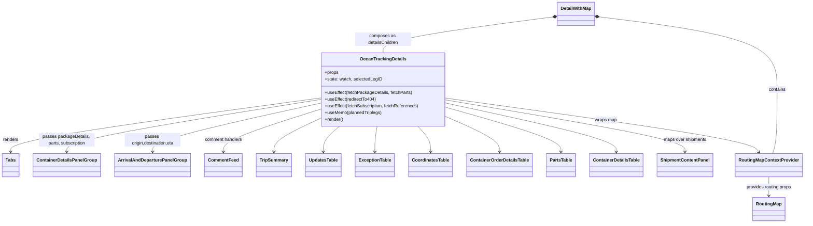
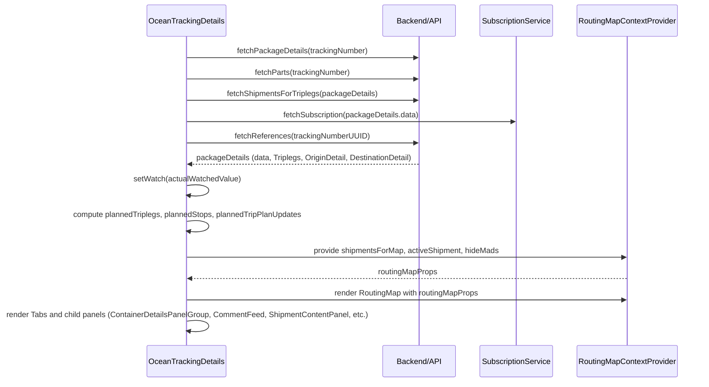

# Diagram: web/portal/src/pages/oceantracking/details/OceanTracking.Details.page.js

> Auto-generated by Obscura crawlers

## Diagram 1

### SVG

<svg id="container" width="2791.4375" xmlns="http://www.w3.org/2000/svg" class="classDiagram" height="802" viewBox="0 0 2791.4375 802" role="graphics-document document" aria-roledescription="class"><g><defs><marker id="container_class-aggregationStart" class="marker aggregation class" refX="18" refY="7" markerWidth="190" markerHeight="240" orient="auto"><path d="M 18,7 L9,13 L1,7 L9,1 Z"></path></marker></defs><defs><marker id="container_class-aggregationEnd" class="marker aggregation class" refX="1" refY="7" markerWidth="20" markerHeight="28" orient="auto"><path d="M 18,7 L9,13 L1,7 L9,1 Z"></path></marker></defs><defs><marker id="container_class-extensionStart" class="marker extension class" refX="18" refY="7" markerWidth="190" markerHeight="240" orient="auto"><path d="M 1,7 L18,13 V 1 Z"></path></marker></defs><defs><marker id="container_class-extensionEnd" class="marker extension class" refX="1" refY="7" markerWidth="20" markerHeight="28" orient="auto"><path d="M 1,1 V 13 L18,7 Z"></path></marker></defs><defs><marker id="container_class-compositionStart" class="marker composition class" refX="18" refY="7" markerWidth="190" markerHeight="240" orient="auto"><path d="M 18,7 L9,13 L1,7 L9,1 Z"></path></marker></defs><defs><marker id="container_class-compositionEnd" class="marker composition class" refX="1" refY="7" markerWidth="20" markerHeight="28" orient="auto"><path d="M 18,7 L9,13 L1,7 L9,1 Z"></path></marker></defs><defs><marker id="container_class-dependencyStart" class="marker dependency class" refX="6" refY="7" markerWidth="190" markerHeight="240" orient="auto"><path d="M 5,7 L9,13 L1,7 L9,1 Z"></path></marker></defs><defs><marker id="container_class-dependencyEnd" class="marker dependency class" refX="13" refY="7" markerWidth="20" markerHeight="28" orient="auto"><path d="M 18,7 L9,13 L14,7 L9,1 Z"></path></marker></defs><defs><marker id="container_class-lollipopStart" class="marker lollipop class" refX="13" refY="7" markerWidth="190" markerHeight="240" orient="auto"><circle stroke="black" fill="transparent" cx="7" cy="7" r="6"></circle></marker></defs><defs><marker id="container_class-lollipopEnd" class="marker lollipop class" refX="1" refY="7" markerWidth="190" markerHeight="240" orient="auto"><circle stroke="black" fill="transparent" cx="7" cy="7" r="6"></circle></marker></defs><g class="root"><g class="clusters"></g><g class="edgePaths"><path d="M1106.789,352.875L928.482,377.896C750.174,402.916,393.56,452.958,215.253,485.146C36.945,517.333,36.945,531.667,36.945,538.833L36.945,546" id="id_OceanTrackingDetails_Tabs_1" class="edge-thickness-normal edge-pattern-solid relation" style=";;;" data-edge="true" data-et="edge" data-id="id_OceanTrackingDetails_Tabs_1" data-points="W3sieCI6MTEwNi43ODkwNjI1LCJ5IjozNTIuODc0Njg0Mjg3OTg5OX0seyJ4IjozNi45NDUzMTI1LCJ5Ijo1MDN9LHsieCI6MzYuOTQ1MzEyNSwieSI6NTUyfV0=" marker-end="url(#container_class-dependencyEnd)"></path><path d="M1106.789,358.353L960.878,382.461C814.966,406.569,523.143,454.784,377.232,486.059C231.32,517.333,231.32,531.667,231.32,538.833L231.32,546" id="id_OceanTrackingDetails_ContainerDetailsPanelGroup_2" class="edge-thickness-normal edge-pattern-solid relation" style=";;;" data-edge="true" data-et="edge" data-id="id_OceanTrackingDetails_ContainerDetailsPanelGroup_2" data-points="W3sieCI6MTEwNi43ODkwNjI1LCJ5IjozNTguMzUyODMwODQ4MDA2NH0seyJ4IjoyMzEuMzIwMzEyNSwieSI6NTAzfSx7IngiOjIzMS4zMjAzMTI1LCJ5Ijo1NTJ9XQ==" marker-end="url(#container_class-dependencyEnd)"></path><path d="M1106.789,371.741L1010.021,393.617C913.253,415.494,719.716,459.247,622.948,488.29C526.18,517.333,526.18,531.667,526.18,538.833L526.18,546" id="id_OceanTrackingDetails_ArrivalAndDeparturePanelGroup_3" class="edge-thickness-normal edge-pattern-solid relation" style=";;;" data-edge="true" data-et="edge" data-id="id_OceanTrackingDetails_ArrivalAndDeparturePanelGroup_3" data-points="W3sieCI6MTEwNi43ODkwNjI1LCJ5IjozNzEuNzQwOTU2ODYwMjk2fSx7IngiOjUyNi4xNzk2ODc1LCJ5Ijo1MDN9LHsieCI6NTI2LjE3OTY4NzUsInkiOjU1Mn1d" marker-end="url(#container_class-dependencyEnd)"></path><path d="M1106.789,393.473L1050.594,411.727C994.398,429.982,882.008,466.491,825.813,491.912C769.617,517.333,769.617,531.667,769.617,538.833L769.617,546" id="id_OceanTrackingDetails_CommentFeed_4" class="edge-thickness-normal edge-pattern-solid relation" style=";;;" data-edge="true" data-et="edge" data-id="id_OceanTrackingDetails_CommentFeed_4" data-points="W3sieCI6MTEwNi43ODkwNjI1LCJ5IjozOTMuNDcyNjc5ODU1ODYyOX0seyJ4Ijo3NjkuNjE3MTg3NSwieSI6NTAzfSx7IngiOjc2OS42MTcxODc1LCJ5Ijo1NTJ9XQ==" marker-end="url(#container_class-dependencyEnd)"></path><path d="M1106.789,426.128L1079.717,438.94C1052.646,451.752,998.503,477.376,971.431,497.355C944.359,517.333,944.359,531.667,944.359,538.833L944.359,546" id="id_OceanTrackingDetails_TripSummary_5" class="edge-thickness-normal edge-pattern-solid relation" style=";;;" data-edge="true" data-et="edge" data-id="id_OceanTrackingDetails_TripSummary_5" data-points="W3sieCI6MTEwNi43ODkwNjI1LCJ5Ijo0MjYuMTI4NDI2Njg2Mjc2OX0seyJ4Ijo5NDQuMzU5Mzc1LCJ5Ijo1MDN9LHsieCI6OTQ0LjM1OTM3NSwieSI6NTUyfV0=" marker-end="url(#container_class-dependencyEnd)"></path><path d="M1174.034,454L1164.581,462.167C1155.129,470.333,1136.225,486.667,1126.773,502C1117.32,517.333,1117.32,531.667,1117.32,538.833L1117.32,546" id="id_OceanTrackingDetails_UpdatesTable_6" class="edge-thickness-normal edge-pattern-solid relation" style=";;;" data-edge="true" data-et="edge" data-id="id_OceanTrackingDetails_UpdatesTable_6" data-points="W3sieCI6MTE3NC4wMzM2NjcxMjcwNzE4LCJ5Ijo0NTR9LHsieCI6MTExNy4zMjAzMTI1LCJ5Ijo1MDN9LHsieCI6MTExNy4zMjAzMTI1LCJ5Ijo1NTJ9XQ==" marker-end="url(#container_class-dependencyEnd)"></path><path d="M1305.128,454L1303.786,462.167C1302.445,470.333,1299.761,486.667,1298.42,502C1297.078,517.333,1297.078,531.667,1297.078,538.833L1297.078,546" id="id_OceanTrackingDetails_ExceptionTable_7" class="edge-thickness-normal edge-pattern-solid relation" style=";;;" data-edge="true" data-et="edge" data-id="id_OceanTrackingDetails_ExceptionTable_7" data-points="W3sieCI6MTMwNS4xMjc3NjI0MzA5MzkxLCJ5Ijo0NTR9LHsieCI6MTI5Ny4wNzgxMjUsInkiOjUwM30seyJ4IjoxMjk3LjA3ODEyNSwieSI6NTUyfV0=" marker-end="url(#container_class-dependencyEnd)"></path><path d="M1446.17,454L1453.554,462.167C1460.939,470.333,1475.708,486.667,1483.092,502C1490.477,517.333,1490.477,531.667,1490.477,538.833L1490.477,546" id="id_OceanTrackingDetails_CoordinatesTable_8" class="edge-thickness-normal edge-pattern-solid relation" style=";;;" data-edge="true" data-et="edge" data-id="id_OceanTrackingDetails_CoordinatesTable_8" data-points="W3sieCI6MTQ0Ni4xNjk3MTY4NTA4Mjg4LCJ5Ijo0NTR9LHsieCI6MTQ5MC40NzY1NjI1LCJ5Ijo1MDN9LHsieCI6MTQ5MC40NzY1NjI1LCJ5Ijo1NTJ9XQ==" marker-end="url(#container_class-dependencyEnd)"></path><path d="M1546.836,420.726L1577.396,434.438C1607.956,448.15,1669.076,475.575,1699.635,496.454C1730.195,517.333,1730.195,531.667,1730.195,538.833L1730.195,546" id="id_OceanTrackingDetails_ContainerOrderDetailsTable_9" class="edge-thickness-normal edge-pattern-solid relation" style=";;;" data-edge="true" data-et="edge" data-id="id_OceanTrackingDetails_ContainerOrderDetailsTable_9" data-points="W3sieCI6MTU0Ni44MzU5Mzc1LCJ5Ijo0MjAuNzI1Njc5MzEzNjE3MjZ9LHsieCI6MTczMC4xOTUzMTI1LCJ5Ijo1MDN9LHsieCI6MTczMC4xOTUzMTI1LCJ5Ijo1NTJ9XQ==" marker-end="url(#container_class-dependencyEnd)"></path><path d="M1546.836,386.441L1613.165,405.867C1679.495,425.294,1812.154,464.147,1878.483,490.74C1944.813,517.333,1944.813,531.667,1944.813,538.833L1944.813,546" id="id_OceanTrackingDetails_PartsTable_10" class="edge-thickness-normal edge-pattern-solid relation" style=";;;" data-edge="true" data-et="edge" data-id="id_OceanTrackingDetails_PartsTable_10" data-points="W3sieCI6MTU0Ni44MzU5Mzc1LCJ5IjozODYuNDQwNTIxMzM4OTk2NzV9LHsieCI6MTk0NC44MTI1LCJ5Ijo1MDN9LHsieCI6MTk0NC44MTI1LCJ5Ijo1NTJ9XQ==" marker-end="url(#container_class-dependencyEnd)"></path><path d="M1546.836,371.063L1645.448,393.053C1744.06,415.042,1941.284,459.021,2039.896,488.177C2138.508,517.333,2138.508,531.667,2138.508,538.833L2138.508,546" id="id_OceanTrackingDetails_ContainerDetailsTable_11" class="edge-thickness-normal edge-pattern-solid relation" style=";;;" data-edge="true" data-et="edge" data-id="id_OceanTrackingDetails_ContainerDetailsTable_11" data-points="W3sieCI6MTU0Ni44MzU5Mzc1LCJ5IjozNzEuMDYzMDQzMjA2MjUyMzZ9LHsieCI6MjEzOC41MDc4MTI1LCJ5Ijo1MDN9LHsieCI6MjEzOC41MDc4MTI1LCJ5Ijo1NTJ9XQ==" marker-end="url(#container_class-dependencyEnd)"></path><path d="M1546.836,359.902L1685.283,383.752C1823.729,407.602,2100.622,455.301,2239.069,486.317C2377.516,517.333,2377.516,531.667,2377.516,538.833L2377.516,546" id="id_OceanTrackingDetails_ShipmentContentPanel_12" class="edge-thickness-normal edge-pattern-solid relation" style=";;;" data-edge="true" data-et="edge" data-id="id_OceanTrackingDetails_ShipmentContentPanel_12" data-points="W3sieCI6MTU0Ni44MzU5Mzc1LCJ5IjozNTkuOTAyNDY4NTg1MDI0OX0seyJ4IjoyMzc3LjUxNTYyNSwieSI6NTAzfSx7IngiOjIzNzcuNTE1NjI1LCJ5Ijo1NTJ9XQ==" marker-end="url(#container_class-dependencyEnd)"></path><path d="M1546.836,353.12L1723.446,378.1C1900.056,403.08,2253.276,453.04,2434.878,485.36C2616.479,517.68,2626.462,532.359,2631.454,539.699L2636.446,547.039" id="id_OceanTrackingDetails_RoutingMapContextProvider_13" class="edge-thickness-normal edge-pattern-solid relation" style=";;;" data-edge="true" data-et="edge" data-id="id_OceanTrackingDetails_RoutingMapContextProvider_13" data-points="W3sieCI6MTU0Ni44MzU5Mzc1LCJ5IjozNTMuMTIwMzgxOTMwMzQ3OH0seyJ4IjoyNjA2LjQ5NjA5Mzc1LCJ5Ijo1MDN9LHsieCI6MjYzOS44MTk3MTE1Mzg0NjE0LCJ5Ijo1NTJ9XQ==" marker-end="url(#container_class-dependencyEnd)"></path><path d="M2668.383,636L2668.383,642.167C2668.383,648.333,2668.383,660.667,2668.383,672C2668.383,683.333,2668.383,693.667,2668.383,698.833L2668.383,704" id="id_RoutingMapContextProvider_RoutingMap_14" class="edge-thickness-normal edge-pattern-solid relation" style=";;;" data-edge="true" data-et="edge" data-id="id_RoutingMapContextProvider_RoutingMap_14" data-points="W3sieCI6MjY2OC4zODI4MTI1LCJ5Ijo2MzZ9LHsieCI6MjY2OC4zODI4MTI1LCJ5Ijo2NzN9LHsieCI6MjY2OC4zODI4MTI1LCJ5Ijo3MTB9XQ==" marker-end="url(#container_class-dependencyEnd)"></path><path d="M2080.524,60.772L2183.456,74.144C2286.389,87.515,2492.253,114.257,2595.185,157.795C2698.117,201.333,2698.117,261.667,2698.117,322C2698.117,382.333,2698.117,442.667,2695.449,481C2692.78,519.333,2687.443,535.667,2684.775,543.833L2682.106,552" id="id_DetailWithMap_RoutingMapContextProvider_15" class="edge-thickness-normal edge-pattern-solid relation" style=";;;" data-edge="true" data-et="edge" data-id="id_DetailWithMap_RoutingMapContextProvider_15" data-points="W3sieCI6MjA2My40MTc5Njg3NSwieSI6NTguNTUwMjk0NzAzMTUwMDF9LHsieCI6MjY5OC4xMTcxODc1LCJ5IjoxNDF9LHsieCI6MjY5OC4xMTcxODc1LCJ5IjozMjJ9LHsieCI6MjY5OC4xMTcxODc1LCJ5Ijo1MDN9LHsieCI6MjY4Mi4xMDYzNzAxOTIzMDc2LCJ5Ijo1NTJ9XQ==" marker-start="url(#container_class-compositionStart)"></path><path d="M1914.684,61.248L1816.705,74.54C1718.727,87.832,1522.77,114.416,1424.791,135.875C1326.813,157.333,1326.813,173.667,1326.813,181.833L1326.813,190" id="id_DetailWithMap_OceanTrackingDetails_16" class="edge-thickness-normal edge-pattern-solid relation" style=";;;" data-edge="true" data-et="edge" data-id="id_DetailWithMap_OceanTrackingDetails_16" data-points="W3sieCI6MTkzMS43NzczNDM3NSwieSI6NTguOTI5MzA5NzUyNDQ3Mjh9LHsieCI6MTMyNi44MTI1LCJ5IjoxNDF9LHsieCI6MTMyNi44MTI1LCJ5IjoxOTB9XQ==" marker-start="url(#container_class-compositionStart)"></path></g><g class="edgeLabels"><g class="edgeLabel" transform="translate(36.9453125, 503)"><g class="label" data-id="id_OceanTrackingDetails_Tabs_1" transform="translate(-27.75, -12)"><foreignObject width="55.5" height="24">

renders

</foreignObject></g></g><g class="edgeLabel" transform="translate(231.3203125, 503)"><g class="label" data-id="id_OceanTrackingDetails_ContainerDetailsPanelGroup_2" transform="translate(-100, -24)"><foreignObject width="200" height="48">

passes packageDetails, parts, subscription

</foreignObject></g></g><g class="edgeLabel" transform="translate(526.1796875, 503)"><g class="label" data-id="id_OceanTrackingDetails_ArrivalAndDeparturePanelGroup_3" transform="translate(-100, -24)"><foreignObject width="200" height="48">

passes origin,destination,eta

</foreignObject></g></g><g class="edgeLabel" transform="translate(769.6171875, 503)"><g class="label" data-id="id_OceanTrackingDetails_CommentFeed_4" transform="translate(-67.984375, -12)"><foreignObject width="135.96875" height="24">

comment handlers

</foreignObject></g></g><g class="edgeLabel"><g class="label" data-id="id_OceanTrackingDetails_TripSummary_5" transform="translate(0, 0)"><foreignObject width="0" height="0">

</foreignObject></g></g><g class="edgeLabel"><g class="label" data-id="id_OceanTrackingDetails_UpdatesTable_6" transform="translate(0, 0)"><foreignObject width="0" height="0">

</foreignObject></g></g><g class="edgeLabel"><g class="label" data-id="id_OceanTrackingDetails_ExceptionTable_7" transform="translate(0, 0)"><foreignObject width="0" height="0">

</foreignObject></g></g><g class="edgeLabel"><g class="label" data-id="id_OceanTrackingDetails_CoordinatesTable_8" transform="translate(0, 0)"><foreignObject width="0" height="0">

</foreignObject></g></g><g class="edgeLabel"><g class="label" data-id="id_OceanTrackingDetails_ContainerOrderDetailsTable_9" transform="translate(0, 0)"><foreignObject width="0" height="0">

</foreignObject></g></g><g class="edgeLabel"><g class="label" data-id="id_OceanTrackingDetails_PartsTable_10" transform="translate(0, 0)"><foreignObject width="0" height="0">

</foreignObject></g></g><g class="edgeLabel"><g class="label" data-id="id_OceanTrackingDetails_ContainerDetailsTable_11" transform="translate(0, 0)"><foreignObject width="0" height="0">

</foreignObject></g></g><g class="edgeLabel" transform="translate(2377.515625, 503)"><g class="label" data-id="id_OceanTrackingDetails_ShipmentContentPanel_12" transform="translate(-77.890625, -12)"><foreignObject width="155.78125" height="24">

maps over shipments

</foreignObject></g></g><g class="edgeLabel" transform="translate(2106.00282, 432.20962)"><g class="label" data-id="id_OceanTrackingDetails_RoutingMapContextProvider_13" transform="translate(-39.46875, -12)"><foreignObject width="78.9375" height="24">

wraps map

</foreignObject></g></g><g class="edgeLabel" transform="translate(2668.3828125, 673)"><g class="label" data-id="id_RoutingMapContextProvider_RoutingMap_14" transform="translate(-82.484375, -12)"><foreignObject width="164.96875" height="24">

provides routing props

</foreignObject></g></g><g class="edgeLabel" transform="translate(2698.1171875, 322)"><g class="label" data-id="id_DetailWithMap_RoutingMapContextProvider_15" transform="translate(-30.890625, -12)"><foreignObject width="61.78125" height="24">

contains

</foreignObject></g></g><g class="edgeLabel" transform="translate(1326.8125, 141)"><g class="label" data-id="id_DetailWithMap_OceanTrackingDetails_16" transform="translate(-100, -24)"><foreignObject width="200" height="48">

composes as detailsChildren

</foreignObject></g></g></g><g class="nodes"><g class="node default" id="classId-OceanTrackingDetails-0" transform="translate(1326.8125, 322)"><g class="basic label-container"><path d="M-220.0234375 -132 L220.0234375 -132 L220.0234375 132 L-220.0234375 132" stroke="none" stroke-width="0" fill="#ECECFF" style=""></path><path d="M-220.0234375 -132 C-101.73643277109808 -132, 16.55057195780384 -132, 220.0234375 -132 M-220.0234375 -132 C-76.705584070468 -132, 66.61226935906399 -132, 220.0234375 -132 M220.0234375 -132 C220.0234375 -29.797435600911598, 220.0234375 72.4051287981768, 220.0234375 132 M220.0234375 -132 C220.0234375 -29.06768645718138, 220.0234375 73.86462708563724, 220.0234375 132 M220.0234375 132 C88.78281389433263 132, -42.45780971133473 132, -220.0234375 132 M220.0234375 132 C55.20715468237722 132, -109.60912813524556 132, -220.0234375 132 M-220.0234375 132 C-220.0234375 30.25821913195989, -220.0234375 -71.48356173608022, -220.0234375 -132 M-220.0234375 132 C-220.0234375 67.1420973385578, -220.0234375 2.2841946771156074, -220.0234375 -132" stroke="#9370DB" stroke-width="1.3" fill="none" stroke-dasharray="0 0" style=""></path></g><g class="annotation-group text" transform="translate(0, -108)"></g><g class="label-group text" transform="translate(-78.953125, -108)"><g class="label" style="font-weight: bolder" transform="translate(0,-12)"><foreignObject width="157.90625" height="24">

OceanTrackingDetails

</foreignObject></g></g><g class="members-group text" transform="translate(-208.0234375, -60)"><g class="label" style="" transform="translate(0,-12)"><foreignObject width="49.515625" height="24">

+props

</foreignObject></g><g class="label" style="" transform="translate(0,12)"><foreignObject width="203.421875" height="24">

+state: watch, selectedLegID

</foreignObject></g></g><g class="methods-group text" transform="translate(-208.0234375, 12)"><g class="label" style="" transform="translate(0,-12)"><foreignObject width="310.5" height="24">

+useEffect(fetchPackageDetails, fetchParts)

</foreignObject></g><g class="label" style="" transform="translate(0,12)"><foreignObject width="183.828125" height="24">

+useEffect(redirectTo404)

</foreignObject></g><g class="label" style="" transform="translate(0,36)"><foreignObject width="337.09375" height="24">

+useEffect(fetchSubscription, fetchReferences)

</foreignObject></g><g class="label" style="" transform="translate(0,60)"><foreignObject width="204.9375" height="24">

+useMemo(plannedTriplegs)

</foreignObject></g><g class="label" style="" transform="translate(0,84)"><foreignObject width="66.609375" height="24">

+render()

</foreignObject></g></g><g class="divider" style=""><path d="M-220.0234375 -84 C-97.74869018569484 -84, 24.52605712861032 -84, 220.0234375 -84 M-220.0234375 -84 C-81.7894504106801 -84, 56.44453667863979 -84, 220.0234375 -84" stroke="#9370DB" stroke-width="1.3" fill="none" stroke-dasharray="0 0" style=""></path></g><g class="divider" style=""><path d="M-220.0234375 -12 C-90.45656484351727 -12, 39.11030781296546 -12, 220.0234375 -12 M-220.0234375 -12 C-61.4527023438215 -12, 97.118032812357 -12, 220.0234375 -12" stroke="#9370DB" stroke-width="1.3" fill="none" stroke-dasharray="0 0" style=""></path></g></g><g class="node default" id="classId-Tabs-1" transform="translate(36.9453125, 594)"><g class="basic label-container"><path d="M-28.9453125 -42 L28.9453125 -42 L28.9453125 42 L-28.9453125 42" stroke="none" stroke-width="0" fill="#ECECFF" style=""></path><path d="M-28.9453125 -42 C-8.955129322273013 -42, 11.035053855453974 -42, 28.9453125 -42 M-28.9453125 -42 C-14.22584525926648 -42, 0.49362198146704017 -42, 28.9453125 -42 M28.9453125 -42 C28.9453125 -15.311349295480987, 28.9453125 11.377301409038026, 28.9453125 42 M28.9453125 -42 C28.9453125 -15.640323183444444, 28.9453125 10.719353633111112, 28.9453125 42 M28.9453125 42 C6.19917510878712 42, -16.54696228242576 42, -28.9453125 42 M28.9453125 42 C12.635036264472973 42, -3.6752399710540544 42, -28.9453125 42 M-28.9453125 42 C-28.9453125 18.77299854311972, -28.9453125 -4.4540029137605615, -28.9453125 -42 M-28.9453125 42 C-28.9453125 12.517813257908841, -28.9453125 -16.964373484182317, -28.9453125 -42" stroke="#9370DB" stroke-width="1.3" fill="none" stroke-dasharray="0 0" style=""></path></g><g class="annotation-group text" transform="translate(0, -18)"></g><g class="label-group text" transform="translate(-16.9453125, -18)"><g class="label" style="font-weight: bolder" transform="translate(0,-12)"><foreignObject width="33.890625" height="24">

Tabs

</foreignObject></g></g><g class="members-group text" transform="translate(-16.9453125, 30)"></g><g class="methods-group text" transform="translate(-16.9453125, 60)"></g><g class="divider" style=""><path d="M-28.9453125 6 C-17.134262548097475 6, -5.323212596194953 6, 28.9453125 6 M-28.9453125 6 C-15.058039384311483 6, -1.170766268622966 6, 28.9453125 6" stroke="#9370DB" stroke-width="1.3" fill="none" stroke-dasharray="0 0" style=""></path></g><g class="divider" style=""><path d="M-28.9453125 24 C-6.423703216592241 24, 16.09790606681552 24, 28.9453125 24 M-28.9453125 24 C-15.952538465094438 24, -2.9597644301888764 24, 28.9453125 24" stroke="#9370DB" stroke-width="1.3" fill="none" stroke-dasharray="0 0" style=""></path></g></g><g class="node default" id="classId-ContainerDetailsPanelGroup-2" transform="translate(231.3203125, 594)"><g class="basic label-container"><path d="M-115.4296875 -42 L115.4296875 -42 L115.4296875 42 L-115.4296875 42" stroke="none" stroke-width="0" fill="#ECECFF" style=""></path><path d="M-115.4296875 -42 C-31.972018772157128 -42, 51.485649955685744 -42, 115.4296875 -42 M-115.4296875 -42 C-45.08733173768532 -42, 25.255024024629364 -42, 115.4296875 -42 M115.4296875 -42 C115.4296875 -9.414708945963298, 115.4296875 23.170582108073404, 115.4296875 42 M115.4296875 -42 C115.4296875 -17.57851956612214, 115.4296875 6.842960867755721, 115.4296875 42 M115.4296875 42 C52.60633015856173 42, -10.217027182876535 42, -115.4296875 42 M115.4296875 42 C59.89782323915745 42, 4.365958978314893 42, -115.4296875 42 M-115.4296875 42 C-115.4296875 23.549564058265965, -115.4296875 5.099128116531929, -115.4296875 -42 M-115.4296875 42 C-115.4296875 8.598604642510537, -115.4296875 -24.802790714978926, -115.4296875 -42" stroke="#9370DB" stroke-width="1.3" fill="none" stroke-dasharray="0 0" style=""></path></g><g class="annotation-group text" transform="translate(0, -18)"></g><g class="label-group text" transform="translate(-103.4296875, -18)"><g class="label" style="font-weight: bolder" transform="translate(0,-12)"><foreignObject width="206.859375" height="24">

ContainerDetailsPanelGroup

</foreignObject></g></g><g class="members-group text" transform="translate(-103.4296875, 30)"></g><g class="methods-group text" transform="translate(-103.4296875, 60)"></g><g class="divider" style=""><path d="M-115.4296875 6 C-25.57036876871581 6, 64.28894996256838 6, 115.4296875 6 M-115.4296875 6 C-50.6325520470473 6, 14.164583405905404 6, 115.4296875 6" stroke="#9370DB" stroke-width="1.3" fill="none" stroke-dasharray="0 0" style=""></path></g><g class="divider" style=""><path d="M-115.4296875 24 C-32.100034561657864 24, 51.22961837668427 24, 115.4296875 24 M-115.4296875 24 C-38.53445922580276 24, 38.360769048394474 24, 115.4296875 24" stroke="#9370DB" stroke-width="1.3" fill="none" stroke-dasharray="0 0" style=""></path></g></g><g class="node default" id="classId-ArrivalAndDeparturePanelGroup-3" transform="translate(526.1796875, 594)"><g class="basic label-container"><path d="M-129.4296875 -42 L129.4296875 -42 L129.4296875 42 L-129.4296875 42" stroke="none" stroke-width="0" fill="#ECECFF" style=""></path><path d="M-129.4296875 -42 C-31.28600758105607 -42, 66.85767233788786 -42, 129.4296875 -42 M-129.4296875 -42 C-70.08429558662533 -42, -10.738903673250661 -42, 129.4296875 -42 M129.4296875 -42 C129.4296875 -19.716825713365562, 129.4296875 2.5663485732688756, 129.4296875 42 M129.4296875 -42 C129.4296875 -20.034867229960128, 129.4296875 1.9302655400797448, 129.4296875 42 M129.4296875 42 C71.40676106112868 42, 13.383834622257353 42, -129.4296875 42 M129.4296875 42 C43.059909956021656 42, -43.30986758795669 42, -129.4296875 42 M-129.4296875 42 C-129.4296875 22.009641138505188, -129.4296875 2.019282277010376, -129.4296875 -42 M-129.4296875 42 C-129.4296875 19.569681013497856, -129.4296875 -2.8606379730042875, -129.4296875 -42" stroke="#9370DB" stroke-width="1.3" fill="none" stroke-dasharray="0 0" style=""></path></g><g class="annotation-group text" transform="translate(0, -18)"></g><g class="label-group text" transform="translate(-117.4296875, -18)"><g class="label" style="font-weight: bolder" transform="translate(0,-12)"><foreignObject width="234.859375" height="24">

ArrivalAndDeparturePanelGroup

</foreignObject></g></g><g class="members-group text" transform="translate(-117.4296875, 30)"></g><g class="methods-group text" transform="translate(-117.4296875, 60)"></g><g class="divider" style=""><path d="M-129.4296875 6 C-37.81368022755311 6, 53.80232704489379 6, 129.4296875 6 M-129.4296875 6 C-64.46697910109532 6, 0.4957292978093619 6, 129.4296875 6" stroke="#9370DB" stroke-width="1.3" fill="none" stroke-dasharray="0 0" style=""></path></g><g class="divider" style=""><path d="M-129.4296875 24 C-58.75341520333325 24, 11.922857093333505 24, 129.4296875 24 M-129.4296875 24 C-43.06331330489921 24, 43.30306089020158 24, 129.4296875 24" stroke="#9370DB" stroke-width="1.3" fill="none" stroke-dasharray="0 0" style=""></path></g></g><g class="node default" id="classId-CommentFeed-4" transform="translate(769.6171875, 594)"><g class="basic label-container"><path d="M-64.0078125 -42 L64.0078125 -42 L64.0078125 42 L-64.0078125 42" stroke="none" stroke-width="0" fill="#ECECFF" style=""></path><path d="M-64.0078125 -42 C-18.543206950292024 -42, 26.92139859941595 -42, 64.0078125 -42 M-64.0078125 -42 C-33.760688125672075 -42, -3.513563751344151 -42, 64.0078125 -42 M64.0078125 -42 C64.0078125 -22.06342654946923, 64.0078125 -2.1268530989384615, 64.0078125 42 M64.0078125 -42 C64.0078125 -17.620481556440854, 64.0078125 6.759036887118292, 64.0078125 42 M64.0078125 42 C36.745357480914834 42, 9.482902461829667 42, -64.0078125 42 M64.0078125 42 C24.360743114596758 42, -15.286326270806484 42, -64.0078125 42 M-64.0078125 42 C-64.0078125 17.377575602621903, -64.0078125 -7.244848794756194, -64.0078125 -42 M-64.0078125 42 C-64.0078125 10.519209953220326, -64.0078125 -20.96158009355935, -64.0078125 -42" stroke="#9370DB" stroke-width="1.3" fill="none" stroke-dasharray="0 0" style=""></path></g><g class="annotation-group text" transform="translate(0, -18)"></g><g class="label-group text" transform="translate(-52.0078125, -18)"><g class="label" style="font-weight: bolder" transform="translate(0,-12)"><foreignObject width="104.015625" height="24">

CommentFeed

</foreignObject></g></g><g class="members-group text" transform="translate(-52.0078125, 30)"></g><g class="methods-group text" transform="translate(-52.0078125, 60)"></g><g class="divider" style=""><path d="M-64.0078125 6 C-24.993059032555003 6, 14.021694434889994 6, 64.0078125 6 M-64.0078125 6 C-19.46856965355129 6, 25.070673192897416 6, 64.0078125 6" stroke="#9370DB" stroke-width="1.3" fill="none" stroke-dasharray="0 0" style=""></path></g><g class="divider" style=""><path d="M-64.0078125 24 C-35.839525222847826 24, -7.671237945695644 24, 64.0078125 24 M-64.0078125 24 C-24.847599109537953 24, 14.312614280924095 24, 64.0078125 24" stroke="#9370DB" stroke-width="1.3" fill="none" stroke-dasharray="0 0" style=""></path></g></g><g class="node default" id="classId-TripSummary-5" transform="translate(944.359375, 594)"><g class="basic label-container"><path d="M-60.734375 -42 L60.734375 -42 L60.734375 42 L-60.734375 42" stroke="none" stroke-width="0" fill="#ECECFF" style=""></path><path d="M-60.734375 -42 C-19.73223231568017 -42, 21.269910368639657 -42, 60.734375 -42 M-60.734375 -42 C-20.561918933178802 -42, 19.610537133642396 -42, 60.734375 -42 M60.734375 -42 C60.734375 -18.751719348384466, 60.734375 4.4965613032310685, 60.734375 42 M60.734375 -42 C60.734375 -20.51865592260414, 60.734375 0.9626881547917208, 60.734375 42 M60.734375 42 C35.50554654906958 42, 10.276718098139163 42, -60.734375 42 M60.734375 42 C34.44190557422084 42, 8.149436148441673 42, -60.734375 42 M-60.734375 42 C-60.734375 18.636493075486637, -60.734375 -4.727013849026726, -60.734375 -42 M-60.734375 42 C-60.734375 23.659111412803842, -60.734375 5.318222825607684, -60.734375 -42" stroke="#9370DB" stroke-width="1.3" fill="none" stroke-dasharray="0 0" style=""></path></g><g class="annotation-group text" transform="translate(0, -18)"></g><g class="label-group text" transform="translate(-48.734375, -18)"><g class="label" style="font-weight: bolder" transform="translate(0,-12)"><foreignObject width="97.46875" height="24">

TripSummary

</foreignObject></g></g><g class="members-group text" transform="translate(-48.734375, 30)"></g><g class="methods-group text" transform="translate(-48.734375, 60)"></g><g class="divider" style=""><path d="M-60.734375 6 C-15.198297915056358 6, 30.337779169887284 6, 60.734375 6 M-60.734375 6 C-29.603379664535442 6, 1.5276156709291158 6, 60.734375 6" stroke="#9370DB" stroke-width="1.3" fill="none" stroke-dasharray="0 0" style=""></path></g><g class="divider" style=""><path d="M-60.734375 24 C-23.22850239253613 24, 14.277370214927743 24, 60.734375 24 M-60.734375 24 C-16.246389955190878 24, 28.241595089618244 24, 60.734375 24" stroke="#9370DB" stroke-width="1.3" fill="none" stroke-dasharray="0 0" style=""></path></g></g><g class="node default" id="classId-UpdatesTable-6" transform="translate(1117.3203125, 594)"><g class="basic label-container"><path d="M-62.2265625 -42 L62.2265625 -42 L62.2265625 42 L-62.2265625 42" stroke="none" stroke-width="0" fill="#ECECFF" style=""></path><path d="M-62.2265625 -42 C-23.96632459217954 -42, 14.293913315640921 -42, 62.2265625 -42 M-62.2265625 -42 C-16.797895319490543 -42, 28.630771861018914 -42, 62.2265625 -42 M62.2265625 -42 C62.2265625 -14.53227785688225, 62.2265625 12.935444286235501, 62.2265625 42 M62.2265625 -42 C62.2265625 -8.438910287560425, 62.2265625 25.12217942487915, 62.2265625 42 M62.2265625 42 C36.75031915309103 42, 11.274075806182054 42, -62.2265625 42 M62.2265625 42 C31.71949457577334 42, 1.2124266515466786 42, -62.2265625 42 M-62.2265625 42 C-62.2265625 24.55718913592985, -62.2265625 7.1143782718596995, -62.2265625 -42 M-62.2265625 42 C-62.2265625 20.2545583185894, -62.2265625 -1.4908833628212008, -62.2265625 -42" stroke="#9370DB" stroke-width="1.3" fill="none" stroke-dasharray="0 0" style=""></path></g><g class="annotation-group text" transform="translate(0, -18)"></g><g class="label-group text" transform="translate(-50.2265625, -18)"><g class="label" style="font-weight: bolder" transform="translate(0,-12)"><foreignObject width="100.453125" height="24">

UpdatesTable

</foreignObject></g></g><g class="members-group text" transform="translate(-50.2265625, 30)"></g><g class="methods-group text" transform="translate(-50.2265625, 60)"></g><g class="divider" style=""><path d="M-62.2265625 6 C-36.36369917446649 6, -10.500835848932972 6, 62.2265625 6 M-62.2265625 6 C-20.44178971043077 6, 21.342983079138463 6, 62.2265625 6" stroke="#9370DB" stroke-width="1.3" fill="none" stroke-dasharray="0 0" style=""></path></g><g class="divider" style=""><path d="M-62.2265625 24 C-37.33545635739627 24, -12.444350214792529 24, 62.2265625 24 M-62.2265625 24 C-13.341168871189602 24, 35.544224757620796 24, 62.2265625 24" stroke="#9370DB" stroke-width="1.3" fill="none" stroke-dasharray="0 0" style=""></path></g></g><g class="node default" id="classId-ExceptionTable-7" transform="translate(1297.078125, 594)"><g class="basic label-container"><path d="M-67.53125 -42 L67.53125 -42 L67.53125 42 L-67.53125 42" stroke="none" stroke-width="0" fill="#ECECFF" style=""></path><path d="M-67.53125 -42 C-19.77810497292414 -42, 27.97504005415172 -42, 67.53125 -42 M-67.53125 -42 C-39.55975668209557 -42, -11.588263364191143 -42, 67.53125 -42 M67.53125 -42 C67.53125 -13.285388120760768, 67.53125 15.429223758478464, 67.53125 42 M67.53125 -42 C67.53125 -10.404480421458075, 67.53125 21.19103915708385, 67.53125 42 M67.53125 42 C29.422866199115184 42, -8.685517601769632 42, -67.53125 42 M67.53125 42 C30.508031347573414 42, -6.515187304853171 42, -67.53125 42 M-67.53125 42 C-67.53125 16.179963602022372, -67.53125 -9.640072795955255, -67.53125 -42 M-67.53125 42 C-67.53125 22.081766001979606, -67.53125 2.1635320039592116, -67.53125 -42" stroke="#9370DB" stroke-width="1.3" fill="none" stroke-dasharray="0 0" style=""></path></g><g class="annotation-group text" transform="translate(0, -18)"></g><g class="label-group text" transform="translate(-55.53125, -18)"><g class="label" style="font-weight: bolder" transform="translate(0,-12)"><foreignObject width="111.0625" height="24">

ExceptionTable

</foreignObject></g></g><g class="members-group text" transform="translate(-55.53125, 30)"></g><g class="methods-group text" transform="translate(-55.53125, 60)"></g><g class="divider" style=""><path d="M-67.53125 6 C-15.800397997957141 6, 35.93045400408572 6, 67.53125 6 M-67.53125 6 C-26.231834697825697 6, 15.067580604348606 6, 67.53125 6" stroke="#9370DB" stroke-width="1.3" fill="none" stroke-dasharray="0 0" style=""></path></g><g class="divider" style=""><path d="M-67.53125 24 C-37.576495049668296 24, -7.6217400993365985 24, 67.53125 24 M-67.53125 24 C-39.40157871858369 24, -11.271907437167393 24, 67.53125 24" stroke="#9370DB" stroke-width="1.3" fill="none" stroke-dasharray="0 0" style=""></path></g></g><g class="node default" id="classId-CoordinatesTable-8" transform="translate(1490.4765625, 594)"><g class="basic label-container"><path d="M-75.8671875 -42 L75.8671875 -42 L75.8671875 42 L-75.8671875 42" stroke="none" stroke-width="0" fill="#ECECFF" style=""></path><path d="M-75.8671875 -42 C-29.871979874297814 -42, 16.12322775140437 -42, 75.8671875 -42 M-75.8671875 -42 C-18.376214549793183 -42, 39.114758400413635 -42, 75.8671875 -42 M75.8671875 -42 C75.8671875 -16.2653842285651, 75.8671875 9.4692315428698, 75.8671875 42 M75.8671875 -42 C75.8671875 -16.992282354779505, 75.8671875 8.01543529044099, 75.8671875 42 M75.8671875 42 C30.318046721541627 42, -15.231094056916746 42, -75.8671875 42 M75.8671875 42 C29.605197152095307 42, -16.656793195809385 42, -75.8671875 42 M-75.8671875 42 C-75.8671875 17.900472623512776, -75.8671875 -6.1990547529744475, -75.8671875 -42 M-75.8671875 42 C-75.8671875 19.29466583081568, -75.8671875 -3.4106683383686374, -75.8671875 -42" stroke="#9370DB" stroke-width="1.3" fill="none" stroke-dasharray="0 0" style=""></path></g><g class="annotation-group text" transform="translate(0, -18)"></g><g class="label-group text" transform="translate(-63.8671875, -18)"><g class="label" style="font-weight: bolder" transform="translate(0,-12)"><foreignObject width="127.734375" height="24">

CoordinatesTable

</foreignObject></g></g><g class="members-group text" transform="translate(-63.8671875, 30)"></g><g class="methods-group text" transform="translate(-63.8671875, 60)"></g><g class="divider" style=""><path d="M-75.8671875 6 C-32.6414119156229 6, 10.584363668754193 6, 75.8671875 6 M-75.8671875 6 C-23.864279041333717 6, 28.138629417332567 6, 75.8671875 6" stroke="#9370DB" stroke-width="1.3" fill="none" stroke-dasharray="0 0" style=""></path></g><g class="divider" style=""><path d="M-75.8671875 24 C-26.979364783503776 24, 21.908457932992448 24, 75.8671875 24 M-75.8671875 24 C-19.19080938382507 24, 37.48556873234986 24, 75.8671875 24" stroke="#9370DB" stroke-width="1.3" fill="none" stroke-dasharray="0 0" style=""></path></g></g><g class="node default" id="classId-ContainerOrderDetailsTable-9" transform="translate(1730.1953125, 594)"><g class="basic label-container"><path d="M-113.8515625 -42 L113.8515625 -42 L113.8515625 42 L-113.8515625 42" stroke="none" stroke-width="0" fill="#ECECFF" style=""></path><path d="M-113.8515625 -42 C-24.40459733170418 -42, 65.04236783659164 -42, 113.8515625 -42 M-113.8515625 -42 C-62.653425437150695 -42, -11.45528837430139 -42, 113.8515625 -42 M113.8515625 -42 C113.8515625 -13.811089083883967, 113.8515625 14.377821832232065, 113.8515625 42 M113.8515625 -42 C113.8515625 -15.484757522861027, 113.8515625 11.030484954277945, 113.8515625 42 M113.8515625 42 C63.483363897716806 42, 13.115165295433613 42, -113.8515625 42 M113.8515625 42 C51.508284106861815 42, -10.83499428627637 42, -113.8515625 42 M-113.8515625 42 C-113.8515625 23.811438610082455, -113.8515625 5.622877220164909, -113.8515625 -42 M-113.8515625 42 C-113.8515625 11.315053240919767, -113.8515625 -19.369893518160467, -113.8515625 -42" stroke="#9370DB" stroke-width="1.3" fill="none" stroke-dasharray="0 0" style=""></path></g><g class="annotation-group text" transform="translate(0, -18)"></g><g class="label-group text" transform="translate(-101.8515625, -18)"><g class="label" style="font-weight: bolder" transform="translate(0,-12)"><foreignObject width="203.703125" height="24">

ContainerOrderDetailsTable

</foreignObject></g></g><g class="members-group text" transform="translate(-101.8515625, 30)"></g><g class="methods-group text" transform="translate(-101.8515625, 60)"></g><g class="divider" style=""><path d="M-113.8515625 6 C-53.81660889504436 6, 6.218344709911278 6, 113.8515625 6 M-113.8515625 6 C-60.1335880310414 6, -6.415613562082797 6, 113.8515625 6" stroke="#9370DB" stroke-width="1.3" fill="none" stroke-dasharray="0 0" style=""></path></g><g class="divider" style=""><path d="M-113.8515625 24 C-67.3364914245499 24, -20.821420349099796 24, 113.8515625 24 M-113.8515625 24 C-55.124030117687425 24, 3.603502264625149 24, 113.8515625 24" stroke="#9370DB" stroke-width="1.3" fill="none" stroke-dasharray="0 0" style=""></path></g></g><g class="node default" id="classId-PartsTable-10" transform="translate(1944.8125, 594)"><g class="basic label-container"><path d="M-50.765625 -42 L50.765625 -42 L50.765625 42 L-50.765625 42" stroke="none" stroke-width="0" fill="#ECECFF" style=""></path><path d="M-50.765625 -42 C-20.69534690254887 -42, 9.37493119490226 -42, 50.765625 -42 M-50.765625 -42 C-21.53995643901545 -42, 7.685712121969097 -42, 50.765625 -42 M50.765625 -42 C50.765625 -12.396118023792937, 50.765625 17.207763952414126, 50.765625 42 M50.765625 -42 C50.765625 -21.636529448971014, 50.765625 -1.273058897942029, 50.765625 42 M50.765625 42 C15.43489307179533 42, -19.89583885640934 42, -50.765625 42 M50.765625 42 C16.645515645215475 42, -17.47459370956905 42, -50.765625 42 M-50.765625 42 C-50.765625 9.984869142609767, -50.765625 -22.030261714780465, -50.765625 -42 M-50.765625 42 C-50.765625 10.166654076579775, -50.765625 -21.66669184684045, -50.765625 -42" stroke="#9370DB" stroke-width="1.3" fill="none" stroke-dasharray="0 0" style=""></path></g><g class="annotation-group text" transform="translate(0, -18)"></g><g class="label-group text" transform="translate(-38.765625, -18)"><g class="label" style="font-weight: bolder" transform="translate(0,-12)"><foreignObject width="77.53125" height="24">

PartsTable

</foreignObject></g></g><g class="members-group text" transform="translate(-38.765625, 30)"></g><g class="methods-group text" transform="translate(-38.765625, 60)"></g><g class="divider" style=""><path d="M-50.765625 6 C-24.075463251542125 6, 2.61469849691575 6, 50.765625 6 M-50.765625 6 C-11.861585981563849 6, 27.042453036872303 6, 50.765625 6" stroke="#9370DB" stroke-width="1.3" fill="none" stroke-dasharray="0 0" style=""></path></g><g class="divider" style=""><path d="M-50.765625 24 C-19.476802476748933 24, 11.812020046502134 24, 50.765625 24 M-50.765625 24 C-23.86284550700401 24, 3.039933985991979 24, 50.765625 24" stroke="#9370DB" stroke-width="1.3" fill="none" stroke-dasharray="0 0" style=""></path></g></g><g class="node default" id="classId-ContainerDetailsTable-11" transform="translate(2138.5078125, 594)"><g class="basic label-container"><path d="M-92.9296875 -42 L92.9296875 -42 L92.9296875 42 L-92.9296875 42" stroke="none" stroke-width="0" fill="#ECECFF" style=""></path><path d="M-92.9296875 -42 C-49.16545929645669 -42, -5.4012310929133776 -42, 92.9296875 -42 M-92.9296875 -42 C-45.077044782349006 -42, 2.775597935301988 -42, 92.9296875 -42 M92.9296875 -42 C92.9296875 -24.834015345716367, 92.9296875 -7.668030691432733, 92.9296875 42 M92.9296875 -42 C92.9296875 -9.238592784404503, 92.9296875 23.522814431190994, 92.9296875 42 M92.9296875 42 C38.69227876904173 42, -15.545129961916544 42, -92.9296875 42 M92.9296875 42 C47.62636892199619 42, 2.323050343992378 42, -92.9296875 42 M-92.9296875 42 C-92.9296875 22.88626725601884, -92.9296875 3.77253451203768, -92.9296875 -42 M-92.9296875 42 C-92.9296875 20.27240288867085, -92.9296875 -1.4551942226582995, -92.9296875 -42" stroke="#9370DB" stroke-width="1.3" fill="none" stroke-dasharray="0 0" style=""></path></g><g class="annotation-group text" transform="translate(0, -18)"></g><g class="label-group text" transform="translate(-80.9296875, -18)"><g class="label" style="font-weight: bolder" transform="translate(0,-12)"><foreignObject width="161.859375" height="24">

ContainerDetailsTable

</foreignObject></g></g><g class="members-group text" transform="translate(-80.9296875, 30)"></g><g class="methods-group text" transform="translate(-80.9296875, 60)"></g><g class="divider" style=""><path d="M-92.9296875 6 C-32.444935353673536 6, 28.03981679265293 6, 92.9296875 6 M-92.9296875 6 C-49.88488357457273 6, -6.840079649145466 6, 92.9296875 6" stroke="#9370DB" stroke-width="1.3" fill="none" stroke-dasharray="0 0" style=""></path></g><g class="divider" style=""><path d="M-92.9296875 24 C-48.46865125977323 24, -4.0076150195464635 24, 92.9296875 24 M-92.9296875 24 C-48.97335992497995 24, -5.017032349959905 24, 92.9296875 24" stroke="#9370DB" stroke-width="1.3" fill="none" stroke-dasharray="0 0" style=""></path></g></g><g class="node default" id="classId-ShipmentContentPanel-12" transform="translate(2377.515625, 594)"><g class="basic label-container"><path d="M-96.078125 -42 L96.078125 -42 L96.078125 42 L-96.078125 42" stroke="none" stroke-width="0" fill="#ECECFF" style=""></path><path d="M-96.078125 -42 C-56.70758549928005 -42, -17.3370459985601 -42, 96.078125 -42 M-96.078125 -42 C-46.14611609667885 -42, 3.7858928066422948 -42, 96.078125 -42 M96.078125 -42 C96.078125 -17.26574576428445, 96.078125 7.4685084714311, 96.078125 42 M96.078125 -42 C96.078125 -24.680604067421474, 96.078125 -7.361208134842947, 96.078125 42 M96.078125 42 C22.57941500042415 42, -50.9192949991517 42, -96.078125 42 M96.078125 42 C32.776783657796294 42, -30.524557684407412 42, -96.078125 42 M-96.078125 42 C-96.078125 24.792521525290915, -96.078125 7.585043050581831, -96.078125 -42 M-96.078125 42 C-96.078125 20.87411177283558, -96.078125 -0.25177645432884077, -96.078125 -42" stroke="#9370DB" stroke-width="1.3" fill="none" stroke-dasharray="0 0" style=""></path></g><g class="annotation-group text" transform="translate(0, -18)"></g><g class="label-group text" transform="translate(-84.078125, -18)"><g class="label" style="font-weight: bolder" transform="translate(0,-12)"><foreignObject width="168.15625" height="24">

ShipmentContentPanel

</foreignObject></g></g><g class="members-group text" transform="translate(-84.078125, 30)"></g><g class="methods-group text" transform="translate(-84.078125, 60)"></g><g class="divider" style=""><path d="M-96.078125 6 C-54.92927472956358 6, -13.780424459127161 6, 96.078125 6 M-96.078125 6 C-47.90201272960339 6, 0.2740995407932161 6, 96.078125 6" stroke="#9370DB" stroke-width="1.3" fill="none" stroke-dasharray="0 0" style=""></path></g><g class="divider" style=""><path d="M-96.078125 24 C-37.00304911309228 24, 22.072026773815438 24, 96.078125 24 M-96.078125 24 C-25.67441173919711 24, 44.72930152160578 24, 96.078125 24" stroke="#9370DB" stroke-width="1.3" fill="none" stroke-dasharray="0 0" style=""></path></g></g><g class="node default" id="classId-RoutingMapContextProvider-13" transform="translate(2668.3828125, 594)"><g class="basic label-container"><path d="M-115.0546875 -42 L115.0546875 -42 L115.0546875 42 L-115.0546875 42" stroke="none" stroke-width="0" fill="#ECECFF" style=""></path><path d="M-115.0546875 -42 C-42.56274060043698 -42, 29.929206299126037 -42, 115.0546875 -42 M-115.0546875 -42 C-32.73923690738586 -42, 49.57621368522828 -42, 115.0546875 -42 M115.0546875 -42 C115.0546875 -13.295407040132691, 115.0546875 15.409185919734618, 115.0546875 42 M115.0546875 -42 C115.0546875 -17.780697643849642, 115.0546875 6.438604712300716, 115.0546875 42 M115.0546875 42 C38.41945562555449 42, -38.21577624889102 42, -115.0546875 42 M115.0546875 42 C42.34698137412603 42, -30.360724751747938 42, -115.0546875 42 M-115.0546875 42 C-115.0546875 12.973865383843187, -115.0546875 -16.052269232313627, -115.0546875 -42 M-115.0546875 42 C-115.0546875 21.508251697518208, -115.0546875 1.0165033950364162, -115.0546875 -42" stroke="#9370DB" stroke-width="1.3" fill="none" stroke-dasharray="0 0" style=""></path></g><g class="annotation-group text" transform="translate(0, -18)"></g><g class="label-group text" transform="translate(-103.0546875, -18)"><g class="label" style="font-weight: bolder" transform="translate(0,-12)"><foreignObject width="206.109375" height="24">

RoutingMapContextProvider

</foreignObject></g></g><g class="members-group text" transform="translate(-103.0546875, 30)"></g><g class="methods-group text" transform="translate(-103.0546875, 60)"></g><g class="divider" style=""><path d="M-115.0546875 6 C-30.47514922614232 6, 54.10438904771536 6, 115.0546875 6 M-115.0546875 6 C-62.64851849336157 6, -10.242349486723143 6, 115.0546875 6" stroke="#9370DB" stroke-width="1.3" fill="none" stroke-dasharray="0 0" style=""></path></g><g class="divider" style=""><path d="M-115.0546875 24 C-38.481737366486854 24, 38.09121276702629 24, 115.0546875 24 M-115.0546875 24 C-42.591441622610674 24, 29.871804254778652 24, 115.0546875 24" stroke="#9370DB" stroke-width="1.3" fill="none" stroke-dasharray="0 0" style=""></path></g></g><g class="node default" id="classId-RoutingMap-14" transform="translate(2668.3828125, 752)"><g class="basic label-container"><path d="M-55.8828125 -42 L55.8828125 -42 L55.8828125 42 L-55.8828125 42" stroke="none" stroke-width="0" fill="#ECECFF" style=""></path><path d="M-55.8828125 -42 C-15.647178360537076 -42, 24.588455778925848 -42, 55.8828125 -42 M-55.8828125 -42 C-12.484709984323061 -42, 30.913392531353878 -42, 55.8828125 -42 M55.8828125 -42 C55.8828125 -9.518090682040558, 55.8828125 22.963818635918884, 55.8828125 42 M55.8828125 -42 C55.8828125 -24.52644855855782, 55.8828125 -7.052897117115641, 55.8828125 42 M55.8828125 42 C21.03198957039193 42, -13.818833359216143 42, -55.8828125 42 M55.8828125 42 C14.114343803475016 42, -27.654124893049968 42, -55.8828125 42 M-55.8828125 42 C-55.8828125 19.03655989828816, -55.8828125 -3.9268802034236785, -55.8828125 -42 M-55.8828125 42 C-55.8828125 18.96679898183386, -55.8828125 -4.066402036332278, -55.8828125 -42" stroke="#9370DB" stroke-width="1.3" fill="none" stroke-dasharray="0 0" style=""></path></g><g class="annotation-group text" transform="translate(0, -18)"></g><g class="label-group text" transform="translate(-43.8828125, -18)"><g class="label" style="font-weight: bolder" transform="translate(0,-12)"><foreignObject width="87.765625" height="24">

RoutingMap

</foreignObject></g></g><g class="members-group text" transform="translate(-43.8828125, 30)"></g><g class="methods-group text" transform="translate(-43.8828125, 60)"></g><g class="divider" style=""><path d="M-55.8828125 6 C-14.276831302798136 6, 27.329149894403727 6, 55.8828125 6 M-55.8828125 6 C-14.993467523209901 6, 25.895877453580198 6, 55.8828125 6" stroke="#9370DB" stroke-width="1.3" fill="none" stroke-dasharray="0 0" style=""></path></g><g class="divider" style=""><path d="M-55.8828125 24 C-31.353822542121836 24, -6.824832584243673 24, 55.8828125 24 M-55.8828125 24 C-24.93463417478296 24, 6.013544150434079 24, 55.8828125 24" stroke="#9370DB" stroke-width="1.3" fill="none" stroke-dasharray="0 0" style=""></path></g></g><g class="node default" id="classId-DetailWithMap-15" transform="translate(1997.59765625, 50)"><g class="basic label-container"><path d="M-65.8203125 -42 L65.8203125 -42 L65.8203125 42 L-65.8203125 42" stroke="none" stroke-width="0" fill="#ECECFF" style=""></path><path d="M-65.8203125 -42 C-34.131017887084745 -42, -2.4417232741694903 -42, 65.8203125 -42 M-65.8203125 -42 C-32.01247161682844 -42, 1.7953692663431156 -42, 65.8203125 -42 M65.8203125 -42 C65.8203125 -13.581386137029305, 65.8203125 14.83722772594139, 65.8203125 42 M65.8203125 -42 C65.8203125 -13.414949036832432, 65.8203125 15.170101926335136, 65.8203125 42 M65.8203125 42 C25.51475860447991 42, -14.790795291040183 42, -65.8203125 42 M65.8203125 42 C28.747627820771577 42, -8.325056858456847 42, -65.8203125 42 M-65.8203125 42 C-65.8203125 15.488376833092055, -65.8203125 -11.02324633381589, -65.8203125 -42 M-65.8203125 42 C-65.8203125 17.47683879556303, -65.8203125 -7.046322408873941, -65.8203125 -42" stroke="#9370DB" stroke-width="1.3" fill="none" stroke-dasharray="0 0" style=""></path></g><g class="annotation-group text" transform="translate(0, -18)"></g><g class="label-group text" transform="translate(-53.8203125, -18)"><g class="label" style="font-weight: bolder" transform="translate(0,-12)"><foreignObject width="107.640625" height="24">

DetailWithMap

</foreignObject></g></g><g class="members-group text" transform="translate(-53.8203125, 30)"></g><g class="methods-group text" transform="translate(-53.8203125, 60)"></g><g class="divider" style=""><path d="M-65.8203125 6 C-26.851593421249902 6, 12.117125657500196 6, 65.8203125 6 M-65.8203125 6 C-39.19554867050718 6, -12.570784841014358 6, 65.8203125 6" stroke="#9370DB" stroke-width="1.3" fill="none" stroke-dasharray="0 0" style=""></path></g><g class="divider" style=""><path d="M-65.8203125 24 C-13.927163138044236 24, 37.96598622391153 24, 65.8203125 24 M-65.8203125 24 C-30.03950723236958 24, 5.74129803526084 24, 65.8203125 24" stroke="#9370DB" stroke-width="1.3" fill="none" stroke-dasharray="0 0" style=""></path></g></g></g></g></g></svg>

## Diagram 2

### SVG

<svg id="container" width="1556.5" xmlns="http://www.w3.org/2000/svg" height="837" viewBox="-336 -10 1556.5 837" role="graphics-document document" aria-roledescription="sequence"><g><rect x="947.5" y="751" fill="#eaeaea" stroke="#666" width="223" height="65" name="Map" rx="3" ry="3" class="actor actor-bottom"></rect><text x="1059" y="783.5" dominant-baseline="central" alignment-baseline="central" class="actor actor-box" style="text-anchor: middle; font-size: 16px; font-weight: 400;"><tspan x="1059" dy="0">RoutingMapContextProvider</tspan></text></g><g><rect x="733.5" y="751" fill="#eaeaea" stroke="#666" width="164" height="65" name="Subs" rx="3" ry="3" class="actor actor-bottom"></rect><text x="815.5" y="783.5" dominant-baseline="central" alignment-baseline="central" class="actor actor-box" style="text-anchor: middle; font-size: 16px; font-weight: 400;"><tspan x="815.5" dy="0">SubscriptionService</tspan></text></g><g><rect x="533.5" y="751" fill="#eaeaea" stroke="#666" width="150" height="65" name="API" rx="3" ry="3" class="actor actor-bottom"></rect><text x="608.5" y="783.5" dominant-baseline="central" alignment-baseline="central" class="actor actor-box" style="text-anchor: middle; font-size: 16px; font-weight: 400;"><tspan x="608.5" dy="0">Backend/API</tspan></text></g><g><rect x="0" y="751" fill="#eaeaea" stroke="#666" width="175" height="65" name="OTD" rx="3" ry="3" class="actor actor-bottom"></rect><text x="87.5" y="783.5" dominant-baseline="central" alignment-baseline="central" class="actor actor-box" style="text-anchor: middle; font-size: 16px; font-weight: 400;"><tspan x="87.5" dy="0">OceanTrackingDetails</tspan></text></g><g><line id="actor3" x1="1059" y1="65" x2="1059" y2="751" class="actor-line 200" stroke-width="0.5px" stroke="#999" name="Map"></line><g id="root-3"><rect x="947.5" y="0" fill="#eaeaea" stroke="#666" width="223" height="65" name="Map" rx="3" ry="3" class="actor actor-top"></rect><text x="1059" y="32.5" dominant-baseline="central" alignment-baseline="central" class="actor actor-box" style="text-anchor: middle; font-size: 16px; font-weight: 400;"><tspan x="1059" dy="0">RoutingMapContextProvider</tspan></text></g></g><g><line id="actor2" x1="815.5" y1="65" x2="815.5" y2="751" class="actor-line 200" stroke-width="0.5px" stroke="#999" name="Subs"></line><g id="root-2"><rect x="733.5" y="0" fill="#eaeaea" stroke="#666" width="164" height="65" name="Subs" rx="3" ry="3" class="actor actor-top"></rect><text x="815.5" y="32.5" dominant-baseline="central" alignment-baseline="central" class="actor actor-box" style="text-anchor: middle; font-size: 16px; font-weight: 400;"><tspan x="815.5" dy="0">SubscriptionService</tspan></text></g></g><g><line id="actor1" x1="608.5" y1="65" x2="608.5" y2="751" class="actor-line 200" stroke-width="0.5px" stroke="#999" name="API"></line><g id="root-1"><rect x="533.5" y="0" fill="#eaeaea" stroke="#666" width="150" height="65" name="API" rx="3" ry="3" class="actor actor-top"></rect><text x="608.5" y="32.5" dominant-baseline="central" alignment-baseline="central" class="actor actor-box" style="text-anchor: middle; font-size: 16px; font-weight: 400;"><tspan x="608.5" dy="0">Backend/API</tspan></text></g></g><g><line id="actor0" x1="87.5" y1="65" x2="87.5" y2="751" class="actor-line 200" stroke-width="0.5px" stroke="#999" name="OTD"></line><g id="root-0"><rect x="0" y="0" fill="#eaeaea" stroke="#666" width="175" height="65" name="OTD" rx="3" ry="3" class="actor actor-top"></rect><text x="87.5" y="32.5" dominant-baseline="central" alignment-baseline="central" class="actor actor-box" style="text-anchor: middle; font-size: 16px; font-weight: 400;"><tspan x="87.5" dy="0">OceanTrackingDetails</tspan></text></g></g><g></g><defs><symbol id="computer" width="24" height="24"><path transform="scale(.5)" d="M2 2v13h20v-13h-20zm18 11h-16v-9h16v9zm-10.228 6l.466-1h3.524l.467 1h-4.457zm14.228 3h-24l2-6h2.104l-1.33 4h18.45l-1.297-4h2.073l2 6zm-5-10h-14v-7h14v7z"></path></symbol></defs><defs><symbol id="database" fill-rule="evenodd" clip-rule="evenodd"><path transform="scale(.5)" d="M12.258.001l.256.004.255.005.253.008.251.01.249.012.247.015.246.016.242.019.241.02.239.023.236.024.233.027.231.028.229.031.225.032.223.034.22.036.217.038.214.04.211.041.208.043.205.045.201.046.198.048.194.05.191.051.187.053.183.054.18.056.175.057.172.059.168.06.163.061.16.063.155.064.15.066.074.033.073.033.071.034.07.034.069.035.068.035.067.035.066.035.064.036.064.036.062.036.06.036.06.037.058.037.058.037.055.038.055.038.053.038.052.038.051.039.05.039.048.039.047.039.045.04.044.04.043.04.041.04.04.041.039.041.037.041.036.041.034.041.033.042.032.042.03.042.029.042.027.042.026.043.024.043.023.043.021.043.02.043.018.044.017.043.015.044.013.044.012.044.011.045.009.044.007.045.006.045.004.045.002.045.001.045v17l-.001.045-.002.045-.004.045-.006.045-.007.045-.009.044-.011.045-.012.044-.013.044-.015.044-.017.043-.018.044-.02.043-.021.043-.023.043-.024.043-.026.043-.027.042-.029.042-.03.042-.032.042-.033.042-.034.041-.036.041-.037.041-.039.041-.04.041-.041.04-.043.04-.044.04-.045.04-.047.039-.048.039-.05.039-.051.039-.052.038-.053.038-.055.038-.055.038-.058.037-.058.037-.06.037-.06.036-.062.036-.064.036-.064.036-.066.035-.067.035-.068.035-.069.035-.07.034-.071.034-.073.033-.074.033-.15.066-.155.064-.16.063-.163.061-.168.06-.172.059-.175.057-.18.056-.183.054-.187.053-.191.051-.194.05-.198.048-.201.046-.205.045-.208.043-.211.041-.214.04-.217.038-.22.036-.223.034-.225.032-.229.031-.231.028-.233.027-.236.024-.239.023-.241.02-.242.019-.246.016-.247.015-.249.012-.251.01-.253.008-.255.005-.256.004-.258.001-.258-.001-.256-.004-.255-.005-.253-.008-.251-.01-.249-.012-.247-.015-.245-.016-.243-.019-.241-.02-.238-.023-.236-.024-.234-.027-.231-.028-.228-.031-.226-.032-.223-.034-.22-.036-.217-.038-.214-.04-.211-.041-.208-.043-.204-.045-.201-.046-.198-.048-.195-.05-.19-.051-.187-.053-.184-.054-.179-.056-.176-.057-.172-.059-.167-.06-.164-.061-.159-.063-.155-.064-.151-.066-.074-.033-.072-.033-.072-.034-.07-.034-.069-.035-.068-.035-.067-.035-.066-.035-.064-.036-.063-.036-.062-.036-.061-.036-.06-.037-.058-.037-.057-.037-.056-.038-.055-.038-.053-.038-.052-.038-.051-.039-.049-.039-.049-.039-.046-.039-.046-.04-.044-.04-.043-.04-.041-.04-.04-.041-.039-.041-.037-.041-.036-.041-.034-.041-.033-.042-.032-.042-.03-.042-.029-.042-.027-.042-.026-.043-.024-.043-.023-.043-.021-.043-.02-.043-.018-.044-.017-.043-.015-.044-.013-.044-.012-.044-.011-.045-.009-.044-.007-.045-.006-.045-.004-.045-.002-.045-.001-.045v-17l.001-.045.002-.045.004-.045.006-.045.007-.045.009-.044.011-.045.012-.044.013-.044.015-.044.017-.043.018-.044.02-.043.021-.043.023-.043.024-.043.026-.043.027-.042.029-.042.03-.042.032-.042.033-.042.034-.041.036-.041.037-.041.039-.041.04-.041.041-.04.043-.04.044-.04.046-.04.046-.039.049-.039.049-.039.051-.039.052-.038.053-.038.055-.038.056-.038.057-.037.058-.037.06-.037.061-.036.062-.036.063-.036.064-.036.066-.035.067-.035.068-.035.069-.035.07-.034.072-.034.072-.033.074-.033.151-.066.155-.064.159-.063.164-.061.167-.06.172-.059.176-.057.179-.056.184-.054.187-.053.19-.051.195-.05.198-.048.201-.046.204-.045.208-.043.211-.041.214-.04.217-.038.22-.036.223-.034.226-.032.228-.031.231-.028.234-.027.236-.024.238-.023.241-.02.243-.019.245-.016.247-.015.249-.012.251-.01.253-.008.255-.005.256-.004.258-.001.258.001zm-9.258 20.499v.01l.001.021.003.021.004.022.005.021.006.022.007.022.009.023.01.022.011.023.012.023.013.023.015.023.016.024.017.023.018.024.019.024.021.024.022.025.023.024.024.025.052.049.056.05.061.051.066.051.07.051.075.051.079.052.084.052.088.052.092.052.097.052.102.051.105.052.11.052.114.051.119.051.123.051.127.05.131.05.135.05.139.048.144.049.147.047.152.047.155.047.16.045.163.045.167.043.171.043.176.041.178.041.183.039.187.039.19.037.194.035.197.035.202.033.204.031.209.03.212.029.216.027.219.025.222.024.226.021.23.02.233.018.236.016.24.015.243.012.246.01.249.008.253.005.256.004.259.001.26-.001.257-.004.254-.005.25-.008.247-.011.244-.012.241-.014.237-.016.233-.018.231-.021.226-.021.224-.024.22-.026.216-.027.212-.028.21-.031.205-.031.202-.034.198-.034.194-.036.191-.037.187-.039.183-.04.179-.04.175-.042.172-.043.168-.044.163-.045.16-.046.155-.046.152-.047.148-.048.143-.049.139-.049.136-.05.131-.05.126-.05.123-.051.118-.052.114-.051.11-.052.106-.052.101-.052.096-.052.092-.052.088-.053.083-.051.079-.052.074-.052.07-.051.065-.051.06-.051.056-.05.051-.05.023-.024.023-.025.021-.024.02-.024.019-.024.018-.024.017-.024.015-.023.014-.024.013-.023.012-.023.01-.023.01-.022.008-.022.006-.022.006-.022.004-.022.004-.021.001-.021.001-.021v-4.127l-.077.055-.08.053-.083.054-.085.053-.087.052-.09.052-.093.051-.095.05-.097.05-.1.049-.102.049-.105.048-.106.047-.109.047-.111.046-.114.045-.115.045-.118.044-.12.043-.122.042-.124.042-.126.041-.128.04-.13.04-.132.038-.134.038-.135.037-.138.037-.139.035-.142.035-.143.034-.144.033-.147.032-.148.031-.15.03-.151.03-.153.029-.154.027-.156.027-.158.026-.159.025-.161.024-.162.023-.163.022-.165.021-.166.02-.167.019-.169.018-.169.017-.171.016-.173.015-.173.014-.175.013-.175.012-.177.011-.178.01-.179.008-.179.008-.181.006-.182.005-.182.004-.184.003-.184.002h-.37l-.184-.002-.184-.003-.182-.004-.182-.005-.181-.006-.179-.008-.179-.008-.178-.01-.176-.011-.176-.012-.175-.013-.173-.014-.172-.015-.171-.016-.17-.017-.169-.018-.167-.019-.166-.02-.165-.021-.163-.022-.162-.023-.161-.024-.159-.025-.157-.026-.156-.027-.155-.027-.153-.029-.151-.03-.15-.03-.148-.031-.146-.032-.145-.033-.143-.034-.141-.035-.14-.035-.137-.037-.136-.037-.134-.038-.132-.038-.13-.04-.128-.04-.126-.041-.124-.042-.122-.042-.12-.044-.117-.043-.116-.045-.113-.045-.112-.046-.109-.047-.106-.047-.105-.048-.102-.049-.1-.049-.097-.05-.095-.05-.093-.052-.09-.051-.087-.052-.085-.053-.083-.054-.08-.054-.077-.054v4.127zm0-5.654v.011l.001.021.003.021.004.021.005.022.006.022.007.022.009.022.01.022.011.023.012.023.013.023.015.024.016.023.017.024.018.024.019.024.021.024.022.024.023.025.024.024.052.05.056.05.061.05.066.051.07.051.075.052.079.051.084.052.088.052.092.052.097.052.102.052.105.052.11.051.114.051.119.052.123.05.127.051.131.05.135.049.139.049.144.048.147.048.152.047.155.046.16.045.163.045.167.044.171.042.176.042.178.04.183.04.187.038.19.037.194.036.197.034.202.033.204.032.209.03.212.028.216.027.219.025.222.024.226.022.23.02.233.018.236.016.24.014.243.012.246.01.249.008.253.006.256.003.259.001.26-.001.257-.003.254-.006.25-.008.247-.01.244-.012.241-.015.237-.016.233-.018.231-.02.226-.022.224-.024.22-.025.216-.027.212-.029.21-.03.205-.032.202-.033.198-.035.194-.036.191-.037.187-.039.183-.039.179-.041.175-.042.172-.043.168-.044.163-.045.16-.045.155-.047.152-.047.148-.048.143-.048.139-.05.136-.049.131-.05.126-.051.123-.051.118-.051.114-.052.11-.052.106-.052.101-.052.096-.052.092-.052.088-.052.083-.052.079-.052.074-.051.07-.052.065-.051.06-.05.056-.051.051-.049.023-.025.023-.024.021-.025.02-.024.019-.024.018-.024.017-.024.015-.023.014-.023.013-.024.012-.022.01-.023.01-.023.008-.022.006-.022.006-.022.004-.021.004-.022.001-.021.001-.021v-4.139l-.077.054-.08.054-.083.054-.085.052-.087.053-.09.051-.093.051-.095.051-.097.05-.1.049-.102.049-.105.048-.106.047-.109.047-.111.046-.114.045-.115.044-.118.044-.12.044-.122.042-.124.042-.126.041-.128.04-.13.039-.132.039-.134.038-.135.037-.138.036-.139.036-.142.035-.143.033-.144.033-.147.033-.148.031-.15.03-.151.03-.153.028-.154.028-.156.027-.158.026-.159.025-.161.024-.162.023-.163.022-.165.021-.166.02-.167.019-.169.018-.169.017-.171.016-.173.015-.173.014-.175.013-.175.012-.177.011-.178.009-.179.009-.179.007-.181.007-.182.005-.182.004-.184.003-.184.002h-.37l-.184-.002-.184-.003-.182-.004-.182-.005-.181-.007-.179-.007-.179-.009-.178-.009-.176-.011-.176-.012-.175-.013-.173-.014-.172-.015-.171-.016-.17-.017-.169-.018-.167-.019-.166-.02-.165-.021-.163-.022-.162-.023-.161-.024-.159-.025-.157-.026-.156-.027-.155-.028-.153-.028-.151-.03-.15-.03-.148-.031-.146-.033-.145-.033-.143-.033-.141-.035-.14-.036-.137-.036-.136-.037-.134-.038-.132-.039-.13-.039-.128-.04-.126-.041-.124-.042-.122-.043-.12-.043-.117-.044-.116-.044-.113-.046-.112-.046-.109-.046-.106-.047-.105-.048-.102-.049-.1-.049-.097-.05-.095-.051-.093-.051-.09-.051-.087-.053-.085-.052-.083-.054-.08-.054-.077-.054v4.139zm0-5.666v.011l.001.02.003.022.004.021.005.022.006.021.007.022.009.023.01.022.011.023.012.023.013.023.015.023.016.024.017.024.018.023.019.024.021.025.022.024.023.024.024.025.052.05.056.05.061.05.066.051.07.051.075.052.079.051.084.052.088.052.092.052.097.052.102.052.105.051.11.052.114.051.119.051.123.051.127.05.131.05.135.05.139.049.144.048.147.048.152.047.155.046.16.045.163.045.167.043.171.043.176.042.178.04.183.04.187.038.19.037.194.036.197.034.202.033.204.032.209.03.212.028.216.027.219.025.222.024.226.021.23.02.233.018.236.017.24.014.243.012.246.01.249.008.253.006.256.003.259.001.26-.001.257-.003.254-.006.25-.008.247-.01.244-.013.241-.014.237-.016.233-.018.231-.02.226-.022.224-.024.22-.025.216-.027.212-.029.21-.03.205-.032.202-.033.198-.035.194-.036.191-.037.187-.039.183-.039.179-.041.175-.042.172-.043.168-.044.163-.045.16-.045.155-.047.152-.047.148-.048.143-.049.139-.049.136-.049.131-.051.126-.05.123-.051.118-.052.114-.051.11-.052.106-.052.101-.052.096-.052.092-.052.088-.052.083-.052.079-.052.074-.052.07-.051.065-.051.06-.051.056-.05.051-.049.023-.025.023-.025.021-.024.02-.024.019-.024.018-.024.017-.024.015-.023.014-.024.013-.023.012-.023.01-.022.01-.023.008-.022.006-.022.006-.022.004-.022.004-.021.001-.021.001-.021v-4.153l-.077.054-.08.054-.083.053-.085.053-.087.053-.09.051-.093.051-.095.051-.097.05-.1.049-.102.048-.105.048-.106.048-.109.046-.111.046-.114.046-.115.044-.118.044-.12.043-.122.043-.124.042-.126.041-.128.04-.13.039-.132.039-.134.038-.135.037-.138.036-.139.036-.142.034-.143.034-.144.033-.147.032-.148.032-.15.03-.151.03-.153.028-.154.028-.156.027-.158.026-.159.024-.161.024-.162.023-.163.023-.165.021-.166.02-.167.019-.169.018-.169.017-.171.016-.173.015-.173.014-.175.013-.175.012-.177.01-.178.01-.179.009-.179.007-.181.006-.182.006-.182.004-.184.003-.184.001-.185.001-.185-.001-.184-.001-.184-.003-.182-.004-.182-.006-.181-.006-.179-.007-.179-.009-.178-.01-.176-.01-.176-.012-.175-.013-.173-.014-.172-.015-.171-.016-.17-.017-.169-.018-.167-.019-.166-.02-.165-.021-.163-.023-.162-.023-.161-.024-.159-.024-.157-.026-.156-.027-.155-.028-.153-.028-.151-.03-.15-.03-.148-.032-.146-.032-.145-.033-.143-.034-.141-.034-.14-.036-.137-.036-.136-.037-.134-.038-.132-.039-.13-.039-.128-.041-.126-.041-.124-.041-.122-.043-.12-.043-.117-.044-.116-.044-.113-.046-.112-.046-.109-.046-.106-.048-.105-.048-.102-.048-.1-.05-.097-.049-.095-.051-.093-.051-.09-.052-.087-.052-.085-.053-.083-.053-.08-.054-.077-.054v4.153zm8.74-8.179l-.257.004-.254.005-.25.008-.247.011-.244.012-.241.014-.237.016-.233.018-.231.021-.226.022-.224.023-.22.026-.216.027-.212.028-.21.031-.205.032-.202.033-.198.034-.194.036-.191.038-.187.038-.183.04-.179.041-.175.042-.172.043-.168.043-.163.045-.16.046-.155.046-.152.048-.148.048-.143.048-.139.049-.136.05-.131.05-.126.051-.123.051-.118.051-.114.052-.11.052-.106.052-.101.052-.096.052-.092.052-.088.052-.083.052-.079.052-.074.051-.07.052-.065.051-.06.05-.056.05-.051.05-.023.025-.023.024-.021.024-.02.025-.019.024-.018.024-.017.023-.015.024-.014.023-.013.023-.012.023-.01.023-.01.022-.008.022-.006.023-.006.021-.004.022-.004.021-.001.021-.001.021.001.021.001.021.004.021.004.022.006.021.006.023.008.022.01.022.01.023.012.023.013.023.014.023.015.024.017.023.018.024.019.024.02.025.021.024.023.024.023.025.051.05.056.05.06.05.065.051.07.052.074.051.079.052.083.052.088.052.092.052.096.052.101.052.106.052.11.052.114.052.118.051.123.051.126.051.131.05.136.05.139.049.143.048.148.048.152.048.155.046.16.046.163.045.168.043.172.043.175.042.179.041.183.04.187.038.191.038.194.036.198.034.202.033.205.032.21.031.212.028.216.027.22.026.224.023.226.022.231.021.233.018.237.016.241.014.244.012.247.011.25.008.254.005.257.004.26.001.26-.001.257-.004.254-.005.25-.008.247-.011.244-.012.241-.014.237-.016.233-.018.231-.021.226-.022.224-.023.22-.026.216-.027.212-.028.21-.031.205-.032.202-.033.198-.034.194-.036.191-.038.187-.038.183-.04.179-.041.175-.042.172-.043.168-.043.163-.045.16-.046.155-.046.152-.048.148-.048.143-.048.139-.049.136-.05.131-.05.126-.051.123-.051.118-.051.114-.052.11-.052.106-.052.101-.052.096-.052.092-.052.088-.052.083-.052.079-.052.074-.051.07-.052.065-.051.06-.05.056-.05.051-.05.023-.025.023-.024.021-.024.02-.025.019-.024.018-.024.017-.023.015-.024.014-.023.013-.023.012-.023.01-.023.01-.022.008-.022.006-.023.006-.021.004-.022.004-.021.001-.021.001-.021-.001-.021-.001-.021-.004-.021-.004-.022-.006-.021-.006-.023-.008-.022-.01-.022-.01-.023-.012-.023-.013-.023-.014-.023-.015-.024-.017-.023-.018-.024-.019-.024-.02-.025-.021-.024-.023-.024-.023-.025-.051-.05-.056-.05-.06-.05-.065-.051-.07-.052-.074-.051-.079-.052-.083-.052-.088-.052-.092-.052-.096-.052-.101-.052-.106-.052-.11-.052-.114-.052-.118-.051-.123-.051-.126-.051-.131-.05-.136-.05-.139-.049-.143-.048-.148-.048-.152-.048-.155-.046-.16-.046-.163-.045-.168-.043-.172-.043-.175-.042-.179-.041-.183-.04-.187-.038-.191-.038-.194-.036-.198-.034-.202-.033-.205-.032-.21-.031-.212-.028-.216-.027-.22-.026-.224-.023-.226-.022-.231-.021-.233-.018-.237-.016-.241-.014-.244-.012-.247-.011-.25-.008-.254-.005-.257-.004-.26-.001-.26.001z"></path></symbol></defs><defs><symbol id="clock" width="24" height="24"><path transform="scale(.5)" d="M12 2c5.514 0 10 4.486 10 10s-4.486 10-10 10-10-4.486-10-10 4.486-10 10-10zm0-2c-6.627 0-12 5.373-12 12s5.373 12 12 12 12-5.373 12-12-5.373-12-12-12zm5.848 12.459c.202.038.202.333.001.372-1.907.361-6.045 1.111-6.547 1.111-.719 0-1.301-.582-1.301-1.301 0-.512.77-5.447 1.125-7.445.034-.192.312-.181.343.014l.985 6.238 5.394 1.011z"></path></symbol></defs><defs><marker id="arrowhead" refX="7.9" refY="5" markerUnits="userSpaceOnUse" markerWidth="12" markerHeight="12" orient="auto-start-reverse"><path d="M -1 0 L 10 5 L 0 10 z"></path></marker></defs><defs><marker id="crosshead" markerWidth="15" markerHeight="8" orient="auto" refX="4" refY="4.5"><path fill="none" stroke="#000000" stroke-width="1pt" d="M 1,2 L 6,7 M 6,2 L 1,7" style="stroke-dasharray: 0, 0;"></path></marker></defs><defs><marker id="filled-head" refX="15.5" refY="7" markerWidth="20" markerHeight="28" orient="auto"><path d="M 18,7 L9,13 L14,7 L9,1 Z"></path></marker></defs><defs><marker id="sequencenumber" refX="15" refY="15" markerWidth="60" markerHeight="40" orient="auto"><circle cx="15" cy="15" r="6"></circle></marker></defs><text x="347" y="80" text-anchor="middle" dominant-baseline="middle" alignment-baseline="middle" class="messageText" dy="1em" style="font-size: 16px; font-weight: 400;">fetchPackageDetails(trackingNumber)</text><line x1="88.5" y1="113" x2="604.5" y2="113" class="messageLine0" stroke-width="2" stroke="none" marker-end="url(#arrowhead)" style="fill: none;"></line><text x="347" y="128" text-anchor="middle" dominant-baseline="middle" alignment-baseline="middle" class="messageText" dy="1em" style="font-size: 16px; font-weight: 400;">fetchParts(trackingNumber)</text><line x1="88.5" y1="161" x2="604.5" y2="161" class="messageLine0" stroke-width="2" stroke="none" marker-end="url(#arrowhead)" style="fill: none;"></line><text x="347" y="176" text-anchor="middle" dominant-baseline="middle" alignment-baseline="middle" class="messageText" dy="1em" style="font-size: 16px; font-weight: 400;">fetchShipmentsForTriplegs(packageDetails)</text><line x1="88.5" y1="209" x2="604.5" y2="209" class="messageLine0" stroke-width="2" stroke="none" marker-end="url(#arrowhead)" style="fill: none;"></line><text x="450" y="224" text-anchor="middle" dominant-baseline="middle" alignment-baseline="middle" class="messageText" dy="1em" style="font-size: 16px; font-weight: 400;">fetchSubscription(packageDetails.data)</text><line x1="88.5" y1="257" x2="811.5" y2="257" class="messageLine0" stroke-width="2" stroke="none" marker-end="url(#arrowhead)" style="fill: none;"></line><text x="347" y="272" text-anchor="middle" dominant-baseline="middle" alignment-baseline="middle" class="messageText" dy="1em" style="font-size: 16px; font-weight: 400;">fetchReferences(trackingNumberUUID)</text><line x1="88.5" y1="305" x2="604.5" y2="305" class="messageLine0" stroke-width="2" stroke="none" marker-end="url(#arrowhead)" style="fill: none;"></line><text x="350" y="320" text-anchor="middle" dominant-baseline="middle" alignment-baseline="middle" class="messageText" dy="1em" style="font-size: 16px; font-weight: 400;">packageDetails (data, Triplegs, OriginDetail, DestinationDetail)</text><line x1="607.5" y1="353" x2="91.5" y2="353" class="messageLine1" stroke-width="2" stroke="none" marker-end="url(#arrowhead)" style="stroke-dasharray: 3, 3; fill: none;"></line><text x="89" y="368" text-anchor="middle" dominant-baseline="middle" alignment-baseline="middle" class="messageText" dy="1em" style="font-size: 16px; font-weight: 400;">setWatch(actualWatchedValue)</text><path d="M 88.5,401 C 148.5,391 148.5,431 88.5,421" class="messageLine0" stroke-width="2" stroke="none" marker-end="url(#arrowhead)" style="fill: none;"></path><text x="89" y="446" text-anchor="middle" dominant-baseline="middle" alignment-baseline="middle" class="messageText" dy="1em" style="font-size: 16px; font-weight: 400;">compute plannedTriplegs, plannedStops, plannedTripPlanUpdates</text><path d="M 88.5,479 C 148.5,469 148.5,509 88.5,499" class="messageLine0" stroke-width="2" stroke="none" marker-end="url(#arrowhead)" style="fill: none;"></path><text x="572" y="524" text-anchor="middle" dominant-baseline="middle" alignment-baseline="middle" class="messageText" dy="1em" style="font-size: 16px; font-weight: 400;">provide shipmentsForMap, activeShipment, hideMads</text><line x1="88.5" y1="557" x2="1055" y2="557" class="messageLine0" stroke-width="2" stroke="none" marker-end="url(#arrowhead)" style="fill: none;"></line><text x="575" y="572" text-anchor="middle" dominant-baseline="middle" alignment-baseline="middle" class="messageText" dy="1em" style="font-size: 16px; font-weight: 400;">routingMapProps</text><line x1="1058" y1="605" x2="91.5" y2="605" class="messageLine1" stroke-width="2" stroke="none" marker-end="url(#arrowhead)" style="stroke-dasharray: 3, 3; fill: none;"></line><text x="572" y="620" text-anchor="middle" dominant-baseline="middle" alignment-baseline="middle" class="messageText" dy="1em" style="font-size: 16px; font-weight: 400;">render RoutingMap with routingMapProps</text><line x1="88.5" y1="653" x2="1055" y2="653" class="messageLine0" stroke-width="2" stroke="none" marker-end="url(#arrowhead)" style="fill: none;"></line><text x="89" y="668" text-anchor="middle" dominant-baseline="middle" alignment-baseline="middle" class="messageText" dy="1em" style="font-size: 16px; font-weight: 400;">render Tabs and child panels (ContainerDetailsPanelGroup, CommentFeed, ShipmentContentPanel, etc.)</text><path d="M 88.5,701 C 148.5,691 148.5,731 88.5,721" class="messageLine0" stroke-width="2" stroke="none" marker-end="url(#arrowhead)" style="fill: none;"></path></svg>
