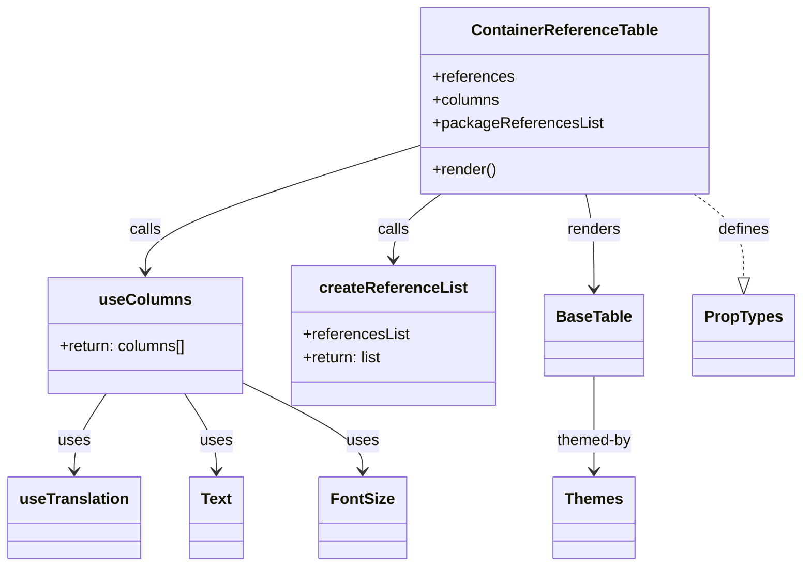

# Diagram: web/portal/src/pages/oceantracking/details/components/organisms/ContainerReferencesTable.organism.js


> Auto-generated by Obscura crawlers

## Diagram 1



### SVG

<svg id="container" width="809.54296875" xmlns="http://www.w3.org/2000/svg" class="classDiagram" height="584" viewBox="0 0 809.54296875 584" role="graphics-document document" aria-roledescription="class"><style>#container{font-family:"trebuchet ms",verdana,arial,sans-serif;font-size:16px;fill:#333;}@keyframes edge-animation-frame{from{stroke-dashoffset:0;}}@keyframes dash{to{stroke-dashoffset:0;}}#container .edge-animation-slow{stroke-dasharray:9,5!important;stroke-dashoffset:900;animation:dash 50s linear infinite;stroke-linecap:round;}#container .edge-animation-fast{stroke-dasharray:9,5!important;stroke-dashoffset:900;animation:dash 20s linear infinite;stroke-linecap:round;}#container .error-icon{fill:#552222;}#container .error-text{fill:#552222;stroke:#552222;}#container .edge-thickness-normal{stroke-width:1px;}#container .edge-thickness-thick{stroke-width:3.5px;}#container .edge-pattern-solid{stroke-dasharray:0;}#container .edge-thickness-invisible{stroke-width:0;fill:none;}#container .edge-pattern-dashed{stroke-dasharray:3;}#container .edge-pattern-dotted{stroke-dasharray:2;}#container .marker{fill:#333333;stroke:#333333;}#container .marker.cross{stroke:#333333;}#container svg{font-family:"trebuchet ms",verdana,arial,sans-serif;font-size:16px;}#container p{margin:0;}#container g.classGroup text{fill:#9370DB;stroke:none;font-family:"trebuchet ms",verdana,arial,sans-serif;font-size:10px;}#container g.classGroup text .title{font-weight:bolder;}#container .nodeLabel,#container .edgeLabel{color:#131300;}#container .edgeLabel .label rect{fill:#ECECFF;}#container .label text{fill:#131300;}#container .labelBkg{background:#ECECFF;}#container .edgeLabel .label span{background:#ECECFF;}#container .classTitle{font-weight:bolder;}#container .node rect,#container .node circle,#container .node ellipse,#container .node polygon,#container .node path{fill:#ECECFF;stroke:#9370DB;stroke-width:1px;}#container .divider{stroke:#9370DB;stroke-width:1;}#container g.clickable{cursor:pointer;}#container g.classGroup rect{fill:#ECECFF;stroke:#9370DB;}#container g.classGroup line{stroke:#9370DB;stroke-width:1;}#container .classLabel .box{stroke:none;stroke-width:0;fill:#ECECFF;opacity:0.5;}#container .classLabel .label{fill:#9370DB;font-size:10px;}#container .relation{stroke:#333333;stroke-width:1;fill:none;}#container .dashed-line{stroke-dasharray:3;}#container .dotted-line{stroke-dasharray:1 2;}#container #compositionStart,#container .composition{fill:#333333!important;stroke:#333333!important;stroke-width:1;}#container #compositionEnd,#container .composition{fill:#333333!important;stroke:#333333!important;stroke-width:1;}#container #dependencyStart,#container .dependency{fill:#333333!important;stroke:#333333!important;stroke-width:1;}#container #dependencyStart,#container .dependency{fill:#333333!important;stroke:#333333!important;stroke-width:1;}#container #extensionStart,#container .extension{fill:transparent!important;stroke:#333333!important;stroke-width:1;}#container #extensionEnd,#container .extension{fill:transparent!important;stroke:#333333!important;stroke-width:1;}#container #aggregationStart,#container .aggregation{fill:transparent!important;stroke:#333333!important;stroke-width:1;}#container #aggregationEnd,#container .aggregation{fill:transparent!important;stroke:#333333!important;stroke-width:1;}#container #lollipopStart,#container .lollipop{fill:#ECECFF!important;stroke:#333333!important;stroke-width:1;}#container #lollipopEnd,#container .lollipop{fill:#ECECFF!important;stroke:#333333!important;stroke-width:1;}#container .edgeTerminals{font-size:11px;line-height:initial;}#container .classTitleText{text-anchor:middle;font-size:18px;fill:#333;}#container .label-icon{display:inline-block;height:1em;overflow:visible;vertical-align:-0.125em;}#container .node .label-icon path{fill:currentColor;stroke:revert;stroke-width:revert;}#container :root{--mermaid-font-family:"trebuchet ms",verdana,arial,sans-serif;}</style><g><defs><marker id="container_class-aggregationStart" class="marker aggregation class" refX="18" refY="7" markerWidth="190" markerHeight="240" orient="auto"><path d="M 18,7 L9,13 L1,7 L9,1 Z"></path></marker></defs><defs><marker id="container_class-aggregationEnd" class="marker aggregation class" refX="1" refY="7" markerWidth="20" markerHeight="28" orient="auto"><path d="M 18,7 L9,13 L1,7 L9,1 Z"></path></marker></defs><defs><marker id="container_class-extensionStart" class="marker extension class" refX="18" refY="7" markerWidth="190" markerHeight="240" orient="auto"><path d="M 1,7 L18,13 V 1 Z"></path></marker></defs><defs><marker id="container_class-extensionEnd" class="marker extension class" refX="1" refY="7" markerWidth="20" markerHeight="28" orient="auto"><path d="M 1,1 V 13 L18,7 Z"></path></marker></defs><defs><marker id="container_class-compositionStart" class="marker composition class" refX="18" refY="7" markerWidth="190" markerHeight="240" orient="auto"><path d="M 18,7 L9,13 L1,7 L9,1 Z"></path></marker></defs><defs><marker id="container_class-compositionEnd" class="marker composition class" refX="1" refY="7" markerWidth="20" markerHeight="28" orient="auto"><path d="M 18,7 L9,13 L1,7 L9,1 Z"></path></marker></defs><defs><marker id="container_class-dependencyStart" class="marker dependency class" refX="6" refY="7" markerWidth="190" markerHeight="240" orient="auto"><path d="M 5,7 L9,13 L1,7 L9,1 Z"></path></marker></defs><defs><marker id="container_class-dependencyEnd" class="marker dependency class" refX="13" refY="7" markerWidth="20" markerHeight="28" orient="auto"><path d="M 18,7 L9,13 L14,7 L9,1 Z"></path></marker></defs><defs><marker id="container_class-lollipopStart" class="marker lollipop class" refX="13" refY="7" markerWidth="190" markerHeight="240" orient="auto"><circle stroke="black" fill="transparent" cx="7" cy="7" r="6"></circle></marker></defs><defs><marker id="container_class-lollipopEnd" class="marker lollipop class" refX="1" refY="7" markerWidth="190" markerHeight="240" orient="auto"><circle stroke="black" fill="transparent" cx="7" cy="7" r="6"></circle></marker></defs><g class="root"><g class="clusters"></g><g class="edgePaths"><path d="M428.188,148.922L381.126,163.602C334.065,178.282,239.943,207.641,192.882,229.487C145.82,251.333,145.82,265.667,145.82,272.833L145.82,280" id="id_ContainerReferenceTable_useColumns_1" class="edge-thickness-normal edge-pattern-solid relation" style=";;;" data-edge="true" data-et="edge" data-id="id_ContainerReferenceTable_useColumns_1" data-points="W3sieCI6NDI4LjE4NzUsInkiOjE0OC45MjIyNTY2MjgyNX0seyJ4IjoxNDUuODIwMzEyNSwieSI6MjM3fSx7IngiOjE0NS44MjAzMTI1LCJ5IjoyODZ9XQ==" marker-end="url(#container_class-dependencyEnd)"></path><path d="M447.379,200L439.361,206.167C431.342,212.333,415.306,224.667,407.288,236C399.27,247.333,399.27,257.667,399.27,262.833L399.27,268" id="id_ContainerReferenceTable_createReferenceList_2" class="edge-thickness-normal edge-pattern-solid relation" style=";;;" data-edge="true" data-et="edge" data-id="id_ContainerReferenceTable_createReferenceList_2" data-points="W3sieCI6NDQ3LjM3ODg3Njg3OTY5OTI1LCJ5IjoyMDB9LHsieCI6Mzk5LjI2OTUzMTI1LCJ5IjoyMzd9LHsieCI6Mzk5LjI2OTUzMTI1LCJ5IjoyNzR9XQ==" marker-end="url(#container_class-dependencyEnd)"></path><path d="M593.471,200L594.837,206.167C596.203,212.333,598.936,224.667,600.302,241C601.668,257.333,601.668,277.667,601.668,287.833L601.668,298" id="id_ContainerReferenceTable_BaseTable_3" class="edge-thickness-normal edge-pattern-solid relation" style=";;;" data-edge="true" data-et="edge" data-id="id_ContainerReferenceTable_BaseTable_3" data-points="W3sieCI6NTkzLjQ3MDk4MjE0Mjg1NzEsInkiOjIwMH0seyJ4Ijo2MDEuNjY3OTY4NzUsInkiOjIzN30seyJ4Ijo2MDEuNjY3OTY4NzUsInkiOjMwNH1d" marker-end="url(#container_class-dependencyEnd)"></path><path d="M106.334,406L100.959,414.167C95.584,422.333,84.835,438.667,79.461,452C74.086,465.333,74.086,475.667,74.086,480.833L74.086,486" id="id_useColumns_useTranslation_4" class="edge-thickness-normal edge-pattern-solid relation" style=";;;" data-edge="true" data-et="edge" data-id="id_useColumns_useTranslation_4" data-points="W3sieCI6MTA2LjMzMzUwMDU3MzM5NDUsInkiOjQwNn0seyJ4Ijo3NC4wODU5Mzc1LCJ5Ijo0NTV9LHsieCI6NzQuMDg1OTM3NSwieSI6NDkyfV0=" marker-end="url(#container_class-dependencyEnd)"></path><path d="M185.307,406L190.682,414.167C196.056,422.333,206.805,438.667,212.18,452C217.555,465.333,217.555,475.667,217.555,480.833L217.555,486" id="id_useColumns_Text_5" class="edge-thickness-normal edge-pattern-solid relation" style=";;;" data-edge="true" data-et="edge" data-id="id_useColumns_Text_5" data-points="W3sieCI6MTg1LjMwNzEyNDQyNjYwNTUsInkiOjQwNn0seyJ4IjoyMTcuNTU0Njg3NSwieSI6NDU1fSx7IngiOjIxNy41NTQ2ODc1LCJ5Ijo0OTJ9XQ==" marker-end="url(#container_class-dependencyEnd)"></path><path d="M246.23,395.431L266.398,405.359C286.566,415.287,326.901,435.144,347.069,450.238C367.236,465.333,367.236,475.667,367.236,480.833L367.236,486" id="id_useColumns_FontSize_6" class="edge-thickness-normal edge-pattern-solid relation" style=";;;" data-edge="true" data-et="edge" data-id="id_useColumns_FontSize_6" data-points="W3sieCI6MjQ2LjIzMDQ2ODc1LCJ5IjozOTUuNDMwNTEyMDYyODA2fSx7IngiOjM2Ny4yMzYzMjgxMjUsInkiOjQ1NX0seyJ4IjozNjcuMjM2MzI4MTI1LCJ5Ijo0OTJ9XQ==" marker-end="url(#container_class-dependencyEnd)"></path><path d="M701.465,200L709.769,206.167C718.072,212.333,734.679,224.667,742.982,239.125C751.285,253.583,751.285,270.167,751.285,278.458L751.285,286.75" id="id_ContainerReferenceTable_PropTypes_7" class="edge-thickness-normal edge-pattern-dashed relation" style=";;;" data-edge="true" data-et="edge" data-id="id_ContainerReferenceTable_PropTypes_7" data-points="W3sieCI6NzAxLjQ2NTM0MzA0NTExMjgsInkiOjIwMH0seyJ4Ijo3NTEuMjg1MTU2MjUsInkiOjIzN30seyJ4Ijo3NTEuMjg1MTU2MjUsInkiOjMwNH1d" marker-end="url(#container_class-extensionEnd)"></path><path d="M601.668,388L601.668,399.167C601.668,410.333,601.668,432.667,601.668,449C601.668,465.333,601.668,475.667,601.668,480.833L601.668,486" id="id_BaseTable_Themes_8" class="edge-thickness-normal edge-pattern-solid relation" style=";;;" data-edge="true" data-et="edge" data-id="id_BaseTable_Themes_8" data-points="W3sieCI6NjAxLjY2Nzk2ODc1LCJ5IjozODh9LHsieCI6NjAxLjY2Nzk2ODc1LCJ5Ijo0NTV9LHsieCI6NjAxLjY2Nzk2ODc1LCJ5Ijo0OTJ9XQ==" marker-end="url(#container_class-dependencyEnd)"></path></g><g class="edgeLabels"><g class="edgeLabel" transform="translate(145.8203125, 237)"><g class="label" data-id="id_ContainerReferenceTable_useColumns_1" transform="translate(-16.4453125, -12)"><foreignObject width="32.890625" height="24"><div xmlns="http://www.w3.org/1999/xhtml" class="labelBkg" style="display: table-cell; white-space: nowrap; line-height: 1.5; max-width: 200px; text-align: center;"><span class="edgeLabel"><p>calls</p></span></div></foreignObject></g></g><g class="edgeLabel" transform="translate(399.26953125, 237)"><g class="label" data-id="id_ContainerReferenceTable_createReferenceList_2" transform="translate(-16.4453125, -12)"><foreignObject width="32.890625" height="24"><div xmlns="http://www.w3.org/1999/xhtml" class="labelBkg" style="display: table-cell; white-space: nowrap; line-height: 1.5; max-width: 200px; text-align: center;"><span class="edgeLabel"><p>calls</p></span></div></foreignObject></g></g><g class="edgeLabel" transform="translate(601.66796875, 237)"><g class="label" data-id="id_ContainerReferenceTable_BaseTable_3" transform="translate(-27.75, -12)"><foreignObject width="55.5" height="24"><div xmlns="http://www.w3.org/1999/xhtml" class="labelBkg" style="display: table-cell; white-space: nowrap; line-height: 1.5; max-width: 200px; text-align: center;"><span class="edgeLabel"><p>renders</p></span></div></foreignObject></g></g><g class="edgeLabel" transform="translate(74.0859375, 455)"><g class="label" data-id="id_useColumns_useTranslation_4" transform="translate(-16.4921875, -12)"><foreignObject width="32.984375" height="24"><div xmlns="http://www.w3.org/1999/xhtml" class="labelBkg" style="display: table-cell; white-space: nowrap; line-height: 1.5; max-width: 200px; text-align: center;"><span class="edgeLabel"><p>uses</p></span></div></foreignObject></g></g><g class="edgeLabel" transform="translate(217.5546875, 455)"><g class="label" data-id="id_useColumns_Text_5" transform="translate(-16.4921875, -12)"><foreignObject width="32.984375" height="24"><div xmlns="http://www.w3.org/1999/xhtml" class="labelBkg" style="display: table-cell; white-space: nowrap; line-height: 1.5; max-width: 200px; text-align: center;"><span class="edgeLabel"><p>uses</p></span></div></foreignObject></g></g><g class="edgeLabel" transform="translate(367.236328125, 455)"><g class="label" data-id="id_useColumns_FontSize_6" transform="translate(-16.4921875, -12)"><foreignObject width="32.984375" height="24"><div xmlns="http://www.w3.org/1999/xhtml" class="labelBkg" style="display: table-cell; white-space: nowrap; line-height: 1.5; max-width: 200px; text-align: center;"><span class="edgeLabel"><p>uses</p></span></div></foreignObject></g></g><g class="edgeLabel" transform="translate(751.28515625, 237)"><g class="label" data-id="id_ContainerReferenceTable_PropTypes_7" transform="translate(-26.53125, -12)"><foreignObject width="53.0625" height="24"><div xmlns="http://www.w3.org/1999/xhtml" class="labelBkg" style="display: table-cell; white-space: nowrap; line-height: 1.5; max-width: 200px; text-align: center;"><span class="edgeLabel"><p>defines</p></span></div></foreignObject></g></g><g class="edgeLabel" transform="translate(601.66796875, 455)"><g class="label" data-id="id_BaseTable_Themes_8" transform="translate(-39.8203125, -12)"><foreignObject width="79.640625" height="24"><div xmlns="http://www.w3.org/1999/xhtml" class="labelBkg" style="display: table-cell; white-space: nowrap; line-height: 1.5; max-width: 200px; text-align: center;"><span class="edgeLabel"><p>themed-by</p></span></div></foreignObject></g></g></g><g class="nodes"><g class="node default" id="classId-ContainerReferenceTable-0" transform="translate(572.203125, 104)"><g class="basic label-container"><path d="M-144.015625 -96 L144.015625 -96 L144.015625 96 L-144.015625 96" stroke="none" stroke-width="0" fill="#ECECFF" style=""></path><path d="M-144.015625 -96 C-67.8398549373436 -96, 8.335915125312795 -96, 144.015625 -96 M-144.015625 -96 C-32.680539750688425 -96, 78.65454549862315 -96, 144.015625 -96 M144.015625 -96 C144.015625 -39.11236991474659, 144.015625 17.775260170506826, 144.015625 96 M144.015625 -96 C144.015625 -57.41848864875851, 144.015625 -18.836977297517024, 144.015625 96 M144.015625 96 C74.82157896713211 96, 5.627532934264224 96, -144.015625 96 M144.015625 96 C38.049914930190965 96, -67.91579513961807 96, -144.015625 96 M-144.015625 96 C-144.015625 24.071760879696058, -144.015625 -47.856478240607885, -144.015625 -96 M-144.015625 96 C-144.015625 24.676562483385553, -144.015625 -46.646875033228895, -144.015625 -96" stroke="#9370DB" stroke-width="1.3" fill="none" stroke-dasharray="0 0" style=""></path></g><g class="annotation-group text" transform="translate(0, -72)"></g><g class="label-group text" transform="translate(-91.9375, -72)"><g class="label" style="font-weight: bolder" transform="translate(0,-12)"><foreignObject width="183.875" height="24"><div xmlns="http://www.w3.org/1999/xhtml" style="display: table-cell; white-space: nowrap; line-height: 1.5; max-width: 231px; text-align: center;"><span class="nodeLabel markdown-node-label" style=""><p>ContainerReferenceTable</p></span></div></foreignObject></g></g><g class="members-group text" transform="translate(-132.015625, -24)"><g class="label" style="" transform="translate(0,-12)"><foreignObject width="83.640625" height="24"><div xmlns="http://www.w3.org/1999/xhtml" style="display: table-cell; white-space: nowrap; line-height: 1.5; max-width: 141px; text-align: center;"><span class="nodeLabel markdown-node-label" style=""><p>+references</p></span></div></foreignObject></g><g class="label" style="" transform="translate(0,12)"><foreignObject width="69.21875" height="24"><div xmlns="http://www.w3.org/1999/xhtml" style="display: table-cell; white-space: nowrap; line-height: 1.5; max-width: 127px; text-align: center;"><span class="nodeLabel markdown-node-label" style=""><p>+columns</p></span></div></foreignObject></g><g class="label" style="" transform="translate(0,36)"><foreignObject width="172.09375" height="24"><div xmlns="http://www.w3.org/1999/xhtml" style="display: table-cell; white-space: nowrap; line-height: 1.5; max-width: 230px; text-align: center;"><span class="nodeLabel markdown-node-label" style=""><p>+packageReferencesList</p></span></div></foreignObject></g></g><g class="methods-group text" transform="translate(-132.015625, 72)"><g class="label" style="" transform="translate(0,-12)"><foreignObject width="66.609375" height="24"><div xmlns="http://www.w3.org/1999/xhtml" style="display: table-cell; white-space: nowrap; line-height: 1.5; max-width: 124px; text-align: center;"><span class="nodeLabel markdown-node-label" style=""><p>+render()</p></span></div></foreignObject></g></g><g class="divider" style=""><path d="M-144.015625 -48 C-41.893492387566624 -48, 60.22864022486675 -48, 144.015625 -48 M-144.015625 -48 C-40.430053706972714 -48, 63.15551758605457 -48, 144.015625 -48" stroke="#9370DB" stroke-width="1.3" fill="none" stroke-dasharray="0 0" style=""></path></g><g class="divider" style=""><path d="M-144.015625 48 C-80.17698907653828 48, -16.338353153076554 48, 144.015625 48 M-144.015625 48 C-34.70539517373324 48, 74.60483465253353 48, 144.015625 48" stroke="#9370DB" stroke-width="1.3" fill="none" stroke-dasharray="0 0" style=""></path></g></g><g class="node default" id="classId-useColumns-1" transform="translate(145.8203125, 346)"><g class="basic label-container"><path d="M-100.41015625 -60 L100.41015625 -60 L100.41015625 60 L-100.41015625 60" stroke="none" stroke-width="0" fill="#ECECFF" style=""></path><path d="M-100.41015625 -60 C-26.09165886447137 -60, 48.22683852105726 -60, 100.41015625 -60 M-100.41015625 -60 C-53.01441142455474 -60, -5.618666599109474 -60, 100.41015625 -60 M100.41015625 -60 C100.41015625 -16.522673855802914, 100.41015625 26.954652288394172, 100.41015625 60 M100.41015625 -60 C100.41015625 -24.84561040688652, 100.41015625 10.308779186226957, 100.41015625 60 M100.41015625 60 C38.39392748327399 60, -23.622301283452018 60, -100.41015625 60 M100.41015625 60 C50.438623952378556 60, 0.46709165475711245 60, -100.41015625 60 M-100.41015625 60 C-100.41015625 21.34830409561527, -100.41015625 -17.30339180876946, -100.41015625 -60 M-100.41015625 60 C-100.41015625 29.12765768592368, -100.41015625 -1.7446846281526405, -100.41015625 -60" stroke="#9370DB" stroke-width="1.3" fill="none" stroke-dasharray="0 0" style=""></path></g><g class="annotation-group text" transform="translate(0, -36)"></g><g class="label-group text" transform="translate(-44.1640625, -36)"><g class="label" style="font-weight: bolder" transform="translate(0,-12)"><foreignObject width="88.328125" height="24"><div xmlns="http://www.w3.org/1999/xhtml" style="display: table-cell; white-space: nowrap; line-height: 1.5; max-width: 138px; text-align: center;"><span class="nodeLabel markdown-node-label" style=""><p>useColumns</p></span></div></foreignObject></g></g><g class="members-group text" transform="translate(-88.41015625, 12)"><g class="label" style="" transform="translate(0,-12)"><foreignObject width="132.65625" height="24"><div xmlns="http://www.w3.org/1999/xhtml" style="display: table-cell; white-space: nowrap; line-height: 1.5; max-width: 190px; text-align: center;"><span class="nodeLabel markdown-node-label" style=""><p>+return: columns[]</p></span></div></foreignObject></g></g><g class="methods-group text" transform="translate(-88.41015625, 60)"></g><g class="divider" style=""><path d="M-100.41015625 -12 C-32.76947868085368 -12, 34.87119888829264 -12, 100.41015625 -12 M-100.41015625 -12 C-38.25617961588735 -12, 23.897797018225305 -12, 100.41015625 -12" stroke="#9370DB" stroke-width="1.3" fill="none" stroke-dasharray="0 0" style=""></path></g><g class="divider" style=""><path d="M-100.41015625 36 C-57.04884927576208 36, -13.68754230152416 36, 100.41015625 36 M-100.41015625 36 C-33.79563852918179 36, 32.81887919163643 36, 100.41015625 36" stroke="#9370DB" stroke-width="1.3" fill="none" stroke-dasharray="0 0" style=""></path></g></g><g class="node default" id="classId-createReferenceList-2" transform="translate(399.26953125, 346)"><g class="basic label-container"><path d="M-103.0390625 -72 L103.0390625 -72 L103.0390625 72 L-103.0390625 72" stroke="none" stroke-width="0" fill="#ECECFF" style=""></path><path d="M-103.0390625 -72 C-46.68971107259312 -72, 9.65964035481376 -72, 103.0390625 -72 M-103.0390625 -72 C-46.95125149669773 -72, 9.136559506604542 -72, 103.0390625 -72 M103.0390625 -72 C103.0390625 -24.347740322527102, 103.0390625 23.304519354945796, 103.0390625 72 M103.0390625 -72 C103.0390625 -32.246144892110166, 103.0390625 7.507710215779667, 103.0390625 72 M103.0390625 72 C46.530860138523536 72, -9.977342222952927 72, -103.0390625 72 M103.0390625 72 C40.46197154140575 72, -22.115119417188495 72, -103.0390625 72 M-103.0390625 72 C-103.0390625 29.95275667990545, -103.0390625 -12.094486640189103, -103.0390625 -72 M-103.0390625 72 C-103.0390625 17.262247764019897, -103.0390625 -37.47550447196021, -103.0390625 -72" stroke="#9370DB" stroke-width="1.3" fill="none" stroke-dasharray="0 0" style=""></path></g><g class="annotation-group text" transform="translate(0, -48)"></g><g class="label-group text" transform="translate(-72.703125, -48)"><g class="label" style="font-weight: bolder" transform="translate(0,-12)"><foreignObject width="145.40625" height="24"><div xmlns="http://www.w3.org/1999/xhtml" style="display: table-cell; white-space: nowrap; line-height: 1.5; max-width: 193px; text-align: center;"><span class="nodeLabel markdown-node-label" style=""><p>createReferenceList</p></span></div></foreignObject></g></g><g class="members-group text" transform="translate(-91.0390625, 0)"><g class="label" style="" transform="translate(0,-12)"><foreignObject width="109.375" height="24"><div xmlns="http://www.w3.org/1999/xhtml" style="display: table-cell; white-space: nowrap; line-height: 1.5; max-width: 167px; text-align: center;"><span class="nodeLabel markdown-node-label" style=""><p>+referencesList</p></span></div></foreignObject></g><g class="label" style="" transform="translate(0,12)"><foreignObject width="83.578125" height="24"><div xmlns="http://www.w3.org/1999/xhtml" style="display: table-cell; white-space: nowrap; line-height: 1.5; max-width: 141px; text-align: center;"><span class="nodeLabel markdown-node-label" style=""><p>+return: list</p></span></div></foreignObject></g></g><g class="methods-group text" transform="translate(-91.0390625, 72)"></g><g class="divider" style=""><path d="M-103.0390625 -24 C-28.12964034414462 -24, 46.77978181171076 -24, 103.0390625 -24 M-103.0390625 -24 C-32.808423210820834 -24, 37.42221607835833 -24, 103.0390625 -24" stroke="#9370DB" stroke-width="1.3" fill="none" stroke-dasharray="0 0" style=""></path></g><g class="divider" style=""><path d="M-103.0390625 48 C-54.31694729603938 48, -5.594832092078761 48, 103.0390625 48 M-103.0390625 48 C-34.00443336562434 48, 35.03019576875133 48, 103.0390625 48" stroke="#9370DB" stroke-width="1.3" fill="none" stroke-dasharray="0 0" style=""></path></g></g><g class="node default" id="classId-BaseTable-3" transform="translate(601.66796875, 346)"><g class="basic label-container"><path d="M-49.359375 -42 L49.359375 -42 L49.359375 42 L-49.359375 42" stroke="none" stroke-width="0" fill="#ECECFF" style=""></path><path d="M-49.359375 -42 C-21.83899800074862 -42, 5.681378998502758 -42, 49.359375 -42 M-49.359375 -42 C-19.032367572767765 -42, 11.29463985446447 -42, 49.359375 -42 M49.359375 -42 C49.359375 -21.618847399305157, 49.359375 -1.2376947986103133, 49.359375 42 M49.359375 -42 C49.359375 -21.289199551205346, 49.359375 -0.5783991024106925, 49.359375 42 M49.359375 42 C10.80777301143928 42, -27.74382897712144 42, -49.359375 42 M49.359375 42 C15.442829566184663 42, -18.473715867630673 42, -49.359375 42 M-49.359375 42 C-49.359375 9.960369832689011, -49.359375 -22.079260334621978, -49.359375 -42 M-49.359375 42 C-49.359375 22.971110323019225, -49.359375 3.94222064603845, -49.359375 -42" stroke="#9370DB" stroke-width="1.3" fill="none" stroke-dasharray="0 0" style=""></path></g><g class="annotation-group text" transform="translate(0, -18)"></g><g class="label-group text" transform="translate(-37.359375, -18)"><g class="label" style="font-weight: bolder" transform="translate(0,-12)"><foreignObject width="74.71875" height="24"><div xmlns="http://www.w3.org/1999/xhtml" style="display: table-cell; white-space: nowrap; line-height: 1.5; max-width: 123px; text-align: center;"><span class="nodeLabel markdown-node-label" style=""><p>BaseTable</p></span></div></foreignObject></g></g><g class="members-group text" transform="translate(-37.359375, 30)"></g><g class="methods-group text" transform="translate(-37.359375, 60)"></g><g class="divider" style=""><path d="M-49.359375 6 C-12.927443264119916 6, 23.50448847176017 6, 49.359375 6 M-49.359375 6 C-27.04592053008328 6, -4.7324660601665585 6, 49.359375 6" stroke="#9370DB" stroke-width="1.3" fill="none" stroke-dasharray="0 0" style=""></path></g><g class="divider" style=""><path d="M-49.359375 24 C-29.028789374221695 24, -8.69820374844339 24, 49.359375 24 M-49.359375 24 C-23.48702784395944 24, 2.3853193120811227 24, 49.359375 24" stroke="#9370DB" stroke-width="1.3" fill="none" stroke-dasharray="0 0" style=""></path></g></g><g class="node default" id="classId-Text-4" transform="translate(217.5546875, 534)"><g class="basic label-container"><path d="M-27.3828125 -42 L27.3828125 -42 L27.3828125 42 L-27.3828125 42" stroke="none" stroke-width="0" fill="#ECECFF" style=""></path><path d="M-27.3828125 -42 C-6.354363908428269 -42, 14.674084683143462 -42, 27.3828125 -42 M-27.3828125 -42 C-12.922847995949963 -42, 1.5371165081000733 -42, 27.3828125 -42 M27.3828125 -42 C27.3828125 -18.31379753832754, 27.3828125 5.3724049233449165, 27.3828125 42 M27.3828125 -42 C27.3828125 -23.38112680407505, 27.3828125 -4.762253608150097, 27.3828125 42 M27.3828125 42 C7.767146839366898 42, -11.848518821266204 42, -27.3828125 42 M27.3828125 42 C16.31986757853349 42, 5.25692265706698 42, -27.3828125 42 M-27.3828125 42 C-27.3828125 12.359929376877552, -27.3828125 -17.280141246244895, -27.3828125 -42 M-27.3828125 42 C-27.3828125 20.994231276752018, -27.3828125 -0.011537446495964332, -27.3828125 -42" stroke="#9370DB" stroke-width="1.3" fill="none" stroke-dasharray="0 0" style=""></path></g><g class="annotation-group text" transform="translate(0, -18)"></g><g class="label-group text" transform="translate(-15.3828125, -18)"><g class="label" style="font-weight: bolder" transform="translate(0,-12)"><foreignObject width="30.765625" height="24"><div xmlns="http://www.w3.org/1999/xhtml" style="display: table-cell; white-space: nowrap; line-height: 1.5; max-width: 80px; text-align: center;"><span class="nodeLabel markdown-node-label" style=""><p>Text</p></span></div></foreignObject></g></g><g class="members-group text" transform="translate(-15.3828125, 30)"></g><g class="methods-group text" transform="translate(-15.3828125, 60)"></g><g class="divider" style=""><path d="M-27.3828125 6 C-15.105209074592691 6, -2.827605649185383 6, 27.3828125 6 M-27.3828125 6 C-10.149699637975317 6, 7.083413224049366 6, 27.3828125 6" stroke="#9370DB" stroke-width="1.3" fill="none" stroke-dasharray="0 0" style=""></path></g><g class="divider" style=""><path d="M-27.3828125 24 C-6.845503977522746 24, 13.691804544954508 24, 27.3828125 24 M-27.3828125 24 C-15.7936529942519 24, -4.2044934885038 24, 27.3828125 24" stroke="#9370DB" stroke-width="1.3" fill="none" stroke-dasharray="0 0" style=""></path></g></g><g class="node default" id="classId-FontSize-5" transform="translate(367.236328125, 534)"><g class="basic label-container"><path d="M-42.84375 -42 L42.84375 -42 L42.84375 42 L-42.84375 42" stroke="none" stroke-width="0" fill="#ECECFF" style=""></path><path d="M-42.84375 -42 C-21.948369654328896 -42, -1.0529893086577928 -42, 42.84375 -42 M-42.84375 -42 C-20.420324491771304 -42, 2.003101016457393 -42, 42.84375 -42 M42.84375 -42 C42.84375 -13.855530594262099, 42.84375 14.288938811475802, 42.84375 42 M42.84375 -42 C42.84375 -14.492172372440535, 42.84375 13.01565525511893, 42.84375 42 M42.84375 42 C15.407365215947856 42, -12.029019568104289 42, -42.84375 42 M42.84375 42 C10.8346792815762 42, -21.1743914368476 42, -42.84375 42 M-42.84375 42 C-42.84375 10.10188068155092, -42.84375 -21.79623863689816, -42.84375 -42 M-42.84375 42 C-42.84375 22.142000134381703, -42.84375 2.284000268763407, -42.84375 -42" stroke="#9370DB" stroke-width="1.3" fill="none" stroke-dasharray="0 0" style=""></path></g><g class="annotation-group text" transform="translate(0, -18)"></g><g class="label-group text" transform="translate(-30.84375, -18)"><g class="label" style="font-weight: bolder" transform="translate(0,-12)"><foreignObject width="61.6875" height="24"><div xmlns="http://www.w3.org/1999/xhtml" style="display: table-cell; white-space: nowrap; line-height: 1.5; max-width: 111px; text-align: center;"><span class="nodeLabel markdown-node-label" style=""><p>FontSize</p></span></div></foreignObject></g></g><g class="members-group text" transform="translate(-30.84375, 30)"></g><g class="methods-group text" transform="translate(-30.84375, 60)"></g><g class="divider" style=""><path d="M-42.84375 6 C-19.061934013812273 6, 4.719881972375454 6, 42.84375 6 M-42.84375 6 C-19.391733192410822 6, 4.060283615178356 6, 42.84375 6" stroke="#9370DB" stroke-width="1.3" fill="none" stroke-dasharray="0 0" style=""></path></g><g class="divider" style=""><path d="M-42.84375 24 C-24.638348844933315 24, -6.43294768986663 24, 42.84375 24 M-42.84375 24 C-16.09742016043104 24, 10.648909679137923 24, 42.84375 24" stroke="#9370DB" stroke-width="1.3" fill="none" stroke-dasharray="0 0" style=""></path></g></g><g class="node default" id="classId-useTranslation-6" transform="translate(74.0859375, 534)"><g class="basic label-container"><path d="M-66.0859375 -42 L66.0859375 -42 L66.0859375 42 L-66.0859375 42" stroke="none" stroke-width="0" fill="#ECECFF" style=""></path><path d="M-66.0859375 -42 C-35.112271834889185 -42, -4.138606169778363 -42, 66.0859375 -42 M-66.0859375 -42 C-24.02162749702363 -42, 18.04268250595274 -42, 66.0859375 -42 M66.0859375 -42 C66.0859375 -15.480219285497611, 66.0859375 11.039561429004777, 66.0859375 42 M66.0859375 -42 C66.0859375 -15.878042321853446, 66.0859375 10.243915356293108, 66.0859375 42 M66.0859375 42 C34.21104711262967 42, 2.3361567252593503 42, -66.0859375 42 M66.0859375 42 C31.28509967515837 42, -3.5157381496832585 42, -66.0859375 42 M-66.0859375 42 C-66.0859375 24.529538974186263, -66.0859375 7.059077948372526, -66.0859375 -42 M-66.0859375 42 C-66.0859375 23.99007992827796, -66.0859375 5.980159856555922, -66.0859375 -42" stroke="#9370DB" stroke-width="1.3" fill="none" stroke-dasharray="0 0" style=""></path></g><g class="annotation-group text" transform="translate(0, -18)"></g><g class="label-group text" transform="translate(-54.0859375, -18)"><g class="label" style="font-weight: bolder" transform="translate(0,-12)"><foreignObject width="108.171875" height="24"><div xmlns="http://www.w3.org/1999/xhtml" style="display: table-cell; white-space: nowrap; line-height: 1.5; max-width: 157px; text-align: center;"><span class="nodeLabel markdown-node-label" style=""><p>useTranslation</p></span></div></foreignObject></g></g><g class="members-group text" transform="translate(-54.0859375, 30)"></g><g class="methods-group text" transform="translate(-54.0859375, 60)"></g><g class="divider" style=""><path d="M-66.0859375 6 C-33.348466750881975 6, -0.6109960017639509 6, 66.0859375 6 M-66.0859375 6 C-34.1949256823143 6, -2.3039138646285977 6, 66.0859375 6" stroke="#9370DB" stroke-width="1.3" fill="none" stroke-dasharray="0 0" style=""></path></g><g class="divider" style=""><path d="M-66.0859375 24 C-30.56998491567461 24, 4.9459676686507805 24, 66.0859375 24 M-66.0859375 24 C-23.266810955954256 24, 19.55231558809149 24, 66.0859375 24" stroke="#9370DB" stroke-width="1.3" fill="none" stroke-dasharray="0 0" style=""></path></g></g><g class="node default" id="classId-Themes-7" transform="translate(601.66796875, 534)"><g class="basic label-container"><path d="M-40.3984375 -42 L40.3984375 -42 L40.3984375 42 L-40.3984375 42" stroke="none" stroke-width="0" fill="#ECECFF" style=""></path><path d="M-40.3984375 -42 C-11.204228715441786 -42, 17.989980069116427 -42, 40.3984375 -42 M-40.3984375 -42 C-21.795271822306308 -42, -3.192106144612616 -42, 40.3984375 -42 M40.3984375 -42 C40.3984375 -12.622230438833174, 40.3984375 16.75553912233365, 40.3984375 42 M40.3984375 -42 C40.3984375 -14.471222037320114, 40.3984375 13.057555925359772, 40.3984375 42 M40.3984375 42 C10.300441131305046 42, -19.797555237389908 42, -40.3984375 42 M40.3984375 42 C12.949823975560868 42, -14.498789548878264 42, -40.3984375 42 M-40.3984375 42 C-40.3984375 9.7606323719763, -40.3984375 -22.4787352560474, -40.3984375 -42 M-40.3984375 42 C-40.3984375 16.0989611966361, -40.3984375 -9.8020776067278, -40.3984375 -42" stroke="#9370DB" stroke-width="1.3" fill="none" stroke-dasharray="0 0" style=""></path></g><g class="annotation-group text" transform="translate(0, -18)"></g><g class="label-group text" transform="translate(-28.3984375, -18)"><g class="label" style="font-weight: bolder" transform="translate(0,-12)"><foreignObject width="56.796875" height="24"><div xmlns="http://www.w3.org/1999/xhtml" style="display: table-cell; white-space: nowrap; line-height: 1.5; max-width: 106px; text-align: center;"><span class="nodeLabel markdown-node-label" style=""><p>Themes</p></span></div></foreignObject></g></g><g class="members-group text" transform="translate(-28.3984375, 30)"></g><g class="methods-group text" transform="translate(-28.3984375, 60)"></g><g class="divider" style=""><path d="M-40.3984375 6 C-23.786423625408915 6, -7.17440975081783 6, 40.3984375 6 M-40.3984375 6 C-8.135341648089927 6, 24.127754203820146 6, 40.3984375 6" stroke="#9370DB" stroke-width="1.3" fill="none" stroke-dasharray="0 0" style=""></path></g><g class="divider" style=""><path d="M-40.3984375 24 C-13.893226093296974 24, 12.611985313406052 24, 40.3984375 24 M-40.3984375 24 C-14.185856221740217 24, 12.026725056519567 24, 40.3984375 24" stroke="#9370DB" stroke-width="1.3" fill="none" stroke-dasharray="0 0" style=""></path></g></g><g class="node default" id="classId-PropTypes-8" transform="translate(751.28515625, 346)"><g class="basic label-container"><path d="M-50.2578125 -42 L50.2578125 -42 L50.2578125 42 L-50.2578125 42" stroke="none" stroke-width="0" fill="#ECECFF" style=""></path><path d="M-50.2578125 -42 C-21.83337612879414 -42, 6.5910602424117215 -42, 50.2578125 -42 M-50.2578125 -42 C-10.363632425873185 -42, 29.53054764825363 -42, 50.2578125 -42 M50.2578125 -42 C50.2578125 -19.18104857862808, 50.2578125 3.6379028427438413, 50.2578125 42 M50.2578125 -42 C50.2578125 -14.278971603824843, 50.2578125 13.442056792350314, 50.2578125 42 M50.2578125 42 C28.412850835434543 42, 6.567889170869087 42, -50.2578125 42 M50.2578125 42 C22.496913923312558 42, -5.263984653374884 42, -50.2578125 42 M-50.2578125 42 C-50.2578125 17.186535195370798, -50.2578125 -7.626929609258404, -50.2578125 -42 M-50.2578125 42 C-50.2578125 12.81894677315844, -50.2578125 -16.36210645368312, -50.2578125 -42" stroke="#9370DB" stroke-width="1.3" fill="none" stroke-dasharray="0 0" style=""></path></g><g class="annotation-group text" transform="translate(0, -18)"></g><g class="label-group text" transform="translate(-38.2578125, -18)"><g class="label" style="font-weight: bolder" transform="translate(0,-12)"><foreignObject width="76.515625" height="24"><div xmlns="http://www.w3.org/1999/xhtml" style="display: table-cell; white-space: nowrap; line-height: 1.5; max-width: 125px; text-align: center;"><span class="nodeLabel markdown-node-label" style=""><p>PropTypes</p></span></div></foreignObject></g></g><g class="members-group text" transform="translate(-38.2578125, 30)"></g><g class="methods-group text" transform="translate(-38.2578125, 60)"></g><g class="divider" style=""><path d="M-50.2578125 6 C-26.0671800663247 6, -1.8765476326493982 6, 50.2578125 6 M-50.2578125 6 C-21.873750793710126 6, 6.510310912579747 6, 50.2578125 6" stroke="#9370DB" stroke-width="1.3" fill="none" stroke-dasharray="0 0" style=""></path></g><g class="divider" style=""><path d="M-50.2578125 24 C-15.54191019550337 24, 19.17399210899326 24, 50.2578125 24 M-50.2578125 24 C-15.334689025274145 24, 19.58843444945171 24, 50.2578125 24" stroke="#9370DB" stroke-width="1.3" fill="none" stroke-dasharray="0 0" style=""></path></g></g></g></g></g></svg>

## Diagram 2

```mermaid
flowchart LR
A[references (prop)] --> B[createReferenceList(references)]
B --> C[packageReferencesList]
C --> D[ContainerReferenceTable]
D --> E[useColumns() -> columns]
E --> F[BaseTable props: data, columns, theme, disablePagination]
C --> F
F --> G[Rendered Table UI]
```

> SVG rendering failed for this diagram.
