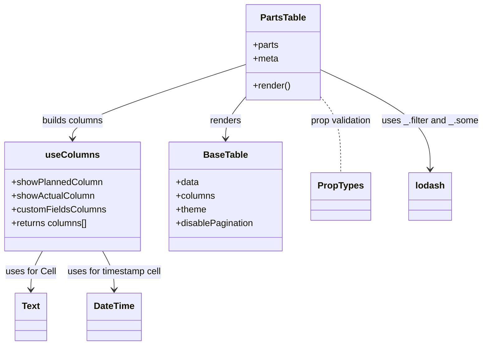

# Diagram: web/portal/src/pages/oceantracking/details/components/organisms/PartsTable.organism.js


> Auto-generated by Obscura crawlers

## Diagram 1



### SVG

<svg id="container" width="847.9296875" xmlns="http://www.w3.org/2000/svg" class="classDiagram" height="608" viewBox="0 0 847.9296875 608" role="graphics-document document" aria-roledescription="class"><style>#container{font-family:"trebuchet ms",verdana,arial,sans-serif;font-size:16px;fill:#333;}@keyframes edge-animation-frame{from{stroke-dashoffset:0;}}@keyframes dash{to{stroke-dashoffset:0;}}#container .edge-animation-slow{stroke-dasharray:9,5!important;stroke-dashoffset:900;animation:dash 50s linear infinite;stroke-linecap:round;}#container .edge-animation-fast{stroke-dasharray:9,5!important;stroke-dashoffset:900;animation:dash 20s linear infinite;stroke-linecap:round;}#container .error-icon{fill:#552222;}#container .error-text{fill:#552222;stroke:#552222;}#container .edge-thickness-normal{stroke-width:1px;}#container .edge-thickness-thick{stroke-width:3.5px;}#container .edge-pattern-solid{stroke-dasharray:0;}#container .edge-thickness-invisible{stroke-width:0;fill:none;}#container .edge-pattern-dashed{stroke-dasharray:3;}#container .edge-pattern-dotted{stroke-dasharray:2;}#container .marker{fill:#333333;stroke:#333333;}#container .marker.cross{stroke:#333333;}#container svg{font-family:"trebuchet ms",verdana,arial,sans-serif;font-size:16px;}#container p{margin:0;}#container g.classGroup text{fill:#9370DB;stroke:none;font-family:"trebuchet ms",verdana,arial,sans-serif;font-size:10px;}#container g.classGroup text .title{font-weight:bolder;}#container .nodeLabel,#container .edgeLabel{color:#131300;}#container .edgeLabel .label rect{fill:#ECECFF;}#container .label text{fill:#131300;}#container .labelBkg{background:#ECECFF;}#container .edgeLabel .label span{background:#ECECFF;}#container .classTitle{font-weight:bolder;}#container .node rect,#container .node circle,#container .node ellipse,#container .node polygon,#container .node path{fill:#ECECFF;stroke:#9370DB;stroke-width:1px;}#container .divider{stroke:#9370DB;stroke-width:1;}#container g.clickable{cursor:pointer;}#container g.classGroup rect{fill:#ECECFF;stroke:#9370DB;}#container g.classGroup line{stroke:#9370DB;stroke-width:1;}#container .classLabel .box{stroke:none;stroke-width:0;fill:#ECECFF;opacity:0.5;}#container .classLabel .label{fill:#9370DB;font-size:10px;}#container .relation{stroke:#333333;stroke-width:1;fill:none;}#container .dashed-line{stroke-dasharray:3;}#container .dotted-line{stroke-dasharray:1 2;}#container #compositionStart,#container .composition{fill:#333333!important;stroke:#333333!important;stroke-width:1;}#container #compositionEnd,#container .composition{fill:#333333!important;stroke:#333333!important;stroke-width:1;}#container #dependencyStart,#container .dependency{fill:#333333!important;stroke:#333333!important;stroke-width:1;}#container #dependencyStart,#container .dependency{fill:#333333!important;stroke:#333333!important;stroke-width:1;}#container #extensionStart,#container .extension{fill:transparent!important;stroke:#333333!important;stroke-width:1;}#container #extensionEnd,#container .extension{fill:transparent!important;stroke:#333333!important;stroke-width:1;}#container #aggregationStart,#container .aggregation{fill:transparent!important;stroke:#333333!important;stroke-width:1;}#container #aggregationEnd,#container .aggregation{fill:transparent!important;stroke:#333333!important;stroke-width:1;}#container #lollipopStart,#container .lollipop{fill:#ECECFF!important;stroke:#333333!important;stroke-width:1;}#container #lollipopEnd,#container .lollipop{fill:#ECECFF!important;stroke:#333333!important;stroke-width:1;}#container .edgeTerminals{font-size:11px;line-height:initial;}#container .classTitleText{text-anchor:middle;font-size:18px;fill:#333;}#container .label-icon{display:inline-block;height:1em;overflow:visible;vertical-align:-0.125em;}#container .node .label-icon path{fill:currentColor;stroke:revert;stroke-width:revert;}#container :root{--mermaid-font-family:"trebuchet ms",verdana,arial,sans-serif;}</style><g><defs><marker id="container_class-aggregationStart" class="marker aggregation class" refX="18" refY="7" markerWidth="190" markerHeight="240" orient="auto"><path d="M 18,7 L9,13 L1,7 L9,1 Z"></path></marker></defs><defs><marker id="container_class-aggregationEnd" class="marker aggregation class" refX="1" refY="7" markerWidth="20" markerHeight="28" orient="auto"><path d="M 18,7 L9,13 L1,7 L9,1 Z"></path></marker></defs><defs><marker id="container_class-extensionStart" class="marker extension class" refX="18" refY="7" markerWidth="190" markerHeight="240" orient="auto"><path d="M 1,7 L18,13 V 1 Z"></path></marker></defs><defs><marker id="container_class-extensionEnd" class="marker extension class" refX="1" refY="7" markerWidth="20" markerHeight="28" orient="auto"><path d="M 1,1 V 13 L18,7 Z"></path></marker></defs><defs><marker id="container_class-compositionStart" class="marker composition class" refX="18" refY="7" markerWidth="190" markerHeight="240" orient="auto"><path d="M 18,7 L9,13 L1,7 L9,1 Z"></path></marker></defs><defs><marker id="container_class-compositionEnd" class="marker composition class" refX="1" refY="7" markerWidth="20" markerHeight="28" orient="auto"><path d="M 18,7 L9,13 L1,7 L9,1 Z"></path></marker></defs><defs><marker id="container_class-dependencyStart" class="marker dependency class" refX="6" refY="7" markerWidth="190" markerHeight="240" orient="auto"><path d="M 5,7 L9,13 L1,7 L9,1 Z"></path></marker></defs><defs><marker id="container_class-dependencyEnd" class="marker dependency class" refX="13" refY="7" markerWidth="20" markerHeight="28" orient="auto"><path d="M 18,7 L9,13 L14,7 L9,1 Z"></path></marker></defs><defs><marker id="container_class-lollipopStart" class="marker lollipop class" refX="13" refY="7" markerWidth="190" markerHeight="240" orient="auto"><circle stroke="black" fill="transparent" cx="7" cy="7" r="6"></circle></marker></defs><defs><marker id="container_class-lollipopEnd" class="marker lollipop class" refX="1" refY="7" markerWidth="190" markerHeight="240" orient="auto"><circle stroke="black" fill="transparent" cx="7" cy="7" r="6"></circle></marker></defs><g class="root"><g class="clusters"></g><g class="edgePaths"><path d="M428.777,170.336L422.906,177.447C417.034,184.557,405.29,198.779,399.419,211.056C393.547,223.333,393.547,233.667,393.547,238.833L393.547,244" id="id_PartsTable_BaseTable_1" class="edge-thickness-normal edge-pattern-solid relation" style=";;;" data-edge="true" data-et="edge" data-id="id_PartsTable_BaseTable_1" data-points="W3sieCI6NDI4Ljc3NzM0Mzc1LCJ5IjoxNzAuMzM2MTM1MTEwODMzMX0seyJ4IjozOTMuNTQ2ODc1LCJ5IjoyMTN9LHsieCI6MzkzLjU0Njg3NSwieSI6MjUwfV0=" marker-end="url(#container_class-dependencyEnd)"></path><path d="M428.777,113.364L378.497,129.97C328.217,146.576,227.658,179.788,177.378,201.561C127.098,223.333,127.098,233.667,127.098,238.833L127.098,244" id="id_PartsTable_useColumns_2" class="edge-thickness-normal edge-pattern-solid relation" style=";;;" data-edge="true" data-et="edge" data-id="id_PartsTable_useColumns_2" data-points="W3sieCI6NDI4Ljc3NzM0Mzc1LCJ5IjoxMTMuMzY0MzI0NTU0ODU2Nn0seyJ4IjoxMjcuMDk3NjU2MjUsInkiOjIxM30seyJ4IjoxMjcuMDk3NjU2MjUsInkiOjI1MH1d" marker-end="url(#container_class-dependencyEnd)"></path><path d="M73.225,442L69.764,448.167C66.303,454.333,59.382,466.667,55.922,478C52.461,489.333,52.461,499.667,52.461,504.833L52.461,510" id="id_useColumns_Text_3" class="edge-thickness-normal edge-pattern-solid relation" style=";;;" data-edge="true" data-et="edge" data-id="id_useColumns_Text_3" data-points="W3sieCI6NzMuMjI0NTM1OTQ5MjQ4MTIsInkiOjQ0Mn0seyJ4Ijo1Mi40NjA5Mzc1LCJ5Ijo0Nzl9LHsieCI6NTIuNDYwOTM3NSwieSI6NTE2fV0=" marker-end="url(#container_class-dependencyEnd)"></path><path d="M180.971,442L184.431,448.167C187.892,454.333,194.813,466.667,198.274,478C201.734,489.333,201.734,499.667,201.734,504.833L201.734,510" id="id_useColumns_DateTime_4" class="edge-thickness-normal edge-pattern-solid relation" style=";;;" data-edge="true" data-et="edge" data-id="id_useColumns_DateTime_4" data-points="W3sieCI6MTgwLjk3MDc3NjU1MDc1MTg4LCJ5Ijo0NDJ9LHsieCI6MjAxLjczNDM3NSwieSI6NDc5fSx7IngiOjIwMS43MzQzNzUsInkiOjUxNn1d" marker-end="url(#container_class-dependencyEnd)"></path><path d="M558.152,121.998L590.859,137.165C623.565,152.332,688.978,182.666,721.684,212C754.391,241.333,754.391,269.667,754.391,283.833L754.391,298" id="id_PartsTable_lodash_5" class="edge-thickness-normal edge-pattern-solid relation" style=";;;" data-edge="true" data-et="edge" data-id="id_PartsTable_lodash_5" data-points="W3sieCI6NTU4LjE1MjM0Mzc1LCJ5IjoxMjEuOTk3NzU0MzkwMTY3MjJ9LHsieCI6NzU0LjM5MDYyNSwieSI6MjEzfSx7IngiOjc1NC4zOTA2MjUsInkiOjMwNH1d" marker-end="url(#container_class-dependencyEnd)"></path><path d="M558.152,170.336L564.024,177.447C569.896,184.557,581.639,198.779,587.511,221.056C593.383,243.333,593.383,273.667,593.383,288.833L593.383,304" id="id_PartsTable_PropTypes_6" class="edge-thickness-normal edge-pattern-dashed relation" style=";;;" data-edge="true" data-et="edge" data-id="id_PartsTable_PropTypes_6" data-points="W3sieCI6NTU4LjE1MjM0Mzc1LCJ5IjoxNzAuMzM2MTM1MTEwODMzMX0seyJ4Ijo1OTMuMzgyODEyNSwieSI6MjEzfSx7IngiOjU5My4zODI4MTI1LCJ5IjozMDR9XQ=="></path></g><g class="edgeLabels"><g class="edgeLabel" transform="translate(393.546875, 213)"><g class="label" data-id="id_PartsTable_BaseTable_1" transform="translate(-27.75, -12)"><foreignObject width="55.5" height="24"><div xmlns="http://www.w3.org/1999/xhtml" class="labelBkg" style="display: table-cell; white-space: nowrap; line-height: 1.5; max-width: 200px; text-align: center;"><span class="edgeLabel"><p>renders</p></span></div></foreignObject></g></g><g class="edgeLabel" transform="translate(127.09765625, 213)"><g class="label" data-id="id_PartsTable_useColumns_2" transform="translate(-55.2265625, -12)"><foreignObject width="110.453125" height="24"><div xmlns="http://www.w3.org/1999/xhtml" class="labelBkg" style="display: table-cell; white-space: nowrap; line-height: 1.5; max-width: 200px; text-align: center;"><span class="edgeLabel"><p>builds columns</p></span></div></foreignObject></g></g><g class="edgeLabel" transform="translate(52.4609375, 479)"><g class="label" data-id="id_useColumns_Text_3" transform="translate(-44.4609375, -12)"><foreignObject width="88.921875" height="24"><div xmlns="http://www.w3.org/1999/xhtml" class="labelBkg" style="display: table-cell; white-space: nowrap; line-height: 1.5; max-width: 200px; text-align: center;"><span class="edgeLabel"><p>uses for Cell</p></span></div></foreignObject></g></g><g class="edgeLabel" transform="translate(201.734375, 479)"><g class="label" data-id="id_useColumns_DateTime_4" transform="translate(-84.8125, -12)"><foreignObject width="169.625" height="24"><div xmlns="http://www.w3.org/1999/xhtml" class="labelBkg" style="display: table-cell; white-space: nowrap; line-height: 1.5; max-width: 200px; text-align: center;"><span class="edgeLabel"><p>uses for timestamp cell</p></span></div></foreignObject></g></g><g class="edgeLabel" transform="translate(754.390625, 213)"><g class="label" data-id="id_PartsTable_lodash_5" transform="translate(-85.5390625, -12)"><foreignObject width="171.078125" height="24"><div xmlns="http://www.w3.org/1999/xhtml" class="labelBkg" style="display: table-cell; white-space: nowrap; line-height: 1.5; max-width: 200px; text-align: center;"><span class="edgeLabel"><p>uses _.filter and _.some</p></span></div></foreignObject></g></g><g class="edgeLabel" transform="translate(593.3828125, 213)"><g class="label" data-id="id_PartsTable_PropTypes_6" transform="translate(-55.46875, -12)"><foreignObject width="110.9375" height="24"><div xmlns="http://www.w3.org/1999/xhtml" class="labelBkg" style="display: table-cell; white-space: nowrap; line-height: 1.5; max-width: 200px; text-align: center;"><span class="edgeLabel"><p>prop validation</p></span></div></foreignObject></g></g></g><g class="nodes"><g class="node default" id="classId-PartsTable-0" transform="translate(493.46484375, 92)"><g class="basic label-container"><path d="M-64.6875 -84 L64.6875 -84 L64.6875 84 L-64.6875 84" stroke="none" stroke-width="0" fill="#ECECFF" style=""></path><path d="M-64.6875 -84 C-33.040409038966445 -84, -1.3933180779328893 -84, 64.6875 -84 M-64.6875 -84 C-32.59610065670449 -84, -0.5047013134089866 -84, 64.6875 -84 M64.6875 -84 C64.6875 -46.40730217009111, 64.6875 -8.814604340182214, 64.6875 84 M64.6875 -84 C64.6875 -22.510947565191806, 64.6875 38.97810486961639, 64.6875 84 M64.6875 84 C17.341526767723906 84, -30.00444646455219 84, -64.6875 84 M64.6875 84 C38.388592787899555 84, 12.089685575799109 84, -64.6875 84 M-64.6875 84 C-64.6875 22.25086432722692, -64.6875 -39.49827134554616, -64.6875 -84 M-64.6875 84 C-64.6875 28.840242107767786, -64.6875 -26.31951578446443, -64.6875 -84" stroke="#9370DB" stroke-width="1.3" fill="none" stroke-dasharray="0 0" style=""></path></g><g class="annotation-group text" transform="translate(0, -60)"></g><g class="label-group text" transform="translate(-38.765625, -60)"><g class="label" style="font-weight: bolder" transform="translate(0,-12)"><foreignObject width="77.53125" height="24"><div xmlns="http://www.w3.org/1999/xhtml" style="display: table-cell; white-space: nowrap; line-height: 1.5; max-width: 126px; text-align: center;"><span class="nodeLabel markdown-node-label" style=""><p>PartsTable</p></span></div></foreignObject></g></g><g class="members-group text" transform="translate(-52.6875, -12)"><g class="label" style="" transform="translate(0,-12)"><foreignObject width="45.46875" height="24"><div xmlns="http://www.w3.org/1999/xhtml" style="display: table-cell; white-space: nowrap; line-height: 1.5; max-width: 103px; text-align: center;"><span class="nodeLabel markdown-node-label" style=""><p>+parts</p></span></div></foreignObject></g><g class="label" style="" transform="translate(0,12)"><foreignObject width="44.796875" height="24"><div xmlns="http://www.w3.org/1999/xhtml" style="display: table-cell; white-space: nowrap; line-height: 1.5; max-width: 102px; text-align: center;"><span class="nodeLabel markdown-node-label" style=""><p>+meta</p></span></div></foreignObject></g></g><g class="methods-group text" transform="translate(-52.6875, 60)"><g class="label" style="" transform="translate(0,-12)"><foreignObject width="66.609375" height="24"><div xmlns="http://www.w3.org/1999/xhtml" style="display: table-cell; white-space: nowrap; line-height: 1.5; max-width: 124px; text-align: center;"><span class="nodeLabel markdown-node-label" style=""><p>+render()</p></span></div></foreignObject></g></g><g class="divider" style=""><path d="M-64.6875 -36 C-19.03359284393367 -36, 26.620314312132663 -36, 64.6875 -36 M-64.6875 -36 C-21.894857261339197 -36, 20.897785477321605 -36, 64.6875 -36" stroke="#9370DB" stroke-width="1.3" fill="none" stroke-dasharray="0 0" style=""></path></g><g class="divider" style=""><path d="M-64.6875 36 C-18.021679724519288 36, 28.644140550961424 36, 64.6875 36 M-64.6875 36 C-15.816744133117247 36, 33.054011733765506 36, 64.6875 36" stroke="#9370DB" stroke-width="1.3" fill="none" stroke-dasharray="0 0" style=""></path></g></g><g class="node default" id="classId-useColumns-1" transform="translate(127.09765625, 346)"><g class="basic label-container"><path d="M-116.87109375 -96 L116.87109375 -96 L116.87109375 96 L-116.87109375 96" stroke="none" stroke-width="0" fill="#ECECFF" style=""></path><path d="M-116.87109375 -96 C-32.10286760469259 -96, 52.66535854061482 -96, 116.87109375 -96 M-116.87109375 -96 C-26.861394497766085 -96, 63.14830475446783 -96, 116.87109375 -96 M116.87109375 -96 C116.87109375 -36.77768418659647, 116.87109375 22.444631626807066, 116.87109375 96 M116.87109375 -96 C116.87109375 -19.688823044143447, 116.87109375 56.622353911713105, 116.87109375 96 M116.87109375 96 C64.00783926909227 96, 11.14458478818456 96, -116.87109375 96 M116.87109375 96 C54.758327817159966 96, -7.354438115680068 96, -116.87109375 96 M-116.87109375 96 C-116.87109375 34.66141649217919, -116.87109375 -26.677167015641615, -116.87109375 -96 M-116.87109375 96 C-116.87109375 19.876257193346873, -116.87109375 -56.24748561330625, -116.87109375 -96" stroke="#9370DB" stroke-width="1.3" fill="none" stroke-dasharray="0 0" style=""></path></g><g class="annotation-group text" transform="translate(0, -72)"></g><g class="label-group text" transform="translate(-44.1640625, -72)"><g class="label" style="font-weight: bolder" transform="translate(0,-12)"><foreignObject width="88.328125" height="24"><div xmlns="http://www.w3.org/1999/xhtml" style="display: table-cell; white-space: nowrap; line-height: 1.5; max-width: 138px; text-align: center;"><span class="nodeLabel markdown-node-label" style=""><p>useColumns</p></span></div></foreignObject></g></g><g class="members-group text" transform="translate(-104.87109375, -24)"><g class="label" style="" transform="translate(0,-12)"><foreignObject width="160.21875" height="24"><div xmlns="http://www.w3.org/1999/xhtml" style="display: table-cell; white-space: nowrap; line-height: 1.5; max-width: 218px; text-align: center;"><span class="nodeLabel markdown-node-label" style=""><p>+showPlannedColumn</p></span></div></foreignObject></g><g class="label" style="" transform="translate(0,12)"><foreignObject width="145.859375" height="24"><div xmlns="http://www.w3.org/1999/xhtml" style="display: table-cell; white-space: nowrap; line-height: 1.5; max-width: 203px; text-align: center;"><span class="nodeLabel markdown-node-label" style=""><p>+showActualColumn</p></span></div></foreignObject></g><g class="label" style="" transform="translate(0,36)"><foreignObject width="165.578125" height="24"><div xmlns="http://www.w3.org/1999/xhtml" style="display: table-cell; white-space: nowrap; line-height: 1.5; max-width: 223px; text-align: center;"><span class="nodeLabel markdown-node-label" style=""><p>+customFieldsColumns</p></span></div></foreignObject></g><g class="label" style="" transform="translate(0,60)"><foreignObject width="136.296875" height="24"><div xmlns="http://www.w3.org/1999/xhtml" style="display: table-cell; white-space: nowrap; line-height: 1.5; max-width: 194px; text-align: center;"><span class="nodeLabel markdown-node-label" style=""><p>+returns columns[]</p></span></div></foreignObject></g></g><g class="methods-group text" transform="translate(-104.87109375, 96)"></g><g class="divider" style=""><path d="M-116.87109375 -48 C-35.458021528745576 -48, 45.95505069250885 -48, 116.87109375 -48 M-116.87109375 -48 C-46.839033748259936 -48, 23.193026253480127 -48, 116.87109375 -48" stroke="#9370DB" stroke-width="1.3" fill="none" stroke-dasharray="0 0" style=""></path></g><g class="divider" style=""><path d="M-116.87109375 72 C-64.69656043118374 72, -12.522027112367496 72, 116.87109375 72 M-116.87109375 72 C-40.72846675064251 72, 35.41416024871498 72, 116.87109375 72" stroke="#9370DB" stroke-width="1.3" fill="none" stroke-dasharray="0 0" style=""></path></g></g><g class="node default" id="classId-BaseTable-2" transform="translate(393.546875, 346)"><g class="basic label-container"><path d="M-99.578125 -96 L99.578125 -96 L99.578125 96 L-99.578125 96" stroke="none" stroke-width="0" fill="#ECECFF" style=""></path><path d="M-99.578125 -96 C-37.75685040189883 -96, 24.06442419620234 -96, 99.578125 -96 M-99.578125 -96 C-41.20969198084516 -96, 17.158741038309685 -96, 99.578125 -96 M99.578125 -96 C99.578125 -43.94603683475931, 99.578125 8.107926330481376, 99.578125 96 M99.578125 -96 C99.578125 -29.461961124028562, 99.578125 37.076077751942876, 99.578125 96 M99.578125 96 C20.114467236473402 96, -59.349190527053196 96, -99.578125 96 M99.578125 96 C44.66248688389796 96, -10.253151232204075 96, -99.578125 96 M-99.578125 96 C-99.578125 41.70353858633531, -99.578125 -12.592922827329375, -99.578125 -96 M-99.578125 96 C-99.578125 23.06186846683687, -99.578125 -49.87626306632626, -99.578125 -96" stroke="#9370DB" stroke-width="1.3" fill="none" stroke-dasharray="0 0" style=""></path></g><g class="annotation-group text" transform="translate(0, -72)"></g><g class="label-group text" transform="translate(-37.359375, -72)"><g class="label" style="font-weight: bolder" transform="translate(0,-12)"><foreignObject width="74.71875" height="24"><div xmlns="http://www.w3.org/1999/xhtml" style="display: table-cell; white-space: nowrap; line-height: 1.5; max-width: 123px; text-align: center;"><span class="nodeLabel markdown-node-label" style=""><p>BaseTable</p></span></div></foreignObject></g></g><g class="members-group text" transform="translate(-87.578125, -24)"><g class="label" style="" transform="translate(0,-12)"><foreignObject width="40.625" height="24"><div xmlns="http://www.w3.org/1999/xhtml" style="display: table-cell; white-space: nowrap; line-height: 1.5; max-width: 98px; text-align: center;"><span class="nodeLabel markdown-node-label" style=""><p>+data</p></span></div></foreignObject></g><g class="label" style="" transform="translate(0,12)"><foreignObject width="69.21875" height="24"><div xmlns="http://www.w3.org/1999/xhtml" style="display: table-cell; white-space: nowrap; line-height: 1.5; max-width: 127px; text-align: center;"><span class="nodeLabel markdown-node-label" style=""><p>+columns</p></span></div></foreignObject></g><g class="label" style="" transform="translate(0,36)"><foreignObject width="54.21875" height="24"><div xmlns="http://www.w3.org/1999/xhtml" style="display: table-cell; white-space: nowrap; line-height: 1.5; max-width: 112px; text-align: center;"><span class="nodeLabel markdown-node-label" style=""><p>+theme</p></span></div></foreignObject></g><g class="label" style="" transform="translate(0,60)"><foreignObject width="137.796875" height="24"><div xmlns="http://www.w3.org/1999/xhtml" style="display: table-cell; white-space: nowrap; line-height: 1.5; max-width: 195px; text-align: center;"><span class="nodeLabel markdown-node-label" style=""><p>+disablePagination</p></span></div></foreignObject></g></g><g class="methods-group text" transform="translate(-87.578125, 96)"></g><g class="divider" style=""><path d="M-99.578125 -48 C-50.120556960535865 -48, -0.6629889210717295 -48, 99.578125 -48 M-99.578125 -48 C-43.66842834692924 -48, 12.24126830614152 -48, 99.578125 -48" stroke="#9370DB" stroke-width="1.3" fill="none" stroke-dasharray="0 0" style=""></path></g><g class="divider" style=""><path d="M-99.578125 72 C-36.1660038576151 72, 27.246117284769795 72, 99.578125 72 M-99.578125 72 C-43.512298932880846 72, 12.553527134238308 72, 99.578125 72" stroke="#9370DB" stroke-width="1.3" fill="none" stroke-dasharray="0 0" style=""></path></g></g><g class="node default" id="classId-Text-3" transform="translate(52.4609375, 558)"><g class="basic label-container"><path d="M-27.3828125 -42 L27.3828125 -42 L27.3828125 42 L-27.3828125 42" stroke="none" stroke-width="0" fill="#ECECFF" style=""></path><path d="M-27.3828125 -42 C-13.036905468841642 -42, 1.3090015623167162 -42, 27.3828125 -42 M-27.3828125 -42 C-7.600057308309886 -42, 12.182697883380229 -42, 27.3828125 -42 M27.3828125 -42 C27.3828125 -12.966325819172429, 27.3828125 16.067348361655142, 27.3828125 42 M27.3828125 -42 C27.3828125 -23.29878686875362, 27.3828125 -4.59757373750724, 27.3828125 42 M27.3828125 42 C5.629803024326016 42, -16.12320645134797 42, -27.3828125 42 M27.3828125 42 C7.453465316155949 42, -12.475881867688102 42, -27.3828125 42 M-27.3828125 42 C-27.3828125 15.33386362879062, -27.3828125 -11.332272742418759, -27.3828125 -42 M-27.3828125 42 C-27.3828125 16.52322900150494, -27.3828125 -8.953541996990118, -27.3828125 -42" stroke="#9370DB" stroke-width="1.3" fill="none" stroke-dasharray="0 0" style=""></path></g><g class="annotation-group text" transform="translate(0, -18)"></g><g class="label-group text" transform="translate(-15.3828125, -18)"><g class="label" style="font-weight: bolder" transform="translate(0,-12)"><foreignObject width="30.765625" height="24"><div xmlns="http://www.w3.org/1999/xhtml" style="display: table-cell; white-space: nowrap; line-height: 1.5; max-width: 80px; text-align: center;"><span class="nodeLabel markdown-node-label" style=""><p>Text</p></span></div></foreignObject></g></g><g class="members-group text" transform="translate(-15.3828125, 30)"></g><g class="methods-group text" transform="translate(-15.3828125, 60)"></g><g class="divider" style=""><path d="M-27.3828125 6 C-9.5315171016926 6, 8.3197782966148 6, 27.3828125 6 M-27.3828125 6 C-7.505482496484781 6, 12.371847507030438 6, 27.3828125 6" stroke="#9370DB" stroke-width="1.3" fill="none" stroke-dasharray="0 0" style=""></path></g><g class="divider" style=""><path d="M-27.3828125 24 C-8.567516451804394 24, 10.247779596391211 24, 27.3828125 24 M-27.3828125 24 C-15.775972301603302 24, -4.1691321032066035 24, 27.3828125 24" stroke="#9370DB" stroke-width="1.3" fill="none" stroke-dasharray="0 0" style=""></path></g></g><g class="node default" id="classId-DateTime-4" transform="translate(201.734375, 558)"><g class="basic label-container"><path d="M-46.625 -42 L46.625 -42 L46.625 42 L-46.625 42" stroke="none" stroke-width="0" fill="#ECECFF" style=""></path><path d="M-46.625 -42 C-14.48003205918613 -42, 17.66493588162774 -42, 46.625 -42 M-46.625 -42 C-25.843298107047897 -42, -5.061596214095793 -42, 46.625 -42 M46.625 -42 C46.625 -20.79763207712843, 46.625 0.40473584574314003, 46.625 42 M46.625 -42 C46.625 -15.19179425211366, 46.625 11.616411495772681, 46.625 42 M46.625 42 C14.258568430177817 42, -18.107863139644365 42, -46.625 42 M46.625 42 C18.098098326286884 42, -10.428803347426232 42, -46.625 42 M-46.625 42 C-46.625 16.698853659913013, -46.625 -8.602292680173974, -46.625 -42 M-46.625 42 C-46.625 14.27235057928128, -46.625 -13.45529884143744, -46.625 -42" stroke="#9370DB" stroke-width="1.3" fill="none" stroke-dasharray="0 0" style=""></path></g><g class="annotation-group text" transform="translate(0, -18)"></g><g class="label-group text" transform="translate(-34.625, -18)"><g class="label" style="font-weight: bolder" transform="translate(0,-12)"><foreignObject width="69.25" height="24"><div xmlns="http://www.w3.org/1999/xhtml" style="display: table-cell; white-space: nowrap; line-height: 1.5; max-width: 118px; text-align: center;"><span class="nodeLabel markdown-node-label" style=""><p>DateTime</p></span></div></foreignObject></g></g><g class="members-group text" transform="translate(-34.625, 30)"></g><g class="methods-group text" transform="translate(-34.625, 60)"></g><g class="divider" style=""><path d="M-46.625 6 C-11.907892794639622 6, 22.809214410720756 6, 46.625 6 M-46.625 6 C-26.565932075718404 6, -6.506864151436808 6, 46.625 6" stroke="#9370DB" stroke-width="1.3" fill="none" stroke-dasharray="0 0" style=""></path></g><g class="divider" style=""><path d="M-46.625 24 C-15.505490172560595 24, 15.61401965487881 24, 46.625 24 M-46.625 24 C-23.298672789517717 24, 0.027654420964566384 24, 46.625 24" stroke="#9370DB" stroke-width="1.3" fill="none" stroke-dasharray="0 0" style=""></path></g></g><g class="node default" id="classId-PropTypes-5" transform="translate(593.3828125, 346)"><g class="basic label-container"><path d="M-50.2578125 -42 L50.2578125 -42 L50.2578125 42 L-50.2578125 42" stroke="none" stroke-width="0" fill="#ECECFF" style=""></path><path d="M-50.2578125 -42 C-22.542250119682066 -42, 5.173312260635868 -42, 50.2578125 -42 M-50.2578125 -42 C-22.499680249543477 -42, 5.258452000913046 -42, 50.2578125 -42 M50.2578125 -42 C50.2578125 -8.933160330735127, 50.2578125 24.133679338529745, 50.2578125 42 M50.2578125 -42 C50.2578125 -22.896094687391727, 50.2578125 -3.7921893747834545, 50.2578125 42 M50.2578125 42 C12.55694424031379 42, -25.14392401937242 42, -50.2578125 42 M50.2578125 42 C27.247324061229254 42, 4.236835622458507 42, -50.2578125 42 M-50.2578125 42 C-50.2578125 14.609409702519923, -50.2578125 -12.781180594960155, -50.2578125 -42 M-50.2578125 42 C-50.2578125 20.638907218635303, -50.2578125 -0.7221855627293934, -50.2578125 -42" stroke="#9370DB" stroke-width="1.3" fill="none" stroke-dasharray="0 0" style=""></path></g><g class="annotation-group text" transform="translate(0, -18)"></g><g class="label-group text" transform="translate(-38.2578125, -18)"><g class="label" style="font-weight: bolder" transform="translate(0,-12)"><foreignObject width="76.515625" height="24"><div xmlns="http://www.w3.org/1999/xhtml" style="display: table-cell; white-space: nowrap; line-height: 1.5; max-width: 125px; text-align: center;"><span class="nodeLabel markdown-node-label" style=""><p>PropTypes</p></span></div></foreignObject></g></g><g class="members-group text" transform="translate(-38.2578125, 30)"></g><g class="methods-group text" transform="translate(-38.2578125, 60)"></g><g class="divider" style=""><path d="M-50.2578125 6 C-27.939310964161614 6, -5.620809428323227 6, 50.2578125 6 M-50.2578125 6 C-26.13611141155393 6, -2.0144103231078603 6, 50.2578125 6" stroke="#9370DB" stroke-width="1.3" fill="none" stroke-dasharray="0 0" style=""></path></g><g class="divider" style=""><path d="M-50.2578125 24 C-10.887010744028046 24, 28.483791011943907 24, 50.2578125 24 M-50.2578125 24 C-30.0838569355633 24, -9.909901371126601 24, 50.2578125 24" stroke="#9370DB" stroke-width="1.3" fill="none" stroke-dasharray="0 0" style=""></path></g></g><g class="node default" id="classId-lodash-6" transform="translate(754.390625, 346)"><g class="basic label-container"><path d="M-36.59375 -42 L36.59375 -42 L36.59375 42 L-36.59375 42" stroke="none" stroke-width="0" fill="#ECECFF" style=""></path><path d="M-36.59375 -42 C-8.033543505334983 -42, 20.526662989330035 -42, 36.59375 -42 M-36.59375 -42 C-8.948883106455323 -42, 18.695983787089354 -42, 36.59375 -42 M36.59375 -42 C36.59375 -18.235178025273004, 36.59375 5.529643949453991, 36.59375 42 M36.59375 -42 C36.59375 -17.301270753703427, 36.59375 7.397458492593145, 36.59375 42 M36.59375 42 C20.964345090350356 42, 5.334940180700709 42, -36.59375 42 M36.59375 42 C13.613412373728842 42, -9.366925252542316 42, -36.59375 42 M-36.59375 42 C-36.59375 12.577341268403323, -36.59375 -16.845317463193354, -36.59375 -42 M-36.59375 42 C-36.59375 18.315630628874782, -36.59375 -5.368738742250436, -36.59375 -42" stroke="#9370DB" stroke-width="1.3" fill="none" stroke-dasharray="0 0" style=""></path></g><g class="annotation-group text" transform="translate(0, -18)"></g><g class="label-group text" transform="translate(-24.59375, -18)"><g class="label" style="font-weight: bolder" transform="translate(0,-12)"><foreignObject width="49.1875" height="24"><div xmlns="http://www.w3.org/1999/xhtml" style="display: table-cell; white-space: nowrap; line-height: 1.5; max-width: 99px; text-align: center;"><span class="nodeLabel markdown-node-label" style=""><p>lodash</p></span></div></foreignObject></g></g><g class="members-group text" transform="translate(-24.59375, 30)"></g><g class="methods-group text" transform="translate(-24.59375, 60)"></g><g class="divider" style=""><path d="M-36.59375 6 C-18.8318253019728 6, -1.069900603945598 6, 36.59375 6 M-36.59375 6 C-11.574674217137204 6, 13.444401565725592 6, 36.59375 6" stroke="#9370DB" stroke-width="1.3" fill="none" stroke-dasharray="0 0" style=""></path></g><g class="divider" style=""><path d="M-36.59375 24 C-14.27513011411185 24, 8.0434897717763 24, 36.59375 24 M-36.59375 24 C-10.2084331501643 24, 16.1768836996714 24, 36.59375 24" stroke="#9370DB" stroke-width="1.3" fill="none" stroke-dasharray="0 0" style=""></path></g></g></g></g></g></svg>

## Diagram 2

```mermaid
graph TD
    A[Props: parts, meta] --> B[Compute fieldsInCustomFields]
    B --> C[filteredParts = filter(parts)]
    C --> D{filteredParts.reduce}
    D --> E[showPlanned (sum plannedQuantity > 0)]
    D --> F[showActual (sum actualQuantity > 0)]
    B --> G[sortedCustomFieldsPosition = sort positions]
    G --> H[customFieldsColumns = map positions -> {key, detail, showColumn}]
    E & F & H --> I[useColumns(showPlanned, showActual, customFieldsColumns)]
    I --> J[columns array (partNumber, name, optional planned, optional actual, timestamp, custom fields...)]
    J --> K[BaseTable data=filteredParts columns=columns theme=LIGHT disablePagination]
    K --> L[Rendered table in UI]
```

> SVG rendering failed for this diagram.
