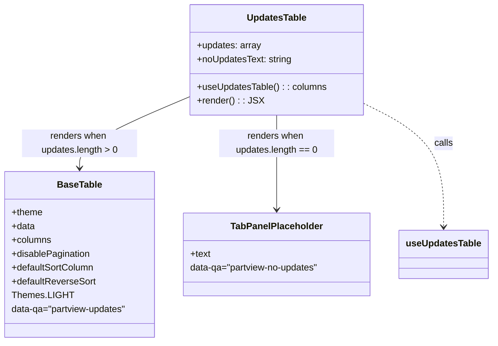

# Diagram: web/portal/src/pages/oceantracking/details/components/organisms/UpdatesTable.organism.js


> Auto-generated by Obscura crawlers

## Diagram 1



### SVG

<svg id="container" width="864.5390625" xmlns="http://www.w3.org/2000/svg" class="classDiagram" height="594" viewBox="0 0 864.5390625 594" role="graphics-document document" aria-roledescription="class"><style>#container{font-family:"trebuchet ms",verdana,arial,sans-serif;font-size:16px;fill:#333;}@keyframes edge-animation-frame{from{stroke-dashoffset:0;}}@keyframes dash{to{stroke-dashoffset:0;}}#container .edge-animation-slow{stroke-dasharray:9,5!important;stroke-dashoffset:900;animation:dash 50s linear infinite;stroke-linecap:round;}#container .edge-animation-fast{stroke-dasharray:9,5!important;stroke-dashoffset:900;animation:dash 20s linear infinite;stroke-linecap:round;}#container .error-icon{fill:#552222;}#container .error-text{fill:#552222;stroke:#552222;}#container .edge-thickness-normal{stroke-width:1px;}#container .edge-thickness-thick{stroke-width:3.5px;}#container .edge-pattern-solid{stroke-dasharray:0;}#container .edge-thickness-invisible{stroke-width:0;fill:none;}#container .edge-pattern-dashed{stroke-dasharray:3;}#container .edge-pattern-dotted{stroke-dasharray:2;}#container .marker{fill:#333333;stroke:#333333;}#container .marker.cross{stroke:#333333;}#container svg{font-family:"trebuchet ms",verdana,arial,sans-serif;font-size:16px;}#container p{margin:0;}#container g.classGroup text{fill:#9370DB;stroke:none;font-family:"trebuchet ms",verdana,arial,sans-serif;font-size:10px;}#container g.classGroup text .title{font-weight:bolder;}#container .nodeLabel,#container .edgeLabel{color:#131300;}#container .edgeLabel .label rect{fill:#ECECFF;}#container .label text{fill:#131300;}#container .labelBkg{background:#ECECFF;}#container .edgeLabel .label span{background:#ECECFF;}#container .classTitle{font-weight:bolder;}#container .node rect,#container .node circle,#container .node ellipse,#container .node polygon,#container .node path{fill:#ECECFF;stroke:#9370DB;stroke-width:1px;}#container .divider{stroke:#9370DB;stroke-width:1;}#container g.clickable{cursor:pointer;}#container g.classGroup rect{fill:#ECECFF;stroke:#9370DB;}#container g.classGroup line{stroke:#9370DB;stroke-width:1;}#container .classLabel .box{stroke:none;stroke-width:0;fill:#ECECFF;opacity:0.5;}#container .classLabel .label{fill:#9370DB;font-size:10px;}#container .relation{stroke:#333333;stroke-width:1;fill:none;}#container .dashed-line{stroke-dasharray:3;}#container .dotted-line{stroke-dasharray:1 2;}#container #compositionStart,#container .composition{fill:#333333!important;stroke:#333333!important;stroke-width:1;}#container #compositionEnd,#container .composition{fill:#333333!important;stroke:#333333!important;stroke-width:1;}#container #dependencyStart,#container .dependency{fill:#333333!important;stroke:#333333!important;stroke-width:1;}#container #dependencyStart,#container .dependency{fill:#333333!important;stroke:#333333!important;stroke-width:1;}#container #extensionStart,#container .extension{fill:transparent!important;stroke:#333333!important;stroke-width:1;}#container #extensionEnd,#container .extension{fill:transparent!important;stroke:#333333!important;stroke-width:1;}#container #aggregationStart,#container .aggregation{fill:transparent!important;stroke:#333333!important;stroke-width:1;}#container #aggregationEnd,#container .aggregation{fill:transparent!important;stroke:#333333!important;stroke-width:1;}#container #lollipopStart,#container .lollipop{fill:#ECECFF!important;stroke:#333333!important;stroke-width:1;}#container #lollipopEnd,#container .lollipop{fill:#ECECFF!important;stroke:#333333!important;stroke-width:1;}#container .edgeTerminals{font-size:11px;line-height:initial;}#container .classTitleText{text-anchor:middle;font-size:18px;fill:#333;}#container .label-icon{display:inline-block;height:1em;overflow:visible;vertical-align:-0.125em;}#container .node .label-icon path{fill:currentColor;stroke:revert;stroke-width:revert;}#container :root{--mermaid-font-family:"trebuchet ms",verdana,arial,sans-serif;}</style><g><defs><marker id="container_class-aggregationStart" class="marker aggregation class" refX="18" refY="7" markerWidth="190" markerHeight="240" orient="auto"><path d="M 18,7 L9,13 L1,7 L9,1 Z"></path></marker></defs><defs><marker id="container_class-aggregationEnd" class="marker aggregation class" refX="1" refY="7" markerWidth="20" markerHeight="28" orient="auto"><path d="M 18,7 L9,13 L1,7 L9,1 Z"></path></marker></defs><defs><marker id="container_class-extensionStart" class="marker extension class" refX="18" refY="7" markerWidth="190" markerHeight="240" orient="auto"><path d="M 1,7 L18,13 V 1 Z"></path></marker></defs><defs><marker id="container_class-extensionEnd" class="marker extension class" refX="1" refY="7" markerWidth="20" markerHeight="28" orient="auto"><path d="M 1,1 V 13 L18,7 Z"></path></marker></defs><defs><marker id="container_class-compositionStart" class="marker composition class" refX="18" refY="7" markerWidth="190" markerHeight="240" orient="auto"><path d="M 18,7 L9,13 L1,7 L9,1 Z"></path></marker></defs><defs><marker id="container_class-compositionEnd" class="marker composition class" refX="1" refY="7" markerWidth="20" markerHeight="28" orient="auto"><path d="M 18,7 L9,13 L1,7 L9,1 Z"></path></marker></defs><defs><marker id="container_class-dependencyStart" class="marker dependency class" refX="6" refY="7" markerWidth="190" markerHeight="240" orient="auto"><path d="M 5,7 L9,13 L1,7 L9,1 Z"></path></marker></defs><defs><marker id="container_class-dependencyEnd" class="marker dependency class" refX="13" refY="7" markerWidth="20" markerHeight="28" orient="auto"><path d="M 18,7 L9,13 L14,7 L9,1 Z"></path></marker></defs><defs><marker id="container_class-lollipopStart" class="marker lollipop class" refX="13" refY="7" markerWidth="190" markerHeight="240" orient="auto"><circle stroke="black" fill="transparent" cx="7" cy="7" r="6"></circle></marker></defs><defs><marker id="container_class-lollipopEnd" class="marker lollipop class" refX="1" refY="7" markerWidth="190" markerHeight="240" orient="auto"><circle stroke="black" fill="transparent" cx="7" cy="7" r="6"></circle></marker></defs><g class="root"><g class="clusters"></g><g class="edgePaths"><path d="M341.203,166.043L307.908,179.869C274.612,193.695,208.021,221.348,174.725,242.341C141.43,263.333,141.43,277.667,141.43,284.833L141.43,292" id="id_UpdatesTable_BaseTable_1" class="edge-thickness-normal edge-pattern-solid relation" style=";;;" data-edge="true" data-et="edge" data-id="id_UpdatesTable_BaseTable_1" data-points="W3sieCI6MzQxLjIwMzEyNSwieSI6MTY2LjA0MzIxNDY0MTI5NDk4fSx7IngiOjE0MS40Mjk2ODc1LCJ5IjoyNDl9LHsieCI6MTQxLjQyOTY4NzUsInkiOjI5OH1d" marker-end="url(#container_class-dependencyEnd)"></path><path d="M490.613,200L490.613,208.167C490.613,216.333,490.613,232.667,490.613,260C490.613,287.333,490.613,325.667,490.613,344.833L490.613,364" id="id_UpdatesTable_TabPanelPlaceholder_2" class="edge-thickness-normal edge-pattern-solid relation" style=";;;" data-edge="true" data-et="edge" data-id="id_UpdatesTable_TabPanelPlaceholder_2" data-points="W3sieCI6NDkwLjYxMzI4MTI1LCJ5IjoyMDB9LHsieCI6NDkwLjYxMzI4MTI1LCJ5IjoyNDl9LHsieCI6NDkwLjYxMzI4MTI1LCJ5IjozNzB9XQ==" marker-end="url(#container_class-dependencyEnd)"></path><path d="M640.023,178.489L663.595,190.241C687.167,201.993,734.31,225.496,757.882,261.415C781.453,297.333,781.453,345.667,781.453,369.833L781.453,394" id="id_UpdatesTable_useUpdatesTable_3" class="edge-thickness-normal edge-pattern-dashed relation" style=";;;" data-edge="true" data-et="edge" data-id="id_UpdatesTable_useUpdatesTable_3" data-points="W3sieCI6NjQwLjAyMzQzNzUsInkiOjE3OC40ODkzNTU5ODY4Mzc3fSx7IngiOjc4MS40NTMxMjUsInkiOjI0OX0seyJ4Ijo3ODEuNDUzMTI1LCJ5Ijo0MDB9XQ==" marker-end="url(#container_class-dependencyEnd)"></path></g><g class="edgeLabels"><g class="edgeLabel" transform="translate(141.4296875, 249)"><g class="label" data-id="id_UpdatesTable_BaseTable_1" transform="translate(-100, -24)"><foreignObject width="200" height="48"><div xmlns="http://www.w3.org/1999/xhtml" class="labelBkg" style="display: table; white-space: break-spaces; line-height: 1.5; max-width: 200px; text-align: center; width: 200px;"><span class="edgeLabel"><p>renders when updates.length &gt; 0</p></span></div></foreignObject></g></g><g class="edgeLabel" transform="translate(490.61328125, 249)"><g class="label" data-id="id_UpdatesTable_TabPanelPlaceholder_2" transform="translate(-100, -24)"><foreignObject width="200" height="48"><div xmlns="http://www.w3.org/1999/xhtml" class="labelBkg" style="display: table; white-space: break-spaces; line-height: 1.5; max-width: 200px; text-align: center; width: 200px;"><span class="edgeLabel"><p>renders when updates.length == 0</p></span></div></foreignObject></g></g><g class="edgeLabel" transform="translate(781.453125, 249)"><g class="label" data-id="id_UpdatesTable_useUpdatesTable_3" transform="translate(-16.4453125, -12)"><foreignObject width="32.890625" height="24"><div xmlns="http://www.w3.org/1999/xhtml" class="labelBkg" style="display: table-cell; white-space: nowrap; line-height: 1.5; max-width: 200px; text-align: center;"><span class="edgeLabel"><p>calls</p></span></div></foreignObject></g></g></g><g class="nodes"><g class="node default" id="classId-UpdatesTable-0" transform="translate(490.61328125, 104)"><g class="basic label-container"><path d="M-149.41015625 -96 L149.41015625 -96 L149.41015625 96 L-149.41015625 96" stroke="none" stroke-width="0" fill="#ECECFF" style=""></path><path d="M-149.41015625 -96 C-81.63357760711939 -96, -13.856998964238784 -96, 149.41015625 -96 M-149.41015625 -96 C-78.83220478231 -96, -8.254253314620001 -96, 149.41015625 -96 M149.41015625 -96 C149.41015625 -25.302817038270163, 149.41015625 45.394365923459674, 149.41015625 96 M149.41015625 -96 C149.41015625 -49.70059122625462, 149.41015625 -3.4011824525092464, 149.41015625 96 M149.41015625 96 C82.97600977894535 96, 16.541863307890708 96, -149.41015625 96 M149.41015625 96 C83.0216254755266 96, 16.63309470105321 96, -149.41015625 96 M-149.41015625 96 C-149.41015625 56.16499926240473, -149.41015625 16.329998524809454, -149.41015625 -96 M-149.41015625 96 C-149.41015625 46.80680346667289, -149.41015625 -2.3863930666542217, -149.41015625 -96" stroke="#9370DB" stroke-width="1.3" fill="none" stroke-dasharray="0 0" style=""></path></g><g class="annotation-group text" transform="translate(0, -72)"></g><g class="label-group text" transform="translate(-50.2265625, -72)"><g class="label" style="font-weight: bolder" transform="translate(0,-12)"><foreignObject width="100.453125" height="24"><div xmlns="http://www.w3.org/1999/xhtml" style="display: table-cell; white-space: nowrap; line-height: 1.5; max-width: 149px; text-align: center;"><span class="nodeLabel markdown-node-label" style=""><p>UpdatesTable</p></span></div></foreignObject></g></g><g class="members-group text" transform="translate(-137.41015625, -24)"><g class="label" style="" transform="translate(0,-12)"><foreignObject width="111.71875" height="24"><div xmlns="http://www.w3.org/1999/xhtml" style="display: table-cell; white-space: nowrap; line-height: 1.5; max-width: 169px; text-align: center;"><span class="nodeLabel markdown-node-label" style=""><p>+updates: array</p></span></div></foreignObject></g><g class="label" style="" transform="translate(0,12)"><foreignObject width="166.09375" height="24"><div xmlns="http://www.w3.org/1999/xhtml" style="display: table-cell; white-space: nowrap; line-height: 1.5; max-width: 224px; text-align: center;"><span class="nodeLabel markdown-node-label" style=""><p>+noUpdatesText: string</p></span></div></foreignObject></g></g><g class="methods-group text" transform="translate(-137.41015625, 48)"><g class="label" style="" transform="translate(0,-12)"><foreignObject width="224.59375" height="24"><div xmlns="http://www.w3.org/1999/xhtml" style="display: table-cell; white-space: nowrap; line-height: 1.5; max-width: 282px; text-align: center;"><span class="nodeLabel markdown-node-label" style=""><p>+useUpdatesTable() : : columns</p></span></div></foreignObject></g><g class="label" style="" transform="translate(0,12)"><foreignObject width="109.140625" height="24"><div xmlns="http://www.w3.org/1999/xhtml" style="display: table-cell; white-space: nowrap; line-height: 1.5; max-width: 167px; text-align: center;"><span class="nodeLabel markdown-node-label" style=""><p>+render() : : JSX</p></span></div></foreignObject></g></g><g class="divider" style=""><path d="M-149.41015625 -48 C-32.83404784172312 -48, 83.74206056655376 -48, 149.41015625 -48 M-149.41015625 -48 C-71.43346830803033 -48, 6.543219633939344 -48, 149.41015625 -48" stroke="#9370DB" stroke-width="1.3" fill="none" stroke-dasharray="0 0" style=""></path></g><g class="divider" style=""><path d="M-149.41015625 24 C-41.433915113674885 24, 66.54232602265023 24, 149.41015625 24 M-149.41015625 24 C-54.24124102216636 24, 40.92767420566727 24, 149.41015625 24" stroke="#9370DB" stroke-width="1.3" fill="none" stroke-dasharray="0 0" style=""></path></g></g><g class="node default" id="classId-BaseTable-1" transform="translate(141.4296875, 442)"><g class="basic label-container"><path d="M-133.4296875 -144 L133.4296875 -144 L133.4296875 144 L-133.4296875 144" stroke="none" stroke-width="0" fill="#ECECFF" style=""></path><path d="M-133.4296875 -144 C-69.46797231796475 -144, -5.506257135929488 -144, 133.4296875 -144 M-133.4296875 -144 C-65.67632507069256 -144, 2.077037358614888 -144, 133.4296875 -144 M133.4296875 -144 C133.4296875 -55.478815349888734, 133.4296875 33.04236930022253, 133.4296875 144 M133.4296875 -144 C133.4296875 -76.6728457795779, 133.4296875 -9.345691559155796, 133.4296875 144 M133.4296875 144 C59.43827355693283 144, -14.553140386134345 144, -133.4296875 144 M133.4296875 144 C49.34679687730423 144, -34.73609374539154 144, -133.4296875 144 M-133.4296875 144 C-133.4296875 30.8016529169265, -133.4296875 -82.396694166147, -133.4296875 -144 M-133.4296875 144 C-133.4296875 73.2857836055704, -133.4296875 2.5715672111408026, -133.4296875 -144" stroke="#9370DB" stroke-width="1.3" fill="none" stroke-dasharray="0 0" style=""></path></g><g class="annotation-group text" transform="translate(0, -120)"></g><g class="label-group text" transform="translate(-37.359375, -120)"><g class="label" style="font-weight: bolder" transform="translate(0,-12)"><foreignObject width="74.71875" height="24"><div xmlns="http://www.w3.org/1999/xhtml" style="display: table-cell; white-space: nowrap; line-height: 1.5; max-width: 123px; text-align: center;"><span class="nodeLabel markdown-node-label" style=""><p>BaseTable</p></span></div></foreignObject></g></g><g class="members-group text" transform="translate(-121.4296875, -72)"><g class="label" style="" transform="translate(0,-12)"><foreignObject width="54.21875" height="24"><div xmlns="http://www.w3.org/1999/xhtml" style="display: table-cell; white-space: nowrap; line-height: 1.5; max-width: 112px; text-align: center;"><span class="nodeLabel markdown-node-label" style=""><p>+theme</p></span></div></foreignObject></g><g class="label" style="" transform="translate(0,12)"><foreignObject width="40.625" height="24"><div xmlns="http://www.w3.org/1999/xhtml" style="display: table-cell; white-space: nowrap; line-height: 1.5; max-width: 98px; text-align: center;"><span class="nodeLabel markdown-node-label" style=""><p>+data</p></span></div></foreignObject></g><g class="label" style="" transform="translate(0,36)"><foreignObject width="69.21875" height="24"><div xmlns="http://www.w3.org/1999/xhtml" style="display: table-cell; white-space: nowrap; line-height: 1.5; max-width: 127px; text-align: center;"><span class="nodeLabel markdown-node-label" style=""><p>+columns</p></span></div></foreignObject></g><g class="label" style="" transform="translate(0,60)"><foreignObject width="137.796875" height="24"><div xmlns="http://www.w3.org/1999/xhtml" style="display: table-cell; white-space: nowrap; line-height: 1.5; max-width: 195px; text-align: center;"><span class="nodeLabel markdown-node-label" style=""><p>+disablePagination</p></span></div></foreignObject></g><g class="label" style="" transform="translate(0,84)"><foreignObject width="144.859375" height="24"><div xmlns="http://www.w3.org/1999/xhtml" style="display: table-cell; white-space: nowrap; line-height: 1.5; max-width: 202px; text-align: center;"><span class="nodeLabel markdown-node-label" style=""><p>+defaultSortColumn</p></span></div></foreignObject></g><g class="label" style="" transform="translate(0,108)"><foreignObject width="146.53125" height="24"><div xmlns="http://www.w3.org/1999/xhtml" style="display: table-cell; white-space: nowrap; line-height: 1.5; max-width: 204px; text-align: center;"><span class="nodeLabel markdown-node-label" style=""><p>+defaultReverseSort</p></span></div></foreignObject></g><g class="label" style="" transform="translate(0,132)"><foreignObject width="102.0625" height="24"><div xmlns="http://www.w3.org/1999/xhtml" style="display: table-cell; white-space: nowrap; line-height: 1.5; max-width: 153px; text-align: center;"><span class="nodeLabel markdown-node-label" style=""><p>Themes.LIGHT</p></span></div></foreignObject></g><g class="label" style="" transform="translate(0,156)"><foreignObject width="205.5" height="24"><div xmlns="http://www.w3.org/1999/xhtml" style="display: table-cell; white-space: nowrap; line-height: 1.5; max-width: 256px; text-align: center;"><span class="nodeLabel markdown-node-label" style=""><p>data-qa="partview-updates"</p></span></div></foreignObject></g></g><g class="methods-group text" transform="translate(-121.4296875, 144)"></g><g class="divider" style=""><path d="M-133.4296875 -96 C-66.96215417272066 -96, -0.4946208454413181 -96, 133.4296875 -96 M-133.4296875 -96 C-79.48971879994122 -96, -25.549750099882445 -96, 133.4296875 -96" stroke="#9370DB" stroke-width="1.3" fill="none" stroke-dasharray="0 0" style=""></path></g><g class="divider" style=""><path d="M-133.4296875 120 C-54.59416409995303 120, 24.241359300093933 120, 133.4296875 120 M-133.4296875 120 C-65.2327950361954 120, 2.964097427609204 120, 133.4296875 120" stroke="#9370DB" stroke-width="1.3" fill="none" stroke-dasharray="0 0" style=""></path></g></g><g class="node default" id="classId-TabPanelPlaceholder-2" transform="translate(490.61328125, 442)"><g class="basic label-container"><path d="M-165.75390625 -72 L165.75390625 -72 L165.75390625 72 L-165.75390625 72" stroke="none" stroke-width="0" fill="#ECECFF" style=""></path><path d="M-165.75390625 -72 C-38.322155530669235 -72, 89.10959518866153 -72, 165.75390625 -72 M-165.75390625 -72 C-34.76493353531376 -72, 96.22403917937248 -72, 165.75390625 -72 M165.75390625 -72 C165.75390625 -35.987560711475496, 165.75390625 0.024878577049008754, 165.75390625 72 M165.75390625 -72 C165.75390625 -16.15446559057027, 165.75390625 39.69106881885946, 165.75390625 72 M165.75390625 72 C39.851514781810195 72, -86.05087668637961 72, -165.75390625 72 M165.75390625 72 C35.46227637078994 72, -94.82935350842013 72, -165.75390625 72 M-165.75390625 72 C-165.75390625 31.008292081503548, -165.75390625 -9.983415836992904, -165.75390625 -72 M-165.75390625 72 C-165.75390625 29.446588229786613, -165.75390625 -13.106823540426774, -165.75390625 -72" stroke="#9370DB" stroke-width="1.3" fill="none" stroke-dasharray="0 0" style=""></path></g><g class="annotation-group text" transform="translate(0, -48)"></g><g class="label-group text" transform="translate(-76.8359375, -48)"><g class="label" style="font-weight: bolder" transform="translate(0,-12)"><foreignObject width="153.671875" height="24"><div xmlns="http://www.w3.org/1999/xhtml" style="display: table-cell; white-space: nowrap; line-height: 1.5; max-width: 203px; text-align: center;"><span class="nodeLabel markdown-node-label" style=""><p>TabPanelPlaceholder</p></span></div></foreignObject></g></g><g class="members-group text" transform="translate(-153.75390625, 0)"><g class="label" style="" transform="translate(0,-12)"><foreignObject width="35.5625" height="24"><div xmlns="http://www.w3.org/1999/xhtml" style="display: table-cell; white-space: nowrap; line-height: 1.5; max-width: 93px; text-align: center;"><span class="nodeLabel markdown-node-label" style=""><p>+text</p></span></div></foreignObject></g><g class="label" style="" transform="translate(0,12)"><foreignObject width="230.671875" height="24"><div xmlns="http://www.w3.org/1999/xhtml" style="display: table-cell; white-space: nowrap; line-height: 1.5; max-width: 281px; text-align: center;"><span class="nodeLabel markdown-node-label" style=""><p>data-qa="partview-no-updates"</p></span></div></foreignObject></g></g><g class="methods-group text" transform="translate(-153.75390625, 72)"></g><g class="divider" style=""><path d="M-165.75390625 -24 C-74.73106428982744 -24, 16.291777670345112 -24, 165.75390625 -24 M-165.75390625 -24 C-95.35123410005389 -24, -24.948561950107774 -24, 165.75390625 -24" stroke="#9370DB" stroke-width="1.3" fill="none" stroke-dasharray="0 0" style=""></path></g><g class="divider" style=""><path d="M-165.75390625 48 C-92.5874251192211 48, -19.42094398844219 48, 165.75390625 48 M-165.75390625 48 C-84.58658965816736 48, -3.4192730663347106 48, 165.75390625 48" stroke="#9370DB" stroke-width="1.3" fill="none" stroke-dasharray="0 0" style=""></path></g></g><g class="node default" id="classId-useUpdatesTable-3" transform="translate(781.453125, 442)"><g class="basic label-container"><path d="M-75.0859375 -42 L75.0859375 -42 L75.0859375 42 L-75.0859375 42" stroke="none" stroke-width="0" fill="#ECECFF" style=""></path><path d="M-75.0859375 -42 C-41.20556241008524 -42, -7.325187320170485 -42, 75.0859375 -42 M-75.0859375 -42 C-25.405576092582287 -42, 24.274785314835427 -42, 75.0859375 -42 M75.0859375 -42 C75.0859375 -21.732806285528916, 75.0859375 -1.4656125710578323, 75.0859375 42 M75.0859375 -42 C75.0859375 -16.10624736264417, 75.0859375 9.787505274711663, 75.0859375 42 M75.0859375 42 C27.229497145290146 42, -20.626943209419707 42, -75.0859375 42 M75.0859375 42 C34.60732692778376 42, -5.871283644432481 42, -75.0859375 42 M-75.0859375 42 C-75.0859375 10.265834269724476, -75.0859375 -21.46833146055105, -75.0859375 -42 M-75.0859375 42 C-75.0859375 8.952557240187268, -75.0859375 -24.094885519625464, -75.0859375 -42" stroke="#9370DB" stroke-width="1.3" fill="none" stroke-dasharray="0 0" style=""></path></g><g class="annotation-group text" transform="translate(0, -18)"></g><g class="label-group text" transform="translate(-63.0859375, -18)"><g class="label" style="font-weight: bolder" transform="translate(0,-12)"><foreignObject width="126.171875" height="24"><div xmlns="http://www.w3.org/1999/xhtml" style="display: table-cell; white-space: nowrap; line-height: 1.5; max-width: 175px; text-align: center;"><span class="nodeLabel markdown-node-label" style=""><p>useUpdatesTable</p></span></div></foreignObject></g></g><g class="members-group text" transform="translate(-63.0859375, 30)"></g><g class="methods-group text" transform="translate(-63.0859375, 60)"></g><g class="divider" style=""><path d="M-75.0859375 6 C-42.21307332219379 6, -9.340209144387586 6, 75.0859375 6 M-75.0859375 6 C-29.917286660706544 6, 15.251364178586911 6, 75.0859375 6" stroke="#9370DB" stroke-width="1.3" fill="none" stroke-dasharray="0 0" style=""></path></g><g class="divider" style=""><path d="M-75.0859375 24 C-28.60988347965663 24, 17.86617054068674 24, 75.0859375 24 M-75.0859375 24 C-43.741673660569035 24, -12.397409821138062 24, 75.0859375 24" stroke="#9370DB" stroke-width="1.3" fill="none" stroke-dasharray="0 0" style=""></path></g></g></g></g></g></svg>

## Diagram 2

```mermaid
flowchart TD
Start([Start]) --> Check{updates.length > 0?}
Check -->|Yes| BaseTableNode[BaseTable<br/>theme=Themes.LIGHT<br/>data=updates<br/>columns=columns.slice(1)]
Check -->|No| Placeholder[TabPanelPlaceholder<br/>text=noUpdatesText]
BaseTableNode --> End([End])
Placeholder --> End([End])
```

> SVG rendering failed for this diagram.
