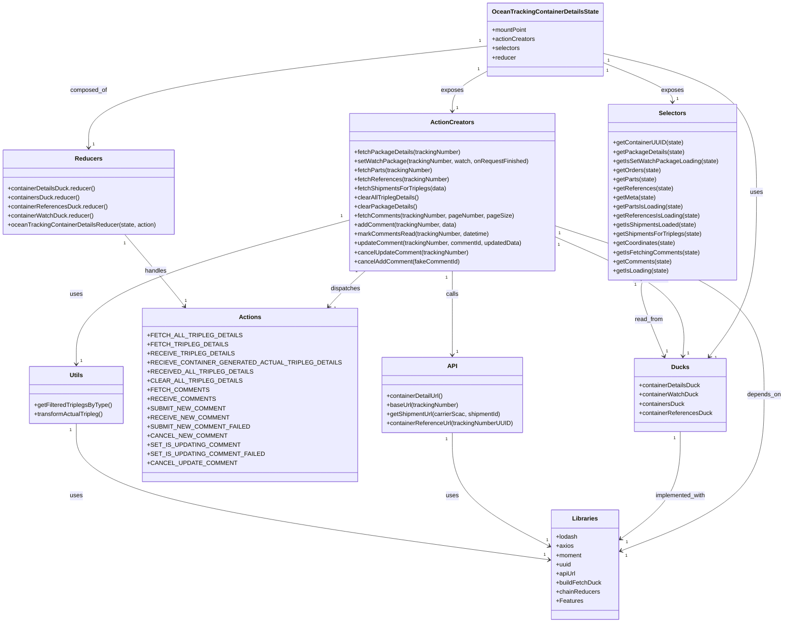

# Diagram: web/portal/src/pages/oceantracking/redux/OceanTracking.DetailsState.js

> Auto-generated by Obscura crawlers

## Mermaid

### SVG

<svg id="container" width="1986.236328125" xmlns="http://www.w3.org/2000/svg" class="classDiagram" height="1636" viewBox="0 0 1986.236328125 1636" role="graphics-document document" aria-roledescription="class"><g><defs><marker id="container_class-aggregationStart" class="marker aggregation class" refX="18" refY="7" markerWidth="190" markerHeight="240" orient="auto"><path d="M 18,7 L9,13 L1,7 L9,1 Z"></path></marker></defs><defs><marker id="container_class-aggregationEnd" class="marker aggregation class" refX="1" refY="7" markerWidth="20" markerHeight="28" orient="auto"><path d="M 18,7 L9,13 L1,7 L9,1 Z"></path></marker></defs><defs><marker id="container_class-extensionStart" class="marker extension class" refX="18" refY="7" markerWidth="190" markerHeight="240" orient="auto"><path d="M 1,7 L18,13 V 1 Z"></path></marker></defs><defs><marker id="container_class-extensionEnd" class="marker extension class" refX="1" refY="7" markerWidth="20" markerHeight="28" orient="auto"><path d="M 1,1 V 13 L18,7 Z"></path></marker></defs><defs><marker id="container_class-compositionStart" class="marker composition class" refX="18" refY="7" markerWidth="190" markerHeight="240" orient="auto"><path d="M 18,7 L9,13 L1,7 L9,1 Z"></path></marker></defs><defs><marker id="container_class-compositionEnd" class="marker composition class" refX="1" refY="7" markerWidth="20" markerHeight="28" orient="auto"><path d="M 18,7 L9,13 L1,7 L9,1 Z"></path></marker></defs><defs><marker id="container_class-dependencyStart" class="marker dependency class" refX="6" refY="7" markerWidth="190" markerHeight="240" orient="auto"><path d="M 5,7 L9,13 L1,7 L9,1 Z"></path></marker></defs><defs><marker id="container_class-dependencyEnd" class="marker dependency class" refX="13" refY="7" markerWidth="20" markerHeight="28" orient="auto"><path d="M 18,7 L9,13 L14,7 L9,1 Z"></path></marker></defs><defs><marker id="container_class-lollipopStart" class="marker lollipop class" refX="13" refY="7" markerWidth="190" markerHeight="240" orient="auto"><circle stroke="black" fill="transparent" cx="7" cy="7" r="6"></circle></marker></defs><defs><marker id="container_class-lollipopEnd" class="marker lollipop class" refX="1" refY="7" markerWidth="190" markerHeight="240" orient="auto"><circle stroke="black" fill="transparent" cx="7" cy="7" r="6"></circle></marker></defs><g class="root"><g class="clusters"></g><g class="edgePaths"><path d="M1513.014,139.505L1579.772,155.754C1646.531,172.003,1780.048,204.502,1846.806,265.417C1913.564,326.333,1913.564,415.667,1913.564,505C1913.564,594.333,1913.564,683.667,1893.167,755.698C1872.77,827.73,1831.975,882.46,1811.577,909.824L1791.18,937.189" id="id_OceanTrackingContainerDetailsState_Ducks_1" class="edge-thickness-normal edge-pattern-solid relation" style=";;;" data-edge="true" data-et="edge" data-id="id_OceanTrackingContainerDetailsState_Ducks_1" data-points="W3sieCI6MTUxMy4wMTM2NzE4NzUsInkiOjEzOS41MDQ1NzE2Nzc3NTkyNn0seyJ4IjoxOTEzLjU2NDQ1MzEyNSwieSI6MjM3fSx7IngiOjE5MTMuNTY0NDUzMTI1LCJ5Ijo1MDV9LHsieCI6MTkxMy41NjQ0NTMxMjUsInkiOjc3M30seyJ4IjoxNzg3LjU5NDE4NDg0NjY5ODIsInkiOjk0Mn1d" marker-end="url(#container_class-dependencyEnd)"></path><path d="M1221.279,184.608L1205.478,193.34C1189.676,202.072,1158.074,219.536,1142.272,237.435C1126.471,255.333,1126.471,273.667,1126.471,282.833L1126.471,292" id="id_OceanTrackingContainerDetailsState_ActionCreators_2" class="edge-thickness-normal edge-pattern-solid relation" style=";;;" data-edge="true" data-et="edge" data-id="id_OceanTrackingContainerDetailsState_ActionCreators_2" data-points="W3sieCI6MTIyMS4yNzkyOTY4NzUsInkiOjE4NC42MDc3NjEzNDkwNjU5Mn0seyJ4IjoxMTI2LjQ3MDcwMzEyNSwieSI6MjM3fSx7IngiOjExMjYuNDcwNzAzMTI1LCJ5IjoyOTh9XQ==" marker-end="url(#container_class-dependencyEnd)"></path><path d="M1513.014,162.791L1543.701,175.159C1574.387,187.527,1635.761,212.264,1666.448,229.798C1697.135,247.333,1697.135,257.667,1697.135,262.833L1697.135,268" id="id_OceanTrackingContainerDetailsState_Selectors_3" class="edge-thickness-normal edge-pattern-solid relation" style=";;;" data-edge="true" data-et="edge" data-id="id_OceanTrackingContainerDetailsState_Selectors_3" data-points="W3sieCI6MTUxMy4wMTM2NzE4NzUsInkiOjE2Mi43OTA5ODQ1MjgzMzMxNX0seyJ4IjoxNjk3LjEzNDc2NTYyNSwieSI6MjM3fSx7IngiOjE2OTcuMTM0NzY1NjI1LCJ5IjoyNzR9XQ==" marker-end="url(#container_class-dependencyEnd)"></path><path d="M1221.279,121.096L1056.46,140.413C891.641,159.731,562.002,198.365,397.183,242.849C232.363,287.333,232.363,337.667,232.363,362.833L232.363,388" id="id_OceanTrackingContainerDetailsState_Reducers_4" class="edge-thickness-normal edge-pattern-solid relation" style=";;;" data-edge="true" data-et="edge" data-id="id_OceanTrackingContainerDetailsState_Reducers_4" data-points="W3sieCI6MTIyMS4yNzkyOTY4NzUsInkiOjEyMS4wOTYwNzI1MjIxMTI0fSx7IngiOjIzMi4zNjMyODEyNSwieSI6MjM3fSx7IngiOjIzMi4zNjMyODEyNSwieSI6Mzk0fV0=" marker-end="url(#container_class-dependencyEnd)"></path><path d="M1126.471,712L1126.471,722.167C1126.471,732.333,1126.471,752.667,1126.471,789.5C1126.471,826.333,1126.471,879.667,1126.471,906.333L1126.471,933" id="id_ActionCreators_API_5" class="edge-thickness-normal edge-pattern-solid relation" style=";;;" data-edge="true" data-et="edge" data-id="id_ActionCreators_API_5" data-points="W3sieCI6MTEyNi40NzA3MDMxMjUsInkiOjcxMn0seyJ4IjoxMTI2LjQ3MDcwMzEyNSwieSI6NzczfSx7IngiOjExMjYuNDcwNzAzMTI1LCJ5Ijo5Mzl9XQ==" marker-end="url(#container_class-dependencyEnd)"></path><path d="M1392.885,622.389L1449.854,647.491C1506.822,672.593,1620.76,722.796,1675.815,775.067C1730.871,827.338,1727.045,881.677,1725.132,908.846L1723.218,936.015" id="id_ActionCreators_Ducks_6" class="edge-thickness-normal edge-pattern-solid relation" style=";;;" data-edge="true" data-et="edge" data-id="id_ActionCreators_Ducks_6" data-points="W3sieCI6MTM5Mi44ODQ3NjU2MjUsInkiOjYyMi4zODg3NzExNDU2MjA2fSx7IngiOjE3MzQuNjk3MjY1NjI1LCJ5Ijo3NzN9LHsieCI6MTcyMi43OTcwMTUwMzUzNzc0LCJ5Ijo5NDJ9XQ==" marker-end="url(#container_class-dependencyEnd)"></path><path d="M912.202,712L901.679,722.167C891.155,732.333,870.108,752.667,854.832,768.248C839.556,783.83,830.05,794.66,825.298,800.075L820.545,805.49" id="id_ActionCreators_Actions_7" class="edge-thickness-normal edge-pattern-solid relation" style=";;;" data-edge="true" data-et="edge" data-id="id_ActionCreators_Actions_7" data-points="W3sieCI6OTEyLjIwMjQxMDc5NzU3NDcsInkiOjcxMn0seyJ4Ijo4NDkuMDYwNTQ2ODc1LCJ5Ijo3NzN9LHsieCI6ODE2LjU4NzY0NzQwNTY2MDQsInkiOjgxMH1d" marker-end="url(#container_class-dependencyEnd)"></path><path d="M1392.885,593.464L1482.998,623.387C1573.111,653.31,1753.338,713.155,1843.451,787.244C1933.564,861.333,1933.564,949.667,1933.564,1038C1933.564,1126.333,1933.564,1214.667,1869.446,1283.103C1805.328,1351.539,1677.092,1400.079,1612.974,1424.349L1548.856,1448.618" id="id_ActionCreators_Libraries_8" class="edge-thickness-normal edge-pattern-solid relation" style=";;;" data-edge="true" data-et="edge" data-id="id_ActionCreators_Libraries_8" data-points="W3sieCI6MTM5Mi44ODQ3NjU2MjUsInkiOjU5My40NjQyODE1NjU4MDMzfSx7IngiOjE5MzMuNTY0NDUzMTI1LCJ5Ijo3NzN9LHsieCI6MTkzMy41NjQ0NTMxMjUsInkiOjEwMzh9LHsieCI6MTkzMy41NjQ0NTMxMjUsInkiOjEzMDN9LHsieCI6MTU0My4yNDQxNDA2MjUsInkiOjE0NTAuNzQyMzY4MTczODM0OH1d" marker-end="url(#container_class-dependencyEnd)"></path><path d="M860.057,582.037L749.991,613.864C639.924,645.692,419.792,709.346,309.726,771.84C199.66,834.333,199.66,895.667,199.66,926.333L199.66,957" id="id_ActionCreators_Utils_9" class="edge-thickness-normal edge-pattern-solid relation" style=";;;" data-edge="true" data-et="edge" data-id="id_ActionCreators_Utils_9" data-points="W3sieCI6ODYwLjA1NjY0MDYyNSwieSI6NTgyLjAzNzI4NTU0OTYxMDV9LHsieCI6MTk5LjY2MDE1NjI1LCJ5Ijo3NzN9LHsieCI6MTk5LjY2MDE1NjI1LCJ5Ijo5NjN9XQ==" marker-end="url(#container_class-dependencyEnd)"></path><path d="M318.683,616L339.032,642.167C359.381,668.333,400.078,720.667,423.963,752.167C447.848,783.666,454.92,794.333,458.456,799.666L461.993,804.999" id="id_Reducers_Actions_10" class="edge-thickness-normal edge-pattern-solid relation" style=";;;" data-edge="true" data-et="edge" data-id="id_Reducers_Actions_10" data-points="W3sieCI6MzE4LjY4MzIyMjA3MzIyNzYsInkiOjYxNn0seyJ4Ijo0NDAuNzc1MzkwNjI1LCJ5Ijo3NzN9LHsieCI6NDY1LjMwODM0MzE2MDM3NzQsInkiOjgxMH1d" marker-end="url(#container_class-dependencyEnd)"></path><path d="M1716.037,1134L1716.037,1162.167C1716.037,1190.333,1716.037,1246.667,1688.06,1294.261C1660.082,1341.855,1604.127,1380.71,1576.15,1400.138L1548.172,1419.565" id="id_Ducks_Libraries_11" class="edge-thickness-normal edge-pattern-solid relation" style=";;;" data-edge="true" data-et="edge" data-id="id_Ducks_Libraries_11" data-points="W3sieCI6MTcxNi4wMzcxMDkzNzUsInkiOjExMzR9LHsieCI6MTcxNi4wMzcxMDkzNzUsInkiOjEzMDN9LHsieCI6MTU0My4yNDQxNDA2MjUsInkiOjE0MjIuOTg3NjM2Mzc0NTM1NH1d" marker-end="url(#container_class-dependencyEnd)"></path><path d="M1620.153,736L1618.098,742.167C1616.043,748.333,1611.932,760.667,1621.001,794.074C1630.07,827.482,1652.318,881.964,1663.442,909.204L1674.566,936.445" id="id_Selectors_Ducks_12" class="edge-thickness-normal edge-pattern-solid relation" style=";;;" data-edge="true" data-et="edge" data-id="id_Selectors_Ducks_12" data-points="W3sieCI6MTYyMC4xNTI3MjI3MTQ1NTIzLCJ5Ijo3MzZ9LHsieCI6MTYwNy44MjIyNjU2MjUsInkiOjc3M30seyJ4IjoxNjc2LjgzNDc1MDg4NDQzNCwieSI6OTQyfV0=" marker-end="url(#container_class-dependencyEnd)"></path><path d="M1126.471,1137L1126.471,1164.667C1126.471,1192.333,1126.471,1247.667,1165.769,1296.959C1205.067,1346.252,1283.664,1389.504,1322.963,1411.13L1362.261,1432.756" id="id_API_Libraries_13" class="edge-thickness-normal edge-pattern-solid relation" style=";;;" data-edge="true" data-et="edge" data-id="id_API_Libraries_13" data-points="W3sieCI6MTEyNi40NzA3MDMxMjUsInkiOjExMzd9LHsieCI6MTEyNi40NzA3MDMxMjUsInkiOjEzMDN9LHsieCI6MTM2Ny41MTc1NzgxMjUsInkiOjE0MzUuNjQ4NjM4Mzc3MjE2NX1d" marker-end="url(#container_class-dependencyEnd)"></path><path d="M199.66,1113L199.66,1144.667C199.66,1176.333,199.66,1239.667,393.313,1299.247C586.966,1358.826,974.273,1414.653,1167.926,1442.566L1361.579,1470.479" id="id_Utils_Libraries_14" class="edge-thickness-normal edge-pattern-solid relation" style=";;;" data-edge="true" data-et="edge" data-id="id_Utils_Libraries_14" data-points="W3sieCI6MTk5LjY2MDE1NjI1LCJ5IjoxMTEzfSx7IngiOjE5OS42NjAxNTYyNSwieSI6MTMwM30seyJ4IjoxMzY3LjUxNzU3ODEyNSwieSI6MTQ3MS4zMzUzNTc0MDMzODM2fV0=" marker-end="url(#container_class-dependencyEnd)"></path></g><g class="edgeLabels"><g class="edgeLabel" transform="translate(1913.564453125, 505)"><g class="label" data-id="id_OceanTrackingContainerDetailsState_Ducks_1" transform="translate(-16.4921875, -12)"><foreignObject width="32.984375" height="24">

uses

</foreignObject></g></g><g class="edgeLabel" transform="translate(1126.470703125, 237)"><g class="label" data-id="id_OceanTrackingContainerDetailsState_ActionCreators_2" transform="translate(-29.4296875, -12)"><foreignObject width="58.859375" height="24">

exposes

</foreignObject></g></g><g class="edgeLabel" transform="translate(1697.134765625, 237)"><g class="label" data-id="id_OceanTrackingContainerDetailsState_Selectors_3" transform="translate(-29.4296875, -12)"><foreignObject width="58.859375" height="24">

exposes

</foreignObject></g></g><g class="edgeLabel" transform="translate(232.36328125, 237)"><g class="label" data-id="id_OceanTrackingContainerDetailsState_Reducers_4" transform="translate(-48.8515625, -12)"><foreignObject width="97.703125" height="24">

composed_of

</foreignObject></g></g><g class="edgeLabel" transform="translate(1126.470703125, 773)"><g class="label" data-id="id_ActionCreators_API_5" transform="translate(-16.4453125, -12)"><foreignObject width="32.890625" height="24">

calls

</foreignObject></g></g><g class="edgeLabel" transform="translate(1641.30877, 731.85067)"><g class="label" data-id="id_ActionCreators_Ducks_6" transform="translate(-48.7421875, -12)"><foreignObject width="97.484375" height="24">

dispatches to

</foreignObject></g></g><g class="edgeLabel" transform="translate(862.92876, 759.60222)"><g class="label" data-id="id_ActionCreators_Actions_7" transform="translate(-39.1796875, -12)"><foreignObject width="78.359375" height="24">

dispatches

</foreignObject></g></g><g class="edgeLabel" transform="translate(1933.564453125, 1038)"><g class="label" data-id="id_ActionCreators_Libraries_8" transform="translate(-44.671875, -12)"><foreignObject width="89.34375" height="24">

depends_on

</foreignObject></g></g><g class="edgeLabel" transform="translate(199.66015625, 773)"><g class="label" data-id="id_ActionCreators_Utils_9" transform="translate(-16.4921875, -12)"><foreignObject width="32.984375" height="24">

uses

</foreignObject></g></g><g class="edgeLabel" transform="translate(393.35576, 712.02245)"><g class="label" data-id="id_Reducers_Actions_10" transform="translate(-28.9140625, -12)"><foreignObject width="57.828125" height="24">

handles

</foreignObject></g></g><g class="edgeLabel" transform="translate(1716.037109375, 1303)"><g class="label" data-id="id_Ducks_Libraries_11" transform="translate(-67.9140625, -12)"><foreignObject width="135.828125" height="24">

implemented_with

</foreignObject></g></g><g class="edgeLabel" transform="translate(1634.95641, 839.44696)"><g class="label" data-id="id_Selectors_Ducks_12" transform="translate(-37.3203125, -12)"><foreignObject width="74.640625" height="24">

read_from

</foreignObject></g></g><g class="edgeLabel" transform="translate(1126.470703125, 1303)"><g class="label" data-id="id_API_Libraries_13" transform="translate(-16.4921875, -12)"><foreignObject width="32.984375" height="24">

uses

</foreignObject></g></g><g class="edgeLabel" transform="translate(199.66015625, 1303)"><g class="label" data-id="id_Utils_Libraries_14" transform="translate(-16.4921875, -12)"><foreignObject width="32.984375" height="24">

uses

</foreignObject></g></g><g class="edgeTerminals" transform="translate(1526.4697534237796, 158.21777364392113)"><g class="inner" transform="translate(0, 0)"><foreignObject style="width: 9px; height: 12px;">
1
</foreignObject></g></g><g class="edgeTerminals" transform="translate(1198.707353914891, 179.94328040287627)"><g class="inner" transform="translate(0, 0)"><foreignObject style="width: 9px; height: 12px;">
1
</foreignObject></g></g><g class="edgeTerminals" transform="translate(1523.637557617107, 183.24539782271816)"><g class="inner" transform="translate(0, 0)"><foreignObject style="width: 9px; height: 12px;">
1
</foreignObject></g></g><g class="edgeTerminals" transform="translate(1202.1521751231062, 108.23515595105525)"><g class="inner" transform="translate(0, 0)"><foreignObject style="width: 9px; height: 12px;">
1
</foreignObject></g></g><g class="edgeTerminals" transform="translate(1111.4707015625, 729.4999986607144)"><g class="inner" transform="translate(0, 0)"><foreignObject style="width: 9px; height: 12px;">
1
</foreignObject></g></g><g class="edgeTerminals" transform="translate(1402.8508125952374, 643.1716447694544)"><g class="inner" transform="translate(0, 0)"><foreignObject style="width: 9px; height: 12px;">
1
</foreignObject></g></g><g class="edgeTerminals" transform="translate(889.1943643149841, 713.3710643007704)"><g class="inner" transform="translate(0, 0)"><foreignObject style="width: 9px; height: 12px;">
1
</foreignObject></g></g><g class="edgeTerminals" transform="translate(1404.7660340561908, 613.2148623702112)"><g class="inner" transform="translate(0, 0)"><foreignObject style="width: 9px; height: 12px;">
1
</foreignObject></g></g><g class="edgeTerminals" transform="translate(839.0786261065039, 572.4888362537658)"><g class="inner" transform="translate(0, 0)"><foreignObject style="width: 9px; height: 12px;">
1
</foreignObject></g></g><g class="edgeTerminals" transform="translate(317.5851716864072, 639.0226905901982)"><g class="inner" transform="translate(0, 0)"><foreignObject style="width: 9px; height: 12px;">
1
</foreignObject></g></g><g class="edgeTerminals" transform="translate(1701.0371096875, 1151.500000267857)"><g class="inner" transform="translate(0, 0)"><foreignObject style="width: 9px; height: 12px;">
1
</foreignObject></g></g><g class="edgeTerminals" transform="translate(1600.3893155559838, 747.8599226170934)"><g class="inner" transform="translate(0, 0)"><foreignObject style="width: 9px; height: 12px;">
1
</foreignObject></g></g><g class="edgeTerminals" transform="translate(1111.4707015625, 1154.4999986607143)"><g class="inner" transform="translate(0, 0)"><foreignObject style="width: 9px; height: 12px;">
1
</foreignObject></g></g><g class="edgeTerminals" transform="translate(184.6601581250001, 1130.5000016071428)"><g class="inner" transform="translate(0, 0)"><foreignObject style="width: 9px; height: 12px;">
1
</foreignObject></g></g><g class="edgeTerminals" transform="translate(1805.0792886779147, 931.9334388579797)"><g class="inner" transform="translate(0, 0)"></g><foreignObject style="width: 9px; height: 12px;">
1
</foreignObject></g><g class="edgeTerminals" transform="translate(1136.4707015625, 275.4999986607143)"><g class="inner" transform="translate(0, 0)"></g><foreignObject style="width: 9px; height: 12px;">
1
</foreignObject></g><g class="edgeTerminals" transform="translate(1707.1347678124996, 251.50000187499995)"><g class="inner" transform="translate(0, 0)"></g><foreignObject style="width: 9px; height: 12px;">
1
</foreignObject></g><g class="edgeTerminals" transform="translate(242.36328062500002, 371.49999946428574)"><g class="inner" transform="translate(0, 0)"></g><foreignObject style="width: 9px; height: 12px;">
1
</foreignObject></g><g class="edgeTerminals" transform="translate(1136.4707015625, 916.4999986607144)"><g class="inner" transform="translate(0, 0)"></g><foreignObject style="width: 9px; height: 12px;">
1
</foreignObject></g><g class="edgeTerminals" transform="translate(1733.9891973736487, 920.5968528318384)"><g class="inner" transform="translate(0, 0)"></g><foreignObject style="width: 9px; height: 12px;">
1
</foreignObject></g><g class="edgeTerminals" transform="translate(834.4050291595097, 801.7416221395526)"><g class="inner" transform="translate(0, 0)"></g><foreignObject style="width: 9px; height: 12px;">
1
</foreignObject></g><g class="edgeTerminals" transform="translate(1559.9209731773253, 1453.5759447342325)"><g class="inner" transform="translate(0, 0)"></g><foreignObject style="width: 9px; height: 12px;">
1
</foreignObject></g><g class="edgeTerminals" transform="translate(209.66015812499992, 940.5000016071428)"><g class="inner" transform="translate(0, 0)"></g><foreignObject style="width: 9px; height: 12px;">
1
</foreignObject></g><g class="edgeTerminals" transform="translate(463.1391784880596, 782.1256407112854)"><g class="inner" transform="translate(0, 0)"></g><foreignObject style="width: 9px; height: 12px;">
1
</foreignObject></g><g class="edgeTerminals" transform="translate(1561.173983884461, 1420.3269266719035)"><g class="inner" transform="translate(0, 0)"></g><foreignObject style="width: 9px; height: 12px;">
1
</foreignObject></g><g class="edgeTerminals" transform="translate(1679.1056191910736, 915.1279981199312)"><g class="inner" transform="translate(0, 0)"></g><foreignObject style="width: 9px; height: 12px;">
1
</foreignObject></g><g class="edgeTerminals" transform="translate(1354.4175894404987, 1409.0699430414745)"><g class="inner" transform="translate(0, 0)"></g><foreignObject style="width: 9px; height: 12px;">
1
</foreignObject></g><g class="edgeTerminals" transform="translate(1347.3365781529742, 1448.9921402376222)"><g class="inner" transform="translate(0, 0)"></g><foreignObject style="width: 9px; height: 12px;">
1
</foreignObject></g></g><g class="nodes"><g class="node default" id="classId-OceanTrackingContainerDetailsState-0" transform="translate(1367.146484375, 104)"><g class="basic label-container"><path d="M-145.8671875 -96 L145.8671875 -96 L145.8671875 96 L-145.8671875 96" stroke="none" stroke-width="0" fill="#ECECFF" style=""></path><path d="M-145.8671875 -96 C-32.79986146911668 -96, 80.26746456176664 -96, 145.8671875 -96 M-145.8671875 -96 C-44.36993567405513 -96, 57.127316151889744 -96, 145.8671875 -96 M145.8671875 -96 C145.8671875 -49.053896582299245, 145.8671875 -2.1077931645984904, 145.8671875 96 M145.8671875 -96 C145.8671875 -44.46370612345966, 145.8671875 7.072587753080683, 145.8671875 96 M145.8671875 96 C72.07089595593825 96, -1.7253955881234901 96, -145.8671875 96 M145.8671875 96 C87.2105755235778 96, 28.553963547155618 96, -145.8671875 96 M-145.8671875 96 C-145.8671875 39.15655179742747, -145.8671875 -17.686896405145063, -145.8671875 -96 M-145.8671875 96 C-145.8671875 27.400411845122036, -145.8671875 -41.19917630975593, -145.8671875 -96" stroke="#9370DB" stroke-width="1.3" fill="none" stroke-dasharray="0 0" style=""></path></g><g class="annotation-group text" transform="translate(0, -72)"></g><g class="label-group text" transform="translate(-133.8671875, -72)"><g class="label" style="font-weight: bolder" transform="translate(0,-12)"><foreignObject width="267.734375" height="24">

OceanTrackingContainerDetailsState

</foreignObject></g></g><g class="members-group text" transform="translate(-133.8671875, -24)"><g class="label" style="" transform="translate(0,-12)"><foreignObject width="93.34375" height="24">

+mountPoint

</foreignObject></g><g class="label" style="" transform="translate(0,12)"><foreignObject width="113.078125" height="24">

+actionCreators

</foreignObject></g><g class="label" style="" transform="translate(0,36)"><foreignObject width="73.453125" height="24">

+selectors

</foreignObject></g><g class="label" style="" transform="translate(0,60)"><foreignObject width="63.515625" height="24">

+reducer

</foreignObject></g></g><g class="methods-group text" transform="translate(-133.8671875, 96)"></g><g class="divider" style=""><path d="M-145.8671875 -48 C-86.46480784305382 -48, -27.06242818610764 -48, 145.8671875 -48 M-145.8671875 -48 C-84.95787362748038 -48, -24.04855975496075 -48, 145.8671875 -48" stroke="#9370DB" stroke-width="1.3" fill="none" stroke-dasharray="0 0" style=""></path></g><g class="divider" style=""><path d="M-145.8671875 72 C-60.64391916912248 72, 24.579349161755033 72, 145.8671875 72 M-145.8671875 72 C-87.27753241658837 72, -28.68787733317673 72, 145.8671875 72" stroke="#9370DB" stroke-width="1.3" fill="none" stroke-dasharray="0 0" style=""></path></g></g><g class="node default" id="classId-Ducks-1" transform="translate(1716.037109375, 1038)"><g class="basic label-container"><path d="M-118.953125 -96 L118.953125 -96 L118.953125 96 L-118.953125 96" stroke="none" stroke-width="0" fill="#ECECFF" style=""></path><path d="M-118.953125 -96 C-59.77229276668789 -96, -0.5914605333757805 -96, 118.953125 -96 M-118.953125 -96 C-26.669600803638275 -96, 65.61392339272345 -96, 118.953125 -96 M118.953125 -96 C118.953125 -39.50846812153979, 118.953125 16.983063756920416, 118.953125 96 M118.953125 -96 C118.953125 -44.28942474590703, 118.953125 7.421150508185946, 118.953125 96 M118.953125 96 C56.908256637640186 96, -5.136611724719629 96, -118.953125 96 M118.953125 96 C43.090844740653424 96, -32.77143551869315 96, -118.953125 96 M-118.953125 96 C-118.953125 21.80352184343232, -118.953125 -52.39295631313536, -118.953125 -96 M-118.953125 96 C-118.953125 47.68206901455531, -118.953125 -0.6358619708893798, -118.953125 -96" stroke="#9370DB" stroke-width="1.3" fill="none" stroke-dasharray="0 0" style=""></path></g><g class="annotation-group text" transform="translate(0, -72)"></g><g class="label-group text" transform="translate(-21.859375, -72)"><g class="label" style="font-weight: bolder" transform="translate(0,-12)"><foreignObject width="43.71875" height="24">

Ducks

</foreignObject></g></g><g class="members-group text" transform="translate(-106.953125, -24)"><g class="label" style="" transform="translate(0,-12)"><foreignObject width="162.71875" height="24">

+containerDetailsDuck

</foreignObject></g><g class="label" style="" transform="translate(0,12)"><foreignObject width="156.640625" height="24">

+containerWatchDuck

</foreignObject></g><g class="label" style="" transform="translate(0,36)"><foreignObject width="119.875" height="24">

+containersDuck

</foreignObject></g><g class="label" style="" transform="translate(0,60)"><foreignObject width="192.046875" height="24">

+containerReferencesDuck

</foreignObject></g></g><g class="methods-group text" transform="translate(-106.953125, 96)"></g><g class="divider" style=""><path d="M-118.953125 -48 C-33.94961192406819 -48, 51.05390115186361 -48, 118.953125 -48 M-118.953125 -48 C-31.70314771769499 -48, 55.54682956461002 -48, 118.953125 -48" stroke="#9370DB" stroke-width="1.3" fill="none" stroke-dasharray="0 0" style=""></path></g><g class="divider" style=""><path d="M-118.953125 72 C-25.16359474771332 72, 68.62593550457336 72, 118.953125 72 M-118.953125 72 C-48.93095995055599 72, 21.091205098888025 72, 118.953125 72" stroke="#9370DB" stroke-width="1.3" fill="none" stroke-dasharray="0 0" style=""></path></g></g><g class="node default" id="classId-Actions-2" transform="translate(616.484375, 1038)"><g class="basic label-container"><path d="M-244.44140625 -228 L244.44140625 -228 L244.44140625 228 L-244.44140625 228" stroke="none" stroke-width="0" fill="#ECECFF" style=""></path><path d="M-244.44140625 -228 C-62.77043717990355 -228, 118.9005318901929 -228, 244.44140625 -228 M-244.44140625 -228 C-102.69055449393463 -228, 39.060297262130746 -228, 244.44140625 -228 M244.44140625 -228 C244.44140625 -109.22438387450555, 244.44140625 9.551232250988903, 244.44140625 228 M244.44140625 -228 C244.44140625 -117.78051424217873, 244.44140625 -7.5610284843574505, 244.44140625 228 M244.44140625 228 C119.0805600640272 228, -6.280286121945608 228, -244.44140625 228 M244.44140625 228 C131.45991747030885 228, 18.478428690617704 228, -244.44140625 228 M-244.44140625 228 C-244.44140625 68.94541583414707, -244.44140625 -90.10916833170586, -244.44140625 -228 M-244.44140625 228 C-244.44140625 87.5615277119025, -244.44140625 -52.876944576195, -244.44140625 -228" stroke="#9370DB" stroke-width="1.3" fill="none" stroke-dasharray="0 0" style=""></path></g><g class="annotation-group text" transform="translate(0, -204)"></g><g class="label-group text" transform="translate(-27.0546875, -204)"><g class="label" style="font-weight: bolder" transform="translate(0,-12)"><foreignObject width="54.109375" height="24">

Actions

</foreignObject></g></g><g class="members-group text" transform="translate(-232.44140625, -156)"><g class="label" style="" transform="translate(0,-12)"><foreignObject width="216.296875" height="24">

+FETCH_ALL_TRIPLEG_DETAILS

</foreignObject></g><g class="label" style="" transform="translate(0,12)"><foreignObject width="182.875" height="24">

+FETCH_TRIPLEG_DETAILS

</foreignObject></g><g class="label" style="" transform="translate(0,36)"><foreignObject width="196.640625" height="24">

+RECEIVE_TRIPLEG_DETAILS

</foreignObject></g><g class="label" style="" transform="translate(0,60)"><foreignObject width="437.828125" height="24">

+RECIEVE_CONTAINER_GENERATED_ACTUAL_TRIPLEG_DETAILS

</foreignObject></g><g class="label" style="" transform="translate(0,84)"><foreignObject width="239.734375" height="24">

+RECEIVED_ALL_TRIPLEG_DETAILS

</foreignObject></g><g class="label" style="" transform="translate(0,108)"><foreignObject width="216.671875" height="24">

+CLEAR_ALL_TRIPLEG_DETAILS

</foreignObject></g><g class="label" style="" transform="translate(0,132)"><foreignObject width="140.296875" height="24">

+FETCH_COMMENTS

</foreignObject></g><g class="label" style="" transform="translate(0,156)"><foreignObject width="154.078125" height="24">

+RECEIVE_COMMENTS

</foreignObject></g><g class="label" style="" transform="translate(0,180)"><foreignObject width="181.03125" height="24">

+SUBMIT_NEW_COMMENT

</foreignObject></g><g class="label" style="" transform="translate(0,204)"><foreignObject width="185.734375" height="24">

+RECEIVE_NEW_COMMENT

</foreignObject></g><g class="label" style="" transform="translate(0,228)"><foreignObject width="236.328125" height="24">

+SUBMIT_NEW_COMMENT_FAILED

</foreignObject></g><g class="label" style="" transform="translate(0,252)"><foreignObject width="182.53125" height="24">

+CANCEL_NEW_COMMENT

</foreignObject></g><g class="label" style="" transform="translate(0,276)"><foreignObject width="213.578125" height="24">

+SET_IS_UPDATING_COMMENT

</foreignObject></g><g class="label" style="" transform="translate(0,300)"><foreignObject width="268.875" height="24">

+SET_IS_UPDATING_COMMENT_FAILED

</foreignObject></g><g class="label" style="" transform="translate(0,324)"><foreignObject width="205.546875" height="24">

+CANCEL_UPDATE_COMMENT

</foreignObject></g></g><g class="methods-group text" transform="translate(-232.44140625, 228)"></g><g class="divider" style=""><path d="M-244.44140625 -180 C-118.19131723403083 -180, 8.058771781938333 -180, 244.44140625 -180 M-244.44140625 -180 C-79.07390834045987 -180, 86.29358956908027 -180, 244.44140625 -180" stroke="#9370DB" stroke-width="1.3" fill="none" stroke-dasharray="0 0" style=""></path></g><g class="divider" style=""><path d="M-244.44140625 204 C-128.45733584874654 204, -12.473265447493077 204, 244.44140625 204 M-244.44140625 204 C-122.70414712227736 204, -0.9668879945547246 204, 244.44140625 204" stroke="#9370DB" stroke-width="1.3" fill="none" stroke-dasharray="0 0" style=""></path></g></g><g class="node default" id="classId-ActionCreators-3" transform="translate(1126.470703125, 505)"><g class="basic label-container"><path d="M-266.4140625 -207 L266.4140625 -207 L266.4140625 207 L-266.4140625 207" stroke="none" stroke-width="0" fill="#ECECFF" style=""></path><path d="M-266.4140625 -207 C-135.7392902267463 -207, -5.0645179534926115 -207, 266.4140625 -207 M-266.4140625 -207 C-158.30871477321762 -207, -50.203367046435204 -207, 266.4140625 -207 M266.4140625 -207 C266.4140625 -53.74264490347076, 266.4140625 99.51471019305848, 266.4140625 207 M266.4140625 -207 C266.4140625 -69.00850405256963, 266.4140625 68.98299189486073, 266.4140625 207 M266.4140625 207 C153.75841051825896 207, 41.10275853651791 207, -266.4140625 207 M266.4140625 207 C74.41174400871984 207, -117.59057448256033 207, -266.4140625 207 M-266.4140625 207 C-266.4140625 61.462184464648686, -266.4140625 -84.07563107070263, -266.4140625 -207 M-266.4140625 207 C-266.4140625 68.27710999915962, -266.4140625 -70.44578000168076, -266.4140625 -207" stroke="#9370DB" stroke-width="1.3" fill="none" stroke-dasharray="0 0" style=""></path></g><g class="annotation-group text" transform="translate(0, -183)"></g><g class="label-group text" transform="translate(-53.96875, -183)"><g class="label" style="font-weight: bolder" transform="translate(0,-12)"><foreignObject width="107.9375" height="24">

ActionCreators

</foreignObject></g></g><g class="members-group text" transform="translate(-254.4140625, -135)"></g><g class="methods-group text" transform="translate(-254.4140625, -105)"><g class="label" style="" transform="translate(0,-12)"><foreignObject width="279.203125" height="24">

+fetchPackageDetails(trackingNumber)

</foreignObject></g><g class="label" style="" transform="translate(0,12)"><foreignObject width="454.859375" height="24">

+setWatchPackage(trackingNumber, watch, onRequestFinished)

</foreignObject></g><g class="label" style="" transform="translate(0,36)"><foreignObject width="207.640625" height="24">

+fetchParts(trackingNumber)

</foreignObject></g><g class="label" style="" transform="translate(0,60)"><foreignObject width="250.484375" height="24">

+fetchReferences(trackingNumber)

</foreignObject></g><g class="label" style="" transform="translate(0,84)"><foreignObject width="244.21875" height="24">

+fetchShipmentsForTriplegs(data)

</foreignObject></g><g class="label" style="" transform="translate(0,108)"><foreignObject width="172.296875" height="24">

+clearAllTriplegDetails()

</foreignObject></g><g class="label" style="" transform="translate(0,132)"><foreignObject width="162.171875" height="24">

+clearPackageDetails()

</foreignObject></g><g class="label" style="" transform="translate(0,156)"><foreignObject width="417.984375" height="24">

+fetchComments(trackingNumber, pageNumber, pageSize)

</foreignObject></g><g class="label" style="" transform="translate(0,180)"><foreignObject width="271.171875" height="24">

+addComment(trackingNumber, data)

</foreignObject></g><g class="label" style="" transform="translate(0,204)"><foreignObject width="356.71875" height="24">

+markCommentsRead(trackingNumber, datetime)

</foreignObject></g><g class="label" style="" transform="translate(0,228)"><foreignObject width="446.75" height="24">

+updateComment(trackingNumber, commentId, updatedData)

</foreignObject></g><g class="label" style="" transform="translate(0,252)"><foreignObject width="303.0625" height="24">

+cancelUpdateComment(trackingNumber)

</foreignObject></g><g class="label" style="" transform="translate(0,276)"><foreignObject width="276.296875" height="24">

+cancelAddComment(fakeCommentId)

</foreignObject></g></g><g class="divider" style=""><path d="M-266.4140625 -159 C-107.73953522243573 -159, 50.93499205512853 -159, 266.4140625 -159 M-266.4140625 -159 C-69.6024884790796 -159, 127.2090855418408 -159, 266.4140625 -159" stroke="#9370DB" stroke-width="1.3" fill="none" stroke-dasharray="0 0" style=""></path></g><g class="divider" style=""><path d="M-266.4140625 -135 C-120.19188170931312 -135, 26.030299081373755 -135, 266.4140625 -135 M-266.4140625 -135 C-107.4691960473184 -135, 51.47567040536319 -135, 266.4140625 -135" stroke="#9370DB" stroke-width="1.3" fill="none" stroke-dasharray="0 0" style=""></path></g></g><g class="node default" id="classId-Selectors-4" transform="translate(1697.134765625, 505)"><g class="basic label-container"><path d="M-164.9375 -231 L164.9375 -231 L164.9375 231 L-164.9375 231" stroke="none" stroke-width="0" fill="#ECECFF" style=""></path><path d="M-164.9375 -231 C-54.0072069034653 -231, 56.923086193069395 -231, 164.9375 -231 M-164.9375 -231 C-66.93960744338534 -231, 31.058285113229317 -231, 164.9375 -231 M164.9375 -231 C164.9375 -53.447540897146325, 164.9375 124.10491820570735, 164.9375 231 M164.9375 -231 C164.9375 -93.03317388274363, 164.9375 44.93365223451275, 164.9375 231 M164.9375 231 C87.81536717590431 231, 10.693234351808627 231, -164.9375 231 M164.9375 231 C73.48164939002652 231, -17.974201219946963 231, -164.9375 231 M-164.9375 231 C-164.9375 121.60001130242436, -164.9375 12.200022604848726, -164.9375 -231 M-164.9375 231 C-164.9375 87.18162846965845, -164.9375 -56.6367430606831, -164.9375 -231" stroke="#9370DB" stroke-width="1.3" fill="none" stroke-dasharray="0 0" style=""></path></g><g class="annotation-group text" transform="translate(0, -207)"></g><g class="label-group text" transform="translate(-34.171875, -207)"><g class="label" style="font-weight: bolder" transform="translate(0,-12)"><foreignObject width="68.34375" height="24">

Selectors

</foreignObject></g></g><g class="members-group text" transform="translate(-152.9375, -159)"></g><g class="methods-group text" transform="translate(-152.9375, -129)"><g class="label" style="" transform="translate(0,-12)"><foreignObject width="183.734375" height="24">

+getContainerUUID(state)

</foreignObject></g><g class="label" style="" transform="translate(0,12)"><foreignObject width="185.125" height="24">

+getPackageDetails(state)

</foreignObject></g><g class="label" style="" transform="translate(0,36)"><foreignObject width="271.703125" height="24">

+getIsSetWatchPackageLoading(state)

</foreignObject></g><g class="label" style="" transform="translate(0,60)"><foreignObject width="125.484375" height="24">

+getOrders(state)

</foreignObject></g><g class="label" style="" transform="translate(0,84)"><foreignObject width="113.5625" height="24">

+getParts(state)

</foreignObject></g><g class="label" style="" transform="translate(0,108)"><foreignObject width="156.40625" height="24">

+getReferences(state)

</foreignObject></g><g class="label" style="" transform="translate(0,132)"><foreignObject width="112.546875" height="24">

+getMeta(state)

</foreignObject></g><g class="label" style="" transform="translate(0,156)"><foreignObject width="182.984375" height="24">

+getPartsIsLoading(state)

</foreignObject></g><g class="label" style="" transform="translate(0,180)"><foreignObject width="225.828125" height="24">

+getReferencesIsLoading(state)

</foreignObject></g><g class="label" style="" transform="translate(0,204)"><foreignObject width="219.6875" height="24">

+getIsShipmentsLoaded(state)

</foreignObject></g><g class="label" style="" transform="translate(0,228)"><foreignObject width="234" height="24">

+getShipmentsForTriplegs(state)

</foreignObject></g><g class="label" style="" transform="translate(0,252)"><foreignObject width="163.921875" height="24">

+getCoordinates(state)

</foreignObject></g><g class="label" style="" transform="translate(0,276)"><foreignObject width="226.75" height="24">

+getIsFetchingComments(state)

</foreignObject></g><g class="label" style="" transform="translate(0,300)"><foreignObject width="153.765625" height="24">

+getComments(state)

</foreignObject></g><g class="label" style="" transform="translate(0,324)"><foreignObject width="146.4375" height="24">

+getIsLoading(state)

</foreignObject></g></g><g class="divider" style=""><path d="M-164.9375 -183 C-73.02322278963021 -183, 18.89105442073958 -183, 164.9375 -183 M-164.9375 -183 C-90.5728698990471 -183, -16.208239798094212 -183, 164.9375 -183" stroke="#9370DB" stroke-width="1.3" fill="none" stroke-dasharray="0 0" style=""></path></g><g class="divider" style=""><path d="M-164.9375 -159 C-44.62743883516947 -159, 75.68262232966106 -159, 164.9375 -159 M-164.9375 -159 C-37.88846683749662 -159, 89.16056632500676 -159, 164.9375 -159" stroke="#9370DB" stroke-width="1.3" fill="none" stroke-dasharray="0 0" style=""></path></g></g><g class="node default" id="classId-Reducers-5" transform="translate(232.36328125, 505)"><g class="basic label-container"><path d="M-224.36328125 -111 L224.36328125 -111 L224.36328125 111 L-224.36328125 111" stroke="none" stroke-width="0" fill="#ECECFF" style=""></path><path d="M-224.36328125 -111 C-120.57076270429985 -111, -16.778244158599705 -111, 224.36328125 -111 M-224.36328125 -111 C-110.51949651166073 -111, 3.324288226678533 -111, 224.36328125 -111 M224.36328125 -111 C224.36328125 -40.26436011876271, 224.36328125 30.47127976247458, 224.36328125 111 M224.36328125 -111 C224.36328125 -26.341300060289754, 224.36328125 58.31739987942049, 224.36328125 111 M224.36328125 111 C91.72320141170832 111, -40.91687842658337 111, -224.36328125 111 M224.36328125 111 C76.7704868576549 111, -70.8223075346902 111, -224.36328125 111 M-224.36328125 111 C-224.36328125 46.44825831555026, -224.36328125 -18.103483368899475, -224.36328125 -111 M-224.36328125 111 C-224.36328125 63.24403247067803, -224.36328125 15.488064941356058, -224.36328125 -111" stroke="#9370DB" stroke-width="1.3" fill="none" stroke-dasharray="0 0" style=""></path></g><g class="annotation-group text" transform="translate(0, -87)"></g><g class="label-group text" transform="translate(-33.6796875, -87)"><g class="label" style="font-weight: bolder" transform="translate(0,-12)"><foreignObject width="67.359375" height="24">

Reducers

</foreignObject></g></g><g class="members-group text" transform="translate(-212.36328125, -39)"></g><g class="methods-group text" transform="translate(-212.36328125, -9)"><g class="label" style="" transform="translate(0,-12)"><foreignObject width="232.5" height="24">

+containerDetailsDuck.reducer()

</foreignObject></g><g class="label" style="" transform="translate(0,12)"><foreignObject width="189.671875" height="24">

+containersDuck.reducer()

</foreignObject></g><g class="label" style="" transform="translate(0,36)"><foreignObject width="261.828125" height="24">

+containerReferencesDuck.reducer()

</foreignObject></g><g class="label" style="" transform="translate(0,60)"><foreignObject width="226.4375" height="24">

+containerWatchDuck.reducer()

</foreignObject></g><g class="label" style="" transform="translate(0,84)"><foreignObject width="391.046875" height="24">

+oceanTrackingContainerDetailsReducer(state, action)

</foreignObject></g></g><g class="divider" style=""><path d="M-224.36328125 -63 C-107.16725294103253 -63, 10.02877536793494 -63, 224.36328125 -63 M-224.36328125 -63 C-81.45240023888218 -63, 61.458480772235646 -63, 224.36328125 -63" stroke="#9370DB" stroke-width="1.3" fill="none" stroke-dasharray="0 0" style=""></path></g><g class="divider" style=""><path d="M-224.36328125 -39 C-57.002837090698875 -39, 110.35760706860225 -39, 224.36328125 -39 M-224.36328125 -39 C-68.82661371827339 -39, 86.71005381345321 -39, 224.36328125 -39" stroke="#9370DB" stroke-width="1.3" fill="none" stroke-dasharray="0 0" style=""></path></g></g><g class="node default" id="classId-API-6" transform="translate(1126.470703125, 1038)"><g class="basic label-container"><path d="M-184.75390625 -99 L184.75390625 -99 L184.75390625 99 L-184.75390625 99" stroke="none" stroke-width="0" fill="#ECECFF" style=""></path><path d="M-184.75390625 -99 C-83.86359685624925 -99, 17.02671253750151 -99, 184.75390625 -99 M-184.75390625 -99 C-54.25456278381782 -99, 76.24478068236436 -99, 184.75390625 -99 M184.75390625 -99 C184.75390625 -31.851403666504382, 184.75390625 35.297192666991236, 184.75390625 99 M184.75390625 -99 C184.75390625 -43.55122073423337, 184.75390625 11.897558531533264, 184.75390625 99 M184.75390625 99 C45.02760934018829 99, -94.69868756962342 99, -184.75390625 99 M184.75390625 99 C46.86076945133635 99, -91.0323673473273 99, -184.75390625 99 M-184.75390625 99 C-184.75390625 56.90071544853009, -184.75390625 14.801430897060186, -184.75390625 -99 M-184.75390625 99 C-184.75390625 53.85813534318156, -184.75390625 8.716270686363117, -184.75390625 -99" stroke="#9370DB" stroke-width="1.3" fill="none" stroke-dasharray="0 0" style=""></path></g><g class="annotation-group text" transform="translate(0, -75)"></g><g class="label-group text" transform="translate(-11.8671875, -75)"><g class="label" style="font-weight: bolder" transform="translate(0,-12)"><foreignObject width="23.734375" height="24">

API

</foreignObject></g></g><g class="members-group text" transform="translate(-172.75390625, -27)"></g><g class="methods-group text" transform="translate(-172.75390625, 3)"><g class="label" style="" transform="translate(0,-12)"><foreignObject width="151.609375" height="24">

+containerDetailUrl()

</foreignObject></g><g class="label" style="" transform="translate(0,12)"><foreignObject width="190.390625" height="24">

+baseUrl(trackingNumber)

</foreignObject></g><g class="label" style="" transform="translate(0,36)"><foreignObject width="303.5625" height="24">

+getShipmentUrl(carrierScac, shipmentId)

</foreignObject></g><g class="label" style="" transform="translate(0,60)"><foreignObject width="333.640625" height="24">

+containerReferenceUrl(trackingNumberUUID)

</foreignObject></g></g><g class="divider" style=""><path d="M-184.75390625 -51 C-72.70399285357053 -51, 39.34592054285895 -51, 184.75390625 -51 M-184.75390625 -51 C-50.6273688640843 -51, 83.4991685218314 -51, 184.75390625 -51" stroke="#9370DB" stroke-width="1.3" fill="none" stroke-dasharray="0 0" style=""></path></g><g class="divider" style=""><path d="M-184.75390625 -27 C-98.39939463442845 -27, -12.044883018856893 -27, 184.75390625 -27 M-184.75390625 -27 C-93.32885008980384 -27, -1.903793929607673 -27, 184.75390625 -27" stroke="#9370DB" stroke-width="1.3" fill="none" stroke-dasharray="0 0" style=""></path></g></g><g class="node default" id="classId-Utils-7" transform="translate(199.66015625, 1038)"><g class="basic label-container"><path d="M-122.3828125 -75 L122.3828125 -75 L122.3828125 75 L-122.3828125 75" stroke="none" stroke-width="0" fill="#ECECFF" style=""></path><path d="M-122.3828125 -75 C-53.622387350418734 -75, 15.138037799162532 -75, 122.3828125 -75 M-122.3828125 -75 C-57.607340531966145 -75, 7.168131436067711 -75, 122.3828125 -75 M122.3828125 -75 C122.3828125 -30.243109368210618, 122.3828125 14.513781263578764, 122.3828125 75 M122.3828125 -75 C122.3828125 -21.52233069295061, 122.3828125 31.95533861409878, 122.3828125 75 M122.3828125 75 C71.27079161684273 75, 20.158770733685458 75, -122.3828125 75 M122.3828125 75 C36.58080757400556 75, -49.22119735198888 75, -122.3828125 75 M-122.3828125 75 C-122.3828125 42.38461146881135, -122.3828125 9.7692229376227, -122.3828125 -75 M-122.3828125 75 C-122.3828125 30.170801422326043, -122.3828125 -14.658397155347913, -122.3828125 -75" stroke="#9370DB" stroke-width="1.3" fill="none" stroke-dasharray="0 0" style=""></path></g><g class="annotation-group text" transform="translate(0, -51)"></g><g class="label-group text" transform="translate(-16.796875, -51)"><g class="label" style="font-weight: bolder" transform="translate(0,-12)"><foreignObject width="33.59375" height="24">

Utils

</foreignObject></g></g><g class="members-group text" transform="translate(-110.3828125, -3)"></g><g class="methods-group text" transform="translate(-110.3828125, 27)"><g class="label" style="" transform="translate(0,-12)"><foreignObject width="203.96875" height="24">

+getFilteredTriplegsByType()

</foreignObject></g><g class="label" style="" transform="translate(0,12)"><foreignObject width="184.421875" height="24">

+transformActualTripleg()

</foreignObject></g></g><g class="divider" style=""><path d="M-122.3828125 -27 C-40.33327167986192 -27, 41.716269140276154 -27, 122.3828125 -27 M-122.3828125 -27 C-61.554758927204446 -27, -0.7267053544088924 -27, 122.3828125 -27" stroke="#9370DB" stroke-width="1.3" fill="none" stroke-dasharray="0 0" style=""></path></g><g class="divider" style=""><path d="M-122.3828125 -3 C-36.902346346727654 -3, 48.57811980654469 -3, 122.3828125 -3 M-122.3828125 -3 C-51.26621968205356 -3, 19.85037313589288 -3, 122.3828125 -3" stroke="#9370DB" stroke-width="1.3" fill="none" stroke-dasharray="0 0" style=""></path></g></g><g class="node default" id="classId-Libraries-8" transform="translate(1455.380859375, 1484)"><g class="basic label-container"><path d="M-87.86328125 -144 L87.86328125 -144 L87.86328125 144 L-87.86328125 144" stroke="none" stroke-width="0" fill="#ECECFF" style=""></path><path d="M-87.86328125 -144 C-39.658976413355745 -144, 8.54532842328851 -144, 87.86328125 -144 M-87.86328125 -144 C-24.730441651001804 -144, 38.40239794799639 -144, 87.86328125 -144 M87.86328125 -144 C87.86328125 -81.32289048241611, 87.86328125 -18.645780964832213, 87.86328125 144 M87.86328125 -144 C87.86328125 -40.642042762190414, 87.86328125 62.71591447561917, 87.86328125 144 M87.86328125 144 C32.24672721146181 144, -23.36982682707638 144, -87.86328125 144 M87.86328125 144 C26.12875456614018 144, -35.60577211771964 144, -87.86328125 144 M-87.86328125 144 C-87.86328125 74.6431614397414, -87.86328125 5.28632287948281, -87.86328125 -144 M-87.86328125 144 C-87.86328125 35.63659525136421, -87.86328125 -72.72680949727157, -87.86328125 -144" stroke="#9370DB" stroke-width="1.3" fill="none" stroke-dasharray="0 0" style=""></path></g><g class="annotation-group text" transform="translate(0, -120)"></g><g class="label-group text" transform="translate(-32.1953125, -120)"><g class="label" style="font-weight: bolder" transform="translate(0,-12)"><foreignObject width="64.390625" height="24">

Libraries

</foreignObject></g></g><g class="members-group text" transform="translate(-75.86328125, -72)"><g class="label" style="" transform="translate(0,-12)"><foreignObject width="56.90625" height="24">

+lodash

</foreignObject></g><g class="label" style="" transform="translate(0,12)"><foreignObject width="45.546875" height="24">

+axios

</foreignObject></g><g class="label" style="" transform="translate(0,36)"><foreignObject width="68.625" height="24">

+moment

</foreignObject></g><g class="label" style="" transform="translate(0,60)"><foreignObject width="40.703125" height="24">

+uuid

</foreignObject></g><g class="label" style="" transform="translate(0,84)"><foreignObject width="51.921875" height="24">

+apiUrl

</foreignObject></g><g class="label" style="" transform="translate(0,108)"><foreignObject width="119.53125" height="24">

+buildFetchDuck

</foreignObject></g><g class="label" style="" transform="translate(0,132)"><foreignObject width="114.109375" height="24">

+chainReducers

</foreignObject></g><g class="label" style="" transform="translate(0,156)"><foreignObject width="69.53125" height="24">

+Features

</foreignObject></g></g><g class="methods-group text" transform="translate(-75.86328125, 144)"></g><g class="divider" style=""><path d="M-87.86328125 -96 C-52.20868192775311 -96, -16.554082605506224 -96, 87.86328125 -96 M-87.86328125 -96 C-19.585665866182325 -96, 48.69194951763535 -96, 87.86328125 -96" stroke="#9370DB" stroke-width="1.3" fill="none" stroke-dasharray="0 0" style=""></path></g><g class="divider" style=""><path d="M-87.86328125 120 C-22.59904669284009 120, 42.66518786431982 120, 87.86328125 120 M-87.86328125 120 C-43.02034188777036 120, 1.822597474459286 120, 87.86328125 120" stroke="#9370DB" stroke-width="1.3" fill="none" stroke-dasharray="0 0" style=""></path></g></g></g></g></g></svg>
