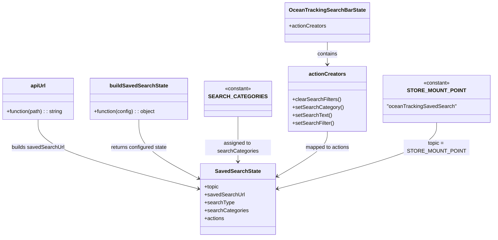

# Diagram: web/portal/src/pages/oceantracking/redux/OceanTracking.SavedSearchState.js

> Auto-generated by Obscura crawlers

## Mermaid

### SVG

<svg id="container" width="1451.3359375" xmlns="http://www.w3.org/2000/svg" class="classDiagram" height="722" viewBox="0 0 1451.3359375 722" role="graphics-document document" aria-roledescription="class"><g><defs><marker id="container_class-aggregationStart" class="marker aggregation class" refX="18" refY="7" markerWidth="190" markerHeight="240" orient="auto"><path d="M 18,7 L9,13 L1,7 L9,1 Z"></path></marker></defs><defs><marker id="container_class-aggregationEnd" class="marker aggregation class" refX="1" refY="7" markerWidth="20" markerHeight="28" orient="auto"><path d="M 18,7 L9,13 L1,7 L9,1 Z"></path></marker></defs><defs><marker id="container_class-extensionStart" class="marker extension class" refX="18" refY="7" markerWidth="190" markerHeight="240" orient="auto"><path d="M 1,7 L18,13 V 1 Z"></path></marker></defs><defs><marker id="container_class-extensionEnd" class="marker extension class" refX="1" refY="7" markerWidth="20" markerHeight="28" orient="auto"><path d="M 1,1 V 13 L18,7 Z"></path></marker></defs><defs><marker id="container_class-compositionStart" class="marker composition class" refX="18" refY="7" markerWidth="190" markerHeight="240" orient="auto"><path d="M 18,7 L9,13 L1,7 L9,1 Z"></path></marker></defs><defs><marker id="container_class-compositionEnd" class="marker composition class" refX="1" refY="7" markerWidth="20" markerHeight="28" orient="auto"><path d="M 18,7 L9,13 L1,7 L9,1 Z"></path></marker></defs><defs><marker id="container_class-dependencyStart" class="marker dependency class" refX="6" refY="7" markerWidth="190" markerHeight="240" orient="auto"><path d="M 5,7 L9,13 L1,7 L9,1 Z"></path></marker></defs><defs><marker id="container_class-dependencyEnd" class="marker dependency class" refX="13" refY="7" markerWidth="20" markerHeight="28" orient="auto"><path d="M 18,7 L9,13 L14,7 L9,1 Z"></path></marker></defs><defs><marker id="container_class-lollipopStart" class="marker lollipop class" refX="13" refY="7" markerWidth="190" markerHeight="240" orient="auto"><circle stroke="black" fill="transparent" cx="7" cy="7" r="6"></circle></marker></defs><defs><marker id="container_class-lollipopEnd" class="marker lollipop class" refX="1" refY="7" markerWidth="190" markerHeight="240" orient="auto"><circle stroke="black" fill="transparent" cx="7" cy="7" r="6"></circle></marker></defs><g class="root"><g class="clusters"></g><g class="edgePaths"><path d="M118.137,364L118.137,378.167C118.137,392.333,118.137,420.667,197.932,455.875C277.728,491.083,437.318,533.166,517.114,554.208L596.909,575.25" id="id_apiUrl_SavedSearchState_1" class="edge-thickness-normal edge-pattern-solid relation" style=";;;" data-edge="true" data-et="edge" data-id="id_apiUrl_SavedSearchState_1" data-points="W3sieCI6MTE4LjEzNjcxODc1LCJ5IjozNjR9LHsieCI6MTE4LjEzNjcxODc1LCJ5Ijo0NDl9LHsieCI6NjAyLjcxMDkzNzUsInkiOjU3Ni43NzkzOTEwMjA4MDQ1fV0=" marker-end="url(#container_class-dependencyEnd)"></path><path d="M426.84,364L426.84,378.167C426.84,392.333,426.84,420.667,455.275,450.405C483.709,480.144,540.579,511.288,569.014,526.86L597.448,542.432" id="id_buildSavedSearchState_SavedSearchState_2" class="edge-thickness-normal edge-pattern-solid relation" style=";;;" data-edge="true" data-et="edge" data-id="id_buildSavedSearchState_SavedSearchState_2" data-points="W3sieCI6NDI2LjgzOTg0Mzc1LCJ5IjozNjR9LHsieCI6NDI2LjgzOTg0Mzc1LCJ5Ijo0NDl9LHsieCI6NjAyLjcxMDkzNzUsInkiOjU0NS4zMTQ0MTE4NDg4NjQzfV0=" marker-end="url(#container_class-dependencyEnd)"></path><path d="M713.523,355L713.523,370.667C713.523,386.333,713.523,417.667,713.523,440.5C713.523,463.333,713.523,477.667,713.523,484.833L713.523,492" id="id_SEARCH_CATEGORIES_SavedSearchState_3" class="edge-thickness-normal edge-pattern-solid relation" style=";;;" data-edge="true" data-et="edge" data-id="id_SEARCH_CATEGORIES_SavedSearchState_3" data-points="W3sieCI6NzEzLjUyMzQzNzUsInkiOjM1NX0seyJ4Ijo3MTMuNTIzNDM3NSwieSI6NDQ5fSx7IngiOjcxMy41MjM0Mzc1LCJ5Ijo0OTh9XQ==" marker-end="url(#container_class-dependencyEnd)"></path><path d="M966.582,128L966.582,134.167C966.582,140.333,966.582,152.667,966.582,164C966.582,175.333,966.582,185.667,966.582,190.833L966.582,196" id="id_OceanTrackingSearchBarState_actionCreators_4" class="edge-thickness-normal edge-pattern-solid relation" style=";;;" data-edge="true" data-et="edge" data-id="id_OceanTrackingSearchBarState_actionCreators_4" data-points="W3sieCI6OTY2LjU4MjAzMTI1LCJ5IjoxMjh9LHsieCI6OTY2LjU4MjAzMTI1LCJ5IjoxNjV9LHsieCI6OTY2LjU4MjAzMTI1LCJ5IjoyMDJ9XQ==" marker-end="url(#container_class-dependencyEnd)"></path><path d="M966.582,400L966.582,408.167C966.582,416.333,966.582,432.667,943.724,455.015C920.866,477.363,875.15,505.725,852.292,519.906L829.434,534.088" id="id_actionCreators_SavedSearchState_5" class="edge-thickness-normal edge-pattern-solid relation" style=";;;" data-edge="true" data-et="edge" data-id="id_actionCreators_SavedSearchState_5" data-points="W3sieCI6OTY2LjU4MjAzMTI1LCJ5Ijo0MDB9LHsieCI6OTY2LjU4MjAzMTI1LCJ5Ijo0NDl9LHsieCI6ODI0LjMzNTkzNzUsInkiOjUzNy4yNTA4NTI4NDcxOTc2fV0=" marker-end="url(#container_class-dependencyEnd)"></path><path d="M1287.43,373L1287.43,385.667C1287.43,398.333,1287.43,423.667,1211.212,457.184C1134.994,490.701,982.559,532.402,906.341,553.252L830.123,574.102" id="id_STORE_MOUNT_POINT_SavedSearchState_6" class="edge-thickness-normal edge-pattern-solid relation" style=";;;" data-edge="true" data-et="edge" data-id="id_STORE_MOUNT_POINT_SavedSearchState_6" data-points="W3sieCI6MTI4Ny40Mjk2ODc1LCJ5IjozNzN9LHsieCI6MTI4Ny40Mjk2ODc1LCJ5Ijo0NDl9LHsieCI6ODI0LjMzNTkzNzUsInkiOjU3NS42ODU3MDY1MDY5NDI2fV0=" marker-end="url(#container_class-dependencyEnd)"></path></g><g class="edgeLabels"><g class="edgeLabel" transform="translate(118.13671875, 449)"><g class="label" data-id="id_apiUrl_SavedSearchState_1" transform="translate(-80.625, -12)"><foreignObject width="161.25" height="24">

builds savedSearchUrl

</foreignObject></g></g><g class="edgeLabel" transform="translate(426.83984375, 449)"><g class="label" data-id="id_buildSavedSearchState_SavedSearchState_2" transform="translate(-86.90625, -12)"><foreignObject width="173.8125" height="24">

returns configured state

</foreignObject></g></g><g class="edgeLabel" transform="translate(713.5234375, 449)"><g class="label" data-id="id_SEARCH_CATEGORIES_SavedSearchState_3" transform="translate(-100, -24)"><foreignObject width="200" height="48">

assigned to searchCategories

</foreignObject></g></g><g class="edgeLabel" transform="translate(966.58203125, 165)"><g class="label" data-id="id_OceanTrackingSearchBarState_actionCreators_4" transform="translate(-30.890625, -12)"><foreignObject width="61.78125" height="24">

contains

</foreignObject></g></g><g class="edgeLabel" transform="translate(966.58203125, 449)"><g class="label" data-id="id_actionCreators_SavedSearchState_5" transform="translate(-67.953125, -12)"><foreignObject width="135.90625" height="24">

mapped to actions

</foreignObject></g></g><g class="edgeLabel" transform="translate(1287.4296875, 449)"><g class="label" data-id="id_STORE_MOUNT_POINT_SavedSearchState_6" transform="translate(-100, -24)"><foreignObject width="200" height="48">

topic = STORE_MOUNT_POINT

</foreignObject></g></g></g><g class="nodes"><g class="node default" id="classId-apiUrl-0" transform="translate(118.13671875, 301)"><g class="basic label-container"><path d="M-110.13671875 -63 L110.13671875 -63 L110.13671875 63 L-110.13671875 63" stroke="none" stroke-width="0" fill="#ECECFF" style=""></path><path d="M-110.13671875 -63 C-29.853735718715683 -63, 50.429247312568634 -63, 110.13671875 -63 M-110.13671875 -63 C-54.51179997424861 -63, 1.1131188015027789 -63, 110.13671875 -63 M110.13671875 -63 C110.13671875 -33.769434954891935, 110.13671875 -4.5388699097838625, 110.13671875 63 M110.13671875 -63 C110.13671875 -26.099143685739364, 110.13671875 10.801712628521273, 110.13671875 63 M110.13671875 63 C51.83814450741213 63, -6.460429735175737 63, -110.13671875 63 M110.13671875 63 C56.7828654579361 63, 3.4290121658721944 63, -110.13671875 63 M-110.13671875 63 C-110.13671875 23.21781475706387, -110.13671875 -16.56437048587226, -110.13671875 -63 M-110.13671875 63 C-110.13671875 32.9173303465537, -110.13671875 2.834660693107402, -110.13671875 -63" stroke="#9370DB" stroke-width="1.3" fill="none" stroke-dasharray="0 0" style=""></path></g><g class="annotation-group text" transform="translate(0, -39)"></g><g class="label-group text" transform="translate(-22.2109375, -39)"><g class="label" style="font-weight: bolder" transform="translate(0,-12)"><foreignObject width="44.421875" height="24">

apiUrl

</foreignObject></g></g><g class="members-group text" transform="translate(-98.13671875, 9)"></g><g class="methods-group text" transform="translate(-98.13671875, 39)"><g class="label" style="" transform="translate(0,-12)"><foreignObject width="174.0625" height="24">

+function(path) : : string

</foreignObject></g></g><g class="divider" style=""><path d="M-110.13671875 -15 C-48.946462344783356 -15, 12.243794060433288 -15, 110.13671875 -15 M-110.13671875 -15 C-36.85225692827083 -15, 36.432204893458334 -15, 110.13671875 -15" stroke="#9370DB" stroke-width="1.3" fill="none" stroke-dasharray="0 0" style=""></path></g><g class="divider" style=""><path d="M-110.13671875 9 C-32.97415385380768 9, 44.188411042384644 9, 110.13671875 9 M-110.13671875 9 C-31.19936076712777 9, 47.73799721574446 9, 110.13671875 9" stroke="#9370DB" stroke-width="1.3" fill="none" stroke-dasharray="0 0" style=""></path></g></g><g class="node default" id="classId-buildSavedSearchState-1" transform="translate(426.83984375, 301)"><g class="basic label-container"><path d="M-148.56640625 -63 L148.56640625 -63 L148.56640625 63 L-148.56640625 63" stroke="none" stroke-width="0" fill="#ECECFF" style=""></path><path d="M-148.56640625 -63 C-55.07320328041388 -63, 38.41999968917224 -63, 148.56640625 -63 M-148.56640625 -63 C-60.734829159889244 -63, 27.09674793022151 -63, 148.56640625 -63 M148.56640625 -63 C148.56640625 -14.01429241971001, 148.56640625 34.97141516057998, 148.56640625 63 M148.56640625 -63 C148.56640625 -13.43547013680331, 148.56640625 36.12905972639338, 148.56640625 63 M148.56640625 63 C38.24877597027556 63, -72.06885430944888 63, -148.56640625 63 M148.56640625 63 C41.14757910968585 63, -66.2712480306283 63, -148.56640625 63 M-148.56640625 63 C-148.56640625 18.846025773878864, -148.56640625 -25.30794845224227, -148.56640625 -63 M-148.56640625 63 C-148.56640625 24.553410551821813, -148.56640625 -13.893178896356375, -148.56640625 -63" stroke="#9370DB" stroke-width="1.3" fill="none" stroke-dasharray="0 0" style=""></path></g><g class="annotation-group text" transform="translate(0, -39)"></g><g class="label-group text" transform="translate(-84.8671875, -39)"><g class="label" style="font-weight: bolder" transform="translate(0,-12)"><foreignObject width="169.734375" height="24">

buildSavedSearchState

</foreignObject></g></g><g class="members-group text" transform="translate(-136.56640625, 9)"></g><g class="methods-group text" transform="translate(-136.56640625, 39)"><g class="label" style="" transform="translate(0,-12)"><foreignObject width="188.265625" height="24">

+function(config) : : object

</foreignObject></g></g><g class="divider" style=""><path d="M-148.56640625 -15 C-73.77773849277582 -15, 1.0109292644483503 -15, 148.56640625 -15 M-148.56640625 -15 C-66.08767491473809 -15, 16.391056420523824 -15, 148.56640625 -15" stroke="#9370DB" stroke-width="1.3" fill="none" stroke-dasharray="0 0" style=""></path></g><g class="divider" style=""><path d="M-148.56640625 9 C-70.10998414052116 9, 8.346437968957673 9, 148.56640625 9 M-148.56640625 9 C-48.58234231168912 9, 51.401721626621764 9, 148.56640625 9" stroke="#9370DB" stroke-width="1.3" fill="none" stroke-dasharray="0 0" style=""></path></g></g><g class="node default" id="classId-SEARCH_CATEGORIES-2" transform="translate(713.5234375, 301)"><g class="basic label-container"><path d="M-88.1171875 -54 L88.1171875 -54 L88.1171875 54 L-88.1171875 54" stroke="none" stroke-width="0" fill="#ECECFF" style=""></path><path d="M-88.1171875 -54 C-40.23446748156978 -54, 7.64825253686044 -54, 88.1171875 -54 M-88.1171875 -54 C-35.29703076942298 -54, 17.523125961154037 -54, 88.1171875 -54 M88.1171875 -54 C88.1171875 -30.970797363692643, 88.1171875 -7.9415947273852865, 88.1171875 54 M88.1171875 -54 C88.1171875 -20.87156889968687, 88.1171875 12.256862200626259, 88.1171875 54 M88.1171875 54 C26.598283502195244 54, -34.92062049560951 54, -88.1171875 54 M88.1171875 54 C43.14908843844863 54, -1.8190106231027414 54, -88.1171875 54 M-88.1171875 54 C-88.1171875 31.53559368274642, -88.1171875 9.07118736549284, -88.1171875 -54 M-88.1171875 54 C-88.1171875 19.414570692966898, -88.1171875 -15.170858614066205, -88.1171875 -54" stroke="#9370DB" stroke-width="1.3" fill="none" stroke-dasharray="0 0" style=""></path></g><g class="annotation-group text" transform="translate(-40.4921875, -30)"><g class="label" style="" transform="translate(0,-12)"><foreignObject width="80.984375" height="24">

«constant»

</foreignObject></g></g><g class="label-group text" transform="translate(-76.1171875, -6)"><g class="label" style="font-weight: bolder" transform="translate(0,-12)"><foreignObject width="152.234375" height="24">

SEARCH_CATEGORIES

</foreignObject></g></g><g class="members-group text" transform="translate(-76.1171875, 42)"></g><g class="methods-group text" transform="translate(-76.1171875, 72)"></g><g class="divider" style=""><path d="M-88.1171875 18 C-45.568263581230454 18, -3.019339662460908 18, 88.1171875 18 M-88.1171875 18 C-20.331774580292006 18, 47.45363833941599 18, 88.1171875 18" stroke="#9370DB" stroke-width="1.3" fill="none" stroke-dasharray="0 0" style=""></path></g><g class="divider" style=""><path d="M-88.1171875 36 C-42.44971780984609 36, 3.217751880307816 36, 88.1171875 36 M-88.1171875 36 C-43.773844780156125 36, 0.56949793968775 36, 88.1171875 36" stroke="#9370DB" stroke-width="1.3" fill="none" stroke-dasharray="0 0" style=""></path></g></g><g class="node default" id="classId-OceanTrackingSearchBarState-3" transform="translate(966.58203125, 68)"><g class="basic label-container"><path d="M-123.546875 -60 L123.546875 -60 L123.546875 60 L-123.546875 60" stroke="none" stroke-width="0" fill="#ECECFF" style=""></path><path d="M-123.546875 -60 C-55.58305486086431 -60, 12.380765278271383 -60, 123.546875 -60 M-123.546875 -60 C-51.98992874934231 -60, 19.567017501315377 -60, 123.546875 -60 M123.546875 -60 C123.546875 -27.95975519333542, 123.546875 4.0804896133291635, 123.546875 60 M123.546875 -60 C123.546875 -17.605051617226778, 123.546875 24.789896765546445, 123.546875 60 M123.546875 60 C53.78807889697403 60, -15.970717206051944 60, -123.546875 60 M123.546875 60 C61.0682440380514 60, -1.4103869238972067 60, -123.546875 60 M-123.546875 60 C-123.546875 21.2724818504716, -123.546875 -17.4550362990568, -123.546875 -60 M-123.546875 60 C-123.546875 15.475690826887288, -123.546875 -29.048618346225425, -123.546875 -60" stroke="#9370DB" stroke-width="1.3" fill="none" stroke-dasharray="0 0" style=""></path></g><g class="annotation-group text" transform="translate(0, -36)"></g><g class="label-group text" transform="translate(-110.015625, -36)"><g class="label" style="font-weight: bolder" transform="translate(0,-12)"><foreignObject width="220.03125" height="24">

OceanTrackingSearchBarState

</foreignObject></g></g><g class="members-group text" transform="translate(-111.546875, 12)"><g class="label" style="" transform="translate(0,-12)"><foreignObject width="113.078125" height="24">

+actionCreators

</foreignObject></g></g><g class="methods-group text" transform="translate(-111.546875, 60)"></g><g class="divider" style=""><path d="M-123.546875 -12 C-36.94720306763793 -12, 49.65246886472414 -12, 123.546875 -12 M-123.546875 -12 C-48.73296173055587 -12, 26.080951538888257 -12, 123.546875 -12" stroke="#9370DB" stroke-width="1.3" fill="none" stroke-dasharray="0 0" style=""></path></g><g class="divider" style=""><path d="M-123.546875 36 C-39.40198116219646 36, 44.74291267560707 36, 123.546875 36 M-123.546875 36 C-24.7818009165466 36, 73.9832731669068 36, 123.546875 36" stroke="#9370DB" stroke-width="1.3" fill="none" stroke-dasharray="0 0" style=""></path></g></g><g class="node default" id="classId-actionCreators-4" transform="translate(966.58203125, 301)"><g class="basic label-container"><path d="M-114.94140625 -99 L114.94140625 -99 L114.94140625 99 L-114.94140625 99" stroke="none" stroke-width="0" fill="#ECECFF" style=""></path><path d="M-114.94140625 -99 C-55.695211777523184 -99, 3.550982694953632 -99, 114.94140625 -99 M-114.94140625 -99 C-36.07312412544471 -99, 42.795157999110586 -99, 114.94140625 -99 M114.94140625 -99 C114.94140625 -58.84018748954976, 114.94140625 -18.680374979099525, 114.94140625 99 M114.94140625 -99 C114.94140625 -38.599782222087725, 114.94140625 21.80043555582455, 114.94140625 99 M114.94140625 99 C36.02883359207081 99, -42.88373906585838 99, -114.94140625 99 M114.94140625 99 C30.316942054944278 99, -54.307522140111445 99, -114.94140625 99 M-114.94140625 99 C-114.94140625 32.21052528260974, -114.94140625 -34.578949434780526, -114.94140625 -99 M-114.94140625 99 C-114.94140625 48.189582581609585, -114.94140625 -2.62083483678083, -114.94140625 -99" stroke="#9370DB" stroke-width="1.3" fill="none" stroke-dasharray="0 0" style=""></path></g><g class="annotation-group text" transform="translate(0, -75)"></g><g class="label-group text" transform="translate(-53.6328125, -75)"><g class="label" style="font-weight: bolder" transform="translate(0,-12)"><foreignObject width="107.265625" height="24">

actionCreators

</foreignObject></g></g><g class="members-group text" transform="translate(-102.94140625, -27)"></g><g class="methods-group text" transform="translate(-102.94140625, 3)"><g class="label" style="" transform="translate(0,-12)"><foreignObject width="146.921875" height="24">

+clearSearchFilters()

</foreignObject></g><g class="label" style="" transform="translate(0,12)"><foreignObject width="152.25" height="24">

+setSearchCategory()

</foreignObject></g><g class="label" style="" transform="translate(0,36)"><foreignObject width="118.53125" height="24">

+setSearchText()

</foreignObject></g><g class="label" style="" transform="translate(0,60)"><foreignObject width="125.953125" height="24">

+setSearchFilter()

</foreignObject></g></g><g class="divider" style=""><path d="M-114.94140625 -51 C-50.16270090533368 -51, 14.616004439332642 -51, 114.94140625 -51 M-114.94140625 -51 C-59.55914074705087 -51, -4.176875244101737 -51, 114.94140625 -51" stroke="#9370DB" stroke-width="1.3" fill="none" stroke-dasharray="0 0" style=""></path></g><g class="divider" style=""><path d="M-114.94140625 -27 C-34.06133715140405 -27, 46.81873194719191 -27, 114.94140625 -27 M-114.94140625 -27 C-61.925426724037905 -27, -8.90944719807581 -27, 114.94140625 -27" stroke="#9370DB" stroke-width="1.3" fill="none" stroke-dasharray="0 0" style=""></path></g></g><g class="node default" id="classId-STORE_MOUNT_POINT-5" transform="translate(1287.4296875, 301)"><g class="basic label-container"><path d="M-155.90625 -72 L155.90625 -72 L155.90625 72 L-155.90625 72" stroke="none" stroke-width="0" fill="#ECECFF" style=""></path><path d="M-155.90625 -72 C-69.55507577343172 -72, 16.79609845313655 -72, 155.90625 -72 M-155.90625 -72 C-32.1626413963732 -72, 91.5809672072536 -72, 155.90625 -72 M155.90625 -72 C155.90625 -25.266414167884065, 155.90625 21.46717166423187, 155.90625 72 M155.90625 -72 C155.90625 -31.475484673738677, 155.90625 9.049030652522646, 155.90625 72 M155.90625 72 C73.95533143538344 72, -7.995587129233115 72, -155.90625 72 M155.90625 72 C36.645661325761395 72, -82.61492734847721 72, -155.90625 72 M-155.90625 72 C-155.90625 29.17677623911389, -155.90625 -13.646447521772217, -155.90625 -72 M-155.90625 72 C-155.90625 30.30008473170183, -155.90625 -11.39983053659634, -155.90625 -72" stroke="#9370DB" stroke-width="1.3" fill="none" stroke-dasharray="0 0" style=""></path></g><g class="annotation-group text" transform="translate(-40.4921875, -48)"><g class="label" style="" transform="translate(0,-12)"><foreignObject width="80.984375" height="24">

«constant»

</foreignObject></g></g><g class="label-group text" transform="translate(-79.90625, -24)"><g class="label" style="font-weight: bolder" transform="translate(0,-12)"><foreignObject width="159.8125" height="24">

STORE_MOUNT_POINT

</foreignObject></g></g><g class="members-group text" transform="translate(-143.90625, 24)"><g class="label" style="" transform="translate(0,-12)"><foreignObject width="207.90625" height="24">

"oceanTrackingSavedSearch"

</foreignObject></g></g><g class="methods-group text" transform="translate(-143.90625, 72)"></g><g class="divider" style=""><path d="M-155.90625 0 C-71.83920281197969 0, 12.227844376040622 0, 155.90625 0 M-155.90625 0 C-87.80621416265586 0, -19.706178325311726 0, 155.90625 0" stroke="#9370DB" stroke-width="1.3" fill="none" stroke-dasharray="0 0" style=""></path></g><g class="divider" style=""><path d="M-155.90625 48 C-56.019089716444114 48, 43.86807056711177 48, 155.90625 48 M-155.90625 48 C-56.4737506633581 48, 42.95874867328379 48, 155.90625 48" stroke="#9370DB" stroke-width="1.3" fill="none" stroke-dasharray="0 0" style=""></path></g></g><g class="node default" id="classId-SavedSearchState-6" transform="translate(713.5234375, 606)"><g class="basic label-container"><path d="M-110.8125 -108 L110.8125 -108 L110.8125 108 L-110.8125 108" stroke="none" stroke-width="0" fill="#ECECFF" style=""></path><path d="M-110.8125 -108 C-47.569608870421504 -108, 15.673282259156991 -108, 110.8125 -108 M-110.8125 -108 C-55.92763919157313 -108, -1.0427783831462563 -108, 110.8125 -108 M110.8125 -108 C110.8125 -53.9602746319903, 110.8125 0.07945073601939612, 110.8125 108 M110.8125 -108 C110.8125 -41.94089514092984, 110.8125 24.11820971814032, 110.8125 108 M110.8125 108 C60.157481299411074 108, 9.502462598822149 108, -110.8125 108 M110.8125 108 C64.94594714125975 108, 19.0793942825195 108, -110.8125 108 M-110.8125 108 C-110.8125 46.44257058982561, -110.8125 -15.114858820348786, -110.8125 -108 M-110.8125 108 C-110.8125 55.60306540309498, -110.8125 3.206130806189961, -110.8125 -108" stroke="#9370DB" stroke-width="1.3" fill="none" stroke-dasharray="0 0" style=""></path></g><g class="annotation-group text" transform="translate(0, -84)"></g><g class="label-group text" transform="translate(-66.125, -84)"><g class="label" style="font-weight: bolder" transform="translate(0,-12)"><foreignObject width="132.25" height="24">

SavedSearchState

</foreignObject></g></g><g class="members-group text" transform="translate(-98.8125, -36)"><g class="label" style="" transform="translate(0,-12)"><foreignObject width="44.453125" height="24">

+topic

</foreignObject></g><g class="label" style="" transform="translate(0,12)"><foreignObject width="120.03125" height="24">

+savedSearchUrl

</foreignObject></g><g class="label" style="" transform="translate(0,36)"><foreignObject width="89.171875" height="24">

+searchType

</foreignObject></g><g class="label" style="" transform="translate(0,60)"><foreignObject width="131.5" height="24">

+searchCategories

</foreignObject></g><g class="label" style="" transform="translate(0,84)"><foreignObject width="60.578125" height="24">

+actions

</foreignObject></g></g><g class="methods-group text" transform="translate(-98.8125, 108)"></g><g class="divider" style=""><path d="M-110.8125 -60 C-25.666004840052295 -60, 59.48049031989541 -60, 110.8125 -60 M-110.8125 -60 C-54.175450745622484 -60, 2.4615985087550314 -60, 110.8125 -60" stroke="#9370DB" stroke-width="1.3" fill="none" stroke-dasharray="0 0" style=""></path></g><g class="divider" style=""><path d="M-110.8125 84 C-24.87538915307823 84, 61.06172169384354 84, 110.8125 84 M-110.8125 84 C-63.3121298408556 84, -15.811759681711195 84, 110.8125 84" stroke="#9370DB" stroke-width="1.3" fill="none" stroke-dasharray="0 0" style=""></path></g></g></g></g></g></svg>
