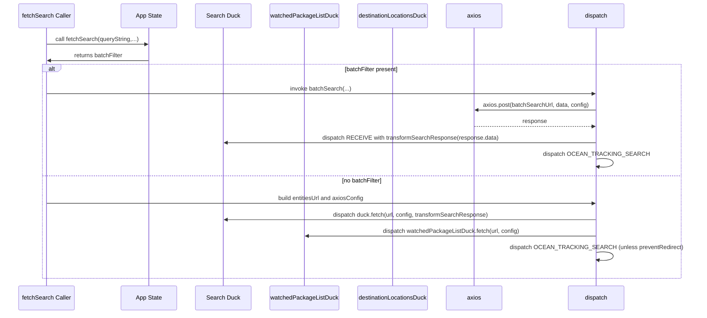
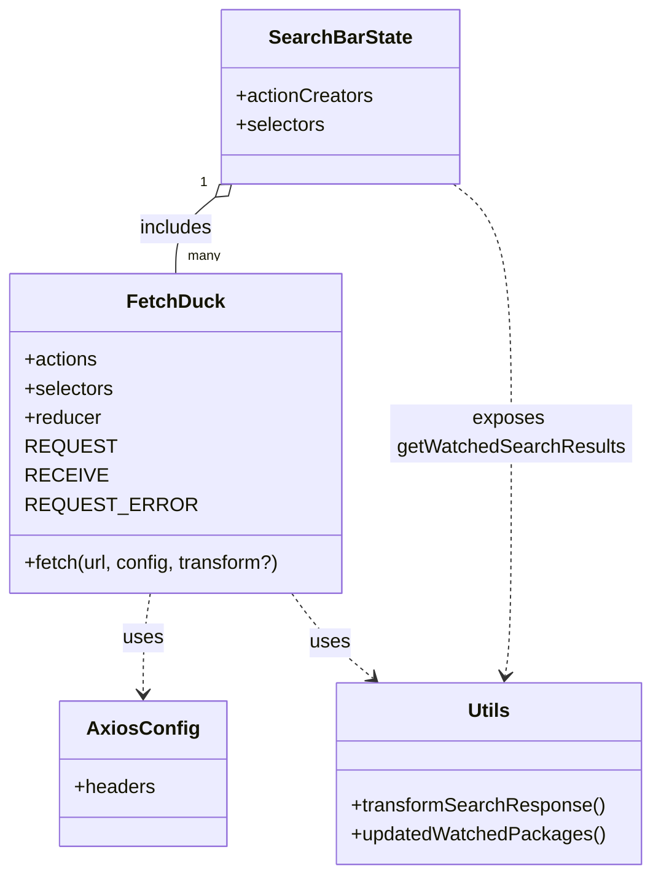
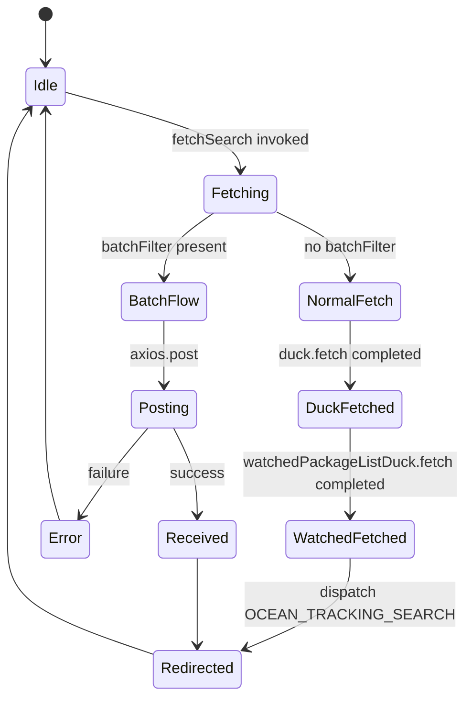

# Diagram: web/portal/src/pages/oceantracking/redux/OceanTracking.SearchBarState.js


> Auto-generated by Obscura crawlers

## Diagram 1

```mermaid
flowchart TD
  A[SearchBarState\n(buildSearchBarState)] -->|uses| B(fetchSearch)
  A -->|includes reducers| C[wacthedPackageListDuck.reducer]
  A -->|includes reducers| D[destinationLocationsDuck.reducer]
  B --> E{batchFilter?}
  E -- yes --> F[batchSearch]
  E -- no --> G[entitiesUrl] --> H[dispatch duck.fetch(url, axiosConfig(), transformSearchResponse)]
  H --> I[fetchWatchedPackageIDs] --> J[watchedPackageListDuck.fetch]
  H --> K[dispatch OCEAN_TRACKING_SEARCH]
  F --> L[batchSearchUrl] --> M[axios.post(url, data, config)]
  M -->|then| N[dispatch duck.actions.RECEIVE\n(payload: transformSearchResponse(response.data))]
  M -->|then| K
  M -->|catch| O[dispatch duck.actions.REQUEST_ERROR]
  P[axiosConfig] -->|provides headers| H
  P -->|provides headers| M
  Q[destinationLocationsDuck] -->|selectors.getData| R[getShowDestinationFilter]
  S[updatedWatchedPackages] -->|used by| T[getWatchedSearchResults]
  U[watchedPackageListDuck.selectors.getData] --> T
  V[transformSearchResponse] --> H
  V --> N
```

> SVG rendering failed for this diagram.

## Diagram 2



### SVG

<svg id="container" width="1968.5" xmlns="http://www.w3.org/2000/svg" height="889" viewBox="-50 -10 1968.5 889" role="graphics-document document" aria-roledescription="sequence"><g><rect x="1563" y="803" fill="#eaeaea" stroke="#666" width="150" height="65" name="Dispatcher" rx="3" ry="3" class="actor actor-bottom"></rect><text x="1638" y="835.5" dominant-baseline="central" alignment-baseline="central" class="actor actor-box" style="text-anchor: middle; font-size: 16px; font-weight: 400;"><tspan x="1638" dy="0">dispatch</tspan></text></g><g><rect x="1206" y="803" fill="#eaeaea" stroke="#666" width="150" height="65" name="Axios" rx="3" ry="3" class="actor actor-bottom"></rect><text x="1281" y="835.5" dominant-baseline="central" alignment-baseline="central" class="actor actor-box" style="text-anchor: middle; font-size: 16px; font-weight: 400;"><tspan x="1281" dy="0">axios</tspan></text></g><g><rect x="947" y="803" fill="#eaeaea" stroke="#666" width="209" height="65" name="DestDuck" rx="3" ry="3" class="actor actor-bottom"></rect><text x="1051.5" y="835.5" dominant-baseline="central" alignment-baseline="central" class="actor actor-box" style="text-anchor: middle; font-size: 16px; font-weight: 400;"><tspan x="1051.5" dy="0">destinationLocationsDuck</tspan></text></g><g><rect x="696" y="803" fill="#eaeaea" stroke="#666" width="201" height="65" name="WatchedDuck" rx="3" ry="3" class="actor actor-bottom"></rect><text x="796.5" y="835.5" dominant-baseline="central" alignment-baseline="central" class="actor actor-box" style="text-anchor: middle; font-size: 16px; font-weight: 400;"><tspan x="796.5" dy="0">watchedPackageListDuck</tspan></text></g><g><rect x="496" y="803" fill="#eaeaea" stroke="#666" width="150" height="65" name="Duck" rx="3" ry="3" class="actor actor-bottom"></rect><text x="571" y="835.5" dominant-baseline="central" alignment-baseline="central" class="actor actor-box" style="text-anchor: middle; font-size: 16px; font-weight: 400;"><tspan x="571" dy="0">Search Duck</tspan></text></g><g><rect x="296" y="803" fill="#eaeaea" stroke="#666" width="150" height="65" name="State" rx="3" ry="3" class="actor actor-bottom"></rect><text x="371" y="835.5" dominant-baseline="central" alignment-baseline="central" class="actor actor-box" style="text-anchor: middle; font-size: 16px; font-weight: 400;"><tspan x="371" dy="0">App State</tspan></text></g><g><rect x="0" y="803" fill="#eaeaea" stroke="#666" width="152" height="65" name="Caller" rx="3" ry="3" class="actor actor-bottom"></rect><text x="76" y="835.5" dominant-baseline="central" alignment-baseline="central" class="actor actor-box" style="text-anchor: middle; font-size: 16px; font-weight: 400;"><tspan x="76" dy="0">fetchSearch Caller</tspan></text></g><g><line id="actor6" x1="1638" y1="65" x2="1638" y2="803" class="actor-line 200" stroke-width="0.5px" stroke="#999" name="Dispatcher"></line><g id="root-6"><rect x="1563" y="0" fill="#eaeaea" stroke="#666" width="150" height="65" name="Dispatcher" rx="3" ry="3" class="actor actor-top"></rect><text x="1638" y="32.5" dominant-baseline="central" alignment-baseline="central" class="actor actor-box" style="text-anchor: middle; font-size: 16px; font-weight: 400;"><tspan x="1638" dy="0">dispatch</tspan></text></g></g><g><line id="actor5" x1="1281" y1="65" x2="1281" y2="803" class="actor-line 200" stroke-width="0.5px" stroke="#999" name="Axios"></line><g id="root-5"><rect x="1206" y="0" fill="#eaeaea" stroke="#666" width="150" height="65" name="Axios" rx="3" ry="3" class="actor actor-top"></rect><text x="1281" y="32.5" dominant-baseline="central" alignment-baseline="central" class="actor actor-box" style="text-anchor: middle; font-size: 16px; font-weight: 400;"><tspan x="1281" dy="0">axios</tspan></text></g></g><g><line id="actor4" x1="1051.5" y1="65" x2="1051.5" y2="803" class="actor-line 200" stroke-width="0.5px" stroke="#999" name="DestDuck"></line><g id="root-4"><rect x="947" y="0" fill="#eaeaea" stroke="#666" width="209" height="65" name="DestDuck" rx="3" ry="3" class="actor actor-top"></rect><text x="1051.5" y="32.5" dominant-baseline="central" alignment-baseline="central" class="actor actor-box" style="text-anchor: middle; font-size: 16px; font-weight: 400;"><tspan x="1051.5" dy="0">destinationLocationsDuck</tspan></text></g></g><g><line id="actor3" x1="796.5" y1="65" x2="796.5" y2="803" class="actor-line 200" stroke-width="0.5px" stroke="#999" name="WatchedDuck"></line><g id="root-3"><rect x="696" y="0" fill="#eaeaea" stroke="#666" width="201" height="65" name="WatchedDuck" rx="3" ry="3" class="actor actor-top"></rect><text x="796.5" y="32.5" dominant-baseline="central" alignment-baseline="central" class="actor actor-box" style="text-anchor: middle; font-size: 16px; font-weight: 400;"><tspan x="796.5" dy="0">watchedPackageListDuck</tspan></text></g></g><g><line id="actor2" x1="571" y1="65" x2="571" y2="803" class="actor-line 200" stroke-width="0.5px" stroke="#999" name="Duck"></line><g id="root-2"><rect x="496" y="0" fill="#eaeaea" stroke="#666" width="150" height="65" name="Duck" rx="3" ry="3" class="actor actor-top"></rect><text x="571" y="32.5" dominant-baseline="central" alignment-baseline="central" class="actor actor-box" style="text-anchor: middle; font-size: 16px; font-weight: 400;"><tspan x="571" dy="0">Search Duck</tspan></text></g></g><g><line id="actor1" x1="371" y1="65" x2="371" y2="803" class="actor-line 200" stroke-width="0.5px" stroke="#999" name="State"></line><g id="root-1"><rect x="296" y="0" fill="#eaeaea" stroke="#666" width="150" height="65" name="State" rx="3" ry="3" class="actor actor-top"></rect><text x="371" y="32.5" dominant-baseline="central" alignment-baseline="central" class="actor actor-box" style="text-anchor: middle; font-size: 16px; font-weight: 400;"><tspan x="371" dy="0">App State</tspan></text></g></g><g><line id="actor0" x1="76" y1="65" x2="76" y2="803" class="actor-line 200" stroke-width="0.5px" stroke="#999" name="Caller"></line><g id="root-0"><rect x="0" y="0" fill="#eaeaea" stroke="#666" width="152" height="65" name="Caller" rx="3" ry="3" class="actor actor-top"></rect><text x="76" y="32.5" dominant-baseline="central" alignment-baseline="central" class="actor actor-box" style="text-anchor: middle; font-size: 16px; font-weight: 400;"><tspan x="76" dy="0">fetchSearch Caller</tspan></text></g></g><style>#container{font-family:"trebuchet ms",verdana,arial,sans-serif;font-size:16px;fill:#333;}@keyframes edge-animation-frame{from{stroke-dashoffset:0;}}@keyframes dash{to{stroke-dashoffset:0;}}#container .edge-animation-slow{stroke-dasharray:9,5!important;stroke-dashoffset:900;animation:dash 50s linear infinite;stroke-linecap:round;}#container .edge-animation-fast{stroke-dasharray:9,5!important;stroke-dashoffset:900;animation:dash 20s linear infinite;stroke-linecap:round;}#container .error-icon{fill:#552222;}#container .error-text{fill:#552222;stroke:#552222;}#container .edge-thickness-normal{stroke-width:1px;}#container .edge-thickness-thick{stroke-width:3.5px;}#container .edge-pattern-solid{stroke-dasharray:0;}#container .edge-thickness-invisible{stroke-width:0;fill:none;}#container .edge-pattern-dashed{stroke-dasharray:3;}#container .edge-pattern-dotted{stroke-dasharray:2;}#container .marker{fill:#333333;stroke:#333333;}#container .marker.cross{stroke:#333333;}#container svg{font-family:"trebuchet ms",verdana,arial,sans-serif;font-size:16px;}#container p{margin:0;}#container .actor{stroke:hsl(259.6261682243, 59.7765363128%, 87.9019607843%);fill:#ECECFF;}#container text.actor&gt;tspan{fill:black;stroke:none;}#container .actor-line{stroke:hsl(259.6261682243, 59.7765363128%, 87.9019607843%);}#container .innerArc{stroke-width:1.5;stroke-dasharray:none;}#container .messageLine0{stroke-width:1.5;stroke-dasharray:none;stroke:#333;}#container .messageLine1{stroke-width:1.5;stroke-dasharray:2,2;stroke:#333;}#container #arrowhead path{fill:#333;stroke:#333;}#container .sequenceNumber{fill:white;}#container #sequencenumber{fill:#333;}#container #crosshead path{fill:#333;stroke:#333;}#container .messageText{fill:#333;stroke:none;}#container .labelBox{stroke:hsl(259.6261682243, 59.7765363128%, 87.9019607843%);fill:#ECECFF;}#container .labelText,#container .labelText&gt;tspan{fill:black;stroke:none;}#container .loopText,#container .loopText&gt;tspan{fill:black;stroke:none;}#container .loopLine{stroke-width:2px;stroke-dasharray:2,2;stroke:hsl(259.6261682243, 59.7765363128%, 87.9019607843%);fill:hsl(259.6261682243, 59.7765363128%, 87.9019607843%);}#container .note{stroke:#aaaa33;fill:#fff5ad;}#container .noteText,#container .noteText&gt;tspan{fill:black;stroke:none;}#container .activation0{fill:#f4f4f4;stroke:#666;}#container .activation1{fill:#f4f4f4;stroke:#666;}#container .activation2{fill:#f4f4f4;stroke:#666;}#container .actorPopupMenu{position:absolute;}#container .actorPopupMenuPanel{position:absolute;fill:#ECECFF;box-shadow:0px 8px 16px 0px rgba(0,0,0,0.2);filter:drop-shadow(3px 5px 2px rgb(0 0 0 / 0.4));}#container .actor-man line{stroke:hsl(259.6261682243, 59.7765363128%, 87.9019607843%);fill:#ECECFF;}#container .actor-man circle,#container line{stroke:hsl(259.6261682243, 59.7765363128%, 87.9019607843%);fill:#ECECFF;stroke-width:2px;}#container :root{--mermaid-font-family:"trebuchet ms",verdana,arial,sans-serif;}</style><g></g><defs><symbol id="computer" width="24" height="24"><path transform="scale(.5)" d="M2 2v13h20v-13h-20zm18 11h-16v-9h16v9zm-10.228 6l.466-1h3.524l.467 1h-4.457zm14.228 3h-24l2-6h2.104l-1.33 4h18.45l-1.297-4h2.073l2 6zm-5-10h-14v-7h14v7z"></path></symbol></defs><defs><symbol id="database" fill-rule="evenodd" clip-rule="evenodd"><path transform="scale(.5)" d="M12.258.001l.256.004.255.005.253.008.251.01.249.012.247.015.246.016.242.019.241.02.239.023.236.024.233.027.231.028.229.031.225.032.223.034.22.036.217.038.214.04.211.041.208.043.205.045.201.046.198.048.194.05.191.051.187.053.183.054.18.056.175.057.172.059.168.06.163.061.16.063.155.064.15.066.074.033.073.033.071.034.07.034.069.035.068.035.067.035.066.035.064.036.064.036.062.036.06.036.06.037.058.037.058.037.055.038.055.038.053.038.052.038.051.039.05.039.048.039.047.039.045.04.044.04.043.04.041.04.04.041.039.041.037.041.036.041.034.041.033.042.032.042.03.042.029.042.027.042.026.043.024.043.023.043.021.043.02.043.018.044.017.043.015.044.013.044.012.044.011.045.009.044.007.045.006.045.004.045.002.045.001.045v17l-.001.045-.002.045-.004.045-.006.045-.007.045-.009.044-.011.045-.012.044-.013.044-.015.044-.017.043-.018.044-.02.043-.021.043-.023.043-.024.043-.026.043-.027.042-.029.042-.03.042-.032.042-.033.042-.034.041-.036.041-.037.041-.039.041-.04.041-.041.04-.043.04-.044.04-.045.04-.047.039-.048.039-.05.039-.051.039-.052.038-.053.038-.055.038-.055.038-.058.037-.058.037-.06.037-.06.036-.062.036-.064.036-.064.036-.066.035-.067.035-.068.035-.069.035-.07.034-.071.034-.073.033-.074.033-.15.066-.155.064-.16.063-.163.061-.168.06-.172.059-.175.057-.18.056-.183.054-.187.053-.191.051-.194.05-.198.048-.201.046-.205.045-.208.043-.211.041-.214.04-.217.038-.22.036-.223.034-.225.032-.229.031-.231.028-.233.027-.236.024-.239.023-.241.02-.242.019-.246.016-.247.015-.249.012-.251.01-.253.008-.255.005-.256.004-.258.001-.258-.001-.256-.004-.255-.005-.253-.008-.251-.01-.249-.012-.247-.015-.245-.016-.243-.019-.241-.02-.238-.023-.236-.024-.234-.027-.231-.028-.228-.031-.226-.032-.223-.034-.22-.036-.217-.038-.214-.04-.211-.041-.208-.043-.204-.045-.201-.046-.198-.048-.195-.05-.19-.051-.187-.053-.184-.054-.179-.056-.176-.057-.172-.059-.167-.06-.164-.061-.159-.063-.155-.064-.151-.066-.074-.033-.072-.033-.072-.034-.07-.034-.069-.035-.068-.035-.067-.035-.066-.035-.064-.036-.063-.036-.062-.036-.061-.036-.06-.037-.058-.037-.057-.037-.056-.038-.055-.038-.053-.038-.052-.038-.051-.039-.049-.039-.049-.039-.046-.039-.046-.04-.044-.04-.043-.04-.041-.04-.04-.041-.039-.041-.037-.041-.036-.041-.034-.041-.033-.042-.032-.042-.03-.042-.029-.042-.027-.042-.026-.043-.024-.043-.023-.043-.021-.043-.02-.043-.018-.044-.017-.043-.015-.044-.013-.044-.012-.044-.011-.045-.009-.044-.007-.045-.006-.045-.004-.045-.002-.045-.001-.045v-17l.001-.045.002-.045.004-.045.006-.045.007-.045.009-.044.011-.045.012-.044.013-.044.015-.044.017-.043.018-.044.02-.043.021-.043.023-.043.024-.043.026-.043.027-.042.029-.042.03-.042.032-.042.033-.042.034-.041.036-.041.037-.041.039-.041.04-.041.041-.04.043-.04.044-.04.046-.04.046-.039.049-.039.049-.039.051-.039.052-.038.053-.038.055-.038.056-.038.057-.037.058-.037.06-.037.061-.036.062-.036.063-.036.064-.036.066-.035.067-.035.068-.035.069-.035.07-.034.072-.034.072-.033.074-.033.151-.066.155-.064.159-.063.164-.061.167-.06.172-.059.176-.057.179-.056.184-.054.187-.053.19-.051.195-.05.198-.048.201-.046.204-.045.208-.043.211-.041.214-.04.217-.038.22-.036.223-.034.226-.032.228-.031.231-.028.234-.027.236-.024.238-.023.241-.02.243-.019.245-.016.247-.015.249-.012.251-.01.253-.008.255-.005.256-.004.258-.001.258.001zm-9.258 20.499v.01l.001.021.003.021.004.022.005.021.006.022.007.022.009.023.01.022.011.023.012.023.013.023.015.023.016.024.017.023.018.024.019.024.021.024.022.025.023.024.024.025.052.049.056.05.061.051.066.051.07.051.075.051.079.052.084.052.088.052.092.052.097.052.102.051.105.052.11.052.114.051.119.051.123.051.127.05.131.05.135.05.139.048.144.049.147.047.152.047.155.047.16.045.163.045.167.043.171.043.176.041.178.041.183.039.187.039.19.037.194.035.197.035.202.033.204.031.209.03.212.029.216.027.219.025.222.024.226.021.23.02.233.018.236.016.24.015.243.012.246.01.249.008.253.005.256.004.259.001.26-.001.257-.004.254-.005.25-.008.247-.011.244-.012.241-.014.237-.016.233-.018.231-.021.226-.021.224-.024.22-.026.216-.027.212-.028.21-.031.205-.031.202-.034.198-.034.194-.036.191-.037.187-.039.183-.04.179-.04.175-.042.172-.043.168-.044.163-.045.16-.046.155-.046.152-.047.148-.048.143-.049.139-.049.136-.05.131-.05.126-.05.123-.051.118-.052.114-.051.11-.052.106-.052.101-.052.096-.052.092-.052.088-.053.083-.051.079-.052.074-.052.07-.051.065-.051.06-.051.056-.05.051-.05.023-.024.023-.025.021-.024.02-.024.019-.024.018-.024.017-.024.015-.023.014-.024.013-.023.012-.023.01-.023.01-.022.008-.022.006-.022.006-.022.004-.022.004-.021.001-.021.001-.021v-4.127l-.077.055-.08.053-.083.054-.085.053-.087.052-.09.052-.093.051-.095.05-.097.05-.1.049-.102.049-.105.048-.106.047-.109.047-.111.046-.114.045-.115.045-.118.044-.12.043-.122.042-.124.042-.126.041-.128.04-.13.04-.132.038-.134.038-.135.037-.138.037-.139.035-.142.035-.143.034-.144.033-.147.032-.148.031-.15.03-.151.03-.153.029-.154.027-.156.027-.158.026-.159.025-.161.024-.162.023-.163.022-.165.021-.166.02-.167.019-.169.018-.169.017-.171.016-.173.015-.173.014-.175.013-.175.012-.177.011-.178.01-.179.008-.179.008-.181.006-.182.005-.182.004-.184.003-.184.002h-.37l-.184-.002-.184-.003-.182-.004-.182-.005-.181-.006-.179-.008-.179-.008-.178-.01-.176-.011-.176-.012-.175-.013-.173-.014-.172-.015-.171-.016-.17-.017-.169-.018-.167-.019-.166-.02-.165-.021-.163-.022-.162-.023-.161-.024-.159-.025-.157-.026-.156-.027-.155-.027-.153-.029-.151-.03-.15-.03-.148-.031-.146-.032-.145-.033-.143-.034-.141-.035-.14-.035-.137-.037-.136-.037-.134-.038-.132-.038-.13-.04-.128-.04-.126-.041-.124-.042-.122-.042-.12-.044-.117-.043-.116-.045-.113-.045-.112-.046-.109-.047-.106-.047-.105-.048-.102-.049-.1-.049-.097-.05-.095-.05-.093-.052-.09-.051-.087-.052-.085-.053-.083-.054-.08-.054-.077-.054v4.127zm0-5.654v.011l.001.021.003.021.004.021.005.022.006.022.007.022.009.022.01.022.011.023.012.023.013.023.015.024.016.023.017.024.018.024.019.024.021.024.022.024.023.025.024.024.052.05.056.05.061.05.066.051.07.051.075.052.079.051.084.052.088.052.092.052.097.052.102.052.105.052.11.051.114.051.119.052.123.05.127.051.131.05.135.049.139.049.144.048.147.048.152.047.155.046.16.045.163.045.167.044.171.042.176.042.178.04.183.04.187.038.19.037.194.036.197.034.202.033.204.032.209.03.212.028.216.027.219.025.222.024.226.022.23.02.233.018.236.016.24.014.243.012.246.01.249.008.253.006.256.003.259.001.26-.001.257-.003.254-.006.25-.008.247-.01.244-.012.241-.015.237-.016.233-.018.231-.02.226-.022.224-.024.22-.025.216-.027.212-.029.21-.03.205-.032.202-.033.198-.035.194-.036.191-.037.187-.039.183-.039.179-.041.175-.042.172-.043.168-.044.163-.045.16-.045.155-.047.152-.047.148-.048.143-.048.139-.05.136-.049.131-.05.126-.051.123-.051.118-.051.114-.052.11-.052.106-.052.101-.052.096-.052.092-.052.088-.052.083-.052.079-.052.074-.051.07-.052.065-.051.06-.05.056-.051.051-.049.023-.025.023-.024.021-.025.02-.024.019-.024.018-.024.017-.024.015-.023.014-.023.013-.024.012-.022.01-.023.01-.023.008-.022.006-.022.006-.022.004-.021.004-.022.001-.021.001-.021v-4.139l-.077.054-.08.054-.083.054-.085.052-.087.053-.09.051-.093.051-.095.051-.097.05-.1.049-.102.049-.105.048-.106.047-.109.047-.111.046-.114.045-.115.044-.118.044-.12.044-.122.042-.124.042-.126.041-.128.04-.13.039-.132.039-.134.038-.135.037-.138.036-.139.036-.142.035-.143.033-.144.033-.147.033-.148.031-.15.03-.151.03-.153.028-.154.028-.156.027-.158.026-.159.025-.161.024-.162.023-.163.022-.165.021-.166.02-.167.019-.169.018-.169.017-.171.016-.173.015-.173.014-.175.013-.175.012-.177.011-.178.009-.179.009-.179.007-.181.007-.182.005-.182.004-.184.003-.184.002h-.37l-.184-.002-.184-.003-.182-.004-.182-.005-.181-.007-.179-.007-.179-.009-.178-.009-.176-.011-.176-.012-.175-.013-.173-.014-.172-.015-.171-.016-.17-.017-.169-.018-.167-.019-.166-.02-.165-.021-.163-.022-.162-.023-.161-.024-.159-.025-.157-.026-.156-.027-.155-.028-.153-.028-.151-.03-.15-.03-.148-.031-.146-.033-.145-.033-.143-.033-.141-.035-.14-.036-.137-.036-.136-.037-.134-.038-.132-.039-.13-.039-.128-.04-.126-.041-.124-.042-.122-.043-.12-.043-.117-.044-.116-.044-.113-.046-.112-.046-.109-.046-.106-.047-.105-.048-.102-.049-.1-.049-.097-.05-.095-.051-.093-.051-.09-.051-.087-.053-.085-.052-.083-.054-.08-.054-.077-.054v4.139zm0-5.666v.011l.001.02.003.022.004.021.005.022.006.021.007.022.009.023.01.022.011.023.012.023.013.023.015.023.016.024.017.024.018.023.019.024.021.025.022.024.023.024.024.025.052.05.056.05.061.05.066.051.07.051.075.052.079.051.084.052.088.052.092.052.097.052.102.052.105.051.11.052.114.051.119.051.123.051.127.05.131.05.135.05.139.049.144.048.147.048.152.047.155.046.16.045.163.045.167.043.171.043.176.042.178.04.183.04.187.038.19.037.194.036.197.034.202.033.204.032.209.03.212.028.216.027.219.025.222.024.226.021.23.02.233.018.236.017.24.014.243.012.246.01.249.008.253.006.256.003.259.001.26-.001.257-.003.254-.006.25-.008.247-.01.244-.013.241-.014.237-.016.233-.018.231-.02.226-.022.224-.024.22-.025.216-.027.212-.029.21-.03.205-.032.202-.033.198-.035.194-.036.191-.037.187-.039.183-.039.179-.041.175-.042.172-.043.168-.044.163-.045.16-.045.155-.047.152-.047.148-.048.143-.049.139-.049.136-.049.131-.051.126-.05.123-.051.118-.052.114-.051.11-.052.106-.052.101-.052.096-.052.092-.052.088-.052.083-.052.079-.052.074-.052.07-.051.065-.051.06-.051.056-.05.051-.049.023-.025.023-.025.021-.024.02-.024.019-.024.018-.024.017-.024.015-.023.014-.024.013-.023.012-.023.01-.022.01-.023.008-.022.006-.022.006-.022.004-.022.004-.021.001-.021.001-.021v-4.153l-.077.054-.08.054-.083.053-.085.053-.087.053-.09.051-.093.051-.095.051-.097.05-.1.049-.102.048-.105.048-.106.048-.109.046-.111.046-.114.046-.115.044-.118.044-.12.043-.122.043-.124.042-.126.041-.128.04-.13.039-.132.039-.134.038-.135.037-.138.036-.139.036-.142.034-.143.034-.144.033-.147.032-.148.032-.15.03-.151.03-.153.028-.154.028-.156.027-.158.026-.159.024-.161.024-.162.023-.163.023-.165.021-.166.02-.167.019-.169.018-.169.017-.171.016-.173.015-.173.014-.175.013-.175.012-.177.01-.178.01-.179.009-.179.007-.181.006-.182.006-.182.004-.184.003-.184.001-.185.001-.185-.001-.184-.001-.184-.003-.182-.004-.182-.006-.181-.006-.179-.007-.179-.009-.178-.01-.176-.01-.176-.012-.175-.013-.173-.014-.172-.015-.171-.016-.17-.017-.169-.018-.167-.019-.166-.02-.165-.021-.163-.023-.162-.023-.161-.024-.159-.024-.157-.026-.156-.027-.155-.028-.153-.028-.151-.03-.15-.03-.148-.032-.146-.032-.145-.033-.143-.034-.141-.034-.14-.036-.137-.036-.136-.037-.134-.038-.132-.039-.13-.039-.128-.041-.126-.041-.124-.041-.122-.043-.12-.043-.117-.044-.116-.044-.113-.046-.112-.046-.109-.046-.106-.048-.105-.048-.102-.048-.1-.05-.097-.049-.095-.051-.093-.051-.09-.052-.087-.052-.085-.053-.083-.053-.08-.054-.077-.054v4.153zm8.74-8.179l-.257.004-.254.005-.25.008-.247.011-.244.012-.241.014-.237.016-.233.018-.231.021-.226.022-.224.023-.22.026-.216.027-.212.028-.21.031-.205.032-.202.033-.198.034-.194.036-.191.038-.187.038-.183.04-.179.041-.175.042-.172.043-.168.043-.163.045-.16.046-.155.046-.152.048-.148.048-.143.048-.139.049-.136.05-.131.05-.126.051-.123.051-.118.051-.114.052-.11.052-.106.052-.101.052-.096.052-.092.052-.088.052-.083.052-.079.052-.074.051-.07.052-.065.051-.06.05-.056.05-.051.05-.023.025-.023.024-.021.024-.02.025-.019.024-.018.024-.017.023-.015.024-.014.023-.013.023-.012.023-.01.023-.01.022-.008.022-.006.023-.006.021-.004.022-.004.021-.001.021-.001.021.001.021.001.021.004.021.004.022.006.021.006.023.008.022.01.022.01.023.012.023.013.023.014.023.015.024.017.023.018.024.019.024.02.025.021.024.023.024.023.025.051.05.056.05.06.05.065.051.07.052.074.051.079.052.083.052.088.052.092.052.096.052.101.052.106.052.11.052.114.052.118.051.123.051.126.051.131.05.136.05.139.049.143.048.148.048.152.048.155.046.16.046.163.045.168.043.172.043.175.042.179.041.183.04.187.038.191.038.194.036.198.034.202.033.205.032.21.031.212.028.216.027.22.026.224.023.226.022.231.021.233.018.237.016.241.014.244.012.247.011.25.008.254.005.257.004.26.001.26-.001.257-.004.254-.005.25-.008.247-.011.244-.012.241-.014.237-.016.233-.018.231-.021.226-.022.224-.023.22-.026.216-.027.212-.028.21-.031.205-.032.202-.033.198-.034.194-.036.191-.038.187-.038.183-.04.179-.041.175-.042.172-.043.168-.043.163-.045.16-.046.155-.046.152-.048.148-.048.143-.048.139-.049.136-.05.131-.05.126-.051.123-.051.118-.051.114-.052.11-.052.106-.052.101-.052.096-.052.092-.052.088-.052.083-.052.079-.052.074-.051.07-.052.065-.051.06-.05.056-.05.051-.05.023-.025.023-.024.021-.024.02-.025.019-.024.018-.024.017-.023.015-.024.014-.023.013-.023.012-.023.01-.023.01-.022.008-.022.006-.023.006-.021.004-.022.004-.021.001-.021.001-.021-.001-.021-.001-.021-.004-.021-.004-.022-.006-.021-.006-.023-.008-.022-.01-.022-.01-.023-.012-.023-.013-.023-.014-.023-.015-.024-.017-.023-.018-.024-.019-.024-.02-.025-.021-.024-.023-.024-.023-.025-.051-.05-.056-.05-.06-.05-.065-.051-.07-.052-.074-.051-.079-.052-.083-.052-.088-.052-.092-.052-.096-.052-.101-.052-.106-.052-.11-.052-.114-.052-.118-.051-.123-.051-.126-.051-.131-.05-.136-.05-.139-.049-.143-.048-.148-.048-.152-.048-.155-.046-.16-.046-.163-.045-.168-.043-.172-.043-.175-.042-.179-.041-.183-.04-.187-.038-.191-.038-.194-.036-.198-.034-.202-.033-.205-.032-.21-.031-.212-.028-.216-.027-.22-.026-.224-.023-.226-.022-.231-.021-.233-.018-.237-.016-.241-.014-.244-.012-.247-.011-.25-.008-.254-.005-.257-.004-.26-.001-.26.001z"></path></symbol></defs><defs><symbol id="clock" width="24" height="24"><path transform="scale(.5)" d="M12 2c5.514 0 10 4.486 10 10s-4.486 10-10 10-10-4.486-10-10 4.486-10 10-10zm0-2c-6.627 0-12 5.373-12 12s5.373 12 12 12 12-5.373 12-12-5.373-12-12-12zm5.848 12.459c.202.038.202.333.001.372-1.907.361-6.045 1.111-6.547 1.111-.719 0-1.301-.582-1.301-1.301 0-.512.77-5.447 1.125-7.445.034-.192.312-.181.343.014l.985 6.238 5.394 1.011z"></path></symbol></defs><defs><marker id="arrowhead" refX="7.9" refY="5" markerUnits="userSpaceOnUse" markerWidth="12" markerHeight="12" orient="auto-start-reverse"><path d="M -1 0 L 10 5 L 0 10 z"></path></marker></defs><defs><marker id="crosshead" markerWidth="15" markerHeight="8" orient="auto" refX="4" refY="4.5"><path fill="none" stroke="#000000" stroke-width="1pt" d="M 1,2 L 6,7 M 6,2 L 1,7" style="stroke-dasharray: 0, 0;"></path></marker></defs><defs><marker id="filled-head" refX="15.5" refY="7" markerWidth="20" markerHeight="28" orient="auto"><path d="M 18,7 L9,13 L14,7 L9,1 Z"></path></marker></defs><defs><marker id="sequencenumber" refX="15" refY="15" markerWidth="60" markerHeight="40" orient="auto"><circle cx="15" cy="15" r="6"></circle></marker></defs><g><line x1="65" y1="171" x2="1868.5" y2="171" class="loopLine"></line><line x1="1868.5" y1="171" x2="1868.5" y2="783" class="loopLine"></line><line x1="65" y1="783" x2="1868.5" y2="783" class="loopLine"></line><line x1="65" y1="171" x2="65" y2="783" class="loopLine"></line><line x1="65" y1="491" x2="1868.5" y2="491" class="loopLine" style="stroke-dasharray: 3, 3;"></line><polygon points="65,171 115,171 115,184 106.6,191 65,191" class="labelBox"></polygon><text x="90" y="184" text-anchor="middle" dominant-baseline="middle" alignment-baseline="middle" class="labelText" style="font-size: 16px; font-weight: 400;">alt</text><text x="991.75" y="189" text-anchor="middle" class="loopText" style="font-size: 16px; font-weight: 400;"><tspan x="991.75">[batchFilter present]</tspan></text><text x="966.75" y="509" text-anchor="middle" class="loopText" style="font-size: 16px; font-weight: 400;">[no batchFilter]</text></g><text x="222" y="80" text-anchor="middle" dominant-baseline="middle" alignment-baseline="middle" class="messageText" dy="1em" style="font-size: 16px; font-weight: 400;">call fetchSearch(queryString,...)</text><line x1="77" y1="113" x2="367" y2="113" class="messageLine0" stroke-width="2" stroke="none" marker-end="url(#arrowhead)" style="fill: none;"></line><text x="225" y="128" text-anchor="middle" dominant-baseline="middle" alignment-baseline="middle" class="messageText" dy="1em" style="font-size: 16px; font-weight: 400;">returns batchFilter</text><line x1="370" y1="161" x2="80" y2="161" class="messageLine0" stroke-width="2" stroke="none" marker-end="url(#arrowhead)" style="fill: none;"></line><text x="856" y="221" text-anchor="middle" dominant-baseline="middle" alignment-baseline="middle" class="messageText" dy="1em" style="font-size: 16px; font-weight: 400;">invoke batchSearch(...)</text><line x1="77" y1="254" x2="1634" y2="254" class="messageLine0" stroke-width="2" stroke="none" marker-end="url(#arrowhead)" style="fill: none;"></line><text x="1461" y="269" text-anchor="middle" dominant-baseline="middle" alignment-baseline="middle" class="messageText" dy="1em" style="font-size: 16px; font-weight: 400;">axios.post(batchSearchUrl, data, config)</text><line x1="1637" y1="302" x2="1285" y2="302" class="messageLine0" stroke-width="2" stroke="none" marker-end="url(#arrowhead)" style="fill: none;"></line><text x="1458" y="317" text-anchor="middle" dominant-baseline="middle" alignment-baseline="middle" class="messageText" dy="1em" style="font-size: 16px; font-weight: 400;">response</text><line x1="1282" y1="350" x2="1634" y2="350" class="messageLine1" stroke-width="2" stroke="none" marker-end="url(#arrowhead)" style="stroke-dasharray: 3, 3; fill: none;"></line><text x="1106" y="365" text-anchor="middle" dominant-baseline="middle" alignment-baseline="middle" class="messageText" dy="1em" style="font-size: 16px; font-weight: 400;">dispatch RECEIVE with transformSearchResponse(response.data)</text><line x1="1637" y1="398" x2="575" y2="398" class="messageLine0" stroke-width="2" stroke="none" marker-end="url(#arrowhead)" style="fill: none;"></line><text x="1639" y="413" text-anchor="middle" dominant-baseline="middle" alignment-baseline="middle" class="messageText" dy="1em" style="font-size: 16px; font-weight: 400;">dispatch OCEAN_TRACKING_SEARCH</text><path d="M 1639,446 C 1699,436 1699,476 1639,466" class="messageLine0" stroke-width="2" stroke="none" marker-end="url(#arrowhead)" style="fill: none;"></path><text x="856" y="536" text-anchor="middle" dominant-baseline="middle" alignment-baseline="middle" class="messageText" dy="1em" style="font-size: 16px; font-weight: 400;">build entitiesUrl and axiosConfig</text><line x1="77" y1="569" x2="1634" y2="569" class="messageLine0" stroke-width="2" stroke="none" marker-end="url(#arrowhead)" style="fill: none;"></line><text x="1106" y="584" text-anchor="middle" dominant-baseline="middle" alignment-baseline="middle" class="messageText" dy="1em" style="font-size: 16px; font-weight: 400;">dispatch duck.fetch(url, config, transformSearchResponse)</text><line x1="1637" y1="617" x2="575" y2="617" class="messageLine0" stroke-width="2" stroke="none" marker-end="url(#arrowhead)" style="fill: none;"></line><text x="1219" y="632" text-anchor="middle" dominant-baseline="middle" alignment-baseline="middle" class="messageText" dy="1em" style="font-size: 16px; font-weight: 400;">dispatch watchedPackageListDuck.fetch(url, config)</text><line x1="1637" y1="665" x2="800.5" y2="665" class="messageLine0" stroke-width="2" stroke="none" marker-end="url(#arrowhead)" style="fill: none;"></line><text x="1639" y="680" text-anchor="middle" dominant-baseline="middle" alignment-baseline="middle" class="messageText" dy="1em" style="font-size: 16px; font-weight: 400;">dispatch OCEAN_TRACKING_SEARCH (unless preventRedirect)</text><path d="M 1639,713 C 1699,703 1699,743 1639,733" class="messageLine0" stroke-width="2" stroke="none" marker-end="url(#arrowhead)" style="fill: none;"></path></svg>

## Diagram 3



### SVG

<svg id="container" width="534.32421875" xmlns="http://www.w3.org/2000/svg" class="classDiagram" height="722" viewBox="0 0 534.32421875 722" role="graphics-document document" aria-roledescription="class"><style>#container{font-family:"trebuchet ms",verdana,arial,sans-serif;font-size:16px;fill:#333;}@keyframes edge-animation-frame{from{stroke-dashoffset:0;}}@keyframes dash{to{stroke-dashoffset:0;}}#container .edge-animation-slow{stroke-dasharray:9,5!important;stroke-dashoffset:900;animation:dash 50s linear infinite;stroke-linecap:round;}#container .edge-animation-fast{stroke-dasharray:9,5!important;stroke-dashoffset:900;animation:dash 20s linear infinite;stroke-linecap:round;}#container .error-icon{fill:#552222;}#container .error-text{fill:#552222;stroke:#552222;}#container .edge-thickness-normal{stroke-width:1px;}#container .edge-thickness-thick{stroke-width:3.5px;}#container .edge-pattern-solid{stroke-dasharray:0;}#container .edge-thickness-invisible{stroke-width:0;fill:none;}#container .edge-pattern-dashed{stroke-dasharray:3;}#container .edge-pattern-dotted{stroke-dasharray:2;}#container .marker{fill:#333333;stroke:#333333;}#container .marker.cross{stroke:#333333;}#container svg{font-family:"trebuchet ms",verdana,arial,sans-serif;font-size:16px;}#container p{margin:0;}#container g.classGroup text{fill:#9370DB;stroke:none;font-family:"trebuchet ms",verdana,arial,sans-serif;font-size:10px;}#container g.classGroup text .title{font-weight:bolder;}#container .nodeLabel,#container .edgeLabel{color:#131300;}#container .edgeLabel .label rect{fill:#ECECFF;}#container .label text{fill:#131300;}#container .labelBkg{background:#ECECFF;}#container .edgeLabel .label span{background:#ECECFF;}#container .classTitle{font-weight:bolder;}#container .node rect,#container .node circle,#container .node ellipse,#container .node polygon,#container .node path{fill:#ECECFF;stroke:#9370DB;stroke-width:1px;}#container .divider{stroke:#9370DB;stroke-width:1;}#container g.clickable{cursor:pointer;}#container g.classGroup rect{fill:#ECECFF;stroke:#9370DB;}#container g.classGroup line{stroke:#9370DB;stroke-width:1;}#container .classLabel .box{stroke:none;stroke-width:0;fill:#ECECFF;opacity:0.5;}#container .classLabel .label{fill:#9370DB;font-size:10px;}#container .relation{stroke:#333333;stroke-width:1;fill:none;}#container .dashed-line{stroke-dasharray:3;}#container .dotted-line{stroke-dasharray:1 2;}#container #compositionStart,#container .composition{fill:#333333!important;stroke:#333333!important;stroke-width:1;}#container #compositionEnd,#container .composition{fill:#333333!important;stroke:#333333!important;stroke-width:1;}#container #dependencyStart,#container .dependency{fill:#333333!important;stroke:#333333!important;stroke-width:1;}#container #dependencyStart,#container .dependency{fill:#333333!important;stroke:#333333!important;stroke-width:1;}#container #extensionStart,#container .extension{fill:transparent!important;stroke:#333333!important;stroke-width:1;}#container #extensionEnd,#container .extension{fill:transparent!important;stroke:#333333!important;stroke-width:1;}#container #aggregationStart,#container .aggregation{fill:transparent!important;stroke:#333333!important;stroke-width:1;}#container #aggregationEnd,#container .aggregation{fill:transparent!important;stroke:#333333!important;stroke-width:1;}#container #lollipopStart,#container .lollipop{fill:#ECECFF!important;stroke:#333333!important;stroke-width:1;}#container #lollipopEnd,#container .lollipop{fill:#ECECFF!important;stroke:#333333!important;stroke-width:1;}#container .edgeTerminals{font-size:11px;line-height:initial;}#container .classTitleText{text-anchor:middle;font-size:18px;fill:#333;}#container .label-icon{display:inline-block;height:1em;overflow:visible;vertical-align:-0.125em;}#container .node .label-icon path{fill:currentColor;stroke:revert;stroke-width:revert;}#container :root{--mermaid-font-family:"trebuchet ms",verdana,arial,sans-serif;}</style><g><defs><marker id="container_class-aggregationStart" class="marker aggregation class" refX="18" refY="7" markerWidth="190" markerHeight="240" orient="auto"><path d="M 18,7 L9,13 L1,7 L9,1 Z"></path></marker></defs><defs><marker id="container_class-aggregationEnd" class="marker aggregation class" refX="1" refY="7" markerWidth="20" markerHeight="28" orient="auto"><path d="M 18,7 L9,13 L1,7 L9,1 Z"></path></marker></defs><defs><marker id="container_class-extensionStart" class="marker extension class" refX="18" refY="7" markerWidth="190" markerHeight="240" orient="auto"><path d="M 1,7 L18,13 V 1 Z"></path></marker></defs><defs><marker id="container_class-extensionEnd" class="marker extension class" refX="1" refY="7" markerWidth="20" markerHeight="28" orient="auto"><path d="M 1,1 V 13 L18,7 Z"></path></marker></defs><defs><marker id="container_class-compositionStart" class="marker composition class" refX="18" refY="7" markerWidth="190" markerHeight="240" orient="auto"><path d="M 18,7 L9,13 L1,7 L9,1 Z"></path></marker></defs><defs><marker id="container_class-compositionEnd" class="marker composition class" refX="1" refY="7" markerWidth="20" markerHeight="28" orient="auto"><path d="M 18,7 L9,13 L1,7 L9,1 Z"></path></marker></defs><defs><marker id="container_class-dependencyStart" class="marker dependency class" refX="6" refY="7" markerWidth="190" markerHeight="240" orient="auto"><path d="M 5,7 L9,13 L1,7 L9,1 Z"></path></marker></defs><defs><marker id="container_class-dependencyEnd" class="marker dependency class" refX="13" refY="7" markerWidth="20" markerHeight="28" orient="auto"><path d="M 18,7 L9,13 L14,7 L9,1 Z"></path></marker></defs><defs><marker id="container_class-lollipopStart" class="marker lollipop class" refX="13" refY="7" markerWidth="190" markerHeight="240" orient="auto"><circle stroke="black" fill="transparent" cx="7" cy="7" r="6"></circle></marker></defs><defs><marker id="container_class-lollipopEnd" class="marker lollipop class" refX="1" refY="7" markerWidth="190" markerHeight="240" orient="auto"><circle stroke="black" fill="transparent" cx="7" cy="7" r="6"></circle></marker></defs><g class="root"><g class="clusters"></g><g class="edgePaths"><path d="M177.862,162.785L172.408,167.154C166.954,171.523,156.045,180.262,150.591,190.797C145.137,201.333,145.137,213.667,145.137,219.833L145.137,226" id="id_SearchBarState_FetchDuck_1" class="edge-thickness-normal edge-pattern-solid relation" style=";;;" data-edge="true" data-et="edge" data-id="id_SearchBarState_FetchDuck_1" data-points="W3sieCI6MTkxLjMyNTA2MDkyMzE2NTE1LCJ5IjoxNTJ9LHsieCI6MTQ1LjEzNjcxODc1LCJ5IjoxODl9LHsieCI6MTQ1LjEzNjcxODc1LCJ5IjoyMjZ9XQ==" marker-start="url(#container_class-aggregationStart)"></path><path d="M124.445,490L123.478,496.167C122.511,502.333,120.578,514.667,119.611,528.5C118.645,542.333,118.645,557.667,118.645,565.333L118.645,573" id="id_FetchDuck_AxiosConfig_2" class="edge-thickness-normal edge-pattern-dashed relation" style=";;;" data-edge="true" data-et="edge" data-id="id_FetchDuck_AxiosConfig_2" data-points="W3sieCI6MTI0LjQ0NDU5NTk2ODkzNDkyLCJ5Ijo0OTB9LHsieCI6MTE4LjY0NDUzMTI1LCJ5Ijo1Mjd9LHsieCI6MTE4LjY0NDUzMTI1LCJ5Ijo1Nzl9XQ==" marker-end="url(#container_class-dependencyEnd)"></path><path d="M239.269,490L243.666,496.167C248.064,502.333,256.859,514.667,267.976,526.364C279.094,538.062,292.533,549.125,299.253,554.656L305.973,560.187" id="id_FetchDuck_Utils_3" class="edge-thickness-normal edge-pattern-dashed relation" style=";;;" data-edge="true" data-et="edge" data-id="id_FetchDuck_Utils_3" data-points="W3sieCI6MjM5LjI2ODc5MTYwNTAyOTYsInkiOjQ5MH0seyJ4IjoyNjUuNjU0Mjk2ODc1LCJ5Ijo1Mjd9LHsieCI6MzEwLjYwNTQ1MTMxMTM4Mzk0LCJ5Ijo1NjR9XQ==" marker-end="url(#container_class-dependencyEnd)"></path><path d="M372.865,152L380.716,158.167C388.567,164.333,404.268,176.667,412.118,211C419.969,245.333,419.969,301.667,419.969,358C419.969,414.333,419.969,470.667,419.125,504.013C418.281,537.359,416.593,547.719,415.75,552.898L414.906,558.078" id="id_SearchBarState_Utils_4" class="edge-thickness-normal edge-pattern-dashed relation" style=";;;" data-edge="true" data-et="edge" data-id="id_SearchBarState_Utils_4" data-points="W3sieCI6MzcyLjg2NTQ4NTIzNTA5MTc0LCJ5IjoxNTJ9LHsieCI6NDE5Ljk2ODc1LCJ5IjoxODl9LHsieCI6NDE5Ljk2ODc1LCJ5IjozNTh9LHsieCI6NDE5Ljk2ODc1LCJ5Ijo1Mjd9LHsieCI6NDEzLjk0MTAyMjYwMDQ0NjQ0LCJ5Ijo1NjR9XQ==" marker-end="url(#container_class-dependencyEnd)"></path></g><g class="edgeLabels"><g class="edgeLabel" transform="translate(145.13671875, 189)"><g class="label" data-id="id_SearchBarState_FetchDuck_1" transform="translate(-30.6484375, -12)"><foreignObject width="61.296875" height="24"><div xmlns="http://www.w3.org/1999/xhtml" class="labelBkg" style="display: table-cell; white-space: nowrap; line-height: 1.5; max-width: 200px; text-align: center;"><span class="edgeLabel"><p>includes</p></span></div></foreignObject></g></g><g class="edgeLabel" transform="translate(118.64453125, 527)"><g class="label" data-id="id_FetchDuck_AxiosConfig_2" transform="translate(-16.4921875, -12)"><foreignObject width="32.984375" height="24"><div xmlns="http://www.w3.org/1999/xhtml" class="labelBkg" style="display: table-cell; white-space: nowrap; line-height: 1.5; max-width: 200px; text-align: center;"><span class="edgeLabel"><p>uses</p></span></div></foreignObject></g></g><g class="edgeLabel" transform="translate(270.58635, 531.05965)"><g class="label" data-id="id_FetchDuck_Utils_3" transform="translate(-16.4921875, -12)"><foreignObject width="32.984375" height="24"><div xmlns="http://www.w3.org/1999/xhtml" class="labelBkg" style="display: table-cell; white-space: nowrap; line-height: 1.5; max-width: 200px; text-align: center;"><span class="edgeLabel"><p>uses</p></span></div></foreignObject></g></g><g class="edgeLabel" transform="translate(419.96875, 358)"><g class="label" data-id="id_SearchBarState_Utils_4" transform="translate(-100, -24)"><foreignObject width="200" height="48"><div xmlns="http://www.w3.org/1999/xhtml" class="labelBkg" style="display: table; white-space: break-spaces; line-height: 1.5; max-width: 200px; text-align: center; width: 200px;"><span class="edgeLabel"><p>exposes getWatchedSearchResults</p></span></div></foreignObject></g></g><g class="edgeTerminals" transform="translate(168.2889280582671, 151.23412427921892)"><g class="inner" transform="translate(0, 0)"><foreignObject style="width: 9px; height: 12px;"><div xmlns="http://www.w3.org/1999/xhtml" style="display: inline-block; padding-right: 1px; white-space: nowrap;"><span class="edgeLabel">1</span></div></foreignObject></g></g><g class="edgeTerminals" transform="translate(155.13671937499998, 203.5000005357143)"><g class="inner" transform="translate(0, 0)"></g><foreignObject style="width: 36px; height: 12px;"><div xmlns="http://www.w3.org/1999/xhtml" style="display: inline-block; padding-right: 1px; white-space: nowrap;"><span class="edgeLabel">many</span></div></foreignObject></g></g><g class="nodes"><g class="node default" id="classId-SearchBarState-0" transform="translate(281.205078125, 80)"><g class="basic label-container"><path d="M-96.81640625 -72 L96.81640625 -72 L96.81640625 72 L-96.81640625 72" stroke="none" stroke-width="0" fill="#ECECFF" style=""></path><path d="M-96.81640625 -72 C-49.41484345764293 -72, -2.013280665285862 -72, 96.81640625 -72 M-96.81640625 -72 C-56.16401406796232 -72, -15.51162188592464 -72, 96.81640625 -72 M96.81640625 -72 C96.81640625 -41.26877112119316, 96.81640625 -10.537542242386323, 96.81640625 72 M96.81640625 -72 C96.81640625 -20.095853938632054, 96.81640625 31.808292122735892, 96.81640625 72 M96.81640625 72 C37.47682833798253 72, -21.862749574034936 72, -96.81640625 72 M96.81640625 72 C26.2545345168556 72, -44.3073372162888 72, -96.81640625 72 M-96.81640625 72 C-96.81640625 31.27681779593017, -96.81640625 -9.446364408139658, -96.81640625 -72 M-96.81640625 72 C-96.81640625 41.4038682271821, -96.81640625 10.807736454364203, -96.81640625 -72" stroke="#9370DB" stroke-width="1.3" fill="none" stroke-dasharray="0 0" style=""></path></g><g class="annotation-group text" transform="translate(0, -48)"></g><g class="label-group text" transform="translate(-56.5546875, -48)"><g class="label" style="font-weight: bolder" transform="translate(0,-12)"><foreignObject width="113.109375" height="24"><div xmlns="http://www.w3.org/1999/xhtml" style="display: table-cell; white-space: nowrap; line-height: 1.5; max-width: 161px; text-align: center;"><span class="nodeLabel markdown-node-label" style=""><p>SearchBarState</p></span></div></foreignObject></g></g><g class="members-group text" transform="translate(-84.81640625, 0)"><g class="label" style="" transform="translate(0,-12)"><foreignObject width="113.078125" height="24"><div xmlns="http://www.w3.org/1999/xhtml" style="display: table-cell; white-space: nowrap; line-height: 1.5; max-width: 170px; text-align: center;"><span class="nodeLabel markdown-node-label" style=""><p>+actionCreators</p></span></div></foreignObject></g><g class="label" style="" transform="translate(0,12)"><foreignObject width="73.453125" height="24"><div xmlns="http://www.w3.org/1999/xhtml" style="display: table-cell; white-space: nowrap; line-height: 1.5; max-width: 131px; text-align: center;"><span class="nodeLabel markdown-node-label" style=""><p>+selectors</p></span></div></foreignObject></g></g><g class="methods-group text" transform="translate(-84.81640625, 72)"></g><g class="divider" style=""><path d="M-96.81640625 -24 C-36.222761710651056 -24, 24.370882828697887 -24, 96.81640625 -24 M-96.81640625 -24 C-56.16416660735296 -24, -15.511926964705921 -24, 96.81640625 -24" stroke="#9370DB" stroke-width="1.3" fill="none" stroke-dasharray="0 0" style=""></path></g><g class="divider" style=""><path d="M-96.81640625 48 C-32.73269155857503 48, 31.351023132849946 48, 96.81640625 48 M-96.81640625 48 C-31.566918776053555 48, 33.68256869789289 48, 96.81640625 48" stroke="#9370DB" stroke-width="1.3" fill="none" stroke-dasharray="0 0" style=""></path></g></g><g class="node default" id="classId-FetchDuck-1" transform="translate(145.13671875, 358)"><g class="basic label-container"><path d="M-137.13671875 -132 L137.13671875 -132 L137.13671875 132 L-137.13671875 132" stroke="none" stroke-width="0" fill="#ECECFF" style=""></path><path d="M-137.13671875 -132 C-70.3999017994487 -132, -3.663084848897398 -132, 137.13671875 -132 M-137.13671875 -132 C-72.64193812371776 -132, -8.14715749743553 -132, 137.13671875 -132 M137.13671875 -132 C137.13671875 -34.5166642371491, 137.13671875 62.9666715257018, 137.13671875 132 M137.13671875 -132 C137.13671875 -76.52278080223833, 137.13671875 -21.04556160447666, 137.13671875 132 M137.13671875 132 C41.29111698778249 132, -54.554484774435025 132, -137.13671875 132 M137.13671875 132 C52.12619244114187 132, -32.884333867716265 132, -137.13671875 132 M-137.13671875 132 C-137.13671875 76.18332762865653, -137.13671875 20.366655257313056, -137.13671875 -132 M-137.13671875 132 C-137.13671875 43.89055385686592, -137.13671875 -44.21889228626816, -137.13671875 -132" stroke="#9370DB" stroke-width="1.3" fill="none" stroke-dasharray="0 0" style=""></path></g><g class="annotation-group text" transform="translate(0, -108)"></g><g class="label-group text" transform="translate(-37.4609375, -108)"><g class="label" style="font-weight: bolder" transform="translate(0,-12)"><foreignObject width="74.921875" height="24"><div xmlns="http://www.w3.org/1999/xhtml" style="display: table-cell; white-space: nowrap; line-height: 1.5; max-width: 125px; text-align: center;"><span class="nodeLabel markdown-node-label" style=""><p>FetchDuck</p></span></div></foreignObject></g></g><g class="members-group text" transform="translate(-125.13671875, -60)"><g class="label" style="" transform="translate(0,-12)"><foreignObject width="60.578125" height="24"><div xmlns="http://www.w3.org/1999/xhtml" style="display: table-cell; white-space: nowrap; line-height: 1.5; max-width: 118px; text-align: center;"><span class="nodeLabel markdown-node-label" style=""><p>+actions</p></span></div></foreignObject></g><g class="label" style="" transform="translate(0,12)"><foreignObject width="73.453125" height="24"><div xmlns="http://www.w3.org/1999/xhtml" style="display: table-cell; white-space: nowrap; line-height: 1.5; max-width: 131px; text-align: center;"><span class="nodeLabel markdown-node-label" style=""><p>+selectors</p></span></div></foreignObject></g><g class="label" style="" transform="translate(0,36)"><foreignObject width="63.515625" height="24"><div xmlns="http://www.w3.org/1999/xhtml" style="display: table-cell; white-space: nowrap; line-height: 1.5; max-width: 122px; text-align: center;"><span class="nodeLabel markdown-node-label" style=""><p>+reducer</p></span></div></foreignObject></g><g class="label" style="" transform="translate(0,60)"><foreignObject width="64.75" height="24"><div xmlns="http://www.w3.org/1999/xhtml" style="display: table-cell; white-space: nowrap; line-height: 1.5; max-width: 115px; text-align: center;"><span class="nodeLabel markdown-node-label" style=""><p>REQUEST</p></span></div></foreignObject></g><g class="label" style="" transform="translate(0,84)"><foreignObject width="57.75" height="24"><div xmlns="http://www.w3.org/1999/xhtml" style="display: table-cell; white-space: nowrap; line-height: 1.5; max-width: 108px; text-align: center;"><span class="nodeLabel markdown-node-label" style=""><p>RECEIVE</p></span></div></foreignObject></g><g class="label" style="" transform="translate(0,108)"><foreignObject width="120.796875" height="24"><div xmlns="http://www.w3.org/1999/xhtml" style="display: table-cell; white-space: nowrap; line-height: 1.5; max-width: 171px; text-align: center;"><span class="nodeLabel markdown-node-label" style=""><p>REQUEST_ERROR</p></span></div></foreignObject></g></g><g class="methods-group text" transform="translate(-125.13671875, 108)"><g class="label" style="" transform="translate(0,-12)"><foreignObject width="212.8125" height="24"><div xmlns="http://www.w3.org/1999/xhtml" style="display: table-cell; white-space: nowrap; line-height: 1.5; max-width: 270px; text-align: center;"><span class="nodeLabel markdown-node-label" style=""><p>+fetch(url, config, transform?)</p></span></div></foreignObject></g></g><g class="divider" style=""><path d="M-137.13671875 -84 C-41.94150769260692 -84, 53.25370336478616 -84, 137.13671875 -84 M-137.13671875 -84 C-45.17910864638715 -84, 46.7785014572257 -84, 137.13671875 -84" stroke="#9370DB" stroke-width="1.3" fill="none" stroke-dasharray="0 0" style=""></path></g><g class="divider" style=""><path d="M-137.13671875 84 C-77.19995548287386 84, -17.263192215747736 84, 137.13671875 84 M-137.13671875 84 C-74.00658516852121 84, -10.876451587042439 84, 137.13671875 84" stroke="#9370DB" stroke-width="1.3" fill="none" stroke-dasharray="0 0" style=""></path></g></g><g class="node default" id="classId-AxiosConfig-2" transform="translate(118.64453125, 639)"><g class="basic label-container"><path d="M-66.43359375 -60 L66.43359375 -60 L66.43359375 60 L-66.43359375 60" stroke="none" stroke-width="0" fill="#ECECFF" style=""></path><path d="M-66.43359375 -60 C-39.71874386713406 -60, -13.003893984268117 -60, 66.43359375 -60 M-66.43359375 -60 C-22.63363397447923 -60, 21.166325801041538 -60, 66.43359375 -60 M66.43359375 -60 C66.43359375 -32.4339030573055, 66.43359375 -4.867806114611, 66.43359375 60 M66.43359375 -60 C66.43359375 -34.19664126049588, 66.43359375 -8.393282520991761, 66.43359375 60 M66.43359375 60 C39.26735001955184 60, 12.10110628910369 60, -66.43359375 60 M66.43359375 60 C13.313768841009413 60, -39.806056067981174 60, -66.43359375 60 M-66.43359375 60 C-66.43359375 22.66779299989969, -66.43359375 -14.664414000200622, -66.43359375 -60 M-66.43359375 60 C-66.43359375 19.742741754514476, -66.43359375 -20.514516490971047, -66.43359375 -60" stroke="#9370DB" stroke-width="1.3" fill="none" stroke-dasharray="0 0" style=""></path></g><g class="annotation-group text" transform="translate(0, -36)"></g><g class="label-group text" transform="translate(-42.5390625, -36)"><g class="label" style="font-weight: bolder" transform="translate(0,-12)"><foreignObject width="85.078125" height="24"><div xmlns="http://www.w3.org/1999/xhtml" style="display: table-cell; white-space: nowrap; line-height: 1.5; max-width: 134px; text-align: center;"><span class="nodeLabel markdown-node-label" style=""><p>AxiosConfig</p></span></div></foreignObject></g></g><g class="members-group text" transform="translate(-54.43359375, 12)"><g class="label" style="" transform="translate(0,-12)"><foreignObject width="66.328125" height="24"><div xmlns="http://www.w3.org/1999/xhtml" style="display: table-cell; white-space: nowrap; line-height: 1.5; max-width: 124px; text-align: center;"><span class="nodeLabel markdown-node-label" style=""><p>+headers</p></span></div></foreignObject></g></g><g class="methods-group text" transform="translate(-54.43359375, 60)"></g><g class="divider" style=""><path d="M-66.43359375 -12 C-38.21808563043452 -12, -10.002577510869045 -12, 66.43359375 -12 M-66.43359375 -12 C-34.34775904478761 -12, -2.2619243395752164 -12, 66.43359375 -12" stroke="#9370DB" stroke-width="1.3" fill="none" stroke-dasharray="0 0" style=""></path></g><g class="divider" style=""><path d="M-66.43359375 36 C-22.96391150998562 36, 20.505770730028757 36, 66.43359375 36 M-66.43359375 36 C-30.073655736480234 36, 6.286282277039533 36, 66.43359375 36" stroke="#9370DB" stroke-width="1.3" fill="none" stroke-dasharray="0 0" style=""></path></g></g><g class="node default" id="classId-Utils-3" transform="translate(401.72265625, 639)"><g class="basic label-container"><path d="M-124.6015625 -75 L124.6015625 -75 L124.6015625 75 L-124.6015625 75" stroke="none" stroke-width="0" fill="#ECECFF" style=""></path><path d="M-124.6015625 -75 C-57.77003892423933 -75, 9.06148465152134 -75, 124.6015625 -75 M-124.6015625 -75 C-59.294382660979494 -75, 6.012797178041012 -75, 124.6015625 -75 M124.6015625 -75 C124.6015625 -20.54055193697583, 124.6015625 33.91889612604834, 124.6015625 75 M124.6015625 -75 C124.6015625 -42.74125745088325, 124.6015625 -10.482514901766507, 124.6015625 75 M124.6015625 75 C27.62167804570288 75, -69.35820640859424 75, -124.6015625 75 M124.6015625 75 C39.060588045973546 75, -46.48038640805291 75, -124.6015625 75 M-124.6015625 75 C-124.6015625 30.028467701553332, -124.6015625 -14.943064596893336, -124.6015625 -75 M-124.6015625 75 C-124.6015625 28.354880667489596, -124.6015625 -18.29023866502081, -124.6015625 -75" stroke="#9370DB" stroke-width="1.3" fill="none" stroke-dasharray="0 0" style=""></path></g><g class="annotation-group text" transform="translate(0, -51)"></g><g class="label-group text" transform="translate(-16.796875, -51)"><g class="label" style="font-weight: bolder" transform="translate(0,-12)"><foreignObject width="33.59375" height="24"><div xmlns="http://www.w3.org/1999/xhtml" style="display: table-cell; white-space: nowrap; line-height: 1.5; max-width: 83px; text-align: center;"><span class="nodeLabel markdown-node-label" style=""><p>Utils</p></span></div></foreignObject></g></g><g class="members-group text" transform="translate(-112.6015625, -3)"></g><g class="methods-group text" transform="translate(-112.6015625, 27)"><g class="label" style="" transform="translate(0,-12)"><foreignObject width="208.40625" height="24"><div xmlns="http://www.w3.org/1999/xhtml" style="display: table-cell; white-space: nowrap; line-height: 1.5; max-width: 266px; text-align: center;"><span class="nodeLabel markdown-node-label" style=""><p>+transformSearchResponse()</p></span></div></foreignObject></g><g class="label" style="" transform="translate(0,12)"><foreignObject width="207.078125" height="24"><div xmlns="http://www.w3.org/1999/xhtml" style="display: table-cell; white-space: nowrap; line-height: 1.5; max-width: 264px; text-align: center;"><span class="nodeLabel markdown-node-label" style=""><p>+updatedWatchedPackages()</p></span></div></foreignObject></g></g><g class="divider" style=""><path d="M-124.6015625 -27 C-48.75942027538942 -27, 27.082721949221167 -27, 124.6015625 -27 M-124.6015625 -27 C-47.9236390381126 -27, 28.754284423774806 -27, 124.6015625 -27" stroke="#9370DB" stroke-width="1.3" fill="none" stroke-dasharray="0 0" style=""></path></g><g class="divider" style=""><path d="M-124.6015625 -3 C-67.78284199419474 -3, -10.964121488389495 -3, 124.6015625 -3 M-124.6015625 -3 C-67.09308877225409 -3, -9.584615044508183 -3, 124.6015625 -3" stroke="#9370DB" stroke-width="1.3" fill="none" stroke-dasharray="0 0" style=""></path></g></g></g></g></g></svg>

## Diagram 4



### SVG

<svg id="container" width="490.2854309082031" xmlns="http://www.w3.org/2000/svg" class="statediagram" height="738" viewBox="-18.63700008392334 0 490.2854309082031 738" role="graphics-document document" aria-roledescription="stateDiagram"><style>#container{font-family:"trebuchet ms",verdana,arial,sans-serif;font-size:16px;fill:#333;}@keyframes edge-animation-frame{from{stroke-dashoffset:0;}}@keyframes dash{to{stroke-dashoffset:0;}}#container .edge-animation-slow{stroke-dasharray:9,5!important;stroke-dashoffset:900;animation:dash 50s linear infinite;stroke-linecap:round;}#container .edge-animation-fast{stroke-dasharray:9,5!important;stroke-dashoffset:900;animation:dash 20s linear infinite;stroke-linecap:round;}#container .error-icon{fill:#552222;}#container .error-text{fill:#552222;stroke:#552222;}#container .edge-thickness-normal{stroke-width:1px;}#container .edge-thickness-thick{stroke-width:3.5px;}#container .edge-pattern-solid{stroke-dasharray:0;}#container .edge-thickness-invisible{stroke-width:0;fill:none;}#container .edge-pattern-dashed{stroke-dasharray:3;}#container .edge-pattern-dotted{stroke-dasharray:2;}#container .marker{fill:#333333;stroke:#333333;}#container .marker.cross{stroke:#333333;}#container svg{font-family:"trebuchet ms",verdana,arial,sans-serif;font-size:16px;}#container p{margin:0;}#container defs #statediagram-barbEnd{fill:#333333;stroke:#333333;}#container g.stateGroup text{fill:#9370DB;stroke:none;font-size:10px;}#container g.stateGroup text{fill:#333;stroke:none;font-size:10px;}#container g.stateGroup .state-title{font-weight:bolder;fill:#131300;}#container g.stateGroup rect{fill:#ECECFF;stroke:#9370DB;}#container g.stateGroup line{stroke:#333333;stroke-width:1;}#container .transition{stroke:#333333;stroke-width:1;fill:none;}#container .stateGroup .composit{fill:white;border-bottom:1px;}#container .stateGroup .alt-composit{fill:#e0e0e0;border-bottom:1px;}#container .state-note{stroke:#aaaa33;fill:#fff5ad;}#container .state-note text{fill:black;stroke:none;font-size:10px;}#container .stateLabel .box{stroke:none;stroke-width:0;fill:#ECECFF;opacity:0.5;}#container .edgeLabel .label rect{fill:#ECECFF;opacity:0.5;}#container .edgeLabel{background-color:rgba(232,232,232, 0.8);text-align:center;}#container .edgeLabel p{background-color:rgba(232,232,232, 0.8);}#container .edgeLabel rect{opacity:0.5;background-color:rgba(232,232,232, 0.8);fill:rgba(232,232,232, 0.8);}#container .edgeLabel .label text{fill:#333;}#container .label div .edgeLabel{color:#333;}#container .stateLabel text{fill:#131300;font-size:10px;font-weight:bold;}#container .node circle.state-start{fill:#333333;stroke:#333333;}#container .node .fork-join{fill:#333333;stroke:#333333;}#container .node circle.state-end{fill:#9370DB;stroke:white;stroke-width:1.5;}#container .end-state-inner{fill:white;stroke-width:1.5;}#container .node rect{fill:#ECECFF;stroke:#9370DB;stroke-width:1px;}#container .node polygon{fill:#ECECFF;stroke:#9370DB;stroke-width:1px;}#container #statediagram-barbEnd{fill:#333333;}#container .statediagram-cluster rect{fill:#ECECFF;stroke:#9370DB;stroke-width:1px;}#container .cluster-label,#container .nodeLabel{color:#131300;}#container .statediagram-cluster rect.outer{rx:5px;ry:5px;}#container .statediagram-state .divider{stroke:#9370DB;}#container .statediagram-state .title-state{rx:5px;ry:5px;}#container .statediagram-cluster.statediagram-cluster .inner{fill:white;}#container .statediagram-cluster.statediagram-cluster-alt .inner{fill:#f0f0f0;}#container .statediagram-cluster .inner{rx:0;ry:0;}#container .statediagram-state rect.basic{rx:5px;ry:5px;}#container .statediagram-state rect.divider{stroke-dasharray:10,10;fill:#f0f0f0;}#container .note-edge{stroke-dasharray:5;}#container .statediagram-note rect{fill:#fff5ad;stroke:#aaaa33;stroke-width:1px;rx:0;ry:0;}#container .statediagram-note rect{fill:#fff5ad;stroke:#aaaa33;stroke-width:1px;rx:0;ry:0;}#container .statediagram-note text{fill:black;}#container .statediagram-note .nodeLabel{color:black;}#container .statediagram .edgeLabel{color:red;}#container #dependencyStart,#container #dependencyEnd{fill:#333333;stroke:#333333;stroke-width:1;}#container .statediagramTitleText{text-anchor:middle;font-size:18px;fill:#333;}#container :root{--mermaid-font-family:"trebuchet ms",verdana,arial,sans-serif;}</style><g><defs><marker id="container_stateDiagram-barbEnd" refX="19" refY="7" markerWidth="20" markerHeight="14" markerUnits="userSpaceOnUse" orient="auto"><path d="M 19,7 L9,13 L14,7 L9,1 Z"></path></marker></defs><g class="root"><g class="clusters"></g><g class="edgePaths"><path d="M29.813,22L29.813,26.167C29.813,30.333,29.813,38.667,29.896,47.083C29.979,55.5,30.146,64,30.229,68.25L30.313,72.5" id="edge0" class="edge-thickness-normal edge-pattern-solid transition" style="fill:none;;;fill:none" data-edge="true" data-et="edge" data-id="edge0" data-points="W3sieCI6MjkuODEyNSwieSI6MjJ9LHsieCI6MjkuODEyNSwieSI6NDd9LHsieCI6MzAuMzEyNSwieSI6NzIuNX1d" marker-end="url(#container_stateDiagram-barbEnd)"></path><path d="M52.125,98.525L82.798,106.938C113.47,115.35,174.815,132.175,205.571,146.838C236.327,161.5,236.493,174,236.577,180.25L236.66,186.5" id="edge1" class="edge-thickness-normal edge-pattern-solid transition" style="fill:none;;;fill:none" data-edge="true" data-et="edge" data-id="edge1" data-points="W3sieCI6NTIuMTI1LCJ5Ijo5OC41MjUzMjg5MTYyMzI4NX0seyJ4IjoyMzYuMTYwMTU2MjUsInkiOjE0OX0seyJ4IjoyMzYuNjYwMTU2MjUsInkiOjE4Ni41fV0=" marker-end="url(#container_stateDiagram-barbEnd)"></path><path d="M208.641,226.5L199.918,232.583C191.195,238.667,173.75,250.833,165.111,263.167C156.471,275.5,156.638,288,156.721,294.25L156.805,300.5" id="edge2" class="edge-thickness-normal edge-pattern-solid transition" style="fill:none;;;fill:none" data-edge="true" data-et="edge" data-id="edge2" data-points="W3sieCI6MjA4LjY0MDY5MzUzMDcwMTc1LCJ5IjoyMjYuNX0seyJ4IjoxNTYuMzA0Njg3NSwieSI6MjYzfSx7IngiOjE1Ni44MDQ2ODc1LCJ5IjozMDAuNX1d" marker-end="url(#container_stateDiagram-barbEnd)"></path><path d="M156.805,340.5L156.721,346.583C156.638,352.667,156.471,364.833,156.471,377.167C156.471,389.5,156.638,402,156.721,408.25L156.805,414.5" id="edge3" class="edge-thickness-normal edge-pattern-solid transition" style="fill:none;;;fill:none" data-edge="true" data-et="edge" data-id="edge3" data-points="W3sieCI6MTU2LjgwNDY4NzUsInkiOjM0MC41fSx7IngiOjE1Ni4zMDQ2ODc1LCJ5IjozNzd9LHsieCI6MTU2LjgwNDY4NzUsInkiOjQxNC41fV0=" marker-end="url(#container_stateDiagram-barbEnd)"></path><path d="M167.065,454.5L171.171,462.583C175.278,470.667,183.49,486.833,187.68,503.167C191.87,519.5,192.036,536,192.12,544.25L192.203,552.5" id="edge4" class="edge-thickness-normal edge-pattern-solid transition" style="fill:none;;;fill:none" data-edge="true" data-et="edge" data-id="edge4" data-points="W3sieCI6MTY3LjA2NTEwNDE2NjY2NjY2LCJ5Ijo0NTQuNX0seyJ4IjoxOTEuNzAzMTI1LCJ5Ijo1MDN9LHsieCI6MTkyLjIwMzEyNSwieSI6NTUyLjV9XQ==" marker-end="url(#container_stateDiagram-barbEnd)"></path><path d="M139.948,454.5L132.981,462.583C126.015,470.667,112.082,486.833,99.674,503.167C87.266,519.5,76.384,536,70.943,544.25L65.502,552.5" id="edge5" class="edge-thickness-normal edge-pattern-solid transition" style="fill:none;;;fill:none" data-edge="true" data-et="edge" data-id="edge5" data-points="W3sieCI6MTM5Ljk0NzgwMzQ0MjAyOSwieSI6NDU0LjV9LHsieCI6OTguMTQ4NDM3NSwieSI6NTAzfSx7IngiOjY1LjUwMTg2ODIwNjUyMTczLCJ5Ijo1NTIuNX1d" marker-end="url(#container_stateDiagram-barbEnd)"></path><path d="M273.767,224.851L286.708,231.21C299.649,237.568,325.532,250.284,338.556,262.892C351.581,275.5,351.747,288,351.831,294.25L351.914,300.5" id="edge6" class="edge-thickness-normal edge-pattern-solid transition" style="fill:none;;;fill:none" data-edge="true" data-et="edge" data-id="edge6" data-points="W3sieCI6MjczLjc2NjgwMjQ2MTM3MzIzLCJ5IjoyMjQuODUxNDcyMDA1Mjk5NH0seyJ4IjozNTEuNDE0MDYyNSwieSI6MjYzfSx7IngiOjM1MS45MTQwNjI1LCJ5IjozMDAuNX1d" marker-end="url(#container_stateDiagram-barbEnd)"></path><path d="M351.914,340.5L351.831,346.583C351.747,352.667,351.581,364.833,351.581,377.167C351.581,389.5,351.747,402,351.831,408.25L351.914,414.5" id="edge7" class="edge-thickness-normal edge-pattern-solid transition" style="fill:none;;;fill:none" data-edge="true" data-et="edge" data-id="edge7" data-points="W3sieCI6MzUxLjkxNDA2MjUsInkiOjM0MC41fSx7IngiOjM1MS40MTQwNjI1LCJ5IjozNzd9LHsieCI6MzUxLjkxNDA2MjUsInkiOjQxNC41fV0=" marker-end="url(#container_stateDiagram-barbEnd)"></path><path d="M351.914,454.5L351.831,462.583C351.747,470.667,351.581,486.833,351.581,503.167C351.581,519.5,351.747,536,351.831,544.25L351.914,552.5" id="edge8" class="edge-thickness-normal edge-pattern-solid transition" style="fill:none;;;fill:none" data-edge="true" data-et="edge" data-id="edge8" data-points="W3sieCI6MzUxLjkxNDA2MjUsInkiOjQ1NC41fSx7IngiOjM1MS40MTQwNjI1LCJ5Ijo1MDN9LHsieCI6MzUxLjkxNDA2MjUsInkiOjU1Mi41fV0=" marker-end="url(#container_stateDiagram-barbEnd)"></path><path d="M351.914,592.5L351.831,600.583C351.747,608.667,351.581,624.833,332.402,641.286C313.223,657.738,275.032,674.477,255.937,682.846L236.842,691.215" id="edge9" class="edge-thickness-normal edge-pattern-solid transition" style="fill:none;;;fill:none" data-edge="true" data-et="edge" data-id="edge9" data-points="W3sieCI6MzUxLjkxNDA2MjUsInkiOjU5Mi41fSx7IngiOjM1MS40MTQwNjI1LCJ5Ijo2NDF9LHsieCI6MjM2Ljg0MTUxMDI3MTEwNDk0LCJ5Ijo2OTEuMjE0ODU1MDI1NDY2fV0=" marker-end="url(#container_stateDiagram-barbEnd)"></path><path d="M192.203,592.5L192.12,600.583C192.036,608.667,191.87,624.833,191.87,641.167C191.87,657.5,192.036,674,192.12,682.25L192.203,690.5" id="edge10" class="edge-thickness-normal edge-pattern-solid transition" style="fill:none;;;fill:none" data-edge="true" data-et="edge" data-id="edge10" data-points="W3sieCI6MTkyLjIwMzEyNSwieSI6NTkyLjV9LHsieCI6MTkxLjcwMzEyNSwieSI6NjQxfSx7IngiOjE5Mi4yMDMxMjUsInkiOjY5MC41fV0=" marker-end="url(#container_stateDiagram-barbEnd)"></path><path d="M45.694,552.5L43.047,544.25C40.4,536,35.106,519.5,32.459,499.75C29.813,480,29.813,457,29.813,436C29.813,415,29.813,396,29.813,377C29.813,358,29.813,339,29.813,320C29.813,301,29.813,282,29.813,263C29.813,244,29.813,225,29.813,206C29.813,187,29.813,168,29.896,152.417C29.979,136.833,30.146,124.667,30.229,118.583L30.313,112.5" id="edge11" class="edge-thickness-normal edge-pattern-solid transition" style="fill:none;;;fill:none" data-edge="true" data-et="edge" data-id="edge11" data-points="W3sieCI6NDUuNjk0MzUwMDkwNTc5NzEsInkiOjU1Mi41fSx7IngiOjI5LjgxMjUsInkiOjUwM30seyJ4IjoyOS44MTI1LCJ5Ijo0MzR9LHsieCI6MjkuODEyNSwieSI6Mzc3fSx7IngiOjI5LjgxMjUsInkiOjMyMH0seyJ4IjoyOS44MTI1LCJ5IjoyNjN9LHsieCI6MjkuODEyNSwieSI6MjA2fSx7IngiOjI5LjgxMjUsInkiOjE0OX0seyJ4IjozMC4zMTI1LCJ5IjoxMTIuNX1d" marker-end="url(#container_stateDiagram-barbEnd)"></path><path d="M145.241,694.485L119.262,685.571C93.282,676.657,41.323,658.828,15.343,638.414C-10.637,618,-10.637,595,-10.637,572C-10.637,549,-10.637,526,-10.637,503C-10.637,480,-10.637,457,-10.637,436C-10.637,415,-10.637,396,-10.637,377C-10.637,358,-10.637,339,-10.637,320C-10.637,301,-10.637,282,-10.637,263C-10.637,244,-10.637,225,-10.637,206C-10.637,187,-10.637,168,-6.177,152.417C-1.718,136.833,7.201,124.667,11.66,118.583L16.12,112.5" id="edge12" class="edge-thickness-normal edge-pattern-solid transition" style="fill:none;;;fill:none" data-edge="true" data-et="edge" data-id="edge12" data-points="W3sieCI6MTQ1LjI0MTE2ODY3MDEwNzU4LCJ5Ijo2OTQuNDg1NDgyNDEwNjQwN30seyJ4IjotMTAuNjM2NzE4NzUsInkiOjY0MX0seyJ4IjotMTAuNjM2NzE4NzUsInkiOjU3Mn0seyJ4IjotMTAuNjM2NzE4NzUsInkiOjUwM30seyJ4IjotMTAuNjM2NzE4NzUsInkiOjQzNH0seyJ4IjotMTAuNjM2NzE4NzUsInkiOjM3N30seyJ4IjotMTAuNjM2NzE4NzUsInkiOjMyMH0seyJ4IjotMTAuNjM2NzE4NzUsInkiOjI2M30seyJ4IjotMTAuNjM2NzE4NzUsInkiOjIwNn0seyJ4IjotMTAuNjM2NzE4NzUsInkiOjE0OX0seyJ4IjoxNi4xMTk3OTE2NjY2NjY2NjgsInkiOjExMi41fV0=" marker-end="url(#container_stateDiagram-barbEnd)"></path></g><g class="edgeLabels"><g class="edgeLabel"><g class="label" data-id="edge0" transform="translate(0, 0)"><foreignObject width="0" height="0"><div xmlns="http://www.w3.org/1999/xhtml" class="labelBkg" style="display: table-cell; white-space: nowrap; line-height: 1.5; max-width: 200px; text-align: center;"><span class="edgeLabel"></span></div></foreignObject></g></g><g class="edgeLabel" transform="translate(236.16015625, 149)"><g class="label" data-id="edge1" transform="translate(-73.3515625, -12)"><foreignObject width="146.703125" height="24"><div xmlns="http://www.w3.org/1999/xhtml" class="labelBkg" style="display: table-cell; white-space: nowrap; line-height: 1.5; max-width: 200px; text-align: center;"><span class="edgeLabel"><p>fetchSearch invoked</p></span></div></foreignObject></g></g><g class="edgeLabel" transform="translate(156.3046875, 263)"><g class="label" data-id="edge2" transform="translate(-68.5234375, -12)"><foreignObject width="137.046875" height="24"><div xmlns="http://www.w3.org/1999/xhtml" class="labelBkg" style="display: table-cell; white-space: nowrap; line-height: 1.5; max-width: 200px; text-align: center;"><span class="edgeLabel"><p>batchFilter present</p></span></div></foreignObject></g></g><g class="edgeLabel" transform="translate(156.3046875, 377)"><g class="label" data-id="edge3" transform="translate(-36.8671875, -12)"><foreignObject width="73.734375" height="24"><div xmlns="http://www.w3.org/1999/xhtml" class="labelBkg" style="display: table-cell; white-space: nowrap; line-height: 1.5; max-width: 200px; text-align: center;"><span class="edgeLabel"><p>axios.post</p></span></div></foreignObject></g></g><g class="edgeLabel" transform="translate(191.703125, 503)"><g class="label" data-id="edge4" transform="translate(-27.4765625, -12)"><foreignObject width="54.953125" height="24"><div xmlns="http://www.w3.org/1999/xhtml" class="labelBkg" style="display: table-cell; white-space: nowrap; line-height: 1.5; max-width: 200px; text-align: center;"><span class="edgeLabel"><p>success</p></span></div></foreignObject></g></g><g class="edgeLabel" transform="translate(98.1484375, 503)"><g class="label" data-id="edge5" transform="translate(-23.3203125, -12)"><foreignObject width="46.640625" height="24"><div xmlns="http://www.w3.org/1999/xhtml" class="labelBkg" style="display: table-cell; white-space: nowrap; line-height: 1.5; max-width: 200px; text-align: center;"><span class="edgeLabel"><p>failure</p></span></div></foreignObject></g></g><g class="edgeLabel" transform="translate(351.4140625, 263)"><g class="label" data-id="edge6" transform="translate(-50.25, -12)"><foreignObject width="100.5" height="24"><div xmlns="http://www.w3.org/1999/xhtml" class="labelBkg" style="display: table-cell; white-space: nowrap; line-height: 1.5; max-width: 200px; text-align: center;"><span class="edgeLabel"><p>no batchFilter</p></span></div></foreignObject></g></g><g class="edgeLabel" transform="translate(351.4140625, 377)"><g class="label" data-id="edge7" transform="translate(-78.0859375, -12)"><foreignObject width="156.171875" height="24"><div xmlns="http://www.w3.org/1999/xhtml" class="labelBkg" style="display: table-cell; white-space: nowrap; line-height: 1.5; max-width: 200px; text-align: center;"><span class="edgeLabel"><p>duck.fetch completed</p></span></div></foreignObject></g></g><g class="edgeLabel" transform="translate(351.4140625, 503)"><g class="label" data-id="edge8" transform="translate(-112.234375, -24)"><foreignObject width="224.46875" height="48"><div xmlns="http://www.w3.org/1999/xhtml" class="labelBkg" style="display: table; white-space: break-spaces; line-height: 1.5; max-width: 200px; text-align: center; width: 200px;"><span class="edgeLabel"><p>watchedPackageListDuck.fetch completed</p></span></div></foreignObject></g></g><g class="edgeLabel" transform="translate(351.4140625, 641)"><g class="label" data-id="edge9" transform="translate(-100, -24)"><foreignObject width="200" height="48"><div xmlns="http://www.w3.org/1999/xhtml" class="labelBkg" style="display: table; white-space: break-spaces; line-height: 1.5; max-width: 200px; text-align: center; width: 200px;"><span class="edgeLabel"><p>dispatch OCEAN_TRACKING_SEARCH</p></span></div></foreignObject></g></g><g class="edgeLabel"><g class="label" data-id="edge10" transform="translate(0, 0)"><foreignObject width="0" height="0"><div xmlns="http://www.w3.org/1999/xhtml" class="labelBkg" style="display: table-cell; white-space: nowrap; line-height: 1.5; max-width: 200px; text-align: center;"><span class="edgeLabel"></span></div></foreignObject></g></g><g class="edgeLabel"><g class="label" data-id="edge11" transform="translate(0, 0)"><foreignObject width="0" height="0"><div xmlns="http://www.w3.org/1999/xhtml" class="labelBkg" style="display: table-cell; white-space: nowrap; line-height: 1.5; max-width: 200px; text-align: center;"><span class="edgeLabel"></span></div></foreignObject></g></g><g class="edgeLabel"><g class="label" data-id="edge12" transform="translate(0, 0)"><foreignObject width="0" height="0"><div xmlns="http://www.w3.org/1999/xhtml" class="labelBkg" style="display: table-cell; white-space: nowrap; line-height: 1.5; max-width: 200px; text-align: center;"><span class="edgeLabel"></span></div></foreignObject></g></g></g><g class="nodes"><g class="node default" id="state-root_start-0" transform="translate(29.8125, 15)"><circle class="state-start" r="7" width="14" height="14"></circle></g><g class="node  statediagram-state" id="state-Idle-12" transform="translate(29.8125, 92)"><g class="basic label-container outer-path"><path d="M-16.8125 -20 C-8.658113494737197 -20, -0.5037269894743943 -20, 16.8125 -20 C16.8125 -20, 16.8125 -20, 16.8125 -20 C16.907801238083337 -19.9960583116361, 17.003102476166678 -19.992116623272203, 17.225396727361662 -19.982922465033347 C17.31607561823293 -19.97161935307388, 17.406754509104193 -19.96031624111441, 17.63547295140367 -19.931806517013612 C17.790960786817063 -19.89920414636478, 17.946448622230452 -19.86660177571595, 18.039927435703998 -19.847001329696653 C18.125349514088054 -19.82157007510543, 18.21077159247211 -19.796138820514212, 18.435997346023417 -19.729086208503173 C18.57957889960049 -19.673060512443346, 18.723160453177563 -19.61703481638352, 18.820977123264846 -19.578866633275286 C18.925670859438736 -19.527684984385154, 19.030364595612625 -19.476503335495018, 19.19223696518537 -19.397368756032446 C19.317182088721236 -19.32291762246939, 19.4421272122571 -19.248466488906338, 19.547240790612136 -19.185832391312644 C19.623916210133693 -19.1310871940177, 19.700591629655253 -19.076341996722753, 19.88356356344834 -18.94570254698197 C19.995431660039028 -18.850955102263224, 20.10729975662971 -18.756207657544483, 20.198907858128706 -18.678619553365657 C20.258505319995937 -18.619022091498426, 20.318102781863164 -18.5594246296312, 20.491119553365657 -18.386407858128706 C20.553861456615063 -18.312328632944077, 20.61660335986447 -18.238249407759447, 20.75820254698197 -18.07106356344834 C20.838415876163467 -17.958717805827334, 20.918629205344963 -17.846372048206327, 20.998332391312644 -17.734740790612136 C21.061197277970688 -17.629239898232772, 21.124062164628732 -17.523739005853407, 21.209868756032446 -17.37973696518537 C21.2570495286825 -17.28322715216805, 21.304230301332552 -17.18671733915073, 21.391366633275286 -17.008477123264846 C21.42904434552791 -16.911917422254, 21.46672205778053 -16.815357721243153, 21.541586208503173 -16.623497346023417 C21.57363218325823 -16.515856814267458, 21.60567815801329 -16.4082162825115, 21.659501329696653 -16.227427435703994 C21.692638804958598 -16.069387569369013, 21.725776280220547 -15.911347703034034, 21.744306517013612 -15.82297295140367 C21.764210764968407 -15.663291694185345, 21.784115012923202 -15.50361043696702, 21.795422465033347 -15.412896727361662 C21.79964343301411 -15.31084313069452, 21.803864400994875 -15.208789534027378, 21.8125 -15 C21.8125 -15, 21.8125 -15, 21.8125 -15 C21.8125 -5.575301592679443, 21.8125 3.849396814641114, 21.8125 15 C21.8125 15, 21.8125 15, 21.8125 15 C21.808756884788497 15.090500181904742, 21.805013769577 15.181000363809485, 21.795422465033347 15.412896727361662 C21.782805822606203 15.51411337866222, 21.770189180179063 15.615330029962779, 21.744306517013612 15.822972951403669 C21.724359839982817 15.918103016288057, 21.704413162952022 16.013233081172444, 21.659501329696653 16.227427435703994 C21.623449367309195 16.348523842722134, 21.587397404921738 16.469620249740277, 21.541586208503173 16.623497346023417 C21.48204581726449 16.776086291379993, 21.422505426025808 16.928675236736566, 21.391366633275286 17.008477123264846 C21.329061280151596 17.13592476013475, 21.266755927027905 17.26337239700465, 21.209868756032446 17.379736965185366 C21.126932717836496 17.518921595990108, 21.043996679640543 17.65810622679485, 20.998332391312644 17.734740790612133 C20.95027711209952 17.802046396874548, 20.902221832886397 17.869352003136964, 20.75820254698197 18.07106356344834 C20.689913016027543 18.151692860287113, 20.621623485073112 18.232322157125882, 20.491119553365657 18.386407858128706 C20.396652853091915 18.480874558402448, 20.302186152818173 18.57534125867619, 20.198907858128706 18.678619553365657 C20.10305494632431 18.759802828482485, 20.007202034519914 18.840986103599317, 19.88356356344834 18.94570254698197 C19.812518140462362 18.996428004012913, 19.74147271747638 19.047153461043855, 19.547240790612136 19.185832391312644 C19.46235353251415 19.236414218050687, 19.377466274416168 19.28699604478873, 19.19223696518537 19.397368756032446 C19.06388464783214 19.460116380494878, 18.935532330478914 19.522864004957306, 18.820977123264846 19.578866633275286 C18.67954436140112 19.634053868206724, 18.53811159953739 19.689241103138166, 18.435997346023417 19.729086208503173 C18.326606480609588 19.76165328016567, 18.217215615195755 19.794220351828166, 18.039927435703998 19.847001329696653 C17.95872030678653 19.864028674049706, 17.877513177869066 19.88105601840276, 17.63547295140367 19.931806517013612 C17.523212393446833 19.94579978096983, 17.410951835489993 19.959793044926045, 17.225396727361662 19.982922465033347 C17.141543719838243 19.98639065107878, 17.057690712314823 19.98985883712421, 16.8125 20 C16.8125 20, 16.8125 20, 16.8125 20 C4.8180158416615555 20, -7.176468316676889 20, -16.8125 20 C-16.8125 20, -16.8125 20, -16.8125 20 C-16.901480269404185 19.99631974883453, -16.990460538808374 19.992639497669057, -17.225396727361662 19.982922465033347 C-17.34749201383732 19.967703303445706, -17.469587300312977 19.95248414185807, -17.63547295140367 19.931806517013612 C-17.778137241025075 19.901892961163902, -17.920801530646475 19.87197940531419, -18.039927435703994 19.847001329696653 C-18.12742816715906 19.82095123327372, -18.214928898614126 19.794901136850793, -18.435997346023417 19.729086208503173 C-18.552816171458947 19.683503361369514, -18.669634996894473 19.63792051423586, -18.820977123264846 19.578866633275286 C-18.950654365470058 19.515471292520953, -19.08033160767527 19.45207595176662, -19.19223696518537 19.397368756032446 C-19.316786361143837 19.323153424923184, -19.441335757102305 19.248938093813923, -19.547240790612133 19.185832391312644 C-19.654543022129392 19.10922007055516, -19.76184525364665 19.03260774979768, -19.88356356344834 18.94570254698197 C-19.95948642878261 18.88139916017753, -20.03540929411688 18.81709577337309, -20.198907858128706 18.67861955336566 C-20.307855978491883 18.569671433002483, -20.41680409885506 18.460723312639303, -20.491119553365657 18.386407858128706 C-20.595931017443775 18.262657196333993, -20.700742481521896 18.13890653453928, -20.758202546981966 18.07106356344834 C-20.844212393231004 17.950599278543137, -20.930222239480045 17.830134993637937, -20.998332391312644 17.734740790612133 C-21.081551530168966 17.595081055597554, -21.164770669025287 17.45542132058297, -21.209868756032446 17.37973696518537 C-21.272958538429403 17.25068475259031, -21.336048320826364 17.121632539995254, -21.391366633275286 17.00847712326485 C-21.4348560055655 16.897023414044483, -21.47834537785571 16.785569704824116, -21.541586208503173 16.623497346023417 C-21.567322890686626 16.537049354441457, -21.59305957287008 16.450601362859494, -21.659501329696653 16.227427435703994 C-21.69196196447514 16.07261556965239, -21.72442259925363 15.917803703600782, -21.744306517013612 15.82297295140367 C-21.759077212583332 15.704475470668974, -21.77384790815305 15.585977989934278, -21.795422465033347 15.412896727361664 C-21.80052670839959 15.289487500813745, -21.805630951765835 15.166078274265828, -21.8125 15 C-21.8125 15, -21.8125 15, -21.8125 15 C-21.8125 8.61787019293245, -21.8125 2.235740385864899, -21.8125 -15 C-21.8125 -15, -21.8125 -15, -21.8125 -15 C-21.807800680620907 -15.11361906716884, -21.803101361241815 -15.227238134337677, -21.795422465033347 -15.41289672736166 C-21.78010960152243 -15.535743734824045, -21.764796738011515 -15.658590742286432, -21.744306517013612 -15.822972951403669 C-21.716316568571905 -15.956463136623974, -21.688326620130198 -16.08995332184428, -21.659501329696653 -16.227427435703994 C-21.619010074075117 -16.363435165844287, -21.57851881845358 -16.49944289598458, -21.541586208503173 -16.623497346023417 C-21.497200682394457 -16.73724770065034, -21.45281515628574 -16.850998055277262, -21.39136663327529 -17.008477123264846 C-21.349892492678944 -17.09331383383963, -21.308418352082597 -17.178150544414414, -21.209868756032446 -17.379736965185366 C-21.1392954834641 -17.498174198272142, -21.068722210895753 -17.616611431358923, -20.998332391312644 -17.734740790612133 C-20.921825811122176 -17.841894923250642, -20.845319230931707 -17.949049055889155, -20.75820254698197 -18.07106356344834 C-20.66014499479114 -18.186839896546218, -20.56208744260031 -18.302616229644098, -20.49111955336566 -18.386407858128706 C-20.398871275777793 -18.478656135716573, -20.306622998189926 -18.570904413304437, -20.198907858128706 -18.678619553365657 C-20.132244373318812 -18.73508064490362, -20.06558088850892 -18.79154173644158, -19.88356356344834 -18.945702546981966 C-19.80263284820619 -19.003485967024513, -19.721702132964037 -19.06126938706706, -19.547240790612136 -19.185832391312644 C-19.46824799845814 -19.232901878722352, -19.38925520630414 -19.27997136613206, -19.192236965185366 -19.397368756032446 C-19.074903484408832 -19.45472959953303, -18.9575700036323 -19.512090443033614, -18.82097712326485 -19.578866633275286 C-18.692757586078017 -19.628898051938723, -18.564538048891183 -19.678929470602156, -18.43599734602342 -19.729086208503173 C-18.315077244688077 -19.7650856824147, -18.194157143352733 -19.801085156326227, -18.039927435703994 -19.847001329696653 C-17.88907699228318 -19.878631341497066, -17.738226548862364 -19.910261353297475, -17.635472951403674 -19.931806517013612 C-17.531636244334866 -19.944749749051677, -17.42779953726606 -19.957692981089743, -17.225396727361662 -19.982922465033347 C-17.063344973352173 -19.989624975157824, -16.901293219342687 -19.9963274852823, -16.8125 -20 C-16.8125 -20, -16.8125 -20, -16.8125 -20" stroke="none" stroke-width="0" fill="#ECECFF" style=""></path><path d="M-16.8125 -20 C-5.142014359365618 -20, 6.528471281268764 -20, 16.8125 -20 M-16.8125 -20 C-5.552889919757797 -20, 5.706720160484405 -20, 16.8125 -20 M16.8125 -20 C16.8125 -20, 16.8125 -20, 16.8125 -20 M16.8125 -20 C16.8125 -20, 16.8125 -20, 16.8125 -20 M16.8125 -20 C16.9425453801039 -19.994621283292393, 17.072590760207802 -19.98924256658479, 17.225396727361662 -19.982922465033347 M16.8125 -20 C16.933814978141864 -19.994982375388552, 17.055129956283732 -19.9899647507771, 17.225396727361662 -19.982922465033347 M17.225396727361662 -19.982922465033347 C17.31658055827425 -19.971556412363366, 17.407764389186838 -19.960190359693385, 17.63547295140367 -19.931806517013612 M17.225396727361662 -19.982922465033347 C17.330144029998344 -19.969865727376117, 17.434891332635026 -19.956808989718887, 17.63547295140367 -19.931806517013612 M17.63547295140367 -19.931806517013612 C17.783865835391865 -19.900691801238132, 17.93225871938006 -19.869577085462655, 18.039927435703998 -19.847001329696653 M17.63547295140367 -19.931806517013612 C17.744860388667192 -19.90887038336361, 17.854247825930713 -19.885934249713607, 18.039927435703998 -19.847001329696653 M18.039927435703998 -19.847001329696653 C18.19623527764239 -19.800466468942417, 18.352543119580783 -19.753931608188182, 18.435997346023417 -19.729086208503173 M18.039927435703998 -19.847001329696653 C18.16874812155493 -19.80864974986548, 18.29756880740586 -19.770298170034312, 18.435997346023417 -19.729086208503173 M18.435997346023417 -19.729086208503173 C18.522777498184965 -19.695224488053, 18.60955765034651 -19.661362767602828, 18.820977123264846 -19.578866633275286 M18.435997346023417 -19.729086208503173 C18.513373214449604 -19.698894050953605, 18.590749082875796 -19.668701893404037, 18.820977123264846 -19.578866633275286 M18.820977123264846 -19.578866633275286 C18.910732650931187 -19.534987829529687, 19.000488178597532 -19.49110902578409, 19.19223696518537 -19.397368756032446 M18.820977123264846 -19.578866633275286 C18.941736911003023 -19.51983077036753, 19.062496698741196 -19.460794907459775, 19.19223696518537 -19.397368756032446 M19.19223696518537 -19.397368756032446 C19.329185243789194 -19.315765294504498, 19.46613352239302 -19.23416183297655, 19.547240790612136 -19.185832391312644 M19.19223696518537 -19.397368756032446 C19.296638036963373 -19.33515922020499, 19.40103910874138 -19.272949684377537, 19.547240790612136 -19.185832391312644 M19.547240790612136 -19.185832391312644 C19.679879901082153 -19.091129886689693, 19.81251901155217 -18.996427382066745, 19.88356356344834 -18.94570254698197 M19.547240790612136 -19.185832391312644 C19.623421456311384 -19.13144044145715, 19.699602122010635 -19.077048491601655, 19.88356356344834 -18.94570254698197 M19.88356356344834 -18.94570254698197 C19.953214498853793 -18.8867112138579, 20.022865434259245 -18.827719880733827, 20.198907858128706 -18.678619553365657 M19.88356356344834 -18.94570254698197 C19.98993152067861 -18.855613482676215, 20.096299477908882 -18.76552441837046, 20.198907858128706 -18.678619553365657 M20.198907858128706 -18.678619553365657 C20.30267266324828 -18.574854748246082, 20.406437468367855 -18.471089943126508, 20.491119553365657 -18.386407858128706 M20.198907858128706 -18.678619553365657 C20.280323714043256 -18.597203697451107, 20.361739569957805 -18.515787841536557, 20.491119553365657 -18.386407858128706 M20.491119553365657 -18.386407858128706 C20.56814337509197 -18.295466003662433, 20.64516719681829 -18.20452414919616, 20.75820254698197 -18.07106356344834 M20.491119553365657 -18.386407858128706 C20.574181421745973 -18.288336895449394, 20.657243290126292 -18.19026593277008, 20.75820254698197 -18.07106356344834 M20.75820254698197 -18.07106356344834 C20.84671828993535 -17.9470895518351, 20.935234032888726 -17.823115540221856, 20.998332391312644 -17.734740790612136 M20.75820254698197 -18.07106356344834 C20.823870781222123 -17.979089478808984, 20.889539015462272 -17.887115394169626, 20.998332391312644 -17.734740790612136 M20.998332391312644 -17.734740790612136 C21.041415195026655 -17.662438516963615, 21.084497998740666 -17.590136243315094, 21.209868756032446 -17.37973696518537 M20.998332391312644 -17.734740790612136 C21.080194662427626 -17.597358173479442, 21.16205693354261 -17.459975556346752, 21.209868756032446 -17.37973696518537 M21.209868756032446 -17.37973696518537 C21.27815397851644 -17.24005731002888, 21.346439201000432 -17.10037765487239, 21.391366633275286 -17.008477123264846 M21.209868756032446 -17.37973696518537 C21.277524592026452 -17.241344740671757, 21.345180428020456 -17.102952516158144, 21.391366633275286 -17.008477123264846 M21.391366633275286 -17.008477123264846 C21.426439349575013 -16.918593454722732, 21.46151206587474 -16.828709786180617, 21.541586208503173 -16.623497346023417 M21.391366633275286 -17.008477123264846 C21.45081137593249 -16.856133304214453, 21.510256118589695 -16.703789485164055, 21.541586208503173 -16.623497346023417 M21.541586208503173 -16.623497346023417 C21.576986469504106 -16.50458996537528, 21.61238673050504 -16.385682584727146, 21.659501329696653 -16.227427435703994 M21.541586208503173 -16.623497346023417 C21.573975237058498 -16.51470451686462, 21.606364265613824 -16.405911687705824, 21.659501329696653 -16.227427435703994 M21.659501329696653 -16.227427435703994 C21.691785995110664 -16.073454806034192, 21.724070660524674 -15.919482176364392, 21.744306517013612 -15.82297295140367 M21.659501329696653 -16.227427435703994 C21.682939894342567 -16.115643795144702, 21.70637845898848 -16.00386015458541, 21.744306517013612 -15.82297295140367 M21.744306517013612 -15.82297295140367 C21.762209597982878 -15.679345998818139, 21.780112678952143 -15.53571904623261, 21.795422465033347 -15.412896727361662 M21.744306517013612 -15.82297295140367 C21.759739468575557 -15.699162541002938, 21.775172420137505 -15.575352130602205, 21.795422465033347 -15.412896727361662 M21.795422465033347 -15.412896727361662 C21.7990712151474 -15.324678083160721, 21.80271996526145 -15.236459438959779, 21.8125 -15 M21.795422465033347 -15.412896727361662 C21.799546754391383 -15.3131806042824, 21.803671043749418 -15.213464481203136, 21.8125 -15 M21.8125 -15 C21.8125 -15, 21.8125 -15, 21.8125 -15 M21.8125 -15 C21.8125 -15, 21.8125 -15, 21.8125 -15 M21.8125 -15 C21.8125 -8.388148343274302, 21.8125 -1.7762966865486067, 21.8125 15 M21.8125 -15 C21.8125 -4.723373745287741, 21.8125 5.553252509424517, 21.8125 15 M21.8125 15 C21.8125 15, 21.8125 15, 21.8125 15 M21.8125 15 C21.8125 15, 21.8125 15, 21.8125 15 M21.8125 15 C21.808339219755176 15.10059839137869, 21.804178439510352 15.20119678275738, 21.795422465033347 15.412896727361662 M21.8125 15 C21.808467544380477 15.097495787991875, 21.80443508876095 15.19499157598375, 21.795422465033347 15.412896727361662 M21.795422465033347 15.412896727361662 C21.776986922367012 15.560795338610284, 21.75855137970068 15.708693949858906, 21.744306517013612 15.822972951403669 M21.795422465033347 15.412896727361662 C21.784722791506336 15.49873455074986, 21.77402311797933 15.584572374138057, 21.744306517013612 15.822972951403669 M21.744306517013612 15.822972951403669 C21.72107420534942 15.933772926387812, 21.69784189368523 16.044572901371957, 21.659501329696653 16.227427435703994 M21.744306517013612 15.822972951403669 C21.712900767583086 15.97275383853873, 21.681495018152557 16.122534725673795, 21.659501329696653 16.227427435703994 M21.659501329696653 16.227427435703994 C21.625373506156574 16.342060774262297, 21.5912456826165 16.4566941128206, 21.541586208503173 16.623497346023417 M21.659501329696653 16.227427435703994 C21.634144708194484 16.312598825960965, 21.608788086692314 16.397770216217936, 21.541586208503173 16.623497346023417 M21.541586208503173 16.623497346023417 C21.487312816214846 16.76258812990827, 21.43303942392652 16.901678913793123, 21.391366633275286 17.008477123264846 M21.541586208503173 16.623497346023417 C21.488996533239806 16.758273132983117, 21.43640685797644 16.893048919942814, 21.391366633275286 17.008477123264846 M21.391366633275286 17.008477123264846 C21.35218937760206 17.088615480633408, 21.313012121928832 17.16875383800197, 21.209868756032446 17.379736965185366 M21.391366633275286 17.008477123264846 C21.343823603217196 17.105727945654206, 21.296280573159105 17.202978768043565, 21.209868756032446 17.379736965185366 M21.209868756032446 17.379736965185366 C21.152288144939142 17.47636969892649, 21.09470753384584 17.573002432667614, 20.998332391312644 17.734740790612133 M21.209868756032446 17.379736965185366 C21.131409174283814 17.511409132753542, 21.05294959253518 17.64308130032172, 20.998332391312644 17.734740790612133 M20.998332391312644 17.734740790612133 C20.903780249059462 17.867169305480125, 20.809228106806284 17.999597820348114, 20.75820254698197 18.07106356344834 M20.998332391312644 17.734740790612133 C20.921774497226174 17.841966792833688, 20.845216603139704 17.949192795055243, 20.75820254698197 18.07106356344834 M20.75820254698197 18.07106356344834 C20.685805107120622 18.156543059168456, 20.613407667259274 18.24202255488857, 20.491119553365657 18.386407858128706 M20.75820254698197 18.07106356344834 C20.66080926053272 18.186055599467164, 20.56341597408347 18.301047635485986, 20.491119553365657 18.386407858128706 M20.491119553365657 18.386407858128706 C20.37803949936287 18.499487912131492, 20.26495944536008 18.612567966134282, 20.198907858128706 18.678619553365657 M20.491119553365657 18.386407858128706 C20.425635195685782 18.45189221580858, 20.360150838005904 18.51737657348846, 20.198907858128706 18.678619553365657 M20.198907858128706 18.678619553365657 C20.081289681012464 18.77823706786593, 19.963671503896226 18.8778545823662, 19.88356356344834 18.94570254698197 M20.198907858128706 18.678619553365657 C20.08456926572988 18.775459401299827, 19.970230673331052 18.872299249233993, 19.88356356344834 18.94570254698197 M19.88356356344834 18.94570254698197 C19.773042937876617 19.0246127569272, 19.66252231230489 19.10352296687243, 19.547240790612136 19.185832391312644 M19.88356356344834 18.94570254698197 C19.752429240230875 19.039330654157318, 19.621294917013408 19.132958761332667, 19.547240790612136 19.185832391312644 M19.547240790612136 19.185832391312644 C19.45536076951063 19.240581000375734, 19.36348074840912 19.295329609438824, 19.19223696518537 19.397368756032446 M19.547240790612136 19.185832391312644 C19.45056764127012 19.243437084876838, 19.3538944919281 19.30104177844103, 19.19223696518537 19.397368756032446 M19.19223696518537 19.397368756032446 C19.065752287028115 19.459203347327133, 18.939267608870857 19.52103793862182, 18.820977123264846 19.578866633275286 M19.19223696518537 19.397368756032446 C19.074624689324914 19.454865894144522, 18.95701241346446 19.512363032256598, 18.820977123264846 19.578866633275286 M18.820977123264846 19.578866633275286 C18.70219010685407 19.62521747091065, 18.58340309044329 19.671568308546007, 18.435997346023417 19.729086208503173 M18.820977123264846 19.578866633275286 C18.727041983245886 19.615520238650955, 18.633106843226926 19.652173844026624, 18.435997346023417 19.729086208503173 M18.435997346023417 19.729086208503173 C18.30271949694993 19.768764743318485, 18.16944164787644 19.808443278133797, 18.039927435703998 19.847001329696653 M18.435997346023417 19.729086208503173 C18.281966941085734 19.77494304688572, 18.127936536148056 19.820799885268265, 18.039927435703998 19.847001329696653 M18.039927435703998 19.847001329696653 C17.89792339195531 19.876776446544984, 17.755919348206618 19.906551563393315, 17.63547295140367 19.931806517013612 M18.039927435703998 19.847001329696653 C17.95516579985539 19.864773975777876, 17.870404164006786 19.882546621859095, 17.63547295140367 19.931806517013612 M17.63547295140367 19.931806517013612 C17.50172735045412 19.948477888785963, 17.367981749504573 19.96514926055831, 17.225396727361662 19.982922465033347 M17.63547295140367 19.931806517013612 C17.472276601463367 19.952148920819262, 17.309080251523067 19.972491324624915, 17.225396727361662 19.982922465033347 M17.225396727361662 19.982922465033347 C17.105142856263623 19.987896201932823, 16.984888985165583 19.992869938832303, 16.8125 20 M17.225396727361662 19.982922465033347 C17.12000561199234 19.987281473808725, 17.014614496623018 19.991640482584103, 16.8125 20 M16.8125 20 C16.8125 20, 16.8125 20, 16.8125 20 M16.8125 20 C16.8125 20, 16.8125 20, 16.8125 20 M16.8125 20 C7.48819815203362 20, -1.83610369593276 20, -16.8125 20 M16.8125 20 C7.918002520033086 20, -0.9764949599338273 20, -16.8125 20 M-16.8125 20 C-16.8125 20, -16.8125 20, -16.8125 20 M-16.8125 20 C-16.8125 20, -16.8125 20, -16.8125 20 M-16.8125 20 C-16.92506726332684 19.995344183549605, -17.037634526653687 19.99068836709921, -17.225396727361662 19.982922465033347 M-16.8125 20 C-16.911266316959175 19.99591499491368, -17.010032633918346 19.99182998982736, -17.225396727361662 19.982922465033347 M-17.225396727361662 19.982922465033347 C-17.310911864172216 19.972263014346293, -17.396427000982772 19.961603563659242, -17.63547295140367 19.931806517013612 M-17.225396727361662 19.982922465033347 C-17.333541502915747 19.96944223281861, -17.44168627846983 19.955962000603876, -17.63547295140367 19.931806517013612 M-17.63547295140367 19.931806517013612 C-17.75698988868395 19.906327094660156, -17.87850682596423 19.8808476723067, -18.039927435703994 19.847001329696653 M-17.63547295140367 19.931806517013612 C-17.74487386167666 19.9088675583706, -17.854274771949648 19.885928599727585, -18.039927435703994 19.847001329696653 M-18.039927435703994 19.847001329696653 C-18.18410016082457 19.804079249749513, -18.328272885945143 19.761157169802374, -18.435997346023417 19.729086208503173 M-18.039927435703994 19.847001329696653 C-18.19835355786123 19.799835829597647, -18.35677968001846 19.752670329498645, -18.435997346023417 19.729086208503173 M-18.435997346023417 19.729086208503173 C-18.545733139718767 19.68626716893094, -18.655468933414117 19.643448129358706, -18.820977123264846 19.578866633275286 M-18.435997346023417 19.729086208503173 C-18.536775189948244 19.689762571778026, -18.637553033873075 19.65043893505288, -18.820977123264846 19.578866633275286 M-18.820977123264846 19.578866633275286 C-18.923699177184204 19.528648881104882, -19.026421231103566 19.478431128934478, -19.19223696518537 19.397368756032446 M-18.820977123264846 19.578866633275286 C-18.922438154269035 19.529265357643457, -19.02389918527322 19.479664082011624, -19.19223696518537 19.397368756032446 M-19.19223696518537 19.397368756032446 C-19.290424131316144 19.33886190428099, -19.38861129744692 19.280355052529533, -19.547240790612133 19.185832391312644 M-19.19223696518537 19.397368756032446 C-19.294500323439124 19.336433020979356, -19.39676368169288 19.275497285926267, -19.547240790612133 19.185832391312644 M-19.547240790612133 19.185832391312644 C-19.621097988997835 19.13309936523327, -19.69495518738354 19.0803663391539, -19.88356356344834 18.94570254698197 M-19.547240790612133 19.185832391312644 C-19.639000719821063 19.12031706111089, -19.730760649029996 19.054801730909134, -19.88356356344834 18.94570254698197 M-19.88356356344834 18.94570254698197 C-19.948115441372906 18.891029895247073, -20.012667319297467 18.836357243512172, -20.198907858128706 18.67861955336566 M-19.88356356344834 18.94570254698197 C-20.00801341893318 18.840298896055927, -20.132463274418022 18.734895245129884, -20.198907858128706 18.67861955336566 M-20.198907858128706 18.67861955336566 C-20.282057957743305 18.595469453751058, -20.365208057357908 18.51231935413646, -20.491119553365657 18.386407858128706 M-20.198907858128706 18.67861955336566 C-20.29784328565393 18.579684125840437, -20.39677871317915 18.480748698315214, -20.491119553365657 18.386407858128706 M-20.491119553365657 18.386407858128706 C-20.580784439296956 18.28054072735878, -20.670449325228255 18.174673596588857, -20.758202546981966 18.07106356344834 M-20.491119553365657 18.386407858128706 C-20.565326839262525 18.298791481232353, -20.639534125159397 18.211175104336004, -20.758202546981966 18.07106356344834 M-20.758202546981966 18.07106356344834 C-20.807765790937463 18.001645921154303, -20.85732903489296 17.932228278860265, -20.998332391312644 17.734740790612133 M-20.758202546981966 18.07106356344834 C-20.841538327207743 17.95434454103726, -20.92487410743352 17.837625518626176, -20.998332391312644 17.734740790612133 M-20.998332391312644 17.734740790612133 C-21.072067364025035 17.61099754005893, -21.14580233673742 17.487254289505728, -21.209868756032446 17.37973696518537 M-20.998332391312644 17.734740790612133 C-21.049453648332396 17.648948251694883, -21.10057490535215 17.563155712777636, -21.209868756032446 17.37973696518537 M-21.209868756032446 17.37973696518537 C-21.260199132768918 17.276784534033894, -21.31052950950539 17.173832102882415, -21.391366633275286 17.00847712326485 M-21.209868756032446 17.37973696518537 C-21.266137873389034 17.264636645930043, -21.322406990745627 17.14953632667472, -21.391366633275286 17.00847712326485 M-21.391366633275286 17.00847712326485 C-21.44556832840564 16.869570083448398, -21.499770023535987 16.730663043631946, -21.541586208503173 16.623497346023417 M-21.391366633275286 17.00847712326485 C-21.442262647956394 16.878041816383668, -21.493158662637505 16.747606509502486, -21.541586208503173 16.623497346023417 M-21.541586208503173 16.623497346023417 C-21.58330433233186 16.483368638218334, -21.625022456160544 16.34323993041325, -21.659501329696653 16.227427435703994 M-21.541586208503173 16.623497346023417 C-21.568565365909762 16.53287595373406, -21.595544523316352 16.442254561444702, -21.659501329696653 16.227427435703994 M-21.659501329696653 16.227427435703994 C-21.6805212993144 16.127178603754846, -21.701541268932147 16.026929771805694, -21.744306517013612 15.82297295140367 M-21.659501329696653 16.227427435703994 C-21.68098067198007 16.124987755052377, -21.702460014263487 16.022548074400763, -21.744306517013612 15.82297295140367 M-21.744306517013612 15.82297295140367 C-21.762101901930855 15.680209987300566, -21.7798972868481 15.537447023197462, -21.795422465033347 15.412896727361664 M-21.744306517013612 15.82297295140367 C-21.75500171737976 15.73717101381995, -21.765696917745906 15.651369076236227, -21.795422465033347 15.412896727361664 M-21.795422465033347 15.412896727361664 C-21.799671259876547 15.310170339190675, -21.803920054719747 15.207443951019684, -21.8125 15 M-21.795422465033347 15.412896727361664 C-21.799861727231324 15.305565263129644, -21.804300989429297 15.198233798897625, -21.8125 15 M-21.8125 15 C-21.8125 15, -21.8125 15, -21.8125 15 M-21.8125 15 C-21.8125 15, -21.8125 15, -21.8125 15 M-21.8125 15 C-21.8125 8.119619230905396, -21.8125 1.2392384618107926, -21.8125 -15 M-21.8125 15 C-21.8125 7.26477654158032, -21.8125 -0.4704469168393608, -21.8125 -15 M-21.8125 -15 C-21.8125 -15, -21.8125 -15, -21.8125 -15 M-21.8125 -15 C-21.8125 -15, -21.8125 -15, -21.8125 -15 M-21.8125 -15 C-21.807996142166463 -15.108893242707477, -21.80349228433293 -15.217786485414955, -21.795422465033347 -15.41289672736166 M-21.8125 -15 C-21.805850150119216 -15.160778546703822, -21.799200300238432 -15.321557093407645, -21.795422465033347 -15.41289672736166 M-21.795422465033347 -15.41289672736166 C-21.78476048938705 -15.498432120585184, -21.774098513740753 -15.583967513808705, -21.744306517013612 -15.822972951403669 M-21.795422465033347 -15.41289672736166 C-21.779338835686566 -15.541927181592348, -21.76325520633979 -15.670957635823036, -21.744306517013612 -15.822972951403669 M-21.744306517013612 -15.822972951403669 C-21.721074281154554 -15.933772564856563, -21.697842045295495 -16.044572178309455, -21.659501329696653 -16.227427435703994 M-21.744306517013612 -15.822972951403669 C-21.71668153015046 -15.954722555042652, -21.68905654328731 -16.086472158681634, -21.659501329696653 -16.227427435703994 M-21.659501329696653 -16.227427435703994 C-21.63348998485801 -16.314798002881925, -21.607478640019366 -16.402168570059857, -21.541586208503173 -16.623497346023417 M-21.659501329696653 -16.227427435703994 C-21.632411844582332 -16.318419412231105, -21.60532235946801 -16.40941138875822, -21.541586208503173 -16.623497346023417 M-21.541586208503173 -16.623497346023417 C-21.485234339049317 -16.767914810369017, -21.428882469595457 -16.91233227471462, -21.39136663327529 -17.008477123264846 M-21.541586208503173 -16.623497346023417 C-21.493594863964148 -16.746488621309098, -21.445603519425124 -16.86947989659478, -21.39136663327529 -17.008477123264846 M-21.39136663327529 -17.008477123264846 C-21.35353782488021 -17.085857187638865, -21.31570901648513 -17.163237252012884, -21.209868756032446 -17.379736965185366 M-21.39136663327529 -17.008477123264846 C-21.35488766145871 -17.083096052785024, -21.318408689642137 -17.1577149823052, -21.209868756032446 -17.379736965185366 M-21.209868756032446 -17.379736965185366 C-21.15816295017997 -17.46651050362031, -21.106457144327496 -17.553284042055257, -20.998332391312644 -17.734740790612133 M-21.209868756032446 -17.379736965185366 C-21.127475263758633 -17.51801108645155, -21.04508177148482 -17.65628520771774, -20.998332391312644 -17.734740790612133 M-20.998332391312644 -17.734740790612133 C-20.936943016837503 -17.82072195927407, -20.87555364236236 -17.906703127936005, -20.75820254698197 -18.07106356344834 M-20.998332391312644 -17.734740790612133 C-20.933944230876104 -17.82492202033891, -20.86955607043956 -17.91510325006569, -20.75820254698197 -18.07106356344834 M-20.75820254698197 -18.07106356344834 C-20.697986958000918 -18.142159975012724, -20.637771369019866 -18.213256386577108, -20.49111955336566 -18.386407858128706 M-20.75820254698197 -18.07106356344834 C-20.671573075634235 -18.17334678699169, -20.5849436042865 -18.275630010535043, -20.49111955336566 -18.386407858128706 M-20.49111955336566 -18.386407858128706 C-20.427230020541685 -18.45029739095268, -20.36334048771771 -18.514186923776656, -20.198907858128706 -18.678619553365657 M-20.49111955336566 -18.386407858128706 C-20.376048932980233 -18.50147847851413, -20.26097831259481 -18.616549098899554, -20.198907858128706 -18.678619553365657 M-20.198907858128706 -18.678619553365657 C-20.133282330757545 -18.73420153979641, -20.06765680338638 -18.78978352622716, -19.88356356344834 -18.945702546981966 M-20.198907858128706 -18.678619553365657 C-20.101094550131734 -18.761463199361614, -20.00328124213476 -18.844306845357572, -19.88356356344834 -18.945702546981966 M-19.88356356344834 -18.945702546981966 C-19.778575099512228 -19.02066286943915, -19.673586635576115 -19.095623191896333, -19.547240790612136 -19.185832391312644 M-19.88356356344834 -18.945702546981966 C-19.816255167650038 -18.993759817885433, -19.748946771851735 -19.0418170887889, -19.547240790612136 -19.185832391312644 M-19.547240790612136 -19.185832391312644 C-19.469849881210543 -19.231947363785103, -19.39245897180895 -19.27806233625756, -19.192236965185366 -19.397368756032446 M-19.547240790612136 -19.185832391312644 C-19.42446262935142 -19.258992295628747, -19.30168446809071 -19.33215219994485, -19.192236965185366 -19.397368756032446 M-19.192236965185366 -19.397368756032446 C-19.11184694379481 -19.436669042749198, -19.031456922404253 -19.47596932946595, -18.82097712326485 -19.578866633275286 M-19.192236965185366 -19.397368756032446 C-19.09473000908847 -19.445037002230176, -18.997223052991576 -19.492705248427907, -18.82097712326485 -19.578866633275286 M-18.82097712326485 -19.578866633275286 C-18.709569659776427 -19.6223379604249, -18.598162196288 -19.66580928757451, -18.43599734602342 -19.729086208503173 M-18.82097712326485 -19.578866633275286 C-18.743577353846213 -19.60906811702105, -18.666177584427572 -19.63926960076681, -18.43599734602342 -19.729086208503173 M-18.43599734602342 -19.729086208503173 C-18.295169026445112 -19.771012615781014, -18.154340706866805 -19.812939023058856, -18.039927435703994 -19.847001329696653 M-18.43599734602342 -19.729086208503173 C-18.327644358861402 -19.76134429042255, -18.219291371699388 -19.79360237234193, -18.039927435703994 -19.847001329696653 M-18.039927435703994 -19.847001329696653 C-17.89948109511987 -19.876449830538032, -17.759034754535747 -19.905898331379415, -17.635472951403674 -19.931806517013612 M-18.039927435703994 -19.847001329696653 C-17.891836069601602 -19.878052823819814, -17.74374470349921 -19.909104317942976, -17.635472951403674 -19.931806517013612 M-17.635472951403674 -19.931806517013612 C-17.520854686429256 -19.946093668843083, -17.406236421454842 -19.960380820672555, -17.225396727361662 -19.982922465033347 M-17.635472951403674 -19.931806517013612 C-17.55304467038414 -19.942081191527585, -17.4706163893646 -19.952355866041557, -17.225396727361662 -19.982922465033347 M-17.225396727361662 -19.982922465033347 C-17.090721712398356 -19.988492664855144, -16.956046697435053 -19.99406286467694, -16.8125 -20 M-17.225396727361662 -19.982922465033347 C-17.116406237391395 -19.987430345043425, -17.00741574742113 -19.991938225053502, -16.8125 -20 M-16.8125 -20 C-16.8125 -20, -16.8125 -20, -16.8125 -20 M-16.8125 -20 C-16.8125 -20, -16.8125 -20, -16.8125 -20" stroke="#9370DB" stroke-width="1.3" fill="none" stroke-dasharray="0 0" style=""></path></g><g class="label" style="" transform="translate(-13.8125, -12)"><rect></rect><foreignObject width="27.625" height="24"><div xmlns="http://www.w3.org/1999/xhtml" style="display: table-cell; white-space: nowrap; line-height: 1.5; max-width: 200px; text-align: center;"><span class="nodeLabel"><p>Idle</p></span></div></foreignObject></g></g><g class="node  statediagram-state" id="state-Fetching-6" transform="translate(236.16015625, 206)"><g class="basic label-container outer-path"><path d="M-33.3984375 -20 C-15.377924255303181 -20, 2.642588989393637 -20, 33.3984375 -20 C33.3984375 -20, 33.3984375 -20, 33.3984375 -20 C33.51134272564012 -19.99533020532493, 33.62424795128023 -19.990660410649863, 33.81133422736166 -19.982922465033347 C33.96519656933902 -19.963743544106922, 34.11905891131638 -19.944564623180494, 34.22141045140367 -19.931806517013612 C34.3782057243239 -19.89893000554801, 34.53500099724413 -19.866053494082408, 34.625864935703994 -19.847001329696653 C34.72126106084855 -19.818600672729968, 34.8166571859931 -19.79020001576328, 35.02193484602342 -19.729086208503173 C35.13196256715506 -19.68615325849182, 35.2419902882867 -19.64322030848047, 35.406914623264846 -19.578866633275286 C35.521170090018465 -19.52301053913944, 35.635425556772084 -19.467154445003597, 35.778174465185366 -19.397368756032446 C35.88018213019538 -19.336585381081957, 35.982189795205386 -19.27580200613147, 36.133178290612136 -19.185832391312644 C36.24816640065281 -19.10373245876542, 36.3631545106935 -19.0216325262182, 36.46950106344834 -18.94570254698197 C36.5565787606604 -18.871951499504846, 36.64365645787246 -18.79820045202772, 36.784845358128706 -18.678619553365657 C36.89268853811594 -18.570776373378422, 37.000531718103176 -18.462933193391187, 37.07705705336566 -18.386407858128706 C37.14442541029449 -18.30686618940675, 37.21179376722332 -18.227324520684792, 37.34414004698197 -18.07106356344834 C37.436541479720994 -17.941647304676138, 37.528942912460025 -17.812231045903935, 37.584269891312644 -17.734740790612136 C37.66725268988426 -17.595477685771687, 37.75023548845587 -17.45621458093124, 37.79580625603245 -17.37973696518537 C37.838072934087734 -17.293279093326536, 37.880339612143025 -17.206821221467706, 37.97730413327529 -17.008477123264846 C38.00959331346688 -16.925727046394968, 38.04188249365848 -16.84297696952509, 38.127523708503176 -16.623497346023417 C38.156914998141296 -16.524773744391005, 38.186306287779416 -16.426050142758594, 38.24543882969665 -16.227427435703994 C38.27722526835469 -16.075830958390274, 38.30901170701273 -15.924234481076551, 38.33024401701361 -15.82297295140367 C38.34639931695248 -15.693367521907621, 38.36255461689134 -15.563762092411574, 38.38135996503335 -15.412896727361662 C38.38510801207636 -15.322277304764658, 38.38885605911938 -15.231657882167653, 38.3984375 -15 C38.3984375 -15, 38.3984375 -15, 38.3984375 -15 C38.3984375 -4.453998391934698, 38.3984375 6.092003216130603, 38.3984375 15 C38.3984375 15, 38.3984375 15, 38.3984375 15 C38.39310982915217 15.1288112050025, 38.387782158304354 15.257622410004997, 38.38135996503335 15.412896727361662 C38.36491398153212 15.544834157383251, 38.34846799803089 15.67677158740484, 38.33024401701361 15.822972951403669 C38.304705987527136 15.944769398918076, 38.27916795804066 16.066565846432482, 38.24543882969665 16.227427435703994 C38.21656562012918 16.324410837054682, 38.18769241056171 16.421394238405366, 38.127523708503176 16.623497346023417 C38.067576669776734 16.7771284395755, 38.007629631050285 16.930759533127585, 37.97730413327529 17.008477123264846 C37.93757592356235 17.08974247513492, 37.897847713849416 17.171007827004992, 37.79580625603245 17.379736965185366 C37.7324127941757 17.486124921204187, 37.669019332318946 17.59251287722301, 37.584269891312644 17.734740790612133 C37.50941163588584 17.83958630077768, 37.43455338045904 17.94443181094323, 37.34414004698197 18.07106356344834 C37.266713064317905 18.16248142913433, 37.18928608165384 18.25389929482032, 37.07705705336566 18.386407858128706 C36.984038832911494 18.47942607858287, 36.89102061245733 18.572444299037027, 36.784845358128706 18.678619553365657 C36.70916736885453 18.7427155407267, 36.63348937958036 18.806811528087742, 36.46950106344834 18.94570254698197 C36.37017175194072 19.016622312267724, 36.2708424404331 19.08754207755348, 36.133178290612136 19.185832391312644 C36.01434691205027 19.256640523606432, 35.8955155334884 19.327448655900223, 35.778174465185366 19.397368756032446 C35.64812799613164 19.460944600794107, 35.51808152707792 19.52452044555577, 35.406914623264846 19.578866633275286 C35.29475812407378 19.62263023506303, 35.18260162488272 19.666393836850776, 35.02193484602342 19.729086208503173 C34.92333708997624 19.758440032287293, 34.82473933392906 19.78779385607141, 34.625864935703994 19.847001329696653 C34.535286500869745 19.865993630267344, 34.4447080660355 19.884985930838035, 34.22141045140367 19.931806517013612 C34.060418488854175 19.951874144217555, 33.89942652630468 19.971941771421495, 33.81133422736166 19.982922465033347 C33.67841120325982 19.988420201977103, 33.545488179157985 19.99391793892086, 33.3984375 20 C33.3984375 20, 33.3984375 20, 33.3984375 20 C12.016649250139178 20, -9.365138999721644 20, -33.3984375 20 C-33.3984375 20, -33.3984375 20, -33.3984375 20 C-33.52505516575072 19.99476305460673, -33.65167283150145 19.989526109213454, -33.81133422736166 19.982922465033347 C-33.94960367510895 19.96568719634573, -34.087873122856244 19.948451927658112, -34.22141045140367 19.931806517013612 C-34.32382805377166 19.910331804059453, -34.426245656139656 19.888857091105297, -34.625864935703994 19.847001329696653 C-34.735375428671695 19.814398643368296, -34.844885921639396 19.781795957039943, -35.02193484602342 19.729086208503173 C-35.104626544638656 19.696819807577228, -35.18731824325389 19.66455340665128, -35.406914623264846 19.578866633275286 C-35.48540264713738 19.54049617648643, -35.563890671009915 19.502125719697567, -35.778174465185366 19.397368756032446 C-35.89800294810137 19.32596647850637, -36.01783143101738 19.254564200980298, -36.133178290612136 19.185832391312644 C-36.22775433342144 19.118306394646726, -36.322330376230745 19.05078039798081, -36.46950106344834 18.94570254698197 C-36.57010169257284 18.86049816041303, -36.67070232169734 18.77529377384409, -36.784845358128706 18.67861955336566 C-36.90092994857011 18.562534962924254, -37.01701453901152 18.446450372482847, -37.07705705336566 18.386407858128706 C-37.15134463129438 18.29869668060948, -37.22563220922311 18.210985503090257, -37.34414004698197 18.07106356344834 C-37.39574439917127 17.998787171202732, -37.447348751360565 17.92651077895712, -37.584269891312644 17.734740790612133 C-37.64089632321188 17.639709376173663, -37.6975227551111 17.544677961735193, -37.79580625603244 17.37973696518537 C-37.8595375490071 17.249372521729626, -37.92326884198176 17.11900807827388, -37.97730413327528 17.00847712326485 C-38.03526648168487 16.859932355079604, -38.09322883009446 16.71138758689436, -38.127523708503176 16.623497346023417 C-38.16172279274768 16.508624646978284, -38.195921876992195 16.39375194793315, -38.24543882969665 16.227427435703994 C-38.2782818874865 16.0707917106794, -38.31112494527635 15.914155985654808, -38.33024401701361 15.82297295140367 C-38.349751503650076 15.666474700459723, -38.36925899028654 15.509976449515776, -38.38135996503335 15.412896727361664 C-38.385069050419695 15.323219310772084, -38.38877813580604 15.233541894182501, -38.3984375 15 C-38.3984375 15, -38.3984375 15, -38.3984375 15 C-38.3984375 5.990624912525131, -38.3984375 -3.018750174949737, -38.3984375 -15 C-38.3984375 -15, -38.3984375 -15, -38.3984375 -15 C-38.39190292449407 -15.157991469282045, -38.38536834898814 -15.31598293856409, -38.38135996503335 -15.41289672736166 C-38.36333657006765 -15.557488895525992, -38.345313175101964 -15.702081063690322, -38.33024401701361 -15.822972951403669 C-38.30715436489626 -15.933092551810796, -38.28406471277892 -16.043212152217926, -38.24543882969665 -16.227427435703994 C-38.20236574790837 -16.37210736706815, -38.15929266612007 -16.51678729843231, -38.127523708503176 -16.623497346023417 C-38.06802570781415 -16.775977653711827, -38.00852770712513 -16.92845796140024, -37.97730413327529 -17.008477123264846 C-37.93549385997633 -17.09400140427259, -37.89368358667737 -17.179525685280332, -37.79580625603245 -17.379736965185366 C-37.732176067389396 -17.486522200011688, -37.66854587874634 -17.59330743483801, -37.584269891312644 -17.734740790612133 C-37.500433741886496 -17.85216062369246, -37.41659759246035 -17.969580456772782, -37.34414004698197 -18.07106356344834 C-37.25142559625077 -18.180531308573702, -37.15871114551956 -18.289999053699063, -37.07705705336566 -18.386407858128706 C-36.97510094703786 -18.4883639644565, -36.87314484071007 -18.590320070784294, -36.784845358128706 -18.678619553365657 C-36.68811394346304 -18.76054688245158, -36.59138252879737 -18.842474211537507, -36.46950106344834 -18.945702546981966 C-36.37898797724627 -19.010327648387687, -36.288474891044196 -19.07495274979341, -36.133178290612136 -19.185832391312644 C-36.02787328338704 -19.248580555754003, -35.92256827616193 -19.311328720195363, -35.778174465185366 -19.397368756032446 C-35.663814832412505 -19.453275773832093, -35.549455199639645 -19.50918279163174, -35.406914623264846 -19.578866633275286 C-35.31618319239545 -19.614270147461625, -35.225451761526045 -19.64967366164796, -35.02193484602342 -19.729086208503173 C-34.92190381633223 -19.75886673633886, -34.82187278664104 -19.788647264174543, -34.625864935703994 -19.847001329696653 C-34.49363989294739 -19.87472600565955, -34.36141485019079 -19.902450681622444, -34.22141045140367 -19.931806517013612 C-34.1028284717747 -19.94658774535952, -33.98424649214573 -19.961368973705422, -33.81133422736166 -19.982922465033347 C-33.675981061931594 -19.988520713365926, -33.540627896501526 -19.9941189616985, -33.3984375 -20 C-33.3984375 -20, -33.3984375 -20, -33.3984375 -20" stroke="none" stroke-width="0" fill="#ECECFF" style=""></path><path d="M-33.3984375 -20 C-17.804966642947633 -20, -2.21149578589527 -20, 33.3984375 -20 M-33.3984375 -20 C-19.411352834735183 -20, -5.42426816947037 -20, 33.3984375 -20 M33.3984375 -20 C33.3984375 -20, 33.3984375 -20, 33.3984375 -20 M33.3984375 -20 C33.3984375 -20, 33.3984375 -20, 33.3984375 -20 M33.3984375 -20 C33.521084886725205 -19.994927266561902, 33.643732273450404 -19.989854533123808, 33.81133422736166 -19.982922465033347 M33.3984375 -20 C33.505910433323365 -19.995554886597127, 33.61338336664673 -19.99110977319425, 33.81133422736166 -19.982922465033347 M33.81133422736166 -19.982922465033347 C33.90920046249799 -19.970723451545545, 34.00706669763433 -19.95852443805774, 34.22141045140367 -19.931806517013612 M33.81133422736166 -19.982922465033347 C33.94405280857565 -19.96637911113753, 34.076771389789634 -19.949835757241715, 34.22141045140367 -19.931806517013612 M34.22141045140367 -19.931806517013612 C34.329885835745166 -19.909061620751, 34.438361220086655 -19.886316724488385, 34.625864935703994 -19.847001329696653 M34.22141045140367 -19.931806517013612 C34.37923756228394 -19.898713651879355, 34.53706467316421 -19.8656207867451, 34.625864935703994 -19.847001329696653 M34.625864935703994 -19.847001329696653 C34.76414234668902 -19.805834360811108, 34.902419757674046 -19.764667391925563, 35.02193484602342 -19.729086208503173 M34.625864935703994 -19.847001329696653 C34.71414518166987 -19.820719161748926, 34.802425427635754 -19.794436993801195, 35.02193484602342 -19.729086208503173 M35.02193484602342 -19.729086208503173 C35.16929681013354 -19.671585391675887, 35.316658774243656 -19.6140845748486, 35.406914623264846 -19.578866633275286 M35.02193484602342 -19.729086208503173 C35.16436357986685 -19.67351034409929, 35.30679231371028 -19.61793447969541, 35.406914623264846 -19.578866633275286 M35.406914623264846 -19.578866633275286 C35.52310197196322 -19.522066099605546, 35.639289320661604 -19.465265565935802, 35.778174465185366 -19.397368756032446 M35.406914623264846 -19.578866633275286 C35.484813063835695 -19.540784406199503, 35.56271150440655 -19.502702179123716, 35.778174465185366 -19.397368756032446 M35.778174465185366 -19.397368756032446 C35.85788313598523 -19.34987269753961, 35.93759180678509 -19.30237663904677, 36.133178290612136 -19.185832391312644 M35.778174465185366 -19.397368756032446 C35.89938376781097 -19.325143688550938, 36.02059307043656 -19.252918621069433, 36.133178290612136 -19.185832391312644 M36.133178290612136 -19.185832391312644 C36.25375971261504 -19.099738910783355, 36.37434113461795 -19.01364543025407, 36.46950106344834 -18.94570254698197 M36.133178290612136 -19.185832391312644 C36.22159610767198 -19.12270328332037, 36.31001392473183 -19.059574175328095, 36.46950106344834 -18.94570254698197 M36.46950106344834 -18.94570254698197 C36.56695773575368 -18.86316095600891, 36.664414408059024 -18.780619365035854, 36.784845358128706 -18.678619553365657 M36.46950106344834 -18.94570254698197 C36.5671892937559 -18.86296483638515, 36.66487752406346 -18.780227125788326, 36.784845358128706 -18.678619553365657 M36.784845358128706 -18.678619553365657 C36.88758769000471 -18.575877221489655, 36.99033002188071 -18.473134889613657, 37.07705705336566 -18.386407858128706 M36.784845358128706 -18.678619553365657 C36.89989549481372 -18.563569416680643, 37.01494563149873 -18.448519279995633, 37.07705705336566 -18.386407858128706 M37.07705705336566 -18.386407858128706 C37.17615968416711 -18.26939760304691, 37.27526231496857 -18.15238734796512, 37.34414004698197 -18.07106356344834 M37.07705705336566 -18.386407858128706 C37.15004986111298 -18.30022541287393, 37.2230426688603 -18.214042967619157, 37.34414004698197 -18.07106356344834 M37.34414004698197 -18.07106356344834 C37.41561981251643 -17.9709499227918, 37.487099578050895 -17.870836282135258, 37.584269891312644 -17.734740790612136 M37.34414004698197 -18.07106356344834 C37.41517483014687 -17.971573159377876, 37.486209613311765 -17.87208275530741, 37.584269891312644 -17.734740790612136 M37.584269891312644 -17.734740790612136 C37.63152561497888 -17.655435453692675, 37.67878133864511 -17.57613011677321, 37.79580625603245 -17.37973696518537 M37.584269891312644 -17.734740790612136 C37.64948806415625 -17.625290574440125, 37.71470623699986 -17.51584035826811, 37.79580625603245 -17.37973696518537 M37.79580625603245 -17.37973696518537 C37.837918734829465 -17.29359451295083, 37.88003121362648 -17.207452060716285, 37.97730413327529 -17.008477123264846 M37.79580625603245 -17.37973696518537 C37.8487852921247 -17.271366614724492, 37.901764328216956 -17.162996264263615, 37.97730413327529 -17.008477123264846 M37.97730413327529 -17.008477123264846 C38.02493986550251 -16.886397204228015, 38.07257559772973 -16.764317285191186, 38.127523708503176 -16.623497346023417 M37.97730413327529 -17.008477123264846 C38.032182687429 -16.867835442436117, 38.08706124158271 -16.72719376160739, 38.127523708503176 -16.623497346023417 M38.127523708503176 -16.623497346023417 C38.16557429349323 -16.49568768402186, 38.203624878483275 -16.367878022020303, 38.24543882969665 -16.227427435703994 M38.127523708503176 -16.623497346023417 C38.15192488312078 -16.541535245279576, 38.17632605773838 -16.459573144535735, 38.24543882969665 -16.227427435703994 M38.24543882969665 -16.227427435703994 C38.26440387794232 -16.13697897316758, 38.28336892618798 -16.046530510631168, 38.33024401701361 -15.82297295140367 M38.24543882969665 -16.227427435703994 C38.271434827250076 -16.10344683832561, 38.2974308248035 -15.979466240947227, 38.33024401701361 -15.82297295140367 M38.33024401701361 -15.82297295140367 C38.341597231954104 -15.73189211080696, 38.3529504468946 -15.64081127021025, 38.38135996503335 -15.412896727361662 M38.33024401701361 -15.82297295140367 C38.34642445407074 -15.693165860098699, 38.36260489112787 -15.563358768793726, 38.38135996503335 -15.412896727361662 M38.38135996503335 -15.412896727361662 C38.38707570088879 -15.274702975524178, 38.39279143674424 -15.136509223686692, 38.3984375 -15 M38.38135996503335 -15.412896727361662 C38.38757932921274 -15.262526365306684, 38.393798693392135 -15.112156003251705, 38.3984375 -15 M38.3984375 -15 C38.3984375 -15, 38.3984375 -15, 38.3984375 -15 M38.3984375 -15 C38.3984375 -15, 38.3984375 -15, 38.3984375 -15 M38.3984375 -15 C38.3984375 -5.3669531787981875, 38.3984375 4.266093642403625, 38.3984375 15 M38.3984375 -15 C38.3984375 -3.636991278570827, 38.3984375 7.726017442858346, 38.3984375 15 M38.3984375 15 C38.3984375 15, 38.3984375 15, 38.3984375 15 M38.3984375 15 C38.3984375 15, 38.3984375 15, 38.3984375 15 M38.3984375 15 C38.39206553833055 15.154059829204188, 38.3856935766611 15.308119658408378, 38.38135996503335 15.412896727361662 M38.3984375 15 C38.392399040084236 15.145996500220495, 38.38636058016847 15.291993000440987, 38.38135996503335 15.412896727361662 M38.38135996503335 15.412896727361662 C38.36684167958922 15.52936925511745, 38.35232339414509 15.645841782873237, 38.33024401701361 15.822972951403669 M38.38135996503335 15.412896727361662 C38.36991118896499 15.50474420436045, 38.358462412896635 15.59659168135924, 38.33024401701361 15.822972951403669 M38.33024401701361 15.822972951403669 C38.297712362884084 15.978123524271556, 38.265180708754556 16.133274097139445, 38.24543882969665 16.227427435703994 M38.33024401701361 15.822972951403669 C38.2972918718807 15.98012893782355, 38.2643397267478 16.137284924243428, 38.24543882969665 16.227427435703994 M38.24543882969665 16.227427435703994 C38.213923929743245 16.333284118646215, 38.18240902978984 16.439140801588433, 38.127523708503176 16.623497346023417 M38.24543882969665 16.227427435703994 C38.20720420925791 16.355855261880954, 38.16896958881917 16.48428308805791, 38.127523708503176 16.623497346023417 M38.127523708503176 16.623497346023417 C38.081994992791316 16.740177444514252, 38.03646627707945 16.85685754300509, 37.97730413327529 17.008477123264846 M38.127523708503176 16.623497346023417 C38.07718585747791 16.752502202049158, 38.02684800645263 16.881507058074895, 37.97730413327529 17.008477123264846 M37.97730413327529 17.008477123264846 C37.92660721035949 17.112179336610254, 37.875910287443695 17.215881549955665, 37.79580625603245 17.379736965185366 M37.97730413327529 17.008477123264846 C37.91688454300778 17.132067370557955, 37.856464952740275 17.255657617851067, 37.79580625603245 17.379736965185366 M37.79580625603245 17.379736965185366 C37.740190992133 17.473071420765017, 37.68457572823356 17.56640587634467, 37.584269891312644 17.734740790612133 M37.79580625603245 17.379736965185366 C37.748417661623286 17.459265287982884, 37.70102906721413 17.5387936107804, 37.584269891312644 17.734740790612133 M37.584269891312644 17.734740790612133 C37.520966271436336 17.82340302677321, 37.45766265156003 17.912065262934284, 37.34414004698197 18.07106356344834 M37.584269891312644 17.734740790612133 C37.50485043132111 17.845974665251738, 37.42543097132958 17.957208539891344, 37.34414004698197 18.07106356344834 M37.34414004698197 18.07106356344834 C37.247322240386005 18.185376131688326, 37.15050443379005 18.299688699928307, 37.07705705336566 18.386407858128706 M37.34414004698197 18.07106356344834 C37.27392131895465 18.153970658966887, 37.203702590927335 18.236877754485437, 37.07705705336566 18.386407858128706 M37.07705705336566 18.386407858128706 C36.971897483313825 18.491567428180538, 36.86673791326199 18.59672699823237, 36.784845358128706 18.678619553365657 M37.07705705336566 18.386407858128706 C36.98752335827382 18.475941553220544, 36.89798966318198 18.56547524831238, 36.784845358128706 18.678619553365657 M36.784845358128706 18.678619553365657 C36.71958524695531 18.73389204806416, 36.65432513578192 18.789164542762666, 36.46950106344834 18.94570254698197 M36.784845358128706 18.678619553365657 C36.6867199539801 18.761727531318403, 36.58859454983149 18.84483550927115, 36.46950106344834 18.94570254698197 M36.46950106344834 18.94570254698197 C36.35206631398671 19.029549346499664, 36.23463156452509 19.113396146017358, 36.133178290612136 19.185832391312644 M36.46950106344834 18.94570254698197 C36.38729384172895 19.004397375131326, 36.30508662000955 19.06309220328068, 36.133178290612136 19.185832391312644 M36.133178290612136 19.185832391312644 C36.05370374856648 19.233188939349553, 35.974229206520825 19.280545487386462, 35.778174465185366 19.397368756032446 M36.133178290612136 19.185832391312644 C36.03285682337596 19.245611010478186, 35.93253535613978 19.30538962964373, 35.778174465185366 19.397368756032446 M35.778174465185366 19.397368756032446 C35.654031569716636 19.45805851953016, 35.52988867424791 19.51874828302787, 35.406914623264846 19.578866633275286 M35.778174465185366 19.397368756032446 C35.68412061022526 19.443348883948946, 35.59006675526515 19.489329011865447, 35.406914623264846 19.578866633275286 M35.406914623264846 19.578866633275286 C35.2654784938955 19.634055182211494, 35.124042364526154 19.689243731147705, 35.02193484602342 19.729086208503173 M35.406914623264846 19.578866633275286 C35.25409893380765 19.638495500336585, 35.10128324435044 19.698124367397885, 35.02193484602342 19.729086208503173 M35.02193484602342 19.729086208503173 C34.93013839703418 19.756415195446333, 34.83834194804493 19.78374418238949, 34.625864935703994 19.847001329696653 M35.02193484602342 19.729086208503173 C34.86508343584985 19.775782896532487, 34.708232025676274 19.822479584561805, 34.625864935703994 19.847001329696653 M34.625864935703994 19.847001329696653 C34.52017136777996 19.869162940394336, 34.41447779985593 19.891324551092016, 34.22141045140367 19.931806517013612 M34.625864935703994 19.847001329696653 C34.503018282472794 19.872759564165374, 34.3801716292416 19.898517798634092, 34.22141045140367 19.931806517013612 M34.22141045140367 19.931806517013612 C34.07047236582915 19.95062092975956, 33.919534280254624 19.969435342505506, 33.81133422736166 19.982922465033347 M34.22141045140367 19.931806517013612 C34.07916319495405 19.94953761903889, 33.936915938504434 19.967268721064162, 33.81133422736166 19.982922465033347 M33.81133422736166 19.982922465033347 C33.69969383859217 19.98753994566848, 33.588053449822674 19.99215742630361, 33.3984375 20 M33.81133422736166 19.982922465033347 C33.66378726697995 19.989025052455734, 33.516240306598235 19.99512763987812, 33.3984375 20 M33.3984375 20 C33.3984375 20, 33.3984375 20, 33.3984375 20 M33.3984375 20 C33.3984375 20, 33.3984375 20, 33.3984375 20 M33.3984375 20 C9.616570447656375 20, -14.16529660468725 20, -33.3984375 20 M33.3984375 20 C12.147501850678186 20, -9.103433798643628 20, -33.3984375 20 M-33.3984375 20 C-33.3984375 20, -33.3984375 20, -33.3984375 20 M-33.3984375 20 C-33.3984375 20, -33.3984375 20, -33.3984375 20 M-33.3984375 20 C-33.51854327717494 19.99503238831049, -33.638649054349884 19.99006477662098, -33.81133422736166 19.982922465033347 M-33.3984375 20 C-33.55656823070437 19.993459664599033, -33.71469896140874 19.98691932919807, -33.81133422736166 19.982922465033347 M-33.81133422736166 19.982922465033347 C-33.961076547221005 19.964257104328357, -34.110818867080354 19.945591743623364, -34.22141045140367 19.931806517013612 M-33.81133422736166 19.982922465033347 C-33.898298201779454 19.97208241692689, -33.985262176197246 19.961242368820436, -34.22141045140367 19.931806517013612 M-34.22141045140367 19.931806517013612 C-34.34899576927999 19.90505468905425, -34.476581087156305 19.878302861094888, -34.625864935703994 19.847001329696653 M-34.22141045140367 19.931806517013612 C-34.347727241194356 19.90532067142333, -34.47404403098505 19.878834825833046, -34.625864935703994 19.847001329696653 M-34.625864935703994 19.847001329696653 C-34.71073796728659 19.82173353342036, -34.79561099886919 19.79646573714407, -35.02193484602342 19.729086208503173 M-34.625864935703994 19.847001329696653 C-34.76497817387998 19.805585524275056, -34.90409141205596 19.76416971885346, -35.02193484602342 19.729086208503173 M-35.02193484602342 19.729086208503173 C-35.14716498931212 19.68022125495846, -35.27239513260081 19.63135630141375, -35.406914623264846 19.578866633275286 M-35.02193484602342 19.729086208503173 C-35.10241723592281 19.697681882513265, -35.182899625822195 19.66627755652336, -35.406914623264846 19.578866633275286 M-35.406914623264846 19.578866633275286 C-35.551128321145875 19.50836485236802, -35.695342019026896 19.437863071460754, -35.778174465185366 19.397368756032446 M-35.406914623264846 19.578866633275286 C-35.520906200434034 19.52313954689625, -35.63489777760323 19.467412460517217, -35.778174465185366 19.397368756032446 M-35.778174465185366 19.397368756032446 C-35.887064495860116 19.332484381292332, -35.995954526534874 19.267600006552215, -36.133178290612136 19.185832391312644 M-35.778174465185366 19.397368756032446 C-35.88287787978776 19.334979062985855, -35.98758129439016 19.27258936993927, -36.133178290612136 19.185832391312644 M-36.133178290612136 19.185832391312644 C-36.26255475375712 19.093459372105322, -36.39193121690211 19.001086352898, -36.46950106344834 18.94570254698197 M-36.133178290612136 19.185832391312644 C-36.22315672391404 19.12158902474042, -36.31313515721594 19.057345658168195, -36.46950106344834 18.94570254698197 M-36.46950106344834 18.94570254698197 C-36.57702950999835 18.854630598359606, -36.684557956548346 18.763558649737238, -36.784845358128706 18.67861955336566 M-36.46950106344834 18.94570254698197 C-36.593940024943336 18.840308122794667, -36.71837898643833 18.734913698607365, -36.784845358128706 18.67861955336566 M-36.784845358128706 18.67861955336566 C-36.88655615304313 18.576908758451232, -36.98826694795756 18.475197963536804, -37.07705705336566 18.386407858128706 M-36.784845358128706 18.67861955336566 C-36.85416876569566 18.609296145798705, -36.923492173262616 18.53997273823175, -37.07705705336566 18.386407858128706 M-37.07705705336566 18.386407858128706 C-37.155318536319754 18.29400469981211, -37.233580019273845 18.201601541495513, -37.34414004698197 18.07106356344834 M-37.07705705336566 18.386407858128706 C-37.13395128518597 18.3192329655538, -37.190845517006295 18.2520580729789, -37.34414004698197 18.07106356344834 M-37.34414004698197 18.07106356344834 C-37.42738233156508 17.95447548983239, -37.510624616148185 17.83788741621644, -37.584269891312644 17.734740790612133 M-37.34414004698197 18.07106356344834 C-37.411827284785204 17.97626168837504, -37.479514522588445 17.881459813301735, -37.584269891312644 17.734740790612133 M-37.584269891312644 17.734740790612133 C-37.643870801708914 17.634717557171303, -37.703471712105184 17.53469432373047, -37.79580625603244 17.37973696518537 M-37.584269891312644 17.734740790612133 C-37.642862482498295 17.636409735145026, -37.701455073683945 17.538078679677923, -37.79580625603244 17.37973696518537 M-37.79580625603244 17.37973696518537 C-37.841347170371264 17.286581535958362, -37.88688808471009 17.19342610673135, -37.97730413327528 17.00847712326485 M-37.79580625603244 17.37973696518537 C-37.83446760777891 17.300653906166314, -37.87312895952539 17.221570847147255, -37.97730413327528 17.00847712326485 M-37.97730413327528 17.00847712326485 C-38.01359649905396 16.91546776099071, -38.04988886483263 16.822458398716567, -38.127523708503176 16.623497346023417 M-37.97730413327528 17.00847712326485 C-38.037242008655646 16.854869513356153, -38.097179884036 16.70126190344746, -38.127523708503176 16.623497346023417 M-38.127523708503176 16.623497346023417 C-38.16073628718416 16.51193826075506, -38.19394886586513 16.400379175486705, -38.24543882969665 16.227427435703994 M-38.127523708503176 16.623497346023417 C-38.155380055302274 16.52992952650311, -38.18323640210138 16.436361706982805, -38.24543882969665 16.227427435703994 M-38.24543882969665 16.227427435703994 C-38.27586584789599 16.082314331848487, -38.30629286609534 15.937201227992977, -38.33024401701361 15.82297295140367 M-38.24543882969665 16.227427435703994 C-38.272770264851694 16.097077844357596, -38.300101700006735 15.966728253011196, -38.33024401701361 15.82297295140367 M-38.33024401701361 15.82297295140367 C-38.3456807239078 15.699132413957972, -38.36111743080198 15.575291876512274, -38.38135996503335 15.412896727361664 M-38.33024401701361 15.82297295140367 C-38.341102418104796 15.735861740693348, -38.35196081919597 15.648750529983024, -38.38135996503335 15.412896727361664 M-38.38135996503335 15.412896727361664 C-38.3861570071964 15.296914941113862, -38.39095404935946 15.18093315486606, -38.3984375 15 M-38.38135996503335 15.412896727361664 C-38.38685013161145 15.280156737825854, -38.39234029818956 15.147416748290043, -38.3984375 15 M-38.3984375 15 C-38.3984375 15, -38.3984375 15, -38.3984375 15 M-38.3984375 15 C-38.3984375 15, -38.3984375 15, -38.3984375 15 M-38.3984375 15 C-38.3984375 5.863162942194922, -38.3984375 -3.273674115610156, -38.3984375 -15 M-38.3984375 15 C-38.3984375 7.290331581386617, -38.3984375 -0.4193368372267656, -38.3984375 -15 M-38.3984375 -15 C-38.3984375 -15, -38.3984375 -15, -38.3984375 -15 M-38.3984375 -15 C-38.3984375 -15, -38.3984375 -15, -38.3984375 -15 M-38.3984375 -15 C-38.39336253433456 -15.122701357006482, -38.388287568669114 -15.245402714012966, -38.38135996503335 -15.41289672736166 M-38.3984375 -15 C-38.39482622149412 -15.08731266424458, -38.39121494298824 -15.17462532848916, -38.38135996503335 -15.41289672736166 M-38.38135996503335 -15.41289672736166 C-38.36114440804187 -15.575075452380506, -38.3409288510504 -15.73725417739935, -38.33024401701361 -15.822972951403669 M-38.38135996503335 -15.41289672736166 C-38.36278784232241 -15.561891048093129, -38.344215719611476 -15.710885368824595, -38.33024401701361 -15.822972951403669 M-38.33024401701361 -15.822972951403669 C-38.30334153225423 -15.951276784506312, -38.27643904749485 -16.079580617608954, -38.24543882969665 -16.227427435703994 M-38.33024401701361 -15.822972951403669 C-38.297585474868455 -15.978728680967151, -38.26492693272329 -16.134484410530632, -38.24543882969665 -16.227427435703994 M-38.24543882969665 -16.227427435703994 C-38.21821044386096 -16.318885971529866, -38.19098205802527 -16.410344507355738, -38.127523708503176 -16.623497346023417 M-38.24543882969665 -16.227427435703994 C-38.20200169557093 -16.373330197314015, -38.1585645614452 -16.519232958924032, -38.127523708503176 -16.623497346023417 M-38.127523708503176 -16.623497346023417 C-38.082799033158025 -16.738116865652934, -38.03807435781288 -16.85273638528245, -37.97730413327529 -17.008477123264846 M-38.127523708503176 -16.623497346023417 C-38.06870414533124 -16.774238967366824, -38.00988458215931 -16.924980588710234, -37.97730413327529 -17.008477123264846 M-37.97730413327529 -17.008477123264846 C-37.94046598032095 -17.08383076954564, -37.90362782736661 -17.15918441582643, -37.79580625603245 -17.379736965185366 M-37.97730413327529 -17.008477123264846 C-37.91033067258516 -17.145473526784322, -37.843357211895025 -17.282469930303794, -37.79580625603245 -17.379736965185366 M-37.79580625603245 -17.379736965185366 C-37.73208674819646 -17.48667209695834, -37.66836724036046 -17.59360722873132, -37.584269891312644 -17.734740790612133 M-37.79580625603245 -17.379736965185366 C-37.74589702093313 -17.463495468872665, -37.695987785833815 -17.547253972559965, -37.584269891312644 -17.734740790612133 M-37.584269891312644 -17.734740790612133 C-37.51340491953726 -17.833993359033563, -37.44253994776187 -17.933245927454994, -37.34414004698197 -18.07106356344834 M-37.584269891312644 -17.734740790612133 C-37.499728714378755 -17.853148076155904, -37.41518753744486 -17.97155536169967, -37.34414004698197 -18.07106356344834 M-37.34414004698197 -18.07106356344834 C-37.24843851716751 -18.184058146182906, -37.152736987353045 -18.29705272891747, -37.07705705336566 -18.386407858128706 M-37.34414004698197 -18.07106356344834 C-37.26408848935153 -18.165580258941503, -37.18403693172109 -18.26009695443467, -37.07705705336566 -18.386407858128706 M-37.07705705336566 -18.386407858128706 C-37.01780804531417 -18.445656866180197, -36.958559037262674 -18.50490587423169, -36.784845358128706 -18.678619553365657 M-37.07705705336566 -18.386407858128706 C-36.98407229955237 -18.47939261194199, -36.89108754573908 -18.572377365755276, -36.784845358128706 -18.678619553365657 M-36.784845358128706 -18.678619553365657 C-36.690679809034656 -18.758373705166804, -36.5965142599406 -18.838127856967947, -36.46950106344834 -18.945702546981966 M-36.784845358128706 -18.678619553365657 C-36.67312146877762 -18.773244860782714, -36.56139757942654 -18.867870168199772, -36.46950106344834 -18.945702546981966 M-36.46950106344834 -18.945702546981966 C-36.391594182538405 -19.00132699080844, -36.31368730162847 -19.056951434634914, -36.133178290612136 -19.185832391312644 M-36.46950106344834 -18.945702546981966 C-36.3540491232419 -19.02813364790224, -36.23859718303546 -19.110564748822515, -36.133178290612136 -19.185832391312644 M-36.133178290612136 -19.185832391312644 C-35.99151413158428 -19.270245907634095, -35.84984997255643 -19.354659423955546, -35.778174465185366 -19.397368756032446 M-36.133178290612136 -19.185832391312644 C-35.999715151897014 -19.26535916022549, -35.8662520131819 -19.344885929138336, -35.778174465185366 -19.397368756032446 M-35.778174465185366 -19.397368756032446 C-35.65725965417511 -19.45648040519993, -35.536344843164855 -19.51559205436741, -35.406914623264846 -19.578866633275286 M-35.778174465185366 -19.397368756032446 C-35.66242980073587 -19.453952874560045, -35.54668513628637 -19.510536993087644, -35.406914623264846 -19.578866633275286 M-35.406914623264846 -19.578866633275286 C-35.30240245606619 -19.619647407463543, -35.19789028886754 -19.6604281816518, -35.02193484602342 -19.729086208503173 M-35.406914623264846 -19.578866633275286 C-35.30256181612716 -19.619585224974795, -35.19820900898947 -19.6603038166743, -35.02193484602342 -19.729086208503173 M-35.02193484602342 -19.729086208503173 C-34.93300181648187 -19.75556271854161, -34.84406878694031 -19.78203922858005, -34.625864935703994 -19.847001329696653 M-35.02193484602342 -19.729086208503173 C-34.94194059779955 -19.75290152804232, -34.86194634957569 -19.77671684758147, -34.625864935703994 -19.847001329696653 M-34.625864935703994 -19.847001329696653 C-34.49981739671858 -19.873430719329928, -34.37376985773318 -19.899860108963207, -34.22141045140367 -19.931806517013612 M-34.625864935703994 -19.847001329696653 C-34.53408594441399 -19.86624536048438, -34.442306953123975 -19.885489391272113, -34.22141045140367 -19.931806517013612 M-34.22141045140367 -19.931806517013612 C-34.0707346008036 -19.950588242204084, -33.920058750203516 -19.969369967394552, -33.81133422736166 -19.982922465033347 M-34.22141045140367 -19.931806517013612 C-34.100371955904215 -19.946893949743444, -33.97933346040476 -19.961981382473276, -33.81133422736166 -19.982922465033347 M-33.81133422736166 -19.982922465033347 C-33.72662531864056 -19.986426051414174, -33.64191640991946 -19.989929637794997, -33.3984375 -20 M-33.81133422736166 -19.982922465033347 C-33.69547988479206 -19.987714236086884, -33.579625542222445 -19.992506007140417, -33.3984375 -20 M-33.3984375 -20 C-33.3984375 -20, -33.3984375 -20, -33.3984375 -20 M-33.3984375 -20 C-33.3984375 -20, -33.3984375 -20, -33.3984375 -20" stroke="#9370DB" stroke-width="1.3" fill="none" stroke-dasharray="0 0" style=""></path></g><g class="label" style="" transform="translate(-30.3984375, -12)"><rect></rect><foreignObject width="60.796875" height="24"><div xmlns="http://www.w3.org/1999/xhtml" style="display: table-cell; white-space: nowrap; line-height: 1.5; max-width: 200px; text-align: center;"><span class="nodeLabel"><p>Fetching</p></span></div></foreignObject></g></g><g class="node  statediagram-state" id="state-BatchFlow-3" transform="translate(156.3046875, 320)"><g class="basic label-container outer-path"><path d="M-40.0625 -20 C-20.580406524021942 -20, -1.0983130480438845 -20, 40.0625 -20 C40.0625 -20, 40.0625 -20, 40.0625 -20 C40.14812978700763 -19.996458325811506, 40.23375957401527 -19.992916651623016, 40.47539672736166 -19.982922465033347 C40.604267465679456 -19.96685874425435, 40.73313820399725 -19.950795023475347, 40.88547295140367 -19.931806517013612 C40.971849226848015 -19.913695316611246, 41.05822550229236 -19.89558411620888, 41.289927435703994 -19.847001329696653 C41.413376322793 -19.810249003647545, 41.53682520988201 -19.773496677598438, 41.68599734602342 -19.729086208503173 C41.785828445383295 -19.690131992653626, 41.88565954474316 -19.65117777680408, 42.070977123264846 -19.578866633275286 C42.17959790623798 -19.525765168187935, 42.28821868921111 -19.47266370310058, 42.442236965185366 -19.397368756032446 C42.57810970349775 -19.316406177410723, 42.713982441810145 -19.235443598788997, 42.797240790612136 -19.185832391312644 C42.86768473507138 -19.13553638169549, 42.93812867953063 -19.08524037207834, 43.13356356344834 -18.94570254698197 C43.225945824073584 -18.8674587634696, 43.31832808469883 -18.789214979957226, 43.448907858128706 -18.678619553365657 C43.54575851927578 -18.581768892218584, 43.64260918042285 -18.48491823107151, 43.74111955336566 -18.386407858128706 C43.824805204956164 -18.287600396004827, 43.90849085654668 -18.18879293388095, 44.00820254698197 -18.07106356344834 C44.07840814371692 -17.972734507231557, 44.14861374045187 -17.87440545101477, 44.248332391312644 -17.734740790612136 C44.29593393140288 -17.654855098851183, 44.34353547149311 -17.574969407090226, 44.45986875603245 -17.37973696518537 C44.51043260031415 -17.27630696853698, 44.560996444595844 -17.172876971888584, 44.64136663327529 -17.008477123264846 C44.671781036507035 -16.930531687969033, 44.70219543973879 -16.852586252673223, 44.791586208503176 -16.623497346023417 C44.8208132707307 -16.525325374539253, 44.85004033295824 -16.427153403055087, 44.90950132969665 -16.227427435703994 C44.937955477621415 -16.091723381633567, 44.96640962554617 -15.956019327563137, 44.99430651701361 -15.82297295140367 C45.0083977239285 -15.709926648875523, 45.02248893084339 -15.596880346347376, 45.04542246503335 -15.412896727361662 C45.05167026741044 -15.261838793078962, 45.057918069787526 -15.11078085879626, 45.0625 -15 C45.0625 -15, 45.0625 -15, 45.0625 -15 C45.0625 -5.7730991449546725, 45.0625 3.453801710090655, 45.0625 15 C45.0625 15, 45.0625 15, 45.0625 15 C45.056818282060384 15.137371274463195, 45.051136564120775 15.274742548926389, 45.04542246503335 15.412896727361662 C45.030615788339375 15.531682865631646, 45.01580911164541 15.650469003901632, 44.99430651701361 15.822972951403669 C44.96530772150504 15.961274548909886, 44.93630892599647 16.099576146416105, 44.90950132969665 16.227427435703994 C44.88162963122862 16.321046820571265, 44.853757932760594 16.414666205438532, 44.791586208503176 16.623497346023417 C44.75326572576246 16.721704326617818, 44.714945243021745 16.819911307212223, 44.64136663327529 17.008477123264846 C44.57249075574407 17.149364982631738, 44.503614878212844 17.29025284199863, 44.45986875603245 17.379736965185366 C44.39555464224323 17.48766997450197, 44.331240528454025 17.595602983818573, 44.248332391312644 17.734740790612133 C44.19257567170575 17.812832935279577, 44.13681895209886 17.89092507994702, 44.00820254698197 18.07106356344834 C43.94662913500061 18.143763153599775, 43.88505572301926 18.216462743751208, 43.74111955336566 18.386407858128706 C43.63468157015546 18.4928458413389, 43.528243586945266 18.599283824549097, 43.448907858128706 18.678619553365657 C43.37474980237789 18.741428222698865, 43.30059174662708 18.804236892032073, 43.13356356344834 18.94570254698197 C43.01203628591363 19.032471355380657, 42.89050900837893 19.119240163779345, 42.797240790612136 19.185832391312644 C42.70137167311835 19.242957985886594, 42.60550255562457 19.30008358046054, 42.442236965185366 19.397368756032446 C42.33758077011773 19.448532052194047, 42.23292457505009 19.499695348355647, 42.070977123264846 19.578866633275286 C41.931274530391406 19.633378754171762, 41.79157193751797 19.687890875068234, 41.68599734602342 19.729086208503173 C41.586650014238415 19.75866319065319, 41.48730268245341 19.788240172803214, 41.289927435703994 19.847001329696653 C41.144356138117594 19.877524421018396, 40.99878484053119 19.90804751234014, 40.88547295140367 19.931806517013612 C40.79527206787804 19.943050045419586, 40.705071184352406 19.95429357382556, 40.47539672736166 19.982922465033347 C40.38919273798781 19.98648788840738, 40.302988748613956 19.990053311781413, 40.0625 20 C40.0625 20, 40.0625 20, 40.0625 20 C9.278642163795872 20, -21.505215672408255 20, -40.0625 20 C-40.0625 20, -40.0625 20, -40.0625 20 C-40.21078784731595 19.993866769267342, -40.35907569463189 19.987733538534687, -40.47539672736166 19.982922465033347 C-40.573837349997305 19.97065185421842, -40.672277972632955 19.958381243403494, -40.88547295140367 19.931806517013612 C-40.97332934004731 19.91338496950919, -41.061185728690944 19.894963422004768, -41.289927435703994 19.847001329696653 C-41.44506978865213 19.800813450048416, -41.60021214160027 19.754625570400183, -41.68599734602342 19.729086208503173 C-41.78525182135119 19.69035699204915, -41.884506296678964 19.651627775595127, -42.070977123264846 19.578866633275286 C-42.20876532325945 19.511506086875315, -42.34655352325405 19.444145540475347, -42.442236965185366 19.397368756032446 C-42.56306537262428 19.325370652818247, -42.6838937800632 19.25337254960405, -42.797240790612136 19.185832391312644 C-42.88657507007518 19.122048941741415, -42.97590934953823 19.058265492170186, -43.13356356344834 18.94570254698197 C-43.210394020934594 18.88063046883596, -43.28722447842084 18.815558390689954, -43.448907858128706 18.67861955336566 C-43.50812494447182 18.619402467022546, -43.56734203081493 18.560185380679435, -43.74111955336566 18.386407858128706 C-43.813279947097044 18.30120824224537, -43.88544034082843 18.216008626362033, -44.00820254698197 18.07106356344834 C-44.06496542126795 17.991562211472598, -44.12172829555393 17.91206085949685, -44.248332391312644 17.734740790612133 C-44.31774524562028 17.618250990640195, -44.38715809992791 17.501761190668258, -44.45986875603244 17.37973696518537 C-44.51345791769041 17.270118582931943, -44.567047079348384 17.16050020067852, -44.64136663327528 17.00847712326485 C-44.679664480280394 16.910328153089115, -44.717962327285505 16.81217918291338, -44.791586208503176 16.623497346023417 C-44.83133716025992 16.48997625273148, -44.87108811201666 16.35645515943954, -44.90950132969665 16.227427435703994 C-44.93642918192479 16.0990026195953, -44.963357034152914 15.970577803486606, -44.99430651701361 15.82297295140367 C-45.009178269810384 15.703664741969071, -45.024050022607156 15.584356532534471, -45.04542246503335 15.412896727361664 C-45.049845617687055 15.305954755999633, -45.05426877034077 15.199012784637599, -45.0625 15 C-45.0625 15, -45.0625 15, -45.0625 15 C-45.0625 7.581108483300383, -45.0625 0.16221696660076645, -45.0625 -15 C-45.0625 -15, -45.0625 -15, -45.0625 -15 C-45.05695118771634 -15.134157911967026, -45.051402375432666 -15.268315823934055, -45.04542246503335 -15.41289672736166 C-45.03346488882746 -15.508826038842141, -45.02150731262157 -15.604755350322622, -44.99430651701361 -15.822972951403669 C-44.96115876617342 -15.981061824218479, -44.92801101533322 -16.13915069703329, -44.90950132969665 -16.227427435703994 C-44.8781253958869 -16.332817339597884, -44.84674946207715 -16.438207243491778, -44.791586208503176 -16.623497346023417 C-44.741488485471415 -16.75188680674325, -44.69139076243965 -16.880276267463085, -44.64136663327529 -17.008477123264846 C-44.57266817760257 -17.149002060419406, -44.50396972192986 -17.28952699757396, -44.45986875603245 -17.379736965185366 C-44.40893873248342 -17.465208572929637, -44.35800870893439 -17.550680180673908, -44.248332391312644 -17.734740790612133 C-44.20016062924228 -17.802209541266876, -44.15198886717193 -17.86967829192162, -44.00820254698197 -18.07106356344834 C-43.952471992308304 -18.136864505012447, -43.89674143763463 -18.202665446576553, -43.74111955336566 -18.386407858128706 C-43.638955105702024 -18.48857230579234, -43.53679065803839 -18.59073675345597, -43.448907858128706 -18.678619553365657 C-43.35308608858714 -18.759776452331323, -43.25726431904557 -18.840933351296993, -43.13356356344834 -18.945702546981966 C-43.026764591301465 -19.0219555474554, -42.91996561915459 -19.098208547928834, -42.797240790612136 -19.185832391312644 C-42.70911501488286 -19.238343955697825, -42.62098923915359 -19.290855520083003, -42.442236965185366 -19.397368756032446 C-42.35094876804621 -19.441996836226558, -42.25966057090705 -19.486624916420674, -42.070977123264846 -19.578866633275286 C-41.98159436908143 -19.613743892185724, -41.892211614898 -19.64862115109616, -41.68599734602342 -19.729086208503173 C-41.558477996353226 -19.76705036376745, -41.43095864668303 -19.805014519031726, -41.289927435703994 -19.847001329696653 C-41.19579020124137 -19.86673983207947, -41.10165296677875 -19.88647833446229, -40.88547295140367 -19.931806517013612 C-40.74906307180357 -19.948809990773416, -40.61265319220347 -19.965813464533216, -40.47539672736166 -19.982922465033347 C-40.34088228210062 -19.988486023643134, -40.20636783683958 -19.99404958225292, -40.0625 -20 C-40.0625 -20, -40.0625 -20, -40.0625 -20" stroke="none" stroke-width="0" fill="#ECECFF" style=""></path><path d="M-40.0625 -20 C-21.69339287235713 -20, -3.3242857447142597 -20, 40.0625 -20 M-40.0625 -20 C-17.731132605701646 -20, 4.600234788596708 -20, 40.0625 -20 M40.0625 -20 C40.0625 -20, 40.0625 -20, 40.0625 -20 M40.0625 -20 C40.0625 -20, 40.0625 -20, 40.0625 -20 M40.0625 -20 C40.168237015975926 -19.99562668466971, 40.27397403195185 -19.991253369339415, 40.47539672736166 -19.982922465033347 M40.0625 -20 C40.181255687914025 -19.995088228415373, 40.30001137582804 -19.990176456830746, 40.47539672736166 -19.982922465033347 M40.47539672736166 -19.982922465033347 C40.61868936695072 -19.965061056135635, 40.761982006539775 -19.94719964723792, 40.88547295140367 -19.931806517013612 M40.47539672736166 -19.982922465033347 C40.57404684218974 -19.970625741043868, 40.672696957017806 -19.95832901705439, 40.88547295140367 -19.931806517013612 M40.88547295140367 -19.931806517013612 C41.03109503942942 -19.901272776056643, 41.17671712745517 -19.870739035099675, 41.289927435703994 -19.847001329696653 M40.88547295140367 -19.931806517013612 C41.04301753873151 -19.89877289083878, 41.200562126059346 -19.865739264663954, 41.289927435703994 -19.847001329696653 M41.289927435703994 -19.847001329696653 C41.440044488516634 -19.80230954671992, 41.59016154132928 -19.757617763743184, 41.68599734602342 -19.729086208503173 M41.289927435703994 -19.847001329696653 C41.41261170531776 -19.8104766401327, 41.53529597493153 -19.77395195056874, 41.68599734602342 -19.729086208503173 M41.68599734602342 -19.729086208503173 C41.830954389626555 -19.67252379456968, 41.9759114332297 -19.615961380636186, 42.070977123264846 -19.578866633275286 M41.68599734602342 -19.729086208503173 C41.78514630529352 -19.690398164542614, 41.88429526456363 -19.651710120582056, 42.070977123264846 -19.578866633275286 M42.070977123264846 -19.578866633275286 C42.158601128929924 -19.536029867140122, 42.24622513459501 -19.493193101004962, 42.442236965185366 -19.397368756032446 M42.070977123264846 -19.578866633275286 C42.201994588318534 -19.51481609749428, 42.333012053372215 -19.45076556171327, 42.442236965185366 -19.397368756032446 M42.442236965185366 -19.397368756032446 C42.57483189871664 -19.318359325117864, 42.707426832247904 -19.239349894203283, 42.797240790612136 -19.185832391312644 M42.442236965185366 -19.397368756032446 C42.533571935990985 -19.342944926450375, 42.6249069067966 -19.288521096868305, 42.797240790612136 -19.185832391312644 M42.797240790612136 -19.185832391312644 C42.865543766971136 -19.137065003537813, 42.93384674333014 -19.088297615762983, 43.13356356344834 -18.94570254698197 M42.797240790612136 -19.185832391312644 C42.906527362666374 -19.107803278643555, 43.01581393472061 -19.029774165974462, 43.13356356344834 -18.94570254698197 M43.13356356344834 -18.94570254698197 C43.20981454123622 -18.881121263104927, 43.286065519024106 -18.816539979227883, 43.448907858128706 -18.678619553365657 M43.13356356344834 -18.94570254698197 C43.21934368846296 -18.87305048709641, 43.30512381347759 -18.80039842721085, 43.448907858128706 -18.678619553365657 M43.448907858128706 -18.678619553365657 C43.52685314189736 -18.600674269597, 43.60479842566602 -18.522728985828344, 43.74111955336566 -18.386407858128706 M43.448907858128706 -18.678619553365657 C43.546185187730785 -18.581342223763578, 43.643462517332864 -18.484064894161495, 43.74111955336566 -18.386407858128706 M43.74111955336566 -18.386407858128706 C43.82907739173614 -18.282556234605284, 43.91703523010663 -18.178704611081862, 44.00820254698197 -18.07106356344834 M43.74111955336566 -18.386407858128706 C43.81324741425924 -18.301246653694385, 43.88537527515282 -18.216085449260063, 44.00820254698197 -18.07106356344834 M44.00820254698197 -18.07106356344834 C44.08549265769306 -17.962812028035795, 44.16278276840415 -17.854560492623246, 44.248332391312644 -17.734740790612136 M44.00820254698197 -18.07106356344834 C44.077385178015355 -17.97416725984182, 44.14656780904873 -17.8772709562353, 44.248332391312644 -17.734740790612136 M44.248332391312644 -17.734740790612136 C44.32009441943468 -17.614308568296835, 44.39185644755672 -17.493876345981533, 44.45986875603245 -17.37973696518537 M44.248332391312644 -17.734740790612136 C44.31204758930207 -17.627812891694948, 44.37576278729149 -17.520884992777756, 44.45986875603245 -17.37973696518537 M44.45986875603245 -17.37973696518537 C44.524103306309534 -17.248343092463653, 44.58833785658663 -17.116949219741937, 44.64136663327529 -17.008477123264846 M44.45986875603245 -17.37973696518537 C44.53079290883803 -17.23465929177701, 44.60171706164361 -17.08958161836865, 44.64136663327529 -17.008477123264846 M44.64136663327529 -17.008477123264846 C44.68972451830566 -16.88454648520642, 44.73808240333602 -16.760615847147996, 44.791586208503176 -16.623497346023417 M44.64136663327529 -17.008477123264846 C44.688269382293576 -16.888275679200856, 44.73517213131187 -16.76807423513686, 44.791586208503176 -16.623497346023417 M44.791586208503176 -16.623497346023417 C44.8155115172074 -16.543133650706547, 44.83943682591161 -16.46276995538968, 44.90950132969665 -16.227427435703994 M44.791586208503176 -16.623497346023417 C44.83865233354863 -16.46540501878704, 44.885718458594084 -16.307312691550663, 44.90950132969665 -16.227427435703994 M44.90950132969665 -16.227427435703994 C44.93837461016016 -16.089724446896465, 44.967247890623675 -15.952021458088938, 44.99430651701361 -15.82297295140367 M44.90950132969665 -16.227427435703994 C44.931166084206865 -16.12410348359514, 44.95283083871707 -16.020779531486284, 44.99430651701361 -15.82297295140367 M44.99430651701361 -15.82297295140367 C45.01089670426052 -15.689878650976471, 45.027486891507415 -15.55678435054927, 45.04542246503335 -15.412896727361662 M44.99430651701361 -15.82297295140367 C45.00599420189389 -15.729208835326888, 45.01768188677417 -15.635444719250106, 45.04542246503335 -15.412896727361662 M45.04542246503335 -15.412896727361662 C45.050337936182835 -15.29405159221611, 45.05525340733232 -15.175206457070558, 45.0625 -15 M45.04542246503335 -15.412896727361662 C45.05212688489893 -15.250798800069228, 45.05883130476452 -15.088700872776796, 45.0625 -15 M45.0625 -15 C45.0625 -15, 45.0625 -15, 45.0625 -15 M45.0625 -15 C45.0625 -15, 45.0625 -15, 45.0625 -15 M45.0625 -15 C45.0625 -8.45087808477723, 45.0625 -1.9017561695544583, 45.0625 15 M45.0625 -15 C45.0625 -3.6634039539235026, 45.0625 7.673192092152995, 45.0625 15 M45.0625 15 C45.0625 15, 45.0625 15, 45.0625 15 M45.0625 15 C45.0625 15, 45.0625 15, 45.0625 15 M45.0625 15 C45.058253882287985 15.102661661106637, 45.05400776457597 15.205323322213275, 45.04542246503335 15.412896727361662 M45.0625 15 C45.05902923259515 15.083915419039993, 45.055558465190295 15.167830838079986, 45.04542246503335 15.412896727361662 M45.04542246503335 15.412896727361662 C45.026667139628714 15.563360786438523, 45.00791181422408 15.713824845515383, 44.99430651701361 15.822972951403669 M45.04542246503335 15.412896727361662 C45.02698728554123 15.560792425055581, 45.00855210604911 15.7086881227495, 44.99430651701361 15.822972951403669 M44.99430651701361 15.822972951403669 C44.96578643691504 15.958991450429666, 44.93726635681647 16.095009949455665, 44.90950132969665 16.227427435703994 M44.99430651701361 15.822972951403669 C44.9708551733908 15.934817537698425, 44.947403829767985 16.04666212399318, 44.90950132969665 16.227427435703994 M44.90950132969665 16.227427435703994 C44.873111456234554 16.349658866014096, 44.83672158277246 16.471890296324197, 44.791586208503176 16.623497346023417 M44.90950132969665 16.227427435703994 C44.88382817295388 16.313662049092056, 44.85815501621111 16.399896662480117, 44.791586208503176 16.623497346023417 M44.791586208503176 16.623497346023417 C44.74018595134927 16.75522491561111, 44.68878569419535 16.8869524851988, 44.64136663327529 17.008477123264846 M44.791586208503176 16.623497346023417 C44.75232899775667 16.724104954754715, 44.713071787010165 16.824712563486013, 44.64136663327529 17.008477123264846 M44.64136663327529 17.008477123264846 C44.59024745232818 17.113043079218915, 44.53912827138107 17.21760903517298, 44.45986875603245 17.379736965185366 M44.64136663327529 17.008477123264846 C44.579652470259056 17.134715461441154, 44.51793830724282 17.26095379961746, 44.45986875603245 17.379736965185366 M44.45986875603245 17.379736965185366 C44.37892985209153 17.51556997225692, 44.297990948150606 17.651402979328477, 44.248332391312644 17.734740790612133 M44.45986875603245 17.379736965185366 C44.41540837233422 17.4543511163443, 44.37094798863598 17.528965267503228, 44.248332391312644 17.734740790612133 M44.248332391312644 17.734740790612133 C44.172880795274004 17.840417326010577, 44.097429199235364 17.946093861409018, 44.00820254698197 18.07106356344834 M44.248332391312644 17.734740790612133 C44.162401891904935 17.855093943351466, 44.07647139249722 17.9754470960908, 44.00820254698197 18.07106356344834 M44.00820254698197 18.07106356344834 C43.91677522092309 18.17901160334476, 43.82534789486421 18.286959643241183, 43.74111955336566 18.386407858128706 M44.00820254698197 18.07106356344834 C43.931682266158774 18.161410888293737, 43.85516198533558 18.251758213139134, 43.74111955336566 18.386407858128706 M43.74111955336566 18.386407858128706 C43.63301563452121 18.494511776973155, 43.52491171567676 18.602615695817605, 43.448907858128706 18.678619553365657 M43.74111955336566 18.386407858128706 C43.67553340295161 18.45199400854276, 43.60994725253755 18.517580158956807, 43.448907858128706 18.678619553365657 M43.448907858128706 18.678619553365657 C43.33068877178214 18.77874601202263, 43.21246968543558 18.878872470679603, 43.13356356344834 18.94570254698197 M43.448907858128706 18.678619553365657 C43.38264003869729 18.73474553342218, 43.31637221926587 18.790871513478702, 43.13356356344834 18.94570254698197 M43.13356356344834 18.94570254698197 C43.043537561994704 19.00997987656174, 42.95351156054106 19.074257206141514, 42.797240790612136 19.185832391312644 M43.13356356344834 18.94570254698197 C43.03051850697592 19.01927530318013, 42.927473450503506 19.092848059378287, 42.797240790612136 19.185832391312644 M42.797240790612136 19.185832391312644 C42.66610322465832 19.263973419643044, 42.5349656587045 19.342114447973444, 42.442236965185366 19.397368756032446 M42.797240790612136 19.185832391312644 C42.661768327787996 19.266556457513918, 42.52629586496386 19.347280523715195, 42.442236965185366 19.397368756032446 M42.442236965185366 19.397368756032446 C42.31548264418591 19.459335167680283, 42.18872832318646 19.521301579328124, 42.070977123264846 19.578866633275286 M42.442236965185366 19.397368756032446 C42.35793965042143 19.43857920208495, 42.27364233565749 19.47978964813745, 42.070977123264846 19.578866633275286 M42.070977123264846 19.578866633275286 C41.92597920890608 19.635444995027115, 41.78098129454731 19.69202335677894, 41.68599734602342 19.729086208503173 M42.070977123264846 19.578866633275286 C41.973399327025966 19.616941607518637, 41.875821530787086 19.655016581761984, 41.68599734602342 19.729086208503173 M41.68599734602342 19.729086208503173 C41.57341924066513 19.762602162609227, 41.460841135306836 19.79611811671528, 41.289927435703994 19.847001329696653 M41.68599734602342 19.729086208503173 C41.53879026507209 19.772911655321174, 41.39158318412076 19.816737102139175, 41.289927435703994 19.847001329696653 M41.289927435703994 19.847001329696653 C41.16536744395701 19.873118813473784, 41.04080745221003 19.899236297250916, 40.88547295140367 19.931806517013612 M41.289927435703994 19.847001329696653 C41.17407963336591 19.871292059454625, 41.05823183102784 19.895582789212597, 40.88547295140367 19.931806517013612 M40.88547295140367 19.931806517013612 C40.77619264358264 19.945428293177812, 40.66691233576161 19.959050069342013, 40.47539672736166 19.982922465033347 M40.88547295140367 19.931806517013612 C40.760376939056194 19.947399718691102, 40.63528092670871 19.96299292036859, 40.47539672736166 19.982922465033347 M40.47539672736166 19.982922465033347 C40.32088368248773 19.98931317184156, 40.16637063761381 19.99570387864977, 40.0625 20 M40.47539672736166 19.982922465033347 C40.38152829912341 19.986804891943695, 40.28765987088516 19.990687318854043, 40.0625 20 M40.0625 20 C40.0625 20, 40.0625 20, 40.0625 20 M40.0625 20 C40.0625 20, 40.0625 20, 40.0625 20 M40.0625 20 C11.381218911056667 20, -17.300062177886666 20, -40.0625 20 M40.0625 20 C21.22856794435132 20, 2.3946358887026378 20, -40.0625 20 M-40.0625 20 C-40.0625 20, -40.0625 20, -40.0625 20 M-40.0625 20 C-40.0625 20, -40.0625 20, -40.0625 20 M-40.0625 20 C-40.21474038000315 19.99370329130615, -40.3669807600063 19.9874065826123, -40.47539672736166 19.982922465033347 M-40.0625 20 C-40.182783548569844 19.99502503563121, -40.303067097139696 19.990050071262417, -40.47539672736166 19.982922465033347 M-40.47539672736166 19.982922465033347 C-40.56395472201683 19.971883722511514, -40.652512716672 19.96084497998968, -40.88547295140367 19.931806517013612 M-40.47539672736166 19.982922465033347 C-40.60984946486074 19.96616294878202, -40.74430220235982 19.949403432530698, -40.88547295140367 19.931806517013612 M-40.88547295140367 19.931806517013612 C-40.981451709092305 19.911681887815064, -41.07743046678093 19.89155725861652, -41.289927435703994 19.847001329696653 M-40.88547295140367 19.931806517013612 C-41.02359090654358 19.902846227260024, -41.161708861683486 19.873885937506437, -41.289927435703994 19.847001329696653 M-41.289927435703994 19.847001329696653 C-41.39366583866738 19.81611706901656, -41.497404241630775 19.785232808336467, -41.68599734602342 19.729086208503173 M-41.289927435703994 19.847001329696653 C-41.43620199452755 19.80345350674466, -41.582476553351114 19.759905683792663, -41.68599734602342 19.729086208503173 M-41.68599734602342 19.729086208503173 C-41.76737077005739 19.697334199915055, -41.84874419409135 19.665582191326937, -42.070977123264846 19.578866633275286 M-41.68599734602342 19.729086208503173 C-41.79198018754498 19.68773157541337, -41.897963029066545 19.646376942323567, -42.070977123264846 19.578866633275286 M-42.070977123264846 19.578866633275286 C-42.163188460524445 19.533787257375742, -42.255399797784044 19.4887078814762, -42.442236965185366 19.397368756032446 M-42.070977123264846 19.578866633275286 C-42.209687755108575 19.511055137422634, -42.3483983869523 19.443243641569982, -42.442236965185366 19.397368756032446 M-42.442236965185366 19.397368756032446 C-42.522656147567155 19.349449324532426, -42.60307532994895 19.301529893032406, -42.797240790612136 19.185832391312644 M-42.442236965185366 19.397368756032446 C-42.57805872325069 19.316436555044323, -42.71388048131602 19.235504354056204, -42.797240790612136 19.185832391312644 M-42.797240790612136 19.185832391312644 C-42.87063460121833 19.13343021774861, -42.94402841182452 19.081028044184578, -43.13356356344834 18.94570254698197 M-42.797240790612136 19.185832391312644 C-42.91940184397748 19.09861107566841, -43.04156289734282 19.011389760024173, -43.13356356344834 18.94570254698197 M-43.13356356344834 18.94570254698197 C-43.249719836575125 18.847323202001398, -43.3658761097019 18.74894385702083, -43.448907858128706 18.67861955336566 M-43.13356356344834 18.94570254698197 C-43.218809721430105 18.873502734103997, -43.30405587941187 18.80130292122603, -43.448907858128706 18.67861955336566 M-43.448907858128706 18.67861955336566 C-43.56077859672278 18.56674881477159, -43.67264933531685 18.45487807617752, -43.74111955336566 18.386407858128706 M-43.448907858128706 18.67861955336566 C-43.56485728124664 18.562670130247724, -43.68080670436457 18.44672070712979, -43.74111955336566 18.386407858128706 M-43.74111955336566 18.386407858128706 C-43.82790908962945 18.283935646296083, -43.914698625893244 18.18146343446346, -44.00820254698197 18.07106356344834 M-43.74111955336566 18.386407858128706 C-43.84098577550715 18.26849603245536, -43.94085199764864 18.150584206782014, -44.00820254698197 18.07106356344834 M-44.00820254698197 18.07106356344834 C-44.060795153448204 17.997403034967547, -44.113387759914445 17.923742506486754, -44.248332391312644 17.734740790612133 M-44.00820254698197 18.07106356344834 C-44.10235307054356 17.939197550556543, -44.196503594105145 17.807331537664748, -44.248332391312644 17.734740790612133 M-44.248332391312644 17.734740790612133 C-44.30244916824208 17.643921120645864, -44.35656594517151 17.5531014506796, -44.45986875603244 17.37973696518537 M-44.248332391312644 17.734740790612133 C-44.310591060291245 17.630257262767362, -44.37284972926985 17.52577373492259, -44.45986875603244 17.37973696518537 M-44.45986875603244 17.37973696518537 C-44.509450180110406 17.27831654118366, -44.55903160418837 17.176896117181954, -44.64136663327528 17.00847712326485 M-44.45986875603244 17.37973696518537 C-44.52414751723343 17.248252657573353, -44.58842627843442 17.116768349961337, -44.64136663327528 17.00847712326485 M-44.64136663327528 17.00847712326485 C-44.68188726090974 16.90463165454527, -44.7224078885442 16.800786185825693, -44.791586208503176 16.623497346023417 M-44.64136663327528 17.00847712326485 C-44.695308679206896 16.870235507315698, -44.74925072513851 16.731993891366542, -44.791586208503176 16.623497346023417 M-44.791586208503176 16.623497346023417 C-44.83549869559302 16.475997901952642, -44.87941118268286 16.328498457881864, -44.90950132969665 16.227427435703994 M-44.791586208503176 16.623497346023417 C-44.83860333797491 16.46556959201814, -44.88562046744664 16.307641838012863, -44.90950132969665 16.227427435703994 M-44.90950132969665 16.227427435703994 C-44.94151532183022 16.074745706102007, -44.97352931396377 15.922063976500016, -44.99430651701361 15.82297295140367 M-44.90950132969665 16.227427435703994 C-44.94198067171189 16.072526350749268, -44.974460013727125 15.917625265794543, -44.99430651701361 15.82297295140367 M-44.99430651701361 15.82297295140367 C-45.00961008089392 15.700200549960583, -45.02491364477423 15.577428148517495, -45.04542246503335 15.412896727361664 M-44.99430651701361 15.82297295140367 C-45.01022759974551 15.695246522719659, -45.02614868247741 15.567520094035647, -45.04542246503335 15.412896727361664 M-45.04542246503335 15.412896727361664 C-45.049223730310686 15.320990606489303, -45.053024995588025 15.229084485616944, -45.0625 15 M-45.04542246503335 15.412896727361664 C-45.049929162236225 15.30393483503287, -45.0544358594391 15.194972942704075, -45.0625 15 M-45.0625 15 C-45.0625 15, -45.0625 15, -45.0625 15 M-45.0625 15 C-45.0625 15, -45.0625 15, -45.0625 15 M-45.0625 15 C-45.0625 7.805171304031329, -45.0625 0.6103426080626573, -45.0625 -15 M-45.0625 15 C-45.0625 8.921785226241193, -45.0625 2.8435704524823855, -45.0625 -15 M-45.0625 -15 C-45.0625 -15, -45.0625 -15, -45.0625 -15 M-45.0625 -15 C-45.0625 -15, -45.0625 -15, -45.0625 -15 M-45.0625 -15 C-45.056490295341156 -15.145301262207413, -45.05048059068232 -15.290602524414826, -45.04542246503335 -15.41289672736166 M-45.0625 -15 C-45.05688882444207 -15.135665716922503, -45.051277648884145 -15.271331433845008, -45.04542246503335 -15.41289672736166 M-45.04542246503335 -15.41289672736166 C-45.025953526326035 -15.56908572865178, -45.00648458761872 -15.7252747299419, -44.99430651701361 -15.822972951403669 M-45.04542246503335 -15.41289672736166 C-45.03299649274591 -15.51258373294584, -45.02057052045847 -15.61227073853002, -44.99430651701361 -15.822972951403669 M-44.99430651701361 -15.822972951403669 C-44.96946916327695 -15.941427723036947, -44.94463180954028 -16.059882494670227, -44.90950132969665 -16.227427435703994 M-44.99430651701361 -15.822972951403669 C-44.96188784158625 -15.977584704133712, -44.92946916615888 -16.132196456863756, -44.90950132969665 -16.227427435703994 M-44.90950132969665 -16.227427435703994 C-44.87202471842788 -16.353309153960826, -44.834548107159115 -16.479190872217657, -44.791586208503176 -16.623497346023417 M-44.90950132969665 -16.227427435703994 C-44.871448805531244 -16.355243611280752, -44.833396281365836 -16.483059786857513, -44.791586208503176 -16.623497346023417 M-44.791586208503176 -16.623497346023417 C-44.75432971849358 -16.718977546942188, -44.71707322848399 -16.81445774786096, -44.64136663327529 -17.008477123264846 M-44.791586208503176 -16.623497346023417 C-44.74149949385363 -16.751858594677497, -44.691412779204086 -16.88021984333158, -44.64136663327529 -17.008477123264846 M-44.64136663327529 -17.008477123264846 C-44.57582148133331 -17.14255187454185, -44.51027632939132 -17.276626625818857, -44.45986875603245 -17.379736965185366 M-44.64136663327529 -17.008477123264846 C-44.58856531421315 -17.116483947730217, -44.53576399515101 -17.224490772195587, -44.45986875603245 -17.379736965185366 M-44.45986875603245 -17.379736965185366 C-44.38292128251754 -17.508871487710124, -44.305973809002644 -17.638006010234886, -44.248332391312644 -17.734740790612133 M-44.45986875603245 -17.379736965185366 C-44.37636087843139 -17.519881266336203, -44.292853000830334 -17.660025567487036, -44.248332391312644 -17.734740790612133 M-44.248332391312644 -17.734740790612133 C-44.161157010872564 -17.856837507721085, -44.073981630432485 -17.978934224830038, -44.00820254698197 -18.07106356344834 M-44.248332391312644 -17.734740790612133 C-44.180977829658254 -17.82907672374828, -44.11362326800386 -17.923412656884427, -44.00820254698197 -18.07106356344834 M-44.00820254698197 -18.07106356344834 C-43.91974180399222 -18.175508965333712, -43.83128106100247 -18.279954367219084, -43.74111955336566 -18.386407858128706 M-44.00820254698197 -18.07106356344834 C-43.92468846176876 -18.16966845753332, -43.84117437655555 -18.2682733516183, -43.74111955336566 -18.386407858128706 M-43.74111955336566 -18.386407858128706 C-43.647419208833526 -18.48010820266084, -43.55371886430139 -18.573808547192975, -43.448907858128706 -18.678619553365657 M-43.74111955336566 -18.386407858128706 C-43.626433517368426 -18.501093894125937, -43.511747481371195 -18.61577993012317, -43.448907858128706 -18.678619553365657 M-43.448907858128706 -18.678619553365657 C-43.32924085001249 -18.779972339206232, -43.20957384189628 -18.881325125046803, -43.13356356344834 -18.945702546981966 M-43.448907858128706 -18.678619553365657 C-43.35575018628289 -18.757520076681374, -43.262592514437074 -18.83642059999709, -43.13356356344834 -18.945702546981966 M-43.13356356344834 -18.945702546981966 C-43.027824072983556 -19.021199092074024, -42.92208458251877 -19.09669563716608, -42.797240790612136 -19.185832391312644 M-43.13356356344834 -18.945702546981966 C-43.03202553927367 -19.01819930280106, -42.930487515099 -19.09069605862016, -42.797240790612136 -19.185832391312644 M-42.797240790612136 -19.185832391312644 C-42.6556810522894 -19.27018368639933, -42.514121313966676 -19.354534981486022, -42.442236965185366 -19.397368756032446 M-42.797240790612136 -19.185832391312644 C-42.721764730258855 -19.230806361413702, -42.64628866990558 -19.27578033151476, -42.442236965185366 -19.397368756032446 M-42.442236965185366 -19.397368756032446 C-42.35579791454767 -19.439626232953383, -42.26935886390998 -19.48188370987432, -42.070977123264846 -19.578866633275286 M-42.442236965185366 -19.397368756032446 C-42.33439472313873 -19.450089615652818, -42.2265524810921 -19.502810475273186, -42.070977123264846 -19.578866633275286 M-42.070977123264846 -19.578866633275286 C-41.9636865511941 -19.62073154440883, -41.856395979123356 -19.662596455542374, -41.68599734602342 -19.729086208503173 M-42.070977123264846 -19.578866633275286 C-41.98270951530103 -19.613308760780573, -41.89444190733722 -19.647750888285856, -41.68599734602342 -19.729086208503173 M-41.68599734602342 -19.729086208503173 C-41.57735740676171 -19.761429719764013, -41.4687174675 -19.793773231024854, -41.289927435703994 -19.847001329696653 M-41.68599734602342 -19.729086208503173 C-41.55043675765541 -19.769444344251433, -41.4148761692874 -19.809802479999696, -41.289927435703994 -19.847001329696653 M-41.289927435703994 -19.847001329696653 C-41.164200060976796 -19.873363587944464, -41.03847268624959 -19.899725846192272, -40.88547295140367 -19.931806517013612 M-41.289927435703994 -19.847001329696653 C-41.13397564020047 -19.879700982546275, -40.978023844696935 -19.912400635395894, -40.88547295140367 -19.931806517013612 M-40.88547295140367 -19.931806517013612 C-40.7835759693806 -19.94450796257688, -40.68167898735753 -19.957209408140145, -40.47539672736166 -19.982922465033347 M-40.88547295140367 -19.931806517013612 C-40.72708112397519 -19.95155003771272, -40.5686892965467 -19.971293558411826, -40.47539672736166 -19.982922465033347 M-40.47539672736166 -19.982922465033347 C-40.38795849221201 -19.986538937190275, -40.300520257062345 -19.990155409347206, -40.0625 -20 M-40.47539672736166 -19.982922465033347 C-40.370380541401154 -19.98726596661367, -40.26536435544064 -19.991609468193992, -40.0625 -20 M-40.0625 -20 C-40.0625 -20, -40.0625 -20, -40.0625 -20 M-40.0625 -20 C-40.0625 -20, -40.0625 -20, -40.0625 -20" stroke="#9370DB" stroke-width="1.3" fill="none" stroke-dasharray="0 0" style=""></path></g><g class="label" style="" transform="translate(-37.0625, -12)"><rect></rect><foreignObject width="74.125" height="24"><div xmlns="http://www.w3.org/1999/xhtml" style="display: table-cell; white-space: nowrap; line-height: 1.5; max-width: 200px; text-align: center;"><span class="nodeLabel"><p>BatchFlow</p></span></div></foreignObject></g></g><g class="node  statediagram-state" id="state-Posting-5" transform="translate(156.3046875, 434)"><g class="basic label-container outer-path"><path d="M-29.8125 -20 C-10.349588095603462 -20, 9.113323808793076 -20, 29.8125 -20 C29.8125 -20, 29.8125 -20, 29.8125 -20 C29.89631839120687 -19.99653324569601, 29.980136782413737 -19.99306649139202, 30.225396727361662 -19.982922465033347 C30.320908866414314 -19.97101688931636, 30.41642100546696 -19.95911131359937, 30.63547295140367 -19.931806517013612 C30.76066048942937 -19.90555745061895, 30.885848027455065 -19.879308384224288, 31.039927435703998 -19.847001329696653 C31.16614416145153 -19.80942498237665, 31.292360887199067 -19.77184863505665, 31.435997346023417 -19.729086208503173 C31.54997663182628 -19.684611353172404, 31.663955917629146 -19.640136497841635, 31.820977123264846 -19.578866633275286 C31.94280702300806 -19.51930762448587, 32.064636922751276 -19.459748615696455, 32.192236965185366 -19.397368756032446 C32.325233084753535 -19.31812027012819, 32.458229204321704 -19.238871784223935, 32.547240790612136 -19.185832391312644 C32.67838375134884 -19.092198117067095, 32.80952671208555 -18.998563842821547, 32.88356356344834 -18.94570254698197 C32.97825150796054 -18.86550594883096, 33.072939452472745 -18.785309350679952, 33.198907858128706 -18.678619553365657 C33.302219516903534 -18.57530789459083, 33.40553117567836 -18.471996235815997, 33.49111955336566 -18.386407858128706 C33.5593861315544 -18.305805661569174, 33.62765270974314 -18.22520346500964, 33.75820254698197 -18.07106356344834 C33.810297568986435 -17.998099945367706, 33.86239259099091 -17.92513632728707, 33.998332391312644 -17.734740790612136 C34.06962274836235 -17.61510013449039, 34.14091310541206 -17.495459478368645, 34.20986875603245 -17.37973696518537 C34.25372946181043 -17.290018457503493, 34.29759016758841 -17.200299949821616, 34.39136663327529 -17.008477123264846 C34.425153250926755 -16.921889443080897, 34.45893986857821 -16.835301762896943, 34.541586208503176 -16.623497346023417 C34.566075989718904 -16.541237620962868, 34.59056577093464 -16.45897789590232, 34.65950132969665 -16.227427435703994 C34.67973050770573 -16.13095006187424, 34.69995968571481 -16.034472688044488, 34.74430651701361 -15.82297295140367 C34.756834831649606 -15.722464907269268, 34.769363146285606 -15.621956863134866, 34.79542246503335 -15.412896727361662 C34.800169845869554 -15.298115641295215, 34.80491722670577 -15.183334555228766, 34.8125 -15 C34.8125 -15, 34.8125 -15, 34.8125 -15 C34.8125 -8.229845638722427, 34.8125 -1.4596912774448523, 34.8125 15 C34.8125 15, 34.8125 15, 34.8125 15 C34.8086762826051 15.09244896302613, 34.804852565210204 15.184897926052258, 34.79542246503335 15.412896727361662 C34.78260069777323 15.515758986739971, 34.76977893051311 15.61862124611828, 34.74430651701361 15.822972951403669 C34.721479927652034 15.931837947999528, 34.698653338290455 16.040702944595388, 34.65950132969665 16.227427435703994 C34.62024446568539 16.359288917513865, 34.58098760167413 16.491150399323733, 34.541586208503176 16.623497346023417 C34.48593528469486 16.766118440634443, 34.430284360886546 16.908739535245473, 34.39136663327529 17.008477123264846 C34.350081874308685 17.092926447524217, 34.30879711534208 17.177375771783584, 34.20986875603245 17.379736965185366 C34.14805801900875 17.483468766216017, 34.086247281985045 17.58720056724667, 33.998332391312644 17.734740790612133 C33.904257973217014 17.866500211166734, 33.81018355512138 17.998259631721332, 33.75820254698197 18.07106356344834 C33.69155753421282 18.149751181334796, 33.624912521443676 18.22843879922125, 33.49111955336566 18.386407858128706 C33.415803776402505 18.46172363509186, 33.34048799943935 18.537039412055012, 33.198907858128706 18.678619553365657 C33.103923700082376 18.759067031582607, 33.00893954203605 18.839514509799557, 32.88356356344834 18.94570254698197 C32.768748350717864 19.027679033222437, 32.65393313798739 19.1096555194629, 32.547240790612136 19.185832391312644 C32.41641806647605 19.263785814640467, 32.28559534233995 19.341739237968294, 32.192236965185366 19.397368756032446 C32.10814168791082 19.438480431974885, 32.02404641063629 19.47959210791732, 31.820977123264846 19.578866633275286 C31.738079982354293 19.61121319803362, 31.65518284144374 19.64355976279196, 31.435997346023417 19.729086208503173 C31.319279774964397 19.763834534943154, 31.202562203905373 19.798582861383135, 31.039927435703998 19.847001329696653 C30.94487049174494 19.86693267488169, 30.849813547785885 19.886864020066724, 30.63547295140367 19.931806517013612 C30.514143967188357 19.946930159124115, 30.39281498297304 19.962053801234617, 30.225396727361662 19.982922465033347 C30.13966282147163 19.98646844561067, 30.0539289155816 19.990014426187994, 29.8125 20 C29.8125 20, 29.8125 20, 29.8125 20 C10.899396983985987 20, -8.013706032028026 20, -29.8125 20 C-29.8125 20, -29.8125 20, -29.8125 20 C-29.931037665492568 19.995097245889426, -30.04957533098513 19.990194491778855, -30.225396727361662 19.982922465033347 C-30.329549622533246 19.969939820189374, -30.43370251770483 19.956957175345398, -30.63547295140367 19.931806517013612 C-30.717795859558326 19.914545218356952, -30.800118767712984 19.897283919700296, -31.039927435703994 19.847001329696653 C-31.125394055745787 19.821556814479383, -31.21086067578758 19.796112299262113, -31.435997346023417 19.729086208503173 C-31.555963486108666 19.682275275382302, -31.675929626193916 19.635464342261436, -31.820977123264846 19.578866633275286 C-31.94723020138773 19.51714526433826, -32.07348327951061 19.45542389540124, -32.192236965185366 19.397368756032446 C-32.286512641084975 19.3411926465572, -32.38078831698458 19.285016537081955, -32.547240790612136 19.185832391312644 C-32.65005468579858 19.11242468110036, -32.75286858098503 19.039016970888078, -32.88356356344834 18.94570254698197 C-32.97047996004894 18.872088114154003, -33.05739635664954 18.798473681326033, -33.198907858128706 18.67861955336566 C-33.31194800945513 18.565579402039234, -33.42498816078156 18.452539250712803, -33.49111955336566 18.386407858128706 C-33.57593918465931 18.28626150869932, -33.66075881595297 18.18611515926993, -33.75820254698197 18.07106356344834 C-33.82849204825239 17.97261699161786, -33.89878154952281 17.874170419787376, -33.998332391312644 17.734740790612133 C-34.07014105356994 17.61423030611985, -34.14194971582724 17.49371982162757, -34.20986875603244 17.37973696518537 C-34.248046406013266 17.301643333942433, -34.28622405599409 17.2235497026995, -34.39136663327528 17.00847712326485 C-34.44046442982606 16.882650254493004, -34.48956222637683 16.75682338572116, -34.541586208503176 16.623497346023417 C-34.58039316343052 16.493147082187246, -34.61920011835787 16.362796818351075, -34.65950132969665 16.227427435703994 C-34.68759204608008 16.093456666132777, -34.7156827624635 15.959485896561558, -34.74430651701361 15.82297295140367 C-34.75791807945277 15.71377458289825, -34.77152964189193 15.604576214392827, -34.79542246503335 15.412896727361664 C-34.80064628934292 15.286596300166025, -34.8058701136525 15.160295872970387, -34.8125 15 C-34.8125 15, -34.8125 15, -34.8125 15 C-34.8125 3.428668977061559, -34.8125 -8.142662045876882, -34.8125 -15 C-34.8125 -15, -34.8125 -15, -34.8125 -15 C-34.80657131733602 -15.143342330980595, -34.800642634672045 -15.28668466196119, -34.79542246503335 -15.41289672736166 C-34.780357760334354 -15.533752887886877, -34.765293055635354 -15.654609048412095, -34.74430651701361 -15.822972951403669 C-34.716979056388226 -15.953303587348936, -34.68965159576285 -16.083634223294204, -34.65950132969665 -16.227427435703994 C-34.62449955845133 -16.34499631285765, -34.589497787206014 -16.462565190011304, -34.541586208503176 -16.623497346023417 C-34.49368272199857 -16.74626346046393, -34.44577923549396 -16.869029574904445, -34.39136663327529 -17.008477123264846 C-34.34253382492208 -17.108366229325807, -34.29370101656886 -17.208255335386767, -34.20986875603245 -17.379736965185366 C-34.14503363130736 -17.48854434367045, -34.08019850658228 -17.597351722155533, -33.998332391312644 -17.734740790612133 C-33.90391526494636 -17.866980203964715, -33.809498138580075 -17.999219617317298, -33.75820254698197 -18.07106356344834 C-33.68199475809063 -18.161041929766984, -33.6057869691993 -18.251020296085628, -33.49111955336566 -18.386407858128706 C-33.37591435056068 -18.501613060933686, -33.2607091477557 -18.61681826373867, -33.198907858128706 -18.678619553365657 C-33.09357057893314 -18.767835677904916, -32.98823329973758 -18.857051802444175, -32.88356356344834 -18.945702546981966 C-32.81614514140857 -18.99383837511191, -32.748726719368804 -19.041974203241853, -32.547240790612136 -19.185832391312644 C-32.475021908147646 -19.228865504666565, -32.40280302568315 -19.271898618020483, -32.192236965185366 -19.397368756032446 C-32.07367063786341 -19.455332301483782, -31.955104310541444 -19.51329584693512, -31.82097712326485 -19.578866633275286 C-31.712036938051096 -19.62137522545465, -31.60309675283734 -19.66388381763401, -31.43599734602342 -19.729086208503173 C-31.28033715048026 -19.77542825657158, -31.1246769549371 -19.821770304639987, -31.039927435703994 -19.847001329696653 C-30.912973916128962 -19.873620683483107, -30.786020396553933 -19.90024003726956, -30.635472951403674 -19.931806517013612 C-30.47998357898241 -19.951188247073368, -30.32449420656114 -19.970569977133128, -30.225396727361662 -19.982922465033347 C-30.12130070123361 -19.987227908521483, -30.01720467510556 -19.99153335200962, -29.8125 -20 C-29.8125 -20, -29.8125 -20, -29.8125 -20" stroke="none" stroke-width="0" fill="#ECECFF" style=""></path><path d="M-29.8125 -20 C-16.01436111879169 -20, -2.216222237583377 -20, 29.8125 -20 M-29.8125 -20 C-16.13158549710213 -20, -2.4506709942042626 -20, 29.8125 -20 M29.8125 -20 C29.8125 -20, 29.8125 -20, 29.8125 -20 M29.8125 -20 C29.8125 -20, 29.8125 -20, 29.8125 -20 M29.8125 -20 C29.895771868019388 -19.99655585006225, 29.979043736038772 -19.9931117001245, 30.225396727361662 -19.982922465033347 M29.8125 -20 C29.95689414265212 -19.99402781408349, 30.101288285304246 -19.988055628166986, 30.225396727361662 -19.982922465033347 M30.225396727361662 -19.982922465033347 C30.366796540735685 -19.96529699667728, 30.508196354109707 -19.94767152832122, 30.63547295140367 -19.931806517013612 M30.225396727361662 -19.982922465033347 C30.344661735926998 -19.968056097219314, 30.463926744492333 -19.953189729405278, 30.63547295140367 -19.931806517013612 M30.63547295140367 -19.931806517013612 C30.765445005878536 -19.904554243016012, 30.895417060353402 -19.87730196901841, 31.039927435703998 -19.847001329696653 M30.63547295140367 -19.931806517013612 C30.76078685528987 -19.905530954484313, 30.886100759176067 -19.879255391955013, 31.039927435703998 -19.847001329696653 M31.039927435703998 -19.847001329696653 C31.123425142746058 -19.82214298527634, 31.206922849788118 -19.797284640856027, 31.435997346023417 -19.729086208503173 M31.039927435703998 -19.847001329696653 C31.163640562247824 -19.81017033615343, 31.28735368879165 -19.773339342610207, 31.435997346023417 -19.729086208503173 M31.435997346023417 -19.729086208503173 C31.544430129809832 -19.68677560497514, 31.65286291359625 -19.644465001447106, 31.820977123264846 -19.578866633275286 M31.435997346023417 -19.729086208503173 C31.56729653168939 -19.67785310727422, 31.698595717355367 -19.626620006045265, 31.820977123264846 -19.578866633275286 M31.820977123264846 -19.578866633275286 C31.9427862566743 -19.519317776527835, 32.06459539008375 -19.459768919780387, 32.192236965185366 -19.397368756032446 M31.820977123264846 -19.578866633275286 C31.956735103696783 -19.512498600741225, 32.09249308412872 -19.446130568207163, 32.192236965185366 -19.397368756032446 M32.192236965185366 -19.397368756032446 C32.30295478327057 -19.33139525639678, 32.41367260135577 -19.265421756761118, 32.547240790612136 -19.185832391312644 M32.192236965185366 -19.397368756032446 C32.30814542167177 -19.328302307252798, 32.42405387815817 -19.25923585847315, 32.547240790612136 -19.185832391312644 M32.547240790612136 -19.185832391312644 C32.656459780702875 -19.10785153123804, 32.76567877079361 -19.02987067116344, 32.88356356344834 -18.94570254698197 M32.547240790612136 -19.185832391312644 C32.66006469864255 -19.105277669300655, 32.77288860667297 -19.024722947288662, 32.88356356344834 -18.94570254698197 M32.88356356344834 -18.94570254698197 C32.97841758705229 -18.865365287015454, 33.073271610656235 -18.785028027048934, 33.198907858128706 -18.678619553365657 M32.88356356344834 -18.94570254698197 C32.9530614705233 -18.886840822242462, 33.02255937759827 -18.827979097502958, 33.198907858128706 -18.678619553365657 M33.198907858128706 -18.678619553365657 C33.27670214286177 -18.60082526863259, 33.35449642759484 -18.523030983899528, 33.49111955336566 -18.386407858128706 M33.198907858128706 -18.678619553365657 C33.2739751800574 -18.60355223143696, 33.3490425019861 -18.52848490950827, 33.49111955336566 -18.386407858128706 M33.49111955336566 -18.386407858128706 C33.554694273061244 -18.31134532842415, 33.61826899275683 -18.23628279871959, 33.75820254698197 -18.07106356344834 M33.49111955336566 -18.386407858128706 C33.57910712090149 -18.282521133446085, 33.667094688437324 -18.178634408763465, 33.75820254698197 -18.07106356344834 M33.75820254698197 -18.07106356344834 C33.80667489163276 -18.003173820695768, 33.85514723628354 -17.935284077943194, 33.998332391312644 -17.734740790612136 M33.75820254698197 -18.07106356344834 C33.836896999726186 -17.960845124638556, 33.91559145247041 -17.85062668582877, 33.998332391312644 -17.734740790612136 M33.998332391312644 -17.734740790612136 C34.07197522344439 -17.611152171905093, 34.14561805557613 -17.487563553198047, 34.20986875603245 -17.37973696518537 M33.998332391312644 -17.734740790612136 C34.04067209140866 -17.66368560574396, 34.083011791504674 -17.592630420875786, 34.20986875603245 -17.37973696518537 M34.20986875603245 -17.37973696518537 C34.255193639009256 -17.287023435172447, 34.30051852198606 -17.19430990515952, 34.39136663327529 -17.008477123264846 M34.20986875603245 -17.37973696518537 C34.24628714447097 -17.305241960945768, 34.28270553290948 -17.23074695670617, 34.39136663327529 -17.008477123264846 M34.39136663327529 -17.008477123264846 C34.45092323473093 -16.8558466346826, 34.510479836186576 -16.703216146100353, 34.541586208503176 -16.623497346023417 M34.39136663327529 -17.008477123264846 C34.428782115472366 -16.912589460290434, 34.46619759766944 -16.816701797316018, 34.541586208503176 -16.623497346023417 M34.541586208503176 -16.623497346023417 C34.57573697276267 -16.50878695094692, 34.60988773702216 -16.394076555870424, 34.65950132969665 -16.227427435703994 M34.541586208503176 -16.623497346023417 C34.57234026837929 -16.520196279851387, 34.6030943282554 -16.416895213679357, 34.65950132969665 -16.227427435703994 M34.65950132969665 -16.227427435703994 C34.68733475143539 -16.094683760560887, 34.71516817317412 -15.961940085417782, 34.74430651701361 -15.82297295140367 M34.65950132969665 -16.227427435703994 C34.68933022538289 -16.085166908916488, 34.71915912106912 -15.942906382128982, 34.74430651701361 -15.82297295140367 M34.74430651701361 -15.82297295140367 C34.75706824834537 -15.720592328535322, 34.769829979677134 -15.61821170566697, 34.79542246503335 -15.412896727361662 M34.74430651701361 -15.82297295140367 C34.762256021053915 -15.678973571064853, 34.78020552509421 -15.534974190726038, 34.79542246503335 -15.412896727361662 M34.79542246503335 -15.412896727361662 C34.8005169289052 -15.289723947188309, 34.80561139277705 -15.166551167014957, 34.8125 -15 M34.79542246503335 -15.412896727361662 C34.799113175928824 -15.323663565002063, 34.80280388682431 -15.234430402642465, 34.8125 -15 M34.8125 -15 C34.8125 -15, 34.8125 -15, 34.8125 -15 M34.8125 -15 C34.8125 -15, 34.8125 -15, 34.8125 -15 M34.8125 -15 C34.8125 -6.2808817029567265, 34.8125 2.438236594086547, 34.8125 15 M34.8125 -15 C34.8125 -7.049180227697927, 34.8125 0.9016395446041461, 34.8125 15 M34.8125 15 C34.8125 15, 34.8125 15, 34.8125 15 M34.8125 15 C34.8125 15, 34.8125 15, 34.8125 15 M34.8125 15 C34.80693970763349 15.134435474779618, 34.80137941526697 15.268870949559236, 34.79542246503335 15.412896727361662 M34.8125 15 C34.8070998406807 15.130563814656124, 34.801699681361406 15.261127629312249, 34.79542246503335 15.412896727361662 M34.79542246503335 15.412896727361662 C34.77604390888782 15.568360637147197, 34.7566653527423 15.72382454693273, 34.74430651701361 15.822972951403669 M34.79542246503335 15.412896727361662 C34.78278310414951 15.514295636828185, 34.77014374326567 15.61569454629471, 34.74430651701361 15.822972951403669 M34.74430651701361 15.822972951403669 C34.71526203787103 15.961492424151002, 34.68621755872845 16.100011896898334, 34.65950132969665 16.227427435703994 M34.74430651701361 15.822972951403669 C34.71107067070971 15.98148197075043, 34.67783482440581 16.13999099009719, 34.65950132969665 16.227427435703994 M34.65950132969665 16.227427435703994 C34.61440576019997 16.378900783528895, 34.569310190703284 16.530374131353796, 34.541586208503176 16.623497346023417 M34.65950132969665 16.227427435703994 C34.627748459577134 16.334083446343936, 34.595995589457615 16.440739456983877, 34.541586208503176 16.623497346023417 M34.541586208503176 16.623497346023417 C34.49216853484933 16.750143989552974, 34.442750861195485 16.876790633082532, 34.39136663327529 17.008477123264846 M34.541586208503176 16.623497346023417 C34.504583161793946 16.718328027429372, 34.467580115084715 16.813158708835324, 34.39136663327529 17.008477123264846 M34.39136663327529 17.008477123264846 C34.32931345306249 17.135408932200797, 34.26726027284969 17.26234074113675, 34.20986875603245 17.379736965185366 M34.39136663327529 17.008477123264846 C34.34989506408605 17.093308573942323, 34.308423494896815 17.1781400246198, 34.20986875603245 17.379736965185366 M34.20986875603245 17.379736965185366 C34.12948550229059 17.51463747090413, 34.04910224854873 17.649537976622895, 33.998332391312644 17.734740790612133 M34.20986875603245 17.379736965185366 C34.14425252703839 17.489855205771676, 34.07863629804434 17.599973446357986, 33.998332391312644 17.734740790612133 M33.998332391312644 17.734740790612133 C33.938663421370826 17.818312382802386, 33.87899445142901 17.90188397499264, 33.75820254698197 18.07106356344834 M33.998332391312644 17.734740790612133 C33.94271563408028 17.81263690577718, 33.887098876847915 17.89053302094222, 33.75820254698197 18.07106356344834 M33.75820254698197 18.07106356344834 C33.68407366257793 18.158587371877026, 33.60994477817389 18.24611118030571, 33.49111955336566 18.386407858128706 M33.75820254698197 18.07106356344834 C33.678442767245365 18.165235757433237, 33.59868298750875 18.259407951418133, 33.49111955336566 18.386407858128706 M33.49111955336566 18.386407858128706 C33.41448571473039 18.463041696763973, 33.33785187609512 18.539675535399244, 33.198907858128706 18.678619553365657 M33.49111955336566 18.386407858128706 C33.39386054329776 18.4836668681966, 33.29660153322987 18.58092587826449, 33.198907858128706 18.678619553365657 M33.198907858128706 18.678619553365657 C33.11522527312353 18.749495087484288, 33.03154268811836 18.82037062160292, 32.88356356344834 18.94570254698197 M33.198907858128706 18.678619553365657 C33.07987116424776 18.779438490280736, 32.96083447036683 18.88025742719582, 32.88356356344834 18.94570254698197 M32.88356356344834 18.94570254698197 C32.81611553164902 18.993859516073886, 32.7486674998497 19.042016485165803, 32.547240790612136 19.185832391312644 M32.88356356344834 18.94570254698197 C32.79060117957925 19.01207641330938, 32.697638795710155 19.07845027963679, 32.547240790612136 19.185832391312644 M32.547240790612136 19.185832391312644 C32.42503710238842 19.258649983999486, 32.3028334141647 19.331467576686325, 32.192236965185366 19.397368756032446 M32.547240790612136 19.185832391312644 C32.46578335835271 19.234370485455305, 32.38432592609328 19.28290857959796, 32.192236965185366 19.397368756032446 M32.192236965185366 19.397368756032446 C32.055781982249265 19.46407753232776, 31.919326999313167 19.530786308623078, 31.820977123264846 19.578866633275286 M32.192236965185366 19.397368756032446 C32.09977892628641 19.44256873701447, 32.00732088738746 19.48776871799649, 31.820977123264846 19.578866633275286 M31.820977123264846 19.578866633275286 C31.68252127259844 19.632892273852974, 31.544065421932032 19.68691791443066, 31.435997346023417 19.729086208503173 M31.820977123264846 19.578866633275286 C31.7393450363685 19.610719572425502, 31.657712949472153 19.642572511575718, 31.435997346023417 19.729086208503173 M31.435997346023417 19.729086208503173 C31.352643264658504 19.753901793706778, 31.269289183293587 19.77871737891038, 31.039927435703998 19.847001329696653 M31.435997346023417 19.729086208503173 C31.306213516442696 19.76772452864626, 31.17642968686198 19.80636284878934, 31.039927435703998 19.847001329696653 M31.039927435703998 19.847001329696653 C30.913169425998625 19.873579689374345, 30.786411416293248 19.900158049052035, 30.63547295140367 19.931806517013612 M31.039927435703998 19.847001329696653 C30.925451931100202 19.871004318878295, 30.810976426496406 19.89500730805994, 30.63547295140367 19.931806517013612 M30.63547295140367 19.931806517013612 C30.520888959277546 19.946089396736998, 30.406304967151424 19.960372276460387, 30.225396727361662 19.982922465033347 M30.63547295140367 19.931806517013612 C30.477189485832785 19.951536530421258, 30.318906020261903 19.9712665438289, 30.225396727361662 19.982922465033347 M30.225396727361662 19.982922465033347 C30.140711577618607 19.98642506873557, 30.056026427875555 19.989927672437794, 29.8125 20 M30.225396727361662 19.982922465033347 C30.08425300820862 19.988760212439487, 29.94310928905558 19.994597959845628, 29.8125 20 M29.8125 20 C29.8125 20, 29.8125 20, 29.8125 20 M29.8125 20 C29.8125 20, 29.8125 20, 29.8125 20 M29.8125 20 C9.723476156925113 20, -10.365547686149775 20, -29.8125 20 M29.8125 20 C7.593950380143333 20, -14.624599239713334 20, -29.8125 20 M-29.8125 20 C-29.8125 20, -29.8125 20, -29.8125 20 M-29.8125 20 C-29.8125 20, -29.8125 20, -29.8125 20 M-29.8125 20 C-29.928688863348228 19.99519439306472, -30.044877726696456 19.990388786129433, -30.225396727361662 19.982922465033347 M-29.8125 20 C-29.939711922093107 19.994738475982597, -30.06692384418621 19.989476951965194, -30.225396727361662 19.982922465033347 M-30.225396727361662 19.982922465033347 C-30.380685252811087 19.96356577052252, -30.535973778260516 19.944209076011695, -30.63547295140367 19.931806517013612 M-30.225396727361662 19.982922465033347 C-30.378472354498648 19.963841608009506, -30.53154798163563 19.944760750985665, -30.63547295140367 19.931806517013612 M-30.63547295140367 19.931806517013612 C-30.728818090130687 19.912234099641193, -30.822163228857704 19.892661682268777, -31.039927435703994 19.847001329696653 M-30.63547295140367 19.931806517013612 C-30.759404601272394 19.905820782673693, -30.883336251141113 19.879835048333778, -31.039927435703994 19.847001329696653 M-31.039927435703994 19.847001329696653 C-31.18249398314927 19.804557429561477, -31.32506053059455 19.7621135294263, -31.435997346023417 19.729086208503173 M-31.039927435703994 19.847001329696653 C-31.150307247548042 19.814139835925495, -31.26068705939209 19.781278342154337, -31.435997346023417 19.729086208503173 M-31.435997346023417 19.729086208503173 C-31.569364716832954 19.677046098926965, -31.702732087642488 19.625005989350754, -31.820977123264846 19.578866633275286 M-31.435997346023417 19.729086208503173 C-31.58534513409165 19.670810520762917, -31.73469292215988 19.612534833022664, -31.820977123264846 19.578866633275286 M-31.820977123264846 19.578866633275286 C-31.898842233571177 19.540800700372948, -31.97670734387751 19.50273476747061, -32.192236965185366 19.397368756032446 M-31.820977123264846 19.578866633275286 C-31.954731761148594 19.513477975235396, -32.08848639903234 19.448089317195507, -32.192236965185366 19.397368756032446 M-32.192236965185366 19.397368756032446 C-32.327776076227224 19.31660497611351, -32.46331518726909 19.23584119619457, -32.547240790612136 19.185832391312644 M-32.192236965185366 19.397368756032446 C-32.282100614240946 19.343821643916623, -32.371964263296526 19.2902745318008, -32.547240790612136 19.185832391312644 M-32.547240790612136 19.185832391312644 C-32.66817629745683 19.09948609906555, -32.78911180430152 19.013139806818458, -32.88356356344834 18.94570254698197 M-32.547240790612136 19.185832391312644 C-32.61728742764719 19.135820053743974, -32.687334064682254 19.085807716175303, -32.88356356344834 18.94570254698197 M-32.88356356344834 18.94570254698197 C-32.960797049079574 18.88028912140939, -33.0380305347108 18.814875695836815, -33.198907858128706 18.67861955336566 M-32.88356356344834 18.94570254698197 C-32.954898725493756 18.885284746658343, -33.02623388753917 18.824866946334712, -33.198907858128706 18.67861955336566 M-33.198907858128706 18.67861955336566 C-33.27818931171538 18.599338099778986, -33.357470765302054 18.520056646192312, -33.49111955336566 18.386407858128706 M-33.198907858128706 18.67861955336566 C-33.31365419105697 18.563873220437397, -33.428400523985225 18.449126887509134, -33.49111955336566 18.386407858128706 M-33.49111955336566 18.386407858128706 C-33.58757601602915 18.272521927863604, -33.68403247869264 18.1586359975985, -33.75820254698197 18.07106356344834 M-33.49111955336566 18.386407858128706 C-33.54672102901137 18.32075931988492, -33.60232250465708 18.255110781641136, -33.75820254698197 18.07106356344834 M-33.75820254698197 18.07106356344834 C-33.836717780647994 17.961096136575417, -33.91523301431402 17.851128709702493, -33.998332391312644 17.734740790612133 M-33.75820254698197 18.07106356344834 C-33.84650553807093 17.947387529361244, -33.93480852915989 17.82371149527415, -33.998332391312644 17.734740790612133 M-33.998332391312644 17.734740790612133 C-34.05450819622364 17.640465625837297, -34.11068400113462 17.54619046106246, -34.20986875603244 17.37973696518537 M-33.998332391312644 17.734740790612133 C-34.06687079538725 17.619718507481945, -34.13540919946186 17.504696224351758, -34.20986875603244 17.37973696518537 M-34.20986875603244 17.37973696518537 C-34.27893323669788 17.23846331194111, -34.34799771736332 17.097189658696852, -34.39136663327528 17.00847712326485 M-34.20986875603244 17.37973696518537 C-34.25430977377198 17.288831410413007, -34.29875079151151 17.197925855640644, -34.39136663327528 17.00847712326485 M-34.39136663327528 17.00847712326485 C-34.44314116911299 16.87579035961677, -34.49491570495069 16.743103595968687, -34.541586208503176 16.623497346023417 M-34.39136663327528 17.00847712326485 C-34.44980120806799 16.858722142578976, -34.508235782860694 16.7089671618931, -34.541586208503176 16.623497346023417 M-34.541586208503176 16.623497346023417 C-34.5858794006948 16.47471913605735, -34.630172592886424 16.32594092609128, -34.65950132969665 16.227427435703994 M-34.541586208503176 16.623497346023417 C-34.57708747036971 16.504250709447987, -34.612588732236254 16.385004072872555, -34.65950132969665 16.227427435703994 M-34.65950132969665 16.227427435703994 C-34.6883671149891 16.089760193006402, -34.71723290028154 15.952092950308808, -34.74430651701361 15.82297295140367 M-34.65950132969665 16.227427435703994 C-34.69305046756804 16.067424260358386, -34.726599605439425 15.907421085012782, -34.74430651701361 15.82297295140367 M-34.74430651701361 15.82297295140367 C-34.76385638276032 15.6661347152656, -34.78340624850704 15.50929647912753, -34.79542246503335 15.412896727361664 M-34.74430651701361 15.82297295140367 C-34.75636943475154 15.726198540509651, -34.76843235248947 15.629424129615634, -34.79542246503335 15.412896727361664 M-34.79542246503335 15.412896727361664 C-34.80115520720834 15.274291800626957, -34.80688794938333 15.135686873892247, -34.8125 15 M-34.79542246503335 15.412896727361664 C-34.79914439904533 15.322908659645563, -34.80286633305731 15.23292059192946, -34.8125 15 M-34.8125 15 C-34.8125 15, -34.8125 15, -34.8125 15 M-34.8125 15 C-34.8125 15, -34.8125 15, -34.8125 15 M-34.8125 15 C-34.8125 5.010769114404463, -34.8125 -4.978461771191075, -34.8125 -15 M-34.8125 15 C-34.8125 5.60895787288079, -34.8125 -3.78208425423842, -34.8125 -15 M-34.8125 -15 C-34.8125 -15, -34.8125 -15, -34.8125 -15 M-34.8125 -15 C-34.8125 -15, -34.8125 -15, -34.8125 -15 M-34.8125 -15 C-34.80841385481404 -15.098793882026987, -34.80432770962808 -15.197587764053974, -34.79542246503335 -15.41289672736166 M-34.8125 -15 C-34.80666123642958 -15.141168287740076, -34.80082247285917 -15.282336575480151, -34.79542246503335 -15.41289672736166 M-34.79542246503335 -15.41289672736166 C-34.77554460615973 -15.572366278934647, -34.7556667472861 -15.731835830507631, -34.74430651701361 -15.822972951403669 M-34.79542246503335 -15.41289672736166 C-34.78340756986097 -15.509285878603588, -34.77139267468859 -15.605675029845516, -34.74430651701361 -15.822972951403669 M-34.74430651701361 -15.822972951403669 C-34.723164574950815 -15.92380349661734, -34.70202263288802 -16.02463404183101, -34.65950132969665 -16.227427435703994 M-34.74430651701361 -15.822972951403669 C-34.725086674867526 -15.914636581771891, -34.70586683272143 -16.00630021214011, -34.65950132969665 -16.227427435703994 M-34.65950132969665 -16.227427435703994 C-34.61571406091879 -16.374506278879036, -34.57192679214092 -16.521585122054077, -34.541586208503176 -16.623497346023417 M-34.65950132969665 -16.227427435703994 C-34.62173237988828 -16.354291101805956, -34.583963430079905 -16.481154767907917, -34.541586208503176 -16.623497346023417 M-34.541586208503176 -16.623497346023417 C-34.49099744287974 -16.753145241053648, -34.44040867725629 -16.88279313608388, -34.39136663327529 -17.008477123264846 M-34.541586208503176 -16.623497346023417 C-34.49103396985266 -16.753051630444794, -34.44048173120214 -16.882605914866172, -34.39136663327529 -17.008477123264846 M-34.39136663327529 -17.008477123264846 C-34.34165466591659 -17.11016457781537, -34.2919426985579 -17.211852032365893, -34.20986875603245 -17.379736965185366 M-34.39136663327529 -17.008477123264846 C-34.33859534574227 -17.11642251725553, -34.28582405820925 -17.224367911246212, -34.20986875603245 -17.379736965185366 M-34.20986875603245 -17.379736965185366 C-34.13184145668814 -17.510683669273995, -34.05381415734384 -17.641630373362624, -33.998332391312644 -17.734740790612133 M-34.20986875603245 -17.379736965185366 C-34.163727697412014 -17.457171652791875, -34.117586638791586 -17.534606340398383, -33.998332391312644 -17.734740790612133 M-33.998332391312644 -17.734740790612133 C-33.90374473034731 -17.86721905253173, -33.80915706938198 -17.999697314451332, -33.75820254698197 -18.07106356344834 M-33.998332391312644 -17.734740790612133 C-33.9332928379738 -17.825834352863506, -33.86825328463495 -17.91692791511488, -33.75820254698197 -18.07106356344834 M-33.75820254698197 -18.07106356344834 C-33.65643704660716 -18.191217862694327, -33.554671546232356 -18.311372161940312, -33.49111955336566 -18.386407858128706 M-33.75820254698197 -18.07106356344834 C-33.68182511866209 -18.161242222661787, -33.60544769034221 -18.251420881875234, -33.49111955336566 -18.386407858128706 M-33.49111955336566 -18.386407858128706 C-33.43111839655144 -18.446409014942926, -33.37111723973722 -18.506410171757143, -33.198907858128706 -18.678619553365657 M-33.49111955336566 -18.386407858128706 C-33.385765242984064 -18.491762168510302, -33.280410932602464 -18.597116478891895, -33.198907858128706 -18.678619553365657 M-33.198907858128706 -18.678619553365657 C-33.08170664355488 -18.777883918606744, -32.964505428981056 -18.877148283847827, -32.88356356344834 -18.945702546981966 M-33.198907858128706 -18.678619553365657 C-33.08583566254464 -18.774386817910504, -32.972763466960565 -18.870154082455347, -32.88356356344834 -18.945702546981966 M-32.88356356344834 -18.945702546981966 C-32.79299581937377 -19.01036667335856, -32.7024280752992 -19.075030799735156, -32.547240790612136 -19.185832391312644 M-32.88356356344834 -18.945702546981966 C-32.806734944427525 -19.00055712661697, -32.72990632540671 -19.055411706251974, -32.547240790612136 -19.185832391312644 M-32.547240790612136 -19.185832391312644 C-32.45116066776737 -19.243083717784916, -32.3550805449226 -19.300335044257192, -32.192236965185366 -19.397368756032446 M-32.547240790612136 -19.185832391312644 C-32.47326088442535 -19.229914847039005, -32.399280978238565 -19.273997302765366, -32.192236965185366 -19.397368756032446 M-32.192236965185366 -19.397368756032446 C-32.06306327841231 -19.46051792353643, -31.933889591639254 -19.523667091040412, -31.82097712326485 -19.578866633275286 M-32.192236965185366 -19.397368756032446 C-32.10045480718602 -19.44223831897649, -32.00867264918667 -19.487107881920533, -31.82097712326485 -19.578866633275286 M-31.82097712326485 -19.578866633275286 C-31.72751587702123 -19.615335324726008, -31.634054630777612 -19.65180401617673, -31.43599734602342 -19.729086208503173 M-31.82097712326485 -19.578866633275286 C-31.706613982561638 -19.623491269252956, -31.592250841858423 -19.66811590523063, -31.43599734602342 -19.729086208503173 M-31.43599734602342 -19.729086208503173 C-31.3050009039843 -19.768085539016568, -31.174004461945177 -19.807084869529962, -31.039927435703994 -19.847001329696653 M-31.43599734602342 -19.729086208503173 C-31.341649119857145 -19.757174892427216, -31.24730089369087 -19.78526357635126, -31.039927435703994 -19.847001329696653 M-31.039927435703994 -19.847001329696653 C-30.91504650679927 -19.873186106919242, -30.790165577894548 -19.89937088414183, -30.635472951403674 -19.931806517013612 M-31.039927435703994 -19.847001329696653 C-30.91630875633608 -19.87292144102341, -30.792690076968167 -19.89884155235017, -30.635472951403674 -19.931806517013612 M-30.635472951403674 -19.931806517013612 C-30.501541040277743 -19.94850111232523, -30.367609129151813 -19.965195707636845, -30.225396727361662 -19.982922465033347 M-30.635472951403674 -19.931806517013612 C-30.528146198879327 -19.94518478276403, -30.42081944635498 -19.958563048514446, -30.225396727361662 -19.982922465033347 M-30.225396727361662 -19.982922465033347 C-30.114463476123376 -19.987510698243845, -30.003530224885093 -19.99209893145434, -29.8125 -20 M-30.225396727361662 -19.982922465033347 C-30.13701725615439 -19.986577867001586, -30.048637784947122 -19.99023326896982, -29.8125 -20 M-29.8125 -20 C-29.8125 -20, -29.8125 -20, -29.8125 -20 M-29.8125 -20 C-29.8125 -20, -29.8125 -20, -29.8125 -20" stroke="#9370DB" stroke-width="1.3" fill="none" stroke-dasharray="0 0" style=""></path></g><g class="label" style="" transform="translate(-26.8125, -12)"><rect></rect><foreignObject width="53.625" height="24"><div xmlns="http://www.w3.org/1999/xhtml" style="display: table-cell; white-space: nowrap; line-height: 1.5; max-width: 200px; text-align: center;"><span class="nodeLabel"><p>Posting</p></span></div></foreignObject></g></g><g class="node  statediagram-state" id="state-Received-10" transform="translate(191.703125, 572)"><g class="basic label-container outer-path"><path d="M-35.4140625 -20 C-17.898597994269302 -20, -0.3831334885386042 -20, 35.4140625 -20 C35.4140625 -20, 35.4140625 -20, 35.4140625 -20 C35.53028359609293 -19.995193059908534, 35.64650469218586 -19.990386119817067, 35.82695922736166 -19.982922465033347 C35.92735211849626 -19.970408504203807, 36.027745009630856 -19.95789454337427, 36.23703545140367 -19.931806517013612 C36.32070666015134 -19.914262509452026, 36.404377868899005 -19.89671850189044, 36.641489935703994 -19.847001329696653 C36.73068789128448 -19.820445947759154, 36.81988584686497 -19.793890565821652, 37.03755984602342 -19.729086208503173 C37.18018520547045 -19.673433620550686, 37.32281056491748 -19.6177810325982, 37.422539623264846 -19.578866633275286 C37.51360150591757 -19.5343491914919, 37.604663388570295 -19.489831749708515, 37.793799465185366 -19.397368756032446 C37.8699439572121 -19.351996487107154, 37.94608844923883 -19.30662421818186, 38.148803290612136 -19.185832391312644 C38.266852867165895 -19.101546613688654, 38.384902443719646 -19.01726083606467, 38.48512606344834 -18.94570254698197 C38.56692996992704 -18.876418172409775, 38.648733876405736 -18.80713379783758, 38.800470358128706 -18.678619553365657 C38.866074141529154 -18.613015769965212, 38.931677924929595 -18.547411986564768, 39.09268205336566 -18.386407858128706 C39.166100886912254 -18.299722405163223, 39.23951972045886 -18.21303695219774, 39.35976504698197 -18.07106356344834 C39.43033750219428 -17.972220689964537, 39.500909957406584 -17.873377816480737, 39.599894891312644 -17.734740790612136 C39.66730890396492 -17.621605479760845, 39.7347229166172 -17.508470168909554, 39.81143125603245 -17.37973696518537 C39.878564960646756 -17.242412777479856, 39.94569866526107 -17.105088589774347, 39.99292913327529 -17.008477123264846 C40.04256264533977 -16.881277333295348, 40.09219615740425 -16.75407754332585, 40.143148708503176 -16.623497346023417 C40.17840575366004 -16.505071018915693, 40.2136627988169 -16.38664469180797, 40.26106382969665 -16.227427435703994 C40.28431154552561 -16.116553994889333, 40.30755926135458 -16.005680554074672, 40.34586901701361 -15.82297295140367 C40.35733343378277 -15.730999997332182, 40.36879785055193 -15.639027043260693, 40.39698496503335 -15.412896727361662 C40.40380860674125 -15.247916281683498, 40.41063224844916 -15.082935836005335, 40.4140625 -15 C40.4140625 -15, 40.4140625 -15, 40.4140625 -15 C40.4140625 -5.670995511329638, 40.4140625 3.6580089773407245, 40.4140625 15 C40.4140625 15, 40.4140625 15, 40.4140625 15 C40.409339499556 15.11419162253011, 40.404616499111995 15.228383245060217, 40.39698496503335 15.412896727361662 C40.380567688908954 15.544603853277579, 40.36415041278456 15.676310979193495, 40.34586901701361 15.822972951403669 C40.316806994653575 15.96157609159157, 40.28774497229354 16.10017923177947, 40.26106382969665 16.227427435703994 C40.21859305190349 16.370084263611016, 40.176122274110334 16.512741091518034, 40.143148708503176 16.623497346023417 C40.093408267363316 16.750971171727326, 40.04366782622345 16.878444997431234, 39.99292913327529 17.008477123264846 C39.95305270295787 17.090045665227414, 39.91317627264045 17.17161420718998, 39.81143125603245 17.379736965185366 C39.738568874969594 17.502015818002363, 39.66570649390674 17.62429467081936, 39.599894891312644 17.734740790612133 C39.52466798625601 17.84010262670983, 39.449441081199375 17.94546446280752, 39.35976504698197 18.07106356344834 C39.25923543443752 18.189758652690383, 39.158705821893065 18.30845374193243, 39.09268205336566 18.386407858128706 C39.01149245847222 18.467597453022144, 38.93030286357878 18.54878704791558, 38.800470358128706 18.678619553365657 C38.72161350051028 18.745407904876032, 38.64275664289186 18.812196256386407, 38.48512606344834 18.94570254698197 C38.37787847790731 19.022275851262354, 38.27063089236627 19.098849155542737, 38.148803290612136 19.185832391312644 C38.05387008449368 19.242400303755144, 37.958936878375226 19.298968216197643, 37.793799465185366 19.397368756032446 C37.672689576237225 19.456575772992576, 37.551579687289085 19.51578278995271, 37.422539623264846 19.578866633275286 C37.317842691296306 19.619719502900473, 37.21314575932776 19.66057237252566, 37.03755984602342 19.729086208503173 C36.91035903703613 19.766955530097302, 36.78315822804885 19.804824851691432, 36.641489935703994 19.847001329696653 C36.51082885904802 19.874398076453, 36.38016778239204 19.90179482320935, 36.23703545140367 19.931806517013612 C36.15451615771223 19.94209253624531, 36.07199686402078 19.952378555477004, 35.82695922736166 19.982922465033347 C35.720485201428104 19.98732626332097, 35.61401117549455 19.991730061608596, 35.4140625 20 C35.4140625 20, 35.4140625 20, 35.4140625 20 C14.67426062410608 20, -6.065541251787842 20, -35.4140625 20 C-35.4140625 20, -35.4140625 20, -35.4140625 20 C-35.533654242836306 19.995053648928003, -35.653245985672605 19.990107297856003, -35.82695922736166 19.982922465033347 C-35.91402477722768 19.972069755560472, -36.001090327093706 19.961217046087597, -36.23703545140367 19.931806517013612 C-36.348181376233505 19.90850166729482, -36.45932730106334 19.885196817576027, -36.641489935703994 19.847001329696653 C-36.775652543578964 19.80705939077367, -36.909815151453934 19.767117451850684, -37.03755984602342 19.729086208503173 C-37.146655222527656 19.686517060494353, -37.2557505990319 19.643947912485533, -37.422539623264846 19.578866633275286 C-37.53663646022142 19.523088088521785, -37.650733297178 19.467309543768287, -37.793799465185366 19.397368756032446 C-37.89204938772752 19.338824509576558, -37.99029931026966 19.280280263120666, -38.148803290612136 19.185832391312644 C-38.25006103103397 19.113535754246637, -38.35131877145581 19.041239117180634, -38.48512606344834 18.94570254698197 C-38.58151682436379 18.86406373690505, -38.677907585279236 18.782424926828124, -38.800470358128706 18.67861955336566 C-38.872814731599625 18.606275179894737, -38.94515910507055 18.533930806423815, -39.09268205336566 18.386407858128706 C-39.14800410459722 18.32108923566729, -39.20332615582878 18.255770613205872, -39.35976504698197 18.07106356344834 C-39.4373042288932 17.96246318211497, -39.51484341080442 17.8538628007816, -39.599894891312644 17.734740790612133 C-39.650888072350654 17.64916319092542, -39.70188125338866 17.563585591238706, -39.81143125603244 17.37973696518537 C-39.865477938972845 17.269182708190204, -39.91952462191325 17.15862845119504, -39.99292913327528 17.00847712326485 C-40.02554286355341 16.92489529580703, -40.058156593831534 16.841313468349206, -40.143148708503176 16.623497346023417 C-40.181054880866284 16.49617275748507, -40.21896105322939 16.368848168946727, -40.26106382969665 16.227427435703994 C-40.28873401628501 16.095462264690813, -40.316404202873365 15.963497093677633, -40.34586901701361 15.82297295140367 C-40.36419283092082 15.675970680914332, -40.38251664482803 15.528968410424993, -40.39698496503335 15.412896727361664 C-40.40217197536899 15.287486379992496, -40.407358985704626 15.162076032623327, -40.4140625 15 C-40.4140625 15, -40.4140625 15, -40.4140625 15 C-40.4140625 8.136377473539495, -40.4140625 1.2727549470789903, -40.4140625 -15 C-40.4140625 -15, -40.4140625 -15, -40.4140625 -15 C-40.41044843323517 -15.087380078130746, -40.40683436647033 -15.174760156261492, -40.39698496503335 -15.41289672736166 C-40.37868436368158 -15.559712775792088, -40.3603837623298 -15.706528824222515, -40.34586901701361 -15.822972951403669 C-40.31906938119699 -15.950786275406319, -40.29226974538037 -16.078599599408967, -40.26106382969665 -16.227427435703994 C-40.22659023612727 -16.34322219531764, -40.19211664255789 -16.459016954931283, -40.143148708503176 -16.623497346023417 C-40.10405314035976 -16.723690700266012, -40.06495757221634 -16.823884054508607, -39.99292913327529 -17.008477123264846 C-39.9367008954378 -17.1234938221273, -39.880472657600315 -17.23851052098976, -39.81143125603245 -17.379736965185366 C-39.74726619710198 -17.487419828173117, -39.683101138171516 -17.595102691160868, -39.599894891312644 -17.734740790612133 C-39.530258599047215 -17.832272486307943, -39.46062230678179 -17.929804182003753, -39.35976504698197 -18.07106356344834 C-39.269556927517236 -18.177572088839195, -39.1793488080525 -18.28408061423005, -39.09268205336566 -18.386407858128706 C-39.02837633311273 -18.450713578381635, -38.9640706128598 -18.51501929863456, -38.800470358128706 -18.678619553365657 C-38.73703419100875 -18.732347246251663, -38.67359802388881 -18.786074939137666, -38.48512606344834 -18.945702546981966 C-38.352728456506014 -19.04023262140038, -38.220330849563695 -19.1347626958188, -38.148803290612136 -19.185832391312644 C-38.06248186317763 -19.237268797483672, -37.976160435743125 -19.288705203654697, -37.793799465185366 -19.397368756032446 C-37.71502173389421 -19.435880842148165, -37.63624400260306 -19.47439292826388, -37.422539623264846 -19.578866633275286 C-37.33305555480978 -19.613783425137196, -37.24357148635471 -19.648700216999107, -37.03755984602342 -19.729086208503173 C-36.888567175652256 -19.773443248323712, -36.7395745052811 -19.817800288144248, -36.641489935703994 -19.847001329696653 C-36.483190304290765 -19.880193271967805, -36.32489067287754 -19.913385214238954, -36.23703545140367 -19.931806517013612 C-36.11138264558474 -19.947469122924936, -35.98572983976582 -19.963131728836263, -35.82695922736166 -19.982922465033347 C-35.66905052206124 -19.98945361739568, -35.51114181676082 -19.99598476975801, -35.4140625 -20 C-35.4140625 -20, -35.4140625 -20, -35.4140625 -20" stroke="none" stroke-width="0" fill="#ECECFF" style=""></path><path d="M-35.4140625 -20 C-10.471653804022402 -20, 14.470754891955195 -20, 35.4140625 -20 M-35.4140625 -20 C-8.491058878736549 -20, 18.431944742526902 -20, 35.4140625 -20 M35.4140625 -20 C35.4140625 -20, 35.4140625 -20, 35.4140625 -20 M35.4140625 -20 C35.4140625 -20, 35.4140625 -20, 35.4140625 -20 M35.4140625 -20 C35.55083303869459 -19.994343128675567, 35.68760357738918 -19.988686257351134, 35.82695922736166 -19.982922465033347 M35.4140625 -20 C35.52453323442502 -19.995430896626402, 35.63500396885004 -19.990861793252808, 35.82695922736166 -19.982922465033347 M35.82695922736166 -19.982922465033347 C35.91487919526116 -19.97196325246367, 36.00279916316065 -19.96100403989399, 36.23703545140367 -19.931806517013612 M35.82695922736166 -19.982922465033347 C35.98170981255087 -19.96363282470603, 36.13646039774007 -19.94434318437871, 36.23703545140367 -19.931806517013612 M36.23703545140367 -19.931806517013612 C36.36325762594279 -19.90534051015536, 36.48947980048191 -19.878874503297105, 36.641489935703994 -19.847001329696653 M36.23703545140367 -19.931806517013612 C36.37922928704139 -19.90199160499098, 36.5214231226791 -19.872176692968345, 36.641489935703994 -19.847001329696653 M36.641489935703994 -19.847001329696653 C36.76205003538877 -19.81110903292015, 36.88261013507354 -19.775216736143644, 37.03755984602342 -19.729086208503173 M36.641489935703994 -19.847001329696653 C36.7627943475532 -19.81088744158794, 36.88409875940241 -19.77477355347923, 37.03755984602342 -19.729086208503173 M37.03755984602342 -19.729086208503173 C37.18836976161773 -19.670239996831842, 37.339179677212044 -19.611393785160512, 37.422539623264846 -19.578866633275286 M37.03755984602342 -19.729086208503173 C37.12458854932949 -19.695127503095453, 37.21161725263556 -19.66116879768773, 37.422539623264846 -19.578866633275286 M37.422539623264846 -19.578866633275286 C37.559413398086456 -19.51195312210255, 37.696287172908065 -19.445039610929815, 37.793799465185366 -19.397368756032446 M37.422539623264846 -19.578866633275286 C37.51017124880885 -19.536026142008307, 37.59780287435285 -19.493185650741328, 37.793799465185366 -19.397368756032446 M37.793799465185366 -19.397368756032446 C37.880170817763585 -19.34590260093295, 37.9665421703418 -19.29443644583345, 38.148803290612136 -19.185832391312644 M37.793799465185366 -19.397368756032446 C37.91532776704071 -19.32495360626851, 38.03685606889604 -19.252538456504574, 38.148803290612136 -19.185832391312644 M38.148803290612136 -19.185832391312644 C38.2776193820366 -19.0938594698236, 38.40643547346106 -19.001886548334557, 38.48512606344834 -18.94570254698197 M38.148803290612136 -19.185832391312644 C38.22327061622733 -19.132663742764404, 38.29773794184253 -19.07949509421616, 38.48512606344834 -18.94570254698197 M38.48512606344834 -18.94570254698197 C38.598181842982655 -18.849949186122036, 38.71123762251697 -18.7541958252621, 38.800470358128706 -18.678619553365657 M38.48512606344834 -18.94570254698197 C38.602941305371864 -18.845918127103822, 38.72075654729538 -18.746133707225674, 38.800470358128706 -18.678619553365657 M38.800470358128706 -18.678619553365657 C38.88151792740909 -18.59757198408527, 38.96256549668948 -18.516524414804884, 39.09268205336566 -18.386407858128706 M38.800470358128706 -18.678619553365657 C38.88867563563303 -18.590414275861338, 38.97688091313734 -18.50220899835702, 39.09268205336566 -18.386407858128706 M39.09268205336566 -18.386407858128706 C39.147109663587266 -18.322145300172178, 39.201537273808874 -18.25788274221565, 39.35976504698197 -18.07106356344834 M39.09268205336566 -18.386407858128706 C39.189239660773296 -18.27240250648985, 39.285797268180936 -18.158397154851, 39.35976504698197 -18.07106356344834 M39.35976504698197 -18.07106356344834 C39.42863769753072 -17.974601414523462, 39.49751034807946 -17.878139265598588, 39.599894891312644 -17.734740790612136 M39.35976504698197 -18.07106356344834 C39.4097598848672 -18.001041436244932, 39.45975472275243 -17.931019309041524, 39.599894891312644 -17.734740790612136 M39.599894891312644 -17.734740790612136 C39.67055285002284 -17.61616143584166, 39.74121080873304 -17.497582081071187, 39.81143125603245 -17.37973696518537 M39.599894891312644 -17.734740790612136 C39.66235309202423 -17.62992240531344, 39.724811292735815 -17.525104020014744, 39.81143125603245 -17.37973696518537 M39.81143125603245 -17.37973696518537 C39.86826130142794 -17.26348924928708, 39.92509134682344 -17.147241533388794, 39.99292913327529 -17.008477123264846 M39.81143125603245 -17.37973696518537 C39.878573199229685 -17.24239592518912, 39.94571514242693 -17.105054885192867, 39.99292913327529 -17.008477123264846 M39.99292913327529 -17.008477123264846 C40.029963685657194 -16.913565699739706, 40.06699823803909 -16.818654276214566, 40.143148708503176 -16.623497346023417 M39.99292913327529 -17.008477123264846 C40.04061100832707 -16.88627895030343, 40.08829288337885 -16.76408077734202, 40.143148708503176 -16.623497346023417 M40.143148708503176 -16.623497346023417 C40.18322839950589 -16.48887203706893, 40.22330809050862 -16.354246728114447, 40.26106382969665 -16.227427435703994 M40.143148708503176 -16.623497346023417 C40.16681258492277 -16.544011786271138, 40.19047646134238 -16.464526226518863, 40.26106382969665 -16.227427435703994 M40.26106382969665 -16.227427435703994 C40.29478221256553 -16.06661709395328, 40.32850059543441 -15.905806752202569, 40.34586901701361 -15.82297295140367 M40.26106382969665 -16.227427435703994 C40.287841861522864 -16.099717145856157, 40.31461989334908 -15.972006856008324, 40.34586901701361 -15.82297295140367 M40.34586901701361 -15.82297295140367 C40.36143490051429 -15.698096098344623, 40.37700078401496 -15.573219245285577, 40.39698496503335 -15.412896727361662 M40.34586901701361 -15.82297295140367 C40.35978985466562 -15.711293431391004, 40.37371069231762 -15.599613911378336, 40.39698496503335 -15.412896727361662 M40.39698496503335 -15.412896727361662 C40.401641622627864 -15.300309127044967, 40.40629828022238 -15.18772152672827, 40.4140625 -15 M40.39698496503335 -15.412896727361662 C40.401000340564245 -15.315813897838884, 40.40501571609515 -15.218731068316107, 40.4140625 -15 M40.4140625 -15 C40.4140625 -15, 40.4140625 -15, 40.4140625 -15 M40.4140625 -15 C40.4140625 -15, 40.4140625 -15, 40.4140625 -15 M40.4140625 -15 C40.4140625 -7.344334668593642, 40.4140625 0.3113306628127166, 40.4140625 15 M40.4140625 -15 C40.4140625 -4.771543140671813, 40.4140625 5.456913718656374, 40.4140625 15 M40.4140625 15 C40.4140625 15, 40.4140625 15, 40.4140625 15 M40.4140625 15 C40.4140625 15, 40.4140625 15, 40.4140625 15 M40.4140625 15 C40.40971201477766 15.105185034857023, 40.40536152955532 15.210370069714045, 40.39698496503335 15.412896727361662 M40.4140625 15 C40.410490077488774 15.08637321290923, 40.40691765497754 15.172746425818458, 40.39698496503335 15.412896727361662 M40.39698496503335 15.412896727361662 C40.38322414926168 15.523292476437982, 40.36946333349 15.633688225514303, 40.34586901701361 15.822972951403669 M40.39698496503335 15.412896727361662 C40.386542863096594 15.496668190068986, 40.37610076115985 15.580439652776308, 40.34586901701361 15.822972951403669 M40.34586901701361 15.822972951403669 C40.32539644724723 15.920611113751196, 40.304923877480846 16.01824927609872, 40.26106382969665 16.227427435703994 M40.34586901701361 15.822972951403669 C40.31792464000036 15.95624579651566, 40.28998026298712 16.08951864162765, 40.26106382969665 16.227427435703994 M40.26106382969665 16.227427435703994 C40.21516609618652 16.38159520495383, 40.16926836267639 16.535762974203664, 40.143148708503176 16.623497346023417 M40.26106382969665 16.227427435703994 C40.235370964017335 16.31372825024295, 40.20967809833802 16.400029064781908, 40.143148708503176 16.623497346023417 M40.143148708503176 16.623497346023417 C40.085549391168364 16.771111745299784, 40.027950073833544 16.91872614457615, 39.99292913327529 17.008477123264846 M40.143148708503176 16.623497346023417 C40.11277981462677 16.701326150837115, 40.08241092075036 16.779154955650814, 39.99292913327529 17.008477123264846 M39.99292913327529 17.008477123264846 C39.94559394350191 17.105302801556547, 39.898258753728534 17.202128479848252, 39.81143125603245 17.379736965185366 M39.99292913327529 17.008477123264846 C39.9378337193631 17.12117659375076, 39.88273830545091 17.23387606423667, 39.81143125603245 17.379736965185366 M39.81143125603245 17.379736965185366 C39.73955618956313 17.500358890324375, 39.66768112309382 17.62098081546338, 39.599894891312644 17.734740790612133 M39.81143125603245 17.379736965185366 C39.736397950586536 17.50565909920236, 39.661364645140615 17.631581233219354, 39.599894891312644 17.734740790612133 M39.599894891312644 17.734740790612133 C39.51032233753283 17.86019495788242, 39.42074978375301 17.985649125152708, 39.35976504698197 18.07106356344834 M39.599894891312644 17.734740790612133 C39.54712684914162 17.808647032085634, 39.494358806970595 17.882553273559136, 39.35976504698197 18.07106356344834 M39.35976504698197 18.07106356344834 C39.285775786862295 18.15842251779599, 39.21178652674262 18.245781472143637, 39.09268205336566 18.386407858128706 M39.35976504698197 18.07106356344834 C39.278260622412624 18.167295655694815, 39.19675619784328 18.263527747941286, 39.09268205336566 18.386407858128706 M39.09268205336566 18.386407858128706 C39.00956389551284 18.46952601598152, 38.92644573766003 18.552644173834334, 38.800470358128706 18.678619553365657 M39.09268205336566 18.386407858128706 C39.02959898488941 18.44949092660495, 38.96651591641317 18.51257399508119, 38.800470358128706 18.678619553365657 M38.800470358128706 18.678619553365657 C38.70801720962423 18.756923375849137, 38.61556406111975 18.835227198332618, 38.48512606344834 18.94570254698197 M38.800470358128706 18.678619553365657 C38.6766760010691 18.78346802544536, 38.55288164400948 18.88831649752506, 38.48512606344834 18.94570254698197 M38.48512606344834 18.94570254698197 C38.38866038860626 19.01457771498721, 38.29219471376418 19.083452882992454, 38.148803290612136 19.185832391312644 M38.48512606344834 18.94570254698197 C38.40295899696956 19.00436870484059, 38.320791930490785 19.063034862699208, 38.148803290612136 19.185832391312644 M38.148803290612136 19.185832391312644 C38.031908163481255 19.255486768183086, 37.91501303635038 19.32514114505353, 37.793799465185366 19.397368756032446 M38.148803290612136 19.185832391312644 C38.04302194062547 19.24886439443101, 37.93724059063881 19.311896397549376, 37.793799465185366 19.397368756032446 M37.793799465185366 19.397368756032446 C37.67695181984379 19.45449208906145, 37.56010417450221 19.51161542209045, 37.422539623264846 19.578866633275286 M37.793799465185366 19.397368756032446 C37.69981515110358 19.44331488748509, 37.60583083702179 19.48926101893774, 37.422539623264846 19.578866633275286 M37.422539623264846 19.578866633275286 C37.275497457339384 19.636242664463698, 37.128455291413914 19.69361869565211, 37.03755984602342 19.729086208503173 M37.422539623264846 19.578866633275286 C37.27423902017743 19.63673370816805, 37.125938417090026 19.69460078306082, 37.03755984602342 19.729086208503173 M37.03755984602342 19.729086208503173 C36.92749845892952 19.76185290311886, 36.81743707183562 19.79461959773455, 36.641489935703994 19.847001329696653 M37.03755984602342 19.729086208503173 C36.89260823357909 19.772240173253433, 36.74765662113476 19.815394138003697, 36.641489935703994 19.847001329696653 M36.641489935703994 19.847001329696653 C36.508780603476254 19.874827550483282, 36.376071271248506 19.902653771269907, 36.23703545140367 19.931806517013612 M36.641489935703994 19.847001329696653 C36.53177854678836 19.870005388865113, 36.422067157872725 19.893009448033574, 36.23703545140367 19.931806517013612 M36.23703545140367 19.931806517013612 C36.12955058653016 19.9452044914478, 36.02206572165664 19.958602465881988, 35.82695922736166 19.982922465033347 M36.23703545140367 19.931806517013612 C36.140017174756714 19.943899832585945, 36.04299889810976 19.955993148158274, 35.82695922736166 19.982922465033347 M35.82695922736166 19.982922465033347 C35.68849322056889 19.98864946143704, 35.550027213776104 19.99437645784073, 35.4140625 20 M35.82695922736166 19.982922465033347 C35.6768816868221 19.98912971802528, 35.52680414628254 19.995336971017206, 35.4140625 20 M35.4140625 20 C35.4140625 20, 35.4140625 20, 35.4140625 20 M35.4140625 20 C35.4140625 20, 35.4140625 20, 35.4140625 20 M35.4140625 20 C14.730780986102722 20, -5.952500527794555 20, -35.4140625 20 M35.4140625 20 C15.232211996391008 20, -4.949638507217983 20, -35.4140625 20 M-35.4140625 20 C-35.4140625 20, -35.4140625 20, -35.4140625 20 M-35.4140625 20 C-35.4140625 20, -35.4140625 20, -35.4140625 20 M-35.4140625 20 C-35.52530488772104 19.99539898081, -35.63654727544209 19.990797961619997, -35.82695922736166 19.982922465033347 M-35.4140625 20 C-35.572814267868104 19.99343397831194, -35.73156603573621 19.986867956623882, -35.82695922736166 19.982922465033347 M-35.82695922736166 19.982922465033347 C-35.98502647687003 19.963219402929788, -36.1430937263784 19.943516340826232, -36.23703545140367 19.931806517013612 M-35.82695922736166 19.982922465033347 C-35.94743686361136 19.96790494333609, -36.067914499861054 19.952887421638835, -36.23703545140367 19.931806517013612 M-36.23703545140367 19.931806517013612 C-36.38438901772287 19.90090972323683, -36.53174258404207 19.87001292946005, -36.641489935703994 19.847001329696653 M-36.23703545140367 19.931806517013612 C-36.39611781513967 19.898450453033274, -36.555200178875666 19.86509438905294, -36.641489935703994 19.847001329696653 M-36.641489935703994 19.847001329696653 C-36.77595521738007 19.8069692808789, -36.91042049905615 19.766937232061146, -37.03755984602342 19.729086208503173 M-36.641489935703994 19.847001329696653 C-36.76117837416509 19.811368537709964, -36.880866812626195 19.775735745723274, -37.03755984602342 19.729086208503173 M-37.03755984602342 19.729086208503173 C-37.155062586068915 19.683236497060594, -37.27256532611442 19.637386785618016, -37.422539623264846 19.578866633275286 M-37.03755984602342 19.729086208503173 C-37.14554533588356 19.686950139606772, -37.2535308257437 19.64481407071037, -37.422539623264846 19.578866633275286 M-37.422539623264846 19.578866633275286 C-37.53745617724521 19.522687353287434, -37.65237273122557 19.466508073299586, -37.793799465185366 19.397368756032446 M-37.422539623264846 19.578866633275286 C-37.50066915814616 19.540671431075193, -37.57879869302747 19.5024762288751, -37.793799465185366 19.397368756032446 M-37.793799465185366 19.397368756032446 C-37.92585367476585 19.31868152665676, -38.05790788434632 19.23999429728108, -38.148803290612136 19.185832391312644 M-37.793799465185366 19.397368756032446 C-37.88536259571535 19.342808972764214, -37.976925726245334 19.288249189495986, -38.148803290612136 19.185832391312644 M-38.148803290612136 19.185832391312644 C-38.25506234934044 19.10996488161065, -38.36132140806875 19.034097371908658, -38.48512606344834 18.94570254698197 M-38.148803290612136 19.185832391312644 C-38.22005979304487 19.134956226453436, -38.2913162954776 19.08408006159423, -38.48512606344834 18.94570254698197 M-38.48512606344834 18.94570254698197 C-38.55484658197248 18.886652279962608, -38.62456710049661 18.82760201294325, -38.800470358128706 18.67861955336566 M-38.48512606344834 18.94570254698197 C-38.56099569131727 18.88144425001063, -38.63686531918619 18.817185953039296, -38.800470358128706 18.67861955336566 M-38.800470358128706 18.67861955336566 C-38.89657499748723 18.582514914007135, -38.99267963684576 18.486410274648605, -39.09268205336566 18.386407858128706 M-38.800470358128706 18.67861955336566 C-38.89492378248692 18.584166129007446, -38.989377206845134 18.48971270464923, -39.09268205336566 18.386407858128706 M-39.09268205336566 18.386407858128706 C-39.17551076327539 18.28861218513542, -39.258339473185124 18.19081651214213, -39.35976504698197 18.07106356344834 M-39.09268205336566 18.386407858128706 C-39.16818737080875 18.297258898281736, -39.24369268825184 18.208109938434767, -39.35976504698197 18.07106356344834 M-39.35976504698197 18.07106356344834 C-39.41657392874955 17.991497773985344, -39.47338281051713 17.911931984522347, -39.599894891312644 17.734740790612133 M-39.35976504698197 18.07106356344834 C-39.45516867920314 17.937442462678018, -39.55057231142432 17.803821361907698, -39.599894891312644 17.734740790612133 M-39.599894891312644 17.734740790612133 C-39.674616042412616 17.609342519180558, -39.74933719351259 17.483944247748983, -39.81143125603244 17.37973696518537 M-39.599894891312644 17.734740790612133 C-39.66758603350252 17.621140396387972, -39.7352771756924 17.50754000216381, -39.81143125603244 17.37973696518537 M-39.81143125603244 17.37973696518537 C-39.86245157383637 17.275373237022997, -39.91347189164029 17.171009508860624, -39.99292913327528 17.00847712326485 M-39.81143125603244 17.37973696518537 C-39.86858637311673 17.262824304519544, -39.92574149020101 17.14591164385372, -39.99292913327528 17.00847712326485 M-39.99292913327528 17.00847712326485 C-40.04537758905291 16.87406325082981, -40.09782604483054 16.739649378394766, -40.143148708503176 16.623497346023417 M-39.99292913327528 17.00847712326485 C-40.034636614969294 16.90159000827, -40.076344096663306 16.794702893275147, -40.143148708503176 16.623497346023417 M-40.143148708503176 16.623497346023417 C-40.18018133625878 16.499106942098997, -40.21721396401438 16.374716538174578, -40.26106382969665 16.227427435703994 M-40.143148708503176 16.623497346023417 C-40.184303119020406 16.485262117853974, -40.225457529537636 16.34702688968453, -40.26106382969665 16.227427435703994 M-40.26106382969665 16.227427435703994 C-40.28749588520057 16.101367182598516, -40.31392794070448 15.975306929493039, -40.34586901701361 15.82297295140367 M-40.26106382969665 16.227427435703994 C-40.287398273785904 16.10183271278162, -40.313732717875155 15.976237989859245, -40.34586901701361 15.82297295140367 M-40.34586901701361 15.82297295140367 C-40.35788366866731 15.726585753783317, -40.36989832032101 15.630198556162961, -40.39698496503335 15.412896727361664 M-40.34586901701361 15.82297295140367 C-40.359761768120485 15.711518754892193, -40.37365451922736 15.600064558380716, -40.39698496503335 15.412896727361664 M-40.39698496503335 15.412896727361664 C-40.403612889938124 15.252648277703951, -40.4102408148429 15.092399828046238, -40.4140625 15 M-40.39698496503335 15.412896727361664 C-40.40299456974844 15.267597881571325, -40.40900417446353 15.122299035780985, -40.4140625 15 M-40.4140625 15 C-40.4140625 15, -40.4140625 15, -40.4140625 15 M-40.4140625 15 C-40.4140625 15, -40.4140625 15, -40.4140625 15 M-40.4140625 15 C-40.4140625 8.562249462710426, -40.4140625 2.124498925420852, -40.4140625 -15 M-40.4140625 15 C-40.4140625 8.864881166154523, -40.4140625 2.729762332309047, -40.4140625 -15 M-40.4140625 -15 C-40.4140625 -15, -40.4140625 -15, -40.4140625 -15 M-40.4140625 -15 C-40.4140625 -15, -40.4140625 -15, -40.4140625 -15 M-40.4140625 -15 C-40.40955334824641 -15.10902123789346, -40.405044196492824 -15.21804247578692, -40.39698496503335 -15.41289672736166 M-40.4140625 -15 C-40.40741708853123 -15.160671235795073, -40.400771677062465 -15.321342471590146, -40.39698496503335 -15.41289672736166 M-40.39698496503335 -15.41289672736166 C-40.38347839867894 -15.521252767794497, -40.36997183232453 -15.629608808227333, -40.34586901701361 -15.822972951403669 M-40.39698496503335 -15.41289672736166 C-40.38369633327699 -15.519504393744521, -40.370407701520634 -15.626112060127383, -40.34586901701361 -15.822972951403669 M-40.34586901701361 -15.822972951403669 C-40.32776716393275 -15.909304647427609, -40.309665310851884 -15.995636343451547, -40.26106382969665 -16.227427435703994 M-40.34586901701361 -15.822972951403669 C-40.31256855362309 -15.98179014376759, -40.27926809023256 -16.14060733613151, -40.26106382969665 -16.227427435703994 M-40.26106382969665 -16.227427435703994 C-40.23314120581877 -16.321217876007662, -40.20521858194088 -16.415008316311326, -40.143148708503176 -16.623497346023417 M-40.26106382969665 -16.227427435703994 C-40.2315707164941 -16.326493056660365, -40.20207760329154 -16.42555867761673, -40.143148708503176 -16.623497346023417 M-40.143148708503176 -16.623497346023417 C-40.084550744949404 -16.77367105621738, -40.02595278139563 -16.923844766411346, -39.99292913327529 -17.008477123264846 M-40.143148708503176 -16.623497346023417 C-40.11267150616759 -16.70160372162924, -40.082194303832004 -16.779710097235064, -39.99292913327529 -17.008477123264846 M-39.99292913327529 -17.008477123264846 C-39.954885879497446 -17.086295842680542, -39.916842625719596 -17.16411456209624, -39.81143125603245 -17.379736965185366 M-39.99292913327529 -17.008477123264846 C-39.93125361631712 -17.134636409665855, -39.86957809935896 -17.260795696066864, -39.81143125603245 -17.379736965185366 M-39.81143125603245 -17.379736965185366 C-39.750515218232 -17.481967267184007, -39.68959918043155 -17.584197569182653, -39.599894891312644 -17.734740790612133 M-39.81143125603245 -17.379736965185366 C-39.74981583755193 -17.483140979406894, -39.6882004190714 -17.58654499362842, -39.599894891312644 -17.734740790612133 M-39.599894891312644 -17.734740790612133 C-39.51051265464977 -17.859928402175164, -39.421130417986895 -17.985116013738196, -39.35976504698197 -18.07106356344834 M-39.599894891312644 -17.734740790612133 C-39.53484059995857 -17.82585499473816, -39.4697863086045 -17.91696919886419, -39.35976504698197 -18.07106356344834 M-39.35976504698197 -18.07106356344834 C-39.29667585676348 -18.145552829582545, -39.23358666654499 -18.22004209571675, -39.09268205336566 -18.386407858128706 M-39.35976504698197 -18.07106356344834 C-39.27431408352574 -18.171955325353533, -39.188863120069506 -18.272847087258725, -39.09268205336566 -18.386407858128706 M-39.09268205336566 -18.386407858128706 C-38.97943681435622 -18.499653097138147, -38.866191575346775 -18.612898336147584, -38.800470358128706 -18.678619553365657 M-39.09268205336566 -18.386407858128706 C-38.99822095984689 -18.480868951647476, -38.903759866328116 -18.575330045166243, -38.800470358128706 -18.678619553365657 M-38.800470358128706 -18.678619553365657 C-38.73696125531543 -18.732409019632833, -38.67345215250215 -18.786198485900012, -38.48512606344834 -18.945702546981966 M-38.800470358128706 -18.678619553365657 C-38.7289206851518 -18.739219035180636, -38.6573710121749 -18.79981851699561, -38.48512606344834 -18.945702546981966 M-38.48512606344834 -18.945702546981966 C-38.41625619481924 -18.994874688057987, -38.34738632619014 -19.044046829134004, -38.148803290612136 -19.185832391312644 M-38.48512606344834 -18.945702546981966 C-38.37423852618806 -19.024874726837574, -38.263350988927776 -19.104046906693178, -38.148803290612136 -19.185832391312644 M-38.148803290612136 -19.185832391312644 C-38.07644531962693 -19.228948383435576, -38.00408734864172 -19.27206437555851, -37.793799465185366 -19.397368756032446 M-38.148803290612136 -19.185832391312644 C-38.04911310462322 -19.245234848503028, -37.949422918634305 -19.30463730569341, -37.793799465185366 -19.397368756032446 M-37.793799465185366 -19.397368756032446 C-37.67715855740375 -19.454391021226897, -37.560517649622135 -19.511413286421345, -37.422539623264846 -19.578866633275286 M-37.793799465185366 -19.397368756032446 C-37.6468957711801 -19.469185595912467, -37.499992077174824 -19.54100243579249, -37.422539623264846 -19.578866633275286 M-37.422539623264846 -19.578866633275286 C-37.276764220071136 -19.635748372111923, -37.13098881687743 -19.692630110948556, -37.03755984602342 -19.729086208503173 M-37.422539623264846 -19.578866633275286 C-37.30518087709834 -19.62466015813193, -37.18782213093183 -19.670453682988573, -37.03755984602342 -19.729086208503173 M-37.03755984602342 -19.729086208503173 C-36.905192970791994 -19.768493534655082, -36.772826095560575 -19.807900860806996, -36.641489935703994 -19.847001329696653 M-37.03755984602342 -19.729086208503173 C-36.9198227478312 -19.76413806132155, -36.80208564963897 -19.79918991413993, -36.641489935703994 -19.847001329696653 M-36.641489935703994 -19.847001329696653 C-36.531163144763646 -19.870134425100357, -36.4208363538233 -19.89326752050406, -36.23703545140367 -19.931806517013612 M-36.641489935703994 -19.847001329696653 C-36.52792640758691 -19.870813097517708, -36.41436287946982 -19.894624865338766, -36.23703545140367 -19.931806517013612 M-36.23703545140367 -19.931806517013612 C-36.107183525757726 -19.947992542665517, -35.97733160011178 -19.964178568317422, -35.82695922736166 -19.982922465033347 M-36.23703545140367 -19.931806517013612 C-36.11339980371357 -19.947217684426395, -35.98976415602347 -19.96262885183918, -35.82695922736166 -19.982922465033347 M-35.82695922736166 -19.982922465033347 C-35.6737533046167 -19.9892591088704, -35.52054738187175 -19.99559575270745, -35.4140625 -20 M-35.82695922736166 -19.982922465033347 C-35.706473266197186 -19.987905801248978, -35.58598730503272 -19.99288913746461, -35.4140625 -20 M-35.4140625 -20 C-35.4140625 -20, -35.4140625 -20, -35.4140625 -20 M-35.4140625 -20 C-35.4140625 -20, -35.4140625 -20, -35.4140625 -20" stroke="#9370DB" stroke-width="1.3" fill="none" stroke-dasharray="0 0" style=""></path></g><g class="label" style="" transform="translate(-32.4140625, -12)"><rect></rect><foreignObject width="64.828125" height="24"><div xmlns="http://www.w3.org/1999/xhtml" style="display: table-cell; white-space: nowrap; line-height: 1.5; max-width: 200px; text-align: center;"><span class="nodeLabel"><p>Received</p></span></div></foreignObject></g></g><g class="node  statediagram-state" id="state-Error-11" transform="translate(51.47265625, 572)"><g class="basic label-container outer-path"><path d="M-20.8984375 -20 C-7.869679310699986 -20, 5.1590788786000275 -20, 20.8984375 -20 C20.8984375 -20, 20.8984375 -20, 20.8984375 -20 C21.0239283275621 -19.99480966097896, 21.1494191551242 -19.989619321957914, 21.311334227361662 -19.982922465033347 C21.44657496561802 -19.966064724590062, 21.581815703874373 -19.949206984146777, 21.72141045140367 -19.931806517013612 C21.861481251269556 -19.902436758780343, 22.001552051135437 -19.87306700054707, 22.125864935703998 -19.847001329696653 C22.23528193993064 -19.814426476172418, 22.34469894415728 -19.781851622648183, 22.521934846023417 -19.729086208503173 C22.605138187555593 -19.69662016389152, 22.688341529087765 -19.664154119279868, 22.906914623264846 -19.578866633275286 C23.011290242896944 -19.52784050208605, 23.115665862529045 -19.47681437089681, 23.27817446518537 -19.397368756032446 C23.395335098390944 -19.32755617188132, 23.512495731596523 -19.257743587730193, 23.633178290612136 -19.185832391312644 C23.74162357288656 -19.10840394800103, 23.850068855160984 -19.030975504689412, 23.96950106344834 -18.94570254698197 C24.04220951766687 -18.884121627518745, 24.114917971885394 -18.822540708055524, 24.284845358128706 -18.678619553365657 C24.365971567562237 -18.597493343932125, 24.44709777699577 -18.516367134498594, 24.577057053365657 -18.386407858128706 C24.65396954973112 -18.295597445267617, 24.73088204609658 -18.204787032406532, 24.84414004698197 -18.07106356344834 C24.918101837088567 -17.967473631085223, 24.99206362719517 -17.863883698722105, 25.084269891312644 -17.734740790612136 C25.14137559040272 -17.638905062048394, 25.1984812894928 -17.543069333484652, 25.295806256032446 -17.37973696518537 C25.34029253541403 -17.28873882624438, 25.384778814795613 -17.197740687303387, 25.477304133275286 -17.008477123264846 C25.53105813007422 -16.870717435939827, 25.584812126873157 -16.73295774861481, 25.627523708503173 -16.623497346023417 C25.656108525150888 -16.52748263941441, 25.684693341798603 -16.431467932805397, 25.745438829696653 -16.227427435703994 C25.779173583235337 -16.066539018648886, 25.812908336774026 -15.905650601593775, 25.830244017013612 -15.82297295140367 C25.847039859777666 -15.688228785500167, 25.863835702541717 -15.553484619596663, 25.881359965033347 -15.412896727361662 C25.888035120648098 -15.251506344420443, 25.89471027626285 -15.090115961479224, 25.8984375 -15 C25.8984375 -15, 25.8984375 -15, 25.8984375 -15 C25.8984375 -4.879685329980553, 25.8984375 5.240629340038893, 25.8984375 15 C25.8984375 15, 25.8984375 15, 25.8984375 15 C25.89462340821377 15.092216237265232, 25.890809316427546 15.184432474530464, 25.881359965033347 15.412896727361662 C25.865032431307007 15.543883897468158, 25.848704897580667 15.674871067574655, 25.830244017013612 15.822972951403669 C25.800869249739804 15.963067640479291, 25.771494482466 16.103162329554912, 25.745438829696653 16.227427435703994 C25.709300643347138 16.34881346390536, 25.673162456997623 16.47019949210672, 25.627523708503173 16.623497346023417 C25.570234420404834 16.770317208461186, 25.512945132306495 16.917137070898956, 25.477304133275286 17.008477123264846 C25.43602120761873 17.092922697428573, 25.394738281962173 17.177368271592304, 25.295806256032446 17.379736965185366 C25.22954229743742 17.49094223629946, 25.16327833884239 17.60214750741356, 25.084269891312644 17.734740790612133 C24.998102494186185 17.855425739250762, 24.911935097059725 17.976110687889392, 24.84414004698197 18.07106356344834 C24.77468743426329 18.15306610833124, 24.705234821544607 18.235068653214142, 24.577057053365657 18.386407858128706 C24.491991293198982 18.47147361829538, 24.406925533032307 18.556539378462055, 24.284845358128706 18.678619553365657 C24.18060925395229 18.766903030238314, 24.07637314977588 18.85518650711097, 23.96950106344834 18.94570254698197 C23.89320633109061 19.000175938866242, 23.816911598732883 19.054649330750518, 23.633178290612136 19.185832391312644 C23.553131560657246 19.23352988933822, 23.47308483070235 19.2812273873638, 23.27817446518537 19.397368756032446 C23.15084487316615 19.45961640054508, 23.02351528114693 19.52186404505771, 22.906914623264846 19.578866633275286 C22.81186703488729 19.615954317347473, 22.71681944650973 19.653042001419664, 22.521934846023417 19.729086208503173 C22.386310481889122 19.7694633311197, 22.25068611775483 19.809840453736225, 22.125864935703998 19.847001329696653 C21.9726181324323 19.879133805319128, 21.819371329160603 19.911266280941607, 21.72141045140367 19.931806517013612 C21.572170349944656 19.950409276260288, 21.42293024848564 19.969012035506964, 21.311334227361662 19.982922465033347 C21.228745772556696 19.986338348791463, 21.146157317751733 19.98975423254958, 20.8984375 20 C20.8984375 20, 20.8984375 20, 20.8984375 20 C11.763474274529752 20, 2.6285110490595045 20, -20.8984375 20 C-20.8984375 20, -20.8984375 20, -20.8984375 20 C-21.005686550736407 19.995564146449418, -21.112935601472817 19.991128292898836, -21.311334227361662 19.982922465033347 C-21.471629269833816 19.962941708826452, -21.63192431230597 19.942960952619554, -21.72141045140367 19.931806517013612 C-21.871908882722014 19.90025031438938, -22.022407314040358 19.868694111765148, -22.125864935703994 19.847001329696653 C-22.27361096833807 19.80301543001078, -22.421357000972144 19.759029530324906, -22.521934846023417 19.729086208503173 C-22.662525478351274 19.674227573536314, -22.80311611067913 19.619368938569455, -22.906914623264846 19.578866633275286 C-23.03457441937735 19.516457561817905, -23.162234215489857 19.454048490360528, -23.27817446518537 19.397368756032446 C-23.401294564674494 19.324005100757574, -23.52441466416362 19.250641445482703, -23.633178290612133 19.185832391312644 C-23.733104759467533 19.114486263875573, -23.83303122832293 19.043140136438502, -23.96950106344834 18.94570254698197 C-24.039708993678417 18.886239463305568, -24.109916923908496 18.82677637962917, -24.284845358128706 18.67861955336566 C-24.38889832407783 18.574566587416538, -24.49295129002695 18.470513621467415, -24.577057053365657 18.386407858128706 C-24.645996236241842 18.30501151871534, -24.714935419118028 18.22361517930197, -24.844140046981966 18.07106356344834 C-24.92083220903844 17.963649507234162, -24.997524371094915 17.856235451019984, -25.084269891312644 17.734740790612133 C-25.15764348320447 17.611604015328115, -25.231017075096293 17.4884672400441, -25.295806256032446 17.37973696518537 C-25.338240118010113 17.29293711314728, -25.38067397998778 17.20613726110919, -25.477304133275286 17.00847712326485 C-25.516363703065515 16.90837602489483, -25.555423272855744 16.808274926524817, -25.627523708503173 16.623497346023417 C-25.653803176507065 16.535226169009015, -25.68008264451096 16.446954991994613, -25.745438829696653 16.227427435703994 C-25.774519626934673 16.08873475401714, -25.80360042417269 15.950042072330284, -25.830244017013612 15.82297295140367 C-25.84200951435054 15.728584587129566, -25.853775011687464 15.634196222855461, -25.881359965033347 15.412896727361664 C-25.885548561138442 15.311625810486937, -25.889737157243534 15.21035489361221, -25.8984375 15 C-25.8984375 15, -25.8984375 15, -25.8984375 15 C-25.8984375 8.66697774501548, -25.8984375 2.3339554900309594, -25.8984375 -15 C-25.8984375 -15, -25.8984375 -15, -25.8984375 -15 C-25.894530433672045 -15.094464154431403, -25.89062336734409 -15.188928308862806, -25.881359965033347 -15.41289672736166 C-25.865017469504043 -15.544003928102477, -25.848674973974738 -15.675111128843293, -25.830244017013612 -15.822972951403669 C-25.808688536441892 -15.925775752202833, -25.78713305587017 -16.028578553001996, -25.745438829696653 -16.227427435703994 C-25.718908071979484 -16.31654267998639, -25.692377314262316 -16.405657924268787, -25.627523708503173 -16.623497346023417 C-25.573304221474228 -16.76244998256817, -25.519084734445283 -16.90140261911293, -25.47730413327529 -17.008477123264846 C-25.44010756244609 -17.084563925027034, -25.40291099161689 -17.16065072678922, -25.295806256032446 -17.379736965185366 C-25.24766691551392 -17.460525202518625, -25.199527574995393 -17.541313439851884, -25.084269891312644 -17.734740790612133 C-24.990336716500607 -17.866302387639568, -24.896403541688567 -17.997863984667003, -24.84414004698197 -18.07106356344834 C-24.77253407611371 -18.155608573494145, -24.70092810524545 -18.240153583539946, -24.57705705336566 -18.386407858128706 C-24.481129968902444 -18.482334942591923, -24.385202884439227 -18.578262027055136, -24.284845358128706 -18.678619553365657 C-24.21161535231268 -18.740642204499107, -24.13838534649665 -18.802664855632557, -23.96950106344834 -18.945702546981966 C-23.843957952800206 -19.03533860511297, -23.718414842152068 -19.12497466324397, -23.633178290612136 -19.185832391312644 C-23.49171125830415 -19.27012844560489, -23.350244225996164 -19.35442449989714, -23.278174465185366 -19.397368756032446 C-23.196113431285244 -19.437485950987277, -23.11405239738512 -19.47760314594211, -22.90691462326485 -19.578866633275286 C-22.81558056410454 -19.614505293750423, -22.724246504944233 -19.650143954225555, -22.52193484602342 -19.729086208503173 C-22.411322722418017 -19.762016864482266, -22.30071059881261 -19.79494752046136, -22.125864935703994 -19.847001329696653 C-22.012718068569026 -19.870725732896947, -21.89957120143406 -19.89445013609724, -21.721410451403674 -19.931806517013612 C-21.608900249637042 -19.945830899038267, -21.49639004787041 -19.95985528106292, -21.311334227361662 -19.982922465033347 C-21.154701903540982 -19.989400825867175, -20.9980695797203 -19.995879186701004, -20.8984375 -20 C-20.8984375 -20, -20.8984375 -20, -20.8984375 -20" stroke="none" stroke-width="0" fill="#ECECFF" style=""></path><path d="M-20.8984375 -20 C-10.112243024790585 -20, 0.67395145041883 -20, 20.8984375 -20 M-20.8984375 -20 C-8.825773932050623 -20, 3.2468896358987536 -20, 20.8984375 -20 M20.8984375 -20 C20.8984375 -20, 20.8984375 -20, 20.8984375 -20 M20.8984375 -20 C20.8984375 -20, 20.8984375 -20, 20.8984375 -20 M20.8984375 -20 C21.011338816113692 -19.99533036702414, 21.12424013222739 -19.99066073404828, 21.311334227361662 -19.982922465033347 M20.8984375 -20 C21.045994525457427 -19.993896996283002, 21.193551550914858 -19.987793992566004, 21.311334227361662 -19.982922465033347 M21.311334227361662 -19.982922465033347 C21.471646999109993 -19.96293949887448, 21.631959770858327 -19.942956532715613, 21.72141045140367 -19.931806517013612 M21.311334227361662 -19.982922465033347 C21.44328350888224 -19.966475004244312, 21.57523279040281 -19.950027543455274, 21.72141045140367 -19.931806517013612 M21.72141045140367 -19.931806517013612 C21.86783188488689 -19.901105170939424, 22.01425331837011 -19.870403824865235, 22.125864935703998 -19.847001329696653 M21.72141045140367 -19.931806517013612 C21.878927432859413 -19.898778679181465, 22.036444414315152 -19.865750841349318, 22.125864935703998 -19.847001329696653 M22.125864935703998 -19.847001329696653 C22.210863217070678 -19.821696244944047, 22.29586149843736 -19.79639116019144, 22.521934846023417 -19.729086208503173 M22.125864935703998 -19.847001329696653 C22.241794011898826 -19.81248774834851, 22.357723088093653 -19.777974167000366, 22.521934846023417 -19.729086208503173 M22.521934846023417 -19.729086208503173 C22.623469590379386 -19.689467228313312, 22.725004334735356 -19.649848248123448, 22.906914623264846 -19.578866633275286 M22.521934846023417 -19.729086208503173 C22.612917674175876 -19.693584598792587, 22.703900502328334 -19.658082989081997, 22.906914623264846 -19.578866633275286 M22.906914623264846 -19.578866633275286 C22.984739930542183 -19.54082015888813, 23.06256523781952 -19.502773684500976, 23.27817446518537 -19.397368756032446 M22.906914623264846 -19.578866633275286 C23.051483760793495 -19.508191088512504, 23.196052898322144 -19.43751554374972, 23.27817446518537 -19.397368756032446 M23.27817446518537 -19.397368756032446 C23.359553881297618 -19.348877149423107, 23.440933297409867 -19.300385542813768, 23.633178290612136 -19.185832391312644 M23.27817446518537 -19.397368756032446 C23.369557244256118 -19.34291643890775, 23.460940023326867 -19.28846412178305, 23.633178290612136 -19.185832391312644 M23.633178290612136 -19.185832391312644 C23.74400230785262 -19.10670556387947, 23.854826325093107 -19.02757873644629, 23.96950106344834 -18.94570254698197 M23.633178290612136 -19.185832391312644 C23.7530120369161 -19.10027274097179, 23.87284578322006 -19.014713090630938, 23.96950106344834 -18.94570254698197 M23.96950106344834 -18.94570254698197 C24.046704074454595 -18.880314932100134, 24.12390708546085 -18.8149273172183, 24.284845358128706 -18.678619553365657 M23.96950106344834 -18.94570254698197 C24.083877637728754 -18.84883053003505, 24.19825421200917 -18.751958513088123, 24.284845358128706 -18.678619553365657 M24.284845358128706 -18.678619553365657 C24.365055775821787 -18.598409135672576, 24.44526619351487 -18.518198717979494, 24.577057053365657 -18.386407858128706 M24.284845358128706 -18.678619553365657 C24.370954241603453 -18.59251066989091, 24.457063125078196 -18.506401786416166, 24.577057053365657 -18.386407858128706 M24.577057053365657 -18.386407858128706 C24.66613521302647 -18.28123347375731, 24.755213372687287 -18.17605908938592, 24.84414004698197 -18.07106356344834 M24.577057053365657 -18.386407858128706 C24.680755894993087 -18.26397086717918, 24.78445473662052 -18.14153387622965, 24.84414004698197 -18.07106356344834 M24.84414004698197 -18.07106356344834 C24.91084362156455 -17.97763939443582, 24.97754719614713 -17.884215225423294, 25.084269891312644 -17.734740790612136 M24.84414004698197 -18.07106356344834 C24.90388485997966 -17.98738574644908, 24.963629672977348 -17.90370792944982, 25.084269891312644 -17.734740790612136 M25.084269891312644 -17.734740790612136 C25.168377593301326 -17.593589854254756, 25.252485295290004 -17.45243891789738, 25.295806256032446 -17.37973696518537 M25.084269891312644 -17.734740790612136 C25.15929578983074 -17.60883108702389, 25.23432168834884 -17.48292138343565, 25.295806256032446 -17.37973696518537 M25.295806256032446 -17.37973696518537 C25.332783107599607 -17.304099606357337, 25.36975995916677 -17.2284622475293, 25.477304133275286 -17.008477123264846 M25.295806256032446 -17.37973696518537 C25.360195433580074 -17.248026797326272, 25.4245846111277 -17.11631662946717, 25.477304133275286 -17.008477123264846 M25.477304133275286 -17.008477123264846 C25.52219010889547 -16.893444226458232, 25.567076084515655 -16.778411329651618, 25.627523708503173 -16.623497346023417 M25.477304133275286 -17.008477123264846 C25.517159338654874 -16.906336985631857, 25.557014544034462 -16.80419684799887, 25.627523708503173 -16.623497346023417 M25.627523708503173 -16.623497346023417 C25.667939616554552 -16.487742703909937, 25.708355524605935 -16.351988061796458, 25.745438829696653 -16.227427435703994 M25.627523708503173 -16.623497346023417 C25.67327723046562 -16.46981397482348, 25.71903075242806 -16.316130603623545, 25.745438829696653 -16.227427435703994 M25.745438829696653 -16.227427435703994 C25.766603677745643 -16.12648764683288, 25.787768525794633 -16.025547857961772, 25.830244017013612 -15.82297295140367 M25.745438829696653 -16.227427435703994 C25.764389619604227 -16.137046974300084, 25.7833404095118 -16.04666651289617, 25.830244017013612 -15.82297295140367 M25.830244017013612 -15.82297295140367 C25.840692745886834 -15.739148324288957, 25.851141474760055 -15.655323697174241, 25.881359965033347 -15.412896727361662 M25.830244017013612 -15.82297295140367 C25.850175948143487 -15.663069606708817, 25.87010787927336 -15.503166262013965, 25.881359965033347 -15.412896727361662 M25.881359965033347 -15.412896727361662 C25.885111630439898 -15.322189820800205, 25.888863295846445 -15.231482914238748, 25.8984375 -15 M25.881359965033347 -15.412896727361662 C25.88637379741996 -15.291673436762927, 25.891387629806573 -15.170450146164193, 25.8984375 -15 M25.8984375 -15 C25.8984375 -15, 25.8984375 -15, 25.8984375 -15 M25.8984375 -15 C25.8984375 -15, 25.8984375 -15, 25.8984375 -15 M25.8984375 -15 C25.8984375 -6.653252587961671, 25.8984375 1.6934948240766587, 25.8984375 15 M25.8984375 -15 C25.8984375 -3.1899042905082933, 25.8984375 8.620191418983413, 25.8984375 15 M25.8984375 15 C25.8984375 15, 25.8984375 15, 25.8984375 15 M25.8984375 15 C25.8984375 15, 25.8984375 15, 25.8984375 15 M25.8984375 15 C25.89422120462415 15.101940623496247, 25.890004909248294 15.203881246992495, 25.881359965033347 15.412896727361662 M25.8984375 15 C25.892877071083408 15.134438776256125, 25.887316642166816 15.26887755251225, 25.881359965033347 15.412896727361662 M25.881359965033347 15.412896727361662 C25.87093213867488 15.496553664652426, 25.86050431231642 15.58021060194319, 25.830244017013612 15.822972951403669 M25.881359965033347 15.412896727361662 C25.870431979411144 15.500566177972413, 25.859503993788945 15.588235628583165, 25.830244017013612 15.822972951403669 M25.830244017013612 15.822972951403669 C25.80365984968628 15.949758659060244, 25.77707568235895 16.076544366716817, 25.745438829696653 16.227427435703994 M25.830244017013612 15.822972951403669 C25.808704958621377 15.925697431237515, 25.78716590022914 16.02842191107136, 25.745438829696653 16.227427435703994 M25.745438829696653 16.227427435703994 C25.704878542624403 16.363667038399875, 25.66431825555215 16.499906641095755, 25.627523708503173 16.623497346023417 M25.745438829696653 16.227427435703994 C25.713431108768045 16.334939475121914, 25.68142338783944 16.442451514539833, 25.627523708503173 16.623497346023417 M25.627523708503173 16.623497346023417 C25.586258427949105 16.729251196621185, 25.544993147395036 16.83500504721895, 25.477304133275286 17.008477123264846 M25.627523708503173 16.623497346023417 C25.59374865057342 16.710055401179588, 25.559973592643672 16.79661345633576, 25.477304133275286 17.008477123264846 M25.477304133275286 17.008477123264846 C25.41582612994205 17.13423238908841, 25.35434812660882 17.25998765491197, 25.295806256032446 17.379736965185366 M25.477304133275286 17.008477123264846 C25.43390765404703 17.09724604036151, 25.39051117481877 17.186014957458173, 25.295806256032446 17.379736965185366 M25.295806256032446 17.379736965185366 C25.24913557073493 17.458060481039734, 25.202464885437415 17.536383996894102, 25.084269891312644 17.734740790612133 M25.295806256032446 17.379736965185366 C25.25124077351424 17.454527494921983, 25.206675290996035 17.5293180246586, 25.084269891312644 17.734740790612133 M25.084269891312644 17.734740790612133 C24.98970280083583 17.867190241769972, 24.89513571035901 17.999639692927815, 24.84414004698197 18.07106356344834 M25.084269891312644 17.734740790612133 C24.993430113954325 17.861969814934916, 24.902590336596006 17.9891988392577, 24.84414004698197 18.07106356344834 M24.84414004698197 18.07106356344834 C24.782660361227236 18.14365249125311, 24.721180675472503 18.216241419057884, 24.577057053365657 18.386407858128706 M24.84414004698197 18.07106356344834 C24.790133447639697 18.134829034798944, 24.736126848297424 18.198594506149547, 24.577057053365657 18.386407858128706 M24.577057053365657 18.386407858128706 C24.51605029029266 18.447414621201702, 24.455043527219665 18.508421384274698, 24.284845358128706 18.678619553365657 M24.577057053365657 18.386407858128706 C24.48217394129125 18.481290970203112, 24.387290829216848 18.576174082277515, 24.284845358128706 18.678619553365657 M24.284845358128706 18.678619553365657 C24.161850408544197 18.782790961851152, 24.038855458959688 18.886962370336644, 23.96950106344834 18.94570254698197 M24.284845358128706 18.678619553365657 C24.210051616054134 18.74196662155121, 24.135257873979565 18.805313689736767, 23.96950106344834 18.94570254698197 M23.96950106344834 18.94570254698197 C23.854569892947143 19.027761825479402, 23.739638722445946 19.109821103976834, 23.633178290612136 19.185832391312644 M23.96950106344834 18.94570254698197 C23.899018895400097 18.996025847717114, 23.828536727351853 19.046349148452254, 23.633178290612136 19.185832391312644 M23.633178290612136 19.185832391312644 C23.49458340626809 19.26841701689423, 23.355988521924047 19.35100164247582, 23.27817446518537 19.397368756032446 M23.633178290612136 19.185832391312644 C23.493655195801498 19.26897011028009, 23.35413210099086 19.352107829247537, 23.27817446518537 19.397368756032446 M23.27817446518537 19.397368756032446 C23.146434472398454 19.461772514098826, 23.01469447961154 19.52617627216521, 22.906914623264846 19.578866633275286 M23.27817446518537 19.397368756032446 C23.174985777196735 19.44781463169874, 23.0717970892081 19.498260507365035, 22.906914623264846 19.578866633275286 M22.906914623264846 19.578866633275286 C22.762776663223796 19.635109439811075, 22.618638703182743 19.691352246346863, 22.521934846023417 19.729086208503173 M22.906914623264846 19.578866633275286 C22.77170947668488 19.631623845182364, 22.636504330104916 19.684381057089446, 22.521934846023417 19.729086208503173 M22.521934846023417 19.729086208503173 C22.37182079175467 19.773777098774712, 22.221706737485924 19.81846798904625, 22.125864935703998 19.847001329696653 M22.521934846023417 19.729086208503173 C22.416854774404474 19.760369901248158, 22.31177470278553 19.791653593993146, 22.125864935703998 19.847001329696653 M22.125864935703998 19.847001329696653 C21.99610368843775 19.87420940207081, 21.866342441171497 19.901417474444973, 21.72141045140367 19.931806517013612 M22.125864935703998 19.847001329696653 C22.028465180578948 19.867423910725257, 21.9310654254539 19.887846491753862, 21.72141045140367 19.931806517013612 M21.72141045140367 19.931806517013612 C21.57711988313241 19.94979231759184, 21.432829314861156 19.967778118170067, 21.311334227361662 19.982922465033347 M21.72141045140367 19.931806517013612 C21.621124575072784 19.94430713846178, 21.520838698741898 19.95680775990995, 21.311334227361662 19.982922465033347 M21.311334227361662 19.982922465033347 C21.216081643279015 19.986862141052892, 21.12082905919637 19.990801817072438, 20.8984375 20 M21.311334227361662 19.982922465033347 C21.18269576183314 19.98824299132368, 21.054057296304617 19.99356351761401, 20.8984375 20 M20.8984375 20 C20.8984375 20, 20.8984375 20, 20.8984375 20 M20.8984375 20 C20.8984375 20, 20.8984375 20, 20.8984375 20 M20.8984375 20 C11.745019873766461 20, 2.591602247532922 20, -20.8984375 20 M20.8984375 20 C10.633244771359685 20, 0.36805204271936987 20, -20.8984375 20 M-20.8984375 20 C-20.8984375 20, -20.8984375 20, -20.8984375 20 M-20.8984375 20 C-20.8984375 20, -20.8984375 20, -20.8984375 20 M-20.8984375 20 C-21.03673653889213 19.99427990943976, -21.175035577784254 19.988559818879523, -21.311334227361662 19.982922465033347 M-20.8984375 20 C-21.02826990930135 19.994630091829944, -21.158102318602698 19.98926018365989, -21.311334227361662 19.982922465033347 M-21.311334227361662 19.982922465033347 C-21.474520612561538 19.962581303331294, -21.637706997761416 19.942240141629245, -21.72141045140367 19.931806517013612 M-21.311334227361662 19.982922465033347 C-21.40216473802909 19.971600453685998, -21.492995248696516 19.960278442338648, -21.72141045140367 19.931806517013612 M-21.72141045140367 19.931806517013612 C-21.836182604409693 19.907741327202984, -21.950954757415712 19.88367613739236, -22.125864935703994 19.847001329696653 M-21.72141045140367 19.931806517013612 C-21.855252713625994 19.90374274578772, -21.989094975848317 19.875678974561833, -22.125864935703994 19.847001329696653 M-22.125864935703994 19.847001329696653 C-22.250061839008605 19.810026309571526, -22.374258742313213 19.7730512894464, -22.521934846023417 19.729086208503173 M-22.125864935703994 19.847001329696653 C-22.278729583056776 19.801491552384196, -22.431594230409555 19.75598177507174, -22.521934846023417 19.729086208503173 M-22.521934846023417 19.729086208503173 C-22.652768649061553 19.678034700139104, -22.78360245209969 19.626983191775036, -22.906914623264846 19.578866633275286 M-22.521934846023417 19.729086208503173 C-22.604587316528214 19.69683511443342, -22.687239787033015 19.664584020363666, -22.906914623264846 19.578866633275286 M-22.906914623264846 19.578866633275286 C-23.027183828162908 19.520070601704074, -23.14745303306097 19.46127457013286, -23.27817446518537 19.397368756032446 M-22.906914623264846 19.578866633275286 C-23.02548245209571 19.520902353780976, -23.144050280926574 19.46293807428667, -23.27817446518537 19.397368756032446 M-23.27817446518537 19.397368756032446 C-23.39260438164582 19.329183325877896, -23.507034298106273 19.260997895723346, -23.633178290612133 19.185832391312644 M-23.27817446518537 19.397368756032446 C-23.393635185595723 19.328569100045147, -23.509095906006078 19.259769444057852, -23.633178290612133 19.185832391312644 M-23.633178290612133 19.185832391312644 C-23.70732200164688 19.13289479913377, -23.781465712681623 19.07995720695489, -23.96950106344834 18.94570254698197 M-23.633178290612133 19.185832391312644 C-23.711194978029354 19.130129547146883, -23.78921166544658 19.074426702981118, -23.96950106344834 18.94570254698197 M-23.96950106344834 18.94570254698197 C-24.064922377311976 18.864884816674422, -24.160343691175612 18.78406708636688, -24.284845358128706 18.67861955336566 M-23.96950106344834 18.94570254698197 C-24.070992814442146 18.859743418689312, -24.172484565435955 18.773784290396655, -24.284845358128706 18.67861955336566 M-24.284845358128706 18.67861955336566 C-24.343942365328584 18.619522546165783, -24.403039372528458 18.560425538965905, -24.577057053365657 18.386407858128706 M-24.284845358128706 18.67861955336566 C-24.367450310253457 18.596014601240906, -24.45005526237821 18.513409649116156, -24.577057053365657 18.386407858128706 M-24.577057053365657 18.386407858128706 C-24.655469345601368 18.29382663962977, -24.733881637837083 18.201245421130835, -24.844140046981966 18.07106356344834 M-24.577057053365657 18.386407858128706 C-24.66912030947021 18.277708977046167, -24.76118356557476 18.16901009596363, -24.844140046981966 18.07106356344834 M-24.844140046981966 18.07106356344834 C-24.90372064184973 17.987615748250647, -24.963301236717495 17.904167933052953, -25.084269891312644 17.734740790612133 M-24.844140046981966 18.07106356344834 C-24.89627754173672 17.99804045857969, -24.948415036491472 17.925017353711038, -25.084269891312644 17.734740790612133 M-25.084269891312644 17.734740790612133 C-25.134879574369883 17.649806783578615, -25.185489257427125 17.564872776545098, -25.295806256032446 17.37973696518537 M-25.084269891312644 17.734740790612133 C-25.14562055948322 17.631781084738904, -25.2069712276538 17.528821378865675, -25.295806256032446 17.37973696518537 M-25.295806256032446 17.37973696518537 C-25.336592669642556 17.296307022645966, -25.377379083252663 17.21287708010656, -25.477304133275286 17.00847712326485 M-25.295806256032446 17.37973696518537 C-25.3667263718476 17.234667549572915, -25.437646487662757 17.089598133960465, -25.477304133275286 17.00847712326485 M-25.477304133275286 17.00847712326485 C-25.535546476388618 16.859214790151647, -25.593788819501945 16.709952457038444, -25.627523708503173 16.623497346023417 M-25.477304133275286 17.00847712326485 C-25.51631909153659 16.908490354445036, -25.5553340497979 16.80850358562522, -25.627523708503173 16.623497346023417 M-25.627523708503173 16.623497346023417 C-25.66859914698693 16.485527380238466, -25.709674585470687 16.347557414453515, -25.745438829696653 16.227427435703994 M-25.627523708503173 16.623497346023417 C-25.664949574040833 16.497786079672718, -25.702375439578496 16.372074813322023, -25.745438829696653 16.227427435703994 M-25.745438829696653 16.227427435703994 C-25.777792879650434 16.073123895990364, -25.81014692960422 15.918820356276736, -25.830244017013612 15.82297295140367 M-25.745438829696653 16.227427435703994 C-25.766448808655856 16.127226251390287, -25.78745878761506 16.027025067076583, -25.830244017013612 15.82297295140367 M-25.830244017013612 15.82297295140367 C-25.849379937143137 15.66945558208372, -25.868515857272662 15.515938212763768, -25.881359965033347 15.412896727361664 M-25.830244017013612 15.82297295140367 C-25.85067329346665 15.659079668146214, -25.871102569919685 15.495186384888758, -25.881359965033347 15.412896727361664 M-25.881359965033347 15.412896727361664 C-25.88580708489076 15.305375282440178, -25.890254204748178 15.197853837518691, -25.8984375 15 M-25.881359965033347 15.412896727361664 C-25.885240284038876 15.31907926356316, -25.889120603044404 15.225261799764654, -25.8984375 15 M-25.8984375 15 C-25.8984375 15, -25.8984375 15, -25.8984375 15 M-25.8984375 15 C-25.8984375 15, -25.8984375 15, -25.8984375 15 M-25.8984375 15 C-25.8984375 4.201574189852419, -25.8984375 -6.596851620295162, -25.8984375 -15 M-25.8984375 15 C-25.8984375 8.854634729164776, -25.8984375 2.709269458329551, -25.8984375 -15 M-25.8984375 -15 C-25.8984375 -15, -25.8984375 -15, -25.8984375 -15 M-25.8984375 -15 C-25.8984375 -15, -25.8984375 -15, -25.8984375 -15 M-25.8984375 -15 C-25.892952464155158 -15.132615939842522, -25.88746742831032 -15.265231879685045, -25.881359965033347 -15.41289672736166 M-25.8984375 -15 C-25.89187533717604 -15.158658469136093, -25.88531317435208 -15.317316938272185, -25.881359965033347 -15.41289672736166 M-25.881359965033347 -15.41289672736166 C-25.87071380477232 -15.49830524211136, -25.86006764451129 -15.583713756861062, -25.830244017013612 -15.822972951403669 M-25.881359965033347 -15.41289672736166 C-25.861240254525764 -15.574306526717884, -25.841120544018178 -15.735716326074108, -25.830244017013612 -15.822972951403669 M-25.830244017013612 -15.822972951403669 C-25.798918531730923 -15.972371041264786, -25.76759304644823 -16.121769131125905, -25.745438829696653 -16.227427435703994 M-25.830244017013612 -15.822972951403669 C-25.807183512944516 -15.932953538394324, -25.784123008875422 -16.042934125384978, -25.745438829696653 -16.227427435703994 M-25.745438829696653 -16.227427435703994 C-25.71090559429125 -16.343422528713432, -25.67637235888585 -16.459417621722867, -25.627523708503173 -16.623497346023417 M-25.745438829696653 -16.227427435703994 C-25.700648783266196 -16.377874549639497, -25.65585873683574 -16.528321663574996, -25.627523708503173 -16.623497346023417 M-25.627523708503173 -16.623497346023417 C-25.594204376965703 -16.708887474531434, -25.560885045428233 -16.794277603039454, -25.47730413327529 -17.008477123264846 M-25.627523708503173 -16.623497346023417 C-25.56769042366876 -16.77683691333501, -25.50785713883435 -16.9301764806466, -25.47730413327529 -17.008477123264846 M-25.47730413327529 -17.008477123264846 C-25.427544735579072 -17.11026159812149, -25.37778533788285 -17.212046072978133, -25.295806256032446 -17.379736965185366 M-25.47730413327529 -17.008477123264846 C-25.41560185774355 -17.134691145202968, -25.353899582211806 -17.26090516714109, -25.295806256032446 -17.379736965185366 M-25.295806256032446 -17.379736965185366 C-25.24080077161897 -17.472048078747804, -25.1857952872055 -17.564359192310246, -25.084269891312644 -17.734740790612133 M-25.295806256032446 -17.379736965185366 C-25.23941277972251 -17.47437742970152, -25.18301930341258 -17.569017894217673, -25.084269891312644 -17.734740790612133 M-25.084269891312644 -17.734740790612133 C-25.025233791435227 -17.817425993126427, -24.96619769155781 -17.900111195640722, -24.84414004698197 -18.07106356344834 M-25.084269891312644 -17.734740790612133 C-25.009124212562497 -17.839988862189212, -24.93397853381235 -17.945236933766296, -24.84414004698197 -18.07106356344834 M-24.84414004698197 -18.07106356344834 C-24.762465324008517 -18.1674967266406, -24.68079060103506 -18.263929889832855, -24.57705705336566 -18.386407858128706 M-24.84414004698197 -18.07106356344834 C-24.760516638535943 -18.169797535230398, -24.676893230089917 -18.268531507012458, -24.57705705336566 -18.386407858128706 M-24.57705705336566 -18.386407858128706 C-24.476754557082096 -18.486710354412267, -24.376452060798535 -18.58701285069583, -24.284845358128706 -18.678619553365657 M-24.57705705336566 -18.386407858128706 C-24.505099719020865 -18.4583651924735, -24.433142384676067 -18.530322526818296, -24.284845358128706 -18.678619553365657 M-24.284845358128706 -18.678619553365657 C-24.199055787576032 -18.751279613213864, -24.11326621702336 -18.823939673062068, -23.96950106344834 -18.945702546981966 M-24.284845358128706 -18.678619553365657 C-24.167190441846664 -18.7782681843521, -24.04953552556462 -18.877916815338544, -23.96950106344834 -18.945702546981966 M-23.96950106344834 -18.945702546981966 C-23.886779663241366 -19.004764491515203, -23.804058263034396 -19.063826436048437, -23.633178290612136 -19.185832391312644 M-23.96950106344834 -18.945702546981966 C-23.854454481365337 -19.027844227764977, -23.739407899282334 -19.109985908547984, -23.633178290612136 -19.185832391312644 M-23.633178290612136 -19.185832391312644 C-23.5265646666995 -19.24936032204683, -23.419951042786863 -19.31288825278102, -23.278174465185366 -19.397368756032446 M-23.633178290612136 -19.185832391312644 C-23.51511745685614 -19.256181378562317, -23.39705662310014 -19.326530365811987, -23.278174465185366 -19.397368756032446 M-23.278174465185366 -19.397368756032446 C-23.200779169003763 -19.435205010804513, -23.12338387282216 -19.47304126557658, -22.90691462326485 -19.578866633275286 M-23.278174465185366 -19.397368756032446 C-23.15521464306857 -19.45748015021101, -23.032254820951778 -19.51759154438957, -22.90691462326485 -19.578866633275286 M-22.90691462326485 -19.578866633275286 C-22.822817842900445 -19.611681298801084, -22.73872106253604 -19.644495964326882, -22.52193484602342 -19.729086208503173 M-22.90691462326485 -19.578866633275286 C-22.77101713646195 -19.631893997175666, -22.635119649659053 -19.684921361076047, -22.52193484602342 -19.729086208503173 M-22.52193484602342 -19.729086208503173 C-22.39512700355014 -19.766838538897222, -22.268319161076864 -19.80459086929127, -22.125864935703994 -19.847001329696653 M-22.52193484602342 -19.729086208503173 C-22.414948798089004 -19.760937334982394, -22.307962750154587 -19.792788461461615, -22.125864935703994 -19.847001329696653 M-22.125864935703994 -19.847001329696653 C-21.99672182543051 -19.874079792373074, -21.867578715157023 -19.9011582550495, -21.721410451403674 -19.931806517013612 M-22.125864935703994 -19.847001329696653 C-22.022272832082283 -19.868722309666488, -21.918680728460576 -19.890443289636323, -21.721410451403674 -19.931806517013612 M-21.721410451403674 -19.931806517013612 C-21.62218817598129 -19.944174560746795, -21.522965900558905 -19.95654260447998, -21.311334227361662 -19.982922465033347 M-21.721410451403674 -19.931806517013612 C-21.631596334766552 -19.94300183497721, -21.541782218129434 -19.954197152940807, -21.311334227361662 -19.982922465033347 M-21.311334227361662 -19.982922465033347 C-21.190474050960145 -19.98792127890567, -21.069613874558627 -19.992920092777997, -20.8984375 -20 M-21.311334227361662 -19.982922465033347 C-21.198492565270005 -19.987589630700604, -21.08565090317835 -19.99225679636786, -20.8984375 -20 M-20.8984375 -20 C-20.8984375 -20, -20.8984375 -20, -20.8984375 -20 M-20.8984375 -20 C-20.8984375 -20, -20.8984375 -20, -20.8984375 -20" stroke="#9370DB" stroke-width="1.3" fill="none" stroke-dasharray="0 0" style=""></path></g><g class="label" style="" transform="translate(-17.8984375, -12)"><rect></rect><foreignObject width="35.796875" height="24"><div xmlns="http://www.w3.org/1999/xhtml" style="display: table-cell; white-space: nowrap; line-height: 1.5; max-width: 200px; text-align: center;"><span class="nodeLabel"><p>Error</p></span></div></foreignObject></g></g><g class="node  statediagram-state" id="state-NormalFetch-7" transform="translate(351.4140625, 320)"><g class="basic label-container outer-path"><path d="M-48.984375 -20 C-25.181225746968916 -20, -1.378076493937833 -20, 48.984375 -20 C48.984375 -20, 48.984375 -20, 48.984375 -20 C49.138560530226236 -19.993622839297817, 49.29274606045247 -19.987245678595635, 49.39727172736166 -19.982922465033347 C49.53515315125434 -19.965735563468765, 49.67303457514702 -19.948548661904184, 49.80734795140367 -19.931806517013612 C49.940718684878625 -19.903841614969046, 50.07408941835359 -19.87587671292448, 50.211802435703994 -19.847001329696653 C50.29798806527247 -19.821342756068812, 50.38417369484095 -19.79568418244097, 50.60787234602342 -19.729086208503173 C50.68559232616106 -19.69875977814713, 50.763312306298694 -19.668433347791094, 50.992852123264846 -19.578866633275286 C51.12842917968672 -19.512587049100194, 51.26400623610859 -19.446307464925102, 51.364111965185366 -19.397368756032446 C51.43840940383955 -19.353097092024306, 51.51270684249373 -19.308825428016167, 51.719115790612136 -19.185832391312644 C51.831618829936204 -19.105506765153596, 51.94412186926027 -19.025181138994544, 52.05543856344834 -18.94570254698197 C52.12450032081193 -18.887210222204796, 52.19356207817553 -18.828717897427623, 52.370782858128706 -18.678619553365657 C52.45411464368448 -18.595287767809886, 52.53744642924025 -18.511955982254115, 52.66299455336566 -18.386407858128706 C52.73399876136828 -18.302573348155786, 52.805002969370896 -18.218738838182862, 52.93007754698197 -18.07106356344834 C52.9828699112689 -17.997123256731992, 53.03566227555583 -17.92318295001564, 53.170207391312644 -17.734740790612136 C53.23165971294645 -17.631610488215884, 53.293112034580254 -17.528480185819635, 53.38174375603245 -17.37973696518537 C53.4394671530235 -17.261661869390508, 53.497190550014544 -17.14358677359565, 53.56324163327529 -17.008477123264846 C53.60448329980824 -16.90278379021665, 53.645724966341184 -16.797090457168448, 53.713461208503176 -16.623497346023417 C53.759376306479794 -16.46927125055879, 53.80529140445642 -16.315045155094168, 53.83137632969665 -16.227427435703994 C53.8607829614221 -16.087180778090055, 53.89018959314756 -15.946934120476115, 53.91618151701361 -15.82297295140367 C53.933329150420256 -15.685406555179574, 53.9504767838269 -15.547840158955479, 53.96729746503335 -15.412896727361662 C53.974114488037785 -15.248076307179312, 53.98093151104223 -15.083255886996962, 53.984375 -15 C53.984375 -15, 53.984375 -15, 53.984375 -15 C53.984375 -5.064214103840259, 53.984375 4.871571792319482, 53.984375 15 C53.984375 15, 53.984375 15, 53.984375 15 C53.9789059425748 15.13222961727379, 53.97343688514959 15.26445923454758, 53.96729746503335 15.412896727361662 C53.95494279544993 15.512011709051873, 53.942588125866514 15.611126690742081, 53.91618151701361 15.822972951403669 C53.89891034285868 15.905342957969271, 53.88163916870374 15.987712964534873, 53.83137632969665 16.227427435703994 C53.807221420898706 16.308562344141052, 53.78306651210075 16.389697252578113, 53.713461208503176 16.623497346023417 C53.65935302455218 16.762164737225877, 53.60524484060119 16.900832128428334, 53.56324163327529 17.008477123264846 C53.5163348717786 17.104426437509254, 53.4694281102819 17.20037575175366, 53.38174375603245 17.379736965185366 C53.32108566126715 17.48153438291685, 53.260427566501846 17.583331800648327, 53.170207391312644 17.734740790612133 C53.081851789224324 17.858490510988567, 52.993496187135996 17.982240231364997, 52.93007754698197 18.07106356344834 C52.833800534644695 18.184737617113644, 52.73752352230742 18.298411670778943, 52.66299455336566 18.386407858128706 C52.54620178614066 18.503200625353703, 52.42940901891566 18.6199933925787, 52.370782858128706 18.678619553365657 C52.26118519676117 18.771444037541148, 52.15158753539363 18.86426852171664, 52.05543856344834 18.94570254698197 C51.97918099323419 19.000149405605722, 51.90292342302003 19.05459626422947, 51.719115790612136 19.185832391312644 C51.62424647081412 19.242362235771044, 51.52937715101611 19.298892080229447, 51.364111965185366 19.397368756032446 C51.21736370914912 19.469109606919762, 51.070615453112865 19.540850457807075, 50.992852123264846 19.578866633275286 C50.90270210236742 19.614043280586564, 50.812552081469995 19.649219927897843, 50.60787234602342 19.729086208503173 C50.5166875607569 19.75623309526625, 50.42550277549037 19.783379982029327, 50.211802435703994 19.847001329696653 C50.05328867079817 19.880238171039654, 49.89477490589235 19.913475012382655, 49.80734795140367 19.931806517013612 C49.678291023116884 19.947893446348044, 49.549234094830105 19.963980375682475, 49.39727172736166 19.982922465033347 C49.234027199322526 19.98967430865661, 49.07078267128338 19.996426152279874, 48.984375 20 C48.984375 20, 48.984375 20, 48.984375 20 C13.262313732873693 20, -22.459747534252614 20, -48.984375 20 C-48.984375 20, -48.984375 20, -48.984375 20 C-49.12009597843923 19.994386538808833, -49.255816956878455 19.98877307761767, -49.39727172736166 19.982922465033347 C-49.5251950441778 19.96697684022137, -49.65311836099394 19.951031215409394, -49.80734795140367 19.931806517013612 C-49.94817335670916 19.902278534658368, -50.08899876201466 19.872750552303124, -50.211802435703994 19.847001329696653 C-50.32637667345115 19.812891101230395, -50.4409509111983 19.778780872764134, -50.60787234602342 19.729086208503173 C-50.68949684588222 19.697236229824192, -50.77112134574102 19.665386251145215, -50.992852123264846 19.578866633275286 C-51.12794575823096 19.512823379449255, -51.26303939319707 19.446780125623228, -51.364111965185366 19.397368756032446 C-51.4424172430881 19.350708938195258, -51.52072252099083 19.30404912035807, -51.719115790612136 19.185832391312644 C-51.79230499230264 19.133576305706494, -51.86549419399314 19.08132022010034, -52.05543856344834 18.94570254698197 C-52.16687091736563 18.851324157481987, -52.278303271282915 18.756945767982003, -52.370782858128706 18.67861955336566 C-52.43661333045873 18.61278908103564, -52.50244380278875 18.546958608705616, -52.66299455336566 18.386407858128706 C-52.73450190830488 18.3019792836903, -52.8060092632441 18.217550709251892, -52.93007754698197 18.07106356344834 C-52.984207088347645 17.995250423706377, -53.03833662971333 17.919437283964413, -53.170207391312644 17.734740790612133 C-53.24897475442359 17.602552099271968, -53.32774211753454 17.470363407931806, -53.38174375603244 17.37973696518537 C-53.42853718974088 17.284019466637062, -53.47533062344932 17.18830196808876, -53.56324163327528 17.00847712326485 C-53.61244680071389 16.882375086490324, -53.66165196815249 16.7562730497158, -53.713461208503176 16.623497346023417 C-53.74680562914783 16.511495411405463, -53.780150049792475 16.399493476787512, -53.83137632969665 16.227427435703994 C-53.86081845732755 16.087011490354442, -53.89026058495843 15.94659554500489, -53.91618151701361 15.82297295140367 C-53.93572670968354 15.666172204889824, -53.955271902353466 15.509371458375977, -53.96729746503335 15.412896727361664 C-53.97173047144593 15.305716514075476, -53.97616347785851 15.198536300789286, -53.984375 15 C-53.984375 15, -53.984375 15, -53.984375 15 C-53.984375 7.323763591383007, -53.984375 -0.35247281723398594, -53.984375 -15 C-53.984375 -15, -53.984375 -15, -53.984375 -15 C-53.97954343574464 -15.11681645348528, -53.97471187148928 -15.233632906970557, -53.96729746503335 -15.41289672736166 C-53.94871501405555 -15.561973906317176, -53.93013256307776 -15.71105108527269, -53.91618151701361 -15.822972951403669 C-53.88397640452793 -15.976566175760908, -53.851771292042244 -16.13015940011815, -53.83137632969665 -16.227427435703994 C-53.80545807407105 -16.314485321727147, -53.77953981844545 -16.4015432077503, -53.713461208503176 -16.623497346023417 C-53.65412705999352 -16.775557736564433, -53.594792911483864 -16.927618127105447, -53.56324163327529 -17.008477123264846 C-53.495628735927596 -17.146781515373554, -53.42801583857991 -17.28508590748226, -53.38174375603245 -17.379736965185366 C-53.31087243962872 -17.49867438036541, -53.24000112322498 -17.617611795545454, -53.170207391312644 -17.734740790612133 C-53.10719347155847 -17.82299727650657, -53.04417955180429 -17.911253762401007, -52.93007754698197 -18.07106356344834 C-52.8428578322927 -18.174043685988156, -52.75563811760344 -18.277023808527975, -52.66299455336566 -18.386407858128706 C-52.55844263067984 -18.490959780814517, -52.453890707994034 -18.595511703500332, -52.370782858128706 -18.678619553365657 C-52.29214022468587 -18.745226466254543, -52.21349759124304 -18.81183337914343, -52.05543856344834 -18.945702546981966 C-51.96488032414971 -19.01035988707898, -51.87432208485107 -19.075017227175994, -51.719115790612136 -19.185832391312644 C-51.59956891323328 -19.257066868360678, -51.48002203585442 -19.32830134540871, -51.364111965185366 -19.397368756032446 C-51.28567269301329 -19.43571537956722, -51.207233420841206 -19.47406200310199, -50.992852123264846 -19.578866633275286 C-50.906881648733794 -19.61241241653365, -50.82091117420274 -19.645958199792016, -50.60787234602342 -19.729086208503173 C-50.476290135099006 -19.76825992996953, -50.344707924174585 -19.80743365143589, -50.211802435703994 -19.847001329696653 C-50.09121534811451 -19.87228578307272, -49.970628260525025 -19.897570236448786, -49.80734795140367 -19.931806517013612 C-49.65576441676885 -19.950701384901024, -49.504180882134015 -19.96959625278843, -49.39727172736166 -19.982922465033347 C-49.23340327599971 -19.989700114316125, -49.06953482463777 -19.996477763598907, -48.984375 -20 C-48.984375 -20, -48.984375 -20, -48.984375 -20" stroke="none" stroke-width="0" fill="#ECECFF" style=""></path><path d="M-48.984375 -20 C-10.148985095483916 -20, 28.68640480903217 -20, 48.984375 -20 M-48.984375 -20 C-26.92870141029894 -20, -4.873027820597883 -20, 48.984375 -20 M48.984375 -20 C48.984375 -20, 48.984375 -20, 48.984375 -20 M48.984375 -20 C48.984375 -20, 48.984375 -20, 48.984375 -20 M48.984375 -20 C49.137673832552245 -19.993659513384895, 49.29097266510448 -19.987319026769786, 49.39727172736166 -19.982922465033347 M48.984375 -20 C49.147469894443745 -19.99325434526802, 49.31056478888748 -19.986508690536045, 49.39727172736166 -19.982922465033347 M49.39727172736166 -19.982922465033347 C49.54658815658528 -19.964310191540736, 49.6959045858089 -19.945697918048126, 49.80734795140367 -19.931806517013612 M49.39727172736166 -19.982922465033347 C49.52644293324752 -19.966821291011048, 49.655614139133384 -19.950720116988748, 49.80734795140367 -19.931806517013612 M49.80734795140367 -19.931806517013612 C49.95309400423539 -19.9012467833702, 50.0988400570671 -19.87068704972679, 50.211802435703994 -19.847001329696653 M49.80734795140367 -19.931806517013612 C49.9123448832578 -19.909790975539273, 50.017341815111934 -19.887775434064935, 50.211802435703994 -19.847001329696653 M50.211802435703994 -19.847001329696653 C50.29997170812064 -19.820752200005977, 50.38814098053729 -19.794503070315297, 50.60787234602342 -19.729086208503173 M50.211802435703994 -19.847001329696653 C50.310900523944184 -19.81749855056491, 50.40999861218437 -19.787995771433163, 50.60787234602342 -19.729086208503173 M50.60787234602342 -19.729086208503173 C50.685193407813244 -19.698915436569475, 50.76251446960306 -19.66874466463578, 50.992852123264846 -19.578866633275286 M50.60787234602342 -19.729086208503173 C50.696323842287136 -19.694572327560607, 50.78477533855085 -19.66005844661804, 50.992852123264846 -19.578866633275286 M50.992852123264846 -19.578866633275286 C51.07322287897829 -19.53957576497417, 51.15359363469173 -19.50028489667305, 51.364111965185366 -19.397368756032446 M50.992852123264846 -19.578866633275286 C51.13634150596471 -19.50871894848344, 51.27983088866457 -19.4385712636916, 51.364111965185366 -19.397368756032446 M51.364111965185366 -19.397368756032446 C51.48759214833965 -19.323790537465385, 51.611072331493936 -19.250212318898328, 51.719115790612136 -19.185832391312644 M51.364111965185366 -19.397368756032446 C51.465001155641815 -19.337251847255406, 51.565890346098264 -19.277134938478365, 51.719115790612136 -19.185832391312644 M51.719115790612136 -19.185832391312644 C51.81671020778809 -19.116151316771138, 51.91430462496405 -19.04647024222963, 52.05543856344834 -18.94570254698197 M51.719115790612136 -19.185832391312644 C51.788727968589015 -19.13613025154928, 51.858340146565894 -19.086428111785914, 52.05543856344834 -18.94570254698197 M52.05543856344834 -18.94570254698197 C52.12116214823915 -18.8900375101532, 52.18688573302996 -18.83437247332443, 52.370782858128706 -18.678619553365657 M52.05543856344834 -18.94570254698197 C52.14374444380904 -18.870911281439763, 52.232050324169734 -18.796120015897557, 52.370782858128706 -18.678619553365657 M52.370782858128706 -18.678619553365657 C52.47940392507576 -18.5699984864186, 52.58802499202282 -18.46137741947155, 52.66299455336566 -18.386407858128706 M52.370782858128706 -18.678619553365657 C52.43855159960321 -18.610850811891154, 52.50632034107771 -18.543082070416652, 52.66299455336566 -18.386407858128706 M52.66299455336566 -18.386407858128706 C52.75205584087216 -18.281253394672262, 52.84111712837867 -18.17609893121582, 52.93007754698197 -18.07106356344834 M52.66299455336566 -18.386407858128706 C52.74358010997846 -18.29126067122846, 52.824165666591256 -18.196113484328215, 52.93007754698197 -18.07106356344834 M52.93007754698197 -18.07106356344834 C52.982995835200974 -17.99694688929162, 53.03591412341998 -17.9228302151349, 53.170207391312644 -17.734740790612136 M52.93007754698197 -18.07106356344834 C52.99662846479398 -17.977853203546115, 53.06317938260598 -17.884642843643885, 53.170207391312644 -17.734740790612136 M53.170207391312644 -17.734740790612136 C53.25013576495946 -17.600603672191177, 53.330064138606275 -17.466466553770218, 53.38174375603245 -17.37973696518537 M53.170207391312644 -17.734740790612136 C53.214891521927576 -17.65975114367752, 53.25957565254251 -17.584761496742907, 53.38174375603245 -17.37973696518537 M53.38174375603245 -17.37973696518537 C53.453503908518364 -17.23294922709812, 53.52526406100428 -17.086161489010873, 53.56324163327529 -17.008477123264846 M53.38174375603245 -17.37973696518537 C53.43140760924605 -17.278147929691713, 53.48107146245966 -17.176558894198052, 53.56324163327529 -17.008477123264846 M53.56324163327529 -17.008477123264846 C53.62062986649627 -16.861403686209936, 53.67801809971726 -16.71433024915503, 53.713461208503176 -16.623497346023417 M53.56324163327529 -17.008477123264846 C53.59354385376872 -16.93081918768764, 53.623846074262154 -16.85316125211043, 53.713461208503176 -16.623497346023417 M53.713461208503176 -16.623497346023417 C53.744694231291696 -16.518587471788063, 53.775927254080216 -16.413677597552713, 53.83137632969665 -16.227427435703994 M53.713461208503176 -16.623497346023417 C53.75064815295594 -16.49858860145033, 53.78783509740871 -16.373679856877242, 53.83137632969665 -16.227427435703994 M53.83137632969665 -16.227427435703994 C53.862555628321445 -16.078726541983865, 53.89373492694623 -15.930025648263737, 53.91618151701361 -15.82297295140367 M53.83137632969665 -16.227427435703994 C53.85538538112782 -16.112923018906496, 53.87939443255898 -15.998418602108998, 53.91618151701361 -15.82297295140367 M53.91618151701361 -15.82297295140367 C53.93196994274315 -15.696310759708886, 53.947758368472684 -15.569648568014102, 53.96729746503335 -15.412896727361662 M53.91618151701361 -15.82297295140367 C53.93145705858927 -15.700425358094357, 53.94673260016493 -15.577877764785043, 53.96729746503335 -15.412896727361662 M53.96729746503335 -15.412896727361662 C53.97255415376649 -15.285801711663474, 53.97781084249963 -15.158706695965284, 53.984375 -15 M53.96729746503335 -15.412896727361662 C53.97130000033868 -15.316124345870485, 53.97530253564401 -15.219351964379308, 53.984375 -15 M53.984375 -15 C53.984375 -15, 53.984375 -15, 53.984375 -15 M53.984375 -15 C53.984375 -15, 53.984375 -15, 53.984375 -15 M53.984375 -15 C53.984375 -8.868974587396224, 53.984375 -2.737949174792446, 53.984375 15 M53.984375 -15 C53.984375 -7.7864318235206795, 53.984375 -0.5728636470413591, 53.984375 15 M53.984375 15 C53.984375 15, 53.984375 15, 53.984375 15 M53.984375 15 C53.984375 15, 53.984375 15, 53.984375 15 M53.984375 15 C53.979043521818284 15.12890325784888, 53.973712043636574 15.25780651569776, 53.96729746503335 15.412896727361662 M53.984375 15 C53.98022735363998 15.100280843321269, 53.976079707279965 15.200561686642539, 53.96729746503335 15.412896727361662 M53.96729746503335 15.412896727361662 C53.947817161885176 15.569176899551985, 53.928336858737005 15.725457071742309, 53.91618151701361 15.822972951403669 M53.96729746503335 15.412896727361662 C53.95685527298039 15.496668913023635, 53.946413080927435 15.580441098685606, 53.91618151701361 15.822972951403669 M53.91618151701361 15.822972951403669 C53.89661467712796 15.91629148987659, 53.877047837242294 16.00961002834951, 53.83137632969665 16.227427435703994 M53.91618151701361 15.822972951403669 C53.88456825896047 15.9737434925399, 53.85295500090732 16.124514033676128, 53.83137632969665 16.227427435703994 M53.83137632969665 16.227427435703994 C53.80024697300075 16.331989101672306, 53.76911761630486 16.43655076764062, 53.713461208503176 16.623497346023417 M53.83137632969665 16.227427435703994 C53.805996555032046 16.312676596062694, 53.78061678036744 16.39792575642139, 53.713461208503176 16.623497346023417 M53.713461208503176 16.623497346023417 C53.67123377003197 16.73171699603548, 53.62900633156075 16.839936646047544, 53.56324163327529 17.008477123264846 M53.713461208503176 16.623497346023417 C53.67101282877749 16.732283219943387, 53.628564449051815 16.841069093863357, 53.56324163327529 17.008477123264846 M53.56324163327529 17.008477123264846 C53.495940229977755 17.146144344109757, 53.42863882668022 17.283811564954664, 53.38174375603245 17.379736965185366 M53.56324163327529 17.008477123264846 C53.51278254138854 17.111692845464518, 53.462323449501795 17.21490856766419, 53.38174375603245 17.379736965185366 M53.38174375603245 17.379736965185366 C53.31822061718943 17.486342547266993, 53.25469747834642 17.592948129348617, 53.170207391312644 17.734740790612133 M53.38174375603245 17.379736965185366 C53.33408072433034 17.45972585318624, 53.28641769262824 17.539714741187115, 53.170207391312644 17.734740790612133 M53.170207391312644 17.734740790612133 C53.12071534380632 17.804058716074778, 53.07122329629998 17.873376641537423, 52.93007754698197 18.07106356344834 M53.170207391312644 17.734740790612133 C53.10261215687749 17.829413806950896, 53.035016922442345 17.924086823289663, 52.93007754698197 18.07106356344834 M52.93007754698197 18.07106356344834 C52.87441458566384 18.136784697688363, 52.81875162434572 18.20250583192838, 52.66299455336566 18.386407858128706 M52.93007754698197 18.07106356344834 C52.83329386910842 18.18533583598192, 52.736510191234856 18.299608108515503, 52.66299455336566 18.386407858128706 M52.66299455336566 18.386407858128706 C52.59308877906388 18.45631363243048, 52.52318300476211 18.526219406732253, 52.370782858128706 18.678619553365657 M52.66299455336566 18.386407858128706 C52.54964881148581 18.499753600008553, 52.43630306960596 18.6130993418884, 52.370782858128706 18.678619553365657 M52.370782858128706 18.678619553365657 C52.2608237628054 18.77175015648647, 52.1508646674821 18.864880759607285, 52.05543856344834 18.94570254698197 M52.370782858128706 18.678619553365657 C52.30341802587333 18.735674655889277, 52.23605319361795 18.7927297584129, 52.05543856344834 18.94570254698197 M52.05543856344834 18.94570254698197 C51.92935120635162 19.03572718960838, 51.80326384925489 19.12575183223479, 51.719115790612136 19.185832391312644 M52.05543856344834 18.94570254698197 C51.948128198377674 19.022320674984968, 51.84081783330701 19.098938802987963, 51.719115790612136 19.185832391312644 M51.719115790612136 19.185832391312644 C51.594114080920775 19.26031724290567, 51.46911237122942 19.3348020944987, 51.364111965185366 19.397368756032446 M51.719115790612136 19.185832391312644 C51.60506752150893 19.253790409003514, 51.491019252405714 19.321748426694384, 51.364111965185366 19.397368756032446 M51.364111965185366 19.397368756032446 C51.24734212411262 19.45445405287213, 51.13057228303987 19.511539349711818, 50.992852123264846 19.578866633275286 M51.364111965185366 19.397368756032446 C51.28482590829313 19.436129347392004, 51.20553985140089 19.474889938751563, 50.992852123264846 19.578866633275286 M50.992852123264846 19.578866633275286 C50.87228653122789 19.625911473273547, 50.751720939190946 19.67295631327181, 50.60787234602342 19.729086208503173 M50.992852123264846 19.578866633275286 C50.86233798796129 19.629793406902255, 50.731823852657726 19.680720180529228, 50.60787234602342 19.729086208503173 M50.60787234602342 19.729086208503173 C50.52419781555423 19.75399719553858, 50.440523285085035 19.77890818257399, 50.211802435703994 19.847001329696653 M50.60787234602342 19.729086208503173 C50.52205208245553 19.754636007959796, 50.43623181888764 19.78018580741642, 50.211802435703994 19.847001329696653 M50.211802435703994 19.847001329696653 C50.07257255128672 19.87619476650216, 49.93334266686945 19.905388203307666, 49.80734795140367 19.931806517013612 M50.211802435703994 19.847001329696653 C50.07461903685682 19.875765663602206, 49.93743563800963 19.90452999750776, 49.80734795140367 19.931806517013612 M49.80734795140367 19.931806517013612 C49.69594567745478 19.94569279597981, 49.58454340350589 19.959579074946006, 49.39727172736166 19.982922465033347 M49.80734795140367 19.931806517013612 C49.683404098059476 19.947256102221115, 49.559460244715275 19.962705687428617, 49.39727172736166 19.982922465033347 M49.39727172736166 19.982922465033347 C49.25937931260488 19.988625737494942, 49.12148689784809 19.99432900995654, 48.984375 20 M49.39727172736166 19.982922465033347 C49.29813862629317 19.987022640422644, 49.19900552522466 19.991122815811945, 48.984375 20 M48.984375 20 C48.984375 20, 48.984375 20, 48.984375 20 M48.984375 20 C48.984375 20, 48.984375 20, 48.984375 20 M48.984375 20 C25.70593450467119 20, 2.4274940093423822 20, -48.984375 20 M48.984375 20 C10.197240532709415 20, -28.58989393458117 20, -48.984375 20 M-48.984375 20 C-48.984375 20, -48.984375 20, -48.984375 20 M-48.984375 20 C-48.984375 20, -48.984375 20, -48.984375 20 M-48.984375 20 C-49.11261406079718 19.99469599321155, -49.240853121594355 19.9893919864231, -49.39727172736166 19.982922465033347 M-48.984375 20 C-49.09718234047736 19.99533425388521, -49.20998968095471 19.99066850777042, -49.39727172736166 19.982922465033347 M-49.39727172736166 19.982922465033347 C-49.558989277341674 19.962764393450513, -49.720706827321685 19.94260632186768, -49.80734795140367 19.931806517013612 M-49.39727172736166 19.982922465033347 C-49.5306612625396 19.966295476813144, -49.664050797717536 19.94966848859294, -49.80734795140367 19.931806517013612 M-49.80734795140367 19.931806517013612 C-49.956061533673804 19.900624557879663, -50.10477511594394 19.869442598745717, -50.211802435703994 19.847001329696653 M-49.80734795140367 19.931806517013612 C-49.901868636569574 19.911987613473233, -49.99638932173547 19.892168709932854, -50.211802435703994 19.847001329696653 M-50.211802435703994 19.847001329696653 C-50.29329229845631 19.822740746420507, -50.37478216120862 19.798480163144365, -50.60787234602342 19.729086208503173 M-50.211802435703994 19.847001329696653 C-50.301672546726316 19.82024583841401, -50.39154265774863 19.793490347131367, -50.60787234602342 19.729086208503173 M-50.60787234602342 19.729086208503173 C-50.71095691299578 19.68886248565181, -50.81404147996815 19.648638762800445, -50.992852123264846 19.578866633275286 M-50.60787234602342 19.729086208503173 C-50.70143662682427 19.69257731284346, -50.795000907625116 19.65606841718375, -50.992852123264846 19.578866633275286 M-50.992852123264846 19.578866633275286 C-51.12839953083708 19.51260154353957, -51.26394693840932 19.446336453803855, -51.364111965185366 19.397368756032446 M-50.992852123264846 19.578866633275286 C-51.10876840091367 19.522198618166726, -51.22468467856249 19.46553060305817, -51.364111965185366 19.397368756032446 M-51.364111965185366 19.397368756032446 C-51.46513803715489 19.337170283577503, -51.56616410912441 19.276971811122557, -51.719115790612136 19.185832391312644 M-51.364111965185366 19.397368756032446 C-51.461361022871976 19.339420895581306, -51.55861008055858 19.281473035130166, -51.719115790612136 19.185832391312644 M-51.719115790612136 19.185832391312644 C-51.829418993702504 19.107077418035338, -51.93972219679287 19.02832244475803, -52.05543856344834 18.94570254698197 M-51.719115790612136 19.185832391312644 C-51.81596549606629 19.11668303072057, -51.91281520152044 19.047533670128495, -52.05543856344834 18.94570254698197 M-52.05543856344834 18.94570254698197 C-52.167103661277565 18.851127033443927, -52.27876875910679 18.756551519905884, -52.370782858128706 18.67861955336566 M-52.05543856344834 18.94570254698197 C-52.1493077760317 18.86619937940261, -52.24317698861505 18.78669621182325, -52.370782858128706 18.67861955336566 M-52.370782858128706 18.67861955336566 C-52.432723764419684 18.616678647074682, -52.49466467071066 18.5547377407837, -52.66299455336566 18.386407858128706 M-52.370782858128706 18.67861955336566 C-52.487088101092205 18.562314310402158, -52.6033933440557 18.44600906743866, -52.66299455336566 18.386407858128706 M-52.66299455336566 18.386407858128706 C-52.74595760181309 18.28845357192368, -52.82892065026052 18.19049928571865, -52.93007754698197 18.07106356344834 M-52.66299455336566 18.386407858128706 C-52.75005195445891 18.28361937888957, -52.83710935555216 18.18083089965043, -52.93007754698197 18.07106356344834 M-52.93007754698197 18.07106356344834 C-52.99172529522475 17.98472051980914, -53.053373043467516 17.898377476169937, -53.170207391312644 17.734740790612133 M-52.93007754698197 18.07106356344834 C-52.99082783342182 17.98597749327246, -53.05157811986166 17.900891423096585, -53.170207391312644 17.734740790612133 M-53.170207391312644 17.734740790612133 C-53.22980231827129 17.634727598675262, -53.28939724522994 17.534714406738395, -53.38174375603244 17.37973696518537 M-53.170207391312644 17.734740790612133 C-53.227949687871785 17.637836713648465, -53.285691984430926 17.540932636684797, -53.38174375603244 17.37973696518537 M-53.38174375603244 17.37973696518537 C-53.43159726354117 17.277759985630343, -53.4814507710499 17.175783006075314, -53.56324163327528 17.00847712326485 M-53.38174375603244 17.37973696518537 C-53.42566195251018 17.289900858397495, -53.46958014898792 17.20006475160962, -53.56324163327528 17.00847712326485 M-53.56324163327528 17.00847712326485 C-53.6050780915398 16.901259469648057, -53.64691454980432 16.794041816031267, -53.713461208503176 16.623497346023417 M-53.56324163327528 17.00847712326485 C-53.613155621773146 16.88055853380014, -53.663069610271016 16.752639944335428, -53.713461208503176 16.623497346023417 M-53.713461208503176 16.623497346023417 C-53.74730121993388 16.509830751299102, -53.781141231364586 16.396164156574788, -53.83137632969665 16.227427435703994 M-53.713461208503176 16.623497346023417 C-53.7397655386685 16.53514265848085, -53.76606986883383 16.446787970938285, -53.83137632969665 16.227427435703994 M-53.83137632969665 16.227427435703994 C-53.86097049928793 16.086286368995424, -53.89056466887921 15.945145302286852, -53.91618151701361 15.82297295140367 M-53.83137632969665 16.227427435703994 C-53.862432531819096 16.079313616123436, -53.89348873394154 15.931199796542877, -53.91618151701361 15.82297295140367 M-53.91618151701361 15.82297295140367 C-53.932583206778745 15.691390866607023, -53.94898489654388 15.559808781810375, -53.96729746503335 15.412896727361664 M-53.91618151701361 15.82297295140367 C-53.93067419238111 15.706705879751675, -53.94516686774861 15.590438808099682, -53.96729746503335 15.412896727361664 M-53.96729746503335 15.412896727361664 C-53.970849342538095 15.327020246911617, -53.974401220042836 15.241143766461573, -53.984375 15 M-53.96729746503335 15.412896727361664 C-53.97094738735551 15.324649741781656, -53.97459730967767 15.236402756201647, -53.984375 15 M-53.984375 15 C-53.984375 15, -53.984375 15, -53.984375 15 M-53.984375 15 C-53.984375 15, -53.984375 15, -53.984375 15 M-53.984375 15 C-53.984375 5.5041690331795525, -53.984375 -3.991661933640895, -53.984375 -15 M-53.984375 15 C-53.984375 5.627115052540672, -53.984375 -3.7457698949186558, -53.984375 -15 M-53.984375 -15 C-53.984375 -15, -53.984375 -15, -53.984375 -15 M-53.984375 -15 C-53.984375 -15, -53.984375 -15, -53.984375 -15 M-53.984375 -15 C-53.97865967603435 -15.13818379326048, -53.97294435206869 -15.276367586520957, -53.96729746503335 -15.41289672736166 M-53.984375 -15 C-53.97969501326315 -15.113151646974552, -53.97501502652629 -15.226303293949105, -53.96729746503335 -15.41289672736166 M-53.96729746503335 -15.41289672736166 C-53.950392919308804 -15.548512959641833, -53.93348837358426 -15.684129191922008, -53.91618151701361 -15.822972951403669 M-53.96729746503335 -15.41289672736166 C-53.95349986652101 -15.52358756491796, -53.939702268008666 -15.63427840247426, -53.91618151701361 -15.822972951403669 M-53.91618151701361 -15.822972951403669 C-53.886190363301544 -15.966007322200463, -53.85619920958948 -16.10904169299726, -53.83137632969665 -16.227427435703994 M-53.91618151701361 -15.822972951403669 C-53.89121295191022 -15.942053498739394, -53.86624438680683 -16.06113404607512, -53.83137632969665 -16.227427435703994 M-53.83137632969665 -16.227427435703994 C-53.80421809220204 -16.318650347405672, -53.777059854707424 -16.40987325910735, -53.713461208503176 -16.623497346023417 M-53.83137632969665 -16.227427435703994 C-53.79756959948878 -16.3409822407714, -53.76376286928091 -16.454537045838805, -53.713461208503176 -16.623497346023417 M-53.713461208503176 -16.623497346023417 C-53.67791229226934 -16.7146014104046, -53.642363376035505 -16.80570547478579, -53.56324163327529 -17.008477123264846 M-53.713461208503176 -16.623497346023417 C-53.6771457270226 -16.71656594876443, -53.64083024554202 -16.809634551505447, -53.56324163327529 -17.008477123264846 M-53.56324163327529 -17.008477123264846 C-53.50817747973358 -17.121112649640892, -53.45311332619187 -17.23374817601694, -53.38174375603245 -17.379736965185366 M-53.56324163327529 -17.008477123264846 C-53.51700221239154 -17.10306137046698, -53.47076279150778 -17.19764561766911, -53.38174375603245 -17.379736965185366 M-53.38174375603245 -17.379736965185366 C-53.30074950375164 -17.515662858756215, -53.21975525147083 -17.651588752327065, -53.170207391312644 -17.734740790612133 M-53.38174375603245 -17.379736965185366 C-53.314930198769254 -17.491864581873035, -53.24811664150606 -17.603992198560704, -53.170207391312644 -17.734740790612133 M-53.170207391312644 -17.734740790612133 C-53.111479819070766 -17.81699387328655, -53.052752246828895 -17.89924695596097, -52.93007754698197 -18.07106356344834 M-53.170207391312644 -17.734740790612133 C-53.115217495805034 -17.81175893130449, -53.06022760029742 -17.88877707199685, -52.93007754698197 -18.07106356344834 M-52.93007754698197 -18.07106356344834 C-52.82723216591474 -18.192492875418573, -52.72438678484751 -18.31392218738881, -52.66299455336566 -18.386407858128706 M-52.93007754698197 -18.07106356344834 C-52.865474384486106 -18.147340373272648, -52.80087122199025 -18.223617183096955, -52.66299455336566 -18.386407858128706 M-52.66299455336566 -18.386407858128706 C-52.568914322091075 -18.48048808940329, -52.474834090816486 -18.574568320677876, -52.370782858128706 -18.678619553365657 M-52.66299455336566 -18.386407858128706 C-52.556726437903286 -18.49267597359108, -52.45045832244091 -18.59894408905345, -52.370782858128706 -18.678619553365657 M-52.370782858128706 -18.678619553365657 C-52.25986501441563 -18.772562174951318, -52.14894717070255 -18.86650479653698, -52.05543856344834 -18.945702546981966 M-52.370782858128706 -18.678619553365657 C-52.2697636558007 -18.764178453354138, -52.1687444534727 -18.849737353342615, -52.05543856344834 -18.945702546981966 M-52.05543856344834 -18.945702546981966 C-51.9537800886358 -19.018285302903518, -51.852121613823265 -19.090868058825066, -51.719115790612136 -19.185832391312644 M-52.05543856344834 -18.945702546981966 C-51.96673326519386 -19.00903691260201, -51.87802796693938 -19.07237127822205, -51.719115790612136 -19.185832391312644 M-51.719115790612136 -19.185832391312644 C-51.61881059671187 -19.245601313674733, -51.518505402811606 -19.305370236036822, -51.364111965185366 -19.397368756032446 M-51.719115790612136 -19.185832391312644 C-51.585805926870975 -19.265267828165182, -51.452496063129814 -19.344703265017717, -51.364111965185366 -19.397368756032446 M-51.364111965185366 -19.397368756032446 C-51.25038774736305 -19.45296513839117, -51.13666352954073 -19.508561520749893, -50.992852123264846 -19.578866633275286 M-51.364111965185366 -19.397368756032446 C-51.28464757174876 -19.436216530816075, -51.205183178312154 -19.4750643055997, -50.992852123264846 -19.578866633275286 M-50.992852123264846 -19.578866633275286 C-50.88205988995576 -19.622097896863977, -50.77126765664668 -19.665329160452668, -50.60787234602342 -19.729086208503173 M-50.992852123264846 -19.578866633275286 C-50.87733705371001 -19.623940753285662, -50.76182198415516 -19.66901487329604, -50.60787234602342 -19.729086208503173 M-50.60787234602342 -19.729086208503173 C-50.46916830921059 -19.770380189400687, -50.33046427239775 -19.8116741702982, -50.211802435703994 -19.847001329696653 M-50.60787234602342 -19.729086208503173 C-50.489741612299404 -19.764255251696856, -50.37161087857539 -19.79942429489054, -50.211802435703994 -19.847001329696653 M-50.211802435703994 -19.847001329696653 C-50.08509729213793 -19.873568604510606, -49.95839214857186 -19.90013587932456, -49.80734795140367 -19.931806517013612 M-50.211802435703994 -19.847001329696653 C-50.06049401407427 -19.878727369429257, -49.909185592444544 -19.91045340916186, -49.80734795140367 -19.931806517013612 M-49.80734795140367 -19.931806517013612 C-49.64791533757217 -19.95167977160256, -49.48848272374067 -19.971553026191508, -49.39727172736166 -19.982922465033347 M-49.80734795140367 -19.931806517013612 C-49.71669403172861 -19.94310651631672, -49.626040112053545 -19.954406515619826, -49.39727172736166 -19.982922465033347 M-49.39727172736166 -19.982922465033347 C-49.24472610048608 -19.989231798831227, -49.09218047361051 -19.99554113262911, -48.984375 -20 M-49.39727172736166 -19.982922465033347 C-49.26696437583574 -19.988312016959117, -49.13665702430982 -19.993701568884884, -48.984375 -20 M-48.984375 -20 C-48.984375 -20, -48.984375 -20, -48.984375 -20 M-48.984375 -20 C-48.984375 -20, -48.984375 -20, -48.984375 -20" stroke="#9370DB" stroke-width="1.3" fill="none" stroke-dasharray="0 0" style=""></path></g><g class="label" style="" transform="translate(-45.984375, -12)"><rect></rect><foreignObject width="91.96875" height="24"><div xmlns="http://www.w3.org/1999/xhtml" style="display: table-cell; white-space: nowrap; line-height: 1.5; max-width: 200px; text-align: center;"><span class="nodeLabel"><p>NormalFetch</p></span></div></foreignObject></g></g><g class="node  statediagram-state" id="state-DuckFetched-8" transform="translate(351.4140625, 434)"><g class="basic label-container outer-path"><path d="M-49.1640625 -20 C-26.921975869522072 -20, -4.679889239044144 -20, 49.1640625 -20 C49.1640625 -20, 49.1640625 -20, 49.1640625 -20 C49.287693040462834 -19.994886603022525, 49.411323580925675 -19.98977320604505, 49.57695922736166 -19.982922465033347 C49.68797141038036 -19.96908481085089, 49.79898359339904 -19.955247156668435, 49.98703545140367 -19.931806517013612 C50.10057465421735 -19.90799984967232, 50.21411385703102 -19.884193182331025, 50.391489935703994 -19.847001329696653 C50.50076560603524 -19.814468553096138, 50.61004127636648 -19.781935776495626, 50.78755984602342 -19.729086208503173 C50.90545008326135 -19.68308529518691, 51.02334032049929 -19.637084381870647, 51.172539623264846 -19.578866633275286 C51.297444721999845 -19.517804251305996, 51.42234982073484 -19.456741869336703, 51.543799465185366 -19.397368756032446 C51.653435746901415 -19.332039712189808, 51.76307202861747 -19.26671066834717, 51.898803290612136 -19.185832391312644 C51.99450740661894 -19.117500965864654, 52.090211522625744 -19.04916954041666, 52.23512606344834 -18.94570254698197 C52.325626290930494 -18.869052764231373, 52.416126518412646 -18.792402981480777, 52.550470358128706 -18.678619553365657 C52.61925323735879 -18.609836674135572, 52.688036116588876 -18.541053794905487, 52.84268205336566 -18.386407858128706 C52.93907327558607 -18.27259895710919, 53.03546449780649 -18.158790056089675, 53.10976504698197 -18.07106356344834 C53.17439090768105 -17.980549413789745, 53.23901676838013 -17.89003526413115, 53.349894891312644 -17.734740790612136 C53.42359143750603 -17.611062028078575, 53.49728798369942 -17.487383265545013, 53.56143125603245 -17.37973696518537 C53.59917917237038 -17.302522368159003, 53.6369270887083 -17.225307771132634, 53.74292913327529 -17.008477123264846 C53.79385148318041 -16.877974324988756, 53.84477383308554 -16.747471526712662, 53.893148708503176 -16.623497346023417 C53.931359685887266 -16.495148935467146, 53.96957066327135 -16.36680052491087, 54.01106382969665 -16.227427435703994 C54.03861234216534 -16.096042555176364, 54.06616085463402 -15.964657674648736, 54.09586901701361 -15.82297295140367 C54.108066134283945 -15.725121928617527, 54.12026325155427 -15.627270905831383, 54.14698496503335 -15.412896727361662 C54.15301117011324 -15.267196521754874, 54.15903737519314 -15.121496316148088, 54.1640625 -15 C54.1640625 -15, 54.1640625 -15, 54.1640625 -15 C54.1640625 -3.732418985500697, 54.1640625 7.535162028998606, 54.1640625 15 C54.1640625 15, 54.1640625 15, 54.1640625 15 C54.15740541077597 15.160953577885987, 54.150748321551944 15.321907155771974, 54.14698496503335 15.412896727361662 C54.12913035381491 15.556134832764064, 54.111275742596476 15.699372938166468, 54.09586901701361 15.822972951403669 C54.07541306467235 15.92053186161675, 54.05495711233108 16.01809077182983, 54.01106382969665 16.227427435703994 C53.975880865478764 16.34560492932405, 53.940697901260876 16.463782422944103, 53.893148708503176 16.623497346023417 C53.85697110199255 16.71621260549916, 53.82079349548192 16.808927864974898, 53.74292913327529 17.008477123264846 C53.69562157458326 17.105246281276273, 53.648314015891216 17.2020154392877, 53.56143125603245 17.379736965185366 C53.49427834124759 17.492434097277805, 53.42712542646274 17.605131229370244, 53.349894891312644 17.734740790612133 C53.27877015647171 17.83435717984363, 53.20764542163078 17.93397356907512, 53.10976504698197 18.07106356344834 C53.0102937490965 18.18850910293371, 52.91082245121102 18.30595464241908, 52.84268205336566 18.386407858128706 C52.758461253934534 18.470628657559832, 52.674240454503405 18.554849456990958, 52.550470358128706 18.678619553365657 C52.48735657639317 18.732074199759246, 52.42424279465762 18.785528846152836, 52.23512606344834 18.94570254698197 C52.112082359702974 19.033554062884622, 51.98903865595761 19.12140557878728, 51.898803290612136 19.185832391312644 C51.80712937599122 19.240458187570557, 51.7154554613703 19.29508398382847, 51.543799465185366 19.397368756032446 C51.454402717484214 19.44107216294077, 51.365005969783056 19.4847755698491, 51.172539623264846 19.578866633275286 C51.0424863286402 19.62961358631134, 50.91243303401556 19.680360539347394, 50.78755984602342 19.729086208503173 C50.67105251958312 19.76377194240822, 50.55454519314283 19.79845767631327, 50.391489935703994 19.847001329696653 C50.26168795550292 19.8742179428691, 50.13188597530185 19.90143455604155, 49.98703545140367 19.931806517013612 C49.89587163133649 19.943170075334315, 49.80470781126932 19.954533633655014, 49.57695922736166 19.982922465033347 C49.44674288731154 19.988308252696633, 49.31652654726141 19.99369404035992, 49.1640625 20 C49.1640625 20, 49.1640625 20, 49.1640625 20 C11.06795662540707 20, -27.02814924918586 20, -49.1640625 20 C-49.1640625 20, -49.1640625 20, -49.1640625 20 C-49.289785395034095 19.994800062597317, -49.41550829006818 19.989600125194634, -49.57695922736166 19.982922465033347 C-49.67999844649056 19.970078639763322, -49.78303766561945 19.9572348144933, -49.98703545140367 19.931806517013612 C-50.1424682694565 19.899215682292184, -50.29790108750933 19.86662484757075, -50.391489935703994 19.847001329696653 C-50.53944196041856 19.802954103511336, -50.68739398513312 19.758906877326016, -50.78755984602342 19.729086208503173 C-50.892609039104336 19.688095886165407, -50.997658232185245 19.647105563827644, -51.172539623264846 19.578866633275286 C-51.312892540978254 19.510252272783056, -51.45324545869166 19.44163791229083, -51.543799465185366 19.397368756032446 C-51.64663806575847 19.336090250957312, -51.74947666633157 19.274811745882182, -51.898803290612136 19.185832391312644 C-51.969804503885086 19.1351384994101, -52.04080571715803 19.08444460750756, -52.23512606344834 18.94570254698197 C-52.302221862222325 18.888875304193903, -52.36931766099631 18.832048061405835, -52.550470358128706 18.67861955336566 C-52.63227388515819 18.59681602633617, -52.714077412187685 18.515012499306682, -52.84268205336566 18.386407858128706 C-52.896642011377004 18.322697456093472, -52.950601969388345 18.258987054058235, -53.10976504698197 18.07106356344834 C-53.184496872129706 17.96639512990625, -53.25922869727744 17.861726696364162, -53.349894891312644 17.734740790612133 C-53.420466949028906 17.616305596310216, -53.49103900674516 17.497870402008296, -53.56143125603244 17.37973696518537 C-53.62918142400944 17.241151781516386, -53.69693159198644 17.102566597847407, -53.74292913327528 17.00847712326485 C-53.79584987325634 16.87285289014843, -53.848770613237384 16.737228657032013, -53.893148708503176 16.623497346023417 C-53.92286978506408 16.523666009644092, -53.95259086162499 16.423834673264768, -54.01106382969665 16.227427435703994 C-54.03310932654029 16.122287640142734, -54.05515482338394 16.01714784458147, -54.09586901701361 15.82297295140367 C-54.108158298346105 15.72438254507739, -54.1204475796786 15.625792138751107, -54.14698496503335 15.412896727361664 C-54.15046302091417 15.328805089219687, -54.15394107679499 15.244713451077711, -54.1640625 15 C-54.1640625 15, -54.1640625 15, -54.1640625 15 C-54.1640625 4.422071126196629, -54.1640625 -6.155857747606742, -54.1640625 -15 C-54.1640625 -15, -54.1640625 -15, -54.1640625 -15 C-54.15945049586553 -15.111507979191375, -54.154838491731056 -15.22301595838275, -54.14698496503335 -15.41289672736166 C-54.13419570526476 -15.515498196323394, -54.12140644549616 -15.618099665285127, -54.09586901701361 -15.822972951403669 C-54.067789464811874 -15.95689047655093, -54.03970991261014 -16.090808001698193, -54.01106382969665 -16.227427435703994 C-53.96728781250025 -16.3744684854831, -53.92351179530385 -16.521509535262204, -53.893148708503176 -16.623497346023417 C-53.8521857131322 -16.72847650609051, -53.81122271776123 -16.8334556661576, -53.74292913327529 -17.008477123264846 C-53.70481615742375 -17.08643846146183, -53.6667031815722 -17.16439979965882, -53.56143125603245 -17.379736965185366 C-53.49048560353622 -17.498799132425116, -53.419539951039994 -17.617861299664867, -53.349894891312644 -17.734740790612133 C-53.265532102718524 -17.852898227740596, -53.1811693141244 -17.97105566486906, -53.10976504698197 -18.07106356344834 C-53.04696421590314 -18.1452123645897, -52.984163384824306 -18.219361165731062, -52.84268205336566 -18.386407858128706 C-52.73076630688099 -18.498323604613375, -52.61885056039631 -18.61023935109805, -52.550470358128706 -18.678619553365657 C-52.459492174932656 -18.75567414395656, -52.36851399173661 -18.832728734547466, -52.23512606344834 -18.945702546981966 C-52.12471474411658 -19.02453471377191, -52.01430342478482 -19.103366880561857, -51.898803290612136 -19.185832391312644 C-51.77537211622224 -19.259381406994788, -51.65194094183235 -19.332930422676927, -51.543799465185366 -19.397368756032446 C-51.45809874838129 -19.43926528353638, -51.37239803157721 -19.481161811040316, -51.172539623264846 -19.578866633275286 C-51.067715433958554 -19.61976915886775, -50.96289124465226 -19.660671684460215, -50.78755984602342 -19.729086208503173 C-50.67143204319471 -19.76365895333359, -50.555304240366 -19.798231698164006, -50.391489935703994 -19.847001329696653 C-50.28016167251497 -19.87034441174889, -50.16883340932595 -19.89368749380112, -49.98703545140367 -19.931806517013612 C-49.895277341060414 -19.943244153539972, -49.80351923071716 -19.954681790066335, -49.57695922736166 -19.982922465033347 C-49.415313300101644 -19.989608190039306, -49.25366737284162 -19.996293915045264, -49.1640625 -20 C-49.1640625 -20, -49.1640625 -20, -49.1640625 -20" stroke="none" stroke-width="0" fill="#ECECFF" style=""></path><path d="M-49.1640625 -20 C-21.67907043829486 -20, 5.805921623410278 -20, 49.1640625 -20 M-49.1640625 -20 C-24.09343559703404 -20, 0.9771913059319175 -20, 49.1640625 -20 M49.1640625 -20 C49.1640625 -20, 49.1640625 -20, 49.1640625 -20 M49.1640625 -20 C49.1640625 -20, 49.1640625 -20, 49.1640625 -20 M49.1640625 -20 C49.29400033681526 -19.994625731315715, 49.423938173630525 -19.98925146263143, 49.57695922736166 -19.982922465033347 M49.1640625 -20 C49.26196329400933 -19.995950793207687, 49.359864088018654 -19.99190158641537, 49.57695922736166 -19.982922465033347 M49.57695922736166 -19.982922465033347 C49.70940442983734 -19.966413187761724, 49.841849632313014 -19.9499039104901, 49.98703545140367 -19.931806517013612 M49.57695922736166 -19.982922465033347 C49.6884639151069 -19.96902342020075, 49.79996860285214 -19.95512437536815, 49.98703545140367 -19.931806517013612 M49.98703545140367 -19.931806517013612 C50.10828008003291 -19.906384191779996, 50.229524708662154 -19.88096186654638, 50.391489935703994 -19.847001329696653 M49.98703545140367 -19.931806517013612 C50.09850855383361 -19.908433065366197, 50.20998165626355 -19.885059613718784, 50.391489935703994 -19.847001329696653 M50.391489935703994 -19.847001329696653 C50.495800092774495 -19.815946850443837, 50.600110249844995 -19.78489237119102, 50.78755984602342 -19.729086208503173 M50.391489935703994 -19.847001329696653 C50.52192481676336 -19.808169183130488, 50.65235969782272 -19.769337036564323, 50.78755984602342 -19.729086208503173 M50.78755984602342 -19.729086208503173 C50.91380376859648 -19.679825677054183, 51.04004769116953 -19.63056514560519, 51.172539623264846 -19.578866633275286 M50.78755984602342 -19.729086208503173 C50.89002866920108 -19.68910274962607, 50.99249749237874 -19.649119290748963, 51.172539623264846 -19.578866633275286 M51.172539623264846 -19.578866633275286 C51.24688680280119 -19.542520511930636, 51.32123398233754 -19.506174390585983, 51.543799465185366 -19.397368756032446 M51.172539623264846 -19.578866633275286 C51.305422827492535 -19.513903993190674, 51.438306031720224 -19.44894135310606, 51.543799465185366 -19.397368756032446 M51.543799465185366 -19.397368756032446 C51.67966051908309 -19.316413139810628, 51.81552157298082 -19.23545752358881, 51.898803290612136 -19.185832391312644 M51.543799465185366 -19.397368756032446 C51.65035670327248 -19.333874423957482, 51.756913941359585 -19.27038009188252, 51.898803290612136 -19.185832391312644 M51.898803290612136 -19.185832391312644 C51.97646753519089 -19.13038118649685, 52.05413177976965 -19.074929981681056, 52.23512606344834 -18.94570254698197 M51.898803290612136 -19.185832391312644 C51.98953179388599 -19.12105348507392, 52.08026029715984 -19.056274578835193, 52.23512606344834 -18.94570254698197 M52.23512606344834 -18.94570254698197 C52.35323904167361 -18.84566595731949, 52.47135201989888 -18.74562936765701, 52.550470358128706 -18.678619553365657 M52.23512606344834 -18.94570254698197 C52.33691617427565 -18.859490720800526, 52.43870628510295 -18.773278894619086, 52.550470358128706 -18.678619553365657 M52.550470358128706 -18.678619553365657 C52.620893119605135 -18.608196791889227, 52.691315881081564 -18.5377740304128, 52.84268205336566 -18.386407858128706 M52.550470358128706 -18.678619553365657 C52.656452793868134 -18.572637117626225, 52.76243522960757 -18.466654681886798, 52.84268205336566 -18.386407858128706 M52.84268205336566 -18.386407858128706 C52.94196691989492 -18.269182437729675, 53.041251786424176 -18.151957017330645, 53.10976504698197 -18.07106356344834 M52.84268205336566 -18.386407858128706 C52.927617199918586 -18.28612512009042, 53.01255234647151 -18.185842382052133, 53.10976504698197 -18.07106356344834 M53.10976504698197 -18.07106356344834 C53.162242870201695 -17.997563798906945, 53.21472069342142 -17.92406403436555, 53.349894891312644 -17.734740790612136 M53.10976504698197 -18.07106356344834 C53.20507840030835 -17.937568906137425, 53.30039175363474 -17.804074248826513, 53.349894891312644 -17.734740790612136 M53.349894891312644 -17.734740790612136 C53.40446723631554 -17.643156578771308, 53.459039581318436 -17.55157236693048, 53.56143125603245 -17.37973696518537 M53.349894891312644 -17.734740790612136 C53.414240440976876 -17.62675502509023, 53.4785859906411 -17.518769259568323, 53.56143125603245 -17.37973696518537 M53.56143125603245 -17.37973696518537 C53.626670801723385 -17.24628734148659, 53.69191034741433 -17.11283771778781, 53.74292913327529 -17.008477123264846 M53.56143125603245 -17.37973696518537 C53.61572428078422 -17.268678807960967, 53.670017305536 -17.15762065073656, 53.74292913327529 -17.008477123264846 M53.74292913327529 -17.008477123264846 C53.77890323381948 -16.91628340488326, 53.81487733436366 -16.824089686501676, 53.893148708503176 -16.623497346023417 M53.74292913327529 -17.008477123264846 C53.78138307317885 -16.90992812127446, 53.819837013082406 -16.811379119284076, 53.893148708503176 -16.623497346023417 M53.893148708503176 -16.623497346023417 C53.92099648476968 -16.529958314414646, 53.94884426103618 -16.436419282805872, 54.01106382969665 -16.227427435703994 M53.893148708503176 -16.623497346023417 C53.93899187112616 -16.469512877152344, 53.98483503374915 -16.315528408281274, 54.01106382969665 -16.227427435703994 M54.01106382969665 -16.227427435703994 C54.03534009665188 -16.111648609635083, 54.0596163636071 -15.995869783566171, 54.09586901701361 -15.82297295140367 M54.01106382969665 -16.227427435703994 C54.04444483570123 -16.06822611799986, 54.0778258417058 -15.909024800295725, 54.09586901701361 -15.82297295140367 M54.09586901701361 -15.82297295140367 C54.115310788174234 -15.667001900976166, 54.13475255933485 -15.51103085054866, 54.14698496503335 -15.412896727361662 M54.09586901701361 -15.82297295140367 C54.11485140547201 -15.670687285503199, 54.133833793930414 -15.518401619602727, 54.14698496503335 -15.412896727361662 M54.14698496503335 -15.412896727361662 C54.15097663656691 -15.316387007655113, 54.15496830810047 -15.219877287948561, 54.1640625 -15 M54.14698496503335 -15.412896727361662 C54.152960673927055 -15.268417406974095, 54.158936382820755 -15.123938086586525, 54.1640625 -15 M54.1640625 -15 C54.1640625 -15, 54.1640625 -15, 54.1640625 -15 M54.1640625 -15 C54.1640625 -15, 54.1640625 -15, 54.1640625 -15 M54.1640625 -15 C54.1640625 -4.098343015658262, 54.1640625 6.803313968683476, 54.1640625 15 M54.1640625 -15 C54.1640625 -8.318521641521622, 54.1640625 -1.6370432830432442, 54.1640625 15 M54.1640625 15 C54.1640625 15, 54.1640625 15, 54.1640625 15 M54.1640625 15 C54.1640625 15, 54.1640625 15, 54.1640625 15 M54.1640625 15 C54.157898319017136 15.149036155373759, 54.151734138034264 15.298072310747518, 54.14698496503335 15.412896727361662 M54.1640625 15 C54.15890942272627 15.124589921573634, 54.153756345452535 15.249179843147266, 54.14698496503335 15.412896727361662 M54.14698496503335 15.412896727361662 C54.13079721970977 15.542762449024176, 54.11460947438619 15.672628170686687, 54.09586901701361 15.822972951403669 M54.14698496503335 15.412896727361662 C54.12831071708617 15.562710344866018, 54.109636469139 15.712523962370371, 54.09586901701361 15.822972951403669 M54.09586901701361 15.822972951403669 C54.07477190103405 15.923589711223414, 54.05367478505448 16.024206471043158, 54.01106382969665 16.227427435703994 M54.09586901701361 15.822972951403669 C54.06448144298449 15.972667156074683, 54.03309386895536 16.1223613607457, 54.01106382969665 16.227427435703994 M54.01106382969665 16.227427435703994 C53.971929293326795 16.358878026209425, 53.93279475695694 16.490328616714855, 53.893148708503176 16.623497346023417 M54.01106382969665 16.227427435703994 C53.98564310592638 16.312814141684033, 53.960222382156104 16.398200847664068, 53.893148708503176 16.623497346023417 M53.893148708503176 16.623497346023417 C53.86045126890816 16.70729370207461, 53.82775382931314 16.79109005812581, 53.74292913327529 17.008477123264846 M53.893148708503176 16.623497346023417 C53.86234651717108 16.70243659704705, 53.83154432583898 16.781375848070688, 53.74292913327529 17.008477123264846 M53.74292913327529 17.008477123264846 C53.68105074675989 17.135051385977942, 53.61917236024449 17.261625648691037, 53.56143125603245 17.379736965185366 M53.74292913327529 17.008477123264846 C53.680725901054984 17.13571586848806, 53.61852266883468 17.262954613711273, 53.56143125603245 17.379736965185366 M53.56143125603245 17.379736965185366 C53.51757569178321 17.453336098343165, 53.473720127533966 17.526935231500968, 53.349894891312644 17.734740790612133 M53.56143125603245 17.379736965185366 C53.51701058852004 17.454284463984468, 53.47258992100763 17.52883196278357, 53.349894891312644 17.734740790612133 M53.349894891312644 17.734740790612133 C53.295797206928796 17.810509311874902, 53.24169952254494 17.886277833137676, 53.10976504698197 18.07106356344834 M53.349894891312644 17.734740790612133 C53.287501231842874 17.822128547926358, 53.2251075723731 17.909516305240583, 53.10976504698197 18.07106356344834 M53.10976504698197 18.07106356344834 C53.02376761100796 18.17260054423605, 52.937770175033954 18.27413752502376, 52.84268205336566 18.386407858128706 M53.10976504698197 18.07106356344834 C53.006872888299206 18.192548105644867, 52.90398072961645 18.314032647841394, 52.84268205336566 18.386407858128706 M52.84268205336566 18.386407858128706 C52.77792132703331 18.451168584461048, 52.713160600700974 18.51592931079339, 52.550470358128706 18.678619553365657 M52.84268205336566 18.386407858128706 C52.75205971455016 18.477030196944206, 52.66143737573466 18.56765253575971, 52.550470358128706 18.678619553365657 M52.550470358128706 18.678619553365657 C52.446296354687604 18.76685043359847, 52.34212235124651 18.85508131383129, 52.23512606344834 18.94570254698197 M52.550470358128706 18.678619553365657 C52.44054026257566 18.77172559493395, 52.33061016702262 18.864831636502245, 52.23512606344834 18.94570254698197 M52.23512606344834 18.94570254698197 C52.13394075754768 19.017947466793903, 52.03275545164701 19.090192386605835, 51.898803290612136 19.185832391312644 M52.23512606344834 18.94570254698197 C52.15955687334493 18.99965791165353, 52.08398768324152 19.053613276325088, 51.898803290612136 19.185832391312644 M51.898803290612136 19.185832391312644 C51.82723046514566 19.228480538255013, 51.75565763967918 19.27112868519738, 51.543799465185366 19.397368756032446 M51.898803290612136 19.185832391312644 C51.825975867612186 19.229228116118712, 51.75314844461223 19.27262384092478, 51.543799465185366 19.397368756032446 M51.543799465185366 19.397368756032446 C51.46771646136251 19.434563470162246, 51.39163345753965 19.471758184292042, 51.172539623264846 19.578866633275286 M51.543799465185366 19.397368756032446 C51.454006920190125 19.44126565644743, 51.36421437519489 19.485162556862416, 51.172539623264846 19.578866633275286 M51.172539623264846 19.578866633275286 C51.067152750520286 19.619988718626683, 50.96176587777572 19.66111080397808, 50.78755984602342 19.729086208503173 M51.172539623264846 19.578866633275286 C51.03541486169707 19.632372881274954, 50.89829010012929 19.685879129274625, 50.78755984602342 19.729086208503173 M50.78755984602342 19.729086208503173 C50.65982411839208 19.767114782277535, 50.53208839076074 19.805143356051893, 50.391489935703994 19.847001329696653 M50.78755984602342 19.729086208503173 C50.68844181206966 19.758594925731124, 50.58932377811591 19.78810364295908, 50.391489935703994 19.847001329696653 M50.391489935703994 19.847001329696653 C50.26893878149902 19.872697604535198, 50.14638762729403 19.898393879373742, 49.98703545140367 19.931806517013612 M50.391489935703994 19.847001329696653 C50.24795392682516 19.87709766585363, 50.10441791794632 19.907194002010602, 49.98703545140367 19.931806517013612 M49.98703545140367 19.931806517013612 C49.88577696386172 19.944428374322808, 49.78451847631977 19.957050231632, 49.57695922736166 19.982922465033347 M49.98703545140367 19.931806517013612 C49.89721526378598 19.94300259172415, 49.80739507616829 19.954198666434685, 49.57695922736166 19.982922465033347 M49.57695922736166 19.982922465033347 C49.4546084669545 19.98798292991618, 49.332257706547324 19.99304339479901, 49.1640625 20 M49.57695922736166 19.982922465033347 C49.42665424144926 19.989139125235482, 49.27634925553687 19.995355785437617, 49.1640625 20 M49.1640625 20 C49.1640625 20, 49.1640625 20, 49.1640625 20 M49.1640625 20 C49.1640625 20, 49.1640625 20, 49.1640625 20 M49.1640625 20 C21.99949463698745 20, -5.1650732260251 20, -49.1640625 20 M49.1640625 20 C18.65816281536561 20, -11.847736869268779 20, -49.1640625 20 M-49.1640625 20 C-49.1640625 20, -49.1640625 20, -49.1640625 20 M-49.1640625 20 C-49.1640625 20, -49.1640625 20, -49.1640625 20 M-49.1640625 20 C-49.31686914628331 19.993679870359557, -49.46967579256662 19.987359740719114, -49.57695922736166 19.982922465033347 M-49.1640625 20 C-49.28848270083488 19.994853942427948, -49.41290290166975 19.989707884855893, -49.57695922736166 19.982922465033347 M-49.57695922736166 19.982922465033347 C-49.70609227863217 19.96682604697889, -49.83522532990268 19.950729628924435, -49.98703545140367 19.931806517013612 M-49.57695922736166 19.982922465033347 C-49.69781159548843 19.967858233056326, -49.818663963615194 19.952794001079305, -49.98703545140367 19.931806517013612 M-49.98703545140367 19.931806517013612 C-50.074655466946474 19.913434531736513, -50.16227548248928 19.895062546459414, -50.391489935703994 19.847001329696653 M-49.98703545140367 19.931806517013612 C-50.11711761383918 19.904531155804495, -50.247199776274684 19.877255794595378, -50.391489935703994 19.847001329696653 M-50.391489935703994 19.847001329696653 C-50.54819165502009 19.800349206566466, -50.704893374336194 19.753697083436276, -50.78755984602342 19.729086208503173 M-50.391489935703994 19.847001329696653 C-50.51575856752585 19.810004955066717, -50.640027199347706 19.773008580436784, -50.78755984602342 19.729086208503173 M-50.78755984602342 19.729086208503173 C-50.872071793343686 19.696109544328497, -50.95658374066396 19.66313288015382, -51.172539623264846 19.578866633275286 M-50.78755984602342 19.729086208503173 C-50.924292415158895 19.67573299446547, -51.06102498429437 19.622379780427767, -51.172539623264846 19.578866633275286 M-51.172539623264846 19.578866633275286 C-51.2647570023301 19.533784303716935, -51.356974381395354 19.488701974158584, -51.543799465185366 19.397368756032446 M-51.172539623264846 19.578866633275286 C-51.29509816033952 19.51895141539992, -51.4176566974142 19.459036197524554, -51.543799465185366 19.397368756032446 M-51.543799465185366 19.397368756032446 C-51.678249050233646 19.31725419268934, -51.81269863528192 19.23713962934623, -51.898803290612136 19.185832391312644 M-51.543799465185366 19.397368756032446 C-51.651354862777595 19.333279649991685, -51.75891026036982 19.26919054395092, -51.898803290612136 19.185832391312644 M-51.898803290612136 19.185832391312644 C-51.9759035262004 19.130783881175972, -52.05300376178866 19.0757353710393, -52.23512606344834 18.94570254698197 M-51.898803290612136 19.185832391312644 C-51.97033622102901 19.13475886066628, -52.04186915144587 19.083685330019918, -52.23512606344834 18.94570254698197 M-52.23512606344834 18.94570254698197 C-52.319843123294376 18.873950857366072, -52.404560183140404 18.80219916775017, -52.550470358128706 18.67861955336566 M-52.23512606344834 18.94570254698197 C-52.311929213892164 18.88065359672114, -52.388732364335986 18.815604646460308, -52.550470358128706 18.67861955336566 M-52.550470358128706 18.67861955336566 C-52.637380074799836 18.591709836694527, -52.72428979147097 18.504800120023393, -52.84268205336566 18.386407858128706 M-52.550470358128706 18.67861955336566 C-52.64995994879381 18.579129962700563, -52.7494495394589 18.479640372035462, -52.84268205336566 18.386407858128706 M-52.84268205336566 18.386407858128706 C-52.910635433827814 18.306175453426185, -52.978588814289964 18.225943048723664, -53.10976504698197 18.07106356344834 M-52.84268205336566 18.386407858128706 C-52.93782223462605 18.27407605837952, -53.032962415886445 18.161744258630335, -53.10976504698197 18.07106356344834 M-53.10976504698197 18.07106356344834 C-53.17029734308666 17.986282807733375, -53.23082963919135 17.90150205201841, -53.349894891312644 17.734740790612133 M-53.10976504698197 18.07106356344834 C-53.1773266315241 17.97643767671713, -53.24488821606624 17.881811789985917, -53.349894891312644 17.734740790612133 M-53.349894891312644 17.734740790612133 C-53.414766424784204 17.625872310366617, -53.47963795825577 17.517003830121105, -53.56143125603244 17.37973696518537 M-53.349894891312644 17.734740790612133 C-53.42224502326277 17.613321602727122, -53.49459515521289 17.491902414842112, -53.56143125603244 17.37973696518537 M-53.56143125603244 17.37973696518537 C-53.63006239475215 17.239349727059096, -53.69869353347186 17.09896248893282, -53.74292913327528 17.00847712326485 M-53.56143125603244 17.37973696518537 C-53.60883348764432 17.28277415062111, -53.656235719256195 17.185811336056847, -53.74292913327528 17.00847712326485 M-53.74292913327528 17.00847712326485 C-53.797457946734 16.86873175102072, -53.851986760192716 16.728986378776593, -53.893148708503176 16.623497346023417 M-53.74292913327528 17.00847712326485 C-53.78786898106091 16.89330616393064, -53.83280882884654 16.778135204596424, -53.893148708503176 16.623497346023417 M-53.893148708503176 16.623497346023417 C-53.93218287534709 16.49238389081274, -53.971217042191 16.361270435602066, -54.01106382969665 16.227427435703994 M-53.893148708503176 16.623497346023417 C-53.91910132539743 16.5363240425334, -53.94505394229168 16.449150739043386, -54.01106382969665 16.227427435703994 M-54.01106382969665 16.227427435703994 C-54.03547718342742 16.11099481282313, -54.059890537158175 15.994562189942265, -54.09586901701361 15.82297295140367 M-54.01106382969665 16.227427435703994 C-54.044522395974376 16.067856216095613, -54.0779809622521 15.908284996487232, -54.09586901701361 15.82297295140367 M-54.09586901701361 15.82297295140367 C-54.110546284833724 15.705224992105324, -54.125223552653836 15.587477032806978, -54.14698496503335 15.412896727361664 M-54.09586901701361 15.82297295140367 C-54.1134757053326 15.681723800337442, -54.131082393651575 15.540474649271216, -54.14698496503335 15.412896727361664 M-54.14698496503335 15.412896727361664 C-54.15176563333028 15.297310824697158, -54.156546301627216 15.181724922032652, -54.1640625 15 M-54.14698496503335 15.412896727361664 C-54.15330703537858 15.260043159162553, -54.159629105723816 15.107189590963443, -54.1640625 15 M-54.1640625 15 C-54.1640625 15, -54.1640625 15, -54.1640625 15 M-54.1640625 15 C-54.1640625 15, -54.1640625 15, -54.1640625 15 M-54.1640625 15 C-54.1640625 7.701248137069915, -54.1640625 0.40249627413983013, -54.1640625 -15 M-54.1640625 15 C-54.1640625 6.88431921851698, -54.1640625 -1.2313615629660397, -54.1640625 -15 M-54.1640625 -15 C-54.1640625 -15, -54.1640625 -15, -54.1640625 -15 M-54.1640625 -15 C-54.1640625 -15, -54.1640625 -15, -54.1640625 -15 M-54.1640625 -15 C-54.15970193368078 -15.105428773307503, -54.15534136736156 -15.210857546615006, -54.14698496503335 -15.41289672736166 M-54.1640625 -15 C-54.15922506061203 -15.116958501095306, -54.15438762122406 -15.233917002190614, -54.14698496503335 -15.41289672736166 M-54.14698496503335 -15.41289672736166 C-54.1346182447493 -15.512108385451414, -54.12225152446524 -15.61132004354117, -54.09586901701361 -15.822972951403669 M-54.14698496503335 -15.41289672736166 C-54.12919582852225 -15.555609563806046, -54.111406692011144 -15.698322400250433, -54.09586901701361 -15.822972951403669 M-54.09586901701361 -15.822972951403669 C-54.06572476421603 -15.966737485220413, -54.03558051141845 -16.110502019037156, -54.01106382969665 -16.227427435703994 M-54.09586901701361 -15.822972951403669 C-54.06382872546572 -15.975780108664008, -54.031788433917825 -16.128587265924345, -54.01106382969665 -16.227427435703994 M-54.01106382969665 -16.227427435703994 C-53.96695978497883 -16.37557031050499, -53.92285574026102 -16.523713185305986, -53.893148708503176 -16.623497346023417 M-54.01106382969665 -16.227427435703994 C-53.97174153756186 -16.359508686706786, -53.93241924542708 -16.491589937709577, -53.893148708503176 -16.623497346023417 M-53.893148708503176 -16.623497346023417 C-53.85319663699813 -16.72588573026038, -53.813244565493086 -16.828274114497347, -53.74292913327529 -17.008477123264846 M-53.893148708503176 -16.623497346023417 C-53.853116440267804 -16.72609125686587, -53.81308417203244 -16.82868516770833, -53.74292913327529 -17.008477123264846 M-53.74292913327529 -17.008477123264846 C-53.6777173815629 -17.141869893471792, -53.6125056298505 -17.275262663678742, -53.56143125603245 -17.379736965185366 M-53.74292913327529 -17.008477123264846 C-53.68113453520744 -17.134879993969044, -53.619339937139586 -17.261282864673237, -53.56143125603245 -17.379736965185366 M-53.56143125603245 -17.379736965185366 C-53.503174067758366 -17.477505141939755, -53.44491687948428 -17.57527331869414, -53.349894891312644 -17.734740790612133 M-53.56143125603245 -17.379736965185366 C-53.51756785744848 -17.45334924605326, -53.47370445886452 -17.526961526921152, -53.349894891312644 -17.734740790612133 M-53.349894891312644 -17.734740790612133 C-53.27647968636758 -17.83756518282496, -53.203064481422516 -17.940389575037784, -53.10976504698197 -18.07106356344834 M-53.349894891312644 -17.734740790612133 C-53.27804496244497 -17.83537287727431, -53.2061950335773 -17.936004963936487, -53.10976504698197 -18.07106356344834 M-53.10976504698197 -18.07106356344834 C-53.00791572243614 -18.19131683370604, -52.90606639789031 -18.311570103963735, -52.84268205336566 -18.386407858128706 M-53.10976504698197 -18.07106356344834 C-53.025089231022356 -18.17104011043369, -52.94041341506274 -18.27101665741904, -52.84268205336566 -18.386407858128706 M-52.84268205336566 -18.386407858128706 C-52.751909803678345 -18.477180107816014, -52.66113755399104 -18.567952357503323, -52.550470358128706 -18.678619553365657 M-52.84268205336566 -18.386407858128706 C-52.74826223673334 -18.480827674761024, -52.65384242010102 -18.57524749139334, -52.550470358128706 -18.678619553365657 M-52.550470358128706 -18.678619553365657 C-52.44321969437569 -18.76945623196016, -52.335969030622685 -18.860292910554662, -52.23512606344834 -18.945702546981966 M-52.550470358128706 -18.678619553365657 C-52.48623734513055 -18.733022140283975, -52.42200433213238 -18.787424727202293, -52.23512606344834 -18.945702546981966 M-52.23512606344834 -18.945702546981966 C-52.10134944854522 -19.041217214159786, -51.9675728336421 -19.136731881337607, -51.898803290612136 -19.185832391312644 M-52.23512606344834 -18.945702546981966 C-52.10526111558839 -19.038424337572128, -51.97539616772844 -19.13114612816229, -51.898803290612136 -19.185832391312644 M-51.898803290612136 -19.185832391312644 C-51.76395736724238 -19.26618312103403, -51.62911144387261 -19.346533850755414, -51.543799465185366 -19.397368756032446 M-51.898803290612136 -19.185832391312644 C-51.77423232833274 -19.260060573159848, -51.649661366053344 -19.33428875500705, -51.543799465185366 -19.397368756032446 M-51.543799465185366 -19.397368756032446 C-51.44852649275828 -19.443944874162217, -51.35325352033121 -19.49052099229199, -51.172539623264846 -19.578866633275286 M-51.543799465185366 -19.397368756032446 C-51.427610904875515 -19.454169882022942, -51.31142234456567 -19.51097100801344, -51.172539623264846 -19.578866633275286 M-51.172539623264846 -19.578866633275286 C-51.066683995122986 -19.620171627550295, -50.96082836698112 -19.661476621825305, -50.78755984602342 -19.729086208503173 M-51.172539623264846 -19.578866633275286 C-51.0190868341335 -19.63874409740086, -50.86563404500216 -19.698621561526434, -50.78755984602342 -19.729086208503173 M-50.78755984602342 -19.729086208503173 C-50.66880501490534 -19.76444105354128, -50.550050183787256 -19.799795898579383, -50.391489935703994 -19.847001329696653 M-50.78755984602342 -19.729086208503173 C-50.677894734380544 -19.76173492680555, -50.56822962273767 -19.794383645107924, -50.391489935703994 -19.847001329696653 M-50.391489935703994 -19.847001329696653 C-50.28235210461989 -19.869885126434536, -50.173214273535784 -19.892768923172422, -49.98703545140367 -19.931806517013612 M-50.391489935703994 -19.847001329696653 C-50.24209306805301 -19.878326558708828, -50.092696200402024 -19.909651787721003, -49.98703545140367 -19.931806517013612 M-49.98703545140367 -19.931806517013612 C-49.83465978936303 -19.950800123479183, -49.6822841273224 -19.969793729944758, -49.57695922736166 -19.982922465033347 M-49.98703545140367 -19.931806517013612 C-49.890415425883745 -19.94385019063473, -49.79379540036383 -19.955893864255845, -49.57695922736166 -19.982922465033347 M-49.57695922736166 -19.982922465033347 C-49.46065817240091 -19.98773271224805, -49.344357117440154 -19.99254295946275, -49.1640625 -20 M-49.57695922736166 -19.982922465033347 C-49.41499587154264 -19.98962131898162, -49.25303251572361 -19.996320172929895, -49.1640625 -20 M-49.1640625 -20 C-49.1640625 -20, -49.1640625 -20, -49.1640625 -20 M-49.1640625 -20 C-49.1640625 -20, -49.1640625 -20, -49.1640625 -20" stroke="#9370DB" stroke-width="1.3" fill="none" stroke-dasharray="0 0" style=""></path></g><g class="label" style="" transform="translate(-46.1640625, -12)"><rect></rect><foreignObject width="92.328125" height="24"><div xmlns="http://www.w3.org/1999/xhtml" style="display: table-cell; white-space: nowrap; line-height: 1.5; max-width: 200px; text-align: center;"><span class="nodeLabel"><p>DuckFetched</p></span></div></foreignObject></g></g><g class="node  statediagram-state" id="state-WatchedFetched-9" transform="translate(351.4140625, 572)"><g class="basic label-container outer-path"><path d="M-62.578125 -20 C-37.175645084889524 -20, -11.773165169779048 -20, 62.578125 -20 C62.578125 -20, 62.578125 -20, 62.578125 -20 C62.66950161952342 -19.99622063506045, 62.760878239046846 -19.9924412701209, 62.99102172736166 -19.982922465033347 C63.093718601151465 -19.970121313065338, 63.19641547494127 -19.95732016109733, 63.40109795140367 -19.931806517013612 C63.500102717386945 -19.911047400597813, 63.59910748337021 -19.89028828418201, 63.805552435703994 -19.847001329696653 C63.89812694267603 -19.819440704855875, 63.990701449648064 -19.791880080015098, 64.20162234602341 -19.729086208503173 C64.34721028227796 -19.672277619493194, 64.4927982185325 -19.61546903048321, 64.58660212326485 -19.578866633275286 C64.69930801669516 -19.523768079376918, 64.81201391012546 -19.468669525478546, 64.95786196518537 -19.397368756032446 C65.04004550425155 -19.34839799614565, 65.12222904331773 -19.299427236258854, 65.31286579061214 -19.185832391312644 C65.43841092808181 -19.09619488605888, 65.56395606555148 -19.006557380805113, 65.64918856344833 -18.94570254698197 C65.75873115619176 -18.85292470355195, 65.86827374893518 -18.76014686012193, 65.9645328581287 -18.678619553365657 C66.05218658676166 -18.590965824732695, 66.13984031539464 -18.503312096099734, 66.25674455336566 -18.386407858128706 C66.35526251739178 -18.27008791780411, 66.45378048141791 -18.153767977479507, 66.52382754698196 -18.07106356344834 C66.57269984348099 -18.002613653278942, 66.62157213998002 -17.934163743109544, 66.76395739131264 -17.734740790612136 C66.8329742342807 -17.618915583419092, 66.90199107724874 -17.503090376226044, 66.97549375603245 -17.37973696518537 C67.02551197253824 -17.277423067991734, 67.07553018904403 -17.175109170798095, 67.15699163327528 -17.008477123264846 C67.21464027332881 -16.860736320693597, 67.27228891338235 -16.712995518122348, 67.30721120850318 -16.623497346023417 C67.35273342314807 -16.47059092240742, 67.39825563779294 -16.317684498791426, 67.42512632969665 -16.227427435703994 C67.45157736629736 -16.10127665759693, 67.47802840289808 -15.975125879489868, 67.50993151701361 -15.82297295140367 C67.52045905810225 -15.738516055555667, 67.53098659919088 -15.654059159707664, 67.56104746503335 -15.412896727361662 C67.5655547555414 -15.303920490236338, 67.57006204604944 -15.194944253111016, 67.578125 -15 C67.578125 -15, 67.578125 -15, 67.578125 -15 C67.578125 -6.884250855472899, 67.578125 1.2314982890542012, 67.578125 15 C67.578125 15, 67.578125 15, 67.578125 15 C67.57353259124943 15.111034206489412, 67.56894018249886 15.222068412978826, 67.56104746503335 15.412896727361662 C67.54367537886023 15.552263789454571, 67.52630329268712 15.691630851547478, 67.50993151701361 15.822972951403669 C67.49007764798954 15.917660394607896, 67.47022377896546 16.012347837812122, 67.42512632969665 16.227427435703994 C67.39476299302642 16.32941608576224, 67.36439965635618 16.431404735820486, 67.30721120850318 16.623497346023417 C67.25520159083975 16.756786572757708, 67.20319197317632 16.890075799492, 67.15699163327528 17.008477123264846 C67.10369713102453 17.117492770067003, 67.05040262877378 17.226508416869162, 66.97549375603245 17.379736965185366 C66.89647136103149 17.512353655260775, 66.81744896603053 17.644970345336187, 66.76395739131264 17.734740790612133 C66.70823759346759 17.812781223134618, 66.65251779562253 17.890821655657106, 66.52382754698196 18.07106356344834 C66.45978028269428 18.146684025498505, 66.3957330184066 18.22230448754867, 66.25674455336566 18.386407858128706 C66.17883680845497 18.4643156030394, 66.10092906354427 18.54222334795009, 65.9645328581287 18.678619553365657 C65.89113839263506 18.74078149474082, 65.81774392714141 18.80294343611598, 65.64918856344833 18.94570254698197 C65.5386477137668 19.024627196664056, 65.4281068640853 19.10355184634614, 65.31286579061214 19.185832391312644 C65.23662716544952 19.231260751411998, 65.1603885402869 19.276689111511352, 64.95786196518537 19.397368756032446 C64.87239113608922 19.43915289828411, 64.78692030699307 19.480937040535775, 64.58660212326485 19.578866633275286 C64.50096688684272 19.612281606217632, 64.41533165042057 19.64569657915998, 64.20162234602341 19.729086208503173 C64.09448980503379 19.76098094785454, 63.98735726404415 19.79287568720591, 63.805552435703994 19.847001329696653 C63.66036187907507 19.87744458803478, 63.51517132244614 19.907887846372912, 63.40109795140367 19.931806517013612 C63.246343331225944 19.951096660301726, 63.09158871104821 19.97038680358984, 62.99102172736166 19.982922465033347 C62.8913551737636 19.987044704182473, 62.79168862016554 19.991166943331603, 62.578125 20 C62.578125 20, 62.578125 20, 62.578125 20 C34.85305487343361 20, 7.127984746867213 20, -62.578125 20 C-62.578125 20, -62.578125 20, -62.578125 20 C-62.67817198018617 19.9958620262908, -62.77821896037234 19.9917240525816, -62.99102172736166 19.982922465033347 C-63.08474295825743 19.971240125785307, -63.178464189153196 19.959557786537268, -63.40109795140367 19.931806517013612 C-63.557933879082405 19.89892148114157, -63.71476980676114 19.86603644526953, -63.805552435703994 19.847001329696653 C-63.95010763972046 19.803965380848624, -64.09466284373693 19.760929432000598, -64.20162234602341 19.729086208503173 C-64.3065895759428 19.688127868290284, -64.41155680586218 19.64716952807739, -64.58660212326485 19.578866633275286 C-64.71763250451536 19.51480978315041, -64.84866288576588 19.450752933025537, -64.95786196518537 19.397368756032446 C-65.07353494664919 19.328442619910557, -65.189207928113 19.25951648378867, -65.31286579061214 19.185832391312644 C-65.38236549736791 19.13621055445767, -65.45186520412368 19.086588717602694, -65.64918856344833 18.94570254698197 C-65.73204130282512 18.87552985625835, -65.81489404220191 18.805357165534726, -65.9645328581287 18.67861955336566 C-66.06577816216031 18.577374249334053, -66.16702346619192 18.476128945302445, -66.25674455336566 18.386407858128706 C-66.3554160666958 18.26990662248344, -66.45408758002593 18.153405386838177, -66.52382754698196 18.07106356344834 C-66.60688450105637 17.954735061360253, -66.68994145513078 17.838406559272162, -66.76395739131264 17.734740790612133 C-66.83478022366896 17.61588474216224, -66.90560305602529 17.49702869371235, -66.97549375603245 17.37973696518537 C-67.04002702810035 17.247732047273914, -67.10456030016826 17.115727129362458, -67.15699163327528 17.00847712326485 C-67.19750110672415 16.90466024027304, -67.23801058017303 16.80084335728123, -67.30721120850318 16.623497346023417 C-67.3508714580532 16.47684515291387, -67.39453170760322 16.330192959804325, -67.42512632969665 16.227427435703994 C-67.45631935901285 16.07866105731376, -67.48751238832905 15.929894678923528, -67.50993151701361 15.82297295140367 C-67.52559123218944 15.697343336427148, -67.54125094736528 15.571713721450624, -67.56104746503335 15.412896727361664 C-67.56498034563323 15.317808441378533, -67.56891322623312 15.2227201553954, -67.578125 15 C-67.578125 15, -67.578125 15, -67.578125 15 C-67.578125 8.728132341391722, -67.578125 2.456264682783445, -67.578125 -15 C-67.578125 -15, -67.578125 -15, -67.578125 -15 C-67.57413276707277 -15.096523292954183, -67.57014053414552 -15.193046585908364, -67.56104746503335 -15.41289672736166 C-67.54606535513065 -15.533090273507208, -67.53108324522795 -15.653283819652755, -67.50993151701361 -15.822972951403669 C-67.48234161124711 -15.954555245620915, -67.45475170548059 -16.086137539838163, -67.42512632969665 -16.227427435703994 C-67.3976993888657 -16.319552906002468, -67.37027244803475 -16.411678376300944, -67.30721120850318 -16.623497346023417 C-67.25509784828913 -16.75705244212905, -67.20298448807507 -16.890607538234686, -67.15699163327528 -17.008477123264846 C-67.09414085186626 -17.137040451525028, -67.03129007045723 -17.265603779785206, -66.97549375603245 -17.379736965185366 C-66.91223860143579 -17.485892811673143, -66.84898344683911 -17.59204865816092, -66.76395739131264 -17.734740790612133 C-66.6890300823487 -17.839683016274055, -66.61410277338473 -17.944625241935977, -66.52382754698196 -18.07106356344834 C-66.44058636441146 -18.169346241991946, -66.35734518184096 -18.267628920535554, -66.25674455336566 -18.386407858128706 C-66.18453946293992 -18.45861294855445, -66.11233437251417 -18.53081803898019, -65.9645328581287 -18.678619553365657 C-65.8887731941258 -18.7427847156933, -65.81301353012289 -18.806949878020944, -65.64918856344833 -18.945702546981966 C-65.54893196333641 -19.017284383605688, -65.4486753632245 -19.088866220229413, -65.31286579061214 -19.185832391312644 C-65.21722295283388 -19.242823152442547, -65.12158011505562 -19.299813913572446, -64.95786196518537 -19.397368756032446 C-64.84739179512452 -19.45137433137553, -64.73692162506367 -19.50537990671861, -64.58660212326485 -19.578866633275286 C-64.5001621083713 -19.61259563175164, -64.41372209347774 -19.646324630227987, -64.20162234602341 -19.729086208503173 C-64.10691425277025 -19.757282029500896, -64.01220615951709 -19.785477850498616, -63.805552435703994 -19.847001329696653 C-63.67135283560894 -19.875140026795314, -63.53715323551389 -19.903278723893976, -63.40109795140367 -19.931806517013612 C-63.26996655746332 -19.948152028222093, -63.13883516352298 -19.964497539430575, -62.99102172736166 -19.982922465033347 C-62.835246414218226 -19.989365379643367, -62.67947110107478 -19.99580829425339, -62.578125 -20 C-62.578125 -20, -62.578125 -20, -62.578125 -20" stroke="none" stroke-width="0" fill="#ECECFF" style=""></path><path d="M-62.578125 -20 C-31.245592614139515 -20, 0.08693977172097078 -20, 62.578125 -20 M-62.578125 -20 C-37.24709704006713 -20, -11.916069080134257 -20, 62.578125 -20 M62.578125 -20 C62.578125 -20, 62.578125 -20, 62.578125 -20 M62.578125 -20 C62.578125 -20, 62.578125 -20, 62.578125 -20 M62.578125 -20 C62.665163921614344 -19.996400043573058, 62.752202843228694 -19.992800087146115, 62.99102172736166 -19.982922465033347 M62.578125 -20 C62.70289901135197 -19.994839308716713, 62.82767302270393 -19.989678617433427, 62.99102172736166 -19.982922465033347 M62.99102172736166 -19.982922465033347 C63.104425158379186 -19.968786742098683, 63.21782858939671 -19.954651019164018, 63.40109795140367 -19.931806517013612 M62.99102172736166 -19.982922465033347 C63.09346066143833 -19.970153465217052, 63.19589959551499 -19.957384465400754, 63.40109795140367 -19.931806517013612 M63.40109795140367 -19.931806517013612 C63.53449720565221 -19.903835634791697, 63.667896459900746 -19.875864752569782, 63.805552435703994 -19.847001329696653 M63.40109795140367 -19.931806517013612 C63.53763271763992 -19.903178187064512, 63.674167483876175 -19.87454985711541, 63.805552435703994 -19.847001329696653 M63.805552435703994 -19.847001329696653 C63.92424397011129 -19.81166532890581, 64.04293550451858 -19.776329328114965, 64.20162234602341 -19.729086208503173 M63.805552435703994 -19.847001329696653 C63.92702944475814 -19.810836057173706, 64.04850645381228 -19.77467078465076, 64.20162234602341 -19.729086208503173 M64.20162234602341 -19.729086208503173 C64.33989346213099 -19.675132651574028, 64.47816457823856 -19.62117909464488, 64.58660212326485 -19.578866633275286 M64.20162234602341 -19.729086208503173 C64.34838301629684 -19.671820017259037, 64.49514368657026 -19.6145538260149, 64.58660212326485 -19.578866633275286 M64.58660212326485 -19.578866633275286 C64.68073226956761 -19.53284920879401, 64.77486241587037 -19.486831784312727, 64.95786196518537 -19.397368756032446 M64.58660212326485 -19.578866633275286 C64.71093294815056 -19.51808499668385, 64.83526377303626 -19.457303360092418, 64.95786196518537 -19.397368756032446 M64.95786196518537 -19.397368756032446 C65.02967588635781 -19.354576947231994, 65.10148980753024 -19.311785138431542, 65.31286579061214 -19.185832391312644 M64.95786196518537 -19.397368756032446 C65.09073421331881 -19.318194081482094, 65.22360646145223 -19.239019406931742, 65.31286579061214 -19.185832391312644 M65.31286579061214 -19.185832391312644 C65.39732821958242 -19.125527376135143, 65.48179064855272 -19.065222360957645, 65.64918856344833 -18.94570254698197 M65.31286579061214 -19.185832391312644 C65.41304613150726 -19.11430500272318, 65.5132264724024 -19.042777614133716, 65.64918856344833 -18.94570254698197 M65.64918856344833 -18.94570254698197 C65.71312340015234 -18.891552502502535, 65.77705823685636 -18.837402458023103, 65.9645328581287 -18.678619553365657 M65.64918856344833 -18.94570254698197 C65.7594526156647 -18.852313658547946, 65.86971666788105 -18.758924770113925, 65.9645328581287 -18.678619553365657 M65.9645328581287 -18.678619553365657 C66.03545709431215 -18.60769531718222, 66.10638133049558 -18.536771080998783, 66.25674455336566 -18.386407858128706 M65.9645328581287 -18.678619553365657 C66.0733997488835 -18.56975266261086, 66.18226663963831 -18.46088577185606, 66.25674455336566 -18.386407858128706 M66.25674455336566 -18.386407858128706 C66.35614998836006 -18.269040082811877, 66.45555542335447 -18.151672307495048, 66.52382754698196 -18.07106356344834 M66.25674455336566 -18.386407858128706 C66.32024712574466 -18.31143051259988, 66.38374969812365 -18.236453167071055, 66.52382754698196 -18.07106356344834 M66.52382754698196 -18.07106356344834 C66.61788600989684 -17.939326489514798, 66.71194447281171 -17.80758941558126, 66.76395739131264 -17.734740790612136 M66.52382754698196 -18.07106356344834 C66.59688505395725 -17.968740158413375, 66.66994256093255 -17.86641675337841, 66.76395739131264 -17.734740790612136 M66.76395739131264 -17.734740790612136 C66.83555628713115 -17.614582339626317, 66.90715518294967 -17.494423888640497, 66.97549375603245 -17.37973696518537 M66.76395739131264 -17.734740790612136 C66.83260523975794 -17.6195348361292, 66.90125308820323 -17.504328881646266, 66.97549375603245 -17.37973696518537 M66.97549375603245 -17.37973696518537 C67.03940832891105 -17.248997616693813, 67.10332290178965 -17.118258268202258, 67.15699163327528 -17.008477123264846 M66.97549375603245 -17.37973696518537 C67.01729302070994 -17.294235202672745, 67.05909228538745 -17.20873344016012, 67.15699163327528 -17.008477123264846 M67.15699163327528 -17.008477123264846 C67.2075093762972 -16.87901124356302, 67.2580271193191 -16.749545363861195, 67.30721120850318 -16.623497346023417 M67.15699163327528 -17.008477123264846 C67.21156916990184 -16.868606884243054, 67.26614670652839 -16.72873664522126, 67.30721120850318 -16.623497346023417 M67.30721120850318 -16.623497346023417 C67.33483487930387 -16.530711071404962, 67.36245855010458 -16.437924796786508, 67.42512632969665 -16.227427435703994 M67.30721120850318 -16.623497346023417 C67.33821400999774 -16.51936077148304, 67.3692168114923 -16.415224196942663, 67.42512632969665 -16.227427435703994 M67.42512632969665 -16.227427435703994 C67.45509730575775 -16.08448929653734, 67.48506828181884 -15.941551157370682, 67.50993151701361 -15.82297295140367 M67.42512632969665 -16.227427435703994 C67.4567119561365 -16.076788675774296, 67.48829758257635 -15.926149915844594, 67.50993151701361 -15.82297295140367 M67.50993151701361 -15.82297295140367 C67.52592876752112 -15.69463546892869, 67.54192601802865 -15.566297986453709, 67.56104746503335 -15.412896727361662 M67.50993151701361 -15.82297295140367 C67.52103710076939 -15.733878724870046, 67.53214268452517 -15.644784498336422, 67.56104746503335 -15.412896727361662 M67.56104746503335 -15.412896727361662 C67.56699094962656 -15.269196518727982, 67.57293443421975 -15.125496310094304, 67.578125 -15 M67.56104746503335 -15.412896727361662 C67.56660395796142 -15.278553114534072, 67.5721604508895 -15.144209501706483, 67.578125 -15 M67.578125 -15 C67.578125 -15, 67.578125 -15, 67.578125 -15 M67.578125 -15 C67.578125 -15, 67.578125 -15, 67.578125 -15 M67.578125 -15 C67.578125 -6.516117428421625, 67.578125 1.9677651431567504, 67.578125 15 M67.578125 -15 C67.578125 -6.670046361500464, 67.578125 1.6599072769990713, 67.578125 15 M67.578125 15 C67.578125 15, 67.578125 15, 67.578125 15 M67.578125 15 C67.578125 15, 67.578125 15, 67.578125 15 M67.578125 15 C67.5738778926147 15.102685589200542, 67.5696307852294 15.205371178401082, 67.56104746503335 15.412896727361662 M67.578125 15 C67.57233904969286 15.139891380762059, 67.56655309938571 15.279782761524118, 67.56104746503335 15.412896727361662 M67.56104746503335 15.412896727361662 C67.54217536454055 15.564297611227467, 67.52330326404775 15.71569849509327, 67.50993151701361 15.822972951403669 M67.56104746503335 15.412896727361662 C67.54484502712766 15.542880319841904, 67.52864258922197 15.672863912322148, 67.50993151701361 15.822972951403669 M67.50993151701361 15.822972951403669 C67.48986028893258 15.918697027484672, 67.46978906085153 16.014421103565677, 67.42512632969665 16.227427435703994 M67.50993151701361 15.822972951403669 C67.49181190667211 15.909389335686884, 67.47369229633063 15.995805719970097, 67.42512632969665 16.227427435703994 M67.42512632969665 16.227427435703994 C67.39612689108195 16.324834832950295, 67.36712745246724 16.42224223019659, 67.30721120850318 16.623497346023417 M67.42512632969665 16.227427435703994 C67.40069228621267 16.30949994102383, 67.3762582427287 16.391572446343663, 67.30721120850318 16.623497346023417 M67.30721120850318 16.623497346023417 C67.27255815199636 16.712305518689906, 67.23790509548957 16.80111369135639, 67.15699163327528 17.008477123264846 M67.30721120850318 16.623497346023417 C67.26084795008582 16.742316194170343, 67.21448469166847 16.861135042317272, 67.15699163327528 17.008477123264846 M67.15699163327528 17.008477123264846 C67.11904877492607 17.086090480548876, 67.08110591657686 17.163703837832905, 66.97549375603245 17.379736965185366 M67.15699163327528 17.008477123264846 C67.10706261436941 17.110608563851557, 67.05713359546354 17.212740004438267, 66.97549375603245 17.379736965185366 M66.97549375603245 17.379736965185366 C66.9085640832588 17.492059448842866, 66.84163441048514 17.60438193250037, 66.76395739131264 17.734740790612133 M66.97549375603245 17.379736965185366 C66.93007075676752 17.455966593706997, 66.88464775750259 17.53219622222863, 66.76395739131264 17.734740790612133 M66.76395739131264 17.734740790612133 C66.68730059136969 17.842105319104732, 66.61064379142674 17.94946984759733, 66.52382754698196 18.07106356344834 M66.76395739131264 17.734740790612133 C66.68545083767364 17.844696060350795, 66.60694428403464 17.954651330089455, 66.52382754698196 18.07106356344834 M66.52382754698196 18.07106356344834 C66.44019464305744 18.169808746520673, 66.35656173913293 18.268553929593004, 66.25674455336566 18.386407858128706 M66.52382754698196 18.07106356344834 C66.42320834452131 18.189864431304567, 66.32258914206066 18.308665299160793, 66.25674455336566 18.386407858128706 M66.25674455336566 18.386407858128706 C66.15436266033288 18.48878975116149, 66.0519807673001 18.591171644194276, 65.9645328581287 18.678619553365657 M66.25674455336566 18.386407858128706 C66.17873382117234 18.464418590322026, 66.10072308897902 18.542429322515346, 65.9645328581287 18.678619553365657 M65.9645328581287 18.678619553365657 C65.87008501674204 18.75861279454263, 65.77563717535537 18.838606035719604, 65.64918856344833 18.94570254698197 M65.9645328581287 18.678619553365657 C65.89726595699757 18.735591712458003, 65.82999905586645 18.792563871550353, 65.64918856344833 18.94570254698197 M65.64918856344833 18.94570254698197 C65.5506175497517 19.016080898037064, 65.45204653605508 19.086459249092155, 65.31286579061214 19.185832391312644 M65.64918856344833 18.94570254698197 C65.58014812886941 18.99499646980543, 65.51110769429049 19.04429039262889, 65.31286579061214 19.185832391312644 M65.31286579061214 19.185832391312644 C65.23655913687583 19.23130128764329, 65.16025248313952 19.276770183973934, 64.95786196518537 19.397368756032446 M65.31286579061214 19.185832391312644 C65.21147597884242 19.24624760564339, 65.11008616707268 19.306662819974136, 64.95786196518537 19.397368756032446 M64.95786196518537 19.397368756032446 C64.81160323622476 19.468870291715024, 64.66534450726412 19.540371827397607, 64.58660212326485 19.578866633275286 M64.95786196518537 19.397368756032446 C64.8160513903535 19.4666957216677, 64.67424081552161 19.536022687302953, 64.58660212326485 19.578866633275286 M64.58660212326485 19.578866633275286 C64.4326887544323 19.638923816157956, 64.27877538559976 19.69898099904062, 64.20162234602341 19.729086208503173 M64.58660212326485 19.578866633275286 C64.44473827627351 19.63422207814549, 64.30287442928217 19.689577523015696, 64.20162234602341 19.729086208503173 M64.20162234602341 19.729086208503173 C64.07409270391702 19.76705342795847, 63.94656306181062 19.805020647413766, 63.805552435703994 19.847001329696653 M64.20162234602341 19.729086208503173 C64.09697372650355 19.76024145239298, 63.99232510698368 19.79139669628279, 63.805552435703994 19.847001329696653 M63.805552435703994 19.847001329696653 C63.64977127376309 19.879665204450585, 63.493990111822185 19.912329079204515, 63.40109795140367 19.931806517013612 M63.805552435703994 19.847001329696653 C63.69735337559227 19.86968828686111, 63.58915431548054 19.892375244025565, 63.40109795140367 19.931806517013612 M63.40109795140367 19.931806517013612 C63.24819626879914 19.950865691874096, 63.09529458619462 19.969924866734576, 62.99102172736166 19.982922465033347 M63.40109795140367 19.931806517013612 C63.24687510840276 19.951030374345763, 63.09265226540186 19.97025423167791, 62.99102172736166 19.982922465033347 M62.99102172736166 19.982922465033347 C62.82974150412237 19.989593064409124, 62.66846128088307 19.996263663784898, 62.578125 20 M62.99102172736166 19.982922465033347 C62.90216945354612 19.986597422262115, 62.81331717973058 19.99027237949088, 62.578125 20 M62.578125 20 C62.578125 20, 62.578125 20, 62.578125 20 M62.578125 20 C62.578125 20, 62.578125 20, 62.578125 20 M62.578125 20 C13.773540891502684 20, -35.03104321699463 20, -62.578125 20 M62.578125 20 C21.221380628385432 20, -20.135363743229135 20, -62.578125 20 M-62.578125 20 C-62.578125 20, -62.578125 20, -62.578125 20 M-62.578125 20 C-62.578125 20, -62.578125 20, -62.578125 20 M-62.578125 20 C-62.72366782121749 19.993980304386596, -62.86921064243498 19.987960608773196, -62.99102172736166 19.982922465033347 M-62.578125 20 C-62.68518385894238 19.995572012840206, -62.79224271788476 19.991144025680413, -62.99102172736166 19.982922465033347 M-62.99102172736166 19.982922465033347 C-63.08413108255659 19.97131639601188, -63.177240437751514 19.95971032699041, -63.40109795140367 19.931806517013612 M-62.99102172736166 19.982922465033347 C-63.07773879555758 19.97211319375535, -63.164455863753496 19.961303922477356, -63.40109795140367 19.931806517013612 M-63.40109795140367 19.931806517013612 C-63.562431480180926 19.89797843336131, -63.723765008958175 19.864150349709004, -63.805552435703994 19.847001329696653 M-63.40109795140367 19.931806517013612 C-63.4874570897591 19.913698909880928, -63.57381622811452 19.895591302748244, -63.805552435703994 19.847001329696653 M-63.805552435703994 19.847001329696653 C-63.918498995035804 19.813375682090005, -64.03144555436761 19.77975003448336, -64.20162234602341 19.729086208503173 M-63.805552435703994 19.847001329696653 C-63.921311638258636 19.812538321922386, -64.03707084081329 19.77807531414812, -64.20162234602341 19.729086208503173 M-64.20162234602341 19.729086208503173 C-64.35164680291267 19.67054648376962, -64.50167125980192 19.612006759036067, -64.58660212326485 19.578866633275286 M-64.20162234602341 19.729086208503173 C-64.27949764137443 19.69869917396281, -64.35737293672545 19.66831213942245, -64.58660212326485 19.578866633275286 M-64.58660212326485 19.578866633275286 C-64.71734731486698 19.51494920387398, -64.84809250646911 19.45103177447267, -64.95786196518537 19.397368756032446 M-64.58660212326485 19.578866633275286 C-64.71767717881421 19.514787943216508, -64.84875223436357 19.45070925315773, -64.95786196518537 19.397368756032446 M-64.95786196518537 19.397368756032446 C-65.09818228073014 19.313755996617832, -65.23850259627491 19.230143237203215, -65.31286579061214 19.185832391312644 M-64.95786196518537 19.397368756032446 C-65.03353032924886 19.352280197792144, -65.10919869331235 19.30719163955184, -65.31286579061214 19.185832391312644 M-65.31286579061214 19.185832391312644 C-65.42451761593094 19.10611452027184, -65.53616944124975 19.026396649231042, -65.64918856344833 18.94570254698197 M-65.31286579061214 19.185832391312644 C-65.44359949865627 19.092490317873274, -65.5743332067004 18.999148244433904, -65.64918856344833 18.94570254698197 M-65.64918856344833 18.94570254698197 C-65.75581254328438 18.8553966425902, -65.86243652312042 18.76509073819843, -65.9645328581287 18.67861955336566 M-65.64918856344833 18.94570254698197 C-65.74101059721664 18.867933251413664, -65.83283263098494 18.790163955845358, -65.9645328581287 18.67861955336566 M-65.9645328581287 18.67861955336566 C-66.0282429914246 18.61490942006976, -66.0919531247205 18.551199286773862, -66.25674455336566 18.386407858128706 M-65.9645328581287 18.67861955336566 C-66.04089234908018 18.602260062414185, -66.11725184003166 18.52590057146271, -66.25674455336566 18.386407858128706 M-66.25674455336566 18.386407858128706 C-66.35481253603334 18.270619209790084, -66.45288051870101 18.154830561451465, -66.52382754698196 18.07106356344834 M-66.25674455336566 18.386407858128706 C-66.33409192579818 18.295083988065496, -66.41143929823068 18.203760118002283, -66.52382754698196 18.07106356344834 M-66.52382754698196 18.07106356344834 C-66.61842269892661 17.938574809759427, -66.71301785087125 17.80608605607051, -66.76395739131264 17.734740790612133 M-66.52382754698196 18.07106356344834 C-66.57207001260822 18.003495786302167, -66.6203124782345 17.935928009155997, -66.76395739131264 17.734740790612133 M-66.76395739131264 17.734740790612133 C-66.84275812169552 17.602496101764423, -66.9215588520784 17.47025141291671, -66.97549375603245 17.37973696518537 M-66.76395739131264 17.734740790612133 C-66.84077379634908 17.605826229375396, -66.91759020138552 17.47691166813866, -66.97549375603245 17.37973696518537 M-66.97549375603245 17.37973696518537 C-67.03423007397035 17.25958990647657, -67.09296639190825 17.139442847767768, -67.15699163327528 17.00847712326485 M-66.97549375603245 17.37973696518537 C-67.01629016780265 17.296286571082618, -67.05708657957284 17.212836176979867, -67.15699163327528 17.00847712326485 M-67.15699163327528 17.00847712326485 C-67.2055811768094 16.88395279534254, -67.25417072034352 16.759428467420232, -67.30721120850318 16.623497346023417 M-67.15699163327528 17.00847712326485 C-67.20527113534187 16.884747363526653, -67.25355063740845 16.761017603788456, -67.30721120850318 16.623497346023417 M-67.30721120850318 16.623497346023417 C-67.34884097712772 16.483665418117507, -67.39047074575227 16.343833490211598, -67.42512632969665 16.227427435703994 M-67.30721120850318 16.623497346023417 C-67.34031185184526 16.512314244930725, -67.37341249518732 16.401131143838033, -67.42512632969665 16.227427435703994 M-67.42512632969665 16.227427435703994 C-67.44510513350333 16.132144151199647, -67.46508393731 16.036860866695296, -67.50993151701361 15.82297295140367 M-67.42512632969665 16.227427435703994 C-67.45436614146975 16.08797637892455, -67.48360595324286 15.948525322145107, -67.50993151701361 15.82297295140367 M-67.50993151701361 15.82297295140367 C-67.5226780787558 15.72071402613174, -67.535424640498 15.61845510085981, -67.56104746503335 15.412896727361664 M-67.50993151701361 15.82297295140367 C-67.52083718623113 15.735482533508216, -67.53174285544864 15.647992115612764, -67.56104746503335 15.412896727361664 M-67.56104746503335 15.412896727361664 C-67.56697458119025 15.26959227103029, -67.57290169734715 15.126287814698914, -67.578125 15 M-67.56104746503335 15.412896727361664 C-67.56720488227829 15.264024104093762, -67.57336229952323 15.11515148082586, -67.578125 15 M-67.578125 15 C-67.578125 15, -67.578125 15, -67.578125 15 M-67.578125 15 C-67.578125 15, -67.578125 15, -67.578125 15 M-67.578125 15 C-67.578125 5.499103598087858, -67.578125 -4.001792803824284, -67.578125 -15 M-67.578125 15 C-67.578125 4.326643794299223, -67.578125 -6.346712411401555, -67.578125 -15 M-67.578125 -15 C-67.578125 -15, -67.578125 -15, -67.578125 -15 M-67.578125 -15 C-67.578125 -15, -67.578125 -15, -67.578125 -15 M-67.578125 -15 C-67.57260785599411 -15.133392243603307, -67.56709071198821 -15.266784487206616, -67.56104746503335 -15.41289672736166 M-67.578125 -15 C-67.57352274497553 -15.11127226744372, -67.56892048995105 -15.222544534887442, -67.56104746503335 -15.41289672736166 M-67.56104746503335 -15.41289672736166 C-67.54884816176877 -15.510765287223846, -67.5366488585042 -15.608633847086029, -67.50993151701361 -15.822972951403669 M-67.56104746503335 -15.41289672736166 C-67.5481461412054 -15.516397227019265, -67.53524481737742 -15.619897726676868, -67.50993151701361 -15.822972951403669 M-67.50993151701361 -15.822972951403669 C-67.47602403518887 -15.984685147428793, -67.44211655336413 -16.146397343453916, -67.42512632969665 -16.227427435703994 M-67.50993151701361 -15.822972951403669 C-67.49050800111534 -15.915607946437317, -67.47108448521708 -16.008242941470964, -67.42512632969665 -16.227427435703994 M-67.42512632969665 -16.227427435703994 C-67.38804608856947 -16.35197777012438, -67.35096584744228 -16.476528104544762, -67.30721120850318 -16.623497346023417 M-67.42512632969665 -16.227427435703994 C-67.37948158958558 -16.380745415106173, -67.33383684947451 -16.53406339450835, -67.30721120850318 -16.623497346023417 M-67.30721120850318 -16.623497346023417 C-67.26519669141301 -16.731171325301666, -67.22318217432286 -16.838845304579916, -67.15699163327528 -17.008477123264846 M-67.30721120850318 -16.623497346023417 C-67.26438087549585 -16.733262082312418, -67.22155054248853 -16.843026818601423, -67.15699163327528 -17.008477123264846 M-67.15699163327528 -17.008477123264846 C-67.11631564604518 -17.09168118503359, -67.07563965881508 -17.174885246802333, -66.97549375603245 -17.379736965185366 M-67.15699163327528 -17.008477123264846 C-67.09478071194367 -17.135731596816626, -67.03256979061207 -17.262986070368402, -66.97549375603245 -17.379736965185366 M-66.97549375603245 -17.379736965185366 C-66.89096074115191 -17.521601668671195, -66.8064277262714 -17.663466372157025, -66.76395739131264 -17.734740790612133 M-66.97549375603245 -17.379736965185366 C-66.9306037212877 -17.455072163835656, -66.88571368654294 -17.530407362485946, -66.76395739131264 -17.734740790612133 M-66.76395739131264 -17.734740790612133 C-66.68664996095382 -17.843016583700635, -66.60934253059499 -17.951292376789134, -66.52382754698196 -18.07106356344834 M-66.76395739131264 -17.734740790612133 C-66.68798814483016 -17.841142340567256, -66.61201889834767 -17.947543890522383, -66.52382754698196 -18.07106356344834 M-66.52382754698196 -18.07106356344834 C-66.42395939012229 -18.188977673439126, -66.32409123326262 -18.306891783429908, -66.25674455336566 -18.386407858128706 M-66.52382754698196 -18.07106356344834 C-66.47023395757907 -18.134341394884984, -66.41664036817616 -18.197619226321628, -66.25674455336566 -18.386407858128706 M-66.25674455336566 -18.386407858128706 C-66.14397457674617 -18.4991778347482, -66.03120460012667 -18.61194781136769, -65.9645328581287 -18.678619553365657 M-66.25674455336566 -18.386407858128706 C-66.18282867322651 -18.460323738267853, -66.10891279308737 -18.534239618407, -65.9645328581287 -18.678619553365657 M-65.9645328581287 -18.678619553365657 C-65.8645890806455 -18.763267614972712, -65.7646453031623 -18.847915676579767, -65.64918856344833 -18.945702546981966 M-65.9645328581287 -18.678619553365657 C-65.89549811414557 -18.73708899897665, -65.82646337016244 -18.79555844458764, -65.64918856344833 -18.945702546981966 M-65.64918856344833 -18.945702546981966 C-65.54924573342787 -19.01706035606637, -65.44930290340739 -19.088418165150777, -65.31286579061214 -19.185832391312644 M-65.64918856344833 -18.945702546981966 C-65.53766592065533 -19.025328183472162, -65.42614327786232 -19.104953819962358, -65.31286579061214 -19.185832391312644 M-65.31286579061214 -19.185832391312644 C-65.19024664800669 -19.258897541077253, -65.06762750540123 -19.331962690841863, -64.95786196518537 -19.397368756032446 M-65.31286579061214 -19.185832391312644 C-65.18962492782296 -19.259268005895148, -65.06638406503379 -19.332703620477652, -64.95786196518537 -19.397368756032446 M-64.95786196518537 -19.397368756032446 C-64.80955386148456 -19.46987216997661, -64.66124575778375 -19.542375583920773, -64.58660212326485 -19.578866633275286 M-64.95786196518537 -19.397368756032446 C-64.84899972847609 -19.45058826065873, -64.7401374917668 -19.503807765285014, -64.58660212326485 -19.578866633275286 M-64.58660212326485 -19.578866633275286 C-64.49807166971081 -19.61341132344814, -64.40954121615677 -19.647956013621, -64.20162234602341 -19.729086208503173 M-64.58660212326485 -19.578866633275286 C-64.50915720189369 -19.609085735367596, -64.43171228052252 -19.639304837459907, -64.20162234602341 -19.729086208503173 M-64.20162234602341 -19.729086208503173 C-64.0679307655266 -19.768887916499917, -63.93423918502978 -19.808689624496658, -63.805552435703994 -19.847001329696653 M-64.20162234602341 -19.729086208503173 C-64.12001314223271 -19.753382321145825, -64.03840393844199 -19.777678433788473, -63.805552435703994 -19.847001329696653 M-63.805552435703994 -19.847001329696653 C-63.65117165635906 -19.87937157509802, -63.49679087701413 -19.91174182049939, -63.40109795140367 -19.931806517013612 M-63.805552435703994 -19.847001329696653 C-63.67209931698382 -19.874983506110585, -63.53864619826364 -19.902965682524513, -63.40109795140367 -19.931806517013612 M-63.40109795140367 -19.931806517013612 C-63.31847292572956 -19.9421057157232, -63.23584790005545 -19.952404914432794, -62.99102172736166 -19.982922465033347 M-63.40109795140367 -19.931806517013612 C-63.2446530014006 -19.951307359694724, -63.08820805139752 -19.970808202375835, -62.99102172736166 -19.982922465033347 M-62.99102172736166 -19.982922465033347 C-62.89052768114453 -19.987078929530366, -62.790033634927404 -19.99123539402738, -62.578125 -20 M-62.99102172736166 -19.982922465033347 C-62.89211972799822 -19.98701308198542, -62.79321772863479 -19.991103698937494, -62.578125 -20 M-62.578125 -20 C-62.578125 -20, -62.578125 -20, -62.578125 -20 M-62.578125 -20 C-62.578125 -20, -62.578125 -20, -62.578125 -20" stroke="#9370DB" stroke-width="1.3" fill="none" stroke-dasharray="0 0" style=""></path></g><g class="label" style="" transform="translate(-59.578125, -12)"><rect></rect><foreignObject width="119.15625" height="24"><div xmlns="http://www.w3.org/1999/xhtml" style="display: table-cell; white-space: nowrap; line-height: 1.5; max-width: 200px; text-align: center;"><span class="nodeLabel"><p>WatchedFetched</p></span></div></foreignObject></g></g><g class="node  statediagram-state" id="state-Redirected-12" transform="translate(191.703125, 710)"><g class="basic label-container outer-path"><path d="M-42.0703125 -20 C-10.308321433603282 -20, 21.453669632793435 -20, 42.0703125 -20 C42.0703125 -20, 42.0703125 -20, 42.0703125 -20 C42.166807255749376 -19.996008947380286, 42.26330201149875 -19.99201789476057, 42.48320922736166 -19.982922465033347 C42.593409966157466 -19.96918595726779, 42.70361070495328 -19.955449449502236, 42.89328545140367 -19.931806517013612 C43.02878893928093 -19.903394423397167, 43.16429242715819 -19.87498232978072, 43.297739935703994 -19.847001329696653 C43.43246952643619 -19.806890592663578, 43.56719911716839 -19.766779855630507, 43.69380984602342 -19.729086208503173 C43.824495533436 -19.678092495035543, 43.95518122084857 -19.627098781567913, 44.078789623264846 -19.578866633275286 C44.218019372170225 -19.51080135655519, 44.3572491210756 -19.442736079835093, 44.450049465185366 -19.397368756032446 C44.58865719425298 -19.314776476656913, 44.7272649233206 -19.23218419728138, 44.805053290612136 -19.185832391312644 C44.938749360205975 -19.0903752323803, 45.07244542979982 -18.994918073447955, 45.14137606344834 -18.94570254698197 C45.219989371516384 -18.879120471418574, 45.29860267958443 -18.812538395855174, 45.456720358128706 -18.678619553365657 C45.5337325000819 -18.60160741141246, 45.6107446420351 -18.524595269459258, 45.74893205336566 -18.386407858128706 C45.83053225489917 -18.29006268223433, 45.91213245643268 -18.193717506339947, 46.01601504698197 -18.07106356344834 C46.11028321128236 -17.93903278445018, 46.204551375582746 -17.807002005452023, 46.256144891312644 -17.734740790612136 C46.331548466393514 -17.60819726397065, 46.40695204147439 -17.481653737329157, 46.46768125603245 -17.37973696518537 C46.535142085641986 -17.241743632606862, 46.60260291525152 -17.103750300028356, 46.64917913327529 -17.008477123264846 C46.69086817905859 -16.901637255459892, 46.7325572248419 -16.79479738765494, 46.799398708503176 -16.623497346023417 C46.827730070394686 -16.528333978933407, 46.8560614322862 -16.433170611843398, 46.91731382969665 -16.227427435703994 C46.95010130405177 -16.071056800235134, 46.98288877840689 -15.914686164766271, 47.00211901701361 -15.82297295140367 C47.01329865410873 -15.733284634083299, 47.02447829120385 -15.643596316762928, 47.05323496503335 -15.412896727361662 C47.05666178260338 -15.330043917357566, 47.06008860017341 -15.24719110735347, 47.0703125 -15 C47.0703125 -15, 47.0703125 -15, 47.0703125 -15 C47.0703125 -4.321677825068736, 47.0703125 6.356644349862528, 47.0703125 15 C47.0703125 15, 47.0703125 15, 47.0703125 15 C47.06514236726091 15.125002284706914, 47.05997223452183 15.250004569413827, 47.05323496503335 15.412896727361662 C47.034423148923175 15.563813981500326, 47.015611332812995 15.714731235638988, 47.00211901701361 15.822972951403669 C46.97081870646477 15.972250977453633, 46.93951839591592 16.1215290035036, 46.91731382969665 16.227427435703994 C46.885075162135045 16.335715211187793, 46.85283649457344 16.44400298667159, 46.799398708503176 16.623497346023417 C46.75643311852333 16.73360871622529, 46.71346752854349 16.843720086427165, 46.64917913327529 17.008477123264846 C46.59256969391522 17.124273582305012, 46.53596025455516 17.240070041345177, 46.46768125603245 17.379736965185366 C46.40090797649742 17.491796987123553, 46.334134696962394 17.60385700906174, 46.256144891312644 17.734740790612133 C46.17264742103402 17.851686274032527, 46.089149950755406 17.96863175745292, 46.01601504698197 18.07106356344834 C45.910603004833945 18.19552332643025, 45.80519096268592 18.319983089412162, 45.74893205336566 18.386407858128706 C45.68504842934748 18.45029148214688, 45.62116480532931 18.51417510616506, 45.456720358128706 18.678619553365657 C45.34295430225821 18.774974487595912, 45.229188246387714 18.871329421826168, 45.14137606344834 18.94570254698197 C45.01353744943369 19.03697756301467, 44.88569883541904 19.12825257904737, 44.805053290612136 19.185832391312644 C44.693918864854 19.252054135238467, 44.58278443909585 19.318275879164293, 44.450049465185366 19.397368756032446 C44.30266362242927 19.469421304074, 44.15527777967317 19.54147385211556, 44.078789623264846 19.578866633275286 C43.94231406614797 19.63211956091213, 43.80583850903109 19.685372488548975, 43.69380984602342 19.729086208503173 C43.604293763519166 19.755736300929385, 43.514777681014905 19.7823863933556, 43.297739935703994 19.847001329696653 C43.19764592007996 19.867988837744655, 43.09755190445591 19.888976345792656, 42.89328545140367 19.931806517013612 C42.81086866746273 19.942079758418235, 42.728451883521785 19.952352999822853, 42.48320922736166 19.982922465033347 C42.32570872415534 19.98943673403218, 42.16820822094902 19.995951003031013, 42.0703125 20 C42.0703125 20, 42.0703125 20, 42.0703125 20 C13.116640575671095 20, -15.83703134865781 20, -42.0703125 20 C-42.0703125 20, -42.0703125 20, -42.0703125 20 C-42.219681712348205 19.993822043678772, -42.36905092469642 19.987644087357545, -42.48320922736166 19.982922465033347 C-42.619419735318004 19.96594384292302, -42.755630243274354 19.948965220812696, -42.89328545140367 19.931806517013612 C-43.04282823713504 19.90045069219741, -43.1923710228664 19.869094867381207, -43.297739935703994 19.847001329696653 C-43.44877024018526 19.80203765991817, -43.59980054466652 19.757073990139684, -43.69380984602342 19.729086208503173 C-43.78549814849772 19.693309321857985, -43.877186450972026 19.6575324352128, -44.078789623264846 19.578866633275286 C-44.16846572204198 19.535026659947512, -44.258141820819105 19.49118668661974, -44.450049465185366 19.397368756032446 C-44.57387153762167 19.323586815672336, -44.69769361005798 19.24980487531223, -44.805053290612136 19.185832391312644 C-44.911685876075246 19.109698188648036, -45.01831846153836 19.03356398598343, -45.14137606344834 18.94570254698197 C-45.207221754031124 18.889934091822795, -45.273067444613915 18.83416563666362, -45.456720358128706 18.67861955336566 C-45.54287976735003 18.59246014414434, -45.62903917657135 18.506300734923016, -45.74893205336566 18.386407858128706 C-45.846743165783785 18.27092249592063, -45.94455427820191 18.155437133712557, -46.01601504698197 18.07106356344834 C-46.094292668378536 17.961428933265253, -46.1725702897751 17.851794303082166, -46.256144891312644 17.734740790612133 C-46.303405848327046 17.655426671001226, -46.35066680534145 17.57611255139032, -46.46768125603244 17.37973696518537 C-46.53291188451153 17.246305581934976, -46.59814251299062 17.11287419868458, -46.64917913327528 17.00847712326485 C-46.683106885661445 16.92152774575455, -46.71703463804761 16.834578368244244, -46.799398708503176 16.623497346023417 C-46.84568563935145 16.46802228595918, -46.89197257019973 16.31254722589494, -46.91731382969665 16.227427435703994 C-46.94769116799708 16.082551266150887, -46.978068506297504 15.93767509659778, -47.00211901701361 15.82297295140367 C-47.01234235713326 15.740956499087412, -47.0225656972529 15.658940046771152, -47.05323496503335 15.412896727361664 C-47.05840161957271 15.287978537770664, -47.06356827411207 15.163060348179664, -47.0703125 15 C-47.0703125 15, -47.0703125 15, -47.0703125 15 C-47.0703125 6.3096706304581485, -47.0703125 -2.380658739083703, -47.0703125 -15 C-47.0703125 -15, -47.0703125 -15, -47.0703125 -15 C-47.066361246511946 -15.095532501463541, -47.062409993023884 -15.191065002927083, -47.05323496503335 -15.41289672736166 C-47.04185816924346 -15.504166744644964, -47.030481373453576 -15.595436761928267, -47.00211901701361 -15.822972951403669 C-46.98186870173549 -15.919551133491991, -46.96161838645737 -16.01612931558031, -46.91731382969665 -16.227427435703994 C-46.883656849361444 -16.340479239815828, -46.84999986902624 -16.45353104392766, -46.799398708503176 -16.623497346023417 C-46.76724810072224 -16.70589229224068, -46.7350974929413 -16.788287238457944, -46.64917913327529 -17.008477123264846 C-46.577712773429994 -17.154663898900242, -46.5062464135847 -17.300850674535642, -46.46768125603245 -17.379736965185366 C-46.38777203178659 -17.513841946764966, -46.30786280754073 -17.647946928344567, -46.256144891312644 -17.734740790612133 C-46.19268917562719 -17.823616050208148, -46.12923345994173 -17.912491309804164, -46.01601504698197 -18.07106356344834 C-45.94410634908088 -18.155966002626393, -45.872197651179796 -18.240868441804448, -45.74893205336566 -18.386407858128706 C-45.65294613086642 -18.482393780627945, -45.55696020836718 -18.578379703127183, -45.456720358128706 -18.678619553365657 C-45.34576661774759 -18.772592577878285, -45.23481287736648 -18.86656560239091, -45.14137606344834 -18.945702546981966 C-45.02517748249396 -19.02866673914986, -44.90897890153958 -19.11163093131775, -44.805053290612136 -19.185832391312644 C-44.66892545823997 -19.266946973000817, -44.53279762586781 -19.348061554688993, -44.450049465185366 -19.397368756032446 C-44.33855635322406 -19.451874417198212, -44.22706324126275 -19.50638007836398, -44.078789623264846 -19.578866633275286 C-43.977209519812504 -19.618503312639476, -43.87562941636017 -19.658139992003665, -43.69380984602342 -19.729086208503173 C-43.55730735748073 -19.769724760082973, -43.42080486893805 -19.810363311662773, -43.297739935703994 -19.847001329696653 C-43.209865510820016 -19.865426659002985, -43.121991085936045 -19.883851988309313, -42.89328545140367 -19.931806517013612 C-42.78686861366512 -19.945071362004263, -42.68045177592657 -19.95833620699491, -42.48320922736166 -19.982922465033347 C-42.354454523022234 -19.98824779899646, -42.22569981868281 -19.993573132959575, -42.0703125 -20 C-42.0703125 -20, -42.0703125 -20, -42.0703125 -20" stroke="none" stroke-width="0" fill="#ECECFF" style=""></path><path d="M-42.0703125 -20 C-15.729962023233504 -20, 10.610388453532991 -20, 42.0703125 -20 M-42.0703125 -20 C-9.78373543460927 -20, 22.50284163078146 -20, 42.0703125 -20 M42.0703125 -20 C42.0703125 -20, 42.0703125 -20, 42.0703125 -20 M42.0703125 -20 C42.0703125 -20, 42.0703125 -20, 42.0703125 -20 M42.0703125 -20 C42.221211220071034 -19.993758782771415, 42.37210994014207 -19.987517565542827, 42.48320922736166 -19.982922465033347 M42.0703125 -20 C42.190384872316855 -19.99503376994564, 42.31045724463371 -19.99006753989128, 42.48320922736166 -19.982922465033347 M42.48320922736166 -19.982922465033347 C42.5897326201216 -19.969644337973133, 42.69625601288154 -19.95636621091292, 42.89328545140367 -19.931806517013612 M42.48320922736166 -19.982922465033347 C42.569790846211205 -19.97213007749877, 42.65637246506075 -19.961337689964193, 42.89328545140367 -19.931806517013612 M42.89328545140367 -19.931806517013612 C43.00099087128737 -19.909223065320425, 43.10869629117107 -19.88663961362724, 43.297739935703994 -19.847001329696653 M42.89328545140367 -19.931806517013612 C43.00330160146566 -19.90873855615261, 43.11331775152764 -19.885670595291604, 43.297739935703994 -19.847001329696653 M43.297739935703994 -19.847001329696653 C43.380036349168336 -19.822500625869868, 43.462332762632684 -19.797999922043086, 43.69380984602342 -19.729086208503173 M43.297739935703994 -19.847001329696653 C43.43304701206768 -19.80671866774212, 43.56835408843137 -19.766436005787586, 43.69380984602342 -19.729086208503173 M43.69380984602342 -19.729086208503173 C43.799565308878925 -19.687820298844183, 43.905320771734424 -19.646554389185198, 44.078789623264846 -19.578866633275286 M43.69380984602342 -19.729086208503173 C43.83588719197323 -19.673647456080857, 43.977964537923036 -19.618208703658542, 44.078789623264846 -19.578866633275286 M44.078789623264846 -19.578866633275286 C44.18469734474357 -19.527091503133068, 44.29060506622229 -19.47531637299085, 44.450049465185366 -19.397368756032446 M44.078789623264846 -19.578866633275286 C44.202269418098815 -19.518501039924782, 44.32574921293278 -19.45813544657428, 44.450049465185366 -19.397368756032446 M44.450049465185366 -19.397368756032446 C44.527187215141815 -19.351404633846336, 44.604324965098264 -19.305440511660226, 44.805053290612136 -19.185832391312644 M44.450049465185366 -19.397368756032446 C44.55741813511912 -19.333390915525282, 44.66478680505288 -19.269413075018118, 44.805053290612136 -19.185832391312644 M44.805053290612136 -19.185832391312644 C44.90124227162132 -19.117154778906922, 44.99743125263051 -19.0484771665012, 45.14137606344834 -18.94570254698197 M44.805053290612136 -19.185832391312644 C44.92201874793324 -19.102320659943025, 45.038984205254344 -19.018808928573407, 45.14137606344834 -18.94570254698197 M45.14137606344834 -18.94570254698197 C45.213983546196616 -18.884207145991727, 45.28659102894489 -18.822711745001488, 45.456720358128706 -18.678619553365657 M45.14137606344834 -18.94570254698197 C45.242495778198055 -18.860058517314787, 45.34361549294778 -18.774414487647604, 45.456720358128706 -18.678619553365657 M45.456720358128706 -18.678619553365657 C45.548935833368155 -18.586404078126208, 45.641151308607604 -18.49418860288676, 45.74893205336566 -18.386407858128706 M45.456720358128706 -18.678619553365657 C45.53865517222706 -18.596684739267303, 45.62058998632541 -18.514749925168946, 45.74893205336566 -18.386407858128706 M45.74893205336566 -18.386407858128706 C45.84919846603254 -18.268023528394885, 45.94946487869943 -18.149639198661067, 46.01601504698197 -18.07106356344834 M45.74893205336566 -18.386407858128706 C45.824504449220015 -18.29717969895121, 45.90007684507437 -18.20795153977372, 46.01601504698197 -18.07106356344834 M46.01601504698197 -18.07106356344834 C46.06567491808981 -18.00151058640698, 46.11533478919765 -17.93195760936562, 46.256144891312644 -17.734740790612136 M46.01601504698197 -18.07106356344834 C46.07172437200822 -17.993037799021245, 46.12743369703446 -17.915012034594145, 46.256144891312644 -17.734740790612136 M46.256144891312644 -17.734740790612136 C46.3323048990773 -17.606927806131672, 46.408464906841964 -17.47911482165121, 46.46768125603245 -17.37973696518537 M46.256144891312644 -17.734740790612136 C46.30372873042271 -17.654884804928823, 46.35131256953277 -17.575028819245507, 46.46768125603245 -17.37973696518537 M46.46768125603245 -17.37973696518537 C46.53543953906964 -17.241135181895437, 46.603197822106836 -17.10253339860551, 46.64917913327529 -17.008477123264846 M46.46768125603245 -17.37973696518537 C46.526674360744714 -17.259064640734042, 46.58566746545697 -17.13839231628271, 46.64917913327529 -17.008477123264846 M46.64917913327529 -17.008477123264846 C46.69379154832637 -16.894145302112292, 46.73840396337745 -16.779813480959742, 46.799398708503176 -16.623497346023417 M46.64917913327529 -17.008477123264846 C46.685513567393045 -16.915359949077477, 46.72184800151081 -16.82224277489011, 46.799398708503176 -16.623497346023417 M46.799398708503176 -16.623497346023417 C46.8271307128455 -16.53034718545309, 46.85486271718782 -16.43719702488276, 46.91731382969665 -16.227427435703994 M46.799398708503176 -16.623497346023417 C46.83000870934393 -16.520680165621403, 46.86061871018468 -16.41786298521939, 46.91731382969665 -16.227427435703994 M46.91731382969665 -16.227427435703994 C46.937832598894175 -16.129568938166056, 46.9583513680917 -16.031710440628117, 47.00211901701361 -15.82297295140367 M46.91731382969665 -16.227427435703994 C46.94519270943936 -16.09446696139874, 46.97307158918208 -15.961506487093484, 47.00211901701361 -15.82297295140367 M47.00211901701361 -15.82297295140367 C47.01960915248693 -15.68265884219234, 47.03709928796025 -15.54234473298101, 47.05323496503335 -15.412896727361662 M47.00211901701361 -15.82297295140367 C47.021989039465275 -15.66356626730067, 47.04185906191694 -15.504159583197671, 47.05323496503335 -15.412896727361662 M47.05323496503335 -15.412896727361662 C47.058691009281425 -15.280981739702623, 47.06414705352951 -15.149066752043582, 47.0703125 -15 M47.05323496503335 -15.412896727361662 C47.05989533310093 -15.251863874347483, 47.06655570116852 -15.090831021333305, 47.0703125 -15 M47.0703125 -15 C47.0703125 -15, 47.0703125 -15, 47.0703125 -15 M47.0703125 -15 C47.0703125 -15, 47.0703125 -15, 47.0703125 -15 M47.0703125 -15 C47.0703125 -7.00847352523136, 47.0703125 0.9830529495372797, 47.0703125 15 M47.0703125 -15 C47.0703125 -4.364068864165285, 47.0703125 6.2718622716694306, 47.0703125 15 M47.0703125 15 C47.0703125 15, 47.0703125 15, 47.0703125 15 M47.0703125 15 C47.0703125 15, 47.0703125 15, 47.0703125 15 M47.0703125 15 C47.066420736839575 15.094094157953316, 47.06252897367915 15.188188315906634, 47.05323496503335 15.412896727361662 M47.0703125 15 C47.066821135337754 15.084413414809626, 47.063329770675516 15.168826829619254, 47.05323496503335 15.412896727361662 M47.05323496503335 15.412896727361662 C47.0385071416225 15.5310502674338, 47.023779318211666 15.649203807505936, 47.00211901701361 15.822972951403669 M47.05323496503335 15.412896727361662 C47.03431281117944 15.564699162878586, 47.01539065732553 15.716501598395508, 47.00211901701361 15.822972951403669 M47.00211901701361 15.822972951403669 C46.981122707401795 15.923108943610357, 46.96012639778998 16.023244935817043, 46.91731382969665 16.227427435703994 M47.00211901701361 15.822972951403669 C46.98321853385853 15.913113488903363, 46.96431805070346 16.00325402640306, 46.91731382969665 16.227427435703994 M46.91731382969665 16.227427435703994 C46.875768544536996 16.36697558865362, 46.83422325937734 16.506523741603246, 46.799398708503176 16.623497346023417 M46.91731382969665 16.227427435703994 C46.874889638488646 16.36992778202987, 46.83246544728065 16.51242812835574, 46.799398708503176 16.623497346023417 M46.799398708503176 16.623497346023417 C46.74920276830079 16.752138515779244, 46.699006828098405 16.88077968553507, 46.64917913327529 17.008477123264846 M46.799398708503176 16.623497346023417 C46.74130616853367 16.772375766581607, 46.68321362856416 16.921254187139798, 46.64917913327529 17.008477123264846 M46.64917913327529 17.008477123264846 C46.60075594486804 17.107528338333932, 46.55233275646079 17.206579553403014, 46.46768125603245 17.379736965185366 M46.64917913327529 17.008477123264846 C46.58076146514391 17.148427700323346, 46.51234379701252 17.288378277381845, 46.46768125603245 17.379736965185366 M46.46768125603245 17.379736965185366 C46.38984069968086 17.510370274095468, 46.31200014332927 17.64100358300557, 46.256144891312644 17.734740790612133 M46.46768125603245 17.379736965185366 C46.420131479596286 17.45953578632605, 46.372581703160115 17.53933460746674, 46.256144891312644 17.734740790612133 M46.256144891312644 17.734740790612133 C46.18839170310274 17.829635034977148, 46.12063851489284 17.924529279342163, 46.01601504698197 18.07106356344834 M46.256144891312644 17.734740790612133 C46.1809504736732 17.840057125250976, 46.105756056033755 17.945373459889815, 46.01601504698197 18.07106356344834 M46.01601504698197 18.07106356344834 C45.9345977181834 18.16719282191258, 45.853180389384825 18.26332208037682, 45.74893205336566 18.386407858128706 M46.01601504698197 18.07106356344834 C45.91690513498799 18.1880824154179, 45.817795222994015 18.305101267387457, 45.74893205336566 18.386407858128706 M45.74893205336566 18.386407858128706 C45.6612858959683 18.474054015526065, 45.57363973857094 18.561700172923423, 45.456720358128706 18.678619553365657 M45.74893205336566 18.386407858128706 C45.68423134107901 18.45110857041535, 45.61953062879237 18.515809282701998, 45.456720358128706 18.678619553365657 M45.456720358128706 18.678619553365657 C45.37981890443699 18.743751762230414, 45.30291745074526 18.80888397109517, 45.14137606344834 18.94570254698197 M45.456720358128706 18.678619553365657 C45.37920787017464 18.7442692818518, 45.30169538222057 18.809919010337943, 45.14137606344834 18.94570254698197 M45.14137606344834 18.94570254698197 C45.025109011414074 19.028715626561247, 44.9088419593798 19.11172870614053, 44.805053290612136 19.185832391312644 M45.14137606344834 18.94570254698197 C45.03013901704653 19.02512427156819, 44.918901970644725 19.104545996154407, 44.805053290612136 19.185832391312644 M44.805053290612136 19.185832391312644 C44.71909914294421 19.23704994624576, 44.63314499527628 19.28826750117888, 44.450049465185366 19.397368756032446 M44.805053290612136 19.185832391312644 C44.71224949887395 19.241131448197198, 44.61944570713577 19.29643050508175, 44.450049465185366 19.397368756032446 M44.450049465185366 19.397368756032446 C44.30216623605545 19.4696644614555, 44.15428300692553 19.541960166878557, 44.078789623264846 19.578866633275286 M44.450049465185366 19.397368756032446 C44.30646868117866 19.46756112420045, 44.16288789717195 19.537753492368456, 44.078789623264846 19.578866633275286 M44.078789623264846 19.578866633275286 C43.95086886512769 19.628781467991764, 43.82294810699054 19.678696302708243, 43.69380984602342 19.729086208503173 M44.078789623264846 19.578866633275286 C43.97048416546293 19.62112755405, 43.862178707661016 19.663388474824707, 43.69380984602342 19.729086208503173 M43.69380984602342 19.729086208503173 C43.597940471650936 19.75762775786944, 43.50207109727845 19.786169307235706, 43.297739935703994 19.847001329696653 M43.69380984602342 19.729086208503173 C43.54652258094764 19.772935527169317, 43.39923531587185 19.81678484583546, 43.297739935703994 19.847001329696653 M43.297739935703994 19.847001329696653 C43.203237132202126 19.866816483846367, 43.10873432870026 19.88663163799608, 42.89328545140367 19.931806517013612 M43.297739935703994 19.847001329696653 C43.17309641202905 19.873136328277237, 43.04845288835409 19.89927132685782, 42.89328545140367 19.931806517013612 M42.89328545140367 19.931806517013612 C42.72985928706867 19.952177567153687, 42.56643312273368 19.97254861729376, 42.48320922736166 19.982922465033347 M42.89328545140367 19.931806517013612 C42.72932733455326 19.952243874965582, 42.56536921770285 19.972681232917555, 42.48320922736166 19.982922465033347 M42.48320922736166 19.982922465033347 C42.380829681499534 19.987156914372537, 42.27845013563741 19.991391363711728, 42.0703125 20 M42.48320922736166 19.982922465033347 C42.38239712008526 19.987092084633087, 42.28158501280885 19.991261704232823, 42.0703125 20 M42.0703125 20 C42.0703125 20, 42.0703125 20, 42.0703125 20 M42.0703125 20 C42.0703125 20, 42.0703125 20, 42.0703125 20 M42.0703125 20 C13.570823687623495 20, -14.92866512475301 20, -42.0703125 20 M42.0703125 20 C16.32373879283905 20, -9.422834914321903 20, -42.0703125 20 M-42.0703125 20 C-42.0703125 20, -42.0703125 20, -42.0703125 20 M-42.0703125 20 C-42.0703125 20, -42.0703125 20, -42.0703125 20 M-42.0703125 20 C-42.2189256718333 19.993853313745774, -42.3675388436666 19.98770662749155, -42.48320922736166 19.982922465033347 M-42.0703125 20 C-42.2350629693153 19.99318587018482, -42.39981343863061 19.986371740369645, -42.48320922736166 19.982922465033347 M-42.48320922736166 19.982922465033347 C-42.5907479332151 19.96951777932801, -42.69828663906853 19.956113093622676, -42.89328545140367 19.931806517013612 M-42.48320922736166 19.982922465033347 C-42.62069141954194 19.96578532764982, -42.75817361172222 19.94864819026629, -42.89328545140367 19.931806517013612 M-42.89328545140367 19.931806517013612 C-43.01019001922587 19.907294206834827, -43.12709458704806 19.882781896656045, -43.297739935703994 19.847001329696653 M-42.89328545140367 19.931806517013612 C-43.04464289725878 19.900070197981904, -43.1960003431139 19.8683338789502, -43.297739935703994 19.847001329696653 M-43.297739935703994 19.847001329696653 C-43.402006651333146 19.81595978352128, -43.50627336696229 19.784918237345902, -43.69380984602342 19.729086208503173 M-43.297739935703994 19.847001329696653 C-43.441221850431674 19.804284912914216, -43.58470376515936 19.761568496131776, -43.69380984602342 19.729086208503173 M-43.69380984602342 19.729086208503173 C-43.83816364756803 19.672759180351346, -43.98251744911264 19.61643215219952, -44.078789623264846 19.578866633275286 M-43.69380984602342 19.729086208503173 C-43.84383381222253 19.670546675237507, -43.99385777842164 19.61200714197184, -44.078789623264846 19.578866633275286 M-44.078789623264846 19.578866633275286 C-44.16173032881125 19.538319393057154, -44.24467103435766 19.497772152839026, -44.450049465185366 19.397368756032446 M-44.078789623264846 19.578866633275286 C-44.2170774407904 19.511261838747558, -44.35536525831595 19.443657044219833, -44.450049465185366 19.397368756032446 M-44.450049465185366 19.397368756032446 C-44.5388355287634 19.34446374548925, -44.62762159234143 19.291558734946054, -44.805053290612136 19.185832391312644 M-44.450049465185366 19.397368756032446 C-44.53343445703148 19.347682085681463, -44.61681944887761 19.297995415330476, -44.805053290612136 19.185832391312644 M-44.805053290612136 19.185832391312644 C-44.92772818636689 19.098244199254005, -45.05040308212165 19.01065600719537, -45.14137606344834 18.94570254698197 M-44.805053290612136 19.185832391312644 C-44.919111232426154 19.104396586114238, -45.03316917424018 19.022960780915827, -45.14137606344834 18.94570254698197 M-45.14137606344834 18.94570254698197 C-45.2530359619159 18.851131437078624, -45.36469586038346 18.756560327175283, -45.456720358128706 18.67861955336566 M-45.14137606344834 18.94570254698197 C-45.25675257675093 18.847983624884133, -45.37212909005352 18.7502647027863, -45.456720358128706 18.67861955336566 M-45.456720358128706 18.67861955336566 C-45.53579525875662 18.59954465273774, -45.61487015938454 18.520469752109825, -45.74893205336566 18.386407858128706 M-45.456720358128706 18.67861955336566 C-45.56597388194697 18.569366029547403, -45.67522740576522 18.460112505729143, -45.74893205336566 18.386407858128706 M-45.74893205336566 18.386407858128706 C-45.824673777922996 18.296979772929387, -45.900415502480335 18.20755168773007, -46.01601504698197 18.07106356344834 M-45.74893205336566 18.386407858128706 C-45.8277064795246 18.293399068914557, -45.90648090568355 18.200390279700407, -46.01601504698197 18.07106356344834 M-46.01601504698197 18.07106356344834 C-46.06901263174231 17.99683582757526, -46.12201021650266 17.922608091702184, -46.256144891312644 17.734740790612133 M-46.01601504698197 18.07106356344834 C-46.07472171877528 17.98883975367349, -46.13342839056858 17.906615943898636, -46.256144891312644 17.734740790612133 M-46.256144891312644 17.734740790612133 C-46.33314839414035 17.60551223876807, -46.41015189696806 17.476283686924013, -46.46768125603244 17.37973696518537 M-46.256144891312644 17.734740790612133 C-46.33796420400872 17.59743026700845, -46.4197835167048 17.46011974340476, -46.46768125603244 17.37973696518537 M-46.46768125603244 17.37973696518537 C-46.505608965788376 17.302154594844176, -46.5435366755443 17.22457222450298, -46.64917913327528 17.00847712326485 M-46.46768125603244 17.37973696518537 C-46.527612562362656 17.257145518650297, -46.58754386869287 17.134554072115225, -46.64917913327528 17.00847712326485 M-46.64917913327528 17.00847712326485 C-46.681941295785215 16.924514896598406, -46.71470345829515 16.840552669931963, -46.799398708503176 16.623497346023417 M-46.64917913327528 17.00847712326485 C-46.6922305359172 16.898145834057893, -46.73528193855911 16.78781454485093, -46.799398708503176 16.623497346023417 M-46.799398708503176 16.623497346023417 C-46.83695725364852 16.497340416726495, -46.87451579879386 16.371183487429576, -46.91731382969665 16.227427435703994 M-46.799398708503176 16.623497346023417 C-46.824374910691134 16.539603761718208, -46.84935111287909 16.455710177413003, -46.91731382969665 16.227427435703994 M-46.91731382969665 16.227427435703994 C-46.93873219808359 16.125278552899037, -46.960150566470524 16.02312967009408, -47.00211901701361 15.82297295140367 M-46.91731382969665 16.227427435703994 C-46.94543519334793 16.093310502610137, -46.97355655699921 15.959193569516282, -47.00211901701361 15.82297295140367 M-47.00211901701361 15.82297295140367 C-47.01782312246364 15.696987216728097, -47.033527227913666 15.571001482052523, -47.05323496503335 15.412896727361664 M-47.00211901701361 15.82297295140367 C-47.017339868535174 15.700864107481676, -47.032560720056736 15.578755263559682, -47.05323496503335 15.412896727361664 M-47.05323496503335 15.412896727361664 C-47.05821086834725 15.292590477192018, -47.06318677166116 15.172284227022372, -47.0703125 15 M-47.05323496503335 15.412896727361664 C-47.0594746763669 15.262034416475718, -47.06571438770045 15.111172105589773, -47.0703125 15 M-47.0703125 15 C-47.0703125 15, -47.0703125 15, -47.0703125 15 M-47.0703125 15 C-47.0703125 15, -47.0703125 15, -47.0703125 15 M-47.0703125 15 C-47.0703125 4.49433911564088, -47.0703125 -6.01132176871824, -47.0703125 -15 M-47.0703125 15 C-47.0703125 3.656007905346616, -47.0703125 -7.687984189306768, -47.0703125 -15 M-47.0703125 -15 C-47.0703125 -15, -47.0703125 -15, -47.0703125 -15 M-47.0703125 -15 C-47.0703125 -15, -47.0703125 -15, -47.0703125 -15 M-47.0703125 -15 C-47.06462286489958 -15.137562693763027, -47.05893322979916 -15.275125387526053, -47.05323496503335 -15.41289672736166 M-47.0703125 -15 C-47.06635096510766 -15.09578108290049, -47.06238943021532 -15.191562165800981, -47.05323496503335 -15.41289672736166 M-47.05323496503335 -15.41289672736166 C-47.03766490470031 -15.537807088938346, -47.02209484436726 -15.66271745051503, -47.00211901701361 -15.822972951403669 M-47.05323496503335 -15.41289672736166 C-47.033674070198295 -15.569823444043966, -47.01411317536325 -15.726750160726272, -47.00211901701361 -15.822972951403669 M-47.00211901701361 -15.822972951403669 C-46.97620834632613 -15.946546606298284, -46.95029767563866 -16.0701202611929, -46.91731382969665 -16.227427435703994 M-47.00211901701361 -15.822972951403669 C-46.98021322064396 -15.92744648485347, -46.95830742427431 -16.031920018303268, -46.91731382969665 -16.227427435703994 M-46.91731382969665 -16.227427435703994 C-46.88443145515673 -16.337877384813982, -46.851549080616806 -16.44832733392397, -46.799398708503176 -16.623497346023417 M-46.91731382969665 -16.227427435703994 C-46.87098679243996 -16.38303721081942, -46.824659755183255 -16.538646985934847, -46.799398708503176 -16.623497346023417 M-46.799398708503176 -16.623497346023417 C-46.74289499036987 -16.768303965182557, -46.68639127223656 -16.913110584341702, -46.64917913327529 -17.008477123264846 M-46.799398708503176 -16.623497346023417 C-46.743125079514506 -16.767714297241387, -46.686851450525836 -16.91193124845936, -46.64917913327529 -17.008477123264846 M-46.64917913327529 -17.008477123264846 C-46.600333287608485 -17.108392897577005, -46.55148744194168 -17.208308671889164, -46.46768125603245 -17.379736965185366 M-46.64917913327529 -17.008477123264846 C-46.58622666734681 -17.13724845053412, -46.52327420141832 -17.266019777803393, -46.46768125603245 -17.379736965185366 M-46.46768125603245 -17.379736965185366 C-46.39760077277594 -17.497347191099813, -46.327520289519434 -17.61495741701426, -46.256144891312644 -17.734740790612133 M-46.46768125603245 -17.379736965185366 C-46.3855433386807 -17.517582176390935, -46.30340542132894 -17.655427387596507, -46.256144891312644 -17.734740790612133 M-46.256144891312644 -17.734740790612133 C-46.19767421873355 -17.816634062921583, -46.13920354615446 -17.898527335231034, -46.01601504698197 -18.07106356344834 M-46.256144891312644 -17.734740790612133 C-46.18010482407656 -17.841241531204272, -46.10406475684047 -17.94774227179641, -46.01601504698197 -18.07106356344834 M-46.01601504698197 -18.07106356344834 C-45.91451182085296 -18.190908196077466, -45.813008594723954 -18.31075282870659, -45.74893205336566 -18.386407858128706 M-46.01601504698197 -18.07106356344834 C-45.9431941005301 -18.157043092455012, -45.87037315407822 -18.243022621461684, -45.74893205336566 -18.386407858128706 M-45.74893205336566 -18.386407858128706 C-45.68303566146352 -18.452304250030846, -45.61713926956138 -18.518200641932985, -45.456720358128706 -18.678619553365657 M-45.74893205336566 -18.386407858128706 C-45.64880008597615 -18.486539825518214, -45.54866811858664 -18.58667179290772, -45.456720358128706 -18.678619553365657 M-45.456720358128706 -18.678619553365657 C-45.34485178894124 -18.77336739835345, -45.23298321975378 -18.868115243341247, -45.14137606344834 -18.945702546981966 M-45.456720358128706 -18.678619553365657 C-45.36706379115029 -18.754554792118682, -45.27740722417186 -18.830490030871708, -45.14137606344834 -18.945702546981966 M-45.14137606344834 -18.945702546981966 C-45.02141059360081 -19.03135624612524, -44.90144512375328 -19.117009945268514, -44.805053290612136 -19.185832391312644 M-45.14137606344834 -18.945702546981966 C-45.05765842112933 -19.00547579471142, -44.973940778810324 -19.065249042440872, -44.805053290612136 -19.185832391312644 M-44.805053290612136 -19.185832391312644 C-44.680064593988824 -19.260309488800193, -44.55507589736551 -19.334786586287738, -44.450049465185366 -19.397368756032446 M-44.805053290612136 -19.185832391312644 C-44.700264443136035 -19.248272991302304, -44.59547559565993 -19.310713591291968, -44.450049465185366 -19.397368756032446 M-44.450049465185366 -19.397368756032446 C-44.342982926084495 -19.449710397590074, -44.23591638698363 -19.5020520391477, -44.078789623264846 -19.578866633275286 M-44.450049465185366 -19.397368756032446 C-44.32024112394938 -19.460828187197613, -44.190432782713394 -19.524287618362777, -44.078789623264846 -19.578866633275286 M-44.078789623264846 -19.578866633275286 C-43.96093211795904 -19.624854774552, -43.84307461265324 -19.670842915828715, -43.69380984602342 -19.729086208503173 M-44.078789623264846 -19.578866633275286 C-43.97091402480401 -19.620959822414616, -43.863038426343174 -19.66305301155395, -43.69380984602342 -19.729086208503173 M-43.69380984602342 -19.729086208503173 C-43.589704875528305 -19.7600796010658, -43.48559990503319 -19.79107299362843, -43.297739935703994 -19.847001329696653 M-43.69380984602342 -19.729086208503173 C-43.58401372083078 -19.761773931229254, -43.47421759563814 -19.79446165395533, -43.297739935703994 -19.847001329696653 M-43.297739935703994 -19.847001329696653 C-43.139389641190895 -19.88020389490275, -42.9810393466778 -19.913406460108842, -42.89328545140367 -19.931806517013612 M-43.297739935703994 -19.847001329696653 C-43.20583218393404 -19.866272358717914, -43.1139244321641 -19.885543387739176, -42.89328545140367 -19.931806517013612 M-42.89328545140367 -19.931806517013612 C-42.75780254835969 -19.948694443266195, -42.62231964531572 -19.965582369518778, -42.48320922736166 -19.982922465033347 M-42.89328545140367 -19.931806517013612 C-42.788185390469316 -19.944907225946793, -42.68308532953496 -19.95800793487997, -42.48320922736166 -19.982922465033347 M-42.48320922736166 -19.982922465033347 C-42.34780829074182 -19.988522689196948, -42.21240735412198 -19.994122913360552, -42.0703125 -20 M-42.48320922736166 -19.982922465033347 C-42.34517342785538 -19.98863166793205, -42.207137628349095 -19.994340870830754, -42.0703125 -20 M-42.0703125 -20 C-42.0703125 -20, -42.0703125 -20, -42.0703125 -20 M-42.0703125 -20 C-42.0703125 -20, -42.0703125 -20, -42.0703125 -20" stroke="#9370DB" stroke-width="1.3" fill="none" stroke-dasharray="0 0" style=""></path></g><g class="label" style="" transform="translate(-39.0703125, -12)"><rect></rect><foreignObject width="78.140625" height="24"><div xmlns="http://www.w3.org/1999/xhtml" style="display: table-cell; white-space: nowrap; line-height: 1.5; max-width: 200px; text-align: center;"><span class="nodeLabel"><p>Redirected</p></span></div></foreignObject></g></g></g></g></g></svg>

## Diagram 5

```mermaid
graph LR
  subgraph URLs
    E1[entitiesUrl(_ignored_solutionId, queryString)]
    B1[batchSearchUrl(_ignored_solutionId, queryString, batchType)]
  end
  subgraph Ducks
    D1[destinationLocationsDuck]
    D2[watchedPackageListDuck]
  end
  subgraph Headers
    H1[axiosConfig -> headers: x-time-zone, target-feature, Accept]
  end
  E1 -->|used by| Duck
  B1 -->|used by| Axios
  H1 -->|applies to| Axios
  D2 -->|selectors.getData| GetWatchedIDs[getWatchedSearchResults]
  D1 -->|selectors.getData| ShowDest[getShowDestinationFilter]
```

> SVG rendering failed for this diagram.
