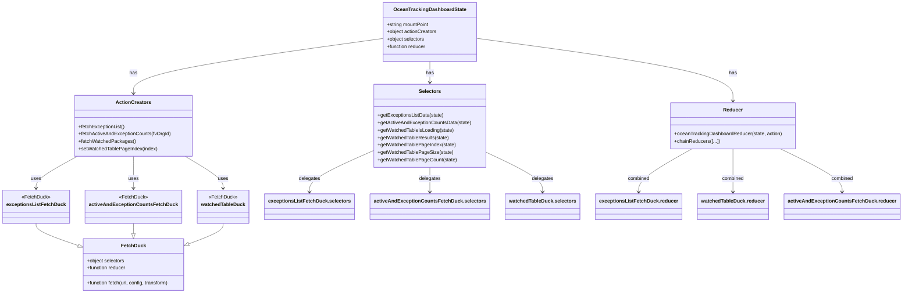

# Diagram: web/portal/src/pages/oceantracking/redux/OceanTrackingDashboardState.js


> Auto-generated by Obscura crawlers

## Diagram 1



> SVG rendering failed for this diagram.

## Diagram 2

```mermaid
flowchart LR
  subgraph APIs
    API_EX_LIST["/partview/app/exception-type/list"]
    API_COUNTS["/partview/app/dashboard/counts"]
    API_SEARCH["/partview/app/search"]
  end
  subgraph Ducks
    EX_LIST[exceptionsListFetchDuck.fetch]
    COUNTS[activeAndExceptionCountsFetchDuck.fetch]
    WATCHED[watchedTableDuck.fetch]
  end
  subgraph State
    STORE["oceanTrackingDashboardState"]
    REDUCER[oceanTrackingDashboardReducer & chained reducers]
  end
  subgraph Actions
    A_fetchExceptions[fetchExceptionList()]
    A_fetchCounts[fetchActiveAndExceptionCounts(fvOrgId)]
    A_fetchWatched[fetchWatchedPackages()]
    A_setPage[setWatchedTablePageIndex(index)]
  end
  A_fetchExceptions -->|build url| API_EX_LIST
  A_fetchExceptions -->|dispatch->| EX_LIST
  A_fetchCounts -->|build url & config| API_COUNTS
  A_fetchCounts -->|dispatch->| COUNTS
  A_fetchWatched -->|build url & config| API_SEARCH
  A_fetchWatched -->|transform data| WATCHED
  EX_LIST -->|response| REDUCER
  COUNTS -->|response| REDUCER
  WATCHED -->|response| REDUCER
  A_setPage -->|action| REDUCER
  REDUCER --> STORE
  STORE -->|selectors read| A_fetchWatched
```

> SVG rendering failed for this diagram.
