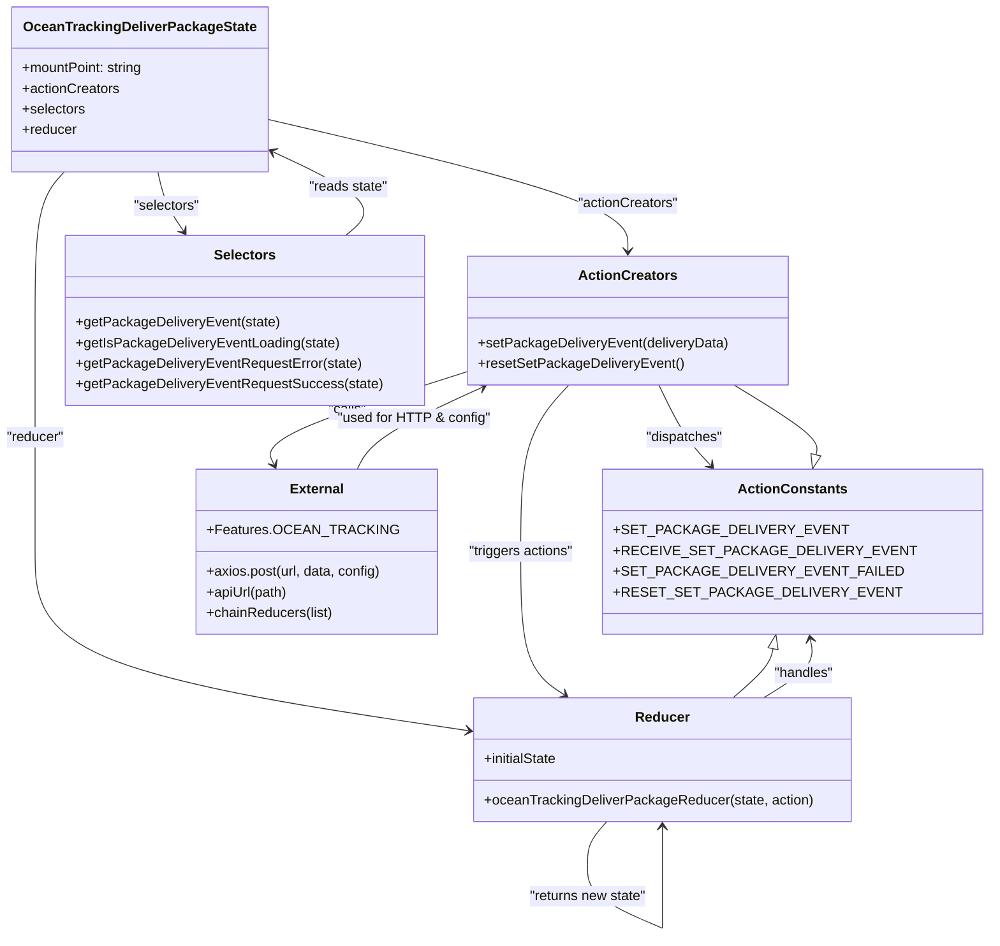

# Diagram: web/portal/src/pages/oceantracking/redux/OceanTrackingDeliverContainerState.js

> Auto-generated by Obscura crawlers

## Mermaid

### SVG

<svg id="container" width="1084.21875" xmlns="http://www.w3.org/2000/svg" class="classDiagram" height="1088.25" viewBox="0 0 1084.21875 1088.25" role="graphics-document document" aria-roledescription="class"><g><defs><marker id="container_class-aggregationStart" class="marker aggregation class" refX="18" refY="7" markerWidth="190" markerHeight="240" orient="auto"><path d="M 18,7 L9,13 L1,7 L9,1 Z"></path></marker></defs><defs><marker id="container_class-aggregationEnd" class="marker aggregation class" refX="1" refY="7" markerWidth="20" markerHeight="28" orient="auto"><path d="M 18,7 L9,13 L1,7 L9,1 Z"></path></marker></defs><defs><marker id="container_class-extensionStart" class="marker extension class" refX="18" refY="7" markerWidth="190" markerHeight="240" orient="auto"><path d="M 1,7 L18,13 V 1 Z"></path></marker></defs><defs><marker id="container_class-extensionEnd" class="marker extension class" refX="1" refY="7" markerWidth="20" markerHeight="28" orient="auto"><path d="M 1,1 V 13 L18,7 Z"></path></marker></defs><defs><marker id="container_class-compositionStart" class="marker composition class" refX="18" refY="7" markerWidth="190" markerHeight="240" orient="auto"><path d="M 18,7 L9,13 L1,7 L9,1 Z"></path></marker></defs><defs><marker id="container_class-compositionEnd" class="marker composition class" refX="1" refY="7" markerWidth="20" markerHeight="28" orient="auto"><path d="M 18,7 L9,13 L1,7 L9,1 Z"></path></marker></defs><defs><marker id="container_class-dependencyStart" class="marker dependency class" refX="6" refY="7" markerWidth="190" markerHeight="240" orient="auto"><path d="M 5,7 L9,13 L1,7 L9,1 Z"></path></marker></defs><defs><marker id="container_class-dependencyEnd" class="marker dependency class" refX="13" refY="7" markerWidth="20" markerHeight="28" orient="auto"><path d="M 18,7 L9,13 L14,7 L9,1 Z"></path></marker></defs><defs><marker id="container_class-lollipopStart" class="marker lollipop class" refX="13" refY="7" markerWidth="190" markerHeight="240" orient="auto"><circle stroke="black" fill="transparent" cx="7" cy="7" r="6"></circle></marker></defs><defs><marker id="container_class-lollipopEnd" class="marker lollipop class" refX="1" refY="7" markerWidth="190" markerHeight="240" orient="auto"><circle stroke="black" fill="transparent" cx="7" cy="7" r="6"></circle></marker></defs><g class="root"><g class="clusters"></g><g class="edgePaths"><path d="M309.293,139.358L377.329,155.632C445.365,171.906,581.436,204.453,649.472,229.893C717.508,255.333,717.508,273.667,717.508,282.833L717.508,292" id="id_OceanTrackingDeliverPackageState_ActionCreators_1" class="edge-thickness-normal edge-pattern-solid relation" style=";;;" data-edge="true" data-et="edge" data-id="id_OceanTrackingDeliverPackageState_ActionCreators_1" data-points="W3sieCI6MzA5LjI5Mjk2ODc1LCJ5IjoxMzkuMzU4MzQ1MTU4OTc4ODR9LHsieCI6NzE3LjUwNzgxMjUsInkiOjIzN30seyJ4Ijo3MTcuNTA3ODEyNSwieSI6Mjk4fV0=" marker-end="url(#container_class-dependencyEnd)"></path><path d="M182.731,200L184.097,206.167C185.463,212.333,188.194,224.667,193.082,236.166C197.97,247.665,205.014,258.329,208.536,263.661L212.058,268.994" id="id_OceanTrackingDeliverPackageState_Selectors_2" class="edge-thickness-normal edge-pattern-solid relation" style=";;;" data-edge="true" data-et="edge" data-id="id_OceanTrackingDeliverPackageState_Selectors_2" data-points="W3sieCI6MTgyLjczMDk2ODA0NTExMjc3LCJ5IjoyMDB9LHsieCI6MTkwLjkyNTc4MTI1LCJ5IjoyMzd9LHsieCI6MjE1LjM2NTM3Nzk4NzEzMjM1LCJ5IjoyNzR9XQ==" marker-end="url(#container_class-dependencyEnd)"></path><path d="M75.365,200L69.834,206.167C64.303,212.333,53.242,224.667,47.711,253.5C42.18,282.333,42.18,327.667,42.18,373C42.18,418.333,42.18,463.667,42.18,508.5C42.18,553.333,42.18,597.667,42.18,642C42.18,686.333,42.18,730.667,120.983,765.185C199.787,799.703,357.395,824.406,436.198,836.758L515.002,849.109" id="id_OceanTrackingDeliverPackageState_Reducer_3" class="edge-thickness-normal edge-pattern-solid relation" style=";;;" data-edge="true" data-et="edge" data-id="id_OceanTrackingDeliverPackageState_Reducer_3" data-points="W3sieCI6NzUuMzY1MzY2NTQxMzUzMzgsInkiOjIwMH0seyJ4Ijo0Mi4xNzk2ODc1LCJ5IjoyMzd9LHsieCI6NDIuMTc5Njg3NSwieSI6MzczfSx7IngiOjQyLjE3OTY4NzUsInkiOjUwOX0seyJ4Ijo0Mi4xNzk2ODc1LCJ5Ijo2NDJ9LHsieCI6NDIuMTc5Njg3NSwieSI6Nzc1fSx7IngiOjUyMC45Mjk2ODc1LCJ5Ijo4NTAuMDM4MTM5NjM5Mzg2Nn1d" marker-end="url(#container_class-dependencyEnd)"></path><path d="M748.682,448L752.908,458.167C757.134,468.333,765.585,488.667,774.334,504.233C783.083,519.8,792.129,530.6,796.652,536L801.175,541.4" id="id_ActionCreators_ActionConstants_4" class="edge-thickness-normal edge-pattern-solid relation" style=";;;" data-edge="true" data-et="edge" data-id="id_ActionCreators_ActionConstants_4" data-points="W3sieCI6NzQ4LjY4MjA1NzEwMDE4MzgsInkiOjQ0OH0seyJ4Ijo3NzQuMDM3MTA5Mzc1LCJ5Ijo1MDl9LHsieCI6ODA1LjAyNzEwODc4NzU5NCwieSI6NTQ2fV0=" marker-end="url(#container_class-dependencyEnd)"></path><path d="M534.336,432.409L494.979,445.175C455.621,457.94,376.906,483.47,340.152,501.505C303.397,519.54,308.602,530.08,311.205,535.35L313.807,540.62" id="id_ActionCreators_External_5" class="edge-thickness-normal edge-pattern-solid relation" style=";;;" data-edge="true" data-et="edge" data-id="id_ActionCreators_External_5" data-points="W3sieCI6NTM0LjMzNTkzNzUsInkiOjQzMi40MDk0OTI3NTY5OTg1fSx7IngiOjI5OC4xOTE0MDYyNSwieSI6NTA5fSx7IngiOjMxNi40NjQyODU3MTQyODU3LCJ5Ijo1NDZ9XQ==" marker-end="url(#container_class-dependencyEnd)"></path><path d="M651.202,448L642.214,458.167C633.226,468.333,615.25,488.667,606.262,521C597.273,553.333,597.273,597.667,597.273,642C597.273,686.333,597.273,730.667,604.423,758.387C611.573,786.107,625.872,797.213,633.022,802.766L640.172,808.32" id="id_ActionCreators_Reducer_6" class="edge-thickness-normal edge-pattern-solid relation" style=";;;" data-edge="true" data-et="edge" data-id="id_ActionCreators_Reducer_6" data-points="W3sieCI6NjUxLjIwMjA5MDk5MjY0NzEsInkiOjQ0OH0seyJ4Ijo1OTcuMjczNDM3NSwieSI6NTA5fSx7IngiOjU5Ny4yNzM0Mzc1LCJ5Ijo2NDJ9LHsieCI6NTk3LjI3MzQzNzUsInkiOjc3NX0seyJ4Ijo2NDQuOTEwNDA3MTEwMDkxNywieSI6ODEyfV0=" marker-end="url(#container_class-dependencyEnd)"></path><path d="M853.479,812L863.403,805.833C873.327,799.667,893.175,787.333,902.023,775.979C910.871,764.625,908.719,754.25,907.643,749.062L906.567,743.875" id="id_Reducer_ActionConstants_7" class="edge-thickness-normal edge-pattern-solid relation" style=";;;" data-edge="true" data-et="edge" data-id="id_Reducer_ActionConstants_7" data-points="W3sieCI6ODUzLjQ3OTIxNDQ0OTU0MTIsInkiOjgxMn0seyJ4Ijo5MTMuMDIzNDM3NSwieSI6Nzc1fSx7IngiOjkwNS4zNDgwNjc0MzQyMTA1LCJ5Ijo3Mzh9XQ==" marker-end="url(#container_class-dependencyEnd)"></path><path d="M671.072,956L667.221,960.167C663.371,964.333,655.67,972.667,651.819,981C647.969,989.333,647.969,997.667,647.969,1001.833L647.969,1006" id="Reducer-cyclic-special-1" class="edge-thickness-normal edge-pattern-solid relation" style=";;;" data-edge="true" data-et="edge" data-id="Reducer-cyclic-special-1" data-points="W3sieCI6NjcxLjA3MjAwMzg2NTk3OTQsInkiOjk1Nn0seyJ4Ijo2NDcuOTY4NzUsInkiOjk4MX0seyJ4Ijo2NDcuOTY4NzUsInkiOjEwMDZ9XQ=="></path><path d="M647.969,1006.1L647.969,1012.267C647.969,1018.433,647.969,1030.767,662.901,1043.105C677.832,1055.443,707.696,1067.786,722.628,1073.958L737.559,1080.129" id="Reducer-cyclic-special-mid" class="edge-thickness-normal edge-pattern-solid relation" style=";;;" data-edge="true" data-et="edge" data-id="Reducer-cyclic-special-mid" data-points="W3sieCI6NjQ3Ljk2ODc1LCJ5IjoxMDA2LjEwMDAwMDAwMTQ5MDF9LHsieCI6NjQ3Ljk2ODc1LCJ5IjoxMDQzLjEwMDAwMDAwMTQ5MDF9LHsieCI6NzM3LjU1OTM3NDk5OTI1NDksInkiOjEwODAuMTI5MzM0MTQ4NjkzNX1d"></path><path d="M737.609,1080.1L737.609,1073.933C737.609,1067.767,737.609,1055.433,737.609,1043.092C737.609,1030.75,737.609,1018.4,737.609,1008.05C737.609,997.7,737.609,989.35,737.609,982.008C737.609,974.667,737.609,968.333,737.609,965.167L737.609,962" id="Reducer-cyclic-special-2" class="edge-thickness-normal edge-pattern-solid relation" style=";;;" data-edge="true" data-et="edge" data-id="Reducer-cyclic-special-2" data-points="W3sieCI6NzM3LjYwOTM3NSwieSI6MTA4MC4xMDAwMDAwMDE0OTAxfSx7IngiOjczNy42MDkzNzUsInkiOjEwNDMuMTAwMDAwMDAxNDkwMX0seyJ4Ijo3MzcuNjA5Mzc1LCJ5IjoxMDA2LjA1MDAwMDAwMDc0NTF9LHsieCI6NzM3LjYwOTM3NSwieSI6OTgxfSx7IngiOjczNy42MDkzNzUsInkiOjk1Nn1d" marker-end="url(#container_class-dependencyEnd)"></path><path d="M394.12,274L401.182,267.833C408.243,261.667,422.366,249.333,409.128,233.35C395.89,217.367,355.292,197.734,334.993,187.917L314.694,178.1" id="id_Selectors_OceanTrackingDeliverPackageState_9" class="edge-thickness-normal edge-pattern-solid relation" style=";;;" data-edge="true" data-et="edge" data-id="id_Selectors_OceanTrackingDeliverPackageState_9" data-points="W3sieCI6Mzk0LjEyMDQzMzEzNDE5MTE2LCJ5IjoyNzR9LHsieCI6NDM2LjQ4ODI4MTI1LCJ5IjoyMzd9LHsieCI6MzA5LjI5Mjk2ODc1LCJ5IjoxNzUuNDg4MDkwMzM0NDkzMjh9XQ==" marker-end="url(#container_class-dependencyEnd)"></path><path d="M411.286,546L414.331,539.833C417.377,533.667,423.468,521.333,447.135,505.427C470.801,489.521,512.044,470.042,532.666,460.302L553.287,450.562" id="id_External_ActionCreators_10" class="edge-thickness-normal edge-pattern-solid relation" style=";;;" data-edge="true" data-et="edge" data-id="id_External_ActionCreators_10" data-points="W3sieCI6NDExLjI4NTcxNDI4NTcxNDMsInkiOjU0Nn0seyJ4Ijo0MjkuNTU4NTkzNzUsInkiOjUwOX0seyJ4Ijo1NTguNzEyMjg3NDU0MDQ0MSwieSI6NDQ4fV0=" marker-end="url(#container_class-dependencyEnd)"></path><path d="M913.141,529.248L913.971,525.874C914.8,522.499,916.459,515.749,902.291,502.208C888.124,488.667,858.131,468.333,843.135,458.167L828.138,448" id="id_ActionConstants_ActionCreators_11" class="edge-thickness-normal edge-pattern-solid relation" style=";;;" data-edge="true" data-et="edge" data-id="id_ActionConstants_ActionCreators_11" data-points="W3sieCI6OTA5LjAyNDc1OTE2MzUzMzksInkiOjU0Nn0seyJ4Ijo5MTguMTE3MTg3NSwieSI6NTA5fSx7IngiOjgyOC4xMzc5ODI1MzY3NjQ4LCJ5Ijo0NDh9XQ==" marker-start="url(#container_class-extensionStart)"></path><path d="M862.015,754.89L861.32,758.242C860.625,761.594,859.234,768.297,851.737,777.815C844.239,787.333,830.635,799.667,823.832,805.833L817.03,812" id="id_ActionConstants_Reducer_12" class="edge-thickness-normal edge-pattern-solid relation" style=";;;" data-edge="true" data-et="edge" data-id="id_ActionConstants_Reducer_12" data-points="W3sieCI6ODY1LjUxOTEyMDA2NTc4OTUsInkiOjczOH0seyJ4Ijo4NTcuODQzNzUsInkiOjc3NX0seyJ4Ijo4MTcuMDMwMjQ2NTU5NjMzLCJ5Ijo4MTJ9XQ==" marker-start="url(#container_class-extensionStart)"></path></g><g class="edgeLabels"><g class="edgeLabel" transform="translate(717.5078125, 237)"><g class="label" data-id="id_OceanTrackingDeliverPackageState_ActionCreators_1" transform="translate(-58.8125, -12)"><foreignObject width="117.625" height="24">

"actionCreators"

</foreignObject></g></g><g class="edgeLabel" transform="translate(192.70221, 239.68941)"><g class="label" data-id="id_OceanTrackingDeliverPackageState_Selectors_2" transform="translate(-38.9140625, -12)"><foreignObject width="77.828125" height="24">

"selectors"

</foreignObject></g></g><g class="edgeLabel" transform="translate(42.1796875, 509)"><g class="label" data-id="id_OceanTrackingDeliverPackageState_Reducer_3" transform="translate(-34.1796875, -12)"><foreignObject width="68.359375" height="24">

"reducer"

</foreignObject></g></g><g class="edgeLabel" transform="translate(774.037109375, 509)"><g class="label" data-id="id_ActionCreators_ActionConstants_4" transform="translate(-45.3671875, -12)"><foreignObject width="90.734375" height="24">

"dispatches"

</foreignObject></g></g><g class="edgeLabel" transform="translate(396.63708, 477.07039)"><g class="label" data-id="id_ActionCreators_External_5" transform="translate(-22.625, -12)"><foreignObject width="45.25" height="24">

"calls"

</foreignObject></g></g><g class="edgeLabel" transform="translate(597.2734375, 642)"><g class="label" data-id="id_ActionCreators_Reducer_6" transform="translate(-62.375, -12)"><foreignObject width="124.75" height="24">

"triggers actions"

</foreignObject></g></g><g class="edgeLabel" transform="translate(899.29929, 783.52801)"><g class="label" data-id="id_Reducer_ActionConstants_7" transform="translate(-35.1796875, -12)"><foreignObject width="70.359375" height="24">

"handles"

</foreignObject></g></g><g class="edgeLabel"><g class="label" data-id="Reducer-cyclic-special-1" transform="translate(0, 0)"><foreignObject width="0" height="0">

</foreignObject></g></g><g class="edgeLabel" transform="translate(647.96875, 1043.1000000014901)"><g class="label" data-id="Reducer-cyclic-special-mid" transform="translate(-69.640625, -12)"><foreignObject width="139.28125" height="24">

"returns new state"

</foreignObject></g></g><g class="edgeLabel"><g class="label" data-id="Reducer-cyclic-special-2" transform="translate(0, 0)"><foreignObject width="0" height="0">

</foreignObject></g></g><g class="edgeLabel" transform="translate(398.21016, 218.48862)"><g class="label" data-id="id_Selectors_OceanTrackingDeliverPackageState_9" transform="translate(-46.4765625, -12)"><foreignObject width="92.953125" height="24">

"reads state"

</foreignObject></g></g><g class="edgeLabel" transform="translate(475.47859, 487.31173)"><g class="label" data-id="id_External_ActionCreators_10" transform="translate(-88.7421875, -12)"><foreignObject width="177.484375" height="24">

"used for HTTP &amp; config"

</foreignObject></g></g><g class="edgeLabel"><g class="label" data-id="id_ActionConstants_ActionCreators_11" transform="translate(0, 0)"><foreignObject width="0" height="0">

</foreignObject></g></g><g class="edgeLabel"><g class="label" data-id="id_ActionConstants_Reducer_12" transform="translate(0, 0)"><foreignObject width="0" height="0">

</foreignObject></g></g></g><g class="nodes"><g class="node default" id="classId-OceanTrackingDeliverPackageState-0" transform="translate(161.46875, 104)"><g class="basic label-container"><path d="M-147.82421875 -96 L147.82421875 -96 L147.82421875 96 L-147.82421875 96" stroke="none" stroke-width="0" fill="#ECECFF" style=""></path><path d="M-147.82421875 -96 C-37.44947565565019 -96, 72.92526743869962 -96, 147.82421875 -96 M-147.82421875 -96 C-78.20243124532584 -96, -8.58064374065168 -96, 147.82421875 -96 M147.82421875 -96 C147.82421875 -24.55780905255253, 147.82421875 46.88438189489494, 147.82421875 96 M147.82421875 -96 C147.82421875 -40.53345038274644, 147.82421875 14.933099234507125, 147.82421875 96 M147.82421875 96 C84.56417133691583 96, 21.304123923831668 96, -147.82421875 96 M147.82421875 96 C72.70182051673572 96, -2.4205777165285554 96, -147.82421875 96 M-147.82421875 96 C-147.82421875 38.88184910878264, -147.82421875 -18.236301782434722, -147.82421875 -96 M-147.82421875 96 C-147.82421875 55.91141869271141, -147.82421875 15.822837385422815, -147.82421875 -96" stroke="#9370DB" stroke-width="1.3" fill="none" stroke-dasharray="0 0" style=""></path></g><g class="annotation-group text" transform="translate(0, -72)"></g><g class="label-group text" transform="translate(-128.5390625, -72)"><g class="label" style="font-weight: bolder" transform="translate(0,-12)"><foreignObject width="257.078125" height="24">

OceanTrackingDeliverPackageState

</foreignObject></g></g><g class="members-group text" transform="translate(-135.82421875, -24)"><g class="label" style="" transform="translate(0,-12)"><foreignObject width="143.109375" height="24">

+mountPoint: string

</foreignObject></g><g class="label" style="" transform="translate(0,12)"><foreignObject width="113.078125" height="24">

+actionCreators

</foreignObject></g><g class="label" style="" transform="translate(0,36)"><foreignObject width="73.453125" height="24">

+selectors

</foreignObject></g><g class="label" style="" transform="translate(0,60)"><foreignObject width="63.515625" height="24">

+reducer

</foreignObject></g></g><g class="methods-group text" transform="translate(-135.82421875, 96)"></g><g class="divider" style=""><path d="M-147.82421875 -48 C-49.05064526674633 -48, 49.72292821650734 -48, 147.82421875 -48 M-147.82421875 -48 C-45.91778371929263 -48, 55.98865131141474 -48, 147.82421875 -48" stroke="#9370DB" stroke-width="1.3" fill="none" stroke-dasharray="0 0" style=""></path></g><g class="divider" style=""><path d="M-147.82421875 72 C-65.36547752630625 72, 17.0932636973875 72, 147.82421875 72 M-147.82421875 72 C-70.15396221595577 72, 7.516294318088455 72, 147.82421875 72" stroke="#9370DB" stroke-width="1.3" fill="none" stroke-dasharray="0 0" style=""></path></g></g><g class="node default" id="classId-ActionConstants-1" transform="translate(885.43359375, 642)"><g class="basic label-container"><path d="M-190.78515625 -96 L190.78515625 -96 L190.78515625 96 L-190.78515625 96" stroke="none" stroke-width="0" fill="#ECECFF" style=""></path><path d="M-190.78515625 -96 C-90.72117782813501 -96, 9.342800593729976 -96, 190.78515625 -96 M-190.78515625 -96 C-104.78696812462836 -96, -18.788779999256718 -96, 190.78515625 -96 M190.78515625 -96 C190.78515625 -48.51966383216067, 190.78515625 -1.039327664321334, 190.78515625 96 M190.78515625 -96 C190.78515625 -47.45250408135327, 190.78515625 1.0949918372934633, 190.78515625 96 M190.78515625 96 C56.933952089629514 96, -76.91725207074097 96, -190.78515625 96 M190.78515625 96 C97.75975229921735 96, 4.7343483484347075 96, -190.78515625 96 M-190.78515625 96 C-190.78515625 22.815493840304015, -190.78515625 -50.36901231939197, -190.78515625 -96 M-190.78515625 96 C-190.78515625 19.94321572121855, -190.78515625 -56.1135685575629, -190.78515625 -96" stroke="#9370DB" stroke-width="1.3" fill="none" stroke-dasharray="0 0" style=""></path></g><g class="annotation-group text" transform="translate(0, -72)"></g><g class="label-group text" transform="translate(-59.7265625, -72)"><g class="label" style="font-weight: bolder" transform="translate(0,-12)"><foreignObject width="119.453125" height="24">

ActionConstants

</foreignObject></g></g><g class="members-group text" transform="translate(-178.78515625, -24)"><g class="label" style="" transform="translate(0,-12)"><foreignObject width="231.46875" height="24">

+SET_PACKAGE_DELIVERY_EVENT

</foreignObject></g><g class="label" style="" transform="translate(0,12)"><foreignObject width="297.84375" height="24">

+RECEIVE_SET_PACKAGE_DELIVERY_EVENT

</foreignObject></g><g class="label" style="" transform="translate(0,36)"><foreignObject width="286.765625" height="24">

+SET_PACKAGE_DELIVERY_EVENT_FAILED

</foreignObject></g><g class="label" style="" transform="translate(0,60)"><foreignObject width="282.9375" height="24">

+RESET_SET_PACKAGE_DELIVERY_EVENT

</foreignObject></g></g><g class="methods-group text" transform="translate(-178.78515625, 96)"></g><g class="divider" style=""><path d="M-190.78515625 -48 C-69.83788109500365 -48, 51.109394059992695 -48, 190.78515625 -48 M-190.78515625 -48 C-43.55405192139983 -48, 103.67705240720034 -48, 190.78515625 -48" stroke="#9370DB" stroke-width="1.3" fill="none" stroke-dasharray="0 0" style=""></path></g><g class="divider" style=""><path d="M-190.78515625 72 C-53.81578010937557 72, 83.15359603124887 72, 190.78515625 72 M-190.78515625 72 C-88.38333289716508 72, 14.018490455669848 72, 190.78515625 72" stroke="#9370DB" stroke-width="1.3" fill="none" stroke-dasharray="0 0" style=""></path></g></g><g class="node default" id="classId-ActionCreators-2" transform="translate(717.5078125, 373)"><g class="basic label-container"><path d="M-183.171875 -75 L183.171875 -75 L183.171875 75 L-183.171875 75" stroke="none" stroke-width="0" fill="#ECECFF" style=""></path><path d="M-183.171875 -75 C-37.273574159745834 -75, 108.62472668050833 -75, 183.171875 -75 M-183.171875 -75 C-62.91587174967624 -75, 57.340131500647516 -75, 183.171875 -75 M183.171875 -75 C183.171875 -39.918883217150785, 183.171875 -4.837766434301571, 183.171875 75 M183.171875 -75 C183.171875 -31.68737115959931, 183.171875 11.625257680801383, 183.171875 75 M183.171875 75 C69.50647166625494 75, -44.15893166749012 75, -183.171875 75 M183.171875 75 C64.58840458261662 75, -53.99506583476676 75, -183.171875 75 M-183.171875 75 C-183.171875 21.420925756781664, -183.171875 -32.15814848643667, -183.171875 -75 M-183.171875 75 C-183.171875 41.03084242536501, -183.171875 7.061684850730018, -183.171875 -75" stroke="#9370DB" stroke-width="1.3" fill="none" stroke-dasharray="0 0" style=""></path></g><g class="annotation-group text" transform="translate(0, -51)"></g><g class="label-group text" transform="translate(-53.96875, -51)"><g class="label" style="font-weight: bolder" transform="translate(0,-12)"><foreignObject width="107.9375" height="24">

ActionCreators

</foreignObject></g></g><g class="members-group text" transform="translate(-171.171875, -3)"></g><g class="methods-group text" transform="translate(-171.171875, 27)"><g class="label" style="" transform="translate(0,-12)"><foreignObject width="288.375" height="24">

+setPackageDeliveryEvent(deliveryData)

</foreignObject></g><g class="label" style="" transform="translate(0,12)"><foreignObject width="234.734375" height="24">

+resetSetPackageDeliveryEvent()

</foreignObject></g></g><g class="divider" style=""><path d="M-183.171875 -27 C-101.64979674794873 -27, -20.127718495897454 -27, 183.171875 -27 M-183.171875 -27 C-99.16965204552874 -27, -15.167429091057471 -27, 183.171875 -27" stroke="#9370DB" stroke-width="1.3" fill="none" stroke-dasharray="0 0" style=""></path></g><g class="divider" style=""><path d="M-183.171875 -3 C-43.214686212510145 -3, 96.74250257497971 -3, 183.171875 -3 M-183.171875 -3 C-78.52285124866266 -3, 26.126172502674677 -3, 183.171875 -3" stroke="#9370DB" stroke-width="1.3" fill="none" stroke-dasharray="0 0" style=""></path></g></g><g class="node default" id="classId-Selectors-3" transform="translate(280.7578125, 373)"><g class="basic label-container"><path d="M-203.578125 -99 L203.578125 -99 L203.578125 99 L-203.578125 99" stroke="none" stroke-width="0" fill="#ECECFF" style=""></path><path d="M-203.578125 -99 C-102.44775072197078 -99, -1.317376443941555 -99, 203.578125 -99 M-203.578125 -99 C-107.37907050197725 -99, -11.180016003954506 -99, 203.578125 -99 M203.578125 -99 C203.578125 -30.376394785152556, 203.578125 38.24721042969489, 203.578125 99 M203.578125 -99 C203.578125 -51.11732184338754, 203.578125 -3.2346436867750867, 203.578125 99 M203.578125 99 C80.01022874035067 99, -43.55766751929866 99, -203.578125 99 M203.578125 99 C42.894158773248705 99, -117.78980745350259 99, -203.578125 99 M-203.578125 99 C-203.578125 42.41264731443715, -203.578125 -14.174705371125697, -203.578125 -99 M-203.578125 99 C-203.578125 39.747185100956656, -203.578125 -19.505629798086687, -203.578125 -99" stroke="#9370DB" stroke-width="1.3" fill="none" stroke-dasharray="0 0" style=""></path></g><g class="annotation-group text" transform="translate(0, -75)"></g><g class="label-group text" transform="translate(-34.171875, -75)"><g class="label" style="font-weight: bolder" transform="translate(0,-12)"><foreignObject width="68.34375" height="24">

Selectors

</foreignObject></g></g><g class="members-group text" transform="translate(-191.578125, -27)"></g><g class="methods-group text" transform="translate(-191.578125, 3)"><g class="label" style="" transform="translate(0,-12)"><foreignObject width="233.78125" height="24">

+getPackageDeliveryEvent(state)

</foreignObject></g><g class="label" style="" transform="translate(0,12)"><foreignObject width="303.203125" height="24">

+getIsPackageDeliveryEventLoading(state)

</foreignObject></g><g class="label" style="" transform="translate(0,36)"><foreignObject width="328.578125" height="24">

+getPackageDeliveryEventRequestError(state)

</foreignObject></g><g class="label" style="" transform="translate(0,60)"><foreignObject width="348.984375" height="24">

+getPackageDeliveryEventRequestSuccess(state)

</foreignObject></g></g><g class="divider" style=""><path d="M-203.578125 -51 C-64.04183336058713 -51, 75.49445827882573 -51, 203.578125 -51 M-203.578125 -51 C-53.07874191540506 -51, 97.42064116918988 -51, 203.578125 -51" stroke="#9370DB" stroke-width="1.3" fill="none" stroke-dasharray="0 0" style=""></path></g><g class="divider" style=""><path d="M-203.578125 -27 C-51.81283065418947 -27, 99.95246369162106 -27, 203.578125 -27 M-203.578125 -27 C-86.38117183591551 -27, 30.81578132816898 -27, 203.578125 -27" stroke="#9370DB" stroke-width="1.3" fill="none" stroke-dasharray="0 0" style=""></path></g></g><g class="node default" id="classId-Reducer-4" transform="translate(737.609375, 884)"><g class="basic label-container"><path d="M-216.6796875 -72 L216.6796875 -72 L216.6796875 72 L-216.6796875 72" stroke="none" stroke-width="0" fill="#ECECFF" style=""></path><path d="M-216.6796875 -72 C-69.60208924129506 -72, 77.47550901740988 -72, 216.6796875 -72 M-216.6796875 -72 C-92.69266737475259 -72, 31.294352750494824 -72, 216.6796875 -72 M216.6796875 -72 C216.6796875 -37.98130420002816, 216.6796875 -3.9626084000563253, 216.6796875 72 M216.6796875 -72 C216.6796875 -41.63928696840499, 216.6796875 -11.278573936809984, 216.6796875 72 M216.6796875 72 C71.30654616280401 72, -74.06659517439198 72, -216.6796875 72 M216.6796875 72 C98.06080420552122 72, -20.558079088957555 72, -216.6796875 72 M-216.6796875 72 C-216.6796875 30.836483636152636, -216.6796875 -10.327032727694728, -216.6796875 -72 M-216.6796875 72 C-216.6796875 23.707051908130325, -216.6796875 -24.58589618373935, -216.6796875 -72" stroke="#9370DB" stroke-width="1.3" fill="none" stroke-dasharray="0 0" style=""></path></g><g class="annotation-group text" transform="translate(0, -48)"></g><g class="label-group text" transform="translate(-29.90625, -48)"><g class="label" style="font-weight: bolder" transform="translate(0,-12)"><foreignObject width="59.8125" height="24">

Reducer

</foreignObject></g></g><g class="members-group text" transform="translate(-204.6796875, 0)"><g class="label" style="" transform="translate(0,-12)"><foreignObject width="87.25" height="24">

+initialState

</foreignObject></g></g><g class="methods-group text" transform="translate(-204.6796875, 48)"><g class="label" style="" transform="translate(0,-12)"><foreignObject width="379.453125" height="24">

+oceanTrackingDeliverPackageReducer(state, action)

</foreignObject></g></g><g class="divider" style=""><path d="M-216.6796875 -24 C-60.491511988774874 -24, 95.69666352245025 -24, 216.6796875 -24 M-216.6796875 -24 C-82.33468617478107 -24, 52.01031515043786 -24, 216.6796875 -24" stroke="#9370DB" stroke-width="1.3" fill="none" stroke-dasharray="0 0" style=""></path></g><g class="divider" style=""><path d="M-216.6796875 24 C-94.17223696079913 24, 28.33521357840175 24, 216.6796875 24 M-216.6796875 24 C-57.585598672374005 24, 101.50849015525199 24, 216.6796875 24" stroke="#9370DB" stroke-width="1.3" fill="none" stroke-dasharray="0 0" style=""></path></g></g><g class="node default" id="classId-External-5" transform="translate(363.875, 642)"><g class="basic label-container"><path d="M-129.3125 -96 L129.3125 -96 L129.3125 96 L-129.3125 96" stroke="none" stroke-width="0" fill="#ECECFF" style=""></path><path d="M-129.3125 -96 C-57.087101842457784 -96, 15.138296315084432 -96, 129.3125 -96 M-129.3125 -96 C-38.382909303958016 -96, 52.54668139208397 -96, 129.3125 -96 M129.3125 -96 C129.3125 -42.42363229265837, 129.3125 11.152735414683264, 129.3125 96 M129.3125 -96 C129.3125 -36.55841628214381, 129.3125 22.88316743571238, 129.3125 96 M129.3125 96 C44.248142260993774 96, -40.81621547801245 96, -129.3125 96 M129.3125 96 C62.93715877416612 96, -3.438182451667757 96, -129.3125 96 M-129.3125 96 C-129.3125 25.052383938950385, -129.3125 -45.89523212209923, -129.3125 -96 M-129.3125 96 C-129.3125 22.898335040126526, -129.3125 -50.20332991974695, -129.3125 -96" stroke="#9370DB" stroke-width="1.3" fill="none" stroke-dasharray="0 0" style=""></path></g><g class="annotation-group text" transform="translate(0, -72)"></g><g class="label-group text" transform="translate(-30.171875, -72)"><g class="label" style="font-weight: bolder" transform="translate(0,-12)"><foreignObject width="60.34375" height="24">

External

</foreignObject></g></g><g class="members-group text" transform="translate(-117.3125, -24)"><g class="label" style="" transform="translate(0,-12)"><foreignObject width="200.34375" height="24">

+Features.OCEAN_TRACKING

</foreignObject></g></g><g class="methods-group text" transform="translate(-117.3125, 24)"><g class="label" style="" transform="translate(0,-12)"><foreignObject width="204.453125" height="24">

+axios.post(url, data, config)

</foreignObject></g><g class="label" style="" transform="translate(0,12)"><foreignObject width="95.5" height="24">

+apiUrl(path)

</foreignObject></g><g class="label" style="" transform="translate(0,36)"><foreignObject width="146.921875" height="24">

+chainReducers(list)

</foreignObject></g></g><g class="divider" style=""><path d="M-129.3125 -48 C-53.062541465522656 -48, 23.187417068954687 -48, 129.3125 -48 M-129.3125 -48 C-51.44996010320165 -48, 26.412579793596706 -48, 129.3125 -48" stroke="#9370DB" stroke-width="1.3" fill="none" stroke-dasharray="0 0" style=""></path></g><g class="divider" style=""><path d="M-129.3125 0 C-71.16747703087273 0, -13.02245406174545 0, 129.3125 0 M-129.3125 0 C-63.95090999323949 0, 1.4106800135210165 0, 129.3125 0" stroke="#9370DB" stroke-width="1.3" fill="none" stroke-dasharray="0 0" style=""></path></g></g><g class="label edgeLabel" id="Reducer---Reducer---1" transform="translate(647.96875, 1006.0500000007451)"><rect width="0.1" height="0.1"></rect><g class="label" style="" transform="translate(0, 0)"><rect></rect><foreignObject width="0" height="0">

</foreignObject></g></g><g class="label edgeLabel" id="Reducer---Reducer---2" transform="translate(737.609375, 1080.1500000022352)"><rect width="0.1" height="0.1"></rect><g class="label" style="" transform="translate(0, 0)"><rect></rect><foreignObject width="0" height="0">

</foreignObject></g></g></g></g></g></svg>
