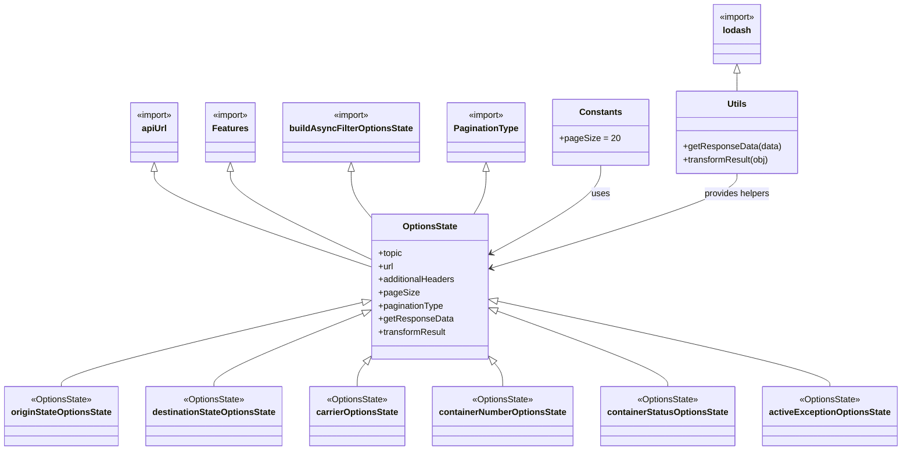
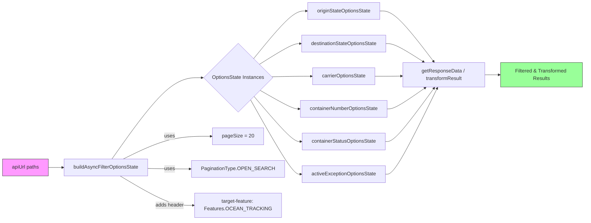

# Diagram: web/portal/src/pages/oceantracking/redux/OceanTrackingSearchFilterLoaders.js

> Auto-generated by Obscura crawlers

## Diagram 1

### SVG

<svg id="container" width="1600.234375" xmlns="http://www.w3.org/2000/svg" class="classDiagram" height="820" viewBox="0 0 1600.234375 820" role="graphics-document document" aria-roledescription="class"><g><defs><marker id="container_class-aggregationStart" class="marker aggregation class" refX="18" refY="7" markerWidth="190" markerHeight="240" orient="auto"><path d="M 18,7 L9,13 L1,7 L9,1 Z"></path></marker></defs><defs><marker id="container_class-aggregationEnd" class="marker aggregation class" refX="1" refY="7" markerWidth="20" markerHeight="28" orient="auto"><path d="M 18,7 L9,13 L1,7 L9,1 Z"></path></marker></defs><defs><marker id="container_class-extensionStart" class="marker extension class" refX="18" refY="7" markerWidth="190" markerHeight="240" orient="auto"><path d="M 1,7 L18,13 V 1 Z"></path></marker></defs><defs><marker id="container_class-extensionEnd" class="marker extension class" refX="1" refY="7" markerWidth="20" markerHeight="28" orient="auto"><path d="M 1,1 V 13 L18,7 Z"></path></marker></defs><defs><marker id="container_class-compositionStart" class="marker composition class" refX="18" refY="7" markerWidth="190" markerHeight="240" orient="auto"><path d="M 18,7 L9,13 L1,7 L9,1 Z"></path></marker></defs><defs><marker id="container_class-compositionEnd" class="marker composition class" refX="1" refY="7" markerWidth="20" markerHeight="28" orient="auto"><path d="M 18,7 L9,13 L1,7 L9,1 Z"></path></marker></defs><defs><marker id="container_class-dependencyStart" class="marker dependency class" refX="6" refY="7" markerWidth="190" markerHeight="240" orient="auto"><path d="M 5,7 L9,13 L1,7 L9,1 Z"></path></marker></defs><defs><marker id="container_class-dependencyEnd" class="marker dependency class" refX="13" refY="7" markerWidth="20" markerHeight="28" orient="auto"><path d="M 18,7 L9,13 L14,7 L9,1 Z"></path></marker></defs><defs><marker id="container_class-lollipopStart" class="marker lollipop class" refX="13" refY="7" markerWidth="190" markerHeight="240" orient="auto"><circle stroke="black" fill="transparent" cx="7" cy="7" r="6"></circle></marker></defs><defs><marker id="container_class-lollipopEnd" class="marker lollipop class" refX="1" refY="7" markerWidth="190" markerHeight="240" orient="auto"><circle stroke="black" fill="transparent" cx="7" cy="7" r="6"></circle></marker></defs><g class="root"><g class="clusters"></g><g class="edgePaths"><path d="M1309.246,133.25L1309.246,134.542C1309.246,135.833,1309.246,138.417,1309.246,143.875C1309.246,149.333,1309.246,157.667,1309.246,161.833L1309.246,166" id="id_lodash_Utils_1" class="edge-thickness-normal edge-pattern-solid relation" style=";;;" data-edge="true" data-et="edge" data-id="id_lodash_Utils_1" data-points="W3sieCI6MTMwOS4yNDYwOTM3NSwieSI6MTE2fSx7IngiOjEzMDkuMjQ2MDkzNzUsInkiOjE0MX0seyJ4IjoxMzA5LjI0NjA5Mzc1LCJ5IjoxNjZ9XQ==" marker-start="url(#container_class-extensionStart)"></path><path d="M274.004,312.25L274.004,319.042C274.004,325.833,274.004,339.417,338.223,368.246C402.441,397.076,530.879,441.152,595.098,463.19L659.316,485.228" id="id_apiUrl_OptionsState_2" class="edge-thickness-normal edge-pattern-solid relation" style=";;;" data-edge="true" data-et="edge" data-id="id_apiUrl_OptionsState_2" data-points="W3sieCI6Mjc0LjAwMzkwNjI1LCJ5IjoyOTV9LHsieCI6Mjc0LjAwMzkwNjI1LCJ5IjozNTN9LHsieCI6NjU5LjMxNjQwNjI1LCJ5Ijo0ODUuMjI4MzQ3NTE4NDYxOH1d" marker-start="url(#container_class-extensionStart)"></path><path d="M415.285,312.25L415.285,319.042C415.285,325.833,415.285,339.417,455.957,365.781C496.629,392.145,577.973,431.29,618.645,450.863L659.316,470.435" id="id_Features_OptionsState_3" class="edge-thickness-normal edge-pattern-solid relation" style=";;;" data-edge="true" data-et="edge" data-id="id_Features_OptionsState_3" data-points="W3sieCI6NDE1LjI4NTE1NjI1LCJ5IjoyOTV9LHsieCI6NDE1LjI4NTE1NjI1LCJ5IjozNTN9LHsieCI6NjU5LjMxNjQwNjI1LCJ5Ijo0NzAuNDM1MTAyMjc2ODk4NH1d" marker-start="url(#container_class-extensionStart)"></path><path d="M629.676,312.25L629.676,319.042C629.676,325.833,629.676,339.417,634.667,352.375C639.659,365.333,649.642,377.667,654.633,383.833L659.625,390" id="id_buildAsyncFilterOptionsState_OptionsState_4" class="edge-thickness-normal edge-pattern-solid relation" style=";;;" data-edge="true" data-et="edge" data-id="id_buildAsyncFilterOptionsState_OptionsState_4" data-points="W3sieCI6NjI5LjY3NTc4MTI1LCJ5IjoyOTV9LHsieCI6NjI5LjY3NTc4MTI1LCJ5IjozNTN9LHsieCI6NjU5LjYyNDUzNzcyMTg5MzUsInkiOjM5MH1d" marker-start="url(#container_class-extensionStart)"></path><path d="M866.746,312.25L866.746,319.042C866.746,325.833,866.746,339.417,863.087,352.375C859.428,365.333,852.11,377.667,848.451,383.833L844.792,390" id="id_PaginationType_OptionsState_5" class="edge-thickness-normal edge-pattern-solid relation" style=";;;" data-edge="true" data-et="edge" data-id="id_PaginationType_OptionsState_5" data-points="W3sieCI6ODY2Ljc0NjA5Mzc1LCJ5IjoyOTV9LHsieCI6ODY2Ljc0NjA5Mzc1LCJ5IjozNTN9LHsieCI6ODQ0Ljc5MTg4MjM5NjQ0OTgsInkiOjM5MH1d" marker-start="url(#container_class-extensionStart)"></path><path d="M1067.75,301L1067.75,309.667C1067.75,318.333,1067.75,335.667,1036.267,361.993C1004.785,388.32,941.819,423.639,910.337,441.299L878.854,458.959" id="id_Constants_OptionsState_6" class="edge-thickness-normal edge-pattern-solid relation" style=";;;" data-edge="true" data-et="edge" data-id="id_Constants_OptionsState_6" data-points="W3sieCI6MTA2Ny43NSwieSI6MzAxfSx7IngiOjEwNjcuNzUsInkiOjM1M30seyJ4Ijo4NzMuNjIxMDkzNzUsInkiOjQ2MS44OTQyMTQ4MTE3NDE1fV0=" marker-end="url(#container_class-dependencyEnd)"></path><path d="M1309.246,316L1309.246,322.167C1309.246,328.333,1309.246,340.667,1237.597,369.142C1165.947,397.618,1022.649,442.235,950.999,464.544L879.35,486.853" id="id_Utils_OptionsState_7" class="edge-thickness-normal edge-pattern-solid relation" style=";;;" data-edge="true" data-et="edge" data-id="id_Utils_OptionsState_7" data-points="W3sieCI6MTMwOS4yNDYwOTM3NSwieSI6MzE2fSx7IngiOjEzMDkuMjQ2MDkzNzUsInkiOjM1M30seyJ4Ijo4NzMuNjIxMDkzNzUsInkiOjQ4OC42MzY4NzkxODc2MjczfV0=" marker-end="url(#container_class-dependencyEnd)"></path><path d="M642.538,551.587L553.589,572.822C464.64,594.058,286.742,636.529,197.793,661.931C108.844,687.333,108.844,695.667,108.844,699.833L108.844,704" id="id_OptionsState_originStateOptionsState_8" class="edge-thickness-normal edge-pattern-solid relation" style=";;;" data-edge="true" data-et="edge" data-id="id_OptionsState_originStateOptionsState_8" data-points="W3sieCI6NjU5LjMxNjQwNjI1LCJ5Ijo1NDcuNTgxMzIzNjU1MTk4Nn0seyJ4IjoxMDguODQzNzUsInkiOjY3OX0seyJ4IjoxMDguODQzNzUsInkiOjcwNH1d" marker-start="url(#container_class-extensionStart)"></path><path d="M643.342,572.172L599.647,589.976C555.952,607.781,468.562,643.391,424.867,665.362C381.172,687.333,381.172,695.667,381.172,699.833L381.172,704" id="id_OptionsState_destinationStateOptionsState_9" class="edge-thickness-normal edge-pattern-solid relation" style=";;;" data-edge="true" data-et="edge" data-id="id_OptionsState_destinationStateOptionsState_9" data-points="W3sieCI6NjU5LjMxNjQwNjI1LCJ5Ijo1NjUuNjYyMjIyNzE3ODcxOH0seyJ4IjozODEuMTcxODc1LCJ5Ijo2Nzl9LHsieCI6MzgxLjE3MTg3NSwieSI6NzA0fV0=" marker-start="url(#container_class-extensionStart)"></path><path d="M648.352,665.459L646.494,667.716C644.636,669.973,640.919,674.486,639.061,680.91C637.203,687.333,637.203,695.667,637.203,699.833L637.203,704" id="id_OptionsState_carrierOptionsState_10" class="edge-thickness-normal edge-pattern-solid relation" style=";;;" data-edge="true" data-et="edge" data-id="id_OptionsState_carrierOptionsState_10" data-points="W3sieCI6NjU5LjMxNjQwNjI1LCJ5Ijo2NTIuMTQyMjM5ODE2MjY5OH0seyJ4Ijo2MzcuMjAzMTI1LCJ5Ijo2Nzl9LHsieCI6NjM3LjIwMzEyNSwieSI6NzA0fV0=" marker-start="url(#container_class-extensionStart)"></path><path d="M884.586,665.459L886.444,667.716C888.302,669.973,892.018,674.486,893.876,680.91C895.734,687.333,895.734,695.667,895.734,699.833L895.734,704" id="id_OptionsState_containerNumberOptionsState_11" class="edge-thickness-normal edge-pattern-solid relation" style=";;;" data-edge="true" data-et="edge" data-id="id_OptionsState_containerNumberOptionsState_11" data-points="W3sieCI6ODczLjYyMTA5Mzc1LCJ5Ijo2NTIuMTQyMjM5ODE2MjY5OH0seyJ4Ijo4OTUuNzM0Mzc1LCJ5Ijo2Nzl9LHsieCI6ODk1LjczNDM3NSwieSI6NzA0fV0=" marker-start="url(#container_class-extensionStart)"></path><path d="M889.787,567.914L939.514,586.428C989.241,604.943,1088.695,641.971,1138.422,664.652C1188.148,687.333,1188.148,695.667,1188.148,699.833L1188.148,704" id="id_OptionsState_containerStatusOptionsState_12" class="edge-thickness-normal edge-pattern-solid relation" style=";;;" data-edge="true" data-et="edge" data-id="id_OptionsState_containerStatusOptionsState_12" data-points="W3sieCI6ODczLjYyMTA5Mzc1LCJ5Ijo1NjEuODk1MDE2MjExMjA4OX0seyJ4IjoxMTg4LjE0ODQzNzUsInkiOjY3OX0seyJ4IjoxMTg4LjE0ODQzNzUsInkiOjcwNH1d" marker-start="url(#container_class-extensionStart)"></path><path d="M890.462,549.498L987.786,571.082C1085.11,592.665,1279.758,635.833,1377.082,661.583C1474.406,687.333,1474.406,695.667,1474.406,699.833L1474.406,704" id="id_OptionsState_activeExceptionOptionsState_13" class="edge-thickness-normal edge-pattern-solid relation" style=";;;" data-edge="true" data-et="edge" data-id="id_OptionsState_activeExceptionOptionsState_13" data-points="W3sieCI6ODczLjYyMTA5Mzc1LCJ5Ijo1NDUuNzYzMjgxMzE4OTcyNH0seyJ4IjoxNDc0LjQwNjI1LCJ5Ijo2Nzl9LHsieCI6MTQ3NC40MDYyNSwieSI6NzA0fV0=" marker-start="url(#container_class-extensionStart)"></path></g><g class="edgeLabels"><g class="edgeLabel"><g class="label" data-id="id_lodash_Utils_1" transform="translate(0, 0)"><foreignObject width="0" height="0">

</foreignObject></g></g><g class="edgeLabel"><g class="label" data-id="id_apiUrl_OptionsState_2" transform="translate(0, 0)"><foreignObject width="0" height="0">

</foreignObject></g></g><g class="edgeLabel"><g class="label" data-id="id_Features_OptionsState_3" transform="translate(0, 0)"><foreignObject width="0" height="0">

</foreignObject></g></g><g class="edgeLabel"><g class="label" data-id="id_buildAsyncFilterOptionsState_OptionsState_4" transform="translate(0, 0)"><foreignObject width="0" height="0">

</foreignObject></g></g><g class="edgeLabel"><g class="label" data-id="id_PaginationType_OptionsState_5" transform="translate(0, 0)"><foreignObject width="0" height="0">

</foreignObject></g></g><g class="edgeLabel" transform="translate(1067.75, 353)"><g class="label" data-id="id_Constants_OptionsState_6" transform="translate(-16.4921875, -12)"><foreignObject width="32.984375" height="24">

uses

</foreignObject></g></g><g class="edgeLabel" transform="translate(1309.24609375, 353)"><g class="label" data-id="id_Utils_OptionsState_7" transform="translate(-60.640625, -12)"><foreignObject width="121.28125" height="24">

provides helpers

</foreignObject></g></g><g class="edgeLabel"><g class="label" data-id="id_OptionsState_originStateOptionsState_8" transform="translate(0, 0)"><foreignObject width="0" height="0">

</foreignObject></g></g><g class="edgeLabel"><g class="label" data-id="id_OptionsState_destinationStateOptionsState_9" transform="translate(0, 0)"><foreignObject width="0" height="0">

</foreignObject></g></g><g class="edgeLabel"><g class="label" data-id="id_OptionsState_carrierOptionsState_10" transform="translate(0, 0)"><foreignObject width="0" height="0">

</foreignObject></g></g><g class="edgeLabel"><g class="label" data-id="id_OptionsState_containerNumberOptionsState_11" transform="translate(0, 0)"><foreignObject width="0" height="0">

</foreignObject></g></g><g class="edgeLabel"><g class="label" data-id="id_OptionsState_containerStatusOptionsState_12" transform="translate(0, 0)"><foreignObject width="0" height="0">

</foreignObject></g></g><g class="edgeLabel"><g class="label" data-id="id_OptionsState_activeExceptionOptionsState_13" transform="translate(0, 0)"><foreignObject width="0" height="0">

</foreignObject></g></g></g><g class="nodes"><g class="node default" id="classId-lodash-0" transform="translate(1309.24609375, 62)"><g class="basic label-container"><path d="M-45.640625 -54 L45.640625 -54 L45.640625 54 L-45.640625 54" stroke="none" stroke-width="0" fill="#ECECFF" style=""></path><path d="M-45.640625 -54 C-14.719127708634016 -54, 16.20236958273197 -54, 45.640625 -54 M-45.640625 -54 C-17.5812684450128 -54, 10.4780881099744 -54, 45.640625 -54 M45.640625 -54 C45.640625 -21.6228021597067, 45.640625 10.754395680586597, 45.640625 54 M45.640625 -54 C45.640625 -18.939381185094405, 45.640625 16.12123762981119, 45.640625 54 M45.640625 54 C12.767487979530976 54, -20.105649040938047 54, -45.640625 54 M45.640625 54 C22.90030712442011 54, 0.15998924884021903 54, -45.640625 54 M-45.640625 54 C-45.640625 22.24744345861721, -45.640625 -9.505113082765583, -45.640625 -54 M-45.640625 54 C-45.640625 31.30554958782193, -45.640625 8.611099175643858, -45.640625 -54" stroke="#9370DB" stroke-width="1.3" fill="none" stroke-dasharray="0 0" style=""></path></g><g class="annotation-group text" transform="translate(-33.640625, -30)"><g class="label" style="" transform="translate(0,-12)"><foreignObject width="67.28125" height="24">

«import»

</foreignObject></g></g><g class="label-group text" transform="translate(-24.59375, -6)"><g class="label" style="font-weight: bolder" transform="translate(0,-12)"><foreignObject width="49.1875" height="24">

lodash

</foreignObject></g></g><g class="members-group text" transform="translate(-33.640625, 42)"></g><g class="methods-group text" transform="translate(-33.640625, 72)"></g><g class="divider" style=""><path d="M-45.640625 18 C-9.716003577660224 18, 26.20861784467955 18, 45.640625 18 M-45.640625 18 C-21.33255186420694 18, 2.9755212715861177 18, 45.640625 18" stroke="#9370DB" stroke-width="1.3" fill="none" stroke-dasharray="0 0" style=""></path></g><g class="divider" style=""><path d="M-45.640625 36 C-18.589250035974008 36, 8.462124928051985 36, 45.640625 36 M-45.640625 36 C-18.112617328377365 36, 9.41539034324527 36, 45.640625 36" stroke="#9370DB" stroke-width="1.3" fill="none" stroke-dasharray="0 0" style=""></path></g></g><g class="node default" id="classId-apiUrl-1" transform="translate(274.00390625, 241)"><g class="basic label-container"><path d="M-45.640625 -54 L45.640625 -54 L45.640625 54 L-45.640625 54" stroke="none" stroke-width="0" fill="#ECECFF" style=""></path><path d="M-45.640625 -54 C-17.708895116435592 -54, 10.222834767128816 -54, 45.640625 -54 M-45.640625 -54 C-14.503722203838748 -54, 16.633180592322503 -54, 45.640625 -54 M45.640625 -54 C45.640625 -28.103361153904444, 45.640625 -2.2067223078088887, 45.640625 54 M45.640625 -54 C45.640625 -31.66586499192969, 45.640625 -9.331729983859383, 45.640625 54 M45.640625 54 C12.271580283060509 54, -21.097464433878983 54, -45.640625 54 M45.640625 54 C22.4817400611759 54, -0.6771448776482032 54, -45.640625 54 M-45.640625 54 C-45.640625 10.829879740564316, -45.640625 -32.34024051887137, -45.640625 -54 M-45.640625 54 C-45.640625 24.33582826025958, -45.640625 -5.328343479480843, -45.640625 -54" stroke="#9370DB" stroke-width="1.3" fill="none" stroke-dasharray="0 0" style=""></path></g><g class="annotation-group text" transform="translate(-33.640625, -30)"><g class="label" style="" transform="translate(0,-12)"><foreignObject width="67.28125" height="24">

«import»

</foreignObject></g></g><g class="label-group text" transform="translate(-22.2109375, -6)"><g class="label" style="font-weight: bolder" transform="translate(0,-12)"><foreignObject width="44.421875" height="24">

apiUrl

</foreignObject></g></g><g class="members-group text" transform="translate(-33.640625, 42)"></g><g class="methods-group text" transform="translate(-33.640625, 72)"></g><g class="divider" style=""><path d="M-45.640625 18 C-13.8222256317787 18, 17.9961737364426 18, 45.640625 18 M-45.640625 18 C-13.344128220428878 18, 18.952368559142243 18, 45.640625 18" stroke="#9370DB" stroke-width="1.3" fill="none" stroke-dasharray="0 0" style=""></path></g><g class="divider" style=""><path d="M-45.640625 36 C-10.318364244779168 36, 25.003896510441663 36, 45.640625 36 M-45.640625 36 C-11.273569226811624 36, 23.093486546376752 36, 45.640625 36" stroke="#9370DB" stroke-width="1.3" fill="none" stroke-dasharray="0 0" style=""></path></g></g><g class="node default" id="classId-Features-2" transform="translate(415.28515625, 241)"><g class="basic label-container"><path d="M-45.640625 -54 L45.640625 -54 L45.640625 54 L-45.640625 54" stroke="none" stroke-width="0" fill="#ECECFF" style=""></path><path d="M-45.640625 -54 C-15.335337531148866 -54, 14.969949937702268 -54, 45.640625 -54 M-45.640625 -54 C-16.6316959150385 -54, 12.377233169923002 -54, 45.640625 -54 M45.640625 -54 C45.640625 -31.91624669352938, 45.640625 -9.832493387058761, 45.640625 54 M45.640625 -54 C45.640625 -16.15289839834142, 45.640625 21.69420320331716, 45.640625 54 M45.640625 54 C24.73035309543413 54, 3.820081190868258 54, -45.640625 54 M45.640625 54 C15.411657530907643 54, -14.817309938184714 54, -45.640625 54 M-45.640625 54 C-45.640625 32.18304447142785, -45.640625 10.366088942855704, -45.640625 -54 M-45.640625 54 C-45.640625 19.68925850274256, -45.640625 -14.621482994514878, -45.640625 -54" stroke="#9370DB" stroke-width="1.3" fill="none" stroke-dasharray="0 0" style=""></path></g><g class="annotation-group text" transform="translate(-33.640625, -30)"><g class="label" style="" transform="translate(0,-12)"><foreignObject width="67.28125" height="24">

«import»

</foreignObject></g></g><g class="label-group text" transform="translate(-31.25, -6)"><g class="label" style="font-weight: bolder" transform="translate(0,-12)"><foreignObject width="62.5" height="24">

Features

</foreignObject></g></g><g class="members-group text" transform="translate(-33.640625, 42)"></g><g class="methods-group text" transform="translate(-33.640625, 72)"></g><g class="divider" style=""><path d="M-45.640625 18 C-16.12872822991191 18, 13.383168540176179 18, 45.640625 18 M-45.640625 18 C-11.202220432212073 18, 23.236184135575854 18, 45.640625 18" stroke="#9370DB" stroke-width="1.3" fill="none" stroke-dasharray="0 0" style=""></path></g><g class="divider" style=""><path d="M-45.640625 36 C-20.843811864312244 36, 3.9530012713755127 36, 45.640625 36 M-45.640625 36 C-12.995616041049338 36, 19.649392917901324 36, 45.640625 36" stroke="#9370DB" stroke-width="1.3" fill="none" stroke-dasharray="0 0" style=""></path></g></g><g class="node default" id="classId-buildAsyncFilterOptionsState-3" transform="translate(629.67578125, 241)"><g class="basic label-container"><path d="M-118.75 -54 L118.75 -54 L118.75 54 L-118.75 54" stroke="none" stroke-width="0" fill="#ECECFF" style=""></path><path d="M-118.75 -54 C-50.32698857813435 -54, 18.096022843731305 -54, 118.75 -54 M-118.75 -54 C-35.70092457162838 -54, 47.348150856743246 -54, 118.75 -54 M118.75 -54 C118.75 -24.631235774103036, 118.75 4.737528451793928, 118.75 54 M118.75 -54 C118.75 -12.03143949577445, 118.75 29.9371210084511, 118.75 54 M118.75 54 C31.811217889700785 54, -55.12756422059843 54, -118.75 54 M118.75 54 C60.96044071071238 54, 3.1708814214247667 54, -118.75 54 M-118.75 54 C-118.75 29.291587523429065, -118.75 4.5831750468581305, -118.75 -54 M-118.75 54 C-118.75 28.984167122997107, -118.75 3.968334245994214, -118.75 -54" stroke="#9370DB" stroke-width="1.3" fill="none" stroke-dasharray="0 0" style=""></path></g><g class="annotation-group text" transform="translate(-33.640625, -30)"><g class="label" style="" transform="translate(0,-12)"><foreignObject width="67.28125" height="24">

«import»

</foreignObject></g></g><g class="label-group text" transform="translate(-106.75, -6)"><g class="label" style="font-weight: bolder" transform="translate(0,-12)"><foreignObject width="213.5" height="24">

buildAsyncFilterOptionsState

</foreignObject></g></g><g class="members-group text" transform="translate(-106.75, 42)"></g><g class="methods-group text" transform="translate(-106.75, 72)"></g><g class="divider" style=""><path d="M-118.75 18 C-40.17404838605047 18, 38.401903227899055 18, 118.75 18 M-118.75 18 C-52.21928676878662 18, 14.311426462426766 18, 118.75 18" stroke="#9370DB" stroke-width="1.3" fill="none" stroke-dasharray="0 0" style=""></path></g><g class="divider" style=""><path d="M-118.75 36 C-42.170288301451194 36, 34.40942339709761 36, 118.75 36 M-118.75 36 C-68.25271162454163 36, -17.755423249083265 36, 118.75 36" stroke="#9370DB" stroke-width="1.3" fill="none" stroke-dasharray="0 0" style=""></path></g></g><g class="node default" id="classId-PaginationType-4" transform="translate(866.74609375, 241)"><g class="basic label-container"><path d="M-68.3203125 -54 L68.3203125 -54 L68.3203125 54 L-68.3203125 54" stroke="none" stroke-width="0" fill="#ECECFF" style=""></path><path d="M-68.3203125 -54 C-34.36008593469342 -54, -0.39985936938684574 -54, 68.3203125 -54 M-68.3203125 -54 C-25.517431927730236 -54, 17.285448644539528 -54, 68.3203125 -54 M68.3203125 -54 C68.3203125 -21.76291777919699, 68.3203125 10.474164441606021, 68.3203125 54 M68.3203125 -54 C68.3203125 -11.526262380876169, 68.3203125 30.947475238247662, 68.3203125 54 M68.3203125 54 C22.109499973318385 54, -24.10131255336323 54, -68.3203125 54 M68.3203125 54 C36.76592535305194 54, 5.211538206103889 54, -68.3203125 54 M-68.3203125 54 C-68.3203125 26.615646652146694, -68.3203125 -0.7687066957066122, -68.3203125 -54 M-68.3203125 54 C-68.3203125 12.608672414262074, -68.3203125 -28.782655171475852, -68.3203125 -54" stroke="#9370DB" stroke-width="1.3" fill="none" stroke-dasharray="0 0" style=""></path></g><g class="annotation-group text" transform="translate(-33.640625, -30)"><g class="label" style="" transform="translate(0,-12)"><foreignObject width="67.28125" height="24">

«import»

</foreignObject></g></g><g class="label-group text" transform="translate(-56.3203125, -6)"><g class="label" style="font-weight: bolder" transform="translate(0,-12)"><foreignObject width="112.640625" height="24">

PaginationType

</foreignObject></g></g><g class="members-group text" transform="translate(-56.3203125, 42)"></g><g class="methods-group text" transform="translate(-56.3203125, 72)"></g><g class="divider" style=""><path d="M-68.3203125 18 C-14.509395194298378 18, 39.301522111403244 18, 68.3203125 18 M-68.3203125 18 C-20.3791661000958 18, 27.561980299808397 18, 68.3203125 18" stroke="#9370DB" stroke-width="1.3" fill="none" stroke-dasharray="0 0" style=""></path></g><g class="divider" style=""><path d="M-68.3203125 36 C-39.82704642254147 36, -11.333780345082936 36, 68.3203125 36 M-68.3203125 36 C-21.646611932832137 36, 25.027088634335726 36, 68.3203125 36" stroke="#9370DB" stroke-width="1.3" fill="none" stroke-dasharray="0 0" style=""></path></g></g><g class="node default" id="classId-Constants-5" transform="translate(1067.75, 241)"><g class="basic label-container"><path d="M-82.68359375 -60 L82.68359375 -60 L82.68359375 60 L-82.68359375 60" stroke="none" stroke-width="0" fill="#ECECFF" style=""></path><path d="M-82.68359375 -60 C-33.94917510682377 -60, 14.785243536352453 -60, 82.68359375 -60 M-82.68359375 -60 C-17.95340475256296 -60, 46.77678424487408 -60, 82.68359375 -60 M82.68359375 -60 C82.68359375 -25.26617677872403, 82.68359375 9.467646442551938, 82.68359375 60 M82.68359375 -60 C82.68359375 -17.83780388732243, 82.68359375 24.32439222535514, 82.68359375 60 M82.68359375 60 C48.55125183724479 60, 14.418909924489583 60, -82.68359375 60 M82.68359375 60 C22.203034557721658 60, -38.277524634556684 60, -82.68359375 60 M-82.68359375 60 C-82.68359375 19.832638761102814, -82.68359375 -20.334722477794372, -82.68359375 -60 M-82.68359375 60 C-82.68359375 14.88708733573445, -82.68359375 -30.2258253285311, -82.68359375 -60" stroke="#9370DB" stroke-width="1.3" fill="none" stroke-dasharray="0 0" style=""></path></g><g class="annotation-group text" transform="translate(0, -36)"></g><g class="label-group text" transform="translate(-36.5390625, -36)"><g class="label" style="font-weight: bolder" transform="translate(0,-12)"><foreignObject width="73.078125" height="24">

Constants

</foreignObject></g></g><g class="members-group text" transform="translate(-70.68359375, 12)"><g class="label" style="" transform="translate(0,-12)"><foreignObject width="104.828125" height="24">

+pageSize = 20

</foreignObject></g></g><g class="methods-group text" transform="translate(-70.68359375, 60)"></g><g class="divider" style=""><path d="M-82.68359375 -12 C-37.32670133328868 -12, 8.030191083422636 -12, 82.68359375 -12 M-82.68359375 -12 C-17.23202450966592 -12, 48.21954473066816 -12, 82.68359375 -12" stroke="#9370DB" stroke-width="1.3" fill="none" stroke-dasharray="0 0" style=""></path></g><g class="divider" style=""><path d="M-82.68359375 36 C-45.38619869837301 36, -8.088803646746015 36, 82.68359375 36 M-82.68359375 36 C-24.887340615956987 36, 32.90891251808603 36, 82.68359375 36" stroke="#9370DB" stroke-width="1.3" fill="none" stroke-dasharray="0 0" style=""></path></g></g><g class="node default" id="classId-Utils-6" transform="translate(1309.24609375, 241)"><g class="basic label-container"><path d="M-108.8125 -75 L108.8125 -75 L108.8125 75 L-108.8125 75" stroke="none" stroke-width="0" fill="#ECECFF" style=""></path><path d="M-108.8125 -75 C-55.308909536540796 -75, -1.8053190730815913 -75, 108.8125 -75 M-108.8125 -75 C-61.874475029155114 -75, -14.936450058310228 -75, 108.8125 -75 M108.8125 -75 C108.8125 -15.90102697110855, 108.8125 43.1979460577829, 108.8125 75 M108.8125 -75 C108.8125 -27.900537261765216, 108.8125 19.19892547646957, 108.8125 75 M108.8125 75 C36.42658825460647 75, -35.95932349078706 75, -108.8125 75 M108.8125 75 C25.434529192711565 75, -57.94344161457687 75, -108.8125 75 M-108.8125 75 C-108.8125 18.495742997352508, -108.8125 -38.008514005294984, -108.8125 -75 M-108.8125 75 C-108.8125 33.05062707573038, -108.8125 -8.898745848539235, -108.8125 -75" stroke="#9370DB" stroke-width="1.3" fill="none" stroke-dasharray="0 0" style=""></path></g><g class="annotation-group text" transform="translate(0, -51)"></g><g class="label-group text" transform="translate(-16.796875, -51)"><g class="label" style="font-weight: bolder" transform="translate(0,-12)"><foreignObject width="33.59375" height="24">

Utils

</foreignObject></g></g><g class="members-group text" transform="translate(-96.8125, -3)"></g><g class="methods-group text" transform="translate(-96.8125, 27)"><g class="label" style="" transform="translate(0,-12)"><foreignObject width="176.828125" height="24">

+getResponseData(data)

</foreignObject></g><g class="label" style="" transform="translate(0,12)"><foreignObject width="158.390625" height="24">

+transformResult(obj)

</foreignObject></g></g><g class="divider" style=""><path d="M-108.8125 -27 C-65.18224356702268 -27, -21.551987134045362 -27, 108.8125 -27 M-108.8125 -27 C-34.20404479760684 -27, 40.40441040478632 -27, 108.8125 -27" stroke="#9370DB" stroke-width="1.3" fill="none" stroke-dasharray="0 0" style=""></path></g><g class="divider" style=""><path d="M-108.8125 -3 C-50.39268251162414 -3, 8.027134976751725 -3, 108.8125 -3 M-108.8125 -3 C-48.92206052992836 -3, 10.968378940143282 -3, 108.8125 -3" stroke="#9370DB" stroke-width="1.3" fill="none" stroke-dasharray="0 0" style=""></path></g></g><g class="node default" id="classId-OptionsState-7" transform="translate(766.46875, 522)"><g class="basic label-container"><path d="M-107.15234375 -132 L107.15234375 -132 L107.15234375 132 L-107.15234375 132" stroke="none" stroke-width="0" fill="#ECECFF" style=""></path><path d="M-107.15234375 -132 C-62.01921224370644 -132, -16.886080737412883 -132, 107.15234375 -132 M-107.15234375 -132 C-43.75296046418863 -132, 19.646422821622735 -132, 107.15234375 -132 M107.15234375 -132 C107.15234375 -36.86582484966763, 107.15234375 58.268350300664736, 107.15234375 132 M107.15234375 -132 C107.15234375 -54.48077047189116, 107.15234375 23.038459056217675, 107.15234375 132 M107.15234375 132 C44.07706286643129 132, -18.998218017137418 132, -107.15234375 132 M107.15234375 132 C61.13970543507422 132, 15.127067120148439 132, -107.15234375 132 M-107.15234375 132 C-107.15234375 43.34455824680178, -107.15234375 -45.310883506396436, -107.15234375 -132 M-107.15234375 132 C-107.15234375 39.16425970675914, -107.15234375 -53.67148058648172, -107.15234375 -132" stroke="#9370DB" stroke-width="1.3" fill="none" stroke-dasharray="0 0" style=""></path></g><g class="annotation-group text" transform="translate(0, -108)"></g><g class="label-group text" transform="translate(-48.1171875, -108)"><g class="label" style="font-weight: bolder" transform="translate(0,-12)"><foreignObject width="96.234375" height="24">

OptionsState

</foreignObject></g></g><g class="members-group text" transform="translate(-95.15234375, -60)"><g class="label" style="" transform="translate(0,-12)"><foreignObject width="44.453125" height="24">

+topic

</foreignObject></g><g class="label" style="" transform="translate(0,12)"><foreignObject width="28.171875" height="24">

+url

</foreignObject></g><g class="label" style="" transform="translate(0,36)"><foreignObject width="142.1875" height="24">

+additionalHeaders

</foreignObject></g><g class="label" style="" transform="translate(0,60)"><foreignObject width="71.5" height="24">

+pageSize

</foreignObject></g><g class="label" style="" transform="translate(0,84)"><foreignObject width="119.53125" height="24">

+paginationType

</foreignObject></g><g class="label" style="" transform="translate(0,108)"><foreignObject width="133.8125" height="24">

+getResponseData

</foreignObject></g><g class="label" style="" transform="translate(0,132)"><foreignObject width="124.703125" height="24">

+transformResult

</foreignObject></g></g><g class="methods-group text" transform="translate(-95.15234375, 132)"></g><g class="divider" style=""><path d="M-107.15234375 -84 C-48.15556080215953 -84, 10.841222145680945 -84, 107.15234375 -84 M-107.15234375 -84 C-35.80963829587742 -84, 35.53306715824516 -84, 107.15234375 -84" stroke="#9370DB" stroke-width="1.3" fill="none" stroke-dasharray="0 0" style=""></path></g><g class="divider" style=""><path d="M-107.15234375 108 C-43.98013151176894 108, 19.192080726462123 108, 107.15234375 108 M-107.15234375 108 C-46.5489059168575 108, 14.054531916285 108, 107.15234375 108" stroke="#9370DB" stroke-width="1.3" fill="none" stroke-dasharray="0 0" style=""></path></g></g><g class="node default" id="classId-originStateOptionsState-8" transform="translate(108.84375, 758)"><g class="basic label-container"><path d="M-100.84375 -54 L100.84375 -54 L100.84375 54 L-100.84375 54" stroke="none" stroke-width="0" fill="#ECECFF" style=""></path><path d="M-100.84375 -54 C-24.77290679697228 -54, 51.29793640605544 -54, 100.84375 -54 M-100.84375 -54 C-31.894903285999973 -54, 37.05394342800005 -54, 100.84375 -54 M100.84375 -54 C100.84375 -27.529995537141073, 100.84375 -1.059991074282145, 100.84375 54 M100.84375 -54 C100.84375 -18.582181646183756, 100.84375 16.83563670763249, 100.84375 54 M100.84375 54 C28.07062720195978 54, -44.70249559608044 54, -100.84375 54 M100.84375 54 C25.276955599627684 54, -50.28983880074463 54, -100.84375 54 M-100.84375 54 C-100.84375 31.72717329044786, -100.84375 9.454346580895717, -100.84375 -54 M-100.84375 54 C-100.84375 12.363625423953259, -100.84375 -29.272749152093482, -100.84375 -54" stroke="#9370DB" stroke-width="1.3" fill="none" stroke-dasharray="0 0" style=""></path></g><g class="annotation-group text" transform="translate(-56.171875, -30)"><g class="label" style="" transform="translate(0,-12)"><foreignObject width="112.34375" height="24">

«OptionsState»

</foreignObject></g></g><g class="label-group text" transform="translate(-88.84375, -6)"><g class="label" style="font-weight: bolder" transform="translate(0,-12)"><foreignObject width="177.6875" height="24">

originStateOptionsState

</foreignObject></g></g><g class="members-group text" transform="translate(-88.84375, 42)"></g><g class="methods-group text" transform="translate(-88.84375, 72)"></g><g class="divider" style=""><path d="M-100.84375 18 C-47.02128968453445 18, 6.801170630931097 18, 100.84375 18 M-100.84375 18 C-24.590304075163843 18, 51.663141849672314 18, 100.84375 18" stroke="#9370DB" stroke-width="1.3" fill="none" stroke-dasharray="0 0" style=""></path></g><g class="divider" style=""><path d="M-100.84375 36 C-50.18031333017097 36, 0.4831233396580643 36, 100.84375 36 M-100.84375 36 C-44.120029624175906 36, 12.603690751648188 36, 100.84375 36" stroke="#9370DB" stroke-width="1.3" fill="none" stroke-dasharray="0 0" style=""></path></g></g><g class="node default" id="classId-destinationStateOptionsState-9" transform="translate(381.171875, 758)"><g class="basic label-container"><path d="M-121.484375 -54 L121.484375 -54 L121.484375 54 L-121.484375 54" stroke="none" stroke-width="0" fill="#ECECFF" style=""></path><path d="M-121.484375 -54 C-40.37114658317809 -54, 40.74208183364382 -54, 121.484375 -54 M-121.484375 -54 C-44.63793545129059 -54, 32.208504097418825 -54, 121.484375 -54 M121.484375 -54 C121.484375 -16.958159560163146, 121.484375 20.083680879673707, 121.484375 54 M121.484375 -54 C121.484375 -27.644216046899313, 121.484375 -1.288432093798626, 121.484375 54 M121.484375 54 C46.91230124291678 54, -27.659772514166434 54, -121.484375 54 M121.484375 54 C30.17747588936426 54, -61.12942322127148 54, -121.484375 54 M-121.484375 54 C-121.484375 29.139112099235252, -121.484375 4.278224198470504, -121.484375 -54 M-121.484375 54 C-121.484375 11.68517177680338, -121.484375 -30.62965644639324, -121.484375 -54" stroke="#9370DB" stroke-width="1.3" fill="none" stroke-dasharray="0 0" style=""></path></g><g class="annotation-group text" transform="translate(-56.171875, -30)"><g class="label" style="" transform="translate(0,-12)"><foreignObject width="112.34375" height="24">

«OptionsState»

</foreignObject></g></g><g class="label-group text" transform="translate(-109.484375, -6)"><g class="label" style="font-weight: bolder" transform="translate(0,-12)"><foreignObject width="218.96875" height="24">

destinationStateOptionsState

</foreignObject></g></g><g class="members-group text" transform="translate(-109.484375, 42)"></g><g class="methods-group text" transform="translate(-109.484375, 72)"></g><g class="divider" style=""><path d="M-121.484375 18 C-37.76071343800707 18, 45.96294812398585 18, 121.484375 18 M-121.484375 18 C-26.278015445617342 18, 68.92834410876532 18, 121.484375 18" stroke="#9370DB" stroke-width="1.3" fill="none" stroke-dasharray="0 0" style=""></path></g><g class="divider" style=""><path d="M-121.484375 36 C-35.04379430846825 36, 51.3967863830635 36, 121.484375 36 M-121.484375 36 C-37.10797503220856 36, 47.268424935582885 36, 121.484375 36" stroke="#9370DB" stroke-width="1.3" fill="none" stroke-dasharray="0 0" style=""></path></g></g><g class="node default" id="classId-carrierOptionsState-10" transform="translate(637.203125, 758)"><g class="basic label-container"><path d="M-84.546875 -54 L84.546875 -54 L84.546875 54 L-84.546875 54" stroke="none" stroke-width="0" fill="#ECECFF" style=""></path><path d="M-84.546875 -54 C-47.76194565311798 -54, -10.977016306235953 -54, 84.546875 -54 M-84.546875 -54 C-30.013024749759403 -54, 24.520825500481195 -54, 84.546875 -54 M84.546875 -54 C84.546875 -13.049782913847622, 84.546875 27.900434172304756, 84.546875 54 M84.546875 -54 C84.546875 -18.391945026558332, 84.546875 17.216109946883336, 84.546875 54 M84.546875 54 C45.05874530573115 54, 5.570615611462301 54, -84.546875 54 M84.546875 54 C48.900974023734875 54, 13.25507304746975 54, -84.546875 54 M-84.546875 54 C-84.546875 14.232665664504701, -84.546875 -25.534668670990598, -84.546875 -54 M-84.546875 54 C-84.546875 13.293285517714175, -84.546875 -27.41342896457165, -84.546875 -54" stroke="#9370DB" stroke-width="1.3" fill="none" stroke-dasharray="0 0" style=""></path></g><g class="annotation-group text" transform="translate(-56.171875, -30)"><g class="label" style="" transform="translate(0,-12)"><foreignObject width="112.34375" height="24">

«OptionsState»

</foreignObject></g></g><g class="label-group text" transform="translate(-72.546875, -6)"><g class="label" style="font-weight: bolder" transform="translate(0,-12)"><foreignObject width="145.09375" height="24">

carrierOptionsState

</foreignObject></g></g><g class="members-group text" transform="translate(-72.546875, 42)"></g><g class="methods-group text" transform="translate(-72.546875, 72)"></g><g class="divider" style=""><path d="M-84.546875 18 C-30.465728610357374 18, 23.615417779285252 18, 84.546875 18 M-84.546875 18 C-40.46027044246684 18, 3.6263341150663138 18, 84.546875 18" stroke="#9370DB" stroke-width="1.3" fill="none" stroke-dasharray="0 0" style=""></path></g><g class="divider" style=""><path d="M-84.546875 36 C-46.340468873138406 36, -8.134062746276811 36, 84.546875 36 M-84.546875 36 C-35.13749992301658 36, 14.271875153966846 36, 84.546875 36" stroke="#9370DB" stroke-width="1.3" fill="none" stroke-dasharray="0 0" style=""></path></g></g><g class="node default" id="classId-containerNumberOptionsState-11" transform="translate(895.734375, 758)"><g class="basic label-container"><path d="M-123.984375 -54 L123.984375 -54 L123.984375 54 L-123.984375 54" stroke="none" stroke-width="0" fill="#ECECFF" style=""></path><path d="M-123.984375 -54 C-52.002903193996715 -54, 19.97856861200657 -54, 123.984375 -54 M-123.984375 -54 C-58.34650036560565 -54, 7.291374268788701 -54, 123.984375 -54 M123.984375 -54 C123.984375 -17.413162916997265, 123.984375 19.17367416600547, 123.984375 54 M123.984375 -54 C123.984375 -20.13181937524805, 123.984375 13.7363612495039, 123.984375 54 M123.984375 54 C48.46505956921679 54, -27.054255861566418 54, -123.984375 54 M123.984375 54 C31.323499590751084 54, -61.33737581849783 54, -123.984375 54 M-123.984375 54 C-123.984375 20.844193261893665, -123.984375 -12.31161347621267, -123.984375 -54 M-123.984375 54 C-123.984375 21.56371751694593, -123.984375 -10.872564966108143, -123.984375 -54" stroke="#9370DB" stroke-width="1.3" fill="none" stroke-dasharray="0 0" style=""></path></g><g class="annotation-group text" transform="translate(-56.171875, -30)"><g class="label" style="" transform="translate(0,-12)"><foreignObject width="112.34375" height="24">

«OptionsState»

</foreignObject></g></g><g class="label-group text" transform="translate(-111.984375, -6)"><g class="label" style="font-weight: bolder" transform="translate(0,-12)"><foreignObject width="223.96875" height="24">

containerNumberOptionsState

</foreignObject></g></g><g class="members-group text" transform="translate(-111.984375, 42)"></g><g class="methods-group text" transform="translate(-111.984375, 72)"></g><g class="divider" style=""><path d="M-123.984375 18 C-25.122280884385702 18, 73.7398132312286 18, 123.984375 18 M-123.984375 18 C-59.12291471998226 18, 5.738545560035476 18, 123.984375 18" stroke="#9370DB" stroke-width="1.3" fill="none" stroke-dasharray="0 0" style=""></path></g><g class="divider" style=""><path d="M-123.984375 36 C-49.308623579041424 36, 25.367127841917153 36, 123.984375 36 M-123.984375 36 C-30.884037993316923 36, 62.216299013366154 36, 123.984375 36" stroke="#9370DB" stroke-width="1.3" fill="none" stroke-dasharray="0 0" style=""></path></g></g><g class="node default" id="classId-containerStatusOptionsState-12" transform="translate(1188.1484375, 758)"><g class="basic label-container"><path d="M-118.4296875 -54 L118.4296875 -54 L118.4296875 54 L-118.4296875 54" stroke="none" stroke-width="0" fill="#ECECFF" style=""></path><path d="M-118.4296875 -54 C-59.17146931093637 -54, 0.08674887812726695 -54, 118.4296875 -54 M-118.4296875 -54 C-30.93635120184129 -54, 56.55698509631742 -54, 118.4296875 -54 M118.4296875 -54 C118.4296875 -21.262319289106003, 118.4296875 11.475361421787994, 118.4296875 54 M118.4296875 -54 C118.4296875 -17.624792583568244, 118.4296875 18.750414832863513, 118.4296875 54 M118.4296875 54 C66.09607551382206 54, 13.762463527644101 54, -118.4296875 54 M118.4296875 54 C37.187396826664596 54, -44.05489384667081 54, -118.4296875 54 M-118.4296875 54 C-118.4296875 11.086969660245863, -118.4296875 -31.826060679508274, -118.4296875 -54 M-118.4296875 54 C-118.4296875 22.634572662382688, -118.4296875 -8.730854675234625, -118.4296875 -54" stroke="#9370DB" stroke-width="1.3" fill="none" stroke-dasharray="0 0" style=""></path></g><g class="annotation-group text" transform="translate(-56.171875, -30)"><g class="label" style="" transform="translate(0,-12)"><foreignObject width="112.34375" height="24">

«OptionsState»

</foreignObject></g></g><g class="label-group text" transform="translate(-106.4296875, -6)"><g class="label" style="font-weight: bolder" transform="translate(0,-12)"><foreignObject width="212.859375" height="24">

containerStatusOptionsState

</foreignObject></g></g><g class="members-group text" transform="translate(-106.4296875, 42)"></g><g class="methods-group text" transform="translate(-106.4296875, 72)"></g><g class="divider" style=""><path d="M-118.4296875 18 C-38.18042465511496 18, 42.06883818977008 18, 118.4296875 18 M-118.4296875 18 C-53.234600954203444 18, 11.960485591593113 18, 118.4296875 18" stroke="#9370DB" stroke-width="1.3" fill="none" stroke-dasharray="0 0" style=""></path></g><g class="divider" style=""><path d="M-118.4296875 36 C-62.85559424255195 36, -7.281500985103904 36, 118.4296875 36 M-118.4296875 36 C-35.14037051167975 36, 48.1489464766405 36, 118.4296875 36" stroke="#9370DB" stroke-width="1.3" fill="none" stroke-dasharray="0 0" style=""></path></g></g><g class="node default" id="classId-activeExceptionOptionsState-13" transform="translate(1474.40625, 758)"><g class="basic label-container"><path d="M-117.828125 -54 L117.828125 -54 L117.828125 54 L-117.828125 54" stroke="none" stroke-width="0" fill="#ECECFF" style=""></path><path d="M-117.828125 -54 C-43.538039769929114 -54, 30.752045460141773 -54, 117.828125 -54 M-117.828125 -54 C-39.5233656292947 -54, 38.7813937414106 -54, 117.828125 -54 M117.828125 -54 C117.828125 -20.968298123981718, 117.828125 12.063403752036564, 117.828125 54 M117.828125 -54 C117.828125 -13.620035312588627, 117.828125 26.759929374822747, 117.828125 54 M117.828125 54 C68.58779102103244 54, 19.347457042064875 54, -117.828125 54 M117.828125 54 C64.01450697380722 54, 10.200888947614445 54, -117.828125 54 M-117.828125 54 C-117.828125 32.139071798790994, -117.828125 10.278143597581987, -117.828125 -54 M-117.828125 54 C-117.828125 26.34380875891685, -117.828125 -1.3123824821662993, -117.828125 -54" stroke="#9370DB" stroke-width="1.3" fill="none" stroke-dasharray="0 0" style=""></path></g><g class="annotation-group text" transform="translate(-56.171875, -30)"><g class="label" style="" transform="translate(0,-12)"><foreignObject width="112.34375" height="24">

«OptionsState»

</foreignObject></g></g><g class="label-group text" transform="translate(-105.828125, -6)"><g class="label" style="font-weight: bolder" transform="translate(0,-12)"><foreignObject width="211.65625" height="24">

activeExceptionOptionsState

</foreignObject></g></g><g class="members-group text" transform="translate(-105.828125, 42)"></g><g class="methods-group text" transform="translate(-105.828125, 72)"></g><g class="divider" style=""><path d="M-117.828125 18 C-70.26711155000044 18, -22.706098100000887 18, 117.828125 18 M-117.828125 18 C-34.88358076886105 18, 48.0609634622779 18, 117.828125 18" stroke="#9370DB" stroke-width="1.3" fill="none" stroke-dasharray="0 0" style=""></path></g><g class="divider" style=""><path d="M-117.828125 36 C-38.24208517321202 36, 41.34395465357596 36, 117.828125 36 M-117.828125 36 C-62.21906227976736 36, -6.609999559534714 36, 117.828125 36" stroke="#9370DB" stroke-width="1.3" fill="none" stroke-dasharray="0 0" style=""></path></g></g></g></g></g></svg>

## Diagram 2

### SVG

<svg id="container" width="1855.46875" xmlns="http://www.w3.org/2000/svg" class="flowchart" height="701.87109375" viewBox="0 0 1855.46875 701.87109375" role="graphics-document document" aria-roledescription="flowchart-v2"><g><marker id="container_flowchart-v2-pointEnd" class="marker flowchart-v2" viewBox="0 0 10 10" refX="5" refY="5" markerUnits="userSpaceOnUse" markerWidth="8" markerHeight="8" orient="auto"><path d="M 0 0 L 10 5 L 0 10 z" class="arrowMarkerPath" style="stroke-width: 1; stroke-dasharray: 1, 0;"></path></marker><marker id="container_flowchart-v2-pointStart" class="marker flowchart-v2" viewBox="0 0 10 10" refX="4.5" refY="5" markerUnits="userSpaceOnUse" markerWidth="8" markerHeight="8" orient="auto"><path d="M 0 5 L 10 10 L 10 0 z" class="arrowMarkerPath" style="stroke-width: 1; stroke-dasharray: 1, 0;"></path></marker><marker id="container_flowchart-v2-circleEnd" class="marker flowchart-v2" viewBox="0 0 10 10" refX="11" refY="5" markerUnits="userSpaceOnUse" markerWidth="11" markerHeight="11" orient="auto"><circle cx="5" cy="5" r="5" class="arrowMarkerPath" style="stroke-width: 1; stroke-dasharray: 1, 0;"></circle></marker><marker id="container_flowchart-v2-circleStart" class="marker flowchart-v2" viewBox="0 0 10 10" refX="-1" refY="5" markerUnits="userSpaceOnUse" markerWidth="11" markerHeight="11" orient="auto"><circle cx="5" cy="5" r="5" class="arrowMarkerPath" style="stroke-width: 1; stroke-dasharray: 1, 0;"></circle></marker><marker id="container_flowchart-v2-crossEnd" class="marker cross flowchart-v2" viewBox="0 0 11 11" refX="12" refY="5.2" markerUnits="userSpaceOnUse" markerWidth="11" markerHeight="11" orient="auto"><path d="M 1,1 l 9,9 M 10,1 l -9,9" class="arrowMarkerPath" style="stroke-width: 2; stroke-dasharray: 1, 0;"></path></marker><marker id="container_flowchart-v2-crossStart" class="marker cross flowchart-v2" viewBox="0 0 11 11" refX="-1" refY="5.2" markerUnits="userSpaceOnUse" markerWidth="11" markerHeight="11" orient="auto"><path d="M 1,1 l 9,9 M 10,1 l -9,9" class="arrowMarkerPath" style="stroke-width: 2; stroke-dasharray: 1, 0;"></path></marker><g class="root"><g class="clusters"></g><g class="edgePaths"><path d="M157.094,534.742L161.26,534.742C165.427,534.742,173.76,534.742,181.427,534.742C189.094,534.742,196.094,534.742,199.594,534.742L203.094,534.742" id="L_A_B_0" class="edge-thickness-normal edge-pattern-solid edge-thickness-normal edge-pattern-solid flowchart-link" style=";" data-edge="true" data-et="edge" data-id="L_A_B_0" data-points="W3sieCI6MTU3LjA5Mzc1LCJ5Ijo1MzQuNzQyMTg3NX0seyJ4IjoxODIuMDkzNzUsInkiOjUzNC43NDIxODc1fSx7IngiOjIwNy4wOTM3NSwieSI6NTM0Ljc0MjE4NzV9XQ==" marker-end="url(#container_flowchart-v2-pointEnd)"></path><path d="M361.429,507.742L392.446,464.307C423.463,420.871,485.497,334,532.25,290.564C579.003,247.129,610.474,247.129,626.21,247.129L641.945,247.129" id="L_B_C_0" class="edge-thickness-normal edge-pattern-solid edge-thickness-normal edge-pattern-solid flowchart-link" style=";" data-edge="true" data-et="edge" data-id="L_B_C_0" data-points="W3sieCI6MzYxLjQyODk2NTU1MjgwNTI3LCJ5Ijo1MDcuNzQyMTg3NX0seyJ4Ijo1NDcuNTMxMjUsInkiOjI0Ny4xMjg5MDYyNX0seyJ4Ijo2NDUuOTQ1MzEyNSwieSI6MjQ3LjEyODkwNjI1fV0=" marker-end="url(#container_flowchart-v2-pointEnd)"></path><path d="M804.945,184.644L824.207,159.703C843.468,134.763,881.992,84.881,908.75,59.941C935.508,35,950.5,35,957.996,35L965.492,35" id="L_C_O_0" class="edge-thickness-normal edge-pattern-solid edge-thickness-normal edge-pattern-solid flowchart-link" style=";" data-edge="true" data-et="edge" data-id="L_C_O_0" data-points="W3sieCI6ODA0Ljk0NDgzNjQyMDA3MzgsInkiOjE4NC42NDQwNTUxNzAwNzM3OH0seyJ4Ijo5MjAuNTE1NjI1LCJ5IjozNX0seyJ4Ijo5NjkuNDkyMTg3NSwieSI6MzV9XQ==" marker-end="url(#container_flowchart-v2-pointEnd)"></path><path d="M823.399,203.098L839.585,192.415C855.771,181.732,888.143,160.366,908.418,149.683C928.693,139,936.87,139,940.958,139L945.047,139" id="L_C_D_0" class="edge-thickness-normal edge-pattern-solid edge-thickness-normal edge-pattern-solid flowchart-link" style=";" data-edge="true" data-et="edge" data-id="L_C_D_0" data-points="W3sieCI6ODIzLjM5OTA4NjIxMzIxMTUsInkiOjIwMy4wOTgzMDQ5NjMyMTE1Mn0seyJ4Ijo5MjAuNTE1NjI1LCJ5IjoxMzl9LHsieCI6OTQ5LjA0Njg3NSwieSI6MTM5fV0=" marker-end="url(#container_flowchart-v2-pointEnd)"></path><path d="M864.707,244.407L874.009,244.172C883.31,243.938,901.913,243.469,921.347,243.234C940.781,243,961.047,243,971.18,243L981.313,243" id="L_C_R_0" class="edge-thickness-normal edge-pattern-solid edge-thickness-normal edge-pattern-solid flowchart-link" style=";" data-edge="true" data-et="edge" data-id="L_C_R_0" data-points="W3sieCI6ODY0LjcwNzMwMDA3MzI2MSwieSI6MjQ0LjQwNjUxODgyMzI2MDk0fSx7IngiOjkyMC41MTU2MjUsInkiOjI0M30seyJ4Ijo5ODUuMzEyNSwieSI6MjQzfV0=" marker-end="url(#container_flowchart-v2-pointEnd)"></path><path d="M825.488,289.07L841.326,298.725C857.164,308.38,888.84,327.69,908.178,337.345C927.516,347,934.516,347,938.016,347L941.516,347" id="L_C_N_0" class="edge-thickness-normal edge-pattern-solid edge-thickness-normal edge-pattern-solid flowchart-link" style=";" data-edge="true" data-et="edge" data-id="L_C_N_0" data-points="W3sieCI6ODI1LjQ4ODE3NzYxNDkxNCwieSI6Mjg5LjA3MDQxNjEzNTA4NTk2fSx7IngiOjkyMC41MTU2MjUsInkiOjM0N30seyJ4Ijo5NDUuNTE1NjI1LCJ5IjozNDd9XQ==" marker-end="url(#container_flowchart-v2-pointEnd)"></path><path d="M806.029,308.53L825.11,332.275C844.191,356.02,882.353,403.51,905.993,427.255C929.633,451,938.75,451,943.309,451L947.867,451" id="L_C_S_0" class="edge-thickness-normal edge-pattern-solid edge-thickness-normal edge-pattern-solid flowchart-link" style=";" data-edge="true" data-et="edge" data-id="L_C_S_0" data-points="W3sieCI6ODA2LjAyODYwMjc1ODM4OTksInkiOjMwOC41Mjk5OTA5OTE2MTAxfSx7IngiOjkyMC41MTU2MjUsInkiOjQ1MX0seyJ4Ijo5NTEuODY3MTg3NSwieSI6NDUxfV0=" marker-end="url(#container_flowchart-v2-pointEnd)"></path><path d="M795.15,319.409L816.044,358.674C836.938,397.939,878.727,476.47,904.258,515.735C929.789,555,939.063,555,943.699,555L948.336,555" id="L_C_E_0" class="edge-thickness-normal edge-pattern-solid edge-thickness-normal edge-pattern-solid flowchart-link" style=";" data-edge="true" data-et="edge" data-id="L_C_E_0" data-points="W3sieCI6Nzk1LjE0OTkwMTkxOTE3NTEsInkiOjMxOS40MDg2OTE4MzA4MjQ4fSx7IngiOjkyMC41MTU2MjUsInkiOjU1NX0seyJ4Ijo5NTIuMzM1OTM3NSwieSI6NTU1fV0=" marker-end="url(#container_flowchart-v2-pointEnd)"></path><path d="M397.673,507.742L422.65,495.597C447.626,483.452,497.579,459.161,543.677,447.016C589.776,434.871,632.021,434.871,653.143,434.871L674.266,434.871" id="L_B_H_0" class="edge-thickness-normal edge-pattern-solid edge-thickness-normal edge-pattern-solid flowchart-link" style=";" data-edge="true" data-et="edge" data-id="L_B_H_0" data-points="W3sieCI6Mzk3LjY3MzM3MTk4NTg2MDcsInkiOjUwNy43NDIxODc1fSx7IngiOjU0Ny41MzEyNSwieSI6NDM0Ljg3MTA5Mzc1fSx7IngiOjY3OC4yNjU2MjUsInkiOjQzNC44NzEwOTM3NX1d" marker-end="url(#container_flowchart-v2-pointEnd)"></path><path d="M477.203,537.457L488.924,537.693C500.646,537.929,524.089,538.4,546.865,538.635C569.641,538.871,591.75,538.871,602.805,538.871L613.859,538.871" id="L_B_P_0" class="edge-thickness-normal edge-pattern-solid edge-thickness-normal edge-pattern-solid flowchart-link" style=";" data-edge="true" data-et="edge" data-id="L_B_P_0" data-points="W3sieCI6NDc3LjIwMzEyNSwieSI6NTM3LjQ1NzI1NDcyNzUwMDF9LHsieCI6NTQ3LjUzMTI1LCJ5Ijo1MzguODcxMDkzNzV9LHsieCI6NjE3Ljg1OTM3NSwieSI6NTM4Ljg3MTA5Mzc1fV0=" marker-end="url(#container_flowchart-v2-pointEnd)"></path><path d="M388.31,561.742L414.847,577.264C441.384,592.785,494.457,623.828,533.52,639.35C572.583,654.871,597.635,654.871,610.161,654.871L622.688,654.871" id="L_B_F_0" class="edge-thickness-normal edge-pattern-solid edge-thickness-normal edge-pattern-solid flowchart-link" style=";" data-edge="true" data-et="edge" data-id="L_B_F_0" data-points="W3sieCI6Mzg4LjMwOTk4MjcxNTEwMDk0LCJ5Ijo1NjEuNzQyMTg3NX0seyJ4Ijo1NDcuNTMxMjUsInkiOjY1NC44NzEwOTM3NX0seyJ4Ijo2MjYuNjg3NSwieSI6NjU0Ljg3MTA5Mzc1fV0=" marker-end="url(#container_flowchart-v2-pointEnd)"></path><path d="M1203.492,35L1211.655,35C1219.818,35,1236.143,35,1264.794,61.948C1293.445,88.896,1334.421,142.791,1354.909,169.739L1375.397,196.687" id="L_O_G_0" class="edge-thickness-normal edge-pattern-solid edge-thickness-normal edge-pattern-solid flowchart-link" style=";" data-edge="true" data-et="edge" data-id="L_O_G_0" data-points="W3sieCI6MTIwMy40OTIxODc1LCJ5IjozNX0seyJ4IjoxMjUyLjQ2ODc1LCJ5IjozNX0seyJ4IjoxMzc3LjgxNzY2MDczMTczNTMsInkiOjE5OS44NzEwOTM3NX1d" marker-end="url(#container_flowchart-v2-pointEnd)"></path><path d="M1223.938,139L1228.693,139C1233.448,139,1242.958,139,1262.898,148.784C1282.839,158.568,1313.208,178.136,1328.393,187.92L1343.578,197.705" id="L_D_G_0" class="edge-thickness-normal edge-pattern-solid edge-thickness-normal edge-pattern-solid flowchart-link" style=";" data-edge="true" data-et="edge" data-id="L_D_G_0" data-points="W3sieCI6MTIyMy45Mzc1LCJ5IjoxMzl9LHsieCI6MTI1Mi40Njg3NSwieSI6MTM5fSx7IngiOjEzNDYuOTQwNzI1NTkzNTM4NCwieSI6MTk5Ljg3MTA5Mzc1fV0=" marker-end="url(#container_flowchart-v2-pointEnd)"></path><path d="M1187.672,243L1198.471,243C1209.271,243,1230.87,243,1245.17,242.907C1259.469,242.814,1266.47,242.627,1269.97,242.534L1273.47,242.441" id="L_R_G_0" class="edge-thickness-normal edge-pattern-solid edge-thickness-normal edge-pattern-solid flowchart-link" style=";" data-edge="true" data-et="edge" data-id="L_R_G_0" data-points="W3sieCI6MTE4Ny42NzE4NzUsInkiOjI0M30seyJ4IjoxMjUyLjQ2ODc1LCJ5IjoyNDN9LHsieCI6MTI3Ny40Njg3NSwieSI6MjQyLjMzNDA0NzM3OTAzMjI2fV0=" marker-end="url(#container_flowchart-v2-pointEnd)"></path><path d="M1227.469,347L1231.635,347C1235.802,347,1244.135,347,1264.271,335.86C1284.407,324.72,1316.345,302.44,1332.314,291.3L1348.283,280.16" id="L_N_G_0" class="edge-thickness-normal edge-pattern-solid edge-thickness-normal edge-pattern-solid flowchart-link" style=";" data-edge="true" data-et="edge" data-id="L_N_G_0" data-points="W3sieCI6MTIyNy40Njg3NSwieSI6MzQ3fSx7IngiOjEyNTIuNDY4NzUsInkiOjM0N30seyJ4IjoxMzUxLjU2MzI1NTI1NjMxMywieSI6Mjc3Ljg3MTA5Mzc1fV0=" marker-end="url(#container_flowchart-v2-pointEnd)"></path><path d="M1221.117,451L1226.342,451C1231.568,451,1242.018,451,1267.934,422.683C1293.85,394.367,1335.231,337.734,1355.921,309.417L1376.612,281.101" id="L_S_G_0" class="edge-thickness-normal edge-pattern-solid edge-thickness-normal edge-pattern-solid flowchart-link" style=";" data-edge="true" data-et="edge" data-id="L_S_G_0" data-points="W3sieCI6MTIyMS4xMTcxODc1LCJ5Ijo0NTF9LHsieCI6MTI1Mi40Njg3NSwieSI6NDUxfSx7IngiOjEzNzguOTcxOTI2NTAzMDg0NCwieSI6Mjc3Ljg3MTA5Mzc1fV0=" marker-end="url(#container_flowchart-v2-pointEnd)"></path><path d="M1220.648,555L1225.952,555C1231.255,555,1241.862,555,1269.518,509.41C1297.174,463.821,1341.88,372.642,1364.233,327.052L1386.586,281.463" id="L_E_G_0" class="edge-thickness-normal edge-pattern-solid edge-thickness-normal edge-pattern-solid flowchart-link" style=";" data-edge="true" data-et="edge" data-id="L_E_G_0" data-points="W3sieCI6MTIyMC42NDg0Mzc1LCJ5Ijo1NTV9LHsieCI6MTI1Mi40Njg3NSwieSI6NTU1fSx7IngiOjEzODguMzQ2ODAzNjAyNTQwNiwieSI6Mjc3Ljg3MTA5Mzc1fV0=" marker-end="url(#container_flowchart-v2-pointEnd)"></path><path d="M1537.469,238.871L1541.635,238.871C1545.802,238.871,1554.135,238.871,1561.802,238.871C1569.469,238.871,1576.469,238.871,1579.969,238.871L1583.469,238.871" id="L_G_I_0" class="edge-thickness-normal edge-pattern-solid edge-thickness-normal edge-pattern-solid flowchart-link" style=";" data-edge="true" data-et="edge" data-id="L_G_I_0" data-points="W3sieCI6MTUzNy40Njg3NSwieSI6MjM4Ljg3MTA5Mzc1fSx7IngiOjE1NjIuNDY4NzUsInkiOjIzOC44NzEwOTM3NX0seyJ4IjoxNTg3LjQ2ODc1LCJ5IjoyMzguODcxMDkzNzV9XQ==" marker-end="url(#container_flowchart-v2-pointEnd)"></path></g><g class="edgeLabels"><g class="edgeLabel"><g class="label" data-id="L_A_B_0" transform="translate(0, 0)"><foreignObject width="0" height="0">

</foreignObject></g></g><g class="edgeLabel"><g class="label" data-id="L_B_C_0" transform="translate(0, 0)"><foreignObject width="0" height="0">

</foreignObject></g></g><g class="edgeLabel"><g class="label" data-id="L_C_O_0" transform="translate(0, 0)"><foreignObject width="0" height="0">

</foreignObject></g></g><g class="edgeLabel"><g class="label" data-id="L_C_D_0" transform="translate(0, 0)"><foreignObject width="0" height="0">

</foreignObject></g></g><g class="edgeLabel"><g class="label" data-id="L_C_R_0" transform="translate(0, 0)"><foreignObject width="0" height="0">

</foreignObject></g></g><g class="edgeLabel"><g class="label" data-id="L_C_N_0" transform="translate(0, 0)"><foreignObject width="0" height="0">

</foreignObject></g></g><g class="edgeLabel"><g class="label" data-id="L_C_S_0" transform="translate(0, 0)"><foreignObject width="0" height="0">

</foreignObject></g></g><g class="edgeLabel"><g class="label" data-id="L_C_E_0" transform="translate(0, 0)"><foreignObject width="0" height="0">

</foreignObject></g></g><g class="edgeLabel" transform="translate(547.53125, 434.87109375)"><g class="label" data-id="L_B_H_0" transform="translate(-16.4921875, -12)"><foreignObject width="32.984375" height="24">

uses

</foreignObject></g></g><g class="edgeLabel" transform="translate(547.53125, 538.87109375)"><g class="label" data-id="L_B_P_0" transform="translate(-16.4921875, -12)"><foreignObject width="32.984375" height="24">

uses

</foreignObject></g></g><g class="edgeLabel" transform="translate(547.53125, 654.87109375)"><g class="label" data-id="L_B_F_0" transform="translate(-45.328125, -12)"><foreignObject width="90.65625" height="24">

adds header

</foreignObject></g></g><g class="edgeLabel"><g class="label" data-id="L_O_G_0" transform="translate(0, 0)"><foreignObject width="0" height="0">

</foreignObject></g></g><g class="edgeLabel"><g class="label" data-id="L_D_G_0" transform="translate(0, 0)"><foreignObject width="0" height="0">

</foreignObject></g></g><g class="edgeLabel"><g class="label" data-id="L_R_G_0" transform="translate(0, 0)"><foreignObject width="0" height="0">

</foreignObject></g></g><g class="edgeLabel"><g class="label" data-id="L_N_G_0" transform="translate(0, 0)"><foreignObject width="0" height="0">

</foreignObject></g></g><g class="edgeLabel"><g class="label" data-id="L_S_G_0" transform="translate(0, 0)"><foreignObject width="0" height="0">

</foreignObject></g></g><g class="edgeLabel"><g class="label" data-id="L_E_G_0" transform="translate(0, 0)"><foreignObject width="0" height="0">

</foreignObject></g></g><g class="edgeLabel"><g class="label" data-id="L_G_I_0" transform="translate(0, 0)"><foreignObject width="0" height="0">

</foreignObject></g></g></g><g class="nodes"><g class="node default" id="flowchart-A-0" transform="translate(82.546875, 534.7421875)"><rect class="basic label-container" style="fill:#f9f !important;stroke:#333 !important;stroke-width:1px !important" x="-74.546875" y="-27" width="149.09375" height="54"></rect><g class="label" style="" transform="translate(-44.546875, -12)"><rect></rect><foreignObject width="89.09375" height="24">

apiUrl paths

</foreignObject></g></g><g class="node default" id="flowchart-B-1" transform="translate(342.1484375, 534.7421875)"><rect class="basic label-container" style="" x="-135.0546875" y="-27" width="270.109375" height="54"></rect><g class="label" style="" transform="translate(-105.0546875, -12)"><rect></rect><foreignObject width="210.109375" height="24">

buildAsyncFilterOptionsState

</foreignObject></g></g><g class="node default" id="flowchart-C-3" transform="translate(756.6875, 247.12890625)"><polygon points="110.7421875,0 221.484375,-110.7421875 110.7421875,-221.484375 0,-110.7421875" class="label-container" transform="translate(-110.2421875, 110.7421875)"></polygon><g class="label" style="" transform="translate(-83.7421875, -12)"><rect></rect><foreignObject width="167.484375" height="24">

OptionsState Instances

</foreignObject></g></g><g class="node default" id="flowchart-O-5" transform="translate(1086.4921875, 35)"><rect class="basic label-container" style="" x="-117" y="-27" width="234" height="54"></rect><g class="label" style="" transform="translate(-87, -12)"><rect></rect><foreignObject width="174" height="24">

originStateOptionsState

</foreignObject></g></g><g class="node default" id="flowchart-D-7" transform="translate(1086.4921875, 139)"><rect class="basic label-container" style="" x="-137.4453125" y="-27" width="274.890625" height="54"></rect><g class="label" style="" transform="translate(-107.4453125, -12)"><rect></rect><foreignObject width="214.890625" height="24">

destinationStateOptionsState

</foreignObject></g></g><g class="node default" id="flowchart-R-9" transform="translate(1086.4921875, 243)"><rect class="basic label-container" style="" x="-101.1796875" y="-27" width="202.359375" height="54"></rect><g class="label" style="" transform="translate(-71.1796875, -12)"><rect></rect><foreignObject width="142.359375" height="24">

carrierOptionsState

</foreignObject></g></g><g class="node default" id="flowchart-N-11" transform="translate(1086.4921875, 347)"><rect class="basic label-container" style="" x="-140.9765625" y="-27" width="281.953125" height="54"></rect><g class="label" style="" transform="translate(-110.9765625, -12)"><rect></rect><foreignObject width="221.953125" height="24">

containerNumberOptionsState

</foreignObject></g></g><g class="node default" id="flowchart-S-13" transform="translate(1086.4921875, 451)"><rect class="basic label-container" style="" x="-134.625" y="-27" width="269.25" height="54"></rect><g class="label" style="" transform="translate(-104.625, -12)"><rect></rect><foreignObject width="209.25" height="24">

containerStatusOptionsState

</foreignObject></g></g><g class="node default" id="flowchart-E-15" transform="translate(1086.4921875, 555)"><rect class="basic label-container" style="" x="-134.15625" y="-27" width="268.3125" height="54"></rect><g class="label" style="" transform="translate(-104.15625, -12)"><rect></rect><foreignObject width="208.3125" height="24">

activeExceptionOptionsState

</foreignObject></g></g><g class="node default" id="flowchart-H-17" transform="translate(756.6875, 434.87109375)"><rect class="basic label-container" style="" x="-78.421875" y="-27" width="156.84375" height="54"></rect><g class="label" style="" transform="translate(-48.421875, -12)"><rect></rect><foreignObject width="96.84375" height="24">

pageSize = 20

</foreignObject></g></g><g class="node default" id="flowchart-P-19" transform="translate(756.6875, 538.87109375)"><rect class="basic label-container" style="" x="-138.828125" y="-27" width="277.65625" height="54"></rect><g class="label" style="" transform="translate(-108.828125, -12)"><rect></rect><foreignObject width="217.65625" height="24">

PaginationType.OPEN_SEARCH

</foreignObject></g></g><g class="node default" id="flowchart-F-21" transform="translate(756.6875, 654.87109375)"><rect class="basic label-container" style="" x="-130" y="-39" width="260" height="78"></rect><g class="label" style="" transform="translate(-100, -24)"><rect></rect><foreignObject width="200" height="48">

target-feature: Features.OCEAN_TRACKING

</foreignObject></g></g><g class="node default" id="flowchart-G-28" transform="translate(1407.46875, 238.87109375)"><rect class="basic label-container" style="" x="-130" y="-39" width="260" height="78"></rect><g class="label" style="" transform="translate(-100, -24)"><rect></rect><foreignObject width="200" height="48">

getResponseData / transformResult

</foreignObject></g></g><g class="node default" id="flowchart-I-30" transform="translate(1717.46875, 238.87109375)"><rect class="basic label-container" style="fill:#9f9 !important;stroke:#333 !important;stroke-width:1px !important" x="-130" y="-39" width="260" height="78"></rect><g class="label" style="" transform="translate(-100, -24)"><rect></rect><foreignObject width="200" height="48">

Filtered &amp; Transformed Results

</foreignObject></g></g></g></g></g></svg>
