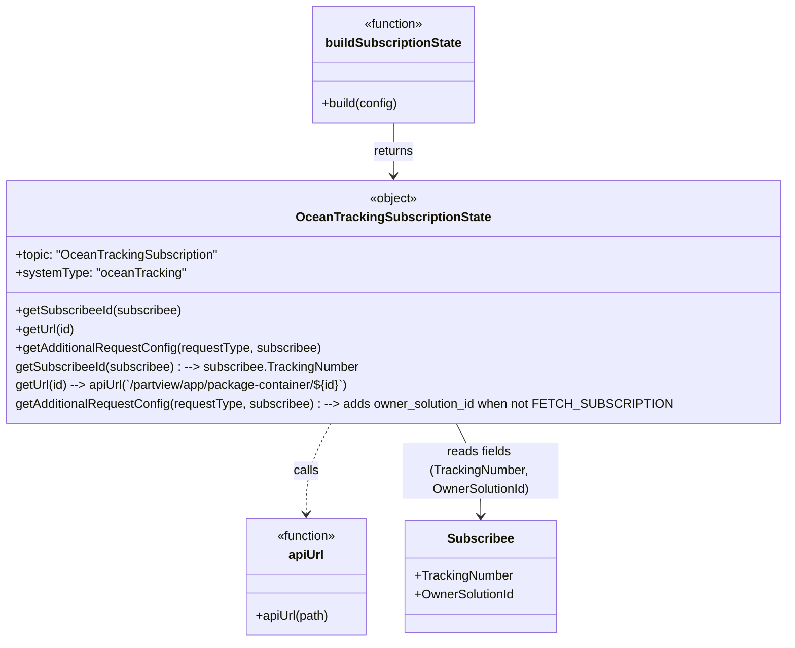

# Diagram: web/portal/src/pages/oceantracking/redux/OceanTrackingSubscriptionState.js

> Auto-generated by Obscura crawlers

## Mermaid

```mermaid
classDiagram
class buildSubscriptionState <<function>> {
  +build(config)
}
class OceanTrackingSubscriptionState <<object>> {
  +topic: "OceanTrackingSubscription"
  +systemType: "oceanTracking"
  +getSubscribeeId(subscribee)
  +getUrl(id)
  +getAdditionalRequestConfig(requestType, subscribee)
}
class apiUrl <<function>> {
  +apiUrl(path)
}
class Subscribee {
  +TrackingNumber
  +OwnerSolutionId
}
buildSubscriptionState --> OceanTrackingSubscriptionState : returns
OceanTrackingSubscriptionState ..> apiUrl : calls
OceanTrackingSubscriptionState --> Subscribee : reads fields (TrackingNumber, OwnerSolutionId)
OceanTrackingSubscriptionState : getSubscribeeId(subscribee) --> subscribee.TrackingNumber
OceanTrackingSubscriptionState : getUrl(id) --> apiUrl(`/partview/app/package-container/${id}`)
OceanTrackingSubscriptionState : getAdditionalRequestConfig(requestType, subscribee) --> adds owner_solution_id when not FETCH_SUBSCRIPTION
```

> SVG rendering failed for this diagram.
